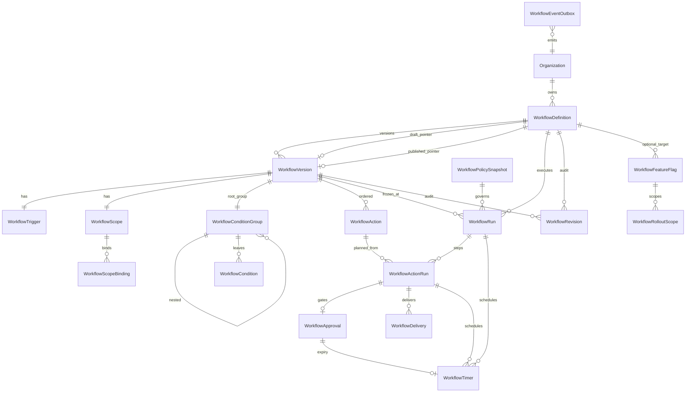
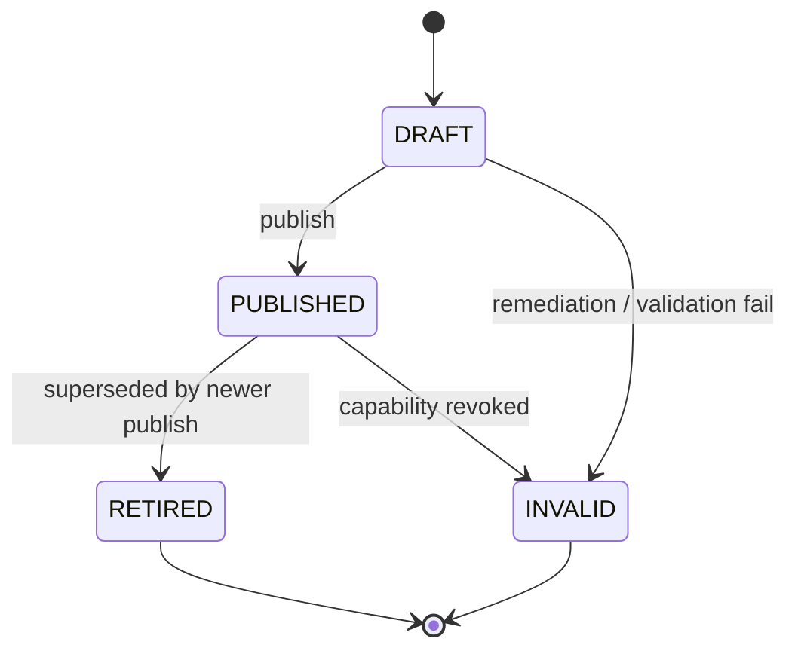
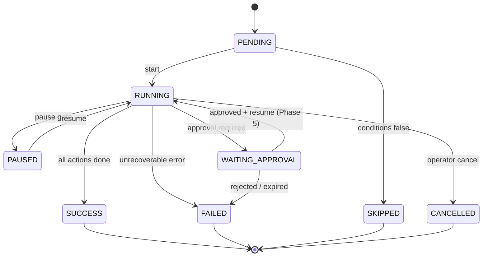
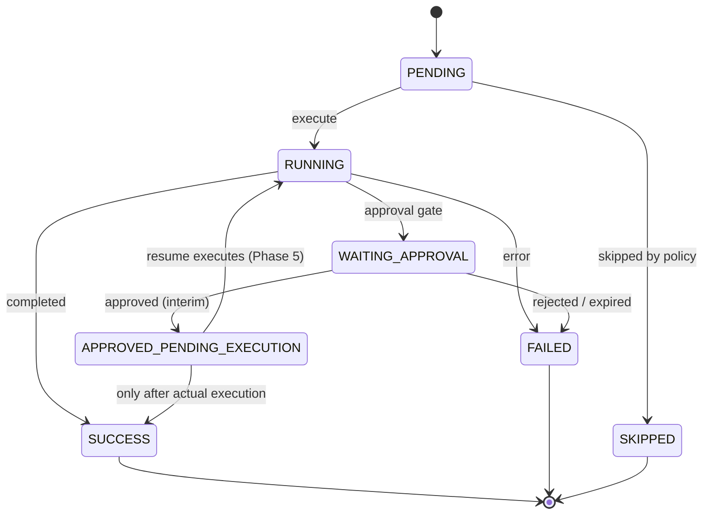
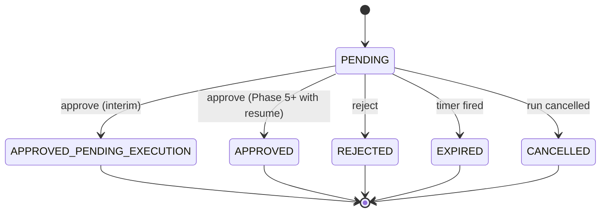

# SynqDrive Workflow Runtime — Canonical Data Model (Phase 3)

**Date:** 2026-07-25  
**Status:** Design / ADR — **no Prisma migration in this prompt**  
**Inputs:** `docs/architecture/WORKFLOW_ACTION_CAPABILITIES_2026-07.md`, approval interim safeguards (`docs/security/workflow-approval-interim-safeguards-2026-07.md`), current `org_workflow*` tables (`20260616140000`, `20260725120000`, `20260725130000`)

## 1. Goals

Design the **canonical, tenant-scoped workflow runtime data model** that:

1. Separates **logical identity** (`WorkflowDefinition`) from **immutable published configuration** (`WorkflowVersion`).
2. Supports **pause-and-resume** (Phase 5), **approval gates**, **delivery tracking**, **durable events**, and **timers** without JSON-only query paths where constraints matter.
3. Preserves **auditability** — every `WorkflowRun` binds to a version, a policy snapshot, and a frozen definition snapshot.
4. Avoids **cascade deletes** on revision- or runtime-relevant data.
5. Enables safe migration from today's `org_workflows` / `org_workflow_runs` MVP tables.

### Non-goals (this document)

- Prisma schema changes or SQL migrations
- Executor / engine implementation
- UI redesign

---

## 2. Design principles

| Principle | Rule |
|-----------|------|
| Tenant isolation | `organizationId` on every tenant-relevant table; runtime rows never rely on transitive org resolution alone |
| Immutable versions | `WorkflowVersion` rows in `PUBLISHED` / `RETIRED` / `INVALID` are append-only; edits create a new draft version |
| Run immutability | `WorkflowRun.definitionSnapshot` + `WorkflowPolicySnapshot` are written once at run start and never updated |
| Queryable core | Trigger type, scope bindings, condition paths, action type, run status, idempotency keys, expiry times → **columns or child tables**, not opaque JSON |
| JSON allowed | Version-bound action `config`, full definition snapshot, policy snapshot payload, delivery `payloadRef` |
| No secrets in delivery | Provider tokens, API keys, raw webhook secrets → **never** stored in `WorkflowDelivery` |
| FK delete policy | `ON DELETE RESTRICT` (or `SET NULL` for optional actor refs) on definition/version/run lineage; **no `CASCADE`** on runtime history |
| Idempotency | Separate keys at run level and action-run level; outbox and timer rows also keyed |

---

## 3. Entity relationship diagram

---

## 4. Model catalogue

Legend for tables below:

- **PII:** fields that may contain personal data
- **Retention:** recommended production retention class
- **Delete:** hard / soft / restrict behavior

---

### 4.1 `WorkflowDefinition`

| Attribute | Value |
|-----------|-------|
| **Purpose** | Logical workflow identity within a tenant (name, category, lifecycle pointers). Does **not** embed executable config. |
| **PK** | `id` UUID |
| **organizationId** | Required; tenant scope |
| **FKs** | `draftVersionId` → `WorkflowVersion` (nullable), `publishedVersionId` → `WorkflowVersion` (nullable), `createdByUserId` / `updatedByUserId` → `User` (`SET NULL`) |
| **Status** | `DefinitionLifecycleStatus`: `ACTIVE`, `ARCHIVED` |
| **Timestamps** | `createdAt`, `updatedAt`, `archivedAt` |
| **Versioning** | Points to draft/published `WorkflowVersion`; monotonic `versionCounter` (next version number allocator) |
| **Unique** | `(organizationId, slug)` where `archivedAt IS NULL`; optional `(organizationId, name)` partial unique if slug not used |
| **Indexes** | `(organizationId)`, `(organizationId, lifecycleStatus)`, `(organizationId, category)` |
| **Idempotency** | N/A (identity table) |
| **Retention** | Permanent while org exists; archive instead of delete |
| **PII** | `name`, `description` — low sensitivity |
| **Delete / archive** | Soft-archive (`ARCHIVED`); hard delete **forbidden** if any `WorkflowRun` exists |
| **Immutable fields** | `id`, `organizationId`, `createdAt`, `createdByUserId` |
| **Status transitions** | `ACTIVE → ARCHIVED` (one-way unless explicit restore); no delete |

**Columns (proposed):** `id`, `organizationId`, `slug`, `name`, `description`, `category`, `lifecycleStatus`, `isTemplate`, `draftVersionId`, `publishedVersionId`, `versionCounter`, `triggerCount`, `lastTriggeredAt`, `remediationRequired`, `remediationReason`, `remediationDetectedAt`, `createdByUserId`, `updatedByUserId`, `archivedAt`, `createdAt`, `updatedAt`

**Maps from legacy:** `org_workflows` header fields (name, description, category, counters, remediation flags). JSON blobs move to version children.

---

### 4.2 `WorkflowVersion`

| Attribute | Value |
|-----------|-------|
| **Purpose** | Versioned, publishable workflow configuration. **Immutable after `PUBLISHED`.** |
| **PK** | `id` UUID |
| **organizationId** | Required (denormalized for tenant guards) |
| **FKs** | `workflowDefinitionId` → `WorkflowDefinition` (`RESTRICT`), `publishedByUserId` → `User` (`SET NULL`), `supersedesVersionId` → self (`SET NULL`) |
| **Status** | `VersionStatus`: `DRAFT`, `PUBLISHED`, `RETIRED`, `INVALID` |
| **Timestamps** | `createdAt`, `updatedAt`, `publishedAt`, `retiredAt`, `invalidatedAt` |
| **Versioning** | `versionNumber` INT monotonic per definition; `contentHash` SHA-256 of normalized graph |
| **Unique** | `(organizationId, workflowDefinitionId, versionNumber)`; `(workflowDefinitionId, contentHash)` optional dedup |
| **Indexes** | `(organizationId, workflowDefinitionId, status)`, `(workflowDefinitionId, versionNumber DESC)`, `(contentHash)` |
| **Idempotency** | Publish operation keyed by `(workflowDefinitionId, contentHash)` to prevent double-publish |
| **Retention** | Permanent (audit + run binding) |
| **PII** | None in version row; child action configs may reference entity IDs |
| **Delete** | **Forbidden** once `PUBLISHED`; `DRAFT` deletable only if never published and no runs |
| **Immutable after publish** | All columns except `status` transition to `RETIRED`/`INVALID` and `retiredAt`/`invalidatedAt` |
| **Status transitions** | `DRAFT → PUBLISHED → RETIRED`; `DRAFT|PUBLISHED → INVALID` (remediation); no return to `DRAFT` |

**Snapshot column:** `definitionSnapshot` JSONB — frozen normalized graph (trigger, scope, conditions, actions) written at publish; used for run binding and drift detection.

---

### 4.3 `WorkflowTrigger`

| Attribute | Value |
|-----------|-------|
| **Purpose** | Canonical trigger binding for a version (event type + config). |
| **PK** | `id` UUID |
| **organizationId** | Required |
| **FKs** | `workflowVersionId` → `WorkflowVersion` (`RESTRICT`) — **1:1** |
| **Status** | N/A (version lifecycle applies) |
| **Timestamps** | `createdAt` |
| **Versioning** | Tied to version; replaced only via new version |
| **Unique** | `(workflowVersionId)` |
| **Indexes** | `(organizationId, triggerType)` for engine matching; `(organizationId, triggerType, lifecycle via join)` |
| **Idempotency** | N/A |
| **Retention** | Permanent with version |
| **PII** | `config` may contain entity IDs |
| **Delete** | `RESTRICT` |
| **Immutable after publish** | `triggerType`, `config`, `legacyTriggerKey` |

**Columns:** `triggerType` (canonical, indexed), `legacyTriggerKey` (nullable), `config` JSONB (version-bound)

**Why not JSON-only on version:** Engine must query `ACTIVE` workflows by `(organizationId, triggerType)` without scanning JSON.

---

### 4.4 `WorkflowScope`

| Attribute | Value |
|-----------|-------|
| **Purpose** | Declares scope **type** for a version (`ORGANIZATION`, `STATION`, `VEHICLE`). |
| **PK** | `id` UUID |
| **organizationId** | Required |
| **FKs** | `workflowVersionId` → `WorkflowVersion` (`RESTRICT`) — **1:1** |
| **Status** | N/A |
| **Timestamps** | `createdAt` |
| **Unique** | `(workflowVersionId)` |
| **Indexes** | `(organizationId, scopeType)` |

**Child:** `WorkflowScopeBinding` (see §4.5) holds normalized station/vehicle IDs.

---

### 4.5 `WorkflowScopeBinding`

| Attribute | Value |
|-----------|-------|
| **Purpose** | Normalized scope membership for queryable matching (replaces `scope.stationIds[]` JSON). |
| **PK** | `id` UUID |
| **organizationId** | Required |
| **FKs** | `workflowScopeId` → `WorkflowScope` (`RESTRICT`) |
| **Status** | N/A |
| **Timestamps** | `createdAt` |
| **Unique** | `(workflowScopeId, bindingType, bindingId)` |
| **Indexes** | `(organizationId, bindingType, bindingId)` — **critical** for event→workflow resolution |
| **PII** | `bindingId` references operational entities |
| **Delete** | `RESTRICT` |

**Columns:** `bindingType` (`STATION` | `VEHICLE`), `bindingId` UUID/text

---

### 4.6 `WorkflowConditionGroup` + `WorkflowCondition` (condition tree)

#### `WorkflowConditionGroup`

| Attribute | Value |
|-----------|-------|
| **Purpose** | Boolean group node (`AND` / `OR`) forming a condition tree per version. |
| **PK** | `id` UUID |
| **organizationId** | Required |
| **FKs** | `workflowVersionId` → `WorkflowVersion` (`RESTRICT`), `parentGroupId` → self (`RESTRICT`, nullable for root) |
| **Status** | N/A |
| **Unique** | One root per version: `(workflowVersionId)` WHERE `parentGroupId IS NULL` (partial unique) |
| **Indexes** | `(workflowVersionId)`, `(parentGroupId)` |
| **Immutable after publish** | `logicOperator`, tree structure |

**Columns:** `logicOperator` (`AND` | `OR`), `sortOrder`

#### `WorkflowCondition`

| Attribute | Value |
|-----------|-------|
| **Purpose** | Leaf predicate (path, operator, typed value). |
| **PK** | `id` UUID |
| **organizationId** | Required |
| **FKs** | `conditionGroupId` → `WorkflowConditionGroup` (`RESTRICT`) |
| **Status** | N/A |
| **Unique** | `(conditionGroupId, sortOrder)` |
| **Indexes** | `(organizationId, fieldPath, operator)` optional analytics; `(conditionGroupId)` |
| **Immutable after publish** | All predicate columns |

**Columns (queryable):**

| Column | Use |
|--------|-----|
| `fieldPath` | Normalized path, e.g. `payload.severity` (replaces legacy `field`) |
| `operator` | Enum: `equals`, `notEquals`, `in`, `gt`, `lt`, `isTrue`, `isFalse`, … |
| `valueText` | String / enum comparisons |
| `valueNumber` | Numeric comparisons |
| `valueBoolean` | Boolean comparisons |
| `valueJson` | Complex `in` lists only when typed columns insufficient |
| `sortOrder` | Evaluation order within group |

**MVP mapping:** Current flat `conditions[]` → single root `AND` group with leaf rows.

---

### 4.7 `WorkflowAction`

| Attribute | Value |
|-----------|-------|
| **Purpose** | Ordered action step in a version (type, approval flag, config). |
| **PK** | `id` UUID |
| **organizationId** | Required |
| **FKs** | `workflowVersionId` → `WorkflowVersion` (`RESTRICT`) |
| **Status** | `capabilityStatusAtPublish` denormalized (`AVAILABLE`, `DISABLED`, …) for audit |
| **Timestamps** | `createdAt` |
| **Unique** | `(workflowVersionId, actionIndex)`; `(workflowVersionId, actionKey)` where `actionKey` is stable UUID per step |
| **Indexes** | `(organizationId, actionType)`, `(workflowVersionId, actionIndex)` |
| **Idempotency** | `actionKey` stable across draft edits until publish |
| **Retention** | Permanent with version |
| **PII** | `config` may hold message templates, customer refs |
| **Delete** | `RESTRICT` |
| **Immutable after publish** | `actionType`, `actionIndex`, `requiresApproval`, `config`, `actionKey` |

---

### 4.8 `WorkflowRun`

| Attribute | Value |
|-----------|-------|
| **Purpose** | Single execution instance of a workflow for a domain event. |
| **PK** | `id` UUID |
| **organizationId** | Required |
| **FKs** | `workflowDefinitionId` → `WorkflowDefinition` (`RESTRICT`), `workflowVersionId` → `WorkflowVersion` (`RESTRICT`), `policySnapshotId` → `WorkflowPolicySnapshot` (`RESTRICT`), `triggeredByUserId` → `User` (`SET NULL`) |
| **Status** | `RunStatus`: `PENDING`, `RUNNING`, `PAUSED`, `WAITING_APPROVAL`, `SUCCESS`, `FAILED`, `SKIPPED`, `CANCELLED` |
| **Timestamps** | `createdAt`, `startedAt`, `finishedAt`, `pausedAt`, `lastResumedAt` |
| **Versioning** | Frozen `workflowVersionId` + `versionNumber` denormalized |
| **Unique** | `(organizationId, idempotencyKey)` |
| **Indexes** | `(organizationId, workflowDefinitionId, createdAt DESC)`, `(organizationId, status, createdAt)`, `(organizationId, entityType, entityId)`, `(workflowVersionId)`, `(correlationId)` |
| **Idempotency** | `idempotencyKey` required (engine-composed from event + definition) |
| **Retention** | Hot 90d; archive 1y+; legal hold may extend |
| **PII** | `inputPayload`, `definitionSnapshot` — may contain customer/vehicle/booking data |
| **Delete** | **No hard delete** in normal ops; anonymize on DSAR via retention job |
| **Immutable fields** | `workflowDefinitionId`, `workflowVersionId`, `policySnapshotId`, `definitionSnapshot`, `idempotencyKey`, `eventType`, `entityType`, `entityId`, `createdAt` |
| **Status transitions** | See §6.1 |

**Snapshot columns:**

- `definitionSnapshot` JSONB — full published graph at run start
- `inputPayload` JSONB — domain event payload
- `conditionResult` JSONB — evaluation audit

---

### 4.9 `WorkflowActionRun`

| Attribute | Value |
|-----------|-------|
| **Purpose** | Execution unit for one action step within a run. |
| **PK** | `id` UUID |
| **organizationId** | Required |
| **FKs** | `workflowRunId` → `WorkflowRun` (`RESTRICT`), `workflowActionId` → `WorkflowAction` (`SET NULL` if version retired), `workflowDefinitionId` / `workflowVersionId` denormalized (`RESTRICT`) |
| **Status** | `ActionRunStatus`: `PENDING`, `RUNNING`, `WAITING_APPROVAL`, `APPROVED_PENDING_EXECUTION`, `SUCCESS`, `FAILED`, `SKIPPED`, `CANCELLED` |
| **Timestamps** | `createdAt`, `startedAt`, `finishedAt`, `approvedAt` |
| **Unique** | `(workflowRunId, actionIndex)`; `(organizationId, idempotencyKey)` |
| **Indexes** | `(organizationId, status)`, `(workflowRunId, actionIndex)`, `(workflowActionId)` |
| **Idempotency** | **Own** `idempotencyKey` per action (e.g. `{runIdempotencyKey}:action:{actionIndex}`) |
| **Retention** | Same as parent run |
| **PII** | `input`, `output` JSON |
| **Delete** | `RESTRICT` |
| **Immutable fields** | `actionIndex`, `actionType`, `idempotencyKey`, `requiresApproval` |
| **Status transitions** | See §6.2 |

**Denormalized:** `actionType`, `actionIndex`, `requiresApproval` — survive `workflowActionId` nulling.

---

### 4.10 `WorkflowApproval`

| Attribute | Value |
|-----------|-------|
| **Purpose** | Human decision gate for exactly one waiting `WorkflowActionRun`. |
| **PK** | `id` UUID |
| **organizationId** | Required |
| **FKs** | `workflowRunId` → `WorkflowRun` (`RESTRICT`), `actionRunId` → `WorkflowActionRun` (`RESTRICT`) — **1:1** |
| **Status** | `ApprovalStatus`: `PENDING`, `APPROVED`, `APPROVED_PENDING_EXECUTION`, `REJECTED`, `EXPIRED`, `CANCELLED` |
| **Timestamps** | `createdAt`, `expiresAt`, `decidedAt` |
| **Unique** | `(actionRunId)` — **exactly one approval per action run**; `(workflowRunId, actionRunId)` |
| **Indexes** | `(organizationId, status, expiresAt)` for expiry sweeper; `(organizationId, workflowRunId)` |
| **Idempotency** | Decision keyed by `(actionRunId, decisionAttempt)` or optimistic `updateMany` on `PENDING` |
| **Retention** | Same as run (audit) |
| **PII** | `decidedByName`, `reason` / comment |
| **Delete** | `RESTRICT` |
| **Immutable after decision** | `actionRunId`, `workflowRunId`, `createdAt`, `requestedPolicy` |
| **Status transitions** | See §6.3 |

**Columns:** `requestedBySystem`, `approverRoleScope`, `approvedByUserId`, `decidedByName`, `reason`, `requestedPolicy` JSONB (roles, not secrets)

**Rule:** Approval references **the waiting `actionRunId`**, never a loose workflow reference.

---

### 4.11 `WorkflowDelivery`

| Attribute | Value |
|-----------|-------|
| **Purpose** | Provider-level delivery state for outbound effects (email, SMS, webhook, notification handoff). |
| **PK** | `id` UUID |
| **organizationId** | Required |
| **FKs** | `actionRunId` → `WorkflowActionRun` (`RESTRICT`), optional `notificationId`, `outboundEmailId` |
| **Status** | `DeliveryStatus`: `PENDING`, `SUBMITTED`, `DELIVERED`, `FAILED`, `CANCELLED`, `DEAD_LETTER` |
| **Timestamps** | `createdAt`, `updatedAt`, `submittedAt`, `deliveredAt` |
| **Unique** | `(organizationId, idempotencyKey)` |
| **Indexes** | `(organizationId, status, updatedAt)`, `(actionRunId)`, `(externalReference)` |
| **Idempotency** | `idempotencyKey` per provider submission |
| **Retention** | 90d–1y; strip `lastError` PII after 30d |
| **PII** | `recipientRef` (opaque ID, not email/phone in clear text if avoidable) |
| **Secrets** | **Forbidden** — no API keys, tokens, raw auth headers |
| **Delete** | Soft-archive; no cascade from action run |

**Columns:** `channel` (`EMAIL`|`SMS`|`WHATSAPP`|`WEBHOOK`|`INTERNAL`), `provider`, `externalReference`, `recipientRef`, `payloadRef` JSONB (IDs/links only), `attemptCount`, `lastError` (sanitized)

---

### 4.12 `WorkflowEventOutbox`

| Attribute | Value |
|-----------|-------|
| **Purpose** | Transactional outbox for durable workflow events (trigger ingestion, run lifecycle, integration fan-out). |
| **PK** | `id` UUID |
| **organizationId** | Required |
| **FKs** | Optional `workflowRunId`, `aggregateType` + `aggregateId` polymorphic |
| **Status** | `OutboxStatus`: `PENDING`, `PROCESSING`, `PROCESSED`, `DEAD_LETTER` |
| **Timestamps** | `createdAt`, `updatedAt`, `availableAt`, `processedAt`, `deadLetteredAt` |
| **Unique** | `(organizationId, idempotencyKey)` |
| **Indexes** | `(status, availableAt)`, `(organizationId, eventType, createdAt)`, `(correlationId)` |
| **Idempotency** | `idempotencyKey` from domain event |
| **Retention** | 30d after `PROCESSED`; `DEAD_LETTER` 90d |
| **PII** | `payload` JSON — event-dependent |
| **Delete** | Hard delete after retention |

**Pattern:** Aligns with `BusinessAuditOutbox` / `TaskAutomationOutbox` — worker polls `(status, availableAt)`.

---

### 4.13 `WorkflowTimer`

| Attribute | Value |
|-----------|-------|
| **Purpose** | Scheduled wake-ups: approval expiry, resume delay, retry backoff, scheduled triggers. |
| **PK** | `id` UUID |
| **organizationId** | Required |
| **FKs** | `workflowRunId` (`SET NULL`), `actionRunId` (`SET NULL`), `approvalId` (`SET NULL`) — at least one required |
| **Status** | `TimerStatus`: `SCHEDULED`, `CLAIMED`, `FIRED`, `CANCELLED` |
| **Timestamps** | `createdAt`, `fireAt`, `firedAt`, `cancelledAt` |
| **Unique** | `(organizationId, idempotencyKey)`; `(approvalId)` WHERE `timerType = APPROVAL_EXPIRY` (partial) |
| **Indexes** | `(status, fireAt)` — **scheduler primary**; `(organizationId, workflowRunId)` |
| **Idempotency** | `idempotencyKey` per timer purpose |
| **Retention** | Delete `FIRED` after 7d; `CANCELLED` after 30d |
| **PII** | `payload` may hold resume tokens (opaque, not user PII) |
| **Delete** | Hard delete post-retention |

**Columns:** `timerType` (`APPROVAL_EXPIRY` | `RESUME_DELAY` | `RETRY_BACKOFF` | `SCHEDULED_TRIGGER`), `payload` JSONB

---

### 4.14 `WorkflowRevision` (audit linkage)

| Attribute | Value |
|-----------|-------|
| **Purpose** | Append-only audit trail for definition/version lifecycle; bridges to `BusinessAuditOutbox`. |
| **PK** | `id` UUID |
| **organizationId** | Required |
| **FKs** | `workflowDefinitionId` (`RESTRICT`), `workflowVersionId` (`SET NULL`), `actorUserId` (`SET NULL`), `businessAuditOutboxId` (`SET NULL`) |
| **Status** | N/A (event type driven) |
| **Timestamps** | `occurredAt`, `createdAt` |
| **Unique** | Optional `(businessAuditOutboxId)` |
| **Indexes** | `(organizationId, workflowDefinitionId, occurredAt DESC)`, `(correlationId)` |
| **Retention** | Permanent |
| **Immutable** | All fields append-only |

**Columns:** `revisionType` (`DRAFT_SAVED` | `PUBLISHED` | `RETIRED` | `INVALIDATED` | `REMEDIATION_FLAGGED` | `RESTORED`), `changeReason`, `beforeHash`, `afterHash`, `diffRef`, `correlationId`

---

### 4.15 `WorkflowPolicySnapshot`

| Attribute | Value |
|-----------|-------|
| **Purpose** | Frozen operational policy at run start (capabilities, approval TTL, feature flags, resume support). |
| **PK** | `id` UUID |
| **organizationId** | Required |
| **FKs** | None (immutable value object row) |
| **Status** | N/A |
| **Timestamps** | `capturedAt` |
| **Unique** | `(organizationId, contentHash)` dedup identical snapshots |
| **Indexes** | `(contentHash)` |
| **Retention** | Permanent while referenced by runs |
| **Immutable** | Entire row |

**Columns:** `capabilityRevision`, `approvalResumeSupported`, `approvalTtlHours`, `policyPayload` JSONB, `contentHash`

**Rule:** Every `WorkflowRun` references exactly one `policySnapshotId`.

---

### 4.16 `WorkflowFeatureFlag` + `WorkflowRolloutScope`

#### `WorkflowFeatureFlag`

| Attribute | Value |
|-----------|-------|
| **Purpose** | Controlled rollout of runtime features (`PAUSE_RESUME`, `AI_ACTIONS`, `CHANNEL_DELIVERY`, …). |
| **PK** | `id` UUID |
| **organizationId** | Nullable — `NULL` = platform flag |
| **FKs** | `workflowDefinitionId` optional (`RESTRICT`) |
| **Status** | `enabled` boolean + optional `rolloutPercentage` |
| **Unique** | `(scope, organizationId, workflowDefinitionId, flagKey)` |
| **Indexes** | `(flagKey, enabled)`, `(organizationId, flagKey)` |

**Scope enum:** `PLATFORM` | `ORGANIZATION` | `WORKFLOW_DEFINITION`

#### `WorkflowRolloutScope`

| Attribute | Value |
|-----------|-------|
| **Purpose** | Normalized rollout bindings (station, vehicle group, category) — avoids unqueryable JSON. |
| **PK** | `id` UUID |
| **organizationId** | Required when parent flag is org-scoped |
| **FKs** | `featureFlagId` → `WorkflowFeatureFlag` (`RESTRICT`) |
| **Unique** | `(featureFlagId, scopeType, scopeId)` |
| **Indexes** | `(organizationId, scopeType, scopeId)` |

---

## 5. Status diagrams

### 5.1 `WorkflowVersion`

### 5.2 `WorkflowRun`

**Interim (Phase 2–4):** After approve without resume, run remains `WAITING_APPROVAL`; action run → `APPROVED_PENDING_EXECUTION`.

### 5.3 `WorkflowActionRun`

### 5.4 `WorkflowApproval`

---

## 6. Index strategy

| Query pattern | Index |
|---------------|-------|
| Match workflows for event | `(organizationId, triggerType)` on `WorkflowTrigger` + join to `publishedVersionId` |
| Scope filter | `(organizationId, bindingType, bindingId)` on `WorkflowScopeBinding` |
| List runs for workflow | `(organizationId, workflowDefinitionId, createdAt DESC)` |
| Ops dashboard by status | `(organizationId, status, createdAt)` on `WorkflowRun` |
| Approval expiry sweep | `(organizationId, status, expiresAt)` on `WorkflowApproval` WHERE `PENDING` |
| Timer dispatcher | `(status, fireAt)` on `WorkflowTimer` |
| Outbox worker | `(status, availableAt)` on `WorkflowEventOutbox` |
| Idempotency lookups | Unique indexes on `(organizationId, idempotencyKey)` per idempotent table |
| Entity-centric audit | `(organizationId, entityType, entityId)` on `WorkflowRun` |

**Partial indexes (recommended):**

- `workflow_definitions (organizationId, slug) WHERE archivedAt IS NULL`
- `workflow_approvals (organizationId, expiresAt) WHERE status = 'PENDING'`
- `workflow_versions (workflowDefinitionId) WHERE status = 'PUBLISHED'`

---

## 7. Unique constraint strategy

| Constraint | Rationale |
|------------|-----------|
| `(organizationId, idempotencyKey)` on runs, action runs, outbox, timers, deliveries | Prevent duplicate side effects under retry |
| `(workflowVersionId, actionIndex)` | One row per step per version |
| `(actionRunId)` on approvals | Exactly one approval record per gated action |
| `(organizationId, workflowDefinitionId, versionNumber)` | Monotonic versioning |
| `(workflowScopeId, bindingType, bindingId)` | No duplicate scope bindings |
| `(organizationId, contentHash)` on policy snapshots | Dedup identical policy captures |
| One root condition group per version | Partial unique on `parentGroupId IS NULL` |

---

## 8. Migration strategy (from current `org_workflow*`)

### Phase A — Additive (no breaking changes)

1. Create new tables alongside `org_workflows`, `org_workflow_runs`, `org_workflow_action_runs`, `org_workflow_approvals`.
2. Dual-write: on workflow save → write `WorkflowDefinition` + draft `WorkflowVersion` graph **and** legacy `org_workflows` JSON (adapter period).
3. Dual-read: engine prefers new tables when `workflowDefinition.publishedVersionId` present.

### Phase B — Backfill

See §9.

### Phase C — Cutover

1. Flip engine to new tables only.
2. Mark legacy tables read-only.
3. Deprecate JSON columns on `org_workflows` after one release.

### Phase D — Legacy retirement

1. Rename `org_workflows` → `org_workflows_legacy` (archive).
2. Remove dual-write adapters.

**FK migration:** Replace `ON DELETE CASCADE` on runs with `RESTRICT` in new tables. Legacy tables keep cascade until retirement.

---

## 9. Backfill plan

| Legacy source | Target | Notes |
|---------------|--------|-------|
| `org_workflows` row | `WorkflowDefinition` + `WorkflowVersion` v1 | Parse JSON → trigger/scope/conditions/actions children; `status=ACTIVE` → publish v1 |
| `org_workflows.version` | `WorkflowVersion.versionNumber` | Preserve integer |
| `org_workflows.trigger` JSON | `WorkflowTrigger` | `normalizeTriggerType()` |
| `org_workflows.scope` JSON | `WorkflowScope` + `WorkflowScopeBinding[]` | Explode arrays |
| `org_workflows.conditions` JSON | `WorkflowConditionGroup` + `WorkflowCondition[]` | Root AND group |
| `org_workflows.actions` JSON | `WorkflowAction[]` | Preserve index order |
| `org_workflow_runs` | `WorkflowRun` | Map statuses; build `definitionSnapshot` from version or legacy JSON |
| `org_workflow_action_runs` | `WorkflowActionRun` | Generate `idempotencyKey` if missing: `{runKey}:action:{index}` |
| `org_workflow_approvals` | `WorkflowApproval` | Preserve `APPROVED_PENDING_EXECUTION` |
| — | `WorkflowPolicySnapshot` | Insert per distinct `(capabilityRevision, approvalResumeSupported)` combo; link runs |
| `remediation_*` flags | `WorkflowDefinition` + version `INVALID` | Invalid version, not definition delete |

**Validation gates:**

- Row counts match per org (runs, action runs, approvals)
- Hash of normalized definition matches `contentHash`
- Sample replay: 100 random runs have consistent action counts

**Order:** Definitions → versions → runs → action runs → approvals → policy snapshots

---

## 10. Rollback plan

| Stage | Rollback action |
|-------|-----------------|
| Phase A (additive only) | Stop dual-write; engine reads legacy only — **no data loss** |
| Phase B (backfill complete) | Truncate new tables; legacy remains source of truth |
| Phase C (cutover) | Feature flag `WORKFLOW_RUNTIME_V2=false`; revert engine to legacy reads; new runs may need reconciliation script |
| Phase D (legacy dropped) | **Not reversible without restore from backup** — require backup + freeze window |

**Required safeguards before Phase C:**

- DB backup snapshot
- `WORKFLOW_RUNTIME_V2` org-scoped feature flag
- Reconciliation report: runs in new vs old tables

---

## 11. Retention & privacy summary

| Entity | Default retention | PII fields | DSAR handling |
|--------|-------------------|------------|---------------|
| Definition / Version | Permanent | name, description | Anonymize name on request |
| Run / ActionRun | 90d hot → 1y archive | inputPayload, input, output | Pseudonymize payload fields |
| Approval | With run | decidedByName, reason | Redact reason text |
| Delivery | 90d | recipientRef | Delete row |
| Outbox | 30d post-processed | payload | Delete row |
| Timer | 7d post-fired | payload | Delete row |
| PolicySnapshot | While referenced | none | N/A |

---

## 12. Open questions

| # | Question | Options | Recommendation |
|---|----------|---------|----------------|
| OQ-1 | Slug vs name unique? | `(org, slug)` vs `(org, name)` | Add optional `slug`; unique `(org, slug)` when set |
| OQ-2 | Condition tree depth limit? | Fixed AND-only vs arbitrary tree | MVP: single AND root; schema supports nesting for Phase 4+ |
| OQ-3 | `WorkflowActionRun.workflowActionId` on version retire? | `SET NULL` vs keep FK | `SET NULL` + denormalized `actionType`/`actionIndex` (proposed) |
| OQ-4 | Share `BusinessAuditOutbox` vs workflow-only revision? | Single outbox vs dual | Dual: `WorkflowRevision` + optional `businessAuditOutboxId` link |
| OQ-5 | Per-org vs global policy snapshots? | Dedup across orgs | Dedup within org only (`organizationId, contentHash`) |
| OQ-6 | Run pause state persistence? | `PAUSED` on run only vs separate checkpoint table | `PAUSED` + `WorkflowTimer` for resume; Phase 5 may add `WorkflowRunCheckpoint` |
| OQ-7 | Table naming prefix | `workflow_*` vs `org_workflow_*` | New canonical: `workflow_*`; legacy `org_workflow_*` until retirement |
| OQ-8 | Cross-workflow idempotency | Event-level key shared across definitions | Keep per-definition suffix: `{eventKey}:workflow:{definitionId}` (current behavior) |
| OQ-9 | Delivery vs notification module boundary | Store in workflow vs reference `Notification` only | `payloadRef` + `notificationId`; no duplicate body storage |
| OQ-10 | When to enforce `RESTRICT` deletes on org offboarding? | Block org delete vs archive workflows first | Archive all definitions → async purge job after retention |

---

## 13. Mapping from interim safeguards (Phase 2)

The approval interim model (`APPROVED_PENDING_EXECUTION`, 72h TTL, no auto-success) maps directly:

- `WorkflowApproval.status = APPROVED_PENDING_EXECUTION`
- `WorkflowActionRun.status = APPROVED_PENDING_EXECUTION`
- `WorkflowRun.status = WAITING_APPROVAL` until Phase 5 resume
- `WorkflowPolicySnapshot.approvalResumeSupported = false` until Phase 5
- `WorkflowTimer` with `timerType = APPROVAL_EXPIRY` replaces inline expiry transaction

Activation block for approval-gated workflows becomes a **publish-time check** against `WorkflowPolicySnapshot` + `WorkflowFeatureFlag(PAUSE_RESUME)`.

---

## 14. Document history

| Version | Date | Author | Change |
|---------|------|--------|--------|
| 1.0 | 2026-07-25 | Phase 3 Prompt 9 | Initial canonical data model design |
| 2.0 | 2026-07-25 | Phase 3 Prompt 10 | Prisma schema + migration `20260725200000_workflow_canonical_runtime` implemented |

---

## 15. Implemented schema (Prompt 10)

### Prisma models → PostgreSQL tables

| Prisma model | Table | Notes |
|--------------|-------|-------|
| `WorkflowDefinition` | `workflow_definitions` | `legacyOrgWorkflowId` bridges to `org_workflows.id` |
| `WorkflowVersion` | `workflow_versions` | Immutable after `PUBLISHED` — service-layer enforced |
| `WorkflowTrigger` | `workflow_triggers` | 1:1 per version |
| `WorkflowScope` | `workflow_scopes` | 1:1 per version |
| `WorkflowScopeBinding` | `workflow_scope_bindings` | Normalized station/vehicle IDs |
| `WorkflowConditionGroup` | `workflow_condition_groups` | Partial unique: one root per version |
| `WorkflowCondition` | `workflow_conditions` | Typed value columns + optional `valueJson` |
| `WorkflowAction` | `workflow_actions` | `config` JSON — no secrets |
| `WorkflowPolicySnapshot` | `workflow_policy_snapshots` | Dedup `(organizationId, contentHash)` |
| `WorkflowRun` | `workflow_runs` | `definitionSnapshot` + `inputPayload` JSON |
| `WorkflowActionRun` | `workflow_action_runs` | Own `idempotencyKey` |
| `WorkflowApproval` | `workflow_approvals` | Unique `actionRunId` |
| `WorkflowDelivery` | `workflow_deliveries` | `payloadRef` IDs only |
| `WorkflowEventOutbox` | `workflow_event_outbox` | Worker index `(status, availableAt)` |
| `WorkflowTimer` | `workflow_timers` | Scheduler index `(status, fireAt)` |
| `WorkflowRevision` | `workflow_revisions` | Optional `businessAuditOutboxId` |
| `WorkflowFeatureFlag` | `workflow_feature_flags` | Partial uniques per scope in SQL |
| `WorkflowRolloutScope` | `workflow_rollout_scopes` | |

### Runtime enums (canonical — distinct from legacy)

| Enum | Used by |
|------|---------|
| `WorkflowDefinitionLifecycleStatus` | `WorkflowDefinition.lifecycleStatus` |
| `WorkflowVersionStatus` | `WorkflowVersion.status` |
| `WorkflowRuntimeRunStatus` | `WorkflowRun.status` |
| `WorkflowRuntimeActionRunStatus` | `WorkflowActionRun.status` |
| `WorkflowRuntimeApprovalStatus` | `WorkflowApproval.status` |
| `WorkflowDeliveryStatus` | `WorkflowDelivery.status` |
| `WorkflowEventOutboxStatus` | `WorkflowEventOutbox.status` |
| `WorkflowTimerStatus` | `WorkflowTimer.status` |

Legacy enums (`WorkflowStatus`, `WorkflowRunStatus`, `WorkflowActionRunStatus`, `WorkflowApprovalStatus`) remain on deprecated `org_workflow*` models.

### Legacy models (deprecated, retained)

| Model | Table | Status |
|-------|-------|--------|
| `OrgWorkflow` | `org_workflows` | `@deprecated` — still used by live engine |
| `OrgWorkflowRun` | `org_workflow_runs` | `@deprecated` |
| `OrgWorkflowActionRun` | `org_workflow_action_runs` | `@deprecated` |
| `OrgWorkflowApproval` | `org_workflow_approvals` | `@deprecated` |

### Migration

- **Name:** `20260725200000_workflow_canonical_runtime`
- **Type:** Additive `CREATE TABLE` / `CREATE TYPE` only
- **Rollback doc:** `backend/prisma/migrations/20260725200000_workflow_canonical_runtime/ROLLBACK.md`
- **Tests:** `backend/src/modules/workflows/workflow-runtime.schema.spec.ts`

### Published-version immutability

Prisma cannot enforce row-level immutability after publish. Enforcement points:

1. Service layer rejects updates to `PUBLISHED`/`RETIRED`/`INVALID` version graph rows.
2. `WorkflowVersion.definitionSnapshot` written once at publish.
3. Optional DB trigger (future) — not in this migration to avoid lock risk on large fleets.

### Definition/version lifecycle (V4.9.818 — implemented)

| Version status | Meaning | Editable graph? | Can trigger new runs? |
|----------------|---------|-----------------|----------------------|
| `DRAFT` | Work in progress | Yes (single draft per definition) | No |
| `PUBLISHED` | Validated, immutable snapshot | No | No (until activated) |
| `ACTIVE` | Live configuration | No — branch new draft | Yes (engine cutover pending) |
| `DISABLED` | Formerly active, stopped | No | No |
| `ARCHIVED` | Retired definition/version | No | No |

**Rules enforced in `WorkflowDefinitionLifecycleService`:**

- Edits only on the current `DRAFT` version (`PATCH .../draft` + `expectedLockVersion`).
- Publish validates trigger, scope, conditions, actions, and capability registry; writes `definitionSnapshot`.
- Activation only from `PUBLISHED`; atomically disables prior `ACTIVE` version and sets `workflow_definitions.active_version_id`.
- Deactivate clears `active_version_id` and sets version `DISABLED` — running runs are not cancelled.
- Archive sets definition `lifecycleStatus=ARCHIVED`, clears draft/active pointers, archives open versions.
- Active workflow changes require `POST .../draft` (branches from active/published source, increments `versionCounter`).
- Every transition appends `WorkflowRevision` (`DRAFT_SAVED`, `PUBLISHED`, `ACTIVATED`, `DEACTIVATED`, `ARCHIVED`).
- Approval-gated workflows may publish but cannot activate until Phase 5 pause-and-resume.

**Migration:** `20260726100000_workflow_lifecycle` — enum extensions, `active_version_id`, `lock_version`, `activated_at`/`disabled_at`/`archived_at`, partial unique index `workflow_versions_one_active_per_definition`.

**REST (parallel to legacy `/workflows`):** `/organizations/:orgId/workflow-definitions` — see `WorkflowDefinitionsController`.

### Runtime run/action status foundation (V4.9.819 — implemented)

**Run statuses:** `PENDING`, `RUNNING`, `WAITING`, `WAITING_FOR_APPROVAL`, `COMPLETED`, `PARTIALLY_COMPLETED`, `FAILED`, `CANCELLED`, `SKIPPED`

**Action run statuses:** `PENDING`, `RUNNING`, `WAITING`, `WAITING_FOR_APPROVAL`, `SUCCEEDED`, `FAILED_RETRYABLE`, `FAILED_PERMANENT`, `CANCELLED`, `SKIPPED`

**Enforcement (`backend/src/modules/workflows/runtime/`):**

- `workflow-runtime-status.transitions.ts` — central allowed-transition matrix + guards
- `workflow-run-status.derivation.ts` — deterministic run status from action runs (`PARTIALLY_COMPLETED` = ≥1 success + ≥1 permanent failure; `SKIPPED` never counts as success)
- `workflow-runtime-status.util.ts` — field rules: `finishedAt` terminal-only, `waitingUntil` only for `WAITING`, `approvalId` only for `WAITING_FOR_APPROVAL`, `attemptCount`/`nextAttemptAt` for retryable failures
- `WorkflowRunRuntimeService` / `WorkflowActionRunRuntimeService` — optimistic `lockVersion`, tenant-scoped repository updates, append-only `WorkflowRuntimeStatusTransition` audit
- Resumable queries for process restart (`listResumable`, `listResumableActionRuns`)

**Migration:** `20260726200000_workflow_runtime_status_foundation`

**Not in this prompt:** engine executor, worker dispatch, HTTP controllers for runtime transitions (services only).

### Execution snapshot (V4.9.820 — implemented)

**Table:** `workflow_execution_snapshots` — 1:1 with `workflow_runs`, append-only, `contentHash` integrity.

**Capture:** `WorkflowExecutionSnapshotService.captureAtRunStart` atomically:
1. Resolves active/published version graph
2. Dedupes/creates `WorkflowPolicySnapshot`
3. Builds structured payload (definition, graph, policies, templates, minimized event)
4. Persists immutable `WorkflowExecutionSnapshot`
5. Binds denormalized `definitionSnapshot` + minimized `inputPayload` on run

**Payload sections:**
- `definition` — definitionId, versionId, versionNumber, publishedAt, contentHash
- `graph` — trigger, scope, condition tree, actions with stable `actionKey`, risk class, permissions
- `policies` — policySnapshotId, capabilityRevision, approval rules, feature flags
- `templates` — extracted templateId/templateVersion from action configs
- `event` — envelope (correlation/causation/idempotency) + minimized payload with entity refs

**PII/secrets:** `workflow-execution-snapshot.sanitize.ts` redacts secret keys; PII fields become entity refs when `entityType`/`entityId` present.

**Read API:** `GET /organizations/:orgId/workflow-runs/:runId/execution-snapshot` — audit-read roles only.

**Migration:** `20260726300000_workflow_execution_snapshot`

**Retention:** export/retention jobs not implemented — payload designed for future archival export.

### JSON field bindings (implemented)

| Field | Model | Purpose | PII / secrets |
|-------|-------|---------|---------------|
| `config` | `WorkflowTrigger`, `WorkflowAction` | Version-bound operational config | Entity IDs only; **no secrets** |
| `definitionSnapshot` | `WorkflowVersion`, `WorkflowRun` | Frozen graph at publish / run start | May reference entity IDs |
| `inputPayload` | `WorkflowRun` | Domain event payload | **PII possible** — minimize at write |
| `conditionResult` | `WorkflowRun` | Evaluation audit | Low |
| `input` / `output` | `WorkflowActionRun` | Action I/O | **PII possible** |
| `requestedPolicy` | `WorkflowApproval` | Approver role metadata | No secrets |
| `policyPayload` | `WorkflowPolicySnapshot` | Frozen capability/feature flags | No secrets |
| `payloadRef` | `WorkflowDelivery` | Notification/email IDs | No bodies/tokens |
| `payload` | `WorkflowEventOutbox`, `WorkflowTimer` | Event/timer opaque data | Event-dependent |
| `valueJson` | `WorkflowCondition` | Complex `in` lists | No secrets |
