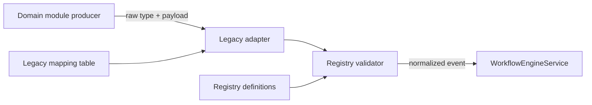

# SynqDrive Workflow Domain Event Registry

**Date:** 2026-07-25  
**Status:** Implemented (Phase 4, Prompt 14)  
**Code:** `backend/src/modules/workflows/registry/`

## 1. Purpose

Central, versioned catalogue of **workflow domain events** — discrete facts and state signals that may trigger automation. This registry is the single source of truth for:

- Event type identity (`booking.returned`, `vehicle.health.warning`, …)
- Semantic versioning (`eventVersion`, default `1.0.0`)
- Payload contracts (required IDs, forbidden PII)
- Legacy adapter mappings (explicit, documented — no silent remapping)

**Events ≠ Commands.** Workflow **actions** (`task.create`, `vehicle.status.update`) remain in `workflow.constants.ts`. Domain events describe what **happened**; actions describe what **should be done**.

---

## 2. Architecture



| Component | File |
|-----------|------|
| Types | `workflow-domain-event-registry.types.ts` |
| Definitions | `workflow-domain-event-registry.definitions.ts` |
| Legacy adapters | `workflow-domain-event-registry.legacy.ts` |
| Registry API | `workflow-domain-event-registry.ts` |
| Payload validator | `workflow-domain-event-registry.validator.ts` |
| Public exports | `index.ts` |

`WorkflowEventService.emitEvent()` validates and normalizes every inbound event before engine dispatch.

---

## 3. Registered events (v1.0.0)

### Booking & handover

| Event | Kind | Producer module |
|-------|------|-----------------|
| `booking.created` | occurred | bookings |
| `booking.confirmed` | occurred | bookings |
| `booking.pickup_due` | state | bookings |
| `booking.pickup_overdue` | state | bookings |
| `booking.picked_up` | occurred | bookings |
| `booking.return_due` | state | bookings |
| `booking.return_overdue` | state | bookings |
| `booking.returned` | occurred | bookings |
| `booking.cancelled` | occurred | bookings |
| `booking.completed` | occurred | bookings (legacy alias) |

### Vehicle health, telematics, geofence, connectivity

| Event | Kind | Producer module |
|-------|------|-----------------|
| `vehicle.health.warning` | state | vehicle-health |
| `vehicle.health.critical` | state | vehicle-health |
| `vehicle.dtc.detected` | occurred | vehicle-health |
| `vehicle.telemetry.soft_offline` | state | telemetry |
| `vehicle.telemetry.offline` | state | telemetry |
| `vehicle.geofence.entered` | occurred | stations |
| `vehicle.geofence.exited` | occurred | stations |
| `vehicle.connectivity.lost` | state | vehicles |
| `vehicle.connectivity.restored` | occurred | vehicles |

### Finance

| Event | Kind | Producer module |
|-------|------|-----------------|
| `invoice.created` | occurred | billing |
| `invoice.due` | state | billing |
| `invoice.overdue` | state | billing |
| `payment.failed` | occurred | billing |

### Customer

| Event | Kind | Producer module |
|-------|------|-----------------|
| `customer.document.expiring` | state | customers |
| `customer.verification.failed` | occurred | customers |
| `customer.complaint.created` | occurred | support |

### Operations

| Event | Kind | Producer module |
|-------|------|-----------------|
| `damage.reported` | occurred | damages |
| `service.due` | state | vehicle-health |
| `task.overdue` | state | tasks |
| `task.created` | occurred | tasks |

### Support & notifications

| Event | Kind | Producer module |
|-------|------|-----------------|
| `support.ticket.created` | occurred | support |
| `support.ticket.escalated` | occurred | support |
| `notification.dispatch.failed` | occurred | notifications |
| `notification.delivered` | occurred | notifications |

### Internal

| Event | Kind | Producer module |
|-------|------|-----------------|
| `manual.test` | occurred | workflows |

**Total:** 36 registered event types.

---

## 4. Versioning

- Each event type exposes one or more semantic versions under `versions`.
- Producers may omit `eventVersion`; the registry default (`1.0.0`) applies.
- Unknown versions are **rejected** with `WorkflowDomainEventRegistryError`.
- Adding breaking payload changes requires a new version entry; existing versions remain valid for historical workflow snapshots.

---

## 5. Payload rules

1. **Entity references only** — UUIDs (`bookingId`, `vehicleId`, …), codes, timestamps.
2. **Forbidden PII** — `email`, `phone`, `name`, `address`, `iban`, `token`, `apiKey`, etc. are rejected at validation.
3. **Closed schema** — keys not listed in `required`, `optional`, or `fields` are rejected.
4. **Type checks** — string, number, boolean, object, array, `iso-date` (ISO-8601).

Example — `booking.returned@1.0.0`:

```json
{
  "bookingId": "uuid",
  "vehicleId": "uuid",
  "stationId": "uuid",
  "handoverProtocolId": "uuid"
}
```

---

## 6. Legacy mapping table

Explicit adapters in `workflow-domain-event-registry.legacy.ts`. Deprecated keys log a warning when emitted via `WorkflowEventService`.

| Legacy key | Canonical event | Notes |
|------------|-----------------|-------|
| `vehicle_returned` | `booking.returned` | MVP UI trigger |
| `manual` | `manual.test` | MVP test trigger |
| `invoice_overdue` | `invoice.overdue` | Snake-case UI key |
| `health_threshold` | `vehicle.health.warning` | Generic threshold |
| `vehicle.dtc.critical` | `vehicle.dtc.detected` | Adds `severity: critical` |
| `booking.completed` | `booking.returned` | Prefer `booking.returned` for handover |
| `fine_created` | `invoice.created` | **Replaces wrong mapping** (see below) |

### Removed wrong mapping

| Legacy key | ❌ Previous (wrong) | ✅ Correct |
|------------|---------------------|------------|
| `fine_created` | `customer.complaint.created` | `invoice.created` with `invoiceKind: 'fine'` |

Traffic fines are financial documents, not customer complaints. `customer.complaint.created` remains a **separate** valid event for actual support complaints.

---

## 7. Usage

```typescript
import {
  validateAndNormalizeWorkflowEvent,
  listWorkflowEventTypes,
  resolveCanonicalEventType,
} from '@modules/workflows/registry';

// Validate before emit (also done inside WorkflowEventService)
const event = validateAndNormalizeWorkflowEvent({
  organizationId: 'org-uuid',
  type: 'booking.returned',
  payload: { bookingId: 'booking-uuid', vehicleId: 'vehicle-uuid' },
});

// Workflow definition trigger normalization
const trigger = resolveCanonicalEventType('vehicle_returned'); // booking.returned
```

---

## 8. Producer wiring status (Phase 4 Prompt 18)

Priority Fachmodule emit via `WorkflowEventOutboxEmitterService` (feature-flagged per group). Legacy `WorkflowEventService.emitEvent()` direct paths are being retired — do not add new direct emitters alongside outbox without an adapter.

### Event source registry (wired producers)

| Event | Source Service | Auslösezeitpunkt | occurrenceId | Outbox | Tests | Rollout-Status |
|-------|----------------|------------------|--------------|--------|-------|----------------|
| `booking.created` | `BookingsService.create` | Atomare Buchungserstellung (`$transaction`) | `booking.created:{bookingId}` | ✅ | `workflow-event-source.spec.ts` | ✅ enabled (`emitBookingLifecycle`) |
| `booking.confirmed` | `BookingsService.update` / `create` | Status → CONFIRMED in Transaktion | `booking.confirmed:{bookingId}` | ✅ | `workflow-event-source.spec.ts` | ✅ enabled |
| `booking.picked_up` | `BookingsHandoverService` PICKUP | Handover-Protokoll Pickup committed | `booking.picked_up:{bookingId}` | ✅ | — | ✅ enabled |
| `booking.returned` | `BookingsHandoverService` RETURN | Handover-Protokoll Return committed | `booking.returned:{bookingId}` | ✅ | `workflow-event-outbox.spec.ts` | ✅ enabled |
| `booking.cancelled` | `BookingsService.cancel` | Cancel in Transaktion | `booking.cancelled:{bookingId}` | ✅ | — | ✅ enabled |
| `booking.pickup_due` | `TaskAutomationService` + `WorkflowBookingTimingEmitterService` | Pickup-Fenster erreicht (Scheduler/Refresh) | `{event}:{bookingId}:{date}` | ✅ | — | ✅ enabled (`emitBookingTiming`) |
| `booking.pickup_overdue` | `TaskAutomationService` + timing emitter | Pickup überfällig | `{event}:{bookingId}:{date}` | ✅ | — | ✅ enabled |
| `booking.return_due` | `TaskAutomationService` + timing emitter | Return-Fenster erreicht | `{event}:{bookingId}:{date}` | ✅ | — | ✅ enabled |
| `booking.return_overdue` | `TaskAutomationService` + timing emitter | Return überfällig | `{event}:{bookingId}:{date}` | ✅ | — | ✅ enabled |
| `vehicle.health.warning` | `BrakeDtcEvidenceProducerService` | WARNING-Schwellwert erkannt | `{event}:{vehicleId}:{findingKey}` | ✅ | — | ✅ enabled (`emitVehicleHealth`) |
| `vehicle.health.critical` | `BrakeDtcEvidenceProducerService` | CRITICAL-Schwellwert erkannt | `{event}:{vehicleId}:{findingKey}` | ✅ | `workflow-event-outbox.fixtures` | ✅ enabled |
| `vehicle.dtc.detected` | `BrakeDtcEvidenceProducerService`, `DimoDtcProcessor` | DTC persistiert / erkannt | `{event}:{vehicleId}:{dtcCode}` | ✅ | — | ✅ enabled (`emitVehicleDtc`) |
| `vehicle.telemetry.soft_offline` | `ConnectivityAlertService.syncRuntimeAlerts` | `signal_delayed` erkannt (Runtime-Projection) | `{event}:{vehicleId}:{freshness}` | ✅ | `workflow-event-source.spec.ts` | ✅ enabled (`emitVehicleTelemetry`) |
| `vehicle.telemetry.offline` | `ConnectivityAlertService.syncRuntimeAlerts` | `offline` / `no_signal` erkannt | `{event}:{vehicleId}:{freshness}` | ✅ | `workflow-event-source.spec.ts` | ✅ enabled |
| `invoice.due` | `InvoicePaymentTaskService` | Fälligkeit erreicht (Task-Materialize) | `{event}:{invoiceId}:{dueDate}` | ✅ | — | ✅ enabled (`emitBilling`) |
| `invoice.overdue` | `StripeWebhookDispatcher`, `InvoiceOverdueScheduler` | Status → OVERDUE atomar | `{event}:{invoiceId}:{dueDate}` | ✅ | `workflow-event-outbox.spec.ts` | ✅ enabled |
| `payment.failed` | `StripeWebhookDispatcher` | Stripe `payment_intent.payment_failed` | `payment.failed:{stripeEventId}` | ✅ | — | ✅ enabled |
| `customer.verification.failed` | `CustomerVerificationService.applyDiditDecision`, `recordManualDocumentReview` | REJECTED/FAILED terminal transition | `customer.verification.failed:{checkId}` | ✅ | `workflow-event-source.spec.ts` | ✅ enabled (`emitCustomer`) |
| `customer.document.expiring` | `CustomerDocumentsService.emitExpiringDocumentEvents` | Täglicher Cron (verified, expires within N days) | `customer.document.expiring:{customerId}:{docId}:{date}` | ✅ | — | ✅ enabled |
| `damage.reported` | `DamagesService.create` | Schaden in Transaktion angelegt | `damage.reported:{damageId}` | ✅ | — | ✅ enabled (`emitDamage`) |
| `service.due` | `ServiceOverdueTaskService.materializeFromSignal` | Service-Insight materialisiert | `{event}:{vehicleId}:{dedupKey}` | ✅ | — | ✅ enabled (`emitService`) |
| `task.overdue` | `TaskAutomationService` pickup/return refresh | Task überfällig erkannt | `{event}:{taskId}:{date}` | ✅ | — | ✅ enabled (`emitTask`) |

### Not yet wired (documented gaps)

| Event | Intended source | Notes |
|-------|-----------------|-------|
| `booking.completed` | — | Legacy alias → prefer `booking.returned` |
| `vehicle.geofence.entered` / `exited` | stations geofence bridge | Geofence shadow → event bridge pending |
| `vehicle.connectivity.lost` / `restored` | fleet connectivity | Distinct from telemetry freshness; pending |
| `invoice.created` | billing create | Not in Prompt 18 priority list |
| `customer.complaint.created` | support module | Out of scope Prompt 18 |
| `task.created` | tasks module | Out of scope Prompt 18 |
| `support.ticket.*` | support module | Pending |
| `notification.dispatch.failed` / `delivered` | notification engine | Bridge pending |

### Parallel legacy paths (controlled)

Notification ingestion (DTC, connectivity alerts, brake critical) may still run alongside outbox while workflows consume outbox events. Disable per-group via `WORKFLOW_EVENT_EMIT_*=false` for gradual rollout. Do not add new direct `WorkflowEventService` producers.

---

## 9. Tests

`backend/src/modules/workflows/registry/workflow-domain-event-registry.spec.ts`

- Minimum required event coverage
- Version rejection
- Legacy adapter behaviour (including `fine_created` correction)
- Payload validation (required fields, PII, unknown keys)
- Past-tense naming for occurred events

---

## 10. Related documents

- `docs/architecture/workflow-automation-data-model-2026-07.md` — runtime data model
- `backend/src/modules/notifications/registry/` — parallel pattern for notification events

## 11. Event envelope (V4.9.822)

Producers should build events via `createWorkflowDomainEventEnvelope()` in `backend/src/modules/workflows/envelope/`. The envelope wraps registry-validated payloads with `eventId`, UTC timestamps, correlation/causation chain, and `source`. Rejections produce structured dead-letter payloads — never silent drops.

## 12. Transactional outbox (V4.9.823)

Domain events that trigger workflow automation must be written via `WorkflowEventOutboxEnqueueService.enqueueInTransaction(tx, …)` in the **same** Prisma transaction as the business mutation.

- Table: `workflow_event_outbox` — stores full canonical envelope JSON + indexed columns
- Status lifecycle: `PENDING` → `CLAIMED` → `DISPATCHED` | `RETRY_SCHEDULED` | `DEAD_LETTER`
- Idempotency: `@@unique([organizationId, idempotencyKey])` + global `eventId`
- First wired producers: bookings lifecycle/timing, billing invoice/payment, vehicle-health/DTC/telemetry, customers verification/documents, damages, service, tasks (see §8 source table)
- Dispatch worker: **V4.9.827** (Prompt 17) — BullMQ `workflow.event.outbox`
