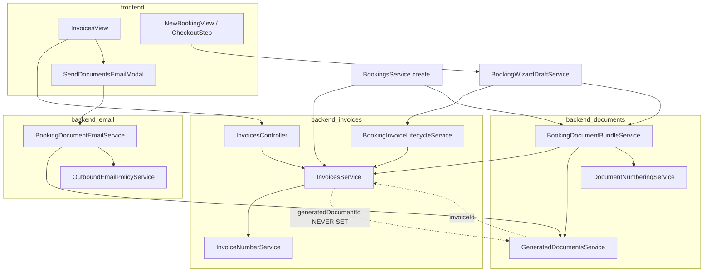

# SynqDrive — Ist-Analyse: Rechnungsfunktion (OrgInvoice)

**Datum:** 2026-07-14  
**Repository:** `SYNQDRIVE-alpha`  
**Scope:** Vollständige technische Bestandsaufnahme der Mandanten-Rechnungsfunktion (`OrgInvoice`). Keine Implementierung, keine Migration.  
**Hinweis:** `supplierId` existiert im Codebase **nicht**; Lieferantenbezug läuft über `vendorId` / `vendorName`.

---

## 1. Executive Summary

SynqDrive trennt zwei Rechnungswelten:

| Domäne | Modell | Zweck |
|--------|--------|-------|
| **Mandanten-Kundenrechnungen** | `OrgInvoice` | Ausgangs-/Eingangsrechnungen des Vermieters gegenüber Kunden/Lieferanten |
| **SaaS-Plattformabrechnung** | `BillingInvoice` | Stripe-Abrechnung Organisation → SynqDrive (eigenes Modul `billing/`) |

Die operative Rechnungsfunktion für Vermieter ist **backend-seitig funktional** (CRUD, Nummerierung, Zahlungen, Buchungs-Lifecycle), aber **frontend-seitig und dokumentenseitig fragmentiert**:

- PDF-Generierung läuft über `BookingDocumentBundle` → `GeneratedDocument.invoiceId`, **nicht** über `OrgInvoice.generatedDocumentId` (Feld wird nie beschrieben).
- E-Mail-Versand ist **buchungszentriert** (`POST .../bookings/:bookingId/documents/send-email`); `OutboundEmail.invoiceId` und `OutboundEmailSourceType.INVOICE_SINGLE` sind Schema-Enums **ohne produktive Verwendung**.
- Die Rechnungsdetail-UI (`InvoicesView`) zeigt technische IDs statt aufgelöster Entitäten und kann generierte PDFs nicht öffnen.

---

## 2. Prisma-Modelle und Relationen

### 2.1 Kern: OrgInvoice

**Datei:** `backend/prisma/schema.prisma` (ca. Zeilen 3946–4072)

```prisma
enum OrgInvoiceType {
  OUTGOING_BOOKING | OUTGOING_MANUAL | OUTGOING_FINAL
  INCOMING_VENDOR | INCOMING_UPLOADED
}

enum OrgInvoiceStatus {
  DRAFT | ISSUED | SENT | PARTIALLY_PAID | PAID | OVERDUE
  CANCELLED | CREDITED | VOID
  UPLOADED | NEEDS_REVIEW | APPROVED | BOOKED | REJECTED  // incoming
}

enum InvoicePaymentMethod {
  CASH | BANK_TRANSFER | CARD | STRIPE | OTHER
}
```

**`OrgInvoice`** — relevante Felder und Relationen:

| Feld | Bedeutung |
|------|-----------|
| `organizationId` | Mandant (FK → `Organization`) |
| `type` | Herkunft / Richtung |
| `customerId`, `bookingId`, `vehicleId` | Skalare Links (keine Prisma-Relation zu Customer/Booking/Vehicle) |
| `vendorId` | FK → `Vendor` (Eingangsrechnungen) |
| `lineItems` | JSON-Array der Positionen |
| `subtotalCents`, `taxCents`, `totalCents`, `paidCents`, `outstandingCents` | Summen |
| `invoiceNumberDisplay`, `sequenceYear`, `sequenceNumber` | Ausgangsnummernkreis (`InvoiceNumberService`) |
| `generatedDocumentId` | **Schema-Feld, in Produktivcode nie gesetzt** |
| `documentExtractionId` | KI-Eingangsrechnung |
| `issuedAt`, `sentAt`, `paidAt`, `voidedAt`, … | Lifecycle-Zeitstempel |

**Relationen (Prisma):** `tasks OrgTask[]`, `payments OrgInvoicePayment[]`, `vendor Vendor?`, `organization Organization`.

**Indizes:** `organizationId`, `customerId`, `bookingId`, `status`, `type`, composite `(organizationId, status)`, `(organizationId, invoiceDate)`.

### 2.2 Zahlungen

**`OrgInvoicePayment`** (`schema.prisma` ~3994–4012)

- `invoiceId` → `OrgInvoice` (Cascade)
- `amountCents`, `method` (`InvoicePaymentMethod`), `paidAt`, `reference`, `note`
- `organizationId` indexiert (kein expliziter FK-Constraint auf Organization in Snippet, aber org-scoped writes)

### 2.3 Nummernkreis

**`OrgInvoiceSequence`** — atomarer Zähler pro `(organizationId, sequenceYear)`; genutzt von `InvoiceNumberService.allocate()`.

### 2.4 Dokument-Engine (Buchung)

**`GeneratedDocument`** (`schema.prisma` ~4085–4131)

- `documentType`: u.a. `BOOKING_INVOICE`, `FINAL_INVOICE`
- `invoiceId` — **kanonischer Rückverweis zur Rechnung**
- `bookingId`, `customerId`, `vehicleId` — denormalisierte Links
- `documentNumber` — separates Nummernsystem (`RE-2026-0001` via `DocumentNumberingService`)
- `snapshot` JSON, `objectKey`, `status` (`DRAFT`/`GENERATED`/`SENT`/`VOID`/`FAILED`)

**`BookingDocumentBundle`** (`schema.prisma` ~4158+)

- `bookingId` unique
- Pointer-Spalten: `bookingInvoiceDocumentId`, `finalInvoiceDocumentId`, …
- Status: `PENDING` | `PARTIAL` | `COMPLETE` | `FAILED`

### 2.5 E-Mail

**`OutboundEmail`** (`schema.prisma` ~6144–6183)

- `sourceType`: `BOOKING_DOCUMENTS` | `INVOICE_SINGLE` | `NOTIFICATION` | `TEST`
- `bookingId`, `customerId`, **`invoiceId` (nie befüllt in `booking-document-email.service.ts`)**
- `fromEmail`, `fromName`, `replyToEmail` — aus `OutboundEmailPolicyService.resolveIdentity()`

**`OutboundEmailAttachment`**: `generatedDocumentId` → `GeneratedDocument`

### 2.6 Aufgaben

**`OrgTask`** (`schema.prisma` ~3678–3737)

- `invoiceId` FK → `OrgInvoice`
- `source` / `sourceType` / `dedupKey` für Idempotenz
- Rechnungsbezogene Tasks: `type: INVOICE_REQUIRED`, `category: invoice`, `source: INVOICE`

### 2.7 Abgrenzung: BillingInvoice (SaaS)

**`BillingInvoice`** (`schema.prisma` ~2524) — Stripe-Mirror für Org-Subscription; **kein** `OrgInvoice`; eigene Controller unter `/billing/` und `/admin/billing/`.

---

## 3. Backend-Controller und Endpunkte

### 3.1 OrgInvoice REST API

**Datei:** `backend/src/modules/invoices/invoices.controller.ts`  
**Guards:** `OrgScopingGuard`, `RolesGuard` — **kein** `PermissionsGuard`, **kein** `@RequirePermission('invoices', …)`.

| Methode | Pfad | Service-Methode |
|---------|------|-----------------|
| GET | `/organizations/:orgId/invoices` | `findByOrg` |
| GET | `/organizations/:orgId/invoices/stats` | `getStats` |
| GET | `/organizations/:orgId/invoices/:id` | `findById` |
| GET | `/organizations/:orgId/customers/:customerId/invoices` | `findByCustomer` |
| POST | `/organizations/:orgId/invoices` | `create` |
| PATCH | `/organizations/:orgId/invoices/:id` | `update` |
| POST | `/organizations/:orgId/invoices/:id/issue` | `issue` |
| POST | `/organizations/:orgId/invoices/:id/mark-sent` | `markSent` |
| POST | `/organizations/:orgId/invoices/:id/payments` | `recordPayment` |
| PATCH | `/organizations/:orgId/invoices/:id/pay` | `markPaid` |
| POST | `/organizations/:orgId/invoices/upload` | Legacy-Attachment (kein KI-Pfad) |

### 3.2 Dokumente (PDF)

**Datei:** `backend/src/modules/documents/documents.controller.ts`

| Methode | Pfad |
|---------|------|
| GET | `/organizations/:orgId/bookings/:bookingId/documents` |
| POST | `.../documents/generate-initial-bundle` |
| POST | `.../documents/regenerate/:documentType` |
| GET | `/organizations/:orgId/documents/:documentId/metadata` |
| GET | `/organizations/:orgId/documents/:documentId/download` |
| POST | `/organizations/:orgId/documents/:documentId/void` |

**Kein** Endpunkt: „PDF für Rechnung `:invoiceId`“ oder „`generatedDocumentId` für OrgInvoice auflösen“.

### 3.3 E-Mail-Versand

**Datei:** `backend/src/modules/outbound-email/booking-documents-email.controller.ts`

| Methode | Pfad | Service |
|---------|------|---------|
| POST | `/organizations/:orgId/bookings/:bookingId/documents/send-email` | `BookingDocumentEmailService.sendBookingDocuments` |

**Org-Absender:** `OutboundEmailPolicyService.resolveIdentity()` — Modi `SYNQDRIVE_DEFAULT` vs. verifizierte Org-Domain (`org-email.controller.ts`, `outbound-email-domain.service.ts`).

### 3.4 Booking Wizard

**Datei:** `backend/src/modules/bookings/booking-wizard-draft.controller.ts` (indirekt über `booking-wizard-draft.service.ts`)

- `confirmDraft` → `BookingInvoiceLifecycleService.syncOnBookingConfirmed`
- `refreshDraftBundle` → `createBookingInvoice` + `generateInitialBundle`

### 3.5 Eingangsrechnung (KI)

- Upload: `vehicle-intelligence` Document Extraction (`POST` vehicle-scoped)
- Apply: `DocumentExtractionApplyService.applyInvoice()` → `InvoicesService.create(type: INCOMING_UPLOADED)`

---

## 4. Backend-Services

### 4.1 `InvoicesService`

**Datei:** `backend/src/modules/invoices/invoices.service.ts`

| Funktion | Verhalten |
|----------|-----------|
| `format()` | API-DTO; gibt `generatedDocumentId` aus DB zurück (meist `null`) |
| `create()` | Validiert Relationen (`assertRelations`), `computeInvoiceTotals`, Status via `defaultStatusForCreate` |
| `issue()` | `InvoiceNumberService.allocate` → `ISSUED`, `createUnpaidTask` |
| `markSent()` | Status `SENT`, `sentAt`; erfordert `sequenceNumber` |
| `recordPayment()` | `OrgInvoicePayment` + `derivePaymentStatus`; bei Vollzahlung `closeLinkedTasks` |
| `markPaid()` | Restzahlung mit `BANK_TRANSFER` (hardcoded method) |
| `createBookingInvoice()` | Idempotent pro `(orgId, bookingId, OUTGOING_BOOKING)`; Lines aus `BookingPriceSnapshot`; Titel `Buchungsrechnung #${booking.id.slice(0,8)}` |
| `getStats()` | Aggregiert Revenue/Expenses; `overdue` nur KPI-Zählung bei `dueDate < now`, **setzt Status nicht auf OVERDUE** |
| `createUnpaidTask()` | Dedup `invoice:unpaid:${invoiceId}` via `TasksService.upsertByDedup` |
| `assertRelations()` | Customer/Vehicle/Booking/Vendor müssen `organizationId` matchen |

### 4.2 `BookingInvoiceLifecycleService`

**Datei:** `backend/src/modules/invoices/booking-invoice-lifecycle.service.ts`

- `syncOnBookingConfirmed`: canonical invoice → void duplicates → `issue` wenn DRAFT → `recordPayment(CARD)` wenn `paymentMethod === 'card'`
- `resolveCanonicalBookingInvoice`: Priorität `GeneratedDocument.invoiceId` → bezahlte → neueste
- `repairBookingInvoicesForOrg`: Ops-Reparatur (dry-run default)

### 4.3 `InvoiceNumberService`

**Datei:** `backend/src/modules/invoices/invoice-number.service.ts`  
Format: `{ORG_SHORT}-{YEAR}-{0001}` (z.B. `FSM-2026-0001`).

### 4.4 `invoice-domain.util.ts` / `invoice-line-items.util.ts`

- Status-Logik, Revenue-Excludes, `displayInvoiceNumber`
- `computeInvoiceTotals`: Netto × MwSt (0/7/19 %), Fallback 19 % bei leeren Lines
- **Kein** automatisches Setzen von `OVERDUE` im Status-Feld

### 4.5 `BookingDocumentBundleService`

**Datei:** `backend/src/modules/documents/booking-document-bundle.service.ts`

- `ensureBookingInvoice`: reuse/create `OUTGOING_BOOKING`, render PDF, `renderAndStore(links: { invoiceId })`
- `createFromPdf` via `GeneratedDocumentsService.createFromPdf` setzt **`GeneratedDocument.invoiceId`**, **nicht** `OrgInvoice.generatedDocumentId`
- `DocumentNumberingService.nextNumber(BOOKING_INVOICE)` → `RE-YYYY-NNNN` (parallel zu FSM-Nummer)

### 4.6 `GeneratedDocumentsService`

**Datei:** `backend/src/modules/documents/generated-documents.service.ts`  
`createFromPdf()` persistiert PDF + Metadaten inkl. `invoiceId`.

### 4.7 `BookingDocumentEmailService`

**Datei:** `backend/src/modules/outbound-email/booking-document-email.service.ts`

- Erstellt `OutboundEmail` mit `sourceType: BOOKING_DOCUMENTS`, `bookingId`, `customerId` — **`invoiceId: null`**
- Nach Erfolg: `GeneratedDocument.status = SENT`
- **Ruft nicht** `InvoicesService.markSent()` auf
- `maybeAutoSendBookingDocuments`: Auto-Versand nach Bestätigung (org settings)

### 4.8 `DocumentExtractionApplyService.applyInvoice`

**Datei:** `backend/src/modules/document-extraction/document-extraction-apply.service.ts` (~413–462)  
Legt `INCOMING_UPLOADED` mit `NEEDS_REVIEW`, `documentExtractionId`, optional `vendorId` an.

### 4.9 Tasks

**Datei:** `backend/src/modules/tasks/tasks.service.ts`  
Validiert `invoiceId` gegen `organizationId` bei Task-Links.

---

## 5. Jobs, Queues und Event-Handler

| Mechanismus | Rechnungsbezug |
|-------------|----------------|
| **BullMQ / dedizierte Invoice-Queue** | **Nicht vorhanden** (Repo-Suche: keine Invoice-Worker) |
| **Booking-Erstellung** | `bookings.service.ts` ~263–292: `void createBookingInvoice` + `generateInitialBundle` + optional `maybeAutoSendBookingDocuments` — Fehler via `.catch(() => null)` / `.catch(() => {})` **verschluckt** |
| **Wizard confirm** | `booking-wizard-draft.service.ts` ~175–183: invoice sync `.catch(console.error)` |
| **Notification `INVOICE_OVERDUE`** | Definiert in `notification-event-registry.definitions.ts`; laut `docs/notification-engine-event-registry.md` **„Nicht verdrahtet“** |
| **Audit** | Global `AuditInterceptor` mappt `/invoices` → `ActivityEntity.INVOICE`; E-Mail explizit `ActivityEntity.OUTBOUND_EMAIL` in `booking-document-email.service.ts` |
| **Ops-Skripte** | `audit-duplicate-booking-invoices.ts`, `repair-duplicate-booking-invoices.ts`, `cleanup-invalid-invoices.ts` |

---

## 6. Frontend-API-Clients

**Datei:** `frontend/src/lib/api.ts`

```typescript
api.invoices.list | .stats | .get | .create | .update | .issue | .markSent | .recordPayment | .markPaid | .listByCustomer | upload
api.documents.metadata | .open | .sendBookingEmail  // booking-scoped
```

**Kein** `api.invoices.getDocument(invoiceId)` oder Reverse-Lookup `GeneratedDocument` by `invoiceId`.

---

## 7. React-Komponenten

| Komponente | Pfad | Rolle |
|------------|------|-------|
| **InvoicesView** | `frontend/src/rental/components/InvoicesView.tsx` | Liste, KPIs, Filter, Detail inline (`InvoiceDetail`), Create, Support-Button |
| **CreateInvoiceForm** | eingebettet in `InvoicesView.tsx` | Manuelle `OUTGOING_MANUAL` / `INCOMING_VENDOR` |
| **InvoiceExtractionUpload** | `frontend/src/rental/components/invoices/InvoiceExtractionUpload.tsx` | KI-Eingangsrechnung |
| **invoiceTypes.ts** | `frontend/src/rental/components/invoices/` | TS-Typen |
| **invoiceClassification.ts** | | Revenue/Open-Logik (Spiegel Backend) |
| **invoiceUtils.ts** | | Formatierung, `displayNumber` |
| **SendDocumentsEmailModal** | `frontend/src/components/email/SendDocumentsEmailModal.tsx` | Ruft `api.documents.sendBookingEmail` |
| **CheckoutStep** | `frontend/src/rental/components/new-booking/CheckoutStep.tsx` | `paymentMethod: card\|cash\|invoice` (UI) |
| **CheckoutDocumentsPanel** | `frontend/src/rental/components/new-booking/CheckoutDocumentsPanel.tsx` | Bundle-Vorschau im Wizard |
| **BookingDocumentsSection** | `frontend/src/rental/components/BookingDocumentsSection.tsx` | Buchungsdetail-Dokumente + E-Mail |
| **FinancialInsightsView** | `frontend/src/rental/components/FinancialInsightsView.tsx` | KPIs aus `api.invoices.*` |
| **SupportContextButton** | `frontend/src/components/support/support-context.ts` | Label „Support zu dieser Rechnung“ |

**Billing-UI** (`BillingInvoiceSection`, `BillingTab`) — **Stripe SaaS**, nicht `OrgInvoice`.

---

## 8. Datenflüsse (End-to-End)

### 8.1 Manuelle Ausgangsrechnung

```
InvoicesView CreateInvoiceForm
  → POST /organizations/:orgId/invoices (OUTGOING_MANUAL, DRAFT)
  → User: issue → POST .../issue → FSM-Nummer + ISSUED + Task
  → Optional: markSent, recordPayment / markPaid
```

**Kein** automatischer PDF- oder E-Mail-Schritt.

### 8.2 Buchungsrechnung (automatisch)

```
Pfad A: bookings.service.create()
  → createBookingInvoice (OUTGOING_BOOKING, DRAFT)
  → generateInitialBundle → ensureBookingInvoice
      → GeneratedDocument (BOOKING_INVOICE, invoiceId gesetzt)
      → BookingDocumentBundle.bookingInvoiceDocumentId

Pfad B: booking-wizard-draft.refreshDraftBundle()
  → createBookingInvoice + generateInitialBundle (gleich)

Pfad C: booking-document-bundle.ensureBookingInvoice() allein
  → createBookingInvoice nur wenn fehlend
```

**Nach Bestätigung (Wizard):**

```
confirmDraft
  → BookingInvoiceLifecycleService.syncOnBookingConfirmed
      → void duplicates, issue, optional recordPayment(CARD)
  → maybeAutoSendBookingDocuments (settings-abhängig)
```

### 8.3 Schlussrechnung

```
Booking COMPLETED → bundle requiredTypes FINAL_INVOICE
  → generateFinalInvoiceAndDocument
  → OrgInvoice OUTGOING_FINAL + GeneratedDocument FINAL_INVOICE
```

### 8.4 Eingangsrechnung (KI)

```
InvoiceExtractionUpload
  → vehicleIntelligence.uploadDocumentExtraction (INVOICE)
  → confirm → DocumentExtractionApplyService.applyInvoice
  → OrgInvoice INCOMING_UPLOADED, NEEDS_REVIEW
```

### 8.5 Identifier-Datenfluss-Matrix

| Identifier | Geschrieben von | Gelesen von | Befund |
|------------|-----------------|-------------|--------|
| `invoiceId` | Invoice CRUD, Payments, Tasks, `GeneratedDocument.createFromPdf` | Lifecycle canonical resolution, Tasks | OK |
| `generatedDocumentId` (auf OrgInvoice) | **Niemand** | `InvoicesService.format`, `InvoicesView` | **Orphan-Feld** |
| `GeneratedDocument.invoiceId` | `booking-document-bundle.renderAndStore` | `resolveCanonicalBookingInvoice` | **Kanonische PDF-Verknüpfung** |
| `bookingId` | Invoice create, GeneratedDocument, OutboundEmail | Email send guard, bundle | OK |
| `customerId` / `vehicleId` | Invoice create, documents | assertRelations; UI zeigt IDs nicht aufgelöst | Backend OK, UI schwach |
| `sourceType` (OutboundEmail) | `BOOKING_DOCUMENTS` bei Versand | — | `INVOICE_SINGLE` ungenutzt |
| `invoiceNumber` / `invoiceNumberDisplay` | `issue()` / legacy | UI `displayNumber()` | Zwei Nummernsysteme (+ PDF `documentNumber`) |
| `BOOKING_INVOICE` | document type constant | Bundle, Renderer | ≠ `OUTGOING_BOOKING` (Invoice type) |
| `markSent` / `markPaid` | REST + UI buttons | Status-Felder | Email triggert **nicht** `markSent` |
| `slice(0,8)` | `createBookingInvoice` title | Task titles, UI fragments | Technische Fragmente in UX |

---

## 9. Doppelte / konkurrierende Wahrheiten

1. **Rechnungsnummer vs. Dokumentnummer**  
   - Ledger: `InvoiceNumberService` → `FSM-2026-0001` auf `OrgInvoice`  
   - PDF: `DocumentNumberingService` → `RE-2026-0001` auf `GeneratedDocument.documentNumber`  
   - Bundle rendert teils `invoiceNumberLabel: #${invoice.invoiceNumber}` (legacy int, oft null) — `booking-document-bundle.service.ts` ~489–491

2. **PDF-Link-Richtung**  
   - Schema suggeriert `OrgInvoice.generatedDocumentId`  
   - Runtime: nur `GeneratedDocument.invoiceId` + `BookingDocumentBundle.bookingInvoiceDocumentId`

3. **„Gesendet“-Status**  
   - `OrgInvoice.sentAt` / Status `SENT` — nur via `markSent` API  
   - `GeneratedDocument.sentAt` / Status `SENT` — via E-Mail-Versand  
   - Beide können divergieren.

4. **Zahlungsstatus Buchung vs. Rechnung**  
   - `bookings.service` leitet `paymentStatus` u.a. aus Invoice-`OVERDUE` ab (~1018)  
   - `OrgInvoice.status` wird aber **nie** auf `OVERDUE` gesetzt → Booking kann `OVERDUE` nie aus Invoice ableiten

5. **Checkout `card` vs. echte Zahlung**  
   - `paymentMethod: 'card'` → `InvoicePaymentMethod.CARD` + `PAID` (Ledger only)  
   - Kein Stripe PaymentIntent / Connect — reine Buchführung

6. **Drei Einstiegspunkte `createBookingInvoice`**  
   - `bookings.service`, `booking-wizard-draft`, `booking-document-bundle` — idempotent, aber historisch Duplikat-Risiko (Lifecycle-Reparatur vorhanden)

---

## 10. Stille Fehlerpfade

| Ort | Muster | Folge |
|-----|--------|-------|
| `bookings.service.ts` ~275 | `.catch(() => null)` auf `createBookingInvoice` | Buchung ohne Rechnung, kein User-Feedback |
| `bookings.service.ts` ~292 | `.catch(() => {})` auf Bundle/Email | Fehlendes PDF / keine Auto-Mail |
| `booking-wizard-draft.service.ts` ~180 | `.catch(console.error)` auf invoice sync | Bestätigte Buchung, Rechnung evtl. DRAFT/unissued |
| `booking-document-bundle.ensureBookingInvoice` ~471 | `.catch(() => null)` auf create | PDF ohne Invoice-Daten |
| `InvoicesView` Email | `canEmailDocument` braucht `generatedDocumentId` | Button disabled obwohl PDF unter `GeneratedDocument` existiert |
| `markPaid` | immer `BANK_TRANSFER` | Falscher Zahlungsart-Enum bei „Rest bezahlen“ |
| Notification `INVOICE_OVERDUE` | nicht produziert | Kein Alert bei Fälligkeit |

---

## 11. Mandantensicherheit

### 11.1 Stärken (codebelegt)

- `OrgScopingGuard`: JWT-org match + ACTIVE membership (`org-scoping.guard.ts`)
- `InvoicesService.assertRelations`: Customer/Vehicle/Booking/Vendor org-scoped
- `findById(id, orgId)` in Controller immer mit `orgId`
- `GeneratedDocument` / Email: Dokumente müssen `organizationId` + `bookingId` matchen (`booking-document-email.service.ts` ~78–88)
- `TasksService`: invoice link validation gegen `organizationId`

### 11.2 Risiken

| Risiko | Detail |
|--------|--------|
| **Kein `PermissionsGuard` auf Invoice-Routen** | Jeder aktive Org-User kann alle Invoice-Endpoints nutzen; Modul-Key `invoices` existiert in `permission.constants.ts`, wird am Controller **nicht** enforced |
| **`findById(id)` ohne orgId** | Intern in Service möglich; öffentlicher Controller übergibt orgId — aber interne Calls könnten theoretisch org-agnostisch sein |
| **`requireInvoice(id, orgId?)`** | Optional orgId — nur intern relevant |
| **E-Mail nur ORG_ADMIN/MASTER_ADMIN im UI** | Backend `send-email` prüft **nicht** dieselbe Rolle (nur Org-Scope) — API-Zugriff für alle Mitglieder möglich |
| **MASTER_ADMIN bypass** | OrgScopingGuard pass-through — beabsichtigt für Platform |

---

## 12. UI-Probleme (codebelegte Ursachen)

| Symptom | Ursache (Datei / Zeilen) |
|---------|--------------------------|
| **Generiertes Rechnungsdokument nicht verfügbar** | `InvoicesView.tsx` ~1144–1149: zeigt nur Text `generatedDocumentId.slice(0,8)`; kein `api.documents.open()`; Feld meist `null` weil Backend es nie setzt |
| **Kunde/Buchung nur „Verknüpft“** | `InvoicesView.tsx` ~1124–1126: hardcoded Labels; `InvoiceDetail` erhält **keine** `customers`/`vehicles` Props (Parent ~240–241 lädt sie, reicht sie nicht durch) |
| **Fahrzeug zeigt UUID** | `InvoicesView.tsx` ~1127: `vehicleId.slice(0,12)…` |
| **Herkunft falsch „Automatisch (Buchung)“** | `InvoicesView.tsx` ~1128–1134: nur `OUTGOING_BOOKING` → automatisch; `OUTGOING_FINAL` fällt in „Manuell“ |
| **CARD unübersetzt in Zahlungstabelle** | `InvoicesView.tsx` ~1211: `{p.method}` raw; Formular hat Labels (~1080–1083), Tabelle nicht |
| **Aufgabentitel mit UUID-Fragment** | Backend `invoices.service.ts` ~529: `Buchungsrechnung #${booking.id.slice(0,8)}`; UI ~1184 zeigt `t.title` unverändert |
| **E-Mail-Versand hängt von bookingId ab** | `InvoicesView.tsx` ~854–861, 1294–1305: `canEmailDocument` + Modal brauchen `bookingId`; `OUTGOING_MANUAL` ohne Buchung nicht sendbar |
| **„Support zu dieser Rechnung“ vorhanden** | `support-context.ts` ~55–63; `InvoicesView.tsx` ~1027–1036 — **beabsichtigtes Feature**, kein Bug |

---

## 13. Rollen und Berechtigungen (Ist)

| Ebene | Verhalten |
|-------|-----------|
| Backend Invoice API | `OrgScopingGuard` only — keine Modul-Permissions |
| Frontend E-Mail | `canManageEmail = ORG_ADMIN \| MASTER_ADMIN` (`InvoicesView.tsx` ~837) |
| Frontend Rechnungsseite | Sidebar ohne `hasPermission('invoices')` Gate |
| Tasks | Org-scoped, Dedup-Keys |

---

## 14. Provenance / Audit

| Quelle | Nachweis |
|--------|----------|
| `OUTGOING_BOOKING` | `createBookingInvoice`, Wizard, Bookings create |
| `OUTGOING_MANUAL` | `CreateInvoiceForm` |
| `OUTGOING_FINAL` | `booking-document-bundle.generateFinalInvoiceAndDocument` |
| `INCOMING_UPLOADED` | `DocumentExtractionApplyService.applyInvoice` |
| `INCOMING_VENDOR` | Manuelles Create-Form |
| Task `sourceType: SYSTEM`, `source: INVOICE` | `createUnpaidTask` |
| Activity Log | HTTP mutations auf `/invoices` → `ActivityEntity.INVOICE`; E-Mail → `OUTBOUND_EMAIL` |
| `OutboundEmail.events` | `OutboundEmailEvent` QUEUED/SENDING/SENT/FAILED |

**Fehlend:** Einheitliches `provenance`-Feld auf `OrgInvoice`; UI leitet Herkunft nur aus `type` ab (unvollständig).

---

## 15. Abhängigkeitsgraph (vereinfacht)



---

## 16. Später zu ändernde Bereiche (priorisiert, ohne Implementierung)

### P0 — Datenkonsistenz & PDF-Zugriff

1. **`OrgInvoice.generatedDocumentId` befüllen oder Feld deprecaten** — Sync bei `renderAndStore` / Reverse-Lookup-Endpoint `GET .../invoices/:id/document`
2. **`InvoicesView` Dokumentensektion** — `api.documents.open(orgId, docId)`; Auflösung via `GeneratedDocument` where `invoiceId` wenn `generatedDocumentId` null
3. **Herkunft-Mapping** — `OUTGOING_FINAL`, `OUTGOING_MANUAL`, Extraction in UI korrekt labeln

### P1 — UX & Auflösung

4. **`InvoiceDetail` Props** — `customers`, `vehicles`, `bookings` durchreichen; Namen/Kennzeichen statt „Verknüpft“/UUID
5. **Zahlungsart-Labels** — gemeinsame Map `InvoicePaymentMethod` → DE (Tabelle + ggf. i18n)
6. **Task-/Invoice-Titel** — `displayInvoiceNumber` oder `bookingRef` statt `booking.id.slice(0,8)`

### P2 — E-Mail & Status

7. **Invoice-scoped E-Mail** — `INVOICE_SINGLE` implementieren oder `send-email` um `invoiceId` erweitern; `OutboundEmail.invoiceId` setzen
8. **Nach E-Mail-Versand `markSent`** optional/automatisch oder Status-Sync dokumentieren
9. **`canEmailDocument`** — Dokument über `invoiceId`→`GeneratedDocument` auflösen; `bookingId` nur für Routing, nicht als harte Voraussetzung für manuelle Rechnungen mit PDF

### P3 — Lifecycle & Ops

10. **`OVERDUE` Status-Job** oder Ableitung bei `getStats`/`findByOrg` — Angleichung an Booking `paymentStatus`
11. **Fehler bei `createBookingInvoice`/Bundle** — nicht verschlucken; strukturiertes Logging + optional Task `INVOICE_REQUIRED`
12. **Nummernkreis-Vereinheitlichung** — Product-Entscheidung FSM vs. RE auf PDF/Invoice

### P4 — Security

13. **`PermissionsGuard` + `@RequirePermission('invoices', read/write)`** auf `InvoicesController`
14. **E-Mail-Endpoint** — gleiche Admin-Policy wie Frontend
15. **Sidebar** — `hasPermission('invoices', 'read')`

### P5 — Notifications

16. **`INVOICE_OVERDUE` Event** an Notification Engine anbinden (Registry existiert, Producer fehlt)

---

## 17. Referenz — wichtige Dateien

### Backend

- `backend/prisma/schema.prisma` — Modelle/Enums
- `backend/src/modules/invoices/invoices.controller.ts`
- `backend/src/modules/invoices/invoices.service.ts`
- `backend/src/modules/invoices/booking-invoice-lifecycle.service.ts`
- `backend/src/modules/invoices/invoice-number.service.ts`
- `backend/src/modules/invoices/invoice-domain.util.ts`
- `backend/src/modules/invoices/invoice-line-items.util.ts`
- `backend/src/modules/documents/booking-document-bundle.service.ts`
- `backend/src/modules/documents/generated-documents.service.ts`
- `backend/src/modules/documents/document-numbering.service.ts`
- `backend/src/modules/documents/documents.controller.ts`
- `backend/src/modules/outbound-email/booking-document-email.service.ts`
- `backend/src/modules/outbound-email/booking-documents-email.controller.ts`
- `backend/src/modules/outbound-email/outbound-email-policy.service.ts`
- `backend/src/modules/bookings/bookings.service.ts`
- `backend/src/modules/bookings/booking-wizard-draft.service.ts`
- `backend/src/modules/document-extraction/document-extraction-apply.service.ts`
- `backend/src/modules/tasks/tasks.service.ts`
- `backend/scripts/ops/audit-duplicate-booking-invoices.ts`

### Frontend

- `frontend/src/rental/components/InvoicesView.tsx`
- `frontend/src/rental/components/invoices/*`
- `frontend/src/lib/api.ts` (`api.invoices`, `api.documents`)
- `frontend/src/components/email/SendDocumentsEmailModal.tsx`
- `frontend/src/rental/components/new-booking/CheckoutStep.tsx`
- `frontend/src/rental/components/FinancialInsightsView.tsx`
- `frontend/src/components/support/support-context.ts`

### Dokumentation (bestehend)

- `docs/booking-document-lifecycle.md`
- `architecture/OUTBOUND_EMAIL_2026-07-10.md`
- `docs/notification-engine-event-registry.md`

---

## 18. Änderungshistorie dieses Audits

| Version | Datum | Autor | Inhalt |
|---------|-------|-------|--------|
| 1.0 | 2026-07-14 | Cloud Agent (read-only) | Erstversion Ist-Analyse |

**Changes / Architektur (SynqDrive Master):** Nicht aktualisiert — reine Dokumentation, kein Produktivcode geändert.
