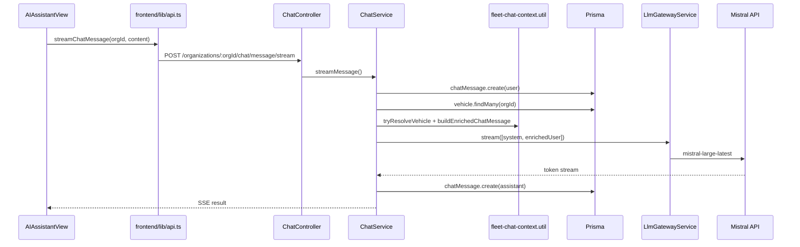
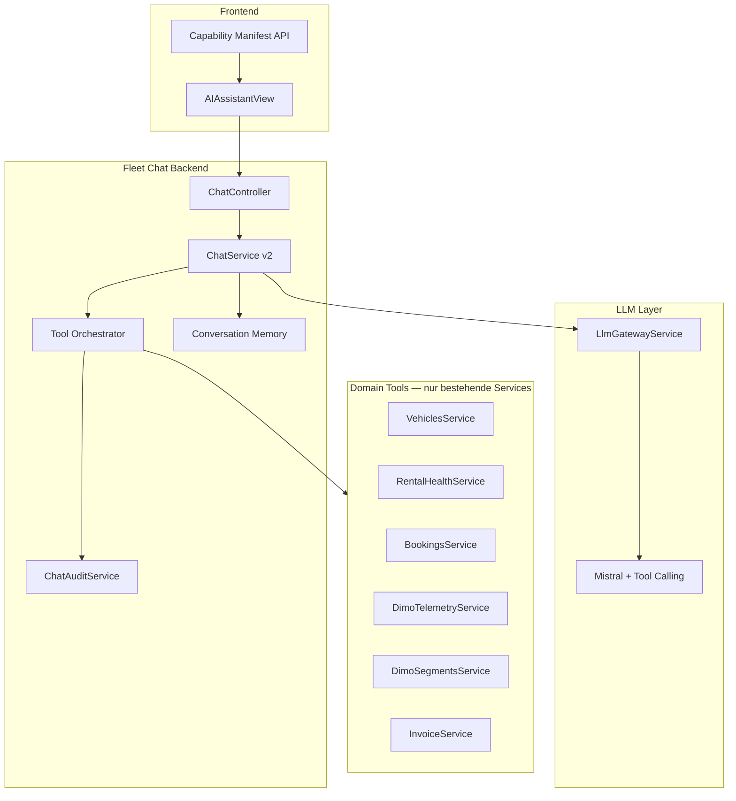

# SynqDrive AI Agent — Domain Grounding Baseline Audit

| Feld | Wert |
|------|------|
| **Baseline ID** | `ai-agent-domain-grounding-baseline-2026-07` |
| **Phase** | Prompt 4 von 32 — verbindliche Baseline aus Prompts 1–3 |
| **Datum** | 2026-07-24 (UTC) |
| **Repository** | `https://github.com/FATIHS-MGCKS/SYNQDRIVE-alpha` |
| **Branch (Audit)** | `cursor/ai-agent-runtime-audit-eafa` |
| **Git commit** | `4c7127aab1d37c7565fa739582cee85cdb6c241b` |
| **Quellen** | `docs/audits/ai-agent-domain-grounding-working-notes-2026-07.md` (Prompts 1–3) |
| **Produktcode geändert** | **Nein** — reiner Ist-Audit und Dokumentation |

> **Verbindlichkeit:** Dieses Dokument ist die **Baseline** für alle weiteren Prompts (5–32) zur production-ready Überarbeitung des SynqDrive Fleet AI Assistant. Abweichungen von den hier definierten Source-of-Truth-Regeln, Domain-Service-Wiederverwendung und Verbotslisten gelten als Architekturfehler.

---

## 1. Executive Summary

Der SynqDrive **Fleet AI Assistant** (Text-Chat im Rental-SPA) ist technisch an Mistral (`LlmGatewayService`) angebunden, operiert aber **ohne Domain Grounding**: Das Modell erhält pro Anfrage nur einen statischen System-Prompt und eine angereicherte User-Nachricht mit Fahrzeug-Stammdaten (Kennzeichen, VIN, Make/Model, `tokenId`). Es gibt **kein Tool Calling**, **kein Conversation-History-Replay** und **keinen Zugriff** auf Telemetrie (`VehicleLatestState`), Buchungen, Rental Health, Finanzen, Tasks oder Kundendaten.

Die Frontend-Oberfläche verspricht hingegen Umsatz, Buchungen, Wartung, Kunden und Echtzeit-Telemetrie — eine **kritische Capability-Lücke**, die Halluzinationsrisiko und Vertrauensverlust erzeugt.

**Parallele Assistenten** (WhatsApp AI, Voice MCP) haben bereits echte Domain-Tools; der Fleet-Chat ist architektonisch zurückgefallen. Die Migration von DIMO Agents → Mistral (v4.9.143–146) ist im Backend abgeschlossen, aber **Frontend-Copy und API-Feldnamen** (`dimoAgentId`) sind veraltet.

**Tenant-Isolation** am Chat-API-Pfad ist gehärtet (`OrgScopingGuard`, `PermissionsGuard`, org-scoped Queries). **Datenschutzrisiko:** VIN und Kennzeichen der gesamten Org-Flotte werden bei jeder Nachricht an Mistral übermittelt.

### Top-Findings (Severity)

| Severity | Anzahl | Kurzfassung |
|----------|--------|-------------|
| **BLOCKER** | 1 | Chat antwortet ohne Domain-Tools auf operative Fragen |
| **CRITICAL** | 4 | UI-Capability-Lücke; kein History-Replay; kein Tool Calling; fehlender Audit-Trail |
| **HIGH** | 8 | PII an Mistral; Health/Booking-Lücke; parallele Gates; Schäden nicht im Health-Gate |
| **MEDIUM** | 9 | Stale DIMO-Copy; Rate Limits; Mobile Layout; Freshness-Vokabulare |
| **LOW** | 6 | Feedback-UI; englische Fehlertexte; Legacy-Feldnamen |
| **INFORMATIONAL** | 5 | Separate Assistenten-Pfade; ungenutzte API-Methoden |

**Empfehlung für Prompts 5–32:** Domain-Grounded Tool-Layer aufbauen, der **ausschließlich bestehende SynqDrive-Services** nutzt; UI-Capabilities an Backend-Fähigkeiten koppeln; Audit/Trace pro Antwort; rollenbasierte PII-Redaktion; keine produktiven Änderungen ohne Akzeptanzkriterien aus §17.

---

## 2. Aktueller Architektur- und Datenfluss

### 2.1 Primärer Chat-Pfad



### 2.2 Komponenten-Matrix

| Schicht | Pfad | Rolle |
|---------|------|-------|
| Frontend UI | `frontend/src/rental/components/AIAssistantView.tsx` | Einzige Produktions-Chat-Oberfläche |
| Frontend API | `frontend/src/lib/api.ts` | `streamChatMessage()`, REST-History |
| Backend Controller | `backend/src/modules/ai/chat/chat.controller.ts` | REST + SSE, `ai-assistant:read\|write` |
| Backend Service | `backend/src/modules/ai/chat/chat.service.ts` | Orchestrierung, Persistenz, LLM |
| Fleet Context | `backend/src/modules/ai/chat/fleet-chat-context.util.ts` | Fahrzeugerkennung, System-Prompt |
| LLM Gateway | `backend/src/modules/ai/llm/llm-gateway.service.ts` | Provider-neutral (`complete`, `stream`) |
| Mistral Provider | `backend/src/modules/ai/providers/mistral/mistral-llm.service.ts` | Einziger aktiver LLM-Provider |
| Datenmodell | `OrganizationChatAgent`, `ChatMessage` | Org-scoped Metadaten + Nachrichten |

### 2.3 Abgegrenzte Assistenten-Pfade (bewusst getrennt)

| Surface | LLM | Tool Calling | Domain-Daten |
|---------|-----|--------------|--------------|
| **Fleet AI Chat** | Mistral | ❌ | Nur Vehicle-Stammdaten |
| **WhatsApp AI** | ❌ (Regex/Templates) | ✅ `WhatsAppAiToolsService` | Buchungen, GPS, DTC |
| **Voice Assistant** | ElevenLabs (extern) | ✅ `voice-mcp-tools.registry.ts` | Fleet, Buchungen, Budget |
| **AI Health Care** | ❌ (deterministisch) | ❌ | Health-Narrative, nicht Gate |

### 2.4 Auth- und Mandantenfluss

```
JWT (AuthGuard) → OrgScopingGuard (:orgId ∈ Membership)
  → PermissionsGuard (ai-assistant:read|write)
    → ChatService (alle Queries mit organizationId)
```

`GET /api/v1/ai/health` ist **unauthenticated** (nur Konfigurationsmetadaten, keine Secrets).

---

## 3. Aktuelle LLM- und Prompt-Konfiguration

### 3.1 Provider & Modell

| Variable | Default | Verwendung |
|----------|---------|------------|
| `AI_PROVIDER` | `mistral` | Einziger Provider in `ai.module.ts` |
| `MISTRAL_API_KEY` | — | Pflicht für `isConfigured()` |
| `MISTRAL_CHAT_MODEL` | `mistral-large-latest` | `purpose: 'chat'` |
| `MISTRAL_BASE_URL` | optional | Custom Endpoint |
| `AI_STREAMING_ENABLED` | `true` | Stream vs. Complete-Fallback |
| Timeout | 120 s | `mistral-sdk-client.provider.ts` |

**Legacy:** `OrganizationChatAgent.dimoAgentId` speichert jetzt `mistral` / `unconfigured` — kein DIMO-Agent-UUID mehr.

### 3.2 System-Prompt (`FLEET_CHAT_SYSTEM_PROMPT`)

```
You are SynqDrive Fleet Assistant — a helpful AI for fleet and rental operators.
Answer clearly and practically. Do not invent vehicle telemetry, odometer readings, or live DIMO data you were not given.
When fleet context is attached, use it to identify which vehicle the user means.
Prefer German when the user writes in German.
```

### 3.3 LLM-Payload pro Anfrage

**Immer genau 2 Nachrichten:**

```typescript
[
  { role: 'system', content: FLEET_CHAT_SYSTEM_PROMPT },
  { role: 'user', content: enrichedMessage },
]
```

**Nicht enthalten:** Conversation History, Tool-Definitionen, Rollen-Hinweise, Live-Telemetrie, Buchungen, Health, Finanzen, Org-/User-Name.

### 3.4 User-Message-Anreicherung

Bei `fleet.length > 0` wird eingebettet:

- Liste aller registrierten Fahrzeuge: `#N: make model year, plate, name, VIN, tokenId, fuel`
- Optional: Resolution-Hint bei `tryResolveVehicle`-Match
- Warnung bei fehlendem `tokenId`: „do not claim live DIMO telemetry“

`resolveChatVehicleTokenIds` wird **nur für Logging** berechnet — kein nachgelagerter Lookup.

### 3.5 Konfigurations-Lücken

| Thema | Status |
|-------|--------|
| Token-Usage-Tracking | ❌ `usage` wird verworfen |
| Chat-spezifische Rate Limits | ❌ nur global 200 req/min/IP |
| Modell-Routing (`purpose: router`) | ❌ nicht genutzt |
| `AI_EXTERNAL_ACTIONS_REQUIRE_APPROVAL` | Konfiguriert, Chat nutzt keine externen Aktionen |

---

## 4. Fahrzeugerkennung

### 4.1 Implementierung

**Datei:** `backend/src/modules/ai/chat/fleet-chat-context.util.ts`

| Funktion | Logik |
|----------|-------|
| `normalizePlate` | Kompakt, ohne Leerzeichen (AI-spezifisch) |
| `tryResolveVehicle` | Regex/Substring über Kennzeichen, Name, Make+Model(+Year), VIN, `tokenId` |
| `buildEnrichedChatMessage` | Fleet-Block + Resolution-Hint + User-Text |

### 4.2 Datenquelle

`ChatService.getOrgFleetInfo(orgId)` → `vehicle.findMany` + `dimoVehicle` Join:

`vehicleId`, `licensePlate`, `vehicleName`, `make`, `model`, `year`, `vin`, `fuelType`, `tokenId`

### 4.3 Inkonsistenzen (Cross-Module)

| Modul | Normalisierung |
|-------|----------------|
| AI Chat | `normalizePlate` (kompakt) |
| Document Intake | `normalizeVehiclePlate` (strip `[\s\-._/]+`) |
| Voice MCP | Prisma `insensitive` (exakt) |

**Risiko:** `M-AB 123` vs. `MAB123` kann Matching über Module hinweg scheitern.

### 4.4 AI-Verbot

Die AI darf **keine Fahrzeug-IDs erfinden** und **keine Fahrzeuge außerhalb der gelieferten Fleet-Liste** referenzieren. Resolution erfolgt ausschließlich über `tryResolveVehicle` — nicht durch Modell-Inferenz.

---

## 5. Telemetrie-Source-of-Truth

### 5.1 Kanonische operative Wahrheit

| Schicht | Mechanismus | Cadence | Persistenz |
|---------|-------------|---------|------------|
| **Snapshot-Poll** | `DimoSnapshotProcessor` → `fetchLatestVehicleSnapshot` | ~30 s | `VehicleLatestState` |
| **Live-GPS** | `VehiclesService.getLiveGps` → `fetchLastSeenLocation` | On-demand | **Kein DB-Write** |
| **Segment-Historie** | `DimoSegmentsService` | On-demand | PostgreSQL `Trip` |
| **Analytics-Spiegel** | ClickHouse `telemetry_snapshots` | Fire-and-forget | Nicht für Live-UI |

**Regel:** `VehicleLatestState` (geschrieben durch `DimoSnapshotProcessor`) ist die **kanonische Latest-Telemetrie** für operative Antworten. ClickHouse ist Analytics-only.

### 5.2 Zentrale Services (wiederverwenden)

| Service / Funktion | Datei | Zweck |
|--------------------|-------|-------|
| `fetchLatestVehicleSnapshot` | `dimo-telemetry.service.ts` | Snapshot-Poll |
| `fetchLastSeenLocation` | `dimo-telemetry.service.ts` | Live-GPS |
| `normalizeSnapshot` | `dimo-snapshot.processor.ts` | DIMO → VLS Mapping |
| `resolveTelemetryFreshness` | `telemetry-freshness.resolver.ts` | 5-State Freshness |
| `classifyTelemetryFreshness` | `vehicle-state-interpreter.ts` | Schwellen 15m/24h/48h |
| `interpretVehicleState` | `vehicle-state-interpreter.ts` | MOVING/IDLE/PARKED |
| `deriveFleetStatusContext` | `vehicles.service.ts` | Fleet-Status + Odometer + Fuel |

### 5.3 Freshness-Schwellen (verbindlich)

| State | Schwellwert |
|-------|-------------|
| `live` | `< 15 min` |
| `standby` | `< 24 h` |
| `signal_delayed` | `< 48 h` |
| `offline` | `≥ 48 h` |
| `no_signal` | kein Timestamp |

Timestamp-Priorität: `sourceTimestamp` → `lastValidTelemetryAt` → `receivedAt`* → `DimoVehicle.lastSignal` → `lastSeenAt`/`updatedAt` (*mit Backfill-Guard 15 min).

### 5.4 AI-Verfügbarkeit heute

| Datenklasse | Fleet Chat | WhatsApp | Voice MCP |
|-------------|------------|----------|-----------|
| Stammdaten | ✅ Prompt | ✅ | ✅ |
| Live Telemetrie | ❌ | ✅ (limitiert) | ❌ (Labels) |
| Freshness | ❌ | ✅ (2h GPS stale) | Teilweise |
| Trips/Segments | ❌ | ❌ | ❌ |

---

## 6. Standort-Source-of-Truth

| Fachinformation | Primäre Quelle | Fallback | AI heute |
|-----------------|----------------|----------|----------|
| **Koordinaten (operativ)** | `VehicleLatestState.latitude/longitude` | `getLiveGps` / `fetchLastSeenLocation` | ❌ |
| **Letzter Standort (Zeit)** | `VehicleLatestState.lastSeenAt` | `sourceTimestamp` | ❌ |
| **Geschwindigkeit** | `VehicleLatestState.speedKmh` | `getLiveGps` | ❌ |
| **Aufgelöste Adresse** | **Keine Backend-Quelle** | Client `addressService.ts` → Mapbox | ❌ |

**Regel für AI-Tools:** Koordinaten aus `VehicleLatestState` + `resolveTelemetryFreshness`; Live-GPS nur bei Bedarf an Sub-30s-Genauigkeit mit explizitem `source: 'live'|'snapshot'`. Adressen **nicht halluzinieren** — entweder serverseitiger Geocode-Service (neu) oder „Koordinaten ohne Adresse“ kommunizieren.

---

## 7. Booking- und Return-Source-of-Truth

### 7.1 Kanonische Persistenz

| Entität | Rolle |
|---------|-------|
| `Booking.status` (`BookingStatus` enum) | Lifecycle-Wahrheit |
| `BookingHandoverProtocol` (`kind=PICKUP\|RETURN`) | Tatsächliche Übergabe/Rücknahme |
| `Booking.startDate` / `endDate` | Geplante Zeiten |
| `Vehicle.status` | **Sekundär** — Fleet-State aus Bookings abgeleitet |

**Kein** Prisma-Enum `HandoverStatus` / `ReturnStatus` — nur berechnet.

### 7.2 Zentrale Services (wiederverwenden)

| Service | Datei | Rolle |
|---------|-------|-------|
| `BookingsService` | `bookings.service.ts` | CRUD, Today-Tiles, Detail DTO |
| `BookingsHandoverService` | `bookings-handover.service.ts` | Pickup/Return → Status |
| `booking-lifecycle-status.matrix.ts` | — | Transition-Matrix + Reason Codes |
| `buildFleetBookingContextFromRows` | `fleet-booking-context.util.ts` | Pro-Fahrzeug Booking-Buckets |
| `deriveFleetStatusContext` | `vehicles.service.ts` | Kanonischer Fleet-Operational-State |
| `PickupOverdueDetector` | `pickup-overdue.detector.ts` | Persistierte Insights (nur Pickup) |

### 7.3 Abgeleitete Zustände (nicht persistiert)

| Zustand | Berechnung | Schwellen |
|---------|------------|-----------|
| Verspätete Abholung | CONFIRMED, kein PICKUP-Protocol, `startDate < now` | Insights: ≥30 min Grace |
| Überfällige Rückgabe | ACTIVE, kein RETURN-Protocol, `endDate < now` | **0 Grace** (sofort) |
| Ghost `Vehicle.status` | RESERVED/RENTED ohne passende Booking | Ghost Guard in `deriveFleetStatusContext` |

### 7.4 AI-Verfügbarkeit heute

| Datenklasse | Fleet Chat | WhatsApp | Voice MCP |
|-------------|------------|----------|-----------|
| Booking status/dates | ❌ | ✅ | ✅ |
| Handover / overdue | ❌ | ❌ | ❌ |
| Fleet operational state | ❌ | ❌ | ✅ teilweise |

---

## 8. Health-Source-of-Truth

### 8.1 Drei Health-Schichten

| Schicht | Kanonisch für | Service |
|---------|---------------|---------|
| **Rental Health V1** | `rental_blocked`, Booking-Gates | `RentalHealthService.getVehicleHealth()` |
| **Domain Health** | Modul-Detail | Battery, Tires, Brakes, DTC, Service Compliance |
| **Presentation** | UI-Narrative | Health Tab, AI Care (nicht Gate) |

**Deprecated:** `Vehicle.healthStatus` (Prisma) — nicht für UI oder Gates.

### 8.2 Booking-Gate (hard, fail-closed)

`RentalHealthService.isRentalBlocked()` blockiert bei:

1. TÜV overdue  
2. BOKraft overdue  
3. `VehicleComplaint.blocksRental === true`  
4. Limp Mode (HM)  
5. Bremsen hard block  
6. Reifen hard block  
7. Batterie block  
8. Safety-critical DTCs  
9. Motoröl LOW/MINIMUM  

**Nicht blockierend:** Schäden (`rentalImpact`), HM next service, non-safety DTCs, ServiceCase (`blocksRental` nur Dashboard).

### 8.3 `computeOverallState` (verbindlich)

`unknown` wird **nie** zu `good` promotet. `availability: partial` → `rental_blocked: null` (nie „sicher frei“).

### 8.4 AI-Verfügbarkeit heute

| Datenklasse | Fleet Chat | Booking Gate |
|-------------|------------|--------------|
| `rental_blocked` / `blocking_reasons` | ❌ | ✅ `isRentalBlocked` |
| Module health | ❌ | ✅ indirekt |
| AI Health Care narrative | ❌ | ❌ (nicht Gate) |

### 8.5 Existierende API-Routen (ungenutzt vom Chat)

- `GET /organizations/:orgId/vehicles/:vehicleId/rental-health`
- `GET /organizations/:orgId/rental-health/fleet`
- `GET /organizations/:orgId/bookings/:id`
- `GET /organizations/:orgId/bookings/today/pickups|returns`
- `GET /vehicles/:vehicleId/health/summary`
- `GET /vehicles/:vehicleId/health/ai-health-care`

---

## 9. Tenant-, Rollen- und Datenschutzbewertung

### 9.1 Tenant-Isolation (Chat-Pfad)

| Prüfung | Status | Evidenz |
|---------|--------|---------|
| Route `:orgId` | ✅ | `OrgScopingGuard` |
| DB-Queries | ✅ | `organizationId` in allen Chat-Queries |
| Permission-Modul | ✅ | `ai-assistant:read\|write` |
| Security-Spec | ✅ | `iam-endpoint-enforcement-triage.security.spec.ts` |
| Frontend Nav-Gate | ⚠️ | Sidebar ohne `hasPermission`-Check |

### 9.2 Rollenmodell

Default-Rollen (Admin/Manager) enthalten `ai-assistant`. Keine rollenspezifische Prompt- oder Tool-Einschränkung im Chat.

### 9.3 Personenbezogene Daten — rollenabhängige Einschränkungen (Soll)

| Datenklasse | Mindest-Rolle / Scope | AI-Regel |
|-------------|----------------------|----------|
| Kundenname, E-Mail, Telefon | `bookings:read` + Kundenmodul | Nur via `BookingsService` / Customer-Service; nie aus Prompt raten |
| Fahrerzuordnung | `bookings:read` | Nur bei aktiver Buchung |
| VIN (vollständig) | `vehicles:read` | Redaktion für Rollen ohne Vehicle-Detail-Zugriff (`***` + letzte 4) |
| Kennzeichen | `vehicles:read` | Org-scoped; keine Cross-Tenant-Listen |
| GPS-Koordinaten | `vehicles:read` + `DataAuthorization` GPS | Wie `getLiveGps`; keine Adress-Inferenz ohne Geocode-Service |
| Finanzdaten (Umsatz, Rechnungen) | `invoices:read` / Finance-Modul | Explizites Tool; Manager vs. Operator differenzieren |
| Chat-Verlauf anderer User | — | **Verboten** — nur eigener Verlauf pro Org |
| DIMO `tokenId` | Intern | Nicht an Endnutzer ausgeben; nur für Tool-Lookups |

### 9.4 Externe Datenweitergabe (Mistral)

**Aktuell:** VIN + Kennzeichen **aller** Org-Fahrzeuge in jedem LLM-Request.

**Risiko:** DSGVO/AVV — Entscheidung erforderlich ob Tenant-opt-out, Feld-Redaktion oder On-Prem-Alternative nötig.

### 9.5 Separate Risiken (nicht Chat, aber AI-Modul)

`vehicle-specs.controller.ts`: `dimoVehicle.findFirst` ohne `organizationId` — Cross-Tenant tokenId/VIN Lookup (MEDIUM).

---

## 10. Mobile- und Frontend-Befunde

| ID | Befund | Severity |
|----|--------|----------|
| FE-1 | Feste 260px Sidebar + `max-w-[1400px]` — kein responsives Chat-Layout | MEDIUM |
| FE-2 | SSE Progress-Tokens nur als „Denke nach…“ — kein inkrementelles Rendering | LOW |
| FE-3 | Hardcoded englische Fehlertexte trotz DE-i18n | LOW |
| FE-4 | Thumbs up/down ohne Handler (dekorativ) | LOW |
| FE-5 | Sidebar zeigt AI ohne `hasPermission('ai-assistant')` | LOW |
| FE-6 | UI Capabilities (`aiChat.cap.*`) widersprechen Backend | CRITICAL |
| FE-7 | Stale Copy: „DIMO Agent Connected“, „Powered by DIMO Agents“ | MEDIUM |
| FE-8 | Keine dedizierte URL-Route (`currentView === 'ai-assistant'`) | INFORMATIONAL |
| FE-9 | `api.chat.ensureAgent` / `sendMessage` definiert, ungenutzt | INFORMATIONAL |

**i18n:** 8 Locales für Suggestions/Capabilities — Texte versprechen Features, die Backend nicht liefert.

---

## 11. Veraltete oder irreführende DIMO-Agent-Verweise

| Ort | Inhalt | Status |
|-----|--------|--------|
| `AIAssistantView.tsx` | „DIMO Agent Connected“, „DIMO Agents API“, „Powered by DIMO Agents“ | **Stale** — Backend ist Mistral-only |
| `OrganizationChatAgent.dimoAgentId` | Feldname | **Irreführend** — speichert `mistral` |
| `api.ts` | `dimoAgentId` in Typen | **Irreführend** |
| `docs/ai-document-upload.md` | „DIMO Agent (JSON)“ | Historisch — Document Extraction, nicht Fleet Chat |
| `WhatsAppSettingsPanel.tsx` | „DIMO Agent as internal tool“ | Kontextabhängig — WhatsApp nutzt kein DIMO Agents LLM |
| `ChangesView.tsx` | Historische Changelog-Einträge v4.9.143–146 | Korrekt als Migration dokumentiert |
| `backend/src/**` | `DimoAgentsService`, `agents.dimo.zone` | **0 Treffer** — Cleanup abgeschlossen |

**Verbindlich:** Fleet Chat darf in UI und API **nicht** mehr als „DIMO Agent“ bezeichnet werden. DIMO bleibt Telemetrie-/Identity-Provider, nicht LLM-Provider.

---

## 12. Redundante oder widersprüchliche Logik

| ID | Thema | Stellen | Severity |
|----|-------|---------|----------|
| R-1 | Drei Freshness-Vokabulare | BE 5-State, FE Dashboard 4-State, Legacy 3-State | MEDIUM |
| R-2 | Timestamp-Priorität divergiert | `telemetry-freshness.resolver` vs. `interpretVehicleState` vs. `deriveTelemetryState` | MEDIUM |
| R-3 | Kennzeichen-Normalisierung | AI, Docs, Voice | MEDIUM |
| R-4 | Dual Odometer | `mileageKm` vs. `odometerKm` vs. `DimoVehicle.odometerKm` | MEDIUM |
| R-5 | OBD Plug drei Wahrheiten | Snapshot, Webhook episodes, Runtime builder | HIGH |
| R-6 | Pickup overdue Schwellen | Tiles sofort vs. Insights ≥30 min | HIGH |
| R-7 | Return overdue | Kein Backend-Insight; nur FE/Runtime | HIGH |
| R-8 | Health overall | Rental Health vs. Tab Summary vs. AI Care | HIGH |
| R-9 | Ready-to-rent | `isRentalBlocked` (BE) vs. `deriveIsReadyForRenting` (FE) | MEDIUM |
| R-10 | Schäden | FE `damage-rental-impact.ts` vs. fehlend in `collectBlockingReasons` | HIGH |
| R-11 | ServiceCase.blocksRental | Dashboard only, nicht Rental Health V1 | MEDIUM |
| R-12 | WhatsApp/Voice vs. Chat | Mehr Domain-Kontext in parallelen Assistenten | HIGH |

---

## 13. Fehlende Verbindungen zwischen AI und SynqDrive

| Domäne | Existierender Service | Chat-Anbindung | Priorität |
|--------|----------------------|----------------|-----------|
| Live-Telemetrie | `VehiclesService.getVehicleWithTelemetry`, VLS | ❌ | P0 |
| Telemetrie-Freshness | `resolveTelemetryFreshness` | ❌ | P0 |
| Fleet Operational State | `deriveFleetStatusContext` | ❌ | P0 |
| Buchungen | `BookingsService.findDetail`, Today-Tiles | ❌ | P0 |
| Rental Health Gate | `RentalHealthService.getVehicleHealth` | ❌ | P0 |
| Handover / Overdue | `fleet-booking-context`, `buildTodayReturnSignals` | ❌ | P1 |
| Tasks / Work Orders | Task-Domain V2 | ❌ | P1 |
| Finanzen / Rechnungen | Invoice-Module | ❌ | P1 |
| Kunden | Customer-Module | ❌ | P1 |
| Trips / Segments | `DimoSegmentsService` | ❌ | P2 |
| Connectivity | `VehicleConnectivityRuntimeStateBuilder` | ❌ | P2 |
| Audit / Trace | — (fehlt) | ❌ | P0 |
| Usage / Budget | `VoiceBudgetEnforcementService` (Pattern) | ❌ | P1 |
| Conversation Memory | DB `chat_messages` (nur UI) | ❌ History an LLM | P0 |

**Bestehende Tool-Muster zum Wiederverwenden:**

- `WhatsAppAiToolsService` — Buchungen, GPS, DTC
- `voice-mcp-tools.registry.ts` — Registry, Rate Limits, Read/Write-Trennung

---

## 14. Priorisierte Findings mit Severity

### BLOCKER

| ID | Finding | Evidenz |
|----|---------|---------|
| **B-01** | Fleet Chat beantwortet operative Fragen (Buchungen, Telemetrie, Health, Finanzen) **ohne Domain-Tools** — hohes Halluzinationsrisiko trotz System-Prompt-Verbot | `ChatService.callLlm` sendet nur Stammdaten; UI suggeriert volle Capabilities |

### CRITICAL

| ID | Finding | Evidenz |
|----|---------|---------|
| **C-01** | UI-Capabilities widersprechen Backend (`aiChat.cap.*` vs. statischer Fleet-Context) | `AIAssistantView` + i18n vs. `fleet-chat-context.util` |
| **C-02** | Kein Conversation-History-Replay ans LLM — Multi-Turn nur visuell | `callLlm`: genau 2 Messages |
| **C-03** | Kein Tool/Function Calling im Fleet Chat | `LlmMessageRole: 'tool'` ungenutzt |
| **C-04** | Kein Audit-Trail pro Antwort (Modell, Usage, Quellen, resolved vehicleIds) | Nur `chat_messages.content` persistiert |

### HIGH

| ID | Finding | Evidenz |
|----|---------|---------|
| **H-01** | VIN/Kennzeichen gesamter Org-Flotte an Mistral pro Request | `buildEnrichedChatMessage` |
| **H-02** | Kein Zugriff auf `VehicleLatestState` / Telemetrie | Grep `VehicleLatestState` in `ai/chat`: 0 |
| **H-03** | Kein Zugriff auf `RentalHealthService` / Booking-Daten | Grep in `ai/chat`: 0 |
| **H-04** | WhatsApp/Voice haben mehr Domain-Kontext als Fleet Chat | Tool-Services vorhanden, Chat nicht angebunden |
| **H-05** | Schäden blockieren Rental nur im Frontend, nicht in `collectBlockingReasons` | `damage-rental-impact.ts` |
| **H-06** | AI Health Care Narrative ≠ Rental Health Gate | `AiHealthCareAggregationService` vs. `isRentalBlocked` |
| **H-07** | Return overdue ohne Backend-Insight-Detector | `InsightType` ohne `RETURN_OVERDUE` |
| **H-08** | Pickup-overdue-Schwellen divergieren (Tiles vs. Insights) | 0 min vs. 30 min Grace |

### MEDIUM

| ID | Finding | Evidenz |
|----|---------|---------|
| **M-01** | Stale DIMO-Agent-Copy im Frontend | `AIAssistantView.tsx` |
| **M-02** | Irreführendes API-Feld `dimoAgentId` | Prisma + `api.ts` |
| **M-03** | Keine Chat-spezifischen Rate Limits / Kosten-Tracking | Global Throttler; `usage` verworfen |
| **M-04** | Mobile Layout nicht responsiv | Feste Sidebar-Breite |
| **M-05** | Drei Freshness-Vokabulare cross-surface | BE/FE/Legacy |
| **M-06** | `availability: partial` → `rental_blocked: null` kann von AI falsch interpretiert werden | `rental-health.types.ts` |
| **M-07** | ServiceCase.blocksRental parallel zu Rental Health | Dashboard only |
| **M-08** | Ghost `Vehicle.status` ohne Booking | Ghost Guard + Repair-Scripts |
| **M-09** | Stille DB-Persistenz-Fehler | `.catch(() => {})` in ChatService |

### LOW

| ID | Finding | Evidenz |
|----|---------|---------|
| **L-01** | Feedback (Thumbs) nicht angebunden | Keine Handler |
| **L-02** | Hardcoded englische Fehlertexte | `AIAssistantView.tsx` |
| **L-03** | Kein inkrementelles Stream-Rendering | SSE progress nur Label |
| **L-04** | `GET /ai/health` unauthenticated | Nur Metadaten |
| **L-05** | Frontend ohne Permission-Gate | Sidebar |
| **L-06** | HM Next Service critical ohne Rental-Block | Bewusst, dokumentieren |

### INFORMATIONAL

| ID | Finding | Evidenz |
|----|---------|---------|
| **I-01** | Parallele Assistenten bewusst getrennt (WhatsApp, Voice, Document) | Architektur-Übersicht |
| **I-02** | DIMO Agents LLM vollständig aus Backend entfernt | Grep 0 Treffer |
| **I-03** | Ungenutzte API `ensureAgent` / `sendMessage` | `api.ts` |
| **I-04** | Figma-Prototyp `figma-rental/AIAssistantView` fehlt | Nicht Produktionspfad |
| **I-05** | `tokenIds` nur für Logging berechnet | `resolveChatVehicleTokenIds` |

---

## 15. Verbindliche Source-of-Truth-Matrix

Legende: **SoT** = Source of Truth · **AI-Soll** = erlaubter AI-Zugriffspfad in Zielarchitektur · **AI-Ist** = heute

| Domäne | Fachinformation | SoT (Service / Modell) | AI-Ist | AI-Soll (Tool) |
|--------|-----------------|------------------------|--------|----------------|
| **Identität** | Fahrzeug-ID | `Vehicle.id` | ❌ | `VehiclesService.findOne` |
| | Kennzeichen | `Vehicle.licensePlate` | ✅ Prompt-Text | Wie SoT |
| | VIN | `Vehicle.vin` | ✅ Prompt-Text | Redaktion rollenabhängig |
| | tokenId | `DimoVehicle.tokenId` | ✅ Prompt-Text | Intern, nicht ausgeben |
| **Telemetrie** | Latest Snapshot | `VehicleLatestState` via `DimoSnapshotProcessor` | ❌ | `VehiclesService.getVehicleWithTelemetry` |
| | Freshness | `resolveTelemetryFreshness` | ❌ | Gleicher Resolver |
| | Live-GPS | `getLiveGps` → `fetchLastSeenLocation` | ❌ | Tool mit `source` metadata |
| | Odometer live | `VehicleLatestState.odometerKm` | ❌ | VLS + Freshness |
| | Fuel/SOC | `resolveFuelPercent` / `evSoc` | ❌ | VLS |
| **Standort** | Koordinaten | `VehicleLatestState` | ❌ | VLS oder Live-GPS Tool |
| | Adresse | **Kein SoT** (nur Client Mapbox) | ❌ | Server-Geocode oder „nicht verfügbar“ |
| **Booking** | Status | `Booking.status` | ❌ | `BookingsService` |
| | Handover | `BookingHandoverProtocol` | ❌ | `BookingsHandoverService` / Detail DTO |
| | Overdue | Abgeleitet aus Dates + Protocol | ❌ | `fleet-booking-context` / Today APIs |
| | Fleet operational | `deriveFleetStatusContext` | ❌ | `VehiclesService` |
| **Health** | rental_blocked | `RentalHealthService.isRentalBlocked` | ❌ | **Pflicht** bei Fahrzeugfragen |
| | overall_state | `computeOverallState(modules)` | ❌ | `getVehicleHealth` |
| | Module detail | Domain Services | ❌ | Rental Health DTO |
| | AI Care narrative | `AiHealthCareAggregationService` | ❌ | Mit Gate-Disclaimer |
| **Trips** | Trip-Grenzen | DIMO Segments → `Trip` | ❌ | `DimoSegmentsService` |
| | Route | Signals innerhalb Segment-Fenster | ❌ | Segment-scoped Tool |
| **Connectivity** | overallState | `VehicleConnectivityRuntimeStateBuilder` | ❌ | Connectivity Projection |
| **Finanzen** | Umsatz/Rechnungen | Invoice-Module | ❌ | Invoice-Service Tool |
| **Kunden** | PII | Customer-Module | ❌ | Rollen-gated Tool |

---

## 16. Zielarchitektur für die weiteren Prompts (5–32)



### Architekturprinzipien (verbindlich)

1. **Keine parallele Business-Logik im AI-Modul** — Tools sind dünne Adapter über bestehende Domain-Services.
2. **DIMO Segments** bleiben kanonische Trip-Grenzen; keine ad-hoc Segmentierung durch das Modell.
3. **Rental Health V1** ist das einzige Booking-Gate; AI Care ist Presentation mit Disclaimer.
4. **Fail-closed:** Bei Tool-Fehler oder `availability: partial` keine erfundenen Operativdaten.
5. **Tenant-Isolation** in jedem Tool-Call: `organizationId` aus Route, nie aus User-Text.
6. **Audit-Record** pro Assistant-Turn: `model`, `usage`, `toolCalls[]`, `sources[]`, `resolvedVehicleIds[]`.
7. **Capability Manifest:** Frontend zeigt nur Features, die Backend-Tools registriert haben.
8. **Konvergenz optional:** Gemeinsame Tool-Registry-Schnittstelle mit Voice MCP / WhatsApp — aber keine Big-Bang-Vereinigung in Prompt 5.

### Prompt-Roadmap (Vorschlag)

| Prompt-Bereich | Fokus |
|----------------|-------|
| 5–8 | Tool-Layer, Vehicle/Telemetry-Tools, Freshness |
| 9–12 | Booking/Return-Tools, Health-Gate-Integration |
| 13–16 | Conversation Memory, Audit, PII-Redaktion |
| 17–20 | UI-Capability-Sync, Copy-Cleanup, Mobile |
| 21–24 | Rate Limits, Usage Ledger, Kostenkontrolle |
| 25–28 | Tests, E2E, Halluzinations-Guards |
| 29–32 | Production Readiness Gate, Dokumentation |

---

## 17. Akzeptanzkriterien für Production Readiness

### Funktional

- [ ] Jede in der UI beworbene Capability (`aiChat.cap.*`) hat ein registriertes Backend-Tool oder ist aus UI entfernt.
- [ ] Operative Antworten zu Telemetrie, Buchungen, Health stammen **ausschließlich** aus Tool-Ergebnissen — nie aus Modell-Inferenz.
- [ ] `rental_blocked` und `blocking_reasons` werden bei Fahrzeug-/Vermietungsfragen automatisch geladen.
- [ ] Conversation History: mindestens letzte N Turns ans Modell (konfigurierbar, org-scoped).
- [ ] Fahrzeugerkennung über `tryResolveVehicle` + Tool-Validierung gegen `vehicleId`.

### Sicherheit & Compliance

- [ ] Rollenbasierte PII-Redaktion (§9.3) in Tools und Prompt-Enrichment implementiert.
- [ ] Entscheidung zu Mistral-DPA dokumentiert; Opt-out oder Redaktion für sensitive Tenants.
- [ ] Kein Cross-Tenant-Datenleck in Tools (Integrationstests).
- [ ] `GET /ai/health` authentifiziert oder auf internes Netz beschränkt (Entscheidung).

### Betrieb

- [ ] Chat-spezifische Rate Limits pro Org/User.
- [ ] Token-Usage in Usage Ledger (analog Voice Budget Pattern).
- [ ] Audit-Trail pro Antwort abfragbar (Support/Debug).
- [ ] Fehler-Persistenz: keine stillen `.catch(() => {})` bei Message-Save.

### Qualität

- [ ] E2E: Suggestion „Umsatz heute“ → Tool-Call oder ehrliche „keine Daten“-Antwort.
- [ ] E2E: Fahrzeug per Kennzeichen → korrektes `vehicleId` + Health-Gate-Daten.
- [ ] Regression: Domain-Service-Unit-Tests unverändert grün.
- [ ] Kein verbleibender „DIMO Agent“-Copy im Fleet-Chat-UI.

### Dokumentation

- [ ] Architektur-Eintrag in `architecture/` nach Implementierung.
- [ ] Changes-Eintrag in Master Changes View.

---

## 18. Bekannte Risiken und offene Entscheidungen

### Risiken

| Risiko | Impact | Mitigation |
|--------|--------|------------|
| Halluzination bei operativem Chat | Vertrauensverlust, falsche Ops-Entscheidungen | Tool-Layer P0 (B-01) |
| PII an Mistral | Compliance | Redaktion, DPA, Tenant-Opt-out |
| Tool-Latenz bei großer Flotte | UX | Vehicle-Resolution vor Tool-Batch; Caching |
| Freshness-Inkonsistenz in Antworten | Widersprüchliche UI/Chat | Einheitlich `resolveTelemetryFreshness` |
| Health Gate vs. AI Care Drift | Falsche Vermietungsberatung | Gate-Pflicht + Disclaimer |
| Schäden nicht im Gate | Buchung trotz Safety-Critical Damage | Domain-Fix parallel zu AI (H-05) |

### Offene Entscheidungen

| # | Frage | Optionen |
|---|-------|----------|
| OD-1 | Mistral AVV für alle Tenants? | Global OK / Tenant-Opt-out / Self-hosted |
| OD-2 | Conversation Memory Tiefe | Last N turns / Summarization / Hybrid |
| OD-3 | Tool-Registry-Konvergenz | Shared mit Voice / Fleet-eigen / Adapter-Layer |
| OD-4 | `dimoAgentId` Migration | Rename `llmProviderId` / Deprecation |
| OD-5 | Adresse für AI | Server-Geocode / Koordinaten-only / Kein Standort-Chat |
| OD-6 | Return overdue Backend-Insight | Detector nachrüsten / Runtime-only belassen |
| OD-7 | Damages in `collectBlockingReasons` | Domain-Fix vor AI / AI warnt nur |
| OD-8 | ServiceCase in Rental Health V1 | Integrieren / getrennt dokumentieren |
| OD-9 | AI Health Care im Chat | Erlauben mit Disclaimer / Nur Gate-Daten |
| OD-10 | Finanz-Tools für welche Rollen? | Admin-only / Manager / Operator read-only |

---

## Anhang A — Verbindliche AI-Grounding-Regeln

### A.1 Berechnungen, die die AI **niemals** selbst durchführen darf

| Kategorie | Verbotene AI-Eigenberechnung | Stattdessen |
|-----------|------------------------------|-------------|
| Telemetrie | Odometer, Tankstand, SOC, Speed, GPS, Ignition, Temperatur | `VehicleLatestState` + Freshness-Resolver |
| Freshness | „Online/Offline“, Alter des letzten Signals | `resolveTelemetryFreshness` / `classifyTelemetryFreshness` |
| Booking-State | Aktiv/Overdue/Handover-Status | `BookingsService`, `fleet-booking-context` |
| Fleet-Operational | Reserved/Rented/Maintenance-Labels | `deriveFleetStatusContext` |
| Health | rental_blocked, overall_state, Modul-Severity | `RentalHealthService.getVehicleHealth` |
| Trip-Grenzen | Start/Ende, Distanz, Fahrzeit | DIMO Segments → `Trip` |
| Finanzen | Umsatz, offene Posten, Rechnungssummen | Invoice-/Finance-Services |
| Fuel-Berechnung | Prozent aus absoluten Litern | `resolveFuelPercent` |
| Battery Readiness | SOH, Ladezustand-Gate | `CanonicalBatteryHealthService` + `battery-readiness.policy` |
| Tire/Brake Block | Hard-block-Entscheid | `tire-rental-health.policy` / `brake-rental-health.policy` |
| DTC Severity | Safety-critical Klassifikation | `DtcService` + `dtc-severity.util` |
| Adressen | Reverse Geocode aus Koordinaten | Server-Geocode-Service oder explizit „nicht verfügbar“ |
| Kunden-PII | Namen, Kontakt aus Kontext raten | Customer-Service mit Permission-Check |

### A.2 Domain-Services, die **wiederverwendet** werden müssen

| Domäne | Service(s) | Nicht duplizieren |
|--------|------------|-------------------|
| Fahrzeuge | `VehiclesService` | Kein AI-eigener Vehicle-Repository |
| Telemetrie Latest | `DimoSnapshotProcessor` Output via `VehiclesService` | Kein direkter DIMO-Call ohne Auth/DataAuthorization |
| Telemetrie Live | `getLiveGps`, `getVehicleWithTelemetry` | — |
| Freshness | `telemetry-freshness.resolver.ts` | Keine AI-eigenen Schwellen |
| Fleet Status | `deriveFleetStatusContext` | — |
| Buchungen | `BookingsService`, `BookingsHandoverService` | — |
| Booking Transitions | `booking-lifecycle-status.matrix.ts` | — |
| Rental Health | `RentalHealthService` | Kein AI-Health-Score |
| Battery | `CanonicalBatteryHealthService` | — |
| Tires / Brakes | `TireHealthService`, `BrakeHealthService` | — |
| DTC | `DtcService` | — |
| Service Compliance | `ServiceComplianceService` | — |
| Segments / Trips | `DimoSegmentsService` | Segments = kanonische Grenzen |
| Connectivity | `VehicleConnectivityRuntimeStateBuilder` | — |
| IAM | `OrgScopingGuard`, `PermissionsGuard` | — |

### A.3 Daten, die **statisch über Knowledge Base** erklärt werden dürfen

| Inhalt | Beispiele | Grenze |
|--------|-----------|--------|
| Produkt-Hilfe | „Was ist Rental Health?“, Navigation, Feature-Erklärungen | Keine org-spezifischen Fakten |
| Domänen-Glossar | Booking-Status-Bedeutungen, Handover-Ablauf | Muss mit `BookingStatus` enum übereinstimmen |
| Health-Module | Was prüft Reifen-Health, was bedeutet `unknown` | Keine Fahrzeug-spezifischen Werte |
| DIMO-Architektur | Segments als Trip-Grenzen, Snapshot-Cadence ~30s | Keine Live-Werte |
| Reason-Code-Erklärungen | `TREAD_MEASURED_BELOW_LEGAL_MIN` Bedeutung | Nur wenn Code aus Tool kam |
| SynqDrive-Prozesse | Pickup-Gate, AI Upload Flow, No-Show-Regeln | Keine konkreten Buchungs-IDs |
| Compliance-Konzepte | TÜV, BOKraft, Datenschutz-Hinweise | Keine Fahrzeug-Termine ohne Tool |

### A.4 Daten, die **ausschließlich über echte Domain-Tools** kommen dürfen

| Datenklasse | Pflicht-Tool-Quelle |
|-------------|---------------------|
| Aktueller Kilometerstand | `VehicleLatestState` via VehiclesService |
| Aktuelle Position | VLS oder `getLiveGps` |
| Buchungsstatus / -daten | `BookingsService` |
| Overdue-Flags | `fleet-booking-context` / Today APIs |
| rental_blocked | `RentalHealthService.isRentalBlocked` |
| Modul-Health-States | `RentalHealthService.getVehicleHealth` |
| Aktive DTCs | `DtcService.getSummary` |
| Trip-Liste / Segment-Zeiten | `DimoSegmentsService` / Trip-Module |
| Fleet-Map-Status | `deriveFleetStatusContext` |
| Rechnungs-/Umsatzdaten | Invoice-Module |
| Kundendaten | Customer-Module |
| Connectivity-Status | Connectivity Runtime Projection |
| Task-/Work-Order-Status | Task-Domain V2 |

### A.5 Personenbezogene Daten — rollenabhängige Einschränkungen (verbindlich)

| Daten | Mindest-Permission | Verhalten ohne Permission |
|-------|-------------------|---------------------------|
| Kundenname | `customers:read` oder booking-scoped | „Kunde nicht einsehbar“ |
| E-Mail / Telefon | `customers:read` | Nicht ausgeben |
| Vollständige VIN | `vehicles:read` | Letzte 4 Zeichen oder withhold |
| Live-GPS | `vehicles:read` + GPS DataAuthorization | „Standort nicht freigegeben“ |
| Finanzsummen | `invoices:read` | Capability ausblenden / verweigern |
| Andere Org-Mitglieder | `users:read` / Admin | Nicht ausgeben |
| Chat-Verlauf | `ai-assistant:read` (eigene Org) | Nur org-scoped History |

---

## Anhang B — Statische Prüfungen (Baseline-Lauf 2026-07-24)

Ausgeführt im Audit-Branch `cursor/ai-agent-runtime-audit-eafa` @ `4c7127aa`.

### B.1 Backend Unit Tests

**Befehl:**

```bash
cd backend && npm test -- --testPathPattern='chat\.service|iam-endpoint-enforcement-triage|telemetry-freshness|vehicle-state-interpreter|vehicle-connectivity-runtime|booking-lifecycle|rental-health'
```

| Ergebnis | Detail |
|----------|--------|
| **PASS** | **21 suites, 192 tests** |

Abgedeckte Bereiche: `ChatService`, IAM Chat-Guards, Telemetrie-Freshness, Vehicle-State-Interpreter, Connectivity Runtime Builder, Booking-Lifecycle-Matrix, Rental-Health (Gate, Policies, Fleet).

### B.2 Frontend Unit Tests

**Befehl:**

```bash
cd frontend && npm test -- --run connectivity-cross-surface-regression
```

| Ergebnis | Detail |
|----------|--------|
| **PASS** | **19/19 tests** |

### B.3 Code-Inventar (Grep)

| Prüfung | Muster | Pfad | Treffer |
|---------|--------|------|---------|
| DIMO Agents entfernt | `DimoAgentsService\|agents\.dimo\.zone` | `backend/src` | **0** |
| AI-Chat ohne Health/Booking/Telemetry | `RentalHealth\|BookingsService\|VehicleLatestState` | `backend/src/modules/ai/chat` | **0** |
| System-Prompt Definition | `FLEET_CHAT_SYSTEM_PROMPT` | `backend/src/modules/ai/chat` | 1 Definition (`fleet-chat-context.util.ts`), 1 Verwendung (`chat.service.ts`) |

### B.4 Stale-Referenz-Inventar (Frontend)

| Datei | Treffer | Bewertung |
|-------|---------|-----------|
| `AIAssistantView.tsx` | „DIMO Agent Connected“, „DIMO Agents API“, „Powered by DIMO Agents“ | **Zu bereinigen** |
| `api.ts` | `dimoAgentId` Typen | **Umbenennung empfohlen** |
| `WhatsAppSettingsPanel.tsx` | „DIMO Agent as internal tool“ | Kontext prüfen |

### B.5 Gesamtbewertung statischer Prüfungen

| Kategorie | Status |
|-----------|--------|
| Domain-Service-Unit-Tests (Telemetrie, Booking, Health) | ✅ Grün |
| Chat-Service + IAM Security | ✅ Grün |
| Frontend Connectivity Regression | ✅ Grün |
| AI-Chat Domain-Anbindung | ❌ **Fehlt** (0 Treffer — bestätigt Ist-Zustand) |
| DIMO Agents Legacy im Backend | ✅ Entfernt |

---

## Anhang C — Referenzen

| Dokument / Pfad | Inhalt |
|-----------------|--------|
| `docs/audits/ai-agent-domain-grounding-working-notes-2026-07.md` | Detaillierte Arbeitsnotizen Prompts 1–3 |
| `backend/src/modules/ai/chat/` | Fleet Chat Implementierung |
| `backend/src/modules/whatsapp/whatsapp-ai-tools.service.ts` | Referenz-Tool-Muster |
| `backend/src/modules/voice-mcp-gateway/voice-mcp-tools.registry.ts` | Referenz-Tool-Registry |
| `architecture/DTC_KNOWLEDGE_BASE_2026-06-13.md` | Knowledge-Base-Muster (DTC) |

---

**Changes / Architektur aktualisiert:** Nein — reiner Ist-Audit und Baseline-Dokumentation in `docs/audits/` only. Produktive Architektur- und Changes-Einträge folgen mit Implementierung ab Prompt 5.
