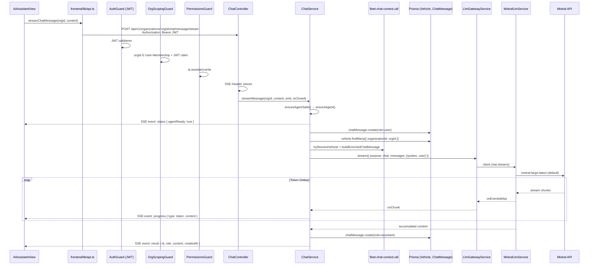
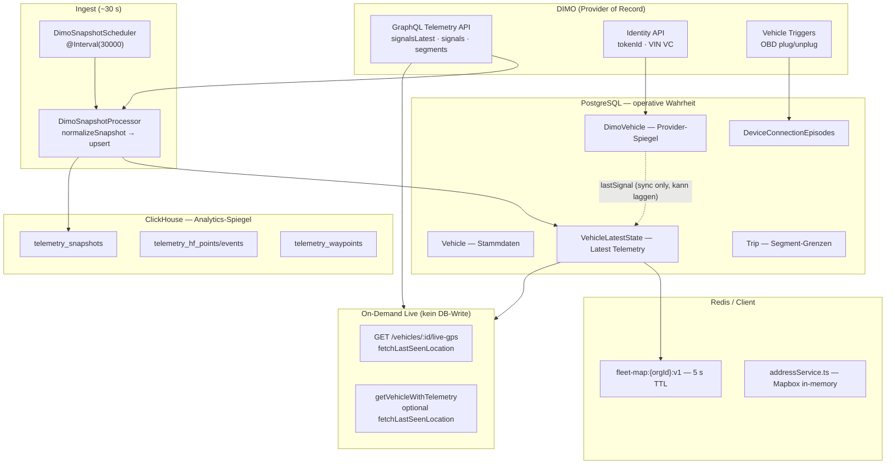
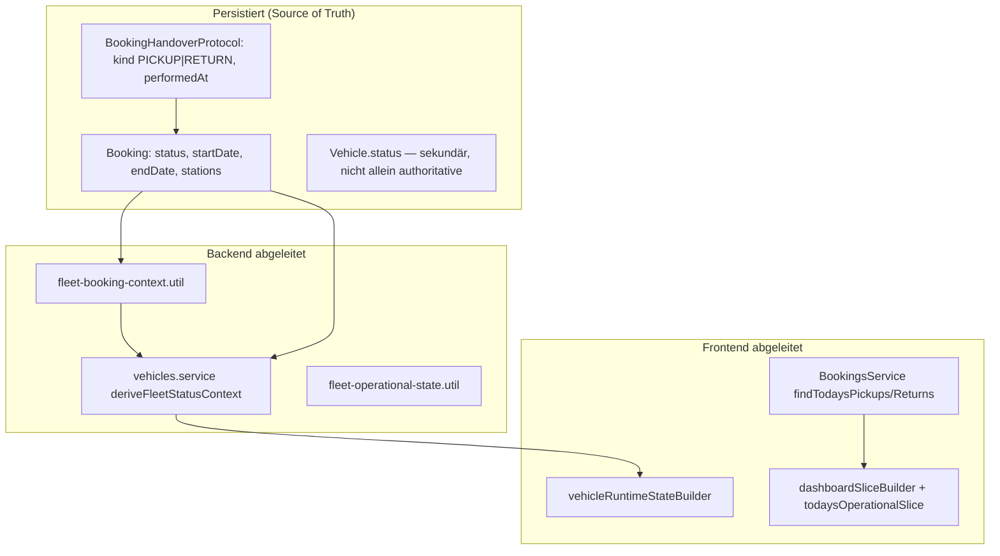
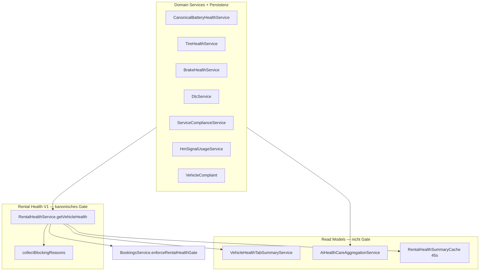

# SynqDrive AI-Agent — Ist-Audit der Chat-Runtime (Domain Grounding)

| Feld | Wert |
|------|------|
| **Phase** | Prompt 1–3 von 32 — Ist-Audit: Chat-Runtime, Telemetrie, Booking/Return, Vehicle Health (read-only) |
| **Datum** | 2026-07-24 (UTC) |
| **Repository** | `https://github.com/FATIHS-MGCKS/SYNQDRIVE-alpha` |
| **HEAD (Audit)** | `f5a5b4e3` — `fix(infra): Nginx HSTS/metrics hardening + CI typecheck drift (V4.9.809)` |
| **Methode** | Statische Code-Analyse, Architektur-/Changelog-Querprüfung, gezielte Unit-Tests (siehe Anhang B). **Keine produktiven Code-Änderungen.** |

> **Scope:** Fleet AI Assistant (Text-Chat im Rental-SPA). Verwandte, aber **separate** Assistenten-Pfade (Voice MCP/ElevenLabs, WhatsApp AI, Document Extraction, Vehicle/Tire Specs, DTC Research) werden als Kontext und Abgrenzung dokumentiert — nicht als Ziel dieser Prompt-Reihe umgebaut.

---

## 1. Komponentenübersicht

### 1.1 Fleet AI Assistant — Primärer Chat-Pfad

| Schicht | Pfad | Klasse / Export | Rolle |
|---------|------|-----------------|-------|
| **Frontend UI** | `frontend/src/rental/components/AIAssistantView.tsx` | `AIAssistantView` | Einzige Produktions-Chat-Oberfläche; lokaler State, SSE-Stream, Markdown-Rendering |
| **Frontend Routing** | `frontend/src/rental/App.tsx` | `currentView === 'ai-assistant'` | View-Switch ohne dedizierte URL-Route |
| **Frontend Navigation** | `frontend/src/rental/components/Sidebar.tsx` | Quick-Action + Nav-Eintrag | Desktop + Mobile-Drawer |
| **Frontend API** | `frontend/src/lib/api.ts` | `api.chat.*`, `streamChatMessage()` | REST + manueller SSE-Parser (POST + `ReadableStream`) |
| **Frontend Tenant** | `frontend/src/rental/RentalContext.tsx` | `useRentalOrg()` → `orgId` | Aktive Organisation aus Login/Org-Switch |
| **Frontend i18n** | `frontend/src/rental/i18n/translations/*.ts` | `aiChat.*`, `nav.aiAssistant` | 8 Locales; Suggestions/Capabilities-Texte |
| **Backend Controller** | `backend/src/modules/ai/chat/chat.controller.ts` | `ChatController` | REST + SSE unter `organizations/:orgId/chat/*` |
| **Backend Service** | `backend/src/modules/ai/chat/chat.service.ts` | `ChatService` | Orchestrierung: Agent-Metadaten, Fleet-Context, LLM, Persistenz |
| **Fleet Context** | `backend/src/modules/ai/chat/fleet-chat-context.util.ts` | `tryResolveVehicle`, `buildEnrichedChatMessage`, `FLEET_CHAT_SYSTEM_PROMPT` | Fahrzeugerkennung + Prompt-Anreicherung |
| **LLM Gateway** | `backend/src/modules/ai/llm/llm-gateway.service.ts` | `LlmGatewayService` | Provider-neutral: `complete`, `stream`, `completeJson` |
| **LLM Types** | `backend/src/modules/ai/llm/llm.types.ts` | `LlmMessage`, `LlmProvider`, … | Inkl. `tool`-Rolle im Typ — **nicht vom Chat genutzt** |
| **Mistral Provider** | `backend/src/modules/ai/providers/mistral/mistral-llm.service.ts` | `MistralLlmService` | Einziger aktiver LLM-Provider (`providerId = 'mistral'`) |
| **Mistral Client** | `backend/src/modules/ai/providers/mistral/mistral-sdk-client.provider.ts` | `MistralSdkClientProvider` | Shared SDK-Client, Timeout 120s |
| **AI Config** | `backend/src/config/ai.config.ts` | `registerAs('ai', …)` | `MISTRAL_*`, `AI_STREAMING_ENABLED`, `AI_EXTERNAL_ACTIONS_REQUIRE_APPROVAL` |
| **AI Module** | `backend/src/modules/ai/ai.module.ts` | `AiModule` | Wiring; exportiert `ChatService`, `LlmGatewayService` |
| **AI Health** | `backend/src/modules/ai/ai-health.controller.ts` | `AiHealthController` | `GET /api/v1/ai/health` — Konfigurationsstatus |
| **App Registration** | `backend/src/app.module.ts` | `AiModule` import | Globaler Throttler: 200 req/min/IP |
| **Datenmodell** | `backend/prisma/schema.prisma` | `OrganizationChatAgent`, `ChatMessage` | Org-scoped Chat-Metadaten + Nachrichten |
| **Tests** | `backend/src/modules/ai/chat/chat.service.spec.ts` | 3 Tests | Agent-Registrierung, Fleet-Enrichment, Config-Fehler |
| **Security Tests** | `backend/src/shared/auth/iam-endpoint-enforcement-triage.security.spec.ts` | ChatController-Guards | `OrgScopingGuard` + `PermissionsGuard` + `ai-assistant` |

### 1.2 Verwandte LLM-Pfade (gleiches Gateway, **nicht** Fleet-Chat)

| Pfad | Service | LLM-Methode | Auth |
|------|---------|--------------|------|
| `backend/src/modules/ai/documents/document-ai-extraction.service.ts` | `DocumentAiExtractionService` | `completeJson` | Job/Org-scoped |
| `backend/src/modules/ai/vehicle-specs/vehicle-spec-ai.service.ts` | `VehicleSpecAiService` | `complete` / `stream` | **Public** (`auth.guard.ts` Bypass) |
| `backend/src/modules/ai/vehicle-specs/tire-spec-ai.service.ts` | `TireSpecAiService` | `stream` | **Public** |
| `backend/src/modules/vehicle-intelligence/dtc-knowledge/dtc-ai-research.service.ts` | `DtcAiResearchService` | `completeJson` | Worker/Queue org-scoped |
| `backend/src/modules/ai/providers/mistral/mistral-ocr.service.ts` | `MistralOcrService` | OCR (kein Chat) | Document-Pipeline |

### 1.3 Parallele Assistenten-Architekturen (bewusst getrennt)

| Surface | Einstieg | LLM? | Tool Calling? | Anbindung an `ChatService` |
|---------|--------|------|---------------|----------------------------|
| **Fleet AI Assistant** | `ai/chat/*` | Mistral (`purpose: chat`) | **Nein** | — |
| **WhatsApp AI** | `whatsapp/*` | **Nein** (Regex + Templates) | Ja — `WhatsAppAiToolsService` | **Explizit nicht** (`whatsapp-ai-tools.service.ts` Kommentar) |
| **Voice Assistant** | `voice-assistant/*` + ElevenLabs | ElevenLabs (extern) | Ja — `voice-mcp-tools.registry.ts` | Nein |
| **Health Summary (AI Care)** | `rental-health/*` | **Nein** (deterministisch) | Nein | Nein |

**WhatsApp AI Kernklassen:**

- `backend/src/modules/whatsapp/whatsapp-ai-router.service.ts` — Intent-Routing, Policy, Audit
- `backend/src/modules/whatsapp/whatsapp-ai-tools.service.ts` — Buchungen, GPS, DTC via `VehiclesService`
- `backend/src/modules/whatsapp/whatsapp-ai-intent.util.ts` — Regex-Klassifikation
- `backend/src/modules/whatsapp/whatsapp-ai-reply.builder.ts` — Template-Antworten (kein LLM)
- `backend/src/modules/whatsapp/whatsapp-ai-context.service.ts` — Operativer Kontext

**Voice MCP Kernklassen:**

- `backend/src/modules/voice-mcp-gateway/voice-mcp-tools.service.ts`
- `backend/src/modules/voice-mcp-gateway/voice-mcp-tools.registry.ts`
- `backend/src/modules/voice-mcp-gateway/voice-mcp-rate-limit.service.ts`
- `backend/src/modules/voice-protection/voice-budget-enforcement.service.ts` — Kostenkontrolle (nur Voice)

### 1.4 Veraltete / doppelte Pfade

| Befund | Details |
|--------|---------|
| **DIMO Agents LLM entfernt** | Kein `DimoAgentsService`, kein `agents.dimo.zone` im aktiven Backend-Code (v4.9.146). Grep über `backend/src/**` liefert 0 Treffer. |
| **Legacy-Feld `dimoAgentId`** | `OrganizationChatAgent.dimoAgentId` speichert jetzt Provider-ID (`mistral` / `unconfigured`), nicht DIMO-Agent-UUID. |
| **Stale Frontend-Copy** | `AIAssistantView.tsx` zeigt „DIMO Agent Connected“, „Powered by DIMO Agents“ — widerspricht Mistral-Architektur. |
| **Stale Docs** | `docs/ai-document-upload.md` referenziert noch „DIMO Agent (JSON)“ — historisch, nicht Fleet-Chat. |
| **Figma-Prototyp** | `frontend/figma-rental/App.tsx` importiert `./components/AIAssistantView` — Datei existiert nicht; kein Produktionspfad. |
| **Ungenutzte API-Client-Methoden** | `api.chat.ensureAgent`, `api.chat.sendMessage` definiert, Frontend ruft sie nicht auf. |
| **Doppelter Transport** | `POST /message` (non-stream) und `POST /message/stream` — gleiche `ChatService`-Logik, Frontend nutzt nur Stream. |

### 1.5 Mock-Daten

- **Keine** Chat-Mocks in Produktionscode.
- Tests: Jest-Mocks für Prisma + `LlmGatewayService` in `chat.service.spec.ts`.
- `ensureAgent` bei fehlendem API-Key: `dimoAgentId: 'unconfigured'` in DB.

---

## 2. Vollständiger Request-/Response-Datenfluss

### 2.1 Sequenzdiagramm (Fleet Chat — Happy Path)



### 2.2 API-Endpunkte (`ChatController` @ `organizations/:orgId/chat`)

Basis: `/api/v1` (globaler Nest-Prefix)

| Methode | Route | Permission | Request | Response |
|---------|-------|------------|---------|----------|
| `GET` | `/agent` | `ai-assistant:read` | — | `{ agent: { agentName, dimoAgentId, createdAt } \| null, messageCount }` |
| `POST` | `/agent` | `ai-assistant:write` | `{}` | `{ agentName, dimoAgentId }` |
| `POST` | `/message` | `ai-assistant:write` | `{ content: string }` | `{ id?, role: 'assistant', content, createdAt }` |
| `POST` | `/message/stream` | `ai-assistant:write` | `{ content: string }` | **SSE** (siehe 2.3) |
| `GET` | `/history?limit&before` | `ai-assistant:read` | `limit` default 100 | `[{ id, role, content, createdAt }]` |
| `DELETE` | `/history` | `ai-assistant:write` | — | `{ cleared: true }` |

**Zusätzlich:** `GET /api/v1/ai/health` — **ohne** `@UseGuards` auf Controller-Ebene; liefert nur `{ configured, provider, activeProviderId, streamingEnabled }`.

### 2.3 SSE-Event-Schema (`POST .../message/stream`)

| Event | Payload | Frontend-Verarbeitung |
|-------|---------|----------------------|
| `status` | `{ agentReady: boolean }` | Setzt `agentReady` |
| `progress` | `{ type: 'token', content: string }` | Setzt `thinkingLabel` — **kein inkrementelles Rendering** |
| `result` | `{ id?, role, content, createdAt }` | Vollständige Assistant-Nachricht anhängen |
| `error` | `{ message: string }` | Als Assistant-Bubble mit Fehlertext |

**Streaming-Implementierung:**

- Backend: `ChatController.streamMessage` → `res.write('event: …\ndata: …\n\n')`
- Frontend: `streamChatMessage()` — POST + `fetch` + manueller SSE-Parser (nicht `EventSource`)
- `AI_STREAMING_ENABLED=false`: `LlmGatewayService.stream()` emuliert Stream via einmaligem `complete()`
- Frontend wartet auf `result` — Progress-Tokens werden nur als „Denke nach…“-Label genutzt, nicht als Live-Typing

### 2.4 Auth-, Mandanten- und Rechtefluss

```
JWT (AuthGuard global)
  → OrgScopingGuard (:orgId ∈ Membership, JWT claim match; MASTER_ADMIN Pass-through)
    → PermissionsGuard (Modul ai-assistant: read|write)
      → RolesGuard (kein @RequireRole auf Chat-Handlern)
        → ChatService (alle DB-Queries mit organizationId aus Route)
```

| Prüfung | Implementierung | Bewertung |
|---------|-----------------|-----------|
| Tenant-Isolation Route | `OrgScopingGuard` auf `ChatController` | ✅ Gehärtet (Security-Spec bestätigt) |
| Tenant-Isolation DB | `vehicle.findMany({ where: { organizationId: orgId } })`, `chatMessage.*` scoped | ✅ |
| Permission-Modul | `permission.constants.ts`: `'ai-assistant'` | ✅ Backend erzwingt |
| Default-Rollen | `organization-role.defaults.ts` — Admin/Manager enthalten `ai-assistant` | ✅ |
| Frontend Nav-Gate | Sidebar zeigt AI ohne `hasPermission`-Check | ⚠️ UI-only Gap |
| `GET /ai/health` | Unauthenticated | ⚠️ Nur Metadaten, keine Secrets |
| Vehicle Specs AI | Public auth bypass | ⚠️ Separater Pfad; `dimoVehicle.findFirst` ohne `organizationId` |

### 2.5 Fehler- und Fallback-Verhalten

| Bedingung | Verhalten | HTTP / SSE |
|-----------|-----------|------------|
| Leere Nachricht | Fest codiert: „Please enter a message to get started.“ | 200 / SSE `result` |
| `MISTRAL_API_KEY` fehlt | User-Message + persistierte Assistant-Antwort mit Config-Hinweis | 200 / SSE `result` |
| `ensureAgent` Fehler | Generische Verbindungsfehler-Message | 200 / SSE `result` |
| LLM-Exception | `sanitizeChatError()` — Bearer/sk redacted, max 300 Zeichen | User-facing Apology in `result` |
| Controller unhandled | Catch → Assistant-Error-Message | Kein HTTP 500 an Client |
| Prisma save failure | `.catch(() => {})` — **still** | Antwort kann ohne DB-ID zurückkommen |
| Stream-Verbindungsabbruch | Frontend `onDone` ohne `result` → „connection issue“ | Client-seitig |
| LLM liefert leer | `'No response received.'` | Persistiert |

**Hardcoded Fallback-Strings (Frontend, Englisch):**

- `AIAssistantView.tsx`: Verbindungsfehler, generischer Error, `onDone`-Fallback
- Thumbs up/down: **keine Handler** (dekorativ)

---

## 3. Aktuelle System-Prompts

### 3.1 Fleet Chat — `FLEET_CHAT_SYSTEM_PROMPT`

**Datei:** `backend/src/modules/ai/chat/fleet-chat-context.util.ts`

```
You are SynqDrive Fleet Assistant — a helpful AI for fleet and rental operators.
Answer clearly and practically. Do not invent vehicle telemetry, odometer readings, or live DIMO data you were not given.
When fleet context is attached, use it to identify which vehicle the user means.
Prefer German when the user writes in German.
```

### 3.2 Fleet Chat — User-Message-Anreicherung (`buildEnrichedChatMessage`)

Wenn `fleet.length > 0`, wird die User-Nachricht in folgendes Format eingebettet:

```
[Fleet context — {N} registered vehicles:
#1: {make} {model} {year}, plate="...", name="...", VIN=..., tokenId=..., fuel={fuelType}
...
Use this fleet data to identify vehicles when users refer to them by license plate, name, make/model, or VIN. Only reference live telemetry when a specific vehicle with tokenId is resolved.]
{optional resolution hint}
User message: {original user text}
```

**Resolution Hint** (wenn `tryResolveVehicle` matcht):

```
[System: The user is likely referring to vehicle "{make} {model} {year}" (plate: …), tokenId=…. Use this vehicle for data lookups.]
```

Wenn kein `tokenId`:

```
[System: This vehicle has no DIMO tokenId — do not claim live DIMO telemetry for it.]
```

### 3.3 Was **nicht** als System-Prompt existiert

- Kein dynamischer Org-Name / User-Name im System-Prompt
- Keine Rollen-/Rechte-Hinweise für das Modell
- Keine Tool-/Function-Definitionen
- Keine Conversation-History im LLM-Payload
- Keine Live-Telemetrie-, Buchungs-, Finanz- oder Task-Daten

### 3.4 Andere System-Prompts (nicht Fleet-Chat, Referenz)

| Feature | Datei | Zweck |
|---------|-------|-------|
| DTC Research | `backend/src/modules/vehicle-intelligence/dtc-knowledge/dtc-ai-research.schema.util.ts` | Strukturierte JSON-Ausgabe |
| Document Extraction | `backend/src/modules/ai/documents/document-ai-extraction.schema.util.ts` | OCR → JSON Schema |
| Vehicle Specs | `backend/src/modules/ai/vehicle-specs/vehicle-spec-ai.service.ts` (intern) | Spec-Extraktion |
| Voice Assistant | `backend/src/modules/voice-assistant/agent-deployment/*` | ElevenLabs Agent-Prompts |

---

## 4. Aktuelle Daten, die das Modell tatsächlich erhält

### 4.1 Pro Chat-Anfrage an Mistral (`ChatService.callLlm`)

**Message-Array (immer genau 2 Nachrichten):**

```typescript
[
  { role: 'system', content: FLEET_CHAT_SYSTEM_PROMPT },
  { role: 'user', content: enrichedMessage },
]
```

### 4.2 Inhalt von `enrichedMessage`

| Datenquelle | Methode | Felder |
|-------------|---------|--------|
| `vehicle` + `dimoVehicle` | `ChatService.getOrgFleetInfo(orgId)` | `vehicleId`, `licensePlate`, `vehicleName`, `make`, `model`, `year`, `vin`, `fuelType`, `tokenId` |
| Fahrzeugerkennung | `tryResolveVehicle(message, fleet)` | Regex/Substring über Kennzeichen, Name, Make+Model(+Year), VIN, `tokenId` |
| User-Text | Original `content` | Unverändert am Ende der Anreicherung |

### 4.3 Was das Modell **nicht** erhält (trotz UI-Claims)

| Domäne | UI suggeriert (i18n `aiChat.cap.*` / Suggestions) | Backend liefert |
|--------|---------------------------------------------------|-----------------|
| Flottenstatus live | ✅ | Nur statische Fahrzeug-Stammdaten |
| Umsatz / Finanzen | ✅ | ❌ Keine Buchungs-/Invoice-Daten |
| Buchungen heute | ✅ | ❌ |
| Wartung / Health | ✅ | ❌ Keine Health-Module, keine Tasks |
| Kunden | ✅ | ❌ |
| Aufgaben | ✅ | ❌ |
| DIMO Telemetrie | UI: „real-time telemetry“ | ❌ Nur `tokenId`-Hinweis; keine Live-Signale |
| Chat-Verlauf | UI zeigt History | ❌ Vorherige Turns nicht an LLM gesendet |

### 4.4 Persistierte vs. inferierte Daten

| Daten | Gespeichert (`chat_messages`) | An LLM gesendet |
|-------|------------------------------|-----------------|
| User-Nachrichten | ✅ `role=user` | Nur aktuelle Nachricht (enriched) |
| Assistant-Antworten | ✅ `role=assistant` | ❌ Nicht replayed |
| `tokenIds` aus Resolution | ❌ | Nur indirekt im enriched text; `resolveChatVehicleTokenIds` nur für **Logging** |

### 4.5 Modell- und Provider-Konfiguration

| Env-Variable | Default | Verwendung Chat |
|--------------|---------|-----------------|
| `AI_PROVIDER` | `mistral` | Provider-Auswahl in `ai.module.ts` |
| `MISTRAL_API_KEY` | — | Pflicht für `isConfigured()` |
| `MISTRAL_CHAT_MODEL` | `mistral-large-latest` | `purpose: 'chat'` |
| `MISTRAL_BASE_URL` | optional | Custom Endpoint |
| `AI_STREAMING_ENABLED` | `true` | Stream vs. Complete-Fallback |

**Timeout:** 120s (`mistral-sdk-client.provider.ts`)

**Token Usage:** Mistral liefert `usage` in `LlmCompleteResult` — `ChatService` loggt/billt es **nicht**.

---

## 5. Erkannte Risiken

### 5.1 Domain Grounding / Halluzinationsrisiko

| ID | Risiko | Schwere | Evidenz |
|----|--------|---------|---------|
| R1 | **Modell antwortet ohne echte Domänendaten** — Umsatz, Buchungen, Wartung, Tasks werden impliziert unterstützt, Backend liefert nur Fleet-Stammdaten | **Hoch** | UI Capabilities vs. `callLlm` Payload |
| R2 | **Kein Conversation History Replay** — Multi-Turn nur visuell; Modell hat keinen Kontext vorheriger Turns | **Hoch** | `callLlm` sendet nur 2 Messages |
| R3 | **Kein Tool/Function Calling** — keine Live-Abfragen an SynqDrive-Services oder DIMO | **Hoch** | `LlmMessageRole: 'tool'` ungenutzt |
| R4 | System-Prompt verbietet Erfindung, aber ohne Daten kann Modell trotzdem raten | **Mittel** | Prompt allein reicht nicht |
| R5 | `tokenId`-Resolution suggeriert „data lookups“, aber es gibt keine Lookups | **Mittel** | `resolutionHint` Text |

### 5.2 Veraltete Architektur-Referenzen

| ID | Risiko | Schwere | Evidenz |
|----|--------|---------|---------|
| R6 | Frontend behauptet DIMO Agents API | **Mittel** | `AIAssistantView.tsx` Zeilen 322, 354, 564 |
| R7 | API-Feld `dimoAgentId` irreführend | **Niedrig** | Speichert `mistral` |
| R8 | `docs/ai-document-upload.md` DIMO-Agent-Referenzen | **Niedrig** | Separater Flow |

### 5.3 Tenant / Security

| ID | Risiko | Schwere | Evidenz |
|----|--------|---------|---------|
| R9 | Fleet-Chat Tenant-Isolation | **Niedrig (OK)** | Guards + org-scoped Queries |
| R10 | Vehicle Specs: `dimoVehicle.findFirst` ohne `organizationId` | **Mittel** | `vehicle-specs.controller.ts:resolveVehicleParams` — Cross-Tenant tokenId/VIN Lookup |
| R11 | VIN + Kennzeichen aller Org-Fahrzeuge im LLM-Prompt | **Mittel** | Daten an externen Provider (Mistral); DSGVO/Vertraulichkeit |
| R12 | Frontend ohne Permission-Gate | **Niedrig** | API blockt; UX zeigt ggf. Fehler |

### 5.4 Betrieb / Kosten / Nachvollziehbarkeit

| ID | Risiko | Schwere | Evidenz |
|----|--------|---------|---------|
| R13 | **Keine Chat-spezifischen Rate Limits** — nur global 200/min/IP | **Mittel** | `app.module.ts` ThrottlerModule |
| R14 | **Keine Token-/Kosten-Tracking** für Fleet-Chat | **Mittel** | `usage` wird verworfen |
| R15 | **Keine Audit-Trail pro Antwort** (Quellen, Tools, Modell-Version) | **Hoch** | Nur `chat_messages.content` |
| R16 | Stille DB-Persistenz-Fehler | **Mittel** | `.catch(() => {})` in `saveUserMessage` / `persistAssistant` |
| R17 | Feedback (Thumbs) nicht angebunden | **Niedrig** | Keine Handler |
| R18 | `GET /ai/health` unauthenticated | **Niedrig** | Keine Secrets |

### 5.5 Frontend / Mobile (technisch)

| ID | Risiko | Schwere | Evidenz |
|----|--------|---------|---------|
| R19 | **Kein responsives Layout** — feste 260px Sidebar + `max-w-[1400px]` | **Mittel** | Keine `sm:`/`lg:` Breakpoints |
| R20 | Kein inkrementelles Stream-Rendering trotz SSE | **Niedrig** | UX-Latenz wahrnehmbar |
| R21 | Hardcoded englische Fehlertexte trotz DE-i18n | **Niedrig** | `AIAssistantView.tsx` |

### 5.6 Doppelte AI-Pfade (Abgrenzung)

| Pfad | Risiko |
|------|--------|
| WhatsApp AI vs. Fleet Chat | Bewusst getrennt — WhatsApp hat echte Tool-Calls, Fleet Chat nicht |
| Voice MCP vs. Fleet Chat | Voice hat Budget + Rate Limits; Fleet Chat nicht |
| Document/Specs/DTC vs. Fleet Chat | Gleiches Mistral-Gateway, unterschiedliche Auth und Prompts |

---

## 6. Offene Fragen für die nächsten Audit-Prompts

### 6.1 Domain Grounding & Tools

1. Soll Fleet-Chat **Tool Calling** gegen SynqDrive-Domänenservices bekommen (Buchungen, Tasks, Health, Finanzen) — analog WhatsApp `WhatsAppAiToolsService`?
2. Soll **DIMO Telemetrie** über bestehende `VehiclesService`/Snapshot-Pfade eingebunden werden, wenn `tokenId` resolved ist?
3. Wie viel **Conversation History** soll ans Modell (Sliding Window, Summarization, letzte N Turns)?
4. Sollen UI-Capabilities **an Backend-Fähigkeiten gekoppelt** oder bewusst reduziert werden?

### 6.2 Architektur & Migration

5. Wann wird `OrganizationChatAgent.dimoAgentId` → `llmProviderId` migriert / Tabelle bereinigt?
6. Soll `ChatService` mit WhatsApp-/Voice-Tool-Registry **konvergieren** oder getrennt bleiben?
7. Braucht Fleet-Chat einen **eigenen Audit-/Trace-Record** (model, usage, context hash, resolved vehicleIds)?

### 6.3 Security & Compliance

8. Ist die Weitergabe von **VIN/Kennzeichen** an Mistral für alle Tenants akzeptiert (AVV/DPA)?
9. Soll `GET /ai/health` authentifiziert werden?
10. Soll Vehicle-Specs-Public-Bypass (`auth.guard.ts`) org-scoped werden?

### 6.4 Betrieb & Kosten

11. Welche **Rate Limits / Quotas** pro Org/User für Chat?
12. Soll Token-Usage in ein **Usage Ledger** (wie Voice `VoiceBudgetEnforcementService`)?
13. Welches **Modell-Routing** (`router` purpose existiert, wird im Chat nicht genutzt)?

### 6.5 Frontend

14. Wann **DIMO → Mistral/SynqDrive** Copy-Cleanup?
15. **Mobile Layout** — Sidebar collapsible / WhatsApp-Pane-Pattern?
16. **Inkrementelles Streaming** im UI?
17. **Permission-Gate** in Sidebar + `hasPermission('ai-assistant')`?
18. Feedback-Loop (Thumbs) — Speicherung / Fine-tuning Pipeline?

### 6.6 Test & Verifikation

19. Fehlende Tests: `fleet-chat-context.util.ts`, `ChatController` SSE, `streamChatMessage` Frontend?
20. E2E-Test für „Suggestion Umsatz“ → erwartetes „keine Daten“-Verhalten nach Tool-Integration?

---

## Anhang A — Abhängigkeitsgraph (vereinfacht)

```
AIAssistantView
  → useRentalOrg (orgId)
  → api.chat.getAgent | getHistory | clearHistory
  → streamChatMessage
      → POST /organizations/:orgId/chat/message/stream

ChatController
  → ChatService
      → PrismaService (OrganizationChatAgent, ChatMessage, Vehicle, Organization)
      → LlmGatewayService
          → MistralLlmService (LLM_PROVIDER)
              → MistralSdkClientProvider
                  → @mistralai/mistralai SDK
      → fleet-chat-context.util
```

## Anhang B — Statische Prüfungen (ausgeführt)

### Prompt 1

| Prüfung | Ergebnis |
|---------|----------|
| `npm test --testPathPattern='chat\.service\|iam-endpoint-enforcement-triage'` | 14/14 PASS |
| Grep `DimoAgentsService` / `agents.dimo.zone` in `backend/src` | 0 Treffer |
| Grep `FLEET_CHAT_SYSTEM_PROMPT` | 1 Definition, 1 Verwendung (`chat.service.ts`) |

### Prompt 2

| Prüfung | Ergebnis |
|---------|----------|
| `telemetry-freshness.resolver.spec.ts` | PASS |
| `vehicle-state-interpreter.spec.ts` | PASS |
| `vehicle-connectivity-runtime-state.builder.spec.ts` | 42/42 PASS (3 Suites) |
| `connectivity-cross-surface-regression.test.ts` | 19/19 PASS |
| `DimoSnapshotProcessor` → `VehicleLatestState` upsert | Einziger Schreibpfad (verifiziert) |

### Prompt 3

| Prüfung | Ergebnis |
|---------|----------|
| `booking-lifecycle-status.matrix.spec.ts` | PASS |
| `rental-health.service.spec.ts` | PASS (inkl. fail-closed gate) |
| Grep `HandoverStatus` / `ReturnStatus` in Prisma | **Kein Enum** — nur abgeleitet |
| Grep `RentalHealth` in `backend/src/modules/ai/chat` | 0 Treffer — AI-Chat ohne Health/Booking |

## Anhang C — Änderungshistorie (relevant)

Aus `frontend/src/master/components/ChangesView.tsx`:

- **v4.9.143–146:** Migration Fleet Chat von DIMO Agents → Mistral `LlmGatewayService`
- **v4.9.146:** Final DIMO Agents cleanup; `GET /api/v1/ai/health` ersetzt `GET /dimo/agents/health`

---

# Prompt 2 — Fahrzeug- & Telemetrie Source of Truth

## 7. Telemetrie-Architektur (Schichtenmodell)



### 7.1 Kanonische Schreib- und Lesepfade

| Schicht | Mechanismus | Cadence | Persistenz | Primärer Consumer |
|---------|-------------|---------|------------|-------------------|
| **Snapshot-Poll** | `DimoSnapshotProcessor` → `DimoTelemetryService.fetchLatestVehicleSnapshot` | ~30 s (`DimoSnapshotScheduler`) | `VehicleLatestState` (+ optional CH `telemetry_snapshots`) | Fleet Map, Connectivity, Trip-FSM, Battery V2 |
| **Live-GPS-Proxy** | `VehiclesService.getLiveGps` → `fetchLastSeenLocation` | Frontend 5 s bei Tracking | **Kein DB-Write** | `OverviewLiveMapCard`, `useLiveVehicleTelemetry` |
| **Telemetry-Detail** | `GET /vehicles/:id/telemetry` → `getVehicleWithTelemetry` | Frontend ~30 s | Liest VLS; optional Live-GPS-Overlay | Vehicle Detail (alle Tabs) |
| **Identity-Sync** | `DimoApiSyncService` → `fetchVehicleSummary` | Bei Pairing/Sync | `DimoVehicle.*` Spiegel | Master DIMO-Views, initiale Spiegelung |
| **Segment-Historie** | `DimoSegmentsService` GraphQL `segments` | On-demand / Reconciliation | PostgreSQL `Trip` | Trip Detail, Route, Verhalten |
| **Signal-Historie** | DIMO `signals(interval: …)` innerhalb Trip-Fenster | On-demand | DIMO API (+ CH HF wenn `HF_MIRROR_ENABLED`) | Trip Enrichment, Data Analyse, Battery |
| **Fleet-Map-Bulk** | `GET /fleet-map` → `getFleetMapData` | Redis 5 s Cache | Liest VLS + `deriveFleetStatusContext` | `FleetHubView`, Dashboard |

**Regel:** Für operative UI und Backend-Logik ist **`VehicleLatestState` (geschrieben durch `DimoSnapshotProcessor`) die kanonische Latest-Telemetrie**. ClickHouse ist ein fire-and-forget Analytics-Spiegel — nie für Live-UI. `getLiveGps` ist ein bewusster DIMO-Direktpfad für Sub-30s-Kartenanimation ohne Persistenz.

### 7.2 Zentrale Methoden (verifizierte Namen)

| Methode | Datei | Zweck |
|---------|-------|-------|
| `fetchLatestVehicleSnapshot` | `backend/src/modules/dimo/dimo-telemetry.service.ts` | Vollständiges `signalsLatest` (Snapshot-Poll) |
| `fetchLastSeenLocation` | `backend/src/modules/dimo/dimo-telemetry.service.ts` | Leichtgewicht GPS + Speed (Live-Map) |
| `fetchVehicleSummary` | `backend/src/modules/dimo/dimo-telemetry.service.ts` | Odometer, SOC, Fuel, Speed für Identity-Sync |
| `normalizeSnapshot` | `backend/src/workers/processors/dimo-snapshot.processor.ts` | DIMO → `VehicleLatestState` Feld-Mapping |
| `interpretVehicleState` | `backend/src/modules/vehicles/vehicle-state-interpreter.ts` | Display-State (MOVING/IDLE/PARKED), 3-State `onlineStatus` |
| `classifyTelemetryFreshness` | `backend/src/modules/vehicles/vehicle-state-interpreter.ts` | 5-State Freshness (<15m / <24h / <48h) |
| `resolveCanonicalTelemetryObservedAtMs` | `backend/src/modules/vehicles/telemetry-freshness.resolver.ts` | Timestamp-Priorität für Freshness |
| `resolveTelemetryFreshness` | `backend/src/modules/vehicles/telemetry-freshness.resolver.ts` | Backend-kanonische Freshness-Auflösung |
| `deriveFleetStatusContext` | `backend/src/modules/vehicles/vehicles.service.ts` | Fleet-Status, Odometer, Fuel/SOC, Booking-Kontext |
| `resolveFuelPercent` / `resolveFuelPercentOrNull` | `backend/src/modules/vehicles/vehicles.service.ts` | Tankstand-Berechnung aus rel/abs Signalen |
| `VehicleConnectivityRuntimeStateBuilder.build` | `backend/src/modules/vehicles/connectivity/domain/vehicle-connectivity-runtime-state.builder.ts` | Connectivity Runtime (inkl. `resolveTelemetryState`) |
| `deriveTelemetryState` | `frontend/src/rental/components/dashboard/runtime/vehicleRuntimeStateBuilder.ts` | Dashboard 4-State (`live`/`standby`/`soft_offline`/`offline`/`unknown`) |
| `resolveTelemetryFreshness` | `frontend/src/rental/lib/telemetryFreshness.ts` | Frontend-kanonische 5-State Freshness |
| `normalizePlate` | `backend/src/modules/ai/chat/fleet-chat-context.util.ts` | AI-Chat Kennzeichen (kompakt, ohne Leerzeichen) |
| `normalizeVehiclePlate` | `backend/src/modules/document-extraction/vehicle-candidate-matching.util.ts` | Document Intake (strip `[\s\-._/]+`) |

---

## 8. Source-of-Truth-Matrix

Spalten: **Fachinformation** | **Primäre Quelle** | **Fallback** | **Berechnungslogik** | **Freshness-Regel** | **UI-Seiten** | **Backend-Services** | **AI verfügbar?** | **Inkonsistenzen**

### 8.1 Identität & Stammdaten

| Fachinformation | Primäre Quelle | Fallback | Berechnungslogik | Freshness | UI-Seiten | Backend-Services | AI? | Inkonsistenzen |
|-----------------|----------------|----------|------------------|-----------|-----------|------------------|-----|----------------|
| **Interne Fahrzeug-ID** | `Vehicle.id` (UUID) | — | Bei Registrierung vergeben | Statisch | Alle Vehicle-Views, Bookings, Tasks | `VehiclesService`, Prisma | Nur indirekt (nicht im Prompt) | — |
| **Kennzeichen** | `Vehicle.licensePlate` | — | Manuell / Document Intake | Statisch bis Edit | Fleet Map, Detail-Header, Bookings, Invoices | `VehiclesService`, Document Extraction | ✅ Text im Fleet-Context | **3 Normalisierungen:** `normalizePlate` (AI, kompakt), `normalizeVehiclePlate` (Docs), Voice MCP `equals insensitive` (exakt) |
| **VIN** | `Vehicle.vin` (Registrierung) | `DimoVehicle.vin` via `fetchVehicleVin` (Sync) | Operator-Eingabe gewinnt bei Register | Bei DIMO-Sync | Vehicle Detail, Settings, Document Intake | `DimoApiSyncService`, `VehiclesService` | ✅ Text im Fleet-Context | Mirror kann hinter `Vehicle.vin` liegen |
| **Make / Model / Year** | `Vehicle.make/model/year` | `DimoVehicle.*` (Sync) | Registrierung + DIMO Mirror | Statisch / Sync | Fleet, Detail, Bookings | `VehiclesService`, `DimoVehicleSyncService` | ✅ Text im Fleet-Context | — |
| **Fahrzeugname** | `Vehicle.vehicleName` | — | Manuell | Statisch | Fleet, Detail | `VehiclesService` | ✅ Text + Resolution-Hint | — |
| **Kraftstofftyp** | `Vehicle.fuelType` (Enum) | `DimoVehicle.fuelType` / `powertrainType` | Registrierung | Statisch | Fleet, Detail, Fuel/EV UI | `VehiclesService` | ✅ `fuel={fuelType}` im Prompt | EV vs. Verbrenner steuert Fuel vs. SOC Anzeige |
| **DIMO Token ID** | `DimoVehicle.tokenId` | `rawJson.syntheticDevice.tokenId` (Display) | Pairing / Identity Sync | Bei Sync | Master Fleet Connection (maskiert) | `DimoApiSyncService`, Snapshot Processor | ✅ `tokenId=N` im Fleet-Context | Ohne tokenId: System-Hint „keine Live-Telemetrie“ — aber keine echten Daten geladen |
| **Provider-Link / Pairing** | `DimoVehicle.connectionStatus` + `Vehicle.dimoVehicleId` | — | DIMO Identity + Auth | Bei Sync | Fleet Connectivity, Master | `DimoApiSyncService`, Connectivity Runtime | ❌ Nur Existenz von tokenId | `DimoVehicle.lastSignal` kann hinter VLS liegen |

### 8.2 Position & Adresse

| Fachinformation | Primäre Quelle | Fallback | Berechnungslogik | Freshness | UI-Seiten | Backend-Services | AI? | Inkonsistenzen |
|-----------------|----------------|----------|------------------|-----------|-----------|------------------|-----|----------------|
| **Koordinaten (operativ)** | `VehicleLatestState.latitude/longitude` | `getLiveGps` → DIMO `currentLocationCoordinates`; `getVehicleWithTelemetry` → `fetchLastSeenLocation` wenn fehlend oder `isLiveTracking` | `normalizeSnapshot` aus `signalsLatest.currentLocationCoordinates` | `lastSeenAt` / `sourceTimestamp`; Live-GPS = Echtzeit | Fleet Map, Overview Map, Connectivity Detail | `DimoSnapshotProcessor`, `VehiclesService.getLiveGps`, `getVehicleWithTelemetry` | ❌ | Live-GPS schreibt nicht in DB; Map kann neuer sein als Fleet-List |
| **Letzter bekannter Standort (Zeit)** | `VehicleLatestState.lastSeenAt` | `VehicleLatestState.sourceTimestamp` (Provider-observed) | DIMO `signalsLatest.lastSeen` → `normalizeSnapshot` | Siehe Freshness-Matrix | Fleet, Detail, Connectivity | Snapshot Processor, `telemetry-freshness.resolver` | ❌ | `interpretVehicleState` nutzt nur `lastSeenAt`, nicht volle Timestamp-Priorität |
| **Geschwindigkeit** | `VehicleLatestState.speedKmh` | `getLiveGps` speed; Legacy `0` in DTOs | `numVal(signals.speed)`; Display: `null` wenn stale | Fresh wenn `<15 min` für `displaySpeed` | Fleet Map, Detail Telemetry, Live Map | `normalizeSnapshot`, `interpretVehicleState` | ❌ | Legacy `speed` Feld = `0` statt `null` in `getVehicleWithTelemetry` |
| **Aufgelöste Adresse** | **Keine Backend-Quelle** | Frontend `addressService.ts` → Mapbox Reverse Geocode | Client-seitig aus Koordinaten | Mapbox-Cache; Stale-Hint 15 min | Map Popups, Overview | — (nur Client) | ❌ | Adresse existiert nirgends serverseitig; AI kann sie nicht kennen |

### 8.3 Betriebszustand

| Fachinformation | Primäre Quelle | Fallback | Berechnungslogik | Freshness | UI-Seiten | Backend-Services | AI? | Inkonsistenzen |
|-----------------|----------------|----------|------------------|-----------|-----------|------------------|-----|----------------|
| **Zündung** | `VehicleLatestState.isIgnitionOn` | — | DIMO `isIgnitionOn >= 0.5` | Nur wenn fresh (`<15 min`): sonst `UNKNOWN` | Detail Telemetry, Dashboard | `normalizeSnapshot`, `interpretVehicleState` | ❌ | EVs oft `null`; getrennt von OBD-Plug-Signal |
| **Kilometerstand (live)** | `VehicleLatestState.odometerKm` | `Vehicle.mileageKm` (manuell); `DimoVehicle.odometerKm` (Sync-Spiegel) | `powertrainTransmissionTravelledDistance`; `deriveFleetStatusContext` → `Math.floor` | Snapshot ~30 s | Fleet, Detail, Active Booking km-Delta | `normalizeSnapshot`, `deriveFleetStatusContext`, `fetchPickupOdometerMap` | ❌ | **Dual source:** manuell vs. Telemetrie; Document Extraction bevorzugt `latestState` dann `mileageKm` |
| **Tankstand (Verbrenner)** | `VehicleLatestState.fuelLevelRelative` + `fuelLevelAbsolute` | `DimoVehicle.fuelPercent` (nur Sync) | `resolveFuelPercent`: Timestamp-Vergleich rel/abs; inferierte Tankkapazität; Default 50 L | Signal-Timestamps in `rawPayloadJson` | Fleet Map Marker, Detail | `resolveFuelPercent`, `resolveFuelPercentOrNull` | ❌ | Legacy `fuel` = `0` wenn unbekannt; kanonisch nullable `fuelPercent` |
| **Ladezustand (EV SOC)** | `VehicleLatestState.evSoc` | `DimoVehicle.batteryPercent` (Sync) | `mapDimoBatterySignals` → traction battery SOC | Snapshot ~30 s | Fleet, Detail, Battery Health | `normalizeSnapshot`, Battery-Module | ❌ | Sync-Spiegel kann laggen |
| **Außentemperatur** | **Nicht in VLS** | DIMO `exteriorAirTemperature` via `buildEnvironmentTemperatureQuery` (Trip-Scoped) | 2-Min-Buckets innerhalb Segment-Fenster | Trip-/Segment-Zeit | Battery Health (trip-derived), Trip Detail | `DimoSegmentsService` | ❌ | **Kein Live-Feld** — nur historisch pro Trip |
| **Kühlmitteltemp.** | `VehicleLatestState.coolantTempC` | — | `powertrainCombustionEngineECT` | Nur wenn fresh für Display | Detail Telemetry | `normalizeSnapshot`, `interpretVehicleState` | ❌ | — |

### 8.4 Connectivity & Freshness

| Fachinformation | Primäre Quelle | Fallback | Berechnungslogik | Freshness | UI-Seiten | Backend-Services | AI? | Inkonsistenzen |
|-----------------|----------------|----------|------------------|-----------|-----------|------------------|-----|----------------|
| **Telemetrie-Freshness (5-State)** | `resolveTelemetryFreshness` / `classifyTelemetryFreshness` | — | `<15m live`, `<24h standby`, `<48h signal_delayed`, `≥48h offline`, kein TS → `no_signal` | Timestamp-Priorität: `sourceTimestamp` → `lastValidTelemetryAt` → `receivedAt`* → `DimoVehicle.lastSignal` → `lastSeenAt`/`updatedAt` (*mit Backfill-Guard 15 min) | Fleet Connectivity, Detail Badges, Dashboard | `telemetry-freshness.resolver.ts`, `vehicle-state-interpreter.ts`, FE `telemetryFreshness.ts` | ❌ | `interpretVehicleState` klassifiziert nur über `lastSeenAt`, nicht volle Evidence-Kette |
| **Legacy `onlineStatus` (3-State)** | `interpretVehicleState` | — | ONLINE `<15m`, STANDBY `<24h`, sonst OFFLINE | Nur `lastSeenAt` | Ältere API-Felder, Fleet DTOs | `vehicle-state-interpreter.ts` | ❌ | **Standby + signal_delayed** beide → OFFLINE in 3-State |
| **Dashboard `telemetryState` (4-State)** | `deriveTelemetryState` (Frontend) | `unknown` wenn kein Timestamp | `live` / `standby` / `soft_offline` / `offline`; `hasFreshLiveHint` kann live erzwingen | `max(lastSignal, lastSeen, …)` — **ohne** Backfill-Guard | Dashboard Runtime Board, Station Command | `vehicleRuntimeStateBuilder.ts` | ❌ | `soft_offline` ≠ Backend `signal_delayed` (Naming); Timestamp-Input einfacher |
| **Connectivity `overallState`** | `VehicleConnectivityRuntimeStateBuilder` | — | Komposition: Provider-Link + `telemetryState` + OBD-Episodes + Data Coverage | `resolveTelemetryState` → `classifyTelemetryFreshness` auf `lastTelemetryAt` | Fleet Connectivity Tab | `vehicle-connectivity-runtime-state.builder.ts`, `VehicleConnectivityRuntimeProjectionService` | ❌ | OBD unplug episodes können offen bleiben trotz Live-Telemetrie (P0-Audit-Risiko) |
| **OBD Plug-Status** | Webhook `DeviceConnectionEpisodes` + Runtime Builder | Snapshot `rawPayloadJson.obdIsPluggedIn` | `extractObdPlugSignalFromSnapshot`; Episode-Reconciliation | Episode-basiert + Snapshot-Recovery | Fleet Connectivity, Device Connection Card | `DeviceConnectionEpisodeResolutionService`, Connectivity Runtime | ❌ | **Drei Wahrheiten:** Snapshot raw, Webhook episodes, Runtime synthesis |
| **Letztes Signal (Mirror)** | `DimoVehicle.lastSignal` | `VehicleLatestState.lastSeenAt` | `fetchVehicleSummary` bei Identity-Sync | Nur bei Sync aktualisiert (~nicht 30s) | Master DIMO Views | `DimoApiSyncService` | ❌ | Kann **stunden** hinter VLS liegen |
| **Provider `online` Boolean** | `VehicleLatestState.online` | `interpreted.isFresh` | Processor setzt aus Freshness | `<15 min` | Fleet DTO `online` | Snapshot Processor + Interpreter | ❌ | `online:false` möglich bei `telemetryFreshness: standby` |

### 8.5 Historische & Analytische Daten

| Fachinformation | Primäre Quelle | Fallback | Berechnungslogik | Freshness | UI-Seiten | Backend-Services | AI? | Inkonsistenzen |
|-----------------|----------------|----------|------------------|-----------|-----------|------------------|-----|----------------|
| **Trip-Grenzen** | DIMO Segments → PostgreSQL `Trip` | — | `DimoSegmentsService` + Reconciliation | Segment `startedAt`/`endedAt` | Trip Detail, Fleet Trips | `DimoSegmentsService`, Trip Module | ❌ | Architektur-Regel: Segments = kanonisch |
| **Route-Geometrie** | DIMO `signals` innerhalb Trip-Fenster | ClickHouse `telemetry_waypoints` | Historische Signal-Rekonstruktion | Trip-Zeitfenster | Trip Map | `DimoSegmentsService`, CH Waypoints | ❌ | CH optional / best-effort |
| **HF-Verhalten (1s)** | DIMO HF Query | ClickHouse `telemetry_hf_*` wenn `HF_MIRROR_ENABLED` | Post-Trip Enrichment | Trip-abgeschlossen | Data Analyse, Trip Evidence | `TripBehaviorEnrichmentService`, `ClickHouseHfService` | ❌ | CH ≠ operative Wahrheit |
| **Snapshot-Historie** | ClickHouse `telemetry_snapshots` | — | Dual-Write aus Processor (fire-and-forget) | `recordedAt` | Data Analyse, Ops | `ClickHouseTelemetryService` | ❌ | Leerer CH ≠ fehlende PG-Daten |
| **Position-Updates (PG)** | `VehiclePositionUpdate` | — | Separates Modell (nicht primärer Live-Pfad) | `recordedAt` | — | Prisma | ❌ | Parallel zu VLS; nicht Haupt-UI-Pfad |

### 8.6 Caches

| Cache | Key / Ort | TTL | Inhalt | Invalidierung |
|-------|-----------|-----|--------|---------------|
| Fleet Map | Redis `fleet-map:{orgId}:v1` | ~5 s (set in `getFleetMapData`) | Serialisierte `FleetMapVehicleDto[]` | `FleetMapCacheService.invalidate` |
| DIMO Vehicle JWT | Redis via `DimoAuthService` | Token-Lifetime | Vehicle-scoped JWT | Auth refresh |
| Rental Health Summary | Redis `rental-health:summary:{orgId}:{vehicleId}` | Config-driven | Health summary per vehicle | Cache service |
| Reverse Geocode | Client `Map` in `addressService.ts` | Pro Koordinaten-Key | Mapbox-Adresse | Client-only |
| Fleet Map (kein Redis) | — | — | `/telemetry`, `/live-gps` uncached | — |

---

## 9. API-Live-Abfrage vs. gespeicherte Daten

| Aspekt | Gespeichert (`VehicleLatestState`) | Live-API (`getLiveGps` / `fetchLastSeenLocation`) |
|--------|-----------------------------------|--------------------------------------------------|
| **Schreibpfad** | `DimoSnapshotProcessor` alle ~30 s | Kein Write |
| **Latenz** | Bis ~30 s + Queue | Echtzeit DIMO Round-Trip |
| **Auth** | Worker (intern) | `DataAuthorization` GPS_LOCATION für Org |
| **Felder** | Vollständiger Snapshot (Speed, Fuel, Ignition, …) | Primär GPS + Speed |
| **Verwendung** | Fleet Map Bulk, Connectivity, Fleet List | Overview Live Map Animation |
| **`getVehicleWithTelemetry`** | Liest VLS primär | Ruft `fetchLastSeenLocation` wenn coords fehlen **oder** `isLiveTracking` |

**Regel für künftige AI-Tools:** Operative Antworten sollten **`VehicleLatestState` + `resolveTelemetryFreshness`** als Default nutzen; Live-GPS nur wenn Freshness `live` und Sub-30s-Genauigkeit nötig — mit explizitem `source: 'live'` vs. `'snapshot'` in der Tool-Antwort.

---

## 10. Duplizierte Berechnungen & Inkonsistenzen (Querschnitt)

| # | Thema | Stellen | Auswirkung |
|---|-------|---------|------------|
| I1 | **Drei Freshness-Vokabulare** | BE 5-State (`signal_delayed`), FE Dashboard 4-State (`soft_offline`), Legacy 3-State (`onlineStatus`) | Gleiche Schwellen (15m/24h/48h), unterschiedliche Namen und Timestamp-Inputs |
| I2 | **Timestamp-Priorität** | `telemetry-freshness.resolver` (voll) vs. `interpretVehicleState` (nur `lastSeenAt`) vs. `deriveTelemetryState` (max mehrerer Felder) | Dashboard/Fleet können bei Backfill-Ingest divergieren |
| I3 | **Kennzeichen-Normalisierung** | AI `normalizePlate`, Docs `normalizeVehiclePlate`, Voice Prisma `insensitive` | Cross-Module Matching kann scheitern (`M-AB 123` vs. `MAB123`) |
| I4 | **Dual Odometer** | `Vehicle.mileageKm` vs. `VehicleLatestState.odometerKm` vs. `DimoVehicle.odometerKm` | UI: Telemetrie first; Docs: latestState then mileageKm |
| I5 | **Dual Fuel/SOC Mirror** | VLS (30 s) vs. `DimoVehicle` (Sync) | Master-Views können veraltete Werte zeigen |
| I6 | **Legacy `0` vs. `null`** | `mapToVehicleData.fuel/speed` vs. `fuelPercent`/`displaySpeed` | „0%“ statt „—“ in älteren Consumern |
| I7 | **OBD Plug drei Wahrheiten** | Snapshot raw, Webhook episodes, Runtime builder | Bekanntes P0 in Fleet-Connectivity-Audits |
| I8 | **Adresse nur Client** | `addressService.ts` | Backend/AI haben keine strukturierte Adresse |
| I9 | **Außentemp. nur Trip-Scoped** | Kein VLS-Feld | Live-Fragen zu Außentemp. nicht beantwortbar |
| I10 | **AI Chat vs. Rest** | Nur `Vehicle` Stammdaten, kein VLS | Größte Domain-Grounding-Lücke für Prompt-Reihe |

---

## 11. AI-Verfügbarkeit — Zusammenfassung (Prompt 2)

| Datenklasse | Fleet AI Chat (`ChatService`) | Voice MCP (`get_vehicle_status`) | WhatsApp AI (`WhatsAppAiToolsService`) |
|-------------|------------------------------|----------------------------------|----------------------------------------|
| Stammdaten (Plate, VIN, Make, tokenId) | ✅ Im Prompt-Text | ✅ Via `findOne` | ✅ Kontextabhängig |
| Live Telemetrie (GPS, Speed, Odo, Fuel) | ❌ | ❌ (nur Status-Labels) | ✅ GPS/DTC via `VehiclesService` (limitiert) |
| Connectivity / Freshness | ❌ | Teilweise (operational labels) | ✅ GPS stale check (`STALE_GPS_MS` 2h) |
| Historische Trips / Segments | ❌ | ❌ | ❌ |
| Adresse | ❌ | ❌ | ❌ |

`ChatService.buildContext` berechnet `tokenIds` via `resolveChatVehicleTokenIds`, nutzt sie aber **nur für Logging** — kein nachgelagerter DIMO- oder VLS-Lookup.

---

# Prompt 3 — Booking/Return & Vehicle Health Source of Truth

## 13. Booking/Return — Architekturüberblick



**Kernregel:** `Booking.status` + `BookingHandoverProtocol` sind die Lifecycle-Wahrheit. Fleet-Operational-State (`Active Rented`, `Reserved`, …) wird aus offenen Buchungen abgeleitet — **nicht** aus `Vehicle.status` allein. Es gibt **kein** Prisma-Enum `HandoverStatus` / `ReturnStatus`; diese Labels sind berechnet.

### 13.1 Zentrale Backend-Klassen

| Pfad | Klasse / Funktion | Rolle |
|------|-------------------|-------|
| `backend/prisma/schema.prisma` | `Booking`, `BookingHandoverProtocol`, `BookingStatus`, `HandoverKind` | Persistenz |
| `backend/src/modules/bookings/booking-lifecycle-status.matrix.ts` | `resolvePatchStatusTransition`, `resolveHandoverStatusTransition`, `resolveNoShowTransition`, `resolveCancelTransition` | Transition-Matrix + Reason Codes |
| `backend/src/modules/bookings/bookings.service.ts` | `create`, `update`, `cancel`, `markNoShow`, `findTodaysPickups`, `findTodaysReturns`, `buildTodayReturnSignals` | CRUD + Today-Tiles |
| `backend/src/modules/bookings/bookings-handover.service.ts` | `createHandover` | Pickup/Return → Status + Vehicle + Station |
| `backend/src/modules/bookings/booking-conflict.util.ts` | Overlap-Prüfung | Verhindert parallele ACTIVE-Buchungen |
| `backend/src/modules/vehicles/operational/fleet-booking-context.util.ts` | `buildFleetBookingContextFromRows`, `isCanonicalPickupReservationDay` | Pro-Fahrzeug Booking-Buckets |
| `backend/src/modules/vehicles/vehicles.service.ts` | `deriveFleetStatusContext`, `buildBookingContextMap` | Kanonischer Fleet-Operational-State |
| `backend/src/modules/vehicles/operational/fleet-operational-state.util.ts` | `buildFleetOperationalStateDto` | Operational DTO |
| `backend/src/modules/business-insights/detectors/pickup-overdue.detector.ts` | `PickupOverdueDetector` | Persistierte Insights (nur Pickup) |
| `backend/src/modules/vehicles/diagnostic/vehicle-booking-handover-diagnostic.service.ts` | Org-weiter Konsistenz-Scan | Booking vs. Vehicle vs. Derivation |
| `backend/src/modules/vehicles/diagnostic/vehicle-booking-handover-repair.service.ts` | Stale RESERVED/RENTED Repair | Datenhygiene |

### 13.2 Zentrale Frontend-Klassen

| Pfad | Rolle |
|------|-------|
| `frontend/src/rental/lib/vehicle-operational-state/selectors.ts` | Kanonische Operational-Selectors, Ghost-Erkennung |
| `frontend/src/rental/components/dashboard/runtime/vehicleRuntimeStateBuilder.ts` | `deriveBookingState`, `RuntimeReason`, Ready-to-Rent |
| `frontend/src/rental/components/dashboard/runtime/dashboardSliceBuilder.ts` | Slices: `overdue-returns`, `overdue-pickups`, `active-rented`, … |
| `frontend/src/rental/components/dashboard/runtime/todaysOperationalSlice.ts` | Multi-Membership Today-Groups |
| `frontend/src/rental/lib/bookingHandoverGates.ts` | UI Pickup/Return Gates (advisory) |
| `frontend/src/rental/lib/vehicle-booking-agenda.utils.ts` | Fahrzeug-Agenda, Overdue-Anreicherung |
| `frontend/src/rental/components/booking-detail/bookingActionRules.ts` | Operator-Aktionsmatrix |

---

## 14. Booking/Return — Source-of-Truth-Matrix

Spalten: **Zustand** | **Primäre Quelle** | **Fallback** | **Berechnung** | **Events** | **UI** | **Backend** | **AI?** | **Reason Codes** | **Inkonsistenzen**

| Zustand | Primäre Quelle | Fallback | Berechnung | Events / Änderung | UI | Backend-Services | AI? | Reason Codes | Inkonsistenzen |
|---------|----------------|----------|------------|-------------------|-----|------------------|-----|--------------|----------------|
| **Buchungsstatus** | `Booking.status` (`BookingStatus` enum) | — | `booking-lifecycle-status.matrix.ts` erzwingt Transitionen; PATCH darf nicht ACTIVE/COMPLETED setzen | create/confirm, handover, cancel, no-show | Booking list/detail, Operator | `BookingsService`, `BookingsHandoverService` | WhatsApp/Voice: Status+Daten; Chat: ❌ | `BOOKING_ACTIVATION_REQUIRES_HANDOVER`, `HANDOVER_PICKUP_WRONG_STATUS`, … | Operator UI erlaubt teils `pending` für No-Show; Backend verlangt `CONFIRMED` |
| **Aktive Buchung** | `Booking` mit `status=ACTIVE` | — | `buildFleetBookingContextFromRows` → `activeBookingId` | Pickup-Handover | Fleet, Dashboard `active-rented` | `fleet-booking-context.util`, `deriveFleetStatusContext` | Voice: indirekt via Fleet; Chat: ❌ | Runtime `active_rented` | `Vehicle.status=RENTED` ohne ACTIVE → Ghost Guard |
| **Geplante Abholung** | `Booking.startDate`, `pickupStationId` | — | Bei Create/Update gesetzt | Booking CRUD | Booking Detail, Today Pickups | `BookingsService` | WhatsApp: ✅ | — | — |
| **Geplante Rückgabe** | `Booking.endDate`, `returnStationId` | — | Bei Create/Update; Verlängerung = PATCH `endDate` | Booking CRUD, overlap check | Booking Detail, Today Returns | `BookingsService`, `booking-conflict.util` | WhatsApp: ✅ | — | Kein separates „Extension“-Modell |
| **Tatsächliche Übergabe** | `BookingHandoverProtocol` (`kind=PICKUP`, `performedAt`) | — | `createHandover('PICKUP')`; backdatable max 7 Tage vor `startDate` | `PICKUP_COMPLETED` Audit | Handover UI, Tile `done` | `BookingsHandoverService` | ❌ | Pickup-Gate Audit (`BookingPickupGateAuditEvent`) | Frontend Gates advisory; Backend authoritative |
| **Tatsächliche Rücknahme** | `BookingHandoverProtocol` (`kind=RETURN`, `performedAt`) | — | `createHandover('RETURN')` → `COMPLETED`, `completedAt`, `kmDriven` | `RETURN_COMPLETED` | Handover UI, Tile `done` | `BookingsHandoverService` | ❌ | — | `returnProtocolStatus` nur auf Today-Returns API |
| **Karenzzeiten** | **Keine org-konfigurierbar** | Hardcoded Schwellen | Pickup Insight: ≥30 min (`PickupOverdueDetector`); Dashboard due-soon: 60 min; Return overdue: **0** (sofort bei `endDate < now`) | — | Dashboard, Insights | Detector vs. Tiles | ❌ | Insight severity tiers | **30 min Grace nur Insights**, nicht Dashboard-Tiles |
| **Genehmigte Verlängerung** | PATCH `Booking.endDate` | — | `booking-conflict.util` Overlap-Check | Booking update | Booking Detail | `BookingsService` | ❌ | — | `BookingEligibilityApproval` = Kunden-Eligibility, **nicht** Kalenderverlängerung |
| **Storniert** | `status=CANCELLED`, `cancelledAt` | — | `resolveCancelTransition`; nicht aus ACTIVE | `BookingsService.cancel` | Booking actions | `BookingsService` | Teilweise | `BOOKING_CANCEL_ACTIVE` | `cancelledAt` shared mit No-Show |
| **No-Show** | `status=NO_SHOW`, `cancelledAt` | — | `resolveNoShowTransition`: nur CONFIRMED, `startDate` past | `markNoShow` | Operator No-Show Sheet | `BookingsService` | ❌ | `BOOKING_NO_SHOW_TOO_EARLY` | UI/Backend Status-Mismatch möglich |
| **Verspätete Abholung** | Abgeleitet | — | CONFIRMED, kein PICKUP-Protocol, `startDate < now`; Fleet: `reservedIsOverdue` | Zeit | Today Pickups, Agenda, Slice `overdue-pickups` | `findTodaysPickups`, `PickupOverdueDetector`, `fleet-booking-context` | ❌ | Insight `PICKUP_OVERDUE` | Mehrfach berechnet; Schwellen differieren |
| **Überfällige Rückgabe** | Abgeleitet | — | ACTIVE, kein RETURN-Protocol, `endDate < now`; `activeIsOverdue` | Zeit | Today Returns, Slice `overdue-returns`, `return_overdue` runtime | `buildTodayReturnSignals`, `fleet-booking-context`, `vehicleRuntimeStateBuilder` | ❌ | Notification keys `return_overdue`; **kein** `InsightType.RETURN_OVERDUE` | Kein Backend-Insight-Detector; nur Frontend/Runtime |
| **Handover-Status** | **Nicht persistiert** | Protocol-Existenz | `HandoverSideSummary.status: completed` wenn Row existiert | Protocol create | Booking Detail, Tiles | `BookingsService` (detail DTO) | ❌ | — | Kein DB-Feld |
| **Return-Status (Today API)** | Abgeleitet | — | `buildTodayReturnSignals`: COMPLETED wenn Return-Protocol; PENDING wenn ACTIVE | — | Dashboard Returns Tile | `BookingsService` | ❌ | — | `findTodaysReturns` inkl. `CONFIRMED` Edge Case |
| **Runtime Booking State** | Frontend `BookingRuntimeState` | Backend `operationalState` | `deriveBookingState` + `resolveVehicleRuntimeOperationalBlock` | Today tiles + fleet context | Dashboard Runtime Board | — (FE) | ❌ | `RuntimeReason` mit `category`, `severity`, `blocking` | FE-only; nicht in Chat |
| **Operational Fleet Status** | `deriveFleetStatusContext` | `Vehicle.status` (mit Ghost Guard) | Maintenance > Booking-derived > DB map | Handover, cancel, no-show | Fleet Map, Vehicle Cards | `VehiclesService` | Voice: Labels; Chat: ❌ | Ghost-State Log-Warnung | `Vehicle.status=RESERVED` wird bei Confirm **nicht** auto-gesetzt |
| **Dashboard Slice overdue-returns** | `returnItems` where `isOverdue && !done` | — | `dashboardSliceBuilder` + `todaysOperationalSlice` | Today-Returns API | Dashboard | — (FE) | ❌ | `booking-runtime:return-overdue` | Multi-Slice-Membership erlaubt |
| **Station Abholung** | `Booking.pickupStationId` → `actualPickupStationId` | — | Actual bei Pickup-Handover | Handover | `BookingStationPanel` | `BookingsHandoverService` | WhatsApp: Station name | `hasPickupDeviation` auf Detail DTO | — |
| **Station Rückgabe** | `Booking.returnStationId` → `actualReturnStationId` | — | Actual bei Return-Handover | Handover | Booking Detail | `BookingsHandoverService` | WhatsApp: ✅ | `hasReturnDeviation` | — |
| **Fahrzeug-Station (physisch)** | `Vehicle.currentStationId` | — | Handover setzt `HANDOVER_PICKUP` / `HANDOVER_RETURN` | Handover | Fleet, Stations | `BookingsHandoverService` | ❌ | — | Orthogonal zu Booking-Station |

---

## 15. Vehicle Health — Architekturüberblick

SynqDrive hat **drei Health-Schichten**:

| Schicht | Rolle | Kanonisch für |
|---------|-------|---------------|
| **Rental Health V1** | `RentalHealthService.getVehicleHealth()` — Aggregator über 7 Module | `overall_state`, `rental_blocked`, Booking-Gates |
| **Domain Health Services** | Battery, Tires, Brakes, DTC, Service Compliance, … | Modul-Detail, Rental-Health-Inputs |
| **Presentation / Runtime** | Health Tab Summary, AI Care, Dashboard Ready-to-Rent | UI-Narrative, nicht Booking-Gate |

**Booking-Gate (hard):** `RentalHealthService.isRentalBlocked()` — fail-closed bei `availability !== 'ready'` oder `rental_blocked === null`.

**Deprecated:** `Vehicle.healthStatus` (Prisma) — explizit nicht für UI oder Gates verwenden.



### 15.1 Zentrale Backend-Klassen

| Pfad | Rolle |
|------|-------|
| `backend/src/modules/rental-health/rental-health.service.ts` | `getVehicleHealth`, `isRentalBlocked`, `collectBlockingReasons` |
| `backend/src/modules/rental-health/rental-health.types.ts` | `VehicleHealth`, `computeOverallState`, `resolveRentalBlockedState` |
| `backend/src/modules/rental-health/rental-health-summary-cache.service.ts` | Redis `rental-health-summary:{orgId}:{vehicleId}:v1`, TTL 45s |
| `backend/src/modules/rental-health/tire-rental-health.policy.ts` | `buildTireModuleHealth`, `isTireRentalHardBlocked`, `TireRentalReasonCode` |
| `backend/src/modules/rental-health/brake-rental-health.policy.ts` | `buildBrakeModuleHealth`, `BrakeRentalReasonCode` |
| `backend/src/modules/vehicle-intelligence/battery-health/canonical-battery-health.service.ts` | Kanonische Batterie |
| `backend/src/modules/vehicle-intelligence/battery-health/battery-readiness.policy.ts` | `evaluateBatteryReadiness`, Rental-Block-Entscheid |
| `backend/src/modules/vehicle-intelligence/tires/tire-health.service.ts` | Reifen-Domain |
| `backend/src/modules/vehicle-intelligence/brakes/brake-health.service.ts` | Bremsen-Domain |
| `backend/src/modules/vehicle-intelligence/dtc/dtc.service.ts` | DTC Summary |
| `backend/src/modules/vehicle-intelligence/service-compliance/service-compliance.service.ts` | TÜV, BOKraft, Next Service |
| `backend/src/modules/vehicle-intelligence/health-summary/vehicle-health-tab-summary.service.ts` | Health-Tab (re-reads Rental Health + dataQuality) |
| `backend/src/modules/vehicle-intelligence/health-summary/health-summary.service.ts` | AI Agent Input (parallel, nicht Gate) |
| `backend/src/modules/vehicle-intelligence/health-summary/ai-health-care-aggregation.service.ts` | AI Care Narrative |
| `backend/src/modules/technical-observations/technical-observations.service.ts` | `VehicleComplaint` CRUD |

### 15.2 Zentrale Frontend-Klassen

| Pfad | Rolle |
|------|-------|
| `frontend/src/rental/hooks/useVehicleHealth.ts` | `api.rentalHealth.getVehicle` |
| `frontend/src/rental/lib/rental-health-status.ts` | `unknown` → Label „Limited data“ |
| `frontend/src/rental/lib/rental-health-availability.ts` | `ready` / `partial` / `unavailable` |
| `frontend/src/rental/components/dashboard/runtime/rentalReadiness.ts` | `deriveIsReadyForRenting` |
| `frontend/src/rental/lib/booking-vehicle-preflight.ts` | Booking-Fahrzeugauswahl Gate |
| `frontend/src/rental/lib/damage-rental-impact.ts` | Schäden — **nur Frontend**, nicht in `collectBlockingReasons` |

---

## 16. Vehicle Health — Source-of-Truth-Matrix

| Fachinformation | Primäre Quelle | Fallback | Berechnung | Events | UI | Backend | AI? | Reason Codes | Inkonsistenzen |
|-----------------|----------------|----------|------------|--------|-----|---------|-----|--------------|----------------|
| **Gesamtzustand** | `RentalHealthService` → `computeOverallState(modules)` | — | worst wins: critical > warning > **unknown** (nie → good) > good | Domain-Updates | `VehicleHealthBoxWired`, Fleet Badge | `rental-health.service.ts` | AI Care separat (`good/watch/attention`) | `ModuleHealth.reason` pro Modul | AI-Narrative ≠ `rental_blocked` |
| **Rental blocked** | `collectBlockingReasons` + `resolveRentalBlockedState` | fail-closed wenn `availability !== 'ready'` | Siehe Blocking-Liste unten | Module-Recalc, Overrides | Booking preflight, Badge | `isRentalBlocked()` | Chat: ❌; Booking Detail: ✅ warnings | `blocking_reasons[]` strings | `rental_blocked: null` bei partial — **nie „sicher frei“** |
| **Availability / Limited Data** | `computeRentalHealthAvailability` | — | `ready` / `partial` / `unavailable`; partial → `rental_blocked: null` | Pipeline failures | `rental-health-availability.ts` | `rental-health.types.ts` | ❌ | `degradation.message` | „Limited data“ Label bei `unknown` — korrekt, nicht „gesund“ |
| **Batterie** | `CanonicalBatteryHealthService.getSummary` | HM Dashboard lights | `evaluateBattery` + `battery-readiness.policy` | Snapshot worker, Battery V2, Docs | Battery Health Tab | `mapRentalBatteryModule` | AI: `HealthSummaryService` | `BatteryReadinessEvaluation.reason`, blocks/hardBlock | Legacy endpoints noch vorhanden |
| **Reifen** | `TireHealthService.getSummary` | TPMS HM/DIMO | `tire-rental-health.policy` | Tire recalc worker, trips, docs | Tire modals | `TireRentalReasonCode`, `rentalBlockingEvidence` | AI: tread/confidence | `TREAD_MEASURED_BELOW_LEGAL_MIN`, `PRESSURE_TPMS_CRITICAL`, … | Estimated tread **nie** allein hard-block |
| **Bremsen** | `BrakeHealthService.getSummary` | DTC brake evidence | `brake-rental-health.policy` | Brake recalc, service apply | Brake detail UI | `BrakeRentalReasonCode`, `structuredReasonCodes` | AI: pad % | `WEAR_MEASURED_CRITICAL`, `SAFETY_DTC_CRITICAL`, … | Legacy `brake-status` endpoint |
| **DTCs / Fehlercodes** | `DtcService.getSummary` | `VehicleLatestState` poll meta | `evaluateErrorCodes`; stale 6h | `dimo-dtc.processor` | `HealthErrorsView` | `dtc-severity.util` | AI: activeCount | Block nur **safety-critical** bands | Non-safety critical → severity, kein block |
| **Warnleuchten (OEM)** | `evaluateVehicleAlerts` (limp, oil) | `DashboardWarningLightsService` (TODO) | HM `getAiHealthCareSignals` | HM polling | Health tab OEM | `rental-health.service.ts` | AI Care | Limp/oil in `blocking_reasons` | Migration TODO zu `DashboardWarningLightsService` |
| **Connectivity (Health-Kontext)** | `VehicleHealthTabSummary.sourceStatus` | Telemetry freshness | `resolveHmFreshness`, `resolveDimoFreshness` | Telemetry ingest | Health tab data quality | `vehicle-health-tab-summary.service.ts` | Indirekt in dataQuality | reasons in `dataQuality.reasons[]` | Nicht Rental-Health-Modul; Ready blockt bei `telemetry offline` |
| **Serviceintervalle** | `ServiceComplianceService` | HM next service | `evaluateNextService` | HM sync, manual dates | Service tab | `service-compliance.service.ts` | AI: trackingStatus | HM CRITICAL → module critical, **nicht** rental block | `nextService.blocksRental` **nicht** in `collectBlockingReasons` |
| **TÜV** | `Vehicle.nextTuvDate` | — | `evaluateTuvBokraft` overdue | Manual update, docs | Compliance UI | `service-compliance` | AI: overdue flag | `TÜV abgelaufen seit N Tagen` in blocking | — |
| **BOKraft** | `Vehicle.nextBokraftDate` | — | same | same | same | same | same | `BOKraft abgelaufen…` | — |
| **Schäden** | `VehicleDamage.rentalImpact` | Default by severity mapper | `deriveDamageRentalImpact` (FE) | Damage CRUD | Damages view | `damages.service.ts` | ❌ | `BLOCK_RENTAL`, `SAFETY_CRITICAL` | **Gap:** nicht in `collectBlockingReasons` |
| **Technische Beobachtungen** | `VehicleComplaint` | — | `evaluateComplaints` | Observation CRUD | Observations UI | `technical-observations.service.ts` | ❌ | Block nur wenn `blocksRental=true` | Severity alone **never** blocks |
| **Offene Tasks** | `Task` model | Service cases | Health-task-bridge, compliance materialize | Task/workflow events | Health task panels | Various | ❌ | Task titles | Tasks allein blockieren **nicht** `rental_blocked` |
| **Service Cases** | `ServiceCase.blocksRental` | — | Dashboard runtime only | Service case lifecycle | Dashboard ready slice | Prisma | ❌ | `service-case:{id}` runtime reason | **Parallel gate** außerhalb Rental Health V1 |
| **Confidence / Datenabdeckung** | Domain: `confidenceScore`, `confidenceLabel` | — | Per-module; Tab: `computeDataQuality` | Measurements, recalc | Health tab, module detail | Domain + tab summary | AI: `dataConfidence` | `evidence_type`, structured codes | Fleet cache 45s stale |
| **Ready-to-Rent** | Frontend `deriveIsReadyForRenting` | Backend `isRentalBlocked` | Composite: available + clean + telemetry + no blockers | Runtime rebuild | Dashboard `ready-to-rent` slice | FE + `RentalHealthService` | ❌ | `RuntimeReason` categories | Strenger als Backend-Gate (cleaning, telemetry) |
| **Warning / Critical / Maintenance** | `overall_state` (health) vs `operationalStatus` (fleet) | — | Orthogonale Achsen | Various | Fleet + Health UIs | Separate services | ❌ | Verschiedene Vokabulare | Maintenance ≠ health warning |

### 16.1 `collectBlockingReasons` — kanonische Blocking-Reihenfolge

Quelle: `rental-health.service.ts` → `collectBlockingReasons`

1. TÜV overdue  
2. BOKraft overdue  
3. `VehicleComplaint.blocksRental === true`  
4. Limp Mode aktiv (HM)  
5. Bremsen hard block (`isBrakeRentalHardBlocked`)  
6. Reifen hard block (`isTireRentalHardBlocked`)  
7. Batterie block (`evaluateBatteryReadiness` / warning light / safety DTC)  
8. Safety-critical DTCs  
9. Motoröl LOW/MINIMUM  

**Explizit nicht blockierend (trotz module severity):** HM next service overdue, non-safety DTCs, complaint urgency ohne `blocksRental`, damages (`rentalImpact`), service tasks.

### 16.2 `computeOverallState` — kein „gesund bei fehlenden Daten“

```147:155:backend/src/modules/rental-health/rental-health.types.ts
export function computeOverallState(
  modules: Array<Pick<ModuleHealth, 'state'>>,
): HealthState {
  const applicable = modules.filter((m) => m.state !== 'n_a');
  if (applicable.length === 0) return 'unknown';
  if (applicable.some((m) => m.state === 'critical')) return 'critical';
  if (applicable.some((m) => m.state === 'warning')) return 'warning';
  if (applicable.some((m) => m.state === 'unknown')) return 'unknown';
  return 'good';
}
```

`unknown` wird **nie** zu `good` promotet — korrektes Fail-Safe für Limited Data.

---

## 17. Kritische Befunde (Prompt 3 — für AI Grounding)

| ID | Befund | Schwere | Evidenz |
|----|--------|---------|---------|
| **K1** | **Fleet AI Chat ohne Booking- und Health-Daten** | Kritisch | `ChatService` lädt nur `Vehicle` Stammdaten; kein `RentalHealthService`, kein `Booking` |
| **K2** | **UI verspricht Buchungs-/Finanz-Capabilities** | Kritisch | `aiChat.cap.bookings/finance` vs. fehlende Backend-Tools (Prompt 1) |
| **K3** | **Return overdue ohne Backend-Insight** | Hoch | `InsightType` hat `PICKUP_OVERDUE`, nicht `RETURN_OVERDUE`; nur FE/Runtime |
| **K4** | **Pickup overdue Schwellen divergieren** | Hoch | Tiles: sofort bei `startDate < now`; Insights: ≥30 min |
| **K5** | **Ghost Vehicle.status ohne Booking** | Mittel | Ghost Guard in `deriveFleetStatusContext`; Repair-Scripts existieren |
| **K6** | **Schäden blockieren Rental nur im Frontend** | Hoch | `damage-rental-impact.ts` Hook-Kommentar; nicht in `collectBlockingReasons` |
| **K7** | **ServiceCase.blocksRental parallel zu Rental Health** | Mittel | Dashboard blockt; Backend Health Gate kennt es nicht |
| **K8** | **AI Health Care ≠ Rental Health Gate** | Hoch | `AiHealthCareAggregationService` kann „watch“ sagen während `rental_blocked=false` |
| **K9** | **Availability partial → rental_blocked null** | Mittel | Korrekt fail-closed, aber AI könnte „nicht blockiert“ falsch interpretieren |
| **K10** | **Status ohne Reason auf Booking-Ebene** | Mittel | Overdue ist zeitabgeleitet, kein `Booking.overdueReason` Feld |
| **K11** | **WhatsApp/Voice haben mehr Booking-Kontext als Chat** | Hoch | `findDetail` / `get_booking_status` vs. leerer Chat |
| **K12** | **HM Next Service critical ohne Rental-Block** | Niedrig | Bewusst; UI zeigt Warnung, Gate lässt durch |

---

## 18. AI-Zugriff — Booking & Health (Zusammenfassung)

| Datenklasse | Fleet AI Chat | WhatsApp AI | Voice MCP | Booking Gate |
|-------------|---------------|-------------|-----------|--------------|
| Booking status/dates/stations | ❌ | ✅ `findDetail` | ✅ `get_booking_status` | — |
| Handover / overdue | ❌ | ❌ | ❌ | — |
| Fleet operational state | ❌ | ❌ | ✅ teilweise `get_vehicle_status` | — |
| `rental_blocked` / blocking_reasons | ❌ | ❌ | ❌ | ✅ `isRentalBlocked` |
| Module health / overall_state | ❌ | ❌ | ❌ | ✅ indirekt |
| AI Health Care narrative | ❌ | ❌ | ❌ | ❌ (nicht Gate) |
| Ready-to-rent composite | ❌ | ❌ | ❌ | ❌ (FE only) |

**API-Routen für künftige AI-Tools (existieren, ungenutzt vom Chat):**

- `GET /organizations/:orgId/vehicles/:vehicleId/rental-health` — kanonisches Health Gate  
- `GET /organizations/:orgId/rental-health/fleet` — Fleet-Batch (Redis cache)  
- `GET /organizations/:orgId/bookings/:id` / detail DTO — Buchung + `rentalBlocked` warnings  
- `GET /organizations/:orgId/bookings/today/pickups|returns` — Dashboard-Tiles  
- `GET /vehicles/:vehicleId/health/summary` — Tab + dataQuality  
- `GET /vehicles/:vehicleId/health/ai-health-care` — AI Narrative (nicht Gate)

---

## 19. Redundante Berechnungen (Querschnitt Prompt 3)

| Thema | Stellen | Risiko |
|-------|---------|--------|
| Pickup overdue | `findTodaysPickups`, `PickupOverdueDetector`, `reservedIsOverdue`, FE agenda, runtime | Schwellen-Inkonsistenz |
| Return overdue | `buildTodayReturnSignals`, `activeIsOverdue`, `deriveBookingState`, notifications | Kein single backend detector |
| Operational status | `Vehicle.status`, `deriveFleetStatusContext`, FE selectors | Ghost states |
| Health overall | `RentalHealthService`, `VehicleHealthTabSummaryService`, `HealthSummaryService`, AI Care | Narrative vs. Gate drift |
| Ready-to-rent | `isRentalBlocked` (BE) vs `deriveIsReadyForRenting` (FE) | FE strenger |
| Rental health cache | Live detail vs Redis 45s fleet | Stale badges möglich |

---

## 20. Offene Fragen (Prompt 4+)

1. Welche **Booking-Felder** sollen als erstes AI-Tool exponiert werden (active booking, overdue flags, handover status)?
2. Soll AI **`rental_blocked` + `blocking_reasons`** als Pflicht-Kontext bei Fahrzeugfragen laden?
3. **Return overdue** — Backend-Insight-Detector nachrüsten oder bewusst Runtime-only lassen?
4. **Damages → `collectBlockingReasons`** — Gap schließen für AI/Booking-Konsistenz?
5. Soll AI **`availability: partial`** als „unbekannt / nicht vermietbar“ kommunizieren (nie „OK“)?
6. Einheitliches **Reason-Code-Objekt** für AI (structured) statt string `blocking_reasons`?
7. **ServiceCase.blocksRental** in Rental Health V1 integrieren oder getrennt dokumentieren?
8. Soll AI Health Care Narrative **explizit vom Gate disclaimed** werden („nicht vermietungsrelevant“)?

---

**Changes / Architektur aktualisiert:** Nein — reiner Ist-Audit (Dokumentation in `docs/audits/` only).
