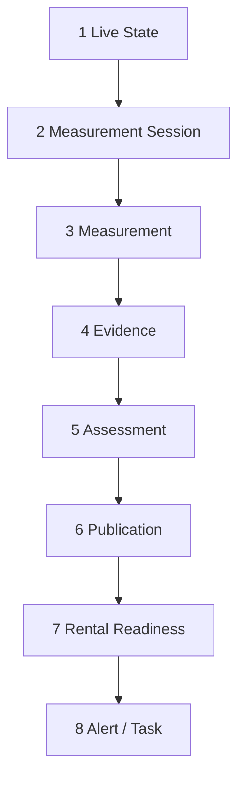

# Battery Measurement Domain — Verbindlicher Messartenvertrag (Prompt 8/8)

| Feld | Wert |
|------|------|
| **Dokumenttyp** | Fachliche und technische Domain-Spezifikation (Entscheidungsvertrag) |
| **Erstellt (UTC)** | 2026-07-16T10:50:00Z |
| **Repository-Git-Commit** | `c4c06315c49a6bfa9ad26bfabebba31a7dedb72c` |
| **Empirische Basis** | VPS-Produktion `app.synqdrive.eu` (6 DIMO-Fahrzeuge: 5 ICE, 1 BEV; 0 PHEV), Deploy `2cd57c8` |
| **Status** | **Verbindlich für künftige Implementierung** — **keine** produktive Umsetzung in diesem Prompt |
| **Normativität** | Dieses Dokument **übersteuert** implizite Annahmen in Legacy-Code, sofern Audits Widersprüche belegen |

---

## 1. Grundlage und referenzierte Audit-Dateien

| # | Audit | Kernerkenntnis für diesen Vertrag |
|---|-------|----------------------------------|
| 1 | [`battery-runtime-topology.md`](./battery-runtime-topology.md) | Battery ohne eigenen Worker; Hooks an DIMO-Snapshot + Trip-Start |
| 2 | [`battery-signal-cadence-reality.md`](./battery-signal-cadence-reality.md) | Poll 30 s zuverlässig; Provider-TS-Wiederholung 94–99 %; Poll ≠ neue Messung |
| 3 | [`battery-rest-window-reality.md`](./battery-rest-window-reality.md) | REST opportunistisch; 12,8 % 60m-Capture; 31 % > 13,2 V; Wake-Fehlklassifikation |
| 4 | [`battery-crank-feasibility.md`](./battery-crank-feasibility.md) | Crank 0,9 % brauchbar; DIMO ~5 s Aggregation; Hook median +169 s nach `startTime` |
| 5 | [`battery-storage-integrity.md`](./battery-storage-integrity.md) | LV-SOH-Evidence semantisch falsch; STABLE auf kontaminierten Daten; HV-Publication-Widerspruch |
| 6 | [`hv-battery-runtime-reality.md`](./hv-battery-runtime-reality.md) | HV 93,7 % TS-Duplikate; 0 Kapazitätsmessungen; Provider-SOH 0 %; 30 s-Persistenz kritisch |
| 7 | [`battery-production-evidence-summary.md`](./battery-production-evidence-summary.md) | Fire-and-forget; UI ohne Auto-Refresh; **NOT READY** gesamt |

**Leitprinzip:** SynqDrive darf **keine präzisere Health-Aussage** machen, als Signalkadenz, Kontext und empirische Qualität erlauben.

---

## 2. Untersuchte Umgebung und Commit

| Parameter | Wert |
|-----------|------|
| Umgebung | Produktion VPS; kein separates Staging mit Battery-Realität |
| Flotte | 6 Fahrzeuge; einziges BEV: KS FH 660E (Tesla Model 3) |
| PHEV/HEV in Produktion | **0** — PHEV-Regeln sind **spezifikativ**, nicht empirisch validiert |
| DIMO Poll-Erfolg (30d) | 99,83 % |
| Dokument-Commit | `c4c0631` (nach Freigabe dieses Dokuments: siehe Abschluss-Commit) |

---

## 3. Verbindliche Domainbegriffe

### 3.1 Schichtenmodell (verbindlich)

| Ebene | Definition | Darf Health behaupten? | Beispiel |
|-------|------------|------------------------|----------|
| **1. Live State** | Aktueller Telemetrie-Spiegel ohne automatische Health-Aussage | **Nein** | `vehicle_latest_states.lvBatteryVoltage` |
| **2. Measurement Session** | Zeitlich zusammengehöriger Messzyklus mit Start/Ende und Kontext | Nur nach Abschluss + Qualität | Ruhefenster 60 min; Ladesession |
| **3. Measurement** | Einzelwert: Messart + Qualität + Provenienz + `observedAt` | **Nein** (roh) | `REST_60M` = 12,41 V, `VALID` |
| **4. Evidence** | Qualifizierte Measurement, für Assessments zugelassen | Indirekt | `battery_evidence` mit `valueType` + `quality` |
| **5. Assessment** | Bewertung aus **kompatiblen** Evidence-Werten gleicher oder ergänzender Messarten | Ja (intern) | LV Estimated Health Score |
| **6. Publication** | Stabilisierter, für UI freigegebener Zustand (Hysterese, Maturity) | Ja (user-facing) | `battery_features.publishedSohPct` |
| **7. Rental Readiness** | Separate Policy; berücksichtigt Evidenzstärke und `preventsReady` | Policy only | Rental-Health `battery` Modul |
| **8. Alert / Task** | Operativer Handlungsbedarf; **nicht** Score-Wahrheit | Aktion | `BATTERY_CRITICAL` Insight |

### 3.2 Verbotene Ebenen-Vermischung

- Live State **darf nicht** Assessment-Freshness oder Publication aktualisieren.
- Measurement mit `CONTAMINATED_*` **darf nicht** als `REST_60M`/`REST_6H` Evidence eingestuft werden.
- Assessment **darf nicht** als `SOH_PERCENT` (Werkstatt-SOH) labeliert werden, wenn es Verhaltensscore ist.
- Alert **darf nicht** allein aus Roh-Snapshot ohne Publication-Pipeline gespeist werden.

### 3.3 Messung vs. Persistenz vs. Poll

| Begriff | Definition |
|---------|------------|
| **Poll** | SynqDrive-Request an DIMO (~30 s) |
| **Provider-Observation** | Wert mit neuem oder wiederholtem `sourceTimestamp`/`lastSeenAt` |
| **Neue Messung** | Provider-Observation mit **geändertem** `observedAt` **oder** nachweislich geändertem Wert **und** gültigem Kontext |
| **Persistierte Zeile** | DB-Insert — **kein** Synonym für neue Messung (HV: 93,7 % TS-Duplikate) |

---

## 4. Unterstützte Fahrzeug- und Batterieprofile

### 4.1 Antriebsprofile (`DriveProfile`)

| Profil | Empirie | LV-12V-Pfad | HV-Pfad |
|--------|---------|-------------|---------|
| **ICE** | 5 Fahrzeuge | Ja (`lowVoltageBatteryCurrentVoltage`) | Nein |
| **HEV** | 0 in Flotte | Spezifikativ: LV wenn Signal | Spezifikativ: HV wenn SOC |
| **PHEV** | 0 in Flotte | LV + HV | ICE-Start-Regeln **zusätzlich** |
| **BEV** | 1 Fahrzeug (KS FH 660E) | **Kein** LV-Signal | Ja (`evSoc`, Energy, Charging) |
| **UNKNOWN** | — | Nur Live, keine REST/Crank-Assessments | Nur Live |

### 4.2 Batterieprofile (`BatteryChemistry`)

| Profil | Empirie | Schwellen |
|--------|---------|-----------|
| **LEAD_ACID** | 2 Fahrzeuge mit Spec | 12,0–12,6 V Ruhebänder |
| **AGM** | 2 Fahrzeuge | 12,2–12,7 V Ruhebänder |
| **EFB** | 0 explizit | Wie AGM bis Spec vorliegt |
| **LITHIUM** | 0 LV in Flotte | **Keine** Lead-Acid-SOC-Kurve |
| **UNKNOWN** | 1 Fahrzeug ohne Spec | **Keine** chemische SOC-Schätzung |

### 4.3 Kombinierte Policies (`BatteryPolicyProfile`)

| Policy | Gilt für | Besonderheit |
|--------|----------|--------------|
| `ICE_LEAD_ACID` | ICE + LEAD_ACID | Standard-Ruhe/Crank |
| `ICE_AGM` | ICE + AGM | Höhere Ruhe-Untergrenze |
| `ICE_EFB` | ICE + EFB | Wie AGM (bis EFB-Spec) |
| `PHEV_AUX` | PHEV | LV + HV; ICE-Start-Bestätigung für Crank |
| `EV_AUX_LEAD_ACID` | BEV mit 12V-Aux (theoretisch) | **Nicht** in Produktion beobachtet |
| `EV_AUX_LITHIUM` | BEV Aux Li | **UNSUPPORTED** ohne Signal |
| `UNKNOWN_PROFILE` | Spec fehlt | Nur Live + manuelle Evidence |
| `UNSUPPORTED_PROFILE` | BEV ohne LV | Kein LV-REST/Crank (KS FH 660E) |

**Regel 8:** Lead-Acid-/AGM-/EFB-Schwellen **niemals** auf `LITHIUM` oder `UNKNOWN` anwenden.

---

## 5. Vollständiger Messartenkatalog

Legende **Empirischer Status:**

| Status | Bedeutung |
|--------|-----------|
| **SUPPORTED** | Empirisch oder fachlich belastbar nutzbar (mit Gates) |
| **SUPPORTED_AS_PROXY** | Nur als grober/indirekter Proxy; nie als exakte Metrik |
| **EXPERIMENTAL** | Code-Pfad existiert; Produktionsqualität unzureichend |
| **UNSUPPORTED** | Nicht erhebbar mit aktueller Architektur/Provider |
| **PROVIDER_DEPENDENT** | Nur wenn Provider liefert; Flotte derzeit ohne Daten |

---

### 5.1 LV Live

#### `LIVE_VOLTAGE`

| Feld | Wert |
|------|------|
| **Fachliche Bedeutung** | Momentane 12-V-Klemmenspannung aus Telemetrie |
| **Profile** | ICE, HEV, PHEV (wenn Signal) |
| **Signale** | `powertrainLowVoltageBatteryCurrentVoltage` → `lvBatteryVoltage` |
| **Kontext** | `providerFetchedAt`, optional speed/ignition |
| **Zielzeitpunkt** | Zeitpunkt des Provider-`lastSeenAt` |
| **Zeitabweichung** | Poll-Jitter ±30 s; Provider-TS kann Stunden alt sein |
| **Mindestkadenz** | Poll 30 s; **neue** Observation nur ~0,6–6 % der Polls |
| **Mindest-Coverage** | — (punktuell) |
| **Max. Alterung (Live)** | `liveVoltageFreshness`: **15 min** „fresh“; >24 h `STALE` |
| **Ausschlüsse** | — |
| **Health-Modell** | **Telemetry only** — Input für Kontamination, nicht für REST |
| **Rental Readiness** | Nur mit `LIVE_LOADED`/`CHARGING_VOLTAGE` Kontext; nie als Ruhespannung |
| **UI-Name** | „Aktuelle Spannung (Live)“ |
| **Fehlende Daten** | `UNAVAILABLE`; kein Schätzen |
| **Status** | **SUPPORTED** |
| **Beleg** | Prompt 2, 7 |

#### `LIVE_LOADED`

| Feld | Wert |
|------|------|
| **Fachliche Bedeutung** | Live-Spannung unter Last (Motor/DC-DC läuft) |
| **Profile** | ICE, HEV, PHEV |
| **Signale** | `LIVE_VOLTAGE` + Kontext: speed > 0 oder ignition on oder V > 13,2 V |
| **Kontext** | Pflicht: mindestens ein Last-Indikator |
| **Zielzeitpunkt** | Beobachtungszeitpunkt |
| **Zeitabweichung** | wie LIVE_VOLTAGE |
| **Mindestkadenz** | wie Poll |
| **Mindest-Coverage** | — |
| **Max. Alterung** | wie `liveVoltageFreshness` |
| **Ausschlüsse** | Darf **nicht** REST ersetzen |
| **Health-Modell** | Diagnostisch; Trend „Ladespannung“ |
| **Rental Readiness** | **Nein** (außer explizite Warnleuchte HM) |
| **UI-Name** | „Spannung unter Last“ |
| **Fehlende Daten** | `UNAVAILABLE` |
| **Status** | **SUPPORTED_AS_PROXY** |
| **Beleg** | Prompt 3, 5 |

#### `CHARGING_VOLTAGE`

| Feld | Wert |
|------|------|
| **Fachliche Bedeutung** | Erhöhte Klemmenspannung durch Alternator/DC-DC (>13,2 V typ.) |
| **Profile** | ICE, HEV, PHEV |
| **Signale** | `LIVE_VOLTAGE` > 13,2 V (chemiespezifisch anpassbar) |
| **Kontext** | speed=0 erlaubt (Stand-Laden) |
| **Zielzeitpunkt** | Beobachtung |
| **Zeitabweichung** | — |
| **Mindestkadenz** | — |
| **Mindest-Coverage** | — |
| **Max. Alterung** | wie Live |
| **Ausschlüsse** | **Explizit kein REST** |
| **Health-Modell** | Kontaminations-Tag; kein Score-Input |
| **Rental Readiness** | Nein |
| **UI-Name** | „Ladespannung (nicht Ruhe)“ |
| **Fehlende Daten** | `UNAVAILABLE` |
| **Status** | **SUPPORTED_AS_PROXY** |
| **Beleg** | Prompt 3 (31 % REST > 13,2 V) |

---

### 5.2 Ruhe (LV)

#### `REST_AFTER_SHUTDOWN`

| Feld | Wert |
|------|------|
| **Fachliche Bedeutung** | Erste plausible Ruhespannung nach Motor-Aus (nicht 60m/6h-spezifisch) |
| **Profile** | ICE, HEV, PHEV |
| **Signale** | LV + `lastActivityAt` Ruhebeginn |
| **Kontext** | ignition off, speed=0, V ≤ 13,2 V, kein Trip aktiv |
| **Zielzeitpunkt** | T0 + 5–30 min nach Shutdown (nicht exakt definiert im Ist-Code) |
| **Zeitabweichung** | **±30 min** (opportunistisch) |
| **Mindestkadenz** | 1 Sample pro Ruhefenster |
| **Mindest-Coverage** | **Nicht empirisch erfüllt** (~13 % bei 60m) |
| **Max. Alterung** | `restMeasurementFreshness`: 7 Tage für Assessment |
| **Ausschlüsse** | V > 13,2 V → `CONTAMINATED_BY_CHARGING` oder `CONTAMINATED_BY_WAKE` |
| **Health-Modell** | Nur als schwacher Input; nicht allein publizierbar |
| **Rental Readiness** | Nein |
| **UI-Name** | „Ruhespannung (früh)“ |
| **Fehlende Daten** | `MISSED` |
| **Status** | **EXPERIMENTAL** |
| **Beleg** | Prompt 3 |

#### `REST_60M`

| Feld | Wert |
|------|------|
| **Fachliche Bedeutung** | Klemmenspannung nach **≥60 min** ununterbrochener Ruhe |
| **Profile** | ICE, HEV, PHEV |
| **Signale** | LV; `lastActivityAt`; optional ignition/speed |
| **Kontext** | Ruhe ≥60 min; **kein** Laden; **kein** Wake; V ≤ 13,2 V |
| **Zielzeitpunkt** | T_rest_start + 60 min (±15 min erlaubt **nur** bei VALID) |
| **Zeitabweichung** | **±15 min** für VALID; darüber → `VALID_PROXY` oder `MISSED` |
| **Mindestkadenz** | 1 VALID-Messung pro Ruhefenster |
| **Mindest-Coverage** | **≥40 %** der Ruhefenster ≥60 min (Ist: **12,8 %**) |
| **Max. Alterung** | 14 Tage für Assessment-Beitrag |
| **Ausschlüsse** | Wake 14 V; wiederholter Provider-TS ohne Wertänderung; Trip innerhalb ±15 min |
| **Health-Modell** | Input für LV-Assessment **nur** bei `VALID` |
| **Rental Readiness** | Nur wenn Publication `STABLE` + Evidence `VALID` |
| **UI-Name** | „Ruhespannung (60 min)“ |
| **Fehlende Daten** | **`MISSED`** — nicht schätzen |
| **Status** | **EXPERIMENTAL** (Ist-Implementierung: **SUPPORTED_AS_PROXY** ohne Gates) |
| **Beleg** | Prompt 3, 5, 7 |

**Akzeptanzkriterium:** 8 h Ruhe + 14 V Wake-up → **kein** `REST_60M`/`REST_6H` (→ `CONTAMINATED_BY_WAKE`).

#### `REST_6H`

| Feld | Wert |
|------|------|
| **Fachliche Bedeutung** | Klemmenspannung nach **≥6 h** Ruhe |
| **Profile** | ICE, HEV, PHEV |
| **Signale/Kontext** | wie REST_60M, Schwelle 6 h |
| **Zielzeitpunkt** | T_rest_start + 6 h (±30 min für VALID) |
| **Zeitabweichung** | ±30 min VALID; sonst PROXY/MISSED |
| **Mindestkadenz** | 1 VALID / Fenster |
| **Mindest-Coverage** | ≥25 % Fenster ≥6 h (Ist: Capture ~21 %, valide ~3 %) |
| **Max. Alterung** | 30 Tage |
| **Ausschlüsse** | **Darf nicht** denselben Snapshot wie REST_60M als unabhängige Messung nutzen (Regel 3) |
| **Health-Modell** | Nur VALID; sonst separat als Proxy labeln |
| **Rental Readiness** | wie REST_60M |
| **UI-Name** | „Ruhespannung (6 h)“ |
| **Fehlende Daten** | `MISSED` |
| **Status** | **EXPERIMENTAL** |
| **Beleg** | Prompt 3 |

#### `PRE_WAKE` (LV)

| Feld | Wert |
|------|------|
| **Fachliche Bedeutung** | Letzte Spannung vor Wake/Erste Fahrt nach langer Ruhe |
| **Profile** | ICE, HEV, PHEV |
| **Signale** | LV vor ignition/speed-Anstieg |
| **Kontext** | Ruhefenster ≥60 min vorher |
| **Zielzeitpunkt** | Unmittelbar vor Wake |
| **Zeitabweichung** | ±5 min |
| **Mindestkadenz** | 1 / Wake-Ereignis |
| **Mindest-Coverage** | — |
| **Max. Alterung** | `wakeMeasurementFreshness` 7 Tage |
| **Ausschlüsse** | **Niemals** als REST_60M/6H klassifizieren |
| **Health-Modell** | Diagnostisch; Wake-Analyse |
| **Rental Readiness** | Nein |
| **UI-Name** | „Spannung vor Aufwachen“ |
| **Fehlende Daten** | `MISSED` |
| **Status** | **SUPPORTED_AS_PROXY** |
| **Beleg** | Prompt 3 |

---

### 5.3 ICE Start

#### `PRE_START`

| Feld | Wert |
|------|------|
| **Fachliche Bedeutung** | Spannung unmittelbar vor ICE-Start |
| **Profile** | ICE, HEV, PHEV (nur bei bestätigtem ICE-Start) |
| **Signale** | LV im Fenster [start − 30 s, start] |
| **Kontext** | Trip-Start bestätigt; PHEV: ICE-Start nachweisen |
| **Zielzeitpunkt** | Trip `effectiveStartAt` − 30 s … start |
| **Zeitabweichung** | ±30 s |
| **Mindestkadenz** | DIMO Segments ~5 s (**grober** als Crank) |
| **Mindest-Coverage** | 1 Sample |
| **Max. Alterung** | `startMeasurementFreshness` 30 Tage |
| **Ausschlüsse** | EV-Fahrt → **UNSUPPORTED_PROFILE** |
| **Health-Modell** | Schwacher Input |
| **Rental Readiness** | Nein |
| **UI-Name** | „Spannung vor Start“ |
| **Fehlende Daten** | `MISSED` |
| **Status** | **EXPERIMENTAL** |
| **Beleg** | Prompt 4 |

#### `CRANK_MIN`

| Feld | Wert |
|------|------|
| **Fachliche Bedeutung** | **Echter** minimaler Klemmenspannungseinbruch während Start (sub-sekündig) |
| **Profile** | ICE (nicht BEV; PHEV nur mit ICE-Start) |
| **Signale** | HF-Spannung <1 s Auflösung |
| **Kontext** | PRE_START vorhanden; Fenster [start, start+3 s] |
| **Zielzeitpunkt** | Crank-Minimum |
| **Zeitabweichung** | **≤1 s** für VALID |
| **Mindestkadenz** | **≤1 s** zwischen Samples |
| **Mindest-Coverage** | messbarer Drop ≥0,3 V in **≥10 %** Starts (Ist: **0,9 %**) |
| **Max. Alterung** | 60 Tage |
| **Ausschlüsse** | DIMO 5-s-Aggregation; Hook +169 s nach startTime |
| **Health-Modell** | **Nicht** im Ist-Zustand |
| **Rental Readiness** | **Nein** |
| **UI-Name** | — (nicht anzeigen als „Crank“) |
| **Fehlende Daten** | `MISSED` |
| **Status** | **UNSUPPORTED** |
| **Beleg** | Prompt 4, 7 |

**Regel 4–5:** Grobe Kadenz → `START_DIP_PROXY`, nie pseudo-präziser `CRANK_MIN`.

#### `START_DIP_PROXY`

| Feld | Wert |
|------|------|
| **Fachliche Bedeutung** | Grober Spannungsabfall Start (5-s-Aggregation) |
| **Profile** | ICE, PHEV+ICE-Start |
| **Signale** | Segments LV; vPre − vMin in ±30 s |
| **Kontext** | Trip bestätigt |
| **Zielzeitpunkt** | Trip-Start ±30 s |
| **Zeitabweichung** | ±30 s |
| **Mindestkadenz** | 5 s (Provider) |
| **Mindest-Coverage** | Drop messbar (Ist: ~9 % Hooks) |
| **Max. Alterung** | 60 Tage |
| **Ausschlüsse** | BEV |
| **Health-Modell** | Max. **10 %** Gewicht im LV-Score |
| **Rental Readiness** | Nein |
| **UI-Name** | „Startverhalten (geschätzt)“ |
| **Fehlende Daten** | `MISSED` |
| **Status** | **SUPPORTED_AS_PROXY** |
| **Beleg** | Prompt 4 |

#### `RECOVERY_5S` / `RECOVERY_30S`

| Feld | Wert |
|------|------|
| **Fachliche Bedeutung** | Spannung 5 s / 30 s nach Start |
| **Profile** | ICE, PHEV+ICE |
| **Signale** | Segments LV |
| **Kontext** | Nach Start-Dip-Proxy |
| **Zielzeitpunkt** | start + 5 s / + 30 s (±5 s) |
| **Zeitabweichung** | ±5 s |
| **Mindestkadenz** | 5 s |
| **Mindest-Coverage** | sporadisch (Prompt 4: RECOVERY_ONLY 3,8 %) |
| **Max. Alterung** | 60 Tage |
| **Ausschlüsse** | BEV |
| **Health-Modell** | Diagnostisch |
| **Rental Readiness** | Nein |
| **UI-Name** | „Erholung nach Start (5s/30s)“ |
| **Fehlende Daten** | `MISSED` |
| **Status** | **SUPPORTED_AS_PROXY** |
| **Beleg** | Prompt 4 |

#### `RECOVERY_PROXY`

| Feld | Wert |
|------|------|
| **Fachliche Bedeutung** | Sammel-Proxy wenn 5s/30s nicht trennbar |
| **Profile** | ICE |
| **Signale** | Beliebige Recovery-Spannung post-start |
| **Status** | **SUPPORTED_AS_PROXY** |
| **Beleg** | Prompt 4, 5 |

---

### 5.4 EV / BEV (HV + Aux)

#### `PRE_WAKE` (EV/HV)

| Feld | Wert |
|------|------|
| **Fachliche Bedeutung** | HV-Zustand (SOC) vor Nutzung nach Ruhe |
| **Profile** | BEV, PHEV |
| **Signale** | `evSoc`, optional energy |
| **Kontext** | Ruhe ≥60 min; nicht charging |
| **Zielzeitpunkt** | Vor erster Bewegung/Laden |
| **Status** | **EXPERIMENTAL** (nicht implementiert) |
| **Beleg** | Prompt 3, 6 |

#### `WAKE_DIP` (EV)

| Feld | Wert |
|------|------|
| **Fachliche Bedeutung** | SOC-/Spannungsänderung beim Aufwachen (Aux/HV) |
| **Profile** | BEV |
| **Signale** | SOC delta nach Ruhe; kein LV am BEV |
| **Status** | **UNSUPPORTED** (kein Pfad) |
| **Beleg** | Prompt 7 |

#### `DC_DC_RECOVERY`

| Feld | Wert |
|------|------|
| **Fachliche Bedeutung** | 12V-Aux-Erholung über DC-DC nach HV-Wake |
| **Profile** | BEV, PHEV |
| **Signale** | **Nicht** von DIMO geliefert (kein dediziertes DC-DC-Signal) |
| **Status** | **UNSUPPORTED** |
| **Beleg** | Prompt 7 |

#### `POST_WAKE_STABILITY`

| Feld | Wert |
|------|------|
| **Fachliche Bedeutung** | Stabilisierung SOC/Spannung nach Wake |
| **Profile** | BEV |
| **Signale** | SOC über 10–30 min nach Wake |
| **Status** | **EXPERIMENTAL** |
| **Beleg** | — (spezifikativ) |

---

### 5.5 Manuell / extern

#### `WORKSHOP_OCV` / `WORKSHOP_LOAD_TEST`

| Feld | Wert |
|------|------|
| **Fachliche Bedeutung** | Werkstatt-OCV / Lasttest |
| **Profile** | Alle mit 12V |
| **Signale** | Manueller Eintrag / AI-Upload bestätigt |
| **Kontext** | Human confirmation |
| **Status** | **SUPPORTED** (Pfad `battery_evidence` DOCUMENT/MANUAL) |
| **Beleg** | Prompt 5 (0 Zeilen in Prod — fachlich vorgesehen) |

#### `DOCUMENT_REPORTED` / `MANUAL_CONFIRMED`

| Feld | Wert |
|------|------|
| **Fachliche Bedeutung** | Dokument/OCR oder manuell bestätigter Wert |
| **Profile** | Alle |
| **Status** | **SUPPORTED** (AI-Upload-Architektur; nie auto-apply) |
| **Beleg** | Projektregeln, Prompt 5 |

---

### 5.6 HV (Traction)

#### `PROVIDER_HV_SOH`

| Feld | Wert |
|------|------|
| **Fachliche Bedeutung** | Vom Fahrzeug/OEM gemeldete HV-SOH |
| **Profile** | BEV, PHEV |
| **Signale** | `powertrainTractionBatteryStateOfHealth` |
| **Kontext** | Provider liefert non-null |
| **Zielzeitpunkt** | Provider `observedAt` |
| **Max. Alterung** | `providerSohFreshness`: 45 Tage fresh (Code); >45 Tage STALE |
| **Health-Modell** | **Primär** wenn VALID + fresh |
| **Rental Readiness** | Ja wenn fresh |
| **UI-Name** | „SOH (Hersteller)“ |
| **Fehlende Daten** | `UNAVAILABLE` |
| **Status** | **PROVIDER_DEPENDENT** (Flotte: **0 %**) |
| **Beleg** | Prompt 6 |

#### `WORKSHOP_HV_SOH` / `DOCUMENT_HV_SOH`

| Status | **SUPPORTED** bei bestätigtem Upload |
| **Beleg** | Architektur Prompt 5 |

#### `CHARGE_SESSION_CAPACITY` / `DISCHARGE_SESSION_CAPACITY`

| Feld | Wert |
|------|------|
| **Fachliche Bedeutung** | Kapazität aus ΔEnergy/ΔSOC in Lade-/Entladesession |
| **Profile** | BEV, PHEV |
| **Signale** | `tractionBatteryCurrentEnergy`, SOC; Session-Grenzen |
| **Kontext** | Session mit ΔSOC ≥5 pp; frische Provider-TS; monotone Energy |
| **Mindest-Coverage** | Vollständige Session; ≥2 Sessions für Assessment |
| **Ausschlüsse** | Poll-Paare; duplicate TS (93,7 %); ΔSOC <5 pp (99,96 % Paare) |
| **Health-Modell** | **Nicht** im Ist-Zustand |
| **UI-Name** | — |
| **Fehlende Daten** | `MISSED` |
| **Status** | **UNSUPPORTED** (Ist: 0 Estimates) |
| **Beleg** | Prompt 6, 7 |

**Regel 12:** Ohne belastbare Sessions **keine** eigene Kapazitätsschätzung.

#### `LIVE_HV_SOC`

| Feld | Wert |
|------|------|
| **Fachliche Bedeutung** | Aktueller Ladezustand Traktionsbatterie |
| **Profile** | BEV, PHEV |
| **Signale** | `evSoc` |
| **Max. Alterung** | Live fresh 15 min; Provider-TS kann **31 h+** stale sein |
| **Health-Modell** | Live State / Trend |
| **Rental Readiness** | Ja (SOC-Schwellen separat) |
| **UI-Name** | „Ladezustand (SOC)“ |
| **Status** | **SUPPORTED** (mit STALE-Anzeige) |
| **Beleg** | Prompt 2, 6 |

#### `LIVE_HV_RANGE`

| Feld | Wert |
|------|------|
| **Fachliche Bedeutung** | Geschätzte Reichweite |
| **Profile** | BEV, PHEV |
| **Signale** | `rangeKm` |
| **Status** | **PROVIDER_DEPENDENT** |
| **Beleg** | Prompt 6 |

---

## 6. Qualitätsmodell

Jede Measurement trägt `quality: MeasurementQuality`.

| Qualität | Definition | Evidence-fähig? |
|----------|------------|-----------------|
| **VALID** | Messart-Kontext erfüllt; Kadenz/Coverage OK; plausibler Wert | **Ja** |
| **VALID_PROXY** | Bewusst grober Proxy; Label muss „geschätzt“ tragen | Eingeschränkt |
| **INSUFFICIENT_CADENCE** | Provider-Auflösung zu grob (z. B. 5 s für Crank) | **Nein** |
| **INSUFFICIENT_COVERAGE** | Zu wenige Events im Fenster (z. B. 12,8 % REST) | **Nein** |
| **STALE** | `observedAt` oder Provider-TS über Schwellwert | **Nein** für Assessment |
| **CONTAMINATED_BY_CHARGING** | V > 13,2 V (AGM/Lead) oder charging flag | **Nein** |
| **CONTAMINATED_BY_WAKE** | Wake/DC-DC nach langer Ruhe | **Nein** für REST |
| **CONTAMINATED_BY_ACTIVE_TRIP** | Fahrt/Trip aktiv | **Nein** für REST |
| **TIMESTAMP_INCONSISTENT** | `observedAt` wiederholt ohne Wertänderung als „neue“ Messung | **Nein** |
| **MISSING_CONTEXT** | speed/ignition/lastActivityAt fehlt | **Nein** |
| **MISSED** | Fenster verstrichen ohne VALID-Messung | n/a (kein Wert) |
| **UNSUPPORTED_PROFILE** | BEV+LV-Crank etc. | **Nein** |
| **PROVIDER_DELAY** | Poll frisch, Provider-TS alt | Live markieren, nicht für REST |
| **PROVIDER_ERROR** | DIMO-Fehler / leeres Fenster | **Nein** |

---

## 7. Freshness-Modell

Getrennte Freshness-Domänen (**dürfen nicht vermischt werden**):

| Freshness-Typ | Bezug | Default „fresh“ | Default „stale“ | Aktualisiert durch |
|---------------|-------|-----------------|-----------------|-------------------|
| **liveVoltageFreshness** | LIVE_* | `providerFetchedAt` < 15 min | > 24 h | Neuer Poll mit frischem Fetch |
| **restMeasurementFreshness** | REST_* | Letzte VALID REST < 14 Tage | > 30 Tage | **Neue VALID REST-Messung** |
| **startMeasurementFreshness** | PRE_START, START_* | Letzte Start-Session < 30 Tage | > 90 Tage | Neue Start-Session |
| **wakeMeasurementFreshness** | PRE_WAKE, WAKE_* | < 7 Tage | > 30 Tage | Wake-Event |
| **assessmentFreshness** | Assessment-Compute | Letzte Evidence-Änderung | > 30 Tage ohne neue Evidence | **Neue compatible Evidence** |
| **publicationFreshness** | Publication | `lastPublishedAt` | State INITIAL_CALIBRATION | Publication-Pipeline |
| **providerSohFreshness** | PROVIDER_HV_SOH | < 45 Tage | > 45 Tage | Neuer Provider-SOH |
| **hvSessionFreshness** | Session-Capacity | Session-Ende < 30 Tage | > 90 Tage | Abgeschlossene Session |

**Regel 9:** Neue `LIVE_VOLTAGE` aktualisiert **nur** `liveVoltageFreshness`, **nicht** `assessmentFreshness` oder Publication.

**UI-Hinweis:** `providerFetchedAt` vs. `sourceTimestamp` getrennt anzeigen (Prompt 2: BEV ~31 h stale bei frischem Poll).

---

## 8. Measurement-Session-Semantik

### 8.1 REST-Session

| Attribut | Wert |
|----------|------|
| **Start** | `lastActivityAt` (Trip Detection) oder Trip-Ende + Validierung |
| **Ende** | Nächste Fahrt, Laden, oder Wake |
| **Ziel-Messpunkte** | Optional REST_AFTER_SHUTDOWN; REST_60M @+60 min; REST_6H @+6 h |
| **Erfolg** | Pro Zielpunkt: VALID Measurement oder explizit `MISSED` |
| **Ist-Abweichung** | Erster Sample nach Schwelle ohne Zielzeit-Bindung (Prompt 3) |

### 8.2 Start-Session (ICE)

| Attribut | Wert |
|----------|------|
| **Start** | `effectiveStartAt` (Trip bestätigt) |
| **Ende** | start + 120 s (Ist-Code) |
| **Messarten** | PRE_START, START_DIP_PROXY, RECOVERY_* |
| **PHEV** | Session nur wenn **ICE-Start** bestätigt (Motor-Signal / Hybrid-Modus) — **nicht empirisch validiert** |

### 8.3 HV-Charge-Session

| Attribut | Wert |
|----------|------|
| **Start** | `isCharging` false→true **oder** SOC-Anstieg ≥2 pp mit Energy-Anstieg |
| **Ende** | `isCharging` true→false |
| **Kapazität** | Nur bei vollständiger Session + ΔSOC ≥5 pp + frischen TS |
| **Ist** | 6 Sessions/30d; nicht belastbar (Prompt 6) |

### 8.4 Deduplizierung

- Session-intern: mehrere Polls mit gleichem `observedAt` = **eine** Observation (`TIMESTAMP_INCONSISTENT` für weitere).
- HV-Snapshots: Ist ohne Dedup — Zielvertrag: **max. 1 Measurement pro (vehicle, messart, observedAt)**.

---

## 9. Evidence- und Assessment-Semantik

### 9.1 Evidence

- Entsteht nur aus Measurement mit `quality ∈ {VALID, VALID_PROXY}`.
- `valueType` muss Messart semantisch treffen (**kein** LV-Verhaltensscore als `SOH_PERCENT` — Regel 11).
- Dedup-Key: `(vehicleId, scope, valueType, sourceType, observedAt)` (bestehend).
- `VALID_PROXY` muss `confidence: 'proxy'` tragen.

### 9.2 Assessment (LV)

| Input (kompatibel) | Gewicht max. | Ist-Gewicht |
|------------------|-------------|-------------|
| REST_60M/6H VALID | 35 % | 35 % auf oft CONTAMINATED |
| START_DIP_PROXY | 10 % | 35 % Crank (zu hoch) |
| RECOVERY_PROXY | 10 % | in Crank-Block |
| WORKSHOP/DOCUMENT | 100 % Override wenn bestätigt | 0 Zeilen Prod |

**Output:** `estimatedHealthScore` (0–100), **nicht** `SOH_PERCENT`.

### 9.3 Assessment (HV)

| Priorität | Quelle |
|-----------|--------|
| 1 | PROVIDER_HV_SOH (fresh) |
| 2 | WORKSHOP/DOCUMENT_HV_SOH |
| 3 | CHARGE_SESSION_CAPACITY (VALID) |
| 4 | — | **Kein** Age/KM-Fallback |

**Ist:** `energy_throughput` mit 0 persistierten Estimates — **widerspricht** Vertrag.

---

## 10. Publication-Semantik

| State | Bedingung (Vertrag) | Ist-Abweichung |
|-------|---------------------|----------------|
| **INITIAL_CALIBRATION** | `validEstimateCount` < Schwelle; keine VALID-Kern-Evidence | HV: `publishedSohPct=85` (**INVALID**) |
| **STABILIZING** | ≥3 VALID/PROXY Evidence; <6 |
| **STABLE** | ≥6 VALID Evidence über ≥14 Tage; keine CONTAMINATED-Kern-Inputs | ICE: 5× STABLE bei 31 % kontaminiert |

**Regeln:**

- Publication **gesperrt** wenn jede REST-Evidence der letzten 30 Tage `CONTAMINATED_*` oder `MISSED`.
- `publishedSohPct` nur für echte SOH-Quellen (Provider, Werkstatt, VALID Session-Capacity).
- LV-Verhaltensscore → `publishedEstimatedHealth` (separates Feld), nie `publishedSohPct`.

---

## 11. Verbotene Ableitungen

| # | Verbot | Beleg |
|---|--------|-------|
| V1 | Wake/Lade 14 V als REST_60M/REST_6H | Prompt 3 |
| V2 | Wiederholter Provider-TS als neue Messung | Prompt 2, 6 |
| V3 | REST_60M und REST_6H aus identischem Snapshot als zwei unabhängige VALID | Prompt 3, 5 |
| V4 | CRANK_MIN bei 5-s-Kadenz | Prompt 4 |
| V5 | Pseudo-präziser Drop aus START_DIP_PROXY | Prompt 4 |
| V6 | ICE-Crank-Assessment bei BEV-Fahrt | Prompt 4 |
| V7 | Lead-Acid-SOC bei UNKNOWN/LITHIUM | Regel 8 |
| V8 | Live-Update → Assessment-Freshness | Regel 9 |
| V9 | Fehlende Messung schätzen | Regel 10 |
| V10 | LV-Score als SOH_PERCENT | Prompt 5 |
| V11 | HV-Kapazität ohne Session + Energy | Prompt 6 |
| V12 | Poll-Persistenz-Zeile = Measurement ohne Qualitätsprüfung | Prompt 6 |
| V13 | API-Fehler als „keine Batterie“ ohne Fehlerzustand | Prompt 7 |

---

## 12. Rental-Readiness je Evidenzstärke

| Evidenzstärke | Readiness-Nutzung |
|---------------|-------------------|
| **Keine LV-Daten** | `estimate_unavailable`; blockiert **nicht** Ready allein |
| **Nur LIVE** | Kein SOH-Block; HM-Warnleuchte darf eskalieren |
| **VALID_PROXY REST** | WATCH möglich; kein CRITICAL allein |
| **VALID REST + Publication STABLE** | WARNING/CRITICAL nach Schwellen |
| **VALID PROVIDER_HV_SOH** | HV-WARNING nach SOH-Schwellen |
| **Nur SESSION_CAPACITY UNSUPPORTED** | HV SOH **UNAVAILABLE** in Readiness |
| **CONTAMINATED** | Ignorieren für Readiness; ggf. Data-Quality-Hinweis |

**WATCH** ist nicht alertbar (bestehende Policy — beibehalten).

---

## 13. Entscheidungs-Matrix je Messart

| Messart | Status | Evidence | Assessment | Publication | Readiness |
|---------|--------|----------|------------|-------------|-----------|
| LIVE_VOLTAGE | SUPPORTED | Nein | Nein | Nein | Indirekt |
| LIVE_LOADED | SUPPORTED_AS_PROXY | Nein | Nein | Nein | Nein |
| CHARGING_VOLTAGE | SUPPORTED_AS_PROXY | Tag only | Nein | Nein | Nein |
| REST_AFTER_SHUTDOWN | EXPERIMENTAL | PROXY only | Schwach | Nein | Nein |
| REST_60M | EXPERIMENTAL | VALID only | Ja | Wenn STABLE | Mit Gate |
| REST_6H | EXPERIMENTAL | VALID only | Ja | Wenn STABLE | Mit Gate |
| PRE_WAKE (LV) | SUPPORTED_AS_PROXY | PROXY | Nein | Nein | Nein |
| PRE_START | EXPERIMENTAL | PROXY | Schwach | Nein | Nein |
| CRANK_MIN | **UNSUPPORTED** | **Nein** | **Nein** | **Nein** | **Nein** |
| START_DIP_PROXY | SUPPORTED_AS_PROXY | PROXY | ≤10 % | Nein | Nein |
| RECOVERY_5S/30S | SUPPORTED_AS_PROXY | PROXY | Diagnostisch | Nein | Nein |
| RECOVERY_PROXY | SUPPORTED_AS_PROXY | PROXY | Diagnostisch | Nein | Nein |
| PRE_WAKE (EV) | EXPERIMENTAL | — | — | — | — |
| WAKE_DIP | UNSUPPORTED | Nein | Nein | Nein | Nein |
| DC_DC_RECOVERY | UNSUPPORTED | Nein | Nein | Nein | Nein |
| POST_WAKE_STABILITY | EXPERIMENTAL | — | — | — | — |
| WORKSHOP_OCV | SUPPORTED | VALID | Override | Ja | Ja |
| WORKSHOP_LOAD_TEST | SUPPORTED | VALID | Override | Ja | Ja |
| DOCUMENT_REPORTED | SUPPORTED | VALID | Override | Ja | Ja |
| MANUAL_CONFIRMED | SUPPORTED | VALID | Override | Ja | Ja |
| PROVIDER_HV_SOH | PROVIDER_DEPENDENT | VALID | Primär | Ja | Ja |
| WORKSHOP_HV_SOH | SUPPORTED | VALID | Primär | Ja | Ja |
| DOCUMENT_HV_SOH | SUPPORTED | VALID | Primär | Ja | Ja |
| CHARGE_SESSION_CAPACITY | **UNSUPPORTED** | **Nein** | **Nein** | **Nein** | **Nein** |
| DISCHARGE_SESSION_CAPACITY | **UNSUPPORTED** | **Nein** | **Nein** | **Nein** | **Nein** |
| LIVE_HV_SOC | SUPPORTED | Optional | Nein | Nein | Ja (SOC) |
| LIVE_HV_RANGE | PROVIDER_DEPENDENT | Nein | Nein | Nein | Optional |

---

## 14. Ausdrücklich deaktivierte oder nicht unterstützte Messungen

| Messart / Feature | Status | Begründung |
|-------------------|--------|------------|
| **CRANK_MIN** (exakt) | **UNSUPPORTED** | 0 % EXACT_ENOUGH; 5 s Kadenz |
| **CHARGE_SESSION_CAPACITY** | **UNSUPPORTED** (bis Redesign) | 0 Estimates; ΔSOC-Regel 0,04 % |
| **DISCHARGE_SESSION_CAPACITY** | **UNSUPPORTED** | wie oben |
| **DC_DC_RECOVERY** | **UNSUPPORTED** | Kein Signal |
| **WAKE_DIP (LV/HV)** | **UNSUPPORTED** | Nicht implementiert |
| **LV REST auf BEV** | **UNSUPPORTED_PROFILE** | KS FH 660E: kein LV |
| **HV degradation_model** | **Deaktiviert** | Legacy entfernt (Code) |
| **Age/KM HV-SOH-Fallback** | **Deaktiviert** | Prompt 6 |
| **Roh-Snapshot SOH für Alerts** | **Deaktiviert** | Prompt 5, 7 |
| **30s HV-Snapshot ohne Dedup** | **Nicht vertragskonform** | Muss bei Implementierung abgeschaltet oder gated werden |

---

## 15. Migrations- und Implementierungsfolgen

### 15.1 Keine Schema-Migration in diesem Prompt

Folgende **künftige** Änderungen leitet dieser Vertrag ab (ohne jetzt umzusetzen):

| Bereich | Folge |
|---------|-------|
| **Evidence `valueType`** | Neues Enum oder Mapping: `ESTIMATED_HEALTH_SCORE` statt falscher `SOH_PERCENT` |
| **Measurements** | Optionale Tabelle `battery_measurements` mit `quality` + `messart` |
| **HV Snapshots** | Insert-Gate: Provider-TS-Wechsel oder ΔSOC/ΔEnergy |
| **Publication** | Reset ICE STABLE ohne VALID-REST; HV `publishedSohPct` unter Calibration löschen |
| **API DTO** | `freshness` pro Domäne; `measurementQuality`; Fehler vs. empty |
| **UI** | Proxy-Labels; STALE-Banner; kein „Crank Drop“ ohne CRANK_MIN |
| **Worker** | Battery-Hooks awaited oder Outbox; Metriken |
| **Retention** | HV nach Vertrag + Sizing |

### 15.2 Bestandsdaten

| Daten | Aktion (künftig) |
|-------|------------------|
| 522 falsche SOH-Evidence | Reclassify oder supersede |
| 27+ kontaminierte REST-Snapshots | `quality=CONTAMINATED_*` backfill oder exclude |
| 108k HV-Duplikate | Dedup/Retention-Policy |
| 5× ICE STABLE | Publication-Review |

**Vor Migration:** Backup-Tabellen (Prompt 7 §19).

---

## 16. Akzeptanzkriterien für die nächsten Prompts

| # | Szenario | Erwartetes Verhalten |
|---|----------|---------------------|
| AC1 | 8 h Ruhe, dann 14 V Wake-up | Measurement `CONTAMINATED_BY_WAKE`; **kein** REST_6H/REST_60M Evidence |
| AC2 | Keine Provider-LV-Daten während Ruhe | REST_60M/REST_6H = **`MISSED`**; UI „Messung ausgeblieben“ |
| AC3 | Grobe Startkadenz (5 s) | Nur `START_DIP_PROXY`; **kein** `CRANK_MIN` |
| AC4 | EV-Fahrt / BEV-Trip | **Kein** ICE-Crank-Assessment; `UNSUPPORTED_PROFILE` |
| AC5 | Neue Live-Spannung | `liveVoltageFreshness` neu; `assessmentFreshness` **unverändert** |
| AC6 | `batteryType=UNKNOWN` | **Keine** Lead-Acid-SOC-Kurve |
| AC7 | HV ohne belastbare Energy-Sessions | **Keine** `CHARGE_SESSION_CAPACITY`; SOH `UNAVAILABLE` |
| AC8 | Gleicher `observedAt` zweiter Poll | **Keine** zweite Measurement; `TIMESTAMP_INCONSISTENT` oder Skip |
| AC9 | REST_60M und REST_6H gleicher Timestamp | Höchstens ein VALID; anderer `MISSED` oder explizit gekoppelter Proxy |
| AC10 | API 500 auf battery-health-detail | UI `endpoint_error`, **nicht** `null` wie „keine Batterie“ |
| AC11 | Provider-SOH null (Flotte heute) | `PROVIDER_HV_SOH` = `UNAVAILABLE`; kein fabriziertes SOH |
| AC12 | LV-Verhaltensscore 85 | Label „Geschätzter Zustand“; **nicht** „SOH 85 %“ |

---

## 17. Offene fachliche Entscheidungen (nicht aus Daten beantwortbar)

| # | Frage | Empfehlung bis Klärung |
|---|-------|------------------------|
| O1 | PHEV: wie ICE-Start technisch verifizieren? | `engineRunning` fehlt — HM/DIMO-Motor-Signal klären |
| O2 | REST-Zielzeit: Poll-Uhr oder Provider-TS? | **Poll-Uhr** für Schwelle; Provider-TS für Wertalter |
| O3 | AGM >13,2 V Schwellwert chemiespezifisch? | Mit Werkstatt validieren |
| O4 | HV ΔSOC-Schwelle 5 pp — beibehalten? | Beibehalten; Session-basiert neu messen |
| O5 | DIMO HF für LV-Crank — Kosten/Nutzen? | Nur nach Business-Freigabe |
| O6 | EFB-Fahrzeuge in Flotte | Spec-Pflicht bei Onboarding |
| O7 | Readiness: SOC <15 % BEV — separates Modul? | Ja, unabhängig von SOH |
| O8 | Publication STABLE Mindest-Events | **6 VALID REST** über **14 Tage** (Vorschlag) |

---

## Anhang A — Zusammenfassung Support-Status

### SUPPORTED (8)

`LIVE_VOLTAGE`, `LIVE_HV_SOC`, `WORKSHOP_OCV`, `WORKSHOP_LOAD_TEST`, `DOCUMENT_REPORTED`, `MANUAL_CONFIRMED`, `WORKSHOP_HV_SOH`, `DOCUMENT_HV_SOH`

### SUPPORTED_AS_PROXY (9)

`LIVE_LOADED`, `CHARGING_VOLTAGE`, `PRE_WAKE` (LV), `START_DIP_PROXY`, `RECOVERY_5S`, `RECOVERY_30S`, `RECOVERY_PROXY`, `REST_AFTER_SHUTDOWN` (nur mit Label)

### EXPERIMENTAL (6)

`REST_60M`, `REST_6H`, `PRE_START`, `PRE_WAKE` (EV), `POST_WAKE_STABILITY`, Ist-Code-Pfade die ohne Gates publizieren

### PROVIDER_DEPENDENT (3)

`PROVIDER_HV_SOH`, `LIVE_HV_RANGE`, `LIVE_VOLTAGE` (wenn Provider offline — semantisch PROVIDER_DELAY)

### UNSUPPORTED (7)

`CRANK_MIN`, `CHARGE_SESSION_CAPACITY`, `DISCHARGE_SESSION_CAPACITY`, `DC_DC_RECOVERY`, `WAKE_DIP`, LV-REST/Crank auf **BEV**, exakte 60m/6h-Ruhe **ohne** Provider-Kooperation

---

## Anhang B — Wichtigste Architekturentscheidungen

1. **Acht-Domain-Schichten** sind normativ; keine Vermischung Live → Publication.
2. **Messung ≠ Poll-Zeile** — Qualität und Kontext sind Pflicht.
3. **REST_60M/REST_6H** bleiben **EXPERIMENTAL** bis Coverage ≥40 % VALID und Kontaminations-Gates in Prod belegt sind.
4. **CRANK_MIN** ist **UNSUPPORTED**; nur **START_DIP_PROXY** mit hartem Score-Cap.
5. **HV-Kapazität** bleibt **UNSUPPORTED** bis Session-Rekonstruktion auf Provider-TS-Wechseln belegt ist.
6. **LV-Output** ist **Estimated Health**, nie Werkstatt-SOH ohne DOCUMENT/WORKSHOP.
7. **PROVIDER_HV_SOH** ist kanonisch, aber **PROVIDER_DEPENDENT** — bei Null **UNAVAILABLE**, kein Fallback.
8. **Freshness** ist mehrdimensional; UI und API müssen `sourceTimestamp` vs. `providerFetchedAt` trennen.
9. **Readiness ≠ Publication ≠ Alert** — drei getrennte Policies.
10. **Ist-Code** widerspricht Vertrag an mehreren Stellen — Implementierung **muss** Vertrag durchsetzen, nicht umgekehrt.

---

*Prompt 8/8 — Messartenvertrag auf empirischer Audit-Basis. Keine produktive Implementierung in diesem Schritt.*
