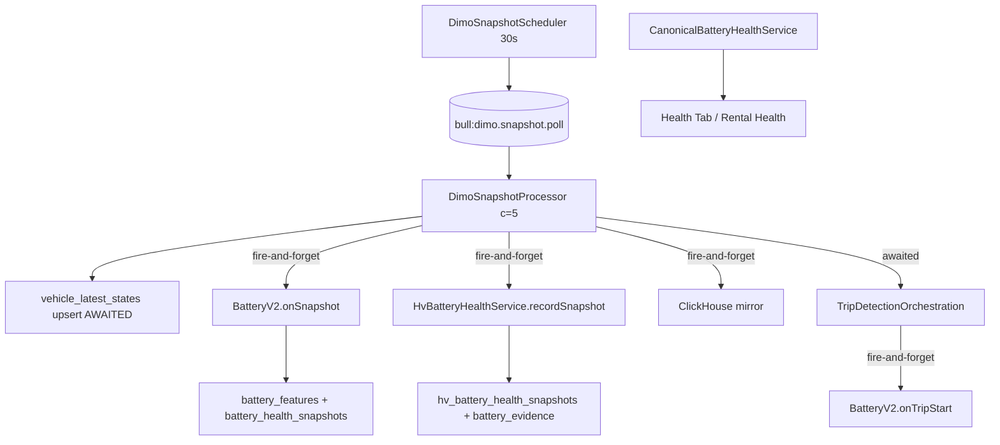

# Battery Health — Production Evidence Summary (Prompt 7/8)

| Feld | Wert |
|------|------|
| **Audit-Zeitpunkt (UTC)** | 2026-07-16T10:45:00Z |
| **Repository-Git-Commit (lokal)** | `968550734c4ad2e69c899267635c927c040fd362` |
| **VPS-deployed Commit** | `2cd57c8` |
| **Basis-Audits** | Prompts 1–6 (`battery-runtime-topology` … `hv-battery-runtime-reality`) |
| **Methodik** | Read-only Synthese + VPS Queue/Log/Metrik-Prüfung + Code-Inspektion UI/API; keine Writes, keine Job-Auslösung |
| **Untersuchte Umgebung** | **Produktion** (`app.synqdrive.eu` / VPS `srv1374778.hstgr.cloud`) |

---

## 1. Executive Summary

SynqDrive pollt DIMO zuverlässig alle **~30 Sekunden** und markiert Snapshot-Jobs zu **99,8 %** als SUCCESS. Die **Battery-Verarbeitung hängt jedoch an fire-and-forget-Hooks** im selben Worker: Fehler werden nur als `warn` geloggt, der Poll-Job gilt trotzdem als erfolgreich, **ohne Retry, Dead-Letter oder Metrik**.

**Fachlich:** LV-Ruhespannung, Crank Drop und HV-Kapazität sind in der aktuellen Provider- und Persistenzrealität **nicht belastbar messbar**. Die UI lädt Battery-Daten **einmalig** (kein `refetchInterval`, kein WebSocket) und mappt API-Fehler häufig auf **`null`** — optisch nicht von „keine Daten“ unterscheidbar.

| Dimension | Ist-Zustand | Bewertung |
|-----------|-------------|-----------|
| Snapshot-Pipeline | 365 907 / 366 516 SUCCESS (30d); Median **282 ms** | **Betrieb stabil** |
| Battery-Hook-Fehler (Logs) | **0** `onSnapshot`/`recordSnapshot`/`crank` Failures im aktuellen Log | **Keine aktiven Ausfälle**; architektonisches Risiko bleibt |
| Fire-and-forget | 4 nicht-awaited Battery-Pfade pro Poll | **Fehler können verloren gehen** |
| HV-Speicher | 93,7 % Timestamp-Duplikate; Retention aus | **Akut kritisch** |
| LV-SOH-Publication | 5× ICE `STABLE`; 31 % kontaminierte Ruhe | **Nicht belastbar** |
| UI-Freshness | Kein Auto-Refresh | **Stale bis Navigation/Reload** |
| Monitoring | Nur `synqdrive_dimo_snapshot_poll_total` | **Keine Battery-SLOs** |

### Gesamturteil

**Battery-Modul: NOT READY** für production-grade SOH/Kapazitätsentscheidungen und Fleet-Skalierung. **Diagnostischer Betrieb** (Spannungs-/SOC-Trends, Ampel-Hinweise mit Data-Quality-Gates) ist möglich, sofern UI/Alerts kontaminierte Werte nicht als absolute SOH verkaufen.

---

## 2. Untersuchte Umgebung und Commit

| Parameter | Wert |
|-----------|------|
| Host | `srv1374778.hstgr.cloud` / `app.synqdrive.eu` |
| Prozess | PM2 `synqdrive` (ein Node-Prozess: API + Worker + Scheduler) |
| DB | PostgreSQL 16; Redis 7 (BullMQ); ClickHouse (TTL 180d) |
| Flotte | 6 DIMO-Fahrzeuge: **5 ICE, 1 BEV** (KS FH 660E); **0 PHEV** |
| Deploy-Commit | `2cd57c8` |
| Audit-Repo-Commit | `9685507` |

---

## 3. Runtime-Topologie (Prompt 1)



**Kernpunkte:**

- Kein eigener Battery-Worker, keine Battery-Queue, kein Battery-Scheduler.
- Trip-Start-Crank läuft **nach** bestätigtem Trip-Start, separat vom Snapshot-Poll.
- Retention: nur operative Logs (30d Poll-Logs); **Battery-Tabellen default disabled**.

---

## 4. Reale Signalkadenz (Prompt 2)

| Kadenz | Median | Bedeutung |
|--------|--------|-----------|
| Poll-Request | **30 s** | Zuverlässig für alle 6 Fahrzeuge |
| CH-/HV-Persistenz | **≈ Poll** | ~100 % der Polls werden geschrieben |
| Unique Provider-`recorded_at` | **0–6 %** | Provider wiederholt `lastSeen` |
| SOC-Änderung zwischen Polls | **91,6 % unverändert** (BEV) | Poll ≠ neue Messung |

**Schluss:** 30-Sekunden-Poll liefert **Wiederholungen**, nicht echte 30-Sekunden-Signalkadenz.

---

## 5. Reales Ruheverhalten (Prompt 3)

| Metrik | ICE (30d) |
|--------|-----------|
| Ruhefenster ≥ 60 min | **148** |
| 60m-Capture-Rate | **12,8 %** |
| Ruhespannungen > 13,2 V | **31 %** (27/87 Snapshots) |
| Valide Ruhe (12,0–13,2 V, zeitnah) | **~3,4 %** |
| BEV Ruhefenster ≥ 60 min | **51**; **0** LV-Captures |

**Wake-up-Fehlklassifikation:** **Ja** — opportunistischer erster Sample nach Schwellwert, oft Alternator/DC-DC (**14,3–14,7 V** bei `speed=0`).

---

## 6. Crank-Feasibility (Prompt 4)

| Metrik | Wert |
|--------|------|
| ICE-Tripstarts (30d) | **234** |
| Crank-Hook ausgeführt | **~54 %** der Starts |
| Logs mit messbarem Drop | **~9 %** (12/134) |
| `crankDrop ≥ 0,3 V` | **0,9 %** (2 Trips) |
| EXACT_ENOUGH | **0 %** |

**DIMO-Aggregation ~5 s** — sub-sekündiger Crank architektonisch nicht auflösbar.

---

## 7. Datenintegrität (Prompt 5)

| Befund | Anzahl |
|--------|-------:|
| Semantisch falsche LV-SOH-Evidence | **522** (362 in 30d) |
| Kontaminierte Ruhespannungen | **28** |
| Crank-Hooks ohne Drop | **122**/134 |
| HV `publishedSohPct=85` bei `INITIAL_CALIBRATION` | **1** (INVALID) |

**LV-Scores gesamt belastbar:** **Nein** (nur diagnostisch).

---

## 8. HV-Realität (Prompt 6)

| Metrik | Wert |
|--------|------|
| HV-Zeilen (1 BEV, 30d) | **69 801** |
| `recorded_at`-Duplikate | **93,7 %** |
| Persistierte Kapazitätsmessungen | **0** |
| Provider-SOH-Abdeckung | **0 %** |
| ΔSOC ≥ 5 pp (Folgepaare) | **0,04 %** |
| HV-Retention | **deaktiviert** |

**30s-HV-Persistenz:** **akut kritisch** (~310 GB/Jahr bei 1 000 EVs nur Snapshots).

---

## 9. Queue- und Fehlerrealität (Prompt 7 — neu)

### 9.1 Snapshot Jobs (30d, `dimo_poll_logs`)

| Metrik | Wert |
|--------|------|
| Gesamt | **366 516** |
| SUCCESS | **365 907** (**99,83 %**) |
| FAILURE | **609** (**0,17 %**) |
| Median Dauer | **282 ms** |
| P95 Dauer | **722 ms** |
| Max Dauer | **15 064 ms** |
| `retry_count > 0` | **0** |
| Gaps > 5 min (pro Fahrzeug) | **55** |
| Gaps > 1 h | **4** (max ~7,7 h) |
| Überlappung < 5 s (gleiches Fahrzeug) | **4 662** |

**Fehlerursachen (Stichprobe):** DIMO-Timeout (15s), HTTP 502/401, vereinzelter Prisma-Connector-Fehler beim Poll-Log-Write.

### 9.2 Redis / BullMQ (Momentaufnahme)

| Queue `dimo.snapshot.poll` | Anzahl |
|----------------------------|-------:|
| waiting | **0** |
| active | **0** |
| failed | **0** |
| delayed | **0** |

**Kein Dead-Letter-Backlog** sichtbar. BullMQ-`failed`-Set leer (keine reaktivierten Jobs geprüft).

### 9.3 Battery Hook Logs (gesamtes `synqdrive-out.log`, grep)

| Pattern | Treffer |
|---------|--------:|
| `Battery V2 onSnapshot failed` | **0** |
| `HV Battery snapshot failed` | **0** |
| `HV publication state update failed` | **0** |
| `Battery V2 crank capture failed` | **0** |
| `UnhandledPromiseRejection` (error.log) | **0** |
| `Crank features captured` (gesamt) | **1** im Log-Tail |
| Davon mit `drop≠—` | **0** |

**Korrelation SUCCESS + Battery-Error:** Im aktuellen Log **kein** nachweisbarer Fall. Architektur erlaubt dies **jederzeit** (siehe 9.4).

### 9.4 Fire-and-forget (Code)

Nicht-awaited im `DimoSnapshotProcessor`:

| Promise | Fehlerbehandlung | Job-Status bei Fehler |
|---------|------------------|----------------------|
| `batteryV2.onSnapshot(...)` | `.catch` → `warn` | **SUCCESS** |
| `hvBattery.recordSnapshot(...)` | `.catch` → `warn` | **SUCCESS** |
| `chTelemetry.insertSnapshot(...)` | `.catch` → `warn` | **SUCCESS** |
| `hvBattery.upsertPublicationState(...)` (innerhalb recordSnapshot) | `.catch` → `warn` | **SUCCESS** |

`onTripStart` (Trip-Orchestration): ebenfalls fire-and-forget mit `.catch` → `warn`.

**Antwort:** Snapshot-Job kann **SUCCESS** sein, bevor Battery-Schritte fertig sind oder **nach** stillschweigendem Battery-Fehler.

### 9.5 Concurrency

| Aspekt | Befund |
|--------|--------|
| Worker-Concurrency | **5** parallele Snapshot-Jobs (flottenübergreifend) |
| Pro-Fahrzeug-JobId | `snapshot-<vehicleId>` — **max. 1 aktiver Job/Fahrzeug** in BullMQ |
| Überlappende Polls < 5 s | **4 662** Fälle — erklärbar durch Scheduler-Tick + vorherigen Job noch aktiv oder Recovery |
| Parallele `onSnapshot` | Möglich bei DB-Latenz > 30 s; kein Mutex im Code |
| Lost-Update | `battery_features` Upsert ohne Version — **theoretisches Risiko** bei parallelen `recomputeHealth` |
| Doppelter Trip-Start | Trip-Detection gated; Crank überschreibt `battery_features` pro Fahrzeug |

### 9.6 Retry / Reconciliation

| Schritt | Eigener Retry? | Reconciliation? |
|---------|----------------|-----------------|
| DIMO Snapshot (BullMQ) | Default BullMQ; `retry_count` in Logs **immer 0** | Nein |
| BatteryV2.onSnapshot | **Nein** | Nein |
| HV recordSnapshot | **Nein** | Nein |
| onTripStart / Crank | **Nein** | Nein |
| Evidence write | Upsert/dedup; kein Retry-Queue | Nein |
| Publication | Bei nächstem Snapshot erneut versucht (fire-and-forget) | Teilweise implizit |

**Provider leer:** Crank-Fetch liefert `[]` → Hook loggt `debug` „No crank window data“ — **kein Fehler**, still übersprungen.

### 9.7 Laufzeit vs. 30s-Intervall

| Phase | Median | P95 | vs. 30s Poll |
|-------|-------:|----:|--------------|
| Gesamter Snapshot-Job | **282 ms** | **722 ms** | **≪ 30 s** |
| LV onSnapshot (geschätzt) | nicht isoliert gemessen | — | typisch < 100 ms |
| HV recordSnapshot + 7 Evidence | nicht isoliert | — | DB-bound |
| Crank Window (DIMO Segments) | nicht isoliert | — | separater API-Call bei Trip-Start |

Battery-Hooks blockieren den Poll **nicht**; Gesamtdauer bleibt unter 1 s (P95).

### 9.8 Monitoring

| Vorhanden | Fehlt |
|-----------|-------|
| `synqdrive_dimo_snapshot_poll_total{result}` | Battery-Hook-Latenz/Fehlerrate |
| Stale-Snapshot-Counter (Trip-Metrics) | LV/HV-Persistenz-Erfolg |
| | Publication-State-Drift |
| | UI-Staleness |
| | Alerts auf Hook-`warn`-Rate |

**Fehler heute:** primär **Logs** (`warn`), nicht Metriken.

### 9.9 PM2

| Metrik | Wert |
|--------|------|
| Status | `online` |
| Restarts (kumulativ) | **1 428** |
| Battery-Fehler nach Restart | **nicht korrelierbar** (keine Hook-Fail-Logs) |

---

## 10. UI- und API-Freshness (Prompt 7 — neu)

### 10.1 Battery API

| Endpoint | Rolle | Cache |
|----------|-------|-------|
| `GET …/battery-health-summary` | Kanonische Summary | **Kein** HTTP-Cache (NestJS live DB) |
| `GET …/battery-health-detail` | Fat Detail + Evidence | **Kein** Cache |
| `GET …/battery-health/latest` | Summary + V2 | **Kein** Cache |
| `GET …/battery-health` | Legacy Snapshots | Legacy |
| Rental Health `evaluateBattery` | Ampel aus `CanonicalBatteryHealthService.getSummary` | Pro Request |

**Fehlerquote API:** Nicht aus Access-Logs quantifiziert (kein Log-Zugriff ohne nginx). Code-Pfad wirft bei DB-Fehler — Frontend fängt ab.

### 10.2 UI-Datenfluss

| Surface | Ladezeitpunkt | Refetch |
|---------|---------------|---------|
| `HealthErrorsView` | `useEffect` bei `vehicleId` — `batteryHealthDetail` | **Einmalig**; `.catch(() => null)` |
| `useHealthVehicleDetailData` | Tab `battery` → `batteryHealthSummary` | **`loadedTabs`-Sperre** — kein erneuter Fetch |
| `useVehicleHealthBoxData` | Overview-Box bei `vehicleId` | **Einmalig** |
| `VehicleInsightsCard` | Expand lazy | **Einmalig** pro Expand |
| WebSocket | — | **Nicht vorhanden** für Battery |
| `refetchInterval` | — | **Nicht vorhanden** |

### 10.3 Fehlerbehandlung → null

| Pattern | Datei | Effekt |
|---------|-------|--------|
| `.catch(() => null)` | `HealthErrorsView`, `useVehicleHealthBoxData`, `FleetConditionDetailView` | API-Fehler = leere UI |
| `estimate_unavailable` | `CanonicalBatteryHealthService` | Korrektes „kein LV“ — kann wie „lädt noch“ wirken wenn UI nicht unterscheidet |
| `catch` ohne Error-State | `useHealthVehicleDetailData` | `battery: null` ohne `endpoint_error` |

**Data Quality:** Rental Health exponiert `data_stale` auf Modul-Ebene; Battery-Detail teilweise über `freshness`/`observedAt` — **nicht überall prominent**.

### 10.4 Realer Stale-Test (Zeitstempel, Produktion)

| Signal | KS FH 660E (BEV) | ICE (Beispiel veh-c10351f8) |
|--------|------------------|----------------------------|
| Provider `sourceTimestamp` vs. jetzt | **~31 h** stale | **~1 h** |
| Letzter Poll (`providerFetchedAt`) | **< 1 min** | **< 1 min** |
| Letzter LV-Snapshot | n/a | **2026-07-16** (~2 h vor Audit) |
| Letzter HV-Snapshot | **2026-07-15** (~30 h) | n/a |
| Letzte LV-Publication | n/a | **2026-07-16** |
| Letzte HV-Publication | **2026-06-09** | n/a |
| `battery_features.updatedAt` | n/a | **2026-07-16** |

**Typisches Datenalter in UI bei offener Seite:** **unbegrenzt** bis Reload — letzter Fetch-Zeitpunkt, nicht letzter Poll.

### 10.5 Automatische UI-Aktualisierung

| Frage | Antwort |
|-------|---------|
| Sieht offene Battery-Seite neue Poll-Messung? | **Nein** |
| Nach wie vielen Minuten? | **Nie** (ohne Navigation) |
| Nur nach Reload/Tab-Wechsel? | **Ja** — `vehicleId`-Wechsel oder Komponenten-Remount |

---

## 11. Unterstützte Messarten (heute, real)

| Messart | ICE | BEV | Qualität |
|---------|-----|-----|----------|
| Live LV-Spannung (Telemetry) | Ja | Nein | Mittel (oft Ladespannung) |
| Live SOC (HV) | — | Ja | Mittel (Provider stale) |
| Opportunistische REST-Capture | Ja | Nein | **Niedrig** |
| Crank-Log (ohne Drop) | Ja | Nein | **Niedrig** |
| Recovery-Spannung (5s/30s) | Sporadisch | Nein | Niedrig |
| HV-Zeitreihe (SOC/Energy) | — | Ja | Diagnostisch |
| Charging-Flag/Power | — | Ja | Grob (~3 kW AC) |
| Rental-Health-Ampel | Ja | Teilweise | Mit Canonical-Gates |

---

## 12. Nicht unterstützte Messarten

| Messart | Grund |
|---------|-------|
| Echte 60m/6h-Ruhespannung | Provider-Kadenz + opportunistische Capture |
| Echter Crank Drop | DIMO 5s-Aggregation + fehlende Pre-Crank-Punkte |
| Provider HV-SOH | Signal nicht geliefert (0 Zeilen) |
| Session-basierte HV-Kapazität | ΔSOC≥5 praktisch nie; 0 Estimates |
| EV_WAKE_DIP / DC_DC_RECOVERY | Nicht implementiert |
| PRE_START (dediziert) | Kein separater Pfad |
| Werkstatt-SOH aus Dokumenten | `documentExtractionId` = 0 |

---

## 13. ICE / EV / PHEV-Unterschiede

| Profil | LV-Pfad | HV-Pfad | Publication | Hauptproblem |
|--------|---------|---------|-------------|--------------|
| **ICE** (5) | `BatteryV2` + Rest/Crank | — | 5× `STABLE` | Kontaminierte Ruhe, leerer Crank |
| **BEV** (1) | **Kein LV** | Volle HV-Pipeline | `INITIAL_CALIBRATION` + Widerspruch | HV-Storage + fehlende SOH |
| **PHEV** | Code vorhanden | Code vorhanden | — | **Keine Flottendaten** |

---

## 14. Provider-Limitierungen

1. **`lastSeen` wiederholt** — 94–99 % identische Timestamps zwischen Polls.
2. **Kein `StateOfHealth`** für KS FH 660E über DIMO.
3. **LV Crank-Fenster** — Segments-Aggregation ~5 s; oft leer oder ohne Pre-Start-Punkt.
4. **Kein `exteriorAirTemperature`** im Snapshot-Pfad.
5. **`engineRunning`** nicht als belastbares Kontaminations-Signal.
6. **Offline-Fahrzeuge** — Poll läuft; Provider-Wert kann **Tagelang** unverändert sein (BEV ~31 h).

---

## 15. Konkrete Produktionsrisiken P0 / P1 / P2

### P0 — Kritisch

| ID | Risiko |
|----|--------|
| **P7-P0-01** | **Fire-and-forget** — Battery-Fehler erzeugen keinen Job-FAIL, keine Metrik, keinen Retry |
| **P7-P0-02** | **HV unbounded growth** — 93,7 % Duplikate, Retention aus (~108k Zeilen/3 Monate/1 EV) |
| **P7-P0-03** | **LV Publication STABLE auf kontaminierten Daten** — operative Fehlentscheidungen |
| **P7-P0-04** | **UI ohne Live-Refresh** — Operator sieht veraltete Battery-Daten bei offener Seite |
| **P7-P0-05** | **API `.catch(() => null)`** — Ausfall indistinguishable von „keine Battery“ |

### P1 — Hoch

| ID | Risiko |
|----|--------|
| **P7-P1-01** | Keine Battery-spezifischen Prometheus-Metriken/Alerts |
| **P7-P1-02** | Semantisch falsche SOH-Evidence (522 Zeilen) |
| **P7-P1-03** | HV `publishedSohPct` unter `INITIAL_CALIBRATION` |
| **P7-P1-04** | Provider-Stale (BEV 31 h) nicht in allen UI-Flächen sichtbar |
| **P7-P1-05** | `loadedTabs` verhindert erneutes Laden nach Tab-Wechsel ohne `vehicleId`-Change |

### P2 — Mittel

| ID | Risiko |
|----|--------|
| **P7-P2-01** | 4 662 Poll-Überlappungen < 5 s — potenzielle Doppelverarbeitung |
| **P7-P2-02** | PM2 **1 428** Restarts — Battery-Hook-Kohärenz bei Crash nicht beweisbar |
| **P7-P2-03** | Crank überschreibt `battery_features` — keine Trip-Historie |
| **P7-P2-04** | Legacy `battery-health` Endpoints parallel zu Canonical — Verwechslungsrisiko |

---

## 16. Verbindliche Antworten

| Frage | Antwort |
|-------|---------|
| **Ist echte 60m-Ruhespannung providerseitig möglich?** | **Nein** — nur opportunistischer erster Sample nach Schwelle (~13 % Capture); nicht zeitnah bei 60 min |
| **Ist echte 6h-Ruhespannung providerseitig möglich?** | **Nein** — gleiche Logik; oft identisch mit 60m-Wert |
| **Wird der erste Wake-up-Wert fehlklassifiziert?** | **Ja** — 31 % Ruhe > 13,2 V; Wake/Alternator als REST persistiert |
| **Ist echter Crank Drop messbar?** | **Nein** — 0,9 % Trips mit Drop ≥ 0,3 V |
| **Ist nur ein Start-Proxy möglich?** | **Ja, eingeschränkt** — sporadisch Recovery-Spannung, kein belastbarer Drop |
| **Ist EV-Wake-Auswertung möglich?** | **Nicht als LV** (kein Signal); HV-SOC-Wake **nicht implementiert** (EV_WAKE_DIP fehlt) |
| **Ist HV-Kapazität sessionbasiert möglich?** | **Nein** — 0 Kapazitätsmessungen; ΔSOC-Regel praktisch nie erfüllt |
| **Ist 30s-HV-Persistenz skalierbar?** | **Nein** — akut kritisch ohne Dedup/Retention |
| **Verlieren Fire-and-forget-Hooks real Fehler?** | **Ja (architektonisch)** — Fehler nur `warn`; Job SUCCESS; aktuell 0 Fail-Logs, aber kein Gegennachweis-Mechanismus |
| **Aktualisiert sich die geöffnete UI automatisch?** | **Nein** |
| **Ist das Battery-Modul production-ready?** | **NOT READY** für SOH/Kapazität/Skalierung; **eingeschränkt** für diagnostische Trends mit Quality-Gates |

---

## 17. Empfohlene Architekturentscheidung je Messart

| Messart | Zielbehandlung |
|---------|----------------|
| LIVE_VOLTAGE | Behalten als **Telemetry**; nie als Ruhespannung labeln; Freshness anzeigen |
| REST_60M / REST_6H | **Redesign:** Provider-Timestamp-Wechsel + Kontaminations-Gates; kein „erster Sample“; Ziel **nicht** STABLE ohne Qualität |
| PRE_START | Optional: letzter LV vor Trip-Start aus CH/HF wenn verfügbar |
| CRANK_MIN | **Degradieren** auf optionalen Proxy; Gewicht in Score **reduzieren** bis HF-Daten |
| RECOVERY_5S/30S | Nur **diagnostisch**; nicht in Publication |
| EV_WAKE_DIP | **Neu:** HV-SOC/Spannung nach Ruhefenster; eigenes Modul |
| DC_DC_RECOVERY | **Nicht starten** ohne DC-DC-Signal von DIMO |
| PROVIDER_HV_SOH | **Primärquelle wenn verfügbar**; heute Flotte 0 % — Feature-Flag |
| SESSION_CAPACITY | **Nur** bei Session-Boundaries mit frischem Provider-TS; nicht Poll-Paare |

---

## 18. Empfohlene Reihenfolge der Umsetzung

1. **P0 Observability** — Battery-Hook-Erfolg/-Latenz als Metrik; FAIL-Counter; Korrelation Poll-ID ↔ Battery-Write.
2. **P0 HV Dedup + Retention** — Insert nur bei Provider-TS-Wechsel oder ΔSOC; `RETENTION_HV_BATTERY_SNAPSHOTS_DAYS` opt-in mit Sizing.
3. **P0 UI Freshness** — `observedAt`/`providerStale` sichtbar; optional `refetchInterval` 60s auf Health-Tab; API-Fehler vs. empty unterscheiden.
4. **P0 Publication Gates** — Kein `STABLE`/published SOH bei kontaminierter Ruhe oder `validEstimateCount` unter Schwelle.
5. **P1 REST Redesign** — Kontaminationsfilter; 60m/6h entkoppeln.
6. **P1 Crank** — Erwartung senken oder DIMO HF-Pfad evaluieren (Kosten).
7. **P2 Evidence-Semantik** — LV-`SOH_PERCENT` → `ESTIMATED_HEALTH_SCORE` o.ä.

---

## 19. Daten, die vor Änderungen gesichert werden müssen

| Tabelle | Grund |
|---------|-------|
| `battery_features` | Publication-State, Crank-Stand |
| `battery_health_snapshots` | LV-Rohhistorie |
| `hv_battery_health_snapshots` | HV-Zeitreihe (108k+ Zeilen) |
| `hv_battery_health_current` | Publication-Widerspruch dokumentiert |
| `battery_evidence` | 71k+ HV/LV Evidence |
| `vehicle_latest_states` | Provenance/Freshness |
| `dimo_poll_logs` (30d rolling) | Poll-Erfolg-Korrelation |

**Export:** pg_dump `--table` read-only oder Snapshot vor Migration/Retention-Aktivierung.

---

## 20. Verwendete read-only Befehle und Queries

### VPS-Skripte

```bash
# Prompt 7 Queue/Log-Analyse
node /opt/synqdrive/current/backend/audit-battery-production-evidence.js

# Prompt 6 HV (Referenz)
node /opt/synqdrive/current/backend/audit-hv-battery-runtime-reality.js
```

### PostgreSQL (Auszug)

```sql
SELECT COUNT(*), COUNT(*) FILTER (WHERE status = 'SUCCESS') AS ok,
  PERCENTILE_CONT(0.5) WITHIN GROUP (ORDER BY duration_ms) AS median_ms
FROM dimo_poll_logs
WHERE job_type = 'SNAPSHOT' AND started_at >= NOW() - INTERVAL '30 days';

SELECT COUNT(*) FILTER (WHERE gap < 5) FROM (
  SELECT EXTRACT(EPOCH FROM (started_at - LAG(started_at)
    OVER (PARTITION BY vehicle_id ORDER BY started_at))) AS gap
  FROM dimo_poll_logs WHERE job_type = 'SNAPSHOT'
) t;
```

### Logs / Infra

```bash
grep -cE 'Battery V2 onSnapshot failed|HV Battery snapshot failed' /root/.pm2/logs/synqdrive-out.log
redis-cli LLEN bull:dimo.snapshot.poll:wait
redis-cli ZCARD bull:dimo.snapshot.poll:failed
curl -s 'http://127.0.0.1:9090/api/v1/query?query=synqdrive_dimo_snapshot_poll_total'
pm2 jlist  # synqdrive restart count
```

### Code-Referenzen (fire-and-forget)

- `backend/src/workers/processors/dimo-snapshot.processor.ts` L142–177
- `backend/src/modules/vehicle-intelligence/trips/trip-detection-orchestration.service.ts` L928–935
- `frontend/src/rental/components/HealthErrorsView.tsx` L312–367
- `frontend/src/rental/hooks/useHealthVehicleDetailData.ts` L49–110

---

## 21. Fehlende Zugriffe und Unsicherheiten

| Lücke | Impact |
|-------|--------|
| Nginx/API Access-Logs | Keine quantifizierte Battery-API P95/Fehlerquote |
| Vollständige PM2-Log-Rotation-Historie | Battery-Fail-Zähler nur aktuelles `out.log` |
| Isolierte Latenz pro Battery-Hook | Nur Gesamt-Poll-Dauer bekannt |
| Grafana-Dashboard-Inhalt | Nicht inspiziert (kein UI-Zugang) |
| PHEV-Produktionsdaten | PHEV-Pfad unvalidiert |
| End-to-End UI-Test mit offener Seite | Nur Code-Analyse, kein Browser-Lauf in diesem Audit |
| Korrelation Poll-ID ↔ Battery-Row | Kein `pollLogId` auf Snapshots |

---

## Entscheidungsmatrix

| Messart | Daten vorhanden | Reale Kadenz | Qualität | Providerlimit | Aktuelle Implementierung | production-ready | Empfohlene Zielbehandlung |
|---------|:---------------:|--------------|----------|---------------|--------------------------|:----------------:|---------------------------|
| **LIVE_VOLTAGE** | ICE: ja; BEV: nein | ~30s Poll; ~6 % neuer TS | Mittel (Ladekontamination) | Wiederholte TS | VLS + Canonical Telemetry | **Eingeschränkt** | Telemetry + Freshness; nie REST labeln |
| **REST_60M** | Ja (ICE) | ~13 % Fenster captured | **Schlecht** (31 % >13,2V) | Kein exakter 60m-Trigger | Opportunistisch V2 `onSnapshot` | **Nein** | Redesign mit Gates; nicht publizieren bis valide |
| **REST_6H** | Ja (ICE) | ~21 % Fenster; oft =60m | **Schlecht** | wie 60m | Gleicher Pfad, 6h Schwelle | **Nein** | Entkoppeln von 60m; separate Validierung |
| **PRE_START** | Indirekt (Trips) | Pro Trip-Start | Niedrig | Kein dediziertes Signal | Nicht separat | **Nein** | Optional aus Pre-Trip LV |
| **CRANK_MIN** | Logs + Features | ~54 % Starts hooked | **Sehr schlecht** (0,9 % Drop) | 5s DIMO-Aggregation | `onTripStart` + Segments | **Nein** | Proxy nur diagnostisch; Score-Gewicht runter |
| **RECOVERY_5S** | Sporadisch | Pro Crank-Hook | Niedrig | Fenster oft leer | In `battery_features` | **Nein** | Nur Trend-Hinweis |
| **RECOVERY_30S** | Sporadisch | Pro Crank-Hook | Niedrig | wie 5s | In `battery_features` | **Nein** | Nur Trend-Hinweis |
| **EV_WAKE_DIP** | — | — | — | Kein LV am BEV | **Nicht implementiert** | **Nein** | HV-SOC-basierter Wake-Pfad neu |
| **DC_DC_RECOVERY** | — | — | — | Signal fehlt | **Nicht implementiert** | **Nein** | Nicht starten ohne Provider |
| **PROVIDER_HV_SOH** | **Nein** (0 Zeilen) | — | — | DIMO liefert null | Evidence-Pfad bereit | **Nein** | Primär wenn Signal kommt |
| **SESSION_CAPACITY** | HV-Zeitreihe ja | 6 Ladezyklen/30d | **Null** (0 Estimates) | ΔSOC selten | `recordSnapshot` Δ-Paar | **Nein** | Session an Provider-TS-Wechsel koppeln |

---

## Zusammenfassung der sechs Vor-Audits

| Prompt | Dokument | Kernaussage |
|--------|----------|-------------|
| 1 | `battery-runtime-topology.md` | Monolith, kein Battery-Worker; Topology verifiziert |
| 2 | `battery-signal-cadence-reality.md` | Poll 30s zuverlässig; Signale stale/wiederholt |
| 3 | `battery-rest-window-reality.md` | REST nicht belastbar; Wake-Kontamination |
| 4 | `battery-crank-feasibility.md` | Crank nicht messbar; Proxy maximal |
| 5 | `battery-storage-integrity.md` | Persistenz schreibt; fachlich teilweise INVALID |
| 6 | `hv-battery-runtime-reality.md` | HV-Storage kritisch; Kapazität leer |
| **7** | **Dieses Dokument** | **Queue/UI: Fehler unsichtbar; UI stale; NOT READY** |

---

*Audit Prompt 7/8 — read-only Synthese; keine Produktivänderungen.*
