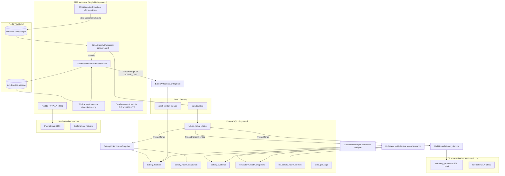

# Battery Health — Runtime Topology Audit (Prompt 1/8)

| Feld | Wert |
|------|------|
| **Audit-Zeitpunkt (UTC)** | 2026-07-16T10:25:00Z |
| **Repository-Git-Commit (lokal untersucht)** | `2b44e25de9eb2a561a43bdd2dc94dc985a43cd4c` |
| **VPS-deployed Commit (zum Audit-Zeitpunkt)** | `2cd57c8` (`billing: fix tenant billing tabs stuck loading on mobile`) |
| **Methodik** | Read-only Code-Inspektion + read-only VPS-Diagnose (keine Restarts, keine Writes) |
| **Untersuchte Umgebung** | **Produktion** (`app.synqdrive.eu` / Host `srv1374778.hstgr.cloud`). Kein separater Staging-Host im Repo dokumentiert (`architecture/STRIPE_CONNECT_TEST_ENV_READINESS_2026-07-14.md`: shared prod host). Lokal: nicht als laufende Battery-Runtime untersucht. |

---

## Executive Summary

Battery Health (LV 12V + HV traction) hat **keinen eigenen Worker, keine eigene BullMQ-Queue und keinen eigenen Scheduler**. Die gesamte Battery-Runtime hängt an der **DIMO-Snapshot-Pipeline** (`dimo.snapshot.poll`) und an **Trip-Start-Bestätigung** im selben NestJS-Prozess wie die HTTP-API.

Auf der VPS läuft **genau ein** SynqDrive-Node-Prozess (`pm2` → `synqdrive` → `dist/src/main.js`). Darin sind API, alle BullMQ-Consumer, alle `@Interval`/`@Cron`-Scheduler und Battery-Code kollokiert. **Kein** separater Worker-PM2-Eintrag.

Die Runtime-Topologie ist **weitgehend verifiziert** (Prozesse, Queues, DB-Zähler, Prometheus-Serien, Retention-Startup-Log). **Teilweise offen:** Grafana-Dashboard-Inhalt (Host-Network, kein UI-Zugang), ClickHouse-Tabellenabfragen ohne Credentials, detaillierte Scheduler-Tick-Logs (nur `debug`-Level).

---

## 1. Architekturdiagramm (Ist-Zustand)



**Lesepfad (UI/API):** `CanonicalBatteryHealthService` aggregiert LV (`BatteryV2Service` / `battery_features`), HV (`HvBatteryHealthService`), Evidence (`battery_evidence`) und `vehicle_latest_states` — ohne eigenen Async-Worker.

---

## 2. Prozessmatrix

| Prozess | Runtime | Startmechanismus | Aufgabe | Scheduler (in Prozess) | Konsumierte Queues |
|---------|---------|------------------|---------|------------------------|-------------------|
| `synqdrive` | Node 22.23.1, PM2 fork | `pm2 restart synqdrive` via `vps-deploy-release.sh` | HTTP API + alle Worker + alle Scheduler | Siehe unten | Alle in `WorkersModule` |
| `pm2-logrotate` | PM2-Modul | PM2 | Log-Rotation | — | — |
| `redis-server` | systemd | OS | BullMQ-Backend | — | — |
| `postgresql@16-main` | systemd | OS | Kanonische Battery-Daten | — | — |
| `synqdrive-clickhouse` | Docker | Compose/ops | Analytics-Mirror (`telemetry_snapshots`, HF) | — | — |
| `synqdrive-prometheus` | Docker | Compose/ops | Metrics-Scrape | — | — |
| `synqdrive-grafana` | Docker, **host network** | Compose/ops | Dashboards (Zugriff nicht verifiziert) | — | — |

### Scheduler innerhalb `synqdrive` (battery-relevant)

| Scheduler | Datei | Cadence | Battery-Bezug |
|-----------|-------|---------|---------------|
| `DimoSnapshotScheduler` | `backend/src/workers/schedulers/dimo-snapshot.scheduler.ts` | `@Interval(30000)` | **Primärer Battery-Input** — enqueued Snapshot-Jobs |
| `DimoSnapshotScheduler.sweepFailedJobs` | gleiche Datei | `@Interval(3600000)` | Janitor für failed Snapshot-Jobs |
| `TripTrackingRecoveryScheduler` | `trip-tracking-recovery.scheduler.ts` | ~120 s | Re-enqueue Trip-Jobs (indirekt für `onTripStart`/Crank) |
| `TripReconciliationScheduler` | `trip-reconciliation.scheduler.ts` | täglich | Segment-Backfill (Resume-Gap in Snapshot-Scheduler) |
| `DataRetentionScheduler` | `data-retention.scheduler.ts` | `@Cron('30 3 * * *')` | Optional: `battery_evidence`, `hv_battery_health_snapshots` |
| `HmHealthPollingScheduler` | `hm-health-polling.scheduler.ts` | HM-Polling | **Nicht** in Canonical Battery Health verdrahtet |

**VPS-Befund:** Nur **ein** `synqdrive`-Prozess (PID wechselt bei Restart). Snapshot-Scheduler läuft **nicht** mehrfach — keine zweite PM2-App, kein separater Worker-Service.

---

## 3. Queue-Matrix

Globale BullMQ-Defaults: `backend/src/app.module.ts` (`BullModule.forRootAsync`):

| Option | Wert |
|--------|------|
| `attempts` | 3 |
| `backoff` | exponential, 5000 ms |
| `removeOnComplete` | `{ count: 1000, age: 86400 }` |
| `removeOnFail` | `{ count: 5000, age: 604800 }` (7 Tage, bounded DLQ) |

### Battery-relevante Queues

| Queue | Producer | Consumer | Job-ID / Dedup | Per-Job-Overrides | Retry / DLQ |
|-------|----------|----------|----------------|-------------------|-------------|
| `dimo.snapshot.poll` | `DimoSnapshotScheduler` | `DimoSnapshotProcessor` | `snapshot-${vehicleId}` — max. 1 Job/Fahrzeug; terminal failed/completed wird vor Re-Add entfernt | `removeOnComplete: true`, `removeOnFail: { count: 50, age: 3600 }` | Global 3× + Snapshot-Janitor |
| `dimo.trip-tracking` | `TripDetectionOrchestrationService` | `TripTrackingProcessor` | trip-spezifisch | Global defaults | Indirekt Battery via `onTripStart` |

### Weitere registrierte Queues (ohne direkten Battery-Write)

`dimo.vehicle.sync`, `dimo.dtc.poll`, `dimo.tire.recalculation`, `trip.behavior.enrichment`, `trip.driving-impact.compute`, `dtc.knowledge.enrichment`, `notification.*`, `payment.email`, `task.automation`, `document.extraction` (in `QUEUE_NAMES`, nicht alle in `WorkersModule` registriert).

### VPS-Queue-Zustand (2026-07-16 ~10:22 UTC, read-only Redis)

| Queue | wait | active | delayed | failed |
|-------|-----:|-------:|--------:|-------:|
| `dimo.snapshot.poll` | 0 | 0 | 0 | 0 |
| `dimo.trip-tracking` | 0 | 0 | 0 | **2** |
| `trip.behavior.enrichment` | 0 | 0 | 0 | 0 |
| `trip.driving-impact.compute` | 0 | 0 | 0 | 0 |

**Prometheus (VPS):** `synqdrive_dimo_snapshot_poll_total{result="success"}` = **6120** (seit letztem Prozess-Start). Keine `synqdrive_battery_*`-Metriken.

**Queue-Dashboard:** `QueueMonitoringService.getAllQueueCounts()` — exponiert über Platform-Admin (`platform-admin.service.ts`), nicht öffentlich ohne Auth.

---

## 4. DIMO Snapshot Scheduling (Repository)

| Frage | Antwort | Callsites |
|-------|---------|-----------|
| Wo registriert? | `WorkersModule` → Provider `DimoSnapshotScheduler` | `backend/src/workers/workers.module.ts:80` |
| In welchem Prozess? | Gleicher NestJS-Prozess wie API (`main.ts` → `AppModule` → `WorkersModule`) | `backend/src/main.ts` |
| Wie oft? | **30 s** hardcoded `@Interval(30000)` | `dimo-snapshot.scheduler.ts:76` |
| Fahrzeug-Filter | `dimoVehicleId != null`, `status IN [AVAILABLE, RENTED]`, `dimoVehicle.connectionStatus = CONNECTED`, `tokenId != null` | `dimo-snapshot.scheduler.ts:98–108` |
| Job-Name | `'snapshot'` | `dimo-snapshot.scheduler.ts:142` |
| Job-ID | `snapshot-${vehicleId}` | `dimo-snapshot.scheduler.ts:118` |
| Dedup | `getJob` → remove wenn `failed`/`completed`; active bleibt → `skipped_inflight` | `dimo-snapshot.scheduler.ts:125–158` |
| Enqueue-Guard | `canEnqueueQueue(logger, 'dimo-snapshot')` wenn `RuntimeStatusRegistry.workersEnabled` | `queue-producer.util.ts` |
| Resume-Backfill | Gap > 3 min → fire-and-forget `TripReconciliationService.triggerManualReconciliation` | `dimo-snapshot.scheduler.ts:86–95` |

**Env-Drift:** `WORKER_SNAPSHOT_INTERVAL_MS` in `worker.config.ts` / `.env.example` ist **nicht** an `@Interval` angebunden.

---

## 5. Snapshot Processing & Battery-Verarbeitungsreihenfolge

**Datei:** `backend/src/workers/processors/dimo-snapshot.processor.ts`  
**Consumer:** `DimoSnapshotProcessor`, `concurrency: 5`, `lockDuration: 60_000`

| Schritt | Operation | awaited / fire-and-forget |
|--------:|-----------|---------------------------|
| 1 | `vehicleLatestState.findUnique` (previous) | **awaited** |
| 2 | `DimoAuthService.getVehicleJwt` | **awaited** |
| 3 | `DimoTelemetryService.fetchLatestVehicleSnapshot` | **awaited** |
| 4 | `normalizeSnapshot` + `vehicleLatestState.upsert` | **awaited** |
| 5 | `ClickHouseTelemetryService.insertSnapshot` + `detectAndInsertStateChanges` | **fire-and-forget** (`.catch`) |
| 6 | `BatteryV2Service.onSnapshot(vehicleId, lvBatteryVoltage, observedAt)` | **fire-and-forget** |
| 7 | `HvBatteryHealthService.recordSnapshot(...)` wenn `evSoc != null` | **fire-and-forget** |
| 8 | `evaluateTripStart` → `TripDetectionOrchestrationService.evaluateSnapshotForTripStart` | **awaited** (Fehler intern geloggt) |
| 9 | `dimoPollLog.create` + `vehicleLatestState.updateMany(syncJobRef)` | **awaited** |

### Crank / Start-Pfad (separat vom Snapshot-Tick)

| Trigger | Operation | Modus |
|---------|-----------|-------|
| Trip-Start bestätigt (`ACTIVE_TRIP`) | `BatteryV2Service.onTripStart` | **fire-and-forget** |
| | `DimoSegmentsService.fetchCrankWindow` (GraphQL) | innerhalb `onTripStart` awaited |
| | Schreibt `battery_features` (vPreCrank, vMinCrank, …) | awaited in `onTripStart` |

**Callsites:** `trip-detection-orchestration.service.ts:928–935`

### Battery-Module & Speicherorte

| Domäne | Service | Schreibt nach | Trigger |
|--------|---------|---------------|---------|
| LV Live + Rest | `BatteryV2Service.onSnapshot` | `battery_features`, via `BatteryHealthService.recordSnapshot` → `battery_health_snapshots` | Jeder Snapshot (RESTING-Gate für Rest-Fenster) |
| LV Crank | `BatteryV2Service.onTripStart` | `battery_features` | Trip-Start bestätigt |
| LV Scoring | `BatteryV2Service.recomputeHealth` | `battery_features` (SOH-Felder) | Nach Rest/Crank-Updates |
| HV Snapshots | `HvBatteryHealthService.recordSnapshot` | `hv_battery_health_snapshots`, `hv_battery_health_current`, `battery_evidence` | Snapshot mit `evSoc` |
| Evidence | `BatteryEvidenceService` | `battery_evidence` (dedup unique key) | HV, Documents, Legacy |
| Read Model | `CanonicalBatteryHealthService` | — (read-only) | API `/battery-health-*` |
| Business Alert | `BatteryCriticalDetector` | Business Insights (nicht Prometheus) | Scheduled BI evaluation |

**Konfiguration LV:** `BATTERY_REST_60M_MS`, `BATTERY_REST_6H_MS`, `BATTERY_MAX_SAMPLE_AGE_MS` — `battery-v2.service.ts:44–55`

**HM-Battery:** High-Mobility-Telemetrie ist **nicht** in `CanonicalBatteryHealthService` eingespeist (Display-grade only, siehe `architecture/ARCHITECTURE_REVIEW_2026-04-10.md`).

---

## 6. Fire-and-forget-Stellen (Battery-relevant)

| Stelle | Datei | Risiko |
|--------|-------|--------|
| `batteryV2.onSnapshot(...).catch` | `dimo-snapshot.processor.ts:143–149` | Snapshot-Job = SUCCESS auch wenn LV-Rest/Crank-Daten verloren |
| `hvBattery.recordSnapshot(...).catch` | `dimo-snapshot.processor.ts:153–177` | EV HV-Daten können fehlen trotz erfolgreichem Poll |
| `chTelemetry.insertSnapshot(...).catch` | `dimo-snapshot.processor.ts:123–125` | Analytics-Lücke, nicht kanonisch |
| `batteryV2.onTripStart(...).catch` | `trip-detection-orchestration.service.ts:929–935` | Crank-Features optional verloren |
| `runResumeBackfill` | `dimo-snapshot.scheduler.ts:94` | Trip-Backfill parallel, nicht battery-spezifisch |

**Konsequenz:** `synqdrive_dimo_snapshot_poll_total{result="success"}` beweist **nicht** Battery-Persistenz.

---

## 7. Datenbanken & Speicherorte

### PostgreSQL (kanonisch für Battery Health)

| Tabelle | VPS-Zeilen (2026-07-16) | Retention aktiv? |
|---------|------------------------:|------------------|
| `battery_features` | 5 | **Nein** (nicht im Scheduler) |
| `battery_health_snapshots` | 162 | **Nein** |
| `battery_evidence` | 71 903 | **Nein** (`RETENTION_BATTERY_EVIDENCE_DAYS` nicht gesetzt → 0) |
| `hv_battery_health_snapshots` | 108 622 | **Nein** (`RETENTION_HV_BATTERY_SNAPSHOTS_DAYS` nicht gesetzt → 0) |
| `hv_battery_health_current` | 1 | **Nein** |
| `vehicle_latest_states` | 6 | — (aktueller Zustand) |
| `dimo_poll_logs` | 513 213 | **Ja, 30 Tage** |
| DIMO-pollbare Fahrzeuge | 6 | — |

### ClickHouse (Analytics-Mirror)

| Befund | Detail |
|--------|--------|
| Deployment | Docker `synqdrive-clickhouse`, Ports `127.0.0.1:8123`, `127.0.0.1:9000` |
| Ping | `Ok.` |
| Tabellenabfrage | Ohne Credentials fehlgeschlagen (Auth erforderlich) |
| App-Konfig | `CLICKHOUSE_URL`, `CLICKHOUSE_USER`, `CLICKHOUSE_PASSWORD`, `CLICKHOUSE_DATABASE` gesetzt |
| Battery-Felder in CH | `ev_soc`, `traction_kw` in `telemetry_snapshots`; **kein** LV-Voltage-Spiegel |
| TTL | `telemetry_snapshots` 180 Tage (`migrations/002_retention_ttl_and_storage_policy.sql`) |
| Mirror-Metrik | `synqdrive_clickhouse_mirror_writes_total{table="telemetry_snapshots",result="success"}` = 6120 |

### Redis

Version **7.0.15**, **190** Keys in db0. Bull-Keys für `dimo.snapshot.poll` vorhanden (`bull:dimo.snapshot.poll:id`).

---

## 8. Aktive Retention-Konfiguration (VPS)

**Startup-Log (2026-07-16T01:52:08 UTC):**

```
Data retention ENABLED — active windows: dimoPollLogs=30d, tripTrackingRuns=30d,
hmStreamSyncLogs=14d, hmHealthSyncLogs=30d, tripRepairs=365d, refreshTokens=30d
```

| ENV-Variable | VPS gesetzt? | Battery-Auswirkung |
|--------------|--------------|-------------------|
| `DATA_RETENTION_ENABLED` | Ja | Master-Switch an |
| `RETENTION_BATTERY_EVIDENCE_DAYS` | **Nein** | Default **0** → kein Prune |
| `RETENTION_HV_BATTERY_SNAPSHOTS_DAYS` | **Nein** | Default **0** → kein Prune |
| `RETENTION_DIMO_POLL_LOGS_DAYS` | Ja (30) | Indirekt — Poll-Erfolg-Logs |

**Nicht im Retention-Scheduler:** `battery_health_snapshots`, `battery_features`, `hv_battery_health_current`.

**ClickHouse-TTL:** unabhängig von Postgres-Retention-Scheduler (schema-migration).

---

## 9. Monitoring- & Metrikabdeckung

| Signal | Vorhanden? | Quelle |
|--------|------------|--------|
| Snapshot-Erfolg/Fehler | Ja | `synqdrive_dimo_snapshot_poll_total{result}` |
| Leere Snapshots | Ja | `synqdrive_empty_snapshots_total` |
| Stale Snapshots (>5 min) | Ja | `synqdrive_stale_snapshots_total` |
| CH-Mirror | Ja | `synqdrive_clickhouse_mirror_writes_total` |
| Queue-Lag | Ja (Histogram) | `synqdrive_queue_lag_seconds` |
| **Battery-spezifisch** | **Nein** | — |
| LV SOH / Rest-Capture | Nein | Nur DB |
| HV SOH / Publication | Nein | Nur DB |
| `BatteryCriticalDetector` | Ja (Business Insights) | Kein Prometheus |

**Prometheus:** Docker `synqdrive-prometheus`, Target `synqdrive-backend` = **up**.  
**Grafana:** Docker `synqdrive-grafana`, **NetworkMode=host** — Dashboard-Inhalt nicht inspiziert.  
**Metrics-Endpoint:** `GET /api/v1/metrics` (Bearer-Token in Prod empfohlen; Audit nutzte localhost ohne Token-Exposition in diesem Dokument).

---

## 10. Abweichungen Repository ↔ VPS

| Thema | Repository | VPS (Ist) |
|-------|------------|-----------|
| Deploy-Commit | Audit-Basis `2b44e25` (V4.9.506) | Laufend `2cd57c8` (neuer Billing-Fix) — Battery-Pfade unverändert erwartet, nicht diff-verifiziert |
| Prozessmodell | Monolith dokumentiert | **Bestätigt:** 1× PM2 `synqdrive` |
| Snapshot-Intervall | Code: 30 s hardcoded | Metrik 6120 success / ~8 h uptime ≈ plausibel (~1 poll/vehicle/30s × 6 vehicles) |
| `WORKER_SNAPSHOT_INTERVAL_MS` | In Config, nicht wired | Nicht wirksam |
| `WORKER_SNAPSHOT_CONCURRENCY` | `.env.example` | Processor hardcoded `5` |
| `WORKER_BATTERY_ENRICHMENT_CONCURRENCY` | `.env.example` | **Kein Code-Referenz** |
| ClickHouse | Optional via `ClickHouseModule` | Container läuft; Mirror-Metriken > 0 |
| Battery-Retention | Opt-in via ENV | **Nicht aktiviert** trotz großer Tabellen |
| Separater Battery-Worker | Nicht vorhanden | **Bestätigt** |

---

## 11. Risiko-Register

| ID | Prio | Befund |
|----|------|--------|
| R-B01 | **P1** | Battery LV/HV/CH-Writes sind fire-and-forget — Snapshot-Job-Erfolg ≠ Battery-Daten persistiert |
| R-B02 | **P1** | Keine battery-spezifischen Prometheus-Metriken — Silent Data Loss schwer detektierbar |
| R-B03 | **P1** | Große Battery-Tabellen (`battery_evidence`, `hv_battery_health_snapshots`) ohne aktive Retention auf VPS |
| R-B04 | **P2** | Env-Drift (`WORKER_SNAPSHOT_*`, `WORKER_BATTERY_ENRICHMENT_CONCURRENCY`) — Ops-Dokumentation irreführend |
| R-B05 | **P2** | `dimo.trip-tracking` 2 failed Jobs auf VPS — indirektes Crank-Risiko bei betroffenen Trips |
| R-B06 | **P2** | ClickHouse-Migration-Checksum-Warnungen im Log (nicht Battery-spezifisch, aber Analytics-Risiko) |
| R-B07 | **P2** | HM-Battery-Signale nicht in kanonischem Battery-Health-Pfad |

**P0:** Keiner identifiziert (System läuft; Daten werden geschrieben).

---

## 12. Offene Fragen & fehlende Zugriffe

1. **Grafana:** Welche Dashboards/Panels zeigen Battery-Metriken? (Host-Network, kein UI/Login im Audit)
2. **ClickHouse:** Tabellengrößen und `telemetry_snapshots`-Schema live (Auth erforderlich)
3. **Fall B/C/D Smoke** für Battery (Rest/Crank/HV) pro Fahrzeug — erfordert DB-Zeitreihen-Analyse oder UI
4. **Deploy-Drift `2cd57c8` vs `2b44e25`:** Battery-relevante Diff nicht einzeln geprüft
5. **Scheduler-Tick-Logs:** `DimoSnapshotScheduler` loggt nur `debug` für `enqueued=N` — im PM2-Out-Log nicht sichtbar
6. **Platform-Admin Queue-Dashboard:** Nicht ohne Auth aufgerufen

---

## 13. Verwendete read-only Befehle (ohne Secrets)

### VPS (SSH)

```bash
# Deploy-Version
cd /opt/synqdrive/current && git log -1 --oneline

# Prozesse
pm2 list
pm2 describe synqdrive
ps aux | grep node
docker ps
systemctl list-units --type=service --state=running | grep -iE 'redis|postgres'

# Redis / Queues
redis-cli INFO server
redis-cli INFO keyspace
redis-cli LLEN bull:dimo.snapshot.poll:wait
redis-cli LLEN bull:dimo.snapshot.poll:active
redis-cli ZCARD bull:dimo.snapshot.poll:failed
redis-cli ZCARD bull:dimo.trip-tracking:failed

# Retention ENV (Namen only, Werte redacted)
grep -E '^RETENTION_|^DATA_RETENTION|^BATTERY_' /opt/synqdrive/shared/backend.env | sed 's/=.*$/=<redacted>/'

# Health & Metrics
curl -sf http://127.0.0.1:3001/api/v1/health
curl -sf http://127.0.0.1:3001/api/v1/metrics | grep -E 'synqdrive_(dimo|clickhouse|queue)'

# ClickHouse
curl -sf http://127.0.0.1:8123/ping

# PostgreSQL counts (Prisma read-only)
cd /opt/synqdrive/current/backend && node -e '/* PrismaClient COUNT on battery_* tables */'

# Logs (read-only)
grep -i 'Data retention' /root/.pm2/logs/synqdrive-out.log | tail -3
```

### Repository

```bash
git rev-parse HEAD
# Code-Inspektion der Pfade in Abschnitt 4–5
```

---

## 14. Wichtige Dateipfade & Code-Callsites

| Bereich | Pfad |
|---------|------|
| Snapshot Scheduler | `backend/src/workers/schedulers/dimo-snapshot.scheduler.ts` |
| Snapshot Processor | `backend/src/workers/processors/dimo-snapshot.processor.ts` |
| Trip Orchestration + Crank | `backend/src/modules/vehicle-intelligence/trips/trip-detection-orchestration.service.ts` |
| LV Battery V2 | `backend/src/modules/vehicle-intelligence/battery-health/battery-v2.service.ts` |
| Legacy LV snapshots | `backend/src/modules/vehicle-intelligence/battery-health/battery-health.service.ts` |
| HV Battery | `backend/src/modules/vehicle-intelligence/battery-health/hv-battery-health.service.ts` |
| Canonical read model | `backend/src/modules/vehicle-intelligence/battery-health/canonical-battery-health.service.ts` |
| Evidence | `backend/src/modules/vehicle-intelligence/battery-health/battery-evidence.service.ts` |
| Crank GraphQL | `backend/src/modules/dimo/queries/battery-crank.query.ts` |
| Worker bootstrap | `backend/src/workers/workers.module.ts`, `backend/src/app.module.ts` |
| Queue names | `backend/src/workers/queues/queue-names.ts` |
| Retention | `backend/src/config/retention.config.ts`, `backend/src/workers/schedulers/data-retention.scheduler.ts` |
| Metrics | `backend/src/modules/observability/trip-metrics.service.ts` |
| Queue monitoring | `backend/src/modules/observability/queue-monitoring.service.ts` |
| Ops queue inspect | `backend/scripts/inspect-dimo-snapshot-queue.ts` |
| Architektur-Referenz | `architecture/TRIP_SYSTEM_AUDIT_2026-04-10.md` |
| Deploy / PM2 | `backend/scripts/ops/vps-deploy-release.sh` |

---

## 15. Verifikationsstatus

| Bereich | Status |
|---------|--------|
| Prozess-Topologie (PM2, Docker, systemd) | **Vollständig** |
| Battery im API-Prozess vs. separater Worker | **Vollständig** (nur Monolith) |
| Snapshot-Scheduler Einmaligkeit | **Vollständig** |
| Queue-Namen, Dedup, Retry | **Vollständig** (Code + Redis) |
| Battery-Verarbeitungsreihenfolge | **Vollständig** (Code) |
| Fire-and-forget-Stellen | **Vollständig** (Code) |
| Postgres-Speicher & Zeilen | **Vollständig** (VPS) |
| Retention aktiv | **Vollständig** (VPS-Log + ENV-Namen) |
| Prometheus indirect metrics | **Vollständig** |
| ClickHouse-Details | **Teilweise** (Container ja, SQL nein) |
| Grafana Dashboards | **Nicht verifiziert** |

**Gesamt:** Runtime-Topologie **überwiegend verifiziert**; Monitoring-UI und CH-Detailabfragen offen.

---

*Ende Battery Runtime Topology Audit — Prompt 1/8. Read-only; keine Produktänderungen.*
