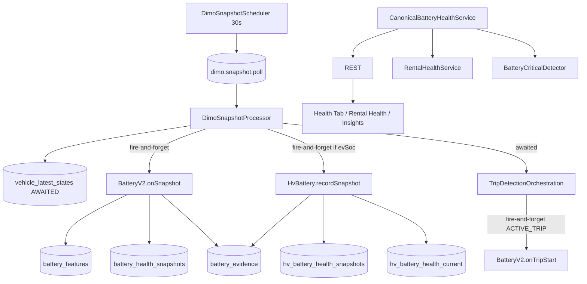

# Battery Health V2 — Read-only Implementierungsinventur (Prompt 1/78)

| Feld | Wert |
|------|------|
| **Dokumenttyp** | Repository-Inventur / Implementierungsgrundlage |
| **Erstellt (UTC)** | 2026-07-16T14:00:00Z |
| **Repository-Git-Commit** | `a2024d993db73694b2e52cec7e274ba8a1cf4d93` |
| **Basis-Audits** | LV/HV-Serie Prompts 1–8 + [`dimo-tesla-hv-signal-capability.md`](./dimo-tesla-hv-signal-capability.md) |
| **Normativ** | [`battery-measurement-domain-decision.md`](./battery-measurement-domain-decision.md) übersteuert Legacy-Code |
| **Status** | Read-only — **keine** produktiven Codeänderungen in diesem Prompt |

---

## 1. Datei- und Callsite-Matrix

### 1.1 Runtime-Ingestion (DIMO → Battery)

| Datei | Symbole | Rolle |
|-------|---------|------|
| `backend/src/workers/schedulers/dimo-snapshot.scheduler.ts` | `DimoSnapshotScheduler`, `@Interval(30000)` | Enqueued `dimo.snapshot.poll` (`jobId=snapshot-<vehicleId>`); Resume-Backfill via `TripReconciliationService` (`void runResumeBackfill`) |
| `backend/src/workers/processors/dimo-snapshot.processor.ts` | `DimoSnapshotProcessor`, `normalizeSnapshot` | BullMQ consumer (`concurrency: 5`, `lockDuration: 60s`); upsert `vehicle_latest_states`; **fire-and-forget** LV/HV battery hooks |
| `backend/src/workers/queues/queue-names.ts` | `QUEUE_NAMES.DIMO_SNAPSHOT` | Queue `dimo.snapshot.poll` |
| `backend/src/workers/workers.module.ts` | providers | Registriert Snapshot Scheduler/Processor |
| `backend/src/modules/dimo/dimo-telemetry.service.ts` | `fetchLatestVehicleSnapshot` | GraphQL `signalsLatest` |
| `backend/src/modules/dimo/queries/latest-vehicle-snapshot.query.ts` | `buildLatestSnapshotQuery` | HV/LV Signal-Felder im Snapshot |
| `backend/src/modules/observability/trip-metrics.service.ts` | `synqdrive_dimo_snapshot_poll_total`, `staleSnapshots` | Poll-Erfolg/Stale — **keine** Battery-Metriken |

### 1.2 Kern-Services (Battery Health V2)

| Datei | Klasse | Rolle |
|-------|--------|------|
| `backend/src/modules/vehicle-intelligence/battery-health/battery-v2.service.ts` | `BatteryV2Service` | LV: `onSnapshot`, `onTripStart`, `recomputeHealth`, `getV2Health` |
| `backend/src/modules/vehicle-intelligence/battery-health/canonical-battery-health.service.ts` | `CanonicalBatteryHealthService` | Read-Fassade: `getSummary`, `getDetail` |
| `backend/src/modules/vehicle-intelligence/battery-health/hv-battery-health.service.ts` | `HvBatteryHealthService` | HV: `recordSnapshot`, `getHvBatteryStatus`, `calculateSoh`, `upsertPublicationState` |
| `backend/src/modules/vehicle-intelligence/battery-health/battery-health.service.ts` | `BatteryHealthService` | Legacy LV-Snapshots + Trend (`sohPercent` immer `null` bei Insert) |
| `backend/src/modules/vehicle-intelligence/battery-health/battery-evidence.service.ts` | `BatteryEvidenceService` | `record`, `recordMany`, `getLatest`, `listRecent`, `series` |
| `backend/src/modules/vehicle-intelligence/battery-health/battery-status.ts` | pure functions | Klassifikation LV/HV (shared mit Detector) |
| `backend/src/modules/vehicle-intelligence/battery-health/soh-publication.ts` | utilities | EWMA, Maturity, `shouldPublish`, `isLegacyHvDegradationModel` |
| `backend/src/modules/vehicle-intelligence/battery-health/battery-document-confirmation.util.ts` | `normalizeBatteryDocumentConfirm` | AI-Upload BATTERY → Evidence |
| `backend/src/modules/vehicle-intelligence/battery/battery.service.ts` | `BatteryService` | `VehicleBatterySpec` CRUD (Masterdaten) |

**Modul:** `backend/src/modules/vehicle-intelligence/vehicle-intelligence.module.ts` — exportiert alle Battery-Services.

### 1.3 Trip-Hooks

| Datei | Hook | Trigger | Awaited? |
|-------|------|---------|----------|
| `dimo-snapshot.processor.ts` L142–149 | `batteryV2.onSnapshot` | Jeder erfolgreiche Snapshot | **Nein** (`.catch`) |
| `dimo-snapshot.processor.ts` L151–177 | `hvBattery.recordSnapshot` | `evSoc != null` | **Nein** (`.catch`) |
| `trip-detection-orchestration.service.ts` L928–935 | `batteryV2.onTripStart` | `ACTIVE_TRIP` bestätigt | **Nein** (`.catch`) |
| — | Trip-Ende | — | **Kein** Battery-Hook |

**Crank-Unterstützung:**

| Datei | Rolle |
|-------|------|
| `backend/src/modules/dimo/queries/battery-crank.query.ts` | GraphQL 5s-Fenster |
| `backend/src/modules/dimo/dimo-segments.service.ts` | `fetchCrankWindow` |

### 1.4 API / Controller

| Datei | Endpoints |
|-------|-----------|
| `backend/src/modules/vehicle-intelligence/vehicle-intelligence.controller.ts` | Siehe §5 |

### 1.5 Downstream-Consumer (Backend)

| Datei | Nutzung |
|-------|---------|
| `backend/src/modules/rental-health/rental-health.service.ts` | `evaluateBattery` → `CanonicalBatteryHealthService.getSummary` |
| `backend/src/modules/business-insights/detectors/battery-critical.detector.ts` | `BATTERY_CRITICAL` Insights |
| `backend/src/modules/vehicle-intelligence/health-summary/health-summary.service.ts` | AI Summary — `getSummary().catch(() => null)` |
| `backend/src/modules/vehicle-intelligence/health-summary/ai-health-care-aggregation.service.ts` | AI Health Care — `getSummary().catch(() => null)` |
| `backend/src/modules/vehicle-intelligence/health-summary/vehicle-health-tab-summary.service.ts` | Health-Tab via Rental-Health |
| `backend/src/modules/document-extraction/document-extraction-apply.service.ts` | `applyBattery` → Evidence + optional Snapshot |
| `backend/src/modules/data-analyse/data-analyse.service.ts` | Field-Trace Battery |
| `backend/src/modules/platform-admin/vehicle-logbook.service.ts` | Debug: `battery_features`, `hv_battery_health_current` |

### 1.6 Frontend (UI / API-Client)

| Datei | Rolle |
|-------|------|
| `frontend/src/lib/api.ts` | DTOs + `batteryHealthSummary`, `batteryHealthDetail`, `hvBatteryStatus`, … |
| `frontend/src/rental/components/HealthErrorsView.tsx` | **Primäre** Health-Tab Battery-Card + LV/HV-Modals |
| `frontend/src/rental/components/BatteryConditionBars.tsx` | 3-Balken LV Estimated Health |
| `frontend/src/rental/lib/battery-health-detail-ui.ts` | Detail-Rows, Ruhespannungs-Chart |
| `frontend/src/rental/lib/battery-display.utils.ts` | Spannungs-Normalisierung |
| `frontend/src/rental/components/FleetConditionView.tsx` | Lazy `batteryHealthSummary` |
| `frontend/src/rental/components/FleetConditionDetailView.tsx` | Legacy Detail |
| `frontend/src/rental/components/VehicleInsightsCard.tsx` | Lazy Summary |
| `frontend/src/rental/components/vehicle-detail/useVehicleHealthBoxData.ts` | Health-Box |
| `frontend/src/rental/components/vehicle-detail/vehicle-health-box.mapper.ts` | Mapper |
| `frontend/src/rental/components/health/HealthVehicleDetailPanel.tsx` | Health-Detail-Panel |
| `frontend/src/rental/hooks/useHealthVehicleDetailData.ts` | Tab Lazy-Load |
| `frontend/src/master/components/HealthTrackingView.tsx` | Master-Doku V2-Flow |

### 1.7 Prisma / Migrationen

| Datei | Inhalt |
|-------|--------|
| `backend/prisma/schema.prisma` | `BatteryHealthSnapshot`, `BatteryFeatures`, `HvBatteryHealthSnapshot`, `HvBatteryHealthCurrent`, `BatteryEvidence`, Enums |
| `backend/prisma/migrations/20260311224040_init/migration.sql` | Basis `battery_health_snapshots` |
| `backend/prisma/migrations/20260413220000_battery_evidence_unique_dedup/` | Evidence-Dedup |
| `backend/prisma/migrations/20260417180000_add_battery_critical_insight_type/` | `BATTERY_CRITICAL` |
| `backend/prisma/migrations/20260614120300_battery_health_tables_guard/` | V2-Tabellen + Enums |

### 1.8 Worker / Retention / Ops

| Datei | Rolle |
|-------|------|
| `backend/src/workers/schedulers/data-retention.scheduler.ts` | Optional purge `battery_evidence`, `hv_battery_health_snapshots` |
| `backend/src/config/retention.config.ts` | `RETENTION_BATTERY_EVIDENCE_DAYS`, `RETENTION_HV_BATTERY_SNAPSHOTS_DAYS` (default **0**) |
| `backend/scripts/inspect-dimo-snapshot-queue.ts` | Queue-Ops |
| `backend/scripts/clear-stuck-snapshot-jobs.ts` | Stuck-Jobs |
| `backend/scripts/apply-battery-critical-enum.ts` | Enum-Migration Helper |
| `backend/monitoring/prometheus/` | Scrape/Alerts — **kein** `synqdrive_battery_*` |
| `docs/prometheus-production.md` | Ops-Doku |

### 1.9 Tests (vorhanden)

| Datei | Abdeckung |
|-------|-----------|
| `canonical-battery-health.service.spec.ts` | Summary/Detail, HV-Precedence, degradation_model |
| `battery-health.service.spec.ts` | Snapshot `observedAt` |
| `battery-status.spec.ts` | Klassifikation Schwellen |
| `soh-publication.spec.ts` | Publication-Utilities (34 Tests) |
| `battery-document-confirmation.util.spec.ts` | AI-Upload Parsing |
| `battery-critical.detector.spec.ts` | Detector + legacy HV |
| `rental-health.service.spec.ts` | Battery-Modul Pfade |
| `frontend/src/rental/lib/battery-health-detail-ui.test.ts` | Detail-UI |
| `frontend/src/rental/lib/battery-display.utils.test.ts` | Display Utils |
| `frontend/src/rental/components/vehicle-detail/vehicle-health-box.mapper.test.ts` | Health-Box |

**Fehlend:** dedizierte `battery-v2.service.spec.ts`, `hv-battery-health.service.spec.ts`, E2E Snapshot→Battery Integration.

### 1.10 Callsite-Matrix (Service → Caller)

| Service | Methode | Caller |
|---------|---------|--------|
| `BatteryV2Service` | `onSnapshot` | `DimoSnapshotProcessor` |
| `BatteryV2Service` | `onTripStart` | `TripDetectionOrchestrationService` |
| `BatteryV2Service` | `getV2Health` | `VehicleIntelligenceController`, `CanonicalBatteryHealthService` |
| `HvBatteryHealthService` | `recordSnapshot` | `DimoSnapshotProcessor` |
| `HvBatteryHealthService` | `getHvBatteryStatus` | `VehicleIntelligenceController`, `CanonicalBatteryHealthService` |
| `CanonicalBatteryHealthService` | `getSummary` | Controller, RentalHealth, HealthSummary, AI Health Care |
| `CanonicalBatteryHealthService` | `getDetail` | Controller |
| `BatteryEvidenceService` | `record*` | BatteryV2, HvBattery, BatteryHealth, DocumentExtraction |
| `BatteryHealthService` | `recordSnapshot` | BatteryV2 (delegiert) |

---

## 2. Aktuelle LV- und HV-Datenflüsse

### 2.1 Gesamtfluss



### 2.2 LV-Pfad (ICE — 5 Fahrzeuge)

| Stufe | Quelle | Ziel | Vertrag (Ist) |
|-------|--------|------|---------------|
| Live | DIMO `lowVoltageBatteryCurrentVoltage` | `vehicle_latest_states.lvBatteryVoltage` | Jeder Poll |
| REST 60m/6h | `onSnapshot` + `TripDetectionState.RESTING` | `battery_features.vOff60m/vOff6h` | Env `BATTERY_REST_*_MS`; Stale-Guard 5 min |
| Crank | `onTripStart` + `fetchCrankWindow` (5s agg) | `battery_features` crank fields | Median +169 s nach Trip-Start (Audit) |
| Score | `computeHealth` (35% rest + 35% crank + …) | `battery_features.estimatedSohPct` | **Verhaltensscore**, nicht Werkstatt-SOH |
| Publication | `recomputeHealth` → EWMA + Maturity | `publishedSohPct`, `publicationState` | 5× ICE `STABLE` bei 31 % kontaminierten REST (Audit) |
| Evidence | `recomputeHealth` | `battery_evidence` `SOH_PERCENT` | **Semantik-Widerspruch** zum Vertrag (LV-Score als SOH) |

**BEV (KS FH 660E):** Kein LV-Signal → `onSnapshot` no-op nach Stale-Guard; `UNSUPPORTED_PROFILE` in Canonical.

### 2.3 HV-Pfad (BEV — 1 Fahrzeug)

| Stufe | Quelle | Ziel | Vertrag (Ist) |
|-------|--------|------|---------------|
| Live | DIMO traction signals | `vehicle_latest_states` (`evSoc`, energy, charging flags) | Jeder Poll |
| Snapshot | `recordSnapshot` | `hv_battery_health_snapshots` | **Jeder** Poll mit `evSoc` — 93,7 % TS-Duplikate (Audit) |
| Kapazität | `calculateSoh` `energy_throughput` | `estimatedCapacityKwh` auf Snapshot | ΔSOC≥5 % zwischen **aufeinanderfolgenden Polls** — **0** belastbare Estimates in Prod |
| Provider SOH | `tractionBatterySohPercent` | Evidence + Snapshot | **Null** für Tesla (DIMO-Audit) |
| Publication | `upsertPublicationState` | `hv_battery_health_current` | BEV: `publishedSohPct=85` unter `INITIAL_CALIBRATION` (Audit — **INVALID**) |
| Segmente | — | — | **Nicht angebunden** — DIMO `recharge` existiert, Code nutzt nur Snapshot-Polling |

**Tesla DIMO (2026-07):** M2 Energy/SOC ~55,5 kWh stabil (Shadow); Provider-SOH/GrossCapacity/ChargingPower fehlen; Recharge-Segmente 8/8 zuverlässig — **nicht im Code**.

---

## 3. Alle Schreibpfade

| Writer | Tabelle | Operation | Auslöser |
|--------|---------|-----------|----------|
| `DimoSnapshotProcessor` | `vehicle_latest_states` | upsert | Jeder Poll |
| `DimoSnapshotProcessor` | `dimo_poll_logs` | create | Poll SUCCESS |
| `BatteryV2Service` | `battery_features` | upsert/update | REST-Fenster, Crank, `recomputeHealth` |
| `BatteryV2Service` → `BatteryHealthService` | `battery_health_snapshots` | create | REST-Capture (`sohPercent: null`) |
| `BatteryV2Service` → `BatteryEvidenceService` | `battery_evidence` | upsert | Publication/Evidence |
| `HvBatteryHealthService` | `hv_battery_health_snapshots` | create | Jeder `recordSnapshot` |
| `HvBatteryHealthService` | `hv_battery_health_current` | upsert/update | `upsertPublicationState` |
| `HvBatteryHealthService` | `battery_evidence` | recordMany | SOC, range, temp, provider SOH, … |
| `DocumentExtractionApplyService` | `battery_evidence` (+ optional snapshots) | upsert/create | AI Upload BATTERY confirm |
| `BatteryHealthService` | `battery_health_snapshots` | create | Direkt (Legacy) |
| `DataRetentionScheduler` | `battery_evidence`, `hv_battery_health_snapshots` | deleteMany | Cron wenn days>0 |

**Nicht geschrieben durch Battery-Pipeline:** `battery_measurements` (existiert nicht), ClickHouse Battery-Tabellen (nur generischer Snapshot-Mirror).

---

## 4. Assessment- und Publication-Pfade

### 4.1 LV Assessment + Publication

```
BatteryV2Service.onSnapshot / onTripStart
  → Feature-Update (battery_features)
  → recomputeHealth()
      → computeHealth() → rawSohPct / estimatedSohPct
      → stabilize() → stabilizedSohPct
      → determineLvMaturity() → publicationState
      → shouldPublish() → publishedSohPct
      → battery_features.update
      → BatteryEvidenceService (SOH_PERCENT)  ← Vertragskonflikt
```

**Maturity:** `INITIAL_CALIBRATION` → `STABILIZING` → `STABLE` via `soh-publication.ts` `determineLvMaturity`.

### 4.2 HV Assessment + Publication

```
HvBatteryHealthService.recordSnapshot
  → hv_battery_health_snapshots.create (+ optional estimatedCapacityKwh)
  → battery_evidence.recordMany
  → upsertPublicationState() [intern .catch in recordSnapshot path]
      → calculateSoh() [capacity_measurement | energy_throughput | insufficient_data]
      → stabilize / determineHvMaturity / shouldPublish
      → hv_battery_health_current upsert
```

**Legacy:** `degradation_model` via `isLegacyHvDegradationModel()` neutralisiert (nicht publizieren).

### 4.3 Canonical Read (keine Writes)

`CanonicalBatteryHealthService.getSummary/getDetail` fusioniert:
- LV: `BatteryV2Service.getV2Health`, `VehicleLatestState`, `BatteryEvidence`, `VehicleBatterySpec`
- HV: `HvBatteryHealthService.getHvBatteryStatus`, Evidence-Precedence (Provider → Document → Capacity)

---

## 5. UI- und API-Consumer

### 5.1 REST-Endpoints (`vehicle-intelligence.controller.ts`)

| Methode | Route | Service |
|---------|-------|---------|
| GET | `/vehicles/:id/battery` | `BatteryService` (Specs) |
| POST/PATCH | `/vehicles/:id/battery` | Spec CRUD |
| GET | `/vehicles/:id/battery-health` | `BatteryHealthService` (History) |
| GET | `/vehicles/:id/battery-health/latest` | `BatteryV2` + Canonical |
| GET | `/vehicles/:id/battery-health/v2` | `BatteryV2Service` |
| GET | `/vehicles/:id/battery-health/trend` | `BatteryHealthService.getSohTrend` |
| GET | `/vehicles/:id/battery-health-summary` | `CanonicalBatteryHealthService.getSummary` |
| GET | `/vehicles/:id/battery-health-detail` | `CanonicalBatteryHealthService.getDetail` |
| GET | `/vehicles/:id/hv-battery-status` | `HvBatteryHealthService` + Canonical |

**Rental Health:** `GET .../rental-health` → `RentalHealthService.evaluateBattery`.

### 5.2 Frontend-Consumer

| Surface | API | Refresh |
|---------|-----|---------|
| Health Tab (`HealthErrorsView`) | `batteryHealthDetail`, `hvBatteryStatus` | Einmalig bei Mount — **kein** `refetchInterval` |
| Fleet Condition | `batteryHealthSummary` | Lazy on expand |
| Vehicle Insights | `batteryHealthSummary` | Lazy |
| Health Box | `batteryHealthSummary` | Hook-basiert |
| Rental Health UI | `rental-health` batch | Eigenes Polling |
| AI Health Care | indirekt via `health-summary` | Request-scoped |

---

## 6. Alle direkten SOH-Bezeichnungen

| Bezeichnung / Feld | Ort | Semantik (Ist) | Vertrag |
|--------------------|-----|----------------|---------|
| `publishedSohPct` | `battery_features`, API | LV user-facing | Soll: Estimated Health, nicht Werkstatt-SOH |
| `publishedSohPct` | `hv_battery_health_current` | HV user-facing | Nur bei belastbarer Basis |
| `estimatedSohPct` / `rawSohPct` | `battery_features` | LV Rohscore | Verhaltensscore |
| `SOH_PERCENT` | `BatteryEvidenceValueType` | Evidence-Typ | LV fälschlich für Score (Audit) |
| `sohPercent` | `battery_health_snapshots` | Legacy-Spalte | Immer `null` bei V2-Insert |
| `sohPercent` | `hv_battery_health_snapshots` | HV Snapshot | Selten gesetzt |
| `tractionBatterySohPercent` | `vehicle_latest_states` | Provider HV SOH | Tesla: null |
| `powertrainTractionBatteryStateOfHealth` | DIMO | Provider | Tesla: NOT_LISTED |
| UI „SOH" / „% SOH" | `HealthErrorsView` HV-Modal | HV-Anzeige | Abhängig von `sohSource` |
| UI „Estimated Battery Health" | LV-Bars | Korrekt benannt | — |
| `BATTERY_CRITICAL` Insight | Detector | Alert | Nutzt `publishedSohPct` (LV) seit V4.6.35 |
| `determineLvMaturity` / `determineHvMaturity` | `soh-publication.ts` | Maturity FSM | — |
| `energy_throughput` / `capacity_measurement` | HV `publicationMethod` | HV-Methode | Prod: 0 belastbare capacity_measurement |

---

## 7. Legacy-Crank- und HV-Kapazitätspfade

### 7.1 LV Crank (aktiv, audit: EXPERIMENTAL/UNSUPPORTED)

| Schritt | Code |
|---------|------|
| Trip ACTIVE | `trip-detection-orchestration.service.ts` |
| GraphQL 5s | `battery-crank.query.ts` |
| Fenster | tripStart −30s … +120s |
| Features | `vPreCrank`, `vMinCrank`, `crankDrop`, `vRecovery5s/30s` → **overwrite** `battery_features` |
| Score-Gewicht | 35 % crank drop in `computeHealth` |

**Audit:** CRANK_MIN **UNSUPPORTED**; nur START_DIP_PROXY erlaubt; 0,9 % brauchbare Cranks.

### 7.2 Entfernte Legacy-Pfade (Code-Kommentare + Audits)

| Pfad | Status |
|------|--------|
| `VOLTAGE_SOH_TABLE` / `estimateSohFromVoltage` | Entfernt (V4.8) |
| HV `degradation_model` | `isLegacyHvDegradationModel()` — ignoriert |
| HV Age/KM SOH | Entfernt aus `calculateSoh` |
| Detector → raw `BatteryHealthSnapshot.sohPercent` | Ersetzt durch `publishedSohPct` |

### 7.3 HV-Kapazität (aktiv, audit: UNSUPPORTED)

| Methode | Code | Prod-Ergebnis |
|---------|------|---------------|
| `energy_throughput` | Aufeinanderfolgende Snapshots ΔSOC≥5 % | 0 Estimates |
| `capacity_measurement` | `estimatedCapacityKwh` auf Snapshots | 0 Zeilen |
| `deriveChargingSessions` | `isCharging`-Flanken in HV-Snapshots | Schwach ohne ChargingPower |
| DIMO `recharge` segments | — | **Nicht implementiert** |
| M2 Energy/SOC (Tesla-Audit) | — | **Nicht implementiert** (nur Audit) |

---

## 8. Alle Fire-and-forget-Stellen

| # | Datei | Zeile(n) | Aufruf | Risiko |
|---|-------|----------|--------|--------|
| 1 | `dimo-snapshot.processor.ts` | ~142–149 | `batteryV2.onSnapshot().catch` | LV-Verlust still |
| 2 | `dimo-snapshot.processor.ts` | ~151–177 | `hvBattery.recordSnapshot().catch` | HV-Verlust still |
| 3 | `dimo-snapshot.processor.ts` | ~123–138 | ClickHouse mirror `.catch` | CH only |
| 4 | `trip-detection-orchestration.service.ts` | ~928–935 | `batteryV2.onTripStart().catch` | Crank-Verlust still |
| 5 | `hv-battery-health.service.ts` | ~592 | `upsertPublicationState().catch` | Publication-Verlust |
| 6 | `dimo-snapshot.scheduler.ts` | ~94 | `void runResumeBackfill` | Trip only |
| 7 | `health-summary.service.ts` | ~154 | `getSummary().catch(() => null)` | Read degrade |
| 8 | `ai-health-care-aggregation.service.ts` | ~144 | `getSummary().catch(() => null)` | Read degrade |

**Konsequenz (Audit):** Snapshot-Job = SUCCESS auch wenn Battery-Hooks fehlschlagen; **kein Retry, kein DLQ, keine Metrik**.

---

## 9. Alle vorhandenen Feature Flags / Konfiguration

| Variable | Default | Datei | Zweck |
|----------|---------|-------|-------|
| `BATTERY_REST_60M_MS` | 3 600 000 | `battery-v2.service.ts` | REST 60m Schwelle |
| `BATTERY_REST_6H_MS` | 21 600 000 | `battery-v2.service.ts` | REST 6h Schwelle |
| `BATTERY_MAX_SAMPLE_AGE_MS` | 300 000 | `battery-v2.service.ts` | Stale LV reject |
| `RETENTION_BATTERY_EVIDENCE_DAYS` | 0 | `retention.config.ts` | Evidence TTL |
| `RETENTION_HV_BATTERY_SNAPSHOTS_DAYS` | 0 | `retention.config.ts` | HV snapshot TTL |
| `WORKER_BATTERY_ENRICHMENT_CONCURRENCY` | 3 | `.env.example` | Enrichment — **kein** Battery-Worker gefunden |

**Kein** `ENABLE_BATTERY_V2` / `FEATURE_BATTERY_*` — V2 immer aktiv wenn Hooks laufen.

**Code-Konstanten:** `BATTERY_MAX_FUTURE_SKEW_MS=60s`, `REST_WINDOW_TOLERANCE_MS=2min`, Crank-Fenster −30s/+120s, HV ΔSOC≥5 %.

---

## 10. Exakte Änderungsliste für Prompts 5–78

> Prompt 1 (dieses Dokument) = Inventur. Prompts 2–4 = voraussichtlich Zielarchitektur, Schema-Design, Testplan (noch nicht im Repo). **Ab Prompt 5** beginnt die Umsetzung entlang des Messartenvertrags und der Audit-Empfehlungen.

### Block A — Domain & Schema (Prompts 5–10)

| Prompt | Ziel | Betroffene Dateien (voraussichtlich) |
|--------|------|--------------------------------------|
| **5** | `BatteryPolicyProfile` / `DriveProfile` Erkennung (ICE/BEV/PHEV/UNKNOWN) | `battery-status.ts`, `canonical-battery-health.service.ts`, `battery-v2.service.ts` |
| **6** | Evidence `valueType`: `ESTIMATED_HEALTH_SCORE` vs `SOH_PERCENT` trennen | `schema.prisma`, `battery-evidence.service.ts`, `battery-v2.service.ts`, Migration |
| **7** | Optionale `battery_measurements` oder `quality`/`messart` auf Evidence | `schema.prisma`, neue Repository-Schicht |
| **8** | Freshness-DTO (`sourceTimestamp`, `providerFetchedAt`, `assessmentFreshness`) | `canonical-battery-health.service.ts`, `api.ts`, Controller |
| **9** | `availableSignals` Preflight (DIMO Root-Query) | `dimo-telemetry.service.ts`, `hv-battery-health.service.ts` |
| **10** | Vertrags-Enums: `MeasurementQuality`, `CONTAMINATED_*`, `MISSED` | Shared types, Evidence writes |

### Block B — Ingestion-Hardening (Prompts 11–18)

| Prompt | Ziel | Dateien |
|--------|------|---------|
| **11** | Battery-Hooks **awaited** oder Outbox-Queue | `dimo-snapshot.processor.ts`, neuer `battery-measurement.processor` |
| **12** | Prometheus: `battery_hook_*`, `hv_snapshot_dedup_*` | `trip-metrics.service.ts` oder neues `battery-metrics.service.ts` |
| **13** | HV Snapshot Insert-Gate (Provider-TS-Wechsel oder ΔSOC/ΔEnergy) | `hv-battery-health.service.ts` |
| **14** | LV Stale/Future-Guard erweitern + `TIMESTAMP_INCONSISTENT` | `battery-v2.service.ts` |
| **15** | Poll ≠ Measurement: Skip bei identischem `observedAt` | `battery-v2.service.ts`, `hv-battery-health.service.ts` |
| **16** | BEV: LV `onSnapshot`/`onTripStart` Profile-Guard | `battery-v2.service.ts` |
| **17** | Snapshot job partial-failure Semantik | `dimo-snapshot.processor.ts`, BullMQ retry policy |
| **18** | `upsertPublicationState` awaited + Fehlerpropagation | `hv-battery-health.service.ts` |

### Block C — LV-Pipeline (Prompts 19–28)

| Prompt | Ziel | Dateien |
|--------|------|---------|
| **19** | REST Wake/Kontamination: 14 V → `CONTAMINATED_BY_WAKE` | `battery-v2.service.ts`, Evidence |
| **20** | REST_60M/6H: gleicher TS → höchstens ein VALID | `battery-v2.service.ts` |
| **21** | `MISSED` wenn kein Provider-LV während Ruhe | `battery-v2.service.ts`, Canonical |
| **22** | CRANK_MIN entfernen → nur `START_DIP_PROXY` (Score-Cap) | `battery-v2.service.ts`, `computeHealth` weights |
| **23** | Crank-Hook-Timing: Trip-Start vs. Segment-Window | `trip-detection-orchestration.service.ts`, `dimo-segments.service.ts` |
| **24** | Publication: kein STABLE ohne VALID-REST-Kern | `soh-publication.ts`, `recomputeHealth` |
| **25** | LV `publishedSohPct` → `publishedEstimatedHealth` (API compat layer) | Schema, Canonical, Frontend labels |
| **26** | Evidence backfill/reclassify (522 falsche SOH rows) | Migration script, `battery-evidence.service.ts` |
| **27** | `battery_features` Historie vs. last-write-wins | Design + optional `battery_feature_events` |
| **28** | REST Coverage-Metriken + Schwellen ≥40 % vor STABLE | Observability |

### Block D — HV-Pipeline (Prompts 29–38)

| Prompt | Ziel | Dateien |
|--------|------|---------|
| **29** | DIMO `recharge` segments als Session-Source-of-Truth | Neuer `hv-charge-session.service.ts`, `dimo-segments.service.ts` |
| **30** | Shadow M2: Current Energy/SOC Kapazität (nicht publizieren) | `hv-battery-health.service.ts`, Evidence `TELEMETRY_DERIVED` |
| **31** | Provider SOH Pfad: null → `UNAVAILABLE` (kein 85 % Default) | `hv-battery-health.service.ts`, `canonical-battery-health.service.ts` |
| **32** | `energy_throughput` auf Poll-Pairs deaktivieren | `hv-battery-health.service.ts` `calculateSoh` |
| **33** | Segment-basiertes Added-Energy/ΔSOC (Validation only) | HV session analyzer |
| **34** | Charging session detection Hierarchie (Segment > isCharging) | `deriveChargingSessions` rewrite |
| **35** | HV Publication Reset: `INITIAL_CALIBRATION` ohne Basis | `hv_battery_health_current` data fix script |
| **36** | Referenzkapazität: verified vs. repo-only Flag | `vehicles.hv_battery_capacity_kwh`, Canonical |
| **37** | Exterior temp context (kein Pack-Temp.) | Evidence metadata |
| **38** | HV Retention + Dedup-Job für 108k Duplikate | `data-retention.scheduler.ts`, ops script |

### Block E — Canonical API (Prompts 39–46)

| Prompt | Ziel | Dateien |
|--------|------|---------|
| **39** | `getSummary`: `estimate_unavailable` vs. API error trennen | `canonical-battery-health.service.ts`, Controller |
| **40** | `getDetail`: Measurement-Rows mit `quality` + `messart` | Canonical, `battery-health-detail-ui.ts` |
| **41** | HV `sohSource` Precedence an Vertrag anbinden | `canonical-battery-health.service.ts` |
| **42** | Deprecate `/battery-health/trend` Roh-SOH oder gate | `battery-health.service.ts`, Controller |
| **43** | `/battery-health/v2` vs. canonical merge plan | Controller |
| **44** | OpenAPI/DTO sync `frontend/src/lib/api.ts` | api.ts types |
| **45** | Rental Health: HV SOH UNAVAILABLE Policy | `rental-health.service.ts` |
| **46** | Data Analyse field trace update | `data-analyse.service.ts` |

### Block F — UI (Prompts 47–54)

| Prompt | Ziel | Dateien |
|--------|------|---------|
| **47** | LV: nie „SOH %" ohne Workshop-Quelle | `HealthErrorsView.tsx`, `BatteryConditionBars.tsx` |
| **48** | HV: Shadow-Kapazität nicht als SOH verkaufen | `HealthErrorsView.tsx` |
| **49** | STALE-Banner (`sourceTimestamp` vs. fetch) | Health Tab |
| **50** | `estimate_unavailable` / `UNSUPPORTED_PROFILE` UX | `HealthErrorsView.tsx` (teilweise vorhanden) |
| **51** | API error → `endpoint_error` statt `null` | Frontend hooks |
| **52** | Optional `refetchInterval` für Battery bei aktivem Tab | `useHealthVehicleDetailData.ts` |
| **53** | Fleet/Insights: data quality badges | `FleetConditionView.tsx`, `VehicleInsightsCard.tsx` |
| **54** | Calibration/Proxy Labels konsistent DE | i18n strings |

### Block G — Alerts, Tasks, AI (Prompts 55–60)

| Prompt | Ziel | Dateien |
|--------|------|---------|
| **55** | `BatteryCriticalDetector` an Measurement-Qualität koppeln | `battery-critical.detector.ts` |
| **56** | Kein CRITICAL aus CONTAMINATED REST | Detector |
| **57** | Task `BATTERY_CHECK` Checklist an neue Evidence-Typen | `task-automation-rule.catalog.ts` |
| **58** | Notification projector battery states | `rental-health-notification.projector.ts` |
| **59** | AI Health Care: Proxy-Labels in Prompt | `ai-health-care-aggregation.service.ts` |
| **60** | Document extraction BATTERY confirm → neue valueTypes | `document-extraction-apply.service.ts` |

### Block H — Tests, Ops, Abschluss (Prompts 61–78)

| Prompt | Ziel |
|--------|------|
| **61–64** | Unit: `battery-v2`, `hv-battery`, snapshot integration mocks |
| **65–68** | Acceptance AC1–AC12 aus Domain-Decision automatisieren |
| **69–70** | Backfill-Scripts (Evidence, HV dedup) + Backup-Tabellen |
| **71–72** | Grafana Dashboards Battery SLOs |
| **73–74** | Shadow → Production Gate Checklist (Tesla M2 + Segmente) |
| **75–76** | Changes/Architektur + Runbook |
| **77** | Staging-Realtest KS FH 660E Ladung |
| **78** | Production readiness review + Feature-Flag für HV Publication |

---

## 11. P0/P1/P2-Risiken

### P0 (Implementierung blockierend)

| ID | Risiko | Beleg |
|----|--------|-------|
| P0-01 | Fire-and-forget — Battery-Fehler unsichtbar, Job SUCCESS | `dimo-snapshot.processor.ts`, Audit Prompt 7 |
| P0-02 | HV 93,7 % Timestamp-Duplikate — jeder Poll = Zeile | `hv-battery-runtime-reality.md` |
| P0-03 | HV `publishedSohPct=85` ohne belastbare Basis (BEV) | `battery-storage-integrity.md` |
| P0-04 | LV `SOH_PERCENT` Evidence für Verhaltensscore | `battery-storage-integrity.md`, Domain §V10 |
| P0-05 | Provider HV-SOH null — kein Fallback, aber UI/Publication widerspricht | Tesla-Audit + HV-Audit |
| P0-06 | `CHARGE_SESSION_CAPACITY` im Code aktiv, Vertrag UNSUPPORTED | `calculateSoh`, Domain §14 |
| P0-07 | Keine Battery-Prometheus-Metriken | `battery-production-evidence-summary.md` |

### P1 (Shadow / eingeschränkt betreibbar)

| ID | Risiko | Beleg |
|----|--------|-------|
| P1-01 | REST_60M/6H 12,8 % Capture; Wake-Kontamination | Prompt 3, 5 |
| P1-02 | Crank 0,9 % brauchbar, +169 s Median-Lag | Prompt 4 |
| P1-03 | UI kein Auto-Refresh — stale bis Reload | Prompt 7 |
| P1-04 | `availableSignals` Schema-Delta nicht im Code | Tesla-Audit §4.1 |
| P1-05 | DIMO Recharge-Segmente nicht angebunden | Tesla-Audit vs. Code |
| P1-06 | M2 Energy/SOC stabil (~55,5 kWh) — nur Audit, nicht Code | Tesla-Audit |
| P1-07 | 5× ICE STABLE bei kontaminierten Daten | Prompt 5, 6 |
| P1-08 | API-Fehler → UI `null` | Prompt 7 |

### P2 (Tech Debt / Skalierung)

| ID | Risiko |
|----|--------|
| P2-01 | `battery_features` last-write-wins — keine Crank-Historie |
| P2-02 | Retention HV default 0 — 108k+ Zeilen Wachstum |
| P2-03 | Kein dedizierter Battery-Worker / Queue |
| P2-04 | `powertrainRange` stale bei Tesla — nicht für Ops nutzen |
| P2-05 | PHEV/HEV Regeln spezifikativ, 0 Fahrzeuge in Prod |
| P2-06 | `WORKER_BATTERY_ENRICHMENT_CONCURRENCY` ohne Processor |

---

## 12. Seit den Audits bereits geänderte Dateien

**Git-Basis Audits:** Domain-Decision `54b8cf8`; Tesla-Audit `a2024d9` (= **HEAD**).

### 12.1 Seit `54b8cf8` (Battery-Audit-Serie)

| Commit | Änderung |
|--------|----------|
| `a2024d9` | **Nur** `docs/audits/dimo-tesla-hv-signal-capability.md` |

**Kein Anwendungscode** seit Abschluss der 8-teiligen Battery-Audit-Serie.

### 12.2 Letzte Code-Änderungen an Battery-Implementierung (vor Audits)

| Commit (Kurz) | Battery-relevante Dateien |
|---------------|---------------------------|
| `e8e5878` | 12V/14V truth, canonical dedup |
| `e4422b2` | `HealthErrorsView`, `battery-health-detail-ui` |
| `41ebc31` | `battery-status`, `canonical`, `hv-battery`, detector, `soh-publication` |
| `3dd697e` | detector, `hv-battery`, `soh-publication`, `HealthErrorsView` |
| `ef0a691` / `03a6cdf` | V4.8 Battery-Overhaul Batch (`battery-health/*`) |
| `acc5c6c` | `dimo-snapshot.processor.ts` (Metriken, indirekt) |

### 12.3 VPS vs. Repo

| | Commit |
|---|--------|
| Repo HEAD | `a2024d9` |
| VPS deployed (Audits) | `2cd57c8` |

Produktion läuft **hinter** Repo-Dokumentation; Battery-**Code** auf VPS entspricht dem Stand vor der Audit-Doku-Serie (keine neuen Battery-Code-Commits seit `e8e5878`-Zeitraum in der Audit-Window-Analyse).

---

## Anhang A — Verwendete Suchbefehle

```bash
# Service- und Hook-Discovery
rg -l 'BatteryV2Service|CanonicalBatteryHealthService|HvBatteryHealthService' backend frontend
rg 'onSnapshot|onTripStart|recordSnapshot' backend/src/workers backend/src/modules/vehicle-intelligence
rg '\.catch\(|void this\.' backend/src/workers/processors/dimo-snapshot.processor.ts
rg 'BATTERY_|RETENTION_BATTERY' backend

# SOH / Publication
rg 'publishedSoh|SOH_PERCENT|stateOfHealth|sohPercent' backend frontend --glob '*.{ts,tsx,prisma}'

# API / UI
rg 'battery-health|batteryHealthSummary|hvBatteryStatus' frontend backend

# Tests
find backend frontend -iname '*battery*' -name '*.spec.ts' -o -name '*.test.ts'

# Git seit Audits
git log --oneline 54b8cf8..HEAD
git log --oneline --name-only e8e5878..54b8cf8 -- 'backend/**/battery*' 'backend/src/workers/**'
```

---

## Anhang B — Offene Architekturkonflikte (Ist vs. Vertrag)

| # | Ist-Code | Messartenvertrag / Audit |
|---|----------|--------------------------|
| K1 | Battery-Hooks fire-and-forget | Awaited oder Outbox (§15.1) |
| K2 | HV Snapshot jeder Poll | Insert-Gate Provider-TS / Δ (§V12) |
| K3 | `energy_throughput` auf Poll-Paaren | `CHARGE_SESSION_CAPACITY` UNSUPPORTED |
| K4 | LV Evidence `SOH_PERCENT` für Score | `ESTIMATED_HEALTH_SCORE` (§V10) |
| K5 | Crank 35 % Score-Gewicht | `CRANK_MIN` UNSUPPORTED |
| K6 | BEV `onSnapshot`/`onTripStart` läuft | `UNSUPPORTED_PROFILE` — sofort return |
| K7 | Kein DIMO `recharge` in HV | Segmente = Production Candidate (Tesla-Audit) |
| K8 | `signalsLatest.availableSignals` in älteren Annahmen | Root-Query `availableSignals(tokenId)` |
| K9 | Rental/UI zeigt SOH ohne `sohSource`-Gate | PROVIDER_DEPENDENT → UNAVAILABLE |
| K10 | Kein `battery_measurements` | Vertrag sieht Measurement-Schicht vor |

---

## Referenzen

- [`battery-measurement-domain-decision.md`](./battery-measurement-domain-decision.md)
- [`battery-production-evidence-summary.md`](./battery-production-evidence-summary.md)
- [`battery-storage-integrity.md`](./battery-storage-integrity.md)
- [`hv-battery-runtime-reality.md`](./hv-battery-runtime-reality.md)
- [`dimo-tesla-hv-signal-capability.md`](./dimo-tesla-hv-signal-capability.md)
- [`battery-runtime-topology.md`](./battery-runtime-topology.md)

---

*Changes / Architektur: **nicht aktualisiert** (reines Audit/Inventur-Dokument).*
