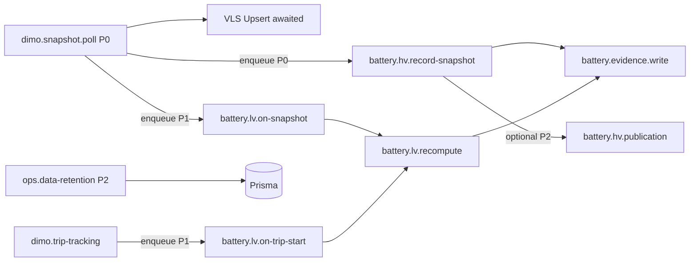

# Battery Health V2 — Job Callsite Matrix (Read-only, pre–Queue-Umbau)

| Feld | Wert |
|------|------|
| **Dokumenttyp** | Read-only Callsite-Matrix / Queue-Migrations-Grundlage |
| **Prompt** | 20/78 |
| **Erstellt (UTC)** | 2026-07-16T16:45:00Z |
| **Branch-Basis** | `cursor/battery-freshness-separation-be2f` (P15–P19) |
| **Status** | **Nur Audit** — keine Produktlogik-Änderungen |
| **Verwandte Audits** | [`battery-runtime-topology.md`](./battery-runtime-topology.md), [`battery-v2-implementation-inventory.md`](./battery-v2-implementation-inventory.md), [`battery-observation-legacy-persistence.md`](../architecture/battery-observation-legacy-persistence.md) |

---

## 1. Zweck

Letzte **read-only** Inventur aller Battery-relevanten **Fire-and-forget**- und **nicht retryfähigen** Pfade **vor** dem geplanten Queue-Umbau (dedizierte Battery-Jobs statt Inline-Hooks im `dimo.snapshot.poll`-Worker).

Diese Matrix beantwortet pro Callsite:

- Wer produziert? Wer konsumiert?
- Wird `await` verwendet?
- Läuft es in einer DB-Transaktion?
- Gibt es Retry / Idempotenz?
- Welche Daten können bei Fehler verloren gehen?
- Welcher **Ziel-Jobtyp** und welche **Priorität** sind für den Umbau sinnvoll?

---

## 2. Legende

| Spalte | Bedeutung |
|--------|-----------|
| **Producer** | Auslöser / aufrufende Schicht |
| **Consumer** | Ausführende Service-Methode |
| **Awaited?** | `await` im Parent vs. `.catch()` / `void` |
| **Transaktion?** | Atomarer DB-Block mit Parent-Write |
| **Retry?** | Automatische Wiederholung bei Fehler |
| **Idempotenz** | Dedup-Schlüssel / Policy |
| **Datenverlust-Risiko** | Was fehlt, wenn der Pfad still fehlschlägt |
| **Zieljobtyp** | Vorgeschlagener BullMQ-Job nach Umbau |
| **Priorität** | `P0` kritisch · `P1` wichtig · `P2` nachgelagert · `—` read-only |

**Retry-Klassen:**

| Klasse | Beschreibung |
|--------|--------------|
| **Queue-Retry** | Parent `dimo.snapshot.poll` — BullMQ `attempts: 3`, exponential backoff 5s (`app.module.ts`) |
| **Kein Retry** | Fire-and-forget `.catch(log)` — Fehler wird nur geloggt |
| **Scheduler-Retry** | Nächster Cron/Tick (Retention, Snapshot-Scheduler) |
| **Manuell** | User/API muss erneut auslösen |

---

## 3. Parent-Kontext: DIMO Snapshot Poll

| # | Callsite | Producer | Consumer | Awaited? | Transaktion? | Retry? | Idempotenz | Datenverlust-Risiko | Zieljobtyp | Prio |
|---|----------|----------|----------|----------|--------------|--------|------------|---------------------|------------|------|
| P0 | **VLS Upsert** | `DimoSnapshotProcessor.process` | `prisma.vehicleLatestState.upsert` | **Ja** | Nein (eigenes Statement) | Queue-Retry des Parent-Jobs | Upsert per `vehicleId` | Poll gilt als fehlgeschlagen → kein VLS-Update; Battery-Hooks laufen nicht | *(bleibt im Snapshot-Job)* | P0 |
| P0 | **Poll-Log + syncJobRef** | `DimoSnapshotProcessor.process` (Ende) | `dimoPollLog.create` + `vehicleLatestState.updateMany` | **Ja** | Nein | Queue-Retry | Append-only Log | Provenance-Lücke in `syncJobRef` | *(bleibt im Snapshot-Job)* | P1 |
| P1 | **Trip-Start-Evaluation** | `DimoSnapshotProcessor.evaluateTripStart` | `TripDetectionOrchestrationService.evaluateSnapshotForTripStart` | **Ja** | Nein | Queue-Retry | FSM-State-Machine | Verzögerte Trip-Erkennung; `onTripStart` Battery-Hook hängt hieran | `dimo.trip-tracking` (bestehend) | P0 |
| P2 | **CH Telemetry Mirror** | `DimoSnapshotProcessor.process` | `ClickHouseTelemetryService.insertSnapshot` / `detectAndInsertStateChanges` | **Nein** (`.catch`) | Nein | **Kein Retry** | CH ReplacingMergeTree / append | Analytics-Lücke; **kein** Einfluss auf Battery-Entscheidungen | `battery.ch-mirror` (optional) | P2 |

**Queue-Metadaten Parent:**

| Eigenschaft | Wert |
|-------------|------|
| Queue | `dimo.snapshot.poll` (`QUEUE_NAMES.DIMO_SNAPSHOT`) |
| Scheduler | `DimoSnapshotScheduler` `@Interval(30000)` |
| `jobId` | `snapshot-<vehicleId>` (dedup — max. 1 inflight/wartend) |
| Worker | `DimoSnapshotProcessor`, `concurrency: 5`, `lockDuration: 60s` |
| Explizite `priority` | **Keine** (BullMQ-Default) |
| Snapshot-Job `attempts` | Global default **3** (Scheduler `add()` überschreibt nicht) |

---

## 4. Kern-Matrix (Battery Write-Pfade)

### 4.1 `onSnapshot` (LV Rest-Window)

| Feld | Wert |
|------|------|
| **Producer** | `DimoSnapshotProcessor.process` nach VLS-Upsert |
| **Consumer** | `BatteryV2Service.onSnapshot(vehicleId, lvBatteryVoltage, lvBatteryObservedAt)` |
| **Datei** | `dimo-snapshot.processor.ts` L147–154 → `battery-v2.service.ts` L105–242 |
| **Awaited?** | **Nein** — `this.batteryV2.onSnapshot(...).catch(warn)` |
| **Transaktion?** | **Nein** — unabhängige Prisma-Statements |
| **Retry?** | **Kein Retry** — stiller Log; nächster Poll in ~30s |
| **Idempotenz** | Rest-Fenster-Logik: `restWindowStartedAt`, `rest60m/6hCapturedAt`, out-of-order-Skip (`sampleAt <= latestCapturedAt`); **keine** Provider-Observation-Policy |
| **Datenverlust-Risiko** | Verpasstes REST_60M/REST_6H-Fenster; kein erneuter Versuch bis nächster qualifizierter Poll; VLS bereits aktualisiert |
| **Zieljobtyp** | `battery.lv.on-snapshot` |
| **Priorität** | **P1** |

**Interne Kette (innerhalb Consumer, alles awaited):**

| Schritt | Awaited | Idempotenz | Verlust |
|---------|---------|------------|---------|
| `vehicleTripDetectionState` read | Ja | — | Skip wenn nicht `RESTING` |
| `batteryFeatures` upsert/update (Rest-Capture) | Ja | Fenster + Timestamp-Vergleich | Doppel-Capture verhindert |
| `recomputeHealth` (bei Rest) | Ja | Zähler + EWMA auf `battery_features` | Publication-Drift |
| `BatteryHealthService.recordSnapshot` | Ja | Append `battery_health_snapshots` | Trend-Lücke |
| `BatteryEvidenceService.recordMany` (via `recomputeHealth`) | Ja | Dedup-Tuple `(vehicleId, scope, valueType, sourceType, observedAt)` | Evidence-Lücke |

**ObservedAt-Quelle:** `resolveLvBatteryObservedAt(batteryMap)` — per-Signal LV-Voltage oder `collectionLastSeenAt`.

---

### 4.2 `onTripStart` (LV Crank / Start-Window)

| Feld | Wert |
|------|------|
| **Producer** | `TripDetectionOrchestrationService` bei bestätigtem `ACTIVE_TRIP` |
| **Consumer** | `BatteryV2Service.onTripStart(vehicleId, dimoTokenId, tripId, tripStartAt)` |
| **Datei** | `trip-detection-orchestration.service.ts` L928–936 → `battery-v2.service.ts` L248–357 |
| **Awaited?** | **Nein** — `.catch(warn)` |
| **Transaktion?** | **Nein** |
| **Retry?** | **Kein Retry** |
| **Idempotenz** | `batteryFeatures` upsert per `vehicleId`; Crank-Felder überschreiben pro Trip-Start; Flags: `isLegacyCrankAssessmentEnabled`, `isStartWindowCollectionEnabled` |
| **Datenverlust-Risiko** | Fehlende Crank/START_DIP_PROXY-Messung für diesen Trip; kein automatischer Nachhol-Job |
| **Zieljobtyp** | `battery.lv.on-trip-start` |
| **Priorität** | **P1** |
| **Profil-Gate** | Nur **nicht-EV** (`profile !== VehicleDetectionProfile.EV`) |

**Historische Signalabfrage (innerhalb Consumer, awaited):**

| Abfrage | Service | Fenster | Retry |
|---------|---------|---------|-------|
| `fetchCrankWindow` | `DimoSegmentsService` | `tripStartAt − 30s … + 120s`, GraphQL 5s-Interval | **Kein Retry** — leeres Array → Skip |

---

### 4.3 HV `recordSnapshot`

| Feld | Wert |
|------|------|
| **Producer** | `DimoSnapshotProcessor.process` wenn `normalized.evSoc != null` |
| **Consumer** | `HvBatteryHealthService.recordSnapshot(...)` |
| **Datei** | `dimo-snapshot.processor.ts` L156–193 → `hv-battery-health.service.ts` L542–785 |
| **Awaited?** | **Nein** — `.catch(warn)` |
| **Transaktion?** | **Nein** — Snapshot + Evidence separat |
| **Retry?** | **Kein Retry** auf Hook-Ebene |
| **Idempotenz** | `evaluateHvSnapshotObservation` + `idempotencyKey` unique `(vehicle_id, idempotency_key)`; P2002-Race → existing row; Metric `synqdrive_hv_snapshot_duplicates_discarded_total` |
| **Datenverlust-Risiko** | HV-Snapshot/Evidence fehlt trotz frischem VLS; **VLS bleibt** (bewusst); Provider-SOH in VLS ohne Evidence-`observedAt` |
| **Zieljobtyp** | `battery.hv.record-snapshot` |
| **Priorität** | **P0** |

**Wichtig:** VLS-Update und HV-Persistenz sind **entkoppelt** (P17). Frischer Poll ≠ neue HV-Zeile.

---

### 4.4 Evidence Writes

| # | Producer | Consumer | Trigger | Awaited? | Transaktion? | Retry? | Idempotenz | Datenverlust | Zieljobtyp | Prio |
|---|----------|----------|---------|----------|--------------|--------|------------|--------------|------------|------|
| E1 | `HvBatteryHealthService.recordSnapshot` | `BatteryEvidenceService.recordMany` | HV-Snapshot persistiert | **Ja** (innerhalb Consumer) | Nein | Kein Retry außer Parent | DB unique `battery_evidence_dedup_key` + `createMany({skipDuplicates})` + `updateMany` refresh | HV-Evidence-Lücke (SOC, Range, Temp, Power, Energy, Provider-SOH) | `battery.evidence.write` | P0 |
| E2 | `BatteryV2Service.recomputeHealth` | `BatteryEvidenceService.recordMany` | Rest/Crank-Recompute | **Ja** | Nein | Kein Retry | Dedup-Tuple | MODEL_DERIVED + published SOH Evidence fehlt | `battery.lv.recompute` | P1 |
| E3 | `BatteryHealthService.recordSnapshot` | `BatteryEvidenceService.recordMany` | LV-Snapshot / Rest-Capture | **Ja** | Nein | Kein Retry | Dedup-Tuple | VOLTAGE_V / RESTING_VOLTAGE_V fehlt | `battery.lv.snapshot` | P1 |
| E4 | `DocumentExtractionApplyService.applyBattery` | `BatteryEvidenceService.recordMany` | User bestätigt AI-Upload | **Ja** (HTTP Request) | Nein (eigene Writes) | User muss erneut anwenden | Dedup-Tuple | Dokument-Bestätigung verloren | *(sync API — kein Queue-Job)* | P1 |
| E5 | `DocumentExtractionApplyService.applyBattery` | `BatteryHealthService.recordSnapshot` | LV + Spannung im Dokument | **Ja** | Nein | Manuell | Append snapshot | LV-Snapshot aus Dokument fehlt | *(sync API)* | P2 |

**Evidence `observedAt`-Fallback:** `BatteryEvidenceService.toCreateData` setzt `observedAt ?? new Date()` — fehlender Timestamp wird zu **Poll-Zeit**, nicht Provider-Zeit (Freshness-Risiko, P18).

---

### 4.5 Assessment Recompute

| # | Producer | Consumer | Trigger | Awaited? | Transaktion? | Retry? | Idempotenz | Datenverlust | Zieljobtyp | Prio |
|---|----------|----------|---------|----------|--------------|--------|------------|--------------|------------|------|
| A1 | `BatteryV2Service.onSnapshot` | `BatteryV2Service.recomputeHealth` (private) | REST_60M/6H captured | **Ja** | Nein | Kein Retry | EWMA + Zähler auf `battery_features` | LV-Score/Publication veraltet | `battery.lv.recompute` | P1 |
| A2 | `BatteryV2Service.onTripStart` | `BatteryV2Service.recomputeHealth` | Legacy Crank (`isLegacyCrankAssessmentEnabled`) | **Ja** | Nein | Kein Retry | Wie A1 | Crank-basierte Recompute fehlt | `battery.lv.recompute` | P2 |
| A3 | `HvBatteryHealthService.recordSnapshot` | `HvBatteryHealthService.calculateSoh` (inline) | Legacy pairwise flag ON | **Ja** | Nein | Kein Retry | Pairwise ΔSOC/ΔEnergy | Kapazitätsschätzung fehlt auf Snapshot | `battery.hv.legacy-pairwise` | P2 (deprecated) |

**Kein separater Assessment-Job** — Recompute läuft synchron im aufrufenden Pfad.

---

### 4.6 Publication Update

| # | Producer | Consumer | Trigger | Awaited? | Transaktion? | Retry? | Idempotenz | Datenverlust | Zieljobtyp | Prio |
|---|----------|----------|---------|----------|--------------|--------|------------|--------------|------------|------|
| PU1 | `BatteryV2Service.recomputeHealth` | `prisma.batteryFeatures.update` | Jede qualifizierte Observation | **Ja** | Nein | Kein Retry | `shouldPublish` Hysterese | `publishedSohPct` / `publicationState` stale | `battery.lv.recompute` | P1 |
| PU2 | `HvBatteryHealthService.recordSnapshot` | `HvBatteryHealthService.upsertPublicationState` (private) | Nach HV-Snapshot wenn legacy pairwise ON | **Nein** — `.catch(warn)` | Nein | **Kein Retry** | EWMA auf `hv_battery_health_current` | HV-Publication stale; Default flag **OFF** | `battery.hv.publication` | P2 |

---

### 4.7 Retention

| # | Producer | Consumer | Trigger | Awaited? | Transaktion? | Retry? | Idempotenz | Datenverlust | Zieljobtyp | Prio |
|---|----------|----------|---------|----------|--------------|--------|------------|--------------|------------|------|
| R1 | `DataRetentionScheduler` | `prisma.batteryEvidence.deleteMany` (batched) | `@Cron('30 3 * * *')` | **Ja** (Scheduler) | Nein | Nächster Cron-Tag | Delete by `createdAt < cutoff` | **Gewollter** Evidence-Verlust wenn `RETENTION_BATTERY_EVIDENCE_DAYS > 0` | `ops.data-retention` | P2 |
| R2 | `DataRetentionScheduler` | `prisma.hvBatteryHealthSnapshot.deleteMany` (batched) | `@Cron('30 3 * * *')` | **Ja** | Nein | Scheduler-Retry | Delete by `createdAt` | **Gewollter** Snapshot-Verlust wenn `RETENTION_HV_BATTERY_SNAPSHOTS_DAYS > 0` | `ops.data-retention` | P2 |

**Defaults:** `RETENTION_BATTERY_EVIDENCE_DAYS=0`, `RETENTION_HV_BATTERY_SNAPSHOTS_DAYS=0` → **deaktiviert** in Prod unless gesetzt.

**Nicht im Retention-Scheduler:** `battery_health_snapshots`, `battery_features`, `hv_battery_health_current`.

---

### 4.8 Capability-Abfragen

| # | Producer | Consumer | Trigger | Awaited? | Transaktion? | Retry? | Idempotenz | Datenverlust | Zieljobtyp | Prio |
|---|----------|----------|---------|----------|--------------|--------|------------|--------------|------------|------|
| C1 | *(kein Runtime-Callsite)* | `VehicleBatteryCapability` Prisma model | Schema P14 | — | — | — | `(vehicleId, signalKey)` unique | Tabelle ungenutzt | `battery.capability.probe` (geplant) | P2 |
| C2 | `DimoTelemetryService.fetchAvailableSignals` | GraphQL `availableSignals` | **Nicht** an Battery-Pipeline angebunden | — | — | — | — | Preflight fehlt vor Snapshot | `battery.dimo.preflight` (geplant) | P2 |
| C3 | `DataAnalyseService.getLaunchFeasibility` | CH/Signal-Stats + `assessLaunchFeasibility` | API GET (Data Analyse) | **Ja** (HTTP) | Nein | Client-Retry | Read-only | — (kein Write) | — | — |
| C4 | `DataAnalyseService.getHealthTrace` | VLS + `battery_health_snapshots` + `hv_battery_health_current` | API GET | **Ja** | Nein | Client-Retry | Read-only | — | — | — |

**Hinweis:** `dimo-battery-signal.mapper.ts` + `buildAvailableSignalsQuery` existieren (P15), aber `DimoSnapshotProcessor` ruft **kein** `fetchAvailableSignals` vor dem Snapshot auf.

---

### 4.9 Historische Signalabfragen

| # | Producer | Consumer | Abfrage | Awaited? | Retry? | Idempotenz | Datenverlust | Zieljobtyp | Prio |
|---|----------|----------|---------|----------|--------|------------|--------------|------------|------|
| H1 | `BatteryV2Service.onTripStart` | `DimoSegmentsService.fetchCrankWindow` | DIMO `signals` 5s, −30s…+120s um Trip-Start | **Ja** (innerhalb F&F-Hook) | **Kein Retry** | — | Crank-Features für Trip | `battery.lv.crank-window` | P1 |
| H2 | `DimoSnapshotProcessor` | `DimoTelemetryService.fetchLatestVehicleSnapshot` | `signalsLatest` (aktuell, kein History) | **Ja** (Parent awaited) | Queue-Retry | — | Gesamter Poll fehlgeschlagen | *(bleibt Snapshot)* | P0 |
| H3 | *(nicht für Battery)* | HF Mirror / Trip Enrichment | ClickHouse HF, Trip signals | — | — | — | — | — | — |

**Kein** historischer HV-Signal-Backfill in Battery-Pipeline — HV nutzt nur `signalsLatest` + per-Signal `observedAt` aus dem aktuellen Payload.

---

### 4.10 API-triggered Recompute / Writes

| # | Endpoint / Pfad | Producer | Consumer | Schreibend? | Awaited? | Retry? | Idempotenz | Datenverlust | Zieljobtyp | Prio |
|---|-----------------|----------|----------|-------------|----------|--------|------------|--------------|------------|------|
| API1 | `GET …/battery-health-summary` | HTTP Client | `CanonicalBatteryHealthService.getSummary` | **Nein** (read) | Ja | Client | — | — | — | — |
| API2 | `GET …/battery-health-detail` | HTTP | `CanonicalBatteryHealthService.getDetail` | Nein | Ja | Client | — | — | — | — |
| API3 | `GET …/battery-health/v2` | HTTP | `BatteryV2Service.getV2Health` | Nein | Ja | Client | — | — | — | — |
| API4 | `GET …/hv-battery-status` | HTTP | `CanonicalBatteryHealthService` + `HvBatteryHealthService` | Nein | Ja | Client | — | — | — | — |
| API5 | `GET …/battery-health`, `/trend` | HTTP | `BatteryHealthService` | Nein | Ja | Client | — | — | — | — |
| API6 | Document Apply `applyBattery` | `DocumentExtractionApplyService` | Evidence + optional LV Snapshot | **Ja** | Ja (Request) | Manuell | Evidence dedup | Bestätigte Extraktion nicht angewendet | *(sync)* | P1 |
| API7 | `BatteryCriticalDetector` (BI) | Scheduler/Insight pipeline | `prisma.batteryFeatures` + `batteryEvidence` reads | Nein | Ja | BI-Tick | — | — | — | — |
| API8 | `RentalHealthService.evaluateBattery` | Rental health batch | `CanonicalBatteryHealthService.getSummary` | Nein | Ja | Batch | — | — | — | — |

**Kein dedizierter HTTP-Endpoint** für `recomputeHealth` / `upsertPublicationState` — Recompute nur über Ingestion-Hooks.

---

## 5. Fire-and-forget-Übersicht (kritisch für Queue-Umbau)

| Callsite | Datei:Zeile | Parent awaited? | Eigener Retry? | Bei Fehler |
|----------|-------------|-----------------|----------------|------------|
| `batteryV2.onSnapshot` | `dimo-snapshot.processor.ts` ~148 | Nein | **Nein** | `logger.warn`, Daten weg bis nächster Poll |
| `hvBattery.recordSnapshot` | `dimo-snapshot.processor.ts` ~159 | Nein | **Nein** | `logger.warn`, VLS trotzdem frisch |
| `batteryV2.onTripStart` | `trip-detection-orchestration.service.ts` ~930 | Nein | **Nein** | `logger.warn`, Crank-Fenster verpasst |
| `upsertPublicationState` | `hv-battery-health.service.ts` ~779 | Nein (innerhalb awaited HV-Pfad, aber F&F) | **Nein** | `logger.warn`, HV-Publication stale |
| CH Telemetry mirror | `dimo-snapshot.processor.ts` ~128 | Nein | **Nein** | Analytics only |

**Nicht Fire-and-forget (awaited, aber ohne eigenen Retry wenn Parent F&F ist):**

- Gesamte Kette innerhalb `onSnapshot` / `recordSnapshot` / `onTripStart` sobald der Hook läuft
- `BatteryEvidenceService.recordMany` — Fehler bubblen zum Hook-`.catch`

---

## 6. Idempotenz-Referenz (P15–P18)

| Domäne | Mechanismus | Callsite |
|--------|-------------|----------|
| Provider Observation | `evaluateBatteryProviderObservation` | Per-Signal vor HV-Persistenz |
| HV Snapshot | `evaluateHvSnapshotObservation` + `idempotencyKey` | `recordSnapshot` gate |
| HV DB | `UNIQUE(vehicle_id, idempotency_key)` | P2002 → existing |
| Evidence | `UNIQUE(vehicle, scope, valueType, sourceType, observedAt)` | `record` / `recordMany` |
| VLS | Upsert `vehicleId` | Jeder Poll |
| LV Rest | Timestamp + `restWindowStartedAt` | `onSnapshot` |
| Freshness (read) | `battery-freshness.policy` | Canonical/HV read models — **kein** Write |

---

## 7. Vorgeschlagene Ziel-Jobtopologie (nach Umbau)

| Zieljobtyp | Priorität | Retry-Empfehlung | Idempotenz-Key |
|------------|-----------|------------------|----------------|
| `battery.hv.record-snapshot` | P0 | 3× exponential | `hv-snap:…` (bestehend) |
| `battery.lv.on-snapshot` | P1 | 3× | `vehicleId + restWindow + observedAt` |
| `battery.lv.on-trip-start` | P1 | 2× (DIMO-Latenz) | `tripId` |
| `battery.lv.recompute` | P1 | 3× | `vehicleId + scoredAt bucket` |
| `battery.evidence.write` | P0 | 3× | Evidence dedup tuple |
| `battery.hv.publication` | P2 | 2× | `vehicleId` (legacy flag) |
| `ops.data-retention` | P2 | 1× (Cron) | Batch cursor |

---

## 8. Verbleibende Legacy-Persistenzpfade (nicht in Queue-Matrix als Jobs)

Siehe [`battery-observation-legacy-persistence.md`](../architecture/battery-observation-legacy-persistence.md):

- `BatteryHealthService.recordSnapshot` ohne Provider-Dedup
- `BatteryV2Service` Rest/Crank ohne Observation-Policy
- `DimoSnapshotProcessor` VLS immer pro Poll
- Legacy HV pairwise + `upsertPublicationState` (Flag OFF)
- `VehicleBatteryCapability` — Schema only
- `BatteryMeasurement` / Session — Ingestion ausstehend

---

## 9. Queue-Umbau Checkliste (aus dieser Matrix)

1. **P0:** `hvBattery.recordSnapshot` aus Snapshot-Processor in dedizierten Job mit Retry + DLQ.
2. **P0:** Evidence-Writes an Job-Erfolg koppeln (nicht verlieren bei stiller `.catch`).
3. **P1:** `onSnapshot` / `onTripStart` entkoppeln; `fetchCrankWindow`-Fehler retryfähig machen.
4. **P1:** `providerFetchedAt` / `sourceTimestamp` im Job-Payload mitschleifen (Freshness P18).
5. **P2:** `upsertPublicationState` nur wenn Legacy-Flag; sonst entfernen.
6. **P2:** `fetchAvailableSignals`-Preflight vor erstem HV/LV-Job pro Fahrzeug.
7. **Retention:** unverändert im `DataRetentionScheduler`; keine Battery-Queue.

---

## 10. Änderungshistorie

| Version | Datum | Änderung |
|---------|-------|----------|
| 1.0 | 2026-07-16 | Initiale Matrix Prompt 20/78 — pre–Queue-Umbau |
