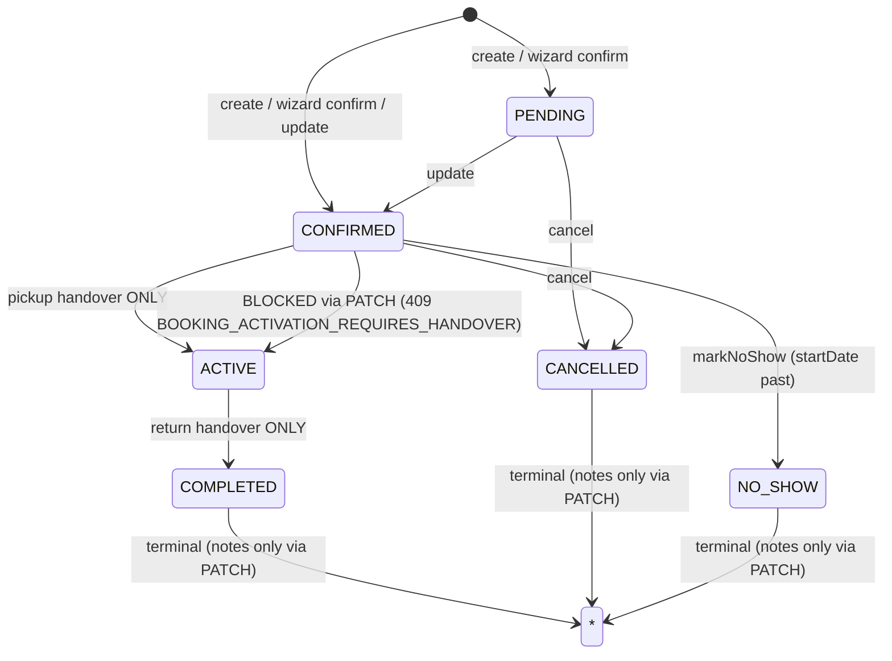
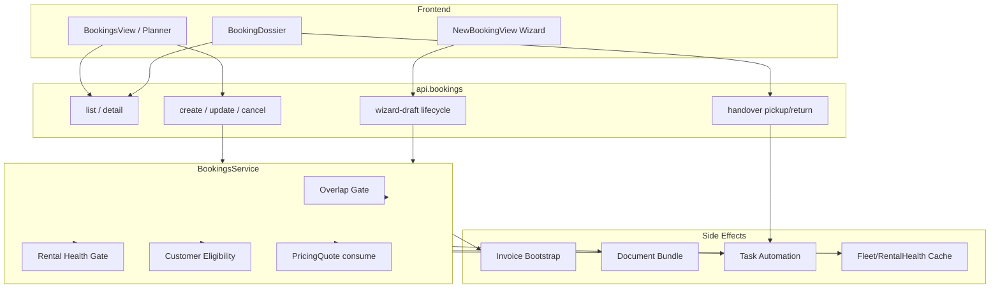

# Booking Page Production-Readiness — Baseline & Systemlandkarte

**Prompt:** 1 von 34 (Production-Readiness Remediation Booking Page)  
**Datum:** 2026-07-23  
**Repository:** `SYNQDRIVE-alpha`  
**Scope:** Ist-Analyse ohne produktive fachliche oder visuelle Änderungen  
**Methode:** Direkte Code-, Schema- und Test-Verifikation; keine ungeprüften Übernahmen aus früheren Audits

---

## Executive Summary

Die Booking Page ist funktional vollständig verdrahtet: Listen-/Planner-Oberfläche (`BookingsView` + Timeline/Table/Calendar), Wizard (`NewBookingView`), Detail-Dossier (`BookingDossier`), Fahrzeug-Scoped Bookings, Operator-Sheets und umfangreiche Backend-Orchestrierung (Pricing, Invoices, Documents, Tasks, Handover, Payments, Eligibility, Rental Health).

**Kernbefunde (Baseline, vor Remediation):**

| Kategorie | Befund |
|-----------|--------|
| **HTTP-Input-Sicherheit** | `POST/PATCH /bookings` akzeptieren direkt `Prisma.BookingCreateInput` / `Prisma.BookingUpdateInput` — kein class-validator-DTO, keine Whitelist gegen verschachtelte Relationen |
| **IAM** | `BookingsController` nutzt nur `OrgScopingGuard` + `RolesGuard`, **kein** `PermissionsGuard` (im Gegensatz zu Documents, Payments, WhatsApp-Reminders) |
| **Query-Validation** | `ListBookingsQueryDto` ist ein TypeScript-Interface ohne Decorators — globale `ValidationPipe` greift nicht |
| **Handover-Body** | `CreateHandoverProtocolPayload` ist ein TS-Interface, kein validiertes DTO |
| **Task-Lifecycle** | `BookingsHandoverService` setzt Status per Prisma ohne konsistenten `TaskAutomationService`-Hook (siehe `docs/audits/booking-task-trigger-map.md`) |
| **Transaktionen** | Create mit Quote-Consume + Snapshot ist transaktional; Invoice-Bootstrap danach mit manuellem Rollback; viele Side-Effects fire-and-forget |
| **Tests** | 39 Backend- + 4 Frontend-Booking-Specs grün; **keine** Controller-Charakterisierungstests für Create/Update-Validation |
| **Build** | `nest build` und `frontend build` erfolgreich; `tsc --noEmit` Backend 28 Fehler (nicht booking-kern), Frontend sauber |

---

## 1. Produktflächen & Routing

### 1.1 Rental SPA (View-State)

| View-Key | Komponente | Rolle |
|----------|------------|-------|
| `bookings` | `BookingsView` → `BookingsPage` | Planner (Timeline/Table/Calendar), Legacy-Edit, Detail via `BookingDossier` |
| `new-booking` | `NewBookingView` | 5-Schritt-Wizard mit Wizard-Draft-Lifecycle |
| `vehicle-bookings` | `VehicleBookingsView` | Fahrzeug-scoped Agenda/Timeline |

Deep-Link: `setPendingBookingDetailId(id)` + `setCurrentView('bookings')`.

### 1.2 Operator Shell (React Router)

| Route | Komponente |
|-------|------------|
| `/operator/bookings/:bookingId` | `OperatorBookingDetailSheet` |
| Operator Sheets | `OperatorBookingFormSheet`, Cancel/NoShow Sheets |

---

## 2. Relevante Dateiliste

### 2.1 Frontend — Booking Page & Planner

| Datei | Export / Rolle |
|-------|----------------|
| `frontend/src/rental/components/BookingsView.tsx` | Hauptliste, Metriken, Legacy-Drawer, Detail-Routing |
| `frontend/src/rental/components/bookings/BookingsPage.tsx` | Planner-Shell, View-Toggle |
| `frontend/src/rental/components/bookings/BookingsToolbar.tsx` | Filter, Suche, View-Switcher |
| `frontend/src/rental/components/bookings/BookingsTimelineView.tsx` | Gantt/Timeline |
| `frontend/src/rental/components/bookings/BookingsTableView.tsx` | Sortierbare Tabelle |
| `frontend/src/rental/components/bookings/BookingsCalendarView.tsx` | Monatskalender |
| `frontend/src/rental/components/bookings/bookingTypes.ts` | Planner-Typen |
| `frontend/src/rental/components/bookings/bookingUtils.ts` | Filter, Format, List-Unwrap |
| `frontend/src/rental/components/bookings/bookingStatus.tsx` | Status-Normalisierung, Badges, Actions |
| `frontend/src/rental/components/bookings/bookings-ui.ts` | UI-Tokens |
| `frontend/src/rental/components/bookings/BookingRentalEligibilityCard.tsx` | Eligibility-Anzeige |

### 2.2 Frontend — Booking Wizard

| Datei | Rolle |
|-------|-------|
| `frontend/src/rental/components/NewBookingView.tsx` | Wizard-Orchestrierung |
| `frontend/src/rental/components/bookings/BookingWizardStepper.tsx` | Step-Rail |
| `frontend/src/rental/components/new-booking/VehiclePickerStep.tsx` | Schritt 1 |
| `frontend/src/rental/components/new-booking/PeriodStep.tsx` | Schritt 2 |
| `frontend/src/rental/components/new-booking/ExtrasStep.tsx` | Schritt 3 |
| `frontend/src/rental/components/new-booking/CustomerStep.tsx` | Schritt 4 |
| `frontend/src/rental/components/new-booking/CheckoutStep.tsx` | Schritt 5 |
| `frontend/src/rental/components/new-booking/CheckoutDocumentsPanel.tsx` | Draft-Dokumente |
| `frontend/src/rental/components/new-booking/BookingSummaryPanel.tsx` | Preis-Sidebar |
| `frontend/src/rental/components/new-booking/BookingSidebar.tsx` | Sidebar + Eligibility |
| `frontend/src/rental/components/new-booking/MobileBookingFooter.tsx` | Mobile Navigation |
| `frontend/src/rental/components/new-booking/BookingSuccessState.tsx` | Erfolgsbildschirm |
| `frontend/src/rental/lib/booking-vehicle-preflight.ts` | Fahrzeug-Preflight |
| `frontend/src/rental/lib/stationBookingUtils.ts` | Stations-Defaults |
| `frontend/src/rental/lib/booking-rental-eligibility.types.ts` | Eligibility-Typen |

### 2.3 Frontend — Booking Detail

| Datei | Rolle |
|-------|-------|
| `frontend/src/rental/components/booking-detail/BookingDossier.tsx` | Vollseiten-Detail, Tabs, Aktionen |
| `frontend/src/rental/components/booking-detail/useBookingDetail.ts` | Detail-Hook |
| `frontend/src/rental/components/booking-detail/BookingDetailHeader.tsx` | Header + Primary Action |
| `frontend/src/rental/components/booking-detail/BookingOverviewTab.tsx` | Übersicht |
| `frontend/src/rental/components/booking-detail/BookingFinanceDocumentsTab.tsx` | Finanzen + Docs + Payment |
| `frontend/src/rental/components/booking-detail/BookingHandoverTab.tsx` | Pickup/Return |
| `frontend/src/rental/components/booking-detail/BookingCustomerRiskTab.tsx` | Kunden-Risiko |
| `frontend/src/rental/components/booking-detail/BookingVehicleHealthTab.tsx` | Fahrzeug-Gesundheit |
| `frontend/src/rental/components/booking-detail/BookingUsageMisuseTab.tsx` | Fahranalyse |
| `frontend/src/rental/components/booking-detail/BookingTasksTimelineTab.tsx` | Tasks |
| `frontend/src/rental/components/booking-detail/BookingStationPanel.tsx` | Stationen |
| `frontend/src/rental/components/booking-detail/BookingEditDialog.tsx` | Edit-Modal |
| `frontend/src/rental/components/booking-detail/bookingActionRules.ts` | Action-Matrix |
| `frontend/src/rental/components/BookingDocumentsSection.tsx` | Dokumente + E-Mail |
| `frontend/src/rental/components/booking-payment/BookingPaymentCard.tsx` | Zahlungsanfragen |
| `frontend/src/rental/HandoverContext.tsx` | Handover-Provider |
| `frontend/src/rental/components/handover/HandoverProtocolDialog.tsx` | Handover-Dialog |
| `frontend/src/rental/lib/bookingHandoverGates.ts` | Pickup/Return-Gates (UI) |

### 2.4 Frontend — Vehicle-Scoped & Operator

| Datei | Rolle |
|-------|-------|
| `frontend/src/rental/components/VehicleBookingsView.tsx` | Fahrzeug-Buchungen |
| `frontend/src/rental/components/vehicle-bookings/*` | Agenda, Readiness, Quick-Drawer, Timeline |
| `frontend/src/operator/bookings/OperatorBookingFormSheet.tsx` | Create/Edit |
| `frontend/src/operator/bookings/OperatorBookingCancelSheet.tsx` | Cancel |
| `frontend/src/operator/bookings/OperatorBookingNoShowSheet.tsx` | No-Show |
| `frontend/src/operator/components/OperatorBookingDetailSheet.tsx` | Detail |
| `frontend/src/operator/hooks/useOperatorBookingMutations.ts` | CRUD-Mutationen |
| `frontend/src/operator/documents/OperatorBookingDocumentsPanel.tsx` | Operator-Docs |

### 2.5 Frontend — API Clients & Mapper

| Datei | Rolle |
|-------|-------|
| `frontend/src/lib/api.ts` | `api.bookings.*`, `api.documents.*`, `api.bookingPaymentRequests.*`, `api.tasks.forBooking` |
| `frontend/src/rental/lib/entityMappers.ts` | `mapApiBooking`, `buildBookingCreatePayload` |
| `frontend/src/rental/hooks/usePricingSimulation.ts` | Pricing-Quote für Wizard |

**Frontend Request-Shapes (Ist):**

- Create: Prisma-Style `{ customer: { connect: { id } }, vehicle: { connect: { id } }, ... }` via `buildBookingCreatePayload` / `OperatorBookingCreatePayload`
- Update: `OperatorBookingUpdatePayload` mit optionalen `connect`-Nested-Objekten
- Wizard: dedizierte Draft-Endpunkte mit validierten DTOs (Backend)

### 2.6 Backend — Core Bookings Module

| Datei | Rolle |
|-------|-------|
| `backend/src/modules/bookings/bookings.controller.ts` | HTTP-Endpunkte |
| `backend/src/modules/bookings/bookings.service.ts` | CRUD, Overlap, Stats, Detail, Orchestrierung |
| `backend/src/modules/bookings/bookings-handover.service.ts` | Pickup/Return-Protokolle, Status-Transitions |
| `backend/src/modules/bookings/booking-wizard-draft.service.ts` | Wizard-Draft CRUD + Confirm |
| `backend/src/modules/bookings/booking-wizard-checkout-context.service.ts` | Checkout-Kontext |
| `backend/src/modules/bookings/booking-wizard-payment-flow.service.ts` | Payment-Flow bei Confirm |
| `backend/src/modules/bookings/booking-rental-eligibility.service.ts` | Rental-Eligibility |
| `backend/src/modules/bookings/booking-pickup-gate/booking-pickup-gate.service.ts` | Pickup-Gate |
| `backend/src/modules/bookings/booking-pickup-gate/booking-pickup-gate-audit.service.ts` | Pickup-Gate-Audit |
| `backend/src/modules/bookings/booking-allowed-drivers/*` | Zusatzfahrer |
| `backend/src/modules/bookings/dto/*.ts` | Teilweise validierte DTOs |
| `backend/src/modules/bookings/handover.types.ts` | Handover-Verträge (Interface, kein DTO) |
| `backend/src/modules/bookings/booking-detail.types.ts` | Detail-Response-Typen |
| `backend/src/modules/bookings/booking-conflict.util.ts` | Overlap-Prüfung |
| `backend/src/modules/bookings/booking-day-window.util.ts` | TZ-Tagesfenster |

### 2.7 Backend — Cross-Module Abhängigkeiten

| Modul | Dateien (Auswahl) | Booking-Bezug |
|-------|-------------------|---------------|
| **Pricing** | `pricing.service.ts`, `pricing-quote.service.ts` | Quote consume, Snapshot, Simulation |
| **Invoices** | `invoices.service.ts`, `booking-invoice-lifecycle.service.ts` | Bootstrap, Confirm-Sync |
| **Documents** | `booking-document-bundle.service.ts`, `booking-document-generation/*`, `booking-document-completeness.*` | Bundle, Jobs, Pickup-Gate |
| **Payments** | `booking-payment-request.*`, `booking-payment-card.service.ts` | Checkout, Refunds |
| **Tasks** | `task-automation.service.ts`, `vehicle-cleaning-task.service.ts` | Lifecycle-Tasks |
| **Email** | `booking-document-email.service.ts`, `booking-legal-document-email.service.ts` | Dokument-Versand |
| **Customers** | `customer-eligibility.service.ts`, `customer-verification/*` | Eligibility, ID/License |
| **Rental Health** | `rental-health.service.ts` | Create/Update-Gate |
| **Stations** | `station-validation.service.ts`, `stations-v2-booking-rules-*` | Station-Validierung |
| **Notifications** | Business-Insights-Detektoren, Legal-Doc-Notifications | Indirekt über Insights/Docs |
| **Audit** | `audit.interceptor.ts`, `ActivityLog`, `BookingPickupGateAuditEvent` | HTTP-Audit, Gate-Audit |
| **Workers** | `booking-document-generation.processor.ts` | Async Doc-Jobs |

### 2.8 Prisma — Booking-Kernmodelle

| Modell | Tabelle | Zweck |
|--------|---------|-------|
| `Booking` | `bookings` | Kern-Entität |
| `BookingAllowedDriver` | `booking_allowed_drivers` | Zusatzfahrer |
| `BookingPriceSnapshot` | `booking_price_snapshots` | Preis-Snapshot |
| `BookingPriceLineItem` | `booking_price_line_items` | Positionen |
| `PricingQuote` | `pricing_quotes` | Quote → Booking |
| `BookingHandoverProtocol` | `booking_handover_protocols` | Pickup/Return |
| `BookingDocumentBundle` | `booking_document_bundles` | Doc-Pointer |
| `BookingDocumentGenerationJob` | `booking_document_generation_jobs` | Async Jobs |
| `BookingPickupGateAuditEvent` | `booking_pickup_gate_audit_events` | Gate-Audit |
| `BookingPaymentRequest` | `booking_payment_requests` | Zahlungsanfragen |
| `RentalContract` | `rental_contracts` | Mietvertrag |
| `GeneratedDocument` | `generated_documents` | PDFs |
| `LegalDocumentDeliveryEvidence` | `legal_document_delivery_evidence` | Legal Delivery |
| `OrgInvoice` | `org_invoices` | Rechnungen (optional `bookingId`) |
| `OrgTask` | `org_tasks` | Tasks (optional `bookingId`) |
| `OutboundEmail` | `outbound_emails` | E-Mail-Historie |
| `CustomerVerificationCheck` | `customer_verification_checks` | Verifikation |

**BookingStatus-Enum:** `PENDING`, `CONFIRMED`, `ACTIVE`, `COMPLETED`, `CANCELLED`, `NO_SHOW`

**Relevante Migrationen (Auswahl):**

- `20260613200000_booking_document_lifecycle`
- `20260722220000_booking_document_generation_jobs`
- `20260722230000_booking_pickup_gate_audit`
- `20260722240000_outbound_email_send_idempotency`

---

## 3. HTTP-Endpunkte (aktuell)

### 3.1 BookingsController (`/api/v1/organizations/:orgId/bookings`)

**Guards:** `OrgScopingGuard`, `RolesGuard` — **kein** `PermissionsGuard`

| Method | Route | Body-DTO (Ist) | Service |
|--------|-------|----------------|---------|
| GET | `/` | `ListBookingsQueryDto` (Interface) | `findAll` |
| GET | `/today/pickups` | — | `findTodaysPickups` |
| GET | `/today/returns` | — | `findTodaysReturns` |
| GET | `/stats` | — | `getBookingStats` |
| POST | `/` | `Omit<Prisma.BookingCreateInput, 'organization'>` ⚠️ | `create` |
| PATCH | `/:id` | `Prisma.BookingUpdateInput` ⚠️ | `update` |
| DELETE | `/:id` | — | `cancel` |
| POST | `/:id/no-show` | `{ reason?: string }` (inline) ⚠️ | `markNoShow` |
| GET | `/:id` | — | `findById` |
| GET | `/:id/detail` | — | `findDetail` |
| POST | `/eligibility-check` | `BookingRentalEligibilityCheckDto` ✅ | `checkRentalEligibility` |
| GET | `/:id/rental-eligibility` | `BookingRentalEligibilityBookingQueryDto` ✅ | `checkForBooking` |
| POST | `/wizard-draft` | `BookingWizardDraftBodyDto` ✅ | `createOrRefreshDraft` |
| PATCH | `/wizard-draft/:bookingId` | `BookingWizardDraftUpdateDto` ✅ | `updateDraftQuote` |
| GET | `/wizard-draft/:bookingId/checkout-context` | — | `getCheckoutContext` |
| POST | `/wizard-draft/:bookingId/confirm` | `BookingWizardDraftConfirmDto` ✅ | `confirmDraft` |
| POST | `/wizard-draft/:bookingId/abort` | — | `abortDraft` |
| GET | `/:id/handover` | — | `listHandovers` |
| POST | `/:id/handover/pickup` | `CreateHandoverProtocolPayload` (Interface) ⚠️ | `createHandover` |
| POST | `/:id/handover/return` | `CreateHandoverProtocolPayload` (Interface) ⚠️ | `createHandover` |
| GET | `/:id/allowed-drivers` | — | `listAllowedDrivers` |
| POST | `/:id/allowed-drivers` | `AddBookingAllowedDriverDto` ✅ | `addAllowedDriver` |
| PATCH | `/:id/primary-driver` | `SetBookingPrimaryDriverDto` ✅ | `setPrimaryDriver` |
| DELETE | `/:id/allowed-drivers/:customerId` | — | `removeAllowedDriver` |
| GET | `/drivers/:customerId/conduct-history` | — | `getDriverConductHistory` |

### 3.2 Booking-adjacent Endpunkte (andere Controller)

| Controller | Prefix | Permission |
|------------|--------|------------|
| `DocumentsController` | `.../bookings/:bookingId/documents*` | `bookings.read/write/manage` |
| `BookingDocumentsEmailController` | `.../bookings/:bookingId/documents/send-email*` | `RolesGuard` ORG_ADMIN |
| `BookingPaymentRequestController` | `.../bookings/:bookingId/payment-requests` | `payments.*` |
| `LegalDocumentDeliveryEvidenceController` | `.../bookings/:bookingId/legal-delivery-evidence` | `legal_documents.audit_view` |
| `TasksController` | `.../bookings/:bookingId/tasks` | `tasks.read` |
| `StationsController` | `.../stations/:id/bookings` | `stations.read` |
| `PricingController` | `.../pricing/simulate` | (org-scoped) |
| `RentalHealthController` | `.../vehicles/:id/rental-health` | `fleet.read` |
| `WhatsAppController` | `.../reminders/bookings/:bookingId/*` | `bookings.write` |

---

## 4. Statusübergänge



| Transition | Erlaubter Pfad | Guard |
|------------|----------------|-------|
| → `PENDING` / `CONFIRMED` | `create`, wizard `confirmDraft`, `update` | Overlap, Rental Health, Customer Eligibility, Quote |
| `CONFIRMED` → `ACTIVE` | `POST .../handover/pickup` | Pickup Gate, Status=CONFIRMED |
| `ACTIVE` → `COMPLETED` | `POST .../handover/return` | Status=ACTIVE |
| → `CANCELLED` | `DELETE .../bookings/:id` | Void docs, vehicle→AVAILABLE |
| → `NO_SHOW` | `POST .../no-show` | Status=CONFIRMED, startDate≤now |
| `CONFIRMED`→`ACTIVE` via PATCH | **Verboten** | `BOOKING_ACTIVATION_REQUIRES_HANDOVER` |
| Terminal edit | PATCH nur `notes` | `COMPLETED`/`CANCELLED`/`NO_SHOW` |

---

## 5. Permission-Situation

| Ebene | Ist-Zustand | Risiko |
|-------|-------------|--------|
| **Org-Scoping** | `OrgScopingGuard` auf allen Booking-Routen | ✅ Mandantenisolation auf Route-Ebene |
| **IAM Permissions** | `bookings.read/write/manage` existieren, aber **nicht** auf `BookingsController` | Jeder Org-Member mit gültiger Session kann CRUD (sofern RolesGuard keine `@Roles` setzt — aktuell keine `@Roles` auf CRUD) |
| **Allowed Drivers** | Custom Policy: Read=ORG_ADMIN,SUB_ADMIN,WORKER,DRIVER; Manage=ORG_ADMIN,SUB_ADMIN | ✅ |
| **Handover Override** | `override_handover` Permission für Pickup-Gate-Softblocks | ✅ |
| **Documents/Payments** | `PermissionsGuard` aktiv | ✅ |
| **Audit Interceptor** | `/bookings` → `ActivityEntity.BOOKING` | Teilweise (HTTP-Pfad-Mapping) |

---

## 6. Transaktionsgrenzen

| Operation | Transaktional | Nachgelagert (fire-and-forget) |
|-----------|---------------|-------------------------------|
| **create** | `prisma.$transaction`: booking.create + quote.markConsumed + priceSnapshot | Invoice bootstrap (mit manuellem delete-Rollback bei Fehler), doc bundle enqueue, tasks, cache invalidate |
| **update** | Einzelnes `booking.update` | Re-pricing snapshot, doc bundle on CONFIRMED, tasks, cache |
| **cancel** | `booking.update` + `vehicle.updateMany` | void docs, supersede tasks (void), cleaning tasks, cache |
| **markNoShow** | `booking.update` + `vehicle.updateMany` | cache |
| **pickup handover** | Handover-Protokoll + Status ACTIVE + Vehicle-Updates (in Service) | Tasks, workflows, doc jobs, driving analysis |
| **return handover** | Handover-Protokoll + Status COMPLETED | Workflows, final invoice, doc jobs, driving analysis recompute |
| **wizard confirm** | Draft→Confirmed in Transaction | Payment flow, invoice lifecycle, docs, tasks |

**Bekannte Lücke:** Invoice-Bootstrap nach Create ist nicht in derselben DB-Transaction wie Booking-Insert — Rollback via `deleteMany` bei Fehler.

---

## 7. Bekannte Side Effects

| Trigger | Side Effect | Idempotent? |
|---------|-------------|-------------|
| Create CONFIRMED/PENDING | Initial document bundle enqueue | ✅ (Dispatcher) |
| Create CONFIRMED | Auto-send legal docs (org setting) | ✅ |
| Create CONFIRMED/ACTIVE | `ensureBookingLifecycleTasks` | ✅ (dedup keys) |
| Update → CONFIRMED | Document bundle + auto-email | ✅ |
| Update pricing-relevant | New price snapshot | ⚠️ creates new snapshot |
| Cancel | Void all generated docs | ✅ |
| Cancel | Vehicle → AVAILABLE (unless IN_SERVICE) | ✅ |
| Handover pickup | Vehicle → RENTED, pickup gate audit | — |
| Handover return | Vehicle → AVAILABLE, workflows `booking.returned/completed` | — |
| Any write | `fleetMapCache.invalidate`, `rentalHealthSummaryCache.invalidate` | — |

**Referenz:** Detaillierte Task-Trigger-Matrix in `docs/audits/booking-task-trigger-map.md` (inkl. Handover-Task-Bypass).

---

## 8. Vorhandene Tests

### 8.1 Backend (`*booking*.spec.ts` — 39 Suites, 254 Tests)

| Suite | Fokus |
|-------|-------|
| `bookings.service.overlap.spec.ts` | VEHICLE_BOOKING_OVERLAP |
| `booking-invoice-bootstrap.behavior.spec.ts` | Invoice-Rollback |
| `booking-wizard-*.spec.ts` | Draft, Checkout, Payment |
| `booking-rental-eligibility.service.spec.ts` | Eligibility |
| `booking-pickup-gate.integration.spec.ts` | Pickup Gate |
| `booking-allowed-drivers/*.spec.ts` | Drivers |
| `booking-conflict.util.spec.ts`, `booking-day-window.util.spec.ts` | Utils |
| `documents/booking-document-*.spec.ts` | Bundle, Completeness, Generation |
| `payments/booking-payment-*.spec.ts` | Payments |
| `tasks/booking-*.spec.ts` | Task-Timing, Pipeline |
| `invoices/booking-invoice-lifecycle.service.spec.ts` | Invoice Lifecycle |
| `outbound-email/booking-*-email.service.spec.ts` | E-Mail |
| `vehicles/diagnostic/vehicle-booking-handover-*.spec.ts` | Handover Diagnostics |

**Fehlend (Baseline):**

- Kein `bookings.controller.spec.ts` / HTTP-Validation-Charakterisierung
- Kein dedizierter Test für Prisma-Input-Rejection auf Create/Update
- Kein `bookings-handover.service.spec.ts` (nur integration via pickup-gate)

### 8.2 Frontend (4 Suites, 36 Tests)

| Suite | Tests |
|-------|-------|
| `booking-payment-status.utils.test.ts` | 10 |
| `booking-vehicle-preflight.test.ts` | 7 |
| `vehicle-booking-risk.utils.test.ts` | 6 |
| `vehicle-operational-booking-display.test.ts` | 13 |

**Fehlend:** Keine Component-Tests für BookingsView, NewBookingView, BookingDossier, Planner-Views.

---

## 9. Baseline-Verifikation (ausgeführte Befehle)

Ausgeführt am **2026-07-23** im Cloud-Agent-Workspace:

```bash
# Backend Booking-Tests
cd backend && npm test -- --testPathPattern='booking' --passWithNoTests

# Frontend Booking-Tests
cd frontend && npm test -- booking

# Typecheck
cd backend && npx tsc --noEmit
cd frontend && npx tsc -b --noEmit

# Build
cd backend && npm run build
cd frontend && npm run build

# Lint (vollständig)
cd frontend && npm run lint:all
```

### 9.1 Testergebnisse

| Befehl | Ergebnis |
|--------|----------|
| Backend `npm test --testPathPattern=booking` | ✅ **39/39 Suites, 254/254 Tests passed** |
| Frontend `npm test -- booking` | ✅ **4/4 Suites, 36/36 Tests passed** |

**Hinweis:** Während Backend-Tests erscheinen erwartete WARN/ERROR-Logs aus Mock-Szenarien (TaskAutomation checklist, DocumentGeneration retries) — keine Failures.

### 9.2 Typecheck

| Bereich | Ergebnis |
|---------|----------|
| Frontend `tsc -b --noEmit` | ✅ **0 Fehler** |
| Backend `tsc --noEmit` | ⚠️ **28 Fehler** (gesamt), **2 Suites** mit `booking` im Pfad |

**Backend `tsc`-Fehler (nicht booking-kern, bestehend vor Remediation):**

| Datei | Art |
|-------|-----|
| `billing-email-delivery.spec.ts` | Constructor-Argument-Count |
| `document-extraction/*.spec.ts` | Constructor-Argument-Count |
| `users/iam-security-regression.spec.ts` | Veraltete Mock-Properties (`sessionPolicy`, `inviteToken`, `acceptInvite`) |
| `permissions.guard.spec.ts` | Falscher Mock-Typ |
| `damage-incident-canonical.spec.ts` | Fehlende Trip-Felder (`bookingLinkSource`, etc.) |
| `vehicle-file-category.mapper.spec.ts` | Typ-Inkompatibilität |
| `connectivity-domain.spec.ts` | Optional-Feld-Typ |
| `document-intake-action-recovery.scheduler.spec.ts` | Constructor-Argument-Count |

**Booking-relevante `tsc`-Fehler:** Nur in `damage-incident-canonical.spec.ts` (Trip-Attribution-Felder) — indirekter Booking-Bezug, kein Bookings-Modul-Code.

### 9.3 Build

| Befehl | Ergebnis |
|--------|----------|
| `backend npm run build` | ✅ Erfolgreich (`nest build`) |
| `frontend npm run build` | ✅ Erfolgreich (Vite; Chunk-Size-Warnung >1.5MB) |

### 9.4 Lint

| Befehl | Ergebnis |
|--------|----------|
| `frontend npm run lint:all` | ⚠️ **1363 Probleme** (1303 errors, 60 warnings) — **repo-weit**, nicht booking-spezifisch |
| Backend `npm run lint` | Nur document-extraction-Scope (nicht booking) |

**Booking-relevante Frontend-Lint-Funde (Auswahl, bestehend):**

| Datei | Problem |
|-------|---------|
| `BookingsView.tsx` | Unused vars (`rawApiBookings`, `expandedBookingId`, `filteredBookings`, …) |
| `NewBookingView.tsx` | (in lint output referenziert) |
| `OperatorBookingFormSheet.tsx` | Hook dependency patterns |
| `BookingDocumentsSection.tsx` | (in lint output) |

Diese Lint-Funde sind **vor Remediation vorhanden** und dürfen späteren Prompts nicht fälschlich zugerechnet werden.

---

## 10. Offene Risiken (Remediation-Backlog)

| ID | Risiko | Schwere | Betroffene Prompts |
|----|--------|---------|-------------------|
| R1 | Prisma Create/Update Input auf öffentlichen HTTP-Endpunkten | **Kritisch** | 4 |
| R2 | Kein `PermissionsGuard` auf BookingsController | **Hoch** | 3 |
| R3 | `ListBookingsQueryDto` ohne class-validator | **Mittel** | 5 |
| R4 | Handover-Body als Interface ohne Validation | **Hoch** | 6 |
| R5 | Inline `{ reason?: string }` auf No-Show | **Niedrig** | 7 |
| R6 | Task-Lifecycle-Bypass bei Handover | **Hoch** | 12 |
| R7 | Cancel/No-Show Task-Supersede unvollständig | **Mittel** | 12 |
| R8 | Invoice-Bootstrap außerhalb Create-Transaction | **Mittel** | 8 |
| R9 | `BusinessInsightsTriggerService.onBookingChange` nicht aus BookingsService verdrahtet | **Niedrig** | 18 |
| R10 | Frontend sendet Prisma-`connect`-Shapes | **Mittel** | 4, 22 |
| R11 | Keine HTTP-Charakterisierungstests für Validation | **Hoch** | 27 |
| R12 | Booking-spezifische Frontend-Lint-Schulden in BookingsView | **Niedrig** | 24–25 |
| R13 | DSGVO: ActivityLog/PII in Booking-Detail-Export nicht auditiert | **Mittel** | 20 |
| R14 | Fehlende E2E-Smoke für Wizard→Confirm→Handover | **Mittel** | 28 |

---

## 11. Datenfluss (Übersicht)



---

## 12. Checkliste Prompts 2–34

> Prompt 1 (dieses Dokument) = Baseline ohne Code-Änderungen.  
> Visuelles UI-Design bleibt in allen Prompts unverändert; Frontend nur funktional/a11y/mobile.

| # | Prompt-Thema | Ziel | Abhängigkeit |
|---|--------------|------|--------------|
| 1 | **Baseline & Systemlandkarte** | Ist-Dokumentation, Tests, Risiken | — |
| 2 | Abhängigkeits-Validierung | Cross-Check Dateiliste vs. Code, Lücken schließen | 1 |
| 3 | IAM / PermissionsGuard | `bookings.read/write/manage` auf Controller-Routen | 1 |
| 4 | Create/Update DTO-Härtung | Prisma-Inputs entfernen, class-validator, Mapper, Tests | 1, 3 |
| 5 | List-Query DTO | `ListBookingsQueryDto` → validierte Klasse | 1 |
| 6 | Handover DTO | `CreateHandoverProtocolPayload` → class-validator | 1 |
| 7 | No-Show / Neben-Endpunkte | Inline-Types → DTOs | 1 |
| 8 | Transaktion Create | Invoice-Bootstrap in TX oder Outbox | 1, 4 |
| 9 | Transaktion Update/Cancel | Konsistente TX-Grenzen, Compensating Actions | 1 |
| 10 | Pricing/Quote-Integrität | Quote-Consume-Races, Idempotenz | 4 |
| 11 | Overlap & Conflict Hardening | Server-Gates + Tests erweitern | 4 |
| 12 | Task-Lifecycle-Konsistenz | Handover/Cancel/No-Show → TaskAutomation | 1, booking-task-trigger-map |
| 13 | Customer Eligibility Enforcement | Create/Confirm/Update Gates vereinheitlichen | 4 |
| 14 | Rental Health Gate | Fail-closed, Error-Codes, Tests | 4 |
| 15 | Station Validation | One-way, Override, Disconnect-Regeln | 4 |
| 16 | Document Bundle Idempotenz | Confirm/Create/Update Pfade | 8 |
| 17 | Invoice Lifecycle | Bootstrap, Confirm-Sync, Duplikat-Audit | 8 |
| 18 | Audit & Activity Log | HTTP-Audit, Driver-Changes, Gate-Audit vervollständigen | 3 |
| 19 | Pickup Gate Audit Trail | Append-only, Override-Gründe | 6 |
| 20 | DSGVO / Datenminimierung | PII-Felder, Retention, Export-Rechte | 18 |
| 21 | E-Mail & Benachrichtigungen | Consent, Idempotenz, PII in OutboundEmail | 16 |
| 22 | Frontend API-Typisierung | Payloads an neue DTOs anpassen (ohne UI-Redesign) | 4 |
| 23 | Frontend Fehlerbehandlung | 409/400-Codes, Toasts, Retry | 22 |
| 24 | Mobile Readiness | Wizard/Planner/Detail Touch-Targets, Overflow | — |
| 25 | Accessibility | ARIA, Keyboard, Focus-Trap in Booking-Flows | — |
| 26 | Mandanten-Isolation Tests | Cross-org Negativtests | 3, 4 |
| 27 | Controller Security Tests | Validation, unknown fields, injection | 4–7 |
| 28 | E2E Smoke | Wizard → Confirm → Detail → Handover | 4, 22 |
| 29 | ISO 27001 Controls Mapping | Zugriff, Logging, Änderungsnachverfolgung | 3, 18 |
| 30 | Observability | Metriken/Logs für Booking-Fehlerpfade | — |
| 31 | Runbooks | Ops: Stuck Draft, Failed Invoice, Doc Jobs | 8, 16 |
| 32 | Integration Test Package | `npm run test:bookings` Script | 27 |
| 33 | Security Negative Audit | Pen-Test-Checkliste, Regression | 4–7, 27 |
| 34 | Production Readiness Sign-off | Abnahme, Restrisiken, Go/No-Go | alle |

---

## 13. Abweichungen vom erwarteten Audit-Umfang

| Erwartung | Ist | Bewertung |
|-----------|-----|-----------|
| Vollständige Booking-Systemlandkarte | ✅ Dokumentiert (Frontend, Backend, Prisma, Cross-Module) | Erfüllt |
| Keine fachliche Änderung | ✅ Nur Dokumentation | Erfüllt |
| Keine visuelle Änderung | ✅ Keine UI-Änderungen | Erfüllt |
| Tests/Lint/Build dokumentiert | ✅ Siehe §9 | Erfüllt |
| Bestehende Fehler markiert | ✅ Von Remediation getrennt | Erfüllt |

**Keine Abweichungen** vom Prompt-1-Scope festgestellt.

---

## 14. Referenzen

| Dokument | Inhalt |
|----------|--------|
| `docs/audits/booking-task-trigger-map.md` | Task-Trigger-Matrix, Handover-Bypass |
| `docs/audits/legal-documents-remediation-baseline-2026-07.md` | Vorlage für Remediation-Baseline |
| `architecture/CLOUD_AGENTS_2026-06-30.md` | Synqdrive Code → Changes/Architektur extern |
| `AGENTS.md` | Lokale Dev-/Deploy-Referenz |

---

## 15. Changes / Architektur

| Dokument | Aktualisiert |
|----------|--------------|
| Synqdrive Code → Changes | **Nein** — reine Ist-Analyse, keine Produktänderung |
| Synqdrive Code → Architektur | **Nein** — keine Architektur-Änderung |
| In-Repo `docs/audits/` | **Ja** — dieses Baseline-Dokument (Prompt 1/34) |
