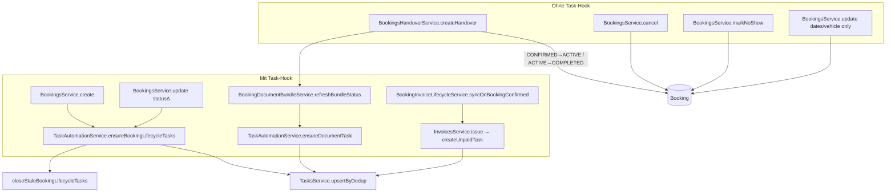

# Booking Task Trigger Map — Read-only Verification Audit

**Date:** 2026-07-15  
**Scope:** Alle Backend-Pfade, die bei Buchungen Tasks erzeugen, aktualisieren, auto-resolven oder superseden  
**Mode:** Read-only. Keine produktiven Code-Änderungen.  
**Quellen:** `TaskAutomationService`, `BookingsService`, `BookingsHandoverService`, `BookingDocumentBundleService`, `BookingInvoiceLifecycleService`, `InvoicesService`, `VehicleCleaningTaskService`, Insight-/Workflow-/Scheduler-Pfade, bestehende Tests, `docs/audits/task-management-inventory.md`, `docs/architecture/task-domain-v2.md`

---

## Methodik

| Schritt | Vorgehen |
|---------|----------|
| Producer-Registry | `rg ensureBookingLifecycleTasks\|ensureDocumentTask\|createUnpaidTask` in `backend/src` |
| Status-Pfade | `bookings.service.ts` (`create`, `update`, `cancel`, `markNoShow`), `bookings-handover.service.ts` |
| Dokument-/Rechnungskette | `booking-document-bundle.service.ts`, `booking-invoice-lifecycle.service.ts`, `invoices.service.ts` |
| Parallel-Pfade | `vehicle-cleaning-task.service.ts`, `insight-task-bridge.service.ts`, `workflow-action-executor.service.ts` |
| Worker/Scheduler | `backend/src/workers/**`, `business-insights-scheduler.service.ts` |
| Tests | `tasks.service.spec.ts`, `vehicle-cleaning-task.service.spec.ts`, `invoices.pipeline.integration.spec.ts`, `documents.service.spec.ts` — **kein** dediziertes `task-automation.service.spec.ts`, **keine** Bookings-Modul-Specs |

---

## Executive Summary

| Kategorie | Befund |
|-----------|--------|
| **Kanonischer Lifecycle-Producer** | `TaskAutomationService.ensureBookingLifecycleTasks` — nur aus `BookingsService.create` und `BookingsService.update` bei **Statusänderung** |
| **Kritischer Bypass** | `BookingsHandoverService.createHandover` setzt `CONFIRMED→ACTIVE` / `ACTIVE→COMPLETED` per Prisma **ohne** `ensureBookingLifecycleTasks` |
| **Cancel / No-Show** | `cancel`, `markNoShow` — **kein** Task-Hook; offene Lifecycle-Tasks bleiben |
| **Fahrzeugwechsel / Verschiebung** | `BookingsService.update` bei `vehicleId`/`startDate`/`endDate`-Änderung — **kein** Task-Hook, **keine** Relink/Supersede bestehender Tasks |
| **Dokument-Tasks** | `BookingDocumentBundleService.syncMissingDocumentTasks` — Erzeugung bei unvollständigem Bundle; **kein** Auto-Close bei späterer Vervollständigung |
| **Rechnungs-Tasks** | `invoice:unpaid:{invoiceId}` bei `issue`; parallel `booking:invoice:{bookingId}` bei `COMPLETED`-Lifecycle |
| **Scheduler/Worker** | Keine direkten `OrgTask`-Writes in Workern; Insights mit Booking-Scope → **Notifications**, nicht Tasks (Bridge filtert `entityScope === VEHICLE`) |

---

## Legende

| Spalte | Bedeutung |
|--------|-----------|
| **materialize** | Wird heute ein `OrgTask` angelegt/upserted? |
| **activatesAt** | Heute: nicht gesetzt → sofort aktiv (`createdAt`-Semantik) |
| **dueDate** | Nur bei `invoice:unpaid:*` aus Rechnungs-`dueDate` |
| **Auto-Close** | `AUTO_RESOLVED` oder `SUPERSEDED` via `TasksService` |
| **Duplikatrisiko** | Bewertung bei Wiederholung / parallelen Namespaces |

**Checklisten:** Aus `task-templates.ts` via `checklistForType` — nur bei `withChecklist: true` beim **ersten** Create (`upsertByDedup`).

---

## A. Trigger-Matrix nach `BookingStatus`

### `PENDING`

| Feld | Wert |
|------|------|
| **Trigger** | `BookingsService.create` mit `status=PENDING` |
| **Aufruf** | `bookings.service.ts:307–315` → `ensureBookingLifecycleTasks` |
| **Tasks erzeugt** | **Keine** (kein `if (status === 'PENDING')`-Block) |
| **Supersede** | `activeDedupKeys=[]` → alle aktiven `source=BOOKING`-Tasks für `bookingId` werden superseded (`closeStaleBookingLifecycleTasks`) |
| **Nebenpfade** | `generateInitialBundle` (Zeilen 292–304); `bootstrapBookingInvoice` → DRAFT, **kein** Unpaid-Task |
| **Duplikatrisiko** | Niedrig |

**Klassifikation:** Kein Lifecycle-Task-Zustand — korrekt leer; Bundle-/Rechnungs-Bootstrap separat.

---

### `CONFIRMED`

| # | TaskType | Titel | dedupKey | source | sourceType | Checkliste | Verknüpfungen | Priority |
|---|----------|-------|----------|--------|------------|------------|---------------|----------|
| 1 | `BOOKING_PREPARATION` | Buchung vorbereiten | `booking:prep:{id}` | `BOOKING` | `BOOKING` | 5 Pflichtpunkte (Fahrzeug reinigen, Tank/Ladung, KM, Dokumente, Zubehör) | `vehicleId`, `bookingId`, `customerId` | NORMAL |
| 2 | `VEHICLE_CLEANING` | Fahrzeug reinigen | `booking:clean:{id}` | `BOOKING` | `BOOKING` | 4 Pflichtpunkte (Innen, Außen, Müll, Fotos optional) | wie oben | NORMAL |
| 3 | `DOCUMENT_REVIEW` | Buchungsdokumente prüfen | `booking:document:{id}` | `BOOKING` | `BOOKING` | **Keine** (Type C) | wie oben | NORMAL |

| Feld | Wert |
|------|------|
| **Trigger (primär)** | `BookingsService.create` mit `CONFIRMED`; `BookingsService.update` mit Übergang `→ CONFIRMED`; Wizard `booking-wizard-draft.service.ts:208` → `update` |
| **Aufruf** | `task-automation.service.ts:78–105` |
| **activatesAt / dueDate** | Nicht gesetzt |
| **Auto-Supersede** | Bei späterem Phasenwechsel: Keys nicht in `activeDedupKeys` → `SUPERSEDED` / `BOOKING_PHASE_SUPERSEDED` |
| **Parallele Pfade** | Siehe §C (Bundle, Rechnung, Vehicle-Cleaning) |
| **Duplikatrisiko** | **Hoch** für Cleaning (`booking:clean` vs `vehicle:cleaning`); **Mittel** für Dokumente (`booking:document` vs `document:{kind}:{bookingId}`) |

**Nach Bestätigung zusätzlich (kein Lifecycle-Upsert):**

| Ereignis | Datei | Task-Effekt |
|----------|-------|-------------|
| Rechnung ausstellen | `booking-invoice-lifecycle.service.ts:49–50` → `invoices.service.issue` | `INVOICE_REQUIRED`, `invoice:unpaid:{invoiceId}`, `source=INVOICE`, `sourceType=SYSTEM`, **nur** `invoiceId` (kein `bookingId` auf Task) |
| Initiales Bundle | `bookings.service.ts:1715–1721` / create → `generateInitialBundle` | `refreshBundleStatus` → `syncMissingDocumentTasks` für fehlende Slots |

**Klassifikation (V2-Sicht):**

| Task | Bewertung |
|------|-----------|
| `BOOKING_PREPARATION` | **Regulärer Workflow-Schritt** — heute fälschlich als globaler Task materialisiert |
| `VEHICLE_CLEANING` | **Echter operativer Task** — aber dedup sollte `vehicle:cleaning:{vehicleId}` sein, nicht `booking:clean` |
| `DOCUMENT_REVIEW` (lifecycle) | **Fachliches Duplikat** zu Bundle-`document:*`-Tasks |

---

### `ACTIVE`

| Feld | Wert |
|------|------|
| **TaskType** | `BOOKING_PICKUP` |
| **Titel** | Fahrzeugübergabe (Pickup) |
| **dedupKey** | `booking:pickup:{id}` |
| **source / sourceType** | `BOOKING` / `BOOKING` |
| **Checkliste** | 6 Pflichtpunkte (Kunde identifizieren, Vertrag, Kaution, Zustand, Fotos, Schlüssel) |
| **Priority** | HIGH |
| **Trigger (Code-Pfad)** | Nur `ensureBookingLifecycleTasks` wenn Status **via `BookingsService.update`** auf `ACTIVE` wechselt (`task-automation.service.ts:108–118`) |
| **Trigger (Produktion)** | **`BookingsHandoverService` PICKUP** (`CONFIRMED→ACTIVE`) — **ruft Automation NICHT auf** |
| **activatesAt / dueDate** | Nicht gesetzt |
| **Auto-Supersede** | Bei Wechsel zu `COMPLETED` oder Terminalstatus: `booking:pickup` nicht mehr in active set |
| **Bundle-Nebenpfad** | Nach Pickup-Handover: `generatePickupProtocolDocument` → `refreshBundleStatus` → ggf. `document:HANDOVER_PICKUP:{bookingId}` schließen fehlt; fehlende Docs erzeugen Tasks |
| **Duplikatrisiko** | **Hoch** (Bypass): Prep-Tasks von `CONFIRMED` bleiben offen; Pickup-Task fehlt oft |

**Klassifikation:** **Regulärer Workflow-Schritt** (Handover-Flow) — globaler Task nur bei Überfälligkeit/Unzugewiesen (V2 W1–W4).

---

### `COMPLETED`

| # | TaskType | Titel | dedupKey | Checkliste |
|---|----------|-------|----------|------------|
| 1 | `BOOKING_RETURN` | Fahrzeugrücknahme (Return) | `booking:return:{id}` | 7 Pflichtpunkte (KM, Tank, Außen/Innen, Schäden, Protokoll, Schlussrechnung prüfen) |
| 2 | `INVOICE_REQUIRED` | Schlussrechnung erstellen/prüfen | `booking:invoice:{id}` | Keine (Type C) |

| Feld | Wert |
|------|------|
| **Trigger (Code-Pfad)** | `ensureBookingLifecycleTasks` bei Status `COMPLETED` via `BookingsService.update` (`task-automation.service.ts:121–139`) |
| **Trigger (Produktion)** | **`BookingsHandoverService` RETURN** (`ACTIVE→COMPLETED`) — **ruft Automation NICHT auf** |
| **Priority** | RETURN: HIGH; INVOICE: NORMAL |
| **Nebenpfade Return** | `generateReturnProtocolDocument` → Bundle refresh; `generateFinalInvoiceAndDocument` → FINAL_INVOICE DRAFT + PDF, **ohne** `refreshBundleStatus` |
| **Workflow-Events** | `booking.returned`, `booking.completed` → optional `WorkflowActionExecutor` `CUSTOM`-Tasks (org-konfiguriert) |
| **Duplikatrisiko** | **Hoch**: `booking:invoice` + `invoice:unpaid:{finalInvoiceId}` wenn Final-Rechnung später issued; Return-/Pickup-Tasks stale bei Handover-Bypass |

**Klassifikation:**

| Task | Bewertung |
|------|-----------|
| `BOOKING_RETURN` | **Regulärer Workflow-Schritt** |
| `INVOICE_REQUIRED` (lifecycle) | **Fachliches Duplikat** zu `invoice:unpaid:*` |

---

### `CANCELLED`

| Feld | Wert |
|------|------|
| **Trigger** | `BookingsService.cancel` (`bookings.service.ts:1740–1771`) |
| **Task-Hook** | **Keiner** |
| **Erwartetes V2-Verhalten** | `SUPERSEDED` aller aktiven `source=BOOKING`-Tasks für `bookingId` (`booking.lifecycle.cancelled`) |
| **Ist** | Offene `CONFIRMED`-/`ACTIVE`-Phase-Tasks bleiben |
| **Duplikatrisiko** | **Hoch** (verwaiste Tasks) |

**Klassifikation:** **Echter Ausnahmefall** — Buchung beendet, Tasks müssen geschlossen werden.

---

### `NO_SHOW`

| Feld | Wert |
|------|------|
| **Trigger** | `BookingsService.markNoShow` (`bookings.service.ts:1793–1854`) — nur aus `CONFIRMED`, `startDate` in Vergangenheit |
| **Task-Hook** | **Keiner** |
| **Insight-Nebenpfad** | `PickupOverdueDetector` — Insight `pickup_overdue:{bookingId}` verfällt indirekt (Status ≠ CONFIRMED); **kein** Task |
| **Erwartetes V2-Verhalten** | Gleich wie `CANCELLED` (`booking.lifecycle.cancelled.noshow`) |
| **Duplikatrisiko** | **Hoch** (verwaiste Prep/Clean/Document-Lifecycle-Tasks) |

**Klassifikation:** **Echter Ausnahmefall**.

---

## B. Trigger-Matrix nach Ereignis (quer zu Status)

### Pickup abgeschlossen (Handover `PICKUP`)

| Feld | Wert |
|------|------|
| **Ereignis** | `BookingsHandoverService.createHandover(..., 'PICKUP')` |
| **Datei** | `bookings-handover.service.ts:51–344` |
| **Booking-Status** | `CONFIRMED` → `ACTIVE` (Prisma in Transaction, Zeilen 165–197) |
| **Lifecycle-Tasks** | **Keine** Materialisierung/Supersede |
| **Fahrzeug** | `VehicleStatus.RENTED` (wenn nicht IN_SERVICE/OUT_OF_SERVICE) |
| **Dokumente** | `generatePickupProtocolDocument` → `refreshBundleStatus` → `syncMissingDocumentTasks` |
| **Workflow** | Keine Events |
| **Soll (V2)** | `booking:pickup` auto-resolve/supersede; Prep-Phase supersede; optional kein globaler Pickup-Task wenn Handover vollständig |
| **Duplikatrisiko** | **Hoch** — stale `booking:prep|clean|document`; fehlender `booking:pickup` |

---

### Return abgeschlossen (Handover `RETURN`)

| Feld | Wert |
|------|------|
| **Ereignis** | `BookingsHandoverService.createHandover(..., 'RETURN')` |
| **Datei** | `bookings-handover.service.ts` |
| **Booking-Status** | `ACTIVE` → `COMPLETED` |
| **Lifecycle-Tasks** | **Keine** |
| **Dokumente** | Return-Protokoll + `generateFinalInvoiceAndDocument` (DRAFT `OUTGOING_FINAL`, kein `InvoicesService.issue`) |
| **Bundle-Refresh** | Nach Return-Protokoll: ja; nach Final-Invoice: **nein** → `document:FINAL_INVOICE:*` kann stale bleiben |
| **Workflow** | `booking.returned`, `booking.completed` (`workflow-action-executor` optional) |
| **Driving-Analysis** | `rentalDrivingAnalysisService.generateForBooking` nur bei `update→COMPLETED`, nicht Handover |
| **Duplikatrisiko** | **Hoch** |

---

### Buchung bestätigt (`→ CONFIRMED`)

Siehe §A `CONFIRMED` plus:

| Schritt | Producer | Task |
|---------|----------|------|
| Wizard-Checkout | `booking-wizard-draft.service.ts:208–218` | Lifecycle via `update`; Invoice via `syncOnBookingConfirmed` |
| Bundle | `generateInitialBundle` | `document:*` für fehlende Pflichtdokumente |
| Unpaid-Task | `invoices.service.issue` | `invoice:unpaid:{id}`, `dueDate` = Buchungs-`startDate` + 14 Tage (`createBookingInvoice`, Zeile 577–578) |

---

### Buchung verschoben (`startDate` / `endDate` geändert)

| Feld | Wert |
|------|------|
| **Trigger** | `BookingsService.update` — `vehicleOrDatesChanged` (`bookings.service.ts:1606–1609`) |
| **Task-Hook** | **Keiner** (nur bei `statusChanged`, Zeile 1726) |
| **Pricing** | Neuer Price-Snapshot wenn `pricingRelevant` |
| **Bundle/Rechnung** | Kein automatisches Re-Sync der Dokument-Tasks |
| **activatesAt (Soll)** | V2: `activatesAt` an Pickup/Prep koppeln — **fehlt** |
| **Duplikatrisiko** | Mittel — Tasks behalten alte Semantik; Insights (`pickup_overdue`, `tight_handover`) nutzen neue Daten beim nächsten Cron |

**Klassifikation:** **Regulärer Workflow-Schritt** — keine neuen Tasks; bestehende ggf. Due/Activation anpassen (Ziel).

---

### Fahrzeug gewechselt (`vehicleId` geändert)

| Feld | Wert |
|------|------|
| **Trigger** | `BookingsService.update` |
| **Task-Hook** | **Keiner** |
| **Task-Relink** | **Nein** — bestehende `OrgTask.vehicleId` bleibt auf altem Fahrzeug |
| **Cleaning-Duplikat** | Neues Fahrzeug kann `vehicle:cleaning:{newId}` bekommen; alte `booking:clean:{bookingId}` verweist auf altes `vehicleId` im Task |
| **Duplikatrisiko** | **Hoch** |

**Klassifikation:** **Echter Ausnahmefall** — Relink oder Supersede+Neumaterialisierung nötig.

---

### Rechnung erzeugt / ausgestellt

| Pfad | Wann | Task | dedupKey | Auto-Close |
|------|------|------|----------|------------|
| `bootstrapBookingInvoice` / `createBookingInvoice` | Booking `create` | **Keiner** (DRAFT) | — | — |
| `BookingInvoiceLifecycleService.syncOnBookingConfirmed` | `→ CONFIRMED` | Nach `issue` | `invoice:unpaid:{invoiceId}` | `recordPayment` vollständig → `INVOICE_PAID` / `closeInvoiceLinkedTasks` |
| `InvoicesService.create` incoming | Reviewable Status | `invoice:unpaid:{id}` | wie oben | wie oben |
| `generateFinalInvoiceAndDocument` | Return-Handover | **Keiner** (DRAFT direkt Prisma) | — | — |
| Lifecycle `COMPLETED` | Status via `update` | `booking:invoice:{bookingId}` | `INVOICE_REQUIRED`, `source=BOOKING` | Kein Auto-Close |

**Payment-Reconciliation-Gap:** PAID ohne `recordPayment` schließt Task nicht (`invoices.pipeline.integration.spec.ts` Fall 51).

**Klassifikation:** `invoice:unpaid:*` = **echter Task**; `booking:invoice:*` = **fachliches Duplikat**.

---

### Dokumentpaket unvollständig

| Feld | Wert |
|------|------|
| **Trigger** | `BookingDocumentBundleService.refreshBundleStatus` → `syncMissingDocumentTasks` (`booking-document-bundle.service.ts:712–805`) |
| **Auslöser** | `generateInitialBundle`, `regenerate`, Pickup-/Return-Protokoll-Generierung |
| **Nicht ausgelöst von** | `generateFinalInvoiceAndDocument` (kein `refreshBundleStatus` am Ende) |

**Pflichtdokumente nach Status (`requiredTypesForStage`):**

| Booking-Status | Zusätzlich zu Basis (BOOKING_INVOICE, DEPOSIT_RECEIPT, RENTAL_CONTRACT, TERMS, WITHDRAWAL) |
|--------------|---------------------------------------------------------------------------------------------|
| `CONFIRMED` / `PENDING` | Basis only |
| `ACTIVE` | + `HANDOVER_PICKUP` |
| `COMPLETED` | + `HANDOVER_PICKUP`, `HANDOVER_RETURN`, `FINAL_INVOICE` |

**Pro fehlendem Typ:**

| Feld | Wert |
|------|------|
| **TaskType** | `DOCUMENT_REVIEW` oder `INVOICE_REQUIRED` (für `BOOKING_INVOICE`, `FINAL_INVOICE`) |
| **Titel** | `Fehlendes Dokument: {DE-Titel}` |
| **dedupKey** | `document:{DocumentType}:{bookingId}` (ref = `documentId ?? bookingId ?? vehicleId`) |
| **source / sourceType** | `DOCUMENT` / `DOCUMENT` |
| **Verknüpfungen** | `bookingId`, `vehicleId` — **kein** `customerId` |
| **Priority** | `FINAL_INVOICE` → HIGH |
| **Checkliste** | Keine |
| **Auto-Close** | **Nicht implementiert** wenn Dokument später generiert wird |
| **Duplikatrisiko** | **Mittel–Hoch** vs `booking:document:{id}` |

**Klassifikation:** **Echter Task** nur bei blockierendem/fehlendem Pflichtdokument (V2 W1); heute auch bei jedem Bundle-Sync.

---

## C. Parallele und indirekte Booking-nahe Trigger

### `VehicleCleaningTaskService` (Fahrzeugstatus)

| Trigger | Datei | Task | dedupKey | vs Booking |
|---------|-------|------|----------|------------|
| `cleaningStatus=NEEDS_CLEANING` | `vehicles.controller.ts` | `VEHICLE_CLEANING` | `vehicle:cleaning:{vehicleId}` | `source=VEHICLE_CLEANING`, `blocksVehicleAvailability=true`, HIGH wenn nächste Buchung ≤24h |
| `cleaningStatus=CLEAN` | wie oben | Auto-resolve **alle** aktiven `VEHICLE_CLEANING` am Fahrzeug | — | Resolved auch `booking:clean:{bookingId}` |

---

### Business-Insights (Booking-Bezug, **keine** Auto-Tasks)

| Detector | dedupeKey | Scope | Task-Brücke |
|----------|-----------|-------|---------------|
| `PickupOverdueDetector` | `pickup_overdue:{bookingId}` | CONFIRMED ohne Pickup-Protokoll | **Nein** (`entityScope` nicht VEHICLE-only → gefiltert) |
| `ReturnNeedsInspectionDetector` | `return_inspection:{bookingId}` | ACTIVE, Return ≤24h + Risikogründe | **Nein** (`entityScope=VEHICLE`) |
| `ServiceBeforeBookingDetector` | `service_before_booking:{vehicleId}:{bookingId}` | Service/TÜV vor Pickup | **Nein** |
| `TightHandoverDetector` | `tight_handover:{vehicleId}:{currentId}:{nextId}` | Enger Fahrzeugwechsel | **Nein** |

**Scheduler:** `business-insights-scheduler.service.ts` → `InsightTaskBridgeService.materialize` — nur `SERVICE_OVERDUE`, `TUV_*`, `TIRE/BRAKE/BATTERY_CRITICAL` mit `entityScope === VEHICLE`.

---

### Workflow-Events (Return)

| Event | Idempotency | Task | dedupKey |
|-------|-------------|------|----------|
| `booking.returned` | `booking.returned:{bookingId}` | Optional `CUSTOM` | `{idempotencyKey}:action:{index}:task` |
| `booking.completed` | `booking.completed:{bookingId}` | Optional `CUSTOM` | wie oben |

Nur wenn Org-Workflow definiert (`workflow-action-executor.service.ts:107–133`).

---

### Manuelle / Adjacent Producer

| Producer | Booking-Bezug | dedupKey |
|----------|---------------|----------|
| `WhatsAppQuickActionsService.createTaskFromConversation` | optional `bookingId` | **keiner** |
| `TechnicalObservationsService.convertToTask` | optional `bookingId` | **keiner** |
| `TasksController.create` | optional DTO | **keiner** |

---

## D. Auto-Resolve / Supersede — Ist-Zustand

| Regel | Trigger | Datei | Scope | resolutionCode |
|-------|---------|-------|-------|----------------|
| Phase supersede | Nach `ensureBookingLifecycleTasks` | `tasks.service.ts:1661–1694` | `bookingId` + `source=BOOKING` + active + dedupKey ∉ active set | `BOOKING_PHASE_SUPERSEDED` |
| Invoice paid | `recordPayment`, outstanding=0 | `closeInvoiceLinkedTasks` | `invoiceId` | `INVOICE_PAID` |
| Vehicle cleaned | `cleaningStatus=CLEAN` | `vehicle-cleaning-task.service.ts:84–113` | Alle aktiven `VEHICLE_CLEANING` am `vehicleId` | `VEHICLE_CLEANED` |
| Handover complete | — | — | **Nicht implementiert** | — |
| Document generated | — | — | **Nicht implementiert** | — |
| Cancel / No-Show | — | — | **Nicht implementiert** | — |

**activeDedupKeys je Status** (`task-automation.service.ts:146–160`):

| Status | Offen gehaltene Keys |
|--------|----------------------|
| `CONFIRMED` | `booking:prep`, `booking:clean`, `booking:document` |
| `ACTIVE` | `booking:pickup` |
| `COMPLETED` | `booking:return`, `booking:invoice` |
| Sonstige | `[]` → alle `source=BOOKING` superseded **wenn** Automation läuft |

---

## E. Klassifikation: Workflow vs. Ausnahme vs. Duplikat

### Reguläre Workflow-Schritte (sollten **nicht** dauerhaft als separate globale Tasks existieren)

| Schritt | Heutiger TaskType | Begründung |
|---------|-------------------|------------|
| Buchung vorbereiten | `BOOKING_PREPARATION` | Abgedeckt durch Booking-Detail + Operator-Today-Gruppierung |
| Pickup durchführen | `BOOKING_PICKUP` | Kanonisch: `BookingsHandoverService` PICKUP |
| Return durchführen | `BOOKING_RETURN` | Kanonisch: Handover RETURN |
| Checklistenpunkte im Handover | Checklisten in Tasks | Prozessschritte im Handover-UI, nicht Task-Inbox |
| Bundle-Slot befüllen | — | `BookingDocumentBundle.status` / Detail-Slots |

### Echte Ausnahmefälle (sollen **Task** sein, V2 W1–W4)

| Ausnahme | Empfohlener TaskType | Kanonischer dedupKey |
|----------|----------------------|----------------------|
| Fahrzeugreinigung blockiert Verfügbarkeit | `VEHICLE_CLEANING` | `vehicle:cleaning:{vehicleId}` |
| Pflichtdokument fehlt / blockiert | `DOCUMENT_REVIEW` / `INVOICE_REQUIRED` | `document:{type}:{bookingId}` |
| Rechnung unbezahlt | `INVOICE_REQUIRED` | `invoice:unpaid:{invoiceId}` |
| Pickup überfällig (CONFIRMED, kein Handover) | Optional Task oder Insight | `pickup_overdue:{bookingId}` (heute nur Insight) |
| Buchung CANCELLED / NO_SHOW | — (Close-Regel) | Supersede aller `source=BOOKING` |
| Fahrzeugwechsel mit offenen Tasks | Relink/Supersede | — |

### Fachliche Duplikate (Ist — zusammenführen)

| Duplikat-Paar | Schwere |
|---------------|---------|
| `booking:clean:{id}` ↔ `vehicle:cleaning:{vehicleId}` | **P0** |
| `booking:invoice:{id}` ↔ `invoice:unpaid:{invoiceId}` | **P0** |
| `booking:document:{id}` ↔ `document:{kind}:{bookingId}` | **P1** |
| Lifecycle-Task offen + Handover bereits erledigt | **P0** (Bypass) |

---

## F. Testabdeckung (Booking-Automation)

| Datei | Was geprüft wird | Booking-Lifecycle |
|-------|------------------|-------------------|
| `tasks.service.spec.ts` | `upsertByDedup` mit `booking:pickup:b1`; `closeStaleBookingLifecycleTasks` | Teilweise (Mock) |
| `task-templates.spec.ts` | Checklisten für Booking-Types | Templates only |
| `vehicle-cleaning-task.service.spec.ts` | Vehicle-Cleaning materialize/complete | Parallel-Pfad |
| `invoices.pipeline.integration.spec.ts` | Unpaid-Task create/close; PAID ohne close | Invoice, nicht Booking-Lifecycle |
| `documents.service.spec.ts` | Mock `ensureBookingLifecycleTasks` | Kein `ensureDocumentTask`-Verhalten |
| **Fehlend** | `task-automation.service.spec.ts` | — |
| **Fehlend** | `bookings.service.spec.ts` / Handover-Task-Integration | — |

---

## G. Call-Graph (vereinfacht)

---

## H. Exakte geplante Zielmatrix für Booking-Tasks

Normative Quelle: `docs/architecture/task-domain-v2.md` §1.2 (W1–W4), §J.2, §J.3.  
**Ziel:** Ein offener Task pro fachlichem Vorgang; Workflow-Schritte nur bei Blockade, Überfälligkeit, fehlender Zuweisung oder manueller Eskalation.

### H.1 Materialisierungs-Matrix (Soll)

| ruleId | Ver. | Trigger | TaskType | dedupKey (kanonisch) | materializeAsTask | activatesAt (Soll) | Auto-Close Bedingung |
|--------|------|---------|----------|----------------------|-------------------|--------------------|----------------------|
| `booking.lifecycle.confirmed.prep` | 1 | `CONFIRMED` | `BOOKING_PREPARATION` | — | **false** (Workflow) | `startDate − Xh` (optional) | Pickup-Handover abgeschlossen oder Phase supersede |
| `booking.lifecycle.confirmed.clean` | 1 | `CONFIRMED` + Reinigung nötig | `VEHICLE_CLEANING` | `vehicle:cleaning:{vehicleId}` | **true** (W1–W4) | sofort oder vor Pickup | `cleaningStatus=CLEAN` → `VEHICLE_CLEANED` |
| `booking.lifecycle.confirmed.document` | 1 | `CONFIRMED` + Bundle unvollständig | `DOCUMENT_REVIEW` | `document:{type}:{bookingId}` | **true** (W1) | sofort | Dokument-Slot befüllt → `AUTO_RESOLVED` |
| `booking.lifecycle.active.pickup` | 1 | `ACTIVE` + Pickup offen/überfällig | `BOOKING_PICKUP` | `booking:pickup:{bookingId}` | **true** (W1–W4) | `startDate` | Pickup-Handover → `AUTO_RESOLVED` / supersede |
| `booking.lifecycle.completed.return` | 1 | `COMPLETED` + Return offen | `BOOKING_RETURN` | `booking:return:{bookingId}` | **true** (W1–W4) | `endDate` | Return-Handover → `AUTO_RESOLVED` / supersede |
| `booking.lifecycle.completed.invoice` | 1 | ~~`COMPLETED`~~ | ~~`INVOICE_REQUIRED`~~ | ~~`booking:invoice:{id}`~~ | **false** — ersetzt durch `invoice.unpaid` | — | — |
| `invoice.unpaid` | 1 | `InvoicesService.issue` / outgoing unpaid | `INVOICE_REQUIRED` | `invoice:unpaid:{invoiceId}` | **true** | `dueDate` | Zahlung vollständig → `INVOICE_PAID` |
| `document.bundle.missing` | 1 | Bundle-Sync, Pflicht-Slot leer | `DOCUMENT_REVIEW` / `INVOICE_REQUIRED` | `document:{type}:{bookingId}` | **true** (W1) | sofort | Slot befüllt → `AUTO_RESOLVED` |
| `vehicle.cleaning.required` | 1 | `cleaningStatus=NEEDS_CLEANING` | `VEHICLE_CLEANING` | `vehicle:cleaning:{vehicleId}` | **true** | sofort | `CLEAN` → `VEHICLE_CLEANED` |
| `booking.lifecycle.cancelled` | 1 | `CANCELLED` | — | — | Close only | — | `SUPERSEDED` alle ACTIVE `source=BOOKING` für `bookingId` |
| `booking.lifecycle.cancelled.noshow` | 1 | `NO_SHOW` | — | — | Close only | — | wie cancelled |
| `booking.handover.pickup.completed` | 1 | Handover `PICKUP` success | — | — | Close/resolve | — | Supersede CONFIRMED-Phase; resolve `booking:pickup` falls materialisiert |
| `booking.handover.return.completed` | 1 | Handover `RETURN` success | — | — | Close/resolve | — | Supersede ACTIVE-Phase; resolve `booking:return` falls materialisiert |
| `booking.reschedule` | 1 | `startDate`/`endDate` geändert | bestehende Tasks | unveränderte dedupKeys | Update metadata | neues `activatesAt`/`dueDate` | — |
| `booking.vehicle.changed` | 1 | `vehicleId` geändert | betroffene Tasks | Relink oder supersede+neu | Regelabhängig | — | Alte vehicle-scoped Tasks supersede |

### H.2 Verbotene Duplikat-Namespaces (Soll)

| Namespace | Status |
|-----------|--------|
| `booking:clean:{bookingId}` | **Abschaffen** — nur `vehicle:cleaning:{vehicleId}` |
| `booking:invoice:{bookingId}` | **Abschaffen** — nur `invoice:unpaid:{invoiceId}` |
| `booking:document:{bookingId}` | **Abschaffen** — nur `document:{type}:{bookingId}` |

### H.3 Pflicht-Hooks (Soll — Implementierungsreihenfolge)

| # | Hook | Datei (Ziel) |
|---|------|--------------|
| 1 | `ensureBookingLifecycleTasks` nach **jedem** Statuswechsel inkl. Handover | `bookings-handover.service.ts` oder zentraler Domain-Event |
| 2 | `booking.lifecycle.cancelled` / `.noshow` | `bookings.service.ts` `cancel`, `markNoShow` |
| 3 | Document-Task stale-close bei Bundle `COMPLETE` | `booking-document-bundle.service.ts` |
| 4 | `refreshBundleStatus` nach `generateFinalInvoiceAndDocument` | `booking-document-bundle.service.ts` |
| 5 | Payment-Reconciliation → `closeInvoiceLinkedTasks` | `payment-reconciliation.service.ts` |
| 6 | Relink/Supersede bei `vehicleId`-Wechsel | `bookings.service.ts` `update` |

### H.4 Checklisten-Ziel (unverändert fachlich, nur bei materializeAsTask=true)

| TaskType | Pflicht-Checklistenpunkte (weiterhin aus `task-templates.ts`) |
|----------|------------------------------------------------------------------|
| `BOOKING_PREPARATION` | 5 (nur wenn explizit materialisiert) |
| `BOOKING_PICKUP` | 6 |
| `BOOKING_RETURN` | 7 |
| `VEHICLE_CLEANING` | 4 |
| `DOCUMENT_REVIEW` / `INVOICE_REQUIRED` | keine generische Checkliste |

---

## I. Offene Produktfragen (aus Inventory Appendix B, booking-relevant)

1. Soll Pickup-Überfälligkeit (`pickup_overdue`) künftig in einen Task überführt werden oder Insight-only bleiben?
2. Soll `BOOKING_PREPARATION` vollständig aus der globalen Inbox verschwinden (rein Workflow)?
3. Bei Final-Invoice: Task erst bei `issue` oder bereits bei DRAFT-Erzeugung im Return-Flow?
4. Sollen Workflow-`CUSTOM`-Tasks nach `booking.completed` dedup gegen Lifecycle-Tasks geprüft werden?

---

## Zusammenfassung

- **Heute** erzeugt `ensureBookingLifecycleTasks` bis zu **6** Booking-Lifecycle-Tasks mit **3 dedup-Namespaces**, die in V2 **konsolidiert oder abgeschafft** werden.
- Der **produktive Handover-Pfad** umgeht die Automation — das ist die **größte Ist/Soll-Lücke** für Pickup/Return/Supersede.
- **Cancel/No-Show**, **Fahrzeugwechsel**, **Verschiebung** und **Dokument-Vervollständigung** haben **keine** schließende Task-Logik.
- Die **geplante Zielmatrix** steht in **§H** und entspricht `task-domain-v2.md` §J.2 — mit expliziter Ergänzung der Handover-, Reschedule- und Vehicle-Change-Regeln.

**Changes / Architektur:** Nicht aktualisiert (read-only Audit).
