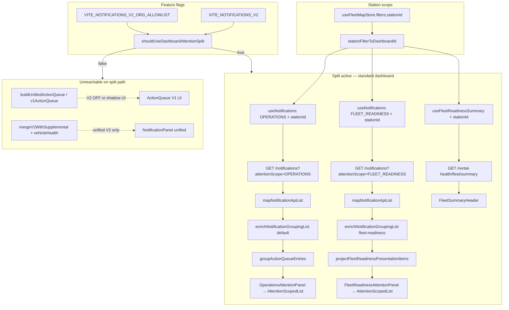

# P3.2 Post-Merge Production Readiness Audit — Dashboard Attention Split (Fleet Readiness)

**Audit date:** 2026-08-20  
**Audited commit (main):** `c7e60a9e485b2c6787872ef86bae0a93c7ce219b`  
**Merge PR:** #1075 — P3.1 Dashboard Attention Split  
**Auditor mode:** Read-only, adversarial verification against current `main`  
**Scope:** Fleet Readiness + Dashboard Attention end-to-end (frontend + backend contracts)

---

## 1. Executive verdict

### **ORANGE — remediation required before full production confidence**

P3.1 on `main` establishes a **single coherent canonical truth model** on the standard dashboard split path:

- Fleet header counts come from `GET /rental-health/fleet/summary` (canonical `rental_readiness`).
- Fleet list comes from Notification V2 with `attentionScope=FLEET_READINESS`.
- Operations list comes from Notification V2 with `attentionScope=OPERATIONS`.
- Supplemental merges (`mergeV2WithSupplemental`, `vehicleHealthQueueItems`, `derivedQueueItems`) are **not** applied to split panels.
- Backend `attentionScope` filtering is applied **server-side before pagination**.

No competing readiness reconstruction was found on the **reachable split path**. Legacy paths remain for V2 OFF, shadow diagnostics, and operator-focus surfaces — documented below with reachability conditions.

**This is not a cross-tenant backend authorization failure.** Backend org/station isolation remains authoritative. **P3.1 does not require rollback** — the canonical cutover architecture is valid.

**However**, independent reviewer verification confirmed a **material correctness issue** in request cancellation (`P32-F02`): both `useNotifications` and `useFleetReadinessSummary` use a shared boolean `cancelRef` that a newer fetch can reset while an older in-flight response remains able to commit. On a multi-station operations dashboard, this can display notifications or fleet summary data for a **previously selected station** after the operator has switched scope. That is a scope-correctness defect, not merely cosmetic UX debt.

**Finding severity summary:** BLOCKER 0 · HIGH 2 · MEDIUM 3 · LOW 3 · INFO 4 (12 total)

**Material gaps by category:**

| ID | Severity | Category | Issue type |
|----|----------|----------|------------|
| P32-F02 | **HIGH** | Request cancellation | **Correctness** — wrong selected station/org data can be displayed |
| P32-F01 | **HIGH** | Pagination + grouping | **Completeness** — partial vehicle context until `loadMore` |
| P32-F03 | MEDIUM | Operator-focus lifecycle | Workflow parity gap (secondary surface) |

`P32-F02` blocks claiming **unrestricted multi-station production confidence** until request-race hardening ships. `P32-F01` is a separate pagination-boundary completeness issue and does not imply displaying the wrong station's data.

### Go / no-go

| Question | Answer |
|----------|--------|
| Canonical truth model achieved? | **Yes** on standard dashboard split path |
| P3.1 architecture valid? | **Yes** — no rollback required |
| Rollback required? | **No** |
| Cross-tenant authorization failure? | **No** — backend isolation remains authoritative |
| Immediate remediation before full production confidence? | **Yes** — `P32-F02` request-race hardening + tests |
| Unrestricted multi-station production confidence without follow-up? | **No** — not until `P32-F02` is fixed |

---

## 2. Audited commit SHA

```
c7e60a9e485b2c6787872ef86bae0a93c7ce219b
```

---

## 3. Canonical data-flow diagram



**Ownership model (split ON, verified):**

| Surface | Source | Client reconstruction? |
|---------|--------|------------------------|
| Fleet header | `rental_readiness` via fleet summary API | No |
| Fleet list | Notification V2 `FLEET_READINESS` | Presentation projection only |
| Operations list | Notification V2 `OPERATIONS` | Standard grouping only |
| KPI strip / runtime slices | `DashboardRuntimeModel` | Separate operational KPIs (not readiness header) |

---

## 4. Feature-flag state matrix

| Mode | Env | UI (standard dashboard) | Notification fetches | Fleet summary | Supplemental merge in attention UI |
|------|-----|-------------------------|----------------------|---------------|-------------------------------------|
| **V2 OFF** | unset / `off` / `false` | `ActionQueue` (V1) | None | None | N/A (V1 builder uses insights/health) |
| **Shadow** | `shadow` | `ActionQueue` (V1) | 1× unscoped V2 + counts (background) | None | Not in UI; shadow compares raw V2 vs V1 |
| **V2 ON** | `on` / `true` / `1` | `DashboardAttentionStack` | 2× scoped (OPS + FLEET), no unscoped | 1× fleet summary | **Not applied** to split panels |
| **Org allowlist** | `VITE_NOTIFICATIONS_V2_ORG_ALLOWLIST` | Gates all above per org | Same | Same | Same |

**Key gates** (`notifications-v2-flag.ts`):

- `shouldUseDashboardAttentionSplit` ≡ `shouldUseV2NotificationSource` — **no split without V2 ON**.
- `shouldFetchV2NotificationsInBackground` — true for `on` and `shadow` (with allowlist).
- Unified `notificationsV2` hook: `enabled: v2BackgroundFetch && !attentionSplitActive` — **no duplicate unscoped fetch when split active**.

**Ambiguous states:** None found. Split and V2 source are intentionally coupled.

**Shadow semantics:** UI unchanged (V1 `ActionQueue`). Background V2 fetch + `compareNotificationQueuesShadow`. When split would be active, shadow compare concatenates scoped items — diagnostic only.

**Operator focus mode:** Always `ActionQueue` regardless of split flag. When V2 ON + split active, `actionQueue` = operations-scoped items only (fleet excluded from focus queue).

---

## 5. Station-scoping analysis

### Frontend propagation

| Consumer | `stationId` passed? | Absent = all stations? |
|----------|---------------------|------------------------|
| `useNotifications` (OPS) | Yes, when `selectedStationId` set | Yes — param omitted |
| `useNotifications` (FLEET) | Yes | Yes |
| `useFleetReadinessSummary` | Yes | Yes |
| `GET /notifications/counts` | **No** (scoped hooks skip counts) | Org-wide |

`selectedStationId` derives from `useFleetMapStore.filters.stationId` via `stationFilterToDashboardId`. Station dropdown updates store; hooks refetch via `listParams` / `fetchSummary` dependency change.

**Pagination reset:** `useEffect` on `[fetchPage]` dependency includes `stationId` in `listParams` → page 1 refetch on station change. ✅

### Backend propagation

- Notifications: `stationId` in query DTO → station access filter in Prisma `where` **before** pagination.
- Fleet summary: `stationId` filters vehicles by `homeStationId` OR `currentStationId`; `assertStationReadable` enforces ACL.

### Risks

| Risk | Severity | Evidence |
|------|----------|----------|
| Stale data after fast station switch | HIGH | `cancelRef` boolean — see §10 |
| Org-wide counts while station-filtered lists | INFO | Counts endpoint not scoped; scoped hooks disable counts |
| Cross-station notification leakage | Not found | Server-side station filter verified |

---

## 6. Fleet summary analysis

### Frontend consumption (`FleetSummaryHeader`)

- Displays `summary.ready`, `summary.total`, `summary.readyPercent`, `summary.notReady`, `summary.unevaluable`, `summary.unknown` **directly from API**.
- Does **not** recompute `readyPercent`.
- Does **not** merge `unevaluable` into `notReady` or `unknown`.
- Loading: skeleton only — **no fake 0%**.
- Error / null summary: shows `dashboardAttention.fleetSummary.unavailable` — **no stale healthy data**.

### Backend contract

```typescript
// ApiFleetReadinessSummaryResponse (frontend)
{ total, ready, notReady, unevaluable, unknown, readyPercent: number | null }
```

Backend returns `readyPercent: number` (0 when `total === 0`); frontend null-check is defensive. Formula: `round((ready/total)*1000)/10`.

### Type alignment

Frontend `useFleetReadinessSummary` only passes `{ stationId }` — does not advertise `search` / `vehicleStatus` params that API client supports but dashboard does not use. ✅

### Divergence from notification list

Header counts all scoped vehicles by `rental_readiness`. List shows active `FLEET_READINESS` notifications. These **can diverge** by design (e.g. vehicle ready with no notifications, or non-vehicle fleet-wide notifications). No UX indication of divergence — see P32-F04.

---

## 7. Aggregate / cause analysis

### Backend uniqueness

Per vehicle, per event type:

- `VEHICLE_NOT_READY` fingerprint: `{org}|VEHICLE_NOT_READY|VEHICLE|{vehicleId}|vehicle_not_ready|v1`
- `VEHICLE_READINESS_UNEVALUABLE` fingerprint: `{org}|VEHICLE_READINESS_UNEVALUABLE|VEHICLE|{vehicleId}|vehicle_readiness_unevaluable|v1`

Partial unique index on `(organization_id, fingerprint, lifecycle_generation)` for active statuses. **At most one active aggregate per type per vehicle** — verified.

### Frontend `resolveAggregates` uses `.find()`

Safe given backend guarantee. If duplicate active rows existed (DB breach), second would be silently dropped — **hypothesis only**, not observed.

### Combination matrix (verified in code + tests)

| Case | Header (`primaryAggregate`) | Child rows | Duplicate vehicle cards? |
|------|----------------------------|------------|--------------------------|
| A — NOT_READY only | — (renders as leaf) | — | No |
| B — UNEVALUABLE only | — (leaf) | — | No |
| C — NOT_READY + cause | NOT_READY title | `[NOT_READY, …causes]` | No |
| D — UNEVALUABLE + cause | UNEVALUABLE title | `[UNEVALUABLE, …causes]` | No |
| E — both aggregates | UNEVALUABLE (evaluability) | `[NOT_READY, UNEVALUABLE]` | No |
| F — both + causes | UNEVALUABLE | `[NOT_READY, UNEVALUABLE, …causes]` | No |

- UNEVALUABLE precedence for header: `primaryAggregate = unevaluable ?? notReady` ✅
- Preserved NOT_READY when both: `preservedNotReadyAggregate` ✅
- Causes individually identifiable via `child.itemId` ✅
- Non-vehicle fleet notifications: preserved as leaf entries in `projectFleetReadinessPresentationItems` ✅

**Subtitle caveat:** Group `subtitle` is cause count string, not aggregate count — can under-represent when aggregates are child rows (cosmetic).

---

## 8. Lifecycle mutation analysis

### Split path (`AttentionScopedList`) — verified

| Action | Leaf | Grouped child | Targets canonical ID? |
|--------|------|---------------|----------------------|
| Mark read | ✅ | ✅ | Yes (`mutationHandlers(itemId)`) |
| Acknowledge | ✅ | ✅ | Yes |
| Snooze (1h default) | ✅ | ✅ | Yes |
| Unsnooze | Hook only | Not in UI | N/A |
| Resolve | Hook only | Not in UI | N/A |
| Archive | Hook only | Not in UI | N/A |
| CTA navigation | ✅ | ✅ | Per child item |
| Task creation | ✅ | ✅ | Per child item |

`NotificationActionsMenu` respects `availableActions` from backend — actions not in API response are hidden.

**Tests:** `NotificationGroupCard.lifecycle.test.tsx` (5) and `AttentionScopedList.lifecycle.test.tsx` (2) assert handler invocation with correct IDs. ✅

### Legacy `NotificationPanel` gap

`NotificationGroupCard` rendered **without** `resolveItemLifecycleHandlers` at `NotificationPanel.tsx:371-379`. Affects:

- Operator focus mode when V2 ON (uses `ActionQueue` → `NotificationPanel`)
- Hypothetical non-split unified V2 path (unreachable today)

Grouped lifecycle works in P3.1 split panels only — see P32-F03.

### Post-mutation grouping

Mutations patch local `apiRows` optimistically. Grouping recomputes from items on next render. Resolving a cause removes it from active list; vehicle group may collapse to leaf if only aggregate remains — correct behavior.

---

## 9. Pagination analysis

### Mechanics

- Page size: **50** (`DEFAULT_PAGE_SIZE`)
- `loadMore`: appends with dedupe by notification `id`
- Reset on scope/station/listMode change: page 1 refetch
- Scoped hooks: `fetchCounts: false` — no per-scope tab counts

### Critical: page-boundary fleet grouping

`projectFleetReadinessVehicleGroups` operates on **currently loaded items only**.

**Scenario:** Vehicle X has `VEHICLE_NOT_READY` on page 1 and `TIRE_CRITICAL` on page 2.

| Stage | UI behavior |
|-------|-------------|
| After page 1 | May show aggregate-only leaf OR incomplete group (aggregate without causes) |
| After loadMore | Items merge; grouping recomputes → full vehicle context |

**Failure modes:**

- Incomplete vehicle context before load more — **confirmed**
- Duplicate vehicle cards after loadMore — **mitigated** by dedupe on notification id; same vehicle group id `fleet-readiness:{vehicleId}` merges
- Misleading cause count in subtitle — **possible** until all pages loaded
- Severity may under-state until critical cause loads — **possible**

**Classification:** Inherent to paginated notification feed + client-side vehicle grouping. This is a **completeness** issue (partial vehicle context), distinct from `P32-F02` which is a **correctness** issue (wrong station scope). Acceptable for small/medium fleets with awareness; needs UX indication or server-side vehicle bundling for large fleets. See P32-F01.

---

## 10. Failure / race-condition analysis

### Independent failure (initial load) — verified

Each panel has separate `loading` / `error` state:

- Operations error → Fleet panel + summary still render independently
- Fleet notifications error → Operations + summary independent
- Summary error → `FleetSummaryHeader` shows unavailable; list still renders

No shared error gate in `DashboardAttentionStack`.

### Manual refresh (`refreshAll`)

```typescript
// useDashboardViewModel.ts:339-355
Promise.all([
  operationsNotifications.refresh(),
  fleetReadinessNotifications.refresh(),
  fleetReadinessSummaryHook.refresh(),
])
```

Individual `refresh()` / `fetchPage` **catch errors internally** — do not reject. Failed panel sets local error without blocking siblings. ✅

Outer `Promise.all` also includes fleet/insights/bookings — one rejection fails entire refresh spinner, but notification panels already updated independently.

### Race conditions (`cancelRef`)

Both `useNotifications` and `useFleetReadinessSummary`:

```typescript
cancelRef.current = false;  // start fetch
// ...
if (cancelRef.current) return;  // check after await
// cleanup: cancelRef.current = true
```

**Problem:** New fetch resets `cancelRef` to `false` while older in-flight request may still complete and pass the check, overwriting newer station's data.

**Risk:** Fast station/org switching — **HIGH (correctness)**. A newer fetch resets `cancelRef.current = false` while an older response can still commit, displaying data for the wrong selected station/org. No `AbortController` or request generation token. See P32-F02.

---

## 11. Legacy-path inventory

| Artifact | Still used? | Reachable under split? | Classification |
|----------|-------------|------------------------|----------------|
| `mergeV2WithSupplemental` | Yes, in `actionQueue` memo | **No** for split panels | Legitimate unified-V2 / legacy path |
| `mergeV2NotificationsWithVehicleHealth` | Yes | **No** for split panels | Same |
| `vehicleHealthQueueItems` | Computed always | **No** in split UI | Supplemental for unified path |
| `derivedQueueItems` | Computed always | **No** in split UI | Same |
| `overdueHandoverQueueItems` | Computed | **No** in split UI | Same |
| `buildFleetReadinessScopedAttentionItems` | Tests only | **No** | Dead production code; safe |
| `dashboard-attention-legacy-guard.ts` | Tests only | **No** | Documentation guard |
| `FleetReadinessScore` | Exported, not mounted in `DashboardView` | **No** | Legacy component |
| `computeFleetReadiness` on `vm` | Yes | Focus mode `FocusNotReadyVehicles` only | Separate heuristic, not attention header |
| `ActionQueue` V1 UI | Yes | V2 OFF, shadow, operator focus | Fallback |
| `NotificationPanel` | Operator focus / unified V2 | Operator focus when V2 ON | Operations-only when split |
| `healthMap` / `FleetContext` | Runtime KPIs, focus helpers | Not fleet attention header | Parallel data, not competing truth |

---

## 12. Backend API audit

### Notifications `attentionScope`

- Enum: `OPERATIONS` | `FLEET_READINESS` (registry-driven, 43 + 28 = 71 event types)
- Filter: `where.eventType IN (...)` in Prisma query **before** `skip`/`take`
- Count endpoint supports `attentionScope`; frontend scoped hooks intentionally skip counts
- Org isolation: `organizationId` + `OrgScopingGuard`
- Station: `StationAccessService` in query builder
- Role visibility intersects with scope filter

**Not a security boundary:** Single notification GET by id has no scope filter (by design).

### Fleet summary `/rental-health/fleet/summary`

- Source: scoped vehicle query → `RentalHealthSummaryService` → `deriveRentalReadiness`
- Station filter: home OR current station match
- `readyPercent`: server-computed, not client-derived
- Empty fleet: `total: 0`, `readyPercent: 0`
- Cache: 45s Redis TTL on health rows — operational staleness, not tenant leak
- Performance: paginated vehicle batches (200/page) — no N+1 per notification

---

## 13. UI / responsive / accessibility analysis

### Layout (code review)

- Standard dashboard: `DashboardAttentionStack` in `notificationsSlot` with dynamic `maxHeight` from left column
- Sidebar layout: each panel `max-lg:max-h-[min(240px,30vh)]` — **two stacked panels on mobile ≈ 480px max combined scroll areas**
- Nested scroll: `notificationsPanelScroll` on each `AttentionScopedList`
- Load more: reachable within panel scroll container

### Accessibility (code review)

| Check | Status |
|-------|--------|
| Section labels | `aria-label` on stack + panels ✅ |
| Expand/collapse | `aria-expanded` on summary rows ✅ |
| Group toggle | `NotificationGroupCard` uses `<button>` for whole summary row ✅ |
| Leaf expand | Split chevron with `aria-label` (Show/Hide details) ✅ |
| Actions menu | `aria-label="More actions"` ✅ |
| Loading | `aria-busy` on summary skeleton ✅ |
| Live regions | `aria-live="polite"` on list containers ✅ |
| Nested buttons | Leaf rows use split interaction (navigate + chevron) — valid pattern ✅ |

### Browser / manual QA

**Not performed.** No browser automation was available in this audit run. Layout and accessibility confidence is **code-level only**. Mobile panel height concerns are documented under P32-F05; responsive behavior was not browser-verified.

---

## 14. i18n analysis

`dashboardAttention.*` keys — **12 keys**, verified in all 8 locales:

`de`, `en`, `fr`, `nl`, `es`, `it`, `pl`, `cs`

Interpolation variables consistent: `{ready}`, `{total}`, `{percent}`, `{count}`.

**Gaps:**

- `AttentionScopedList.resolveErrorBanner` uses hardcoded DE/EN strings for `api_disabled`, `permission_denied`, `network` — not i18n keys (pre-existing pattern). See P32-F08.

---

## 15. Test-quality analysis

### Suite results (auditor run on `c7e60a9e`)

```
8 test files, 38 tests — all passed
```

| Test file | Proves | Gaps |
|-----------|--------|------|
| `useNotifications.attention-scope.test.ts` | `attentionScope` passed to API | No stationId, no race |
| `useFleetReadinessSummary.test.ts` | stationId forwarded, error clears summary | No race |
| `dashboard-attention-routing.test.ts` | Split vs legacy routing | Static |
| `dashboard-attention-legacy-guard.test.ts` | Supplemental not merged when split | Not wired in production |
| `fleet-readiness-attention-projection.test.ts` | Aggregate coexistence, priority, representation | No pagination boundary |
| `FleetReadinessAttentionPanel.test.tsx` | Renders header + list wiring | Shallow |
| `NotificationGroupCard.lifecycle.test.tsx` | Handler invocation by canonical id | Happy-dom popover only |
| `AttentionScopedList.lifecycle.test.tsx` | End-to-end mutation wiring | 2 cases only |

### Missing coverage (production semantics)

- Pagination page-boundary grouping behavior
- Station switch race / stale response
- Failure isolation integration (one panel fails, other succeeds)
- Responsive layout / browser regression
- Summary vs list divergence UX
- Operator focus grouped lifecycle gap

**False confidence risk:** Projection tests prove ID presence and grouping structure; lifecycle tests prove click-to-handler wiring — **adequate for P3.1 merge quality, insufficient for scale hardening.**

---

## 16. Performance analysis

### Initial requests (split ON, cold dashboard)

| Request | Count |
|---------|------:|
| `GET /notifications?attentionScope=OPERATIONS` | 1 |
| `GET /notifications?attentionScope=FLEET_READINESS` | 1 |
| `GET /rental-health/fleet/summary` | 1 |
| `GET /vendors` (task modal prefill) | **2** (one per `AttentionScopedList`) |

**Total new attention-specific:** 3 notification/summary calls (replaces 1 unscoped + counts).

### Duplicate work

- Vendor list fetched twice — LOW impact, no cache
- `dashboardAttention` useMemo recomputes enrichment + grouping on item changes — expected
- `computeFleetReadiness`, `vehicleHealthQueueItems`, `derivedQueueItems` still computed when split active but not used in split UI — minor CPU waste

No refetch loops observed in hook dependencies.

---

## 17. CI baseline analysis

### Current `main` @ `c7e60a9e` — independent re-check

| Workflow | Run | Result |
|----------|-----|--------|
| Legal Documents — Production Readiness CI | 32332712263 | **failure** |
| Vehicle Detail — Production Readiness CI | 32332712190 | **failure** |

### Failure evidence (both workflows, Typecheck job)

```
billing.controller.security.characterization.spec.ts(184,18): error TS2554: Expected 23 arguments, but got 22.
vehicles-security-negative.spec.ts(367,26): error TS2554: Expected 4-5 arguments, but got 3.
vehicles-security-negative.spec.ts(533,24): error TS2554: Expected 4-5 arguments, but got 3.
vehicles-security-negative.spec.ts(569,24): error TS2554: Expected 4-5 arguments, but got 3.
vehicles.controller.status-patch.spec.ts(25,5): error TS2345: Argument of type 'undefined' is not assignable to parameter of type 'VehiclesOperationalService'.
```

**Verified locally on `main`:** identical 5 backend TS errors. **Not caused by P3.1** (frontend-only merge). P3.1 production readiness is **separable** from this global CI debt.

### P3.1-specific validation (auditor)

| Command | Result |
|---------|--------|
| P3.1 focused vitest (8 files, 38 tests) | ✅ 38/38 pass |
| `npx tsc -b` (frontend) | ✅ pass |
| `npm run build` (frontend) | ✅ pass |

---

## 18. Security / authorization

- All notification mutations use `orgId` from `useRentalOrg()` + notification `id` from scoped API response — backend enforces org/station/role on mutation endpoints.
- Grouped UI resolves handlers by `child.itemId` from server-provided list — no client-side ID invention.
- `attentionScope` is UI partition, not authorization — documented backend behavior.
- No cross-vehicle mutation routing found in split path tests.

---

## 19. Findings table

| ID | Severity | Title | Remediation type |
|----|----------|-------|------------------|
| P32-F01 | **HIGH** | Paginated fleet grouping presents incomplete vehicle context across pages (completeness) | Next hardening |
| P32-F02 | **HIGH** | `cancelRef` race can apply stale station/org results (correctness) | **Immediate remediation** |
| P32-F03 | **MEDIUM** | Operator-focus `NotificationPanel` grouped cards lack lifecycle mutations | Next hardening |
| P32-F04 | **MEDIUM** | Fleet summary vs notification list can diverge without UX indication | Next hardening |
| P32-F05 | **MEDIUM** | Mobile stacked panels capped at ~240px each — cramped dual-panel scroll (browser unverified) | Next hardening |
| P32-F06 | **LOW** | Duplicate `api.vendors.list` per panel mount | Accepted debt |
| P32-F07 | **LOW** | Scoped hooks skip counts — no per-scope tab badges | Accepted debt |
| P32-F08 | **LOW** | Hardcoded DE/EN error strings in `AttentionScopedList` | Accepted debt |
| P32-F09 | **INFO** | `computeFleetReadiness` still on VM for focus mode — parallel heuristic | Accepted debt |
| P32-F10 | **INFO** | Split + V2 source tightly coupled — no independent rollout knob | Accepted debt |
| P32-F11 | **INFO** | Fleet summary 45s cache TTL — KPI staleness possible | Accepted debt |
| P32-F12 | **INFO** | List mode (active/resolved) only affects operations hook | Accepted debt |

### Finding details

#### P32-F01 — Paginated fleet grouping incomplete across pages (completeness)
- **Files:** `useNotifications.ts`, `fleet-readiness-attention-projection.ts`, `FleetReadinessAttentionPanel.tsx`
- **Evidence:** Grouping runs on in-memory `items` array only; page size 50.
- **Scenario:** Aggregate on page 1, cause on page 2 → operator sees incomplete vehicle card until load more.
- **Impact:** Incomplete vehicle context; possible understated severity — **not** display of the wrong station's data.
- **Issue type:** Completeness (pagination boundary), distinct from `P32-F02` correctness.
- **Remediation:** Server-side vehicle-scoped bundling, or UX “partial data” indicator, or raise page size for fleet scope.

#### P32-F02 — Stale response race on station/org change (correctness)
- **Files:** `useNotifications.ts:112-215`, `useFleetReadinessSummary.ts:26-64`
- **Evidence:** Both hooks use the same flawed pattern:
  ```typescript
  cancelRef.current = false;  // new fetch resets shared boolean
  await request();
  if (cancelRef.current) return;  // stale response can pass when newer fetch already reset flag
  ```
- **Scenario:** User switches station A→B quickly; response for A arrives after B fetch started and overwrites B data.
- **Impact:** Wrong station notifications or fleet summary displayed for the currently selected scope — **material correctness/reliability issue** on multi-station dashboards.
- **Remediation:** Request identity token (generation counter) or `AbortController` per hook; add tests proving stale responses cannot commit.

#### P32-F03 — Operator-focus grouped lifecycle gap
- **Files:** `NotificationPanel.tsx:371-379`, `DashboardView.tsx:75-84`
- **Evidence:** `NotificationGroupCard` missing `resolveItemLifecycleHandlers`.
- **Scenario:** Operator focus mode with V2 ON → grouped operations notifications cannot acknowledge/snooze from child rows.
- **Impact:** Reduced operator workflow parity vs split dashboard.
- **Remediation:** Pass `mutationHandlers` to `NotificationGroupCard` in `NotificationPanel`.

#### P32-F04 — Summary vs list divergence
- **Files:** `FleetReadinessAttentionPanel.tsx`, `fleet-readiness-attention-projection.ts`
- **Evidence:** Header from `rental_readiness` counts; list from active notifications.
- **Scenario:** All vehicles ready (summary 100%) but fleet panel shows unevaluable notifications.
- **Impact:** Operator confusion — not data corruption.
- **Remediation:** Tooltip/copy explaining semantic difference, or cross-check indicator.

#### P32-F05 — Mobile panel height constraints
- **Files:** `OperationsAttentionPanel.tsx:46`, `FleetReadinessAttentionPanel.tsx:107`
- **Evidence:** `max-lg:max-h-[min(240px,30vh)]` per panel, two stacked.
- **Scenario:** Mobile operator expands grouped vehicle with many causes — heavy nested scroll.
- **Impact:** UX friction, possible clipped content.
- **Remediation:** Responsive height budget review.

---

## 20. Recommended next steps

### Immediate remediation (required before full production confidence)

1. **P32-F02** — Fix request identity / cancellation race in `useNotifications` and `useFleetReadinessSummary` (generation counter or `AbortController`).
2. **Tests** — Add tests proving stale station/org responses cannot commit after a newer scope fetch has started (both hooks).

### Next hardening (after P32-F02)

1. **P32-F01** — Design pagination strategy for fleet vehicle grouping (backend bundle, UX partial-state indicator, or scoped page-size policy).
2. **P32-F03** — Wire lifecycle handlers in `NotificationPanel` for operator-focus grouped-card parity.
3. **P32-F05** — Mobile panel height / dual-panel scroll UX review with browser verification.
4. Add integration tests for pagination boundary grouping behavior.

### Accepted monitoring

- Fleet summary vs list divergence (P32-F04 — document in operator help).
- Duplicate vendor fetch (P32-F06 — dedupe via shared context or SWR).
- Global backend CI spec drift (separate from P3.1).

---

## Appendix A — Commands run by auditor

```bash
git checkout main && git pull  # c7e60a9e
cd frontend && npm test -- --run [8 P3.1 test files]  # 38/38 pass
cd frontend && npx tsc -b  # pass
cd frontend && npm run build  # pass
cd backend && npx tsc --noEmit -p tsconfig.json  # 5 pre-existing spec errors
gh run list --branch main  # CI failures documented
```

## Appendix B — Browser / manual QA

**Not performed.** Layout, responsive, and end-to-end interaction verification limited to static code analysis and unit/integration tests.

---

## P3.3 Remediation status (2026-08-20)

**Remediation branch:** `cursor/dashboard-fleet-readiness-hardening-p33-dcd7`  
**Base commit:** `e868adc61956fa14d4f20a14122d03c25990fc9d` (main after P3.2 audit merge)

| Finding | Status | Evidence |
|---------|--------|----------|
| **P32-F02** (HIGH — stale request race) | **Fixed** | `useRequestGeneration()` monotonic generation token (`request-generation.ts`) replaces shared `cancelRef` boolean in `useNotifications` and `useFleetReadinessSummary`. Stale responses/errors cannot commit `apiRows`, pagination, summary, error, or loading when `generation !== currentGeneration()`. `finally` blocks guard `setLoading(false)`. Optimistic mutations guard row rollback, success patch, and count refresh with the same generation captured at mutation start. Deferred-promise tests: `useNotifications.request-race.test.ts` (Tests A–D + station/org switch + stationId forwarding), `useFleetReadinessSummary.request-race.test.ts` (stale success/error, refresh overlap, org switch), `useNotifications.mutation-race.test.ts` (stale rollback/success/count refresh). |
| **P32-F01** (HIGH — pagination grouping incompleteness) | **Mitigated (UX)** | Full server-side vehicle-context bundling deferred — would require Notification V2 pagination contract changes beyond P3.3 scope. **Option C implemented:** `projectFleetReadinessPresentationItems({ hasMoreUnloadedPages })` sets `fleetCausesMayBeIncomplete` on groups; `NotificationGroupCard` shows i18n `dashboardAttention.fleetReadiness.moreCausesPossible` (de/en/fr/nl/es/it/pl/cs); definitive cause-count subtitle omitted while `hasMore === true`. **P3.3 correction:** aggregate-only page-1 vehicles (`VEHICLE_NOT_READY` only) now render as a one-child Fleet Readiness **group** (not leaf) while more pages remain unloaded, so the partial-context hint and canonical aggregate child actionability apply before `loadMore`. Tests: `fleet-readiness-attention-projection.test.ts` (aggregate-only boundary + single-cause boundary). **Deferred:** backend vehicle-context bundling (Option A). |
| **P32-F03** (MEDIUM — operator-focus grouped lifecycle) | **Fixed** | `NotificationPanel` passes `resolveItemLifecycleHandlers={mutationHandlers}` to `NotificationGroupCard` (parity with `AttentionScopedList`). Test: `NotificationPanel.lifecycle.test.tsx`. |
| P32-F05 (mobile panel height) | Unchanged | Out of P3.3 scope per task brief. |
| P32-F06 (duplicate vendor fetch) | Accepted debt | No new dedupe framework introduced. |

**Canonical truth ownership:** unchanged — fleet summary from `GET /rental-health/fleet/summary`; scoped Notification V2 feeds; no supplemental merge on split path.

**Test evidence (P3-focused):** 54/54 pass in targeted frontend suite (race + mutation + P3.1/P3.2 regression + F01/F03 additions). `npx tsc -b` PASS. `npm run build` PASS.

**Backend CI baseline:** unchanged — same 5 pre-existing `tsconfig.json` spec constructor errors in `billing.controller.security.characterization.spec.ts` and `vehicles-*-spec.ts` (not introduced by P3.3).

---

*End of audit document.*
