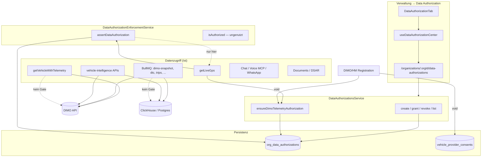

# Data Authorization Remediation — Baseline & Enforcement-Karte

**Prompt:** 1 von 44 (Production-Readiness „Verwaltung → Data Authorization / Datenfreigaben“)  
**Datum:** 2026-07-23  
**Repository:** `SYNQDRIVE-alpha` (`main` @ `546c4cb7`)  
**Scope:** Ist-Analyse ohne produktive Code-Änderungen  
**Methode:** Direkte Code-, Schema-, Test- und Dokumentations-Verifikation; keine ungeprüften Übernahmen aus früheren Audits

---

## Executive Summary

SynqDrive besitzt ein **Consent Center** auf Org-Ebene (`OrgDataAuthorization`) und ein separates **Provider-Consent-Ledger** pro Fahrzeug (`VehicleProviderConsent`). Frontend-Tab, CRUD-API, DIMO-System-Sync, Risiko-Scoring und ein **Enforcement-Service** sind implementiert.

**Kernbefund:** Die UI und die Datenmodelle versprechen **org-weite, zweck- und kategoriegebundene Datenfreigaben** mit Widerruf, Audit und Scope-Kontrolle. Die **tatsächliche Durchsetzung** ist auf **einen einzigen Lese-Pfad** beschränkt: `GET .../vehicles/:vehicleId/live-gps` (inkl. WhatsApp-AI-Tool, das diesen Pfad nutzt). Telemetrie-Ingestion, Trips, Health, DTC, Alerts, Exporte, Dokumente, AI/Agent/MCP und alle BullMQ-Worker laufen **ohne** `assertDataAuthorization`.

Zusätzlich **auto-aktiviert** `ensureDimoTelemetryAuthorization` DIMO-Systemfreigaben beim Fahrzeug-Connect bzw. auf Read-Pfaden — ein implizites Consent-Modell, das mit explizitem Grant/Revoke in der UI kollidiert.

**Production-Blocker (P0):** siehe Abschnitt 7 — insbesondere fehlende Enforcement-Abdeckung und UI-/Backend-Widerrufslücke.

---

## 1. Ist-Architektur

### 1.1 Zwei parallele Consent-Schichten

| Schicht | Modell | Zweck | Runtime-Enforcement |
|---------|--------|-------|---------------------|
| **Org Consent Center** | `OrgDataAuthorization` | Zweck-, Kategorie-, Scope- und Risiko-basierte Freigaben (DIMO-System + manuelle Partner/Kunden) | **Nur Live-GPS** |
| **Provider Ledger** | `VehicleProviderConsent` | DIMO/HM-Zugriffsereignis pro Fahrzeug (Billing, Connectivity-UI) | **Kein Read-Gate** |

Die Schichten werden bei Registration/Webhook **unabhängig** beschrieben, sind aber **nicht** über einen gemeinsamen Enforcement-Pfad verknüpft.

### 1.2 Produktflächen

| Fläche | Pfad / Einstieg | Rolle |
|--------|-----------------|-------|
| **Admin Tab** | `frontend/src/rental/components/settings/data-authorization/DataAuthorizationTab.tsx` | KPIs, Filter, Tabelle, Create/Grant/Revoke, Detail-Drawer |
| **Tab-Shell** | `SettingsView` → `AdministrationTabBar` (`data-authorization`) | Kein eigener URL-Route; Session-State `synqdrive_rental_settings_tab` |
| **Navigation** | `Sidebar.tsx` → Verwaltung → „Data Authorization & Consent“ | Setzt `settingsTab = 'data-authorization'` |
| **Help Center** | `HelpCenterView.tsx` | Artikel „Data Authorization & Consent Center“ |
| **Fleet Connectivity** | Fleet-Tab, Provider-Link-State | **Read-only** Hinweis auf Authorization-Status; keine Grant/Revoke-Aktionen |
| **Integrations / WhatsApp** | `integrations.controller.ts`, `whatsapp.controller.ts` | IAM `data-authorization.manage` für Connect/Disconnect — **nicht** Org-Consent-Records |
| **Master Architektur** | `ArchitekturView.tsx`, `ChangesView.tsx` | Live-Dokumentation der API und DIMO-Sync |

### 1.3 Backend-Modul

```
backend/src/modules/data-authorizations/
├── data-authorizations.controller.ts       # CRUD + grant/revoke + stats + audit-log + sync
├── data-authorizations.service.ts          # Lifecycle, DIMO ensure, Audit
├── data-authorization-enforcement.service.ts  # assertDataAuthorization / isAuthorized
├── data-authorization.constants.ts         # Kategorien, Zwecke, DIMO_TELEMETRY Spec
├── data-authorization-risk.util.ts           # Risiko-Normalisierung
├── data-authorization-validation.util.ts     # Scope-ID-Validierung
├── data-authorization.exceptions.ts          # DataAuthorizationDeniedException
├── data-authorizations.module.ts
└── dto/                                      # create, update, grant, revoke, list query
```

**Verwandtes Modul:**

```
backend/src/modules/vehicles/
├── vehicle-provider-consent.service.ts       # DIMO/HM Ledger (fire-and-forget)
└── vehicles.service.ts                       # getLiveGps (einziger Enforcement-Consumer)
```

**Guards auf Consent-Center-API:** `OrgScopingGuard` + `RolesGuard` + `PermissionsGuard`  
**Permission-Modul:** `data-authorization` mit `read` | `write` | `manage`

### 1.4 Enforcement-Topologie (vereinfacht)



### 1.5 Abhängigkeiten (NestJS DI)

```
AppModule
  └── DataAuthorizationsModule (exports: Service + Enforcement)
        └── importiert in VehiclesModule

VehiclesModule
  ├── VehiclesService (injiziert beide Data-Auth-Services)
  └── VehicleProviderConsentService

HighMobilityModule
  └── VehicleProviderConsentService (zusätzliche Provider-Registrierung)
```

---

## 2. Relevante Dateien und Module

### 2.1 Frontend (Consent Center)

| Datei | Rolle |
|-------|-------|
| `frontend/src/rental/components/settings/data-authorization/DataAuthorizationTab.tsx` | Haupt-UI |
| `frontend/src/rental/components/settings/data-authorization/useDataAuthorizationCenter.ts` | Einziger React-Hook; alle API-Aufrufe |
| `frontend/src/rental/components/settings/data-authorization/DataAuthorizationDetailDrawer.tsx` | Detail, Audit-Timeline, Grant/Revoke |
| `frontend/src/rental/components/settings/data-authorization/DataAuthorizationCreateDialog.tsx` | Manuelle Freigabe (startet PENDING) |
| `frontend/src/rental/components/settings/data-authorization/DataAuthorizationRevokeDialog.tsx` | Widerruf mit Grund |
| `frontend/src/rental/components/settings/data-authorization/data-authorization.constants.ts` | Labels, Optionen, DIMO-Helfer |
| `frontend/src/rental/components/settings/data-authorization/data-authorization.utils.ts` | Client-Filter, Query-Mapping |
| `frontend/src/rental/components/settings/data-authorization/data-authorization.badges.tsx` | Status/Risk/Source Chips |
| `frontend/src/rental/components/DataAuthorizationTab.tsx` | Re-Export |
| `frontend/src/rental/components/SettingsView.tsx` | Tab-Host, RBAC `canWrite`/`canManage` |
| `frontend/src/rental/components/settings/AdministrationTabBar.tsx` | Tab-Reihenfolge |
| `frontend/src/rental/components/settings/settingsTypes.ts` | `SettingsTab` Union |
| `frontend/src/rental/components/users-roles/constants.ts` | Permission-Modul-Key |
| `frontend/src/lib/api.ts` | `api.dataAuthorizations.*` Client + DTOs |

### 2.2 Backend (Consent Center + Enforcement)

| Datei | Rolle |
|-------|-------|
| `backend/src/modules/data-authorizations/data-authorizations.controller.ts` | REST-API |
| `backend/src/modules/data-authorizations/data-authorizations.service.ts` | Business-Logik, DIMO-Sync, Audit |
| `backend/src/modules/data-authorizations/data-authorization-enforcement.service.ts` | Runtime-Gate |
| `backend/src/modules/data-authorizations/data-authorization.constants.ts` | Taxonomie + `DIMO_TELEMETRY_AUTHORIZATION` |
| `backend/src/modules/data-authorizations/data-authorization-risk.util.ts` | Risiko-Berechnung |
| `backend/src/modules/data-authorizations/data-authorization-validation.util.ts` | Scope-Validierung |
| `backend/src/modules/data-authorizations/dto/*.ts` | Input-Validierung |
| `backend/src/modules/vehicles/vehicle-provider-consent.service.ts` | Provider-Ledger |
| `backend/src/modules/vehicles/vehicles.service.ts` | `getLiveGps`, `getVehicleWithTelemetry`, DIMO-Registration |
| `backend/src/modules/vehicles/vehicles.controller.ts` | Telemetry + Live-GPS Endpoints |
| `backend/src/modules/vehicles/connectivity/domain/provider-link-evidence.assembler.ts` | UI-Signal aus Consent + Org-Auth |
| `backend/src/modules/dimo/device-connection-episode-resolution/vehicle-connectivity-runtime-projection.service.ts` | Lädt Org-Auth für Runtime-Projection |
| `backend/src/modules/high-mobility/high-mobility-webhook.service.ts` | HM Consent record/revoke |
| `backend/src/modules/billing/billable-vehicles.service.ts` | Billing via `VehicleProviderConsent` |
| `backend/src/modules/integrations/integrations.controller.ts` | IAM `data-authorization.manage` |
| `backend/src/modules/whatsapp/whatsapp.controller.ts` | IAM `data-authorization.manage` |
| `backend/src/modules/whatsapp/whatsapp-ai-tools.service.ts` | GPS via `getLiveGps` (enforced) |
| `backend/src/modules/support/support.service.ts` | Ticket-Kontext-Validierung Org-Auth-ID |
| `backend/src/shared/auth/permission.constants.ts` | Modul-Key |
| `backend/src/modules/users/defaults/organization-role.defaults.ts` | Default-Rollen-Matrix |

### 2.3 Schema & Migrationen

| Datei | Inhalt |
|-------|--------|
| `backend/prisma/schema.prisma` | `OrgDataAuthorization`, `VehicleProviderConsent`, Enums |
| `backend/prisma/migrations/20260617180000_data_authorization_consent_center/migration.sql` | Consent-Center-Tabelle + Enums |
| `backend/prisma/migrations/20260412040000_audit_consent_provenance/migration.sql` | `vehicle_provider_consents` |
| `backend/prisma/migrations/20260613210000_vendor_management_overhaul/migration.sql` | Drop `partner_data_authorizations` |

### 2.4 Worker / Queues (ohne Data-Auth-Check)

| Processor | Queue | Datenkategorien betroffen |
|-----------|-------|---------------------------|
| `dimo-snapshot.processor.ts` | `DIMO_SNAPSHOT` | TELEMETRY, GPS, Trips, Battery |
| `dimo-dtc.processor.ts` | DTC_POLL | DTC_CODES, HEALTH_SIGNALS |
| `dimo-vehicle-sync.processor.ts` | DIMO_VEHICLE_SYNC | VEHICLE_IDENTITY |
| `trip-tracking.processor.ts` | TRIP_TRACKING | TRIP_DATA, GPS |
| `trip-behavior-enrichment.processor.ts` | TRIP_BEHAVIOR_ENRICHMENT | DRIVING_BEHAVIOR |
| `driving-impact.processor.ts` | DRIVING_IMPACT_COMPUTE | DRIVING_BEHAVIOR |
| `driving-intelligence-job.processor.ts` | DRIVING_INTELLIGENCE | Misuse/Analytics |
| `battery-v2.processor.ts` | BATTERY_V2 | HEALTH_SIGNALS |
| `notification-evaluation.processor.ts` | NOTIFICATION_EVALUATION | ALERTS |
| `notification-delivery.processor.ts` | NOTIFICATION_DELIVERY | ALERTS |
| `booking-document-generation.processor.ts` | BOOKING_DOCUMENT_GENERATION | DOCUMENT_DATA |
| `device-connection-webhook.processor.ts` | CONNECTIVITY_WEBHOOK | Connectivity |

### 2.5 Tests

| Datei | Tests |
|-------|-------|
| `data-authorizations.service.spec.ts` | 6 (DIMO ensure, stats) |
| `data-authorization-enforcement.service.spec.ts` | 4 (CONNECTED_VEHICLES, expired, denied) |
| `data-authorization-risk.util.spec.ts` | 6 (normalize, risk levels) |
| `iam-endpoint-enforcement-triage.security.spec.ts` | Indirekt: Integrations/WhatsApp `data-authorization.manage` |

### 2.6 Dokumentation (vorhanden, kein dediziertes Architektur-Doc)

| Datei | Relevanz |
|-------|----------|
| `frontend/src/master/components/ArchitekturView.tsx` | Live-Architektur-Eintrag |
| `frontend/src/master/components/ChangesView.tsx` | Changelog V4.8.42–V4.8.76 |
| `architecture/ARCHITECTURE_REVIEW_2026-04-10.md` | `org_data_authorizations` „structural only“ |
| `architecture/IAM_ENDPOINT_ENFORCEMENT_TRIAGE_2026-07-21.md` | Integrations-Härtung |
| `architecture/LEGAL_DOCUMENT_DELIVERY_EVIDENCE_2026-07-22.md` | Abgrenzung Legal vs Data Auth vs Provider Consent |
| `docs/audits/fleet-connectivity-production-readiness-2026-07.md` | FC-P1-03 Consent-Ledger-Lücke |
| `docs/audits/data/iam-endpoint-enforcement-matrix-2026-07.csv` | 7 Data-Auth-Mutationen OK (Decorator-Scan) |
| `docs/audits/data/iam-iso27001-control-alignment-2026-07.csv` | `supplier_third_party_access` PARTIAL |

---

## 3. Datenmodell

### 3.1 `OrgDataAuthorization` (`org_data_authorizations`)

**Enums:** `DataAuthorizationStatus`, `DataAuthorizationSourceType`, `DataAuthorizationProcessorType`, `DataAuthorizationRiskLevel`, `DataAuthorizationScope`, `DataAuthorizationAccessPattern`

| Feldgruppe | Felder | Hinweise |
|------------|--------|----------|
| Identität | `id`, `organizationId` | **Kein Prisma-FK** zu `organizations` |
| Klassifikation | `sourceType`, `processorType`, `processorName`, `riskLevel`, `moduleOrigin` | `riskLevel` serverseitig berechnet bei Create/Update |
| Zweck | `purpose` (string), `purposes` (JSON array) | Enforcement: leeres `purposes` → **alle Zwecke erlaubt** |
| Scope | `scope`, `vehicleIds`, `customerIds`, `bookingIds` (JSON) | `CONNECTED_VEHICLES` = DIMO-Fleet-Sync |
| Daten | `dataCategories` (JSON) | 13 kanonische + Legacy-Keys |
| Lifecycle | `status`, `granted*`, `revoked*`, `expiresAt` | Default `PENDING` |
| System | `systemKey`, `isSystemGenerated` | Unique `(organizationId, systemKey)` |
| Nutzung | `accessCount`, `lastAccessAt` | Nur bei `trackAccess: true` (Live-GPS) |
| Sonstiges | `destination`, `accessPattern`, `notes`, `revokeReason` | |

**System-Record:** `systemKey = 'DIMO_TELEMETRY'` — auto-erzeugt bei DIMO-Fahrzeugen.

### 3.2 `VehicleProviderConsent` (`vehicle_provider_consents`)

| Feld | Bedeutung |
|------|-----------|
| `vehicleId`, `organizationId` | FK mit Cascade |
| `provider` | `DIMO` \| `HIGH_MOBILITY` |
| `grantType` | DIMO_DIRECT, HM_FLEET_CLEARANCE, … |
| `status` | ACTIVE, REVOKED, EXPIRED, … |
| `scopes` | String-Array (hardcoded Defaults pro Provider) |
| `proofReference`, `proofHash` | HM-Nachweis |
| `grantedAt`, `revokedAt`, `expiresAt` | Lifecycle |

**Verwendung:** Billing (`billable-vehicles.service.ts`), Connectivity-UI, **nicht** Runtime-Enforcement.

### 3.3 Separate Domänen (nicht Org Consent Center)

| Modell | Zweck |
|--------|-------|
| `InsuranceDataAuthorizationLog` | Versicherer-Offenlegung (eigenes Modul) |
| `InsuranceLiveSharingPermission` | Live-Sharing Versicherung |
| ~~`partner_data_authorizations`~~ | **Entfernt** (Migration `20260613210000`) |

### 3.4 Taxonomie (Constants)

**Data Categories:** `GPS_LOCATION`, `TELEMETRY_DATA`, `VEHICLE_IDENTITY`, `VEHICLE_STATUS`, `ODOMETER`, `TRIP_DATA`, `DRIVING_BEHAVIOR`, `HEALTH_SIGNALS`, `DTC_CODES`, `BOOKING_DATA`, `CUSTOMER_DATA`, `FINANCIAL_DATA`, `DOCUMENT_DATA`

**Purposes:** `LIVE_MAP`, `TRIPS`, `VEHICLE_HEALTH`, `ALERTS`, `FLEET_ANALYTICS`, `RENTAL_ANALYTICS`, `TECHNICAL_OVERVIEW`, `ABUSE_MISUSE_DETECTION`, `DOCUMENT_PROCESSING`, `CUSTOMER_CONSENT`, `PARTNER_SERVICE`

**Source Types:** `DIMO`, `SYNQDRIVE_SYSTEM`, `CUSTOMER_CONSENT`, `PARTNER_ACCESS`, `MANUAL_UPLOAD`, `API_INTEGRATION`

---

## 4. Lifecycle

### 4.1 Manuelle Org-Freigabe

```mermaid
stateDiagram-v2
  [*] --> PENDING: POST create (manual)
  PENDING --> ACTIVE: POST grant (manage)
  PENDING --> REVOKED: POST revoke (manage)
  ACTIVE --> REVOKED: POST revoke (manage)
  ACTIVE --> EXPIRED: expiresAt passed
  REVOKED --> [*]: Kein Re-Grant auf gleichem Record
  note right of REVOKED: Update blockiert;\nNeuanlage erforderlich
```



1. **Create** (`POST /data-authorizations`, `write`): Status `PENDING`, Risiko berechnet, Scope-IDs validiert gegen Org
2. **Grant** (`POST /:id/grant`, `manage`): → `ACTIVE`, `grantedBy*` aus JWT
3. **Revoke** (`POST /:id/revoke`, `manage`): → `REVOKED`, idempotent; `audit.critical`
4. **Update** (`PATCH /:id`, `write`): Blockiert für `isSystemGenerated` und `REVOKED`

### 4.2 DIMO System-Authorization (`DIMO_TELEMETRY`)

1. **Trigger:** `ensureDimoTelemetryAuthorization(orgId)` auf jedem `findByOrg`, `findById`, `getStats`, vor `getLiveGps`
2. **Create:** Wenn DIMO-Fahrzeuge existieren und kein Record → `ACTIVE` + `CONNECTED_VEHICLES` scope
3. **Sync:** `vehicleIds` aus `vehicles WHERE dimoVehicleId IS NOT NULL`
4. **Status-Regeln:**
   - `REVOKED` → **nie** still reaktiviert; Scope wird aktualisiert
   - Fahrzeuge > 0 und nicht REVOKED → ggf. `ACTIVE`
   - Fahrzeuge = 0 → `PENDING`, Scope geleert
5. **Audit:** Nur bei Scope-Änderung (`void audit.record`)

### 4.3 Provider Consent (Vehicle-Level)

1. **DIMO:** `registerFromDimo` → `void providerConsent.recordDimoConsent` + `void ensureDimoTelemetryAuthorization`
2. **HM:** Webhook clearance approved → `void recordHmConsent`; revoke → `void revokeByProvider`
3. **Fehler:** Catch-and-log — blockiert nie Registration

### 4.4 Enforcement-Lifecycle (nur Live-GPS)

1. `ensureDimoTelemetryAuthorization` (kann Record erzeugen/aktivieren)
2. `assertDataAuthorization({ orgId, vehicleId, sourceType: DIMO, dataCategory: GPS_LOCATION, purpose: LIVE_MAP })`
3. Bei Erfolg + `trackAccess`: `accessCount++`, `lastAccessAt`
4. Bei Fehler: `DataAuthorizationDeniedException` (403) — **kein Audit-Eintrag**

---

## 5. Vorhandene und fehlende Enforcement Points

| Enforcement Point | IAM | OrgDataAuthorization | VehicleProviderConsent | Status |
|-------------------|-----|----------------------|------------------------|--------|
| Consent Center CRUD API | ✅ Guards + Permissions | N/A (Ledger selbst) | — | **OK** |
| `GET live-gps` | ✅ `fleet.read` | ✅ `assertDataAuthorization` | — | **WIRED** |
| WhatsApp AI GPS Tool | ✅ (via vehicles) | ✅ (via `getLiveGps`) | — | **WIRED** |
| `GET telemetry` (inkl. DIMO GPS refresh) | ✅ `fleet.read` | ❌ | ❌ | **MISSING** |
| Fleet Map / cached latestState | ✅ Org scope | ❌ | ❌ | **MISSING** |
| DIMO Snapshot Worker | — | ❌ | ❌ | **MISSING** |
| DIMO DTC Worker | — | ❌ | ❌ | **MISSING** |
| Trip Tracking / Enrichment | — | ❌ | ❌ | **MISSING** |
| Driving Impact / Misuse | — | ❌ | ❌ | **MISSING** |
| Vehicle Intelligence (Health, DTC APIs) | ✅ VehicleOwnership | ❌ | ❌ | **MISSING** |
| Battery V2 Worker | — | ❌ | ❌ | **MISSING** |
| Notification Pipeline | — | ❌ | ❌ | **MISSING** |
| Document Generation / AI OCR | ✅ Org/Booking IAM | ❌ | ❌ | **MISSING** |
| Org Chat (`chat.service.ts`) | ✅ `ai-assistant` | ❌ | ❌ | **MISSING** |
| Voice MCP Tools | ✅ Capability perms | ❌ | ❌ | **MISSING** |
| IAM DSAR Export | ✅ IAM | ❌ | ❌ | **MISSING** |
| Billing Billable Vehicles | — | ❌ | ✅ Ledger only | **Billing, not access** |
| Connectivity Runtime Projection | — | Read-only signal | Read-only signal | **Observability only** |
| Integrations Connect/Disconnect | ✅ `data-authorization.manage` | ❌ (IAM only) | — | **IAM ≠ Consent** |

**`isAuthorized()`:** implementiert, **0 Produktions-Call-Sites** — geplantes Gradual-Rollout nicht gestartet.

---

## 6. Vorhandene und fehlende Audits

### 6.1 Vorhanden

| Event | Mechanismus | Zuverlässigkeit |
|-------|-------------|-----------------|
| Manual create/update | `void audit.record` | Fire-and-forget |
| Grant | `void audit.record` | Fire-and-forget |
| Revoke | `void audit.critical` | Fire-and-forget |
| DIMO scope sync | `void audit.record` (nur bei Scope-Änderung) | Fire-and-forget |
| HM clearance | `void audit.record` in webhook | Fire-and-forget |
| Consent Center Audit-Log API | `activityLog WHERE entity = DATA_AUTHORIZATION` | Lesbar |
| Enforcement success | `accessCount` / `lastAccessAt` auf Auth-Row | Nur Live-GPS |
| IAM Endpoint Scan | 7 Mutationen → OK (Decorator) | Statisch, kein Service-Layer |

### 6.2 Fehlend

| Lücke | Risiko |
|-------|--------|
| **Denied access** nicht geloggt | Kein Nachweis bei DSGVO/ISO-Auskunft |
| Provider consent writes ohne Audit | Nur Logger |
| Worker-Ingestion ohne Consent-Audit | Keine Nachvollziehbarkeit welche Daten ohne Freigabe persistiert wurden |
| Kein dedizierter Consent-Audit-Retention-Policy | `RETENTION_ACTIVITY_LOGS_DAYS` kann History löschen |
| Kein ISO-Control-Mapping für Consent Center | IAM-Audit: `supplier_third_party_access` = PARTIAL |
| Kein Enforcement-Coverage-Report in CI | Regression unsichtbar |

---

## 7. Bestätigte Findings (P0–P3)

### P0 — Production-Blocker

| ID | Finding | Evidenz | Impact |
|----|---------|---------|--------|
| **DA-P0-01** | **Enforcement nur auf `getLiveGps`** — alle anderen Datenpfade (Ingestion, Trips, Health, DTC, Alerts, AI, Exporte) ohne `assertDataAuthorization` | `grep assertDataAuthorization` → 1 Call-Site in `vehicles.service.ts`; Enforcement-Service TODO-Kommentar bestätigt | Widerruf in UI blockiert faktisch nur Live-GPS; Rest verarbeitet weiter → **DSGVO Art. 7 Widerruf**, ISO A.5.34 |
| **DA-P0-02** | **Implizite Auto-Aktivierung** DIMO-System-Auth bei Connect/Read (`ensureDimoTelemetryAuthorization` → `ACTIVE`) ohne expliziten User-Grant | `data-authorizations.service.ts` L248–272, L299–306; `vehicles.service.ts` L2245 `void ensure...` | Widerspruch zu explizitem Consent-Center-Versprechen |
| **DA-P0-03** | **`getVehicleWithTelemetry` umgeht Enforcement** aber ruft DIMO `fetchLastSeenLocation` auf | `vehicles.service.ts` L1663–1698 vs L1766–1778 | GPS/Telemetrie ohne Consent-Check über `/telemetry` |
| **DA-P0-04** | **Zwei unverbundene Ledger** — `VehicleProviderConsent` und `OrgDataAuthorization` ohne gemeinsame Enforcement-Schicht | Separate Services; `getActiveConsent()` nie als Gate | Inkonsistente Wahrheit; Billing/Connectivity vs Consent Center |
| **DA-P0-05** | **Worker-Ingestion ignoriert REVOKED** — `dimo-snapshot`, `dimo-dtc`, trip workers persistieren unabhängig vom Consent-Status | Kein Import/Inject von Enforcement in `backend/src/workers/processors/*` | Widerruf wirkt nicht auf gespeicherte/abgeleitete Daten |

### P1 — Hoch (vor breitem Rollout)

| ID | Finding | Evidenz |
|----|---------|---------|
| **DA-P1-01** | UI verspricht Schutz für 13 Kategorien / 11 Zwecke; Enforcement deckt 1 Kombination ab (DIMO/GPS/LIVE_MAP) | Frontend constants vs Enforcement call site |
| **DA-P1-02** | Kein HM-spezifischer `OrgDataAuthorization` System-Key | Nur `DIMO_TELEMETRY` in constants |
| **DA-P1-03** | `VehicleProviderConsent` nicht in Fleet-Connectivity-Truth-Path (bestätigt FC-P1-03) | `fleet-connectivity-production-readiness-2026-07.md` |
| **DA-P1-04** | Leeres `purposes` JSON erlaubt alle Zwecke in Enforcement | `coversPurpose()` L129–131 |
| **DA-P1-05** | Kein FK `org_data_authorizations.organization_id` → `organizations` | `schema.prisma` — nur Spalte, keine Relation |
| **DA-P1-06** | Denied access ohne Audit-Trail | `assertDataAuthorization` wirft nur Exception |
| **DA-P1-07** | `isAuthorized()` ungenutzt — kein Gradual-Rollout-Pfad aktiv | Grep: 0 Call-Sites außer Definition |
| **DA-P1-08** | Create-UI sendet keine `vehicleIds`/`customerIds`/`bookingIds` trotz Scope-Auswahl | `DataAuthorizationCreateDialog` vs DTO |
| **DA-P1-09** | IAM `data-authorization.manage` auf Integrations/WhatsApp ≠ Org-Consent-Record | Separate Concerns nicht in UI erklärt |
| **DA-P1-10** | Keine Retention/Lösch-Policy für Consent-Records | Kein Scheduler für `org_data_authorizations` / `vehicle_provider_consents` |

### P2 — Mittel

| ID | Finding | Evidenz |
|----|---------|---------|
| **DA-P2-01** | Risk- und Kategorie-Filter nur client-seitig | `filterDataAuthorizations` nach Full-List-Fetch |
| **DA-P2-02** | KPI „Läuft bald ab“ setzt nur `status: ACTIVE`, nicht Expiry-Filter | `DataAuthorizationTab` KPI onClick |
| **DA-P2-03** | Tab sichtbar ohne Frontend-`read`-Permission-Check | `SettingsView` vs `rental-rules` Pattern |
| **DA-P2-04** | `getLiveGps` fail-open auf Cache bei DIMO-Fehler nach Auth-Check | `vehicles.service.ts` L1822–1830 |
| **DA-P2-05** | `orgDataAuthorization.findFirst` ohne `systemKey` in Connectivity-Projection | `vehicle-connectivity-runtime-projection.service.ts` L199 |
| **DA-P2-06** | `getActiveConsent` ohne `organizationId` in WHERE | `vehicle-provider-consent.service.ts` L152 |
| **DA-P2-07** | Activity-Log-Retention kann Consent-Audit löschen | `RETENTION_ACTIVITY_LOGS_DAYS` default 0, aber konfigurierbar |
| **DA-P2-08** | Kein dedizierter CI-Workflow / npm-Script für Data-Auth-Tests | Nur in generischem `jest` |
| **DA-P2-09** | `ensureDimoTelemetryAuthorization` Side-Effect auf Read-Pfaden (List/Stats) | Mutation bei GET-ähnlichen Flows |
| **DA-P2-10** | ISO27001 `supplier_third_party_access` = PARTIAL | `iam-iso27001-control-alignment-2026-07.csv` |

### P3 — Niedrig / UX

| ID | Finding | Evidenz |
|----|---------|---------|
| **DA-P3-01** | Gemischte i18n (DE hardcoded + EN Nav-Labels) | Tab-Inhalt vs `translations/de.ts` |
| **DA-P3-02** | Grant ohne Notes-UI trotz DTO-Feld | Detail-Drawer ruft `grant()` ohne Body |
| **DA-P3-03** | Kein Deep-Link von Fleet Connectivity → Data Authorization | Fleet-Connectivity-Audit UX-Gap |
| **DA-P3-04** | Kein Redis-Cache für Auth-Entscheidungen (Performance bei Rollout) | Kein Cache-Code gefunden |
| **DA-P3-05** | Deprecated PATCH grant/revoke noch exposed | Controller L123–163 |

---

## 8. Abweichungen UI-Versprechen vs. Durchsetzung

| UI-Versprechen | Ist-Durchsetzung | Abweichung |
|----------------|------------------|------------|
| „Data Authorization & Consent Center“ verwaltet Datenfreigaben für Telemetrie, Trips, Health, DTC, Alerts | Nur Live-GPS enforced | **Kritisch** |
| Widerruf blockiert „Zugriff für Verarbeitungszwecke“ | Worker/APIs außer Live-GPS laufen weiter | **Kritisch** |
| DIMO Telemetry Authorization erklärt GPS/Telemetrie/Trips/Health/DTC | Enforcement nur GPS_LOCATION + LIVE_MAP | **Hoch** |
| Scope VEHICLE/CUSTOMER/BOOKING wählbar | Create-UI ohne Entity-ID-Felder | **Hoch** |
| KPI „Läuft bald ab“ filtert Expiry | Filtert nur ACTIVE | **Mittel** |
| Risk/Category-Filter | Server liefert ungefiltert; Client filtert | **Mittel** |
| Fleet Connectivity zeigt Authorization-Status | Read-only; kein Enforcement-Link | **Mittel** |
| Help: „Fleet Connectivity ist read-only; authorize/revoke hier“ | Korrekt für UI; Backend ignoriert Revoke fast überall | **Kritisch** |
| Sub-Admin: `data-authorization` read-only | Korrekt im Backend | **OK** |
| `hasActiveScope` / `scopeStatus` defensive Felder | Backend liefert; UI zeigt — Enforcement nutzt Scope | **OK (UI)** / **Lücke (Enforcement)** |

---

## 9. Bestehende Tests und Testlücken

### 9.1 Vorhanden (16 Unit-Tests, alle grün)

```
PASS data-authorization-enforcement.service.spec.ts (4)
PASS data-authorization-risk.util.spec.ts (6)
PASS data-authorizations.service.spec.ts (6)
```

**Abgedeckt:** DIMO ensure Contract, create/skip/revoke-not-reactivate, stats aggregation, CONNECTED_VEHICLES allow/deny, expired deny, risk normalization.

### 9.2 Lücken

| Bereich | Fehlende Tests |
|---------|----------------|
| Controller / API | Keine Security-Specs, kein IDOR, kein Permission-Matrix pro Endpoint |
| Lifecycle | create, grant, revoke, update, audit-log — untestet |
| Validation util | `validateScopeEntityIds`, `assertFutureExpiresAt` — untestet |
| Enforcement | ORGANIZATION/VEHICLE/CUSTOMER/BOOKING scopes, empty purposes, processorType, trackAccess |
| Integration | `getLiveGps` + enforcement, `getVehicleWithTelemetry` bypass |
| VehicleProviderConsent | **0 Tests** |
| Frontend | **0 Tests** (Hook, Filter, Dialoge) |
| E2E | Keine Playwright/API-E2E |
| Worker | Keine Consent-Gate-Tests |
| CI | Kein `test:data-authorization` Script / Workflow |

---

## 10. Migrationsrisiken

| Risiko | Beschreibung | Mitigation (für spätere Prompts) |
|--------|--------------|----------------------------------|
| **MR-01** | Aktivierung Enforcement auf Ingestion kann bestehende REVOKED-Orgs mit laufenden Workern treffen | Feature-Flag + `isAuthorized` Shadow-Mode zuerst |
| **MR-02** | `ensureDimoTelemetryAuthorization` auto-ACTIVE widerspricht explizitem Consent | Migration: bestehende Records auf PENDING + Admin-Grant-Flow |
| **MR-03** | Kein FK auf `organization_id` — verwaiste Records möglich | Optional: FK-Migration + Cleanup |
| **MR-04** | Legacy category keys in DB vs kanonische Enforcement-Normalisierung | `normalizeDataCategories` bereits vorhanden; Regression-Tests nötig |
| **MR-05** | Zwei Ledger müssen konsolidiert oder verknüpft werden | Architektur-Entscheidung vor Schema-Änderung |
| **MR-06** | Worker-Stop bei Revoke erfordert Queue-Cancellation-Design | Nicht trivial — Polling läuft fleet-weit |
| **MR-07** | `partner_data_authorizations` bereits gedroppt | Keine Rückmigration; Partner-Flow nur über OrgDataAuthorization |
| **MR-08** | Activity-Log-Retention vs Consent-Nachweis | Legal-Hold oder separates Audit-Archiv |

---

## 11. Bereiche mit Fire-and-Forget

| Ort | Pattern | Risiko |
|-----|---------|--------|
| `vehicles.service.ts` L2113 | `void providerConsent.recordDimoConsent` | Consent-Ledger-Lücke bei Fehler |
| `vehicles.service.ts` L2245 | `void ensureDimoTelemetryAuthorization` | System-Auth evtl. nicht erzeugt |
| `high-mobility-webhook.service.ts` | `void recordHmConsent` / `void revokeByProvider` | HM-Ledger inkonsistent |
| `data-authorizations.service.ts` | `void audit.record` / `void audit.critical` (5 Stellen) | Audit-Verlust bei DB-Fehler |
| `vehicle-provider-consent.service.ts` | Catch-and-log in allen Writes | Stille Consent-Lücken |
| DIMO Registration → Battery/Trip Side-Effects | `void enqueue...` | Unabhängig von Consent |

---

## 12. Bereiche mit Fail-Open-Verhalten

| Ort | Verhalten |
|-----|-----------|
| `getLiveGps` | Nach erfolgreichem Auth-Check: DIMO-Fehler → cached GPS zurück (L1822–1830) |
| `getVehicleWithTelemetry` | DIMO-Fehler → cached coords; **kein Auth-Check überhaupt** |
| `coversPurpose` | Leeres `purposes` → `return true` (alle Zwecke) |
| `coversProcessor` | Fehlender `processorType` auf Row → `return true` |
| `getLiveGps` ohne `organizationId` | Enforcement-Skip (interner API-Risiko-Pfad; Controller übergibt immer orgId) |
| Alle Worker | Kein Gate → Daten werden immer persistiert wenn DIMO/HM liefert |
| `isAuthorized` | Nicht verwendet — kein Soft-Deny-Pfad |
| Provider consent service | Fehler → `return null` / log only — Registration geht weiter |

---

## 13. Bereiche mit unkontrolliertem `findFirst`

| Datei | Query | Bewertung |
|-------|-------|-----------|
| `data-authorizations.service.ts` | `findFirst({ id, organizationId })` | ✅ Org-scoped |
| `support.service.ts` | `findFirst({ id, organizationId })` | ✅ Org-scoped |
| `vehicle-connectivity-runtime-projection.service.ts` | `findFirst({ organizationId, sourceType: DIMO, status: ACTIVE })` — **ohne `systemKey`** | ⚠️ Kann falschen DIMO-Record matchen |
| `vehicle-provider-consent.service.ts` | `findFirst({ vehicleId, provider, status: ACTIVE })` — **ohne `organizationId`** | ⚠️ Annahme global unique vehicleId |
| `vehicles.service.ts` | `findFirst({ id, organizationId? })` — org optional | ⚠️ Interner Bypass wenn org fehlt |
| `data-authorization-enforcement.service.ts` | `findMany` + In-Memory-Filter | ✅ Org-scoped; Performance-Risiko bei vielen Records |

---

## 14. Client-vertraute Actor- oder Scope-Daten

| Input | Vertrauen | Server-Kontrolle |
|-------|-----------|------------------|
| `CreateDataAuthorizationDto.scope` | Client | Validiert gegen erlaubte Enums + `validateScopeEntityIds` |
| `purposes`, `dataCategories` | Client | Whitelist-Validierung; Risiko serverseitig neu berechnet |
| `vehicleIds`, `customerIds`, `bookingIds` | Client | UUID-Format + Org-Zugehörigkeit geprüft (wenn gesendet) |
| `sourceType`, `processorType` | Client | Enum-Validierung |
| `grantedById` / `revokedById` | **JWT** | ✅ Aus `req.user`, nicht aus Body |
| `ensureDimoTelemetryAuthorization` | System | Hardcoded Spec — nicht client-gesteuert |
| `recordDimoConsent` scopes | System | Default `['telemetry','location','dtc','snapshot']` |
| `recordHmConsent` scopes | System | Default `['health','tire_pressure','service_info']` |
| UI Create-Dialog | Client | Sendet **keine** Scope-Entity-IDs → Backend akzeptiert leere VEHICLE-Scopes nicht, aber UI sendet ORGANIZATION default |

---

## 15. Sichere Umsetzungsreihenfolge (Empfehlung für Prompts 2–44)

### Phase A — Architektur & Messung (keine harten Gates)

1. **Enforcement-Matrix** als Code-Artefakt + CI-Check (jeder Datenpfad → category/purpose/source)
2. **`isAuthorized` Shadow-Mode** in Workers (log-only denied) ohne Block
3. **Denied-Access-Audit** + Legal-Hold für Consent-`activity_logs`
4. **Ledger-Konsolidierungs-Design** (OrgDataAuthorization vs VehicleProviderConsent)
5. **Dokumentation** `architecture/DATA_AUTHORIZATION_*.md` + ISO-Control-Mapping

### Phase B — Read-Path Enforcement

6. `getVehicleWithTelemetry` / Fleet-Map GPS — gleiche Checks wie Live-GPS
7. Vehicle Intelligence Read-APIs (Trips, Health, DTC) — pro Kategorie/Purpose
8. AI-Tools (Chat, Voice MCP, WhatsApp status) — Telemetry-Kontext
9. Export/DSAR — Consent-Nachweis in Export-Payload

### Phase C — Write-Path / Ingestion Enforcement

10. `dimo-snapshot.processor` — Gate vor Persist (TELEMETRY_DATA)
11. `dimo-dtc.processor` — DTC_CODES / HEALTH_SIGNALS
12. Trip + Driving-Behavior Worker
13. Notification-Evaluation — ALERTS purpose
14. HM-Ingestion — eigener System-Key + Enforcement

### Phase D — Consent-Lifecycle-Härtung

15. **Expliziter Grant-Flow** für DIMO (kein Auto-ACTIVE auf Connect)
16. Revoke → Worker-Suppression / Queue-Skip für betroffene Vehicles
17. FK + Retention-Policy für Consent-Records
18. Frontend: Scope-Entity-Picker, Server-Filter, KPI-Fixes, i18n

### Phase E — Production Readiness

19. Integration + E2E Tests + dedizierter CI-Workflow
20. Staging-Verifikation mit REVOKED-Org
21. Post-Remediation-Readiness-Audit (wie Legal Documents / Fleet Connectivity)

**Abhängigkeit:** Phase C ohne Phase A/B-Messung riskiert Produktions-Ausfall; Phase D.15 ist politisch sensibel (Bestandskunden mit implizitem ACTIVE).

---

## Anhang A — API-Endpunkte (verifiziert)

| Method | Path | Permission |
|--------|------|------------|
| GET | `/organizations/:orgId/data-authorizations` | read |
| GET | `/organizations/:orgId/data-authorizations/stats` | read |
| GET | `/organizations/:orgId/data-authorizations/audit-log` | read |
| POST | `/organizations/:orgId/data-authorizations/sync-system-authorizations` | manage |
| GET | `/organizations/:orgId/data-authorizations/:id` | read |
| POST | `/organizations/:orgId/data-authorizations` | write |
| PATCH | `/organizations/:orgId/data-authorizations/:id` | write |
| POST/PATCH | `.../:id/grant` | manage |
| POST/PATCH | `.../:id/revoke` | manage |

**Runtime-Enforcement-Endpunkt:**

| Method | Path | Permission | Enforcement |
|--------|------|------------|-------------|
| GET | `/organizations/:orgId/vehicles/:vehicleId/live-gps` | fleet.read | ✅ |
| GET | `/organizations/:orgId/vehicles/:vehicleId/telemetry` | fleet.read | ❌ |

---

## Anhang B — Durchgeführte Prüfungen

- [x] Vollständiger Code-Grep: `assertDataAuthorization`, `isAuthorized`, `OrgDataAuthorization`, `VehicleProviderConsent`
- [x] Lesen aller Data-Authorization-Backend-Module + DTOs + Constants
- [x] Lesen Frontend Consent-Center (Tab, Hook, Dialoge, API-Client)
- [x] Prisma-Schema + Migrationen `20260617180000`, `20260412040000`, `20260613210000`
- [x] Worker-Inventory (`backend/src/workers/processors/*.ts`) — kein Enforcement
- [x] Vehicles-Service: `getLiveGps` vs `getVehicleWithTelemetry`
- [x] IAM-Matrix-Zeilen 219–225 + ISO-Alignment CSV
- [x] Fleet-Connectivity-Audit Cross-Check FC-P1-03
- [x] Unit-Tests ausgeführt: `npm test -- --testPathPattern=data-authorization` → 16/16 PASS
- [x] CI: nur `legal-documents-production-readiness.yml`; kein Data-Auth-Workflow
- [x] Git-Stand: `main` @ `546c4cb7`

---

## Anhang C — Changes / Architektur

**Changes:** nicht aktualisiert (Analyse-only, keine Implementierung)  
**Architektur (Synqdrive Code → Architektur):** nicht aktualisiert (Analyse-only)

---

*Erstellt als Remediation-Baseline für die 44-Prompt-Serie „Verwaltung → Data Authorization / Datenfreigaben“.*
