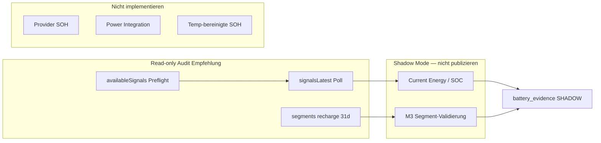

# DIMO Tesla HV Signal Capability Audit — KS FH 660E

| Feld | Wert |
|------|------|
| **Dokumenttyp** | Read-only DIMO/Tesla HV Capability Audit (Prompt 9) |
| **Auditzeitpunkt (UTC)** | 2026-07-16T13:03:44Z |
| **Repository-Git-Commit (Erstellung)** | `54b8cf886450e24895409e605aae724caff2e40f` |
| **VPS-Deploy-Commit (Laufzeit)** | `2cd57c8` |
| **Umgebung** | Produktion VPS `app.synqdrive.eu`; read-only GraphQL + Postgres-SELECT |
| **Fahrzeug** | KS FH 660E — Tesla Model 3 (2023), BEV |
| **DIMO tokenId** | `186946` |
| **Token DID (maskiert)** | `did:erc721:137:0xbA5738a18d83D41…186946` |
| **Status** | **Abgeschlossen** — keine produktiven Änderungen |

---

## 1. Auditzeitpunkt und Git-Commit

- **Audit ausgeführt:** 2026-07-16T13:03:44Z (VPS read-only Script)
- **Repo-Commit bei Erstellung:** `54b8cf8`
- **VPS deployed:** `2cd57c8`
- **Methodik:** Offizielle DIMO-Dokumentation (Telemetry API Signals/Segments/Vehicle Triggers) + live GraphQL gegen DIMO + Vergleich mit `hv_battery_health_snapshots` (read-only)

---

## 2. Untersuchte Umgebung

| Parameter | Wert |
|-----------|------|
| Backend-Auth | Bestehender DIMO Web3-Challenge-Flow (`dimo-auth.service.ts` Pattern) |
| Telemetry-Endpoint | `https://telemetry-api.dimo.zone/query` |
| Token-Exchange | `https://token-exchange-api.dimo.zone/v1/tokens/exchange` |
| Vehicle Triggers | `GET https://vehicle-triggers-api.dimo.zone/v1/webhooks/signals` |
| Postgres | Read-only Queries auf `hv_battery_health_snapshots`, `vehicles`, `dimo_vehicles` |
| Zeitraum Segmente/Zeitreihen | 31 Tage (2026-06-15 … 2026-07-16) |
| Keine Änderungen | Kein DB-Write, kein Webhook, kein Worker-Restart, keine Queue/Jobs |

---

## 3. Fahrzeug und DIMO-Integration

| Feld | Wert |
|------|------|
| **Interne Vehicle-ID** | `68868291-5478-42cd-b0c4-cc77b2a78e21` |
| **Organization-ID** | `faa710c9-6d91-4079-a7d5-91fdccdec14a` |
| **Kennzeichen** | KS FH 660E |
| **Marke / Modell / Jahr** | Tesla Model 3 / 2023 |
| **fuelType** | `ELECTRIC` |
| **DIMO tokenId** | `186946` |
| **dimoExternalId** | `186946` |
| **Integration** | DIMO Vehicle NFT (Polygon `chainId: 137`, Contract per `DIMO_VEHICLE_NFT_CONTRACT`) |
| **Battery-Spec (Repo)** | Lithium-Ion (`battery_specs`) |
| **Referenzkapazität (nur Repo-belegt)** | `vehicles.hv_battery_capacity_kwh = 57` — **nicht** unabhängig am Fahrzeug verifiziert; für SOH-Prozent nur mit Vorbehalt |
| **powertrainType (dimo_vehicles)** | `null` |

**Hinweis Referenzkapazität:** 57 kWh stammt ausschließlich aus dem SynqDrive-Fahrzeugdatensatz und früheren Audits. Keine Tesla-VIN-Dekodierung oder Werkstattnachweis in diesem Audit. SOH-Prozentwerte werden daher **explizit als Schätzung gegen Repo-Referenz** gekennzeichnet, nicht als kalibrierte Wahrheit.

---

## 4. Dokumentations-Delta (Teil A)

### 4.1 Schema-Änderung gegenüber älteren Annahmen

| Thema | Frühere Annahme / SynqDrive-Code | Aktueller Stand (2026-07 DIMO Docs + Live-Schema) |
|-------|-----------------------------------|---------------------------------------------------|
| `availableSignals` | Sub-Feld von `signalsLatest` | **Separates Root-Query:** `query { availableSignals(tokenId: N) }` |
| `signalsLatest` | Enthält `availableSignals` | Nur `SignalCollection` mit `lastSeen` + Signal-Feldern |
| `source` auf SignalFloat | Teilweise erwartet | **Nicht** in Standard-`{ timestamp value }`-Abfrage verfügbar; `SignalFilter` optional auf Query-Ebene |
| Segmente `after` | Pagination-Cursor | `after: Time` — nur Segmente mit `startTime > after` |
| Recharge-Mechanismus | SOC + Charging-Signale | Dokumentiert als Hybrid-Erkennung (`minIncreasePercent` default 15 %) |

### 4.2 HV-relevante Signale — Dokumentationsmatrix

| Signal | Einheit | Semantik (DIMO) | Agg. (`signals`) | `signalsLatest` | Historisch | Session/SOH-Nutzen | Risiken |
|--------|---------|-----------------|------------------|-----------------|------------|-------------------|---------|
| `availableSignals` | — | Liste querybarer Signalnamen mit gespeicherten Daten | — | **Root-Query** | Nein | Preflight vor Pipeline | Nicht unter `signalsLatest` |
| `lastSeen` | UTC | Letzter Signalzeitpunkt (Filter) | — | Ja | Nein | Freshness | ≠ neue Messung |
| `powertrainTractionBatteryStateOfHealth` | % | SOH 0–100 vs. Nennkapazität | FloatAggregation | Ja | Ja | **Direkter Provider-SOH** | Tesla liefert nicht |
| `powertrainTractionBatteryGrossCapacity` | kWh | Bruttokapazität | FloatAggregation | Ja | Ja | Referenzkapazität | Tesla liefert nicht; Semantik gross vs. net unklar |
| `powertrainTractionBatteryStateOfChargeCurrent` | % | Physische SOC (net) | FloatAggregation | Ja | Ja | Sessiongrenzen, Kapazität | Nicht Display-SOC |
| `powertrainTractionBatteryStateOfChargeCurrentEnergy` | kWh | Verbleibende Energie (phys. SOC) | FloatAggregation | Ja | Ja | **Kapazitätsschätzung M2** | Feldname irreführend |
| `powertrainTractionBatteryChargingAddedEnergy` | kWh | Session-kumulierte Energie | FloatAggregation | Ja | Ja | **Kapazität M3**, Session-Energie | Resets, Inlet vs. Pack unklar |
| `powertrainTractionBatteryChargingIsCharging` | 0/1 | Laden aktiv | FloatAggregation | Ja | Ja | Session-Start/Ende | Flanken spärlich in 1m-Buckets |
| `powertrainTractionBatteryChargingIsChargingCableConnected` | 0/1 | Kabel verbunden | FloatAggregation | Ja | Ja | Session-Kontext | Bleibt nach Laden ggf. 0 |
| `powertrainTractionBatteryChargingPower` | kW | Ladeleistung Pack | FloatAggregation | Ja | Ja | M4 Integration | **Tesla: nicht geliefert** |
| `powertrainTractionBatteryCurrentPower` | W | Pack-Leistung ± | FloatAggregation | Ja | Ja | M5 Validierung | Einheit W; oft 0 im Stand |
| `powertrainTractionBatteryCurrentVoltage` | V | Packspannung | FloatAggregation | Ja | Ja | Kontext | Tesla: nicht geliefert |
| `powertrainTractionBatteryTemperatureAverage` | °C | Packtemperatur | FloatAggregation | Ja | Ja | Temp.-Korrektur | **Tesla: nicht geliefert** |
| `powertrainTractionBatteryRange` | km | EV-Reichweite | FloatAggregation | Ja | Ja | Kontext | Tesla: nicht in availableSignals |
| `powertrainTractionBatteryChargingChargeLimit` | % | Ladelimit SOC | FloatAggregation | Ja | Ja | Session-Kontext | Oft statisch 100 |
| `powertrainTractionBatteryChargingChargeCurrentAC` | A | AC-Strom RMS | FloatAggregation | Ja | Ja | Ladeart | 0 wenn nicht AC-ladend |
| `powertrainTractionBatteryChargingChargeVoltageUnknownType` | V | Lade-Spannung (Typ unbekannt) | FloatAggregation | Ja | Ja | Ladeart | Semantik bei Tesla unklar (1.65 V beobachtet) |
| `powertrainRange` | km | Reichweite alle Quellen | FloatAggregation | Ja | Ja | Kontext | **Stale** (Mai 2026) |
| `speed` | km/h | Geschwindigkeit | FloatAggregation | Ja | Ja | Fahrzustand | — |
| `exteriorAirTemperature` | °C | Außentemperatur | FloatAggregation | Ja | Ja | **Einziger Temp.-Proxy** | Kein Pack-Temp. |
| `powertrainTransmissionTravelledDistance` | km | Kilometerstand | FloatAggregation | Ja | Ja | Kontext | — |

---

## 5. Tesla Available-Signals-Matrix (Teil B)

**Abfrage:** `availableSignals(tokenId: 186946)` + `signalsLatest` für alle dokumentierten HV-Felder.

| Ergebnis | Anzahl |
|----------|--------|
| Gesamt `availableSignals` | **26** |
| Davon HV-relevant (Audit-Liste) | **13** in `availableSignals` |

### Klassifikation je dokumentiertem Signal

| Signal | Klassifikation | In `availableSignals` | Anmerkung |
|--------|----------------|------------------------|-----------|
| `powertrainTractionBatteryStateOfHealth` | **NOT_LISTED** | Nein | Dokumentiert, für Tesla nicht gespeichert |
| `powertrainTractionBatteryGrossCapacity` | **NOT_LISTED** | Nein | Dokumentiert, für Tesla nicht gespeichert |
| `powertrainTractionBatteryStateOfChargeCurrent` | **AVAILABLE_WITH_DATA** / **DYNAMIC** | Ja | 73.82 % @ 2026-07-16T12:59:35Z |
| `powertrainTractionBatteryStateOfChargeCurrentEnergy` | **AVAILABLE_WITH_DATA** / **DYNAMIC** | Ja | 41.38 kWh |
| `powertrainTractionBatteryChargingAddedEnergy` | **AVAILABLE_WITH_DATA** / **DYNAMIC** | Ja | 16.08 kWh (Restwert nach Session) |
| `powertrainTractionBatteryChargingIsCharging` | **AVAILABLE_WITH_DATA** | Ja | 0 (nicht ladend) |
| `powertrainTractionBatteryChargingIsChargingCableConnected` | **AVAILABLE_WITH_DATA** | Ja | 0 |
| `powertrainTractionBatteryChargingPower` | **NOT_LISTED** | Nein | — |
| `powertrainTractionBatteryCurrentPower` | **AVAILABLE_WITH_DATA** | Ja | 0 W (Stand) |
| `powertrainTractionBatteryCurrentVoltage` | **NOT_LISTED** | Nein | — |
| `powertrainTractionBatteryTemperatureAverage` | **NOT_LISTED** | Nein | — |
| `powertrainTractionBatteryRange` | **NOT_LISTED** | Nein | — |
| `powertrainTractionBatteryChargingChargeLimit` | **AVAILABLE_WITH_DATA** | Ja | 100 % |
| `powertrainTractionBatteryChargingChargeCurrentAC` | **AVAILABLE_WITH_DATA** | Ja | 0 A |
| `powertrainTractionBatteryChargingChargeVoltageUnknownType` | **AVAILABLE_WITH_DATA** / **SEMANTICS_UNCLEAR** | Ja | 1.65 V — plausibel kein echtes Lade-Inlet |
| `powertrainRange` | **STALE** | Ja | 365 km @ **2026-05-03** |
| `speed` | **AVAILABLE_WITH_DATA** / **DYNAMIC** | Ja | 2 km/h |
| `exteriorAirTemperature` | **AVAILABLE_WITH_DATA** / **DYNAMIC** | Ja | 31 °C |
| `powertrainTransmissionTravelledDistance` | **AVAILABLE_WITH_DATA** / **DYNAMIC** | Ja | 179 359 km |
| `lastSeen` | **AVAILABLE_WITH_DATA** | — | 2026-07-16T13:00:08Z (Fahrzeug **online**) |

**Neue/zusätzlich bestätigte Tesla-Signale (vs. frühere Audits):** Kein neues SOH-, GrossCapacity-, ChargingPower-, Voltage- oder Pack-Temperature-Signal. Weiterhin verfügbar und aktiv: **SOC, Current Energy, Added Energy, IsCharging, CableConnected, CurrentPower, ChargeLimit, AC Current, ChargeVoltageUnknownType, exteriorAirTemperature, speed, odometer**.

---

## 6. Latest-Values-Matrix

| Signal | Wert | Provider-Timestamp | Klassifikation |
|--------|------|-------------------|----------------|
| SOC | 73.82 % | 2026-07-16T12:59:35Z | DYNAMIC |
| Current Energy | 41.38 kWh | 2026-07-16T12:59:14Z | DYNAMIC |
| Added Energy | 16.08 kWh | 2026-07-16T12:58:13Z | DYNAMIC (Session-Rest) |
| Is Charging | 0 | 2026-07-16T12:58:13Z | — |
| Cable Connected | 0 | 2026-07-16T12:58:13Z | — |
| Current Power | 0 W | 2026-07-16T12:58:13Z | — |
| Charge Limit | 100 % | 2026-07-16T12:58:13Z | CONSTANT_STATIC (im Betrieb) |
| Exterior Temp | 31 °C | 2026-07-16T12:58:13Z | DYNAMIC |
| Odometer | 179 359 km | 2026-07-16T12:58:13Z | DYNAMIC |
| Provider SOH | — | — | NOT_LISTED |
| Gross Capacity | — | — | NOT_LISTED |
| Charging Power | — | — | NOT_LISTED |
| Pack Temperature | — | — | NOT_LISTED |

**Implizite Kapazität aus Latest (M2):** 41.38 / 0.7382 ≈ **56.1 kWh** (nur Momentaufnahme, kein Session-Kontext).

---

## 7. Recharge-Segment-Ergebnisse (Teil C)

**Abfrage:** `segments(tokenId: 186946, mechanism: recharge, from/to: 31d, limit: 50)` mit SOC/Energy/Added-Energy-Aggregationen.

| Metrik | Wert |
|--------|------|
| Segmente gefunden | **8** |
| Klassifikation gesamt | **SEGMENT_RELIABLE** (alle ≥5 min, SOC-Delta ≥5 %) |
| SynqDrive HV-DB Charge-Starts (31d) | **9** (gut korreliert) |

| # | Start (UTC) | Ende (UTC) | Dauer | SOC Δ | Energy Δ (kWh) | Added Δ (kWh) | Klassifikation |
|---|-------------|------------|-------|-------|----------------|---------------|----------------|
| 1 | 2026-06-15T17:47:29Z | 2026-06-16T10:39:23Z | 16.9 h | 7.3 % | 3.64 | 13.92 | SEGMENT_RELIABLE |
| 2 | 2026-06-17T13:52:22Z | 2026-06-17T16:20:03Z | 2.5 h | 8.7 % | 4.52 | 4.80 | SEGMENT_RELIABLE |
| 3 | 2026-06-18T05:05:33Z | 2026-06-18T09:58:36Z | 4.9 h | 12.4 % | 6.64 | 7.00 | SEGMENT_RELIABLE |
| 4 | 2026-06-21T19:00:08Z | 2026-06-22T05:36:49Z | 10.6 h | **27.4 %** | 14.50 | 15.18 | SEGMENT_RELIABLE |
| 5 | 2026-06-24T07:08:48Z | 2026-06-24T09:09:55Z | 2.0 h | 9.5 % | 4.36 | 4.54 | SEGMENT_RELIABLE |
| 6 | 2026-06-25T07:56:23Z | 2026-06-25T11:18:24Z | 3.4 h | 17.8 % | 9.00 | 9.50 | SEGMENT_RELIABLE |
| 7 | 2026-06-25T21:00:19Z | 2026-06-26T05:47:57Z | 8.8 h | **40.3 %** | 21.62 | 22.70 | SEGMENT_RELIABLE |
| 8 | 2026-06-26T21:01:46Z | 2026-06-27T07:55:41Z | 10.9 h | 16.8 % | 9.02 | 9.38 | SEGMENT_RELIABLE |

**Vergleich SynqDrive HV-Snapshots:** Tage mit `is_charging=true`-Zeilen (31d): 2026-06-15, 06-21, 06-22, 06-24, 06-25, 06-26, 06-27 — deckt sich mit DIMO-Recharge-Segmenten. Keine `FALSE_SEGMENT`-Fälle identifiziert. Segmente liefern **keine** ChargingPower/Temp-Aggregate (Signale nicht vorhanden).

**Segment-Kapazität (offline, Segment-Aggregate):** Session 4: 15.18/0.274 ≈ **55.4 kWh**; Session 7: 22.70/0.403 ≈ **56.3 kWh** — konsistent mit M2.

---

## 8. Untersuchte Ladesessions (Teil D)

**Primäranalyse:** Erste 3 DIMO-Segmente (Script-Default). **Ergänzung:** Sessions 4, 6, 7 mit höherem SOC-Delta (manuelle Nachabfrage).

| Session | DIMO-Fenster | 1m-Buckets | Median-Gap | Max-Gap | IsCharging-Flanken |
|---------|--------------|------------|------------|---------|-------------------|
| 1 (06-15) | 17:17–11:09 UTC | 131 | 60 s | **35 700 s** | 2 starts, 0 ends |
| 2 (06-17) | 13:22–16:50 UTC | 162 | 60 s | 780 s | 0 / 0 |
| 3 (06-18) | 04:35–10:28 UTC | 200 | 60 s | 6 000 s | 3 / 1 |
| 4 (06-21) | ±30 min | 358 | ~60 s | — | (ergänzt) |
| 6 (06-25) | ±30 min | 251 | ~60 s | — | — |
| 7 (06-25/26) | ±30 min | 538 | ~60 s | — | — |

**Einschränkung:** ≥3 Sessions vorhanden (8 Segmente). Für M3 (ΔSOC ≥20 %) sind **2 Sessions** segment-tauglich (4, 7); Session 1 hat Datenlücken und negativen Added-Energy-Trend im Fenster.

---

## 9. Signal-Kadenz und Duplikate

| Metrik | Typischer Wert (1m-Interval) |
|--------|------------------------------|
| Bucket-Kadenz | **60 s** Median |
| P95 Gap | 60–180 s |
| Adjacent Duplikate | **0 %** in 1m-Aggregation |
| Größte Lücke | Bis **9.9 h** (Session 1) — Fahrzeug offline / keine Provider-Updates |
| Duplikat-Problem | In **1m-DIMO-Aggregation** kein Duplikat; SynqDrive **30s-Persistenz** weiterhin separat problematisch (vgl. Prompt 6) |

**Provider-Kadenz-Fazit:** Während aktiver Phasen ~**1/min** brauchbar; zwischen Phasen große Lücken. Nicht für Sub-Minuten-Power-Integration geeignet ohne `chargingPower`.

---

## 10. Sessiongrenzen

| Detektor | Bewertung |
|----------|-----------|
| **DIMO `recharge` segment** | **Beste** Grenzen (8/8 plausibel) |
| `isCharging` Flanken | Sporadisch in 1m-Buckets; Session 2 ohne Flanke |
| `cableConnected` Flanken | Ähnlich schwach |
| `chargingPower` Schwelle | **Nicht verfügbar** |
| Added Energy Reset/Anstieg | Reset am Session-Start oft nahe 0; **3–6 Resets** innerhalb langer Fenster |
| SOC-Anstieg | Zuverlässig in Segment-Aggregaten |
| SynqDrive HV-DB | 9 Starts — gut aligned |

---

## 11. Added-Energy-Verhalten

| Frage | Befund |
|-------|--------|
| Beginnt nahe null? | **Oft ja** (Session 2, 6, 7: Start 0–0.62 kWh) |
| Monoton innerhalb Session? | **Nein** — 1–6 negative Sprünge pro Fenster |
| Reset bei Sessionwechsel? | **Ja** — typisches Session-Signal |
| Inlet vs. Pack? | **Nicht empirisch klärbar**; Segment 7: ΔAdded/ΔSOC → 56 kWh, Zeitreihen-Δ → 71 kWh (**Bias**) |
| Sprünge | Mehrere Resets in langen Sessions |

**Fazit:** Added Energy für **Session-Energie** nutzbar; für **Kapazitätsschätzung** nur mit Segment-Aggregaten und ΔSOC ≥20 %, nicht als alleinige Zeitreihen-Methode.

---

## 12. Current-Energy-Verhalten

| Frage | Befund |
|-------|--------|
| Dynamisch? | **Ja** während Laden |
| Steigt mit SOC? | **Ja** |
| Verhältnis Energy/SOC stabil? | **Ja** — CV **0.002–0.009** über Sessions |
| Konsistent mit Added Energy? | Teilweise; Energy/SOC stabiler |

**M2-Schätzungen (Median kWh):**

| Session | n (10–90 % SOC) | Median | P10 | P90 | CV |
|---------|-----------------|--------|-----|-----|-----|
| 3 | 32 | 55.56 | 55.44 | 55.65 | 0.002 |
| 4 | 100 | 55.75 | 55.35 | 56.26 | 0.006 |
| 6 | 131 | 55.46 | 54.90 | 56.04 | 0.007 |
| 7 | 207 | 55.26 | 54.58 | 55.89 | 0.009 |

**Gesamt-Median (4 Sessions): ~55.5 kWh** — sehr eng streuend.

---

## 13. Gross-Capacity-Verhalten

| Aspekt | Befund |
|--------|--------|
| Signal vorhanden? | **Nein** (NOT_LISTED) |
| Historische Werte | Keine in 31d-Zeitreihen |
| Semantik | Nicht belegbar für Tesla |

---

## 14. Provider-SOH-Ergebnis

| Aspekt | Befund |
|--------|--------|
| `signalsLatest` | **null** / NOT_LISTED |
| Historisch (31d) | Keine Werte |
| Default/Platzhalter | Keiner beobachtet |
| Methode 1 | **UNAVAILABLE** |

**Direkter Provider-SOH für Tesla KS FH 660E: nein.**

---

## 15. Temperaturkontext

| Signal | Verfügbar | Nutzen |
|--------|-----------|--------|
| `powertrainTractionBatteryTemperatureAverage` | **Nein** | — |
| `exteriorAirTemperature` | **Ja** | Nur Umgebungsproxy (z. B. 31 °C) |
| Temperaturbereinigte Kapazität | **Nicht belastbar** | Kein Pack-Temp. → keine temperaturbereinigte SOH-Schätzung |

---

## 16. Ergebnisse jeder Kapazitätsmethode (Teil E)

### Methode 1 — Direkter Provider-SOH
- **Ergebnis:** UNAVAILABLE
- Kein Signal, kein Wert

### Methode 2 — Current Energy / SOC
- **Ergebnis:** Median **~55.5 kWh** (4 Sessions)
- Gegen Repo-Referenz 57 kWh: **~97.4 % SOH** (nur Schätzung, Referenz nicht unabhängig verifiziert)
- **Status:** SHADOW_CANDIDATE

### Methode 3 — Added Energy / ΔSOC
- Sessions mit ΔSOC ≥20 %: 4, 7
- Segment-Aggregat: **55.4 / 56.3 kWh** (plausibel)
- Zeitreihen First/Last: Session 7 **71.3 kWh** (implausibel) — **REJECTED** als alleinige Zeitreihenmethode
- **Status:** VALIDATION_ONLY (nur mit Segment-Aggregaten)

### Methode 4 — Charging Power Integration
- `chargingPower` nicht geliefert; Fallback über `currentPower` unvollständig (oft 0)
- Session-Integrale 4–6 kWh bei teilweisen Fenstern — **nicht** als Kapazitätsprimär
- **Status:** VALIDATION_ONLY / de facto UNAVAILABLE

### Methode 5 — Battery Current Power Integration
- Vorzeichen: 0 im Stand; keine belastbare Ladephase-Integration
- **Status:** VALIDATION_ONLY

### SOH-Berechnung (nur bei Referenz 57 kWh Repo)
- Aus M2-Median 55.5 kWh: **~97.4 %** (Schätzung, nicht production-published)

---

## 17. Streuung und Wiederholbarkeit

| Methode | Wiederholbarkeit | Streuung |
|---------|------------------|----------|
| M2 Energy/SOC | **Hoch** (4 Sessions, CV <1 %) | P10–P90: 54.6–56.3 kWh |
| M3 Added/SOC (Segment) | Mittel (2 große Sessions) | 55–56 kWh wenn Segment-Aggregate |
| M3 Added/SOC (Zeitreihe) | **Niedrig** | Ausreißer bis 71 kWh |
| Provider SOH | — | — |
| Gross Capacity | — | — |

---

## 18. Methodenkonsens (Teil F)

| Methode | Verfügbarkeit | Abdeckung | Wiederholbarkeit | Bias-Risiko | Temp. | Session-Dep. | Production Feasibility | **Status** |
|---------|---------------|-----------|------------------|-------------|-------|--------------|------------------------|------------|
| M1 Provider SOH | 0 % | — | — | — | — | — | Nein | **UNAVAILABLE** |
| Gross Capacity | 0 % | — | — | — | — | — | Nein | **UNAVAILABLE** |
| M2 Energy/SOC | Hoch | SOC 10–90 % | **Hoch** | Niedrig | Kein Pack-Temp. | Mittel | Shadow möglich | **SHADOW_CANDIDATE** |
| M3 Added/SOC | Mittel | ΔSOC≥20 % | Mittel | **Hoch** (Resets) | — | Hoch | Nur Validierung | **VALIDATION_ONLY** |
| M4 Power ∫ | Nein | — | — | — | — | — | Nein | **REJECTED** |
| M5 Batt. Power ∫ | Schwach | — | Niedrig | Hoch | — | — | Nein | **REJECTED** |

---

## 19. Empfohlene Sessionerkennung (Teil G)

### Hierarchie

| Ziel | Primär | Sekundär | Tertiär |
|------|--------|----------|---------|
| **Ladebeginn** | DIMO `recharge` segment `start` | `isCharging` 0→1 | SOC-Anstieg + Added≈0 |
| **Ladeende** | Segment `end` | `isCharging` 1→0 | Added-Energy-Plateau |
| **Unterbrochene Session** | Segment `isOngoing` + Lücken | Cable=1, IsCharging=0 | — |
| **Ladepause** | SOC flach, Cable=1 | — | — |
| **Laufende Session** | `isOngoing: true` | IsCharging=1 | — |
| **Sessiondauer** | Segment `duration` | Ende−Start | — |
| **Zugeführte Energie** | Segment Added Δ | Added End−Start | Energy Δ |
| **SOC-Anstieg** | Segment SOC MAX−MIN | Zeitreihen-SOC | — |
| **Ø Ladeleistung** | **Nicht verfügbar** (kein chargingPower) | — | — |
| **Peak-Leistung** | **Nicht verfügbar** | — | — |

**Beste Sessionerkennung:** **DIMO `recharge` segments** (primär), ergänzt durch `isCharging` + SOC/Added Energy.

---

## 20. Webhook-/Trigger-Feasibility

**Read-only:** `GET /v1/webhooks/signals` (Developer JWT)

| Metrik | Wert |
|--------|------|
| Signale gesamt gelistet | **116** |
| HV-relevant gelistet | **15** |
| `powertrainTractionBatteryChargingIsCharging` triggerfähig | **Ja** |
| `powertrainTractionBatteryStateOfHealth` triggerfähig | **Ja** (API-Liste), aber **nicht geliefert** für Tesla |
| `powertrainTractionBatteryChargingPower` triggerfähig | **Ja** (API-Liste), aber **nicht geliefert** |

**Empfehlung:** Webhook auf `isCharging` oder `ChargingAddedEnergy` theoretisch möglich — **kein** Webhook in diesem Audit erstellt. Live-Erkennung weiterhin über DIMO-Poll/Segmente robuster als Trigger auf nicht gelieferte Signale.

---

## 21. Konkrete Zielarchitektur für SynqDrive



1. **Preflight:** `availableSignals(tokenId)` pro Fahrzeug — kein Code-Pfad auf SOH/GrossCapacity/ChargingPower ohne Listing.
2. **Session-Source-of-Truth:** DIMO `recharge` segments (31d rolling), nicht ad-hoc IsCharging allein.
3. **Kapazität Shadow:** M2 (Energy/SOC) bei SOC 10–90 %, Qualitätsgates aus `battery-measurement-domain-decision.md`.
4. **Validierung:** M3 nur mit Segment-Aggregaten (ΔSOC≥20 %), nicht First/Last-Zeitreihe.
5. **Keine Publication** von HV-SOH bis Shadow-Reife + Referenzkapazität verifiziert + 30s-Persistenz-Dedup (Prompt 6 P0).
6. **Temperatur:** Keine temperaturbereinigte SOH ohne Pack-Temp.-Signal.

---

## 22. P0/P1/P2-Findings

| ID | Prio | Finding |
|----|------|---------|
| F-01 | **P0** | Provider SOH + GrossCapacity + ChargingPower + Pack-Temp. **nicht geliefert** für Tesla trotz DIMO-Dokumentation |
| F-02 | **P0** | Eigene HV-SOH-Publication **nicht belastbar** ohne Shadow-Reife und Referenz-Verifikation |
| F-03 | **P1** | `availableSignals` ist **Root-Query** — ältere `signalsLatest.availableSignals`-Annahme brechen |
| F-04 | **P1** | Added Energy **nicht monoton** — M3 Zeitreihe REJECTED |
| F-05 | **P1** | M2 Energy/SOC **stabil** (~55.5 kWh, CV<1 %) — **Shadow-Kandidat** |
| F-06 | **P1** | DIMO Recharge-Segmente **funktionieren** (8/8) — für Session-Architektur nutzen |
| F-07 | **P2** | `powertrainRange` **stale** (Mai 2026) — nicht für Operational State |
| F-08 | **P2** | Keine temperaturbereinigte Kapazität möglich (kein Pack-Temp.) |
| F-09 | **P2** | Webhook-API listet SOH/ChargingPower, Tesla liefert nicht — Trigger-Design mit Preflight |

---

## 23. Entscheidung je Methode

| Methode | Entscheidung |
|---------|--------------|
| M1 Direkter Provider-SOH | **Rejected** (UNAVAILABLE) |
| Gross Capacity | **Rejected** (UNAVAILABLE) |
| M2 Current Energy / SOC | **Shadow Candidate** |
| M3 Added Energy / ΔSOC | **Validation Only** |
| M4 Charging Power ∫ | **Rejected** |
| M5 Battery Power ∫ | **Validation Only** |
| DIMO Recharge Segments | **Production Candidate** (Session-Erkennung) |
| Temperaturbereinigte SOH | **Rejected** (fehlende Daten) |

---

## 24. Fehlende Daten und weiterer Realtest

| Lücke | Maßnahme |
|-------|----------|
| Unabhängige Referenzkapazität | Tesla-Service-Dokument / BMS-Report / manuelle Nettokapazität erfassen |
| M3 ≥3 Sessions mit ΔSOC≥20 % ohne Resets | Nächste **geplante AC-Ladung** 20→80 % oder 10→90 % |
| Pack-Temperatur | Anderes Fahrzeug/Provider prüfen; Tesla via DIMO derzeit nicht |
| ChargingPower | Realtest bei DC-Schnellladung (falls jemals geliefert) |

### Manueller Realtestplan (nächste Tesla-Ladung)

1. **SOC-Spanne:** 20–80 % minimum (ideal 10–90 %)
2. **Dauer:** ≥2 h AC oder ≥30 min DC
3. **Abfragefenster:** 30 min vor Segment-`start` bis 30 min nach `end`
4. **Queries:** `segments(mechanism: recharge)` + `signals` interval `1m` + `availableSignals`
5. **Auswertung:** M2-Median, Segment-M3, Added-Energy-Monotonie, IsCharging-Flanken
6. **Keine** Writes in produktive Tabellen

---

## 25. Verwendete read-only Queries (sanitized)

```graphql
# Preflight + Latest
query LatestHV {
  availableSignals(tokenId: 186946)
  signalsLatest(tokenId: 186946) {
    lastSeen
    powertrainTractionBatteryStateOfChargeCurrent { timestamp value }
    powertrainTractionBatteryStateOfChargeCurrentEnergy { timestamp value }
    powertrainTractionBatteryChargingAddedEnergy { timestamp value }
    powertrainTractionBatteryChargingIsCharging { timestamp value }
    powertrainTractionBatteryChargingIsChargingCableConnected { timestamp value }
    # … weitere HV-Felder
  }
}
```

```graphql
# Recharge segments (31d, paginated via after)
query RechargeSegments {
  segments(
    tokenId: 186946
    from: "2026-06-15T00:00:00Z"
    to: "2026-07-16T13:00:00Z"
    mechanism: recharge
    limit: 50
    signalRequests: [
      { name: "powertrainTractionBatteryStateOfChargeCurrent", agg: MIN }
      { name: "powertrainTractionBatteryStateOfChargeCurrent", agg: MAX }
      { name: "powertrainTractionBatteryChargingAddedEnergy", agg: MIN }
      { name: "powertrainTractionBatteryChargingAddedEnergy", agg: MAX }
    ]
  ) {
    start { timestamp }
    end { timestamp }
    duration
    isOngoing
    signals { name agg value }
  }
}
```

```graphql
# Historical session window (1m buckets, 6h blocks)
query Hist {
  signals(
    tokenId: 186946
    from: "2026-06-21T18:30:00Z"
    to: "2026-06-22T06:10:00Z"
    interval: "1m"
  ) {
    timestamp
    powertrainTractionBatteryStateOfChargeCurrent(agg: LAST)
    powertrainTractionBatteryStateOfChargeCurrentEnergy(agg: LAST)
    powertrainTractionBatteryChargingAddedEnergy(agg: LAST)
    powertrainTractionBatteryChargingIsCharging(agg: LAST)
  }
}
```

```http
GET https://vehicle-triggers-api.dimo.zone/v1/webhooks/signals
Authorization: Bearer <developer-jwt>
```

**Keine JWTs, API-Keys oder vollständigen Rohantworten in diesem Dokument.**

---

## 26. Gesamtentscheidung

| Frage | Antwort |
|-------|---------|
| Direkter Provider-SOH? | **Nein** |
| Current Energy / SOC stabil? | **Ja** (~55.5 kWh, CV<1 %) |
| Added Energy / SOC belastbar? | **Nur segment-aggregiert**; Zeitreihe **nein** |
| Recharge Segments? | **Ja**, 8/8 zuverlässig |
| Beste Sessionerkennung | **DIMO recharge segment** + IsCharging |
| Beste Kapazitätsmethode | **M2 Current Energy / SOC** (Shadow) |
| Eigene HV-SOH-Schätzung | **Zunächst nur Shadow Mode** — **nicht production-published** |

### Empfehlung

SynqDrive kann eine **eigene HV-Kapazitäts-/SOH-Schätzung im Shadow Mode** beginnen (M2), validiert durch DIMO-Recharge-Segmente und segment-basiertes M3 — **aber nicht** als production-fähige Kundenaussage, solange:

1. Referenzkapazität nicht unabhängig verifiziert ist,
2. Provider-SOH fehlt,
3. keine Pack-Temperatur für Bereinigung existiert,
4. die 30s-HV-Persistenz-Duplikat-Problematik (Prompt 6) ungelöst ist.

**Nicht belastbar für Production-SOH:** Direktprovider-SOH, Gross Capacity, Power-Integration, temperaturbereinigte Schätzung.

---

## Referenzen

- [`battery-measurement-domain-decision.md`](./battery-measurement-domain-decision.md)
- [`hv-battery-runtime-reality.md`](./hv-battery-runtime-reality.md)
- [`battery-production-evidence-summary.md`](./battery-production-evidence-summary.md)
- [DIMO Telemetry Signals](https://dimo.org/docs/api-references/telemetry-api/signals)
- [DIMO Segments](https://dimo.org/docs/api-references/telemetry-api/segments)
- [DIMO Vehicle Triggers](https://dimo.org/docs/api-references/vehicle-triggers-api)

---

*Changes / Architektur: **nicht aktualisiert** (reines Audit-Dokument, keine Implementierung).*
