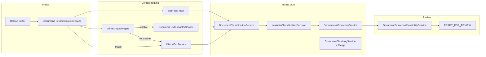
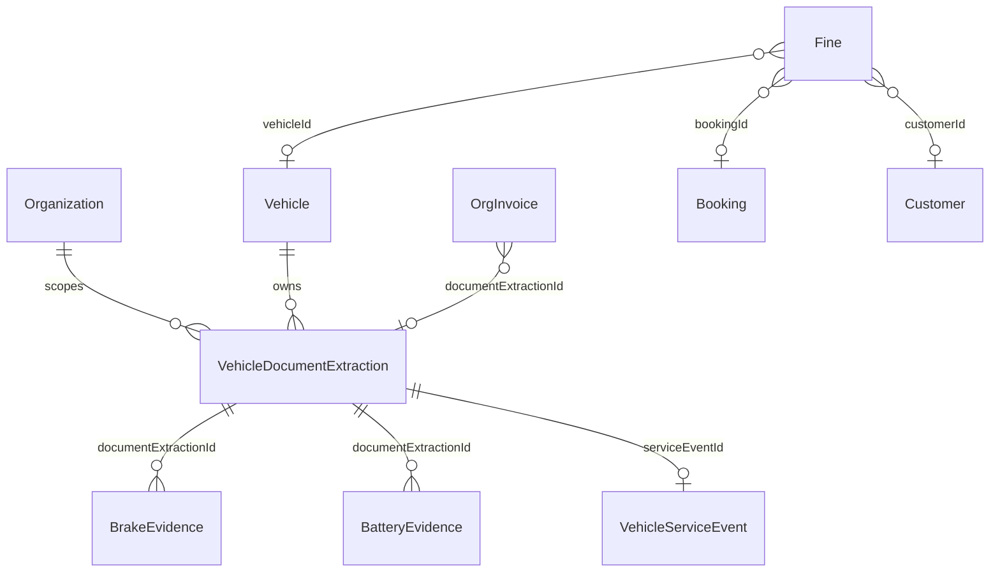

# Document Intake V2 — Implementation Inventory (Prompt 1 of 84)

| Field | Value |
|-------|-------|
| **Inventory date (UTC)** | 2026-07-17 |
| **Mode** | Read-only code + audit synthesis |
| **Inventory commit** | `6370bf17` |
| **Basis audits** | [document-intake-production-reality.md](./document-intake-production-reality.md) (Audit 1), [document-intake-test-matrix.md](./document-intake-test-matrix.md) (Audit 2) |
| **Dry-run harness** | `backend/scripts/audit/document-intake-test-matrix-dry-run.ts` |
| **Role of this document** | Prompt **1/84** — canonical Ist-Inventur before V2 implementation (Prompts 2–4: target contract / schema / test plan; **Prompts 5–84**: implementation blocks below) |

---

## 1. Executive Summary

SynqDrive’s **canonical** document intake path is the `document-extraction` module: vehicle-scoped multipart upload → private local storage → BullMQ `document.extraction` (in-process worker, concurrency 3) → PDF text or Mistral OCR → optional AUTO classification → structured Mistral extraction → plausibility (advisory) → human review → confirm → `DocumentExtractionApplyService` → downstream domains → org-scoped archive.

**Parallel / non-canonical paths** still exist: `FinesView.AIUploadFlow` (manual fine + public image upload), invoice PDF upload dialog (no AI extraction), customer document verification (Didit), legal document uploads.

**Audit baseline verdict:** CONDITIONALLY_READY (production funnel, n=2) + SHADOW_ONLY (full test matrix without live OCR). **P0 gaps for V2:** no Apply Dry Run, no upload hash dedup, `APPLIED` without downstream integrity gate, weak FINE apply guards, no booking/customer/driver entity resolver, divergent frontend flows.

---

## 2. Upload Endpoints and Flows

### 2.1 HTTP API (canonical)

| Method | Path | Controller | Permission | Purpose |
|--------|------|------------|------------|---------|
| `POST` | `/vehicles/:vehicleId/document-extractions/upload` | `DocumentExtractionController` | `document-upload:write` | Multipart upload (canonical) |
| `GET` | `/vehicles/:vehicleId/document-extractions` | same | `read` | Vehicle-scoped list |
| `GET` | `/vehicles/:vehicleId/document-extractions/:id` | same | `read` | Poll / detail |
| `POST` | `/vehicles/:vehicleId/document-extractions/:id/confirm` | same | `write` | Confirm + apply |
| `POST` | `/vehicles/:vehicleId/document-extractions/:id/document-type` | same | `write` | Manual type (+ optional reextract) |
| `POST` | `/vehicles/:vehicleId/document-extractions/:id/retry` | same | `write` | Re-enqueue |
| `POST` | `/vehicles/:vehicleId/document-extractions/:id/cancel` | same | `write` | Cancel |
| `DELETE` | `/vehicles/:vehicleId/document-extractions/:id/file` | same | `write` | Delete stored file |
| `GET` | `/vehicles/:vehicleId/document-extractions/:id/download` | same | `read` | Stream file |
| `POST` | `/vehicles/:vehicleId/document-extractions` | same | — | **Disabled** (`createLegacy` throws) |
| `GET` | `/organizations/:orgId/document-extractions` | `DocumentExtractionOrgController` | `read` | Org archive / history |
| `GET` | `/organizations/:orgId/document-extractions/:id` | same | `read` | Org-scoped detail |
| `GET` | `/organizations/:orgId/document-extractions/:id/download` | same | `read` | Org-scoped download |
| `PATCH` | `/organizations/:orgId/document-extractions/:id/vehicle` | same | `write` | Reassign vehicle (pre-confirm) |
| `GET` | `/document-extractions/metadata` | `DocumentExtractionMetadataController` | auth | Types, MIME, limits |
| `GET` | `/document-extractions/health` | same | auth | Ops health snapshot |

**Guards:** `RolesGuard`, `VehicleOwnershipGuard` (vehicle routes), `OrgScopingGuard` (org routes), `PermissionsGuard`.

### 2.2 Frontend flows

| Flow | Entry | Hook / component | Default type | vehicleId | Archive |
|------|-------|------------------|--------------|-----------|---------|
| Central AI upload page | `App.tsx` → `DocumentUploadView` | `useDocumentUploadPage` | `AUTO` | User must select (no auto-first since V4.9.507) | `api.documentExtraction.listByOrg` |
| Vehicle documents tab | `VehicleDocumentUploadDrawer` | `useDocumentExtractionFlow` | **`SERVICE`** (or category map) | Fixed prop | None (session only) |
| Operator quick view | `OperatorAiUploadFlow` / sheet | `useDocumentExtractionFlow` | Config `operatorAiUpload.config` | Context vehicle | None |
| Fines module stub | `FinesView.AIUploadFlow` | Inline | N/A | Manual pick | `api.fines.uploadImage` — **not extraction** |
| Invoice dialog | Invoice upload UI | — | N/A | Optional | Public `/uploads/` path |
| Customer docs | `CustomerDocumentsTab` | Customer verification | N/A | N/A | Customer document store |
| Damage AI dialog | `DamageAiIntakeDialog` | Partial | DAMAGE hint | Vehicle context | Separate from canonical pipeline |

### 2.3 Upload pipeline (service)

`DocumentExtractionService.createFromUpload`:

1. `assertQueueAcceptingUploads()` — rejects if queue disabled in prod
2. MIME + request type validation
3. `deriveClassificationMode` — `AUTO` → classificationMode `AUTO`, effectiveType `null`
4. `storage.putObject` — `organizations/{orgId}/vehicles/{vehicleId}/documents/{yyyy}/{mm}/{uuid}-{safeName}`
5. `vehicle_document_extractions.create` — `PENDING` / `STORAGE`
6. `enqueueExtraction` → `QUEUED` / `QUEUE` or enqueue failure → `FAILED`

**Producer:** `DocumentExtractionService.enqueueExtraction` — job id `extract-{extractionId}`.

---

## 3. Status Model and Writers

### 3.1 Enums (Prisma)

**`DocumentExtractionStatus`:** `PENDING`, `QUEUED`, `PROCESSING`, `READY_FOR_REVIEW`, `CONFIRMED`, `APPLIED`, `FAILED`, `REJECTED`, `AWAITING_DOCUMENT_TYPE`, `CANCELLED`.

**`DocumentExtractionStage`:** `UPLOAD`, `STORAGE`, `QUEUE`, `OCR`, `CLASSIFICATION`, `EXTRACTION`, `VALIDATION`, `REVIEW`, `APPLY`.

**`DocumentExtractionType`:** `AUTO` + 13 apply types (`SERVICE`, `OIL_CHANGE`, `TIRE`, `BRAKE`, `BATTERY`, `VEHICLE_CONDITION`, `TUV_REPORT`, `BOKRAFT_REPORT`, `INVOICE`, `ACCIDENT`, `DAMAGE`, `FINE`, `OTHER`).

**Note:** `REJECTED` appears in enum/metadata but **no active writer** in `document-extraction` module (legacy). `PARTIALLY_APPLIED` does **not** exist.

### 3.2 Status → writer matrix

| Status | Primary writer | File | Trigger |
|--------|----------------|------|---------|
| `PENDING` | Service | `document-extraction.service.ts` | After storage; retry; setDocumentType reextract; recovery re-queue |
| `QUEUED` | Service | same | Successful enqueue; retry; recovery |
| `PROCESSING` | Processor | `document-extraction.processor.ts` | `claimForProcessing` (from `QUEUED`/`FAILED`/`PENDING`) |
| `AWAITING_DOCUMENT_TYPE` | Processor | same | Classification `AWAIT_USER` or missing effective type |
| `READY_FOR_REVIEW` | Processor | same | Extraction + plausibility complete |
| `CONFIRMED` | Service | `document-extraction.service.ts` | `confirm` updateMany (gate: was `READY_FOR_REVIEW`) |
| `APPLIED` | Service | same | After `applyService.apply` returns (even if downstream empty) |
| `FAILED` | Service / Processor | both | Enqueue failure; permanent pipeline errors; exhausted retries |
| `CANCELLED` | Service | `document-extraction.service.ts` | User cancel |
| `REJECTED` | — | — | **No writer** |

### 3.3 Stage writers (selected)

| Stage | Set by |
|-------|--------|
| `STORAGE` | createFromUpload |
| `QUEUE` | enqueue paths |
| `OCR` | claimForProcessing |
| `CLASSIFICATION` | Processor after OCR |
| `EXTRACTION` | Processor before AI extract |
| `REVIEW` | READY_FOR_REVIEW, CANCELLED |
| `APPLY` | CONFIRMED, APPLIED |

### 3.4 Frontend status mapping

`frontend/src/rental/lib/document-extraction-lifecycle.ts` → `FlowStatus`: `idle`, `queued`, `ocr`, `classifying`, `extracting`, `awaiting_type`, `ready`, `applying`, `done`, `failed`, `cancelled`.

**Gap:** Drawer sets `done` on confirm without polling `APPLIED` (Audit 1/2).

---

## 4. OCR, Classification, and Extraction Paths



| Step | Implementation | Config / notes |
|------|----------------|----------------|
| File ID | `document-file-identification.service.ts` | Magic bytes via `file-type`; MIME spoof reject |
| PDF local text | `pdf-text-quality.util.ts` + `document-text-extractor.service.ts` | `DOCUMENT_PDF_MIN_TEXT_CHARS` (40), sensible ratio 0.45 |
| Mistral OCR | `mistral-ocr.service.ts` | Used when PDF text poor or image |
| OCR cache | `document-content-cache.util.ts` | Stored in `plausibility.contentCache` JSON |
| Classification | `document-classification.service.ts` | `DOCUMENT_CLASSIFICATION_ENABLED`; max chars 24k; timeout 45s |
| Decision | `document-classification-decision.util.ts` | Auto-continue ≥0.85; suggestion ≥0.55 (env-tunable) |
| Extraction | `document-ai-extraction.service.ts` | Chunking: target 6k chars, max 12 chunks, 200 pages |
| Plausibility | `document-extraction-plausibility.service.ts` | **Advisory** — never blocks worker storage |
| Confirm plausibility | `document-extraction.service.runConfirmPlausibility` | **BLOCKER throws** on confirm only |

**DIMO context:** Extraction may pass `dimoTokenId` for agent hints; odometer from `vehicleLatestState` or `vehicle.mileageKm`.

---

## 5. Apply Paths

`DocumentExtractionApplyService.apply(input)` — called only from `DocumentExtractionService.confirm` with `confirmedData` (never raw `extractedData`).

| `documentType` | Apply method | Returns `serviceEventId`? |
|----------------|--------------|---------------------------|
| `BRAKE` | `applyBrake` | Yes |
| `SERVICE`, `OIL_CHANGE`, `TUV_REPORT`, `BOKRAFT_REPORT` | `applyServiceEvent` | Yes |
| `BATTERY` | `applyBattery` | Optional (replacement) |
| `TIRE` | `tireLifecycleService.recordMeasurement` | No |
| `DAMAGE`, `ACCIDENT` | `damagesService.create` | No |
| `INVOICE` | `applyInvoice` → `invoicesService.create` | No |
| `FINE` | `applyFine` → `finesService.create` | No (`detail.fineId`) |
| `VEHICLE_CONDITION`, `OTHER` | No-op `{}` | No |

**Confirm gate:** `updateMany` where `status=READY_FOR_REVIEW` → `CONFIRMED`; plausibility BLOCKER blocks confirm.

**Apply failure:** Sets `errorPhase=APPLY`, throws — record may remain `CONFIRMED` (recovery can retry).

**No** `planApplyDryRun`, `previewActions`, or `WOULD_*` API exists.

---

## 6. Downstream Writes (per confirmed apply)

| Type | Tables / services | Link back to extraction |
|------|-------------------|-------------------------|
| SERVICE / OIL / TÜV / BOKraft | `vehicle_service_events`, `vehicles` date fields | `documentUrl`; `serviceEventId` on extraction row |
| BRAKE | `BrakeLifecycleService.recordService`, `BrakeEvidenceService.recordMany` | `documentExtractionId` on evidence |
| TIRE | `TireLifecycleService.recordMeasurement` | `linkedExtractionId` |
| BATTERY | `BatteryEvidenceService.recordMany`, optional `BatteryHealthService.recordSnapshot`, optional `vehicle_service_events` | `documentExtractionId` |
| DAMAGE / ACCIDENT | `damages` via `DamagesService.create` | **None** |
| INVOICE | `org_invoices` (+ line items) | `documentExtractionId` column |
| FINE | `fines` + `TasksService.upsertByDedup(fine:{id})` | Only inside `extractedData` JSON — **no FK** |
| OTHER | Extraction row only (`confirmedData`) | N/A |

**Side effects on FINE apply:** `FinesService.create` may set `bookingId`/`customerId` via `matchBooking(vehicleId, offenseDate)` when both present.

---

## 7. Default Values (apply + extraction risk)

| Domain | Code location | Default / fallback | Audit tag |
|--------|---------------|-------------------|-----------|
| FINE `offenseType` | `applyFine` | `'Parkverstoß'` | CODE_RISK |
| FINE `amountCents` | `applyFine` | `0` | CODE_RISK |
| FINE `description` | `applyFine` | `'Bußgeld aus Dokumenten-Upload'` | CODE_RISK |
| DAMAGE `damageType` | `apply` | `'SCRATCH'` | CODE_RISK |
| DAMAGE `severity` | `apply` | `'MODERATE'` | CODE_RISK |
| DAMAGE `description` | `apply` | `` `${docType} report` `` | CODE_RISK |
| INVOICE `taxRate` | `applyInvoice` lineItems | **19%** hardcoded | CODE_RISK |
| INVOICE `unitPriceNetCents` | `applyInvoice` | `totalCents / 1.19` | CODE_RISK |
| INVOICE `title` | `applyInvoice` | `'Hochgeladene Rechnung'` | CODE_RISK |
| INVOICE `invoiceDate` | `applyInvoice` | `new Date().toISOString()` | CODE_RISK |
| SERVICE event `eventDate` | `applyServiceEvent` | `new Date()` if missing | CODE_RISK |
| BRAKE `serviceDate` | `applyBrake` | `new Date().toISOString()` | CODE_RISK |
| TÜV `nextTuvDate` | `applyServiceEvent` | `eventDate + 2 years` (ignores `validUntil`) | CODE_RISK |
| BOKraft `nextBokraftDate` | `applyServiceEvent` | `eventDate + 1 year` (ignores `validUntil`) | CODE_RISK |
| BRAKE `serviceKind` | `applyBrake` | `'full_brake_service'` | CODE_RISK |

**Extraction schema gaps (no tax fields):** multi-rate invoices, credit notes, steuerfrei — Audit 2 NOT_TESTABLE.

---

## 8. Idempotency Boundaries

| Mechanism | Scope | Limitation |
|-----------|-------|------------|
| Confirm `updateMany` `READY_FOR_REVIEW` → `CONFIRMED` | Single confirm | Good |
| Applied `updateMany` `CONFIRMED` → `APPLIED` | Single apply flag | Sets APPLIED even if apply returned `{}` |
| Job id `extract-{id}` | BullMQ dedup | Re-enqueue same id replaces job |
| `claimForProcessing` updateMany | Worker claim | Prevents double PROCESSING |
| `documentExtractionId` on `org_invoices` | Invoice dedup | Service-level; not pre-checked on apply |
| `documentExtractionId` on `brake_evidence`, `battery_evidence` | Evidence rows | Append — retry may duplicate if not guarded |
| `linkedExtractionId` on tire measurements | Tire | Service-level |
| `TasksService.upsertByDedup(fine:{id})` | Fine tasks | Per fine id, not per extraction |
| Upload content hash | — | **Missing** (P0) |
| `fines.documentExtractionId` FK | — | **Missing** (P0) |
| Damage create dedup | — | **Missing** |
| Recovery `maxRecoveryAttempts` (5) | Stale QUEUED/PROCESSING/CONFIRMED | In `plausibility` recovery counter JSON |

**APPLIED orphan case (prod):** FINE confirmed before `applyFine` existed — status APPLIED, zero `fines` rows (Audit 1).

---

## 9. Entity Relationships

### 9.1 Extraction row relations (Prisma)

`VehicleDocumentExtraction`:

- **Required:** `vehicleId` → `Vehicle`
- **Optional:** `organizationId` (denormalized from vehicle)
- **Downstream FKs from other tables:** `BatteryEvidence`, `BrakeEvidence`, `VehicleBatteryReferenceCapacity` (via `documentId`)
- **Optional pointer:** `serviceEventId` (set when apply returns one)
- **No direct FK:** `bookingId`, `customerId`, `driverId`, `fineId`, `invoiceId`, `damageId`

### 9.2 Routing today

| Entity | How linked | Automatic? |
|--------|------------|------------|
| Organization | `organizationId` on create | Yes |
| Vehicle | Upload route + `vehicleId` | **UI-selected** (not OCR-inferred) |
| Vehicle reassign | `PATCH .../vehicle` pre-confirm | Manual (central page only) |
| Plate match | `findVehicleIdByPlate` (frontend V4.9.507) | Suggest only on central page |
| Booking | FINE apply → `FinesService.matchBooking` | Only if `offenseDate` + vehicle |
| Customer | Via fine booking match | Conditional |
| Driver | — | **Not implemented** |
| Vendor | Invoice apply → fuzzy `vendor.name` | Optional |
| Fine / Invoice / Damage | Created on apply | No extraction FK (except invoice) |

### 9.3 Entity diagram (logical)



---

## 10. Frontend Consumers

| File | Role |
|------|------|
| `DocumentUploadView.tsx` | Central upload UI |
| `useDocumentUploadPage.ts` | Central flow state, org history, vehicle reassign |
| `VehicleDocumentUploadDrawer.tsx` | Vehicle tab drawer |
| `useDocumentExtractionFlow.ts` | Shared upload/confirm/poll hook |
| `document-extraction.shared.ts` | Review field templates, confirm parsing |
| `document-extraction-field-format.ts` | Date/currency/plate formatting |
| `document-extraction-lifecycle.ts` | Status mapping, terminal detection |
| `document-extraction-polling.ts` | Poll backoff |
| `document-extraction-validation.ts` | Client-side file validation |
| `document-extraction-session.ts` | localStorage session recovery |
| `document-extraction.types.ts` | TS contracts |
| `lib/api.ts` | `vehicles.*` + `documentExtraction.*` clients |
| `DocumentsView.tsx` | Nav to upload page |
| `OperatorAiUploadFlow.tsx` | Operator surface |
| `FinesView.tsx` | **Legacy** fine upload stub |
| `DamageAiIntakeDialog.tsx` | Damage-specific intake |
| `CustomerDocumentsTab.tsx` | KYC docs (separate domain) |
| i18n `de.ts` / `en.ts` / `fr.ts` | Upload strings |

**E2E:** `frontend/e2e/document-upload-responsive.spec.ts`, `document-upload-fixtures.ts`.

---

## 11. Archive and Download Paths

| Capability | API | Frontend |
|------------|-----|----------|
| Org history list | `GET /organizations/:orgId/document-extractions` | `useDocumentUploadPage` recent list |
| Pagination / filters | `page`, `limit`, `vehicleId`, `status`, `documentType` | Partial (vehicle filter) |
| Vehicle list | `GET /vehicles/:vehicleId/document-extractions` | Rarely used in UI |
| Download vehicle | `GET .../vehicles/:vehicleId/.../download` | `api.vehicles.downloadDocumentExtraction` |
| Download org | `GET .../organizations/:orgId/.../download` | `api.documentExtraction.downloadByOrg` |
| Storage | `LocalDocumentStorageService` — not public static | `Cache-Control: no-store` |
| File delete | `DELETE .../file` | Action in flow (metadata) |
| Tenant isolation | `OrgScopingGuard`, `organizationId` on row, vehicle org match | Enforced server-side |

**Gap:** No filters for customer, driver, booking, invoice number, full-text (Audit 1).

---

## 12. Security and Storage Boundaries

| Control | Implementation | Verified |
|---------|----------------|----------|
| Max upload size | Multer + `resolveMaxUploadBytes` (default 10 MB) | Unit tests |
| Allowed MIME | `ALLOWED_MIME_TYPES` + multer filter + magic bytes | Unit tests |
| MIME spoof | `assertCompatibleMime` | T37 pass (Audit 2) |
| Filename sanitization | `sanitizeUploadFileName`, storage path segments | Unit tests |
| Path traversal | `resolveKey` base-dir guard | Storage spec |
| Private storage | Not in static middleware | CODE_VERIFIED |
| Permission module | `document-upload` read/write | Controller security spec |
| Tenant scope | org + vehicle guards | CODE_VERIFIED |
| Malware scan | — | **NOT_VERIFIED** |
| Encryption at rest | Local disk plain | **NOT_VERIFIED** |
| Password PDF | — | **NOT_IMPLEMENTED** |
| Rate limiting | — | **NOT_VERIFIED** |
| PII in logs | `document-extraction-log.util` redaction | Unit tests |
| Mistral data transfer | External API | Policy **NOT_VERIFIED** |

**Env (representative):** `DOCUMENT_EXTRACTION_QUEUE_ENABLED`, `DOCUMENT_STORAGE_PROVIDER`, `LOCAL_DOCUMENT_STORAGE_DIR`, `DOCUMENT_UPLOAD_MAX_MB`, `MISTRAL_*`, `DOCUMENT_EXTRACTION_JOB_*`, classification thresholds — see `document-extraction.config.ts`.

---

## 13. Runtime: Queue, Worker, PM2

| Item | Value |
|------|-------|
| Queue | `document.extraction` (`QUEUE_NAMES.DOCUMENT_EXTRACTION`) |
| Processor | `DocumentExtractionProcessor` — concurrency **3**, lock **120s** |
| Job attempts | 4, exponential backoff 5s |
| Recovery | `DocumentExtractionRecoveryScheduler` @ 120s — stale QUEUED / PROCESSING / CONFIRMED-apply |
| Deployment | Single PM2 `synqdrive` process (API + workers + schedulers) |
| Metrics | `synqdrive_document_extraction_*` via `DocumentExtractionObservabilityService` / `TripMetricsService` |
| Health | `/document-extractions/health`, readiness `documentExtraction` |

---

## 14. Tests and Audit Harnesses

### 14.1 Backend Jest (module)

26 spec files under `document-extraction/` including pipeline integration (mocked Mistral), live integration (skipped unless env), plausibility, file ID, schemas, recovery, security.

Related: `backend/src/modules/ai/documents/*.spec.ts`, `mistral-ocr*.spec.ts`, `test/document-extraction.e2e-spec.ts` (mocked service).

### 14.2 Frontend Vitest

`document-extraction-*.test.ts`, `useDocumentExtractionFlow.test.ts`, upload UI coverage tests — **25 tests** (Audit 2).

### 14.3 Audit harnesses

| Asset | Path |
|-------|------|
| Production reality audit | `docs/audits/document-intake-production-reality.md` |
| Test matrix audit | `docs/audits/document-intake-test-matrix.md` |
| Dry-run harness | `backend/scripts/audit/document-intake-test-matrix-dry-run.ts` |
| Ops doc | `backend/docs/document-extraction-ops.md` |

### 14.4 Architecture records

| Doc |
|-----|
| `architecture/DOCUMENT_EXTRACTION_LIFECYCLE_2026-07-10.md` |
| `architecture/DOCUMENT_OCR_ROUTING_2026-07-10.md` |
| `architecture/DOCUMENT_CLASSIFICATION_2026-07-10.md` |
| `architecture/DOCUMENT_CHUNKED_EXTRACTION_2026-07-10.md` |
| `architecture/DOCUMENT_EXTRACTION_QUEUE_RELIABILITY_2026-07-10.md` |
| `architecture/DOCUMENT_UPLOAD_LIFECYCLE_UI_2026-07-10.md` |
| `architecture/DOCUMENT_FINE_EXTRACTION_2026-07-16.md` |

### 14.5 Prisma migrations (document extraction)

| Migration | Topic |
|-----------|-------|
| `20260613000000_document_extraction_pipeline` | Core columns, plausibility, queue timestamps |
| `20260613234500_brake_evidence_model` | `document_extraction_id` on brake evidence |
| `20260710160000_document_extraction_lifecycle` | Status/stage enums, classification fields |
| `20260710180000_document_extraction_lifecycle_indexes_audit` | Org/vehicle indexes |

---

## 15. P0/P1 Inventory (from Audits — drives V2)

| ID | Issue | Source |
|----|-------|--------|
| P0-1 | No Apply Dry Run / Action Preview API | Audit 2 |
| P0-2 | Upload hash deduplication missing | Audit 2 T38 |
| P0-3 | `APPLIED` without downstream integrity gate | Audit 1 |
| P0-4 | FINE apply allows missing offense date / zero amount | Audit 2 T17 |
| P0-5 | No booking/customer/driver entity resolver | Audit 1/2 |
| P0-6 | `fines` lacks `documentExtractionId` FK | Audit 1 |
| P1-1 | Invoice 19% VAT hardcoded | Audit 2 |
| P1-2 | TÜV/BOKraft ignore `validUntil` | Audit 2 |
| P1-3 | Drawer vs central flow divergence | Audit 1/2 |
| P1-4 | No ACTION_PREVIEW / follow-up UI | Audit 2 |
| P1-5 | FinesView parallel stub | Audit 1 |
| P1-6 | PM2 restart instability | Audit 1 |
| P1-7 | Golden Mistral fixture corpus missing | Audit 2 |

---

## 16. Exakte Änderungsmatrix für Prompts 5–84

> **Prompt 1** = dieses Inventar.  
> **Prompts 2–4** (noch nicht im Repo): Zielarchitektur V2-Vertrag, Prisma/Action-Plan-Schema, Testplan + Golden Fixtures.  
> **Prompts 5–84** = Umsetzung in 10 Blöcken à 8 Prompts.

### Block A — Apply Dry Run & Integrity (Prompts 5–12)

| Prompt | Ziel | Primäre Dateien |
|--------|------|-----------------|
| **5** | `planApplyDryRun(extractionId \| fixture)` → `WOULD_*` actions | Neu `document-extraction-apply-plan.service.ts`, DTO |
| **6** | `GET .../action-plan` + confirm preview in public DTO | Controller, mapper |
| **7** | Apply integrity gate — `APPLIED` only if downstream success | `document-extraction.service.ts` confirm |
| **8** | `PARTIALLY_APPLIED` status + audit payload | `schema.prisma`, lifecycle util |
| **9** | Reconcile script for orphaned APPLIED rows | `scripts/ops/reconcile-document-extractions.ts` |
| **10** | Confirm BLOCKER enforcement parity UI ↔ API | Frontend review + service |
| **11** | Action audit trail standardization (`ExtractionActionAuditEntry`) | plausibility JSON schema |
| **12** | Prometheus: `apply_downstream_miss_total`, `dry_run_invocations` | observability |

### Block B — Idempotency & Dedup (Prompts 13–20)

| Prompt | Ziel | Primäre Dateien |
|--------|------|-----------------|
| **13** | `contentSha256` on extraction + pre-upload dedup warn | `createFromUpload`, schema migration |
| **14** | `fines.document_extraction_id` FK + unique | `schema.prisma`, `applyFine` |
| **15** | Idempotent fine create by extractionId | `fines.service.ts` |
| **16** | Idempotent damage create guard | `damages.service.ts`, apply |
| **17** | Invoice dedup pre-check by extractionId | `invoices.service.ts` |
| **18** | Service event dedup policy (extractionId) | `applyServiceEvent` |
| **19** | Recovery: don't re-apply if downstream exists | recovery scheduler |
| **20** | Idempotency integration tests per type | `document-extraction-apply.service.spec.ts` |

### Block C — Entity Routing (Prompts 21–28)

| Prompt | Ziel | Primäre Dateien |
|--------|------|-----------------|
| **21** | `DocumentEntityResolverService` — plate/VIN candidates | Neu module |
| **22** | Booking overlap candidate scoring | Integrate `bookings` queries |
| **23** | Customer match by name/number/address | `customers.service.ts` |
| **24** | Driver match from booking assignment | `drivers` / booking driver |
| **25** | Vendor/IBAN match for invoices | `vendors` module |
| **26** | Persist `entityCandidates` on extraction JSON | processor + confirm |
| **27** | Vehicle reassign in drawer + conflict UI | `useDocumentExtractionFlow`, drawer |
| **28** | Plate BLOCKER → confirm disabled in UI | shared review components |

### Block D — Classification & Schemas (Prompts 29–36)

| Prompt | Ziel | Primäre Dateien |
|--------|------|-----------------|
| **29** | Unify drawer default to `AUTO` | `useDocumentExtractionFlow`, operator config |
| **30** | AWAITING_DOCUMENT_TYPE UX hardening | `DocumentUploadView`, drawer |
| **31** | Expand INVOICE schema: taxRate, net/gross, credit flag | `document-extraction.schemas.ts` |
| **32** | MAHNUNG / Gutschrift classification hints | classification prompts |
| **33** | Required-field metadata per type (server) | schemas + plausibility |
| **34** | FINE required fields: eventDate, totalCents BLOCKER | plausibility service |
| **35** | Classification golden fixtures (sanitized) | `__fixtures__/mistral/` |
| **36** | UNKNOWN / OTHER archival policy | processor + metadata |

### Block E — OCR & File Intake (Prompts 37–44)

| Prompt | Ziel | Primäre Dateien |
|--------|------|-----------------|
| **37** | Password-protected PDF detection | file identification |
| **38** | Multi-page PDF fixture corpus + tests | fixtures, pipeline spec |
| **39** | Rotation / EXIF handling for images | content extractor |
| **40** | OCR timeout + partial page failure semantics | mistral-ocr, processor |
| **41** | Near-limit 10MB synthetic load test | harness + spec |
| **42** | S3 storage provider stub (interface bind) | `S3DocumentStorageService` |
| **43** | Rate limit on upload endpoint | shared rate-limit guard |
| **44** | ZIP bomb / PDF bomb guards | file identification |

### Block F — Domain Apply Hardening (Prompts 45–52)

| Prompt | Ziel | Primäre Dateien |
|--------|------|-----------------|
| **45** | Remove FINE defaults — require confirmed fields | `applyFine` |
| **46** | Remove DAMAGE SCRATCH/MODERATE defaults | `apply` damage branch |
| **47** | Invoice line items from confirmed tax breakdown | `applyInvoice` |
| **48** | TÜV/BOKraft use `validUntil` when present | `applyServiceEvent` |
| **49** | Service/OIL require `eventDate` before vehicle update | apply + plausibility |
| **50** | Wire `FinesView` to canonical extraction or deprecate | `FinesView.tsx` |
| **51** | Fine task suggestions as `WOULD_SUGGEST` only in dry-run | apply-plan service |
| **52** | Follow-up action catalog per document type | Neu `document-extraction-follow-up.catalog.ts` |

### Block G — Health Evidence Consumers (Prompts 53–58)

| Prompt | Ziel | Primäre Dateien |
|--------|------|-----------------|
| **53** | Battery apply → V2 evidence valueTypes alignment | `applyBattery`, battery normalize util |
| **54** | Brake evidence strength policy for AI_UPLOAD | `brake-evidence.service.ts` |
| **55** | Tire measurement quality gate for AI confirm | `tire-lifecycle.service.ts` |
| **56** | Service event origin `AI_UPLOAD` analytics | reporting queries |
| **57** | Health UI provenance badges for document_confirmed | battery/brake/tire read models |
| **58** | Retention: document-linked evidence policies | battery-v2-retention (already references doc id) |

### Block H — Frontend UX Unification (Prompts 59–66)

| Prompt | Ziel | Primäre Dateien |
|--------|------|-----------------|
| **59** | ACTION_PREVIEW panel (dry-run results) | `DocumentUploadView`, shared |
| **60** | FOLLOW_UP_ACTIONS panel (suggestions only) | same |
| **61** | Drawer polls through `APPLIED` | `useDocumentExtractionFlow` |
| **62** | Shared review component extraction | refactor shared |
| **63** | Org archive filters: type, status, date range | upload page + API query |
| **64** | Mobile upload parity | responsive tests |
| **65** | i18n: remove cent-only labels where EUR display | field-format + templates |
| **66** | Accessibility: review form labels / aria | upload components |

### Block I — Archive, Security, Ops (Prompts 67–74)

| Prompt | Ziel | Primäre Dateien |
|--------|------|-----------------|
| **67** | Org archive search (invoice #, file name) — DB index strategy | query util, migration |
| **68** | Download audit log (read-only trail) | lifecycle service |
| **69** | GDPR delete path for extraction + file | delete service |
| **70** | OCR raw text retention policy | config + cleanup job |
| **71** | PM2/worker isolation evaluation | ops doc (optional split worker) |
| **72** | Grafana dashboard document extraction SLOs | prometheus + dashboard JSON |
| **73** | Runbook: queue disabled, stuck jobs, recovery | `document-extraction-ops.md` |
| **74** | Feature flag `DOCUMENT_INTAKE_V2` gate | config + frontend env |

### Block J — Tests, Fixtures, Production Readiness (Prompts 75–84)

| Prompt | Ziel |
|--------|------|
| **75** | Extend dry-run harness → CI JSON artifact |
| **76** | Golden Mistral OCR/classify/extract fixtures per type |
| **77** | Apply path matrix tests (all 13 types) |
| **78** | Authenticated E2E: upload → review → dry-run (staging) |
| **79** | Multi-tenant isolation E2E |
| **80** | Load test: concurrent uploads (queue) |
| **81** | Production readiness checklist doc |
| **82** | Changes + Architektur V2 entries |
| **83** | Pilot soak criteria (50 uploads / multi-format) |
| **84** | Final readiness review + cutover decision |

---

## 17. Seit den Audits bereits geänderte Dateien

**Audit 1 commit:** `39567061` (2026-07-17)  
**Audit 2 commits:** `8b4f714d`, `614e1663`  
**Inventory HEAD:** `614e1663`

### 17.1 Nach Abschluss beider Audits (nur Dokumentation + Harness)

| Datei | Änderung |
|-------|----------|
| `docs/audits/document-intake-production-reality.md` | **Neu** — Audit 1 |
| `docs/audits/document-intake-test-matrix.md` | **Neu** — Audit 2 |
| `backend/scripts/audit/document-intake-test-matrix-dry-run.ts` | **Neu** — read-only harness |

**Kein Anwendungscode** wurde nach den Audits geändert.

### 17.2 Unmittelbar vor Audit 1 (Baseline für V2 — bereits auf main)

Relevante Commits zwischen Pipeline-Hardening und Audit-Serie:

| Commit | Thema | Wichtige Dateien |
|--------|-------|------------------|
| `faebaef2` | Pipeline complete + ops hardening | `document-extraction/*` bulk |
| `7e6d56c9` | FINE extraction + apply + plate match | schemas, apply, plausibility, frontend |
| `ed30a9c` / `36a435aa` | Vehicle reassign + audit payload TS fix | `document-extraction.service.ts`, org controller |
| `e707ce3e` | Merge (no additional doc-extraction logic) | — |

### 17.3 Produktions-Ist (Audit 1, nicht Repo-Änderung)

- `DOCUMENT_EXTRACTION_QUEUE_ENABLED=true` auf VPS gesetzt
- 2 Produktions-Uploads, 1× APPLIED ohne `fines` row (pre-`applyFine` deploy)

---

## 18. Module Dependency Graph

```
DocumentExtractionModule
├── AiModule (Mistral OCR + LLM classification/extraction)
├── FinesModule (apply FINE)
├── InvoicesModule (apply INVOICE)
├── VehicleIntelligenceModule (brakes, tires, battery, damages)
├── BullMQ document.extraction
└── Controllers: vehicle, org, metadata

Consumers of extraction IDs:
├── BrakeEvidence (documentExtractionId)
├── BatteryEvidence (documentExtractionId)
├── OrgInvoice (documentExtractionId)
├── TireMeasurement (linkedExtractionId)
├── VehicleBatteryReferenceCapacity (documentId)
└── VehicleDocumentExtraction.serviceEventId → VehicleServiceEvent
```

---

## 19. Summary Table — V2 Starting Point

| Area | Ist state | V2 priority |
|------|-----------|-------------|
| Upload / file ID | CONDITIONALLY_READY | Harden edge cases |
| OCR / classify / extract | SHADOW_ONLY at scale | Fixtures + gates |
| Plausibility | Advisory in worker; BLOCKER on confirm | Expand required fields |
| Apply | NOT_READY integrity | Dry-run + gate |
| Entity routing | NOT_READY | Resolver service |
| Archive | CONDITIONALLY_READY | Filters + search |
| UX | DIVERGENT flows | Unify + preview |
| Security | Baseline MIME/size | Rate limit, scan TBD |
| Tests | Good unit; weak apply matrix | Prompts 75–78 |

---

*End of Prompt 1 inventory. Proceed with Prompts 2–4 (contract/schema/test plan), then Block A (Prompt 5) apply dry-run.*
