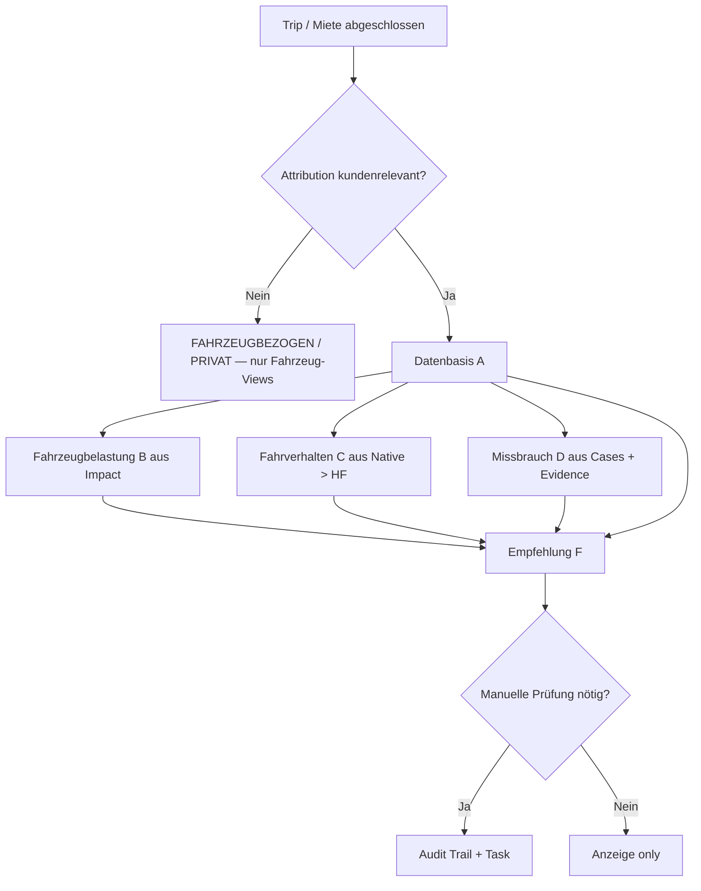

# Driving Analysis — UX-, Informationsarchitektur- und Entscheidungsmodell

| Feld | Wert |
|------|------|
| **Dokumenttyp** | Read-only UX / IA / Decision-Model Audit (Zielarchitektur) |
| **Auditzeitpunkt (UTC)** | 2026-07-16 |
| **Basis** | `driving-analysis-production-reality.md`, `dimo-driving-signals-capability.md` |
| **Repository-Commit** | `cdf95834` (bei Erstellung) |
| **Scope** | Zielmodell + Wireframes — **keine UI-/Businesslogik-Änderung** |

---

## 1. Heutige UX-Probleme

Aus Code-Review (`frontend/src/rental/components/trips/*`, `CustomerDetail*`, `MisuseCasesPanel`, `api.ts`) und Production-Reality-Audit:

### 1.1 Begriffs- und Semantik-Probleme

| Problem | Wo | Wirkung |
|---------|-----|---------|
| **„Fahrbewertung“ statt Fahrbelastung/Fahrverhalten** | `de.ts` (`trips.drivingScore`, `customerDetail.drivingScore`, `fleet.driverScore`, Notifications) | Vermieter interpretiert mechanische Belastung als Fahrerurteil |
| **`PRUEFHINWEIS` als Sammelbegriff** | `TRIP_ASSESSMENT_STATUS_LABEL`, `BEHAVIOR_STATUS_LABEL.abuse_suspect`, Listen-Badge | Unklar: Gerät, Verhalten, Missbrauch oder Schaden? |
| **Gesamtbewertung kollabiert Dimensionen** | `TripTimelineExpanded` „Gesamtbewertung“, `trip-assessment.service.ts` | Eine Zeile für Belastung + Verhalten + Evidence + Gerätequalität |
| **Listen-Header mappt `PRUEFHINWEIS` → „Auffällig“** | `trip-overall-status.ts` (`tripAssessmentToOverallRating`) | Geräteproblem wirkt wie Fahrerverdacht |
| **Stress-Score fehlt, native Events da** | `VehicleStressPanel` + `trip-assessment-copy.ts` | Textlich getrennt, aber Gesamtbewertung kann trotzdem „Auffällig“ sein |

### 1.2 Datenqualität & Attribution unsichtbar oder falsch gewichtet

| Problem | Evidenz |
|---------|---------|
| `driving_impact_status=PENDING` trotz Impact-Row (84 % Fleet 90d) | Production-Reality P0-2 |
| Attribution nur 5,4 % `BOOKING_ASSIGNED` | Kundenbezogene Scores meist nicht belastbar |
| `TIME_WINDOW` vs `EXPLICIT` Booking-Link | `trip-attribution-ui.utils.ts` warnt, aber Customer-Aggregate nutzen oft alle Trips |
| `RentalDrivingAnalysis` = 0 Zeilen | Customer Driving Tab zeigt Aggregate ohne Mietperioden-Report |
| HF-Kadenz 3–10 s | HF-Evidence sollte als Shadow gekennzeichnet werden |

### 1.3 Fehlende operative Tiefe

| Fehlt | Heute |
|-------|-------|
| **Konkrete Handlung** | MisuseCasesPanel: `recommendedAction` oft generisch; keine CTA „Fahrzeugprüfung anlegen“ |
| **Zeit + Ort pro Ereignis** | `TripBehaviorEventList` teilweise; Misuse-Aggregat ohne Karte |
| **pro 100 km / Cluster** | Absolute `eventCount` in Misuse + Trip-KPIs dominieren |
| **Warum?-Erklärung** | `tripAssessment.primaryReason` vorhanden, aber nicht dimensional aufgeschlüsselt |
| **Attribution Confidence prominent** | Nur in `TripEvidencePanel` / Attribution-Zeile |

### 1.4 Doppelanzeigen

| Doppelung | Flächen |
|-----------|---------|
| Gesamtbewertung + Fahrverhalten-Label + Evidence-Cards | `TripTimelineExpanded`, `TripEvidencePanel`, `TripBehaviorSummary` |
| Missbrauch | `MisuseCasesPanel`, Operational Issues, Dashboard Notifications |
| Belastung | `VehicleStressPanel`, Trip-KPI-Chips, Customer Aggregate |
| Prüfhinweis | `tripAssessment.status`, `deviceQualityWarning`, Evidence Level, Misuse severity |

### 1.5 PRUEFHINWEIS — wo gezeigt & Ursachen

**Anzeigeorte (Code):**

1. `tripAssessment.status` → Label „Prüfhinweis“ (`behavior-ui.utils.ts`)
2. Listen/Timeline: `tripAssessmentToOverallRating` → Badge-Ton **„auffällig“** (`trip-overall-status.ts`)
3. `TripBehaviorSummary`: Geräte-Banner „Fahrbewertung eingeschränkt“ (`deviceQualityWarning`)
4. `MisuseCasesPanel` / Evidence Cards: Titel „Prüfhinweis“, „Missbrauchsverdacht“, „Auffälliges Fahrmuster“
5. Notifications: „Fahrbewertung eingeschränkt“ (`notificationEngine`, `de.ts`)
6. Fallback `deriveBehaviorOverallStatus` → `abuse_suspect` → „Prüfhinweis“

**Backend-Ursachen (`trip-assessment.service.ts` → `resolveStatus`):**

| Ursache | Bedingung | Soll-Dimension |
|---------|-----------|----------------|
| **Gerätequalität** | `deviceQualityDegraded` cappt Status auf `PRUEFHINWEIS` | A: EINGESCHRÄNKT — **nicht** C/D |
| **Evidence CHECK_RECOMMENDED+** | `maxEvidenceLevel` → `tripAssessmentStatusFromEvidenceLevel` | D: Missbrauchsevidenz |
| **Misuse / Abuse-relevant** | `misuseCaseCount > 0` oder `abuseRelevantCount > 0` | D + ggf. C |
| **Native extreme ohne Abuse-Flag** | sehr schwere Events | C: Fahrverhalten |
| **Stress critical** | `drivingStressLevel === 'critical'` | B: Belastung (nicht automatisch Fahrer) |

**Problem:** Eine UI-Bezeichnung „Prüfhinweis“ für **mindestens fünf verschiedene Ursachen**.

### 1.6 Vehicle Stress vs Driver Conduct Vermischung

| Stelle | Vermischung |
|--------|-------------|
| `CustomerDetailView` Tab „Fahrbelastung & Verdacht“ | Belastung + Verdacht in einem Tab ohne Trennung |
| `driver-score.service` / Customer aggregate | Distance-weighted `drivingStressScore` als Kunden-KPI |
| `tripOverallRating` | Stress + Behavior + Abuse in einem Badge |
| i18n „Fahrbewertung“ | Impliziert Fahrerqualität |

### 1.7 Operativ relevante Flächen (heute)

| Fläche | Relevanz | Lücke |
|--------|----------|-------|
| **Trip Detail (expanded)** | Hoch | Entscheidungssummary fehlt |
| **Trips List / Vehicle Trips** | Hoch | Badge zu grob |
| **Customer Detail → Driving** | Mittel | Aggregate ohne Attribution-Gate |
| **Booking Dossier → Nutzung** | Hoch | Rental Analysis leer in Prod |
| **Dashboard / ActionQueue** | Hoch | Driving Notifications nicht dimensional |
| **Mietfreigabe (`CustomerDecisionCards`)** | Hoch | Nicht an Driving-Decision-Model gekoppelt |
| **Return Handover** | Mittel | Nur Banner, keine strukturierte Empfehlung |
| **Tasks / Insights** | Niedrig-Mittel | Kein einheitlicher „Fahrzeugprüfung“-Task-Typ aus Driving |
| **Vehicle Health Tab** | Niedrig | Misuse bewusst entfernt (korrekt) |

### 1.8 Nur technische Details (aus Operator-Sicht)

- `behaviorEnrichmentStatus`, `tripAnalysisStatus`, `analysisStagesJson`
- ClickHouse Evidence Block, RPM Candidates (legacy intake)
- Raw `eventCount` ohne Normalisierung
- Enrichment-Retry, Queue-Metriken
- Modellversion `v1.1.0` (gehört in „Technische Details“ Accordion)

---

## 2. Nutzeraufgaben (Autovermieter)

Nach **einer Fahrt** oder **Mietende** soll der Vermieter in &lt; 60 Sekunden beantworten:

1. **Kann ich dieser Bewertung vertrauen?** (Datenbasis)
2. **Wurde das Fahrzeug mechanisch belastet?** (Reifen/Bremsen/Verschleiß)
3. **War das Fahrverhalten auffällig?** (getrennt von Belastung)
4. **Gibt es belastbare Missbrauchs-/Schadenshinweise?** (kein automatisierter Vorwurf)
5. **Kann ich das einem Kunden/Fahrer zuordnen?** (Attribution)
6. **Was soll ich tun?** (konkrete Empfehlung + optional manuelle Freigabe/Prüfung)
7. **Warum?** (nachvollziehbare Begründung + Audit bei Entscheidung)

---

## 3. Zielbegriffe (6 Dimensionen)

### A. Datenbasis (`dataBasis`)

| Wert | Operator-Text | Bedingung (Ziel) |
|------|---------------|------------------|
| `BELASTBAR` | „Ausreichende Datenbasis“ | Native oder HF mit ausreichender Kadenz + Trip abgeschlossen + Impact/Events vorhanden |
| `EINGESCHRÄNKT` | „Datenqualität eingeschränkt“ | `deviceQualityDegraded`, `LIMITED`, sparse HF, `PARTIAL` analysis |
| `UNZUREICHEND` | „Nicht genug Daten für eine Bewertung“ | Kurzstrecke ohne Events, `NOT_ASSESSABLE`, fehlende Impact-Pipeline |
| `NICHT_UNTERSTÜTZT` | „Für dieses Fahrzeugprofil nicht unterstützt“ | Kein behavior-Pfad (z. B. Tesla ohne Events), SMART5 ohne HF |

### B. Fahrzeugbelastung (`vehicleLoad`)

| Wert | Operator-Text | Quelle |
|------|---------------|--------|
| `SCHONEND` | „Schonende Fahrt“ | `drivingStressScore` ≤ 25 |
| `NORMAL` | „Normale Belastung“ | 26–50 |
| `ERHÖHT` | „Erhöhte Fahrzeugbelastung“ | 51–75 |
| `STARK_ERHÖHT` | „Starke Fahrzeugbelastung“ | &gt; 75 |

**Regel:** Nie als „schlechter Fahrer“ labeln. Immer „Fahrzeugbelastung“ / „mechanische Belastung“.

### C. Fahrverhalten (`driverConduct`)

| Wert | Operator-Text |
|------|---------------|
| `UNAUFFÄLLIG` | „Unauffälliges Fahrverhalten“ |
| `DYNAMISCH` | „Dynamisches Fahrverhalten“ |
| `AUFFÄLLIG` | „Auffälliges Fahrverhalten“ |
| `STARK_AUFFÄLLIG` | „Stark auffälliges Fahrverhalten“ |
| `NICHT_BEWERTBAR` | „Fahrverhalten nicht bewertbar“ |

**Quelle:** Native Events bevorzugt; HF nur mit `source=HF_RECONSTRUCTED` Badge.

### D. Missbrauchsevidenz (`misuseEvidence`)

| Wert | Operator-Text |
|------|---------------|
| `KEINE` | „Keine Hinweise auf Fehlgebrauch“ |
| `EINZELNER_HINWEIS` | „Einzelner Hinweis — keine automatische Bewertung“ |
| `MEHRERE_BELASTBARE_HINWEISE` | „Mehrere belastbare Hinweise“ |
| `STARKER_VERDACHT` | „Starker Verdacht — manuelle Prüfung“ |
| `SCHADENSPRÜFUNG` | „Fahrzeugprüfung empfohlen“ |

**Regel:** Nur `informationalOnly=false` + `evidenceLevel ≥ CHECK_RECOMMENDED` + nicht nur Proxy zählt als „belastbar“.

### E. Attribution (`attribution`)

| Wert | Operator-Text |
|------|---------------|
| `BESTÄTIGTER_FAHRER` | „Bestätigter Fahrer“ (EXPLICIT driver) |
| `BUCHUNGSKUNDE` | „Buchungskunde (bestätigte Zuordnung)“ |
| `ZUGEWIESENER_FAHRER` | „Zugewiesener Fahrer“ |
| `FAHRZEUGBEZOGEN` | „Nur Fahrzeughistorie“ |
| `UNKLAR` | „Zuordnung unklar“ (TIME_WINDOW) |
| `PRIVAT_NICHT_ZUGEORDNET` | „Privatfahrt — nicht kundenrelevant“ |

### F. Empfehlung (`recommendation`)

| Wert | Operator-Text | Typische Aktion |
|------|---------------|-----------------|
| `KEINE_MASSNAHME` | „Keine Maßnahme erforderlich“ | — |
| `BEOBACHTEN` | „Beobachten“ | Notiz / Flag |
| `KUNDENGESPRAECH` | „Kundengespräch empfohlen“ | CRM-Task |
| `MANUELLE_MIETFREIGABE` | „Manuelle Mietfreigabe prüfen“ | Eligibility-Dialog |
| `FAHRZEUGPRUEFUNG` | „Fahrzeugprüfung empfohlen“ | Inspektion-Task |
| `TECHNISCHE_DATENPRUEFUNG` | „Technische Datenprüfung“ | Gerät/Telematik |

---

## 4. Informationshierarchie

```
Ebene 0 — Entscheidung (immer sichtbar)
  ├─ Datenbasis-Chip
  ├─ Empfehlung + Primary CTA
  └─ Attribution-Chip (wenn kundenrelevant)

Ebene 1 — Vier Säulen (Trip/Miete)
  ├─ Fahrzeugbelastung (Score + pro 100 km + Komponenten)
  ├─ Fahrverhalten (Events + Severity, nicht absolut)
  ├─ Missbrauchsevidenz (Cases + Evidence Level)
  └─ Zuordnung & Mietkontext

Ebene 2 — Beweise
  ├─ Event-Timeline (Zeit, Ort, Quelle, Kontext)
  └─ Cluster / Muster (wiederholt innerhalb Miete)

Ebene 3 — Technische Details (Accordion, default zu)
  ├─ Pipeline-Status, Modellversion, Kadenz
  └─ CH/RPM/Enrichment-Metadaten
```

**Mobile:** Ebene 0 + 1 komprimiert; Ebene 2 als swipeable Timeline; Ebene 3 immer collapsed.

---

## 5. Statusmodell (Mapping Alt → Neu)

| Legacy `tripAssessment.status` | Ziel-Dimensionen (Beispiel) |
|-------------------------------|----------------------------|
| `NICHT_BEWERTBAR` | A: UNZUREICHEND, C: NICHT_BEWERTBAR |
| `UNAUFFAELLIG` | A: BELASTBAR, B: UNAUFFÄLLIG, D: KEINE |
| `BEOBACHTEN` | B: DYNAMISCH oder B: NORMAL + B: ERHÖHT, F: BEOBACHTEN |
| `AUFFÄLLIG` | C: AUFFÄLLIG |
| `KRITISCH` | B: STARK_ERHÖHT oder C: STARK_AUFFÄLLIG, D: SCHADENSPRÜFUNG |
| `PRUEFHINWEIS` | **Auflösen in** A/EINGESCHRÄNKT **oder** D/EINZELNER_HINWEIS **oder** F/TECHNISCHE_DATENPRUEFUNG — **nie** als einzelnes User-Label behalten |

**Listen-Badge:** Zeigt **Empfehlung** + **Datenbasis**, nicht „Prüfhinweis“.

---

## 6. Entscheidungsmodell

### 6.1 Berechnungsreihenfolge (Ziel)



### 6.2 Regeln für kundenbezogene manuelle Prüfung

Manuelle Mietfreigabe-/Kundengespräch-Empfehlung **nur** wenn **alle** zutreffen:

| # | Kriterium |
|---|-----------|
| 1 | `attribution ∈ {BESTÄTIGTER_FAHRER, BUCHUNGSKUNDE}` mit `confidence ≥ MEDIUM` und `bookingLinkSource = EXPLICIT` |
| 2 | `dataBasis ∈ {BELASTBAR, EINGESCHRÄNKT}` — bei EINGESCHRÄNKT **kein** Kundenvorwurf |
| 3 | Events normalisiert (`per100km` oder Cluster ≥ Schwelle) |
| 4 | Evidence `source ∈ {NATIVE_EVENT, CONTEXT_ENRICHMENT, MIXED}` — **nicht** nur `HF_RECONSTRUCTION` |
| 5 | Muster wiederholt (≥2 Trips oder ≥2 Cases in Mietfenster) **oder** `misuseEvidence ≥ STARKER_VERDACHT` |
| 6 | Keine alleinige Strecken-/Verkehrsursache (z. B. nur ein Cornering auf Autobahn ohne Abuse) |
| 7 | `primaryReason` + `reasons[]` maschinell befüllt |

Bei `dataBasis = EINGESCHRÄNKT` wegen Gerät: **maximal** `TECHNISCHE_DATENPRUEFUNG` oder `FAHRZEUGPRUEFUNG` (technisch), **nie** `KUNDENGESPRAECH`.

### 6.3 Shadow / Proxy

| Evidence `source` | UI |
|-------------------|-----|
| `NATIVE_EVENT` | Kein Zusatz-Badge |
| `HF_RECONSTRUCTION` | „Geschätzt aus Telemetrie“ |
| `CONTEXT_ENRICHMENT` | „Mit Motorkontext“ |
| `MIXED` | „Mehrere Quellen“ |

---

## 7. Wireframes (Text / Mermaid)

### 7.1 Trip Detail Header

```
┌─────────────────────────────────────────────────────────────┐
│ WO*** · VW Tiguan · 16.07. · 14:32–15:08 · 9,7 km          │
│ [Datenbasis: Ausreichend] [Zuordnung: Buchungskunde · hoch]  │
├─────────────────────────────────────────────────────────────┤
│ Empfehlung: Beobachten                                       │
│ Erhöhte Fahrzeugbelastung bei auffälligem Bremsverhalten.    │
│ [Warum?]  [Fahrzeugprüfung anlegen]  [Notiz]                 │
└─────────────────────────────────────────────────────────────┘
```

### 7.2 Trip Decision Summary (neu — Kernkomponente)

```
┌─ Fahrt-Entscheidung ────────────────────────────────────────┐
│ Datenbasis      │ Ausreichend                                │
│ Fahrzeugbelast. │ Erhöht (62/100) · 3,2 Hard brakes/100km   │
│ Fahrverhalten   │ Auffällig · 2 native Bremsereignisse      │
│ Missbrauch      │ Einzelner Hinweis (informativ)            │
│ Zuordnung       │ Buchungskunde · hohe Sicherheit            │
│ Empfehlung      │ Beobachten                                 │
└─────────────────────────────────────────────────────────────┘
```

### 7.3 Event Timeline

```mermaid
timeline
  title Fahrt — Ereignisse (chronologisch)
  section 14:35
    Harsh braking : Native DIMO : Ort anonymisiert : Severity HARD
  section 14:41
    Harsh acceleration : Native DIMO : Severity MODERATE
```

### 7.4 Rental Period Summary (Mietende)

```
┌─ Mietzeitraum 12.07.–16.07. · Buchung #1042 ────────────────┐
│ 8 Fahrten · 142 km · Datenbasis: Ausreichend (6/8 bewertet) │
│ Fahrzeugbelastung Ø: Normal · Spitze: Erhöht (1 Fahrt)      │
│ Fahrverhalten: 2 auffällige Fahrten · 0 belastbare Missbr.  │
│ Empfehlung: Keine Maßnahme · Fahrzeugprüfung: nicht nötig    │
│ [Details pro Fahrt]  [PDF-Report — später]                   │
└─────────────────────────────────────────────────────────────┘
```

### 7.5 Customer Driving History

```
Kunde: K*** · Attribution belastbar: 3 Mieten / 12 Fahrten

[Filter: nur bestätigte Buchungen]

│ Miete      │ km   │ Belastung │ Verhalten │ Missbrauch │ Empfehlung │
│ Jul 2026   │ 142  │ Normal    │ Beobachten│ Keine      │ Beobachten │
│ Jun 2026   │ 89   │ Schonend  │ Unauff.   │ Keine      │ Keine      │

⚠ Aggregat nur aus Fahrten mit BESTÄTIGTER_ZUORDNUNG
```

### 7.6 Driver History

Gleiche Struktur wie 7.5, aber `attribution = BESTÄTIGTER_FAHRER` — falls nicht verfügbar: Empty State „Kein bestätigter Fahrer-Bezug“.

### 7.7 Vehicle Load History (fahrzeugbezogen)

```
Fahrzeug WO*** — Belastungshistorie (30 Tage)

Histogramm: SCHONEND | NORMAL | ERHÖHT | STARK
Trips: 45% Normal · 30% Erhöht · …

Keine Fahrerzuordnung in dieser Ansicht.
```

### 7.8 Manual Rental Approval Dialog

```
┌─ Manuelle Mietfreigabe prüfen ──────────────────────────────┐
│ Kunde: K***                                                  │
│ Auslöser: Mehrere belastbare Hinweise in letzter Miete      │
│ Datenbasis: Ausreichend · Zuordnung: Buchungskunde (hoch)   │
│                                                              │
│ Begründung (Pflicht): [________________________]            │
│ Entscheidung:  ( ) Freigeben  ( ) Bedingt  ( ) Ablehnen     │
│ Mitarbeiter: automatisch · Zeitstempel: jetzt               │
│                                                              │
│ [Abbrechen]  [Entscheidung speichern]                        │
└─────────────────────────────────────────────────────────────┘
```

### 7.9 Vehicle Inspection Recommendation

```
┌─ Fahrzeugprüfung empfohlen ─────────────────────────────────┐
│ Fahrzeug: WO*** · Auslöser: Starke Fahrzeugbelastung         │
│           wiederholt in 3 von 5 letzten Fahrten               │
│ Prüfschwerpunkte: □ Reifen  □ Bremsen  □ Unterboden          │
│ [Inspektions-Task anlegen]  [Später]                         │
└─────────────────────────────────────────────────────────────┘
```

### 7.10 Mobile Ansicht

```
┌──────────────────────┐
│ Trip · 16.07.        │
│ [Ausreichend] [Beob.]│
├──────────────────────┤
│ Belastung    Erhöht  │
│ Verhalten    Auffäll.│
│ Missbrauch   Keine   │
├──────────────────────┤
│ ▼ Ereignisse (2)     │
│ ▼ Technische Details │
└──────────────────────┘
```

---

## 8. Mobile-spezifische Regeln

- Max. **2 Chips** in Trip-List-Cards: `Empfehlung` + `Datenbasis`
- Kein „Prüfhinweis“-Wort in Mobile; stattdessen „Daten eingeschränkt“ / „Hinweis prüfen“
- Swipe auf Timeline-Eintrag → Karte + Uhrzeit
- FAB: „Task anlegen“ nur wenn `recommendation ≥ FAHRZEUGPRUEFUNG`

---

## 9. Customer / Driver Profile

| Profil | Primäre Frage | Pflicht-Anzeigen |
|--------|---------------|----------------|
| **Customer** | „Soll ich wieder vermieten?“ | Attribution-Coverage %, Miet-Panels, manuelle Freigabe-Historie |
| **Driver** | „Wer fuhr wie?“ | Nur EXPLICIT-Driver-Trips; sonst Hinweis |
| **Vehicle** | „Wie belastet ist das Asset?“ | Load History ohne Fahrerurteil |

**Customer Driving Tab (Ziel):** `TripDecisionSummary` aggregiert pro Miete, nicht ein einzelner Stress-Score.

---

## 10. Manuelle Freigabe & Audit Trail

### 10.1 Audit-Record (Zielschema)

```typescript
interface DrivingDecisionAudit {
  id: string;
  organizationId: string;
  subjectType: 'CUSTOMER' | 'BOOKING' | 'TRIP' | 'VEHICLE';
  subjectId: string;
  decision: 'APPROVE' | 'CONDITIONAL' | 'REJECT' | 'DISMISS' | 'INSPECTION_REQUESTED';
  recommendationAtDecision: RecommendationCode;
  dimensionsSnapshot: { dataBasis; vehicleLoad; driverConduct; misuseEvidence; attribution };
  reason: string; // Pflicht, min 20 Zeichen
  decidedByUserId: string;
  decidedAt: string;
  revokedAt?: string;
  revokedByUserId?: string;
  revokeReason?: string;
}
```

### 10.2 UX-Regeln

- Entscheidung **aufhebbar** mit Grund
- Kein automatisches Blacklisting
- Anzeige in Customer Detail: „Letzte manuelle Entscheidung: … von … am …“

---

## 11. Accessibility & i18n

| Thema | Ziel |
|-------|------|
| **Wortwahl DE** | „Fahrbelastung“, „Fahrverhalten“, „Hinweis auf Fehlgebrauch“ — **nie** „Fahrbewertung“ für Stress |
| **Farbe** | Datenbasis amber ≠ Missbrauch rot ≠ Belastung orange |
| **Screenreader** | Jede Dimension als `aria-labelledby` Block |
| **i18n Keys (neu)** | `driving.dataBasis.*`, `driving.vehicleLoad.*`, `driving.conduct.*`, `driving.misuse.*`, `driving.attribution.*`, `driving.recommendation.*` |
| **Bestehende Keys deprecaten** | `trips.drivingScore` → `trips.vehicleLoad` |

---

## 12. Benötigte API-Änderungen (Ziel — noch nicht implementieren)

| Endpoint / DTO | Änderung |
|----------------|----------|
| `GET .../trips/:id` | Neues Objekt `tripDecisionSummary: { dataBasis, vehicleLoad, driverConduct, misuseEvidence, attribution, recommendation, reasons[], cta[] }` |
| `GET .../trips` (list) | `listBadge: { recommendation, dataBasis }` statt nur `tripAssessment.status` |
| `GET .../rental-driving-analyses` | Pro Miete `decisionSummary` + `tripsScored/tripsTotal` |
| `GET .../customers/:id/driving` | `attributionCoveragePct`, `scoredBookingsCount`, dimensional aggregates |
| `POST .../driving-decisions` | Audit Trail CRUD (read für Historie, write für manuelle Entscheidung) |
| `TripAssessment` | Beibehalten als Legacy; `PRUEFHINWEIS` deprecaten zugunsten dimensional |

---

## 13. Benötigte Backend-Domainänderungen

| Domain | Änderung |
|--------|----------|
| **`TripDecisionSummaryService` (neu)** | Orchestriert A–F aus Impact, Assessment, Misuse, Attribution, Device Quality |
| **`trip-assessment.service`** | `PRUEFHINWEIS` nicht mehr als User-Status; stattdessen Flags an Summary |
| **Attribution** | `customerChargeable` / `EXPLICIT` Gate für Empfehlungen |
| **Misuse** | `informationalOnly` + `evidenceLevel` in Summary; `eventCount` vs deduped evidence fix |
| **Normalization** | `per100km` Rates auf API-Read-Model |
| **Pipeline truth** | `drivingImpactStatus` sync mit `TripDrivingImpact` (Production P0) |
| **RentalDrivingAnalysis** | Bei `COMPLETED` Booking auto `decisionSummary` |

---

## 14. Abnahmekriterien (für spätere Umsetzung)

1. Operator kann in Trip Detail **alle 6 Dimensionen** in &lt; 5 s scannen.
2. Geräteproblem zeigt **„Datenqualität eingeschränkt“**, nie „Auffälliges Fahrverhalten“.
3. `PRUEFHINWEIS` erscheint **nirgends** als User-Label.
4. Listen-Badge unterscheidet **Empfehlung** und **Datenbasis**.
5. Kundenbezogene Empfehlung nur bei `EXPLICIT` Attribution + ausreichender Datenbasis.
6. HF-only Evidence trägt „Geschätzt“-Badge.
7. Manuelle Entscheidung erzeugt Audit-Record mit Pflichtbegründung.
8. Mobile: max. 2 Chips, gleiche Semantik wie Desktop.
9. i18n DE ohne „Fahrbewertung“ für Belastung.
10. WCAG: Dimension-Blöcke screenreader-lesbar.

---

## 15. Dateien der späteren Umsetzung (Vorschlag)

### Frontend (neu)

| Datei | Rolle |
|-------|-------|
| `frontend/src/rental/components/trips/TripDecisionSummary.tsx` | Kern-UI Ebene 0–1 |
| `frontend/src/rental/components/trips/trip-decision.types.ts` | A–F Types + Labels |
| `frontend/src/rental/components/trips/trip-decision.mapper.ts` | API → UI (pure) |
| `frontend/src/rental/components/rental/RentalPeriodDecisionSummary.tsx` | Mietende |
| `frontend/src/rental/components/customer/ManualRentalApprovalDialog.tsx` | Freigabe |
| `frontend/src/rental/components/vehicle/VehicleLoadHistoryPanel.tsx` | Fahrzeug |

### Frontend (refactor)

| Datei | Änderung |
|-------|----------|
| `trip-overall-status.ts` | Badge aus `recommendation` + `dataBasis` |
| `behavior-ui.utils.ts` | `PRUEFHINWEIS` Label entfernen / deprecaten |
| `TripTimelineExpanded.tsx` | `TripDecisionSummary` oben; Gesamtbewertung ersetzen |
| `TripBehaviorSummary.tsx` | Geräte-Banner → Datenbasis-Chip |
| `de.ts` / `en.ts` | i18n dimensional |
| `CustomerDrivingTab.tsx` | Miet-Aggregate statt einzelner Score |
| `MisuseCasesPanel.tsx` | In Missbrauchssäule embedden, nicht parallel „Gesamtbewertung“ |

### Backend (neu/refactor)

| Datei | Rolle |
|-------|-------|
| `backend/src/modules/vehicle-intelligence/trips/trip-decision-summary.service.ts` | Domain |
| `backend/src/modules/vehicle-intelligence/trips/trip-decision-summary.types.ts` | Contract |
| `backend/src/modules/driving-decisions/` | Audit Trail Modul |
| `trip-assessment.service.ts` | Flags statt PRUEFHINWEIS-Monolith |
| `trip-api.mapper.ts` | `tripDecisionSummary` exposen |

---

## 16. Beispieltexte (Ziel-Copy)

| Statt | Neu |
|-------|-----|
| Prüfhinweis | Datenqualität eingeschränkt / Auffälliges Fahrverhalten / Fahrzeugprüfung empfohlen |
| Fahrbewertung | Fahrzeugbelastung |
| Fahrbewertung eingeschränkt | Datenqualität eingeschränkt — Gerät liefert unzuverlässige Events |
| Missbrauchsverdacht (automatisch) | Hinweis auf Fehlgebrauch — keine automatische Bewertung |
| Auffällig (Liste) | Beobachten / Fahrzeugprüfung empfohlen (je nach Empfehlung) |
| Nicht zugeordnet | Zuordnung unklar — nur Fahrzeughistorie |

**Beispiel-Satz Trip:**

> „Erhöhte **Fahrzeugbelastung** bei **auffälligem Fahrverhalten**. Ein **Hinweis auf Fehlgebrauch** liegt vor (informativ). **Buchungskunde** mit hoher Zuordnungssicherheit. **Empfehlung: Beobachten**.“

**Beispiel-Satz Gerät:**

> „**Datenqualität eingeschränkt** — das Telematik-Gerät liefert derzeit unzuverlässige Fahrereignisse. Eine Bewertung des Fahrverhaltens ist nicht belastbar. **Empfehlung: Technische Datenprüfung**.“

---

## 17. Zusammenfassung Empfehlung

Die Zielarchitektur ersetzt den **monolithischen `tripAssessment`-Status** (insbesondere `PRUEFHINWEIS`) durch ein **sechsdimensionales Entscheidungsmodell** mit klarer **Empfehlungsebene** und **auditierbarer manueller Entscheidung**.

Priorität Umsetzung:

1. **P0:** `TripDecisionSummary` + i18n-Bereinigung + Listen-Badge-Fix
2. **P1:** Rental Period Summary + Customer Attribution-Gates + Audit Trail
3. **P2:** Driver Profile + Vehicle Load History + Insights/Tasks-Integration

---

*Read-only Audit — keine produktiven Dateien geändert.*
