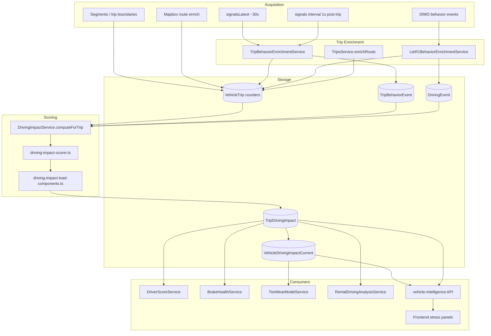

# SynqDrive Driving Intelligence — Phase 1 Current-State Forensic Audit

**Date:** 2026-08-30  
**Workstream:** Driving Intelligence Reconstruction — Phase 1.1  
**Authority:** `docs/audits/driving-intelligence-reconstruction-master-plan-2026-08-30.md`  
**Repository:** `FATIHS-MGCKS/SYNQDRIVE-alpha`  
**Branch audited:** `main` (as of 2026-08-30)  
**Scope:** Read-only forensic reconstruction. No production code changed.

---

## 1. Executive Summary

This audit reconstructs the full current-state calculation and data-flow chain from provider signals through trip scores, rolling aggregates, brake/tire health, API, and UI on `main`.

**Canonical semantic truth (CONFIRMED_FROM_CODE):** `drivingStressScore` is **vehicle mechanical load / Fahrbelastung** (0–100, higher = more load). It is **not** driver quality. The composite excludes `thermalBrakeStressScore` and deprecated `safetyScore`.

**Production score path:** Single active composite via `computeDrivingStressScore()` in `driving-impact-scorer.ts` → persisted on `TripDrivingImpact` → distance-weighted rolling on `VehicleDrivingImpactCurrent` → consumed by brake health (per-trip TDI), tire health (rolling VDIC), subject aggregation (`DriverScoreService`), rental analysis, trip assessment, and UI stress panels.

**Key findings:**

| Severity | Count | Headline |
|----------|-------|----------|
| P0 | 1 | `DriverScoreService` + `/trips/driver-score` API name implies driver evaluation but aggregates vehicle stress |
| P1 | 5 | Dead `profilesComparable()` branch; config anchor drift; brake/tire input asymmetry; notification/i18n "Fahrerbewertung" drift |
| P2 | 4 | Rolling lacks `analysisStatus` filter; subject aggregation lacks quality gate; API legacy aliases; booking `stressLevel` null |
| P3 | 3 | Unused config anchors; dead frontend API client methods; stale dev documentation |

**Audit coverage (this document):**

| Metric | Count |
|--------|------:|
| Acquisition paths documented | 11 |
| Event / detector paths | 19 |
| Feature metrics documented | 28 |
| Score formulas (Formula Book) | 14 |
| `drivingStressScore` file references (repo-wide) | 78 |
| Production-code consumers (excl. tests/docs) | 42 |
| Brake health consumer hops | 6 |
| Tire health consumer hops | 5 |
| API endpoints exposing driving intelligence | 9 |
| UI component surfaces | 14 |
| Legacy / duplicate score paths classified | 16 |

---

## 2. Scope & Method

### In scope

Scopes A–P from Phase 1.1 assignment: acquisition, normalization, events, features, scorer decomposition, correlation map, load components, persistence, driver/subject aggregation, rolling, brake/tire consumers, API/UI, legacy paths, tests.

### Out of scope

- Phase 2 DIMO capability matrix (four vehicle inventories not on `main` at audit time)
- Production changes, scoring tuning, Flight Recorder, V2 models
- Runtime probes or DIMO live queries

### Method

1. Read canonical master plan.
2. Repo-wide symbol search for listed identifiers.
3. Read primary producer/consumer modules and Prisma schema.
4. Cross-check with existing audit `docs/audits/trip-enrichment-driver-score-energy-events-audit-2026-08.md` (HISTORICAL_EVIDENCE where not re-verified in code).
5. Classify every material claim per Evidence Classification (§3).

---

## 3. Evidence Classification

| Tag | Meaning |
|-----|---------|
| **CONFIRMED_FROM_CODE** | Directly verified in current `main` source |
| **CONFIRMED_FROM_SCHEMA** | Prisma/DTO/API schema |
| **CONFIRMED_FROM_EXISTING_RUNTIME_EVIDENCE** | Existing repo audit/fixture with runtime claim |
| **HISTORICAL_EVIDENCE** | Older audit; may be stale |
| **INFERENCE** | Logical conclusion, not directly executed |
| **PROPOSAL** | Future improvement only |

---

## 4. End-to-End Architecture



**Orchestration (CONFIRMED_FROM_CODE):** `TripEnrichmentOrchestrator` → behavior enrich → route enrich → `DrivingImpactProcessor` / `DrivingImpactService.computeForTrip` → rolling upsert → optional brake recalc enqueue + health publish job.

---

## 5. Acquisition Surfaces

| # | Acquisition path | Provider | Entry function | Query / service | Trigger | Intended cadence | Key input signals | Raw units | Timestamp source | Persisted? | Storage target | Downstream consumer | Fallback | Provenance marker |
|---|------------------|----------|----------------|-----------------|---------|------------------|-------------------|-----------|------------------|------------|----------------|---------------------|----------|-------------------|
| 1 | Snapshot polling | DIMO | `DimoSnapshotProcessor` | `buildLatestSnapshotQuery()` — `latest-vehicle-snapshot.query.ts` | Worker scheduler ~30s | ~30 s | speed, location, SOC, tire pressure, engine load, ignition, odometer, EV battery fields (see query file) | SignalFloat `{timestamp,value}` | Provider signal timestamp | Yes | `VehicleLatestState`, ClickHouse mirror | Connectivity, battery, tire pressure health; **not direct driving score input** | Last known value | `hardwareProfile` on vehicle |
| 2 | HF post-trip behavioral | DIMO | `TripBehaviorEnrichmentService.enrichTrip()` | `buildHighFrequencyQuery()` — `high-frequency.query.ts` | Post-trip job after `HF_ENRICH_DELAY_MS=5000` | Requested `1s`; effective often sparse | speed, ECT, RPM, TPS, engine load, torque, gear, EV power, SOC, altitude, ext temp | Aggregated AVG buckets | Bucket timestamp | Yes (events) | `TripBehaviorEvent`, HF cleanup stats on trip | HF detectors → impact counts → TDI | Skip if `<10` raw or `<5` clean HF points | `measurementCoverage`, `hfEventCount` |
| 3 | Native behavior events | DIMO | `LteR1BehaviorEnrichmentService` | `buildDrivingEventsQuery()` — `driving-events.query.ts` | Post-trip per segment window | Event-time | `behavior.harsh*`, `behavior.extreme*`, `behavior.harshCornering`, emergency variants | Provider-classified | Event timestamp | Yes | `DrivingEvent`, trip counters on `VehicleTrip` | Native authority on LTE_R1 for harsh accel/brake/cornering | HF reconstruction for same classes on non-LTE | `nativeEventCount`, `providerClassifiedShare` |
| 4 | Segments / trip boundaries | DIMO | `DimoSegmentsService` | Segments API | Trip detection / finalize | Segment-based | start/end, distance | — | Segment timestamps | Yes | `VehicleTrip` | All trip-scoped pipelines | Local trip heuristics (out of DI scope) | Trip `source` metadata |
| 5 | Route / Mapbox context | Mapbox | `TripsService.enrichRoute()` → `MapboxService` | Directions + speed-limit analysis | Post-trip route job | Per trip once | GPS polyline, road class, speed limits | km/h, % shares | Route point timestamps | Yes | `VehicleTrip.citySharePercent`, `highwaySharePercent`, `countrySharePercent`, speeding fields | Stop-go stress, brake/tire usage factors, deprecated safety inputs | Null shares → scorer uses `0` fallback | `hasRouteEnrichment` gate in load components |
| 6 | Active-trip live polling | DIMO | Core route performance / live bucket reads | Various trip-live services | Active trip only | Sub-minute buckets | speed subset (CONFIRMED_FROM_EXISTING_RUNTIME_EVIDENCE in Aug 2026 trip audit) | — | Live | Partial | Trip state projection | Live UI / performance; limited DI write path | Snapshot | INFERENCE: mostly display not TDI |
| 7 | ClickHouse telemetry | ClickHouse | HF mirror / analytics readers | CH queries | Analytics / replay tooling | Variable | Mirrored HF/snapshot | — | CH timestamps | Yes | ClickHouse tables | Data-analyse cadence assessment; not primary TDI writer | Postgres HF path | `capabilityVersion` |
| 8 | VehicleLatestState | Internal | `DimoSnapshotProcessor` persist | N/A | Every snapshot | ~30 s | Normalized latest signals | Internal | `lastSeen` | Yes | Postgres + optional CH | Operational state, not trip scoring | — | — |
| 9 | Braking event ledger | Internal | `BrakingEventLedgerService` | Canonical intake from native/HF | Post enrich | Per event | Braking episodes | m/s² proxy | Event time | Yes | Ledger tables | `brakesPer100Km`, stop density, p95, energy | Trip counters | `brakingProvenance.proxyKinematicShare` |
| 10 | Event context HF window | DIMO | Event-context jobs | HF `1s` around native anchors | Post native event | 1s requested | speed, accel proxies | — | Aligned window | Partial | Context stats | Enrichment quality, not direct score | — | Cadence caveat in `event-context-stats.ts` |
| 11 | Shadow detectors | DIMO HF | `shadow-detector/` orchestrator | Parallel HF | Shadow runs | 1–10s effective | throttle/RPM/torque enriched kickdown-like | — | — | No (blocked) | Metrics only | **Not production DI** | — | `publicationBlocked: true` |

**Phase-2 handoff (INFERENCE):** Snapshot query selects operational/health signals but **not** throttle/RPM/yaw for driving score at snapshot cadence; HF query is the primary kinematic surface. Exact per-path field inventory deferred to Phase 2A.

---

## 6. Signal Normalization

| Provider/raw field | Internal field | Raw unit | Internal unit | Normalization function | Missing/null handling | Consumer |
|--------------------|----------------|----------|---------------|------------------------|----------------------|----------|
| `speed.value` (HF) | `speedKmh` | km/h | km/h | `preprocessHighFrequency()` spike filter `MAX_ACCEL_MS2=25` if `dt<3s`; smooth window 3 | Drop spike points | HF accel/brake detectors |
| Speed delta pairs | `accelMs2` / decel | — | m/s² | `(v2-v1)/dt` from consecutive HF points | Segment split at 5s gap | Event detectors |
| DIMO native event names | `DrivingEventType` | — | enum | `normalizeDimoNativeEventKey()` + `mapDimoNativeDrivingEvent()` | Unmapped → skip | LTE enrichment |
| Native severity | classification HARD/EXTREME | 0–1 | tier | Floors: HARD 0.6, EXTREME 0.9 | Default MODERATE | Impact counts |
| Native brake speed | decel proxy | km/h | m/s² | `synthesizeNativeBrakeDecelProxy()` Harsh: `min(9,4.5+5×sev)` Extreme: `min(12,7.5+4×sev)` | END_SPEED_PROXY_FACTOR 0.72 | Braking stats |
| Event counts | `*Per100Km` | count | events/100km | `normalizeEventsPer100Km()` cap 200; min distance 2km | null if unreliable distance | Scorer inputs |
| Stop count / distance | `stopDensity` | stops/km | stops/km | `normalizeStopDensityPerKm()` cap 12 | 0 if no distance | Stop-go stress |
| Brake energy sum | `meanBrakeEnergyPerKm` | m²/s² | m²/s²/km | `normalizeEnergyPerKm()` cap 2000; `sumBrakeEnergy()` uses `0.5×(v1²-v2²)` | 0 if empty | Thermal stress |
| Decel samples | `p95NegativeDecel` | m/s² | m/s² | `percentile95()` floor index 0.95 | 0 if empty | Braking + thermal stress |
| Brake rows | `highSpeedBrakeShare` | count ratio | 0–1 | `normalizeEventShare()` cap 100% | 0 | High-speed + thermal |
| `citySharePercent` | `citySharePct` | % | 0–100 | Pass-through from `VehicleTrip` | null → scorer uses 0 | Stop-go stress |
| `obdEngineLoad` / RPM / TPS (HF) | engine signals | % / rpm / % | same | `mapDimoProviderSignalToCanonical()` | null | Engine load component |
| EV `powertrainTractionBatteryCurrentPower` | kW→W | kW | W | `KW_TO_W=1000` in canonical mapper | null | HF abuse / future regen (not in composite) |
| Location (snapshot) | lat/lon | deg | deg | `SignalLocation` parse | null | Route enrich input chain |

**Provenance classification per value type:**

| Value | Classification |
|-------|----------------|
| HF speed-derived accel/brake | RECONSTRUCTED |
| DIMO `behavior.*` | PROVIDER_CLASSIFIED |
| Mapbox road shares | MEASURED (route-derived) |
| Native decel proxy | ESTIMATED_PROXY |
| Kickdown/launch from HF throttle/RPM | RECONSTRUCTED |
| Trip counters from native | PROVIDER_CLASSIFIED |

---

## 7. Event Detection Inventory

| Event | Source | Detector / function | Inputs | Thresholds | Window | Duration | Cadence req | Native/reconstructed | Downstream use |
|-------|--------|---------------------|--------|------------|--------|----------|-------------|----------------------|----------------|
| Hard acceleration | Reconstructed | `detectAccelerationEvents()` `hf-acceleration.ts` | HF speed | Entry 1.5, continue 1.2, HARD ≥3.5 m/s², Δv≥4 km/h, ≥2 samples | Merge 2000ms | ≥2 samples | ~1s HF | Reconstructed | `hardAccelPer100Km`, longitudinal stress |
| Hard acceleration | Native | `mapDimoNativeDrivingEvent()` | `behavior.harshAcceleration` | severity ≥0.6 | Instant | — | Event | Native | `VehicleTrip.hardAccelerationCount`, LTE authority |
| Extreme acceleration | Reconstructed | same | HF | EXTREME ≥5.0 m/s² | Merge 2000ms | ≥2 | ~1s HF | Reconstructed | `extremeAccelPer100Km` |
| Extreme acceleration | Native | same | `behavior.extremeAcceleration` | severity ≥0.9 | Instant | — | Event | Native | extreme count LTE |
| Kickdown | Reconstructed | `detectKickdown()` `hf-abuse.ts` | TPS, speed | prev<40%, entry>90%, ≤3s, speed>20 km/h | 3-point | instant | ~1s HF | Reconstructed | `kickdownPer100Km`, engine/trans load proxy |
| Launch-like | Reconstructed | `detectLaunchLikeStart()` | speed, TPS, accel | start≤3 km/h, TPS≥80%, accel≥3.5, gain≥20 km/h | up to 10 samples | burst | ~1s HF | Reconstructed | `launchLikePer100Km` |
| Hard braking | Reconstructed | `detectBrakingEvents()` `hf-braking.ts` | HF speed | Entry 1.5, continue 1.2, HARD 4.5, Δv≥3, ≥2 samples | Merge 1500ms | ≥2 | ~1s HF | Reconstructed | `hardBrakePer100Km` |
| Hard braking | Native | native mapper | `behavior.harshBraking` | severity 0.6 | Instant | — | Event | Native | counters, ledger |
| Extreme braking | Reconstructed | HF braking | decel | EXTREME 7.0 m/s² | Merge 1500ms | ≥2 | ~1s HF | Reconstructed | `extremeBrakePer100Km` |
| Extreme braking | Native | native mapper | extreme/emergency names | severity 0.9 | Instant | — | Event | Native | abuse KPI, ledger |
| Full braking | Reconstructed | `detectFullBrakingAndImpact()` | decel | ≥7.5 m/s², hysteresis 6.0, start≥20 km/h, Δv≥6 | mini-window | ≥2 | ~1s HF | Reconstructed | `fullBrakingPer100Km`, thermal stress |
| High-speed braking tag | Reconstructed | `hf-braking.ts` | start speed | ≥80 km/h (`HIGH_SPEED_BRAKE_THRESHOLD_KMH`) | per event | — | per event | Tag on brake event | `highSpeedBrakeShare`, high-speed stress |
| Harsh cornering | Native only | native mapper | `behavior.harshCornering` | severity 0.5 | Instant | — | Event | Native | `harshCornerCount`, tire trip usage |
| Stop (for density) | Feature | `computeBrakingStatistics()` | brake end speed | end `<5 km/h` trustworthy end speed | per brake | — | — | Derived | `stopDensity`, stop-go |
| Stop-go stress | Feature | `computeStopGoStressScore()` | city%, stopDensity, brakes/100km | blend 0.40/0.35/0.25 | trip | — | route+brakes | Derived | `stopGoStressScore` |
| Speed exposure | Route | `MapboxService.analyzeSpeedingSections()` | limit×1.05 tolerance | section gaps | trip | — | route | Measured route | deprecated safety only |
| Cold/high-RPM abuse (etc.) | Reconstructed | `detectAbuseEvents()` | ECT,RPM,TPS | see hf-abuse.ts | various | 1.5s–180s | ~1s HF | Reconstructed | misuse cases, not composite |
| Provider behavior (aggregate) | Native | `buildDrivingEventsQuery()` | filtered behavior names | name whitelist | trip window | — | paginated | Native | unified behavior read model |

**Event source precedence (CONFIRMED_FROM_CODE):** On LTE_R1, native events own harsh accel/brake/cornering trip counters; HF still runs for kickdown, launch-like, full braking, abuse tiers. Unified read model dedup bucket `TIMESTAMP_BUCKET_MS=2000`.

**Unused events (INFERENCE):** Abuse tiers (cold engine, long idle, etc.) feed misuse detection but not `drivingStressScore` composite directly.

---

## 8. Feature Inventory

| Feature | Formula / definition | Inputs | Unit | Normalization | Clamp | Fallback | Missing | Consumers |
|---------|---------------------|--------|------|---------------|-------|----------|---------|-----------|
| `hardAccelPer100Km` | `normalizeEventsPer100Km(hardAccelCount)` | count, distanceKm | /100km | cap 200 | cap | 0 via metricValueOrZero | null if distance unreliable | Longitudinal stress |
| `extremeAccelPer100Km` | same | extreme count | /100km | cap 200 | cap | 0 | null | Longitudinal |
| `kickdownPer100Km` | same | kickdown count | /100km | cap 200 | | 0 | null | Longitudinal, engine load |
| `launchLikePer100Km` | same | launch count | /100km | cap 200 | | 0 | null | Longitudinal, transmission load |
| `hardBrakePer100Km` | same | hard brake count | /100km | cap 200 | | 0 | null | Braking stress, brake health |
| `extremeBrakePer100Km` | same | extreme count | /100km | cap 200 | | 0 | null | Braking stress |
| `fullBrakingPer100Km` | same | full braking count | /100km | cap 200 | | 0 | null | Braking + thermal stress |
| `brakesPer100Km` | same | total brakes | /100km | cap 200 | | 0 | null | Braking + stop-go |
| `stopDensity` | stops / distanceKm | stop count, km | stops/km | cap 12 | cap | 0 | null | Stop-go stress, brake pads |
| `highSpeedBrakeShare` | HS brakes / all brakes | brake rows | 0–1 | cap 100% | [0,1] | 0 | null | High-speed + thermal |
| `meanBrakeEnergyPerKm` | sum brake energy / km | HF/native rows | m²/s²/km | cap 2000 | cap | 0 | null | Thermal stress |
| `p95NegativeDecel` | 95th percentile decel magnitudes | decel samples | m/s² | none | — | 0 | empty→0 | Braking + thermal |
| `citySharePct` | from trip | Mapbox | % | none | — | 0 in scorer | null→0 | Stop-go; load assessability |
| `highwaySharePct` | from trip | Mapbox | % | none | — | 0 | null→0 | High-speed stress |
| `measurementCoverage` | hfClean/hfTotal | HF stats | 0–1 | round3 | [0,1] | null | null | Provenance, data quality |
| `speedingExposurePct` | speeding distance / total | Mapbox | % | — | — | — | null | deprecated safety only |
| `nativeEventCount` | count native | events | count | — | — | 0 | — | Provenance |
| `hfEventCount` | count HF behavior | events | count | — | — | 0 | — | Provenance |
| `proxyKinematicShare` | proxy brakes / all | braking provenance | 0–1 | — | — | 0 | — | Braking load assessability |
| `sourceCompleteness` | weighted checklist | trip inputs | 0–1 | thresholds 0.35/0.25/0.30/0.10 | — | 0 | — | analysisStatus PARTIAL gate |
| `authoritativeDistanceKm` | trip.distanceKm at compute | VehicleTrip | km | — | — | trip distance | null | Brake/tire wear distance budget |
| `distanceDiscrepancyKm` | abs drift | stored vs current | km | tolerance 0.5 | — | — | — | STALE status |
| `assignmentCoveragePct` | scored/total trips | subject trips | % | round2 | — | — | — | DriverScore API |
| `hasEnoughData` | trips≥3 AND km≥50 | aggregation | bool | — | — | false | — | DriverScore API |
| `dataConfidence` | band rules | scored trips, km | enum | — | — | none | — | DriverScore API |
| `stressLevel` | classifyStressLevel(score) | stress score | enum | bands 25/50/75 | — | null | null score | API/UI |
| `behaviorFactor` (tire) | interpolate weighted stress | rolling scores | multiplier | clamp 0.97–1.35 | cap | 1.0 | no rolling | Tire wear |
| `usageFactor` (tire/brake) | road-type weighted blend | city/highway/country | multiplier | clamp | cap | 33/34/33 default | null shares | Tire + brake wear |

---

## 9. Current Driving Impact Formula Book

Model version: **`v1.2.0`** (`DRIVING_IMPACT_CONFIG.MODEL_VERSION`)

Shared helpers (`driving-impact-scorer.ts`):
- `capLinear(v, ref) = min(100, max(0, v/ref×100))` for v≥0
- `sat(v, ref) = min(1, max(0, v/ref))`
- `round1(n) = round(n×10)/10`

---

### 9.1 Longitudinal Stress Score

| Field | Value |
|-------|-------|
| **Name** | `longitudinalStressScore` |
| **Purpose** | Powertrain/transmission stress from aggressive acceleration |
| **Source file** | `driving-impact-scorer.ts` |
| **Function** | `computeLongitudinalStressScore()` |
| **Inputs** | `hardAccelPer100Km`, `extremeAccelPer100Km`, `kickdownPer100Km`, `launchLikePer100Km` |
| **Formula** | `raw = 1.0×hard + 1.8×extreme + 1.2×kickdown + 2.0×launch`; `score = round1(capLinear(raw, 20))` |
| **Clamp** | 0–100 via `LONGITUDINAL_RAW_MAX=20` |
| **Unit** | dimensionless 0–100 |
| **Missing-data** | Inputs default to 0 via normalizer |
| **Confidence** | Model profile gating may reduce (`applyModelProfileToStressScores`) |
| **Consumers** | Composite, `longitudinalLoad`, tire load (30%), tire behavior factor |

---

### 9.2 Braking Stress Score

| Field | Value |
|-------|-------|
| **Name** | `brakingStressScore` |
| **Purpose** | Brake/tire stress from aggressive braking |
| **Function** | `computeBrakingStressScore()` |
| **Inputs** | `hardBrakePer100Km`, `extremeBrakePer100Km`, `fullBrakingPer100Km`, `brakesPer100Km`, `p95NegativeDecel` (m/s²) |
| **Formula** | `raw = 1.0×hard + 1.8×extreme + 2.2×full + 0.4×brakes + 0.8×p95`; `score = round1(capLinear(raw, 30))` |
| **Clamp** | `BRAKING_RAW_MAX=30` |
| **Note** | Config comment mentions p95/reference division; **code multiplies raw p95 by 0.8 directly** |
| **Consumers** | Composite, `brakingLoad`, tire load (35%), brake health harsh multiplier, tire behavior factor |

---

### 9.3 Stop-Go Stress Score

| Field | Value |
|-------|-------|
| **Name** | `stopGoStressScore` |
| **Function** | `computeStopGoStressScore()` |
| **Inputs** | `citySharePct`, `stopDensity`, `brakesPer100Km` |
| **Formula** | `cityF=sat(city,100)`; `stopF=sat(stopDensity,3)`; `brakeF=sat(brakes,30)`; `raw=0.40×cityF+0.35×stopF+0.25×brakeF`; `score=round1(raw×100)` |
| **Clamp** | Implicit 0–100 via sat factors |
| **Missing** | city/highway null → 0 in service |
| **Consumers** | Composite, `stopGoLoad`, tire load (35%) |

---

### 9.4 High-Speed Stress Score

| Field | Value |
|-------|-------|
| **Name** | `highSpeedStressScore` |
| **Function** | `computeHighSpeedStressScore()` |
| **Inputs** | `highwaySharePct`, `highSpeedBrakeShare` (0–1) |
| **Formula** | `raw = 0.50×sat(highway,100) + 0.50×clamp(HSshare,0,1)`; `score=round1(raw×100)` |
| **Consumers** | Composite, `speedLoad` |

---

### 9.5 Thermal Brake Stress Score

| Field | Value |
|-------|-------|
| **Name** | `thermalBrakeStressScore` |
| **Function** | `computeThermalBrakeStressScore()` |
| **Inputs** | `highSpeedBrakeShare`, `fullBrakingPer100Km`, `meanBrakeEnergyPerKm`, `p95NegativeDecel` |
| **Formula** | `raw = 0.30×HSshare + 0.30×sat(full,5) + 0.25×sat(energy,500) + 0.15×sat(p95,9)`; `score=round1(raw×100)` |
| **Not in composite** | Used by brake health disc thermal factor, not `drivingStressScore` |
| **Consumers** | `thermalLoad`, `BrakeHealthService` discThermalFactor |

---

### 9.6 Composite Driving Stress Score

| Field | Value |
|-------|-------|
| **Name** | `drivingStressScore` |
| **Purpose** | Vehicle load / Fahrbelastung |
| **Function** | `computeDrivingStressScore()` |
| **Formula** | `round1(0.30×long + 0.35×brake + 0.20×stopGo + 0.15×highSpeed)` |
| **Clamp** | 0–100 |
| **Confidence** | Persisted after model-profile gating as gated scores |
| **Consumers** | TDI, rolling, DriverScore, rental analysis, trip assessment, UI (see §17–18) |

---

### 9.7 Tire Load (trip)

| Field | Value |
|-------|-------|
| **Name** | `tireLoad.score` in `loadComponentsJson` |
| **Function** | `buildTireLoad()` |
| **Formula** | `round1(0.35×brakingLoad + 0.35×stopGoLoad + 0.30×longitudinalLoad)` |
| **Missing** | null if any essential behavioral component `INSUFFICIENT_DATA` |
| **Lateral/pressure/temp** | **Not used** at trip load layer (CONFIRMED_FROM_CODE) |
| **Consumers** | JSON persistence; indirect via stress components into tire health rolling behavior factor |

---

### 9.8 Vehicle Load Summary

| Field | Value |
|-------|-------|
| **Function** | `buildVehicleLoadSummary()` |
| **Formula** | When all 4 essentials assessable: `score = computeDrivingStressScore()` (same as legacy composite) |
| **Partial** | Renormalized weighted average over assessable essentials |
| **Coverage** | `sum(weights assessable)/1.0` |

---

### 9.9 Engine Load / Transmission Load

| Component | Formula |
|-----------|---------|
| Engine | Priority: avgEngineLoad capLinear(.,100); else avg(RPM cap 4500, throttle cap 100); else proxy `capLinear(1.2×kickdown+2.0×launch, 12)` |
| Transmission | proxy `capLinear(1.2×kickdown+2.0×launch, 10)` if counts>0 |
| EV | `assessability=UNSUPPORTED`, score null |

---

### 9.10 Deprecated Safety Score

| Field | Value |
|-------|-------|
| **Function** | `computeSafetyScore()` @deprecated |
| **Formula** | `100 - min(55, exposure×0.8) - min(35, maxOver×0.7+avgOver×0.6) - min(10, sections×1.5)` |
| **Writes** | **`safetyScore: null`** on new TDI rows (`driving-impact.service.ts`) |

---

## 10. Correlated / Duplicate Penalty Map

### Cluster A — Single hard brake episode

| Stage | Metrics touched |
|-------|-----------------|
| Physical episode | One HF/native hard brake decel episode |
| Derived observations | `hardBrakePer100Km`, possibly `extremeBrakePer100Km`, `fullBrakingPer100Km`, `brakesPer100Km`, `p95NegativeDecel`, `highSpeedBrakeShare`, `meanBrakeEnergyPerKm`, stop if end<5 km/h |
| Score paths | `brakingStressScore` (up to 5 terms), `stopGoStressScore` (brake factor), `highSpeedStressScore` (if start≥80), `thermalBrakeStressScore` (up to 4 terms), composite (via braking+stopGo+highSpeed) |
| Classification | **STRONGLY_CORRELATED** / **DERIVED_FROM_SAME_EVENT** |
| Composite exposure | Same episode can influence composite **up to 3 component scores** (braking, stop-go, high-speed) plus tire load blend |

### Cluster B — Launch-like maneuver

| Metrics | longitudinal raw (launch weight 2.0), kickdown may also fire separately |
| Classification | **PARTIALLY_CORRELATED** (launch vs kickdown detectors differ but co-occur) |
| Composite | longitudinal once; engine/transmission proxy loads separate |

### Cluster C — City driving context

| Metrics | `citySharePct` drives stop-go; also brake health `padUsageFactor` / tire `usageFactor` |
| Classification | **INDEPENDENT_SIGNAL** for context vs **STRONGLY_CORRELATED** for stop-go+usage |

### Cluster D — `drivingStressScore` in tire behavior factor

| Path | Tire `behaviorFactor` uses 0.50×longitudinal + 0.35×braking + 0.15×**drivingStressScore** (composite of same components) |
| Classification | **STRONGLY_CORRELATED** — composite partially double-counted inside tire wear |

### Summary table

| Cluster | Physical episode | Classification | Composite hits |
|---------|------------------|----------------|----------------|
| Hard brake | Brake decel | STRONGLY_CORRELATED | 2–3 components |
| Full brake ≥7.5 | Full braking | DERIVED_FROM_SAME_EVENT | braking + thermal + possibly HS |
| Stop from brake | Near-stop | DERIVED_FROM_SAME_EVENT | stop-go + brake count |
| Launch | Standstill launch | PARTIALLY_CORRELATED | longitudinal (+ proxies) |
| Tire behavior blend | Trip stress | STRONGLY_CORRELATED | implicit double count |

---

## 11. Load Components

**File:** `driving-impact-load-components.ts` — version `impact-load-components-v1`

| Component | Score source | Assessability rules | Evidence |
|-----------|--------------|---------------------|----------|
| `longitudinalLoad` | longitudinalStressScore | STANDARD behavioral | provenance shares |
| `brakingLoad` | brakingStressScore | LIMITED if proxyKinematicShare≥0.5 | `BRAKING_PROXY_KINEMATICS` |
| `stopGoLoad` | stopGoStressScore | LIMITED without route enrichment | |
| `speedLoad` | highSpeedStressScore | LIMITED without route enrichment | |
| `thermalLoad` | thermalBrakeStressScore | behavioral rules | brake health |
| `engineLoad` | engine formula | EV UNSUPPORTED | |
| `transmissionLoad` | transmission proxy | LIMITED, LOW evidence | |
| `tireLoad` | 0.35/0.35/0.30 blend | null if essentials missing | no lateral/pressure |
| `dataQuality` | measurementCoverage | inverted stress level | |
| `vehicleLoad` | composite or renormalized | INSUFFICIENT if essential missing | |

**Tire load today:** exclusively derived from other stress scores — **no direct tire physics signals** (CONFIRMED_FROM_CODE).

---

## 12. TripDrivingImpact Persistence

**Schema:** `TripDrivingImpact` — `backend/prisma/schema.prisma` ~L13522

| Persisted field | Producer | Formula/source | Primary consumer |
|-----------------|----------|----------------|------------------|
| `drivingStressScore` | `DrivingImpactService` | composite formula | All downstream |
| Component scores | same | scorer functions | API, health, rolling |
| Per-100km metrics | normalizer | event counts / distance | scorer |
| Provenance columns | `buildDrivingImpactSourceProvenance()` | share math | health eligibility |
| `loadComponentsJson` | `buildDrivingImpactLoadComponents()` | load builders | readers, audit |
| `modelVersion` | config `v1.2.0` | constant | cohort filter |
| `sourceFingerprint` | hash of inputs | idempotent guard | skip recompute |
| `analysisStatus` | coverage domain | completeness rules | brake wear gate |
| `authoritativeDistanceKm` | trip distance | wear models | brake/tire |

**Write path:** `DrivingImpactService.computeForTrip()` upsert by `tripId`.

**Recompute behavior (CONFIRMED_FROM_CODE):**
- Skipped if fingerprint unchanged unless status `STALE`
- Trips `<2 km` skipped
- Can overwrite prior row (upsert) — **not append-only**
- Model version stored per row — rolling filters mismatched versions
- Raw HF/events remain for replay; scored outputs versioned

**Determinism:** Fingerprint + sorted rolling cohort → deterministic for same inputs (INFERENCE: confirmed by rolling manifest `recomputeDeterministic: true`).

---

## 13. DriverScore / Subject Aggregation

**File:** `driver-score.service.ts`

| Rule | Value |
|------|-------|
| Trip status | `COMPLETED` |
| Privacy | `isPrivateTrip: false` |
| Assignment | matching `assignmentSubjectType/Id` |
| Booking customers | `bookingLinkSource=EXPLICIT`, assigned booking |
| MIN_SCORED_TRIPS | **3** |
| MIN_DISTANCE_KM | **50** |
| Weighting | `Σ(score×distance)/Σ(distance)` scored trips only |
| Confidence high | ≥10 trips AND ≥250 km |
| Output | `DriverScoreSummary` with `drivingStressScore`, **not driver quality** |

**Semantic exposure:** Endpoint `GET .../trips/driver-score`, service name `DriverScoreService`, customer list fields — all expose vehicle stress under driver naming.

---

## 14. Rolling / High-Timeframe Aggregation

**Window:** 30 days (`ROLLING_WINDOW_DAYS`)  
**File:** `driving-impact-rolling.ts`, writer `DrivingImpactService.updateRollingCurrent()`

| Mechanism | Behavior |
|-----------|----------|
| Cohort key | `modelProfile::behavioralIngestionPath` |
| Winner | Largest total distance cohort |
| Exclusions | MODEL_VERSION_MISMATCH, MODEL_PROFILE_VERSION_MISMATCH, PROFILE_INCOMPATIBLE |
| Aggregation | Distance-weighted average per scalar field |
| `notDriverEvaluation` | `true` in manifest |
| Health eligibility merge | distance-weighted HIGH/LOW rules |

### `selectRollingCohort()` / `profilesComparable()` audit

**CONFIRMED_FROM_CODE:** Lines 151–155 — both branches push `PROFILE_INCOMPATIBLE`. Function `profilesComparable()` is **dead code** for inclusion decisions. All non-winning cohort trips excluded regardless of comparability result.

**Impact (P1):** Compatible profile trips from non-dominant cohorts never contribute to rolling — may under-represent mixed-profile fleets.

**Additional gap (P2):** Rolling input does **not** filter `analysisStatus`; brake wear per-trip path requires COMPLETE/PARTIAL.

---

## 15. Brake Health Dependency Graph

```
TripDrivingImpact (analysisStatus COMPLETE|PARTIAL)
  → allocateTripDistancesToOdometerBudget(authoritativeDistanceKm)
  → per trip modifiers:
      padUsageFactor(city/highway/country shares)
      padStopDensityFactor(stopDensity)
      padHardBrakeFactor → harshBrakeWearMultiplier(hardBrakePer100Km) bands {1.0,1.15,1.35,1.6}
      padFullBrakingFactor(fullBrakingPer100Km stepped)
      padRekuFactor(fuelType)
      discUsageFactor, discHighSpeedFactor(highSpeedBrakeShare)
      discHardBrakeFactor (same harsh bands)
      discFullBrakingFactor, discThermalFactor(thermalBrakeStressScore interpolated)
      discRekuFactor
  → wornMm += allocatedKm × effectiveWearPerKm × kFactor
```

| Quantity | Tag |
|----------|-----|
| TDI metrics | DERIVED |
| Config anchors | CONFIGURED |
| `harshBrakeWearMultiplier` | CONFIGURED (active) |
| `padHardBrakeAnchors` / `discHardBrakeAnchors` | CONFIGURED but **UNUSED** (P3) |
| Tread/pad measurements | MEASURED (calibration anchors) |
| kFactor calibration | CALIBRATED |

**Display/confidence:** Also reads `VehicleDrivingImpactCurrent` rolling 30d.

---

## 16. Tire Health Dependency Graph

**Trip tire load (today):** 35/35/30 stress blend — PROXY, no lateral/pressure at trip layer.

**Lifecycle wear model (`tire-wear-model.service.ts`):**

```
VehicleDrivingImpactCurrent (30d rolling)
  → usageFactor (road blend clamp 0.93–1.15)
  → behaviorFactor = interpolate(0.50×long + 0.35×brake + 0.15×drivingStressScore)
  → temperatureFactor (heat stress; drivingComponent=0 when DI available)
  → pressureFactor, loadFactor, seasonMismatch, axle/drivetrain bias, kFactor, regen, interactionPenalty
  → effectiveWearMmPerKm
```

| Input layer | Source |
|-------------|--------|
| Trip `TireTripUsageLedger.drivingImpactSummary` | Snapshot for fingerprint only — **not wear formula** |
| Wear formula | Rolling VDIC only |

**Asymmetry (P1):** Brake wear uses **per-trip TDI** since anchor; tire wear uses **30d rolling** behavior.

---

## 17. API Surface

| API/DTO field | Internal source | Actual meaning | Name accurate? |
|---------------|-----------------|----------------|----------------|
| `drivingStressScore` | TDI composite | Vehicle load | Yes |
| `drivingScore` | alias | Same | Misleading legacy |
| `drivingStyleScore` | alias | Same | **No** — deprecated name |
| `avgDrivingStressScore` | stats aggregate | Vehicle load mean | Yes |
| `avgDrivingScore` / `avgDrivingStyleScore` | mirrors | Same | Legacy |
| `DriverScoreSummary.drivingStressScore` | distance-weighted TDI | Vehicle load | **No** — endpoint says driver |
| `stressLevel` | classifyStressLevel | Load band | Yes |
| `rolling.drivingStressScore` | VDIC | 30d load | Yes |
| `rolling.notDriverEvaluation` | manifest | explicit false driver eval | Yes |
| `tripAssessment.signals.drivingStressScore` | TDI | One assessment signal | Yes (context) |
| `rentalDrivingAnalysis.vehicleStressSummary` | recompute | Vehicle stress | Yes |
| `booking.usage.drivingStressScore` | analysis row `drivingScore` column | Vehicle load | Column name legacy |
| `booking.usage.stressLevel` | mapper | **always null** | Gap |

**Routes (CONFIRMED_FROM_CODE):** `vehicle-intelligence.controller.ts` — trips list/detail/stats, `driver-score`, `driving-impact/rolling`, `driving-assessment-quality`; customers list; rental-driving-analyses; booking detail.

---

## 18. UI Semantic Surface

| Route/Component | API field | Visible label | Semantics aligned? |
|-----------------|-----------|-----------------|-------------------|
| `VehicleStressPanel` | stress prop | "Fahrbelastung" | Yes |
| `CustomersView` | customer stress | "Fahrbelastung" | Yes (data is stress aggregate) |
| `CustomerDrivingTab` | customer + analysis | "Fahrbelastung (Kunde)" | Yes |
| `CustomerDetailSummaryGrid` | stress | "Fahrbelastung" | Yes |
| `TripTimelineExpanded` | trip stress | stress panel | Yes |
| `RentalStressAnalysisCard` | analysis summary | mechanical copy | Yes |
| `dashboardNotificationAdapter` | device quality | **"Fahrbewertung …"** | **No (P1)** |
| i18n pl/nl/it/fr/es/cs | driverScore keys | "driver score" variants | **No (P1)** |
| i18n de `dashboard.drivingScores` | — | "Fahrbewertungen" vs "Fahrbelastung" elsewhere | **No (P1)** |
| `PerformanceLogicView` | — | dual canonical style+safety | **No (P1 stale)** |

**Score direction:** Higher stress = worse load (more mechanical burden) — consistent in stress panels.

**Confidence visibility:** Customer/driver summary shows `dataConfidence`; trip panels vary.

---

## 19. Legacy / Duplicate Paths

| Path | Classification |
|------|----------------|
| `computeDrivingStressScore()` | ACTIVE_PRODUCTION |
| `computeDrivingStyleScore` alias | DEPRECATED alias, ACTIVE_PRODUCTION |
| `computeSafetyScore()` | DEPRECATED; writes null |
| `DriverScoreService` | ACTIVE_PRODUCTION (misnamed) |
| `VehicleTrip.drivingScore` fallback | LEGACY_REACHABLE |
| `rental_driving_analyses.drivingScore` | LEGACY_REACHABLE |
| API aliases on trip mapper | LEGACY_REACHABLE |
| `api.vehicleIntelligence.driverScore()` frontend | DEAD_CODE (no callers) |
| `api.vehicleIntelligence.drivingImpactRolling()` frontend | DEAD_CODE |
| `PerformanceLogicView` dual score docs | LEGACY_REACHABLE |
| Shadow kickdown detector | TEST_ONLY / shadow metrics |
| `abuseScore` in behavior enrich | ACTIVE_PRODUCTION (separate domain) |
| `entityMappers drivingScore: null` | DEAD_CODE |

**Conclusion:** One canonical composite production path; multiple **legacy naming mirrors** remain reachable.

---

## 20. Test & Replay Coverage

| Domain | Test files | Coverage notes |
|--------|-----------|----------------|
| Scorer | `driving-impact.service.spec.ts`, `stress-level.util.spec.ts` | Component + composite weights |
| Load components | `driving-impact-load-components.spec.ts`, reader specs | Tire blend, assessability |
| Provenance | `driving-impact-provenance.spec.ts`, braking provenance specs | Eligibility, shares |
| Rolling | `driving-impact-rolling.spec.ts` | Cohort selection, PROFILE_INCOMPATIBLE |
| Model profile | `driving-impact-model-profile.spec.ts` | Gating |
| Driver score | `driver-score.service.spec.ts` | Thresholds 3/50, weighting |
| Trip assessment | `trip-assessment.service.spec.ts`, frontend semantics tests | Assessment not driver quality |
| HF detectors | `hf-abuse.spec.ts`, `trip-detection.spec.ts` | Threshold regression |
| Behavior enrich | `lte-r1-behavior-enrichment.service.spec.ts`, unified behavior specs | Native vs HF |
| Brake health | extensive `brake-health*.spec.ts` | Modifier bands |
| Tire health | `tire-health.spec.ts`, `tire-wear-model*.spec.ts` | behaviorFactor, usage |
| Rental analysis | `rental-driving-analysis.*.spec.ts` | Fingerprint, recompute |
| Coverage audit | `trip-driving-impact-coverage.spec.ts` | analysisStatus |
| Replay fixtures | `energy-events` fixtures, shadow fixtures | Partial HF replay |

**Gaps (INFERENCE):** No end-to-end sampling-invariance replay tests; sparse HF edge cases partially covered.

---

## 21. Data Provenance / Confidence Architecture

| Layer | Mechanism |
|-------|-----------|
| Trip provenance | `buildDrivingImpactSourceProvenance()` — measured/provider/reconstructed/proxy shares |
| Primary source | `resolvePrimarySource()` — MIXED if native+HF |
| Health eligibility | `computeHealthEligibility()` — coverage + share thresholds |
| Braking downgrade | `reduceHealthEligibilityForBrakeProxy()` when proxy kinematic share high |
| Load assessability | per-component LIMITED/INSUFFICIENT_DATA rules |
| Analysis status | PENDING/COMPLETE/PARTIAL/UNSUPPORTED/FAILED/STALE |
| Rolling manifest | merges source quality distance-weighted; `notDriverEvaluation: true` |
| Subject confidence | separate trip-count/distance bands in DriverScoreService |

---

## 22. Confirmed Problems / Risks

| ID | Severity | Finding | Evidence |
|----|----------|---------|----------|
| F-01 | **P0** | Driver-facing API/service naming for vehicle stress aggregate | `driver-score.service.ts`, `/trips/driver-score` |
| F-02 | **P1** | `profilesComparable()` dead; all non-winning cohorts excluded as PROFILE_INCOMPATIBLE | `driving-impact-rolling.ts:151-155` |
| F-03 | **P1** | Brake wear uses per-trip TDI; tire wear uses 30d rolling — asymmetric inputs | brake-health vs tire-wear-model services |
| F-04 | **P1** | Tire `behaviorFactor` includes 0.15× composite of components already in blend | `tire-wear-model.service.ts` |
| F-05 | **P1** | UI/i18n "Fahrbewertung"/"driver score" vs mechanical load | notifications, i18n keys |
| F-06 | **P1** | Single brake episode feeds many correlated score terms (see §10) | scorer + normalizer |
| F-07 | **P2** | Rolling lacks `analysisStatus` filter; brake wear requires COMPLETE/PARTIAL | driving-impact.service vs brake-health |
| F-08 | **P2** | Subject aggregation lacks analysisStatus / model cohort gates | driver-score.service.ts |
| F-09 | **P2** | Legacy API aliases (`drivingStyleScore`) still emitted | trip-api.mapper.ts |
| F-10 | **P2** | Booking detail `stressLevel` always null | bookings.service mapper |
| F-11 | **P3** | `padHardBrakeAnchors`/`discHardBrakeAnchors` unused; harsh bands used instead | brake-health.config vs service |
| F-12 | **P3** | Dead frontend API client methods for driver-score/rolling | frontend api.ts |
| F-13 | **P3** | Config comment vs code on p95 decel in braking score | driving-impact.config vs scorer |

---

## 23. Open Questions

1. Was PROFILE_INCOMPATIBLE always intended to exclude all non-dominant cohorts regardless of comparability? (Product decision)
2. Should subject aggregation filter `analysisStatus` and model profile like rolling?
3. Should tire behavior factor drop composite term to avoid double counting?
4. When will four 2026-08-30 vehicle signal inventories land on `main`?
5. Is active-trip live polling writing any counters consumed by TDI? (Phase 2A)

---

## 24. Phase-2 Handoff Items

1. Full snapshot query field inventory vs available-but-not-selected signals (`buildLatestSnapshotQuery`).
2. HF query field inventory + effective cadence per vehicle (`buildHighFrequencyQuery`).
3. Native events pagination + per-vehicle availability matrix.
4. Active-trip live poll inventory (core-route-performance paths).
5. ClickHouse mirror column map for HF/snapshot.
6. Merge four vehicle gap-analysis docs when available on `main`.
7. Candidate signals noticed but not in current DI path: yaw, steering, lateral accel, wheel speeds, brake pedal (listed in chassis catalog, mostly NOT_LISTED LTE_R1).

---

## 25. Complete Current-State Dependency Map

### Master dependency matrix (representative rows)

| Provider signal/event | Acquisition | Cadence | Normalized field | Storage | Detector/feature | Trip metric | Component | Composite | Rolling/Driver | Brake | Tire | API | UI |
|----------------------|-------------|---------|------------------|---------|------------------|-------------|-----------|-----------|----------------|-------|------|-----|-----|
| HF speed | signals 1s | ~1s req | speedKmh | TripBehaviorEvent | hf-acceleration/braking | hardAccel/Brake per100 | longitudinal/braking | drivingStressScore | VDIC/DriverScore | harsh bands | behaviorFactor | trips API | stress panel |
| behavior.harshBraking | events() | event | DrivingEvent | DrivingEvent | native mapper | hardBrakePer100 | braking | composite | rolling | pad/disc factors | behaviorFactor | trips | assessment |
| HF decel full | signals 1s | ~1s | decel samples | TripBehaviorEvent | hf-abuse full | fullBrakingPer100 | braking+thermal | partial composite | rolling | fullBrake factors | via stress | trips | — |
| Mapbox road class | route enrich | trip | city/highway % | VehicleTrip | deriveRoadType | citySharePct | stopGo+highSpeed | composite | rolling | usageFactor | usageFactor | trips | — |
| HF TPS/RPM | signals 1s | ~1s | throttle/rpm | TripBehaviorEvent | kickdown/launch | kickdown/launch per100 | longitudinal | composite | rolling | — | engine proxy | — | — |
| behavior.harshCornering | events() | event | DrivingEvent | DrivingEvent | native | harshCornerCount | — | — | — | — | trip usage ledger | trips | behavior |
| Brake energy | HF/native rows | per event | energy/km | TDI | sumBrakeEnergy | meanBrakeEnergyPerKm | thermal | not composite | rolling | discThermal | — | — | — |
| measurementCoverage | HF stats | trip | 0–1 | TDI provenance | coverage | healthEligibility | assessability | — | rolling merge | gate publish | — | quality API | — |

*(Full matrix: 11 acquisition paths × multiple signals — expand in Phase 2.)*

---

## 26. Phase-1 Remaining Work

| Item | Status after Phase 1.1 |
|------|------------------------|
| Exhaustive call/formula/consumer inventory | **DONE** (this document) |
| Every `drivingStressScore` consumer identified | **DONE** (42 production + tests/docs listed) |
| All score formulas documented | **DONE** (Formula Book §9) |
| Brake/tire consumer graphs | **DONE** (§15–16) |
| API/UI semantic audit | **DONE** (§17–18) |
| Legacy path search | **DONE** (§19) |
| Test inventory | **DONE** (§20) |
| Phase 1 exit: no hidden scoring path | **DONE** — single composite + deprecated safety + aliases |
| Phase 1.2+ (optional) | Runtime replay spot-checks; ingest four vehicle inventories when on `main` |

**Phase 1 overall:** Phase 1.1 forensic inventory **COMPLETE**. Phase 1 master exit criteria satisfied for formula/call-graph/consumer traceability.

---

## Appendix A — `drivingStressScore` Consumer Search Results

**Repo-wide file references:** 78 files.

**Production backend (25):** `driving-impact.service.ts`, `driving-impact-rolling/*`, `driving-impact-model-profile/*`, `driver-score.service.ts`, `trip-api.mapper.ts`, `trip-analytics-canonical.service.ts`, `trip-assessment.*`, `trip-decision-summary.service.ts`, `trips.service.ts`, `vehicle-intelligence.controller.ts`, `health-summary.service.ts`, `tires/tire-wear-model.service.ts`, `tires/tire-trip-usage*.ts`, `customers.service.ts`, `bookings.service.ts`, `rental-driving-analysis/*`, `business-insights/detectors/return-needs-inspection.detector.ts`, `prisma/schema.prisma`

**Production frontend (17):** `api.ts`, `scoreFormat.ts`, `customer-list-ui.ts`, `VehicleStressPanel.tsx`, `RentalStressAnalysisCard.tsx`, `CustomerDrivingTab.tsx`, `CustomersView.tsx`, `CustomerDetailView.tsx`, `CustomerDetailModal.tsx`, `CustomerDecisionCards.tsx`, `NewBookingView.tsx`, `CustomerStep.tsx`, `BookingUsageMisuseTab.tsx`, `trips.types.ts`, `trips-map.types.ts`, `customerDetailTypes.ts`, `ChangesView.tsx`, `ArchitekturView.tsx`

**Worker:** `driving-impact.processor.ts`, `driving-health-impact-publish.handler.ts`

**Tests (13+)** and **docs (11+)** also reference the symbol.

---

## Appendix B — Required symbol search (summary)

| Symbol | Primary hits |
|--------|-------------|
| `drivingStressScore` | 78 files — see Appendix A |
| `drivingStyleScore` | alias in mapper, customers, stats, deprecated |
| `computeDrivingStressScore` | scorer + service |
| `computeDrivingStyleScore` | deprecated alias |
| `TripDrivingImpact` | schema + driving-impact module + workers |
| `driverScore` | service, controller route, frontend types |
| `tireLoad` | load-components JSON |
| `brakeLoad` | brakingLoad component (not separate DB column) |
| `thermalBrakeStress` | scorer + TDI + brake discThermal |
| `hardBrake` / `extremeBrake` / `fullBraking` | HF + native + scorer weights |
| `kickdown` / `launch` | hf-abuse + longitudinal weights |
| `harshAcceleration` / `harshBraking` / `harshCornering` | native DIMO names |

---

*End of Phase 1.1 forensic audit.*
