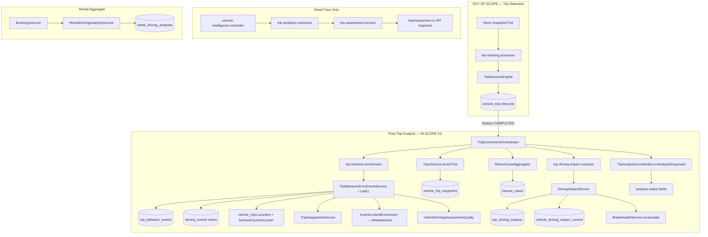

# Driving Intelligence V2 — Read-only Implementierungsinventur (Prompt 1/76)

| Feld | Wert |
|------|------|
| **Dokumenttyp** | Repository-Inventur / Implementierungsgrundlage |
| **Erstellt (UTC)** | 2026-07-16 |
| **Repository-Git-Commit** | `077587c5` (bei Erstellung) |
| **Basis-Audits** | [`driving-analysis-production-reality.md`](./driving-analysis-production-reality.md), [`dimo-driving-signals-capability.md`](./dimo-driving-signals-capability.md), [`driving-analysis-ux-decision-model.md`](./driving-analysis-ux-decision-model.md) |
| **Architektur-Referenzen** | [`TRIP_ANALYSIS_ASSESSABILITY_2026-07-05.md`](../../architecture/TRIP_ANALYSIS_ASSESSABILITY_2026-07-05.md), [`DRIVING_ASSESSMENT_DEVICE_QUALITY_2026-07-10.md`](../../architecture/DRIVING_ASSESSMENT_DEVICE_QUALITY_2026-07-10.md), [`TRIP_DETAIL_CH_EVIDENCE_2026-07-08.md`](../../architecture/TRIP_DETAIL_CH_EVIDENCE_2026-07-08.md) |
| **Schutzregel** | Trip-Erkennung / Live-Trip-FSM **out of scope** — siehe §12 |
| **Status** | Read-only — **keine** produktiven Codeänderungen in diesem Prompt |

---

## Executive Summary

Die Driving-Intelligence-Pipeline ist als **vierstufige Post-Trip-Analyse** (`behavior → route → misuse → drivingImpact`) implementiert und wird über `TripEnrichmentOrchestratorService` kanonisch angestoßen. Trip-Lifecycle (Start/Ende/FSM) ist strikt von Enrichment getrennt (`TRIP_OWNERSHIP.ts`).

**Produktionslage (Audit 2026-07-16):** Pipeline teilweise aktiv auf LTE_R1; `trip_analysis_status` historisch zu 84 % NULL; `driving_impact_status` desynchron zu `trip_driving_impact`; Rental Driving Analysis 0 Zeilen; Customer-Attribution ~5,4 %; UI nutzt monolithischen `tripAssessment` / `PRUEFHINWEIS`.

**V2-Ziel (aus UX-Decision-Model):** Sechsdimensionales `TripDecisionSummary` (Datenbasis, Fahrzeugbelastung, Fahrverhalten, Missbrauchsevidenz, Attribution, Empfehlung) — **noch nicht im Code**.

---

## 1. Datei- und Callsite-Matrix

### 1.1 Orchestrierung & Koordination

| Datei | Symbole | Rolle | Aufgerufen von |
|-------|---------|------|----------------|
| `backend/src/modules/vehicle-intelligence/trips/trip-enrichment-orchestrator.service.ts` | `TripEnrichmentOrchestratorService` | **Kanonischer Enrichment-Einstieg** — enqueue/sync behavior, route, misuse, driving impact | `trip-tracking.processor` (post-finalize), `trip-reconciliation.service`, `vehicle-intelligence.controller` (manual), `trip-behavior-enrichment.processor` (chain) |
| `backend/src/modules/vehicle-intelligence/trips/trip-analysis-coordinator.service.ts` | `TripAnalysisCoordinatorService` | `tripAnalysisStatus`, `analysisStagesJson`, `behaviorSummaryStatus`, `drivingImpactStatus` | Orchestrator, Recovery-Scheduler (indirekt) |
| `backend/src/modules/vehicle-intelligence/trips/trip-analysis-status.ts` | Pure functions | Stage-Modell, Assessability-Merge, Terminal-Logik | Coordinator, Mapper, Canonical Service |
| `backend/src/modules/vehicle-intelligence/trips/TRIP_OWNERSHIP.ts` | `TRIP_OWNERSHIP` | Lifecycle vs. Enrichment-Invarianten | Dokumentation + Code-Review |

### 1.2 Behavior Enrichment (HF + LTE_R1)

| Datei | Symbole | Rolle |
|-------|---------|------|
| `trip-behavior-enrichment.service.ts` | `TripBehaviorEnrichmentService` | HF-Pipeline SMART5/UNKNOWN; LTE_R1-Branch |
| `lte-r1-behavior-enrichment.service.ts` | `LteR1BehaviorEnrichmentService` | Native DIMO `behavior.*` → `DrivingEvent` |
| `hf-preprocessing.ts` | — | Gap-Split, Cleaning |
| `hf-acceleration.ts`, `hf-braking.ts` | — | HF-Ereignisdetektion |
| `hf-abuse.ts` | — | Abuse-Detektoren (kickdown, impact, cold engine, …) |
| `hf-mirror.service.ts` | `HfMirrorService` | ClickHouse HF-Spiegel |
| `hf-recuperation.ts` | — | EV traction summary |
| `hf-window-producer.ts` | — | HF-Fenster für CH |
| `unified-behavior-read-model.ts` | — | Native + HF Merge für API/Assessment |
| `unified-behavior-event.dto.ts` | — | Serialisierung behavior-events API |
| `driving-assessment-device-quality.service.ts` | — | LTE_R1 Gerätequalität |
| `driving-assessment-device-quality.detector.ts` | — | Degradation-Detektor |
| `driving-assessment-org-baseline.ts` | — | Org-Baseline für Device Quality |

### 1.3 Event Context

| Datei | Symbole | Rolle |
|-------|---------|------|
| `event-context/event-context-enrichment.service.ts` | `EventContextEnrichmentService` | ±30s Kontext → `DrivingEvent.metadataJson.contextAssessment` |
| `event-context/event-context-classifier.ts` | — | Konservative Klassifikation |
| `event-context/event-context-window.ts` | — | Anchor-Fenster |
| `event-context/event-context-stats.ts` | — | Signal-Stats, Cold-Engine-Schwellen |
| `event-context/engine-context.guards.ts` | — | ICE-only Guards |
| `event-context/event-context.types.ts` | — | Vokabular |

### 1.4 Route Enrichment

| Datei | Symbole | Rolle |
|-------|---------|------|
| `trips.service.ts` | `TripsService.enrichTrip` | Route, Road-Mix, Speeding, Temp, Performance |
| `mapbox-route-matcher.service.ts` | — | Map-Matching |
| `fmm-route-matcher.service.ts` | — | FMM-Alternative |
| `mapbox-speeding.ts` | — | Speeding-Sektionen |
| `route-map-matcher.port.ts` | — | Abstraktion |
| `backend/src/modules/dimo/queries/route-enrichment.query.ts` | — | DIMO `signals(interval:"7s")` |

### 1.5 Driving Impact

| Datei | Symbole | Rolle |
|-------|---------|------|
| `driving-impact/driving-impact.service.ts` | `DrivingImpactService` | Per-Trip + Rolling-30d-Aggregat |
| `driving-impact/driving-impact-scorer.ts` | — | Stress-Score-Mathematik |
| `driving-impact/driving-impact.config.ts` | — | Schwellen, Modellversion `v1.1.0` |
| `driving-impact/stress-level.util.ts` | — | low/medium/high/critical |

### 1.6 Misuse Cases

| Datei | Symbole | Rolle |
|-------|---------|------|
| `misuse-cases/misuse-case-aggregator.service.ts` | `MisuseCaseAggregatorService` | Post-Trip-Aggregation |
| `misuse-cases/misuse-case-rules.service.ts` | — | Regelengine |
| `misuse-cases/context-misuse-rules.ts` | — | Event-Context-Regeln |
| `misuse-cases/misuse-case-evidence.service.ts` | `MisuseCasePersistenceHelper` | Fingerprint-Upsert |
| `misuse-cases/misuse-cases.service.ts` | — | Read API |
| `misuse-cases/misuse-cases.controller.ts` | — | `GET /organizations/:orgId/misuse-cases` |

### 1.7 Trip Assessment & API Read Model

| Datei | Symbole | Rolle |
|-------|---------|------|
| `trip-assessment.service.ts` | `assessTrip()` | **Read-time** Gesamtbewertung (nicht persistiert) |
| `trip-assessment.builder.ts` | `buildTripAssessmentFromSignals` | Signal → Assessment |
| `trip-assessment.types.ts` | `TripAssessmentStatus` | UNAUFFÄLLIG … PRUEFHINWEIS … NICHT_BEWERTBAR |
| `trip-evidence-case.builder.ts` | — | Evidence Level → Status |
| `trip-evidence-read-model.ts` | — | CH/RPM Evidence |
| `trip-analytics-canonical.service.ts` | `buildTripAssessmentForTrip` | Canonical Read-Pfad |
| `trip-api.mapper.ts` | `mapTripForVehicleApi` | API-DTO inkl. `tripAssessment`, `tripAttribution` |
| `driver-score.service.ts` | `DriverScoreService` | Subject-Aggregation (Customer/Driver) |

### 1.8 Assignment & Attribution

| Datei | Symbole | Rolle |
|-------|---------|------|
| `trip-assignment.service.ts` | `TripAssignmentService` | Booking-Overlap → `VehicleTrip` Assignment-Felder |
| `trip-attribution.service.ts` | `TripAttributionService` | **Read-only** Scope/Confidence für UI |
| `trip-attribution.types.ts` | — | PRIVATE, BOOKING_ASSIGNED, TIME_WINDOW, … |

### 1.9 Rental Driving Analysis

| Datei | Symbole | Rolle |
|-------|---------|------|
| `rental-driving-analysis/rental-driving-analysis.service.ts` | — | Miet-Aggregation + Persist |
| `rental-driving-analysis/rental-driving-analysis.controller.ts` | — | Org-scoped Read API |
| `rental-driving-analysis/rental-driving-analysis.types.ts` | — | Payload-Contract |
| `bookings/bookings.service.ts` | — | Trigger bei Booking-Lifecycle |

### 1.10 Health Consumer (Tire / Brake)

| Datei | Symbole | Driving-Input |
|-------|---------|---------------|
| `tires/tire-health.service.ts` | `TireHealthService` | `DrivingImpactService.getVehicleImpactForTire()` |
| `tires/tire-wear-model.service.ts` | — | `drivingImpactAvailable` Flag |
| `brakes/brake-health.service.ts` | `BrakeHealthService` | `DrivingImpactService.getVehicleImpactForBrake()` |
| `workers/processors/driving-impact.processor.ts` | — | `brakeHealthService.recalculate()` post-impact |

### 1.11 Workers, Queues, Schedulers

| Datei | Queue / Intervall | Rolle |
|-------|-------------------|------|
| `workers/processors/trip-tracking.processor.ts` | `dimo.trip-tracking` | **FSM** — Snapshot → Detection → Finalize → Enrichment-Trigger |
| `workers/processors/trip-behavior-enrichment.processor.ts` | `trip.behavior.enrichment` | Behavior worker (3 retries, `jobId=hf-enrich-{tripId}`) |
| `workers/processors/driving-impact.processor.ts` | `trip.driving-impact.compute` | Impact worker (`jobId=driving-impact-{tripId}`) |
| `workers/schedulers/trip-tracking-recovery.scheduler.ts` | 2 min | Stuck FSM recovery |
| `workers/schedulers/trip-analysis-recovery.scheduler.ts` | 5 min | Stuck `misuse=pending` auf PARTIAL trips |
| `workers/schedulers/trip-reconciliation.scheduler.ts` | 15 min | Missing trips, enrichment failures |
| `workers/schedulers/dimo-snapshot.scheduler.ts` | 30 s | Snapshot poll → FSM input |
| `workers/queues/queue-names.ts` | — | Queue-Konstanten |

### 1.12 DIMO Integration

| Datei | Rolle |
|-------|------|
| `dimo/queries/driving-events.query.ts` | Native `events()` GraphQL |
| `dimo/queries/route-enrichment.query.ts` | Route-Signals |
| `dimo/dimo-segments.service.ts` | `fetchDrivingEvents`, HF, Segments |
| `dimo-segments.service` (via timeline) | `trips-timeline` — Segment-Boundaries für Timeline-API |

### 1.13 Reconciliation & Repair

| Datei | Rolle |
|-------|------|
| `trips/reconciliation/trip-reconciliation.service.ts` | Missing-trip detection, repair proposals, enrichment re-trigger |
| `trips/decision/trip-decision.engine.ts` | **Sole lifecycle writer** — create/finalize/discard/merge |
| `trips/reconciliation/reconciliation.types.ts` | Repair-Typen |

### 1.14 Observability

| Datei | Metriken |
|-------|----------|
| `observability/trip-metrics.service.ts` | `synqdrive_trip_*`, `synqdrive_enrichment_*`, `synqdrive_missing_trip_*`, assignment, score drift |
| `trip-ch-evidence-mirror.coordinator.ts` | CH Evidence Mirror (gated `HF_MIRROR_ENABLED`) |

### 1.15 API Controller

| Endpoint-Gruppe | Datei |
|-----------------|-------|
| Trips, enrichment, behavior-events, driver-score, driving-assessment-quality | `vehicle-intelligence.controller.ts` |
| Misuse cases | `misuse-cases.controller.ts` |
| Rental driving analyses | `rental-driving-analysis.controller.ts` |
| Customers (driving aggregates) | `customers.controller.ts` → `customers.service.ts` |

### 1.16 Frontend — Trip Surfaces

| Pfad | Rolle |
|------|-------|
| `frontend/src/rental/components/trips/VehicleTripsTab.tsx` | Orchestrator (Map + Timeline) |
| `frontend/src/rental/components/trips/TripTimelineExpanded.tsx` | Trip Detail Shell |
| `frontend/src/rental/components/trips/TripEvidencePanel.tsx` | Assessment + Attribution + Stress |
| `frontend/src/rental/components/trips/TripBehaviorSummary.tsx` | Behavior + Device Quality Banner |
| `frontend/src/rental/components/trips/VehicleStressPanel.tsx` | Fahrzeugbelastung |
| `frontend/src/rental/components/MisuseCasesPanel.tsx` | Missbrauchsfälle |
| `frontend/src/rental/components/trips/trip-overall-status.ts` | Listen-Badge (mappt PRUEFHINWEIS → „auffällig“) |
| `frontend/src/rental/components/trips/behavior-ui.utils.ts` | Labels inkl. PRUEFHINWEIS |
| `frontend/src/rental/components/customer-detail/CustomerDrivingTab.tsx` | Kunden-Aggregate |
| `frontend/src/rental/components/RentalStressAnalysisCard.tsx` | Miet-Analyse |
| `frontend/src/rental/components/booking-detail/BookingUsageMisuseTab.tsx` | Buchungs-Nutzung |
| `frontend/src/lib/api.ts` | DTOs: `TripAssessment`, `TripAttribution`, `RentalDrivingAnalysisItem`, … |

### 1.17 Frontend — Alerts / Insights / Tasks

| Pfad | Rolle |
|------|-------|
| `hooks/useDrivingAssessmentQuality.ts` | Device-Quality-Hook |
| `vehicle-detail/VehicleDrivingAssessmentQualityCard.tsx` | Fahrzeug-Chip |
| `dashboard/dashboardNotificationAdapter.ts` | `DRIVING_ASSESSMENT_DEVICE_QUALITY` |
| `dashboard/notifications/notification-task-bridge.ts` | Generic Task-CTA (kein Driving-Task-Typ) |
| `components/insights/InsightsCockpit.tsx` | `MisuseAbuseSection` |
| `lib/operational-issues/normalizeOperationalIssues.ts` | Misuse + Device Quality → Issues |

### 1.18 Prisma-Kernmodelle

| Model | Tabelle | Driving-Relevanz |
|-------|---------|------------------|
| `VehicleTrip` | `vehicle_trips` | Lifecycle + Enrichment + Analysis-Status |
| `TripBehaviorEvent` | `trip_behavior_events` | HF/rekonstruierte Events |
| `DrivingEvent` | `driving_events` | Native DIMO Events |
| `TripDrivingImpact` | `trip_driving_impacts` | Per-Trip Stress-Snapshot |
| `VehicleDrivingImpactCurrent` | `vehicle_driving_impact_current` | Rolling 30d |
| `MisuseCase` / `MisuseCaseEvidence` | `misuse_cases` / `misuse_case_evidence` | Prüffälle |
| `RentalDrivingAnalysis` | `rental_driving_analyses` | Miet-Aggregat |
| `VehicleDrivingAssessmentQuality` | `vehicle_driving_assessment_quality` | Gerätequalität |
| `VehicleTripDetectionState` | `vehicle_trip_detection_states` | FSM-State |
| `VehicleTripTrackingRun` | `vehicle_trip_tracking_runs` | FSM-Audit |
| `TripRepair` | `trip_repairs` | Reconciliation-Audit |
| `RpmWebhookCandidate` | `rpm_webhook_candidates` | Legacy/Shadow Evidence |

---

## 2. Alle Analyse-Schreibpfade



### 2.1 Schreibpfad-Details

| Pfad | Writer | Tabelle(n) | Trigger | Idempotenz |
|------|--------|------------|---------|------------|
| **A. Behavior HF** | `TripBehaviorEnrichmentService` | `trip_behavior_events`, `vehicle_trips` | Queue / sync | `deleteMany` + `createMany` pro Trip; Terminal-Status-Guard im Orchestrator |
| **B. Behavior LTE_R1** | `LteR1BehaviorEnrichmentService` | `driving_events`, `vehicle_trips` counters | Branch in A | Event dedup by DIMO id / time window |
| **C. Event Context** | `EventContextEnrichmentService` | `driving_events.metadataJson` only | Post-persist LTE_R1 | Update by event id |
| **D. Device Quality** | `DrivingAssessmentDeviceQualityService` | `vehicle_driving_assessment_quality` | End of behavior enrich | Upsert per vehicle |
| **E. Assignment** | `TripAssignmentService` | `vehicle_trips` assignment fields | End of behavior enrich | Overwrite per trip |
| **F. Route** | `TripsService.enrichTrip` | `vehicle_trip_waypoints`, `vehicle_trips` road/speeding | Post-behavior in Orchestrator | Waypoint delete+recreate |
| **G. Misuse** | `MisuseCaseAggregatorService` | `misuse_cases`, `misuse_case_evidence` | Fire-and-forget post-behavior | Fingerprint upsert |
| **H. Driving Impact** | `DrivingImpactService` | `trip_driving_impacts`, `vehicle_driving_impact_current`, `vehicle_trips.drivingImpactComputedAt` | Queue post-behavior | `tripDrivingImpact.upsert`; rolling recompute |
| **I. Analysis Status** | `TripAnalysisCoordinatorService` | `vehicle_trips` analysis fields | Throughout pipeline | Stage merge in `analysisStagesJson` |
| **J. Rental Analysis** | `RentalDrivingAnalysisService` | `rental_driving_analyses` | Booking completion | `bookingId` unique |
| **K. CH Mirror** | `HfMirrorService` / `TripChEvidenceMirrorCoordinator` | ClickHouse (optional) | Best-effort | Skip wenn CH down |
| **L. Trip Assessment** | — | **Keine** — rein read-time | API read | — |

### 2.2 Manuelle / Ops-Schreibpfade

| Pfad | Endpoint / Script | Wirkung |
|------|-------------------|---------|
| Manual behavior enrich | `POST …/trips/:tripId/behavior-enrich` | Orchestrator `enqueueBehaviorEnrichment(force?)` |
| Manual route enrich | `POST …/trips/:tripId/enrich` | `TripsService.enrichTrip` |
| Reconcile | `POST …/trips/reconcile` | `TripReconciliationService` — repairs via `TripDecisionEngine` |
| Backfill scripts | `backend/scripts/backfill-lte-r1-events-fuel.ts`, `probe-dimo-events.ts` | Ops only |
| Device quality backfill | `backend/scripts/backfill-driving-assessment-device-quality-fleet.ts` | Fleet baseline |

---

## 3. Alle Statusfelder und deren Writer

### 3.1 `VehicleTrip` — Analysis & Enrichment

| Feld | Werte | Primärer Writer | Sekundär |
|------|-------|-----------------|----------|
| `tripStatus` | ONGOING, COMPLETED, CANCELLED | **`TripDecisionEngine` only** | — |
| `tripAnalysisStatus` | PENDING, IN_PROGRESS, PARTIAL, COMPLETED, FAILED, SKIPPED | `TripAnalysisCoordinatorService` | — |
| `analysisQueuedAt` … `analysisLatencyMs` | timestamps / ms | Coordinator | — |
| `analysisStagesJson` | `{behavior,route,misuse,drivingImpact}` × `{pending,done,skipped,failed}` | Coordinator `markStage` | — |
| `behaviorEnrichmentStatus` | PENDING, IN_PROGRESS, COMPLETED, SKIPPED_NO_HF_DATA, FAILED_* | Orchestrator + `TripBehaviorEnrichmentService` | Processor on fail |
| `behaviorEnrichmentAttempts/Error/StartedAt` | diagnostics | Orchestrator, Enrichment Service | — |
| `behaviorSummaryJson` | assessability flags, HF stats, native counts | Enrichment Services | Coordinator `mergeAssessabilityIntoSummary` |
| `behaviorSummaryStatus` | PENDING, READY, SKIPPED, FAILED | Coordinator | — |
| `behaviorEnrichedAt` | timestamp | Enrichment Services | — |
| `drivingImpactStatus` | PENDING, READY, SKIPPED, FAILED | Coordinator | — |
| `drivingImpactComputedAt` | timestamp | Orchestrator `markDrivingImpactComputed` | `DrivingImpactService` |
| `qualityStatus` | VERIFIED, LOW_DATA, ANOMALY | Quality detectors / finalize path | — |
| `assignmentStatus` … `isPrivateTrip` | assignment enum fields | `TripAssignmentService` | — |

### 3.2 `behaviorSummaryJson` — eingebettete Assessability (API + persistiert)

| JSON-Feld | Writer | Reader |
|-----------|--------|--------|
| `analysisAssessability` | Enrichment + Coordinator merge | `trip-api.mapper`, Frontend `deriveTripAssessability` |
| `analysisLimitReason` | Enrichment | Mapper, Assessment |
| `shortTermMisuseAssessable` | Enrichment | Misuse aggregator gate |
| `nativeBehaviorEventsAvailable` | LteR1 service | Assessment, UI |
| `hfInsufficientForAbuse` | Enrichment | Assessment, UI |
| `nativeQuerySucceeded` | LteR1 service | Read-time reconciliation to FULL |

### 3.3 Downstream-Status (nicht auf Trip)

| Entität | Status-Feld | Writer |
|---------|-------------|--------|
| `VehicleDrivingAssessmentQuality` | `status` NORMAL/DEGRADED/RECOVERING | Device quality service |
| `TripDrivingImpact` | (kein Status — Datenzeile) | `DrivingImpactService` |
| `MisuseCase` | `informationalOnly` (default true) | Rules + Persistence |
| `RentalDrivingAnalysis` | `overallLevel`, `riskLevel`, … | Rental service |

### 3.4 Bekannte Status-Desyncs (Production P0)

| Symptom | Feld A | Feld B | Audit-Ref |
|---------|--------|--------|-----------|
| Impact da, Status pending | `trip_driving_impact` row | `drivingImpactStatus=PENDING` | Production-Reality P0-2 |
| Historische NULL | `trip_analysis_status=NULL` | Pipeline lief historisch | P0-1 |
| CH down | `hf_mirror skipped` | Assessability teils FULL | P0-3 |

---

## 4. Alle Legacy-Score-Spiegel

| Feld / API | Speicherort | Semantik heute | Canonical V2-Ziel | Consumer |
|------------|-------------|----------------|---------------------|----------|
| `vehicle_trips.driving_score` | DB column | Legacy Trip-Score | **Deprecate** → `TripDrivingImpact.drivingStressScore` | Rental service fallback |
| `vehicle_trips.abuse_score` | DB column | HF abuse aggregate | Behält technische Diagnose; nicht UI-Gesamtnote | Assessment signals |
| `trip_driving_impacts.driving_stress_score` | DB (`driving_style_score`) | Mechanische Belastung 0–100 | **Canonical Fahrzeugbelastung** | Stress panel, Assessment |
| `trip_driving_impacts.safety_score` | DB | Speeding-bezogen | Getrennt von Belastung | Impact detail |
| `vehicle_driving_impact_current.*` | DB | Rolling 30d Spiegel | Tire/Brake input | Health modules |
| `rental_driving_analyses.driving_score` | DB | Miet-Aggregat | → `vehicleStressSummary.drivingStressScore` | Customer tab |
| `TripAssessment.signals.drivingStressScore` | API read-time | Aus Impact | Dimension B | Trip detail |
| `customers.drivingStressScore` | API aggregate | `DriverScoreService` distance-weighted | Nur bei Attribution-Gate | Customers list/detail |
| `customers.drivingStyleScore` | API | **@deprecated** mirror | Remove | Legacy clients |
| `booking.usage.drivingStressScore` | API | Rental analysis | Dimension B aggregate | Booking dossier |
| `tripOverallRating` / Listen-Badge | Frontend derived | Kollabiert Assessment+Stress | → `recommendation` + `dataBasis` | Trips list |
| i18n `trips.drivingScore`, `customerDetail.drivingScore` | Frontend | Label „Fahrbewertung“ | → `vehicleLoad` | Mehrere Surfaces |
| `entityMappers.drivingScore: null` | Frontend | Placeholder | — | Legacy mappers |

---

## 5. Alle Fahrerverhaltens- und Fahrzeugbelastungs-Consumer

### 5.1 Fahrzeugbelastung (Stress / Impact)

| Consumer | Datei | Input |
|----------|-------|-------|
| Trip Detail Stress Panel | `VehicleStressPanel.tsx` | `drivingStressScore`, `stressLevel`, component scores |
| Trip Evidence Panel | `TripEvidencePanel.tsx` | Stress + Assessment kombiniert |
| Trip Assessment | `trip-assessment.service.ts` | `drivingStressScore`, `drivingStressLevel` |
| Trips List Badge | `trip-overall-status.ts` | Indirekt via Assessment |
| Customer List/Detail | `CustomersView.tsx`, `CustomerDrivingTab.tsx` | `drivingStressScore` aggregate |
| Booking Usage Tab | `BookingUsageMisuseTab.tsx` | `usage.drivingStressScore` |
| Rental Analysis Card | `RentalStressAnalysisCard.tsx` | `vehicleStressSummary` |
| Fleet Overview | `vehicle-overview-cards.utils.ts` | Trip stats stress level |
| Tire Health V2 | `tire-health.service.ts` | `VehicleDrivingImpactCurrent` |
| Brake Health V2 | `brake-health.service.ts` | `VehicleDrivingImpactCurrent` |
| Return Inspection Detector | `return-needs-inspection.detector.ts` | Stress + misuse hints |
| AI Health Summary | `health-summary.service.ts` | Indirekt via health modules |

### 5.2 Fahrverhalten (Conduct / Events / Misuse)

| Consumer | Datei | Input |
|----------|-------|-------|
| Behavior Summary | `TripBehaviorSummary.tsx` | `tripAssessment`, behavior events, device quality |
| Behavior Event List | `TripBehaviorEventList.tsx` | Unified behavior events API |
| Misuse Panel | `MisuseCasesPanel.tsx` | `misuseCases.list` |
| Trip Assessment | `trip-assessment.service.ts` | Event counts, abuse-relevant, misuse cases |
| Insights Cockpit | `InsightsCockpit.tsx` | Top misuse cases org-wide |
| Handover Dialog | `HandoverProtocolDialog.tsx` | Misuse count hint |
| Operational Issues | `normalizeOperationalIssues.ts` | Misuse → dashboard issues |
| Notifications | `dashboardNotificationAdapter.ts` | Device quality (nicht conduct) |
| Customer Decision Cards | `CustomerDecisionCards.tsx` | Event/abuse counts |
| Data Analyse | `data-analyse.service.ts` | Field traces, event architecture |

### 5.3 Vermischungs-Risiko (Ist)

| Stelle | Problem |
|--------|---------|
| `tripOverallRating` | Stress + Behavior + Abuse in einem Badge |
| `TripEvidencePanel` „Gesamtbewertung“ | Monolithische Zeile |
| `CustomerDrivingTab` | Ein Stress-Score ohne Dimensions-Trennung |
| i18n „Fahrbewertung“ | Belastung klingt wie Fahrerurteil |
| `PRUEFHINWEIS` | Gerät + Missbrauch + Verhalten |

---

## 6. Alle nativen, rekonstruierten und synthetischen Eingaben

| Quelle | Typ | Pipeline | Persistenz | UI-Kennzeichnung heute |
|--------|-----|----------|------------|------------------------|
| DIMO `behavior.harshAcceleration` etc. | **Native** | `LteR1BehaviorEnrichmentService` | `driving_events` source=TELEMETRY_EVENTS | Teilweise |
| DIMO `events` safety (collision) | **Native** | Misuse rules | `MisuseCaseEvidence` | Ja |
| HF acceleration/braking detectors | **Rekonstruiert** | `hf-acceleration.ts`, `hf-braking.ts` | `trip_behavior_events` | „HF“ in metadata |
| HF abuse detectors | **Rekonstruiert** | `hf-abuse.ts` | `trip_behavior_events` | — |
| Event context (±30s signals) | **Synthetisch/Kontext** | `EventContextEnrichmentService` | `driving_events.metadataJson` | `TripEventContextBlock` |
| ClickHouse HF mirror | **Shadow** | `HfMirrorService` | ClickHouse | `TripClickHouseEvidenceBlock` |
| RPM webhook candidates | **Shadow/Legacy** | Intake + read model | `rpm_webhook_candidates` | `TripRpmCandidatesList` |
| Route signals 7s | **Rekonstruiert** | DIMO signals + map match | `vehicle_trip_waypoints` | Map overlay |
| Speeding sections | **Synthetisch** | Mapbox matcher | `speedingSectionsJson` | Enrichment panel |
| `unified-behavior-read-model` merge | **Mixed** | Read-time dedupe | — | `event-context-ui.ts` grades |
| `trip_assessment` PRUEFHINWEIS | **Synthetisch** | `trip-assessment.service` rules | Nicht persistiert | Überall |

### 6.1 Hardware-Profil-Matrix (DIMO Capability Audit)

| Profil | Native Events | HF Path | Event Context | Misuse short-term |
|--------|---------------|---------|---------------|-------------------|
| LTE_R1 ICE | Primary | Parallel abuse slice | ICE only | Gated by `hfInsufficientForAbuse` |
| SMART5 | Rare | Primary | Limited | HF-dependent |
| Tesla / BEV | None observed | Sparse | Skipped (ICE guard) | NOT_ASSESSABLE typical |
| UNKNOWN | Variable | HF fallback | Profile-dependent | Variable |

---

## 7. Alle fehlenden Idempotency-/Recompute-Pfade

| Lücke | Ist | Risiko | V2-Ziel |
|-------|-----|--------|---------|
| **`drivingImpactStatus` nicht gesetzt bei existierender Impact-Row** | Impact upsert ohne Coordinator `markStage(drivingImpact,done)` in allen Pfaden | UI zeigt PENDING trotz Daten | P0: Status-Sync nach jedem erfolgreichen Compute |
| **`trip_analysis_status` historisch NULL** | Kein Backfill-Job | 84 % ohne Status | Backfill-Script + Migration |
| **Trip Assessment nicht persistiert** | Recompute bei jedem API-Call | Inkonsistent bei parallelen Reads | Optional `trip_decision_summaries` Tabelle |
| **Rental analysis nur bei Booking-Event** | Kein Recompute bei nachträglicher Trip-Analyse | Stale Miet-Reports | Recompute hook post-analysis |
| **Customer aggregate ohne Re-Attribution** | `DriverScoreService` statisch | Falsche Kunden-KPIs bei Assignment-Nachzug | Recompute on assignment change |
| **Misuse nur fire-and-forget** | Fehler verschluckt | Stuck `misuse=pending` | Recovery existiert (5 min) — ausbauen |
| **Route failure → skipped** | Non-fatal skip | Stage done/skipped uneinheitlich | Explizite `skipped` reason in stages |
| **CH mirror ohne DLQ** | `skipped_unavailable` counter only | Keine Evidence-Pfad-Transparenz | Metric + UI dataBasis flag |
| **Driving impact re-run** | Upsert überschreibt | OK für Trip; rolling current recompute teuer | Debounced rolling update |
| **Device quality ↔ Assessment** | Separate Pfade | Gerät degradiert, Assessment noch FULL | Coordinator cap (teilweise vorhanden) |
| **Kein `TripDecisionSummary` Recompute API** | — | — | `POST …/trips/:id/recompute-decision` |
| **Brake recalc nach Impact** | Fire-and-forget in processor | Fehler unsichtbar | Awaited oder queue |

---

## 8. Alle Attribution- und Tenant-Grenzen

### 8.1 Tenant-Isolation

| Schicht | Mechanismus |
|---------|-------------|
| API | `organizationId` aus Auth-Context; vehicle scoped via `vehicles.organizationId` |
| Misuse API | `GET /organizations/:orgId/misuse-cases` — org filter mandatory |
| Rental Analysis | `organizationId` auf `RentalDrivingAnalysis` |
| Trip APIs | Vehicle-scoped (`/vehicles/:vehicleId/...`) — org implicit via vehicle membership |
| Customer Driving | `customers.service` — org scoped |

### 8.2 Attribution-Modell

| `TripAttribution.scope` | Bedingung | `customerChargeable` | Empfehlungs-Gate V2 |
|-------------------------|-----------|----------------------|---------------------|
| `PRIVATE` | `isPrivateTrip=true` | false | Nur Fahrzeug-Views |
| `BOOKING_ASSIGNED` | EXPLICIT booking link | true (wenn confidence hoch) | Kunden-Empfehlung erlaubt |
| `BOOKING_TIME_WINDOW_MATCH` | TIME_WINDOW link | false / niedrig | Kein Kundenvorwurf |
| `UNASSIGNED` | Kein Match | false | Fahrzeugbezogen |

**Writer:** Nur `TripAssignmentService` schreibt Assignment-Felder. `TripAttributionService` leitet read-only ab.

### 8.3 Production-Attribution (Audit)

- 94,6 % private trips — Customer/Driver-Aggregate meist **nicht belastbar**
- `bookingLinkSource=EXPLICIT` selten — V2 muss `TIME_WINDOW` visuell warnen (`trip-attribution-ui.utils.ts` existiert)

### 8.4 Misuse Attribution Snapshot

`MisuseCase` speichert Assignment-Snapshot zum Detektionszeitpunkt — **nicht** retroaktiv aktualisiert bei nachträglicher Assignment-Änderung.

---

## 9. Alle Health-Consumer

| Modul | Service | Driving-Dependency | Tabelle | Status Prod |
|-------|---------|-------------------|---------|-------------|
| **Tire Health V2** | `tire-health.service.ts` | `getVehicleImpactForTire()` → rolling stress, road mix, per-100km | `vehicle_driving_impact_current` | **READY** (1.245 snapshots/30d) |
| **Tire Wear Model** | `tire-wear-model.service.ts` | `drivingImpactAvailable` boolean | — | Active |
| **Brake Health V2** | `brake-health.service.ts` | `getVehicleImpactForBrake()` | `vehicle_driving_impact_current`, `driving_events` | **NOT READY** (0 rows `brake_health_current`) |
| **Brake Recalc** | `driving-impact.processor.ts` | Post-impact `recalculate(vehicleId)` | — | Hook exists, no output |
| **Rental Health** | `rental-health.service.ts` | Indirect via vehicle health | — | Not driving-specific |
| **Return Inspection Insight** | `return-needs-inspection.detector.ts` | Misuse + stress thresholds | — | Shadow |
| **AI Health Care** | `ai-health-care-aggregation.service.ts` | Health summary inputs | — | No direct trip events |

**Regel V2:** Health-Consumer lesen **Fahrzeugbelastung** (`VehicleDrivingImpactCurrent`), nicht `tripAssessment` oder Misuse direkt.

---

## 10. Seit den Audits bereits geänderte Dateien

**Git-Basis Audits:** `9be93a84` (production-reality), `cdf95834` (dimo-signals), `077587c5` (ux-decision-model) = **HEAD**.

### 10.1 Seit `9be93a84` (Driving-Audit-Serie)

| Commit | Änderung |
|--------|----------|
| `cdf95834` | Nur `docs/audits/dimo-driving-signals-capability.md` |
| `077587c5` | Nur `docs/audits/driving-analysis-ux-decision-model.md` |

**Kein Anwendungscode** seit Beginn der Driving-Audit-Serie.

### 10.2 Letzte Code-Änderungen an Driving-Implementierung (vor Audits, relevant)

| Bereich | Repräsentative Commits / Changes-Einträge |
|---------|-------------------------------------------|
| Trip analysis status V4.9.201 | `trip-analysis-coordinator`, assessability refinement |
| Device quality Phases 0–5 | `driving-assessment-device-quality.*`, Notifications |
| Stress/Behavior split V4.9.110 | `VehicleStressPanel`, `trip-assessment-copy` |
| Unified behavior DTO V4.9.108 | `unified-behavior-read-model`, context blocks |
| Event context + misuse V4.9.90+ | `event-context/*`, `context-misuse-rules` |
| LTE_R1 native path | `lte-r1-behavior-enrichment.service.ts` |
| Evidence level builder | `trip-evidence-case.builder.ts` |

### 10.3 VPS vs. Repo (bei Production-Reality-Audit)

| | Commit |
|---|--------|
| Repo HEAD (jetzt) | `077587c5` |
| VPS deployed (Audit-Zeitpunkt) | `2cd57c8` |

Produktion kann hinter Repo-Dokumentation liegen; **keine neuen Driving-Code-Commits** seit Audit-Serie.

---

## 11. Exakte Änderungsmatrix für Prompts 5–76

> Prompts **1–4**: Inventur (dieses Dokument), Architekturvertrag, Rollout-Flags, Domain-Entscheidung — analog Battery V2 Serie.  
> Prompts **5–76**: Umsetzung in Blöcken. Dateipfade beziehen sich auf Repo-Root.

### Block A — Pipeline Truth & P0 (Prompts 5–12)

| Prompt | Ziel | Primäre Dateien |
|--------|------|-----------------|
| **5** | `drivingImpactStatus=READY` wenn `trip_driving_impacts` existiert | `driving-impact.service.ts`, `trip-analysis-coordinator.service.ts`, `trip-enrichment-orchestrator.service.ts` |
| **6** | Backfill `trip_analysis_status` für historische COMPLETED trips | Neues `scripts/backfill-trip-analysis-status.ts`, Coordinator |
| **7** | `analysisStagesJson` Reconcile aus Ist-Daten | Coordinator, Backfill-Script |
| **8** | Prometheus: `driving_impact_status_desync_total`, `trip_analysis_null_total` | `trip-metrics.service.ts` |
| **9** | Orchestrator: driving-impact chain **awaited** status mark | `trip-enrichment-orchestrator.service.ts` |
| **10** | Recovery: stuck `drivingImpact=pending` | `trip-analysis-recovery.scheduler.ts` |
| **11** | ClickHouse unavailable → `dataBasis=EINGESCHRÄNKT` Flag in summary | `trip-ch-evidence-mirror.coordinator.ts`, später Summary |
| **12** | Ops runbook: analysis/impact desync repair | `docs/runbooks/driving-analysis-status-repair.md` |

### Block B — TripDecisionSummary Domain (Prompts 13–20)

| Prompt | Ziel | Primäre Dateien |
|--------|------|-----------------|
| **13** | `trip-decision-summary.types.ts` — Dimensionen A–F | Neu unter `trips/` |
| **14** | `trip-decision-summary.service.ts` — Orchestrator A–F | Neu; liest Impact, Assessment, Misuse, Attribution, Device Quality |
| **15** | `PRUEFHINWEIS` auflösen → dimensionale Flags | `trip-assessment.service.ts` (deprecate monolith) |
| **16** | `trip-api.mapper.ts` expose `tripDecisionSummary` | Mapper + Controller |
| **17** | List badge: `listBadge { recommendation, dataBasis }` | `trip-analytics-canonical.service.ts`, Mapper |
| **18** | `per100km` rates im Read-Model | `driving-impact.service.ts`, Summary types |
| **19** | Evidence `source` tagging (NATIVE/HF/CONTEXT/MIXED) | `unified-behavior-read-model.ts`, Summary |
| **20** | Unit tests Summary + Mapping | `trip-decision-summary.service.spec.ts` |

### Block C — Normalisierung & Evidence (Prompts 21–28)

| Prompt | Ziel | Primäre Dateien |
|--------|------|-----------------|
| **21** | Event cluster detection (Zeit+Nähe) | Neu `trip-event-cluster.service.ts` |
| **22** | `eventCount` vs deduped visible count fix in Misuse | `misuse-case-evidence.service.ts`, Aggregator |
| **23** | Context-only evidence → `informationalOnly` enforced | `context-misuse-rules.ts` |
| **24** | HF-only paths → `source=HF_RECONSTRUCTED` in Summary | Summary service |
| **25** | Device quality cap → max `TECHNISCHE_DATENPRUEFUNG` | Summary recommendation rules |
| **26** | Native extreme ohne abuse-flag → conduct only | `trip-assessment.service.ts`, Summary |
| **27** | Stress critical → `vehicleLoad` only, not conduct | Summary dimension B/C split |
| **28** | Regression tests evidence grades | Specs |

### Block D — Attribution & Tenant Gates (Prompts 29–36)

| Prompt | Ziel | Primäre Dateien |
|--------|------|-----------------|
| **29** | `customerChargeable` gate in recommendation engine | Summary service |
| **30** | `EXPLICIT` booking required for `KUNDENGESPRAECH` | Summary + `trip-attribution.service.ts` |
| **31** | Customer aggregate: `attributionCoveragePct` | `customers.service.ts`, `driver-score.service.ts` |
| **32** | Filter score-eligible trips in DriverScore | `driver-score.service.ts` |
| **33** | Misuse snapshot refresh on assignment change (optional job) | Neuer Scheduler oder hook in `trip-assignment.service.ts` |
| **34** | Rental analysis: only EXPLICIT-attributed trips | `rental-driving-analysis.service.ts` |
| **35** | API: `scoredBookingsCount`, `scoredTripCount` auf Customer | `customers.service.ts`, `api.ts` |
| **36** | Frontend attribution warnings prominent | `trip-attribution-ui.utils.ts`, `CustomerDrivingTab.tsx` |

### Block E — Rental Period & Booking (Prompts 37–44)

| Prompt | Ziel | Primäre Dateien |
|--------|------|-----------------|
| **37** | `decisionSummary` in `RentalDrivingAnalysis.payload` | `rental-driving-analysis.service.ts`, types |
| **38** | Auto-materialize on booking COMPLETED + recompute hook | `bookings.service.ts` |
| **39** | `tripsScored/tripsTotal` in rental payload | Rental service |
| **40** | `RentalPeriodDecisionSummary.tsx` | Neu Frontend |
| **41** | `BookingUsageMisuseTab` → dimensional summary | `BookingUsageMisuseTab.tsx` |
| **42** | Handover return recommendation structured | `HandoverProtocolDialog.tsx` |
| **43** | Booking `usage` block dimensional fields | `booking-detail.types.ts`, bookings mapper |
| **44** | E2E: completed booking → rental analysis row | Test spec |

### Block F — Frontend Trip Surfaces (Prompts 45–52)

| Prompt | Ziel | Primäre Dateien |
|--------|------|-----------------|
| **45** | `TripDecisionSummary.tsx` + types + mapper | Neu unter `trips/` |
| **46** | `TripTimelineExpanded` — Summary oben, Gesamtbewertung ersetzen | `TripTimelineExpanded.tsx` |
| **47** | `trip-overall-status.ts` — recommendation + dataBasis chips | Refactor |
| **48** | `behavior-ui.utils.ts` — remove PRUEFHINWEIS label | Refactor |
| **49** | `TripBehaviorSummary` — device banner → dataBasis chip | Refactor |
| **50** | `MisuseCasesPanel` embed in Missbrauch column | Refactor |
| **51** | Mobile: max 2 chips | `TripTimelineCard.tsx`, `trips-view-ui.ts` |
| **52** | `trips-view-ui.ts` → i18n migration start | `i18n/translations/*.ts` |

### Block G — Customer / Driver / Vehicle Profiles (Prompts 53–60)

| Prompt | Ziel | Primäre Dateien |
|--------|------|-----------------|
| **53** | `CustomerDrivingTab` — per-rental dimensional table | `CustomerDrivingTab.tsx` |
| **54** | `CustomerDecisionCards` ↔ recommendation | `CustomerDecisionCards.tsx` |
| **55** | `VehicleLoadHistoryPanel.tsx` | Neu |
| **56** | Vehicle trips tab — load history histogram | `VehicleTripsTab.tsx` |
| **57** | Customers list — stress → load label | `CustomersView.tsx`, `customer-list-ui.ts` |
| **58** | New booking customer picker — dataBasis hint | `NewBookingView.tsx` |
| **59** | Driver history (customer w/ EXPLICIT driver trips) | Customer detail hooks |
| **60** | Empty states: no attribution / insufficient data | Customer + Trip components |

### Block H — Audit Trail & Manual Approval (Prompts 61–68)

| Prompt | Ziel | Primäre Dateien |
|--------|------|-----------------|
| **61** | Prisma `DrivingDecisionAudit` model | `schema.prisma`, migration |
| **62** | `driving-decisions` module CRUD | Neu `backend/src/modules/driving-decisions/` |
| **63** | `POST/GET …/driving-decisions` API | Controller |
| **64** | `ManualRentalApprovalDialog.tsx` | Neu Frontend |
| **65** | Revoke flow + `revokedAt/reason` | Module + UI |
| **66** | Customer detail: last manual decision | `CustomerDetailView.tsx` |
| **67** | Inspection task CTA from `FAHRZEUGPRUEFUNG` | `notification-task-bridge.ts`, Tasks integration |
| **68** | No auto-blacklist guard tests | Specs |

### Block I — Alerts, Tasks, Insights, i18n (Prompts 69–74)

| Prompt | Ziel | Primäre Dateien |
|--------|------|-----------------|
| **69** | Notification dimensional copy | `notificationQueueEnricher.ts`, i18n |
| **70** | `DRIVING_ASSESSMENT_DEVICE_QUALITY` → dataBasis semantics | `dashboardNotificationAdapter.ts` |
| **71** | Insights misuse section → link to decision summary | `InsightsCockpit.tsx` |
| **72** | i18n keys `driving.dataBasis.*` … `driving.recommendation.*` | All locales |
| **73** | Deprecate `trips.drivingScore` keys | i18n |
| **74** | WCAG: dimension blocks `aria-labelledby` | Trip components |

### Block J — Tests, Ops, Abschluss (Prompts 75–76)

| Prompt | Ziel |
|--------|------|
| **75** | Changes + Architektur + Acceptance AC1–AC10 aus UX-Audit |
| **76** | Production readiness review + feature flag `DRIVING_INTELLIGENCE_V2` |

---

## 12. Geschützte Trip-Detection-Dateien (NICHT verändern)

> **Verbindliche Schutzregel Prompt 1:** Trip-Erkennung und Live-Trip-FSM sind vollständig out of scope. DIMO-Segmente dürfen später **ausschließlich nachgelagert** zur Validierung/Reconciliation bereits erkannter Trips verwendet werden — nicht als primärer Trip-Start/Ende-Trigger.

### 12.1 Lifecycle Authority (RULE 1–2 in `TRIP_OWNERSHIP.ts`)

| Datei | Grund |
|-------|-------|
| `backend/src/modules/vehicle-intelligence/trips/decision/trip-decision.engine.ts` | Sole `vehicleTrip.create()` + `tripStatus` transitions |
| `backend/src/modules/vehicle-intelligence/trips/decision/decision.types.ts` | Lifecycle types |
| `backend/src/modules/vehicle-intelligence/trips/decision/index.ts` | Barrel |

### 12.2 FSM & Detection Orchestration

| Datei | Grund |
|-------|-------|
| `backend/src/modules/vehicle-intelligence/trips/trip-detection-orchestration.service.ts` | Live FSM, snapshot evaluation, finalize triggers |
| `backend/src/modules/vehicle-intelligence/trips/trip-detection.types.ts` | FSM types |
| `backend/src/modules/vehicle-intelligence/trips/trip-detection.spec.ts` | FSM tests |
| `backend/src/workers/processors/trip-tracking.processor.ts` | `dimo.trip-tracking` consumer |
| `backend/src/workers/schedulers/trip-tracking-recovery.scheduler.ts` | Stuck FSM recovery |

### 12.3 Detectors (RULE 4 — findings only, no writes)

| Datei | Grund |
|-------|-------|
| `trips/detectors/detector.registry.ts` | Detector registry |
| `trips/detectors/detector.interfaces.ts` | Interfaces |
| `trips/detectors/activity-window.detector.ts` | Start evidence |
| `trips/detectors/change-point-end.detector.ts` | End detection |
| `trips/detectors/continuity-assessment.detector.ts` | Continuity |
| `trips/detectors/end-continuity.detector.ts` | End continuity |
| `trips/detectors/ignition-segment.detector.ts` | Ignition segments |
| `trips/detectors/motion-segment.detector.ts` | Motion segments |
| `trips/detectors/snapshot-evidence.evaluator.ts` | Snapshot evidence |
| `trips/detectors/start-confirmation.detector.ts` | Start confirmation |
| `trips/detectors/trip-overlap.detector.ts` | Overlap |
| `trips/detectors/trip-quality.detector.ts` | Quality |

### 12.4 Policy & Thresholds

| Datei | Grund |
|-------|-------|
| `trips/policy/trip-detection-policy.resolver.ts` | Grace periods, thresholds |
| `trips/policy/policy.types.ts` | Policy types |
| `trips/policy/index.ts` | Barrel |
| `trips/trip-cusum.ts` | CUSUM end detection math |

### 12.5 Snapshot Input (read-only for V2; keine Trigger-Änderung)

| Datei | Grund |
|-------|-------|
| `backend/src/workers/processors/dimo-snapshot.processor.ts` | Snapshot normalize — triggert FSM |
| `backend/src/workers/schedulers/dimo-snapshot.scheduler.ts` | Poll interval |
| `backend/src/modules/dimo/dimo-telemetry.service.ts` | `signalsLatest` |

### 12.6 Reconciliation (nur Lifecycle via DecisionEngine)

| Datei | Erlaubt in V2 | Verboten |
|-------|---------------|----------|
| `trips/reconciliation/trip-reconciliation.service.ts` | Enrichment re-trigger, read-only audits | Neue Start/End-Heuristiken, direkte `tripStatus` writes |
| `trips/reconciliation/reconciliation.types.ts` | Typen | — |

### 12.7 Prisma FSM State

| Model / Tabelle | Grund |
|-----------------|-------|
| `VehicleTripDetectionState` | Live detection state per vehicle |
| `VehicleTripTrackingRun` | FSM run audit log |
| `VehicleTrip.tripStatus` | Lifecycle column |
| `VehicleTrip.detectionProfile`, `startDetectionMode`, `possibleStartAt`, `possibleEndAt`, … | Detection metadata |

### 12.8 Explizit IN SCOPE für V2 (kein Schutz)

- `trip-enrichment-orchestrator.service.ts` und alles **nach** `finalizeTrip`
- `trip-analysis-coordinator.service.ts`
- Behavior, Route, Misuse, Impact, Assessment, Attribution, Rental Analysis
- Frontend Trip Detail / Customer / Booking driving surfaces
- Neues `TripDecisionSummary` / `driving-decisions` Modul

---

## 13. Bestehende Tests (Inventar)

### 13.1 Backend Unit/Integration

| Bereich | Spec-Dateien |
|---------|--------------|
| Analysis coordinator/status | `trip-analysis-status.spec.ts` |
| Assessment | `trip-assessment.service.spec.ts`, `trip-evidence-case.builder.spec.ts` |
| Analytics canonical | `trip-analytics-canonical.service.spec.ts` |
| Attribution/Assignment | `trip-attribution.service.spec.ts`, `trip-assignment.service.spec.ts` |
| Behavior HF | `hf-abuse.spec.ts`, `hf-mirror.service.spec.ts`, `hf-window-producer.spec.ts` |
| LTE_R1 native | `lte-r1-behavior-enrichment.service.spec.ts` |
| Unified read model | `unified-behavior-read-model.spec.ts`, `unified-behavior-event.dto.spec.ts` |
| Event context | `event-context-*.spec.ts` (7 Dateien) |
| Misuse | `misuse-case-rules.service.spec.ts`, `context-misuse-rules.spec.ts`, `misuse-case-persistence.spec.ts`, `misuse-cases.service.spec.ts` |
| Driving impact | `driving-impact.service.spec.ts`, `stress-level.util.spec.ts` |
| Driver score | `driver-score.service.spec.ts` |
| Device quality | `driving-assessment-device-quality.detector.spec.ts`, `driving-assessment-org-baseline.spec.ts` |
| Trip detection | `trip-detection.spec.ts` (**geschützt**) |
| Tire/Brake health | `tire-health.spec.ts`, `brake-health.spec.ts`, `brake-registration-regression.spec.ts` |
| Mapbox/route | `mapbox-speeding.spec.ts` |
| CH/evidence | `trip-evidence-read-model.spec.ts`, `waypoint-mirror.service.spec.ts` |
| BI/notifications | `driving-assessment-device-quality.detector.spec.ts` (BI), `return-needs-inspection.detector.spec.ts` |

### 13.2 Frontend Tests

| Datei | Abdeckung |
|-------|-----------|
| `trip-assessment-ui-semantics.test.ts` | Assessment semantics |
| `trip-assessment-copy.test.ts` | Copy helpers |
| `trip-attribution-ui.test.ts` | Attribution labels |
| `trip-evidence-ui.test.ts` | Evidence display |
| `trip-event-evidence-display.test.ts` | Event evidence |
| `trip-detail-ui-refactor.test.ts` | Detail layout |
| `trips-ui-cleanup.test.ts`, `trips-badges-cleanup.test.ts` | Badge regression |
| `behavior-rating.test.ts`, `behavior-event-count.utils.test.ts` | Behavior utils |
| `event-context-ui.test.ts` | Context labels |
| `operationalIssues.test.ts` | Misuse → issues |
| `dashboardNotificationAdapter.test.ts` | Driving notifications |

### 13.3 Test-Lücken für V2

- Kein `trip-decision-summary` Spec (existiert noch nicht)
- Kein E2E Rental Analysis → UI
- Kein Integration Test Impact-Status-Sync
- Kein Frontend-Spec für dimensionale Chips (recommendation/dataBasis)
- Kein Audit-Trail / Manual Approval Test

---

## 14. P0/P1-Risiken (Implementierungsblocker)

| ID | Risiko | Beleg |
|----|--------|-------|
| P0-01 | `trip_analysis_status` 84 % NULL | Production-Reality |
| P0-02 | `driving_impact_status` desync vs. Impact row | Production-Reality |
| P0-03 | ClickHouse down → HF evidence shadow | Production-Reality |
| P0-04 | `PRUEFHINWEIS` vermischt Dimensionen | UX-Decision-Model |
| P0-05 | Customer attribution 5,4 % | Production-Reality |
| P0-06 | Rental driving analysis 0 rows | Production-Reality |
| P0-07 | Brake health consumer empty | Production-Reality |
| P1-01 | 100% `misuse.informationalOnly` | Production-Reality |
| P1-02 | HF cadence 3–10 s not 1 Hz | DIMO Capability Audit |
| P1-03 | i18n „Fahrbewertung“ | UX-Decision-Model |
| P1-04 | Trips tab copy non-i18n (`trips-view-ui.ts`) | Frontend inventory |
| P1-05 | Misuse assignment snapshot stale | §8.4 |
| P1-06 | No driving-specific task type | notification-task-bridge |

---

## Anhang A — Verwendete Suchbefehle

```bash
# Pipeline discovery
rg -l 'TripEnrichmentOrchestrator|TripAnalysisCoordinator|DrivingImpactService|MisuseCaseAggregator' backend
rg 'tripAnalysisStatus|drivingImpactStatus|behaviorEnrichmentStatus' backend/prisma/schema.prisma
rg 'drivingStressScore|drivingScore|abuseScore|PRUEFHINWEIS' backend frontend

# Protected detection
rg -l 'TripDecisionEngine|trip-detection-orchestration|trip-tracking.processor' backend
find backend/src/modules/vehicle-intelligence/trips/detectors -name '*.ts'

# Frontend consumers
rg -l 'tripAssessment|MisuseCasesPanel|VehicleStressPanel|CustomerDrivingTab' frontend
rg 'drivingScore|drivingStressScore' frontend/src/lib/api.ts

# Tests
find backend frontend -iname '*trip*' -name '*.spec.ts' -o -name '*.test.ts' | rg -i 'driving|behavior|misuse|assessment|impact'

# Git since audits
git log --oneline 9be93a84..HEAD
```

---

## Anhang B — Offene Architekturkonflikte (Ist vs. V2-Ziel)

| # | Ist-Code | V2-Ziel (UX-Decision-Model) |
|---|----------|----------------------------|
| K1 | Monolith `tripAssessment.status` | 6 Dimensionen `TripDecisionSummary` |
| K2 | `PRUEFHINWEIS` User-Label | Aufgelöst in A–F |
| K3 | Listen-Badge „auffällig“ für Geräteproblem | `dataBasis` + `recommendation` |
| K4 | Stress = Fahrerbewertung in Copy | Getrennte Labels Belastung/Verhalten |
| K5 | Customer aggregate ohne Attribution-Gate | `attributionCoveragePct` |
| K6 | HF shadow als belastbare Evidence | `HF_RECONSTRUCTED` Badge |
| K7 | Absolute `eventCount` in Misuse | pro 100 km + Cluster |
| K8 | Assessment nicht persistiert | Optional Audit + Summary persist |
| K9 | Rental analysis nicht materialisiert | Auto auf Booking COMPLETED |
| K10 | Brake health nicht befüllt trotz Impact | Recalc hook fix |

---

## Referenzen

- [`driving-analysis-production-reality.md`](./driving-analysis-production-reality.md)
- [`dimo-driving-signals-capability.md`](./dimo-driving-signals-capability.md)
- [`driving-analysis-ux-decision-model.md`](./driving-analysis-ux-decision-model.md)
- [`TRIP_ANALYSIS_ASSESSABILITY_2026-07-05.md`](../../architecture/TRIP_ANALYSIS_ASSESSABILITY_2026-07-05.md)
- [`DRIVING_ASSESSMENT_DEVICE_QUALITY_2026-07-10.md`](../../architecture/DRIVING_ASSESSMENT_DEVICE_QUALITY_2026-07-10.md)
- [`TRIP_OWNERSHIP.ts`](../../backend/src/modules/vehicle-intelligence/trips/TRIP_OWNERSHIP.ts)

---

*Changes / Architektur: **nicht aktualisiert** (reines Audit/Inventur-Dokument).*
