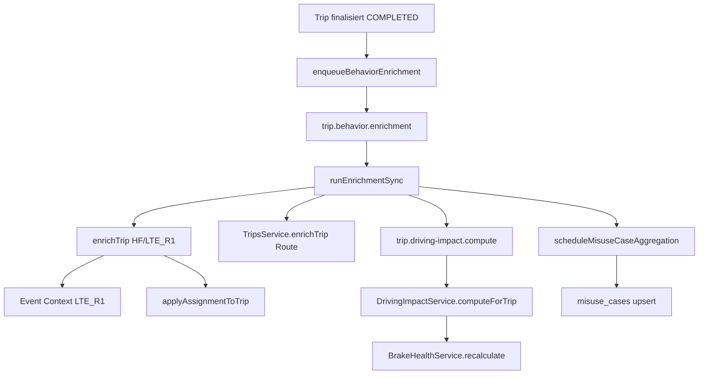

# Driving Intelligence V2 — Job-Callsite-Matrix (Prompt 17/76)

| Feld | Wert |
|------|------|
| **Dokumenttyp** | Pre-Queue-Umbau Audit — Callsite-Matrix |
| **Erstellt (UTC)** | 2026-07-16 |
| **Zweck** | Vollständige Erfassung aller Producer→Consumer-Pfade der Post-Trip-Analyse **vor** Queue-/Orchestrator-Umbau (Prompts 18+) |
| **Basis-Inventur** | [`driving-intelligence-v2-implementation-inventory.md`](./driving-intelligence-v2-implementation-inventory.md) |
| **V2-Scaffold (P12–P16)** | Enums/Modelle `TripAssessability`, `DrivingEvidence`, `DrivingAnalysisRun` — **noch nicht** in Orchestrator/Pipeline verdrahtet |
| **Schutzregel** | **Tripabschluss beginnt beim bereits finalisierten Trip.** Trip-Erkennung / Live-FSM (`TripDecisionEngine`, Detektoren, `trip-tracking.processor` Tick-Pfade) sind **out of scope** — nur die Enqueue-Hooks **nach** `finalizeTrip` sind dokumentiert. |

---

## Legende

| Spalte | Bedeutung |
|--------|-----------|
| **Producer** | Wer stößt den Schritt an (Service, Scheduler, Controller, Processor) |
| **Consumer** | Wer führt die Arbeit aus |
| **awaited?** | `Ja` = synchron/blockierend im Aufrufer; `Nein` = Fire-and-forget; `Teilweise` = Enqueue awaited, Verarbeitung async |
| **Queue?** | BullMQ-Queue-Name oder `—` (inline/sync) |
| **Retry?** | Job-`attempts`/Backoff oder manuelles Retry |
| **Idempotenz?** | Dedup-Mechanismus |
| **Transaktion?** | DB-Transaktionsgrenze (wenn relevant) |
| **Zieljob** | BullMQ-Job-Name (`add`-first-argument) |
| **Datenverlust?** | Was fehlt, wenn der Schritt ausfällt oder abbricht |

**Queue-Konstanten:** `backend/src/workers/queues/queue-names.ts`

| Konstante | Queue-Name | Processor |
|-----------|------------|-----------|
| `TRIP_BEHAVIOR_ENRICHMENT` | `trip.behavior.enrichment` | `TripBehaviorEnrichmentProcessor` |
| `DRIVING_IMPACT_COMPUTE` | `trip.driving-impact.compute` | `DrivingImpactProcessor` |

**Queue-Gate:** `canEnqueueQueue()` — wenn Workers/Redis deaktiviert → Enqueue wird übersprungen, Status kann hängen bleiben.

---

## Pipeline-Überblick (ab finalisiertem Trip)

**Analyse-Koordination:** Parallel zu allen Stages schreibt `TripAnalysisCoordinatorService` `tripAnalysisStatus`, `analysisStagesJson`, `behaviorSummaryStatus`, `drivingImpactStatus`.

---

## 1. Tripabschluss-Trigger

> **Scope:** Nur Hooks **nach** erfolgreichem `TripDecisionEngine.finalizeTrip()` / Repair-Finalize — nicht die Finalize-Logik selbst.

| ID | Producer | Consumer | awaited? | Queue? | Retry? | Idempotenz? | Transaktion? | Zieljob | Datenverlust? |
|----|----------|----------|----------|--------|--------|-------------|--------------|---------|---------------|
| T-01 | `TripDetectionOrchestrationService.processFinalize()` | `TripEnrichmentOrchestratorService.enqueueBehaviorEnrichment` | **Nein** (`.catch()` Fire-and-forget) | `trip.behavior.enrichment` | 3× exp. 10s (nach Enqueue) | `jobId=hf-enrich-{tripId}`; Status-Guard `behaviorEnrichmentStatus` | Finalize in DecisionEngine separat; Enqueue eigene `vehicleTrip.update` | `hf-enrich` | Trip `COMPLETED`, aber keine Analyse wenn Enqueue fehlschlägt (nur Log) |
| T-02 | `TripDetectionOrchestrationService` Gap-Split-Pfad (~L1287) | wie T-01 | **Nein** | wie T-01 | wie T-01 | wie T-01 | Split + Enqueue getrennt | `hf-enrich` | Erstes Segment nach Split ohne Enrichment möglich |
| T-03 | `TripReconciliationService.enqueueRepairEnrichment()` | wie T-01 | **Ja** (`await`) | wie T-01 | wie T-01 | wie T-01 + kein `force` | Repair-Lifecycle vor Enqueue | `hf-enrich` | Reparatur angewendet, Analyse fehlt |
| T-04 | `TripEnrichmentOrchestratorService.backfillUnenrichedTrips()` | wie T-01 | **Ja** (sequentiell) | wie T-01 | wie T-01 | Status-Guard | Keine Cross-Trip-Tx | `hf-enrich` | Teil-Backfill bei Queue-Ausfall |
| T-05 | `PlatformAdminController.backfillTripEnrichment()` | wie T-01 | **Ja** | wie T-01 | wie T-01 | wie T-01 | Audit-Log separat | `hf-enrich` | Ops-Backfill max. 200 Trips / 90d |
| T-06 | `TripAnalysisCoordinatorService.onAnalysisEnqueued()` | `vehicleTrip.update` (Status-Felder) | **Ja** (innerhalb Enqueue) | — | — | Setzt Stages zurück bei neuem Enqueue | Einzel-Update | — | Bei Enqueue-Revert (`catch`) werden Coordinator-Felder mit zurückgesetzt |
| T-07 | `TripAnalysisRecoveryScheduler` (5 min) | `recoverStuckMisuseStages` | **Nein** (`@Interval`) | — | Re-Schedule Misuse | `PARTIAL` + `misuse=pending` + stale | — | — | **Nur Misuse** — kein Recovery für `drivingImpact=pending` |

**Primärdateien:** `trip-detection-orchestration.service.ts` (L2399–2402), `trip-enrichment-orchestrator.service.ts` (L149–231), `trip-reconciliation.service.ts` (L848), `trip-analysis-recovery.scheduler.ts`

---

## 2. Behavior Enrichment

| ID | Producer | Consumer | awaited? | Queue? | Retry? | Idempotenz? | Transaktion? | Zieljob | Datenverlust? |
|----|----------|----------|----------|--------|--------|-------------|--------------|---------|---------------|
| B-01 | `TripEnrichmentOrchestratorService.enqueueBehaviorEnrichment` | `TripBehaviorEnrichmentProcessor` → `runEnrichmentSync` | **Teilweise** | `trip.behavior.enrichment` | `attempts: 3`, backoff 10s | `jobId=hf-enrich-{tripId}`; terminal Status blockiert Re-Enqueue | PENDING-Set vor Enqueue | `hf-enrich` | Queue disabled → `false`, Status evtl. PENDING ohne Job |
| B-02 | `TripBehaviorEnrichmentProcessor.process` | `runEnrichmentSync` | **Ja** (Worker) | (Worker) | BullMQ-Retry bei transient throw | Delegiert an Orchestrator | — | `hf-enrich` | Permanenter Fail → `FAILED_PERMANENT`, kein Impact-Chain |
| B-03 | `VehicleIntelligenceController` `POST …/behavior-enrich` | `runEnrichmentSync` direkt | **Ja** (HTTP) | — | Caller-Retry | Terminal-Guard unless `force` | Wie Worker | — | Manuell; gleiche Pipeline |
| B-04 | `runEnrichmentSync` | `TripBehaviorEnrichmentService.enrichTrip` | **Ja** | — | transient → re-throw für BullMQ | Terminal `behaviorEnrichmentStatus` | Mehrstufig (siehe B-05/B-06) | — | SKIPPED → Route/Misuse/Impact **nicht** gestartet |
| B-05 | `enrichTrip` SMART5/HF | `tripBehaviorEvent` delete+create, `vehicleTrip.update` | **Ja** | — | — | Voller Replace pro Trip | `$transaction` | — | HF-Fetch-Fail → Skip/Fail |
| B-06 | `enrichTripLteR1` | `LteR1BehaviorEnrichmentService.enrichTrip` | **Ja** | — | — | `drivingEvent` TELEMETRY delete+create | `$transaction` | — | DIMO-Query-Fail → leere Native-Events |
| B-07 | `enrichTripLteR1` (HF-Abuse-Slice) | `detectAbuseEvents` + `tripBehaviorEvent` | **Ja** | — | — | Abuse-only replace | zweite `$transaction` | — | HF-Abuse ohne Native möglich |
| B-08 | `enrichTrip` (beide Pfade) | `TripAssignmentService.applyAssignmentToTrip` | **Ja** | — | — | Überschreibt Assignment-Felder | Einzel-Update | — | Assignment-Fehler blockiert nicht gesamtes Enrich |
| B-09 | `enrichTrip` | `HfMirrorService` / `TripChEvidenceMirrorCoordinator` | **Nein** | — | Best-effort | — | CH extern | — | CH down → nur Metrik, kein Rollback |
| B-10 | `markEnrichmentStarted/Completed/Skipped/Failed` | `vehicleTrip` Status-Felder | **Ja** | — | — | Status-Machine | Einzel-Updates | — | Desync zu `tripAnalysisStatus` möglich |
| B-11 | `TripAnalysisCoordinatorService` `onBehaviorCompleted/Skipped` | `behaviorSummaryJson` + Stage `behavior` | **Ja** | — | — | Merge Assessability | Einzel-Update | — | Assessability nur in JSON, nicht in P14-Tabelle |

**Primärdateien:** `trip-enrichment-orchestrator.service.ts`, `trip-behavior-enrichment.service.ts`, `trip-behavior-enrichment.processor.ts`, `lte-r1-behavior-enrichment.service.ts`

---

## 3. Native Event Intake

| ID | Producer | Consumer | awaited? | Queue? | Retry? | Idempotenz? | Transaktion? | Zieljob | Datenverlust? |
|----|----------|----------|----------|--------|--------|-------------|--------------|---------|---------------|
| N-01 | `LteR1BehaviorEnrichmentService.enrichTrip` | `DimoSegmentsService.fetchDrivingEvents` → `driving_events` | **Ja** (in Enrichment-Job) | — | DIMO-Retry intern | Re-Enrich ersetzt TELEMETRY_EVENTS | `$transaction` delete+create | — | Query `null` → 0 Events, Trip wirkt „ruhig“ |
| N-02 | `MisuseCaseAggregatorService.evaluateTrip` | `DimoSegmentsService.fetchSafetyEvents` | **Ja** (in Misuse-Eval) | — | — | Misuse-Fingerprint separat | Keine Tx mit Cases | — | Safety-Events fehlen → Regeln feuern nicht |
| N-03 | `DimoWebhookController` RPM-Threshold | `RpmWebhookCandidateService.ingestRpmThresholdEvent` | **Ja** (HTTP) | — | — | 10s Dedup-Bucket | `upsert` Candidate | — | **Außerhalb** Post-Trip-Pipeline; Shadow-Evidence |
| N-04 | `DrivingEventsService.create` (API) | `driving_events` | **Ja** | — | — | Kein Dedup | `create` | — | Manuell, out of band |
| N-05 | HF-Pfad `enrichTrip` | `trip_behavior_events` aus HF-Detektoren | **Ja** | — | — | deleteMany+createMany | `$transaction` | — | Keine nativen DIMO-Events auf SMART5 |

**Hinweis:** Native LTE_R1-Events werden **pull-basiert** bei Enrichment geholt — nicht über Webhook in die Post-Trip-Pipeline.

---

## 4. Event Context

| ID | Producer | Consumer | awaited? | Queue? | Retry? | Idempotenz? | Transaktion? | Zieljob | Datenverlust? |
|----|----------|----------|----------|--------|--------|-------------|--------------|---------|---------------|
| C-01 | `LteR1BehaviorEnrichmentService.enrichNativeEventContexts` | `EventContextEnrichmentService.enrichDrivingEventContext` | **Ja** (sequentiell pro Event) | — | Kein Retry (wirft nicht) | Überschreibt `metadataJson.contextAssessment` | Einzel-`update` pro Event | — | Context-Fail → `FAILED` in Metadata; Native-Event bleibt |
| C-02 | `RpmWebhookCandidateService` (optional) | `EventContextEnrichmentService` | **Nein** | — | Best-effort | Candidate-Dedup | Separates Update | — | Nicht Teil Trip-Finalize-Chain |
| C-03 | `MisuseCaseAggregatorService.loadContextAnchors` | Liest `DrivingEvent.metadataJson` | **Ja** (bei Misuse) | — | — | Read-only | — | — | Fehlender Context → Context-Misuse-Regeln feuern nicht |

**Guard:** Nur ICE/LTE_R1 (`shouldRunIceEventContextEnrichment`); läuft **nach** Native-Event-Commit.

**Primärdatei:** `event-context-enrichment.service.ts`, `lte-r1-behavior-enrichment.service.ts`

---

## 5. Route

| ID | Producer | Consumer | awaited? | Queue? | Retry? | Idempotenz? | Transaktion? | Zieljob | Datenverlust? |
|----|----------|----------|----------|--------|--------|-------------|--------------|---------|---------------|
| R-01 | `runEnrichmentSync` (nur bei Behavior COMPLETED) | `TripsService.enrichTrip` | **Ja** | — | — | Waypoints: deleteMany+createMany | Mehrere sequentielle Updates (keine eine Tx) | — | Fail → `route: skipped`, Analyse kann trotzdem COMPLETED werden |
| R-02 | `TripsService.enrichTrip` | `DimoSegmentsService.fetchRouteEnrichment` + Map-Matcher | **Ja** | — | — | Trip-Felder überschrieben | — | — | Mapbox/DIMO-Ausfall → leere Route |
| R-03 | `VehicleIntelligenceController` `POST …/trips/:id/enrich` | `TripsService.enrichTrip` | **Ja** (HTTP) | — | — | wie R-01 | — | — | Aktualisiert **nicht** `analysisStagesJson` |
| R-04 | `TripChEvidenceMirrorCoordinator` / `WaypointMirrorService` | ClickHouse Waypoint-Mirror | **Nein** | — | Best-effort | — | CH extern | — | CH down → kein Spiegel, PG-Waypoints evtl. ok |
| R-05 | `TripAnalysisCoordinatorService.markStage(route)` | `analysisStagesJson` | **Ja** | — | — | Stage-Merge | Einzel-Update | — | `route:skipped` bei transientem Mapbox-Fehler |

**Primärdateien:** `trips.service.ts`, `trip-enrichment-orchestrator.service.ts` (`runRouteSafetyEnrichment`)

---

## 6. Driving Impact

| ID | Producer | Consumer | awaited? | Queue? | Retry? | Idempotenz? | Transaktion? | Zieljob | Datenverlust? |
|----|----------|----------|----------|--------|--------|-------------|--------------|---------|---------------|
| I-01 | `runEnrichmentSync` (COMPLETED) | `enqueueDrivingImpact` | **Ja** (Enqueue only) | `trip.driving-impact.compute` | **Keine** expliziten `attempts` (Default 1) | `jobId=driving-impact-{tripId}` | — | `driving-impact-compute` | Enqueue-Fail → `drivingImpact: skipped` |
| I-02 | `DrivingImpactProcessor.process` | `DrivingImpactService.computeForTrip` | **Ja** (Worker) | (Worker) | Default 1 Attempt | `tripDrivingImpact.upsert` by tripId | Upsert + Rolling getrennt | `driving-impact-compute` | Exception → `markDrivingImpactComputed(skipped=true)` |
| I-03 | `computeForTrip` | `trip_driving_impacts` + `vehicleTrip.drivingScore` + Rolling | **Ja** | — | — | Upsert | Mehrere Writes | — | Trip &lt; `MINIMUM_RELIABLE_TRIP_KM` → skip (kein Row) |
| I-04 | `DrivingImpactProcessor` | `BrakeHealthService.recalculate` | **Ja** (try/catch, non-blocking) | — | — | — | Brake-intern | — | Brake-Fail nur Log; Trip-Analyse unberührt |
| I-05 | `markDrivingImpactComputed` | `TripAnalysisCoordinatorService.markStage(drivingImpact)` | **Ja** | — | — | Stage done/skipped | Einzel-Update | — | Bekanntes Desync-Risiko: `drivingImpactStatus` vs. Row |
| I-06 | `BrakeRecalculationScheduler` | `BrakeHealthService.recalculate` | **Nein** (Cron) | — | — | — | — | — | Unabhängig von Trip-Pipeline |

**Primärdateien:** `driving-impact.processor.ts`, `driving-impact.service.ts`, `trip-enrichment-orchestrator.service.ts`

---

## 7. Misuse

| ID | Producer | Consumer | awaited? | Queue? | Retry? | Idempotenz? | Transaktion? | Zieljob | Datenverlust? |
|----|----------|----------|----------|--------|--------|-------------|--------------|---------|---------------|
| M-01 | `scheduleMisuseCaseAggregation` | `MisuseCaseAggregatorService.evaluateTrip` | **Nein** (`void` + Promise) | — | Recovery-Scheduler | Fingerprint `buildCaseFingerprint(org,trip,type)` | Per-Candidate upsert | — | Prozess-Crash vor `.then` → `misuse: pending` stuck |
| M-02 | `evaluateTrip` | `MisuseCaseRulesService.evaluate` + DIMO Safety + DTC | **Ja** (innerhalb Eval) | — | — | — | — | — | Regel-Fehler → 0 Cases |
| M-03 | `MisuseCasePersistenceHelper.upsertCandidate` | `misuse_cases` | **Ja** | — | — | Unique fingerprint | Einzel-Upsert | — | Re-Eval aktualisiert bestehende Cases |
| M-04 | `TripAnalysisRecoveryScheduler` | `recoverStuckMisuseStages` → M-01 | **Nein** | — | 5 min Interval | Stale `PARTIAL` Filter | — | — | Nur wenn Scheduler läuft |
| M-05 | Context-Regeln | `context-misuse-rules.ts` via `loadContextAnchors` | **Ja** (in M-02) | — | — | — | — | — | Ohne ContextAssessment keine Context-Misuse |

**Primärdateien:** `misuse-case-aggregator.service.ts`, `trip-enrichment-orchestrator.service.ts` (L340–353)

---

## 8. Assessment

| ID | Producer | Consumer | awaited? | Queue? | Retry? | Idempotenz? | Transaktion? | Zieljob | Datenverlust? |
|----|----------|----------|----------|--------|--------|-------------|--------------|---------|---------------|
| A-01 | API-Read (`trip-api.mapper`, Controller) | `TripAnalyticsCanonicalService.buildTripAssessmentForTrip` → `assessTrip` | **Ja** (Request) | — | — | **Keine Persistenz** — Recompute pro Read | — | — | Kein Audit-Trail; UI kann von DB abweichen |
| A-02 | `deriveAnalysisAssessability` (Legacy) | `behaviorSummaryJson` + Trip-Felder | **Ja** (Read) | — | — | JSON-Merge bei Enrichment | — | — | Monolithisches JSON bleibt Source für API |
| A-03 | `DrivingAssessmentDeviceQualityService.evaluateAfterLteR1Trip` | `vehicle_driving_assessment_quality` + Summary-Flags | **Ja** (nach LTE_R1 Enrich) | — | — | Vehicle-State-Machine | Einzel-Writes | — | Degraded Device, aber `FULL` in Summary möglich |
| A-04 | **V2 Scaffold P14** `evaluateTripAssessability` | — | — | — | — | — | — | — | **Nicht verdrahtet** |
| A-05 | **V2 Scaffold P16** `DrivingAnalysisRunService.resolveOrBeginRun` | — | — | — | Fingerprint-Dedup | DB-Tabelle | — | — | **Nicht verdrahtet** |

**Primärdateien:** `trip-assessment.service.ts`, `trip-analysis-status.ts`, `driving-assessment-device-quality.service.ts`

---

## 9. Attribution

| ID | Producer | Consumer | awaited? | Queue? | Retry? | Idempotenz? | Transaktion? | Zieljob | Datenverlust? |
|----|----------|----------|----------|--------|--------|-------------|--------------|---------|---------------|
| AT-01 | `applyAssignmentToTrip` (Ende Behavior Enrich) | `vehicle_trips` Assignment-Felder | **Ja** | — | — | Überschreibt pro Trip | Einzel-Update | — | Einziger Writer für Assignment |
| AT-02 | `TripAttributionService.resolveAttribution(ForTrip)` | API, Rental, Mapper | **Ja** (Read) | — | — | **Keine DB-Persistenz** | — | — | Ändert sich bei nachträglicher Assignment-Änderung |
| AT-03 | `MisuseCaseAggregatorService` | `resolveAttribution` Snapshot auf Case-Upsert | **Ja** (bei Misuse) | — | — | Snapshot eingefroren | Upsert | — | Assignment-Änderung nach Misuse → Snapshot veraltet |
| AT-04 | **V2 Scaffold** `DrivingAttributionType` enum | — | — | — | — | — | — | — | Noch kein materialisiertes `DriverAttribution`-Modell |

**Primärdateien:** `trip-assignment.service.ts`, `trip-attribution.service.ts`, `misuse-case-aggregator.service.ts`

---

## 10. Rental Analysis

| ID | Producer | Consumer | awaited? | Queue? | Retry? | Idempotenz? | Transaktion? | Zieljob | Datenverlust? |
|----|----------|----------|----------|--------|--------|-------------|--------------|---------|---------------|
| RA-01 | `BookingsService.update` (`status === COMPLETED`) | `RentalDrivingAnalysisService.generateForBooking` | **Nein** (`.catch(() => {})`) | — | — | Early return wenn `bookingId` Row existiert | Mehrere Reads/Writes | — | Booking completed, keine Analyse-Row |
| RA-02 | `generateForBooking` | Trip-Aggregation + `DriverScoreService` + DTC | **Ja** (innerhalb Call) | — | — | Unique `bookingId` | — | — | Trips nach Booking-Ende nicht reaggregiert |
| RA-03 | `RentalDrivingAnalysisController` GET | Read persisted row | **Ja** | — | — | — | — | — | Stale wenn Trips später enriched |

**Primärdatei:** `rental-driving-analysis.service.ts`, `bookings.service.ts` (L1731)

---

## 11. Health Consumption

| ID | Producer | Consumer | awaited? | Queue? | Retry? | Idempotenz? | Transaktion? | Zieljob | Datenverlust? |
|----|----------|----------|----------|--------|--------|-------------|--------------|---------|---------------|
| H-01 | `TireHealthService` / `TireWearModelService` | `DrivingImpactService.getVehicleImpactForTire` | **Ja** (on-demand) | — | — | Read `vehicle_driving_impact_current` | — | — | Leeres Rolling wenn keine Impact-Rows |
| H-02 | `BrakeHealthService.recalculate` | `getVehicleImpactForBrake` + `driving_events` | **Ja** / Cron + post-I-04 | — | — | Brake-intern | Modul-Tx | — | Ohne Impact nur Events-basiert |
| H-03 | `DrivingImpactProcessor` | `BrakeHealthService.recalculate` | **Ja** (try/catch) | — | — | — | — | — | Fail invisible für Trip-Status |
| H-04 | `HealthSummaryService` | `DrivingEventsService` Counts | **Ja** (Read) | — | — | — | — | — | Indirekt, nicht Impact-basiert |
| H-05 | `BrakeRecalculationScheduler` | `BrakeHealthService` | **Nein** (Cron) | — | — | — | — | — | Unabhängig von Trip-Abschluss |

**Primärdateien:** `tire-health.service.ts`, `brake-health.service.ts`, `health-summary.service.ts`, `driving-impact.processor.ts`

---

## 12. Analyse-Koordination (querliegend)

| ID | Producer | Consumer | awaited? | Queue? | Retry? | Idempotenz? | Transaktion? | Zieljob | Datenverlust? |
|----|----------|----------|----------|--------|--------|-------------|--------------|---------|---------------|
| K-01 | Enqueue-Pfad | `onAnalysisEnqueued` | **Ja** | — | — | Reset Stages | Ein Update | — | Mit Enqueue-Revert gekoppelt |
| K-02 | `runEnrichmentSync` Start | `onAnalysisStarted` | **Ja** | — | — | `analysisStartedAt` once | Ein Update | — | — |
| K-03 | Behavior Ende | `onBehaviorCompleted/Skipped` | **Ja** | — | — | Assessability-Merge | Ein Update | — | Skip path setzt alle Stages skipped |
| K-04 | Stage-Updates | `markStage` | **Ja** | — | — | Merge `analysisStagesJson` | Ein Update | — | PARTIAL kann dauerhaft bleiben |
| K-05 | Permanenter Fail | `onAnalysisFailed` | **Ja** | — | — | — | Ein Update | — | `FAILED` terminal |

**Primärdatei:** `trip-analysis-coordinator.service.ts`

---

## 13. Bekannte Quer-Risiken (Pre-Queue-Umbau)

| Risiko | Betroffene IDs | Beschreibung |
|--------|----------------|--------------|
| Finalize ohne Analyse | T-01, T-02 | `.catch()` auf Enqueue — Trip fertig, Pipeline startet nicht |
| Workers disabled | B-01, I-01 | `canEnqueueQueue` → false |
| Behavior SKIPPED stoppt Kette | B-04 | Kein Route/Misuse/Impact |
| Misuse fire-and-forget | M-01 | Crash vor Completion → `PARTIAL` + Recovery nötig |
| Impact ein Versuch | I-02 | Transiente Fehler → `skipped`, kein Auto-Retry |
| Status/Row-Desync | I-05 | `drivingImpactStatus` vs. `trip_driving_impacts` |
| Rental fire-and-forget | RA-01 | Stille Fehler bei Booking-Complete |
| Assessment nicht materialisiert | A-01, A-04 | Read-time only; V2-Tabellen ungenutzt |
| Attribution Snapshot stale | AT-03 | Misuse-Case eingefroren |
| V2-Run/Evidence/Assessability unwired | A-04, A-05, P14–P16 | Queue-Umbau muss neue Contracts einhängen |

---

## 14. Abgrenzung — explizit nicht in dieser Matrix

| Bereich | Grund |
|---------|-------|
| `TripDecisionEngine` Start/Ende/Ticks | Schutzregel — Trip-Erkennung unverändert |
| `trip-tracking.processor` ACTIVE_TICK / POSSIBLE_END | Live-FSM, nicht Post-Finalize |
| Detektor-Registry / Policy-Resolver | Trip-Boundary-Detection |
| DIMO Snapshot Poll → Trip-Start | Upstream von Finalize |
| ClickHouse Trip-End-Assist | Assist für End-Detection, nicht Analyse-Queue |

---

## 15. Nächste Schritte (Queue-Umbau, Prompt 18+)

1. **Einheitlicher Run-Envelope** — `DrivingAnalysisRun` (P16) als Pflicht-`analysisRunId` für Assessability (P14), Evidence (P15), Impact, Misuse.
2. **Await-Policy** — Fire-and-forget (T-01, M-01, RA-01) explizit in zuverlässige Queue oder Outbox überführen.
3. **Retry-Parität** — Driving Impact gleiche Retry-Policy wie Behavior (I-02).
4. **Recovery erweitern** — Nicht nur Misuse (T-07), auch `drivingImpact: pending`.
5. **Assessment materialisieren** — Read-time `assessTrip` → persistierte P14-Rows pro Run.

---

**Änderungshistorie**

| Version | Datum | Inhalt |
|---------|-------|--------|
| 1.0 | 2026-07-16 | Initiale Callsite-Matrix (Prompt 17/76) |
