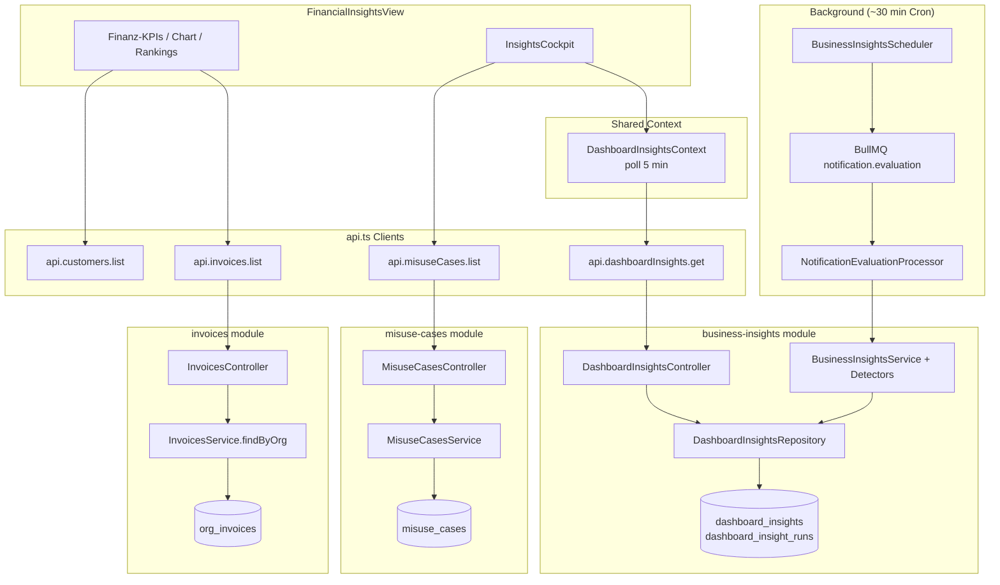

# Datenfluss- und Abhängigkeitskarte — SynqDrive „Auswertungen“

**Datum:** 2026-07-24  
**Basis:** `docs/audits/evaluations/evaluations-technical-inventory-2026-07.md` (Prompt 1/54)  
**Scope:** Prompt 2/54 — vollständige Trace-Dokumentation aller auf der Auswertungen-Seite sichtbaren oder intern vorbereiteten Kennzahlen  
**View-Keys:** `financial-insights` (primär), eingebettetes `InsightsCockpit`; ergänzend `data-analyse` (Admin-Unterseite)

---

## 1. Globale Architektur



### Zeitzone (global)

| Schicht | Verhalten |
|---------|-----------|
| **Browser** | `new Date()` / `reportingAnchor` — **lokale Zeitzone des Clients** |
| **Monatsgrenzen** | `startOfMonth(now)` etc. in `FinancialInsightsView` — **Client-Lokalzeit** |
| **Backend Detectors** | `ctx.now = new Date()` — **Server-Zeitzone (typisch UTC auf VPS)** |
| **Prisma DateTime** | Gespeichert als UTC; Vergleiche in Detectors mit Server-`Date` |
| **Stale-Flag Insights** | `Date.now()` vs `lastRunAt` — Server-Zeit |

**Risiko:** MTD-Fenster Client vs. Detector-„heute“ können an Monatsgrenzen/UTC abweichen.

### Fehlerverhalten (global)

| Pfad | Bei Fehler |
|------|------------|
| `api.invoices.list` | Finanz-Sektion: Error-Banner; Cockpit bleibt mit `openReceivablesEur=0` |
| `api.customers.list` | Warning-Banner; Kundennamen fallen auf ID-Slice zurück |
| `api.dashboardInsights.get` | `DashboardInsightsContext.error=true`; RunStateBanner Fehler |
| `api.misuseCases.list` | Misuse-Section: „Signale konnten nicht geladen werden“ |
| Detector-Lauf (einzeln) | `Promise.allSettled` — anderer Detector läuft weiter |
| Gesamter Eval-Lauf | `errorMessage` in `dashboard_insight_runs`; UI `response.error` |

---

## 2. Detaillierte Datenflüsse nach Domäne

### 2.1 Finanz-KPIs (`FinancialInsightsView`)

Gemeinsamer Lade-Pfad:

```
FinancialInsightsView.load()
  → api.invoices.list(orgId)                    // kein page/limit
  → GET /api/v1/organizations/:orgId/invoices
  → InvoicesController.findAll()
  → InvoicesService.findByOrg(orgId)
  → Prisma orgInvoice.findMany({ where: { organizationId }, orderBy: createdAt desc })
     // KEIN take/skip — vollständige Org-Liste
  → Client: financial-insights.logic.ts + invoiceClassification.ts
```

Kunden-Lookup (nur für Labels):

```
api.customers.list(orgId)   // kein limit → Default page=1, limit=20
  → GET /api/v1/organizations/:orgId/customers
  → CustomersService.list → parsePagination → take=20
```

---

#### `fin.mtd_issued_revenue` — Issued Revenue MTD

| Feld | Wert |
|------|------|
| UI | `FinancialInsightsView` → `KpiCard` „Issued Revenue MTD“ |
| Hook | `useMemo` → `mtdRevenueInRange(invoices, monthStart, now)` |
| Formel | `issuedRevenueInRange ∪ paidRevenueInRange` (dedupe by `id`); outgoing types; status ∉ {DRAFT,CANCELLED,VOID,CREDITED}; `effectiveInvoiceDate` ∈ [monthStart, now] |
| Filter | `isEurInvoice` (currency EUR/€); outgoing revenue invoices |
| Einheit | Cent → Anzeige EUR |
| Berechnung | **Clientseitig** |
| Kanonisch | **Nein** — parallel `InvoicesService.getStats().totalRevenueCents` (lifetime, nicht MTD, ungenutzt) |
| Scope | Organisationsweit |
| PII | Aggregiert; Drill-down zeigt Invoice-Zeilen (Kunde/Fahrzeug) |
| Freshness | On-load; kein Auto-Refresh |
| Fehler | Gesamte Finanz-Sektion ausgeblendet bei Invoice-Fehler |

---

#### `fin.mtd_paid_revenue` — Paid revenue MTD (Summary Card)

| Feld | Wert |
|------|------|
| UI | `SummaryCard` „Paid revenue MTD“ |
| Formel | `paidRevenueInRange`: status=PAID + `paidAt` ∈ [monthStart, now]; outgoing revenue |
| Anzeige | `—` wenn `bucketed.mtdPaid.length === 0` (auch wenn Umsatz existiert aber paidAt fehlt) |
| Berechnung | **Clientseitig** |
| Methode | **Beobachtet** (paidAt-Timestamp) |

---

#### `fin.mtd_expenses` — Expenses MTD

| Feld | Wert |
|------|------|
| UI | `KpiCard` „Expenses MTD“ |
| Formel | `expensesInRange`: incoming types; status ∉ expense-excluded; `effectiveInvoiceDate` ∈ MTD |
| Berechnung | **Clientseitig** |
| Hinweis | Kein Cashflow-Datum — nutzt Rechnungsdatum wie Umsatz |

---

#### `fin.mtd_profit` — Net Profit MTD

| Feld | Wert |
|------|------|
| UI | `KpiCard` „Net Profit MTD“ |
| Formel | `mtdRevenueCents - mtdExpenseCents` |
| Subtitle | „Margin X% · basierend auf Issued Revenue“ |
| Berechnung | **Clientseitig** |
| Methode | **Abgeleitet** (kein Deckungsbeitrag / keine Kostenstellen) |

---

#### `fin.profit_margin` — Profit margin (Snapshot)

| Feld | Wert |
|------|------|
| UI | Snapshot `SnapRow` „Profit margin“ |
| Formel | `(profitCents / mtdRevenueCents) * 100` wenn revenue > 0, sonst 0 |
| Einheit | % |

---

#### `fin.open_receivables` — Open Receivables

| Feld | Wert |
|------|------|
| UI | `KpiCard` + Snapshot „Outstanding“ |
| Formel | `sumCents(openOutgoingReceivables(invoices, now))` — outgoing, nicht paid, nicht overdue, EUR |
| `isReceivableInvoice` | outgoing; status ∉ NON_OPEN; nicht paid |
| Berechnung | **Clientseitig** |
| Duplikat | Cockpit `openReceivablesEur` = gleicher Wert / 100 |
| Abweichung zu Backend | `getStats().unpaid` zählt **Anzahl** mit `outstandingCents`-Logik, nicht identisch zu Client-Filter |

---

#### `fin.overdue_receivables` — Overdue

| Feld | Wert |
|------|------|
| UI | `KpiCard` „Overdue“ |
| Formel | `sumCents(overdueOutgoingReceivables(invoices, now))` |
| Overdue-Regel | status=OVERDUE **oder** `dueDate < now` |
| Cockpit-Mapping | `financialRiskEur={Math.round(overdueCents/100)}` — **Prop-Name irreführend** (ist überfälliger Betrag, nicht Gesamtfinanzrisiko) |

---

#### `fin.mom_revenue_delta` / `fin.mom_expense_delta`

| Feld | Wert |
|------|------|
| UI | Snapshot + KpiCard delta badges |
| Formel | `(mtd - prevMonth) / prevMonth * 100`; `null` wenn prev=0 |
| Zeitfenster Prev | Kalendermonat Vormonat (client local) |

---

#### `fin.avg_invoice_mtd`

| Feld | Wert |
|------|------|
| Formel | `mtdRevenueCents / bucketed.mtdRevenue.length` |
| Scope | MTD issued revenue rows |

---

#### `fin.daily_chart_revenue` / `fin.daily_chart_expenses` / `fin.daily_chart_profit`

| Feld | Wert |
|------|------|
| UI | Recharts `AreaChart` „Daily Revenue & Expenses“ |
| Formel | Pro Kalendertag im aktuellen Monat: Summe `totalCents/100` nach `effectiveDateOf` |
| Profit-Serie | `revenue - expenses` pro Tag (berechnet, nicht im Chart als Area gezeichnet) |
| Berechnung | **Clientseitig** |

---

#### `fin.top_customers_mtd` — Top customers (max 5)

| Feld | Wert |
|------|------|
| UI | `ListCard` „Top customers (MTD)“ |
| Formel | Group by `customerId` auf `bucketed.mtdRevenue`; sort desc; **slice(0,5)** |
| Label | `api.customers.list` → **nur erste 20 Kunden**; fehlende → ID-Slice |
| PII | **Ja** — Kundennamen |
| Limit | Top 5; Kundenliste paginiert/abgeschnitten |
| Risiko | **Kunden außerhalb Page 1 → falsche/fehlende Namen** |

---

#### `fin.top_vehicles_mtd` — Top vehicles (max 5)

| Feld | Wert |
|------|------|
| UI | `ListCard` „Top vehicles (MTD)“ |
| Formel | Group by `vehicleId`; sort; slice(0,5) |
| Label | `FleetContext.fleetVehicles` (client-side fleet cache) |
| Scope | Org-weit; **kein Stationsfilter** |

---

#### `fin.recent_activity` — Recent activity (max 8)

| Feld | Wert |
|------|------|
| Formel | Alle invoices (incoming+outgoing); sort by effectiveDate desc; **slice(0,8)** |
| Zeitfenster | **Keins** — org-weit, nicht MTD |

---

#### `fin.mtd_open_invoice_count` / `fin.mtd_paid_invoice_count` / `fin.mtd_expense_count`

| Feld | Wert |
|------|------|
| UI | Summary Cards |
| Formel | Counts auf MTD-Buckets bzw. paid/open Filter |

---

#### `fin.invoice_count_badge`

| Feld | Wert |
|------|------|
| UI | Badge `{invoices.length} invoices` |
| Quelle | Länge der vollständigen Invoice-Liste vom Server |

---

### 2.2 Intern vorbereitet, nicht auf Auswertungen-Seite angezeigt

| metricId | Status | Quelle |
|----------|--------|--------|
| `fin.reserved_revenue_mtd` | In `financial-insights.logic.ts`; Dashboard `businessPulseSliceBuilder` nutzt es; **nicht** in `FinancialInsightsView` | Client |
| `fin.invoices_stats_*` | `GET .../invoices/stats` serverseitig aggregiert; **nicht** von Auswertungen aufgerufen | Server |

---

### 2.3 Insights Cockpit KPIs (`InsightsCockpit`)

Gemeinsamer Pfad:

```
DashboardInsightsProvider (App-Root)
  → api.dashboardInsights.get(orgId)  // alle 5 min
  → GET /api/v1/organizations/:orgId/dashboard-insights
  → DashboardInsightsController.getInsights()
  → DashboardInsightsRepository.getActiveInsights(orgId, policy.maxVisibleInsights)
  → Prisma dashboardInsight.findMany({ isActive: true, take: limit })
     // default maxVisibleInsights = 4
```

Hintergrund-Befüllung:

```
Cron 2,32 * * * * → NotificationEvaluationService
  → BusinessInsightsService.runForOrganization()
  → Detectors (parallel) → gate → group → rank → slice(0, maxVisible)
  → publishInsights (deaktiviert alle alten, schreibt neue)
```

**Wichtig:** UI-KPI „Business Risks“ zählt **alle** gefilterten Insights in `partitionInsights`, aber API liefert max. **4** aktive Insights (Policy). Count-KPIs können **alle sichtbaren** sein, Detail-Listen sind durch Publish-Limit + Policy begrenzt.

---

#### `ins.business_risks_count`

| Feld | Wert |
|------|------|
| UI | `InsightKpiCard` „Business Risks“ |
| Hook | `useDashboardInsights` → `partitionInsights().businessRisks.length` |
| Filter | `isVisibleOnInsightsPage` (raw health nur mit bookingId); optional `matchesStationIdFilter` (stationId=null → kein Filter) |
| Berechnung | **Clientseitig** auf Server-persistierten Insights |
| Methode | **Regelbasiert** (Detectors) |
| Freshness | `response.stale` wenn `now - lastRunAt > 2 × refreshIntervalMin` (default 60 min) |
| Scope | Org-weit |

---

#### `ins.estimated_financial_risk`

| Feld | Wert |
|------|------|
| UI | „Finanzrisiko (geschätzt)“ ≈ X € |
| Formel | `financialRiskEur` (Prop = **overdue receivables EUR**) + Σ `financialImpactEur(insight)` für business+leakage insights |
| `financialImpactEur` | `metrics.financialImpactCents / 100` oder `metrics.lostRevenueEur` (LOW_UTILIZATION) |
| Berechnung | **Clientseitig** |
| Methode | **Geschätzt** (≈ Prefix in UI) |
| Inkonsistenz | Prop `financialRiskEur` enthält nur Overdue, nicht Open Receivables |

---

#### `ins.open_receivables_cockpit`

| Feld | Wert |
|------|------|
| UI | „Offene Forderungen“ im Cockpit |
| Quelle | Prop von Parent: `outstandingCents / 100` |
| Berechnung | **Clientseitig** (Invoice-Pfad) |

---

#### `ins.critical_bookings_count`

| Feld | Wert |
|------|------|
| Formel | `businessRisks.filter(severity === CRITICAL).length` |
| Hinweis | Zählt CRITICAL **Insights**, nicht direkt Buchungen (ein Insight kann Gruppe sein) |

---

#### `ins.revenue_leakage_count`

| Feld | Wert |
|------|------|
| Formel | `partitionInsights().revenueLeakage.length` |
| Primärer Typ | `LOW_UTILIZATION` |

---

#### `ins.run_state` — hasRun / stale / error

| Feld | Wert |
|------|------|
| UI | `RunStateBanner` |
| Quelle | `response.hasRun`, `response.stale`, `DashboardInsightsContext.error` |
| stale-Formel (Server) | `Date.now() - lastRun.finishedAt > refreshIntervalMin * 60_000 * 2` |

---

### 2.4 Insight-Karten (je Typ)

Alle folgen dem gleichen Read-Pfad (persistiert in `dashboard_insights`). Berechnung erfolgt **serverseitig** im jeweiligen Detector bei Evaluation-Lauf (~30 min + Debounce).

| metricId | displayName | Detector | Primäre Tabellen | Formel (Kurz) | Methode | Geschätzt? |
|----------|-------------|----------|------------------|---------------|---------|------------|
| `ins.tight_handover` | Tight Handover | `TightHandoverDetector` | `bookings`, `vehicles` | Gap zwischen aufeinanderfolgenden Bookings < `handoverBufferMin` (default 60 min) | Regelbasiert | Exakt (Zeiten) |
| `ins.return_needs_inspection` | Return Needs Inspection | `ReturnNeedsInspectionDetector` | `bookings`, handover | Return ohne abgeschlossene Inspection | Regelbasiert | Exakt |
| `ins.station_shortage` | Station Shortage | `StationShortageDetector` | `stations`, `vehicles`, `bookings` | `available = totalVehicles - bookedOut ≤ threshold` (24h Horizon) | Regelbasiert | Exakt |
| `ins.low_utilization` | Low Utilization / Revenue Leakage | `LowUtilizationDetector` | `vehicles`, `bookings` | Keine Buchung in `lowUtilizationDays` (default 7) und keine in +7d | Regelbasiert | `lostRevenueEur = dailyRateEur × lookbackDays` **geschätzt** |
| `ins.service_window` | Servicefenster | `ServiceWindowDetector` | `vehicles`, `bookings`, ServiceCompliance | Gap ≥ `serviceWindowMinHours` bei cleaning/health/service-due | Regelbasiert | Fenster exakt |
| `ins.service_before_booking` | Service Before Booking | `ServiceBeforeBookingDetector` | `bookings`, service cases | Service blockiert Pickup innerhalb `serviceBeforeBookingHours` | Regelbasiert | Exakt |
| `ins.battery_critical` | Battery Critical | `BatteryCriticalDetector` | `vehicles`, BatteryHealth | `evaluateBatteryAlerts` auf canonical summary | Regelbasiert | Exakt (Evidence) |
| `ins.tire_critical` | Tire Critical | `TireCriticalDetector` | TireHealthService | Kritische Reifen-Signale | Regelbasiert | Gemischt |
| `ins.brake_critical` | Brake Critical | `BrakeCriticalDetector` | BrakeHealthService | Kritische Brems-Signale | Regelbasiert | Gemischt |
| `ins.service_overdue` | Service Overdue | `ComplianceOperationalDetector` | `vehicles`, ServiceCompliance | `buildComplianceInsightCandidates` | Regelbasiert | Exakt |
| `ins.tuv_overdue` | TÜV Overdue | Compliance | `vehicles` | `nextTuvDate` / evaluation | Regelbasiert | Exakt |
| `ins.bokraft_overdue` | BOKraft Overdue | Compliance | `vehicles` | `nextBokraftDate` | Regelbasiert | Exakt |
| `ins.hm_service_no_tracking` | HM Service No Tracking | Compliance | `vehicles` | Neutral info, kein Tracking | Regelbasiert | Exakt |
| `ins.pickup_overdue` | Pickup Overdue | `PickupOverdueDetector` | `bookings`, `handoverProtocols` | CONFIRMED, startDate passed, no PICKUP protocol, 7d lookback | Regelbasiert | Exakt |
| `ins.driving_assessment_device_quality` | Device Quality | `DrivingAssessmentDeviceQualityDetector` | `vehicle_driving_assessment_quality` | Status DEGRADED/RECOVERING | Regelbasiert | Exakt |

**Health-Gate:** `BATTERY_CRITICAL`, `TIRE_CRITICAL`, `BRAKE_CRITICAL` werden nur veröffentlicht wenn upcoming Booking existiert; `financialImpactCents` = geschätzter Buchungsumsatz (`estimateBookingRevenueCents`).

**UI-Filter:** `isVisibleOnInsightsPage` blendet raw health ohne `bookingId` aus.

**Personenbezug:** Insights können `customerId`, `customerName` in `metrics`/`timeContext` tragen (z. B. PICKUP_OVERDUE).

---

### 2.5 Empfehlungen (`ins.recommendations`)

| Feld | Wert |
|------|------|
| UI | Section „Empfohlene Maßnahmen“ (max **6**) |
| Quelle | `partitionInsights().recommended` = CRITICAL/WARNING insights, sort by priority |
| Text | `insightRecommendation()`: `metrics.recommendation` → `actionLabel` → hardcoded DE switch |
| Berechnung | **Clientseitig** auf Server-Insights |
| Limit | `slice(0, 6)` |

---

### 2.6 Misuse / Nutzungsauffälligkeiten (`ins.misuse_cases`)

```
InsightsCockpit.MisuseAbuseSection
  → api.misuseCases.list(orgId, { limit: 8, page: 1 })
  → GET /api/v1/organizations/:orgId/misuse-cases?limit=8&page=1
  → MisuseCasesController.list
  → MisuseCasesService.list → Prisma misuseCase.findMany (skip/take, orderBy lastDetectedAt desc)
```

| Feld | Wert |
|------|------|
| Anzeige | Max **8** Fälle, Seite 1 |
| Gesamt | Paginiert (default limit 20 serverseitig) |
| Berechnung | **Serverseitig** (Shadow-Detector-Pipeline, vorpersistiert) |
| Methode | **Regelbasiert** (Fahrverhalten/Evidence) |
| PII | Titel, Beschreibung, ggf. Kunde/Fahrzeug in Record |
| Freshness | On-mount pro orgId; kein Polling |

---

### 2.7 Auslastung, Verfügbarkeit, Standzeiten, Wartungsrisiken

| Konzept | Auf Auswertungen-Seite? | Datenfluss |
|---------|-------------------------|------------|
| **Auslastung (Fleet)** | Indirekt via `LOW_UTILIZATION` Insight | Detector: keine Buchungen in N Tagen → Revenue-Leakage-Karte |
| **Fahrzeugverfügbarkeit** | Indirekt via `STATION_SHORTAGE` | `available` vehicles per station 24h |
| **Standzeiten** | Als `idleDays` / „idle for N+ days“ in LOW_UTILIZATION message | `metrics.idleDays = policy.lowUtilizationDays` |
| **Wartungs-/Ausfallrisiken** | Via Compliance + Health + Service Insights | SERVICE_OVERDUE, TUV, BOKraft, BATTERY/TIRE/BRAKE (gated), SERVICE_BEFORE_BOOKING, SERVICE_WINDOW |
| **Stärken und Schwächen** | **Nicht vorhanden** | Kein UI-Element, kein API-Feld auf `financial-insights` |
| **Stations-Ranking** | **Nicht als Liste** | Nur einzelne STATION_SHORTAGE Insights mit `stationName` in metrics |
| **Fahrzeug-Ranking (Ops)** | **Nicht vorhanden** (nur Finanz Top-Vehicles) | — |

---

### 2.8 Prognosen / prognoseähnliche Aussagen

| metricId | Auf Seite? | Art | Quelle |
|----------|------------|-----|--------|
| `ins.estimated_financial_risk` | Ja | Geschätzt (≈) | Client-Summe |
| `ins.low_utilization.lost_revenue` | In Insight-Karte | `dailyRateEur × lookbackDays` | Heuristik, nicht ML |
| `ins.health.financial_impact` | In gated health insights | `estimateBookingRevenueCents(booking)` | Regelbasiert |
| ML-Prognosen / Forecast Engine | **Nein** auf dieser Seite | `VehicleInsightsCard` / `vehicle-forecast-engine` existieren, **nicht gemountet** | — |
| Voice Billing Forecast | **Nein** | Separates Modul `VoiceAnalyticsView` | — |

---

### 2.9 Data Analyse (`data-analyse` View) — Kern-KPIs

Permission: `data-analyse.read`. Pro **Fahrzeug** selektiert.

```
DataAnalyseView
  → api.dataAnalyse.*
  → DataAnalyseController
  → DataAnalyseService
  → Prisma (vehicles, telemetry state) + ClickHouse (optional)
```

| metricId | displayName | source | formula | freshness |
|----------|-------------|--------|---------|-----------|
| `da.telemetry_last_received` | Last telemetry | `telemetry-overview` | `latestState.lastSeenAt` | Live on tab load |
| `da.signals_observed` | Signals observed | overview | count persisted signal rows | Live |
| `da.hf_availability_status` | HF availability | `high-frequency` | classify from HF/waypoint volume | Live |
| `da.avg_signal_interval` | Avg interval | overview | `computeIntervalStats(chIntervals)` | CH-dependent |
| `da.data_freshness_status` | Data freshness | overview | `classifyDataFreshness(lastSeen, thresholds)` | Live |
| `da.signal_quality_score` | Trip signal quality | `signal-quality/latest` | ClickHouse `signal_quality_snapshots` | Per latest trip |
| `da.pipeline_stages` | Pipeline status | `pipeline` | DIMO/CH pipeline stage flags | Live |
| `da.health_trace` | Health trace | `health-trace` | Module evaluation trace | Live |
| `da.ch_diagnostics` | CH Diagnostics | `clickhouse-diagnostics` | Cluster-level (orgId ignored) | Live |

Berechnung: **serverseitig**; Scope: **pro Fahrzeug**, Org via `assertVehicle(orgId, vehicleId)`.

---

## 3. Maschinenlesbare Metrik-Tabelle

```json
[
  {"metricId":"fin.mtd_issued_revenue","displayName":"Issued Revenue MTD","source":"org_invoices via GET /invoices","formula":"sum(mtdRevenueInRange)","unit":"EUR","currency":"EUR","timezone":"client_local","filters":"outgoing revenue, EUR, invoiceDate in MTD, excl DRAFT/CANCELLED/VOID/CREDITED","freshness":"on_load","ownerModule":"frontend/financial-insights.logic","risk":"client_agg_large_dataset","status":"active_duplicate_server_stats_exists"},
  {"metricId":"fin.mtd_paid_revenue","displayName":"Paid revenue MTD","source":"org_invoices","formula":"sum(paidRevenueInRange by paidAt)","unit":"EUR","currency":"EUR","timezone":"client_local","filters":"PAID + paidAt in MTD","freshness":"on_load","ownerModule":"frontend/financial-insights.logic","risk":"missing_paidAt_shows_dash","status":"active"},
  {"metricId":"fin.mtd_expenses","displayName":"Expenses MTD","source":"org_invoices","formula":"sum(expensesInRange)","unit":"EUR","currency":"EUR","timezone":"client_local","filters":"incoming, EUR, invoiceDate MTD","freshness":"on_load","ownerModule":"frontend/financial-insights.logic","risk":"client_agg","status":"active"},
  {"metricId":"fin.mtd_profit","displayName":"Net Profit MTD","source":"derived","formula":"mtd_revenue - mtd_expenses","unit":"EUR","currency":"EUR","timezone":"client_local","filters":"none","freshness":"on_load","ownerModule":"frontend/FinancialInsightsView","risk":"no_cost_allocation","status":"active"},
  {"metricId":"fin.profit_margin","displayName":"Profit margin","source":"derived","formula":"profit/revenue*100","unit":"percent","currency":"n/a","timezone":"client_local","filters":"MTD","freshness":"on_load","ownerModule":"frontend/FinancialInsightsView","risk":"low","status":"active"},
  {"metricId":"fin.open_receivables","displayName":"Open Receivables","source":"org_invoices","formula":"sum(openOutgoingReceivables)","unit":"EUR","currency":"EUR","timezone":"client_local","filters":"outgoing open not overdue EUR","freshness":"on_load","ownerModule":"frontend/financial-insights.logic","risk":"differs_from_getStats","status":"active_canonical_client"},
  {"metricId":"fin.overdue_receivables","displayName":"Overdue","source":"org_invoices","formula":"sum(overdueOutgoingReceivables)","unit":"EUR","currency":"EUR","timezone":"client_local","filters":"dueDate<now OR status OVERDUE","freshness":"on_load","ownerModule":"frontend/financial-insights.logic","risk":"mislabeled_as_financialRiskEur_in_cockpit","status":"active"},
  {"metricId":"fin.mom_revenue_delta","displayName":"MoM revenue","source":"derived","formula":"(mtd-prev)/prev*100","unit":"percent","currency":"n/a","timezone":"client_local","filters":"calendar months","freshness":"on_load","ownerModule":"frontend/FinancialInsightsView","risk":"low","status":"active"},
  {"metricId":"fin.mom_expense_delta","displayName":"MoM expenses","source":"derived","formula":"(mtd-prev)/prev*100","unit":"percent","currency":"n/a","timezone":"client_local","filters":"calendar months","freshness":"on_load","ownerModule":"frontend/FinancialInsightsView","risk":"low","status":"active"},
  {"metricId":"fin.daily_chart","displayName":"Daily Revenue & Expenses","source":"org_invoices","formula":"per-day sum totalCents/100","unit":"EUR","currency":"EUR","timezone":"client_local","filters":"MTD","freshness":"on_load","ownerModule":"frontend/FinancialInsightsView","risk":"low","status":"active"},
  {"metricId":"fin.top_customers_mtd","displayName":"Top customers MTD","source":"org_invoices+customers(page1)","formula":"top5 by customerId revenue","unit":"EUR","currency":"EUR","timezone":"client_local","filters":"top5; customers limited 20","freshness":"on_load","ownerModule":"frontend/FinancialInsightsView","risk":"pii_truncated_customer_list","status":"active_incomplete_labels"},
  {"metricId":"fin.top_vehicles_mtd","displayName":"Top vehicles MTD","source":"org_invoices+fleet","formula":"top5 by vehicleId revenue","unit":"EUR","currency":"EUR","timezone":"client_local","filters":"top5","freshness":"on_load","ownerModule":"frontend/FinancialInsightsView","risk":"low","status":"active"},
  {"metricId":"fin.recent_activity","displayName":"Recent activity","source":"org_invoices","formula":"last8 by date","unit":"count","currency":"mixed","timezone":"client_local","filters":"slice 8","freshness":"on_load","ownerModule":"frontend/FinancialInsightsView","risk":"low","status":"active"},
  {"metricId":"fin.reserved_revenue_mtd","displayName":"Reserved revenue MTD","source":"org_invoices","formula":"reservedRevenueInRange","unit":"EUR","currency":"EUR","timezone":"client_local","filters":"OUTGOING_BOOKING DRAFT","freshness":"n/a","ownerModule":"frontend/financial-insights.logic","risk":"none","status":"prepared_not_shown"},
  {"metricId":"ins.business_risks_count","displayName":"Business Risks","source":"dashboard_insights","formula":"count(partition businessRisks)","unit":"count","currency":"n/a","timezone":"server_utc","filters":"maxVisibleInsights=4 publish limit","freshness":"5min_poll_stale_60min","ownerModule":"business-insights","risk":"count_vs_publish_limit","status":"active"},
  {"metricId":"ins.estimated_financial_risk","displayName":"Finanzrisiko geschätzt","source":"invoices+insights","formula":"overdueEUR+sum(financialImpact)","unit":"EUR","currency":"EUR","timezone":"mixed","filters":"≈ displayed","freshness":"5min_poll","ownerModule":"frontend/insights-categories","risk":"misleading_prop_name","status":"active_estimated"},
  {"metricId":"ins.open_receivables_cockpit","displayName":"Offene Forderungen Cockpit","source":"org_invoices via parent","formula":"openReceivables/100","unit":"EUR","currency":"EUR","timezone":"client_local","filters":"none","freshness":"on_load","ownerModule":"frontend/InsightsCockpit","risk":"duplicate_fin.open_receivables","status":"active"},
  {"metricId":"ins.critical_bookings_count","displayName":"Kritische Buchungen","source":"dashboard_insights","formula":"count CRITICAL businessRisks","unit":"count","currency":"n/a","timezone":"server_utc","filters":"insight severity","freshness":"5min_poll","ownerModule":"frontend/InsightsCockpit","risk":"not_literal_booking_count","status":"active"},
  {"metricId":"ins.revenue_leakage_count","displayName":"Revenue Leakage","source":"dashboard_insights","formula":"count revenueLeakage","unit":"count","currency":"n/a","timezone":"server_utc","filters":"LOW_UTILIZATION etc","freshness":"5min_poll","ownerModule":"frontend/insights-categories","risk":"low","status":"active"},
  {"metricId":"ins.low_utilization","displayName":"Low Utilization","source":"vehicles+bookings","formula":"no booking in N days; lostRevenue=dailyRate*N","unit":"EUR_est","currency":"EUR","timezone":"server_utc","filters":"AVAILABLE|RENTED vehicles","freshness":"~30min_eval","ownerModule":"LowUtilizationDetector","risk":"estimated_lost_revenue","status":"active"},
  {"metricId":"ins.station_shortage","displayName":"Station Shortage","source":"stations+vehicles+bookings","formula":"available<=threshold in 24h","unit":"count","currency":"n/a","timezone":"server_utc","filters":"ACTIVE stations","freshness":"~30min_eval","ownerModule":"StationShortageDetector","risk":"low","status":"active"},
  {"metricId":"ins.tight_handover","displayName":"Tight Handover","source":"bookings","formula":"gap<handoverBufferMin","unit":"minutes","currency":"n/a","timezone":"server_utc","filters":"48h horizon","freshness":"~30min_eval","ownerModule":"TightHandoverDetector","risk":"low","status":"active"},
  {"metricId":"ins.pickup_overdue","displayName":"Pickup Overdue","source":"bookings","formula":"CONFIRMED past start no PICKUP protocol","unit":"minutes","currency":"n/a","timezone":"server_utc","filters":"7d lookback","freshness":"~30min_eval","ownerModule":"PickupOverdueDetector","risk":"pii_customer_name","status":"active"},
  {"metricId":"ins.compliance_family","displayName":"Service/TÜV/BOKraft Overdue","source":"vehicles+service_compliance","formula":"buildComplianceInsightCandidates","unit":"n/a","currency":"n/a","timezone":"server_utc","filters":"policy.enabledTypes","freshness":"~30min_eval","ownerModule":"ComplianceOperationalDetector","risk":"low","status":"active"},
  {"metricId":"ins.health_gated","displayName":"Battery/Tire/Brake Critical","source":"health services+bookings","formula":"detector+gateHealthInsights","unit":"n/a","currency":"EUR_impact_est","timezone":"server_utc","filters":"only with upcoming booking","freshness":"~30min_eval","ownerModule":"business-insights/insight-health-gate","risk":"dual_path_notifications_v2","status":"active"},
  {"metricId":"ins.recommendations","displayName":"Empfohlene Maßnahmen","source":"dashboard_insights","formula":"CRITICAL|WARNING sorted priority slice6","unit":"text","currency":"n/a","timezone":"server_utc","filters":"client recommendation fallback","freshness":"5min_poll","ownerModule":"frontend/insights-categories","risk":"low","status":"active"},
  {"metricId":"ins.misuse_cases","displayName":"Nutzungsauffälligkeiten","source":"misuse_cases","formula":"list page1 limit8","unit":"count","currency":"n/a","timezone":"server_utc","filters":"org scoped paginated","freshness":"on_mount","ownerModule":"misuse-cases","risk":"pii_truncated_list","status":"active"},
  {"metricId":"da.telemetry_overview","displayName":"Telemetry Overview KPIs","source":"prisma+clickhouse","formula":"per vehicle signal stats","unit":"mixed","currency":"n/a","timezone":"server_utc","filters":"data-analyse.read","freshness":"on_tab_load","ownerModule":"data-analyse","risk":"ch_unavailable_degraded","status":"active_admin_only"}
]
```

---

## 4. Klassifikations-Matrix (Kurz)

| Kennzahl | Server/Client | Kanonisch | Vollständig | Exakt/Geschätzt | Methode | Org/Station | PII |
|----------|---------------|-----------|-------------|-----------------|---------|-------------|-----|
| Issued Revenue MTD | Client | Nein (stats-EP existiert) | Ja (alle Invoices geladen) | Exakt | Beobachtet | Org | Nein (agg) |
| Paid Revenue MTD | Client | Nein | Ja | Exakt wenn paidAt | Beobachtet | Org | Nein |
| Expenses MTD | Client | Nein | Ja | Exakt | Beobachtet | Org | Nein |
| Profit/Margin | Client | — | Ja | Exakt (definiert) | Abgeleitet | Org | Nein |
| Open/Overdue | Client | Nein | Ja | Exakt | Regelbasiert | Org | Nein |
| Top Customers | Client | — | **Nein** (top5 + 20 Kunden) | Exakt Beträge | Abgeleitet | Org | **Ja** |
| Top Vehicles | Client | — | Top 5 only | Exakt | Abgeleitet | Org | Nein |
| Business Risks Count | Client auf Server-Daten | Ja (insights) | **Nein** (max 4 published) | Exakt count sichtbarer | Regelbasiert | Org | Teilweise |
| Finanzrisiko geschätzt | Client | — | — | **Geschätzt** | Heuristik | Org | Nein |
| LOW_UTILIZATION lost € | Server | Ja | Alle Fahrzeuge | **Geschätzt** | Regelbasiert | Org/Fahrzeug | Nein |
| Station Shortage | Server | Ja | Alle Stationen | Exakt | Regelbasiert | Station | Nein |
| Misuse Cases | Server | Ja | **Nein** (limit 8) | Exakt (persistiert) | Regelbasiert | Org | Ja |
| Stärken/Schwächen | — | — | — | — | **Nicht implementiert** | — | — |
| ML-Prognosen | — | — | — | — | **Nicht auf Seite** | — | — |

---

## 5. Gefundene Inkonsistenzen

| ID | Inkonsistenz | Betroffene metricIds |
|----|--------------|---------------------|
| I-01 | `financialRiskEur` Prop = **Overdue**, Label = „Finanzrisiko (geschätzt)“ | `ins.estimated_financial_risk` |
| I-02 | Finanz-KPIs clientseitig; `GET /invoices/stats` serverseitig mit **anderer Semantik** (lifetime vs MTD) — ungenutzt | `fin.*` vs `invoices.stats` |
| I-03 | `api.customers.list()` ohne Pagination → nur 20 Kunden für Namens-Lookup | `fin.top_customers_mtd` |
| I-04 | Cockpit KPI-Counts vs max **4** published insights (`maxVisibleInsights`) | `ins.business_risks_count`, Listen |
| I-05 | MTD-Zeitfenster **Client-TZ** vs Detector `ctx.now` **Server-TZ** | `fin.*` vs `ins.*` |
| I-06 | `financialImpactEur`: cents vs eur ambiguity (`>1000` → /100) | `ins.estimated_financial_risk` |
| I-07 | Open Receivables doppelt: Cockpit-KPI + Finanz-KPI (gleiche Quelle, verschiedene UI-Zonen) | `fin.open_receivables`, `ins.open_receivables_cockpit` |
| I-08 | Top Customers empty hint sagt „paid customer invoices“ — Daten sind **issued MTD** | `fin.top_customers_mtd` |
| I-09 | Health-Risiken: Dashboard-Insights-Detectors **und** Notification-V2 Rental-Health-Sync (paralleler Pfad, nicht auf dieser Seite sichtbar) | `ins.health_gated` |
| I-10 | `RETURN_OVERDUE` im Frontend `InsightType`, nicht im Prisma-Enum | Typ-Drift |

---

## 6. Kennzahlen ohne belastbare Quelle (auf der Seite)

| Anforderung (Prompt) | Status im Code |
|---------------------|----------------|
| Stärken und Schwächen | **Nicht vorhanden** — kein UI, kein API-Feld |
| Stations-Ranking (Liste) | **Nicht vorhanden** — nur Einzel-Insights |
| Fahrzeug-Auslastung % (Fleet) | **Nicht auf Auswertungen** — nur in `VehicleAvailabilityInsights` (andere Views) |
| ML-Prognosen | **Nicht auf Auswertungen** — Forecast-Engine nur in ungemountetem `VehicleInsightsCard` |
| Deckungsbeitrag (Kostenstellen) | **Nicht vorhanden** — nur Revenue minus Expenses |
| Zahlungseingänge (Bank/Cashflow) | Nur **paidAt** auf Invoices — kein separates Zahlungseingangs-Modul |

---

## 7. Kennzahlen mit doppelter Berechnung

| Domäne | Pfad A | Pfad B | Bewertung |
|--------|--------|--------|-----------|
| Finanz MTD KPIs | `FinancialInsightsView` + `financial-insights.logic.ts` | `InvoicesService.getStats()` (ungenutzt) | Duplikat, nicht kanonisch vereinheitlicht |
| Finanz MTD KPIs | Auswertungen-Seite | Dashboard `businessPulseSliceBuilder` (gleiche Logik-Datei) | **Bewusst parallel** — gleiche Client-Logik, zwei Surfaces |
| Open Receivables | Finanz-KPI-Zeile | Insights-Cockpit-KPI | Gleiche Berechnung, doppelte Anzeige |
| Geschätztes Finanzrisiko | Overdue + Insight impacts | Einzelne Insight `financialImpactCents` | Aggregation nur im Cockpit |
| Health Critical | Insight Detectors | Notification V2 `syncVehicleHealthNotifications` | Parallele Backend-Pfade |
| Finanz-Logik Tests | Frontend `financial-insights.logic.ts` | Backend `financial-insights.logic.spec.ts` (Kopie) | Test-Duplikat, keine shared lib |

---

## 8. Nächste technische Abhängigkeiten (für Prompt 3+)

1. **Kanonische Finanz-Aggregation** — Entscheidung: Server-Endpoint (stats/aggregate) vs. shared npm package; Abhängigkeit: `invoices` module, `financial-insights.logic.ts`, Dashboard VM.
2. **Insight Publish Limit** — `maxVisibleInsights` (default 4) vs. Cockpit-Counts; Abhängigkeit: `TenantInsightPolicy`, `InsightsCockpit` UX.
3. **Customer Label Vollständigkeit** — Batch-Lookup oder dediziertes `customerIds` Endpoint; Abhängigkeit: `customers` module, `FinancialInsightsView.load`.
4. **Timezone-Policy** — Org-TZ vs. User-TZ vs. UTC für MTD; Abhängigkeit: Frontend date helpers, Backend detectors.
5. **Event-Trigger Wiring** — `onBookingChange` etc. für frischere Insights; Abhängigkeit: `bookings` module, `BusinessInsightsTriggerService`.
6. **Station-Scope auf Auswertungen** — `InsightsCockpit.stationId` existiert, Parent übergibt `null`; Abhängigkeit: Stations-V2 UI, `matchesStationIdFilter`.
7. **Export-Pipeline** — benötigt stabile metricIds (Tabelle oben) + kanonische Quellen.
8. **Notification V2 Cutover** — Auswirkung auf Empfehlungen/Actionable Items; Abhängigkeit: `NOTIFICATIONS_V2` flag.
9. **i18n** — alle hardcoded Cockpit/Finanz-Labels; Abhängigkeit: `translations/*.ts`.
10. **Data Analyse CH** — `HF_MIRROR_ENABLED`, `CLICKHOUSE_URL`; Abhängigkeit: infra, `data-analyse.service` degradation paths.

---

## 9. Untersuchte Datenflüsse (Checkliste)

- [x] Invoice list → alle Finanz-KPIs, Chart, Rankings, Drill-down
- [x] Customer list (paginated) → Top-Customer-Labels
- [x] FleetContext → Top-Vehicle-Labels
- [x] DashboardInsightsContext → Cockpit KPIs, Insight-Karten, Empfehlungen
- [x] BusinessInsights Detectors (12) → persistierte Insights
- [x] Insight publish/read/policy/stale pipeline
- [x] Misuse cases list (paginated)
- [x] Ungenutzte/reservierte Pfade (`reservedRevenue`, `invoices/stats`, `dashboard-insights/summary`)
- [x] Data Analyse overview KPIs (Admin-View)
- [x] Explizit nicht vorhanden: Stärken/Schwächen, ML-Prognosen auf Seite, Stations-Ranking-Liste

---

**Dokumentpfad:** `docs/audits/evaluations/evaluations-data-flow-map-2026-07.md`

**Synqdrive Code → Changes / Architektur:** Nicht aktualisiert (Audit-Dokumentation, keine Implementierungsänderung).
