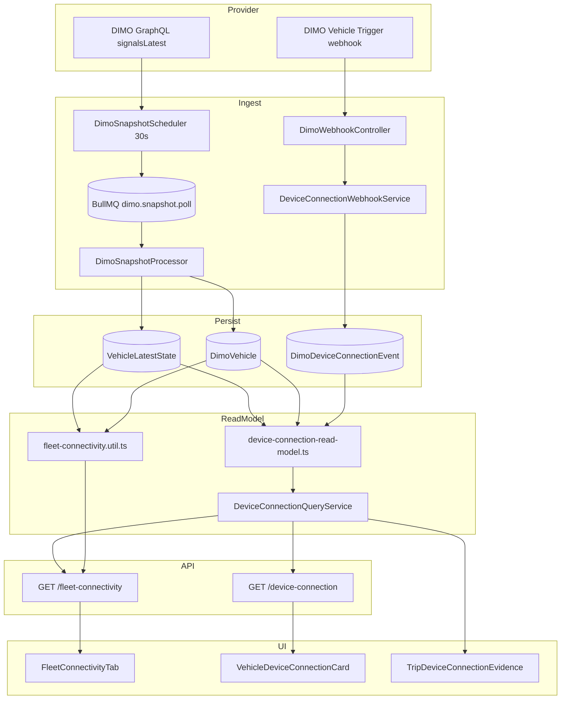
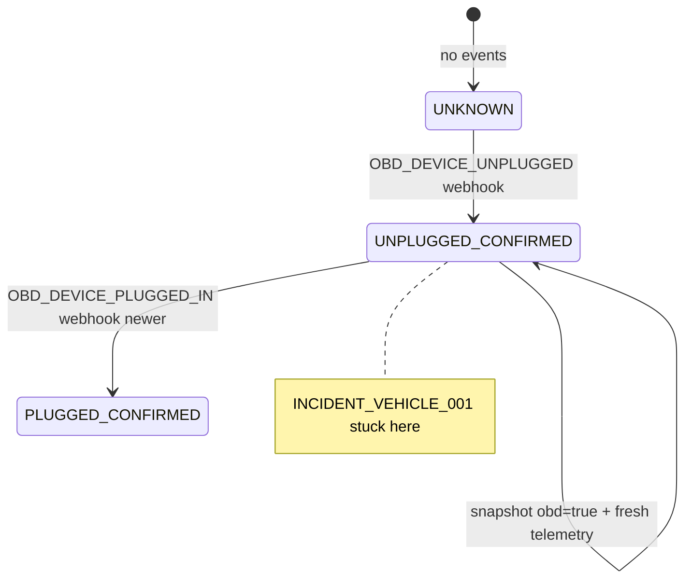

# Fleet Connectivity Production-Readiness Audit — July 2026

| Field | Value |
|-------|-------|
| **Audit ID** | `fleet-connectivity-production-readiness-2026-07` |
| **Repository** | [SYNQDRIVE-alpha](https://github.com/FATIHS-MGCKS/SYNQDRIVE-alpha) |
| **Branch** | `audit/fleet-connectivity-production-readiness-2026-07` |
| **Phase** | **8 of 8 — Final synthesis (complete)** |
| **Verdict** | **NOT_READY** (see Part I §26) |
| **Status** | **Complete** — Phases 1–8 |
| **Production data modified** | **No** — all VPS/DB access was read-only |
| **Analysis window (VPS)** | Through 2026-07-18 UTC |
| **Incident vehicle (anonymized)** | `INCIDENT_VEHICLE_001` (real mapping **not** stored in git) |

---

## Document map

| Artifact | Path | Phase |
|----------|------|-------|
| Main report (this file) | `docs/audits/fleet-connectivity-production-readiness-2026-07.md` | 1–2 |
| Code map CSV | `docs/audits/data/fleet-connectivity-code-map-2026-07.csv` | 1 |
| Incident timeline (anonymized) | `docs/audits/data/fleet-connectivity-incident-001-timeline-2026-07.json` | 1 |
| State rule map | `docs/audits/data/fleet-connectivity-state-rule-map-2026-07.csv` | 2 |
| Freshness consumer matrix | `docs/audits/data/fleet-connectivity-freshness-consumer-matrix-2026-07.csv` | 2 |
| Device state machine | `docs/audits/data/fleet-connectivity-device-state-machine-2026-07.csv` | 2 |
| Incident timeline CSV | `docs/audits/data/fleet-connectivity-incident-timeline-2026-07.csv` | 3 |
| Incident state comparison JSON | `docs/audits/data/fleet-connectivity-incident-state-comparison-2026-07.json` | 3 |
| Incident replay fixture | `docs/audits/data/fleet-connectivity-incident-replay-fixture-2026-07.json` | 3 |
| Incident replay result | `docs/audits/data/fleet-connectivity-incident-replay-result-2026-07.json` | 3 (generated) |
| Fleet coverage CSV | `docs/audits/data/fleet-connectivity-fleet-coverage-2026-07.csv` | 4 |
| Device episodes CSV | `docs/audits/data/fleet-connectivity-device-episodes-2026-07.csv` | 4 |
| Cross-surface consistency CSV | `docs/audits/data/fleet-connectivity-cross-surface-consistency-2026-07.csv` | 4 |
| Provider link integrity CSV | `docs/audits/data/fleet-connectivity-provider-link-integrity-2026-07.csv` | 4 |
| Readiness comparison CSV | `docs/audits/data/fleet-connectivity-readiness-comparison-2026-07.csv` | 4 |
| Integrity findings JSON | `docs/audits/data/fleet-connectivity-integrity-findings-2026-07.json` | 4 |
| DIMO device capability CSV | `docs/audits/data/fleet-connectivity-dimo-device-capability-2026-07.csv` | 5 |
| DIMO signal timeseries CSV | `docs/audits/data/fleet-connectivity-dimo-signal-timeseries-2026-07.csv` | 5 |
| DIMO trigger status CSV | `docs/audits/data/fleet-connectivity-dimo-trigger-status-2026-07.csv` | 5 |
| Recovery policy matrix CSV | `docs/audits/data/fleet-connectivity-recovery-policy-matrix-2026-07.csv` | 5 |
| DIMO audit summary JSON | `docs/audits/data/fleet-connectivity-dimo-audit-summary-2026-07.json` | 5 |
| Consumer wiring CSV | `docs/audits/data/fleet-connectivity-consumer-wiring-2026-07.csv` | 6 |
| Alert resolution matrix CSV | `docs/audits/data/fleet-connectivity-alert-resolution-matrix-2026-07.csv` | 6 |
| Operational impact matrix CSV | `docs/audits/data/fleet-connectivity-operational-impact-matrix-2026-07.csv` | 6 |
| UI component audit CSV | `docs/audits/data/fleet-connectivity-ui-component-audit-2026-07.csv` | 7 |
| UI information architecture CSV | `docs/audits/data/fleet-connectivity-ui-information-architecture-2026-07.csv` | 7 |
| i18n & accessibility CSV | `docs/audits/data/fleet-connectivity-i18n-accessibility-2026-07.csv` | 7 |
| Read-only orchestrator | `scripts/audits/audit-fleet-connectivity-production-readiness.ts` | 1–4 |
| DIMO read-only audit script | `scripts/audits/audit-fleet-connectivity-dimo.ts` | 5 |
| Production readiness verdict JSON | `docs/audits/data/fleet-connectivity-production-readiness-verdict-2026-07.json` | 8 |

---

# Part I — Final Production-Readiness Report

> **Standalone synthesis.** This part consolidates Phases 1–7. Detailed phase evidence remains in Part II (appendix) below.

---

## 1. Executive Summary

**Audit ID:** `fleet-connectivity-production-readiness-2026-07`  
**Verdict:** **NOT_READY** for production-grade Fleet Connectivity under the agreed unplug→recovery business rule.

SynqDrive ingests DIMO telemetry and device-connection webhooks correctly at intake, but **derives connectivity at read time through three parallel truths** (telemetry freshness, snapshot OBD, webhook episodes) without a unified runtime model. On the audited VPS fleet (7 vehicles, 6 DIMO-linked LTE_R1), **2/2 unplug webhooks remain logically open** despite live telemetry and `obdIsPluggedIn=true` on the same device binding — a **systemic read-model defect**, not an isolated incident.

**Go-live blockers (3):**

1. Snapshots/telemetry do not close open unplug episodes (`FC-P0-01`, `FC-C-04`)
2. Fleet-wide stuck episodes with zero plug webhooks (`FC-P0-03`; DIMO plug trigger **disabled**)
3. Episode recovery policy fails close → resolve alert → optional reconnected info

**What works:** Rental blocking is **not** incorrectly driven by unplug episodes; canonical `telemetryFreshness` on fleet-map/dashboard/booking is largely correct; webhook intake dedup persisted 2/2 events; operational safety gates are isolated.

**What must happen before READY:** Backend truth (`VehicleConnectivityRuntimeStateBuilder`), persistent episode closure with snapshot/binding rules, then UI migration off legacy Fleet Connectivity API — **18 recommended implementation prompts**, backend first.

---

## 2. Scope und Methodik

| Dimension | Detail |
|-----------|--------|
| **Branch** | `audit/fleet-connectivity-production-readiness-2026-07` |
| **Mode** | Read-only — no code fixes, no DB writes, no DIMO trigger mutations |
| **VPS window** | 60 days: `2026-05-19` – `2026-07-18` UTC |
| **Fleet** | 7 vehicles (anonymized `VEHICLE_001`–`VEHICLE_007`), 6 DIMO-linked |
| **Methods** | Static code map, read-only SQL/ClickHouse on VPS, DIMO API read, incident replay fixture, consumer matrix, UI/IA audit, cross-surface comparison |
| **DIMO MCP** | Unavailable — official docs + live Telemetry/Triggers API used |
| **PII** | All committed artifacts use anonymized aliases; see §PII scan (Chapter 26) |

### Dateivollständigkeit (Teil 1)

**All 27 required files present.** No missing required artifacts.

| Status | Files |
|--------|-------|
| ✅ Present | All paths listed in document map (lines 20–48) |
| 📎 Supplementary (not required) | `incident-001-timeline`, `incident-replay-fixture/result`, `audit-phase-3-result`, `dimo-audit-summary` |
| ⚠️ Outlined but not generated | `fleet-connectivity-fleet-stats-2026-07.json` — Phase 2 outline only; **superseded** by `fleet-coverage-2026-07.csv` + `integrity-findings-2026-07.json` aggregates |

---

## 3. VPS Runtime

| Component | Role |
|-----------|------|
| PM2 `synqdrive` | NestJS API + schedulers + BullMQ workers |
| PostgreSQL 16 | `vehicle_latest_states`, `dimo_device_connection_events`, consents, links |
| Redis | BullMQ |
| ClickHouse (optional) | Historical snapshots — not connectivity SoT |
| Prometheus/Grafana | General observability; **no fleet connectivity freshness metrics** |

**Connectivity writes:** snapshots + webhook events only. **No materialized connectivity state table** — all UI fields computed at read time.

---

## 4. Ist-Architektur

```text
DIMO poll (30s) → VehicleLatestState + optional CH
DIMO webhook  → DimoDeviceConnectionEvent
Read time:
  fleet-connectivity.util     → connectionStatus (24h offline)
  device-connection-read-model → openUnpluggedEpisode (event-only)
  vehicle-state-interpreter   → telemetryFreshness (48h offline)
  frontend telemetryFreshness.ts → canonical 5-state (fleet-map)
```

**Recommended target:** `VehicleConnectivityRuntimeStateBuilder` — single backend builder, consumed by fleet-map, fleet-connectivity API, device-connection API, notifications. **No frontend-derived connectivity truth.**

### Kanonisches Zielmodell (Teil 4 — design only)

**Dimensions (orthogonal):**

| Dim | States |
|-----|--------|
| **A. Provider Link** | ACTIVE, REAUTH_REQUIRED, REVOKED, NO_LINK, ERROR, UNKNOWN |
| **B. Telemetry** | LIVE, STANDBY, SOFT_OFFLINE, OFFLINE, UNKNOWN |
| **C. Physical Device** | PLUGGED_CONFIRMED, PLUGGED_INFERRED, UNPLUGGED_CONFIRMED, UNKNOWN, NOT_APPLICABLE |
| **D. Data Coverage** | GOOD, PARTIAL, INSUFFICIENT, UNKNOWN |
| **E. Attention** | NONE, WATCH, ACTION_REQUIRED, CRITICAL |
| **F. Overall Connectivity** | TELEMETRY_ACTIVE, STANDBY, SOFT_OFFLINE, OFFLINE, DEVICE_UNPLUGGED, AUTHORIZATION_REQUIRED, NO_ACTIVE_DATA_SOURCE, INTEGRATION_ERROR, UNKNOWN |

**Overall priority (highest wins):**

1. `INTEGRATION_ERROR` / `NO_ACTIVE_DATA_SOURCE`
2. `AUTHORIZATION_REQUIRED`
3. `DEVICE_UNPLUGGED` (confirmed, same binding)
4. `OFFLINE` → `SOFT_OFFLINE` → `STANDBY` → `TELEMETRY_ACTIVE`
5. `UNKNOWN` if conflicting evidence

**Reason codes (examples):** `RC_TELEMETRY_OFFLINE_48H`, `RC_TELEMETRY_SOFT_24H`, `RC_DEVICE_UNPLUG_WEBHOOK`, `RC_DEVICE_RECOVERED_SNAPSHOT`, `RC_CONSENT_NONE`, `RC_BINDING_CHANGED`, `RC_COVERAGE_PARTIAL`, `RC_CONFLICTING_EVIDENCE`.

---

## 5. Provider Link

- **Source:** `DimoVehicle.connectionStatus` + `vehicle_data_source_links`
- **Issue:** CONNECTED telemetry with **NONE** consent on VEHICLE_001–003 (`FC-P1-03`)
- **Rule:** Telemetry online ≠ provider link legally active; Integration Hub must surface REAUTH_REQUIRED

---

## 6. Authorization und Consent

- **Source:** `vehicle_provider_consents` ledger + Data Authorization UI
- **Gap:** Legacy DIMO_DIRECT links skip ledger; 3/6 linked vehicles show consent NONE while live
- **Target:** Provider Link dimension `REAUTH_REQUIRED` when consent missing/expired

---

## 7. Device Binding

- **Source:** `tokenId` + `aftermarketDevice.serial` in identity mirror
- **Gap:** No binding episode ID persisted (`bindingIdAvailable=false` all 6 vehicles)
- **Rule:** Recovery must require **same binding**; binding change closes episode → `DEVICE_BINDING_CHANGED` → manual review if ambiguous

---

## 8. Snapshot Intake

- **Path:** `DimoSnapshotScheduler` → `DimoSnapshotProcessor` → `VehicleLatestState`
- **60d:** 425,652 poll SUCCESS / 71,972 FAILURE (~14%); 396,778 CH snapshots
- **Gap:** Snapshot producer/source not persisted — cannot distinguish synthetic vs OBD at ingest (`FC-P2-01` adjacent)

---

## 9. Telemetry Freshness

| Contract | Thresholds | Consumers |
|----------|------------|-----------|
| **Canonical** | live <15m, standby <24h, soft 24–48h, offline ≥48h | fleet-map, dashboard, booking |
| **Legacy Fleet API** | online <15m, standby <24h, **offline ≥24h** | Fleet Connectivity tab, admin |

**Finding:** `FC-P1-02` — architectural split; standby is **not** an error (confirmed correct on fleet board).

---

## 10. Device Webhook Intake

- **Path:** `POST /api/v1/webhooks/dimo` → `DeviceConnectionWebhookService`
- **60d:** 2 received, 2 persisted, 0 failed, 0 duplicates
- **Volume too low** for statistical reliability (`NOT_ENOUGH_DATA` for webhook reliability category)

---

## 11. Device Connection Episodes

- **Model:** `buildDeviceConnectionSummary` — `openUnpluggedEpisode` from **last UNPLUG without PLUG event only**
- **Fleet:** 2 UNPLUG, 0 PLUG, 2 open in DB, 1 visible in 7d API window
- **Findings:** `FC-P0-01`, `FC-P0-03`, `FC-P1-01`

---

## 12. Snapshot-Based Recovery

**Current:** Not implemented in read-model (event-only closure).

### Verbindliche Ziel-Recovery-Policy (Teil 5)

| Priority | Method | Evidence required | Confidence | Episode resolution | Alert | UI text (DE) | Audit trail |
|----------|--------|-------------------|------------|-------------------|-------|--------------|-------------|
| 1 | Explicit plug webhook | `OBD_DEVICE_PLUGGED_IN` same tokenId | HIGH | CLOSE_CONFIRMED | Resolve DEVICE_UNPLUGGED; optional DEVICE_RECONNECTED info | „Wieder verbunden – Webhook bestätigt“ | event id + timestamp |
| 2 | Fresh explicit snapshot plug | `obdIsPluggedIn=true` timestamp > unplug, same binding | HIGH | CLOSE_SNAPSHOT | Resolve alert | „Wieder verbunden – aus Telemetrie erkannt“ | snapshot ts + binding |
| 3 | Fresh telemetry same binding | polls/snapshots resumed, speed/odometer/gps, same tokenId, **not synthetic-only** | MEDIUM-HIGH | CLOSE_TELEMETRY_INFERRED | Resolve alert | „Wieder verbunden – Telemetrie aktiv“ | poll log + lastSeen |
| 4 | Device binding changed | tokenId or serial change after unplug | HIGH | CLOSE_SUPERSEDED | Resolve; new binding episode | „Gerät gewechselt – Episode geschlossen“ | binding diff |
| 5 | Manual review | operator confirms | N/A | CLOSE_MANUAL / KEEP_OPEN | per decision | „Manuell geprüft“ | user id + note |

**Hard rules:**

- Synthetic/OEM-only telemetry **must not** close physical OBD unplug (`recovery-policy-matrix`)
- Open episode **must not** disappear from 7d query window (`FC-P1-01`)
- Unknown ≠ Connected/Good

---

## 13. Incident Timeline

**INCIDENT_VEHICLE_001** → `VEHICLE_006` (mapping not in git).

| Time (UTC) | Event |
|------------|-------|
| 2026-07-08 17:21:19 | `OBD_DEVICE_UNPLUGGED` webhook persisted |
| +22s | Poll SUCCESS; telemetry resumes |
| +14d | 51 trips; `obdIsPluggedIn=true`; episode still open in DB |
| 2026-07-18 | Episode **hidden** from 7d API window but DB row persists |

Artifact: `fleet-connectivity-incident-timeline-2026-07.csv`

---

## 14. Fleet-wide Episode Analysis

| Episode | Vehicle | Classification | Open DB | API 7d | Trips after |
|---------|---------|----------------|---------|--------|-------------|
| EPISODE_001 | VEHICLE_005 | SHOULD_HAVE_BEEN_RESOLVED_BY_TELEMETRY | yes | yes | 14 |
| EPISODE_002 | VEHICLE_006 | SHOULD_HAVE_BEEN_RESOLVED_BY_TELEMETRY | yes | no | 51 |

**100% false-open rate** on fleet unplug history.

---

## 15. DIMO Device Capabilities

| Metric | Value |
|--------|-------|
| DIMO vehicles audited | 6 |
| PHYSICAL_OBD_LTE_R1 | 6 |
| Synthetic also present | 6 |
| OEM-only | 0 |
| `obdIsPluggedIn` in availableSignals | 5/6 (VEHICLE_002 missing) |
| Recovery-capable bindings | 5/6 |

**Rule:** `availableSignals` listing ≠ vehicle capability proof; missing signal → OBD state UNKNOWN not Good.

---

## 16. Trigger- und Webhook-Konfiguration

| Trigger | Status |
|---------|--------|
| OBD unplug (`obdIsPluggedIn == 0`) | **ENABLED** |
| OBD plug-in (`obdIsPluggedIn == 1`) | **DISABLED** |
| High RPM | ENABLED |

**Explains 0 fleet-wide PLUG events.** Snapshot-based recovery is **required** unless plug trigger enabled.

**Finding:** `FC-P1-04` — `webhookConfigured` inferred from empty 7d events (false negative).

---

## 17. Readiness und Signal Coverage

- **Formula:** `readinessScore = signalCoveragePercent` only
- **Issues:** Ignores device episodes; penalizes ICE for missing evSoc (`FC-P2-02`)
- **Target:** Capability-aware coverage dimension; separate from Overall Connectivity

---

## 18. Cross-Surface Consistency

**31 consumers** — 14 CANONICAL, 9 LEGACY, 6 UNKNOWN (`consumer-wiring-2026-07.csv`).

**6 confirmed cross-surface rows** in VPS CSV; architectural splits (24h vs 48h) add latent inconsistency.

**Confirmed:** Live telemetry + open unplug on same vehicle (`FC-P0-04`).

---

## 19. Alerts und Notifications

| Type | Status |
|------|--------|
| DEVICE_UNPLUGGED / RECONNECTED | Missing registry + producer |
| TELEMETRY_OFFLINE | Registry only; ActionQueue partial |
| Episode recovery | **FAIL** all 4 steps (`FC-C-04`) |
| 60d device unplug notifications | **0** |

---

## 20. Operational Impact

| Rule | Assessment |
|------|------------|
| Unplug episode blocks rental | **No** (`FC-C-05` positive) |
| Standby blocks ready | **No** |
| Low coverage hard block | **No** |
| Trust erosion from contradictory UI | **Yes** |

---

## 21. UI Information Architecture

**Current:** 9 KPIs, 10 columns, 3 filter dropdowns.  
**Target:** 4 KPIs + header total; 5–6 columns; chip filters; action-first sort.

See Phase 7 §61–71 and `ui-information-architecture-2026-07.csv`.

---

## 22. Detail Drawer

**Current:** English technical dump — full VIN, raw coordinates, synthetic token, signal matrix default.

**Target sections:** A Zustand → B Verlauf → C Datenverfügbarkeit → D Integration → E Technisch (collapsed).

---

## 23. Mobile, i18n und Accessibility

- Mobile cards: 4 badges overflow — target 1+1 line
- **28 i18n/a11y issues** — filter options and badges hardcoded English (`i18n-accessibility-2026-07.csv`)
- KPI `aria-pressed` without `aria-label`

---

## 24. Performance, Reliability und Observability

| Area | Assessment |
|------|------------|
| Poll pipeline | ~14% FAILURE rate, null error_code (`FC-P2-01`) |
| Webhook intake | 100% persist on n=2 |
| Connectivity metrics | **NOT_ENOUGH_DATA** — no Prometheus fleet freshness |
| API | Single GET fleet-connectivity on tab mount — acceptable |

---

## 25. Findings P0–P3

Full machine-readable list: `fleet-connectivity-integrity-findings-2026-07.json`  
Verdict summary: `fleet-connectivity-production-readiness-verdict-2026-07.json`

| ID | Sev | Confidence | Title | Blocker |
|----|-----|------------|-------|---------|
| FC-P0-01 | P0 | CONFIRMED | openUnpluggedEpisode ignores snapshot recovery | yes |
| FC-P0-03 | P0 | CONFIRMED | 100% unplug webhooks stuck open fleet-wide | yes |
| FC-P0-04 | P0 | CONFIRMED | Live telemetry + open episode coexist | no |
| FC-C-04 | P0 | CONFIRMED | Episode recovery policy fails all steps | yes |
| FC-P1-01 | P1 | CONFIRMED | 7d window hides unresolved episodes | no |
| FC-P1-02 | P1 | CONFIRMED | Fleet API 24h vs canonical 48h offline | no |
| FC-P1-03 | P1 | CONFIRMED | CONNECTED without ACTIVE consent | no |
| FC-P1-04 | P1 | STRONG_EVIDENCE | webhookConfigured from event absence | no |
| FC-C-01 | P1 | CONFIRMED | 31 consumers, three truth layers | no |
| FC-C-02 | P1 | CONFIRMED | Fleet tab on legacy 24h contract | no |
| FC-C-03 | P1 | CONFIRMED | 7 alert types missing/unwired | no |
| FC-P2-01 | P2 | CONFIRMED | ~14% poll FAILURE rate | no |
| FC-P2-02 | P2 | CONFIRMED | Readiness not capability-aware | no |
| FC-P2-03 | P2 | CONFIRMED | No unplug notifications | no |
| FC-C-05 | P3 | CONFIRMED | Operational gates correctly isolated (positive) | no |
| FC-P3-01 | P3 | CONFIRMED | UI cognitive overload 9 KPI / 10 cols | no |
| FC-P3-02 | P3 | CONFIRMED | i18n gaps hardcoded English | no |
| FC-P3-03 | P3 | CONFIRMED | Drawer exposes VIN/coords/technical IDs | no |

Each finding in JSON includes: code file/function, VPS evidence, affected counts, reproduction, recommendation, tests, dependencies.

---

## 26. Production-Readiness-Verdict und Umsetzungsplan

### Production-Readiness-Kategorien (Teil 6)

| Cat | Rating |
|-----|--------|
| A Correctness | NOT_READY |
| B State Consistency | NOT_READY |
| C Device Episode Integrity | NOT_READY |
| D Provider-Link Integrity | CONDITIONALLY_READY |
| E Telemetry Freshness | CONDITIONALLY_READY |
| F Webhook Reliability | NOT_ENOUGH_DATA |
| G Data Coverage Semantics | NOT_READY |
| H Cross-Surface Consistency | NOT_READY |
| I Operational Safety | CONDITIONALLY_READY |
| J User Experience | NOT_READY |
| K Mobile/i18n/A11y | NOT_READY |
| L Test Readiness | NOT_READY |
| M Observability | NOT_ENOUGH_DATA |

### Gesamturteil

**NOT_READY** — blocked by episode integrity + cross-surface truth fragmentation + UI trust erosion.

### Umsetzungsplan (Teil 8) — 18 Prompts, 6 Phasen

**Phase A — Backend truth (Prompts 1–6)**

| # | Ziel | Scope | Dep | Abnahme | Mig | VPS | DIMO | UI | Risiko |
|---|------|-------|-----|---------|-----|-----|------|-----|--------|
| 1 | Baseline regression tests | replay fixture + episode specs | — | tests green | no | no | no | no | low |
| 2 | VehicleConnectivityRuntimeStateBuilder | dims A–F + reason codes | 1 | unit matrix | no | no | no | no | med |
| 3 | Persistent device episodes table | open/close lifecycle | 2 | migration + backfill plan | **yes** | yes | no | no | high |
| 4 | Snapshot recovery closure | rules 2–3 policy | 3 | VEHICLE_005/006 replay | yes | yes | no | no | high |
| 5 | Binding/token semantics | same-binding guard | 3 | binding change cases | yes | yes | yes | no | med |
| 6 | Webhook inbox retry/DLQ | ingest reliability | 3 | failure injection | maybe | yes | yes | no | med |

**Phase B — Provider & freshness (7–10)**

| # | Ziel | Scope | Dep | Abnahme | Mig | VPS | DIMO | UI | Risiko |
|---|------|-------|-----|---------|-----|-----|------|-----|--------|
| 7 | Provider link + consent unify | dim A | 2 | consent backfill | yes | yes | no | no | med |
| 8 | Canonical freshness alignment | fleet-connectivity API | 2 | 48h parity tests | no | no | no | no | low |
| 9 | Capability-aware coverage | dim D | 2 | ICE/EV matrix | no | yes | yes | no | med |
| 10 | Alerts + resolution wiring | registry producers | 3,4 | episode close → resolve | yes | yes | no | no | med |

**Phase C — API & migration (11–12)**

| # | Ziel | Scope | Dep | Abnahme | Mig | VPS | DIMO | UI | Risiko |
|---|------|-------|-----|---------|-----|-----|------|-----|--------|
| 11 | Cross-surface consumer migration | fleet-map + device-connection | 2–10 | consumer CSV green | no | yes | no | yes | high |
| 12 | API contract v2 | fleet-connectivity DTO | 2 | OpenAPI + compat | maybe | yes | no | no | med |

**Phase D — UI (13–16)** — only after Phase A–C

| # | Ziel | Scope | Dep | Abnahme | Mig | VPS | DIMO | UI | Risiko |
|---|------|-------|-----|---------|-----|-----|------|-----|--------|
| 13 | KPI redesign | 4 KPIs | 12 | IA CSV | no | no | no | yes | low |
| 14 | Table redesign | 5 cols | 12 | desktop+mobile | no | no | no | yes | low |
| 15 | Drawer A–E | i18n | 12 | wireframes match | no | no | no | yes | med |
| 16 | Mobile/i18n/a11y | 28 items | 13–15 | a11y CSV clean | no | no | no | yes | low |

**Phase E — Ops (17–18)**

| # | Ziel | Scope | Dep | Abnahme | Mig | VPS | DIMO | UI | Risiko |
|---|------|-------|-----|---------|-----|-----|------|-----|--------|
| 17 | Observability | Prometheus + dashboards | 2 | metrics live | no | yes | no | no | low |
| 18 | Staging replay + VPS reconciliation | one-time episode close | 3,4 | 0 false-open | yes | **yes** | yes | no | high |

### PII / Secret Scan (Teil 9)

Scanned all `fleet-connectivity-*` audit paths. **No remediation required.** Vehicles anonymized; tokens masked; no raw payloads/VIN/plates/GPS in CSVs.

### Read-only confirmations

- ✅ No production data modified  
- ✅ No DIMO triggers created/enabled/disabled  
- ✅ No infrastructure changed  
- ✅ No application code changed in this audit branch (docs + scripts only)

---

*End of Part I — Final Report. Part II (phase audit trail) follows.*

---

# Part II — Phase Audit Trail

# Eight-phase audit outline

## Phase 1 — Architecture map & runtime baseline (this document)

- Git branch and audit scaffolding
- VPS runtime topology (PM2, PostgreSQL, Redis, BullMQ, ClickHouse, Prometheus, Grafana)
- End-to-end code landkarte and data-flow diagram
- Code map CSV with preliminary risk ratings
- INCIDENT_VEHICLE_001 preliminary reconstruction and P0/P1 suspects
- Read-only audit script skeleton

## Phase 2 — Production data replay & temporal reconstruction

- Read-only SQL replay per anonymized vehicle (`VEHICLE_001`–`VEHICLE_003`)
- Full INCIDENT_VEHICLE_001 timeline: webhook → poll logs → `VehicleLatestState` → API projection
- Fleet-wide stuck-unplug pattern quantification
- ClickHouse signal cadence (if available) for post-unplug recovery window
- Artifact: `fleet-connectivity-fleet-stats-2026-07.json` (via audit script phase 2)

## Phase 3 — Parallel truth reconciliation

- Cross-surface matrix: Fleet Tab, Vehicle Detail, Trips, Data Analyse, Admin, Dashboard, Booking Gate
- Document every field where `connectionStatus`, `obdIsPluggedIn`, `deviceConnection`, and `DimoVehicle.connectionStatus` can disagree
- Capability-aware evaluation (LTE_R1 vs other hardware)
- Artifact: consumer wiring CSV

## Phase 4 — VPS integrity analysis (60 days) ✅

- Read-only PostgreSQL + ClickHouse replay across full fleet (7 vehicles, 6 DIMO-linked)
- Fleet coverage matrix per anonymized vehicle
- Open unplug episode classification (2 episodes, 100% systemic recovery failure)
- Cross-surface consistency (Fleet API vs canonical freshness vs device episode)
- Provider-link / consent / binding integrity
- Readiness raw vs capability-adjusted comparison
- Webhook reliability baseline (2 events — low volume)
- Artifacts: `fleet-connectivity-*-2026-07.csv/json` (see document map)

## Phase 5 — DIMO connectivity capability analysis ✅

- Official DIMO Telemetry / Identity / Vehicle Triggers API verification (DIMO MCP unavailable — live API + docs)
- Per-vehicle `availableSignals`, `signalsLatest`, `dataSummary`, historical `obdIsPluggedIn`
- Device type classification (aftermarket + synthetic on all linked vehicles)
- Trigger/webhook configuration read-only inventory
- Snapshot recovery policy matrix by device type
- Artifacts: `fleet-connectivity-dimo-*` and `fleet-connectivity-recovery-policy-matrix-2026-07.csv`

## Phase 6 — Consumer wiring, alerts & operational impact ✅

- Full consumer inventory (31 surfaces): Fleet Connectivity, fleet-map, Vehicle Detail, Dashboard, Trips, Integration Hub, Booking, Operator, Admin, Monitoring
- Per-consumer classification: CANONICAL / PARTIALLY_CANONICAL / LEGACY / UNKNOWN
- 15 inconsistency scenarios traced to code + VPS data
- Alert/notification matrix for 10 connectivity alert types + episode recovery policy
- Operational impact assessment (rental blocking, ready-to-rent, maintenance)
- Artifacts: `fleet-connectivity-consumer-wiring-2026-07.csv`, `fleet-connectivity-alert-resolution-matrix-2026-07.csv`, `fleet-connectivity-operational-impact-matrix-2026-07.csv`

## Phase 7 — Fleet Connectivity UI/UX target state ✅

- Full audit of `FleetConnectivityTab`, KPIs, filters, table, mobile cards, drawer, badges
- KPI reduction proposal (9 → 4 + header total)
- Table reduction (10 → 5–6 columns)
- Canonical user-facing status language (DE/EN)
- Drawer restructure (sections A–E)
- Filter/sort priority model
- Mobile card target
- Design-system alignment vs Fleet Hub / Dashboard patterns
- Textual wireframes (desktop, tablet, mobile, states)
- Artifacts: `fleet-connectivity-ui-*-2026-07.csv` (3 files)

## Phase 8 — Final synthesis ✅

- Unit/integration test inventory vs production scenarios
- Pure replay of `buildDeviceConnectionSummary` for INCIDENT_VEHICLE_001 inputs
- Frontend filter/badge tests for contradictory states
- Target architecture for snapshot-based episode closure aligned with agreed business rule
- Consolidated P0/P1/P2 findings and production-readiness verdict
- Part I final report (26 chapters) + verdict JSON + expanded findings
- [x] Complete

---

# Phase 1 findings

## 1. Executive summary (preliminary)

SynqDrive implements **three parallel connectivity truths** that are intentionally separated in code but can **contradict in production**:

| Truth layer | Source | Primary fields | Persisted? |
|-------------|--------|----------------|------------|
| **Telemetry freshness** | `VehicleLatestState` (snapshot processor) | `connectionStatus`, `lastSeenAt`, `freshnessLabel` | Yes (`vehicle_latest_states`) |
| **Snapshot OBD plug** | `rawPayloadJson.obdIsPluggedIn` | `obdIsPluggedIn`, `signals.obdPlug` | Yes (same row) |
| **Webhook tamper episode** | `dimo_device_connection_events` | `deviceConnection.openUnpluggedEpisode`, severity | Yes (events table) |

**INCIDENT_VEHICLE_001** demonstrates a production failure mode: after a valid `OBD_DEVICE_UNPLUGGED` webhook (2026-07-08), telemetry resumed within seconds and currently shows **CONNECTED**, **fresh `lastSeenAt`**, and **`obdIsPluggedIn=true`**, yet the UI still shows **„Gerät getrennt“ / open unplug episode** because **no `OBD_DEVICE_PLUGGED_IN` event exists** and the read-model **does not close episodes from snapshot recovery**.

Preliminary verdict for Phase 1: **architecture mapped; production incident root cause identified at read-model layer; not production-ready for agreed unplug→telemetry-recovery rule.**

---

## 2. VPS runtime topology (read-only, 2026-07-18)

| Component | Where | Role for connectivity |
|-----------|-------|------------------------|
| **PM2 `synqdrive`** | VPS `srv1374778`, fork mode, `/opt/synqdrive/current/backend/dist/src/main.js` | Single NestJS monolith: API + `@nestjs/schedule` + embedded BullMQ workers |
| **systemd** | inactive | Process managed by PM2 only |
| **PostgreSQL 16** | Native on VPS (`synqdrive` DB) | Canonical state: `vehicles`, `dimo_vehicles`, `vehicle_latest_states`, `dimo_device_connection_events` |
| **Redis** | Local (`PONG`) | BullMQ backing store |
| **ClickHouse** | Docker `synqdrive-clickhouse` (healthy) | Optional telemetry history; not authoritative for connectivity UI |
| **Prometheus / Grafana** | Docker containers | Observability; connectivity-specific alert rules not confirmed in Phase 1 |
| **Docker Compose** | Grafana, ClickHouse, Prometheus only | Postgres/Redis not containerized on prod VPS |

### Process ownership

| Concern | Process | Queue / trigger | Writes |
|---------|---------|-----------------|--------|
| DIMO snapshot ingestion | `DimoSnapshotScheduler` (@Interval 30s) → `DimoSnapshotProcessor` | `bull:dimo.snapshot.poll` | `vehicle_latest_states`, optional ClickHouse |
| DIMO webhook intake | `DimoWebhookController` (HTTP inline) | `POST /api/v1/webhooks/dimo` | `dimo_device_connection_events` (device connection path) |
| Connectivity **calculation** | Pure functions at **read time** | API request | **None** — no materialized connectivity state table |
| Fleet Connectivity API | `VehiclesService.getFleetConnectivity` | HTTP GET | None |
| Notifications / alerts | `notification.evaluation` queue | async workers | Not wired to device unplug in Phase 1 scan |

### Queue snapshot (read-only)

- `dimo.snapshot.poll`: wait=0, active=0 at observation time
- `notification.evaluation`: wait=0

### Fleet scale (production, anonymized aggregates)

| Metric | Value |
|--------|-------|
| Total vehicles | 7 |
| DIMO-linked | 6 |
| LTE_R1 hardware | 6 |
| Device connection events (all time) | 2 |
| UNPLUG events | 2 |
| PLUG events | 0 |
| Vehicles with last event = UNPLUGGED | 2 |
| LTE_R1 with fresh telemetry + snapshot plugged but no plug event after unplug | 2 |

---

## 3. End-to-end data flow



### Timestamp semantics

| Field | Meaning |
|-------|---------|
| `VehicleLatestState.lastSeenAt` | Newest provider signal timestamp from snapshot normalization — **canonical telemetry freshness** |
| `VehicleLatestState.providerFetchedAt` | When SynqDrive ingested the snapshot |
| `DimoVehicle.lastSignal` | Legacy/sync field; fleet API prefers `latestState.lastSeenAt` |
| `DimoDeviceConnectionEvent.observedAt` | Provider webhook timestamp |
| `DimoDeviceConnectionEvent.dedupBucket` | `floor(observedAt / 30s)` for burst dedup |
| `FleetConnectivityResponse.generatedAt` | API response time (not provider time) |

---

## 4. INCIDENT_VEHICLE_001 — preliminary reconstruction

> **Privacy:** Real license plate, VIN, internal UUID, and token IDs are **not** stored in git. Operational mapping lives outside the repository.

| Time (UTC) | Source | Event |
|------------|--------|-------|
| 2026-07-08 17:21:19 | DIMO webhook | `OBD_DEVICE_UNPLUGGED` persisted (only device-connection event for this vehicle) |
| 2026-07-08 17:21:41 | Snapshot poll | First `SUCCESS` poll after unplug (~22s later) — telemetry pipeline never stopped |
| 2026-07-08 → 2026-07-18 | Snapshot polling | Continued ingestion (`VehicleLatestState` fresh at audit time) |
| 2026-07-18 09:47:39 (approx) | Current state | `DimoVehicle.connectionStatus=CONNECTED`, snapshot `obdIsPluggedIn=true`, fresh `lastSeenAt` |
| Read-model output | `buildDeviceConnectionSummary` | `openUnpluggedEpisode=true`, `currentDeviceConnectionStatus=unplugged` |

### Agreed business rule vs implementation

| Agreed rule | Current implementation |
|-------------|------------------------|
| Unplug webhook → resumed real telemetry from same device → **auto-close** open unplug episode | Episode closure requires a **persisted** `OBD_DEVICE_PLUGGED_IN` event **newer than** the unplug |
| Separate plug webhook **not required** | Correct — plug webhook disabled (ops 2026-07-08). **But** no alternative closure path exists |
| Snapshot `obdIsPluggedIn` represents re-plug | Used for `obdIsPluggedIn` column and reconcile **anchor**, but anchor only **suppresses false plug webhooks**, not **closes open unplug** |

Detailed anonymized timeline: `docs/audits/data/fleet-connectivity-incident-001-timeline-2026-07.json`.

---

## 5. Confirmed parallel connectivity truths

These can all be true simultaneously on the same vehicle (and are on INCIDENT_VEHICLE_001):

1. **`connectionStatus = online`** — `lastSeenAt` within 15 minutes
2. **`obdIsPluggedIn = true`** — snapshot signal available
3. **`deviceConnection.openUnpluggedEpisode = true`** — last webhook event is UNPLUGGED with no newer PLUG event
4. **`DimoVehicle.connectionStatus = CONNECTED`** — DIMO platform link state

The Fleet Connectivity UI surfaces (1)+(2) in connection/OBD columns and (3) in the webhook/tamper chip — producing **„online + plugged in snapshot + Gerät getrennt (Webhook)“**.

---

## 6. Preliminary P0 / P1 findings

| ID | Severity | Finding |
|----|----------|---------|
| **FC-P0-01** | P0 | `buildDeviceConnectionSummary` / `openUnpluggedEpisode` ignores snapshot recovery (`obdIsPluggedIn=true` + fresh telemetry + CONNECTED) when no `OBD_DEVICE_PLUGGED_IN` row exists — violates agreed unplug→telemetry recovery rule |
| **FC-P0-02** | P0 | Architecture doc `DIMO_OBD_WEBHOOK_UNPLUG_ONLY_2026-07-08.md` states plug via snapshot but does not specify episode closure — engineering assumed UI would suffice; fleet tamper KPIs remain wrong |
| **FC-P0-03** | P0 | Fleet-wide: 2/6 LTE_R1 vehicles exhibit same stuck-unplug pattern with live telemetry (production SQL, read-only) |
| **FC-P1-01** | P1 | Three parallel truths (`connectionStatus`, `obdIsPluggedIn`, `deviceConnection`) without cross-reconciliation or user-facing explanation of precedence |
| **FC-P1-02** | P1 | Trip evidence `recoveryAt` requires persisted `PLUGGED_IN` row — trips during/after recovery show perpetual „offen“ |
| **FC-P1-03** | P1 | No notification/alert registry entry for device unplug or stuck episode — operational blind spot |
| **FC-P1-04** | P1 | `DeviceConnectionQueryService` loads only 7 days of events — sufficient for incident but may hide long-running episodes in edge cases |
| **FC-P2-01** | P2 | `readinessScore` equals `signalCoveragePercent` — naming suggests operational readiness but measures signal availability only |
| **FC-P2-02** | P2 | High-Mobility `connectivity_status` is a separate OEM path — not integrated into fleet connectivity for current LTE_R1 fleet |

---

## 7. Code map reference

Full step-by-step map (48 rows): `docs/audits/data/fleet-connectivity-code-map-2026-07.csv`.

Columns: `domain`, `file`, `classOrFunction`, `responsibility`, `input`, `output`, `dataSource`, `timestampSemantics`, `writesData`, `trigger`, `idempotencyMechanism`, `consumers`, `testCoverage`, `preliminaryRisk`.

---

## 8. Test coverage snapshot (Phase 1)

| Area | Spec files |
|------|------------|
| Device connection read-model | `device-connection-read-model.spec.ts` |
| Webhook intake | `device-connection-webhook.service.spec.ts`, `dimo-webhook.controller.spec.ts` |
| Fleet connectivity util | `fleet-connectivity.util.spec.ts`, `vehicles.service.fleet-connectivity.spec.ts` |
| Frontend filters/badges | `fleet-connectivity.utils.test.ts`, `device-connection-ui.test.ts` |

**Gap:** No test for „unplug webhook only + snapshot recovery closes episode without PLUG event“ — the INCIDENT_VEHICLE_001 scenario.

---

## 9. Read-only audit tooling

```bash
# Phase 1 (no DB)
npx ts-node scripts/audits/audit-fleet-connectivity-production-readiness.ts --phase=1

# Phase 2 (requires supervised prod read-only DATABASE_URL)
FLEET_CONNECTIVITY_AUDIT_ALLOW_REMOTE=1 FLEET_CONNECTIVITY_AUDIT_ALLOW_PROD=1 \
  npx ts-node scripts/audits/audit-fleet-connectivity-production-readiness.ts --phase=2
```

---

## 10. Phase 1 completion checklist

- [x] Audit branch created
- [x] Main report with 8-phase outline
- [x] Code map CSV
- [x] Anonymized incident timeline JSON
- [x] VPS runtime documented (read-only)
- [x] Data flow documented
- [x] P0/P1 suspects recorded
- [x] No production writes performed
- [x] PII/secret scan on committed artifacts (no plates/VINs/UUIDs in git)

**Changes / Architektur (SynqDrive Code views):** Not updated — audit-only documentation; product architecture records unchanged pending Phase 8 verdict.

---

# Phase 2 — State logic & derivation audit (complete)

## 11. Status dimensions inventory

### 11.1 Provider link

| Sub-state | Implemented? | Where | Used in Fleet Connectivity? |
|-----------|--------------|-------|----------------------------|
| Provider record present | Yes | `Vehicle.dimoVehicleId` + `DimoVehicle` row | `hasProviderLink = dv != null` |
| Consent active | Yes (ledger) | `VehicleProviderConsent` | **No** — not in fleet-connectivity path |
| Authorization valid | Partial | DIMO JWT via `DimoAuthService` | Implicit (poll succeeds) |
| Token present | Yes | `DimoVehicle.tokenId` | Masked in API; used for poll/webhook |
| Token expired | Partial | JWT refresh in auth service | Surfaces as poll FAILURE not fleet field |
| Data source connected | Partial | `VehicleDataSourceLink` | Billing only |
| Reauthorization required | No dedicated field | — | Not exposed |
| Provider error | Partial | `DimoConnectionStatus.ERROR` | Reconcile anchor only |
| Link removed | Yes | `dimoVehicleId` null | `not_connected` |
| Historical record without active grant | Possible | Consent REVOKED rows | **Not evaluated** in connectivity UI |

**Finding:** Fleet Connectivity collapses provider link to a single boolean (`dimoVehicle != null`). Consent, HM clearance, and reauthorization are **out of scope** for the tab despite existing backend models.

### 11.2 Telemetry freshness

| Sub-state | Canonical (5-state) | Fleet Connectivity API (4-state) | Data Analyse |
|-----------|---------------------|----------------------------------|--------------|
| No timestamp | `no_signal` | `offline` + note | `insufficient_data` |
| Live (<15m) | `live` | `online` | `fresh` |
| Standby (15m–24h) | `standby` | `standby` | `stale` |
| Soft-offline (24–48h) | `signal_delayed` | **`offline`** (merged) | **`offline`** at 24h |
| Offline (≥48h) | `offline` | `offline` at **24h** | `offline` at 24h |
| Provider lag | Not modeled | — | — |
| Ingest lag | `providerFetchedAt` exists | Not exposed | Notes only |
| Delayed snapshot | Not distinguished | — | — |
| Backfill snapshot | Not distinguished | — | — |

**Finding:** **Three freshness vocabularies** coexist. Rental UI (`telemetryFreshness.ts`, `vehicle-state-interpreter.ts`) implements the agreed 5-state model with 48h offline. **Fleet Connectivity API** diverges: no `signal_delayed`, offline at **24h**.

### 11.3 Physical device

| Sub-state | Source | Fleet UI column | Webhook episode |
|-----------|--------|-----------------|-----------------|
| Plugged confirmed | Snapshot `obdIsPluggedIn=true` | `ObdRowChip` Plugged in | Needs `PLUGGED_IN` event |
| Plugged inferred | **Not implemented** | — | — |
| Unplugged confirmed | Webhook `UNPLUGGED` + open episode | `DeviceConnectionWebhookChip` | `openUnpluggedEpisode` |
| Unplugged snapshot | `obdIsPluggedIn=false` | `ObdRowChip` Unplugged | Independent |
| Unknown | `obdIsPluggedIn=null` | No data | `unknown` status |
| Not applicable | Partial (`lteR1` gate) | Hides webhook block | Synthetic/OEM not fully N/A |
| Device binding changed | **Not tracked** | — | Events vehicle-scoped only |

**INCIDENT_VEHICLE_001:** Snapshot = plugged; webhook episode = open unplug → **both columns visible** on Fleet tab.

### 11.4 Webhook intake

| Sub-state | Implemented | Notes |
|-----------|-------------|-------|
| Trigger configured | **Inferred only** | `webhookConfigured`: events>0 → active; dimoLinked+no events → not_configured |
| Event received | HTTP 200 on controller | Logged |
| Event signed | Optional HMAC | DIMO triggers often unsigned |
| Event persisted | `dimo_device_connection_events` upsert | 30s dedup bucket |
| Event processed | `buildDeviceConnectionSummary` at read time | Not materialized |
| Failed / retry / DLQ | Controller returns ignored; no DLQ table | Failures silent to UI |
| Unknown trigger status | `unknown` when no events and not dimoLinked | — |

**Finding:** `DimoTriggersService.listWebhooks()` can query DIMO API but is **not wired** into fleet or device-connection read models. **No event ≠ not configured.**

### 11.5 Data coverage

Eight signal keys in `deriveFleetSignals`: gps, odometer, speed, fuel, evSoc, dtc, obdPlug, jamming. Each: `available` | `missing` | `unknown`. **No per-signal freshness.** **No EV/ICE or OEM/OBD capability matrix** in score denominator.

### 11.6 Operational attention

| Signal | Mechanism | Consumer |
|--------|-----------|----------|
| Device unplug critical | `severity=critical` if open episode + active booking | Fleet chip, vehicle card |
| Device unplug warning | open episode outside booking | Fleet chip |
| Telemetry offline | `resolveTelemetryFreshness` shouldWarnUser | Fleet board, booking gate (48h) |
| Health action required | `fleet-health-control-center` | **Health tab only** |
| Notifications for device unplug | **None** | — |

---

## 12. Derivation rules summary

Full rule-level CSV (40 rules): `docs/audits/data/fleet-connectivity-state-rule-map-2026-07.csv`.

### Critical formulas

**`hasProviderLink`** — `mapFleetConnectivityVehicle`: `dimoVehicle != null`. No consent check.

**`connectionStatus` (Fleet API)** — `deriveConnectionStatus(hasProviderLink, lastSeenMs, nowMs)`:
- `not_connected` if no link
- `offline` if no `lastSeenAt` or future timestamp
- `online` if age < **15 min**
- `standby` if age < **24 h**
- `offline` otherwise (including 24–48h band)

**`openUnpluggedEpisode`** — `buildDeviceConnectionSummary`:
```text
lastUnplug exists AND (no lastPlug OR lastUnplug.observedAt > lastPlug.observedAt)
```
After `reconcileDeviceConnectionEvents` (phantom plug suppression only). **Does not read snapshot recovery.**

**`readinessScore`** — `signalCoveragePercent` = `round(available / known * 100)` where `known` = signals not `unknown`.

**`webhookConfigured`** — if any event in 7d window → `active`; else if dimoLinked → `not_configured`; else `unknown`.

---

## 13. Freshness consumer matrix

See `docs/audits/data/fleet-connectivity-freshness-consumer-matrix-2026-07.csv`.

| Deviation | Impact |
|-----------|--------|
| Fleet Connectivity offline @ 24h vs rental offline @ 48h | Same vehicle **bookable** on fleet map but **offline** on connectivity tab |
| Missing `signal_delayed` on Fleet API | Soft-offline indistinguishable from hard offline |
| `onlineStatus` OFFLINE @ 24h while `telemetryFreshness` = `signal_delayed` | API consumers using wrong field mis-rank vehicle |
| Data Analyse `stale` label for 15m–24h | Operator vocabulary ≠ Fleet „standby“ |

---

## 14. Device-connection episode state machine

See `docs/audits/data/fleet-connectivity-device-state-machine-2026-07.csv` (15 questions + current vs recommended states).

### Current machine (simplified)



### Recommended machine (not implemented)

| State | Enter | Exit | Resolution method |
|-------|-------|------|-------------------|
| `UNPLUGGED_CONFIRMED` | Unplug webhook | Inferred/s explicit recovery | `EXPLICIT_PLUG_WEBHOOK` |
| `PLUGGED_INFERRED` | Snapshot plug + fresh telemetry after T0 + same binding | New unplug | `SNAPSHOT_PLUG_SIGNAL` / `TELEMETRY_RESUMED` |
| `PLUGGED_CONFIRMED` | Plug webhook | Unplug webhook | `EXPLICIT_PLUG_WEBHOOK` |
| `UNKNOWN` | No evidence | Any confirmed transition | — |
| `NOT_APPLICABLE` | Non-LTE_R1 / synthetic OEM | — | — |

---

## 15. Snapshot-based recovery rule evaluation

**Desired rule:** Unplug @ T0 + snapshot @ T1 (T1>T0) + same provider/binding + physical OBD + non-backfill ⇒ close episode, state `PLUGGED_INFERRED`.

| Criterion | Data available today? | Gap |
|-----------|----------------------|-----|
| Unplug @ T0 | Yes — `dimo_device_connection_events.observedAt` | — |
| Snapshot @ T1 | Yes — `VehicleLatestState.lastSeenAt`, `rawPayloadJson.obdIsPluggedIn` | Signal-level timestamp in raw JSON; not used in read model |
| T1 > T0 | Comparable in code | Not implemented |
| Same provider | Yes — DIMO-only path today | — |
| Same device/token binding | Partial — `tokenId` on events + `dimoTokenId` on VLS | **No binding episode ID**; token change not invalidating episode |
| Physical OBD/R1 | Yes — `hardwareType=LTE_R1` | Synthetic path not excluded from episode |
| Non-backfill | Partial — `providerFetchedAt` vs `sourceTimestamp` | No backfill guard in device read model |
| Not delayed stale OEM-only cloud | Partial — `aftermarketDevice` vs `syntheticDevice` in `dimoVehicle.rawJson` | Not used in episode logic |

**Timestamp semantics:**
- Webhook: `observedAt` = provider trigger time (intake default `now` if missing)
- Snapshot: `lastSeenAt` = newest signal timestamp in snapshot; `providerFetchedAt` = SynqDrive ingest time

**Verdict:** **All raw inputs exist** to implement the rule in read-model or intake; **no code path applies them** for episode closure.

---

## 16. Readiness / coverage audit

See `docs/audits/data/fleet-connectivity-readiness-factor-map-2026-07.csv`.

| Issue | Detail |
|-------|--------|
| Score = coverage | `readinessScore` identical to `signalCoveragePercent` — not freshness-weighted |
| EV SoC on ICE | `evSoc` in denominator; missing → lowers score |
| Fuel on EV | `fuel` in denominator; same |
| OBD on synthetic | `obdPlug` scored; only LTE_R1 gates webhook UI not score |
| Jamming without capability | Raw key presence sufficient for `available` |
| GPS privacy | Coordinates missing → `missing` not `not_applicable` |
| DTC without active fault | Poll timestamp or empty list still `available` |
| Speed while parked | Available if value present — no parked context |

**Recommended (document only):**
```text
readiness = usable_fresh_signals / expected_capability_supported_signals
```
where „usable fresh“ requires signal timestamp within live window and „expected“ comes from per-vehicle capability profile.

---

## 17. Webhook configuration status

| Status enum (product) | Current derivation | True config source available? |
|---------------------|-------------------|------------------------------|
| CONFIGURED | `events.length > 0` → `active` | DIMO `DimoTriggersService.listWebhooks()` — **not used** |
| NOT_CONFIGURED | `dimoLinked && no events` | **Unsafe inference** |
| ERROR | **Not modeled** | Poll failures in `dimo_poll_logs` — separate from webhooks |
| UNKNOWN | Default | — |

Data Analyse duplicates same inference (`deviceConnectionWebhookIntake` in `data-analyse.service.ts`). **No DB subscription registry.** Ops doc (`DIMO_OBD_WEBHOOK_UNPLUG_ONLY_2026-07-08.md`) is authoritative but not machine-readable in app.

---

## 18. Phase 2 — confirmed contradictory rules

| ID | Contradiction |
|----|----------------|
| **FC-C-01** | Fleet API `offline` @ 24h vs canonical `signal_delayed` until 48h |
| **FC-C-02** | `openUnpluggedEpisode` (webhook) vs `obdIsPluggedIn=true` (snapshot) on same vehicle |
| **FC-C-03** | Vehicle header OBD badge (snapshot false only) vs Fleet webhook chip (episode) |
| **FC-C-04** | `webhookConfigured=not_configured` from zero events vs ops-configured unplug-only webhook |
| **FC-C-05** | `readinessScore` label implies operational readiness; formula is static signal presence |
| **FC-C-06** | `onlineStatus=OFFLINE` @ 24h vs `telemetryFreshness=signal_delayed` @ 24–48h on same API payload |

---

## 19. Recommended canonical state structure (Phase 2 proposal)

Single operator-facing projection (not implemented):

```text
ConnectivityViewModel {
  providerLink: LINKED | NOT_LINKED | REAUTH_REQUIRED | ERROR
  telemetryFreshness: live | standby | signal_delayed | offline | no_signal  // 5-state canonical
  deviceState: PLUGGED_CONFIRMED | PLUGGED_INFERRED | UNPLUGGED_CONFIRMED | UNKNOWN | NOT_APPLICABLE
  episode: { open: boolean, since: ISO|null, resolution: ResolutionMethod|null }
  webhookConfig: CONFIGURED | NOT_CONFIGURED | ERROR | UNKNOWN  // from DIMO API or registry
  coverage: { usableFresh: number, expectedCapable: number, score: number }
}
```

Episode closure for INCIDENT_VEHICLE_001 class: `deviceState=PLUGGED_INFERRED`, `episode.open=false`, `resolution=SNAPSHOT_PLUG_SIGNAL` when recovery rule predicates pass.

---

## 20. Phase 2 completion checklist

- [x] All six status dimensions inventoried
- [x] Derivation rules documented (CSV + summary)
- [x] Freshness consumer matrix vs canonical 5-state
- [x] Device episode state machine (current + recommended)
- [x] Snapshot recovery rule gap analysis
- [x] Readiness/coverage factor map
- [x] Webhook configuration inference audit
- [x] No production writes; no code fixes
- [x] PII scan on new artifacts

---

# Phase 3 — INCIDENT_VEHICLE_001 reconstruction

> **Privacy:** Production vehicle identified internally by license plate suffix; git artifacts use alias `INCIDENT_VEHICLE_001` only. No VIN, UUID, token ID, or full plate committed.

## 21. Analysis window & binding

| Field | Value |
|-------|-------|
| **Incident alias** | `INCIDENT_VEHICLE_001` |
| **Window** | 2026-07-08 17:19 UTC → 2026-07-18 10:00 UTC |
| **Unplug observed** | 2026-07-08 17:21:19 UTC |
| **Device type** | LTE_R1 aftermarket OBD (not synthetic) |
| **Provider** | DIMO |
| **Consent** | ACTIVE `DIMO_DIRECT` (since vehicle registration) |
| **Token binding** | Stable — no token change between unplug and analysis |
| **Org scope** | Single organization verified for all queried rows |

## 22. Event & snapshot counts

| Metric | Count |
|--------|-------|
| Webhooks (total) | **1** |
| Webhooks UNPLUG | 1 |
| Webhooks PLUG | 0 |
| ClickHouse snapshots before unplug | 5,727 |
| ClickHouse snapshots after unplug | 30,099 |
| CH snapshots first hour after unplug | 276 |
| Poll SUCCESS after unplug | 29,931 |
| Poll FAILURE after unplug | 11,905 |
| Trips after unplug | 51 (44 with DIMO segment) |
| Device-unplug notifications | **0** |

## 23. Chronological timeline

Full table: `docs/audits/data/fleet-connectivity-incident-timeline-2026-07.csv` (22 rows).

**Critical sequence:**

1. **17:21:19** — `OBD_DEVICE_UNPLUGGED` (`providerObservedAt` = payload signal timestamp)
2. **17:21:21** — Event store `createdAt` (+2.571s ingest lag); webhook `payload.time` +2.2s
3. **17:21:28** — First ClickHouse snapshot **after** unplug (provider `recorded_at`, +9s)
4. **17:21:41** — First SUCCESS poll after unplug (+22s); snapshot processed into `VehicleLatestState` path
5. **17:39:00** — First trip after unplug (+18 min) — operational recovery
6. **2026-07-18** — Current: `obdIsPluggedIn=true`, `lastSeenAt` live, `DimoVehicle.CONNECTED`

## 24. Snapshot recovery — 14 questions answered

| # | Question | Answer | Evidence |
|---|----------|--------|----------|
| 1 | New snapshots after unplug? | **Yes** | 30,099 CH rows; polls SUCCESS from +22s |
| 2 | Real or backfill? | **Real** | First `recorded_at` +9s after unplug; ingest +22s; current `sourceTimestamp`≈`lastSeenAt` |
| 3 | Provider time after unplug? | **Yes** | 17:21:28 > 17:21:19 |
| 4 | Receive time after unplug? | **Yes** | Poll 17:21:41 |
| 5 | Same provider? | **Yes** | DIMO throughout |
| 6 | Same binding episode? | **Yes** | Stable token; aftermarket device; no reconnect |
| 7 | OBD/R1 vs synthetic? | **Physical OBD/R1** | `hardwareType=LTE_R1`, `aftermarketDevice=true` |
| 8 | `obdIsPluggedIn` after recovery? | **true** (current VLS) | Signal ts 2026-07-18T09:51:09Z — CH has no historical obd column |
| 9 | New trips after? | **Yes** | 51 trips; first at 17:39 UTC |
| 10 | DIMO `connectionStatus` online? | **CONNECTED** | `lastSignal` fresh at analysis |
| 11 | Why `openUnpluggedEpisode=true`? | **No PLUG event; read model ignores snapshot recovery** | 0 plug webhooks; episode logic event-only |
| 12 | Blocking code line? | **`device-connection-read-model.ts:338-340`** | `openUnpluggedEpisode` from event order only |
| 13 | Wrong UI components? | Fleet **DeviceConnectionWebhookChip**, **VehicleDeviceConnectionCard**, KPI **deviceUnpluggedOpenEpisodes**, filter `device_unplugged_webhook` | |
| 14 | Surfaces already correct? | **ConnectionStatusChip online**, **ObdRowChip Plugged in**, **VehicleConnectionBadge Live**, booking gate not offline | |

## 25. Event order & latency

| Check | Result |
|-------|--------|
| Out-of-order webhooks | No (single event) |
| Delayed webhook | No — observedAt matches payload signal ts |
| Delayed snapshot | No — provider time after unplug |
| Snapshot before unplug received after | No |
| Event after snapshot but received before | N/A (webhook +2s after last pre-unplug poll) |
| `providerObservedAt` vs `createdAt` | 2.571s lag |
| Duplicate webhooks | No (`dedup_bucket` unique) |
| Duplicate snapshots | Yes — 14 rows same second 17:21:28 (ingest burst, not ordering issue) |
| Correlation ID | **Missing** — no cross-store sequence ID |

## 26. Device / token change assessment

No provider switch, token change, consent renewal, or new device binding detected in the analysis window. **The unplug episode still belongs to the current binding episode** — stale episode is a read-model bug, not a binding mismatch.

## 27. Current vs expected state

See `docs/audits/data/fleet-connectivity-incident-state-comparison-2026-07.json`.

| | CURRENT_BACKEND_STATE | EXPECTED_CANONICAL_STATE |
|---|----------------------|-------------------------|
| Provider link | LINKED | LINKED |
| Telemetry | live / online | live |
| Device episode | UNPLUGGED open | PLUGGED_INFERRED closed |
| `obdIsPluggedIn` | true | true |
| Attention | device_unplug_warning | none |
| **DIFFERENCE** | Episode stuck open despite recovery | Episode closed via snapshot rule |
| **ROOT_CAUSE** | `openUnpluggedEpisode` event-only; anchor does not close UNPLUG | Implement agreed snapshot recovery in read model |

## 28. Pure replay (read-only)

```bash
cd backend && TS_NODE_PROJECT=tsconfig.json npx ts-node -r tsconfig-paths/register \
  ../scripts/audits/audit-fleet-connectivity-production-readiness.ts --phase=3
```

Fixture: `docs/audits/data/fleet-connectivity-incident-replay-fixture-2026-07.json`  
Output: `docs/audits/data/fleet-connectivity-incident-replay-result-2026-07.json`

Replay result: `agreedRuleWouldClose=true`, `actual.openUnpluggedEpisode=true`, `mismatch=true`.

## 29. Phase 3 completion checklist

- [x] Vehicle identified internally; git anonymized
- [x] Full timeline CSV with timestamp types
- [x] Snapshot recovery Q&A with evidence
- [x] Event order / latency analysis
- [x] Binding stability confirmed
- [x] Current vs expected state JSON
- [x] Pure replay mode in audit script
- [x] No production writes; no raw payloads in git
- [x] PII scan clean

---

# Phase 4 findings — VPS integrity analysis (60 days)

> **Read-only:** All queries executed against production VPS PostgreSQL and ClickHouse on 2026-07-18. No writes, no fixes, no backfills.

## 30. Analysis window and data sources

| Field | Value |
|-------|-------|
| **Window** | 60 days — 2026-05-19 → 2026-07-18 UTC |
| **Fleet size** | 7 vehicles (`VEHICLE_001`–`VEHICLE_007` by `ORDER BY vehicles.created_at`) |
| **DIMO-linked** | 6 (all `LTE_R1` except `VEHICLE_007`) |
| **Primary stores** | PostgreSQL: vehicles, dimo_vehicles, vehicle_latest_states, dimo_device_connection_events, dimo_poll_logs, vehicle_provider_consents, vehicle_trips |
| **History** | ClickHouse `synqdrive.telemetry_snapshots` — 396,778 rows / 60d |
| **INCIDENT_VEHICLE_001** | Maps to **`VEHICLE_006`** (real mapping not in git) |

## 31. Systemic verdict — incident is not a one-off

| Metric | Value | Interpretation |
|--------|-------|----------------|
| Unplug webhooks (all time) | **2** | Entire fleet history |
| Plug webhooks | **0** | No explicit recovery events ever |
| Open unplug episodes (DB logic) | **2 / 2** | **100%** stuck open |
| Episodes with telemetry after unplug | **2 / 2** | First SUCCESS poll within **5–22s** |
| Episodes with `obdIsPluggedIn=true` now | **2 / 2** | Snapshot shows plugged |
| Episodes with `DimoVehicle.CONNECTED` | **2 / 2** | Provider link online |
| Trips after unplug | **14** + **51** | Operational recovery confirmed |
| Classified | **SHOULD_HAVE_BEEN_RESOLVED_BY_TELEMETRY** | Both episodes |

**Conclusion:** The INCIDENT_VEHICLE_001 pattern is **fleet-wide for every unplug event ever received**. This is a **systemic read-model defect**, not an isolated vehicle or webhook delivery failure.

## 32. Fleet coverage summary

Full per-vehicle matrix: `docs/audits/data/fleet-connectivity-fleet-coverage-2026-07.csv`.

| Vehicle | Provider | Telemetry | Fleet status | Canonical | Open unplug (DB) | Open unplug (API 7d) | Readiness (adj.) |
|---------|----------|-----------|--------------|-----------|------------------|----------------------|------------------|
| VEHICLE_001 | DIMO | fresh | standby | standby | no | no | 100% |
| VEHICLE_002 | DIMO | fresh | standby | standby | no | no | 86% |
| VEHICLE_003 | DIMO | live | online | live | no | no | 100% |
| VEHICLE_004 | DIMO | live | online | live | no | no | 100% |
| VEHICLE_005 | DIMO | live | online + unplug badge | live | **yes** | **yes** | 100% |
| VEHICLE_006 | DIMO | live | online | live | **yes** | **no** (7d window) | 100% |
| VEHICLE_007 | none | none | not_connected | no_signal | no | no | 0% |

## 33. Open unplug episodes

Artifact: `docs/audits/data/fleet-connectivity-device-episodes-2026-07.csv`.

| Episode | Vehicle | Unplug (UTC) | Classification | Trips after | In 7d API window |
|---------|---------|--------------|----------------|-------------|------------------|
| EPISODE_001 | VEHICLE_005 | 2026-07-11 18:39:45 | SHOULD_HAVE_BEEN_RESOLVED_BY_TELEMETRY | 14 | yes |
| EPISODE_002 | VEHICLE_006 | 2026-07-08 17:21:19 | SHOULD_HAVE_BEEN_RESOLVED_BY_TELEMETRY | 51 | **no** (expired) |

### Episode pattern scan (fleet-wide, 60d + full history)

| Pattern | Count |
|---------|-------|
| Unplug without later plug webhook | 2 |
| Unplug with later telemetry | 2 |
| Unplug with `obdIsPluggedIn=true` | 2 |
| Unplug with new trips | 2 |
| Unplug with DIMO `CONNECTED` | 2 |
| Token/device change after unplug | 0 |
| Unplug older than 7 days | 1 |
| Expired from 7d query window (API hides, DB unresolved) | 1 |
| Multiple unplugs without resolution | 0 |
| Plug without prior unplug | 0 |
| Out-of-order plug/unplug | 0 |
| Duplicate events / dedup collision | 0 |
| Missing provider event ID | 0 |

## 34. Cross-surface inconsistencies

Artifact: `docs/audits/data/fleet-connectivity-cross-surface-consistency-2026-07.csv`.

| Vehicle | Surfaces affected | Primary inconsistency |
|---------|-------------------|----------------------|
| VEHICLE_005 | Fleet tab, vehicle detail, dashboard, data analyse | Telemetry **live** + `obdIsPluggedIn=true` but **open unplug episode** |
| VEHICLE_006 | Fleet tab vs DB | DB episode open but **7d event window** hides it from API (not resolved) |
| VEHICLE_002 | Vehicle detail OBD chip | `obdIsPluggedIn` null in snapshot despite live telemetry |

## 35. Telemetry freshness (60d, ClickHouse)

| Vehicle | Snapshots 60d | Median cadence | P95 cadence | Canonical @ audit | Fleet @ audit |
|---------|---------------|----------------|-------------|-------------------|---------------|
| VEHICLE_001 | 518 | 29s | 8397s | standby | standby |
| VEHICLE_002 | 4,047 | 30s | 91s | standby | standby |
| VEHICLE_003 | 1,638 | 30s | 245s | live | online |
| VEHICLE_004 | 1,839 | 29s | 139s | live | online |
| VEHICLE_005 | 675 | 30s | 297s | live | online |
| VEHICLE_006 | 1,602 | 29s | 131s | live | online |
| VEHICLE_007 | 0 | — | — | no_signal | not_connected |

Poll pipeline (60d): **425,652** SUCCESS / **71,972** FAILURE (~14% failure rate, `error_code` null in sample).

## 36. Provider-link integrity

Artifact: `docs/audits/data/fleet-connectivity-provider-link-integrity-2026-07.csv`.

| Issue | Vehicles | Severity |
|-------|----------|----------|
| CONNECTED but no ACTIVE `vehicle_provider_consents` row | VEHICLE_001–003 | P1 |
| ACTIVE consent but no `vehicle_data_source_links` row | VEHICLE_004–006 | P2 |
| Both `aftermarketDevice` and `syntheticDevice` in `rawJson` | VEHICLE_001–006 | P2 (informational) |
| Not linked | VEHICLE_007 | expected |

## 37. Readiness / coverage reality

Artifact: `docs/audits/data/fleet-connectivity-readiness-comparison-2026-07.csv`.

- Raw `readinessScore` penalizes ICE vehicles for missing `evSoc` (88% vs 100% capability-adjusted).
- **Readiness does not reflect device episode state** — VEHICLE_005/006 score 88–100% while showing unplug warnings.
- All linked vehicles have strong GPS/odometer/speed/DTC coverage; jamming key present in raw payload.

## 38. Webhook reliability (60d + all-time)

| Metric | Value |
|--------|-------|
| Events received / persisted | 2 / 2 |
| Failed / dead-letter | 0 |
| Duplicate rate | 0% (unique dedup buckets) |
| Missing provider event ID | 0 |
| Median ingest lag | ~2.6s |
| Device-unplug notifications | 0 |
| `webhookConfigured=false` inference | 5/6 linked vehicles (no events in 7d) — **unsafe inference** |

Statistical note: With only 2 webhooks fleet-wide, reliability metrics are **not** production-grade; the systemic issue is **read-model closure**, not webhook delivery.

## 39. P0 / P1 interim status

| ID | Severity | Title | Blocker |
|----|----------|-------|---------|
| FC-P0-01 | P0 | `openUnpluggedEpisode` ignores snapshot recovery | yes |
| FC-P0-03 | P0 | 100% unplug episodes stuck despite telemetry | yes |
| FC-P0-04 | P0 | Live telemetry + open unplug on same vehicle | no |
| FC-P1-01 | P1 | 7d query window hides unresolved episodes | no |
| FC-P1-02 | P1 | Fleet 24h vs canonical 48h offline threshold | no |
| FC-P1-03 | P1 | Consent ledger gap for 3 linked vehicles | no |
| FC-P1-04 | P1 | `webhookConfigured` inferred from empty event list | no |

Full findings: `docs/audits/data/fleet-connectivity-integrity-findings-2026-07.json`.

## 40. Phase 4 audit script

```bash
FLEET_CONNECTIVITY_AUDIT_ALLOW_REMOTE=1 FLEET_CONNECTIVITY_AUDIT_ALLOW_PROD=1 \
  cd backend && TS_NODE_PROJECT=tsconfig.json npx ts-node -r tsconfig-paths/register \
  ../scripts/audits/audit-fleet-connectivity-production-readiness.ts --phase=4 --days=60
```

Optional: `--organization-id=<uuid>` (internal use only; not written to artifacts).

## 41. Phase 4 completion checklist

- [x] 60-day window analysed (PostgreSQL + ClickHouse)
- [x] Fleet coverage CSV (7 vehicles, anonymized)
- [x] Device episode classification CSV (2 episodes)
- [x] Cross-surface consistency CSV
- [x] Provider-link integrity CSV
- [x] Readiness comparison CSV
- [x] Integrity findings JSON (10 findings)
- [x] Audit script phase 4 (read-only, parametric)
- [x] Systemic vs one-off verdict documented
- [x] No production writes; PII scan clean

---

# Phase 5 findings — DIMO connectivity capability

> **Read-only:** Live DIMO Telemetry API + Vehicle Triggers API + PostgreSQL mirror queries on 2026-07-18. **No** trigger create/update/delete. **No** GPS historical queries. **DIMO MCP server was unavailable** (connection error); verification used [DIMO Build docs](https://www.dimo.org/docs/api-references/telemetry-api/signals), [Vehicle Triggers API](https://www.dimo.org/docs/api-references/vehicle-triggers-api), [Identity API](https://www.dimo.org/docs/api-references/identity-api/introduction), and SynqDrive integration code.

## 42. DIMO documentation verification (Teil 1)

| Topic | Current DIMO contract (verified) | SynqDrive usage |
|-------|----------------------------------|-----------------|
| **Vehicle binding** | Identity GraphQL: `Vehicle.aftermarketDevice`, `Vehicle.syntheticDevice` | `dimo-api-sync.service.ts` → `dimo_vehicles.raw_json`; tenant link via `vehicles.dimo_vehicle_id` |
| **Device types** | `AftermarketDevice` = hardware OBD; `SyntheticDevice` = software/OEM API path | Fleet classifies via `rawJson` in `fleet-connectivity.util.ts` |
| **Vehicle token** | ERC-721 `tokenId` + `tokenDID` (`did:erc721:137:<contract>:<tokenId>`) | `DimoVehicle.tokenId`; JWT via token-exchange API |
| **Connection status** | **Not** a Telemetry `signalsLatest` field — SynqDrive mirrors `CONNECTED`/`DISCONNECTED` at identity sync | `DimoVehicle.connectionStatus` used as webhook reconcile **anchor** only |
| **lastSeen** | `signalsLatest.lastSeen` (collection-level); per-signal `{ timestamp, value }` | `VehicleLatestState.lastSeenAt` ← `signalsLatest.lastSeen` |
| **availableSignals** | Root query: list of signal names with stored data for `tokenId` | **Not** used by Fleet Connectivity tab; used in driving/battery preflight only |
| **signalsLatest** | Latest value per signal; returns most recent per data source | `DimoSnapshotProcessor` every ~30s |
| **Historical signals** | `signals(tokenId, from, to, interval)` with aggregations | Fleet connectivity **does not** use; audit script queries `obdIsPluggedIn` only |
| **OBD unplug** | **No separate “unplug event”** — documented signal `obdIsPluggedIn` (0/1) + Vehicle Triggers CEL `valueNumber == 0` | Persisted as `OBD_DEVICE_UNPLUGGED` webhook intake |
| **OBD plug-in** | Same signal `obdIsPluggedIn` with `valueNumber == 1` | Persisted as `OBD_DEVICE_PLUGGED_IN` — **but org trigger is DISABLED** (see §45) |
| **Timestamps** | Signal `timestamp` = provider capture; webhook envelope `time` = delivery | `observedAt` ← signal/payload time; `createdAt` = ingest |
| **Trigger config** | REST `vehicle-triggers-api.dimo.zone/v1/webhooks` + per-vehicle subscribe | Manual/console; `DimoTriggersService` helper exists, bootstrap **off** |
| **Provider event ID** | Webhook CloudEvent `id` field | Stored in `raw_payload_json.id`; dedup uses 30s bucket not provider ID |
| **Backfill / delay** | `dataSummary.firstSeen/lastSeen`; compare `signal.timestamp` vs `providerFetchedAt` | SynqDrive stores both but device read-model **does not** use for episode closure |

## 43. Device type and snapshot source (Teil 2)

Live audit: **6/6** DIMO-linked vehicles are `PHYSICAL_OBD_LTE_R1` with **both** `aftermarketDevice` and `syntheticDevice` present in identity mirror.

| # | Question | Answer |
|---|----------|--------|
| 1 | Can SynqDrive identify snapshot source from payload alone? | **Partially** — `tokenId` yes; per-snapshot `producer`/`source` from DIMO trigger payload **not** persisted on `VehicleLatestState` |
| 2 | Can OEM snapshot continue after OBD unplug? | **Yes, architecturally** — synthetic/OEM path can emit telemetry without physical OBD; fleet has synthetic on all 6 vehicles |
| 3 | Can synthetic source send snapshots while OBD unplugged? | **Yes** — must not use such snapshots to close OBD tamper episodes without source verification |
| 4 | Metadata needed to close OBD episode via telemetry? | Stable `tokenId`, `aftermarketDevice` pairing, `obdIsPluggedIn=true` **after** unplug time, `signalsLatest.lastSeen` > unplug, same binding epoch |
| 5 | Unique binding ID? | **No** single episode/binding ID in Telemetry API; Identity uses device NFT + vehicle NFT pairing |
| 6 | Historical binding periods queryable? | **Not via Telemetry**; Identity pairing history **not** ingested by SynqDrive |
| 7 | Token change representation? | New `tokenId` on `DimoVehicle`; no automatic episode invalidation in read-model |

**VEHICLE_002 gap:** `obdIsPluggedIn` **absent** from `availableSignals` (26 signals listed) — explains null OBD snapshot in UI despite live speed/odometer.

## 44. OBD plug / connection signals (Teil 3)

| Signal / field | Documented (DIMO) | In availableSignals (fleet) | Latest | Historical | Semantics | SynqDrive device-state use |
|----------------|-------------------|----------------------------|--------|------------|-----------|---------------------------|
| **obdIsPluggedIn** | Yes — “OBD Device Plugged In”, 1=plugged | 5/6 vehicles | 5/6 = 1 | 44k–98k samples (60d) | Boolean float 0/1 | Snapshot column + webhook intake; **should** close episodes (not implemented) |
| **connectivityCellularIsJammingDetected** | Yes | 0/6 in audit window | — | — | Boolean | Snapshot indication only |
| **isIgnitionOn** | Yes | 5/6 | live | yes | Boolean | Freshness context only |
| **speed** | Yes | 6/6 | live | yes | km/h | Freshness proxy |
| **deviceConnected** | **No** | — | — | — | — | **Not invented** |
| **devicePower** | **No** | — | — | — | — | **Not invented** |
| **deviceOnline** | **No** | — | — | — | — | **Not invented** |
| **dataSourceConnection** | **No** | — | — | — | — | **Not invented** |
| **DimoVehicle.connectionStatus** | Identity mirror | N/A | CONNECTED 6/6 | not time-series | Enum | Anchor for phantom-plug suppression only |

## 45. Historical timeseries (Teil 4) — no GPS

Artifact: `docs/audits/data/fleet-connectivity-dimo-signal-timeseries-2026-07.csv`

| Vehicle | obd in availableSignals | 60d samples | Median cadence | P95 cadence | Episode window recovery |
|---------|-------------------------|-------------|----------------|-------------|-------------------------|
| VEHICLE_001 | yes | 339 | 3600s | 86400s | n/a |
| VEHICLE_002 | **no** | 0 | — | — | n/a |
| VEHICLE_003 | yes | 437 | 3600s | 63000s | n/a |
| VEHICLE_004 | yes | 297 | 900s | 74700s | n/a |
| VEHICLE_005 | yes | 61 | 900s | 86400s | **YES** — 1 unplug + 1 plug sample in 24h post-unplug |
| VEHICLE_006 | yes | 110 | 900s | 50400s | **PARTIAL** — 224 samples post-unplug, all value=1 (15m agg may mask brief 0) |

**Interpretation:** Historical `obdIsPluggedIn` at 15m/30s intervals **can** prove recovery (VEHICLE_005) but may **miss** brief unplug at coarse intervals (VEHICLE_006). **`signalsLatest` with per-signal timestamp is stronger** for recovery than aggregated history alone.

## 46. Trigger / webhook configuration (Teil 5)

Artifact: `docs/audits/data/fleet-connectivity-dimo-trigger-status-2026-07.csv`

| Webhook | metricName | Condition | Status | Callback |
|---------|------------|-----------|--------|----------|
| OBD Device unplugged | `vss.obdIsPluggedIn` | `valueNumber == 0` | **enabled** | `https://app.synqdrive.eu/api/v1/webhooks/dimo` |
| OBD Device Plugged in | `vss.obdIsPluggedIn` | `valueNumber == 1` | **disabled** | same |
| High RPM Trigger | `vss.powertrainCombustionEngineSpeed` | `valueNumber > 5000` | enabled | same |

| Classification | Count |
|----------------|-------|
| CONFIGURED (unplug) | 1 |
| NOT_ACTIVE (plug-in) | 1 |
| CONFIGURED (other) | 1 |
| Per-vehicle subscription | 6/6 vehicles subscribed to unplug webhook |

**Critical finding:** Fleet has **zero** `OBD_DEVICE_PLUGGED_IN` events not only because of read-model logic but because the **DIMO plug-in trigger is disabled at source**. Snapshot-based recovery is **required** for closure unless plug trigger is enabled.

## 47. Snapshot recovery policy matrix (Teil 6)

Artifact: `docs/audits/data/fleet-connectivity-recovery-policy-matrix-2026-07.csv`

| Device type | Can resolve unplug via snapshot? | Confidence | Key rule |
|-------------|-------------------------------|------------|----------|
| PHYSICAL_OBD_LTE_R1 | YES_WITH_POLICY | HIGH | `obdIsPluggedIn=true` + `lastSeen` > unplug + same tokenId |
| AFTERMARKET_AND_SYNTHETIC | CONDITIONAL | MEDIUM | Must verify snapshot producer ≠ synthetic-only |
| SYNTHETIC_ONLY | NO | N/A | No OBD semantics |
| OEM_API | NO | LOW | No `obdIsPluggedIn` |

**Timestamp comparison order:** `unplug.observedAt` < `obdIsPluggedIn.timestamp` ≤ `signalsLatest.lastSeen` ≤ `providerFetchedAt` (ingest). Backfill suspicion: `providerFetchedAt - sourceTimestamp` large delta or CH row burst without matching poll.

**`obdIsPluggedIn=true` vs general telemetry:** Plug signal is **stronger** for episode closure; speed/odometer alone prove pipeline alive but **not** physical re-plug.

## 48. Documentation and persistence gaps

| Gap | Severity | Detail |
|-----|----------|--------|
| Plug webhook disabled in DIMO | **P0 config** | Explains 0/2 plug events fleet-wide |
| Read-model ignores snapshot recovery | **P0 code** | FC-P0-01 (Phase 4) |
| No per-snapshot producer persisted | P1 | Cannot distinguish synthetic vs OBD source at ingest |
| No binding episode ID | P1 | Token/stable serial only |
| `availableSignals` not in fleet readiness | P2 | Local derivation may mark OBD “missing” when not listed |
| VEHICLE_002 no obdIsPluggedIn | P2 | Signal not provisioned — OBD column permanently unknown |
| `webhookConfigured` inferred from events | P1 | FC-P1-04 |
| DIMO MCP unavailable during audit | Info | Used official docs + live API instead |

## 49. Phase 5 audit script

```bash
FLEET_CONNECTIVITY_DIMO_AUDIT_ALLOW_PROD=1 SYNQDRIVE_BACKEND_ROOT=/path/to/backend \
  cd backend && npx ts-node -r tsconfig-paths/register \
  ../scripts/audits/audit-fleet-connectivity-dimo.ts --days=60
```

## 50. Phase 5 completion checklist

- [x] DIMO Telemetry / Identity / Triggers documentation verified
- [x] 6 DIMO vehicles audited (anonymized)
- [x] Device capability CSV
- [x] Signal timeseries CSV (obdIsPluggedIn only, no GPS)
- [x] Trigger status CSV (read-only API)
- [x] Recovery policy matrix CSV
- [x] `audit-fleet-connectivity-dimo.ts` created
- [x] No DIMO writes; no trigger mutations
- [x] PII scan clean (masked token suffixes only)

---

# Phase 6 — Consumer wiring, alerts & operational impact

**Mode:** read-only code + data audit. **No fixes implemented.**

## 51. Executive summary (Phase 6)

SynqDrive does **not** use a single connectivity truth across all surfaces. The audit inventoried **31 consumers** and found **three coexisting layers**:

| Layer | Source | Consumers | Classification |
|-------|--------|-----------|----------------|
| **Canonical 5-state freshness** | `telemetryFreshness.ts` / `vehicle-state-interpreter.ts` (15m / 24h / 48h) | Fleet list, map, dashboard KPIs, booking gate, operator app, vehicle header | **CANONICAL** (14 surfaces) |
| **Fleet Connectivity API** | `fleet-connectivity.util.ts` `deriveConnectionStatus` (24h offline, no `signal_delayed`) | Fleet Connectivity tab, admin fleet view, data analyse | **LEGACY** (9 surfaces) |
| **Webhook episode read-model** | `device-connection-read-model.ts` event-only `openUnpluggedEpisode` | Fleet tab webhook chip, vehicle device card, trip evidence | **LEGACY** (subset of 9) |

**Classification distribution (31 consumers):**

| Class | Count | Share |
|-------|-------|-------|
| CANONICAL | 14 | 45% |
| PARTIALLY_CANONICAL | 2 | 6% |
| LEGACY | 9 | 29% |
| UNKNOWN | 6 | 19% |

**Confirmed cross-surface contradictions:** 6 (from Phase 4 CSV) plus architectural splits documented in Phase 6 scenario matrix.

**Alert gaps:** 7 of 10 audited alert types are **MISSING** or **unwired**; episode recovery policy **FAILS** (open episodes never close → no resolution path).

**Operational impact:** Connectivity correctly **does not** block rental via unplug episodes; **inappropriate** trust erosion when Fleet tab shows unplug while telemetry is live.

## 52. Consumer inventory (Teil 1)

Artifact: `docs/audits/data/fleet-connectivity-consumer-wiring-2026-07.csv`

Each row documents: API endpoint, backend service, status field, freshness rule, device/provider state, readiness/coverage, fallback, frontend logic, labels, colors, alert trigger.

**Surfaces audited (minimum set from prompt):**

| Area | Consumer IDs | Primary API | Classification |
|------|--------------|-------------|----------------|
| Fleet Connectivity Tab + Drawer | `fleet_connectivity_tab`, `fleet_connectivity_drawer` | `GET /fleet-connectivity` | LEGACY |
| Fleet Hauptliste / Board / Command | `fleet_main_list`, `fleet_state_board`, `fleet_command_panel` | `GET /fleet-map` | CANONICAL |
| Vehicle Detail Header / Overview | `vehicle_detail_header`, `vehicle_detail_overview` | `GET /fleet-map` + telemetry | CANONICAL (+ OBD partial) |
| Vehicle Connectivity Card | `vehicle_device_connection_card` | `GET /vehicles/:id/device-connection` | LEGACY |
| Dashboard KPIs + Notifications | `dashboard_kpis`, `dashboard_notifications` | `GET /fleet-map` + ActionQueue | CANONICAL |
| Monitoring | `monitoring_backend` | Prometheus queue lag | UNKNOWN (no fleet freshness metrics) |
| Integration Hub | `integration_hub_data_auth` | Data authorizations API | UNKNOWN (consent ≠ live connectivity) |
| Trips | `trips_list`, `trips_detail_evidence` | fleet-map + trip evidence | CANONICAL / LEGACY split |
| Vehicle Map | `vehicle_map` | `GET /fleet-map` | CANONICAL |
| Rental Health | `rental_health` | rental-health API | CANONICAL (health separate from episodes) |
| Booking / Availability | `booking_picker`, `ready_to_rent` | fleet-map + preflight | CANONICAL |
| Operator / Mobile | `operator_app`, `mobile_views` | fleet-map | CANONICAL |
| Admin / Organisation | `admin_fleet_connection`, `master_platform_vehicles` | admin fleet-connectivity / platform | LEGACY |
| Notifications registry / channels | `notifications_registry`, `email_push_slack` | notification engine | UNKNOWN / unwired |
| OBD / Webhook chips | `obd_row_chip`, `webhook_device_chip` | fleet-connectivity DTO | PARTIAL / LEGACY |

## 53. Status sources per consumer (Teil 2)

### Canonical contract (reference)

```text
live          < 15 min since lastSignal/lastSeenAt
standby       < 24 h
signal_delayed 24–48 h
offline       ≥ 48 h
no_signal     never / unknown timestamp
```

Implemented in `frontend/src/rental/lib/telemetryFreshness.ts` and `backend/src/modules/vehicles/vehicle-state-interpreter.ts`.

### Key divergences

| Consumer | Status field | Freshness | Device state | Own fallback |
|----------|--------------|-----------|--------------|--------------|
| Fleet Connectivity API | `connectionStatus` | offline @ **24h** | `openUnpluggedEpisode` (events only) | `not_connected` when unlinked |
| Fleet map / dashboard | `telemetryFreshness` | offline @ **48h** | not used | `no_signal` fail-closed |
| Device connection card | `openUnpluggedEpisode` | 7-day event window | webhook events only | hides card if no LTE_R1 |
| OBD chip | `obdIsPluggedIn` snapshot | point-in-time | `rawPayloadJson` | null ≠ unplugged |
| Readiness score | `readinessScore` | N/A | **ignored** | signal coverage % only |

## 54. Inconsistency scenarios (Teil 3)

| # | Scenario | Expected product behaviour | Observed | Verdict |
|---|----------|---------------------------|----------|---------|
| 1 | Telemetry live, unplug episode open | Episode should close on recovery | VEHICLE_005: live + `openUnpluggedEpisode=true` | **CONFIRMED** (FC-P0-04) |
| 2 | Provider auth expired, DimoVehicle present | Authorization UI should flag action | VEHICLE_001–003: CONNECTED + consent NONE | **CONFIRMED** (FC-P1-03) |
| 3 | Snapshot `obdIsPluggedIn=false`, then new snapshots true | Episode/snapshot should show recovered | Read-model ignores snapshot closure | **CONFIRMED** (FC-P0-01) |
| 4 | Unplug older than 7 days | Episode should resolve or remain visible | VEHICLE_006: DB open, API 7d hides | **CONFIRMED** (FC-P1-01) |
| 5 | Synthetic device without OBD | No physical unplug semantics | Recovery policy: SYNTHETIC_ONLY → NO | **BY DESIGN** |
| 6 | OEM data active, physical OBD unplugged | Distinguish data sources | No per-producer persistence at ingest | **GAP** (Phase 5) |
| 7 | Standby on Fleet, offline on Dashboard | Same freshness tier | Fleet offline @24h vs dashboard signal_delayed until 48h | **ARCHITECTURAL** (FC-P1-02) |
| 8 | Soft-offline on Vehicle Detail, offline on Connectivity | Aligned tiers | Vehicle detail canonical; fleet tab 24h offline | **ARCHITECTURAL** (FC-P1-02) |
| 9 | No webhook events, triggers configured | webhookConfigured = active | Inferred `not_configured` from empty 7d events | **CONFIRMED** (FC-P1-04) |
| 10 | Data coverage good, snapshot old | Distinguish coverage vs freshness | readinessScore ignores snapshot age | **CONFIRMED** (FC-P2-02) |
| 11 | EV with missing fuel | Capability-adjusted readiness | evSoc/fuel penalties in raw score | **CONFIRMED** (readiness CSV) |
| 12 | ICE with missing EV SoC | Should not penalize ICE | evSoc factor still applied | **CONFIRMED** (FC-P2-02) |
| 13 | Device binding changed | Close episode / new binding episode | No binding episode ID in schema | **GAP** (Phase 5) |
| 14 | Unknown shown as Connected | Review state, not connected | Platform view uses binary Connected enum | **RISK** (`master_platform_vehicles`) |
| 15 | Alert remains after recovery | Close episode + resolve alert | 0 notifications; episode stays open | **CONFIRMED** (FC-P2-03) |

## 55. Alerts and notifications (Teil 4)

Artifact: `docs/audits/data/fleet-connectivity-alert-resolution-matrix-2026-07.csv`

| Alert code | Registry | Producer | Episode link | Recovery closes | Verdict |
|------------|----------|----------|--------------|-----------------|---------|
| DEVICE_UNPLUGGED | No | No | Should | No | **MISSING** |
| DEVICE_RECONNECTED | No | No | Should | No (plug trigger disabled) | **MISSING** |
| TELEMETRY_OFFLINE | Yes | Unwired for API | N/A | In-app only via ActionQueue | **PARTIAL** |
| TELEMETRY_SOFT_OFFLINE | Operational issue only | ActionQueue | N/A | Yes on refresh | OK |
| AUTHORIZATION_REQUIRED | No | No | Consent | Partial via Integration Hub | **MISSING** |
| DATA_SOURCE_DISCONNECTED | No | No | Link table | N/A | **MISSING** |
| LOW_SIGNAL_COVERAGE | No | Readiness display only | N/A | N/A | OK (not hard block) |
| WEBHOOK_PROCESSING_FAILED | Yes | Unknown | Event | N/A | **UNKNOWN** |
| DEVICE_BINDING_CHANGED | No | No | Should | N/A | **MISSING** |
| UNKNOWN_CONNECTIVITY_STATE | No | `no_signal` label | N/A | Booking fail-closed | **PARTIAL** |

**Episode recovery policy (required vs actual):**

| Step | Required after recovery | Actual |
|------|------------------------|--------|
| Close open episode | Yes | **No** — event-only read-model |
| Resolve alert | Yes | **N/A** — no unplug alert exists |
| Optional one-shot „wieder verbunden“ | Product decision | **No** — 0 plug webhooks fleet-wide |
| Stop showing „Gerät getrennt“ | Yes | **No** — FC-P0-01/03 |

**Dedupe / severity:** ActionQueue uses `semanticKey` (`telemetry:offline`) for telemetry; OBD hint appended via `appendObdUnpluggedToHint` without separate dedupe key. No email/push/Slack connectivity producers found in 60d VPS notification data.

## 56. Operational impact (Teil 5)

Artifact: `docs/audits/data/fleet-connectivity-operational-impact-matrix-2026-07.csv`

| Rule | Assessment |
|------|------------|
| Telemetry offline ≠ physical device unplugged | **Correct** — booking uses `isVehicleOffline` (48h), not episodes |
| Standby is not an error | **Correct** — fleet board / operator panel do not warn on standby |
| Low signal coverage is not a hard block | **Correct** — readiness is informational only |
| Active authorization problems need action | **Gap** — CONNECTED + NONE consent not alerted |
| Confirmed device unplug may need attention | **Gap** — UI shows severity; no notification wired |
| Unknown needs review, not auto-maintenance | **Correct** — `no_signal` blocks booking but not maintenance |

**Unzulässige operative Auswirkungen:** None found where unplug episode incorrectly sets `rental_blocked` or forces maintenance. **Trust impact** from contradictory Fleet Connectivity display is the primary operational harm.

## 57. Phase 6 findings added to integrity JSON

New findings in `fleet-connectivity-integrity-findings-2026-07.json`:

- **FC-C-01** — 31 consumers; 45% canonical, 29% legacy, 19% unknown
- **FC-C-02** — Fleet Connectivity tab is not on canonical freshness contract
- **FC-C-03** — Seven connectivity alert types missing from registry/producers
- **FC-C-04** — Episode recovery policy fails all four required steps
- **FC-C-05** — Operational gates correctly isolated from webhook episodes (positive)

## 58. Files produced (Teil 6)

| File | Rows / entries |
|------|----------------|
| `docs/audits/data/fleet-connectivity-consumer-wiring-2026-07.csv` | 31 consumers |
| `docs/audits/data/fleet-connectivity-alert-resolution-matrix-2026-07.csv` | 12 alert rows (10 types + policy row) |
| `docs/audits/data/fleet-connectivity-operational-impact-matrix-2026-07.csv` | 16 operational domains |
| `docs/audits/data/fleet-connectivity-integrity-findings-2026-07.json` | extended (phase 6) |

## 59. Phase 6 completion checklist

- [x] 31 consumers inventoried with API/service/field mapping
- [x] Classification CANONICAL / LEGACY / PARTIAL / UNKNOWN
- [x] 15 inconsistency scenarios assessed
- [x] 10 alert types + recovery policy matrix
- [x] Operational impact matrix (rental / ready / maintenance)
- [x] Integrity findings JSON extended
- [x] **No code fixes** — read-only audit only

## 60. Read-only confirmation

- No application code changed
- No database writes
- No DIMO trigger mutations
- VPS data referenced from Phases 4–5 only (no new prod queries in Phase 6)

---

# Phase 7 — Fleet Connectivity UI/UX target state

**Mode:** read-only UX audit and target IA. **No UI implemented.**

**Source files audited:**

- `frontend/src/rental/components/fleet-connectivity/FleetConnectivityTab.tsx`
- `frontend/src/rental/components/fleet-connectivity/FleetConnectivityDetailDrawer.tsx`
- `frontend/src/rental/components/fleet-connectivity/fleet-connectivity.badges.tsx`
- `frontend/src/rental/components/fleet-connectivity/fleet-connectivity.utils.ts`
- `frontend/src/rental/lib/device-connection-ui.ts`
- i18n: `fleetConnectivity.*` in `en.ts` / `de.ts`

## 61. Executive summary (Phase 7)

The Fleet Connectivity tab is **functionally complete but cognitively overloaded**. It exposes **9 KPI cards**, **10 table columns**, and a **technical English drawer** while the rest of SynqDrive (Fleet list, Dashboard, Vehicle Detail) has migrated to **canonical 5-state telemetry language**.

| Metric | Current | Target |
|--------|---------|--------|
| KPI cards | **9** | **4** (+ total in header) |
| Table columns (desktop) | **10** | **5–6** |
| Primary filter controls | 3 selects + search | Search + chip filters |
| Drawer default language | Mostly **English hardcoded** | Full **DE/EN i18n** |
| Technical terms in primary UI | Webhook, OBD, Readiness %, DIMO | User canonical lexicon (§64) |

**Primary user question today (implicit):** “Which vehicles have a connectivity or data problem?”  
**What the UI actually answers:** “How many are online vs standby vs OBD unplugged vs webhook unplugged vs readiness watch?” — too many parallel taxonomies.

## 62. Current page structure (Teil 1)

### Layout hierarchy (top → bottom)

1. **Header** — title (`fleetTab.connectivity`), subtitle, read-only monitoring badge  
2. **KPI section** — “Fleet signals” label + 9 clickable cards (`fhs.kpiCard`, `surface-premium` tokens)  
3. **Filter bar** — search, 3 `<select>` dropdowns, threshold chip, refresh  
4. **List** — desktop `DataTable` (md+) OR mobile stacked cards  
5. **Detail drawer** — `DetailDrawer` on row click  

### Visual hierarchy issues

| Issue | Detail |
|-------|--------|
| KPI strip dominates | 9 equal-weight cards on xl=5 columns → 2 rows; competes with list |
| Technical KPIs = critical styling | OBD/webhook use warning/critical tones same as offline |
| Table column explosion | 10 columns; 6 hidden until lg/xl → inconsistent row meaning by breakpoint |
| Drawer is a dump | 6 flat technical sections; no action recommendation |
| Redundant status | `connectionStatus` chip + `freshnessLabel` + readiness + OBD + webhook |

### Redundant information

- **Connected** vs **Online** KPIs (subset relationship unclear to operators)
- **Status column** + **Last signal** + **Readiness** + **Coverage %**
- **OBD column** + **Webhook column** (same unplug incident, different sources — Phase 6 FC-P0-04)
- Drawer **Connection summary** repeats table fields

### Technical terms in primary UI (should be details-only)

- Webhook, OBD, DIMO Device Connection, Synthetic Token ID, Readiness 88%, Signal matrix, Jamming snapshot, Provider, Coverage %

### Inconsistent colors / components

- `ConnectionStatusChip` uses legacy online=green; fleet-map uses standby=neutral  
- `freshnessLabel === 'Live'` hardcoded English string for green text (not i18n)  
- Badges in `fleet-connectivity.badges.tsx` **all English** while tab chrome is i18n  
- Drawer dates forced `de-DE` even when UI locale is EN  
- Loading skeleton: **8** KPI placeholders vs **9** actual cards  

### Unnecessary clicks

- KPI → filter → still need row click for any detail  
- Three separate dropdowns to combine status + readiness + signal  
- No inline action (e.g. “Zum Fahrzeug”, “Data Authorization öffnen”) in table  

### Mobile problems

- Table hidden `< md`; cards show **4 badges** + coverage line → overflow/wrap  
- KPI grid 2 columns → long German labels truncate (`fhs.kpiHint truncate`)  
- No sticky filter/header on scroll  
- Filter selects full-width stack — high vertical cost before first vehicle  

## 63. KPI audit (Teil 2)

### Current KPIs (9)

| KPI | Source field | Issue |
|-----|--------------|-------|
| Gesamt | `summary.total` | OK but belongs in header |
| Verbunden | `summary.connected` | Overlaps Online; legacy scope |
| Online | `summary.online` | Legacy <15m; not “Telemetrie aktiv” |
| Standby | `summary.standby` | Valid informational |
| Offline | `summary.offline` | Legacy 24h; conflicts with 48h canonical |
| Nicht verbunden | `summary.notConnected` | Valid |
| OBD getrennt | `summary.obdUnplugged` | Technical; snapshot-only |
| Gerät getrennt | `summary.deviceUnpluggedOpenEpisodes` | Technical; webhook jargon in hint |
| Ø Bereitschaft | `summary.avgReadinessScore` | Low operator value; % abstract |

### Target KPI structure (4 + header)

| KPI | Includes | Rationale |
|-----|----------|-----------|
| **Handlung erforderlich** | Offline (canonical ≥48h), soft-offline (24–48h), open device unplug, auth expired, contradictory state | Single action bucket — answers “what needs me now?” |
| **Telemetrie aktiv** | live + healthy standby with recent data | Positive operational default; not split into connected/online |
| **Standby** | Canonical standby tier only | Parked/normal quiet; **not** an error (align fleet-map) |
| **Ohne aktive Datenquelle** | `not_connected` + `no_signal` | Setup / linking problem |

**Header (dezent):** `7 Fahrzeuge · Snapshot 18.07.2026, 10:15` — replaces Gesamt KPI.

**Removed from KPI strip:** Connected, Online (merged), OBD KPI, Webhook KPI (merged into Handlung), Readiness % (drawer only).

## 64. Canonical status language (Teil 4)

Primary UI copy (DE → EN). Map from backend via canonical freshness + unified attention resolver — **not** raw `connectionStatus` / webhook flags.

| DE (primary) | EN | When |
|--------------|-----|------|
| Telemetrie aktiv | Telemetry active | live or healthy standby |
| Standby – Fahrzeug vermutlich geparkt | Standby – vehicle likely parked | standby tier |
| Seit X Stunden keine Daten | No data for X hours | signal_delayed / soft-offline |
| Gerät getrennt | Device disconnected | confirmed unplug episode or snapshot false |
| Wieder verbunden – aus Telemetrie erkannt | Reconnected – detected from telemetry | episode closed by telemetry recovery |
| Datenfreigabe abgelaufen | Data authorization expired | consent not ACTIVE |
| Integration prüfen | Check integration | provider/link issue |
| Keine aktive Datenquelle | No active data source | not_connected / never linked |
| Daten teilweise verfügbar | Data partially available | low coverage, not blocking |
| Status kann nicht sicher bestimmt werden | Status cannot be determined reliably | unknown / conflicting signals |

**Avoid in primary UI:** Webhook, OBD Plug, DIMO Connection Status, Synthetic Token, Readiness 63 %, Raw Payload, Provider state enums.

## 65. Table target structure (Teil 3)

### Current columns (10)

Vehicle · Status · Last signal · Readiness · Coverage · OBD · Webhook · Station · Provider · Jamming

### Target columns (5 + optional)

| # | Column | Content |
|---|--------|---------|
| 1 | **Fahrzeug** | Kennzeichen + Modell (no VIN) |
| 2 | **Aktueller Zustand** | Single canonical status chip |
| 3 | **Letzte Daten** | Relative time i18n (`vor 2 Std.`) |
| 4 | **Priorisierter Hinweis** | One line: e.g. „Gerät getrennt“, „Datenfreigabe abgelaufen“, „—“ |
| 5 | **Aktion** | Chevron + optional „Fahrzeug öffnen“ / „Freigabe prüfen“ |
| 6 | *(optional)* **Station** | If ops confirmed need |

**Moved to drawer:** Provider, signal coverage, device type, webhook history, jamming, readiness %, signal matrix.

## 66. Detail drawer target (Teil 5)

### Current problems

- Eyebrow: “Technical telemetry” (EN)  
- Full **VIN** in header  
- **Raw lat/lng** (5 decimals)  
- **Synthetic token ID** in default view  
- Sections: Connection summary, Device identity, Telemetry readiness, Signal matrix, OBD & cellular (webhook), Location  
- Hardcoded English throughout  
- No **recommendation** or **timeline**  

### Target sections

**A. Aktueller Zustand** — Gesamtstatus chip · letzte verwertbare Telemetrie · Aufmerksamkeitszeile · konkrete Empfehlung (z. B. „Gerät vor Ort prüfen“, „Data Authorization erneuern“)

**B. Verlauf** — Timeline: Unplug gemeldet · Telemetrie wieder empfangen · Wiederverbindung erkannt · Authorization geändert · Device Binding geändert

**C. Datenverfügbarkeit** — capability-aware checklist (Standort, km, Geschwindigkeit, Energie/Kraftstoff, Diagnose) + freshness note — no raw matrix grid in default view

**D. Integration** — Provider · Geräteart · Authorization · Consent · letzter erfolgreicher Abruf · Triggerstatus (collapsed summary)

**E. Technische Details** — `<Collapsible>` only: masked IDs, optional coordinates, signal matrix, raw thresholds — no secrets

## 67. Filter and sort (Teil 6)

### Target chip filters (i18n)

Handlung erforderlich · Telemetrie aktiv · Standby · Soft-Offline · Offline · Authorization erforderlich · Gerät getrennt · Keine aktive Datenquelle · Status unbekannt

Replace three `<select>` elements with chip bar (reuse `sq-tab-bar` / filter chip pattern from Fleet Hub).

### Default sort priority

1. Critical / Action Required  
2. Authorization Required  
3. Device Unplugged  
4. Offline  
5. Soft-Offline  
6. Unknown  
7. Standby  
8. Active  

## 68. Mobile target (Teil 7)

- **KPI:** horizontal scroll **or** 2×2 grid of 4 KPIs (no 9-card wrap)  
- **List:** card per vehicle (keep) but **max 1 status chip + 1 hint line**  
- **Filter:** sticky chip row under Fleet Hub tab bar  
- **Drawer:** full-width sheet; Section A above fold; B–E accordion  
- **Touch:** maintain `sq-press` / min 44px; reduce badge wrap  
- **No horizontal table** on mobile (current `md:hidden` cards approach is correct direction)

## 69. Design system alignment (Teil 8)

| Aspect | Current | Target (existing tokens) |
|--------|---------|--------------------------|
| Page header | `DashboardSectionLabel` + badge | Match `FleetHubView` / dashboard section headers |
| KPI cards | `fhs.kpiCard` ✓ | Keep; reduce count; same as Fleet Health overview KPI density |
| Filter bar | `fhs.filterBar` `surface-premium` ✓ | Keep shell; replace selects with chips like `FleetConditionView` filters |
| Table | `DataTable` `card` ✓ | Keep pattern; fewer columns |
| Drawer | `DetailDrawer` ✓ | Keep; use `DetailSection` i18n + `Collapsible` for section E |
| Badges | `StatusChip` ✓ | Reuse canonical tones from `telemetryFreshness` / `fleetVehicleDisplay` |
| Typography | `ROW_TITLE_CLASS`, `META_TEXT_CLASS` ✓ | Keep dashboard shell tokens |
| Liquid glass | `surface-premium`, `rounded-2xl` ✓ | No new isolated styles |
| Reference | `FleetOperatorRow`, `FleetConditionView`, `telemetryFreshness.ts` labels | Align status chips 1:1 |

**Deviations to fix:** legacy `connectionStatus` labels; English badge utils; drawer outside design-system i18n.

## 70. i18n & accessibility (Teil 9)

**28 items** in `fleet-connectivity-i18n-accessibility-2026-07.csv`.

| Category | Count | Top issues |
|----------|-------|------------|
| Hardcoded English | 15 | Filter options, all badges, entire drawer |
| Mixed DE/EN | 4 | Drawer + `device-connection-ui` DE inside EN shell |
| Missing aria | 3 | KPI aria-label, search label |
| Locale dates | 2 | `de-DE` forced in drawer |

**Accessibility:** Status communicated by text + `StatusChip` tone (not color-only) — OK baseline. Improve: KPI `aria-label`, drawer focus return, reduce mobile badge clutter.

## 71. Textual wireframes (Teil 10)

### Desktop (≥1024px)

```text
┌─────────────────────────────────────────────────────────────────────────────┐
│ Fleet Hub  [Status] [Zustand & Service] [Connectivity*]                      │
├─────────────────────────────────────────────────────────────────────────────┤
│ Connectivity · 7 Fahrzeuge · Snapshot 18.07. 10:15          [Aktualisieren] │
│ Signalstatus und Handlungsbedarf Ihrer Flotte                                │
├─────────────────────────────────────────────────────────────────────────────┤
│ [Handlung 2] [Telemetrie aktiv 4] [Standby 3] [Ohne Quelle 1]               │
├─────────────────────────────────────────────────────────────────────────────┤
│ [🔍 Suche…]  [Handlung*] [Aktiv] [Standby] [Offline] […mehr Filter]         │
├─────────────────────────────────────────────────────────────────────────────┤
│ Fahrzeug      │ Zustand              │ Letzte Daten │ Hinweis           │ › │
│ M-AB 1234     │ Telemetrie aktiv     │ vor 8 Min.   │ —                 │ › │
│ VW Golf       │                      │              │                   │   │
│ M-CD 5678     │ Handlung erforderlich│ vor 2 Std.   │ Gerät getrennt    │ › │
│ …             │                      │              │                   │   │
└─────────────────────────────────────────────────────────────────────────────┘
```

### Tablet (768–1023px)

```text
┌──────────────────────────────────────┐
│ Connectivity · 7 Fahrzeuge           │
│ [Handlung 2] [Aktiv 4] [Standby 3]   │
│          [Ohne Quelle 1]             │
│ [🔍 Suche…]                          │
│ [Handlung*][Aktiv][Standby][+Filter] │
├──────────────────────────────────────┤
│ M-AB 1234          Telemetrie aktiv│
│ VW Golf            vor 8 Min.    › │
├──────────────────────────────────────┤
│ M-CD 5678       Handlung erforderl.│
│ BMW 320d        Gerät getrennt   › │
└──────────────────────────────────────┘
(5-column table collapses to card list — same as mobile cards with slightly wider hint column)
```

### Mobile (<768px)

```text
┌─────────────────────────┐
│ Connectivity            │
│ 7 Fahrzeuge · 10:15     │
├─────────────────────────┤
│ ┌──────┐ ┌──────┐       │
│ │Handl.│ │Aktiv │       │
│ │  2   │ │  4   │       │
│ └──────┘ └──────┘       │
│ ┌──────┐ ┌──────┐       │
│ │Standb│ │Ohne  │       │
│ │  3   │ │  1   │       │
│ └──────┘ └──────┘       │
├─────────────────────────┤
│ [🔍 Kennzeichen…]       │
│ [Handlung*][Aktiv][…]   │  ← sticky
├─────────────────────────┤
│ M-AB 1234          [›]  │
│ Telemetrie aktiv        │
│ vor 8 Min.              │
├─────────────────────────┤
│ M-CD 5678          [›]  │
│ Handlung erforderlich   │
│ Gerät getrennt          │
└─────────────────────────┘
```

### Detail drawer

```text
┌────────────────────────────────┐
│ ×  M-CD 5678 · BMW 320d        │
├────────────────────────────────┤
│ A. AKTUELLER ZUSTAND           │
│ [Handlung erforderlich]        │
│ Letzte Telemetrie: vor 2 Std.  │
│ ⚠ Gerät getrennt gemeldet      │
│ → Empfehlung: Gerät vor Ort    │
│   prüfen; Telemetrie läuft.    │
│ [Fahrzeug öffnen]              │
├────────────────────────────────┤
│ B. VERLAUF                 [v] │
│ • 08.07. Unplug gemeldet       │
│ • 08.07. Telemetrie wieder     │
│   (nicht als behoben gewertet) │
├────────────────────────────────┤
│ C. DATENVERFÜGBARKEIT      [v] │
│ Standort ✓  km ✓  EV SoC n/a   │
├────────────────────────────────┤
│ D. INTEGRATION             [v] │
│ DIMO · LTE OBD · Auth OK       │
├────────────────────────────────┤
│ E. Technische Details      [>] │
└────────────────────────────────┘
```

### Empty / Error / Loading

```text
EMPTY (filtered):     [Car icon] Keine Fahrzeuge für die Filter
                      Suche oder Filter anpassen. [Filter zurücksetzen]

EMPTY (default):      Keine Fahrzeuge in der Konnektivitätsübersicht
                      [Zur Fahrzeugverwaltung]

ERROR:                Konnektivitätsdaten konnten nicht geladen werden
                      [Erneut versuchen]

LOADING:              [4 KPI skeletons]
                      [8 row skeletons in surface-premium card]
```

## 72. Phase 7 artifacts

| File | Rows |
|------|------|
| `docs/audits/data/fleet-connectivity-ui-component-audit-2026-07.csv` | 48 components |
| `docs/audits/data/fleet-connectivity-ui-information-architecture-2026-07.csv` | 16 IA zones |
| `docs/audits/data/fleet-connectivity-i18n-accessibility-2026-07.csv` | 28 items |

## 73. Phase 7 completion checklist

- [x] Current page structure documented (Teil 1)
- [x] KPI audit + target 4-KPI model (Teil 2)
- [x] Table audit + 5-column target (Teil 3)
- [x] Canonical status language (Teil 4)
- [x] Drawer target A–E (Teil 5)
- [x] Filter/sort model (Teil 6)
- [x] Mobile target (Teil 7)
- [x] Design-system comparison (Teil 8)
- [x] i18n/a11y audit (Teil 9)
- [x] Textual wireframes (Teil 10)
- [x] **No UI code changes**

## 74. Read-only confirmation

No React components, styles, or translations were modified. Documentation-only phase.

---

*End of Phase 7. Do not proceed to Phase 8 in this agent turn.*
