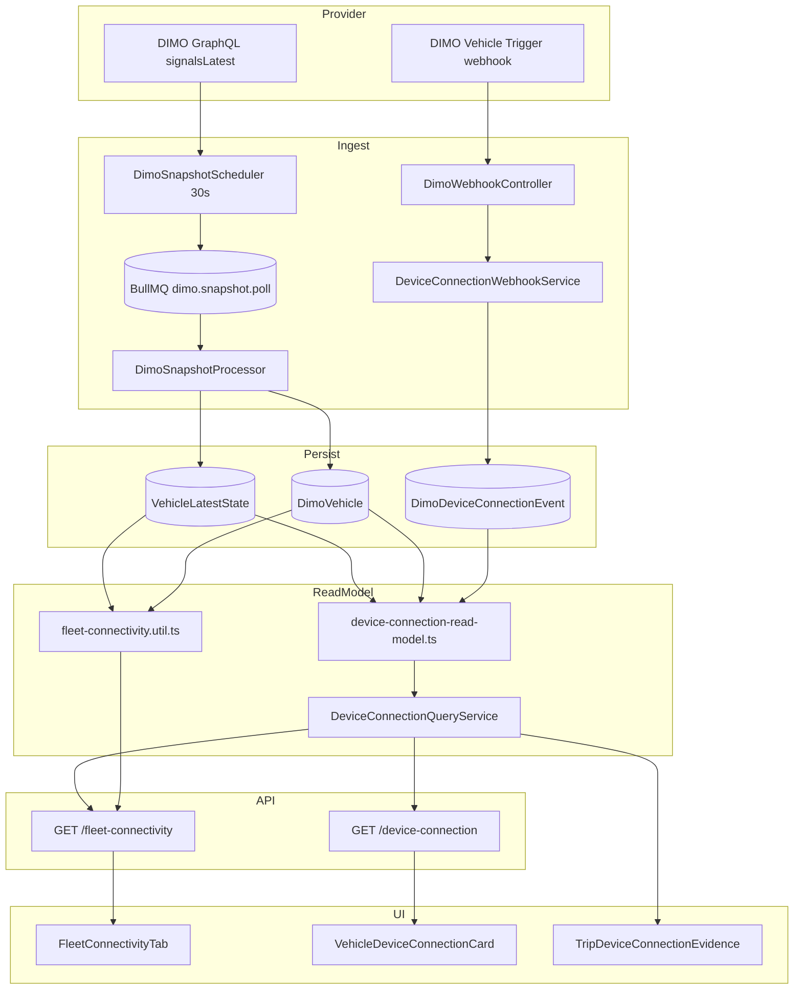
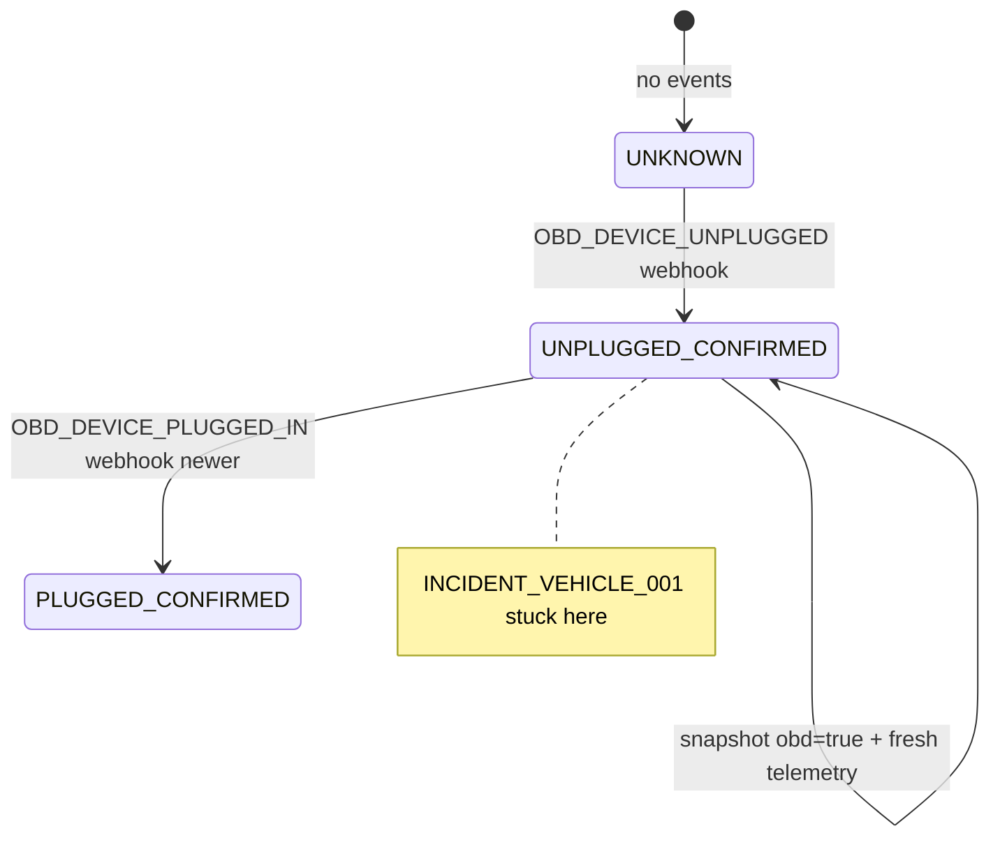

# Fleet Connectivity Production-Readiness Audit — July 2026

| Field | Value |
|-------|-------|
| **Audit ID** | `fleet-connectivity-production-readiness-2026-07` |
| **Repository** | [SYNQDRIVE-alpha](https://github.com/FATIHS-MGCKS/SYNQDRIVE-alpha) |
| **Branch** | `audit/fleet-connectivity-production-readiness-2026-07` |
| **Phase** | **2 of 8 — State logic & derivation audit** |
| **Status** | Phases 1–2 complete; Phases 3–8 outlined below |
| **Production data modified** | **No** — all VPS/DB access was read-only |
| **Analysis window (VPS)** | Through 2026-07-18 UTC |
| **Incident vehicle (anonymized)** | `INCIDENT_VEHICLE_001` (real mapping **not** stored in git) |

---

## Document map

| Artifact | Path | Phase |
|----------|------|-------|
| Main report (this file) | `docs/audits/fleet-connectivity-production-readiness-2026-07.md` | 1–2 |
| Code map CSV | `docs/audits/data/fleet-connectivity-code-map-2026-07.csv` | 1 |
| Incident timeline (anonymized) | `docs/audits/data/fleet-connectivity-incident-001-timeline-2026-07.json` | 1 |
| State rule map | `docs/audits/data/fleet-connectivity-state-rule-map-2026-07.csv` | 2 |
| Freshness consumer matrix | `docs/audits/data/fleet-connectivity-freshness-consumer-matrix-2026-07.csv` | 2 |
| Device state machine | `docs/audits/data/fleet-connectivity-device-state-machine-2026-07.csv` | 2 |
| Readiness factor map | `docs/audits/data/fleet-connectivity-readiness-factor-map-2026-07.csv` | 2 |
| Read-only orchestrator | `scripts/audits/audit-fleet-connectivity-production-readiness.ts` | 1–2 |

---

# Eight-phase audit outline

## Phase 1 — Architecture map & runtime baseline (this document)

- Git branch and audit scaffolding
- VPS runtime topology (PM2, PostgreSQL, Redis, BullMQ, ClickHouse, Prometheus, Grafana)
- End-to-end code landkarte and data-flow diagram
- Code map CSV with preliminary risk ratings
- INCIDENT_VEHICLE_001 preliminary reconstruction and P0/P1 suspects
- Read-only audit script skeleton

## Phase 2 — Production data replay & temporal reconstruction

- Read-only SQL replay per anonymized vehicle (`VEHICLE_001`–`VEHICLE_003`)
- Full INCIDENT_VEHICLE_001 timeline: webhook → poll logs → `VehicleLatestState` → API projection
- Fleet-wide stuck-unplug pattern quantification
- ClickHouse signal cadence (if available) for post-unplug recovery window
- Artifact: `fleet-connectivity-fleet-stats-2026-07.json` (via audit script phase 2)

## Phase 3 — Parallel truth reconciliation

- Cross-surface matrix: Fleet Tab, Vehicle Detail, Trips, Data Analyse, Admin, Dashboard, Booking Gate
- Document every field where `connectionStatus`, `obdIsPluggedIn`, `deviceConnection`, and `DimoVehicle.connectionStatus` can disagree
- Capability-aware evaluation (LTE_R1 vs other hardware)
- Artifact: consumer wiring CSV

## Phase 4 — Idempotency, locks, and failure modes

- Webhook dedup buckets, state-change gates, impulse filters
- BullMQ `jobId=snapshot-<vehicleId>` semantics and stall recovery
- Scheduler resume-gap backfill interaction with connectivity (indirect)
- Redis queue depth baselines under load
- Artifact: failure-mode matrix

## Phase 5 — Notifications, alerts, and operational response

- Whether `openUnpluggedEpisode` triggers notifications or tasks
- Rental-relevant severity (`duringActiveBooking`) propagation
- Integration Hub / consent / authorization impact on perceived connectivity
- Artifact: alert-blocking matrix

## Phase 6 — Test coverage & replay harness

- Unit/integration test inventory vs production scenarios
- Pure replay of `buildDeviceConnectionSummary` for INCIDENT_VEHICLE_001 inputs
- Frontend filter/badge tests for contradictory states
- Artifact: test-coverage CSV

## Phase 7 — Remediation design (no production writes)

- Target architecture for snapshot-based episode closure aligned with agreed business rule
- Options: read-model synthetic recovery vs snapshot-triggered `PLUGGED_IN` intake vs hybrid
- Migration/backfill policy for historical stuck episodes
- Artifact: decision record

## Phase 8 — Final synthesis & production-readiness verdict

- Consolidated P0/P1/P2 findings
- Go/no-go for Fleet Connectivity tab production readiness
- Explicit sign-off checklist per product surface
- Artifact: executive summary + remediation backlog

---

# Phase 1 findings

## 1. Executive summary (preliminary)

SynqDrive implements **three parallel connectivity truths** that are intentionally separated in code but can **contradict in production**:

| Truth layer | Source | Primary fields | Persisted? |
|-------------|--------|----------------|------------|
| **Telemetry freshness** | `VehicleLatestState` (snapshot processor) | `connectionStatus`, `lastSeenAt`, `freshnessLabel` | Yes (`vehicle_latest_states`) |
| **Snapshot OBD plug** | `rawPayloadJson.obdIsPluggedIn` | `obdIsPluggedIn`, `signals.obdPlug` | Yes (same row) |
| **Webhook tamper episode** | `dimo_device_connection_events` | `deviceConnection.openUnpluggedEpisode`, severity | Yes (events table) |

**INCIDENT_VEHICLE_001** demonstrates a production failure mode: after a valid `OBD_DEVICE_UNPLUGGED` webhook (2026-07-08), telemetry resumed within seconds and currently shows **CONNECTED**, **fresh `lastSeenAt`**, and **`obdIsPluggedIn=true`**, yet the UI still shows **„Gerät getrennt“ / open unplug episode** because **no `OBD_DEVICE_PLUGGED_IN` event exists** and the read-model **does not close episodes from snapshot recovery**.

Preliminary verdict for Phase 1: **architecture mapped; production incident root cause identified at read-model layer; not production-ready for agreed unplug→telemetry-recovery rule.**

---

## 2. VPS runtime topology (read-only, 2026-07-18)

| Component | Where | Role for connectivity |
|-----------|-------|------------------------|
| **PM2 `synqdrive`** | VPS `srv1374778`, fork mode, `/opt/synqdrive/current/backend/dist/src/main.js` | Single NestJS monolith: API + `@nestjs/schedule` + embedded BullMQ workers |
| **systemd** | inactive | Process managed by PM2 only |
| **PostgreSQL 16** | Native on VPS (`synqdrive` DB) | Canonical state: `vehicles`, `dimo_vehicles`, `vehicle_latest_states`, `dimo_device_connection_events` |
| **Redis** | Local (`PONG`) | BullMQ backing store |
| **ClickHouse** | Docker `synqdrive-clickhouse` (healthy) | Optional telemetry history; not authoritative for connectivity UI |
| **Prometheus / Grafana** | Docker containers | Observability; connectivity-specific alert rules not confirmed in Phase 1 |
| **Docker Compose** | Grafana, ClickHouse, Prometheus only | Postgres/Redis not containerized on prod VPS |

### Process ownership

| Concern | Process | Queue / trigger | Writes |
|---------|---------|-----------------|--------|
| DIMO snapshot ingestion | `DimoSnapshotScheduler` (@Interval 30s) → `DimoSnapshotProcessor` | `bull:dimo.snapshot.poll` | `vehicle_latest_states`, optional ClickHouse |
| DIMO webhook intake | `DimoWebhookController` (HTTP inline) | `POST /api/v1/webhooks/dimo` | `dimo_device_connection_events` (device connection path) |
| Connectivity **calculation** | Pure functions at **read time** | API request | **None** — no materialized connectivity state table |
| Fleet Connectivity API | `VehiclesService.getFleetConnectivity` | HTTP GET | None |
| Notifications / alerts | `notification.evaluation` queue | async workers | Not wired to device unplug in Phase 1 scan |

### Queue snapshot (read-only)

- `dimo.snapshot.poll`: wait=0, active=0 at observation time
- `notification.evaluation`: wait=0

### Fleet scale (production, anonymized aggregates)

| Metric | Value |
|--------|-------|
| Total vehicles | 7 |
| DIMO-linked | 6 |
| LTE_R1 hardware | 6 |
| Device connection events (all time) | 2 |
| UNPLUG events | 2 |
| PLUG events | 0 |
| Vehicles with last event = UNPLUGGED | 2 |
| LTE_R1 with fresh telemetry + snapshot plugged but no plug event after unplug | 2 |

---

## 3. End-to-end data flow



### Timestamp semantics

| Field | Meaning |
|-------|---------|
| `VehicleLatestState.lastSeenAt` | Newest provider signal timestamp from snapshot normalization — **canonical telemetry freshness** |
| `VehicleLatestState.providerFetchedAt` | When SynqDrive ingested the snapshot |
| `DimoVehicle.lastSignal` | Legacy/sync field; fleet API prefers `latestState.lastSeenAt` |
| `DimoDeviceConnectionEvent.observedAt` | Provider webhook timestamp |
| `DimoDeviceConnectionEvent.dedupBucket` | `floor(observedAt / 30s)` for burst dedup |
| `FleetConnectivityResponse.generatedAt` | API response time (not provider time) |

---

## 4. INCIDENT_VEHICLE_001 — preliminary reconstruction

> **Privacy:** Real license plate, VIN, internal UUID, and token IDs are **not** stored in git. Operational mapping lives outside the repository.

| Time (UTC) | Source | Event |
|------------|--------|-------|
| 2026-07-08 17:21:19 | DIMO webhook | `OBD_DEVICE_UNPLUGGED` persisted (only device-connection event for this vehicle) |
| 2026-07-08 17:21:41 | Snapshot poll | First `SUCCESS` poll after unplug (~22s later) — telemetry pipeline never stopped |
| 2026-07-08 → 2026-07-18 | Snapshot polling | Continued ingestion (`VehicleLatestState` fresh at audit time) |
| 2026-07-18 09:47:39 (approx) | Current state | `DimoVehicle.connectionStatus=CONNECTED`, snapshot `obdIsPluggedIn=true`, fresh `lastSeenAt` |
| Read-model output | `buildDeviceConnectionSummary` | `openUnpluggedEpisode=true`, `currentDeviceConnectionStatus=unplugged` |

### Agreed business rule vs implementation

| Agreed rule | Current implementation |
|-------------|------------------------|
| Unplug webhook → resumed real telemetry from same device → **auto-close** open unplug episode | Episode closure requires a **persisted** `OBD_DEVICE_PLUGGED_IN` event **newer than** the unplug |
| Separate plug webhook **not required** | Correct — plug webhook disabled (ops 2026-07-08). **But** no alternative closure path exists |
| Snapshot `obdIsPluggedIn` represents re-plug | Used for `obdIsPluggedIn` column and reconcile **anchor**, but anchor only **suppresses false plug webhooks**, not **closes open unplug** |

Detailed anonymized timeline: `docs/audits/data/fleet-connectivity-incident-001-timeline-2026-07.json`.

---

## 5. Confirmed parallel connectivity truths

These can all be true simultaneously on the same vehicle (and are on INCIDENT_VEHICLE_001):

1. **`connectionStatus = online`** — `lastSeenAt` within 15 minutes
2. **`obdIsPluggedIn = true`** — snapshot signal available
3. **`deviceConnection.openUnpluggedEpisode = true`** — last webhook event is UNPLUGGED with no newer PLUG event
4. **`DimoVehicle.connectionStatus = CONNECTED`** — DIMO platform link state

The Fleet Connectivity UI surfaces (1)+(2) in connection/OBD columns and (3) in the webhook/tamper chip — producing **„online + plugged in snapshot + Gerät getrennt (Webhook)“**.

---

## 6. Preliminary P0 / P1 findings

| ID | Severity | Finding |
|----|----------|---------|
| **FC-P0-01** | P0 | `buildDeviceConnectionSummary` / `openUnpluggedEpisode` ignores snapshot recovery (`obdIsPluggedIn=true` + fresh telemetry + CONNECTED) when no `OBD_DEVICE_PLUGGED_IN` row exists — violates agreed unplug→telemetry recovery rule |
| **FC-P0-02** | P0 | Architecture doc `DIMO_OBD_WEBHOOK_UNPLUG_ONLY_2026-07-08.md` states plug via snapshot but does not specify episode closure — engineering assumed UI would suffice; fleet tamper KPIs remain wrong |
| **FC-P0-03** | P0 | Fleet-wide: 2/6 LTE_R1 vehicles exhibit same stuck-unplug pattern with live telemetry (production SQL, read-only) |
| **FC-P1-01** | P1 | Three parallel truths (`connectionStatus`, `obdIsPluggedIn`, `deviceConnection`) without cross-reconciliation or user-facing explanation of precedence |
| **FC-P1-02** | P1 | Trip evidence `recoveryAt` requires persisted `PLUGGED_IN` row — trips during/after recovery show perpetual „offen“ |
| **FC-P1-03** | P1 | No notification/alert registry entry for device unplug or stuck episode — operational blind spot |
| **FC-P1-04** | P1 | `DeviceConnectionQueryService` loads only 7 days of events — sufficient for incident but may hide long-running episodes in edge cases |
| **FC-P2-01** | P2 | `readinessScore` equals `signalCoveragePercent` — naming suggests operational readiness but measures signal availability only |
| **FC-P2-02** | P2 | High-Mobility `connectivity_status` is a separate OEM path — not integrated into fleet connectivity for current LTE_R1 fleet |

---

## 7. Code map reference

Full step-by-step map (48 rows): `docs/audits/data/fleet-connectivity-code-map-2026-07.csv`.

Columns: `domain`, `file`, `classOrFunction`, `responsibility`, `input`, `output`, `dataSource`, `timestampSemantics`, `writesData`, `trigger`, `idempotencyMechanism`, `consumers`, `testCoverage`, `preliminaryRisk`.

---

## 8. Test coverage snapshot (Phase 1)

| Area | Spec files |
|------|------------|
| Device connection read-model | `device-connection-read-model.spec.ts` |
| Webhook intake | `device-connection-webhook.service.spec.ts`, `dimo-webhook.controller.spec.ts` |
| Fleet connectivity util | `fleet-connectivity.util.spec.ts`, `vehicles.service.fleet-connectivity.spec.ts` |
| Frontend filters/badges | `fleet-connectivity.utils.test.ts`, `device-connection-ui.test.ts` |

**Gap:** No test for „unplug webhook only + snapshot recovery closes episode without PLUG event“ — the INCIDENT_VEHICLE_001 scenario.

---

## 9. Read-only audit tooling

```bash
# Phase 1 (no DB)
npx ts-node scripts/audits/audit-fleet-connectivity-production-readiness.ts --phase=1

# Phase 2 (requires supervised prod read-only DATABASE_URL)
FLEET_CONNECTIVITY_AUDIT_ALLOW_REMOTE=1 FLEET_CONNECTIVITY_AUDIT_ALLOW_PROD=1 \
  npx ts-node scripts/audits/audit-fleet-connectivity-production-readiness.ts --phase=2
```

---

## 10. Phase 1 completion checklist

- [x] Audit branch created
- [x] Main report with 8-phase outline
- [x] Code map CSV
- [x] Anonymized incident timeline JSON
- [x] VPS runtime documented (read-only)
- [x] Data flow documented
- [x] P0/P1 suspects recorded
- [x] No production writes performed
- [x] PII/secret scan on committed artifacts (no plates/VINs/UUIDs in git)

**Changes / Architektur (SynqDrive Code views):** Not updated — audit-only documentation; product architecture records unchanged pending Phase 8 verdict.

---

# Phase 2 — State logic & derivation audit

## 11. Status dimensions inventory

### 11.1 Provider link

| Sub-state | Implemented? | Where | Used in Fleet Connectivity? |
|-----------|--------------|-------|----------------------------|
| Provider record present | Yes | `Vehicle.dimoVehicleId` + `DimoVehicle` row | `hasProviderLink = dv != null` |
| Consent active | Yes (ledger) | `VehicleProviderConsent` | **No** — not in fleet-connectivity path |
| Authorization valid | Partial | DIMO JWT via `DimoAuthService` | Implicit (poll succeeds) |
| Token present | Yes | `DimoVehicle.tokenId` | Masked in API; used for poll/webhook |
| Token expired | Partial | JWT refresh in auth service | Surfaces as poll FAILURE not fleet field |
| Data source connected | Partial | `VehicleDataSourceLink` | Billing only |
| Reauthorization required | No dedicated field | — | Not exposed |
| Provider error | Partial | `DimoConnectionStatus.ERROR` | Reconcile anchor only |
| Link removed | Yes | `dimoVehicleId` null | `not_connected` |
| Historical record without active grant | Possible | Consent REVOKED rows | **Not evaluated** in connectivity UI |

**Finding:** Fleet Connectivity collapses provider link to a single boolean (`dimoVehicle != null`). Consent, HM clearance, and reauthorization are **out of scope** for the tab despite existing backend models.

### 11.2 Telemetry freshness

| Sub-state | Canonical (5-state) | Fleet Connectivity API (4-state) | Data Analyse |
|-----------|---------------------|----------------------------------|--------------|
| No timestamp | `no_signal` | `offline` + note | `insufficient_data` |
| Live (<15m) | `live` | `online` | `fresh` |
| Standby (15m–24h) | `standby` | `standby` | `stale` |
| Soft-offline (24–48h) | `signal_delayed` | **`offline`** (merged) | **`offline`** at 24h |
| Offline (≥48h) | `offline` | `offline` at **24h** | `offline` at 24h |
| Provider lag | Not modeled | — | — |
| Ingest lag | `providerFetchedAt` exists | Not exposed | Notes only |
| Delayed snapshot | Not distinguished | — | — |
| Backfill snapshot | Not distinguished | — | — |

**Finding:** **Three freshness vocabularies** coexist. Rental UI (`telemetryFreshness.ts`, `vehicle-state-interpreter.ts`) implements the agreed 5-state model with 48h offline. **Fleet Connectivity API** diverges: no `signal_delayed`, offline at **24h**.

### 11.3 Physical device

| Sub-state | Source | Fleet UI column | Webhook episode |
|-----------|--------|-----------------|-----------------|
| Plugged confirmed | Snapshot `obdIsPluggedIn=true` | `ObdRowChip` Plugged in | Needs `PLUGGED_IN` event |
| Plugged inferred | **Not implemented** | — | — |
| Unplugged confirmed | Webhook `UNPLUGGED` + open episode | `DeviceConnectionWebhookChip` | `openUnpluggedEpisode` |
| Unplugged snapshot | `obdIsPluggedIn=false` | `ObdRowChip` Unplugged | Independent |
| Unknown | `obdIsPluggedIn=null` | No data | `unknown` status |
| Not applicable | Partial (`lteR1` gate) | Hides webhook block | Synthetic/OEM not fully N/A |
| Device binding changed | **Not tracked** | — | Events vehicle-scoped only |

**INCIDENT_VEHICLE_001:** Snapshot = plugged; webhook episode = open unplug → **both columns visible** on Fleet tab.

### 11.4 Webhook intake

| Sub-state | Implemented | Notes |
|-----------|-------------|-------|
| Trigger configured | **Inferred only** | `webhookConfigured`: events>0 → active; dimoLinked+no events → not_configured |
| Event received | HTTP 200 on controller | Logged |
| Event signed | Optional HMAC | DIMO triggers often unsigned |
| Event persisted | `dimo_device_connection_events` upsert | 30s dedup bucket |
| Event processed | `buildDeviceConnectionSummary` at read time | Not materialized |
| Failed / retry / DLQ | Controller returns ignored; no DLQ table | Failures silent to UI |
| Unknown trigger status | `unknown` when no events and not dimoLinked | — |

**Finding:** `DimoTriggersService.listWebhooks()` can query DIMO API but is **not wired** into fleet or device-connection read models. **No event ≠ not configured.**

### 11.5 Data coverage

Eight signal keys in `deriveFleetSignals`: gps, odometer, speed, fuel, evSoc, dtc, obdPlug, jamming. Each: `available` | `missing` | `unknown`. **No per-signal freshness.** **No EV/ICE or OEM/OBD capability matrix** in score denominator.

### 11.6 Operational attention

| Signal | Mechanism | Consumer |
|--------|-----------|----------|
| Device unplug critical | `severity=critical` if open episode + active booking | Fleet chip, vehicle card |
| Device unplug warning | open episode outside booking | Fleet chip |
| Telemetry offline | `resolveTelemetryFreshness` shouldWarnUser | Fleet board, booking gate (48h) |
| Health action required | `fleet-health-control-center` | **Health tab only** |
| Notifications for device unplug | **None** | — |

---

## 12. Derivation rules summary

Full rule-level CSV (40 rules): `docs/audits/data/fleet-connectivity-state-rule-map-2026-07.csv`.

### Critical formulas

**`hasProviderLink`** — `mapFleetConnectivityVehicle`: `dimoVehicle != null`. No consent check.

**`connectionStatus` (Fleet API)** — `deriveConnectionStatus(hasProviderLink, lastSeenMs, nowMs)`:
- `not_connected` if no link
- `offline` if no `lastSeenAt` or future timestamp
- `online` if age < **15 min**
- `standby` if age < **24 h**
- `offline` otherwise (including 24–48h band)

**`openUnpluggedEpisode`** — `buildDeviceConnectionSummary`:
```text
lastUnplug exists AND (no lastPlug OR lastUnplug.observedAt > lastPlug.observedAt)
```
After `reconcileDeviceConnectionEvents` (phantom plug suppression only). **Does not read snapshot recovery.**

**`readinessScore`** — `signalCoveragePercent` = `round(available / known * 100)` where `known` = signals not `unknown`.

**`webhookConfigured`** — if any event in 7d window → `active`; else if dimoLinked → `not_configured`; else `unknown`.

---

## 13. Freshness consumer matrix

See `docs/audits/data/fleet-connectivity-freshness-consumer-matrix-2026-07.csv`.

| Deviation | Impact |
|-----------|--------|
| Fleet Connectivity offline @ 24h vs rental offline @ 48h | Same vehicle **bookable** on fleet map but **offline** on connectivity tab |
| Missing `signal_delayed` on Fleet API | Soft-offline indistinguishable from hard offline |
| `onlineStatus` OFFLINE @ 24h while `telemetryFreshness` = `signal_delayed` | API consumers using wrong field mis-rank vehicle |
| Data Analyse `stale` label for 15m–24h | Operator vocabulary ≠ Fleet „standby“ |

---

## 14. Device-connection episode state machine

See `docs/audits/data/fleet-connectivity-device-state-machine-2026-07.csv` (15 questions + current vs recommended states).

### Current machine (simplified)



### Recommended machine (not implemented)

| State | Enter | Exit | Resolution method |
|-------|-------|------|-------------------|
| `UNPLUGGED_CONFIRMED` | Unplug webhook | Inferred/s explicit recovery | `EXPLICIT_PLUG_WEBHOOK` |
| `PLUGGED_INFERRED` | Snapshot plug + fresh telemetry after T0 + same binding | New unplug | `SNAPSHOT_PLUG_SIGNAL` / `TELEMETRY_RESUMED` |
| `PLUGGED_CONFIRMED` | Plug webhook | Unplug webhook | `EXPLICIT_PLUG_WEBHOOK` |
| `UNKNOWN` | No evidence | Any confirmed transition | — |
| `NOT_APPLICABLE` | Non-LTE_R1 / synthetic OEM | — | — |

---

## 15. Snapshot-based recovery rule evaluation

**Desired rule:** Unplug @ T0 + snapshot @ T1 (T1>T0) + same provider/binding + physical OBD + non-backfill ⇒ close episode, state `PLUGGED_INFERRED`.

| Criterion | Data available today? | Gap |
|-----------|----------------------|-----|
| Unplug @ T0 | Yes — `dimo_device_connection_events.observedAt` | — |
| Snapshot @ T1 | Yes — `VehicleLatestState.lastSeenAt`, `rawPayloadJson.obdIsPluggedIn` | Signal-level timestamp in raw JSON; not used in read model |
| T1 > T0 | Comparable in code | Not implemented |
| Same provider | Yes — DIMO-only path today | — |
| Same device/token binding | Partial — `tokenId` on events + `dimoTokenId` on VLS | **No binding episode ID**; token change not invalidating episode |
| Physical OBD/R1 | Yes — `hardwareType=LTE_R1` | Synthetic path not excluded from episode |
| Non-backfill | Partial — `providerFetchedAt` vs `sourceTimestamp` | No backfill guard in device read model |
| Not delayed stale OEM-only cloud | Partial — `aftermarketDevice` vs `syntheticDevice` in `dimoVehicle.rawJson` | Not used in episode logic |

**Timestamp semantics:**
- Webhook: `observedAt` = provider trigger time (intake default `now` if missing)
- Snapshot: `lastSeenAt` = newest signal timestamp in snapshot; `providerFetchedAt` = SynqDrive ingest time

**Verdict:** **All raw inputs exist** to implement the rule in read-model or intake; **no code path applies them** for episode closure.

---

## 16. Readiness / coverage audit

See `docs/audits/data/fleet-connectivity-readiness-factor-map-2026-07.csv`.

| Issue | Detail |
|-------|--------|
| Score = coverage | `readinessScore` identical to `signalCoveragePercent` — not freshness-weighted |
| EV SoC on ICE | `evSoc` in denominator; missing → lowers score |
| Fuel on EV | `fuel` in denominator; same |
| OBD on synthetic | `obdPlug` scored; only LTE_R1 gates webhook UI not score |
| Jamming without capability | Raw key presence sufficient for `available` |
| GPS privacy | Coordinates missing → `missing` not `not_applicable` |
| DTC without active fault | Poll timestamp or empty list still `available` |
| Speed while parked | Available if value present — no parked context |

**Recommended (document only):**
```text
readiness = usable_fresh_signals / expected_capability_supported_signals
```
where „usable fresh“ requires signal timestamp within live window and „expected“ comes from per-vehicle capability profile.

---

## 17. Webhook configuration status

| Status enum (product) | Current derivation | True config source available? |
|---------------------|-------------------|------------------------------|
| CONFIGURED | `events.length > 0` → `active` | DIMO `DimoTriggersService.listWebhooks()` — **not used** |
| NOT_CONFIGURED | `dimoLinked && no events` | **Unsafe inference** |
| ERROR | **Not modeled** | Poll failures in `dimo_poll_logs` — separate from webhooks |
| UNKNOWN | Default | — |

Data Analyse duplicates same inference (`deviceConnectionWebhookIntake` in `data-analyse.service.ts`). **No DB subscription registry.** Ops doc (`DIMO_OBD_WEBHOOK_UNPLUG_ONLY_2026-07-08.md`) is authoritative but not machine-readable in app.

---

## 18. Phase 2 — confirmed contradictory rules

| ID | Contradiction |
|----|----------------|
| **FC-C-01** | Fleet API `offline` @ 24h vs canonical `signal_delayed` until 48h |
| **FC-C-02** | `openUnpluggedEpisode` (webhook) vs `obdIsPluggedIn=true` (snapshot) on same vehicle |
| **FC-C-03** | Vehicle header OBD badge (snapshot false only) vs Fleet webhook chip (episode) |
| **FC-C-04** | `webhookConfigured=not_configured` from zero events vs ops-configured unplug-only webhook |
| **FC-C-05** | `readinessScore` label implies operational readiness; formula is static signal presence |
| **FC-C-06** | `onlineStatus=OFFLINE` @ 24h vs `telemetryFreshness=signal_delayed` @ 24–48h on same API payload |

---

## 19. Recommended canonical state structure (Phase 2 proposal)

Single operator-facing projection (not implemented):

```text
ConnectivityViewModel {
  providerLink: LINKED | NOT_LINKED | REAUTH_REQUIRED | ERROR
  telemetryFreshness: live | standby | signal_delayed | offline | no_signal  // 5-state canonical
  deviceState: PLUGGED_CONFIRMED | PLUGGED_INFERRED | UNPLUGGED_CONFIRMED | UNKNOWN | NOT_APPLICABLE
  episode: { open: boolean, since: ISO|null, resolution: ResolutionMethod|null }
  webhookConfig: CONFIGURED | NOT_CONFIGURED | ERROR | UNKNOWN  // from DIMO API or registry
  coverage: { usableFresh: number, expectedCapable: number, score: number }
}
```

Episode closure for INCIDENT_VEHICLE_001 class: `deviceState=PLUGGED_INFERRED`, `episode.open=false`, `resolution=SNAPSHOT_PLUG_SIGNAL` when recovery rule predicates pass.

---

## 20. Phase 2 completion checklist

- [x] All six status dimensions inventoried
- [x] Derivation rules documented (CSV + summary)
- [x] Freshness consumer matrix vs canonical 5-state
- [x] Device episode state machine (current + recommended)
- [x] Snapshot recovery rule gap analysis
- [x] Readiness/coverage factor map
- [x] Webhook configuration inference audit
- [x] No production writes; no code fixes
- [x] PII scan on new artifacts

---

*End of Phase 2. Do not proceed to Phase 3 in this agent turn.*
