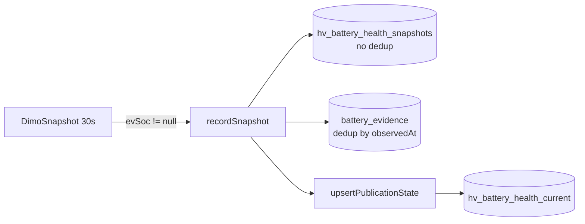

# HV Battery Health — Runtime Reality Audit (Prompt 6/8)

| Feld | Wert |
|------|------|
| **Audit-Zeitpunkt (UTC)** | 2026-07-16T10:38:00Z |
| **Repository-Git-Commit (lokal)** | `fa4aaeb23c987d4274a5eb0a711405937dd2c9d5` |
| **VPS-deployed Commit** | `2cd57c8` |
| **Basis-Dokumente** | [`battery-runtime-topology.md`](./battery-runtime-topology.md), [`battery-signal-cadence-reality.md`](./battery-signal-cadence-reality.md), [`battery-storage-integrity.md`](./battery-storage-integrity.md) |
| **Methodik** | Read-only Code-Inspektion + read-only PostgreSQL SELECTs/EXPLAIN auf Produktion; keine Writes, keine Retention, keine Jobs |
| **Untersuchte Umgebung** | **Produktion** (`app.synqdrive.eu` / VPS `srv1374778.hstgr.cloud`) |

---

## Executive Summary

**Kernbefund:** Die HV-Pipeline persistiert **nahezu jeden erfolgreichen DIMO-Poll** (~100,5 % Quote) als `hv_battery_health_snapshots`-Zeile — **ohne Deduplizierung** nach Provider-Timestamp. **93,7 %** der Zeilen (30d) wiederholen denselben `recorded_at`-Wert. Die Mindest-ΔSOC-Regel (≥ 5 Prozentpunkte) für Kapazitätsschätzung wird in der Praxis **praktisch nie** erfüllt (**0** persistierte Messungen all-time, **0** gültige Paare in 5 000 Folgezeilen). Provider-SOH ist **0 %** Flottenabdeckung. Retention für HV ist **deaktiviert** (Default `0`).

| Metrik | Wert | Beleg |
|--------|------|-------|
| HV-Zeilen pro EV und Tag (aktive Poll-Tage) | **~2 800–2 900** | PG 30d-Tagesverteilung |
| HV-Zeilen pro EV und Tag (30d-Durchschnitt) | **~2 407** | 69 801 / 29 eff. Tage |
| Duplikatanteil `recorded_at` (30d) | **93,7 %** | 65 405 Extra-Zeilen / 69 801 |
| Provider-SOH-Abdeckung | **0 / 1 BEV (0 %)** | `battery_evidence` + VLS |
| Persistierte Kapazitätsmessungen | **0** | `estimated_capacity_kwh IS NOT NULL` |
| Tabellengröße HV-Snapshots | **~31 MB** (108 653 Zeilen) | `pg_total_relation_size` |

**Entscheidungen (Kurz):**

- Sessionbasierte Kapazitätsmessung: **derzeit nicht belastbar möglich**
- 30-Sekunden-Persistenz: **akut kritisch** (Skalierung + fachliche Redundanz)

---

## 1. Zeitraum und Umgebung

| Parameter | Wert |
|-----------|------|
| **Primärfenster** | Letzte **30 Tage** (`recorded_at ≥ 2026-06-16T10:37:56Z`) |
| **Gesamtbestand HV** | Alle Zeilen in `hv_battery_health_snapshots` (seit ~2026-04) |
| **Laufzeit** | Ein PM2-Prozess `synqdrive` (NestJS monolith), DIMO-Poll `@Interval 30s` |
| **Datenbank** | PostgreSQL 16 (systemd), read-only Zugriff |
| **Flotte** | 6 DIMO-Fahrzeuge: **5 ICE, 1 BEV** (Tesla Model 3, KS FH 660E) |

---

## 2. Git-Commit

| Kontext | Hash |
|---------|------|
| Lokales Audit-Repo | `fa4aaeb23c987d4274a5eb0a711405937dd2c9d5` |
| VPS deployed (`/opt/synqdrive/current`) | `2cd57c8` |

Untersuchter Code (read-only):

- `backend/src/modules/vehicle-intelligence/battery-health/hv-battery-health.service.ts`
- `backend/src/modules/vehicle-intelligence/battery-health/battery-evidence.service.ts`
- `backend/src/workers/processors/dimo-snapshot.processor.ts`
- `backend/src/config/retention.config.ts`
- `backend/src/workers/schedulers/data-retention.scheduler.ts`
- `backend/prisma/schema.prisma` (`HvBatteryHealthSnapshot`, `HvBatteryHealthCurrent`, `BatteryEvidence`)

---

## 3. Fahrzeugstichprobe

| Label | Profil | HV-Snapshots (30d) | HV-Snapshots (gesamt) | Distinct `recorded_at` (30d) |
|-------|--------|-------------------:|----------------------:|-----------------------------:|
| **KS FH 660E** | BEV (Tesla Model 3, 57 kWh nominal) | **69 801** | **108 654** | **4 396** |
| 5× ICE | Kein `evSoc` → kein HV-Pfad | 0 | 0 | — |

**Klassifikation:** Alle HV-Produktionsdaten stammen aus **einem** Fahrzeug. PHEV/HEV nicht in Flotte.

---

## 4. Signalquellen und Einheiten

### 4.1 DIMO → Snapshot-Mapping (`dimo-snapshot.processor.ts`)

| SynqDrive-Feld | DIMO-Signal | Einheit (nach Normalisierung) | Verwendung |
|----------------|-------------|-------------------------------|------------|
| `socPercent` | `powertrainTractionBatteryStateOfChargeCurrent` | % | HV-Snapshot, Evidence |
| `energyUsedKwh` | `powertrainTractionBatteryStateOfChargeCurrentEnergy` | **kWh** | ΔEnergy-Berechnung |
| `chargingPowerKw` | `powertrainTractionBatteryChargingPower` (fallback: `CurrentPower`/1000) | kW | Charging-Flag, Sessions |
| `isCharging` | `powertrainTractionBatteryChargingIsCharging` (≥ 0,5) | bool | Session-Ableitung |
| `nominalCapacityKwh` | `powertrainTractionBatteryGrossCapacity` | kWh | Plausibilitätsband SOH |
| `providerReportedSohPercent` | `powertrainTractionBatteryStateOfHealth` | % | Provider-SOH Evidence |
| `temperatureC` | `powertrainTractionBatteryTemperatureAverage` | °C | Evidence (oft null) |
| `observedAt` / `recordedAt` | `lastSeenAt` | UTC timestamp | **Provider-Zeitstempel** |

### 4.2 Nicht in `recordSnapshot` übergeben (nur VLS/API)

| Feld | Signal | Anmerkung |
|------|--------|-----------|
| `tractionBatteryAddedEnergyKwh` | `powertrainTractionBatteryChargingAddedEnergy` | In VLS vorhanden (16,08 kWh), nicht in HV-Snapshots |
| `tractionBatteryChargingCableConnected` | DIMO cable flag | Nur Live-Status |

### 4.3 Evidence-Deduplizierung

`BatteryEvidenceService.recordMany` nutzt Unique-Key `(vehicleId, scope, valueType, sourceType, observedAt)` — wiederholte Provider-Timestamps erzeugen **keine** neuen Evidence-Zeilen, sondern Upsert. Snapshots haben **kein** analoges Dedup.

---

## 5. Persistenzkadenz

| Metrik | Wert | Beleg |
|--------|------|-------|
| DIMO SNAPSHOT-Polls (BEV, 30d) | **69 480** | `dimo_poll_logs` |
| HV-Snapshot-Zeilen (30d) | **69 801** | `hv_battery_health_snapshots` |
| **Poll → HV-Quote** | **100,5 %** | Jeder Poll mit `evSoc` → `recordSnapshot` |
| Distinct Provider-`recorded_at` (30d) | **4 396** | 6,3 % der Zeilen |
| **Provider-Timestamp-Wechsel : persistierte Zeilen** | **1 : 15,9** | 4 396 / 69 801 |
| Ohne relevante SOC-Änderung (Folgepaare) | **91,6 %** | 7 327 / 7 999 Paare (Stichprobe 8 000) |
| Ohne Energie-Änderung (Folgepaare) | **95,6 %** | 7 649 / 8 000 |

**Code:** `recordSnapshot` wird fire-and-forget bei jedem Snapshot mit `normalized.evSoc != null` aufgerufen — **kein** Change-Detection-Gate.

---

## 6. Tabellenwachstum

### 6.1 Ist-Zahlen

| Metrik | Wert |
|--------|------|
| HV-Snapshots gesamt | **108 653** |
| HV-Snapshots (30d) | **69 801** |
| Fahrzeuge mit HV-Daten (30d) | **1** |
| Tabellengröße (total) | **32 210 944 B (~30,7 MB)** |
| Heap-Größe | **21 143 552 B (~20,2 MB)** |
| Geschätzte Ø-Zeilengröße | **~296 B** |
| `battery_evidence` HV gesamt | **71 103** Zeilen |
| `battery_evidence` HV (30d) | **13 188** Zeilen |

### 6.2 Pro Tag (BEV, UTC-Tage mit Daten)

| Statistik | Wert |
|-----------|------|
| Median aktiver Tag | **~2 774** Zeilen |
| Max Tag (2026-07-01) | **22 380** (Anomalie/Backfill-Gap) |
| Typischer aktiver Tag (Jun 22–30) | **2 160–2 898** |

### 6.3 Pro Monat (gesamt, alle Fahrzeuge)

| Monat | Zeilen |
|-------|-------:|
| 2026-04 | 29 079 |
| 2026-05 | 5 201 |
| 2026-06 | 31 202 |
| 2026-07 (partial) | 43 172 |

### 6.4 Hochrechnung Speicher (nur HV-Snapshots, ~296 B/Zeile)

| Szenario | Zeilen/Tag | Zeilen/Jahr | Rohspeicher/Jahr (nur Snapshots) |
|----------|----------:|------------:|----------------------------------:|
| **1 BEV (Ist)** | ~2 880 | ~1,05 M | ~310 MB |
| **10 EVs** | ~28 800 | ~10,5 M | ~3,1 GB |
| **100 EVs** | ~288 000 | ~105 M | ~31 GB |
| **1 000 EVs** | ~2,88 M | ~1,05 Mrd. | ~310 GB |

*Hinweis:* Evidence-Wachstum ist durch Dedup auf unique `observedAt` gedämpft (~6 % der Snapshot-Rate für Kernsignale), Provider-SOH-Evidence derzeit 0.

---

## 7. Eindeutige versus doppelte Timestamps

| Metrik | Wert (30d, KS FH 660E) |
|--------|-------------------------:|
| Gesamtzeilen | 69 801 |
| Distinct `recorded_at` | 4 396 |
| **Wiederholte `recorded_at`-Gruppen** | 1 051 |
| **Extra-Zeilen durch Timestamp-Duplikate** | 65 405 |
| **Duplikatanteil** | **93,7 %** |
| Distinct Payloads `(soc, energy, charging, power)` | 2 944 |
| Payload-Gruppen mit > 10 identischen Zeilen | 111 |

**Identische Providerwerte mehrfach persistiert:** Ja — dominanter Modus. Gleicher `recorded_at` + gleicher SOC/Energy über dutzende Folge-Polls.

**Schema:** Kein Unique-Index auf `(vehicle_id, recorded_at)` — Duplikate sind absichtlich möglich und werden massiv ausgenutzt.

---

## 8. SOC-Verhalten

| Metrik | Wert (Stichprobe 7 999 Folgepaare, 30d) |
|--------|------------------------------------------|
| SOC unverändert | **91,6 %** |
| \|ΔSOC\| &lt; 5 pp | **8,4 %** (669 Paare) |
| \|ΔSOC\| ≥ 5 pp | **0,04 %** (3 Paare) |
| Median \|ΔSOC\| | **0** |
| P95 \|ΔSOC\| | **0,07 pp** |
| Max \|ΔSOC\| | **20,48 pp** |
| `gap_sec = 0` (gleicher Provider-TS) | **84,3 %** (6 740) |
| Gap &gt; 1 h | **0,15 %** (12) |

**Datenlücken:** Kalendertage ohne HV-Zeilen im 30d-Fenster (z. B. 2026-06-17, 2026-06-19/20, 2026-07-02–08). **Sprünge:** seltene große ΔSOC (max 20,5 pp) bei langen Gaps — nicht als benachbarte 30s-Messungen interpretierbar.

**Updatekadenz real:** Provider liefert neuen SOC-Timestamp nur in **~6 %** der Polls; SynqDrive speichert trotzdem **100 %** der Polls.

---

## 9. Energie-Signalbewertung

| Frage | Antwort |
|-------|---------|
| **Welches Signal?** | `powertrainTractionBatteryStateOfChargeCurrentEnergy` → `energyUsedKwh` |
| **Einheit** | kWh (Direktwert, nicht Wattstunden-Umrechnung im Mapper) |
| **Kumulativ oder momentan?** | **Momentaner Restenergie-Inhalt** (BEV-Stichprobe: 39,9–55,4 kWh; median 47,6 kWh) |
| **Monoton?** | **Nein** — 165 Abwärts-, 185 Aufwärts-Schritte in 8 000 Paaren |
| **Reset-Verhalten** | Keine harten Resets beobachtet; Werteband plausibel für SOC-Korrelation |
| **Für ΔEnergy geeignet?** | **Nur eingeschränkt** — benötigt echte SOC-/Energieänderung zwischen **zeitlich benachbarten, provider-frischen** Messungen; bei 91,6 % unverändertem SOC und 84 % Zero-Gap-Paaren ist ΔEnergy meist 0 |

**Feldname `energyUsedKwh` ist irreführend** — es speichert **Current Energy**, nicht verbrauchte/kumulierte Energie.

---

## 10. Charging-Session-Feasibility

| Frage | Antwort | Beleg |
|-------|---------|-------|
| Charging Status verfügbar? | **Ja** | `is_charging` in 2 582 / 69 801 Zeilen (30d) true |
| Ladeleistung verfügbar? | **Ja, begrenzt** | 2 597 Zeilen mit `charging_power_kw > 0`; max **3,1 kW**, median **3,0 kW** |
| Ladebeginn/-ende rekonstruierbar? | **Prinzipiell ja** | 6 Starts + 6 Ends (`is_charging` false→true / true→false) in 30d |
| Zugeführte Energie pro Session? | **Eingeschränkt** | Δ`energy_used_kwh` zwischen Session-Grenzen möglich, aber Timestamps oft dupliziert |
| Pseudo-Sessions (SOC +5 % ohne Flag) | **0** in 30d | `deriveChargingSessions` Fallback ungenutzt |
| Temperature Context | **Selten in Snapshots** | `temperature_c` meist null; VLS hat kein Temperaturfeld in Stichprobe |

### Session-Felder — Belastbarkeit an realen Zyklen

| Feld | Belastbarkeit |
|------|---------------|
| Session Start/End | **Mittel** — nur 6 klare Übergänge/30d; Duration durch duplicate TS verzerrt |
| Start/End SOC | **Mittel** — verfügbar, aber wenig ΔSOC während Laden |
| ΔSOC | **Niedrig** — meist &lt; 1 pp zwischen Polls |
| Zugeführte Energie | **Niedrig** — ΔEnergy nur bei koordinierten SOC+Energy-Änderungen |
| Dauer | **Niedrig** — `recorded_at`-Duplikate ergeben 0-Minuten-Gaps |
| Unterbrechungen | **Nicht verifizierbar** bei 6 Sessions |
| Temperatur | **Nicht belastbar** (fehlende Daten) |

---

## 11. Provider-SOH-Verfügbarkeit

| Metrik | Wert |
|--------|------|
| Fahrzeuge mit Provider-SOH Evidence | **0** |
| Provider-SOH Evidence-Zeilen (gesamt) | **0** |
| `vehicle_latest_states.traction_battery_soh_percent` (BEV) | **null** |
| `traction_battery_gross_capacity_kwh` (BEV) | **null** (nominal 57 kWh nur in `vehicles.hv_battery_capacity_kwh`) |
| Distinct Provider-SOH `observed_at` (30d) | **0** |

**Schlussfolgerung:** DIMO liefert für KS FH 660E **kein** `StateOfHealth`-Signal in der persistierten Pipeline. `recordSnapshot` schreibt Provider-SOH-Evidence nur bei non-null — daher 0 Zeilen.

**HV-Publication-Widerspruch (bestehend):** `hv_battery_health_current` zeigt `publicationMethod=energy_throughput`, `validEstimateCount=2`, `publishedSohPct=85`, aber `publicationState=INITIAL_CALIBRATION` — siehe Prompt 5.

---

## 12. Reale eigene Kapazitätsmessungen

| Metrik | Wert |
|--------|------|
| Snapshots mit `estimated_capacity_kwh IS NOT NULL` (gesamt) | **0** |
| Snapshots mit `soh_percent IS NOT NULL` (gesamt) | **0** |
| MODEL_DERIVED SOH Evidence (nicht null) | **0** |
| `capacityPairAnalysis` (letzte 5 000 Paare) | **0** erfüllen ΔSOC≥5 + ΔEnergy&gt;0 + Plausibilität |
| `hv_battery_health_current.validEstimateCount` | **2** (aus letztem `upsertPublicationState`, Juni 2026) |

### Code-Logik (`recordSnapshot`)

```typescript
// Vergleich nur mit unmittelbar vorherigem Snapshot (ORDER BY recorded_at DESC)
if (deltaSoc >= 5 && deltaEnergy > 0) {
  estimatedCapacity = (deltaEnergy / deltaSoc) * 100;
  // Plausibilität: 50–120 % von nominalCapacityKwh
}
```

### Paar-Realität

| Prüfung | Ergebnis |
|---------|----------|
| Wurden Paare direkt benachbart gemessen? | **Meist nein** — 84 % Zero-Gap = gleicher Provider-TS; echte Nachbarschaft ist Poll-Nachbarschaft, nicht Mess-Nachbarschaft |
| Wird ΔSOC≥5 praktisch erfüllt? | **Nein** — 3/7 999 Paare (0,04 %) in Stichprobe; 0/5 000 in Rolling-Window |
| Messungen nur wegen Lücken/Sprüngen? | **Hypothese wahrscheinlich** für historische `validEstimateCount=2` — nicht mehr in DB rekonstruierbar (keine gespeicherten Estimates) |

---

## 13. Plausibilitätsbewertung der Ergebnisse

| Ergebnis | Plausibel? | Begründung |
|----------|------------|------------|
| HV-SOC-Zeitreihe als Trend | **Teilweise** — Werte plausibel (76 % SOC), aber 93,7 % Timestamp-Duplikate |
| ΔEnergy-basierte Kapazität | **Nein** — Regel praktisch nie erfüllt; 0 persistierte Estimates |
| `energy_throughput` Publication | **Nicht belastbar** — `validEstimateCount=2`, State `INITIAL_CALIBRATION`, keine Rohdaten mehr |
| `publishedSohPct=85` | **Widersprüchlich** — unter Calibration veröffentlicht (Prompt 5: INVALID) |
| Charging Sessions (API) | **Nur grob** — 6 Sessions/30d, langsame AC (~3 kW) |
| Provider-SOH | **Nicht vorhanden** | — |
| Skalierbarkeit 30s-Persist | **Nein** — lineares Wachstum ohne Retention/Dedup |

**Gesamturteil fachliche Belastbarkeit:** **Nicht belastbar** für SOH/Kapazitätsentscheidungen; **diagnostisch** für SOC-/Ladezustandstrends.

---

## 14. Retention-Realität

### Code (`retention.config.ts`)

| ENV-Key | Code-Default | VPS `backend.env` |
|---------|-------------|-------------------|
| `DATA_RETENTION_ENABLED` | `true` | **`true`** |
| `RETENTION_HV_BATTERY_SNAPSHOTS_DAYS` | **`0` (disabled)** | **unset → 0** |
| `RETENTION_BATTERY_EVIDENCE_DAYS` | **`0` (disabled)** | **unset → 0** |
| `RETENTION_DIMO_POLL_LOGS_DAYS` | 30 | **30** |

### Scheduler

- **Läuft:** Ja — Cron `30 3 * * *` UTC
- **PM2-Startup (2026-07-16):** `Data retention ENABLED — active windows: dimoPollLogs=30d, tripTrackingRuns=30d, …` — **HV nicht gelistet**
- **Letzter Lauf:** 2026-07-16 03:30 UTC — löscht `dimo_poll_logs`, `vehicle_trip_tracking_runs`, etc.; **kein** `hv_battery_health_snapshots`-Eintrag

### Hypothetische Löschmengen (nicht ausgeführt)

| Tabelle | Bei aktueller Config |
|---------|---------------------|
| `hv_battery_health_snapshots` | **0** (Retention disabled) |
| `battery_evidence` (HV) | **0** (Retention disabled) |

**Hinweis:** Retention nutzt `createdAt` (nicht `recordedAt`) für HV-Snapshots — bei Aktivierung wäre Provider-Zeit vs. Insert-Zeit zu beachten.

---

## 15. Hochrechnung für 10 / 100 / 1 000 EVs

Annahme: gleiche Poll-Architektur (30 s), gleiche Provider-Staleness, kein Dedup, Retention aus.

| Flottengröße | HV-Snapshots/Tag | HV-Snapshots/Jahr | Snapshots-Speicher/Jahr | Evidence (gedämpft, ~6 % unique TS × ~3 Typen) |
|-------------:|-----------------:|------------------:|------------------------:|-----------------------------------------------:|
| **10** | ~28 800 | ~10,5 M | ~3,1 GB | ~0,2 M Zeilen/Jahr (Kernsignale) |
| **100** | ~288 000 | ~105 M | ~31 GB | ~2 M Zeilen/Jahr |
| **1 000** | ~2,88 M | ~1,05 Mrd. | ~310 GB | ~20 M Zeilen/Jahr |

Zusätzlich: `upsertPublicationState` pro Snapshot (async) — 100 DB-Reads/Writes pro 100 Snapshots für Publication — vernachlässigbar gegen Insert-Last, aber konstant.

---

## 16. Entscheidung: Sessionbasierte Kapazitätsmessung

### **Derzeit nicht belastbar möglich**

**Begründung (durch Produktionsdaten belegt):**

1. ΔSOC ≥ 5 pp in **0,04 %** der Folgepaare — Mindestregel faktisch nie erfüllt
2. **0** persistierte Kapazitätsschätzungen in 108 653 Snapshots
3. **0** gültige Energy-Throughput-Paare in 5 000 jüngsten Zeilen
4. Provider-Timestamp-Duplikate (93,7 %) verhindern belastbare Session-Dauer und ΔEnergy
5. Nur **6** echte Ladezyklen/30d — zu wenig für statistische SOH
6. Provider-SOH fehlt komplett — kein Referenzanker

---

## 17. Entscheidung: 30-Sekunden-Persistenz

### **Akut kritisch**

**Begründung:**

1. **1:1 Poll-Persistenz** ohne Änderungsfilter — 69 801 Zeilen/30d für 1 BEV
2. **93,7 %** inhaltlich redundante Timestamp-Duplikate
3. **Retention disabled** — 108 653 Zeilen in ~3 Monaten, ~31 MB nur HV-Snapshots
4. Hochrechnung **310 GB/Jahr** bei 1 000 EVs (nur diese Tabelle)
5. Evidence-Dedup hilft; Snapshot-Tabelle nicht
6. Jeder Snapshot triggert **7 Evidence-Upserts** (CPU/IO) — Dedup reduziert Wachstum, nicht Arbeit

**Alternative Einordnung:** Fachlich wäre Persistenz bei **Provider-Timestamp-Wechsel** oder **|ΔSOC|≥0,5 pp** ausreichend (~94 % Einsparung).

---

## 18. P0 / P1 / P2 Findings

### P0 — Kritisch

| ID | Finding |
|----|---------|
| **HV-P0-01** | **Unbounded Snapshot-Wachstum** — `RETENTION_HV_BATTERY_SNAPSHOTS_DAYS=0`; ~2 880 Zeilen/EV/Tag ohne Dedup |
| **HV-P0-02** | **93,7 % redundante HV-Snapshots** — gleicher `recorded_at`/SOC; keine Insert-Deduplizierung |
| **HV-P0-03** | **Kapazitäts/SOH-Pipeline fachlich leer** — 0 Estimates bei 108k Snapshots; ΔSOC≥5-Regel praktisch nie erfüllt |
| **HV-P0-04** | **Publication-Widerspruch** — `INITIAL_CALIBRATION` + `publishedSohPct=85` (Fortführung Prompt 5) |

### P1 — Hoch

| ID | Finding |
|----|---------|
| **HV-P1-01** | **Provider-SOH 0 % Abdeckung** — Signal nicht geliefert oder nicht gemappt; Evidence leer |
| **HV-P1-02** | **Irreführendes Feld `energyUsedKwh`** — speichert Restenergie, nicht Verbrauch |
| **HV-P1-03** | **Poll-Nachbarschaft ≠ Mess-Nachbarschaft** — Kapazitätslogik vergleicht Folge-Polls, nicht Provider-Messungen |
| **HV-P1-04** | **Charging-Sessions zu dünn** — 6 Zyklen/30d; Duration durch duplicate TS unbrauchbar |

### P2 — Mittel

| ID | Finding |
|----|---------|
| **HV-P2-01** | `tractionBatteryAddedEnergyKwh` nicht in HV-Snapshots — Session-Energie aus DIMO nicht persistiert |
| **HV-P2-02** | `temperature_c` meist null — kein thermischer Session-Kontext |
| **HV-P2-03** | Retention auf `createdAt` statt `recordedAt` — semantische Verschiebung bei Aktivierung |
| **HV-P2-04** | `upsertPublicationState` auf jedem Snapshot — unnötige DB-Last bei 99 %+ unveränderten Werten |

---

## 19. Sichere read-only Queries und EXPLAIN-Ergebnisse

### 19.1 Repräsentative Queries

```sql
-- HV-Gesamtzahl 30d (Index Only Scan auf recorded_at_idx)
SELECT COUNT(*) FROM hv_battery_health_snapshots
WHERE recorded_at >= '2026-06-16T10:37:56.404Z';
-- Ergebnis: 69 801

-- Distinct vs. total timestamps (BEV, 30d)
SELECT COUNT(*) AS total,
       COUNT(DISTINCT recorded_at) AS distinct_recorded_at
FROM hv_battery_health_snapshots
WHERE vehicle_id = '68868291-5478-42cd-b0c4-cc77b2a78e21'
  AND recorded_at >= '2026-06-16T10:37:56.404Z';
-- Ergebnis: 69 801 / 4 396

-- Kapazitätsmessungen (gesamt)
SELECT COUNT(*) FILTER (WHERE estimated_capacity_kwh IS NOT NULL)
FROM hv_battery_health_snapshots
WHERE vehicle_id = '68868291-5478-42cd-b0c4-cc77b2a78e21';
-- Ergebnis: 0

-- Provider-SOH Evidence
SELECT COUNT(*) FROM battery_evidence
WHERE scope = 'HV' AND source_type = 'PROVIDER_REPORTED'
  AND value_type = 'SOH_PERCENT' AND numeric_value IS NOT NULL;
-- Ergebnis: 0

-- Tabellengröße
SELECT pg_total_relation_size('hv_battery_health_snapshots');
-- Ergebnis: 32 210 944
```

### 19.2 EXPLAIN (FORMAT JSON) — Kurzfassung

| Query | Plan-Highlight | Rows Est. |
|-------|----------------|----------:|
| `COUNT(*) … WHERE recorded_at >= $since` | **Index Only Scan** `hv_battery_health_snapshots_recorded_at_idx` | ~70 157 |
| `GROUP BY vehicle_id` (30d) | **Index Scan** `recorded_at_idx` + HashAggregate | ~70 157 |
| `ORDER BY recorded_at LIMIT 1000` (1 vehicle) | Index Scan + Filter `vehicle_id` | ~70 157 scanned |

**Kein Seq Scan** auf den getesteten Aggregaten — bestehende Indizes ausreichend für bounded Zeitfenster.

### 19.3 Analyse-Skript

Read-only Node/Prisma: `.cursor/tmp/audit-hv-battery-runtime-reality.js` (VPS: `/opt/synqdrive/current/backend/audit-hv-battery-runtime-reality.js`) — Output JSON 2026-07-16T10:37:56Z.

---

## 20. Offene Datenlücken

| Lücke | Impact |
|-------|--------|
| Nur **1 BEV** in Produktion | Alle HV-Kadenz-/SOH-Aussagen single-vehicle |
| Provider-SOH nie geliefert | Keine Validierung Provider vs. Eigenmessung |
| Keine gespeicherten `estimated_capacity_kwh` | Historische `validEstimateCount=2` nicht rekonstruierbar |
| ClickHouse-HV nicht separat gespiegelt | HV-Analyse nur PostgreSQL |
| Session-Temperatur fehlt | Thermische SOH-Korrektur unmöglich |
| PHEV-Pfad ungetestet | `PLUGIN_HYBRID` Codepfad vorhanden, keine Daten |
| Retention nie aktiviert getestet | `createdAt`-vs-`recordedAt`-Effekt unbekannt |
| Prompt-7/8 Themen (Rest-HV, UI) | Bewusst nicht Teil dieses Audits |

---

## Architektur-Querbezug (Code-Ist)



---

*Audit Prompt 6/8 — read-only, keine Produktivänderungen.*
