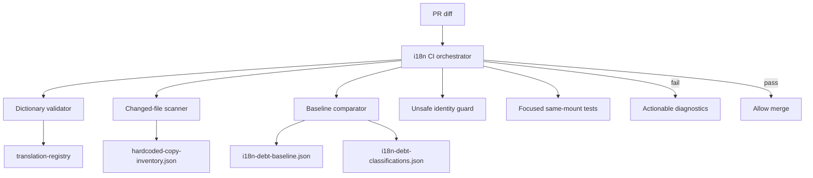

# P2.3.1 — Post-Closeout i18n Governance Baseline Audit

**Date:** 2026-08-30  
**Mode:** STRICT READ-ONLY / GOVERNANCE DESIGN  
**Authoritative closeout merge:** `381671605ea1cd55844518312839b0f7d99a48bd` (PR #1444)  
**Final smoke certification:** PR #1448  
**Status:** P2.2 Active-Mount Technical Rental i18n = COMPLETE

---

## 1. Closeout baseline verification

Verified at `381671605ea1cd55844518312839b0f7d99a48bd`:

| Metric | Value |
|--------|------:|
| EN keys | **9736** |
| DE keys | **9736** |
| Parity | **100%** |
| Orphans | **0** |
| Unused P266 keys | **0** |
| Global scanner | **1241** |
| Rental scanner | **144** |
| Finance/Billing scanner | **25** |
| Enforce-clean findings | **0** |
| Known active actionable technical Rental debt | **0** |

`npm run i18n:check` — PASS (535 tests).  
Note: campaign closeout audits referenced 9727 keys at P266 certification; merged HEAD includes final P266 dictionary keys (+9 geofence correction keys), yielding 9736 canonical keys.

---

## 2. Executive summary

P2.2 successfully closed active-mount technical Rental i18n debt. **Post-closeout regression prevention is incomplete.** The repository has strong local tooling (`i18n:check`, enforce-clean surfaces, focused localization tests) but **no mandatory CI gate** runs it on PRs. New hardcoded host copy in unlisted files can merge today.

**Recommendation:** Implement P2.3 as regression-prevention governance — not another localization sweep.

**Verdict:** **A — GOVERNANCE BASELINE COMPLETE — IMPLEMENT P2.3.2**

---

## 3. Infrastructure inventory

| Path | Purpose | Scope | Blocking/Advisory | Strength | Weakness |
|------|---------|-------|-------------------|----------|----------|
| `frontend/src/i18n/translations/*.ts` | Canonical dictionaries (EN/DE complete; partial locales) | All product locales | Advisory (local tests) | Typed `TranslationKey`; modular slice files; `...en` spread forbidden | No PR CI enforcement |
| `frontend/src/i18n/LanguageContext.tsx` | `useLanguage()`, `t()`, `translate()`, locale state | Platform-wide | Advisory | EN fallback; interpolation; dev missing-key warnings | No fetch/remount guards |
| `frontend/src/i18n/locales.ts` | Locale registry, persistence, formatting locale | Platform | Advisory | 9 official locales defined | Expansion tooling partial only |
| `frontend/src/i18n/translation-registry.ts` | Dictionary assembly, coverage metadata | All locales | Advisory | Registry-driven coverage reports | — |
| `frontend/scripts/i18n-check.mjs` | Orchestrator: scan → shim inventory → 41 vitest files → coverage | Frontend | **Local only** | Single canonical pre-PR command | **Not in GitHub Actions** |
| `frontend/scripts/i18n-hardcoded-scan.mjs` | Regex inventory scanner + enforce-clean guard | `src/{pages,components,rental,master,operator,lib}` | Local (via i18n:check) | Deterministic; category taxonomy; phase tagging | Regex-only; manual enforce-clean lists; indirect literals missed (HomeAwayBadge title) |
| `frontend/src/i18n/hardcoded-copy-inventory.json` | Generated scanner output + phase manifests | Global | Advisory | Machine-readable baseline | Not used for new-debt diff gate |
| `frontend/src/i18n/hardcoded-copy-guard.test.ts` | Asserts enforce-clean surfaces = 0 findings | Listed enforce-clean paths | Local | Hard fail on regression in certified surfaces | Duplicates path lists; new files unprotected |
| `frontend/scripts/i18n-shim-inventory.mjs` | Detects legacy `rental/i18n` compat imports | Rental | Local advisory | Prevents shim regression | — |
| `frontend/scripts/check-surface-legacy.sh` | Legacy CSS class guard | Rental/operator/master UI | Local only | Surface design consistency | Unrelated to i18n copy |
| `frontend/src/i18n/i18n-structural-check.test.ts` | Locale registry, baseline key count, `...en` ban | Structural | Local (via i18n:check) | Blocks dictionary regression | No orphan/unused key PR gate alone |
| `frontend/src/i18n/translation-registry.test.ts` | EN=DE key count, coverage summary | Dictionaries | Local | 100% EN/DE parity test | — |
| `frontend/src/i18n/locales.test.ts` | Locale metadata/persistence | Platform | Local | — | — |
| `frontend/src/i18n/LanguageContext.test.tsx` | Provider behavior | Platform | Local | — | — |
| `frontend/src/i18n/surface-integration.test.ts` | Master/operator use platform i18n | Cross-surface | Local | Structural wiring check | No copy scan |
| `frontend/src/i18n/auth-error-i18n.ts` | Backend auth message → key mapping | Auth | Runtime | Normalizes known errors | Unknown errors remain raw |
| `frontend/src/rental/components/*-localization.test.tsx` | Same-mount DE→EN→DE focused tests | Per-slice surfaces | Local | Catches presentation regressions | Manual per-slice; not all stateful surfaces |
| `architecture/I18N_*.md` | Slice architecture records | Historical | Documentation | Audit trail | Not executable governance |
| `docs/audits/i18n-p2-*.md` | Campaign audit artifacts | Historical | Documentation | Certification evidence | — |
| `.github/workflows/legal-documents-production-readiness.yml` | Domain CI (lint, typecheck, build, e2e) | Legal docs paths | **Blocking** (when triggered) | Path-filtered | **No i18n:check** |
| `.github/workflows/vehicle-detail-production-readiness.yml` | Domain CI | Vehicle detail paths | **Blocking** (when triggered) | Path-filtered | **No i18n:check** |
| `frontend/package.json` scripts | `i18n:check`, `check:surface`, `build`, `test` | Dev/CI potential | Depends on workflow | Scripts exist | No unified `i18n:gate` yet |

---

## 4. CI workflow audit

### Workflows present

Only two GitHub Actions workflows exist. Neither runs `npm run i18n:check` or `npm run check:surface`.

| Workflow | Triggers | Runs i18n:check? | Runs check:surface? | Typecheck | Build | Localization tests |
|----------|----------|------------------|---------------------|-----------|-------|-------------------|
| Legal Documents PR CI | `paths: backend/**, frontend/**` on PR | **NO** | **NO** | YES (frontend `tsc -b`) | YES | Domain-only (`test:legal-documents`) |
| Vehicle Detail PR CI | Same broad path filter | **NO** | **NO** | YES | YES | Domain-only (`test:vehicle-detail`) |

### Skip vectors

1. **Path filters:** PRs touching only `docs/**`, `architecture/**`, or narrow backend-only paths may skip both workflows entirely.
2. **No global frontend CI:** There is no workflow that always runs on every `frontend/**` PR change.
3. **Domain workflows:** Even when triggered, workflows run domain test slices — not `i18n:check` (41 localization test files).
4. **Allowed failures:** Vehicle Detail `security-scan` uses `continue-on-error: true` for npm audit (unrelated to i18n).
5. **Branch filters:** Push triggers limited to `main` and feature branch prefixes — PRs from other branches still get PR triggers when paths match.

### Conclusion

**i18n governance is 100% voluntary at CI level today.**

---

## 5. Required-check gap — can new host debt merge?

### Answer: **YES**

### Proof path

1. Developer adds `frontend/src/rental/components/NewFeaturePanel.tsx` with `title="Speichern fehlgeschlagen"` and `<div>Neuer Text</div>`.
2. File is **not** on any `P*_ENFORCE_CLEAN_*` list in `i18n-hardcoded-scan.mjs` or `hardcoded-copy-guard.test.ts`.
3. Scanner records finding as `severity: 'debt'` (inventory only) — **does not fail** `i18n:check`.
4. `hardcoded-copy-guard.test.ts` only asserts zero findings on **listed enforce-clean paths** — passes.
5. No GitHub workflow runs `i18n:check` on PR.
6. Domain workflows (legal-docs, vehicle-detail) may not trigger if paths don't match, and wouldn't catch this file anyway.
7. PR merges with new active host copy.

### Secondary gap (enforce-clean surfaces)

Even on listed surfaces, scanner regex misses:
- `let detailTitle = "German..."` then `title={detailTitle}` (HomeAwayBadge P2.2.67 lesson)
- `toast("German...")` (no toast pattern)
- Indirect prop spreading from config arrays

Enforce-clean would pass if literals are indirect enough.

---

## 6. Scanner coverage audit

| Surface pattern | Detected? | Notes |
|-----------------|-----------|-------|
| JSX text `>German<` | YES | `TEXT` category; `.tsx` only |
| `title="German"` | YES | `TITLE` category |
| `title={variable}` where variable holds literal | **PARTIAL** | Only if literal inline in JSX |
| `aria-label="German"` | YES | `ARIA` category |
| `aria-description` | YES | `ARIA` category |
| `placeholder="German"` | YES | `PLACEHOLDER` |
| `alt="German"` | **NO** | Not in `CATEGORY_PATTERNS` |
| Button/menu labels in JSX | YES | `TEXT`/`LABEL` |
| Tooltips via `title` | YES (direct) | **NO** (indirect variable) |
| `toast("German")` | **NO** | No sonner/toast patterns |
| Dialog titles/descriptions | PARTIAL | Only if match TEXT/TITLE patterns |
| Empty/loading states | PARTIAL | JSX text only |
| Error boundaries | PARTIAL | String in JSX or title |
| Template literals in JSX | PARTIAL | If result is direct JSX text |
| `const title = "German"; <X title={title} />` | **NO** | Assignment not scanned |
| `[{ label: "German" }]` rendered | **NO** | Config objects not scanned |
| Conditional `? "German" : "Other"` | **NO** | Unless inline in JSX attribute regex match |
| `` `German ${raw}` `` in variable → title | **NO** | Indirect |
| `formatLocale` hardcoding | YES | `FORMAT_LOCALE` category |

---

## 7. False-negative matrix

| Pattern | Detected? | Why | Severity | Recommended governance |
|---------|-----------|-----|----------|---------------------|
| `<div>German text</div>` | YES | TEXT regex | — | Keep |
| `title="German text"` | YES | TITLE regex | — | Keep |
| `aria-label="German text"` | YES | ARIA regex | — | Keep |
| `placeholder="German text"` | YES | PLACEHOLDER regex | — | Keep |
| `const title = "German text"; <C title={title} />` | **NO** | Scanner reads source text, not data-flow | **HIGH** | AST/taint pass on changed files; ban string literals assigned to presentation props |
| `const items = [{ label: "German text" }]` | **NO** | Config objects excluded | **HIGH** | Scan object literal `label`/`title`/`message` keys in changed files |
| `cond ? "German" : "Other"` | **NO** | Unless inline in matched attribute | **MEDIUM** | AST: string literals in presentation branches |
| `` `German ${raw}` `` in variable | **NO** | Template in assignment, not attribute | **HIGH** | Flag template literals with host-language segments |
| Error fallback strings | PARTIAL | Only if inline JSX | **MEDIUM** | Presentation adapter rule + scan `throw new Error("...")` in UI paths |
| `toast("German text")` | **NO** | No toast pattern | **HIGH** | Add toast/sonner call patterns |
| `title={detailTitle}` (variable) | **NO** | HomeAwayBadge class | **CRITICAL** | Presentation prop allowlist: `title`, `aria-label`, `aria-description`, `placeholder`, `alt` must trace to `t()` |

---

## 8. False-positive matrix

| Pattern | Must NOT translate | Current protection | Gap |
|---------|-------------------|-------------------|-----|
| Machine enums (`home`, `away`, `unknown`) | YES | `isLikelyUserCopy` heuristics; manual review | May flag short tokens |
| IDs / UUIDs | YES | Length/charset heuristics | Imperfect |
| Routes / query keys | YES | `IGNORE_LITERAL_RE` | — |
| CSS classes | YES | `IGNORE_TEXT_RE` tailwind patterns | — |
| Technical constants | PARTIAL | Heuristics | Needs classification manifest |
| Provider payloads | YES | Not in scan roots for backend | Frontend display adapters required |
| User/org names | YES | Not distinguishable from host copy | **Classification: RAW_USER_DATA** |
| Vehicle registration / VIN | YES | Same | **RAW_PROVIDER_DATA** |
| Raw backend errors | YES | `auth-error-i18n` for auth only | Other domains ad hoc |
| AI conversation content | YES | Not scanned separately | Editorial/runtime boundary |
| Brand names (Stripe, DIMO) | YES | Manual | Allowlist in manifest |

**Recommendation:** Classification manifest entries for `MACHINE_DOMAIN`, `RAW_PROVIDER`, `RAW_USER_DATA` with path+pattern fingerprints — not broad directory ignores.

---

## 9. Raw / machine ownership model

| Category | MUST localize | MUST NOT localize | MAY localize via adapter | Separate content system |
|----------|---------------|-------------------|--------------------------|------------------------|
| **HOST PRESENTATION** | All UI chrome: labels, tooltips, aria, placeholders, empty/loading/error framing | — | Status tone from machine enum | — |
| **RAW USER DATA** | — | Names, emails, addresses, custom fields | — | — |
| **RAW PROVIDER DATA** | — | Station names, license plates, VIN, Stripe labels, DIMO payloads | Formatting only (dates/money) | — |
| **MACHINE / DOMAIN** | — | Enum values in API/DB; chip `state` ids | Display label via `labelX(locale, machine)` | — |
| **EDITORIAL CONTENT** | — (in app dictionaries) | — | — | Help Center articles, legal docs, long-form help |

**Rule:** Interpolation puts raw values inside localized templates (`t('key', { stationName })`), never the reverse.

---

## 10. New-file governance — strategy recommendation

| Strategy | Assessment |
|----------|------------|
| A. Scan all changed frontend production files | **Recommended core** |
| B. Scan all Rental production files | Too slow for PR; keep for deep gate |
| C. Scan active mount graph | High build cost; defer |
| D. Hybrid changed-file + active-surface | **Recommended overall** |
| E. Manual enforce-clean list growth | **Current state — does not scale** |

### **Recommend: D — Hybrid changed-file + active-surface scanner**

- **PR gate:** Scan only added/modified `.tsx/.ts` under `src/{rental,operator,master,components,pages}`.
- **Deep gate (main/nightly):** Full inventory + classification drift.
- **Auto-enroll:** New files in active surfaces are enforce-clean by default (inverted model).

---

## 11. Changed-file gate design

```
PR diff → filter frontend production paths
        → run enhanced scanner on changed files only
        → subtract classified baseline fingerprints
        → if NEW unclassified host-copy finding → FAIL
```

**Properties:**
- Legacy 1241 total findings remain allowed.
- New actionable debt in changed files blocked.
- Renames treated as add+delete (new file scanned).
- Fail output: path, line, literal, category, classification, fix hint.

---

## 12. Baseline-debt model

**Recommend:** Committed manifest `frontend/src/i18n/i18n-debt-baseline.json`

```json
{
  "version": 1,
  "fingerprints": [
    { "file": "rental/components/DataAnalyseView.tsx", "line": 42, "category": "TEXT", "hash": "…", "classification": "DATA_ANALYSE_PLANNED_REMOVAL" }
  ]
}
```

**Fingerprint:** `sha256(normalize(file) + line + category + normalize(sample))`

**Invariant:** `NEW_ACTIVE_ACTIONABLE_DEBT = 0` without requiring `TOTAL_FINDINGS = 0`.

Drift-resistant: line shifts update fingerprint via `hash` of sample text primarily; optional fuzzy line±3 matching.

---

## 13. Classification manifest

**Recommend:** JSON manifest co-located with baseline (`i18n-debt-classifications.json`), validated by tests.

| Classification | Use |
|----------------|-----|
| `DATA_ANALYSE_PLANNED_REMOVAL` | Frozen removal bucket |
| `IAM_PRODUCT_WIRING_REQUIRED` | Dead CRUD awaiting product |
| `EDITORIAL_CONTENT` | Help Center body copy |
| `LEGACY_DEAD` | Unmounted dead code |
| `RAW_PROVIDER` | Provider echo fields |
| `MACHINE_DOMAIN` | Enum/status machines |
| `OTHER_JUSTIFIED` | Requires owner + expiry |

**Not in:** broad `.scannerignore` or directory-wide suppressions.

---

## 14. Expiry / ownership metadata

```json
{
  "fingerprint": "…",
  "classification": "DATA_ANALYSE_PLANNED_REMOVAL",
  "owner": "platform-frontend",
  "reason": "Module scheduled for removal Q4 2026",
  "introducedAt": "2026-08-19",
  "reviewAt": "2026-12-01",
  "issue": "SYNQ-1234",
  "surfaceStatus": "mounted"
}
```

**CI rule:** Classifications past `reviewAt` without renewal → warn (deep gate) → later block.

---

## 15. Dictionary parity governance

| Invariant | Currently enforced | Can block PR? |
|-----------|-------------------|---------------|
| EN keys = DE keys | YES (`translation-registry.test.ts`) | YES (once in CI) |
| No missing keys | YES (structural tests) | YES |
| No orphan keys | PARTIAL (manual campaign accounting) | YES with unused-key census |
| No duplicate semantic keys | NO | Advisory only |
| No unused new keys | NO | Deep gate |

---

## 16. New key governance

| Rule | Automation | Review |
|------|------------|--------|
| Reuse existing keys first | Partial (grep policy) | PR review |
| Semantic namespaces (`fleet.geofence.*`) | Lint key prefix conventions | Review |
| No machine/raw in keys | Convention | Review |
| No duplicate concepts | Advisory duplicate detector | Review |
| Interpolation ownership | Test templates | Block malformed `{var}` |
| Pluralization | `Intl.PluralRules` adapters | Review |
| Status presentation adapters | `labelX(locale, machine)` pattern | Enforced by architecture |

---

## 17. Locale remount governance

**Risk patterns:**
- `key={locale}` on business containers
- `key={t('...')}` 
- Remounting forms/lists on locale switch destroying state

**Recommend:** ESLint/static script `i18n-unsafe-identity.mjs` flagging:
- `key={locale}` on components under `rental/`, `operator/`
- `key={.*\bt\(}` 
- `key={.*locale}`

**Current state:** No automated guard. Campaign relied on focused same-mount tests.

---

## 18. Fetch dependency governance

**Risk:** `useEffect(..., [locale, t])` causing business refetch on language switch.

**Detectable statically (partial):**
- `useEffect` dependency arrays containing `locale` or `t` in data hooks
- React Query `queryKey` containing `locale` for non-content queries

**Recommend:** Lint rule for `use*Query`/`useEffect` in `hooks/` paths; allowlist content endpoints.

---

## 19. Same-mount policy

**Mandatory DE→EN→DE tests when:**
- Forms with field state
- Modals/sheets with open state
- Selected entity context
- Filters/pagination
- AI conversation threads
- Organization switching
- Business-data views with raw preservation assertions
- Edit workflows

**Not required:** Static labels, pure presentation components without state.

---

## 20. Zero-refetch policy

**Default:** Locale switch → `business fetch delta = 0`.

**Legitimate refetch exceptions (explicit model):**
- Legal document content (`legal-documents` registry)
- Help Center editorial content (future CMS)
- Locale-specific server-rendered templates (if introduced)

**Test pattern:** Mock fetch counter; switch locale; assert count unchanged (existing P266 tests).

---

## 21. Error / fallback governance

| Layer | Rule |
|-------|------|
| Host framing | Localize (`shell.errorBoundary.*`, `common.retry`) |
| Known backend codes | Map to keys (`auth-error-i18n.ts` pattern) |
| Unknown backend message | Show raw OR generic localized wrapper — never invent translation |

**Architecture support:** Good for auth; inconsistent elsewhere. Extend adapter registry per domain.

---

## 22. Accessibility governance

**First-class scan targets (must block on changed files):**
- `aria-label`
- `aria-description`
- `title` (tooltips)
- `placeholder`
- `alt`
- `sr-only` text nodes

**HomeAwayBadge lesson:** Indirect `title={variable}` must trace to `t()`. Add presentation-prop data-flow check in P2.3.2.

---

## 23. Editorial content boundary

| Layer | System |
|-------|--------|
| Application UI | `src/i18n/translations/*` + `t()` |
| Help Center articles | `rental.helpCenter.{en,de}.ts` (shell) + **static article prose (editorial)** |
| Legal documents | Separate `legal-documents` registry |

**Future recommendation:** Help long-form → locale MD/MDX modules or CMS API. Do not mix into app dictionary keys. Classification: `EDITORIAL_CONTENT`.

**Current:** 17 sections / 44 articles — separately governed editorial workstream.

---

## 24. Language expansion readiness

Registry already supports 9 locales (DE, EN, PL, FR, CS, NL, ES, TR, IT).

| Capability | Scales? |
|------------|---------|
| Parity tooling (EN as schema) | YES |
| Coverage reports per locale | YES |
| `...en` spread ban | YES |
| Partial locale fallback | YES |
| Blocking parity for N locales | Needs generalization from EN=DE only |
| Scanner (German-centric heuristics) | Needs multi-locale host detection |

**No redesign required** for P3 translation work; governance should key off canonical key schema, not DE/EN only long-term.

---

## 25. Source-of-truth language

**Recommend:** **Locale-independent key schema canonical; English dictionary as authoring reference.**

- `TranslationKey` type derived from `en.ts`
- DE must match key set exactly (product requirement today)
- Future locales add keys to schema first, then translate

---

## 26. PR governance tiers

### BLOCKING
- Dictionary structural parity (EN=DE key sets)
- Changed-file new unclassified host-copy debt
- Invalid `TranslationKey` usage (typecheck)
- Unsafe locale identity patterns (`key={locale}`)
- New keys in PR without dictionary pair

### CONDITIONAL BLOCKING
- Same-mount tests (when PR touches stateful surface patterns)
- Zero-refetch tests (when PR touches data hooks)

### ADVISORY
- Semantic duplicate key candidates
- Editorial content coverage %
- Full scanner total drift

---

## 27–29. Performance — Fast PR gate vs Deep main gate

### Fast PR gate (~2–4 min target)

```
npm run i18n:gate
  ├── dictionary parity tests (vitest subset)
  ├── changed-file enhanced scanner + new-debt diff
  ├── unsafe identity scan (changed files)
  └── targeted localization tests (changed-slice mapping)
```

### Deep main gate (~10–15 min, post-merge / nightly design)

```
npm run i18n:gate:deep
  ├── full hardcoded scan + inventory refresh
  ├── classification manifest drift check
  ├── unused/orphan key census
  ├── full i18n:check (41 test files)
  └── editorial boundary validation
```

**Do not run full 1241-finding enforcement on every PR.**

---

## 30. Developer experience

**Canonical command (proposed):**

```bash
cd frontend && npm run i18n:gate
```

**Composition:**
1. `node scripts/i18n-changed-file-scan.mjs` (new, P2.3.3)
2. `node scripts/i18n-unsafe-identity.mjs` (new, P2.3.4)
3. `npx vitest run src/i18n/i18n-structural-check.test.ts src/i18n/translation-registry.test.ts`
4. Changed-slice localization tests (mapped from diff)

---

## 31. Failure messages

Required format:

```
❌ i18n gate failed: NEW_HOST_COPY_DEBT

  file: frontend/src/rental/components/NewPanel.tsx
  line: 87
  category: TITLE
  literal: "Speichern fehlgeschlagen"
  classification: (none — unclassified)
  reason: Indirect title prop assigned from host-language string literal
  fix: Add translation key under `rental.newPanel.*` and use t('rental.newPanel.saveFailed')
```

---

## 32. Agent workflow (contributor guidance)

1. **Classify** each string: HOST / RAW / MACHINE / EDITORIAL
2. **Search reuse** in `en.ts` / existing namespaces
3. **Add keys** to EN+DE slice files simultaneously
4. **Implement** presentation mapping (`t()`, `labelX(locale, machine)`)
5. **Test** same-mount if stateful; assert raw preservation
6. **Run** `npm run i18n:gate`
7. **Report** key accounting in PR description

---

## 33. Branch protection recommendation

**New required check (after P2.3.5 CI integration):**

| Check context name | Workflow job |
|--------------------|--------------|
| `i18n / gate` | Fast PR gate |

**Optional required (if cost acceptable):**
| `i18n / dictionary parity` | Subset of gate |

**Do not require** full domain E2E or total scanner=0.

Existing `Legal Documents — Production Readiness CI / CI gate` and `Vehicle Detail — Production Readiness CI / CI gate` remain domain-specific.

---

## 34. Legacy residual management

- **1241** global findings remain in inventory as classified debt.
- Baseline manifest pins each with classification.
- PR gate: `new_findings - baseline_classified = 0 actionable`.
- Dashboard: report counts by classification (not hidden).
- No `.scannerignore` expansion.

---

## 35. Synthetic governance fixture (future P2.3.5)

Test fixture directory `frontend/src/i18n/__fixtures__/governance-adversarial/`:

| File | Should |
|------|--------|
| `BadDirectJsx.tsx` | FAIL — `<div>Hardcoded</div>` |
| `BadTitleTooltip.tsx` | FAIL — `const t = "Tooltip"; title={t}` |
| `BadAria.tsx` | FAIL — `aria-label="Speichern"` |
| `BadPlaceholder.tsx` | FAIL |
| `BadTemplate.tsx` | FAIL — `` `${"Start"} ${id}` `` |
| `GoodMachineEnum.tsx` | PASS — `state === 'home'` |
| `GoodRawProvider.tsx` | PASS — `{station.name}` |
| `GoodRoute.tsx` | PASS — `'/rental/fleet'` |

Gate tests run scanner against fixtures expecting pass/fail.

---

## 36. Security / privacy

- Scanner operates on **source literals only**.
- CI logs: file, line, category, truncated sample (max 120 chars).
- No runtime customer/provider payload logging.
- Inventory JSON contains code samples only.

---

## 37. Governance architecture



---

## 38. Implementation sequence

| Phase | Scope |
|-------|-------|
| **P2.3.2** | Scanner coverage: AST/indirect prop tracing, toast/alt patterns; classification model + baseline manifest format |
| **P2.3.3** | Changed-file new-debt PR comparator; invert enforce-clean (new files default protected) |
| **P2.3.4** | Unsafe locale identity + fetch-dependency static guards |
| **P2.3.5** | GitHub Actions `i18n-gate.yml`; synthetic adversarial fixtures |
| **P2.3.6** | Final governance certification audit |

---

## 39. Anti-overengineering

**Do NOT build now:**
- Custom TypeScript compiler plugin
- Runtime DOM instrumentation
- Full React mount-graph infrastructure
- External TMS (Phrase, Lokalise) integration
- Per-PR full 1241-finding zero enforcement
- Machine translation pipeline

**Sufficient:** Enhanced regex + lightweight AST on changed files, committed baseline manifest, CI wiring.

---

## 40. P2.3 acceptance criteria

Future governance must guarantee:

- [ ] New active host-copy debt blocks PR
- [ ] title/aria/placeholder/alt included
- [ ] Dictionary parity blocks PR
- [ ] New unclassified scanner debt blocks PR
- [ ] Raw/machine content not forced into dictionaries
- [ ] Unsafe locale remount patterns block PR
- [ ] Stateful locale regressions have conditional tests
- [ ] Residual debt visible/classified
- [ ] Help editorial content separately governed

---

## 41. Closeout invariant (reconfirmed)

**KNOWN ACTIVE ACTIONABLE TECHNICAL RENTAL I18N DEBT: 0**

P2.2 remains closed. P2.3 addresses **regression prevention only**.

---

## Final verdict

**A — GOVERNANCE BASELINE COMPLETE — IMPLEMENT P2.3.2**

**P2.2 remains technically closed.**

**No additional localization sweep is required.**

**P2.3 is regression-prevention governance, not debt cleanup.**

**Proceed to P2.3.2 only after review of this audit.**

**DO NOT MERGE THE AUDIT PR.**
