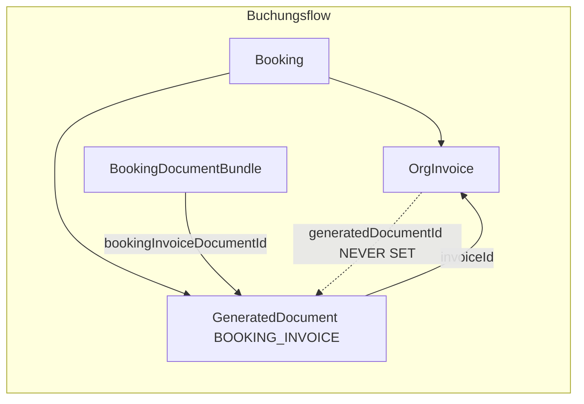

# Ist-Analyse: Rechnungsfunktion SynqDrive (OrgInvoice)

**Stand:** 2026-07-15  
**Repository:** `SYNQDRIVE-alpha`  
**Scope:** Operative Mandanten-Rechnungen (`OrgInvoice`, Buchungsdokumente, Zahlungen, Tasks, E-Mail) — **nicht** SynqDrive-SaaS-Abrechnung (`BillingInvoice` / Stripe Subscription).  
**Modus:** Read-only Audit — keine Implementierung, keine Migration.

---

## Executive Summary

SynqDrive hat **zwei getrennte Rechnungsdomänen**:

| Domäne | Modelle | Modul | UI |
|--------|---------|-------|-----|
| **Operative Mandanten-Rechnungen** | `OrgInvoice`, `OrgInvoicePayment`, `GeneratedDocument`, `BookingDocumentBundle` | `backend/src/modules/invoices/`, `documents/`, `payments/` | `frontend/src/rental/components/InvoicesView.tsx` |
| **SynqDrive SaaS-Abrechnung** | `BillingInvoice`, `BillingInvoiceLine`, … | `backend/src/modules/billing/` | `frontend/src/rental/components/billing/*`, `frontend/src/master/components/billing/*` |

Diese Analyse fokussiert die **operative Rechnungsfunktion**. Die SaaS-Billing-Schicht ist nur als Abgrenzung dokumentiert.

**Kernbefund:** PDF-Generierung, Rechnungsdatensatz und UI-Verknüpfung laufen über **drei parallele Wahrheiten** (`OrgInvoice.generatedDocumentId`, `GeneratedDocument.invoiceId`, `BookingDocumentBundle.bookingInvoiceDocumentId`). Feld `OrgInvoice.generatedDocumentId` wird im gesamten Backend **nirgends geschrieben** — daher sind die im UI gemeldten Dokumentprobleme codebelegt.

---

## 1. Prisma-Modelle und Relationen

### 1.1 Kern: `OrgInvoice`

**Datei:** `backend/prisma/schema.prisma` (ca. Zeile 4312–4371)

| Feld | Typ | Rolle |
|------|-----|-------|
| `id` | UUID | Primärschlüssel |
| `organizationId` | FK → `Organization` | Mandantentrennung |
| `type` | `OrgInvoiceType` | `OUTGOING_BOOKING`, `OUTGOING_MANUAL`, `OUTGOING_FINAL`, `INCOMING_VENDOR`, `INCOMING_UPLOADED` |
| `status` | `OrgInvoiceStatus` | Outgoing: `DRAFT`→`ISSUED`→`SENT`→`PARTIALLY_PAID`→`PAID`→`OVERDUE`…; Incoming: `NEEDS_REVIEW`, `APPROVED`, … |
| `customerId`, `vendorId`, `bookingId`, `vehicleId` | optionale Skalar-FKs | Keine Prisma-`@relation` zu Customer/Booking/Vehicle (nur Index) |
| `lineItems` | JSON | Positionen |
| `subtotalCents`, `taxCents`, `totalCents`, `paidCents`, `outstandingCents` | Int | Summen |
| `invoiceNumber`, `legacyInvoiceNumber`, `invoiceNumberDisplay`, `sequenceYear`, `sequenceNumber` | Nummerierung | Neue Nummern via `OrgInvoiceSequence` |
| `generatedDocumentId` | String? | **Geplantes UI-Feld — wird nie befüllt (siehe §8)** |
| `documentExtractionId` | String? | Eingangsrechnung aus AI Upload |
| `issuedAt`, `sentAt`, `paidAt`, `voidedAt`, … | Timestamps | Lifecycle |

**Relationen (Prisma):**
- `tasks` → `OrgTask[]` (über `OrgTask.invoiceId`)
- `payments` → `OrgInvoicePayment[]`
- `bookingPaymentRequests` → `BookingPaymentRequest[]`
- `vendor` → `Vendor?`
- `organization` → `Organization`

**Unique:** `(organizationId, sequenceYear, sequenceNumber)`

### 1.2 Zahlungen: `OrgInvoicePayment`

**Datei:** `backend/prisma/schema.prisma` (ca. Zeile 4286–4300)

| Feld | Bedeutung |
|------|-----------|
| `method` | `InvoicePaymentMethod`: `CASH`, `BANK_TRANSFER`, `CARD`, `STRIPE`, `OTHER` |
| `bookingPaymentRequestId` | Unique — Verknüpfung Stripe Connect |
| `stripePaymentIntentId`, `stripeChargeId` | Provider-Referenzen |

### 1.3 Nummernkreis: `OrgInvoiceSequence`

Pro Organisation und Jahr atomare Vergabe via `InvoiceNumberService.allocate()`.

### 1.4 Dokument-Lifecycle

| Modell | Datei (schema) | Zweck |
|--------|------------------|-------|
| `GeneratedDocument` | ~4384 | PDF-Metadaten; `documentType` u. a. `BOOKING_INVOICE`, `FINAL_INVOICE`; `invoiceId` optional |
| `BookingDocumentBundle` | ~4457 | 1:1 pro `bookingId`; Pointer `bookingInvoiceDocumentId`, … |
| `OrganizationLegalDocument` | ~4432 | AGB/Widerruf (STATIC_LEGAL) |
| `RentalContract` | ~4507 | `generatedDocumentId` für Mietvertrag |
| `BookingDeposit` | ~4482 | `receiptDocumentId` |

**Wichtig:** `GeneratedDocument` hat `invoiceId`, aber `OrgInvoice` hat **keine** inverse Prisma-Relation zu `GeneratedDocument`.

### 1.5 E-Mail: `OutboundEmail`

**Datei:** `backend/prisma/schema.prisma` (~6449–6524)

| Feld | Relevanz |
|------|----------|
| `bookingId`, `customerId`, `invoiceId` | Verknüpfungen (`invoiceId` optional, bei Buchungsdokument-Versand oft **null**) |
| `sourceType` | `OutboundEmailSourceType` — u. a. `BOOKING_DOCUMENTS`, `INVOICE_SINGLE` (Enum existiert, **kein Producer im Code**) |
| `OutboundEmailAttachment.generatedDocumentId` | PDF-Anhang |

### 1.6 Zahlungs-Connect: `BookingPaymentRequest`

**Datei:** `backend/prisma/schema.prisma` (~4127)

- `invoiceId` → kanonische `OrgInvoice` für Checkout
- `purpose`: u. a. `BOOKING_INVOICE` (Enum `BookingPaymentPurpose`)
- `PaymentTransaction` Ledger getrennt

### 1.7 Tasks: `OrgTask`

- `invoiceId` FK → `OrgInvoice`
- `type`: `INVOICE_REQUIRED` u. a.
- `sourceType`: `TaskSource` (SYSTEM/MANUAL/…)
- `dedupKey`: z. B. `invoice:unpaid:{invoiceId}`

### 1.8 Enums (Auszug)

```prisma
enum OrgInvoiceType { OUTGOING_BOOKING OUTGOING_MANUAL OUTGOING_FINAL INCOMING_VENDOR INCOMING_UPLOADED }
enum OrgInvoiceStatus { DRAFT ISSUED SENT PARTIALLY_PAID PAID OVERDUE CANCELLED CREDITED VOID UPLOADED NEEDS_REVIEW APPROVED BOOKED REJECTED }
enum InvoicePaymentMethod { CASH BANK_TRANSFER CARD STRIPE OTHER }
enum OutboundEmailSourceType { BOOKING_DOCUMENTS INVOICE_SINGLE NOTIFICATION TEST BOOKING_PAYMENT_REQUEST PAYMENT_CONFIRMATION ... }
```

### 1.9 Abgrenzung: SaaS `BillingInvoice`

Separate Tabellen `billing_invoices`, `billing_invoice_lines`, … — Stripe-Mirror für SynqDrive-Plattformgebühren. Keine Verknüpfung zu `OrgInvoice`.

---

## 2. Backend-Controller und Endpunkte

### 2.1 OrgInvoice REST API

**Controller:** `backend/src/modules/invoices/invoices.controller.ts`  
**Guards:** `OrgScopingGuard`, `RolesGuard` auf allen Routen  
**Basis:** leerer `@Controller()` — Pfade absolut unter `/api/v1/organizations/:orgId/...`

| Methode | Pfad | Service-Methode |
|---------|------|-----------------|
| GET | `/organizations/:orgId/invoices` | `findByOrg` — Query: `type`, `status`, `direction` |
| GET | `/organizations/:orgId/invoices/stats` | `getStats` |
| GET | `/organizations/:orgId/invoices/:id` | `findById` |
| GET | `/organizations/:orgId/customers/:customerId/invoices` | `findByCustomer` |
| POST | `/organizations/:orgId/invoices` | `create` |
| PATCH | `/organizations/:orgId/invoices/:id` | `update` |
| POST | `/organizations/:orgId/invoices/:id/issue` | `issue` |
| POST | `/organizations/:orgId/invoices/:id/mark-sent` | `markSent` |
| POST | `/organizations/:orgId/invoices/:id/payments` | `recordPayment` |
| PATCH | `/organizations/:orgId/invoices/:id/pay` | `markPaid` |
| POST | `/organizations/:orgId/invoices/upload` | Legacy-Anhang (kein AI-Extraction-Pfad) |

**DTOs:** `backend/src/modules/invoices/dto/index.ts`

### 2.2 Dokumente (PDF)

**Controller:** `backend/src/modules/documents/documents.controller.ts`

| Methode | Pfad | Rolle |
|---------|------|-------|
| GET | `.../bookings/:bookingId/documents` | Bundle-View |
| POST | `.../bookings/:bookingId/documents/generate-initial-bundle` | `ORG_ADMIN`, `MASTER_ADMIN` |
| POST | `.../bookings/:bookingId/documents/regenerate/:documentType` | Regenerierung (neue Version, alte void) |
| GET | `.../documents/:documentId/metadata` | Metadaten |
| GET | `.../documents/:documentId/download` | PDF-Stream |
| POST | `.../documents/:documentId/void` | Void |

### 2.3 E-Mail Versand

**Controller:** `backend/src/modules/outbound-email/booking-documents-email.controller.ts`

| Methode | Pfad | Rolle |
|---------|------|-------|
| POST | `.../bookings/:bookingId/documents/send-email` | `ORG_ADMIN`, `MASTER_ADMIN` — `BookingDocumentEmailService.sendBookingDocuments` |

**Hinweis:** Kein dedizierter Endpunkt `POST .../invoices/:id/send-email`. Rechnungsversand aus der Rechnungs-UI nutzt indirekt den Buchungsdokument-Endpunkt (Frontend `SendDocumentsEmailModal`).

### 2.4 Vendor-Rechnungen

**Controller:** `backend/src/modules/vendors/vendors.controller.ts`  
`GET /organizations/:orgId/vendors/:id/invoices` → `vendors.service.ts` `findInvoices`

### 2.5 Document Extraction (Eingangsrechnungen)

**Modul:** `backend/src/modules/document-extraction/`  
Apply-Pfad: `document-extraction-apply.service.ts` erstellt `OrgInvoice` mit `type: INCOMING_UPLOADED`, `fromExtraction: true`.

### 2.6 Payments (Connect)

Relevant für Rechnungszahlung, nicht für Rechnungserstellung:
- `booking-payment-request.service.ts` — `resolvePayableInvoice`
- `payment-reconciliation.service.ts` — `recordStripeInvoicePaymentInTx`
- Webhook: `stripe-connect-webhook.*`

---

## 3. Backend-Services

### 3.1 `InvoicesService`

**Datei:** `backend/src/modules/invoices/invoices.service.ts`

| Methode | Verhalten |
|---------|-----------|
| `format()` | API-Response; inkl. `generatedDocumentId` (read-only aus DB) |
| `create()` | Summen via `computeInvoiceTotals`; `assertRelations`; outgoing DRAFT erzeugt **keine** Unpaid-Task |
| `issue()` | `InvoiceNumberService.allocate`; Status `ISSUED`; `createUnpaidTask` |
| `markSent()` | Status `SENT`, `sentAt`; erfordert `sequenceNumber` |
| `recordPayment()` / `markPaid()` | `OrgInvoicePayment` + `derivePaymentStatus`; bei vollständig: `closeLinkedTasks` |
| `createBookingInvoice()` | Dedup per `(orgId, bookingId, OUTGOING_BOOKING)`; Line Items aus `BookingPriceSnapshot`; Titel `Buchungsrechnung #${booking.id.slice(0,8)}` |
| `getStats()` | Revenue/Expense; `overdue` zählt `dueDate < now` bei offenem Saldo — **setzt Status nicht auf OVERDUE** |
| `createUnpaidTask()` | `tasksService.upsertByDedup` mit `invoice:unpaid:{id}` |
| `closeLinkedTasks()` | **Direktes** `prisma.orgTask.update` → DONE (umgeht `TasksService`-Transitions) |

**Domain-Utils:** `invoice-domain.util.ts`, `invoice-line-items.util.ts`, `invoice-number.service.ts`

### 3.2 `BookingInvoiceLifecycleService`

**Datei:** `backend/src/modules/invoices/booking-invoice-lifecycle.service.ts`

| Methode | Verhalten |
|---------|-----------|
| `syncOnBookingConfirmed()` | Kanonische Rechnung → void Duplikate → `issue` wenn DRAFT → optional `markPaid` nur bei `markPaid: true` |
| `resolveCanonicalBookingInvoice()` | Priorität: `GeneratedDocument.invoiceId` → bezahlte → neueste |
| `voidDuplicateBookingInvoices()` | Setzt Duplikate auf `VOID` |
| `repairBookingInvoicesForOrg()` | Ops-Skript-Backend |

**Aufrufer:** `booking-wizard-draft.service.ts` (`confirmDraft`), Ops `repair-duplicate-booking-invoices.ts`

### 3.3 `BookingDocumentBundleService`

**Datei:** `backend/src/modules/documents/booking-document-bundle.service.ts`

| Methode | Verhalten |
|---------|-----------|
| `generateInitialBundle()` | Advisory Lock; `ensureBookingInvoice`, Deposit, Contract, Legal |
| `ensureBookingInvoice()` | Findet/erstellt `OrgInvoice`; rendert PDF; `links: { invoiceId }` auf `GeneratedDocument`; **aktualisiert nicht `OrgInvoice.generatedDocumentId`** |
| `regenerate()` | Void alter Doc + neuer `GeneratedDocument` |
| `syncMissingDocumentTasks()` | `INVOICE_REQUIRED` / `DOCUMENT_REVIEW` Tasks |

**Document numbering:** separater `DocumentNumberingService` (nicht identisch mit `OrgInvoice`-Nummer).

### 3.4 `GeneratedDocumentsService`

**Datei:** `backend/src/modules/documents/generated-documents.service.ts`  
Speichert PDF, `toDto()`, `getDownload()`, `voidDocument()`, `listForBooking()`.

### 3.5 `BookingDocumentEmailService`

**Datei:** `backend/src/modules/outbound-email/booking-document-email.service.ts`

| Methode | Verhalten |
|---------|-----------|
| `sendBookingDocuments()` | Validiert Docs ∈ booking; `OutboundEmail` mit `sourceType: BOOKING_DOCUMENTS`; ActivityLog |
| `maybeAutoSendBookingDocuments()` | Nach Confirm wenn `autoSendBookingDocumentsOnConfirm` |

**Absender:** `OutboundEmailPolicyService.resolveIdentity()` — Custom Domain oder Platform-Default; Reply-To-Kette: `replyToEmail` → `invoiceEmail` → `org.email` → …

### 3.6 `FakePaidCardAuditService`

Read-only Audit für CARD/STRIPE-Zahlungen ohne Stripe-Beleg (`backend/src/modules/invoices/fake-paid-card-audit.service.ts`).

### 3.7 Weitere Integrationen

| Service | Rechnungsbezug |
|---------|----------------|
| `bookings.service.ts` | `create` → `createBookingInvoice` + `generateInitialBundle` (fire-and-forget) |
| `booking-wizard-draft.service.ts` | `refreshDraftBundle`, `confirmDraft` → lifecycle + bundle |
| `booking-payment-request.service.ts` | `resolvePayableInvoice` |
| `payment-reconciliation.service.ts` | Stripe → `OrgInvoicePayment` method `STRIPE` |
| `document-extraction-apply.service.ts` | `INCOMING_UPLOADED` |
| `financial-insights.logic.ts` / `business-insights` | Aggregation über `OrgInvoice` |
| `customers.service.ts` / `customer-eligibility.service.ts` | Offene Rechnungen `SENT`/`OVERDUE` |

---

## 4. Jobs, Queues und Event-Handler

| Komponente | Datei | Rechnungsbezug |
|------------|-------|----------------|
| Document Extraction Queue | `document-extraction.processor.ts` | Eingangsrechnungen nach Upload |
| Document Extraction Recovery | `workers/schedulers/document-extraction-recovery.scheduler.ts` | Wiederaufnahme hängender Jobs |
| Stripe Connect Webhook | `payment-reconciliation.service.ts` | Zahlung → Invoice |
| Booking create/update | `bookings.service.ts` | Async Bundle + Auto-Email |
| Notification Registry | `notification-event-registry.definitions.ts` | `INVOICE_OVERDUE`, `payment-failed` definiert — **kein dedizierter Producer für `INVOICE_OVERDUE` im Backend gefunden** |
| Ops Scripts | `backend/scripts/ops/audit-duplicate-booking-invoices.ts`, `repair-duplicate-booking-invoices.ts`, `cleanup-invalid-invoices.ts`, `audit-fake-paid-card-invoices.ts` | Datenhygiene |

**Kein Cron/Worker** setzt `OrgInvoice.status = OVERDUE` — Enum-Wert existiert, automatische Transition fehlt.

---

## 5. Frontend-API-Clients

**Datei:** `frontend/src/lib/api.ts`

```typescript
api.invoices.list(orgId, params?)
api.invoices.stats(orgId)
api.invoices.get(orgId, id)
api.invoices.create(orgId, body)
api.invoices.update(orgId, id, body)
api.invoices.issue(orgId, id)
api.invoices.markSent(orgId, id)
api.invoices.recordPayment(orgId, id, body)
api.invoices.markPaid(orgId, id)
api.invoices.listByCustomer(orgId, customerId)
api.invoices.upload(orgId, file)  // Legacy attachment

api.documents.getBookingDocuments(orgId, bookingId)
api.documents.metadata(orgId, documentId)
api.documents.download(orgId, documentId)  // implizit via URL
api.documents.sendEmail(orgId, bookingId, body)  // Buchungsdokumente
```

**Typen:** `frontend/src/rental/components/invoices/invoiceTypes.ts`  
**Klassifikation (Mirror Backend):** `invoiceClassification.ts`, `invoiceUtils.ts`

**Billing (SaaS, getrennt):** `api.billing.orgInvoices`, `api.billing.adminInvoices`

---

## 6. React-Komponenten

| Komponente | Pfad | Rolle |
|------------|------|-------|
| `InvoicesView` | `frontend/src/rental/components/InvoicesView.tsx` | Liste, KPIs, Create-Modal, **InvoiceDetail** |
| `InvoiceExtractionUpload` | `frontend/src/rental/components/invoices/InvoiceExtractionUpload.tsx` | Eingangsrechnung AI Upload |
| `BookingDocumentsSection` | `frontend/src/rental/components/BookingDocumentsSection.tsx` | Dokumente pro Buchung |
| `CheckoutDocumentsPanel` | `frontend/src/rental/components/new-booking/CheckoutDocumentsPanel.tsx` | Booking Wizard |
| `NewBookingView` | `frontend/src/rental/components/NewBookingView.tsx` | Wizard-Orchestrierung |
| `BookingSuccessState` | `frontend/src/rental/components/new-booking/BookingSuccessState.tsx` | Post-Confirm |
| `BookingFinanceDocumentsTab` | `frontend/src/rental/components/booking-detail/BookingFinanceDocumentsTab.tsx` | Buchung ↔ Finanzen |
| `BookingPaymentCard` | `frontend/src/rental/components/booking-payment/BookingPaymentCard.tsx` | Zahlungslink |
| `SendDocumentsEmailModal` | `frontend/src/components/email/SendDocumentsEmailModal.tsx` | E-Mail-Dialog |
| `SupportContextButton` | `frontend/src/components/support/SupportContextButton.tsx` | Support-Kontext „invoice“ |
| `CustomerFinancesTab` | `frontend/src/rental/components/customer-detail/CustomerFinancesTab.tsx` | Kunden-Rechnungen |
| `FinancialInsightsView` | `frontend/src/rental/components/FinancialInsightsView.tsx` | Auswertungen |

**Billing UI (SaaS):** `BillingInvoiceSection.tsx`, `BillingInvoicesTab.tsx` — andere Datenquelle.

---

## 7. Aktuelle Datenflüsse

### 7.1 Manuelle Ausgangsrechnung

```
InvoicesView (Create Modal)
  → POST /invoices (type: OUTGOING_MANUAL)
  → InvoicesService.create (DRAFT)
  → User: issue → allocate Nummer → ISSUED + Unpaid-Task
  → Optional: markSent / recordPayment / markPaid
```

Kein PDF-Generator angebunden; UI-Button „PDF generieren“ ist `disabled`.

### 7.2 Automatische Buchungsrechnung

```
Booking create (bookings.service.ts)
  → createBookingInvoice (DRAFT, OUTGOING_BOOKING) [.catch null]
  → generateInitialBundle (async)
       → ensureBookingInvoice
            → GeneratedDocument (BOOKING_INVOICE, invoiceId gesetzt)
            → BookingDocumentBundle.bookingInvoiceDocumentId gesetzt
            → OrgInvoice.generatedDocumentId NICHT gesetzt

Booking confirm (Wizard: booking-wizard-draft.confirmDraft)
  → bookingsService.update(CONFIRMED)
  → syncOnBookingConfirmed → issue (wenn DRAFT)
  → getBundleView + maybeAutoSendBookingDocuments
```

### 7.3 Zahlung per Stripe Connect

```
Payment Link Flow (booking-payment-request.service)
  → resolvePayableInvoice (canonical OUTGOING_BOOKING)
  → BookingPaymentRequest.invoiceId
  → Stripe Checkout
  → Webhook payment_reconciliation
  → OrgInvoicePayment (STRIPE) + Status PAID/PARTIALLY_PAID
  → closeLinkedTasks
```

### 7.4 Eingangsrechnung (Upload)

```
InvoiceExtractionUpload
  → vehicleIntelligence.uploadDocumentExtraction (INVOICE)
  → Poll extraction status
  → document-extraction-apply → OrgInvoice INCOMING_UPLOADED, NEEDS_REVIEW
```

### 7.5 E-Mail-Versand aus Rechnungsdetail

```
InvoicesView InvoiceDetail.openInvoiceEmail
  → requires invoice.bookingId AND invoice.generatedDocumentId
  → api.documents.metadata(generatedDocumentId)
  → SendDocumentsEmailModal → api.documents.sendEmail(bookingId, …)
```

### 7.6 ID-Ketten (Soll-Ist)



---

## 8. Doppelte / konkurrierende Wahrheiten

| Thema | Wahrheit A | Wahrheit B | Konflikt |
|-------|------------|------------|----------|
| PDF ↔ Rechnung | `GeneratedDocument.invoiceId` | `OrgInvoice.generatedDocumentId` | Nur A wird geschrieben; UI liest B |
| PDF ↔ Buchung | `BookingDocumentBundle.bookingInvoiceDocumentId` | `GeneratedDocument` per `bookingId`+`documentType` | Redundant, aber konsistent wenn Bundle aktuell |
| Rechnungsnummer | `OrgInvoice.invoiceNumberDisplay` (nach issue) | `GeneratedDocument.documentNumber` (DocumentNumberingService) | **Zwei Nummernkreise** — PDF kann andere Nummer zeigen als ausgestellte Rechnung |
| Kanonische Buchungsrechnung | `BookingInvoiceLifecycleService.resolveCanonicalBookingInvoice` | Älteste `findFirst orderBy createdAt asc` in `ensureBookingInvoice` | Lifecycle bevorzugt Doc-Link; Bundle-Ensure nimmt älteste |
| Duplikat-Rechnungen | Lifecycle voidet Duplikate bei Confirm | `createBookingInvoice` nur wenn kein OUTGOING_BOOKING existiert | Race/Retry kann Duplikate erzeugen (Ops-Skripte existieren) |
| Überfälligkeit | `status === OVERDUE` (Filter UI) | `dueDate < now` in `getStats` / `isOverdueReceivable` | Status wird nicht automatisch auf OVERDUE gesetzt |
| SaaS vs Org | `BillingInvoice` | `OrgInvoice` | Namensähnlich, völlig getrennt |
| `markSent` vs E-Mail | API markiert nur DB-Status | `BookingDocumentEmailService` sendet PDF | Keine Verknüpfung — „Als gesendet“ ≠ E-Mail |
| `OutboundEmailSourceType.INVOICE_SINGLE` | Enum in Schema | — | **Kein Service-Code** nutzt diesen Typ |

---

## 9. Stille Fehlerpfade

| Pfad | Datei | Risiko |
|------|-------|--------|
| `createBookingInvoice(...).catch(() => null)` | `bookings.service.ts` ~278 | Rechnung fehlt still; Bundle läuft weiter |
| `generateInitialBundle` fire-and-forget `.catch(() => {})` | `bookings.service.ts` ~295 | PDF fehlt ohne UI-Feedback |
| `ensureBookingInvoice` inner catch in bundle | `booking-document-bundle.service.ts` | `lastError` im Bundle, nicht an Invoice |
| `closeLinkedTasks` direkte Prisma-Updates | `invoices.service.ts` ~715 | Keine Task-Events/Audit via TasksService |
| `findById(id)` ohne orgId | `invoices.service.ts` ~160 | Intern nutzbar; Controller scoped — aber internes Risiko bei neuen Call-Sites |
| Auto-Email `maybeAutoSendBookingDocuments` | `booking-document-email.service.ts` | Fehler → `{ sent: false, reason: 'FAILED' }` ohne Raise |
| Wizard `syncOnBookingConfirmed.catch(console.error)` | `booking-wizard-draft.service.ts` ~219 | Confirm erfolgreich, Rechnung evtl. DRAFT |
| `OVERDUE` Status | — | Filter in UI zeigt kaum Treffer; Überfälligkeit nur über `dueDate`-Heuristik in Stats |
| Notification `INVOICE_OVERDUE` | Registry only | Kein Producer → Feature inaktiv |
| Legacy `invoiceNumber` Int | Schema deprecated | Alte Daten vs neue `invoiceNumberDisplay` |

---

## 10. Mandantensicherheitsrisiken

| Bereich | Bewertung | Beleg |
|---------|-----------|-------|
| API Org-Scoping | **Gut** | `OrgScopingGuard` auf Invoice/Document/Email Controllern |
| Relation-Validierung | **Gut** | `assertRelations` prüft customer/vehicle/booking/vendor ∈ orgId |
| Dokument-Download | **Gut** | `getDownload(orgId, documentId)` org-scoped |
| E-Mail Anhänge | **Gut** | `ForbiddenException` wenn document ∉ booking/org |
| `findById` ohne org | **Mittel** | Service erlaubt org-optional; nur intern — neue Endpunkte könnten leaken |
| Cross-Tenant IDs in UI | **Niedrig** | UUID-Anzeige enthält keine fremden Daten, aber keine Navigation |
| Permission-Modul `invoices` | **Unklar** | `PERMISSION_MODULE_KEYS` enthält `invoices`; `InvoicesController` nutzt nur `RolesGuard`, **nicht** `PermissionsGuard`/`@RequirePermission` |
| Payments vs Invoices | **Getrennt** | Zahlungsaktionen über `payments.*` Permissions |

---

## UI-Probleme: Codebelegte Ursachen

### P1: Generiertes Rechnungsdokument nicht verfügbar

| Beobachtung | Ursache |
|-------------|---------|
| UI zeigt nur Text „Generiertes Dokument verknüpft (UUID…)" | `InvoicesView.tsx` ~1144–1145 — kein Download-Link |
| `generatedDocumentId` oft leer | **Nirgends im Backend geschrieben** — grep zeigt nur `invoices.service.format()` read |
| PDF existiert faktisch | `BookingDocumentBundle.bookingInvoiceDocumentId` + `GeneratedDocument` mit `invoiceId` |

**Auflösungspfad (später):** Backfill `OrgInvoice.generatedDocumentId` in `ensureBookingInvoice` oder UI-Lookup via `GeneratedDocument` where `invoiceId`; Download via `api.documents.download`.

### P2: Kunde und Buchung zeigen nur „Verknüpft“

**Datei:** `InvoicesView.tsx` ~1124–1126

```tsx
{invoice.customerId && row('Kunde', <span>Verknüpft</span>, ...)}
{invoice.bookingId && row('Buchung', <span>Verknüpft</span>, ...)}
```

Parent `InvoicesView` lädt `customers`/`vehicles` (~171–181), übergibt sie **nicht** an `InvoiceDetail`. Kein `api.customers.get` außer beim E-Mail-Dialog.

### P3: Fahrzeug zeigt UUID

**Datei:** `InvoicesView.tsx` ~1127

```tsx
{invoice.vehicleId && row('Fahrzeug', <span className="font-mono">{invoice.vehicleId.slice(0, 12)}…</span>, ...)}
```

Kein Vehicle-Lookup trotz geladener `vehicles`-Liste.

### P4: Herkunft fälschlich „Automatisch (Buchung)“

**Datei:** `InvoicesView.tsx` ~1128–1134

```tsx
invoice.type === 'OUTGOING_BOOKING' ? 'Automatisch (Buchung)' : ...
```

Jede `OUTGOING_BOOKING` wird so gelabelt — auch wenn sie aus Wizard/Operator-Flow mit manuellen Schritten entstand. Kein separates `source`/`provenance`-Feld auf `OrgInvoice`. `OUTGOING_MANUAL` mit `bookingId` würde „Manuell“ zeigen (inkonsistent umgekehrt).

### P5: Zahlungsarten CARD unübersetzt

**Datei:** `InvoicesView.tsx` ~1211

```tsx
<td>{p.method}</td>  // roher Enum-String
```

Formular-Select übersetzt (~1080–1085), Zahlungshistorie nicht. Kein shared `PAYMENT_METHOD_LABELS` wie in `entityMappers.ts` für Status.

### P6: Aufgabentitel mit UUID-Fragmenten

**Datei:** `invoices.service.ts` ~529

```typescript
title: `Buchungsrechnung #${booking.id.slice(0, 8)}`,
```

Task-Titel erben `invoice.title` via `createUnpaidTask` (~704: `Zahlungseingang prüfen: ${title}`).

### P7: Rechnungsversand hängt von `bookingId` ab

**Datei:** `InvoicesView.tsx` ~854–861, ~1151–1161

```typescript
const canEmailDocument = ... Boolean(invoice.bookingId && invoice.generatedDocumentId) ...
// title: 'E-Mail-Versand erfordert Buchung und generiertes PDF'
```

`OUTGOING_MANUAL` ohne Buchung: E-Mail dauerhaft deaktiviert. `SendDocumentsEmailModal` erfordert `bookingId` (API-Design `sendBookingDocuments`).

### P8: „Support zu dieser Rechnung“ vorhanden

**Datei:** `InvoicesView.tsx` ~1027–1036 — beabsichtigtes Feature via `SupportContextButton kind="invoice"`.

---

## Vorkommen kritischer Identifier (Volltext-Suche)

| Identifier | Bedeutende Vorkommen |
|------------|---------------------|
| `generatedDocumentId` | Schema `OrgInvoice`; **nie geschrieben**; UI `InvoicesView`; `RentalContract`; `OutboundEmailAttachment` |
| `invoiceId` | `GeneratedDocument`, `OrgTask`, `BookingPaymentRequest`, `OutboundEmail` (optional) |
| `bookingId` | OrgInvoice, GeneratedDocument, OutboundEmail, Bundle |
| `customerId` | OrgInvoice, GeneratedDocument, OutboundEmail |
| `vehicleId` | OrgInvoice, GeneratedDocument, Line Items |
| `supplierId` | **Nicht verwendet** — Vendor über `vendorId` |
| `sourceType` | `OutboundEmail`, `OrgTask` (TaskSource), nicht OrgInvoice |
| `invoiceNumber` | Legacy Int; Display über `invoiceNumberDisplay` |
| `payment status` | `OrgInvoice.status` + `derivePaymentStatus`; Booking-seitig `paymentStatus` in bookings.service ~1022 |
| `markSent` | `invoices.controller.ts`, `invoices.service.ts`, `api.invoices.markSent` |
| `markPaid` | `invoices.controller.ts`, lifecycle optional flag |
| `BOOKING_INVOICE` | `DOCUMENT_TYPE` constant, `GeneratedDocument.documentType`, `BookingPaymentPurpose` |
| `OUTGOING_BOOKING` | `OrgInvoiceType`, createBookingInvoice |
| `OutboundEmail` | `outbound-email.service.ts`, payment emails, booking documents |
| `BookingDocumentBundle` | `booking-document-bundle.service.ts`, schema |
| `slice(0, 8)` | `invoices.service.ts` (Titel), `InvoicesView` (Doc-ID), Billing UI Fallbacks |

---

## Ops / Audit-Hilfsskripte

| Skript | Zweck |
|--------|-------|
| `backend/scripts/ops/audit-duplicate-booking-invoices.ts` | Duplikat-Erkennung |
| `backend/scripts/ops/repair-duplicate-booking-invoices.ts` | Lifecycle-Reparatur |
| `backend/scripts/ops/cleanup-invalid-invoices.ts` | Status-Bereinigung |
| `backend/scripts/ops/audit-fake-paid-card-invoices.ts` | CARD ohne Stripe |

---

## Architektur-Dokumentation (in-repo)

| Dokument | Inhalt |
|----------|--------|
| `architecture/BOOKING_DOCUMENT_LIFECYCLE_2026-06-13.md` | Bundle-Lifecycle |
| `docs/booking-document-lifecycle.md` | Kurzfassung |
| `architecture/END_CUSTOMER_PAYMENTS_*` | Connect-Zahlungen ↔ Invoice |
| `architecture/FAKE_PAID_CARD_AUDIT_2026-07-14.md` | Fake-Paid-Audit |

---

## Risiko-Matrix (priorisiert)

| Prio | Risiko | Impact |
|------|--------|--------|
| **Hoch** | `OrgInvoice.generatedDocumentId` nie gesetzt | Rechnungs-UI ohne PDF; E-Mail gesperrt |
| **Hoch** | Zwei Rechnungsnummern (Invoice vs Document) | Rechtlich/operativ verwirrend |
| **Mittel** | Duplikat-`OUTGOING_BOOKING` bei Races | Falsche Kanonisierung / void nötig |
| **Mittel** | `OVERDUE` nie gesetzt | Filter/Notifications wirkungslos |
| **Mittel** | `InvoicesController` ohne Fine-Grained Permissions | Nur Rollen, nicht Modul-Permissions |
| **Mittel** | Stille `.catch` bei Invoice/Bundle-Erstellung | Datenlücken |
| **Niedrig** | `INVOICE_SINGLE` Email-Typ unimplementiert | Totes Enum |
| **Niedrig** | `closeLinkedTasks` bypass TasksService | Audit-Lücke Tasks |

---

## Liste der später zu ändernden Bereiche (keine Implementierung hier)

### Backend / Datenmodell
1. `booking-document-bundle.service.ts` → `ensureBookingInvoice`: nach `renderAndStore` auch `OrgInvoice.generatedDocumentId` setzen (oder DB-Trigger/Backfill-Job).
2. Backfill-Skript: `GeneratedDocument` where `invoiceId` → `OrgInvoice.generatedDocumentId`.
3. Rechnungsnummer auf PDF und `OrgInvoice` synchronisieren (`issue` vor PDF oder PDF mit `invoiceNumberDisplay`).
4. `BookingInvoiceLifecycleService` vs `ensureBookingInvoice`: einheitliche Kanon-Auswahl (neueste vs älteste).
5. Scheduler/Worker: `OVERDUE`-Status oder klare Entfernung des Enum-Werts aus UI-Filtern.
6. Notification Producer für `INVOICE_OVERDUE` oder Registry-Eintrag entfernen.
7. `InvoicesController`: `PermissionsGuard` + `@RequirePermission('invoices', …)` evaluieren.
8. `closeLinkedTasks` → `TasksService.complete` mit Audit.
9. `OutboundEmail.invoiceId` bei Rechnungs-Mail setzen; optional `INVOICE_SINGLE`-Flow.
10. Stille `.catch`-Pfade: strukturiertes Logging + Task/Insight bei Fehler.

### Frontend
11. `InvoicesView` `InvoiceDetail`: Kunde/Buchung/Fahrzeug-Namen auflösen (props oder lazy fetch).
12. PDF-Download-Button: `api.documents.download(orgId, docId)` auch wenn nur `invoiceId`→Doc-Lookup.
13. Zahlungsmethoden-Labels in Zahlungstabelle (`entityMappers` oder i18n).
14. Herkunft/Provenance: `type` + `documentExtractionId` + fehlendes `createdBy`/`source` Feld — UI-Logik anpassen.
15. E-Mail für `OUTGOING_MANUAL` ohne `bookingId` — eigener Send-Pfad oder Hinweis.
16. Task-Titel: `displayNumber(invoice)` statt `booking.id.slice(0,8)` (Backend + Anzeige).
17. `generatedDocumentId` leer: Fallback-Lookup `GET documents?invoiceId=` (API neu) oder Bundle über `bookingId`.

### Ops / QA
18. `audit-duplicate-booking-invoices` in CI/periodisch.
19. `audit-fake-paid-card-invoices` nach Payment-Fixes.
20. E2E: Booking → Invoice → PDF verlinkt → Download → E-Mail → Payment → PAID.

---

## Abgrenzung Changes / Architektur

Diese Datei ist eine **reine Ist-Analyse**. Es wurden **keine** produktiven Code-Änderungen vorgenommen.  
**Synqdrive Code → Changes / Architektur:** nicht aktualisiert (bewusst, da docs-only Audit).

---

*Erstellt als Cloud-Agent Read-only Audit. Alle Aussagen sind an genannte Dateien/Funktionen gebunden.*
