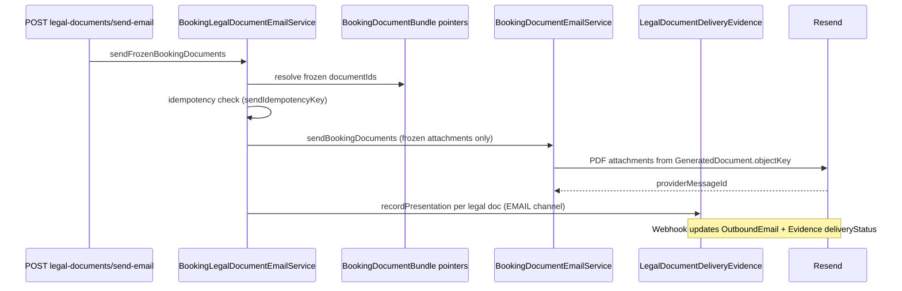

# Legal Documents — Email Delivery Integration (Prompt 21/32)

**Date:** 2026-07-22

## Problem

Booking document email send used arbitrary `documentIds` without enforcing frozen bundle pointers. Legal delivery evidence (Prompt 18) was not populated by email sends. Webhooks updated `OutboundEmail` only.

## Solution

`BookingLegalDocumentEmailService` sends **frozen** `GeneratedDocument` pointers from `BookingDocumentBundle` and records `LegalDocumentDeliveryEvidence` per legal attachment.

### Send flow

## Idempotency

| Layer | Key |
|-------|-----|
| Application | `sendIdempotencyKey` on `OutboundEmail` — unique per `(organizationId, key)` |
| Client button | Optional `clientRequestId` → `legal-email:{orgId}:{clientRequestId}` |
| Default | Hash of `bookingId + sorted documentIds + recipient` |
| Evidence | `legal-email-evidence:{outboundEmailId}:{documentType}` |
| Provider | Resend `Idempotency-Key: outboundEmail.id` |

Duplicate successful sends return existing `OutboundEmail` without re-sending.

## Evidence chain

1. `recordPresentation` on successful send — `deliveryChannel: EMAIL`, `deliveryStatus: SENT`, `outboundEmailId`, frozen `checksum` + `versionLabel`
2. `recipientSnapshot` — customerId, displayName, email, language (no document content)
3. Resend webhook → `applyOutboundEmailWebhookUpdate` → `DELIVERED` / `BOUNCED` / `OPENED` / `FAILED`

## Delivery status lifecycle

`SENT` → `DELIVERED` | `OPENED` | `BOUNCED` | `FAILED` (terminal states immutable)

## Frozen document guarantee

- Only bundle pointer IDs are sent for required cumulative document types
- Legal slot mismatch → `LEGAL_EMAIL_FROZEN_POINTER_MISMATCH`
- `useFrozenAttachmentsOnly: true` — attachments read from `GeneratedDocument.objectKey` only (no master legal doc fallback)
- New org legal versions do not affect historical bookings

## API

- `POST …/bookings/:bookingId/legal-documents/send-email` — frozen bundle send + evidence
- `POST …/bookings/:bookingId/documents/send-email/:outboundEmailId/retry` — retry failed send
- Auto-confirm uses `maybeAutoSendFrozenBookingDocuments`

## Test results

`booking-legal-document-email.service.spec.ts` + delivery evidence webhook tests — **30 passed** in outbound/delivery suite:

- Successful send
- Provider failure
- Retry
- Double button click (idempotency)
- Wrong organization
- Non-frozen legal document rejection
- Multilingual snapshot language
- Webhook delivery update + idempotent replay
