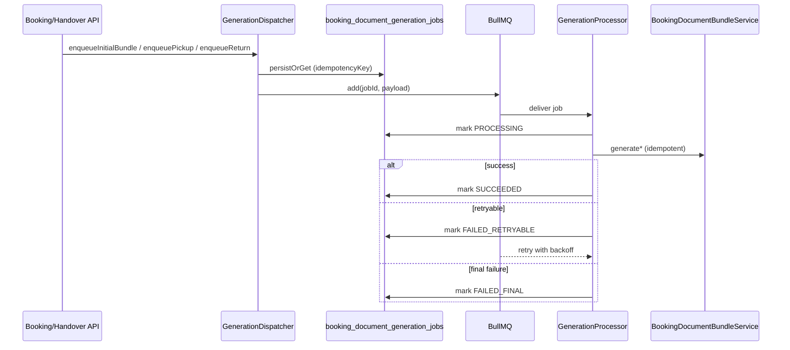

# Legal Documents — Booking Document Generation Workflow (Prompt 19/32)

**Date:** 2026-07-22

## Problem

Booking and handover flows triggered `generateInitialBundle` / protocol generation via fire-and-forget (`void promise.catch(() => {})`). Process crashes or silent failures lost work with no durable status, retry, or operator visibility.

## Solution

Durable workflow via `BookingDocumentGenerationJob` + BullMQ queue `booking.document.generation`.

### Workflow diagram

### States

| Status | Meaning |
|--------|---------|
| `PENDING` | Persisted, awaiting worker |
| `PROCESSING` | Worker executing |
| `SUCCEEDED` | Generation complete (idempotent on redelivery) |
| `FAILED_RETRYABLE` | Transient error, scheduled retry |
| `FAILED_FINAL` | Exhausted retries or blocking error |

### Idempotency concept

- Unique `(organizationId, idempotencyKey)` per job
- Keys: `booking-doc:initial:{org}:{booking}`, `booking-doc:pickup:{org}:{booking}:{protocolId}`, etc.
- Bull job ID: `sanitizeBullMqJobId({ namespace: 'booking-doc', key: persistentJobId })`
- `BookingDocumentBundleService` reuses existing bundle pointers — no duplicate `GeneratedDocument` when job re-runs

### Retry strategy

- Max attempts: 5 (configurable via `DOCUMENT_GENERATION_JOB_MAX_ATTEMPTS`)
- Exponential backoff from 5s (`DOCUMENT_GENERATION_JOB_BACKOFF_MS`)
- Recovery scheduler re-enqueues `PENDING` / `FAILED_RETRYABLE` jobs every minute
- Stale `PROCESSING` (>10 min) reset to `FAILED_RETRYABLE`

### Blocking vs async documents

| Trigger | Mode | Documents |
|---------|------|-----------|
| Wizard checkout | **Sync** (unchanged) | Full initial bundle |
| Booking create/confirm | **Async queue** | Initial bundle |
| Pickup handover | **Async queue** | Pickup protocol |
| Return handover | **Async queue** | Return protocol + final invoice |
| Admin API `generate-initial-bundle` | Queue first, sync fallback | Initial bundle |

**Blocking errors** (→ `FAILED_FINAL`, no retry): tenant mismatch, resolver conflicts, missing mandatory legal texts.

**Non-blocking**: partial bundle when org legal templates missing (bundle `PARTIAL` + tasks).

### API

- `POST …/documents/generate-initial-bundle` — queue (sync fallback if queue unavailable)
- `POST …/documents/generate-initial-bundle-sync` — direct sync escape hatch
- `GET …/document-generation-jobs` — workflow status list
- `POST …/document-generation-jobs/:jobId/retry` — manual retry (admin)

### Test results

`booking-document-generation.service.spec.ts`:
- Idempotency key stability
- Repository deduplication
- Dispatcher skip on SUCCEEDED
- Processor idempotent skip on duplicate delivery
- Tenant payload rejection
- Retry on transient failure
- FAILED_FINAL after max attempts
- Manual retry resets and re-enqueues
- Recovery scheduler marks stale PROCESSING as FAILED_RETRYABLE

Full legal/booking suite: **296 passed** (`npm test -- --testPathPattern="legal-document|booking-document|documents.service"`)
