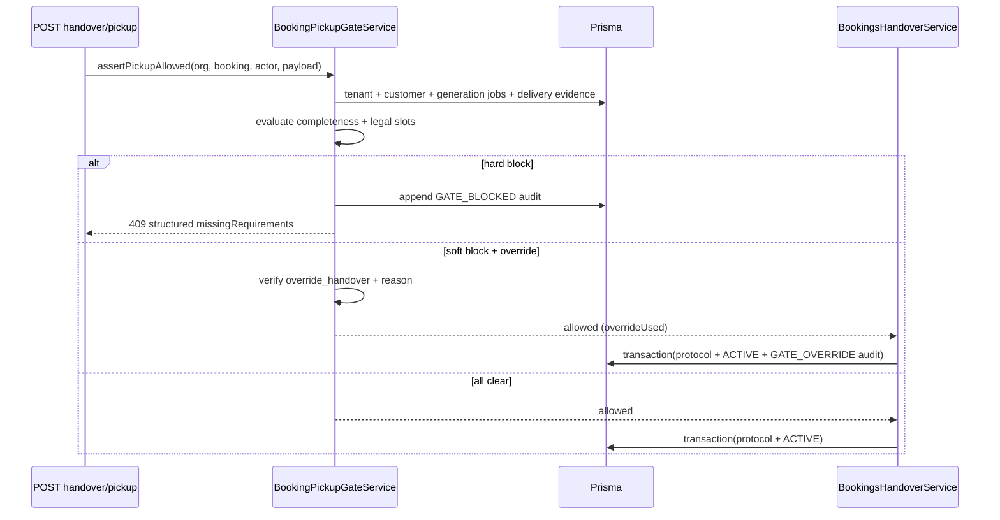

# Legal Documents — Server-Side Pickup Gate (Prompt 20/32)

**Date:** 2026-07-22

## Problem

Pickup (`CONFIRMED` → `ACTIVE`) could proceed without enforcing legal document prerequisites. `performedByUserId` / `performedByName` were accepted from the client. Bundle completeness was display-only.

## Solution

`BookingPickupGateService` runs before pickup handover transactions. Actor identity is derived exclusively from the authenticated request context.

### Gate flow

## Gate matrix

| Check | Hard block | Override allowed |
|-------|------------|------------------|
| Booking status ≠ CONFIRMED | ✓ | ✗ |
| Tenant mismatch (booking/customer/docs) | ✓ | ✗ |
| Client `performedBy*` fields | ✓ | ✗ |
| Integrity / checksum / storage failure | ✓ | ✗ |
| Malware scan not passed | ✓ | ✗ |
| Resolver conflict | ✓ | ✗ |
| Mandatory generation in progress | ✓ | ✗ |
| Missing AGB / Verbraucherinfo / Datenschutz | | ✓ |
| Legal presentation not recorded | | ✓ |
| Legal acknowledgment missing | | ✓ |
| Handover `documentsAcknowledged` false | | ✓ |
| Customer signature missing | | ✓ |
| Invoice delivery pending | | ✓ |
| Customer eligibility blocked | | ✓ |

## Override rules

- Permission: `legal_documents.override_handover` (manage level) or `ORG_ADMIN` / `MASTER_ADMIN`
- Mandatory `pickupGateOverrideReason` in pickup payload
- No override for integrity, malware, tenant, manipulation, or in-progress generation
- Override appends `GATE_OVERRIDE` audit event in the same transaction as status change

## Error codes

See `PICKUP_GATE_CODE` in `booking-pickup-gate.constants.ts`. API responses use `PickupGateBlockedException` with:

- `code` — primary failure
- `missingRequirements[]` — `{ code, message, overridable, documentType? }`
- `hardBlocks` / `softBlocks`
- `overrideAllowed` — true when only soft blocks remain

## Transaction boundaries

| Step | Transaction |
|------|-------------|
| Gate evaluation | Read-only (outside TX) |
| `GATE_BLOCKED` audit on failure | Separate insert (best-effort) |
| Pickup protocol + booking ACTIVE + vehicle RENTED | Single `$transaction` |
| `GATE_OVERRIDE` audit on success | Same `$transaction` as pickup |
| Protocol PDF generation | Async queue (post-commit) |

Direct `PATCH` booking status `CONFIRMED` → `ACTIVE` is rejected (`BOOKING_ACTIVATION_REQUIRES_HANDOVER`).

## Idempotency

Duplicate `POST …/handover/pickup` when booking is already `ACTIVE` returns the existing protocol (no second transition).

## Test results

`booking-pickup-gate.integration.spec.ts` — **12 passed**:

- Successful pickup
- Missing privacy policy
- Missing consumer information
- Missing acknowledgment
- Generation in progress
- Hash / integrity deviation
- Foreign tenant
- Authorized override
- Denied override
- Manipulated actor ID
- Structured blocked response + audit
- Duplicate pickup idempotency
