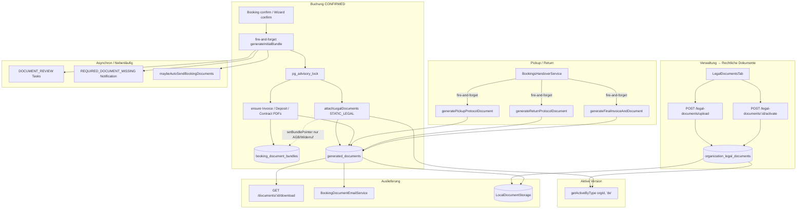

# Legal Documents Remediation — Baseline & Abhängigkeitskarte

**Prompt:** 1 von 32 (Production-Readiness „Verwaltung → Rechtliche Dokumente“)  
**Datum:** 2026-07-22  
**Repository:** `SYNQDRIVE-alpha`  
**Scope:** Ist-Analyse ohne produktive Code-Änderungen  
**Methode:** Direkte Code- und Schema-Verifikation; keine ungeprüften Übernahmen aus früheren Audits

---

## Executive Summary

Der Tab **Verwaltung → Rechtliche Dokumente** ist funktional vorhanden (Upload, Versionierung, Aktivierung, Archivierung für AGB, Widerrufsbelehrung, Datenschutzerklärung). Die **Buchungs-Dokumenten-Engine** (`documents`-Modul) ist der zentrale Integrationspunkt für Legal Texts, Generated PDFs, Bundles, E-Mail-Versand und Tasks.

**Kernbefund:** Es besteht eine **architektonische Inkonsistenz bei `PRIVACY_POLICY`**: Frontend und Upload-API behandeln die Datenschutzerklärung als dritten Rechtstext, Backend-Bundle-Tracking, Vollständigkeitslogik, Notifications und Company-Readiness **nicht**. Zusätzlich fehlen **Sprachauflösung** (hardcoded `de`), **Checksum-Verifikation** (nur Persistenz), **S3-Storage-Switch** (Config ohne Binding) und **umfassende Tests/CI**.

---

## 1. Ist-Architektur

### 1.1 Produktflächen

| Fläche | Pfad / Einstieg | Rolle |
|--------|-----------------|-------|
| **Admin Tab** | `frontend/src/rental/components/LegalDocumentsTab.tsx` | Upload, Aktivieren, Archivieren, Download |
| **Tab-Shell** | `SettingsView` → `AdministrationTabBar` (`legal-documents`) | Kein eigener URL-Route; Session-State `synqdrive_rental_settings_tab` |
| **Company Center** | `CompanyInformationTab` / `company-utils.ts` | Status-Gruppen, Setup-Checklist, CTA „AGB & Widerruf verwalten“ |
| **Booking Detail** | `BookingDocumentsSection.tsx` | Bundle-Anzeige, Missing-Legal-Warnung, Regenerate, E-Mail |
| **Checkout Wizard** | `CheckoutDocumentsPanel.tsx`, `CheckoutStep.tsx` | Dokumentliste, AGB/Datenschutz-Checkboxen (Links nicht klickbar) |
| **Operator** | `OperatorBookingDocumentsPanel.tsx`, `OperatorHandoverStepDocuments.tsx` | Handover-Dokumentenschritt |
| **E-Mail** | `SendDocumentsEmailModal.tsx` | Manueller Versand aus Bundle |

**Hinweis:** Kein Master-Admin-Legal-UI; nur Tenant-`ORG_ADMIN` / `MASTER_ADMIN` Mutationen.

### 1.2 Backend-Modul

```
backend/src/modules/documents/
├── legal-documents.controller.ts      # CRUD-ish: list/upload/activate/archive/download
├── legal-documents.service.ts         # Versionierung, getActiveByType, sha256 checksum write
├── booking-document-bundle.service.ts # Orchestrierung, STATIC_LEGAL attach, Bundle-Status
├── generated-documents.service.ts     # PDF persist, void, download
├── documents.controller.ts            # Booking bundle APIs
├── booking-document-missing-slots.util.ts
├── booking-document-phase.util.ts
├── booking-document-org-legal-notification.service.ts
├── document-renderer.service.ts + templates/
└── storage/
    ├── document-storage.interface.ts  # DocumentStoragePort
    └── local-document-storage.service.ts  # einzige Implementierung
```

**Guards:** `OrgScopingGuard` + `RolesGuard` auf allen Controllern.  
**Mutationen Legal:** `@Roles('ORG_ADMIN', 'MASTER_ADMIN')`.  
**Lesen:** Jeder Org-Member.

### 1.3 Datenmodell (Prisma)

| Modell | Tabelle | Zweck |
|--------|---------|-------|
| `OrganizationLegalDocument` | `organization_legal_documents` | Hochgeladene Rechtstexte (versioniert) |
| `GeneratedDocument` | `generated_documents` | Generierte PDFs + `STATIC_LEGAL`-Referenzen |
| `BookingDocumentBundle` | `booking_document_bundles` | Pointer pro Buchung auf aktive Dokumente |
| `RentalContract` | `rental_contracts` | Mietvertrag-Metadaten + JSON-Snapshot |
| `BookingDeposit` | `booking_deposits` | Kautionsbeleg |

**Migration:** `20260613200000_booking_document_lifecycle` (+ `20260614000100` für `DOCUMENT_REVIEW` Task-Typ).

### 1.4 Dokumenttypen

Definiert in `documents.constants.ts`:

- **Legal (upload):** `TERMS_AND_CONDITIONS`, `WITHDRAWAL_INFORMATION`, `PRIVACY_POLICY`
- **Generated:** `BOOKING_INVOICE`, `DEPOSIT_RECEIPT`, `RENTAL_CONTRACT`, `HANDOVER_PICKUP`, `HANDOVER_RETURN`, `FINAL_INVOICE`
- **Origins:** `GENERATED`, `STATIC_LEGAL`, `UPLOADED_REFERENCE`

---

## 2. Datenflussdiagramm (Mermaid)



---

## 3. Abhängigkeitskarte

### 3.1 Welche Tabellen und Services referenzieren Rechtstexte?

| Referenz | Art | Details |
|----------|-----|---------|
| `organization_legal_documents` | **Source of truth** | Upload, Version, `checksum`, `objectKey`, `language`, `status` |
| `generated_documents` (`origin=STATIC_LEGAL`) | **Booking-Snapshot-Referenz** | `legalDocumentId`, `legalVersionLabel`, gemeinsamer `objectKey` mit Org-Upload |
| `booking_document_bundles` | **Pointer** | `termsDocumentId`, `withdrawalDocumentId` — **kein** `privacyPolicyDocumentId` |
| `rental_contracts` | **Metadaten** | `termsDocumentId`, `withdrawalDocumentId` im Snapshot — **kein** Privacy-Pointer |
| `outbound_email_attachments` | **Versand** | Verweist auf `generated_documents.id` |
| `activity_log` | **Audit (generisch)** | Legal-Mutationen nur als generisches `ORGANIZATION` POST |

**Services mit Legal-Bezug:**

| Service | Datei |
|---------|-------|
| `LegalDocumentsService` | `legal-documents.service.ts` |
| `BookingDocumentBundleService` | `booking-document-bundle.service.ts` |
| `GeneratedDocumentsService` | `generated-documents.service.ts` |
| `BookingDocumentEmailService` | `outbound-email/booking-document-email.service.ts` |
| `BookingDocumentOrgLegalNotificationService` | `booking-document-org-legal-notification.service.ts` |
| `BookingsService` | Trigger `generateInitialBundle` (fire-and-forget) |
| `BookingWizardDraftService` | **Synchron** `generateInitialBundle` bei Confirm |
| `BookingsHandoverService` | Handover-PDF-Trigger (fire-and-forget) |
| `TaskAutomationService` | `DOCUMENT_REVIEW` Package-Tasks |
| `WhatsappBookingReminderService` / `WhatsappAiToolsService` | Missing-doc Awareness |
| `VoiceMcpWriteToolsService` | `requestDocumentResend` |

### 3.2 Wo werden aktive Versionen aufgelöst?

| Ort | Mechanismus | Sprache |
|-----|-------------|---------|
| **Backend kanonisch** | `LegalDocumentsService.getActiveByType(orgId, language)` — max. 1 ACTIVE pro `(documentType, language)`, `orderBy activeFrom desc` | Default `'de'`, **alle Bundle-Aufrufe hardcoded `'de'`** |
| **Aktivierung** | `activate()` — Transaction archiviert andere ACTIVE derselben `(type, language)` | Per `OrganizationLegalDocument.language` |
| **Frontend Admin** | Client-seitig: `list()` → `find(status === 'ACTIVE')` pro Typ | Keine Sprachfilterung |
| **Company Center** | `buildDocumentStatusGroups()` — gleiche Client-Logik | — |
| **Bundle attach** | `attachLegalDocuments()` → `getActiveByType(orgId, 'de')` | Hardcoded |
| **Bundle view missing** | `getBundleView()` prüft nur `termsDocumentId` / `withdrawalDocumentId` | — |
| **Task missing slots** | `computeMissingDocumentSlots()` + `orgMissingLegalTemplateTypes()` | Nur AGB + Widerruf |

**Kein** Endpoint `GET .../legal-documents/active`; keine Buchungs-/Kunden-Locale-Auflösung.

### 3.3 Wo werden Dokumentkopien oder Snapshots erzeugt?

| Artefakt | Mechanismus | Immutable? |
|----------|-------------|------------|
| **Org Legal Upload** | `storage.putObject()` → `organization_legal_documents` | Ja (neue Version = neuer Row + neuer Key) |
| **STATIC_LEGAL in Bundle** | `GeneratedDocument` Row **referenziert** Org-`objectKey` + `checksum` — **keine Byte-Kopie** | Referenz auf Upload-Zeitpunkt; `legalVersionLabel` gespeichert |
| **Generated PDFs** | `renderAndStore()` → pdfkit → `putObject()` + `snapshot` JSON + `checksum` | Ja — Download serviert gespeicherte Bytes |
| **RentalContract** | `RentalContract.snapshot` JSON bei Generierung | Ja (Metadaten-Snapshot) |
| **E-Mail** | Lädt Bytes aus Storage zum Versandzeitpunkt; setzt `GeneratedDocument.status = SENT` | — |

**Kritisch:** `setBundlePointer()` für `PRIVACY_POLICY` ist **No-Op**, weil `BUNDLE_FIELD` keinen Eintrag hat — `GeneratedDocument` wird erzeugt, Bundle-Pointer bleibt `null`.

### 3.4 Wo fehlen Datenschutzerklärung, Sprache oder Prüfsumme?

#### Datenschutzerklärung (`PRIVACY_POLICY`)

| Layer | Status |
|-------|--------|
| `LEGAL_DOCUMENT_TYPES`, Upload-API, `LegalDocumentsTab` UI | ✅ Vorhanden |
| `attachLegalDocuments()` Loop | ✅ Erzeugt `STATIC_LEGAL` Row |
| `BUNDLE_FIELD` / `booking_document_bundles` Spalte | ❌ Fehlt — Pointer wird nie gesetzt |
| `getBundleView().missingLegalDocuments` | ❌ Prüft nur AGB + Widerruf |
| `requiredTypesForStage()` / `DOCUMENT_PHASE_REQUIREMENTS` | ❌ Privacy nicht required |
| `refreshBundleStatus().legalMissing` | ❌ Nur terms + withdrawal |
| `orgMissingLegalTemplateTypes()` / Notifications | ❌ Nur AGB + Widerruf |
| `isLegalTextsComplete()` (Frontend) | ❌ Nur AGB + Widerruf |
| `canGenerateContract()` | ❌ Nur AGB + Widerruf |
| `RentalContract` Snapshot | ❌ Kein Privacy-Referenzfeld |
| `docs/booking-document-lifecycle.md` | ❌ Erwähnt Privacy nicht in Pflichtliste |

#### Sprache

| Layer | Status |
|-------|--------|
| DB `OrganizationLegalDocument.language` | ✅ Default `de` |
| `activate()` pro `(type, language)` | ✅ |
| Upload-Controller akzeptiert `language` | ✅ |
| `LegalDocumentsTab` sendet `language` | ❌ Nie gesetzt |
| `LegalDocumentDto` in UI angezeigt | ❌ Feld nicht gerendert |
| Bundle-Auflösung | ❌ Immer `'de'` |
| Kunden-/Buchungs-Locale-Mapping | ❌ Nicht implementiert |

#### Prüfsumme (`checksum`)

| Layer | Status |
|-------|--------|
| Upload / PDF create — sha256 write | ✅ |
| `LegalDocumentDto` / `GeneratedDocumentDto` API | ❌ Nicht exponiert |
| Download-Verifikation | ❌ |
| E-Mail-Attach-Verifikation | ❌ |
| UI-Anzeige | ❌ |
| Integritäts-Audit-Job | ❌ |

### 3.5 Welche Prozesse sind synchron, asynchron oder fire-and-forget?

| Prozess | Modus | Aufrufer | Fehlerbehandlung |
|---------|-------|----------|------------------|
| Legal upload/activate/archive | **Synchron** (HTTP) | `LegalDocumentsController` | Exception → 4xx |
| `generateInitialBundle` (Wizard Confirm) | **Synchron** (await) | `booking-wizard-draft.service.ts` | Fehler propagieren möglich |
| `generateInitialBundle` (Booking create/update CONFIRMED) | **Fire-and-forget** | `bookings.service.ts` `void ...catch(()=>{})` | Fehler verschluckt |
| Auto-E-Mail nach Bundle | **Fire-and-forget** | `maybeAutoSendBookingDocuments` chained | `.catch(()=>{})` |
| Pickup/Return/Final PDF | **Fire-and-forget** | `bookings-handover.service.ts` | `.catch(()=>{})` |
| `syncMissingDocumentTasks` | **Fire-and-forget** innerhalb Bundle | `refreshBundleStatus` | `logger.warn` |
| Org legal notification | **Fire-and-forget** | `syncFromOrgLegalState` | `catch` debug/warn |
| Task outbox `SYNC_DOCUMENT_PACKAGES` | **Asynchron** (Worker) | `task-automation-outbox-executor` | Outbox retry |
| Manueller E-Mail-Versand | **Synchron** | `BookingDocumentEmailService` | Exception + ActivityLog |

**Advisory Lock:** `generateInitialBundle` nutzt `pg_advisory_lock(hashtext('bundle-gen:{bookingId}'))` — idempotent bei Parallelaufrufen.

### 3.6 Welche vorhandenen Komponenten können wiederverwendet werden?

| Komponente | Wiederverwendung für Remediation |
|------------|----------------------------------|
| `DocumentStoragePort` + `LocalDocumentStorageService` | Storage-Abstraktion; S3-Adapter an gleichem Token |
| `LegalDocumentsService.activate/getActiveByType` | Versionierung — erweitern um Locale-Parameter |
| `attachLegalDocuments()` | Privacy-Pointer + ggf. echte Kopie optional |
| `BUNDLE_FIELD` / `setBundlePointer` Pattern | Template für `privacyPolicyDocumentId` |
| `computeMissingDocumentSlots` + `DOCUMENT_PHASE_REQUIREMENTS` | Privacy in Phasen-Requirements |
| `BookingDocumentOrgLegalNotificationService` | Auf 3 Typen erweitern |
| `LegalDocumentsTab` UI-Struktur | Sprache, Checksum, i18n ergänzen |
| `BookingDocumentsSection` | Missing-Legal + Token-Anzeige |
| `documents.service.spec.ts` Harness | Integrationstests erweitern |
| `SendDocumentsEmailModal` + `email-i18n.ts` | Bereits `PRIVACY_POLICY` Label |
| `booking-document-phase.util.ts` | Phasen-Modell konsistent halten |
| `AuditInterceptor` | Basis — dediziertes Legal-Audit ergänzen |
| `docs/booking-document-lifecycle.md` | Canonical doc — aktualisieren |

**Nicht wiederverwenden / trennen:** `document-extraction/` (AI Upload) — separates Storage und Domain.

### 3.7 Welche Migrationen müssen rückwärtskompatibel erfolgen?

| Änderung | Rückwärtskompatibilität | Strategie |
|----------|-------------------------|-----------|
| `privacy_policy_document_id` auf `booking_document_bundles` | Nullable Spalte | Add column nullable; Backfill aus `generated_documents` WHERE `documentType=PRIVACY_POLICY` |
| `privacy_document_id` auf `rental_contracts` | Nullable | Optional, gleiche Backfill-Logik |
| Privacy in Bundle-Status / missing slots | Logik-Änderung | Feature-Flag oder staged rollout; bestehende COMPLETE-Bundles ohne Privacy bleiben PARTIAL |
| Expose `checksum` in DTOs | Additive API | Nullable field; alte Clients ignorieren |
| Multi-Language Resolution | Kein Schema-Zwang | Logik-only mit Fallback `de` |
| S3 Storage Provider | `storageProvider` Feld existiert | Neue Implementierung; bestehende `objectKey` unverändert |
| `PRIVACY_POLICY` in `requiredTypesForStage` | Verhaltensänderung | Org-Warnung vor Enforcement; Grace Period |
| Dediziertes ActivityEntity DOCUMENT | Additive Enum | Optional; alte Logs bleiben |
| Index auf `(organizationId, documentType, language, status)` | Bereits vorhanden | Keine Breaking Change |

**Sicher:** Keine Änderung an `documentType` String-Enum (kein Prisma-Enum) — neue Typen ohne Migration möglich.

---

## 4. Bestätigte Findings

### P0 — Production Blocker

| ID | Finding | Evidenz |
|----|---------|---------|
| **P0-1** | **Privacy Bundle-Pointer fehlt** — `PRIVACY_POLICY` wird attached, aber `setBundlePointer` ist No-Op | `BUNDLE_FIELD` ohne `PRIVACY_POLICY`; `setBundlePointer` Zeile 861–863 |
| **P0-2** | **Inkonsistente Privacy-Pflicht** — UI/Tab warnt für alle 3 Typen; Backend/Readiness nur AGB+Widerruf | `isLegalTextsComplete`, `getBundleView`, `refreshBundleStatus` |
| **P0-3** | **Kein CI/CD-Gate** für Booking-Document-Lifecycle | Kein `.github/workflows/`; kein `test:booking-documents` Script |
| **P0-4** | **Fire-and-forget Bundle-Gen verschluckt Fehler** bei Standard-Booking-Confirm | `bookings.service.ts` `.catch(() => {})` |

### P1 — Hohes Risiko

| ID | Finding | Evidenz |
|----|---------|---------|
| **P1-1** | Sprache hardcoded `'de'` in allen Bundle-Pfaden | 6× `getActiveByType(orgId, 'de')` in `booking-document-bundle.service.ts` |
| **P1-2** | `missingLegalDocuments` nutzt Legacy-Label `REVOCATION_POLICY` statt `WITHDRAWAL_INFORMATION` | `getBundleView` Zeile 166; Test bestätigt in `documents.service.spec.ts:315` |
| **P1-3** | Checksum nur Write, nie Verify | Kein grep-Treffer außerhalb Persistenz |
| **P1-4** | `DOCUMENT_STORAGE_PROVIDER` ungenutzt — nur Local | `documents.config.ts` + `DocumentsModule` Binding |
| **P1-5** | STATIC_LEGAL teilt `objectKey` — kein booking-scoped Copy | `attachLegalDocuments` kopiert Referenz, nicht Bytes |
| **P1-6** | Schema-Kommentar listet `PRIVACY_POLICY` nicht | `schema.prisma` `OrganizationLegalDocument.documentType` Kommentar |
| **P1-7** | Keine Controller-/E2E-Tests; keine Template-Tests | Nur 7 Specs im documents-Modul |

### P2 — UX / Compliance / Tech Debt

| ID | Finding | Evidenz |
|----|---------|---------|
| **P2-1** | `LegalDocumentsTab` hardcoded Deutsch, kein i18n | Kein `useLanguage()` |
| **P2-2** | `language` Upload-Feld in UI nicht gesetzt | `api.legalDocuments.upload` optional, UI sendet nicht |
| **P2-3** | Checkout AGB/Datenschutz-Links nicht klickbar | `CheckoutStep.tsx` styled spans |
| **P2-4** | Booking-Warnung verweist auf „Administration → Unternehmen“ statt „Rechtliche Dokumente“ | `BookingDocumentsSection.tsx` |
| **P2-5** | `RentalContract.signedAt` / `status=SIGNED` nie gesetzt | Schema vorhanden, kein Writer |
| **P2-6** | Legal Audit nur generisches `ORGANIZATION` POST | `AuditInterceptor`, kein Version-Metadata |
| **P2-7** | `docs/booking-document-lifecycle.md` veraltet bzgl. Privacy | § Product flow listet nur AGB+Widerruf |
| **P2-8** | Operator-Panel ohne `missingLegalDocuments`-Banner | `OperatorBookingDocumentsPanel.tsx` |
| **P2-9** | Handover-Protokolle nicht per `regenerate/:documentType` regenerierbar | `regenerate()` wirft für HANDOVER_* |

---

## 5. Betroffene Dateien

### Frontend (Kern)

```
frontend/src/rental/components/LegalDocumentsTab.tsx
frontend/src/rental/components/SettingsView.tsx
frontend/src/rental/components/settings/AdministrationTabBar.tsx
frontend/src/rental/components/settings/settingsTypes.ts
frontend/src/rental/components/settings/company/company-utils.ts
frontend/src/rental/components/settings/company/CompanySections.tsx
frontend/src/rental/components/settings/company/CompanySetupChecklist.tsx
frontend/src/rental/components/BookingDocumentsSection.tsx
frontend/src/rental/components/booking-detail/bookingActionRules.ts
frontend/src/rental/components/booking-detail/BookingFinanceDocumentsTab.tsx
frontend/src/rental/components/new-booking/CheckoutDocumentsPanel.tsx
frontend/src/rental/components/new-booking/CheckoutStep.tsx
frontend/src/rental/components/new-booking/BookingSuccessState.tsx
frontend/src/rental/components/NewBookingView.tsx
frontend/src/rental/lib/vehicle-booking-readiness.utils.ts
frontend/src/rental/lib/legal-documents.utils.ts
frontend/src/lib/api.ts
frontend/src/lib/email-i18n.ts
frontend/src/lib/document-list.utils.ts
frontend/src/components/email/SendDocumentsEmailModal.tsx
frontend/src/operator/documents/OperatorBookingDocumentsPanel.tsx
frontend/src/operator/documents/operatorBookingDocuments.utils.ts
frontend/src/operator/handover/OperatorHandoverStepDocuments.tsx
```

### Backend (Kern)

```
backend/src/modules/documents/legal-documents.controller.ts
backend/src/modules/documents/legal-documents.service.ts
backend/src/modules/documents/legal-documents.util.ts
backend/src/modules/documents/booking-document-bundle.service.ts
backend/src/modules/documents/booking-document-missing-slots.util.ts
backend/src/modules/documents/booking-document-phase.util.ts
backend/src/modules/documents/booking-document-org-legal-notification.service.ts
backend/src/modules/documents/documents.controller.ts
backend/src/modules/documents/documents.constants.ts
backend/src/modules/documents/generated-documents.service.ts
backend/src/modules/documents/document-renderer.service.ts
backend/src/modules/documents/templates/rental-contract.template.ts
backend/src/modules/documents/templates/pickup-handover.template.ts
backend/src/modules/documents/templates/return-handover.template.ts
backend/src/modules/documents/storage/document-storage.interface.ts
backend/src/modules/documents/storage/local-document-storage.service.ts
backend/src/modules/bookings/bookings.service.ts
backend/src/modules/bookings/bookings-handover.service.ts
backend/src/modules/bookings/booking-wizard-draft.service.ts
backend/src/modules/outbound-email/booking-document-email.service.ts
backend/src/modules/outbound-email/booking-documents-email.controller.ts
backend/src/config/documents.config.ts
backend/prisma/schema.prisma
backend/prisma/migrations/20260613200000_booking_document_lifecycle/migration.sql
```

### Tests (bestehend)

```
backend/src/modules/documents/documents.service.spec.ts
backend/src/modules/documents/legal-documents.util.spec.ts
backend/src/modules/documents/booking-document-phase.util.spec.ts
backend/src/modules/documents/booking-document-task.sync.spec.ts
backend/src/modules/documents/booking-document-org-legal-notification.service.spec.ts
backend/src/modules/documents/document-list-dedupe.util.spec.ts
backend/src/modules/documents/pdfkit-document.spec.ts
backend/src/modules/outbound-email/booking-document-email.service.spec.ts
frontend/src/rental/lib/legal-documents.utils.test.ts
frontend/src/rental/components/settings/company/company-utils.test.ts
frontend/src/rental/components/settings/company/company-activity-mapper.test.ts
```

### Dokumentation

```
docs/booking-document-lifecycle.md
architecture/BOOKING_DOCUMENT_LIFECYCLE_2026-06-13.md
architecture/OUTBOUND_EMAIL_2026-07-10.md
docs/audits/booking-task-trigger-map.md
```

---

## 6. Migrationsrisiken

| Risiko | Impact | Mitigation |
|--------|--------|------------|
| Privacy plötzlich als Pflicht → viele PARTIAL Bundles | Operative Alarmflut, Tasks | Staged enforcement; Backfill-Job; Org-Notification vor Aktivierung |
| Backfill `privacyPolicyDocumentId` aus `generated_documents` | Mehrdeutigkeit bei mehreren NON-VOID Rows | `orderBy createdAt desc`, neueste nehmen |
| SHARED `objectKey` bei STATIC_LEGAL | Storage-Löschung betrifft Org + alle Bookings | Vor Storage-Migration Keys inventarisieren; optional Copy-on-Attach |
| Fire-and-forget Fehler historisch unsichtbar | Buchungen ohne Bundle | Ops-Script: Bookings CONFIRMED ohne Bundle / FAILED status |
| `REVOCATION_POLICY` vs `WITHDRAWAL_INFORMATION` in Clients | Frontend-Label-Mismatch | API normalisieren; deprecate alias |
| S3-Migration | `getInternalPath` null auf S3 | Streaming download bereits über Port |
| Advisory Lock bei langen PDF-Runs | Latenz bei parallel confirm | Lock-Scope beibehalten; Timeout dokumentieren |
| Wizard sync vs Booking async | Unterschiedliches Fehlerverhalten | Vereinheitlichen in späterem Prompt |

---

## 7. Sichere Umsetzungsreihenfolge (für Prompts 2–32)

Empfohlene Sequenz — jeweils mit Tests vor UI-Politur:

1. **Anforderungs-Freeze** — Privacy Pflicht ja/nein; Sprachen-Scope; Checksum-Anzeige vs. Verify; Copy-on-Attach vs. Referenz
2. **Schema additive Migration** — `privacy_policy_document_id` (+ optional RentalContract); nullable, kein NOT NULL
3. **Backfill-Script** — bestehende `STATIC_LEGAL` PRIVACY → Bundle-Pointer
4. **Backend Konsistenz** — `BUNDLE_FIELD`, `getBundleView`, `refreshBundleStatus`, `requiredTypesForStage`, `DOCUMENT_PHASE_REQUIREMENTS`, `orgMissingLegalTemplateTypes`, Notifications
5. **Label-Normalisierung** — `REVOCATION_POLICY` → `WITHDRAWAL_INFORMATION` in API responses (mit Deprecation)
6. **Sprachauflösung** — `resolveLegalLanguage(orgId, booking?)` mit Fallback `de`; Upload-UI
7. **Checksum API** — DTO-Felder; optional Download-Verify hinter Flag
8. **Audit** — dedizierte Activity-Einträge für activate/archive mit `documentType`, `versionLabel`
9. **Frontend Alignment** — `isLegalTextsComplete`, Setup-Checklist, `canGenerateContract`, Checkout-Links, CTA-Texte, i18n
10. **Fehler-Sichtbarkeit** — Fire-and-forget Logging/Metrics; optional Admin-Banner bei FAILED bundle
11. **Tests** — Integration `generateInitialBundle` + Privacy pointer; Controller authz; Frontend component tests
12. **CI Script** — `test:booking-documents` analog document-intake
13. **Dokumentation** — `booking-document-lifecycle.md`, Architektur-Record
14. **Storage/S3** — separater Prompt wenn Production-Blocker

---

## 8. Bestehende Tests und Testlücken

### Vorhanden (~32 Tests geschätzt)

| Bereich | Abdeckung |
|---------|-----------|
| PDF Upload Validation | `legal-documents.util.spec.ts` |
| Legal activate / getActiveByType | `documents.service.spec.ts` |
| Bundle PARTIAL/COMPLETE ohne AGB/Widerruf | `documents.service.spec.ts` |
| PRIVACY_POLICY Upload akzeptiert | `documents.service.spec.ts:154` |
| Checksum bei PDF create | `documents.service.spec.ts:232` |
| Task sync DOCUMENT_REVIEW | `booking-document-task.sync.spec.ts` |
| Phase requirements | `booking-document-phase.util.spec.ts` |
| Org legal notification | `booking-document-org-legal-notification.service.spec.ts` |
| E-Mail attach policy | `booking-document-email.service.spec.ts` |
| Frontend `isLegalPdfFile` | `legal-documents.utils.test.ts` |
| Frontend `isLegalTextsComplete` | `company-utils.test.ts` |

### Kritische Lücken

| Lücke | Priorität |
|-------|-----------|
| `attachLegalDocuments` + Privacy pointer | P0 |
| Voller `generateInitialBundle` Integration | P0 |
| `bookings-handover.service` PDF triggers | P1 |
| PDF Template Rendering (alle 6 Templates) | P1 |
| Controller Cross-Tenant Download | P1 |
| `LegalDocumentsTab` Component | P2 |
| `BookingDocumentsSection` Missing-Legal UX | P2 |
| E2E Confirm → Bundle → Download | P1 |
| Checksum verify on download | P2 |
| Fire-and-forget failure observability | P1 |

---

## 9. Production Blocker (klare Liste)

| # | Blocker | Begründung |
|---|---------|------------|
| 1 | **Privacy nicht end-to-end tracked** | Upload möglich, Bundle-Pointer fehlt, Vollständigkeit widersprüchlich |
| 2 | **Keine automatisierte Regression-Suite** für Document Lifecycle | Hohe Regressionsgefahr bei 32-Prompt-Remediation |
| 3 | **Silent failures bei Bundle-Generierung** (Standard-Booking) | Prod-Buchungen können ohne Dokumente existieren |
| 4 | **Single-node Local Storage** ohne Provider-Switch | VPS-Disk = SPOF; kein S3 für HA |
| 5 | **Rechtliche Vollständigkeit uneinheitlich** zwischen Admin-Warnung, Company-Setup, Contract-Gate, Bundle-Status | Compliance-Risiko / Operator-Verwirrung |

**Nicht als Blocker für Tab-Remediation selbst, aber für Gesamt-Production:** Rental-Contract-Template neutral/Placeholder; `signedAt` ungenutzt; Final-Invoice-Kostenfelder teilweise TODO.

---

## 10. Abweichungen vom erwarteten Audit

| Erwartung (typisch) | Verifizierter Ist-Zustand |
|---------------------|---------------------------|
| Privacy vollständig integriert wenn im UI | **Teilimplementiert** — attach ja, Pointer/Status nein |
| CI testet Legal Documents | **Nein** — kein Workflow im Repo |
| `checksum` in API/UI | **Nein** — nur DB-intern |
| Multi-Language ready | **Schema ja, Runtime nein** |
| `docs/booking-document-lifecycle.md` aktuell | **Privacy fehlt in Pflichtliste** |
| Separates Legal-Modul | **Nein** — alles unter `documents/` (korrekt, aber breiter Scope) |
| AI Document Intake = Legal Docs | **Nein** — getrennte Domain (`document-extraction/`) |

---

## 11. Empfohlene Reihenfolge für Prompt 2

**Prompt 2 sollte:** Anforderungen einfrieren + **Privacy Bundle-Pointer Schema-Migration (additiv)** + **Backend-Konsistenzpatch** (`BUNDLE_FIELD`, `getBundleView`, `refreshBundleStatus`, missing-slot utils) + **Unit/Integration-Tests** für den Pointer-Fix — **ohne** UI-Umbau und **ohne** S3.

Konkret:

1. Product-Entscheid: Ist `PRIVACY_POLICY` Pflicht wie AGB/Widerruf? (empfohlen: ja, konsistent mit `LegalDocumentsTab`)
2. Migration `privacy_policy_document_id UUID NULL` auf `booking_document_bundles`
3. `BUNDLE_FIELD[PRIVACY_POLICY]` + Backfill-Ops-Script-Spec
4. Tests: attach → pointer gesetzt; `getBundleView` enthält Privacy in missing wenn fehlend
5. `REVOCATION_POLICY` Alias bereinigen oder dokumentieren

**Nicht in Prompt 2:** S3, Checkout-UI, i18n, Checksum-Verify, Fire-and-forget Refactor.

---

## Anhang: API-Endpunkte (verifiziert)

### Legal Documents

```
GET    /api/v1/organizations/:orgId/legal-documents
POST   /api/v1/organizations/:orgId/legal-documents/upload
POST   /api/v1/organizations/:orgId/legal-documents/:id/activate
POST   /api/v1/organizations/:orgId/legal-documents/:id/archive
GET    /api/v1/organizations/:orgId/legal-documents/:id/download
```

### Booking Documents

```
GET    /api/v1/organizations/:orgId/bookings/:bookingId/documents
POST   /api/v1/organizations/:orgId/bookings/:bookingId/documents/generate-initial-bundle
POST   /api/v1/organizations/:orgId/bookings/:bookingId/documents/regenerate/:documentType
GET    /api/v1/organizations/:orgId/documents/:documentId/metadata
POST   /api/v1/organizations/:orgId/documents/:documentId/void
GET    /api/v1/organizations/:orgId/documents/:documentId/download
POST   /api/v1/organizations/:orgId/bookings/:bookingId/documents/send-email
```

---

*Erstellt durch Prompt-1-Analyse. Keine Code-Änderungen am produktiven System.*
