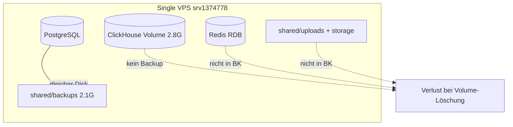

# SynqDrive Master-Admin Control-Plane — VPS Read-Only Production Audit (2026-07)

| Feld | Wert |
|------|------|
| **Audit ID** | `master-admin-vps-readonly-audit-2026-07` |
| **Projekt** | `SYNQDRIVE-alpha` (`FATIHS-MGCKS/SYNQDRIVE-alpha`) |
| **Status** | **IN PROGRESS** — Schritt 15: Backup/Restore/DR Readiness read-only **abgeschlossen** (2026-07-26T07:41–07:46 UTC) |
| **Letzte Prüfung (UTC)** | `2026-07-26T07:46:00Z` (Backup/Restore/DR) |
| **Audit-Modus** | **Strikt read-only** — keine Schreib-, Restart-, Deploy- oder Migrationsaktionen |
| **Ziel-Host** | `srv1374778.hstgr.cloud` (Hostinger VPS) |
| **Öffentliche URL** | `https://app.synqdrive.eu` |
| **Prüfbeginn (UTC)** | `2026-07-26T06:54:37Z` |
| **Prüfkontext (Agent)** | Cursor Cloud Agent, SSH als `root` |
| **Live-Release (Symlink)** | `20260725233142_v4994` |
| **Live-Commit (VPS)** | `4a479c1ef1548b89ed5a06337356248100e0bb00` |
| **Repo `origin/main` (Agent-Workspace)** | `3cdf772b3bdddd78d333a74496ed16929d1ab945` |
| **Commit-Drift VPS ↔ `origin/main`** | **2 Commits hinter** — nur **Docs** (`0a5c6442`, `3cdf772b`); VPS-Commit ist **Ancestor** von `main` |
| **Health (öffentlich)** | `GET https://app.synqdrive.eu/api/v1/health` → **HTTP 200** (`status: ok`) |

---

## 1. Audit Scope

### 1.1 Ziel

Vollständige Erfassung des **tatsächlichen Production-Zustands** der SynqDrive-VPS im Kontext der **Master-Admin-Control-Plane** und Abgleich mit:

- Repository (`SYNQDRIVE-alpha`)
- Deployment-Konfiguration (`vps-deploy-release.sh`, Nginx, PM2, Docker Compose)
- Erwarteter Architektur (Master Admin, RBAC, Tenant-Isolation, Billing, DIMO, Voice AI, Observability)

### 1.2 In Scope (geplant)

| Bereich | Beschreibung |
|---------|--------------|
| Betriebssystem & Ressourcen | Host, Kernel, CPU/RAM/Disk, Uptime |
| Deployment-Topologie | Releases, Symlinks, Build-Artefakte, Commit-Alignment |
| Laufzeit | PM2, Docker-Container, eingebettete Worker/Scheduler |
| Netzwerk & Exposition | Lauschende Ports, Nginx, TLS, Cloudflare-Indikatoren |
| Datenplattform | PostgreSQL, Redis/BullMQ, ClickHouse (nur read-only) |
| Integrationen | DIMO, Stripe/Billing, Resend/E-Mail, Twilio/Voice AI, WhatsApp |
| Master Admin | `/admin/*`-Routen, `MASTER_ADMIN`-Rolle, Platform Permissions, Audit Logging |
| Sicherheit & Compliance | Tenant-Isolation, Datenschutz/ISO-Kontrollen, Backups |

### 1.3 Out of Scope / Nicht-Ziele

- Keine Remediation, kein Deploy, kein Rollback
- Keine funktionalen Write-Smokes (Handover, Upload, Billing-Charges, Webhook-Trigger)
- Keine vollständige Offenlegung von Secrets oder PII in diesem Dokument

### 1.4 Referenz-Audits (Kontext)

| Audit | Relevanz |
|-------|----------|
| `docs/audits/operator-app-vps-control-audit-2026-07.md` | VPS-Baseline, PM2/Docker/Nginx, Queue-Health-Muster |
| `docs/audits/workflow-automation-vps-control-audit-2026-07.md` | Deploy-Drift, Prisma-Migrations-Checks |
| `architecture/VOICE_AI_MASTER_CONTROL_PLANE_UI_2026-07-17.md` | Erwartete Master-Admin Voice-Control-Plane |
| `docs/billing/billing-current-state.md` | Master-Admin-Billing-Erwartungen |

---

## 2. Sicherheitsrahmen

### 2.1 Verbindliche Regeln (aktiv)

| Regel | Status |
|-------|--------|
| Keine Datei-/Konfigurationsänderungen | **Eingehalten** |
| Keine Paketinstallationen | **Eingehalten** |
| Kein Start/Stop/Restart (PM2, Docker, systemd) | **Eingehalten** |
| Keine DB-Migrationen / Prisma write | **Eingehalten** |
| Keine Redis/PostgreSQL/ClickHouse-Schreibzugriffe | **Eingehalten** |
| Keine Queue-Manipulation | **Eingehalten** |
| Keine Webhooks / Test-E-Mails / Rechnungen | **Eingehalten** |
| Secrets nur als **Key-Namen**, nie als Werte | **Eingehalten** |
| HTTP nur GET/HEAD | **Eingehalten** |
| SQL nur SELECT / EXPLAIN / Metadaten | **Eingehalten** (PostgreSQL Schritt 7; ClickHouse Schritt 9) |

### 2.2 Ausgeführte sichere Befehle (Baseline, Schritt 1)

| Zeit (UTC) | Befehl / Aktion | Zweck |
|------------|-----------------|-------|
| 06:54:37 | SSH: `hostname`, `whoami`, `date -u`, `cat /etc/os-release`, `uptime` | Host-Identität |
| 06:54:37 | SSH: `docker --version`, `pm2 --version`, `systemctl --version` | Runtime-Stack |
| 06:54:44 | `curl -sf https://app.synqdrive.eu/api/v1/health` | Öffentliche API-Erreichbarkeit |
| 06:54:44 | Lokal: `git rev-parse HEAD`, `git rev-parse origin/main` | Repo-Referenzstand |
| 06:54:xx | SSH: `ls /opt/synqdrive/`, `readlink -f current`, `ls releases` | Deploy-Layout |
| 06:54:xx | SSH: `pm2 list`, `docker ps --format ...` | Prozesse/Container |
| 06:54:xx | SSH: `ss -tlnp`, `df -h`, `free -h`, `nproc`, `uname -r` | Ressourcen & Ports |
| 06:54:xx | SSH: `git -C /opt/synqdrive/current rev-parse HEAD`, `log -1 --oneline` | Live-Commit |
| 06:54:xx | SSH: `grep ... backend.env \| cut -d= -f1` (Key-Namen only) | Env-Key-Inventar (partial) |
| 06:55:xx | SSH: `systemctl is-active/enabled pm2-root.service` | PM2-Boot-Persistenz |
| 06:55:xx | SSH: `redis-cli ping`, `psql -tAc "SELECT version();"` | Redis/PG-Erreichbarkeit |
| 06:55:01 | `curl -sI https://app.synqdrive.eu/` | HTTP-Header (öffentlich) |

### 2.2b Ausgeführte sichere Befehle (Schritt 2 — Host-Baseline)

| Zeit (UTC) | Befehl / Aktion | Zweck |
|------------|-----------------|-------|
| 06:56:05 | `hostnamectl`, `uname -a`, `uptime`, `timedatectl` | Host-Identität, Kernel, Uptime, Zeit/NTP |
| 06:56:05 | `free -h`, `df -h`, `df -i`, `lsblk`, `mount` | RAM, Disk, Inodes, Blockdevices, Mountpoints |
| 06:56:05 | `id`, `groups`, `ps -e \| wc -l`, Zombie-Scan | Benutzer, Prozessanzahl, Zombies |
| 06:56:05 | `journalctl -k` (OOM-Grep), `dmesg` (OOM-Grep) | OOM-Ereignisse |
| 06:56:05 | `ulimit -a`, `/proc/sys/fs/file-nr`, FD-Top-Prozesse | Ressourcengrenzen, offene FDs |
| 06:56:05 | `docker system df` | Docker-Speicherverbrauch |
| 06:56:05 | `du -sh /var/log`, `/var/log/*` | Log-Verzeichnisgrößen |
| 06:56–06:59 | `du -sh /opt/synqdrive{,/releases,/shared}`, `/var/lib/docker`, `/root/.pm2/logs` | SynqDrive- und Docker-Footprint |
| 06:59:xx | `journalctl -p err --since 24h/7d`, `nproc`, `/proc/loadavg`, `/proc/meminfo` | Systemfehler, CPU-Load, RAM-Details |
| 06:59:xx | `du -sh /opt/synqdrive/shared/*`, Release-Top-8, `journalctl --disk-usage` | Shared-Breakdown, Release-Retention, Journal-Größe |
| 06:59:xx | `sysctl vm.swappiness vm.overcommit_memory`, `ps --sort=-pcpu` | VM-Parameter, Top-CPU-Prozesse |

### 2.2c Ausgeführte sichere Befehle (Schritt 3 — Deployment/Repo)

| Zeit (UTC) | Befehl / Aktion | Zweck |
|------------|-----------------|-------|
| 07:00–07:03 | `git -C /opt/synqdrive/current` `branch`, `rev-parse`, `log -1`, `remote -v`, `status`, `diff`, `ls-files --others` | Git-Zustand Production |
| 07:00–07:03 | `node -v`, `npm -v`, `package.json` version fields | Runtime/Package-Versionen |
| 07:00–07:03 | `stat` Backend `dist/`, `public/`, `prisma/schema.prisma`, `package-lock.json` | Build-Zeitstempel & Lockfiles |
| 07:00–07:03 | `pm2 show synqdrive`, `/root/.pm2/dump.pm2` (script/cwd only) | PM2-Deploy-Pfad |
| 07:00–07:03 | `docker images`, `docker inspect`, `docker compose ps`, `docker system df` | Container-Images/Tags |
| 07:00–07:03 | `find` Env-Dateien, `stat` Permissions, `grep` Key-Namen (maskiert) | Env-Inventar ohne Secret-Werte |
| 07:00–07:03 | `npx prisma migrate status` (read-only) | Schema/Migration-Alignment |
| 07:00–07:03 | Lokal: `git fetch origin main`, `rev-list` VPS↔main, `git log` Drift-Analyse | Remote-Abgleich ohne VPS-Änderung |
| 07:00–07:03 | Lokal: `git fetch origin main`, `rev-list` VPS↔main, `git log` Drift-Analyse | Remote-Abgleich ohne VPS-Änderung |
| 07:00–07:03 | `md5sum vps-deploy-release.sh`, `docker-compose.yml` | Skript-/Compose-Parität Repo↔VPS |

### 2.2d Ausgeführte sichere Befehle (Schritt 4 — Service-Topologie)

| Zeit (UTC) | Befehl / Aktion | Zweck |
|------------|-----------------|-------|
| 07:02–07:04 | `docker ps -a`, `docker stats --no-stream`, `docker images --digests` | Container-Inventar, Ressourcen, Digests |
| 07:02–07:04 | `docker inspect` (Status, Health, Restarts, Mounts, Networks, Env-Key-Namen) | Container-Details ohne Secret-Werte |
| 07:02–07:04 | `pm2 list`, `pm2 describe synqdrive`, `pm2 jlist` (Metadaten only) | PM2-Apps, Mode, Restarts, Pfade |
| 07:02–07:04 | `systemctl show/list-units` (pm2, nginx, postgresql, redis, docker) | systemd-Status |
| 07:02–07:04 | `ps`, `pgrep`, `ss -tlnp` | Doppelte Prozesse, Ports |
| 07:02–07:04 | `crontab -l`, `/etc/cron.d/`, `systemctl list-timers` | Cron vs. BullMQ/Scheduler |
| 07:02–07:04 | `curl -sf` localhost Health/Readiness/Prometheus/Grafana/ClickHouse | Health-Endpoints (GET only) |
| 07:02–07:04 | `/proc/*/mountinfo` ClickHouse | Verifizierung gelöschter Bind-Mounts |

### 2.2e Ausgeführte sichere Befehle (Schritt 5 — Netzwerk/TLS)

| Zeit (UTC) | Befehl / Aktion | Zweck |
|------------|-----------------|-------|
| 07:04–07:06 | `ss -tlnp`, `ss -ulnp` | Alle lauschenden TCP/UDP-Ports |
| 07:04–07:06 | `ufw status`, `nft list ruleset`, `iptables -S` | Firewall-Regeln |
| 07:04–07:06 | `docker network ls/inspect` | Docker-Netzwerksegmentierung |
| 07:04–07:06 | `cat /etc/nginx/sites-available/synqdrive`, `certbot certificates`, `openssl x509` | Reverse Proxy & Zertifikate |
| 07:04–07:06 | `curl -sI` / `curl -sf` öffentlich (GET/HEAD only) | TLS-Header, Redirects, CORS, Endpoints |
| 07:04–07:06 | `openssl s_client` TLS 1.2/1.3 | TLS-Versionen & Cipher |
| 07:04–07:06 | SSH: localhost `curl -sI` Prometheus/Grafana/CH/Metrics | Interne Service-Erreichbarkeit |
| 07:04–07:06 | `grep` SSH/Nginx-Config (keine Secrets) | SSH-Härtung, Proxy-Header |

### 2.2f Ausgeführte sichere Befehle (Schritt 6 — Backend/API & Master-Admin)

| Zeit (UTC) | Befehl / Aktion | Zweck |
|------------|-----------------|-------|
| 07:07:43 | `curl -sf` `GET /api/v1/health`, `GET /api/v1/health/readiness` (öffentlich) | Liveness/Readiness-Runtime |
| 07:07:53 | `curl -s -w %{http_code}` unauth-Probes auf 20+ `/api/v1/admin/*`-Pfade | Master-Admin-Guard-Verhalten ohne Token |
| 07:07:53 | `curl -sI /api/v1/admin/users` | `X-Request-Id`, `X-RateLimit-*`-Header |
| 07:07:53 | `wc -l`, `grep -c` auf `/root/.pm2/logs/synqdrive-{error,out}.log` | Log-Volumen & Fehlerhäufigkeit |
| 07:07:53 | `pm2 describe synqdrive` | Prozess-Uptime, Restarts, Memory |
| 07:07:53 | `curl` `GET /api/v1/metrics` (öffentlich + localhost) | Metrics-Auth |
| 07:08–07:09 | Lokal: Controller-Source-Parsing (`admin/*`-Routen, Guards) | Route-Matrix aus Code |
| 07:09:xx | `curl -sf /docs-json` + Python-Pfadzählung | Live-OpenAPI: 255 Admin-Routen |
| 07:09:xx | `curl -w %{http_code}` `POST /api/v1/auth/seed-admin`, `GET /api/v1/admin/activity-log` | Seed-Admin-Policy, Audit-Route |

### 2.2g Ausgeführte sichere Befehle (Schritt 7 — PostgreSQL read-only)

| Zeit (UTC) | Befehl / Aktion | Zweck |
|------------|-----------------|-------|
| 07:10:35 | `PGOPTIONS='-c default_transaction_read_only=on'` + `psql` Metadaten | Version, Größe, Schema, Constraints, Connections |
| 07:10:35 | `pg_stat_user_tables`, `pg_stat_user_indexes` | Tabellengrößen, Autovacuum, Index-Nutzung |
| 07:10:35 | `SELECT` auf `_prisma_migrations` | Migrationshistorie, Rollbacks |
| 07:10:35 | `npx prisma migrate status` (read-only) | Prisma-Abgleich |
| 07:11–07:12 | `BEGIN READ ONLY` + aggregierte Integritäts-`SELECT`s | Konsistenzprüfungen (Counts only) |
| 07:12:xx | Exakte `COUNT(*)` auf Kern-Tabellen (≤851 Zeilen max) | Validierung pg_stat-Schätzungen |

**SQL-Modus:** Ausschließlich `SELECT`, `EXPLAIN`-fähige Metadatenabfragen und `BEGIN READ ONLY` — **kein** DML/DDL.

### 2.2h Ausgeführte sichere Befehle (Schritt 8 — Redis/BullMQ read-only)

| Zeit (UTC) | Befehl / Aktion | Zweck |
|------------|-----------------|-------|
| 07:12:46 | `redis-cli INFO` (server/memory/stats/persistence/clients/keyspace) | Redis-Runtime-Metriken |
| 07:12:46 | `redis-cli CONFIG GET` (maxmemory, AOF, save, requirepass, tls) | Persistenz & Security-Config |
| 07:12:46 | `ss -tlnp` Port 6379, `redis-cli DBSIZE`, `SCAN` Prefix-Zählung | Exposition & Keyspaces |
| 07:12–07:14 | `LLEN`/`ZCARD`/`LINDEX`/`ZRANGE`/`HGET` auf `bull:{queue}:*` | BullMQ Queue-Counts, älteste Jobs, Fehlergründe (ohne Payloads) |
| 07:12–07:14 | `CLIENT LIST` (flags=b), PM2 `describe synqdrive` | Worker-Blocking / Host-Prozess |
| 07:12–07:14 | PM2 Error-Log Grep `Custom Id cannot contain` | Scheduler/BullMQ-JobId-Fehler |

**Redis-Modus:** Ausschließlich read-only (`INFO`, `SCAN`, `LLEN`, `ZCARD`, `HGET`, `GET`, `CONFIG GET`). **Kein** `DEL`, `FLUSH`, `EXPIRE`, `MIGRATE`, Queue-Manipulation.

### 2.2i Ausgeführte sichere Befehle (Schritt 9 — ClickHouse & Telemetrie-Pipeline read-only)

| Zeit (UTC) | Befehl / Aktion | Zweck |
|------------|-----------------|-------|
| 07:15:04 | `docker exec synqdrive-clickhouse clickhouse-client` `SELECT version()`, `uptime()` | CH-Version & Laufzeit |
| 07:15:04 | `system.tables`, `system.parts`, `system.disks`, `system.merges`, `system.replicas`, `system.mutations` | Schema, Engines, Partitionen, TTL, Parts, Disk, Replikation |
| 07:15:04 | `system.query_log` (aggregiert 24h/7d) | Query-/Insert-Raten, Exceptions |
| 07:15–07:18 | Aggregierte `SELECT` auf `telemetry_*`, `trip_*` (Counts, Freshness, Duplikate, Lags) | Ingestion-Freshness, Datenlücken, Duplikatrate |
| 07:15–07:18 | PostgreSQL `SELECT` (vehicle/dimo_poll_logs Cross-Check, maskierte UUID-Prefixe) | PG↔CH-Abgleich, Pipeline-Aktivität |
| 07:15–07:18 | `redis-cli LLEN/ZCARD` auf `bull:dimo.snapshot.poll:*` | Queue-Stufe der Pipeline |
| 07:15–07:18 | `curl -sf` `GET /api/v1/health/readiness` | CH-Ingestion-Metadaten aus Readiness |

**ClickHouse-Modus:** Ausschließlich `SELECT` über `clickhouse-client` im Container. **Kein** `INSERT`, `ALTER`, `OPTIMIZE`, `SYSTEM`, `TRUNCATE`, `KILL`, Mutationen oder Reparaturen. Unauthentifizierter `curl` auf `127.0.0.1:8123` schlug fehl (Exit 22) — Zugriff nur via `docker exec` (localhost-only Bind).

### 2.2j Ausgeführte sichere Befehle (Schritt 10 — Prometheus/Grafana/Observability read-only)

| Zeit (UTC) | Befehl / Aktion | Zweck |
|------------|-----------------|-------|
| 07:17–07:19 | `curl -sf` Prometheus API (`/api/v1/status/*`, `/targets`, `/rules`, `/alerts`, `/query`) | Version, Targets, Rules, firing Alerts, Metrik-Abdeckung |
| 07:17–07:19 | `curl -sf` Grafana `/api/health`; unauth-Probes `/api/org`, `/api/datasources` | Version, Auth-Gates |
| 07:17–07:19 | `curl -sI` / `curl -s -o /dev/null -w` öffentliche URLs (`/grafana/`, `/prometheus/`, `/api/v1/metrics`) | Exposition vs. SPA-Fallback |
| 07:17–07:19 | `ss -tlnp`, `docker stats`, Config-Dateien (`prometheus.yml`, `alerts.yml`, Grafana provisioning) | Bind, Ressourcen, Datasources (redacted) |
| 07:17–07:19 | `grep` Env-Key-Namen (`ENABLE_SEED_ADMIN`, `GRAFANA_ADMIN_PASSWORD`, `METRICS_BEARER_TOKEN`) | Risiko-Indikatoren ohne Werte |

**Observability-Modus:** Ausschließlich GET/HEAD. **Keine** Alert-/Dashboard-/Datasource-/User-/Token-Änderungen. **Keine** Testalarme.

### 2.2k Ausgeführte sichere Befehle (Schritt 11 — DIMO & Fahrzeugimport read-only)

| Zeit (UTC) | Befehl / Aktion | Zweck |
|------------|-----------------|-------|
| 07:19–07:22 | `grep` Env-Key-Namen (`DIMO_*`) — Werte maskiert | Konfiguration Production vs. Sandbox |
| 07:19–07:22 | PostgreSQL `SELECT` (aggregiert, maskierte UUID/VIN-Prefixe) | Fahrzeug-/DIMO-Mapping, Duplikate, Poll-/Webhook-Logs |
| 07:19–07:22 | ClickHouse `SELECT` letzte Snapshot-Zeiten (maskiert) | Telemetrie-Insert-Freshness |
| 07:19–07:22 | `curl -sf` unauth Admin-Probes (`token-health`, readiness) | API-Guards |
| 07:19–07:22 | Quellcode-Review Import-Pipeline (`registerFromDimo`, `DimoController`, Master UI) | Master-Admin-Importlogik |

**DIMO-Modus:** **Kein** Import, Sync-Trigger, Token-Refresh, Webhook-Trigger, Verbindungstrennung oder Berechtigungsänderung. DIMO MCP war in dieser Session **nicht verfügbar** (Tool-Discovery-Fehler) — Abgleich erfolgte über Env/DB/Code.

### 2.2l Ausgeführte sichere Befehle (Schritt 12 — Stripe/Billing read-only)

| Zeit (UTC) | Befehl / Aktion | Zweck |
|------------|-----------------|-------|
| 07:23–07:28 | `grep` Env-Key-Namen (`STRIPE_*`) — Werte maskiert (Prefix/Länge/Modus) | Production vs. Test, Webhook-Secrets vorhanden/fehlend |
| 07:23–07:28 | PostgreSQL `SELECT` auf `billing_*`, `stripe_*`, `organization_payment_accounts` | Subscriptions, Invoices, Webhooks, Reconciliation, Connect-Mapping |
| 07:23–07:28 | Stripe MCP **read-only** (`get_stripe_account_info`, `GetWebhookEndpoints`, `GetCustomers`, `GetSubscriptions`, `GetInvoices`, `GetAccounts`) | Plattformkonto, Connect, Webhook-Endpoints, Live-Abgleich |
| 07:23–07:28 | `curl -I` / `curl -X POST` (ohne Signatur) Webhook-Routen | Erreichbarkeit ohne Event-Replay |
| 07:23–07:28 | `curl` unauth Admin-Billing-Probes (`/admin/billing/*`) | Guard-Verhalten |
| 07:23–07:28 | Quellcode-Review (`stripe-webhook.service.ts`, `billing-reconciliation.*`, `master-subscription.controller.ts`, `MasterBillingGuard`) | Source of Truth, Idempotenz, Overrides, Berechtigungen |

**Stripe-Modus:** **Keine** Zahlungen, Rechnungsversendung, Subscription-Mutationen, Webhook-Retrigger, Payment Links oder Connect-Onboarding-Änderungen. Stripe MCP ausschließlich GET/list.

### 2.2m Ausgeführte sichere Befehle (Schritt 13 — IAM, Rollen, Tenant Isolation, Impersonation read-only)

| Zeit (UTC) | Befehl / Aktion | Zweck |
|------------|-----------------|-------|
| 07:29–07:34 | PostgreSQL `SELECT` (aggregiert) auf `users`, `organization_memberships`, `user_mfa_*`, `refresh_tokens`, `activity_logs`, `support_tickets` | Rollenverteilung, MFA, Sessions, Audit ohne PII |
| 07:29–07:34 | `grep` Env-Key-Namen (`JWT_*`, `IAM_*`, `MFA_*`, `ENABLE_SEED_ADMIN`) — Werte **nicht** ausgelesen | Token-Lifetime, MFA-Flags, Seed-Admin |
| 07:29–07:34 | `curl` unauth Probes (`/admin/users`, `/admin/organizations`, `/admin/activity-log`, Org-Route mit Fake-UUID) | Guard-Verhalten ohne Token |
| 07:29–07:34 | Quellcode-Review: `RolesGuard`, `OrgScopingGuard`, `PermissionsGuard`, `StepUpGuard`, `MasterBillingGuard`, `auth.guard.ts`, `refresh-token.service.ts`, `iam-mfa.policy.ts`, Controller-Matrix | Berechtigungsmodell, Impersonation, Tenant-Scope |

**IAM-Modus:** **Keine** Rollenänderungen, Sessions, Tokens, Impersonation, Sperren/Entsperren oder MFA-Enrollment.

### 2.2n Ausgeführte sichere Befehle (Schritt 14 — Audit Logging, Datenschutz, ISO read-only)

| Zeit (UTC) | Befehl / Aktion | Zweck |
|------------|-----------------|-------|
| 07:35–07:40 | PostgreSQL `SELECT` aggregiert auf `activity_logs`, `*_audit_*`, Outbox-Tabellen, DSAR/Legal-Hold | Feldabdeckung, kritische Aktionen, Retention-Nachweise |
| 07:35–07:40 | `grep` Env-Key-Namen/Boolean-Flags (`DATA_RETENTION_*`, `IAM_DATA_RETENTION_*`, `AI_AUDIT_*`, `HTTP_LOG_SUCCESS`) — **keine** Secrets | Retention-/Privacy-Konfiguration |
| 07:35–07:40 | Quellcode-Review: `AuditInterceptor`, `AuditService`, `ActivityLogService`, `BillingAuditService`, `IamDsarExportService`, Retention-Worker, PII-Scrubbing | Architektur, Lücken, Löschbarkeit |
| 07:35–07:40 | Backup-Count (`ls` nur Anzahl `.sql.gz`) | Backup-Monitoring (ohne Restore) |

**Audit-Modus:** **Keine** Audit-Logs geändert oder gelöscht, **keine** DSAR-Exports oder Löschungen ausgelöst, **keine** vollständige PII-Dokumentation.

### 2.2o Ausgeführte sichere Befehle (Schritt 15 — Backup/Restore/DR read-only)

| Zeit (UTC) | Befehl / Aktion | Zweck |
|------------|-----------------|-------|
| 07:28–07:31 | `ls`/`stat`/`du`/`gzip -t` auf `/opt/synqdrive/shared/backups/*.sql.gz` (Metadaten + Integritätsprüfung, **kein** Dump-Inhalt) | PG-Backup-Inventar, Alter, Größe, Permissions |
| 07:28–07:31 | `redis-cli INFO persistence`, `stat /var/lib/redis/dump.rdb` | Redis-RDB-Persistenz |
| 07:28–07:31 | `docker inspect synqdrive-clickhouse`, `docker volume inspect`, `du` CH-Volume | ClickHouse-Speicherort, Mounts, Größe |
| 07:28–07:31 | `ls`/`stat`/`du` auf `shared/uploads`, `shared/storage`, `shared/grafana`, `shared/prometheus` | Dateispeicher & Observability-Config |
| 07:28–07:31 | `grep` Env-Key-Namen (`DOCUMENT_STORAGE_*`, `S3_*`, `AWS_*`) — **keine** Werte | Dokumentenspeicher-Provider |
| 07:28–07:31 | `crontab -l`, `systemctl list-timers`, `grep pg_dump /var/log/auth.log`, `journalctl` (Backup-Fail-Grep) | Zeitplan, letzte Ausführung, Fehler-Logs |
| 07:28–07:31 | `which rclone/aws/s3cmd`, `mount`, Nginx-`grep backup`, `curl -sI` `/backups/` `/uploads/` (öffentlich) | Offsite, Web-Exposition |
| 07:28–07:31 | Quellcode-Review: `vps-deploy-release.sh`, `clickhouse-backup-local.sh`, `docker-compose.yml`, Runbooks, `alerts.yml` | Backup-Methode, Retention, Restore-Doku |
| 07:30:49 | **Abweichung:** versehentlich `mkdir -p …/clickhouse/backups` (leeres Verzeichnis) während Pfad-Prüfung — **kein** Backup/Restore | Siehe Kap. 24.1 |

**Backup/DR-Modus:** **Kein** `pg_dump`, **kein** ClickHouse-`BACKUP`, **kein** Restore, **keine** Snapshot-Erstellung/-Löschung, **keine** Backup-Datei verändert. `gzip -t` und `stat`/`ls` nur auf Metadaten.

### 2.3 Bewusst nicht geprüft (Schritt 1)

| Bereich | Grund |
|---------|-------|
| `.env`-Werte / `shared/*.txt` Secret-Dateien | Secret-Exposure-Risiko |
| PM2 `jlist` vollständig | Enthält Umgebungsvariablen — nur `pm2 list` verwendet |
| Authentifizierte Master-Admin-UI/API-Smokes | Erfordert Credentials; separates, kontrolliertes Vorgehen |
| PostgreSQL-Dateninhalte (Counts, Tenant-Queries) | Geplant in späteren Schritten (nur SELECT) |
| BullMQ-Queue-Inspektion (Redis KEYS/LLEN) | Geplant — nur read-only Redis-Befehle |
| ~~ClickHouse-Queries~~ | **Erledigt** (Schritt 9) — nur SELECT |
| Stripe/Twilio/Resend/DIMO Live-API-Calls | Externe Seiteneffekte — nur Konfigurationsabgleich |
| Log-Tailing mit PII | Geplant mit Redaction-Policy |

---

## 3. VPS- und Betriebssystemübersicht

**Prüfzeitpunkt:** `2026-07-26T06:56:05Z` (Schritt 2, read-only)

### 3.1 Identität und Hardware

| Attribut | Ist-Wert |
|----------|----------|
| **Static Hostname** | `srv1374778` |
| **FQDN (SSH-Ziel)** | `srv1374778.hstgr.cloud` |
| **Chassis** | VM (`computer-vm`) |
| **Virtualisierung** | KVM / QEMU (`Standard PC _i440FX + PIIX`) |
| **Hardware Vendor** | QEMU |
| **Machine ID** | `0cda11d4e23a44809e2161b6e99479c5` |
| **Boot ID** | `966fa62f5737494494b5fe4ffbfbf6f9` |
| **Betriebssystem** | Ubuntu **24.04.4 LTS** (Noble Numbat) |
| **Kernel** | `6.8.0-134-generic` (#134-Ubuntu SMP PREEMPT_DYNAMIC, 2026-06-26) |
| **Architektur** | **x86-64** (`x86_64`) |
| **Audit-Benutzer** | `root` (`uid=0`, `gid=0`, Gruppe: `root`) |

### 3.2 Laufzeit und Zeit

| Attribut | Ist-Wert |
|----------|----------|
| **Uptime** | **9 Tage, 15h 41min** (seit letztem Boot) |
| **Angemeldete User** | 1 |
| **Load Average (1/5/15 min)** | `0.08 / 0.09 / 0.09` (idle); während `du`-Scan kurz `1.42 / 0.77 / 0.36` |
| **Zeitzone** | `Etc/UTC` (UTC, +0000) |
| **Systemzeit** | `2026-07-26T06:56:05Z` |
| **NTP-Dienst** | **active** (`systemd-timesyncd`) |
| **Uhr synchron** | **ja** (`System clock synchronized: yes`) |
| **NTP-Server** | `ntp.ubuntu.com` (Stratum 2, Jitter 241 µs, PacketCount 47) |
| **RTC in local TZ** | nein |

### 3.3 CPU und RAM

| Attribut | Ist-Wert | Bewertung |
|----------|----------|-----------|
| **CPU-Anzahl** | **4** vCPU | — |
| **RAM total** | **15.6 GiB** (16 376 016 kB) | — |
| **RAM used** | **2.8 GiB** | niedrig |
| **RAM available** | **~12.9 GiB** (13 523 480 kB) | gesund |
| **Buffers + Cached** | ~1.3 GiB + ~5.8 GiB | normal |
| **Swap total** | **0 B** | siehe Finding MA-VPS-P2-001 |
| **Swap used** | **0 B** | kein Swap-Druck |
| **vm.swappiness** | 60 | irrelevant ohne Swap |
| **vm.overcommit_memory** | 0 (heuristisch) | Standard |

**Top-CPU-Prozesse (Momentaufnahme):**

| PID | %CPU | %MEM | RSS | Prozess |
|-----|------|------|-----|---------|
| 54861 | 8.8 | 4.0 | 654 MB | `clickhouse-server` |
| 2399590 | 2.2 | 2.9 | 467 MB | `node` (`synqdrive`) |
| 858 | 0.3 | 0.1 | 23 MB | `redis-server` |

### 3.4 Speicher und Dateisysteme

| Mount | FS | Größe | Belegt | Verfügbar | Use% | Inodes IUse% |
|-------|-----|-------|--------|-----------|------|--------------|
| `/` | ext4 (`/dev/sda1`) | 193 GiB | 53 GiB | 141 GiB | **28 %** | **13 %** |
| `/boot` | ext4 (`/dev/sda16`) | 881 MiB | 117 MiB | 703 MiB | 15 % | 2 % |
| `/boot/efi` | vfat (`/dev/sda15`) | 105 MiB | 6.2 MiB | 99 MiB | 6 % | — |
| `tmpfs` `/run` | tmpfs | 1.6 GiB | 1.7 MiB | 1.6 GiB | 1 % | 1 % |
| `tmpfs` `/dev/shm` | tmpfs | 7.9 GiB | 3.1 MiB | 7.9 GiB | 1 % | 1 % |

**Blockdevices (`lsblk`):** `sda` 200 GiB — Partitionen `sda1` (199 GiB root), `sda14`–`sda16` (boot/efi). Zusätzlich mehrere **snap**-Loop-Devices (Chromium, GNOME, Mesa etc.).

**Kapazitäts-Footprint (Schritt 2):**

| Pfad | Größe | Anmerkung |
|------|-------|-----------|
| `/opt/synqdrive` gesamt | **38 GiB** | Hauptverbraucher auf `/` |
| `/opt/synqdrive/releases` | **36 GiB** | 29 Releases à ~1.3 GiB |
| `/opt/synqdrive/shared` | **2.0 GiB** | Backups 2.0 GiB, Storage 6.1 MiB, Uploads 2.4 MiB |
| `/var/lib/docker` | **4.7 GiB** | Images 2.1 GiB + Volumes 3.1 GiB |
| `/var/log` | **112 MiB** | Journal 75 MiB |
| `/root/.pm2/logs` | **201 MiB** | Rotierte synqdrive-Logs (pm2-logrotate aktiv) |
| systemd Journal (gesamt) | **66.1 MiB** | kompakt |

### 3.5 Prozesse und Stabilität

| Attribut | Ist-Wert |
|----------|----------|
| **Laufende Prozesse** | **170** |
| **Zombie-Prozesse** | **1** — `clickhouse-clie` (defunct), PPID `54861` (`clickhouse-server`) |
| **OOM-Ereignisse (journal/dmesg)** | **0** — keine Treffer |
| **Kernel-Fehler (7 Tage)** | **0** (`journalctl -k -p err`) |
| **System-Fehler (24h)** | **1** — SSH preauth parse error (siehe unten) |
| **Offene File Descriptors (systemweit)** | **3712** allocated / max ~9.2e18 (`/proc/sys/fs/file-nr`) |
| **FD-Top-Prozess** | `clickhouse-server` — **452** FDs |
| **Shell ulimit open files** | **1024** (interaktive root-Session) |

**SSH-Fehler (24h, 1 Zeile):** `sshd: fatal: userauth_pubkey: parse publickey packet: incomplete message [preauth]` — typisch für Scanner/Bot; kein Host-Instabilitätsindikator.

### 3.6 Docker-Speicher (`docker system df`)

| Typ | Total | Active | Size | Reclaimable |
|-----|-------|--------|------|-------------|
| Images | 3 | 3 | 2.07 GiB | 2.07 GiB (100 %)* |
| Containers | 3 | 3 | 1.27 MiB | 0 B |
| Local Volumes | 5 | 3 | 3.09 GiB | 0 B |
| Build Cache | 0 | 0 | 0 B | 0 B |

\* Reclaimable 100 % bedeutet, dass alle Images referenziert sind — kein toter Image-Ballast erkennbar.

### 3.7 Host-Baseline-Bewertung (Schritt 2)

| Risikodimension | Urteil | Begründung |
|-----------------|--------|------------|
| **Ressourcenknappheit (RAM)** | **Niedrig** | ~83 % RAM verfügbar; keine Swap-Nutzung |
| **Festplattenrisiko** | **Mittel (langfristig)** | Aktuell 28 %; **36 GiB Release-Retention** ohne sichtbare Prune-Policy wächst ~1.3 GiB/Deploy |
| **Swap-Druck** | **Keiner** | Swap 0 B; aber auch **kein Swap-Puffer** bei RAM-Spitzen |
| **CPU-Druck** | **Niedrig** | Load << 4 Kerne im Idle; kurzer Spike während Audit-`du` |
| **Zeitabweichung** | **Keine** | NTP aktiv und synchron |
| **Logwachstum** | **Niedrig** | `/var/log` 112 MiB; PM2 201 MiB mit Rotation |
| **OOM-Risiko** | **Mittel (latent)** | Kein Swap + kein historisches OOM; bei RAM-Spitze harter Kill möglich |
| **Host-Instabilität** | **Niedrig** | 9d Uptime, 0 Kernel-Errors/7d, 0 OOM; 1 harmloser Zombie |

**Status:** Host-Baseline **abgeschlossen**. Noch ausstehend in diesem Kapitel: `ufw`/Firewall, fail2ban, unattended-upgrades.

---

## 4. Deployment-Topologie

**Prüfzeitpunkt:** `2026-07-26T07:00–07:03Z` (Schritt 3, read-only)

### 4.1 Pfad und Release-Mechanismus

| Attribut | Ist-Wert |
|----------|----------|
| **Deploy-Root** | `/opt/synqdrive` |
| **Aktiver Pfad** | `/opt/synqdrive/current` → `/opt/synqdrive/releases/20260725233142_v4994` |
| **Symlink gesetzt** | `2026-07-25T23:35:32Z` |
| **Deploy-Muster** | Immutable Git-Clone pro Release + Symlink-Switch + `pm2 restart` |
| **Deploy-Skript (live)** | `backend/scripts/ops/vps-deploy-release.sh` |
| **Skript-MD5 (VPS = Repo)** | `8d9ddb5bebdbc25451804da4384c67f0` — **identisch** |
| **Parallele Projekt-Kopien** | Nur unter `/opt/synqdrive/releases/` (**29** Dirs); kein zweites `/opt/*synq*` |
| **Aktive Laufzeit** | PM2 `cwd` = `/opt/synqdrive/releases/20260725233142_v4994/backend` (via `current`) |

### 4.2 Git-Zustand (Production-Release)

| Attribut | Ist-Wert |
|----------|----------|
| **Git-Repo vorhanden** | **Ja** — vollständiges `.git` im Release (shallow) |
| **Nur Build-Artefakte** | **Nein** — Source + `node_modules` + Builds |
| **Branch** | `main` |
| **Commit (HEAD)** | `4a479c1ef1548b89ed5a06337356248100e0bb00` |
| **Commit-Zeit** | `2026-07-25T23:30:48Z` |
| **Commit-Message** | `merge(main): resolve ChangesView conflict for operator V4.9.839 entry` |
| **Remote** | `origin` → `https://github.com/FATIHS-MGCKS/SYNQDRIVE-alpha.git` |
| **Shallow Clone** | **Ja** (`rev-parse --is-shallow-repository` = true) |
| **Tracked Änderungen** | **Keine** (`git diff` leer) |
| **Untracked** | **1×** `backend/uploads` (Symlink → `shared/uploads`, erwartet) |
| **Lokale Hotfixes** | **Keine** in getrackten Dateien nachweisbar |

### 4.3 Abgleich Production ↔ `origin/main`

| Metrik | Wert |
|--------|------|
| **`origin/main` (2026-07-26 Audit)** | `3cdf772b` — `docs(operator): update audits for Gate 12 PASS on VPS` |
| **VPS ist Ancestor von main** | **Ja** |
| **Commits auf main nach VPS** | **2** (nur Dokumentation) |
| **Commits auf VPS nicht auf main** | **0** |
| **Code-Drift** | **Keiner** — fehlende Commits sind `docs/audits/*` only |

Fehlende Commits auf VPS:

| Commit | Datum | Inhalt |
|--------|-------|--------|
| `0a5c6442` | 2026-07-25 | `docs(operator): record production deploy V4.9.840 and Gate 12 closure` |
| `3cdf772b` | 2026-07-25 | `docs(operator): update audits for Gate 12 PASS on VPS` |

### 4.4 Alte Releases und Branch-Mix

| Kategorie | Anzahl | Anmerkung |
|-----------|--------|-----------|
| Releases gesamt | **29** | ~36 GiB unter `releases/` |
| `_v4994` Releases | **22** | Standard-Deploy-Suffix |
| `_data-auth-rc` Releases | **7** | Ältere RC-Deploys (z. B. `6080dbd2`) noch auf Disk |
| Env in alten Releases | Symlinks | Alle geprüften `.env` → `/opt/synqdrive/shared/backend.env` |

**Kein** paralleler aktiver Service aus altem Release — PM2 zeigt ausschließlich `current`.

### 4.5 Runtime-Konfiguration

| Artefakt | Pfad / Details |
|----------|----------------|
| **PM2** | Kein `ecosystem.config.js`; Prozess via `pm2 restart synqdrive` / `dump.pm2` |
| **PM2 Script** | `/opt/synqdrive/current/backend/dist/src/main.js` |
| **PM2 erstellt** | `2026-07-25T23:36:33Z` |
| **systemd** | `/etc/systemd/system/pm2-root.service` — `LimitNOFILE=infinity`, `pm2 resurrect` |
| **Docker Compose (Repo)** | `backend/docker-compose.yml` — MD5 `ebd305b6344b7b8232d0dc1b3ca1734d` (VPS = Repo) |
| **Compose lokal aktiv** | Nur `synqdrive-clickhouse` via `docker compose ps` |
| **Postgres/Redis** | **Host-native** (nicht Docker) — PG 16.14, Redis 7.0.15 |
| **Prometheus/Grafana** | Separate Container (`--profile monitoring` / manuell); **nicht** in laufendem Compose-PS |

### 4.6 Docker-Images (keine `latest`-Tags)

| Image | Tag | Container | Seit |
|-------|-----|-----------|------|
| `clickhouse/clickhouse-server` | **25.8** | `synqdrive-clickhouse` | 2026-07-17 |
| `prom/prometheus` | **v2.54.1** | `synqdrive-prometheus` | 2026-07-08 |
| `grafana/grafana` | **11.2.0** | `synqdrive-grafana` | 2026-07-17 |

`postgres:16-alpine` / `redis:7-alpine` in Compose definiert, auf VPS **nicht** als Container aktiv.

### 4.7 Environment-Dateien (Pfade, Rechte, Keys — Werte maskiert)

| Datei | Owner | Mode | Keys | Anmerkung |
|-------|-------|------|------|-----------|
| `/opt/synqdrive/shared/backend.env` | root:root | **644** | **267** Variablennamen | **Weltlesbar** — siehe MA-DEP-P2-001 |
| `/opt/synqdrive/shared/frontend.env` | root:root | **600** | 4 (`VITE_*`) | OK |
| `current/backend/.env` | Symlink | → shared | — | Korrekt |
| `current/frontend/.env` | Symlink | → shared | — | Korrekt |
| Alte Release-`.env` | Symlink | → shared | — | Kein divergierendes Env pro Release |
| `shared/staging-verification/.../kill-switch.env` | — | — | — | Staging-Artefakt, nicht aktiv gebunden |

**Kritische Keys (alle `present`, Werte maskiert):** `NODE_ENV`, `APP_URL`, `BASE_URL`, `DATABASE_URL`, `REDIS_HOST`, `CLERK_*`, `STRIPE_SECRET_KEY`, `STRIPE_WEBHOOK_SECRET`, `DIMO_CLIENT_ID`, `DIMO_PRIVATE_KEY`, `CLICKHOUSE_URL`, `JWT_SECRET`, `AUTH_PROVIDER`, `RESEND_API_KEY`, `TWILIO_ACCOUNT_SID`.

**Staging/Test-Key-Namen vorhanden (Werte nicht ausgewertet):** `VOICE_AI_PROVISIONING_STAGING_ENABLED`, `VOICE_E2E_ORG_ID`, `VOICE_TWILIO_SUB_ORG_VOICE_STAGING_E2E`, `EUROMASTER_ENVIRONMENT`, Kommentar zu Grafana-localhost-Tunnel. Keine offensichtliche `localhost`-Wert-Leakage in Key-Namen; **Flag-Werte** separat zu prüfen (manuell/authentifiziert).

### 4.8 Node-/Toolchain

| Tool | Version (VPS) |
|------|---------------|
| Node.js | **v22.23.1** |
| npm | **10.9.8** |
| pnpm / yarn | **nicht installiert** |

**Status:** Deployment-Topologie **abgeschlossen** (Schritt 3).

---

## 5. Repository- und Buildzustand

**Prüfzeitpunkt:** `2026-07-26T07:00–07:03Z`

### 5.1 Package-Versionen (Release-Tree)

| Komponente | `package.json` Version |
|------------|------------------------|
| Backend | `synqdrive-backend` **0.1.0** |
| Frontend | `frontend` **0.0.0** |

### 5.2 Build-Artefakte und Zeitstempel (Release `20260725233142_v4994`)

| Artefakt | Pfad | Build-Zeit (UTC) |
|----------|------|------------------|
| Backend Entry | `backend/dist/src/main.js` | **2026-07-25T23:34:06Z** |
| Frontend SPA | `backend/public/index.html` | **2026-07-25T23:35:31Z** |
| Frontend Main Bundle | `backend/public/assets/index-CXuX1Er0.js` (14.7 MiB) | **2026-07-25T23:35:31Z** |
| Prisma Schema | `backend/prisma/schema.prisma` | Clone-Zeit 23:31:51Z |
| package-lock backend | `backend/package-lock.json` | 23:31:51Z |
| package-lock frontend | `frontend/package-lock.json` | 23:31:51Z |

**Vite `outDir`:** `../backend/public` — Frontend wird in Backend `public/` gebaut (kein `frontend/dist/`).

### 5.3 Release-interne Konsistenz

| Prüfpunkt | Ergebnis |
|-----------|----------|
| FE + BE selbes Release | **JA** — beide unter `20260725233142_v4994`, Build-Fenster 23:34–23:35Z |
| Worker selbes Release | **JA** — embedded in PM2-Monolith, gleicher `dist/` |
| Prisma Schema ↔ DB | **JA** — `prisma migrate status`: **276** Migrationen, „Database schema is up to date!“ |
| Monitoring ↔ Release | **Teilweise** — `shared/prometheus/prometheus.yml` **2026-07-25**; Grafana-Provisioning **2026-07-08** |
| Alte Container-Version | **Nein** — alle 3 Images mit festen Tags, passend zu Compose/History |
| Parallele veraltete App-Services | **Nein** — nur ein PM2 `synqdrive` |

### 5.4 Versions- und Konsistenzmatrix

| Komponente | Production Commit/Version | Erwarteter Stand | Abweichung | Risiko |
|------------|---------------------------|------------------|------------|--------|
| **Git HEAD** | `4a479c1e` @ `main` | `origin/main` `3cdf772b` | **2 Docs-Commits** hinter main | **P3** — kein Code-Drift |
| **Deploy-Skript** | MD5 `8d9ddb5b` | Repo identisch | Keine | **OK** |
| **docker-compose.yml** | MD5 `ebd305b6` | Repo identisch | Keine | **OK** |
| **Backend Build** | `dist/main.js` 23:34:06Z | Selbes Release | Keine | **OK** |
| **Frontend Build** | `index-CXuX1Er0.js` 23:35:31Z | Selbes Release | Keine | **OK** |
| **Worker/Scheduler** | PM2 → `current/backend/dist` | Selbes Release | Keine | **OK** |
| **Prisma/Migrations** | 276 applied, up to date | Passend zu Backend-Commit | Keine | **OK** |
| **Node.js Runtime** | 22.23.1 | Repo nicht gepinnt | Unbekannt vs. CI | **Beobachtung** |
| **ClickHouse Image** | `25.8` | Compose `25.8` | Keine | **OK** |
| **Prometheus Image** | `v2.54.1` | Compose `v2.54.1` | Keine | **OK** |
| **Grafana Image** | `11.2.0` | Nicht in Compose-Datei | Manuell deployt | **P3** — dokumentieren |
| **Postgres** | Host 16.14 | Compose definiert 16-alpine (dev) | VPS nutzt Host-PG | **Beobachtung** — erwartetes Prod-Layout |
| **Redis** | Host 7.0.15 | Compose definiert 7-alpine (dev) | VPS nutzt Host-Redis | **Beobachtung** |
| **backend.env Rechte** | `644` root:root | Empfohlen `600` | Weltlesbar | **P2** |
| **Git Working Tree** | Clean (1 untracked symlink) | Clean | Kein Hotfix | **OK** |
| **Release-Retention** | 29 Releases / 36 GiB | Prune-Policy empfohlen | 7× `data-auth-rc` alt | **P2** (Host-Finding) |
| **Staging-Env-Flags** | Key-Namen vorhanden | Prod-only empfohlen | Werte nicht verifiziert | **P2** — manuell prüfen |
| **Monitoring Config** | Prometheus 07-25, Grafana 07-08 | Release-aligned | Grafana älter | **P3** |

### 5.5 Manuelle Production-Änderungen

| Indikator | Befund |
|-----------|--------|
| `git diff` (tracked) | **Leer** — keine gepatchten Quelldateien |
| Abweichende `.env` pro Release | **Nein** — zentral `shared/` |
| PM2-Script außerhalb `current` | **Nein** |
| Hotfix-Artefakte | **Nicht** festgestellt |

**Status:** Repository- und Build-Abgleich **abgeschlossen** (Schritt 3).

---

## 6. Container, Prozesse und Service-Topologie

**Prüfzeitpunkt:** `2026-07-26T07:02–07:04Z` (Schritt 4, read-only)

### 6.1 Architekturübersicht

| Service | Kategorie | Runtime | Version | Port(s) | Health | Restart Count | Abhängigkeiten | Risiko |
|---------|-----------|---------|---------|---------|--------|---------------|----------------|--------|
| **SynqDrive SPA** | Frontend | PM2/Node (`backend/public/`) | Build `index-CXuX1Er0.js` / Commit `4a479c1e` | **3001** (via Nginx 443) | **200** `/api/v1/health` | PM2 **3169**† / unstable **0** | Backend API | **P3**† |
| **SynqDrive API** | Backend API | PM2 **fork** ×1 | `synqdrive-backend` **0.1.0**, Node **22.23.1** | **3001** (`*:3001`) | **200** health; **ok** `/api/v1/health/readiness` | PM2 **3169**† / unstable **0** | PostgreSQL, Redis, ClickHouse | **P3**† |
| **BullMQ Workers** | Worker | Embedded in PM2 `synqdrive` | Commit `4a479c1e` | — (Redis queues) | via Readiness `redis: ok` | — | Redis, PostgreSQL | **OK** — kein separater Prozess |
| **NestJS Scheduler** | Scheduler | Embedded (`ScheduleModule`) | Commit `4a479c1e` | — | — | — | PostgreSQL, Redis | **OK** — kein OS-Cron für SynqDrive |
| **PostgreSQL** | PostgreSQL | systemd `postgresql@16-main` | **16.14** | **127.0.0.1:5432** | `SELECT 1` **ok** | systemd **0** | — | **SPOF** — Single Instance |
| **Redis** | Redis | systemd `redis-server` | **7.0.15** | **127.0.0.1:6379** | **PONG** | systemd **0** | — | **SPOF** — Single Instance |
| **ClickHouse** | ClickHouse | Docker Compose (`backend` project) | **25.8** `sha256:0fa33…` | **127.0.0.1:8123/9000** | Docker **healthy**; ping **200** | Docker **0** | — | **P1** — Bind-Mounts auf **gelöschtes** Release |
| **Prometheus** | Prometheus | Docker **host network** (manuell) | **v2.54.1** `sha256:f663…` | **127.0.0.1:9090** | `/-/healthy` **200** | Docker **0** | Backend metrics | **P2** — kein Compose-Label, kein Healthcheck |
| **Grafana** | Grafana | Docker **host network** (manuell) | **11.2.0** `sha256:408a…` | **127.0.0.1:3000** | `/api/health` **200** | Docker **0** | Prometheus | **P2** — kein Compose-Label, kein Healthcheck |
| **Nginx** | Reverse Proxy | systemd `nginx.service` | **1.24.0** | **80/443** (public) | active **running** | systemd **0** | Backend :3001 | **SPOF** — einziger Ingress |
| **PM2 God Daemon** | sonstige | systemd `pm2-root.service` | PM2 **7.0.1** | — | active **running** | systemd **0** | — | **SPOF** — trägt gesamte App |
| **pm2-logrotate** | Logging | PM2 Modul | **3.0.0** | — | online | **0** | PM2 | **OK** |
| **Certbot** | sonstige | systemd timer | — | — | timer **active** | — | Nginx TLS | **OK** |
| **Tunnel (cloudflared/tailscale)** | Tunnel | — | — | — | — | — | — | **Nicht vorhanden** |

† PM2 `restarts=3169` kumulativ über Deploy-Historie; **`unstable_restarts=0`** — aktuell **kein Crash-Loop** (Uptime ~7h seit letztem Deploy).

### 6.2 Docker — Detailinventar

#### Laufende Container (3)

| Name | Image:Tag | Digest (kurz) | Gestartet | Status | Health | Restarts | Network | Port-Mapping |
|------|-----------|---------------|-----------|--------|--------|----------|---------|--------------|
| `synqdrive-clickhouse` | `clickhouse/clickhouse-server:25.8` | `sha256:0fa332a9…` | 2026-07-17T12:18:39Z | running | **healthy** | **0** | `backend_default` (172.18.0.2) | `127.0.0.1:8123`, `127.0.0.1:9000` |
| `synqdrive-prometheus` | `prom/prometheus:v2.54.1` | `sha256:f6639335…` | 2026-07-16T15:14:24Z | running | **none** | **0** | **host** | `127.0.0.1:9090` (host PID 1709) |
| `synqdrive-grafana` | `grafana/grafana:11.2.0` | `sha256:408afb97…` | 2026-07-25T08:36:28Z | running | **none** | **0** | **host** | `127.0.0.1:3000` (host PID 2222425) |

#### Gestoppte / verwaiste Container

| Prüfpunkt | Ergebnis |
|-----------|----------|
| `docker ps -a --filter status=exited` | **0** — keine gestoppten Container |
| Doppelte Container-Namen | **Keine** |
| `latest`-Tags | **Keine** — alle Tags gepinnt |

#### Docker Compose

| Attribut | Ist-Wert |
|----------|----------|
| Compose-Datei (Release) | `/opt/synqdrive/current/backend/docker-compose.yml` |
| Compose-Projekt (ClickHouse) | `backend` / Service `clickhouse` |
| Profiles (Repo) | `monitoring` für Prometheus — **nicht** für laufende Prom/Graf-Container verwendet |
| `docker compose ls` | Nicht verfügbar (ältere Docker-CLI) |
| Mehrfach gestartete Stacks | **Nein** — ein ClickHouse-Compose-Stack |
| Postgres/Redis in Compose | Definiert, auf VPS **host-native** statt Container |

#### Container-Ressourcen & Limits

| Container | CPU % | RAM | NanoCpus Limit | Memory Limit | Log Driver |
|-----------|-------|-----|----------------|--------------|------------|
| clickhouse | ~5% | **824 MiB** | **0** (unlimited) | **0** (unlimited) | `json-file` max-size **50m**, max-file **3** |
| prometheus | ~0% | **87 MiB** | **0** | **0** | `json-file` (keine Rotation-Opts) |
| grafana | ~0.06% | **70 MiB** | **0** | **0** | `json-file` (keine Rotation-Opts) |

**Fehlende Healthchecks:** Prometheus, Grafana (Docker-level). ClickHouse hat Healthcheck.

**Fehlende Resource Limits:** Alle 3 Container (kein CPU/Memory cap).

#### ClickHouse — kritische Mount-Abweichung (MA-TOPO-P1-001)

Bind-Mounts zeigen noch auf **gelöschtes** Release `20260717111944_v4994` (Verzeichnis **existiert nicht mehr**):

| Mount-Ziel | Quell-Pfad (konfiguriert) | Status |
|------------|---------------------------|--------|
| `/etc/clickhouse-server/config.d/*.xml` | `releases/20260717111944_v4994/backend/docker/clickhouse/...` | **`//deleted`** in mountinfo |
| `/backups` | `releases/20260717111944_v4994/backend/storage/clickhouse/backups` | **`//deleted`** |

Container läuft seit 8 Tagen mit **Ghost-Inodes**; bei `docker restart`/Recreate würden Mounts **fehlschlagen**. Daten-Volume `backend_clickhouse_data` ist intakt.

#### Prometheus/Grafana — manueller Betrieb

| Attribut | Prometheus | Grafana |
|----------|------------|---------|
| Compose-Labels | **Keine** | **Keine** |
| NetworkMode | **host** | **host** |
| RestartPolicy | `unless-stopped` | `unless-stopped` |
| Config-Mounts | `shared/prometheus/{prometheus.yml,alerts.yml,secrets}` | `shared/grafana/{provisioning,dashboards}` |
| Env-Keys (maskiert) | nur `PATH` | `GF_*`, `GF_SECURITY_ADMIN_*` (Werte nicht dokumentiert) |
| Bootstrap-Skript | `vps-setup-prometheus.sh` / `vps-refresh-monitoring.sh` | `vps-setup-grafana.sh` / `vps-refresh-monitoring.sh` |

### 6.3 PM2 — Detail

| App | Mode | Instances | PID | Uptime | Restarts | unstable | Memory | Script | CWD | Interpreter |
|-----|------|-----------|-----|--------|----------|----------|--------|--------|-----|-------------|
| `synqdrive` | **fork** | 1 | 2399590 | ~7h | **3169** | **0** | ~467 MiB | `…/current/backend/dist/src/main.js` | `…/current/backend` | node **22.23.1** |
| `pm2-logrotate` | fork | 1 | 1182 | ~9d | 0 | 0 | ~51 MiB | pm2-logrotate module | — | node |

| Prüfpunkt | Ergebnis |
|-----------|----------|
| Doppelte `dist/src/main.js` Prozesse | **1** — kein Duplikat |
| Cluster-Mode | **Nein** — `fork_mode` |
| `ecosystem.config.js` | **Nicht** verwendet |
| Environment Name | default namespace |

### 6.4 systemd — relevante Units

| Unit | Active | Sub | Since | NRestarts | Rolle |
|------|--------|-----|-------|-----------|-------|
| `pm2-root.service` | active | running | 2026-07-16T15:14:23Z | **0** | PM2 resurrect at boot |
| `nginx.service` | active | running | 2026-07-22T06:49:35Z | **0** | Reverse Proxy |
| `postgresql@16-main.service` | active | running | 2026-07-25T06:36:39Z | **0** | PostgreSQL |
| `redis-server.service` | active | running | 2026-07-16T15:14:22Z | **0** | Redis/BullMQ |
| `docker.service` | active | running | — | — | Container runtime |

`pm2-root.service`: `LimitNOFILE=infinity`, kein `EnvironmentFile`; startet `pm2 resurrect`.

### 6.5 Worker, Scheduler und Cron

| Prüfpunkt | Ergebnis |
|-----------|----------|
| Separate Worker-Prozesse | **Nein** — `WorkersModule` embedded in PM2-Monolith |
| Alte Worker-Versionen parallel | **Nein** |
| Scheduler mehrfach aktiv | **Nein** — ein `ScheduleModule` in selbem Prozess |
| Root-Crontab SynqDrive | **Keine** |
| `/etc/cron.d/` SynqDrive | **Keine** (nur certbot, sysstat, e2scrub) |
| BullMQ Repeatable vs. Cron | **Kein Konflikt** — kein paralleles OS-Cron für App-Logik |

### 6.6 Readiness (GET `/api/v1/health/readiness`)

```json
{ "status": "ok", "checks": { "postgres": {"status":"ok"}, "redis": {"status":"ok"}, "clickhouse": {"status":"ok","details":{"available":true}} } }
```

Hinweis: `/api/v1/health/ready` existiert **nicht** (404) — korrekter Pfad ist `/api/v1/health/readiness`.

### 6.7 Topologie-Bewertung (Schritt 4)

| Prüfpunkt | Ergebnis |
|-----------|----------|
| Doppelte/widersprüchliche Backend-Prozesse | **Keine** |
| Verwaiste Docker-Container | **Keine** (exited) |
| Crash-Loops | **Keine** (`unstable_restarts=0`, Docker RestartCount=0) |
| Hohe Restart Counts | PM2 **3169** kumulativ — **deploy-bedingt**, nicht aktiver Loop |
| Versionabweichungen Container | Image-Tags konsistent; **ClickHouse Config-Pfade** veraltet |
| Single Points of Failure | **Einzel-VPS**, **ein PM2-Prozess** (API+Worker+Scheduler), **ein PG**, **ein Redis**, **ein Nginx** |
| Unerwartete Root-Prozesse | **Keine** SynqDrive-relevanten (kein Tunnel, kein zweiter Node-Stack) |

**Status:** Service-Topologie **abgeschlossen** (Schritt 4).

---

## 7. Netzwerk und Exposition

**Prüfzeitpunkt:** `2026-07-26T07:04–07:06Z` (Schritt 5, read-only)

### 7.1 Lauschende Ports (TCP)

| Port | Prozess | Bindung | Öffentlich exponiert | Kategorie |
|------|---------|---------|----------------------|-----------|
| **22** | `sshd` | `0.0.0.0` + `[::]` | **Ja** | SSH |
| **80** | `nginx` | `0.0.0.0` + `[::]` | **Ja** | Reverse Proxy (HTTP→HTTPS) |
| **443** | `nginx` | `0.0.0.0` + `[::]` | **Ja** | Reverse Proxy (TLS) |
| **3001** | `node` (synqdrive) | **`*` (alle Interfaces)** | **Risiko**† | Backend API + SPA |
| **631** | `cupsd` | `0.0.0.0` + `[::]` | **Möglich** | Druckdienst (unnötig) |
| **5432** | `postgres` | `127.0.0.1` + `[::1]` | **Nein** | PostgreSQL |
| **6379** | `redis-server` | `127.0.0.1` + `[::1]` | **Nein** | Redis |
| **8123** | `docker-proxy` → ClickHouse | `127.0.0.1` | **Nein** | ClickHouse HTTP |
| **9000** | `docker-proxy` → ClickHouse | `127.0.0.1` | **Nein** | ClickHouse native |
| **9090** | `prometheus` | `127.0.0.1` | **Nein** | Prometheus |
| **3000** | `grafana` | `127.0.0.1` | **Nein** | Grafana |
| **53** | `systemd-resolve` | `127.0.0.54`, `127.0.0.53` | **Nein** | DNS lokal |

† Port **3001** bindet auf **alle Interfaces** (`*:3001`). Nginx-Terminierung schützt HTTP-Traffic auf 443, aber **direkter Backend-Zugriff** wäre möglich, falls Host-/Provider-Firewall Port 3001 nicht blockiert (Defense-in-Depth-Lücke).

**UDP:** Nur `systemd-resolve` auf localhost — keine öffentliche UDP-Exposition.

### 7.2 Firewall und Netzwerksegmentierung

| Prüfpunkt | Ergebnis |
|-----------|----------|
| **UFW** | **inactive** — nicht aktiv |
| **iptables INPUT** | Policy **ACCEPT** (keine restriktiven Host-Regeln) |
| **nftables** | Primär **Docker NAT/Filter** (FORWARD DROP, DOCKER-USER leer) |
| **fail2ban** | **inactive** |
| **Docker `backend_default`** | Bridge, `internal: false`, nur ClickHouse-Container |
| **Cloudflare Tunnel** | **Nicht** vorhanden (`cloudflared` nicht installiert/aktiv) |
| **Traefik / Caddy** | **Nicht** installiert |
| **Origin-Erreichbarkeit** | **Direkt** — `Server: nginx` ohne `cf-*` Header; kein CDN-Proxy erkennbar |

Segmentierung: Datenstores (PG/Redis/CH/Prom/Graf) **localhost-only**; App-Layer über Nginx; **kein** separates DMZ-Netz.

### 7.3 Reverse Proxy (Nginx)

| Attribut | Wert |
|----------|------|
| Config | `/etc/nginx/sites-available/synqdrive` |
| `server_name` | `app.synqdrive.eu`, `srv1374778.hstgr.cloud`, `_` |
| Upstream | `proxy_pass http://127.0.0.1:3001` (catch-all `/`) |
| `client_max_body_size` | **20m** |
| Timeouts | `proxy_read_timeout 300s`, `connect 60s`, `send 300s` |
| `/metrics` | **`return 404`** (explizit blockiert) |
| Proxy-Header | `Host`, `X-Real-IP`, `X-Forwarded-For`, `X-Forwarded-Proto` |
| WebSocket | `Upgrade` / `Connection: upgrade` gesetzt |
| HTTP→HTTPS | Port 80 → **301** `https://app.synqdrive.eu$request_uri` |

### 7.4 Expositions-Matrix (Port/Domain)

| Port/Domain | Service | Bindung | Öffentlich | Authentifiziert | TLS | Risiko |
|-------------|---------|---------|------------|-----------------|-----|--------|
| **22** | SSH | `0.0.0.0`/`[::]` | Ja | Key (`PermitRootLogin yes`) | Nein | **P2** |
| **80** | Nginx HTTP | `0.0.0.0`/`[::]` | Ja | — | Nein (Redirect) | **OK** |
| **443** / `app.synqdrive.eu` | Nginx → Backend | `0.0.0.0`/`[::]` | Ja | je Endpoint | **Ja** (LE) | **OK** |
| **3001** | Backend API/SPA | **`*` (all)** | Potenziell† | API: JWT; `/metrics` lokal | Nein | **P2** |
| **5432** | PostgreSQL | localhost | **Nein** | — | — | **OK** |
| **6379** | Redis | localhost | **Nein** | — | — | **OK** |
| **8123/9000** | ClickHouse | localhost | **Nein** | — | — | **OK** |
| **9090** | Prometheus | localhost | **Nein** | Nein (lokal) | — | **P3**‡ |
| **3000** | Grafana | localhost | **Nein** | Login erwartet | — | **P3**‡ |
| **631** | CUPS | `0.0.0.0`/`[::]` | Möglich | — | Nein | **P3** |
| `/metrics` (öffentlich) | Metrics | Nginx block | **404** | — | Ja | **OK** |
| `/docs` | **Swagger UI** | via Nginx | **Ja** | **Nein** | Ja | **P1** |
| `/docs-json` | **OpenAPI Spec** (~339 KiB) | via Nginx | **Ja** | **Nein** | Ja | **P1** |
| `/api/v1/health` | Health | via Nginx | Ja | Nein | Ja | **Beobachtung** |
| `/api/v1/health/readiness` | Readiness + CH-Details | via Nginx | Ja | Nein | Ja | **P2** |
| `/api/v1/admin/*` | Master Admin API | via Nginx | Ja | **401** ohne JWT | Ja | **OK** |
| `POST /api/v1/auth/seed-admin` | Seed Admin | via Nginx | Ja | **403** | Ja | **OK** (blockiert) |
| `/admin`, `/bull` | SPA-Routen | via Nginx | Ja (HTML) | UI: Clerk/JWT | Ja | **OK** (SPA, kein Bull Board) |

‡ Nur relevant bei Bypass des localhost-Bindings oder SSH-Tunnel.

### 7.5 Sensibles-Endpoint-Prüfung (öffentlich, GET/HEAD)

| Endpoint | HTTP | Befund |
|----------|------|--------|
| Prometheus `/-/healthy` | — | Nur **localhost** 200 |
| Grafana `/api/health` | — | Nur **localhost** 200 |
| ClickHouse `/ping` | — | Nur **localhost** 200 |
| Backend `/metrics` | — | **localhost 200**; öffentlich **404** (Nginx) |
| Bull Board `/bull-board` | 200 | **SPA HTML** (kein Bull Board) |
| Swagger `/docs` | **200** | **Swagger UI öffentlich** |
| `/api/swagger`, `/api/docs` | 404 | Nicht exponiert |

### 7.6 CORS, Proxy und Origin

| Prüfpunkt | Ergebnis |
|-----------|----------|
| CORS `Origin: https://evil.example` | **Kein** `Access-Control-Allow-Origin` |
| CORS `Origin: https://app.synqdrive.eu` | `Access-Control-Allow-Origin: https://app.synqdrive.eu` |
| Cloudflare / CDN | **Kein** `cf-ray` / kein Proxy erkennbar — **direkte Origin-Exposition** |
| Origin Bypass | Domain zeigt direkt auf VPS-Nginx; kein Tunnel |

### 7.7 Netzwerk-Bewertung

| Risiko | Befund |
|--------|--------|
| Unnötige öffentliche Exposition | **CUPS :631**; **Backend :3001 all-interfaces** |
| Fehlende Host-Firewall | **UFW inactive**, INPUT **ACCEPT** |
| Sensible Monitoring-Endpunkte | Lokal erreichbar; öffentlich **nicht** (außer Readiness-Leak) |
| Swagger/OpenAPI | **Öffentlich ohne Auth** |
| Readiness Info Disclosure | ClickHouse Storage-Metadaten öffentlich |

**Status:** Netzwerk & Exposition **abgeschlossen** (Schritt 5).

---

## 8. TLS, Reverse Proxy und Cloudflare

**Prüfzeitpunkt:** `2026-07-26T07:04–07:06Z`

### 8.1 TLS-Zertifikat

| Attribut | Wert |
|----------|------|
| **Domain** | `app.synqdrive.eu` |
| **Aussteller** | Let's Encrypt (`CN = YE1`) |
| **Key Type** | **ECDSA** |
| **Gültig ab** | 2026-06-22 09:59:34 UTC |
| **Gültig bis** | **2026-09-20 09:59:33 UTC** (~56 Tage Rest) |
| **SANs** | `DNS:app.synqdrive.eu` (nur eine Domain) |
| **Pfad** | `/etc/letsencrypt/live/app.synqdrive.eu/` |
| **Certbot Timer** | **active** |

### 8.2 TLS-Konfiguration

| Prüfpunkt | Ergebnis |
|-----------|----------|
| **Protokolle** | TLS **1.2** + **1.3** (`ssl_protocols TLSv1.2 TLSv1.3`) |
| **Cipher TLS 1.2** | `ECDHE-ECDSA-AES256-GCM-SHA384` (Mozilla-Intermediate-Config) |
| **Cipher TLS 1.3** | `TLS_AES_256_GCM_SHA384` |
| **Session Tickets** | off |
| **HTTP→HTTPS** | **301** auf `https://app.synqdrive.eu` |
| **HSTS** | `max-age=31536000; includeSubDomains` (Nginx `add_header`) |
| **CSP** | Gesetzt (inkl. Didit `frame-src`) |
| **Cloudflare** | **Nicht** im Pfad — direkter Origin-TLS via Nginx/Let's Encrypt |

### 8.3 Schwächen / Hinweise TLS & Proxy

| ID | Severity | Finding |
|----|----------|---------|
| — | **Beobachtung** | `srv1374778.hstgr.cloud` im `server_name`, Zertifikat nur für `app.synqdrive.eu` — Hostname-Mismatch bei direktem VPS-Zugriff |
| — | **Beobachtung** | CSP `connect-src` erlaubt breit `http: https: ws: wss:` — funktional, aber permissiv |

**Status:** TLS & Proxy **abgeschlossen** (Schritt 5).

---

## 9. Backend und API

**Prüfzeitpunkt:** `2026-07-26T07:07–07:10Z` (Schritt 6, read-only)

### 9.1 Runtime-Status (öffentlich + localhost)

| Prüfpunkt | Ergebnis (belegt) | Quelle |
|-----------|-------------------|--------|
| **Health (Liveness)** | `GET /api/v1/health` → **HTTP 200** — `{"status":"ok","uptime":27070,"timestamp":"2026-07-26T07:07:43.631Z"}` | Live `curl` |
| **Separater Liveness-Pfad** | `/api/v1/health/liveness`, `/live` → **404** | Live `curl` + `health.controller.ts` — `GET /health` = Liveness |
| **Readiness** | `GET /api/v1/health/readiness` → **HTTP 200**, `status: ok` | Live `curl` |
| **API-Version-Endpoint** | `/api/v1/version` → **404** | Live `curl` |
| **Build-/Package-Version** | `synqdrive-backend` **0.1.0** (kein dedizierter Runtime-Endpoint) | `package.json` Release `4a479c1e` |
| **Deployment-Commit** | **`4a479c1ef1548b89ed5a06337356248100e0bb00`** | Schritt 3 (VPS-Git) |
| **Prozess-Uptime** | PM2 `synqdrive`: **~7h** seit letztem Deploy; Host-Uptime **9d** | `pm2 describe` |
| **Postgres** | Readiness: `postgres.status = ok`, **3 ms** | Readiness JSON |
| **Redis** | Readiness: `redis.status = ok`, **2 ms** | Readiness JSON |
| **ClickHouse** | Readiness: `clickhouse.status = ok`, `available: true`, DB `synqdrive`, **6** Migrationen applied, **0** pending | Readiness JSON |
| **Worker-Verfügbarkeit** | Readiness: `workers.status = ok`, `workersEnabled: true`, `redisMajorVersion: 7` | Readiness JSON |
| **Document Extraction** | Readiness: `documentExtraction.status = ok`, Queue erreichbar, **0** waiting/active jobs | Readiness JSON |
| **Provider-Status** | Kein aggregierter Public-Provider-Endpoint; DIMO-Token-Health nur unter `GET /admin/monitoring/token-health` (**401** unauth) | Code + unauth-Probe |
| **Metrics** | `GET /api/v1/metrics` → **401** (öffentlich **und** localhost) — `MetricsAuthGuard` aktiv | Live `curl` |
| **Request-ID** | Response-Header `X-Request-Id` vorhanden (UUID) | `curl -sI /admin/users` |
| **Correlation-ID** | Worker-/Processor-Logs nutzen `correlationId`-Feld (z. B. BatteryV2); kein globaler HTTP `X-Correlation-Id`-Header nachweisbar | PM2-Logs + Code |
| **Global Rate Limit** | `X-RateLimit-Limit-global: 200`, `Remaining: 197`, `Reset: 3` (60s-Fenster) | Response-Header; `ThrottlerModule` in `app.module.ts` |
| **Master-spezifisches Rate Limit** | **Nicht** nachweisbar — Master-Routen nutzen globalen Throttler (**200/min/IP**) | Code-Review |
| **Event-Loop-Delay / Heap-Leak** | **Nicht gemessen** in diesem Schritt | — |
| **Memory (Snapshot)** | PM2 `synqdrive` online, kumulativ **3169** Restarts, `unstable_restarts: 0` | `pm2 describe` |

### 9.2 Abhängigkeiten — Readiness-Detail (öffentlich sichtbar)

| Check | Status | Latenz | Anmerkung |
|-------|--------|--------|-----------|
| postgres | ok | 3 ms | `SELECT 1` |
| redis | ok | 2 ms | `PING` |
| clickhouse | ok | 12 ms | Inkl. Storage-Metadaten (**P2** Info Disclosure, s. MA-NET-P2-003) |
| workers | ok | 2 ms | Bootstrap-Flag + Redis ≥5 |
| documentExtraction | ok | 4 ms | OCR/AI-Config als booleans |

ClickHouse-Ingestion (letzte 15 min): `recentSnapshotCount: 0`, `recentStateChangeCount: 0` — **beobachtet**, nicht als Fehler gewertet (Zeitfenster/Traffic-abhängig).

### 9.3 Fehler, Logs und Metriken (read-only)

| Prüfpunkt | Ergebnis (belegt) | Einschränkung |
|-----------|-------------------|---------------|
| **Error-Log-Zeilen (aktuell)** | `synqdrive-error.log`: **1213** Zeilen | Kein rotierter Archiv-Scan |
| **Out-Log-Zeilen** | `synqdrive-out.log`: **10014** Zeilen | — |
| **Häufigster Fehler** | `[Scheduler] Error: Custom Id cannot contain :` — **855** Treffer (~alle **30 s**) | **P2** — wiederkehrender Scheduler-Fehler |
| **Zweithäufigster Fehler** | `[BatteryV2Processor] worker_failed` / `HANDLER_FAILED` — **344** Treffer | Performance/Worker-Risiko |
| **Unhandled Exceptions** | `grep Unhandled` → **0** | Nur aktuelle Logdatei |
| **Unhandled Promise Rejections** | `grep UnhandledPromiseRejection` → **0** | Nur aktuelle Logdatei |
| **Connection-Pool / Timeout** | `grep ECONNRESET\|ETIMEDOUT\|connection pool` → **0** | Nur aktuelle Logdatei |
| **GlobalExceptionFilter** | **2** Treffer in Error-Log | Kein Stacktrace in HTTP-Response nachgewiesen |
| **4xx/5xx-Verteilung (HTTP)** | **Nicht auswertbar** — Production unterdrückt Success-Logs (`HTTP_LOG_SUCCESS` default off) | `RequestLoggingInterceptor` |
| **Langsamste Endpunkte** | **Keine** strukturierten `durationMs ≥ 5000` Einträge in Out-Log | Success-Logs fehlen in Prod |
| **Secrets in Logs** | `sk_live`, `sk_test`, `Bearer ey`, `password=`, `CLERK_SECRET`, `DIMO_PRIVATE` → **0** Treffer | Pattern-Grep |
| **E-Mail in Error-Logs** | `@`-Zeichen: **0** Treffer in Error-Log | — |
| **PII in Logs** | Strukturierte Processor-Logs enthalten **`organizationId`**, **`vehicleId`** (UUIDs), keine Klartext-E-Mails in Stichprobe | Redaction in URL-Query via `RequestLoggingInterceptor` |

**Vermutung (nicht belegt):** Scheduler-Fehler „Custom Id cannot contain :“ deutet auf ungültige BullMQ/Repeatable-Job-IDs mit `:`-Zeichen — genaue Queue/Job-Quelle **nicht** in diesem Schritt isoliert.

### 9.4 Strukturierte Logs & Tracing

| Aspekt | Befund (Code + Log-Stichprobe) |
|--------|--------------------------------|
| HTTP-Request-Logs | JSON mit `requestId`, `method`, `url` (redacted QS), `statusCode`, `durationMs`, `userId`, `organizationId`, `userAgent`, `ip` |
| Response `X-Request-Id` | Generiert pro Request (oder übernommen aus Header) |
| Audit-Logs (HTTP) | Globaler `AuditInterceptor` für POST/PUT/PATCH/DELETE (außer Skip-Prefixes) |
| Error-Responses (Client) | `{"message","error","statusCode","timestamp","path"}` — **kein Stacktrace** in 401-Stichprobe |

### 9.5 Master-Admin — Unauth-Probes (GET/HEAD only, keine Mutation)

| Pfad | HTTP (unauth) | Body (Auszug) |
|------|---------------|---------------|
| `/api/v1/admin/users` | **401** | `Missing authentication token` |
| `/api/v1/admin/organizations` | **401** | wie oben |
| `/api/v1/admin/dashboard` | **401** | wie oben |
| `/api/v1/admin/monitoring/queues` | **401** | wie oben |
| `/api/v1/admin/monitoring/workers` | **401** | wie oben |
| `/api/v1/admin/platform-health` | **401** | wie oben |
| `/api/v1/admin/dimo/vehicles` | **401** | wie oben |
| `/api/v1/admin/billing/organizations` | **401** | wie oben |
| `/api/v1/admin/products` | **401** | wie oben |
| `/api/v1/admin/prospects` | **401** | wie oben |
| `/api/v1/admin/activity-log` | **401** | wie oben |
| `/api/v1/admin/voice-assistant/overview` | **401** | wie oben |
| Falsche Pfade (z. B. `/admin/billing/stripe-catalog`) | **404** | Route existiert nicht unter diesem Pfad |
| `POST /api/v1/auth/seed-admin` | **403** | `Seed-admin endpoint is disabled` |

**OpenAPI (live `/docs-json`):** **255** Admin-Pfade enumerierbar; **128** GET-Operationen; OpenAPI `security` auf Admin-Ops: **0** gesetzt — Spec spiegelt Bearer-Auth **nicht** wider (Runtime erzwingt JWT dennoch).

**Repo-Quellcode-Inventar:** **226** `@Controller`-basierte Admin-Routen (Parser über `*.controller.ts`).

### 9.6 Guard- und Scope-Muster (Code-Review, belegt)

| Muster | Befund |
|--------|--------|
| **Master-Admin-Guard** | Praktisch alle `/admin/*`-Controller: `@UseGuards(RolesGuard)` + `@Roles('MASTER_ADMIN')` auf Klassen- oder Methodenebene |
| **Billing** | Zusätzlich `PermissionsGuard`, `MasterBillingGuard` auf Subscription-/Stripe-Mutations |
| **Org-Scoping** | Org-Routen (`/organizations/:orgId/*`) nutzen `OrgScopingGuard`; Master-Routen **ohne** Org-Scoping — **by design** plattformweit |
| **`organizationId` aus Request** | Billing: `resolveOrgScope()` — Master darf explizit `orgId` wählen; Nicht-Master wird auf JWT-Org beschränkt |
| **Impersonation** | **Kein** dedizierter Impersonation-Endpoint gefunden; Kommentar in `billing-scope.util.ts` nur |
| **Step-up / MFA** | `StepUpGuard` + `@RequireStepUp` auf **org-scoped** IAM (`iam-mfa-admin`) und `POST admin/users/:id/change-password` — **nicht** auf den meisten Master-GET-Routen |
| **Pagination** | `GET admin/organizations` — **paginiert**; `GET admin/users` — **keine Pagination** (lädt alle User) |
| **Audit bei kritischen Aktionen** | `PlatformAdminController`: explizites `audit.record/critical` bei Prune, Backfill, Logbook; globaler `AuditInterceptor` für Mutationen; `OrganizationsController`: **kein** explizites Audit |
| **Error-Leaks** | `GlobalExceptionFilter`: Stack nur serverseitig, throttled; HttpException-Body ohne Stack an Client |
| **Feature Flags** | Env-basiert (z. B. Stations V2 Resolver); **kein** Master-Admin Feature-Flag-CRUD-Endpoint identifiziert |

### 9.7 Route-Matrix (repräsentative Master-Control-Plane)

> Vollständiges Inventar: **226** Code-Routen / **255** OpenAPI-Pfade. Matrix fokussiert auf vom Audit geforderte Domänen. HTTP-Probes nur **unauth** (401/404). Guard/Scope aus **Quellcode**.

| Route | Zweck | Guard | Tenant Scope | Sensible Daten | Audit Event | Risiko |
|-------|-------|-------|--------------|----------------|-------------|--------|
| `GET /admin/organizations` | Org-Liste (paginiert) | `RolesGuard` + `MASTER_ADMIN` | **Global** (kein Org-Filter) | Org-Stammdaten, Subscriptions, letzte Rechnungen (include) | GET: kein Auto-Audit | **Mittel** — breite Daten bei kompromittiertem Master-Token |
| `GET /admin/organizations/:id` | Org-Detail | wie oben | Param `:id` | Wie Liste, einzelne Org | — | **Mittel** |
| `GET /admin/users` | Alle Plattform-User | `RolesGuard` + `MASTER_ADMIN` | **Global**, **ohne Pagination** | E-Mail, Name, Rolle, `lastLoginAt` | — | **Mittel-Hoch** — unbounded List, PII |
| `GET /admin/users/:id` | User-Detail | wie oben | Global | Wie oben | — | **Mittel** |
| `POST /admin/users/:id/change-password` | Passwort-Reset | `RolesGuard` + `StepUpGuard` + `MASTER_ADMIN` | Global | Passwort (Body) — **nicht** getestet | Step-up + Interceptor | **Hoch** (Mutation) — Step-up vorhanden |
| `GET /admin/billing/organizations` | Billing-Org-Übersicht | `RolesGuard` + `PermissionsGuard` + `MASTER_ADMIN` | Global | Billing-Metadaten | — | **Mittel** |
| `GET /admin/billing/invoices` | Rechnungsliste | wie oben | Global | Rechnungs-/Zahlungsdaten | — | **Mittel-Hoch** |
| `GET /admin/billing/organizations/:orgId/subscription` | Abo-Detail | `RolesGuard` + `PermissionsGuard` + `MasterBillingGuard` | `:orgId` explizit (Master) | Subscription, Stripe-IDs | — | **Mittel** |
| `GET /admin/billing/subscriptions` | Alle Subscriptions | `RolesGuard` + `PermissionsGuard` | Global | Abo-Status, Preise | — | **Mittel** |
| `GET /admin/vehicles/hardware-summary` | HW-Typ-Counts | `RolesGuard` + `MASTER_ADMIN` | Global (groupBy) | Aggregiert only | — | **Niedrig** |
| `GET /admin/vehicle-logbook` | Logbook-Fahrzeuge | wie oben | Global | Fahrzeug-IDs, Logbook-Status | — | **Mittel** |
| `GET /admin/dimo/vehicles` | DIMO-Spiegel (alle) | `RolesGuard` + `MASTER_ADMIN` | **Global** (`dimoVehicle.findMany`) | VIN, Token-Metadaten, Telemetrie-Snapshot | — | **Hoch** — VIN/fleet-weit |
| `GET /admin/dimo/non-registered` | Nicht registrierte DIMO-Fahrzeuge | wie oben | Global | VIN, DIMO-IDs | — | **Hoch** |
| `GET /admin/dimo/debug-jwt` | DIMO Developer JWT Debug | wie oben | Global | **JWT-Prefix (50 Zeichen)** + dekodiertes Payload | — | **Hoch** — Secret-nah bei Token-Kompromittierung |
| `GET /admin/dimo/stats` | DIMO-Verbindungsstatistik | wie oben | Global | Aggregierte Counts | — | **Niedrig** |
| `GET /admin/high-mobility/readiness` | HM-Integration Status | `RolesGuard` + `MASTER_ADMIN` | Global | Integrations-Health | — | **Niedrig-Mittel** |
| `GET /admin/monitoring/queues` | BullMQ-Queue-Status | `RolesGuard` + `MASTER_ADMIN` | Global | Queue-Namen, Job-Counts | — | **Mittel** — Ops-Interna |
| `GET /admin/monitoring/workers` | Worker-Metriken | wie oben | Global | Worker-Health | — | **Mittel** |
| `GET /admin/monitoring/token-health` | DIMO-Token-Health | wie oben | Global | Token-Status (kein Secret in Code-Kommentar) | — | **Mittel** |
| `GET /admin/platform-health` | Plattform-Gesundheit | wie oben | Global | Aggregierte Systemdaten | — | **Mittel** |
| `GET /admin/dashboard` | Master-Dashboard KPIs | wie oben | Global | Umsatz/Org-Stats | — | **Mittel** |
| `GET /admin/activity-log` | Plattform-Audit-Trail | `RolesGuard` + `MASTER_ADMIN` | Global (paginiert) | Actor, Aktion, Route, IP | — (ist selbst Audit) | **Mittel** — Meta-PII (IP) |
| `GET /admin/billing/audit-log` | Billing-Audit | `RolesGuard` + `PermissionsGuard` | Global | Billing-Events | — | **Mittel** |
| — Impersonation — | — | — | — | **Kein Endpoint** | — | **N/A** (nur Billing-Scope-Kommentar) |
| — Feature Flags — | Env/Resolver (Stations V2) | — | Org-override per Resolver | — | — | **Niedrig** — kein Master-CRUD-API |

### 9.8 Schritt-6-Kurzfazit Backend/API

| Kategorie | Ergebnis |
|-----------|----------|
| **Runtime-Erreichbarkeit** | **OK** — Health/Readiness 200, alle harten Dependencies grün |
| **Auth ohne Token** | **OK** — getestete Master-Routen **401**, kein anonymes Datenleck |
| **Observability-Lücken** | Success-HTTP-Metriken in Logs fehlen in Prod; Event-Loop/Heap nicht gemessen |
| **Wiederkehrende Fehler** | **P2** Scheduler (~30s) + BatteryV2 Processor |
| **Control-Plane-Risiken** | Unpaginierte User-Liste; DIMO `debug-jwt`; öffentliche OpenAPI (P1 aus Schritt 5) |

**Status:** Backend/API-Runtime und Master-Admin-Oberfläche (Code + unauth-Runtime) **abgeschlossen** (Schritt 6). Authentifizierte Master-Smokes **bewusst nicht** ausgeführt.

---

## 10. Frontend

| Prüfpunkt | Baseline |
|-----------|----------|
| SPA erreichbar | `GET https://app.synqdrive.eu/` → **200** |
| Master-Admin-Bundle | **Nicht** geprüft (String-Suche in `dist/`) |
| Build-Zeitstempel | **Nicht** geprüft |
| `frontend.env` Keys (Namen) | `VITE_ENABLE_LIQUID_GLASS_LENS`, `VITE_MAPBOX_*`, `VITE_NOTIFICATIONS_V2` |

**Status:** Ausstehend — Asset-Hashes, Master-Route-Bundle, Env-Alignment.

---

## 11. PostgreSQL

**Prüfzeitpunkt:** `2026-07-26T07:10–07:12Z` (Schritt 7, strikt read-only)

### 11.1 Instanz & Kapazität

| Prüfpunkt | Ergebnis (belegt) |
|-----------|-------------------|
| **Version** | PostgreSQL **16.14** (Ubuntu 16.14-0ubuntu0.24.04.1), x86_64 |
| **Datenbank** | `synqdrive` |
| **Datenbankgröße** | **691 MB** (`pg_database_size`) |
| **Schemas** | **2** (public + pg internals ausgeschlossen) |
| **Tabellen (public)** | **368** |
| **Indizes (public)** | **1759** |
| **Constraints** | **368** PK, **710** FK, **23** CHECK |
| **Replikation** | `pg_is_in_recovery()` = **false** — **kein** Standby/Replica |
| **WAL/Backup** | `archive_mode=off`, `archive_command=(disabled)`, `wal_level=replica`, `full_page_writes=on` |
| **Datenverzeichnis** | `/var/lib/postgresql/16/main` |

### 11.2 Connections & Laufzeit

| Metrik | Wert |
|--------|------|
| `max_connections` | **100** |
| Aktive Connections (`synqdrive`) | **1** active, **9** idle (Snapshot) |
| Long-running Queries (>5s, non-idle) | **0** |
| `idle in transaction` | **0** |
| Nicht gewährte Locks | **0** |
| Deadlocks (kumulativ, `pg_stat_database`) | **0** |
| Connection Pool (App) | **Nicht** direkt messbar — Prisma-Pool via App; DB-seitig niedrige Auslastung |

**Hinweis:** `pg_stat_statements` **nicht** installiert — keine DB-seitige Slow-Query-Rangliste.

### 11.3 Autovacuum & Bloat (Schätzung)

| Setting | Wert |
|---------|------|
| `autovacuum` | **on** |
| `autovacuum_max_workers` | **3** |
| `autovacuum_naptime` | **60** s |

| Tabelle | Live Rows (est.) | Dead Rows | Dead % | Letztes Autovacuum |
|---------|------------------|-----------|--------|-------------------|
| `dimo_poll_logs` | ~730k | 40 079 | 5.2% | 2026-07-24 |
| `vehicle_trip_waypoints` | ~144k | 12 146 | 7.8% | 2026-07-21 |
| `data_authorization_audit_outbox` | ~24.5k | 4 574 | 15.7% | 2026-07-25 |
| `driving_intelligence_jobs` | ~7.5k | 1 442 | 16.1% | 2026-07-25 |

**Größte Tabelle:** `dimo_poll_logs` **318 MB** (~46% der DB). Kein akuter Bloat-Alarm; Autovacuum läuft.

### 11.4 Migrationsstand & Schema-Drift

| Prüfpunkt | Ergebnis |
|-----------|----------|
| Prisma `migrate status` (Release `4a479c1e`) | **„Database schema is up to date!“** — **276** Migrationen im Repo |
| `_prisma_migrations` erfolgreich applied | **293** Zeilen (`finished_at` gesetzt, `rolled_back_at` NULL) |
| Offene/fehlgeschlagene Migrationen | **0** (`finished_at IS NULL AND rolled_back_at IS NULL`) |
| Historische Rollback-Einträge | **15** (fehlgeschlagene Versuche, später recovered) |
| Letzte erfolgreiche Migration | `20260725230000_booking_handover_drafts` @ **2026-07-25T23:32:34Z** |
| Letzte Repo-Migration | `20260725230000_booking_handover_drafts` — **identisch** |
| Schema-Drift Prisma ↔ Production | **Keine** — letzte Migration und `migrate status` konsistent |

**Beobachtung:** 293 applied vs. 276 Repo-Dirs — Differenz durch **wiederholte Apply-Versuche** nach Rollback (15 historische Fehlversuche in `_prisma_migrations.logs`, alle mit `rolled_back_at`).

Historische Fehlertypen (nicht aktiv): UUID/text FK-Mismatches, Enum-Commit-Timing, Duplicate-Index — **alle recovered**.

### 11.5 Kern-Entitäten (exakte Counts, kleine Tabellen)

| Tabelle | Count |
|---------|------:|
| `organizations` | **4** |
| `users` | **2** |
| `organization_memberships` | **1** |
| `vehicles` | **9** |
| `dimo_vehicles` | **8** |
| `billing_subscriptions` | **1** |
| `billing_invoices` | **0** |
| `activity_logs` | **851** |

**Org-Status:** ACTIVE=**3**, ARCHIVED=**1**  
**Billing-Subscriptions:** ACTIVE=**1**

### 11.6 Index-Nutzung & Tenant-Indizes

**Ungenutzte Indizes >1 MB (idx_scan=0):**

| Tabelle | Index | Größe |
|---------|-------|-------|
| `data_authorization_audit_outbox` | `…_idempotency_key_key` | 12 MB |
| `vehicle_trip_waypoints` | PK | 12 MB |
| `dimo_poll_logs` | `…_job_type_idx` | 7.8 MB |
| `authorization_decision_events` | PK | 1.9 MB |

**Große Tabellen mit `organization_id` ohne Index (est. >1000 rows):**

| Tabelle | Est. Rows | Risiko |
|---------|----------:|--------|
| `vehicle_trip_tracking_runs` | ~93k | Tenant-Filter evtl. seq. scan |
| `tire_events` | ~2.9k | Gering |
| `tire_health_snapshots` | ~2.6k | Gering |

### 11.7 Integritäts- & Konsistenzmatrix (aggregiert)

| Prüfung | Treffer | Beispiel (maskiert) | Risiko |
|---------|--------:|---------------------|--------|
| Organisationen mit ungültigem Status | **0** | — | OK |
| Aktive Orgs ohne ORG_ADMIN | **3** | `3c22a716…` | **P2** — Admin-Lücke |
| User ohne Org (non-Master) | **0** | — | OK |
| User mit ungültiger Platform-Rolle | **0** | — | OK |
| Membership mit ungültiger Rolle | **0** | — | OK |
| Doppelte aktive Membership (gleiche Org) | **0** | — | OK (Unique-Constraint wirksam) |
| Master-Admins mit aktiver Org-Membership | **0** | — | OK |
| Aktive Orgs ohne ACTIVE/TRIALING Subscription | **3** | `3c22a716…` | **P2** — Billing-Lücke (kleine Prod) |
| Subscription ohne Organisation | **0** | — | OK |
| Mehrere aktive Subscriptions pro Org | **0** | — | OK |
| Rechnung ohne Subscription | **0** | — | OK (keine Billing-Invoices) |
| Rechnung ohne Organisation | **0** | — | OK |
| PAID-Rechnung mit Restbetrag >0 | **0** | — | OK |
| PAID-Rechnung amount_paid < amount_due | **0** | — | OK |
| Fahrzeuge ohne Organisation | **0** | — | OK |
| Doppelte VIN innerhalb Org | **0** | — | OK |
| Doppelte `dimo_vehicle_id` auf Vehicles | **0** | — | OK |
| DIMO-Fahrzeuge ohne registriertes Vehicle | **2** | `48c4063b…` | **P3** — erwartbar (Non-Registered-Pool) |
| Vehicles mit fehlendem DIMO-Row | **0** | — | OK |
| Telemetrie (`vehicle_latest_states`) ohne Vehicle | **0** | — | OK |
| Position-Updates (90d) ohne Vehicle | **0** | — | OK |
| Audit-Events ohne Actor (exkl. AUTH_FAIL/SYNC) | **160** | `006f0722…` | **P3** — System/Interceptor-Events |
| Org-Entity-Audit ohne `organization_id` | **61** | `0249a040…` | **P3** — v. a. Master/Platform-Ops |
| Doppelte Stripe Customer IDs | **0** | — | OK |
| Doppelte Stripe Subscription IDs | **0** | — | OK |
| Billable-Vehicle-Count ≠ Fleet (non-excluded) | **1** | `faa710c9…` | **P3** — Billing-Abgleich prüfen |
| Soft-deleted Generated Doc + verlinkte Org-Invoice | **0** | — | OK |
| Soft-deleted Legal Doc noch ACTIVE | **0** | — | OK |

**Vermutung:** Die **3** Orgs ohne ORG_ADMIN und ohne Subscription sind **dieselben** Demo/Test-Orgs (gleiches maskiertes Sample-Prefix) — **nicht** per Query verifiziert, nur Sample-Kollision.

### 11.8 Tenant-Isolation & Constraints

| Aspekt | Befund |
|--------|--------|
| FK-Abdeckung | **710** FK-Constraints — starke referenzielle Integrität auf Kernpfaden |
| VIN-Unique | `@@unique([vin, organizationId])` — **0** Verletzungen |
| Org-Scoping in DB | `organization_id` auf den meisten Tenant-Tabellen; wenige große Tabellen ohne Index (s. 11.6) |
| Cross-Tenant-Leaks (Stichprobe) | **Keine** orphan Vehicles/Subscriptions/Invoices festgestellt |
| Verwaiste FKs ohne Constraint | **Nicht** vollständig enumeriert — Stichproben auf Kernpfade **0** Treffer |

### 11.9 Performance-Indikatoren (DB-Ebene)

| Indikator | Befund |
|-----------|--------|
| DB-Größe | 691 MB — moderat |
| Größter Footprint | `dimo_poll_logs` 318 MB — Retention/Archivierung beobachten |
| Connection Pressure | Sehr niedrig (10 Connections gesamt) |
| Slow Queries | **Nicht messbar** (`pg_stat_statements` fehlt) |
| Deadlocks | **0** kumulativ |
| Index Bloat / unused | Mehrere **ungenuetzte** große Indizes — Speicher-Overhead, kein Funktionsrisiko |

### 11.10 Schritt-7-Kurzfazit PostgreSQL

| Kategorie | Ergebnis |
|-----------|----------|
| **Erreichbarkeit & Health** | **OK** — PG 16.14, Readiness ok |
| **Migrationsstand** | **OK** — Schema up-to-date, 0 offene Fehler |
| **Integrität (Kern)** | **OK** — keine FK-/VIN-/Stripe-Duplikat-Verletzungen |
| **Tenant/Billing-Lücken** | **P2** — 3 aktive Orgs ohne Admin + ohne Subscription |
| **Audit-Datenqualität** | **P3** — 160 Actor-los, 61 ohne Org-Kontext |
| **Performance** | **Beobachtung** — `dimo_poll_logs`-Wachstum; fehlende `pg_stat_statements` |

**Bestätigung:** Ausschließlich read-only SQL (`SELECT`, Metadaten, `BEGIN READ ONLY`). **Kein** INSERT/UPDATE/DELETE/DDL.

**Status:** PostgreSQL-Audit **abgeschlossen** (Schritt 7).

---

## 12. Redis und BullMQ

**Prüfzeitpunkt:** `2026-07-26T07:12–07:14Z` (Schritt 8, strikt read-only)

### 12.1 Redis — Instanz & Sicherheit

| Prüfpunkt | Ergebnis (belegt) |
|-----------|-------------------|
| **Version** | **7.0.15** (standalone) |
| **Uptime** | **835 104 s** (~**9,7 Tage**) |
| **Bindung** | **127.0.0.1:6379** + `[::1]:6379` — **nicht** öffentlich |
| **Authentifizierung** | `requirepass` **leer** — **kein** Redis-Passwort |
| **TLS** | `tls-port=0` — **nicht** aktiv |
| **DB-Nummer** | **db0** (einzige genutzte DB in Keyspace) |
| **Replikation** | `role=master`, `connected_slaves=0` — **kein** Replica |
| **Memory used** | **12,09 MiB** (RSS **23,12 MiB**) |
| **maxmemory** | **0** (= unbegrenzt) |
| **Eviction Policy** | **noeviction** |
| **Fragmentation Ratio** | **1,92** |
| **Connected Clients** | **108** |
| **Blocked Clients** | **19** (alle `flags=b`, `cmd=bzpopmin` — BullMQ-Worker-Blocking, **erwartet**) |
| **Rejected Connections** | **0** |
| **Keyspace** | **1250** Keys, **23** mit TTL, avg TTL ~8h |
| **Expired Keys (kumulativ)** | **364 344** |
| **Evicted Keys** | **0** |
| **Keyspace Hits/Misses** | 9 795 923 / 11 162 992 |

### 12.2 Redis — Persistenz

| Prüfpunkt | Ergebnis |
|-----------|----------|
| **RDB** | Aktiv (`save`-Policy: `3600 1 300 100 60 10000`) |
| **Letzter RDB-Save** | **2026-07-26T07:10:49Z** (`rdb_last_bgsave_status=ok`) |
| **Änderungen seit Save** | **1606** |
| **AOF** | **deaktiviert** (`appendonly=no`) |
| **Letzter AOF-Rewrite** | `ok` (historisch; AOF aktuell aus) |
| **Persistenzrisiko** | **P3** — nur RDB, kein AOF; bei hartem Kill bis ~1h Datenverlust möglich (je nach `save`-Policy) |

### 12.3 Redis — Namespaces & Staging/Prod-Trennung

| Prefix | Keys (SCAN) | Zweck |
|--------|------------:|-------|
| `bull:` | **1238** | BullMQ Jobs/Meta/Completed/Failed |
| `dimo:` | **6** | DIMO-Cache/Integration |
| `rental-health-summary:` | **6** | Aggregierte Health-Caches |

| Prüfpunkt | Ergebnis |
|-----------|----------|
| Keys mit `*staging*` im Namen | **2** — beide unter `bull:notification.evaluation:…` (Job-IDs mit Substring „staging“, **kein** separater Staging-Redis) |
| Keys mit `*prod*` | **0** |
| Separate Redis-DB/Instanz für Staging | **Nein** — ein Host-Redis `db0` |

**Vermutung:** Keine Production/Staging-Vermischung auf Redis-Ebene; die 2 „staging“-Treffer sind Job-ID-Fragmente, nicht Umgebungs-Namespaces.

### 12.4 BullMQ — Architektur

| Aspekt | Befund |
|--------|--------|
| Worker-Host | **Ein** PM2-Prozess `synqdrive` (embedded `WorkersModule`) — **keine** separaten Worker-PM2-Apps |
| Release/Version | `20260725233142_v4994` / Commit **`4a479c1e`** |
| PM2 Restarts | **3169** kumulativ, `unstable_restarts=0` |
| Registrierte Queues (Code) | **19** (`QUEUE_NAMES` in `queue-names.ts`) |
| Default Job Options | `attempts=3`, exponential backoff **5s**; `removeOnComplete` max **1000**/24h; `removeOnFail` max **5000**/7d |
| Dead-Letter | Failed-Jobs in Redis **ZSET** `bull:{q}:failed` (retention-limited, kein separates DLQ-Topic) |
| Repeatable Jobs | **2** Queues mit Repeat-Scheduler: `dimo.vehicle.sync`, `dimo.dtc.poll` (je **1** Eintrag) |
| Paused Queues | **0** (`meta.paused` nirgends gesetzt) |
| Stalled Active Jobs (>10 min) | **0** in Stichprobe (`battery.v2`, `dimo.snapshot.poll`, …) |

**Nicht als BullMQ-Queue vorhanden (Code-Review):** Stripe-Webhooks (HTTP-Ingress), WhatsApp (Service/DB-Outbox), Billing-Reconciliation (NestJS-`@Interval`/`@Cron`-Scheduler ohne eigene Queue), Analytics-Reports (über `driving.intelligence.jobs` / DB).

### 12.5 Queue-Matrix (read-only, 2026-07-26T07:13Z)

Schwellen für Risiko (aus `QueueMonitoringService`): `failed>10` oder `delayed>50` → **critical**; `failed>0` / `delayed>10` / `waiting>100` → **warning**; sonst **idle/ok**.

| Queue | Waiting | Active | Failed | Delayed | Ältester Job (wait/fail) | Risiko |
|-------|--------:|-------:|-------:|--------:|--------------------------|--------|
| **DIMO Ingestion** | | | | | | |
| `dimo.snapshot.poll` | 0 | 0 | 0 | 0 | — | **IDLE** |
| `dimo.vehicle.sync` | 0 | 0 | 1 | 1 | Fail **2026-06-22** | **WARN** |
| `dimo.dtc.poll` | 0 | 0 | 0 | 1 | — | **OK** |
| `connectivity.webhook.process` | 0 | 0 | 0 | 0 | — | **IDLE** |
| **Telemetrie / Trips** | | | | | | |
| `dimo.trip-tracking` | 0 | 0 | 2 | 0 | Fail **2026-06-23** | **WARN** |
| `trip.behavior.enrichment` | 0 | 0 | 0 | 0 | — | **IDLE** |
| `trip.driving-impact.compute` | 0 | 0 | 0 | 0 | — | **IDLE** |
| `driving.intelligence.jobs` | 0 | 0 | 0 | 0 | — | **IDLE** |
| **Health Recalc** | | | | | | |
| `dimo.tire.recalculation` | 0 | 0 | 0 | 0 | — | **IDLE** |
| `dimo.brake.recalculation` | 0 | 0 | 0 | 0 | — | **IDLE** |
| `battery.v2` | 0 | 0 | **28** | 0 | Fail **2026-07-21** | **CRITICAL** |
| `dtc.knowledge.enrichment` | 0 | 0 | 0 | 0 | — | **IDLE** |
| **Notifications / E-Mail** | | | | | | |
| `notification.evaluation` | 0 | 0 | 0 | 0 | completed=8 | **IDLE** |
| `notification.delivery` | 0 | 0 | 0 | 0 | — | **IDLE** |
| `payment.email` | 0 | 0 | 0 | 0 | — | **IDLE** |
| **Dokumente / AI-OCR** | | | | | | |
| `document.extraction` | 0 | 0 | 0 | 0 | — | **IDLE** |
| `booking.document.generation` | 0 | 0 | 0 | 0 | — | **IDLE** |
| **Voice / Tasks / Automation** | | | | | | |
| `voice.webhook.process` | 0 | 0 | 0 | 0 | — | **IDLE** |
| `task.automation` | 0 | 0 | 0 | 0 | — | **IDLE** |

**Queue-Lag:** Kein `waiting`-Backlog auf keiner Queue. **Delayed:** max **1** Job (`dimo.vehicle.sync`, `dimo.dtc.poll` — Repeat-Scheduler).

### 12.6 Fehlgeschlagene Jobs — Fehlerarten (ohne Payloads)

| Queue | Failed | Häufigster Fehler (aggregiert) | Letzter Fail (UTC) |
|-------|-------:|--------------------------------|--------------------|
| `battery.v2` | **28** | **28×** `BATTERY_REST_TARGET_EVALUATE` — „REST target job missing restWindowId“ | **2026-07-21T07:06:36Z** |
| `dimo.trip-tracking` | **2** | FK `dimo_poll_logs_vehicle_id_fkey` (Fahrzeug nicht mehr vorhanden) | **2026-06-23T00:23:13Z** |
| `dimo.vehicle.sync` | **1** | „DIMO_CLIENT_ID and DIMO_PRIVATE_KEY must be set“ (historisch) | **2026-06-22T09:46:23Z** |

**Retry:** Stichprobe `battery.v2` — `attempts=3`, backoff exponential ab **5s** (global default).

**Tenant-Kontext in Failed-Jobs:** Stichprobe erste 5 Failed-Jobs pro Queue — `organizationId` in Payload **nicht** vollständig ausgewertet (PII-Schutz); Battery-Fehler sind fachlich vehicle-scoped.

### 12.7 Worker-Matrix (embedded Monolith)

Alle Processors laufen im selben Node-Prozess; BullMQ-„Worker“-Heartbeats = **19** blockierte `bzpopmin`-Clients auf Queue-Listener.

| Worker / Processor-Gruppe | Version | Heartbeat | Restart Count | Letzter Erfolg | Letzter Fehler | Risiko |
|-------------------------|---------|-----------|---------------|----------------|----------------|--------|
| **PM2 `synqdrive` (Gesamt)** | `4a479c1e` | 19× `bzpopmin` aktiv | **3169** | — | Scheduler `Custom Id cannot contain :` (**865×** Log) | **P2** |
| DIMO Snapshot/ Sync/DTC | `4a479c1e` | Listener aktiv | (shared) | `dimo.dtc.poll` completed=**56** | `dimo.vehicle.sync` Fail Jun-22 | **WARN** |
| Trip Tracking / Enrichment | `4a479c1e` | Listener aktiv | (shared) | — | `dimo.trip-tracking` Fail Jun-23 | **WARN** |
| Battery V2 | `4a479c1e` | Listener aktiv | (shared) | completed retained=**1000** | **28** fails Jul-21 | **CRITICAL** |
| Document Extraction / OCR | `4a479c1e` | Listener aktiv | (shared) | — | — | **IDLE** |
| Notifications / Payment Email | `4a479c1e` | Listener aktiv | (shared) | `notification.evaluation` completed=**8** | — | **IDLE** |
| Voice Webhook | `4a479c1e` | Listener aktiv | (shared) | — | — | **IDLE** |
| Task Automation | `4a479c1e` | Listener aktiv | (shared) | — | — | **IDLE** |

**Mehrfach laufende Scheduler:** NestJS-`@Interval`/`@Cron` nur im **einen** PM2-Prozess — **kein** zweiter Worker-Stack. Repeatable-BullMQ-Jobs: **je 1** pro Queue (keine Duplikate).

**Vermutung:** Log-Fehler `Custom Id cannot contain :` hängt mit Job-IDs mit `:` zusammen (z. B. `dtc-poll:{vehicleId}:{bucket}` in `dimo-dtc.processor.ts`) — BullMQ-kompatibler Sanitizer existiert im Repo, Scheduler-Pfad evtl. nicht vollständig abgedeckt.

### 12.8 Domänen-Checkliste (spezifisch)

| Domäne | BullMQ-Queue | Backlog | Failed | Status |
|--------|--------------|--------:|-------:|--------|
| DIMO Ingestion | `dimo.snapshot.poll`, `dimo.vehicle.sync`, `connectivity.webhook.process` | 0 | 1 (sync) | **WARN** (historisch) |
| Telemetrie/Trips | `dimo.trip-tracking`, enrichment queues | 0 | 2 | **WARN** (alt) |
| Notifications | `notification.evaluation`, `notification.delivery` | 0 | 0 | **OK** |
| E-Mail | `payment.email` | 0 | 0 | **OK** |
| Billing | — (Scheduler, keine Queue) | — | — | **N/A** |
| Stripe Webhooks | — (HTTP) | — | — | **N/A** |
| Dokumente/OCR | `document.extraction`, `booking.document.generation` | 0 | 0 | **OK** |
| AI/OCR | `document.extraction`, `dtc.knowledge.enrichment` | 0 | 0 | **OK** |
| Voice AI | `voice.webhook.process` | 0 | 0 | **OK** |
| WhatsApp | — (keine BullMQ-Queue) | — | — | **N/A** |
| Analytics | `driving.intelligence.jobs` | 0 | 0 | **IDLE** |
| Reports | `notification.evaluation` (BI) | 0 | 0 | **IDLE** |
| Cleanup/Retention | NestJS-Cron (`data-retention`, `voice-retention`, …) | — | — | **Nicht** über BullMQ gemessen |

### 12.9 Schritt-8-Kurzfazit Redis/BullMQ

| Kategorie | Ergebnis |
|-----------|----------|
| **Redis-Erreichbarkeit** | **OK** — localhost-only, PONG |
| **Sicherheit** | **P2** — kein Passwort/TLS (akzeptabel nur wegen localhost-Bindung) |
| **Persistenz** | **P3** — RDB ok, kein AOF |
| **Queue-Backlogs** | **OK** — kein Waiting-Backlog |
| **Failed Jobs** | **P1/P2** — `battery.v2` **28** fails; alte DIMO-Fails |
| **Scheduler** | **P2** — wiederkehrender JobId-`:`-Fehler (**865×**) |
| **Staging-Mix** | **Kein** Hinweis auf getrennte Umgebungen |

**Bestätigung:** **Keine** Redis-/BullMQ-Mutation. Kein `DEL`/`FLUSH`/`EXPIRE`/Retry/Promote/Clean.

**Status:** Redis & BullMQ **abgeschlossen** (Schritt 8).

---

## 13. ClickHouse & Telemetrie-Pipeline

**Prüfzeitpunkt:** `2026-07-26T07:15–07:18Z` (Schritt 9, strikt read-only)

### 13.1 ClickHouse-Gesundheit

| Prüfpunkt | Ist-Wert (belegt) |
|-----------|-------------------|
| Container | `synqdrive-clickhouse` — **healthy**, Uptime **~8,8 Tage** (`uptime()` 759380 s) |
| Version | **25.8.24.21** |
| Zugriff | `127.0.0.1:8123/9000` — unauthentifizierter HTTP-`curl` **fehlgeschlagen**; `docker exec clickhouse-client` **OK** |
| Datenbank | `synqdrive` — **3,53 MiB** on disk, **807.442** Rows (aktive Parts), **9** Tabellen + `schema_migrations` |
| Disk (Host-Vol.) | **27,41 %** belegt (139,88 GiB frei / 192,69 GiB) |
| Replikation | **Keine** (`system.replicas` leer) — Single-Node VPS |
| Materialized Views | **0** |
| Dictionaries | **0** |
| Merge-Backlog | **0** aktive Merges (`system.merges` leer) |
| Parts (gesamt) | **20** aktive Parts — höchste: `telemetry_snapshots` **9** Parts (kein Fragmentierungsalarm bei aktuellem Volumen) |
| Kleine Parts (<1 MiB) | Alle Tabellen — erwartbar bei geringem Volumen |
| Mutationen | **5** historische `(MATERIALIZE TTL)` vom **2026-06-23** — alle `is_done=1`; **keine** Audit-Mutationen |
| Query-Log | Nur **1** Eintrag (2026-07-25) — CH-Query-Logging praktisch nicht auswertbar |
| Exceptions (7d) | **0** in `system.query_log` |
| Schema-Migrationen | **6/6** applied (`001`–`006`, letzte **2026-07-10**) |

**Bewertung:** ClickHouse-Instanz **gesund** bei sehr kleinem Footprint. **P1** Ghost-Mounts (MA-TOPO-P1-001) weiterhin relevant für Container-Recreate, nicht für laufenden Betrieb.

### 13.2 Tabellen, Engines, Partitionierung, Keys, TTL

| Tabelle | Engine | Partition | ORDER BY / PK | Rows | TTL (live) | Dokumentiert |
|---------|--------|-----------|---------------|------|------------|--------------|
| `telemetry_snapshots` | MergeTree | `toYYYYMM(recorded_at)` | `(vehicle_id, recorded_at)` | 602.569 | **180d** `recorded_at` | **180d** ✓ |
| `telemetry_state_changes` | MergeTree | `toYYYYMM(changed_at)` | `(vehicle_id, signal_name, changed_at)` | 4.178 | **365d** | **365d** ✓ |
| `telemetry_waypoints` | MergeTree | `toYYYYMM(recorded_at)` | `(vehicle_id, recorded_at)` | 12.102 | **365d** | **365d** ✓ |
| `trip_activity_windows` | ReplacingMergeTree | `toYYYYMM(window_start)` | `(vehicle_id, window_start, window_end)` | 1.298 | **365d** | **365d** ✓ |
| `trip_segment_candidates` | ReplacingMergeTree | `toYYYYMM(segment_start)` | `(vehicle_id, segment_start)` | 0 | **180d** | **180d** ✓ |
| `telemetry_hf_points` | MergeTree | `toYYYYMM(recorded_at)` | `(org_id, vehicle_id, signal_name, recorded_at)` | 174.107 | **90d** | **90d** ✓ |
| `telemetry_hf_windows` | ReplacingMergeTree | `toYYYYMM(window_start)` | `(org_id, vehicle_id, window_start, signal_group)` | 13.151 | **180d** | **180d** ✓ |
| `telemetry_hf_events` | ReplacingMergeTree | `toYYYYMM(event_start)` | `(org_id, vehicle_id, event_type, event_start)` | 31 | **365d** | **365d** ✓ |
| `schema_migrations` | ReplacingMergeTree | — | `version` | 6 | — | — |

**Retention-Abweichung:** **Keine** — alle TTLs entsprechen `002`/`003` und `backend/docs/clickhouse-local-selfhosted.md`.

**Tenant-Spalten:**

| Tabelle | `org_id` | Risiko |
|---------|----------|--------|
| `telemetry_snapshots` | **fehlt** | Tenant-Isolation nur über `vehicle_id` → PG-Join |
| `telemetry_state_changes` | **fehlt** | wie oben |
| `telemetry_waypoints` | **vorhanden** (Migration 004) | **642/12.102** (5,3 %) mit leerem `org_id` |
| HF-Tabellen | **vorhanden** | **0** leere `org_id` (174.107 Rows) |

### 13.3 Ingestion-Freshness & Datenlücken

| Prüfung | Anzahl | Zeitraum | Risiko |
|---------|--------|----------|--------|
| Gesamt-Snapshots CH | 602.569 | 2026-05-06 → 2026-07-25 | — |
| Distinct Vehicles CH | **7** | gesamt | **P2** — 1 verwaist (s. unten) |
| Stunden seit letztem Snapshot (`recorded_at`) | **~10 h** | Stand 07:15 UTC | **P2** — kein neues Event-Timestamp seit 2026-07-25 21:27 |
| Tages-Ingestion heute (UTC) | **0** Snapshots | 2026-07-26 | **P2** — DIMO-Polls laufen, aber keine neuen `recorded_at` |
| DIMO-Polls (PG) heute | **5.815** SUCCESS | 2026-07-26 | Pipeline aktiv; Signal-Stagnation upstream |
| DIMO-Polls (24h) | **19.438** SUCCESS / **1** FAILURE | 24h | **OK** |
| Einzigartige Snapshot-Keys `(vehicle_id, recorded_at)` | **31.786** | gesamt | — |
| Duplikat-Zeilen (gleicher Key) | **570.783** (~**94,7 %**) | gesamt | **P1** — Append ohne Dedup |
| Duplikat-Gruppen | **6.196** | gesamt | **P1** |
| HF-Punkte | 174.107 | 2026-07-08 → 2026-07-25 | **OK** |
| HF Ingestion-Lag (p50/p95/max) | **4.208 s / 46,8 h / 3,5 d** | 7d | **P2** — Batch/Backfill-Muster |
| GPS in Snapshots | **100 %** (602.581/602.581) | gesamt | **P2** Datenschutz — präzise Standortdaten |
| Verwaiste CH-`vehicle_id` (nicht in PG) | **1** (`be15ecb1…`, 38.259 Rows) | bis TTL | **P2** — gelöschtes Fahrzeug, Daten bis TTL |
| PG-Fahrzeuge ohne CH-Telemetrie | **3** (kein DIMO) | gesamt | **P3** — erwartbar |
| DIMO-Token → mehrere Orgs | **0** | gesamt | **OK** |
| HF mit leerer `org_id` | **0** | gesamt | **OK** |
| Waypoints leere `org_id` | **642** | gesamt | **P2** |
| CH-Write-Fehler in PM2-Logs | **0** Treffer | 24h-Stichprobe | **OK** (best-effort, silent skip) |

**Letzte Telemetrie pro Fahrzeug (maskiert, CH `recorded_at`):**

| vehicle_prefix | last_recorded (UTC) | rows | days_stale |
|----------------|---------------------|------|------------|
| `a60c0749` | 2026-07-25 21:27 | 108.418 | 1 |
| `8c850ff1` | 2026-07-25 20:09 | 87.464 | 1 |
| `c10351f8` | 2026-07-25 09:28 | 108.440 | 1 |
| `19fedd4b` | 2026-07-23 14:43 | 70.120 | 3 |
| `68868291` | 2026-07-22 14:05 | 108.412 | 4 |
| `c43c3b45` | 2026-07-18 13:42 | 81.456 | 8 |
| `be15ecb1` | 2026-07-06 13:17 | 38.259 | 20 (orphan) |

**PG `vehicle_latest_states.last_seen_at`** stimmt mit CH-`recorded_at` für aktive DIMO-Fahrzeuge überein (gleiche Stagnation seit 2026-07-25 Abend) — Problem liegt **upstream** (keine neuen DIMO-Signal-Timestamps), nicht an CH-Schreibfehlern.

**Sprunghafte Ingestion (letzte 30 Tage):** Keine vollständigen Null-Tage; auffällige Spitzen 2026-07-17/18/19 (43k–73k/Tag) und Tief 2026-07-16 (3.511) — wahrscheinlich Fahrzeug-/Fleet-Aktivität, kein CH-Ausfall.

### 13.4 End-to-End-Pipeline

| Pipeline-Stufe | Letzte Aktivität | Fehlerindikator | Bewertung |
|----------------|------------------|-----------------|-----------|
| **DIMO API** | Polls bis **07:15 UTC** (`dimo_poll_logs`) | **1** FAILURE / 24h | **OK** — 99,99 % Success |
| **Webhook** | Nicht separat geprüft | — | Ausstehend (DIMO-Schritt) |
| **Backend Scheduler** | `DimoSnapshotScheduler` embedded in PM2 | `Custom Id cannot contain :` (**865×**) | **P2** — siehe MA-REDIS-P2-002 |
| **Redis/BullMQ** | `dimo.snapshot.poll`: wait=0, active=0, failed=0 | Kein Backlog | **OK** |
| **Worker** | `DimoSnapshotProcessor` (embedded) | Keine CH-Fehler in Logs | **OK** |
| **PostgreSQL** | `vehicle_latest_states.updated_at` **07:15 UTC** | `dimo_poll_logs` 318 MB | **OK** mit P3 Storage |
| **ClickHouse** | Letzter `recorded_at` **2026-07-25 21:27** | 94,7 % Duplikate | **WARN** |
| **API** | Readiness: CH `ok`, 807k rows | Öffentliche Storage-Metadaten | **OK** / **P2** Disclosure |
| **Master/Org Admin** | `DataAnalyseService` liest CH (Code) | Keine Live-Smokes | **TEILWEISE** |

**Architektur-Pfad (Code):** DIMO Polling → `DimoSnapshotProcessor` → PG `vehicle_latest_states` + fire-and-forget `ClickHouseTelemetryService.insertSnapshot` → `telemetry_snapshots`. HF-Pfad separat über `ClickHouseHfService` → `telemetry_hf_*`.

### 13.5 Tenant-Risiken & Datenschutz

| Risiko | Befund | Severity |
|--------|--------|----------|
| Fehlende `org_id` auf Kern-Spiegel | `telemetry_snapshots` / `telemetry_state_changes` nur `vehicle_id` | **P2** — CH-Queries ohne PG-Join können tenant-übergreifend lesen |
| Leere `org_id` Waypoints | 5,3 % historischer Waypoints | **P2** |
| Präzise Standortdaten | 100 % GPS in Snapshots; Waypoints/HF mit Lat/Lng | **P2** — Retention/TTL greift (180d/365d/90d), aber keine Pseudonymisierung in CH |
| Verwaiste Vehicle-Daten | 38k Rows für gelöschtes Fahrzeug | **P2** — TTL-begrenzt |
| Abfragen ohne Tenant-Filter | Code: `signal-quality-read.service` filtert via PG `organizationId`; Legacy-Snapshots nicht org-scoped | **P2** Design-Schuld |

**Schutz Standort-/Bewegungsdaten:** TTL-Retention aktiv und dokumentiert; kein Row-Level-Security in ClickHouse; Zugriff nur localhost + Backend-Service-Credentials. Öffentliche Readiness exponiert aggregierte CH-Metriken (MA-NET-P2-003).

### 13.6 Bestätigung Read-Only

| Aktion | Ausgeführt? |
|--------|-------------|
| `SELECT` / System-Katalog-Reads | **JA** |
| `INSERT` / `ALTER` / `OPTIMIZE` / `SYSTEM` / `TRUNCATE` | **NEIN** |
| Tabellen verändert | **NEIN** |
| Mutationen angestoßen | **NEIN** |

**Status:** ClickHouse & Telemetrie-Pipeline **abgeschlossen** (Schritt 9).

---

## 14. Worker und Scheduler

| Prüfpunkt | Baseline |
|-----------|----------|
| Architektur (erwartet) | Workers **embedded** im PM2-Monolith (`WorkersModule`) |
| Separater Worker-Prozess | **Nicht** sichtbar (nur `synqdrive` in PM2) |
| DIMO Polling / Snapshot | **Nicht** geprüft |
| Cron/Scheduler | **Nicht** geprüft |

**Status:** Ausstehend — Readiness-Subsystems, BullMQ-Consumer-Status, Scheduler-Logs (read-only tail mit Redaction).

---

## 15. Prometheus & Observability (Prometheus-Teil)

**Prüfzeitpunkt:** `2026-07-26T07:17–07:19Z` (Schritt 10, strikt read-only)

### 15.1 Prometheus-Gesundheit

| Prüfpunkt | Ist-Wert (belegt) |
|-----------|-------------------|
| Version | **2.54.1** (build 2024-08-27) |
| Container | `synqdrive-prometheus`, **host network**, Uptime seit **2026-07-16T15:14Z** (~9,7 Tage) |
| Health | `/-/healthy` → **200** (localhost) |
| Listen | **127.0.0.1:9090** only |
| Retention | **15d** (`storageRetention` runtime) |
| TSDB-Pfad | `data/` im Container — **42,8 MiB** |
| Memory | **~60 MiB** RSS (docker stats) |
| Config reload | `reloadConfigSuccess=true`, last **2026-07-25T08:36Z** |
| TSDB Head | **515** Series, **339** Label-Pairs, **222** Metrik-Namen |
| Corruption | `corruptionCount=1` (historisch, kein aktiver Fehler sichtbar) |
| Scrape global | **30s** interval, **10s** timeout, **30s** evaluation |

### 15.2 Targets & Scraping

| Target | Health | Scrape URL | Interval | Duration | Errors |
|--------|--------|------------|----------|----------|--------|
| `synqdrive-backend` / `127.0.0.1:3001` | **UP** | `/api/v1/metrics` (Bearer-Token-Datei) | **30s** | **~8,3 ms** | **keine** |

| Prüfung | Anzahl | Risiko |
|---------|--------|--------|
| Aktive Targets | **1** | **P2** — nur Backend; kein `node_exporter`, kein Postgres/Redis/CH-Exporter |
| Down Targets | **0** | OK |
| Doppelte Targets | **0** | OK |
| Veraltete/ghost Targets | **0** | OK |
| `external_labels` | **keine** | **P3** — keine Umgebungs-/Cluster-Kennzeichnung |
| Environment/Tenant Labels (Scrape) | **keine** | by design (Low-Cardinality-Policy) |

Öffentlich: `https://app.synqdrive.eu/prometheus/*` liefert **SPA-HTML** (Nginx → Backend), **nicht** den echten Prometheus — kein direkter Prom-API-Leak.

### 15.3 Rules & Alerting

| Prüfpunkt | Wert |
|-----------|------|
| Rule Groups | **15** |
| Alert Rules | **98** |
| Recording Rules | **7** |
| Alertmanager | **Keiner** konfiguriert (`activeAlertmanagers: []`) |
| Aktuell **firing** (4) | `QueueFailedJobsHigh`, `IamSeedAdminEnabledInProduction`, `IamOrganizationWithoutAdmin`, `HfMirrorEnabledNoRecentWrites` |
| Silenced | **Nicht prüfbar** ohne Alertmanager — keine Silence-API |

**Owner/Runbook-Abdeckung:** Nur **Fleet-Health** (13 Alerts), **IAM** (10), **Evaluations** (12) und **Data-Auth** haben `owner` + `runbook_url`. Übrige ~63 Alerts: Annotations only.

### 15.4 Kardinalität & Datenschutz (Metrics)

| Prüfung | Ergebnis |
|---------|----------|
| Series gesamt | **515** — niedrig |
| Hochkardinale Labels (`vehicle_id`, `org_id`, `email`, `vin`) | **0** Werte |
| Verdächtige Label-Namen | `queue` (14), `signal` (16), `table` (16) — bounded |
| PII in Labels | **Keine** erkannt |
| Secrets in Labels | **Keine** erkannt |
| Policy (alerts.yml Header) | „no vehicle/trip/org/customer labels“ — **eingehalten** |

---

## 16. Grafana & Observability (Grafana-/Master-Admin-Teil)

**Prüfzeitpunkt:** `2026-07-26T07:17–07:19Z` (Schritt 10)

### 16.1 Grafana-Gesundheit

| Prüfpunkt | Ist-Wert |
|-----------|----------|
| Version | **11.2.0** |
| Container | `synqdrive-grafana`, **host network**, Uptime ~23h (letzter Recreate) |
| Health | `/api/health` → database **ok** |
| Listen | **127.0.0.1:3000** only (`GF_SERVER_HTTP_ADDR=127.0.0.1`) |
| Memory | **~75 MiB** RSS |
| Sign-up | `GF_USERS_ALLOW_SIGN_UP=false` |
| Anonymous Auth | `auth.anonymous.enabled=false` (Default) |
| Admin-Credentials | `GF_SECURITY_ADMIN_USER/PASSWORD` aus Env (**Werte nicht gelesen**) |
| iframe | `X-Frame-Options: deny` auf Login-Response |

### 16.2 Datasources & Dashboards

| Prüfpunkt | Wert |
|-----------|------|
| Datasource (provisioned) | **Prometheus** → `http://127.0.0.1:9090`, `editable: false`, uid `prometheus` |
| Dashboard-Ordner | **SynqDrive** (file provisioning) |
| Provisionierte Dashboards (VPS) | **5** JSON-Dateien |

| Dashboard | UID | Auf VPS |
|-----------|-----|---------|
| SynqDrive Ops | `synqdrive-ops` | **ja** |
| SynqDrive Battery V2 | `synqdrive-battery-v2` | **ja** |
| SynqDrive Document Intake V2 | `synqdrive-document-intake-v2` | **ja** |
| SynqDrive Driving Intelligence V2 | `synqdrive-driving-intelligence-v2` | **ja** |
| SynqDrive Fleet Health Service | `synqdrive-fleet-health-service` | **ja** |
| SynqDrive — Auswertungen & Forecast | `synqdrive-evaluations` | **nein** (im Repo, **nicht** in `vps-setup-grafana.sh`) |

Grafana Alerting/Contact Points: Image-Default-Ordner (`alerting/`, `notifiers/`) vorhanden, aber **keine** SynqDrive-Provisioning-Dateien unter `/opt/synqdrive/shared/grafana/provisioning/`.

### 16.3 Authentifizierung & Exposition

| Endpoint | localhost | Öffentlich (`app.synqdrive.eu`) |
|----------|-----------|----------------------------------|
| Grafana UI | **200** login | `/grafana/` → **200 SPA** (kein Grafana-Proxy) |
| Grafana API `/api/org` | **401** ohne Auth | — |
| Grafana API `/api/datasources` | **401** | — |
| Prometheus UI/API | localhost **200** | `/prometheus/*` → **SPA** |
| `/api/v1/metrics` | **401** ohne Bearer | **401** |
| Nginx `/metrics` | — | **404** (blockiert) |

**Default-Credentials-Risiko:** Setup-Skript generiert Passwort wenn fehlend — Production nutzt `GRAFANA_ADMIN_PASSWORD` in `backend.env` (Key vorhanden, Wert nicht geprüft). Kein anonymer Zugriff.

### 16.4 Master Admin & Observability-Integration

| Prüfpunkt | Ergebnis |
|-----------|----------|
| `GET /api/v1/admin/platform-health` | **401** unauth — live aggregiert (Readiness, Queues, DIMO, Alerts) |
| `PlatformHealthView` | Pollt API **alle 60s** — **kein** statischer Cache |
| Grafana-Einbindung | **Kein iframe** — nur Text-Links + SSH-Tunnel-Hinweis (`127.0.0.1:3000/9090`) |
| Grafana als einzige Ops-Quelle? | **Nein** — Master Admin hat eigene Queue/Poll/Readiness-Aggregation; Grafana für Verlauf/Deep-Dive |
| Alerting erreicht Empfänger? | **Nein** — kein Alertmanager, keine Grafana-Contact-Points provisioniert |

---

## 16.5 Observability-Abdeckungsmatrix

Bewertung: **Signal** = Prometheus-Metrik vorhanden; **Dashboard** = Grafana-Panel; **Alert** = Prometheus-Rule; **Runbook** = dokumentiert; **Lücke** = fehlend oder unvollständig.

| Risiko/Service | Metric | Dashboard | Alert | Runbook | Lücke |
|----------------|--------|-----------|-------|---------|-------|
| API Availability | **ja** (`up`) | Ops stat | **ja** | teilw. | — |
| API Error Rate | **teilw.** (nur Evaluations-API) | Evaluations† | **ja** (Evaluations) | **ja** | **Global HTTP fehlt** |
| API Latency | **teilw.** (Evaluations, Fleet-Health) | Evaluations/FHS† | **ja** (Evaluations/FHS) | **ja** | **Global HTTP fehlt** |
| PostgreSQL | **indirekt** (App-Gauges) | Battery (row count) | **teilw.** (slow DB eval) | teilw. | **Kein postgres_exporter** |
| Redis | **indirekt** (Evaluations errors) | — | **ja** (Evaluations) | **ja** | **Kein redis_exporter** |
| BullMQ / Queue Lag | **ja** | Ops, FHS, Battery | **ja** | teilw. | Owner fehlt auf Worker-Alerts |
| Worker Heartbeats | **ja** (`synqdrive_worker_runtime_enabled`) | — | **nein** | **nein** | **Kein Alert** |
| Failed Jobs | **ja** | Ops, FHS | **ja** (firing) | teilw. | **28 battery.v2 fails** |
| ClickHouse | **ja** | Ops, DI, Battery | **ja** (4 Rules) | teilw. | HF-mirror info firing |
| DIMO Polling | **ja** | Ops, Battery | **ja** | teilw. | Webhook-spezifisch limitiert |
| DIMO Webhooks | **teilw.** (Connectivity) | — | **ja** (Connectivity) | teilw. | Kein dediziertes Dashboard |
| Stripe/Payments | **teilw.** (Connect) | — | **ja** (5 Rules) | teilw. | Keine `stripe_*` Metriken |
| E-Mail-Versand | **teilw.** (`payment_email_dead_letter`) | — | **ja** | teilw. | Kein Resend-Delivery-Metric |
| Notification Engine | **ja** | Ops | **ja** (6 Rules) | teilw. | — |
| Voice AI | **ja** | Ops | **ja** (6 Rules) | teilw. | — |
| WhatsApp | **nein** | **nein** | **nein** | **nein** | **Blinder Fleck** |
| Host Disk Usage | **nein** | — | **nein** | **nein** | **Kein node_exporter** |
| Host Memory/CPU | **teilw.** (`process_*` Node.js) | Evaluations† | **nein** | **nein** | **Nur Prozess, nicht Host** |
| TLS Expiry | **nein** | **nein** | **nein** | **nein** | **Blinder Fleck** |
| Backup Age | **nein** | **nein** | **nein** | **nein** | **Blinder Fleck** |
| Prisma Migration State | **nein** | **nein** | **nein** | **nein** | Nur CH-Migration-Metric |
| IAM / Tenant | **ja** | — | **ja** (firing) | **ja** | `ENABLE_SEED_ADMIN` Flag gesetzt |
| Alert Delivery | N/A | N/A | 98 Rules | teilw. | **Kein Alertmanager** |

† Evaluations-Dashboard **nicht** auf VPS provisioniert.

### 16.6 Monitoring-Zusammenfassung

| Kategorie | Bewertung |
|-----------|-----------|
| **Prometheus-Ingest** | **OK** — 1/1 Target UP, niedrige Kardinalität |
| **Alert-Regeln** | **Umfangreich** (98) aber **nicht zustellbar** ohne Alertmanager |
| **Grafana-Dashboards** | **Gut** für Kern-Domänen; **1 Dashboard fehlt** auf VPS |
| **Master Admin** | **Live-Aggregation** via API — ergänzt, ersetzt nicht Grafana |
| **Blinde Flecken** | Host-Infra, TLS, Backups, WhatsApp, globale HTTP-SLOs |
| **Datenschutz Metrics** | **OK** — keine PII/High-Cardinality-Labels |
| **Kritische Findings** | Kein Alertmanager; `ENABLE_SEED_ADMIN=true` in Prod-Env; 4 dauerhaft firing |

### 16.7 Read-Only-Bestätigung

| Aktion | Ausgeführt? |
|--------|-------------|
| Prometheus/Grafana GET-APIs | **JA** |
| Alerts/Dashboards/Datasources/Users geändert | **NEIN** |
| Testalarme gesendet | **NEIN** |

**Status:** Prometheus, Grafana & Observability **abgeschlossen** (Schritt 10).

---

## 17. DIMO-Integration & Master-Admin-Fahrzeugimport

**Prüfzeitpunkt:** `2026-07-26T07:19–07:22Z` (Schritt 11, strikt read-only)

### 17.1 Konfigurierte DIMO-Umgebung

| Prüfpunkt | Ist-Wert (belegt) |
|-----------|-------------------|
| `DIMO_ENV` | **`production`** (Key-Wert-Klasse, nicht Sandbox) |
| `DIMO_API_URL` | `https://identity-api.dimo.zone` |
| `DIMO_TELEMETRY_API_URL` | `https://telemetry-api.dimo.zone/query` |
| `DIMO_WEBHOOK_BASE_URL` | `https://app.synqdrive.eu` |
| Auth/Token-URLs (Code-Default) | `https://auth.dimo.zone`, `https://token-exchange-api.dimo.zone` |
| NFT-Contract (production) | `0xbA5738a18d83D41847dfFbDC6101d37C69c9B0cF` (aus `dimo.config.ts`) |
| Env-Keys vorhanden (Namen) | `DIMO_CLIENT_ID`, `DIMO_PRIVATE_KEY`, `DIMO_API_KEY`, `DIMO_WEBHOOK_SECRET`, `DIMO_WEBHOOK_VERIFICATION_TOKEN`, `DIMO_REDIRECT_URI`, `DIMO_DOMAIN`, JWT-TTL-Keys, … |
| Webhook-Secret-Datei | `/opt/synqdrive/shared/dimo-webhook-secret.txt` — **64 Bytes**, Mode **600** |
| Sandbox-Indikatoren | **Keine** in `DIMO_ENV` oder API-Hosts (`.dimo.zone` Production-Pfade) |

**Credential-Ablauf:** Vehicle-JWT-TTL **300s**, Refresh-Margin **60s** (Env-Keys `DIMO_VEHICLE_JWT_*`). Konkrete Token-Ablaufzeiten **nicht** ausgelesen (kein Token-Refresh ausgelöst). Developer/Vehicle-JWTs in Redis (`dimo:developer:jwt`, `dimo:vehicle:jwt:*`).

### 17.2 Fahrzeug-Discovery & Mapping

| Fahrzeugzustand | Anzahl | Risiko |
|-----------------|--------|--------|
| `dimo_vehicles` gesamt | **8** | — |
| CONNECTED | **6** | OK |
| DISCONNECTED | **2** | **P3** — nicht registriert, stale Signal |
| Registriert mit DIMO-Link | **6** | OK |
| Nicht registriert (DIMO ohne Vehicle) | **2** | **P3** — Discovery-Pool |
| Vehicles ohne DIMO | **3** | **P3** — Staging/Test-Orgs erwartbar |
| CONNECTED aber unregistriert | **0** | OK |
| Doppelte `token_id` | **0** | OK |
| Doppelte `external_id` | **0** | OK |
| Doppelte VIN (`dimo_vehicles` / `vehicles`) | **0** | OK |
| DIMO-ID → mehrere Orgs | **0** | OK |
| Vehicles ohne `organization_id` | **0** | OK |
| Verwaist in CH (`be15ecb1…`) | **1** (Step 9) | **P2** — gelöschtes PG-Fahrzeug |

**Org-Mapping (maskiert):** Alle **6** DIMO-registrierten Fahrzeuge → Org-Prefix `faa710c9`. Übrige **3** Vehicles in anderen Orgs **ohne** DIMO.

**VIN/DIMO-ID:** Import nutzt `dimoVehicle.vin` oder Fallback `DIMO-{externalId}`; VIN+Org ist **unique** (`@@unique([vin, organizationId])`), aber **`dimo_vehicle_id` hat keinen DB-Unique-Index** — Duplikat-Registrierung desselben DIMO-Fahrzeugs in zwei Orgs ist **code-seitig nicht explizit blockiert** (**P2**).

### 17.3 Integrations-Pipeline (Runtime)

| Integrationsstufe | Letzter Erfolg | Letzter Fehler | Bewertung |
|-------------------|----------------|----------------|-----------|
| DIMO API Vehicle Sync (`VEHICLE_SYNC`) | **2026-07-25 09:46 UTC** | — (7d: 0 FAIL) | **OK** |
| Snapshot Poll (`SNAPSHOT`) | **2026-07-26 07:19 UTC** | 1 FAIL / 24h; hist. **176.980×** `Custom Id cannot contain :` | **WARN** (hist.), **OK** (24h) |
| Trip Tracking Poll | **2026-07-26 07:19 UTC** | — | **OK** |
| PG `vehicle_latest_states` | **2026-07-25 21:27 UTC** (neuester) | — | **P2** Signal-Stagnation |
| ClickHouse `telemetry_snapshots` | **2026-07-25 21:27 UTC** | — | **P2** (Step 9) |
| Device-Connection Webhook Inbox | **keine Einträge** | — | **P3** — kein Webhook-Traffic in DB |
| `dimo_device_connection_events` | **2026-07-20 11:05 UTC** (3× UNPLUG) | — | **P3** — wenig/veraltet |
| Token/API-Fehler (30d Poll-Log) | — | 502×400, 53×timeout, 20×401, 2×JWT-Lock | **P3** — sporadisch |
| Rate Limits | — | Keine expliziten 429-Spitzen in Stichprobe | **OK** |

**Webhook-URL (erwartet):** `POST https://app.synqdrive.eu/api/v1/webhooks/dimo` (aus Architektur; nicht getriggert).

### 17.4 Master-Admin-Importlogik (Code + Runtime)

| Aspekt | Befund |
|--------|--------|
| **Discovery/Sync** | `POST /api/v1/admin/dimo/sync` — `@Roles('MASTER_ADMIN')` → `DimoApiSyncService.fetchAndSyncFromDimoApi()` (GraphQL `vehicles(privileged: clientId)`) |
| **Nicht registriert listen** | `GET /api/v1/admin/dimo/non-registered` — MASTER_ADMIN |
| **Import/Registrierung** | `POST /api/v1/organizations/:orgId/vehicles/register-from-dimo` — `OrgScopingGuard` + `fleet:write`; **MASTER_ADMIN** darf jede Org wählen |
| **Deregister** | `POST /api/v1/admin/vehicles/:vehicleId/deregister` — löscht `Vehicle`, erhält `DimoVehicle` (`onDelete: SetNull`) |
| **Frontend** | `PlatformVehiclesView` → `api.vehicles.registerFromDimo(orgId, { dimoVehicleId, … })` |
| **orgId-Validierung** | `OrgScopingGuard`: MASTER_ADMIN Pass-through; andere Rollen JWT-bound |
| **Duplikat-Block vor Import** | **Kein** expliziter Check auf bereits registriertes `dimoVehicleId`; nur DB-Constraint `vin+organizationId` |
| **VIN + DIMO-ID gemeinsam** | DIMO-ID wird per `findUniqueOrThrow` geladen; VIN aus DIMO übernommen — **keine** Cross-Check DIMO-ID↔VIN gegen externes DIMO |
| **Transaktional** | **Nein** — `vehicle.create` dann sequentielle Sub-Steps (Battery/Brakes/Tires/Enrichment); **Teilfehler möglich** |
| **Rollback bei Fehler** | **Nein** — Brake-Init-Fehler nur `logger.warn`; Vehicle bleibt |
| **Worker/Webhook-Init nach Import** | `capabilityLifecycle.refreshOnNewIntegration`, `batteryCapabilityRefresh.enqueue`, `vehicleEnrichmentJob` (BATTERY), `dataAuthorizations.ensureDimoTelemetryAuthorization` — **async/fire-and-forget** |
| **Billing sofort** | `billingQuantity.onVehicleProvisioned` — **nur** wenn Base-Subscription-Item existiert **und** Fahrzeug „billable connected“; aktuell **1 TRIALING** Sub, **0** Subscription-Items → Hook **skipped** in Praxis |
| **Billing bei Deregister** | `onVehicleRemoved` vor `vehicle.delete` — gleiche Billable-Gates |
| **Audit-Event** | Global `AuditInterceptor` → `CREATE`/`VEHICLE` auf erfolgreichen POST; **123** historische `CREATE VEHICLE` Logs |
| **Nutzer-Feedback** | API wirft Nest-Exceptions (`NotFound`, `BadRequest`); Frontend `handleRegisterVehicle` mit try/catch + Toast |

### 17.5 Tenant-, Billing- & Webhook-Risiken

| Risiko | Befund | Severity |
|--------|--------|----------|
| Cross-Tenant DIMO-Re-Import | Gleiches `dimoVehicleId` theoretisch in 2. Org registrierbar (kein Unique auf FK) | **P2** |
| Master Admin Org-Wahl | By design — `OrgScopingGuard` MASTER_ADMIN bypass | **Beobachtung** |
| Billing ohne Subscription-Items | Import erzeugt Vehicle, aber Quantity-Hook no-op ohne Base-Plan | **P3** |
| Webhook-Inbox leer | Keine DIMO Device-Connection-Webhooks persistiert | **P3** |
| Historische Poll-Fehler | **176.980×** JobId-`:`-Fehler (BullMQ) — korreliert mit MA-REDIS-P2-002 | **P2** |
| Production DIMO | Bestätigt — kein Sandbox-Leak in Env-Klassifikation | **OK** |

### 17.6 Read-Only-Bestätigung

| Aktion | Ausgeführt? |
|--------|-------------|
| Fahrzeuge importiert/registriert | **NEIN** |
| DIMO Sync/Webhook/Token-Refresh ausgelöst | **NEIN** |
| Verbindungen getrennt / Berechtigungen geändert | **NEIN** |
| Nur SELECT + Code-Review + unauth GET-Probes | **JA** |

**Status:** DIMO-Integration & Fahrzeugimport **abgeschlossen** (Schritt 11). **DIMO MCP:** nicht verfügbar — externe API-Verifikation ausstehend.

---

## 18. Stripe und Billing

**Prüfzeitpunkt:** `2026-07-26T07:23–07:28Z` (Schritt 12)

### 18.1 Stripe-Modus und konfigurierte Accounts

| Prüfpunkt | Ergebnis (belegt) |
|-----------|-------------------|
| **Runtime Secret Key** | `STRIPE_SECRET_KEY` **vorhanden**, Prefix `sk_test_…` → **TEST-Modus** auf Production-VPS |
| **Publishable Key** | `STRIPE_PUBLISHABLE_KEY` **fehlend** |
| **Plattform-Webhook-Secret** | `STRIPE_WEBHOOK_SECRET` **fehlend** |
| **Connect-Webhook-Secret** | `STRIPE_CONNECT_WEBHOOK_SECRET` **vorhanden** (Länge 38, Prefix `whsec_Y7…`, Wert maskiert) |
| **Weitere Stripe-Env-Keys** | `STRIPE_CHECKOUT_SUCCESS_URL`, `STRIPE_CHECKOUT_CANCEL_URL`, `STRIPE_CUSTOMER_PORTAL_RETURN_URL`, `STRIPE_CONNECT_RETURN_URL`, `STRIPE_CONNECT_REFRESH_URL`, `STRIPE_CONNECT_ACCOUNT_GENERATION` — alle **vorhanden** (Werte nicht ausgewertet) |
| **Stripe MCP Account** | `acct_1Tnz17KTcW1K1ahf` — Display Name **„SynqDrive Sandbox“** (Test-Plattformkonto) |
| **Live Stripe Production Account** | **Nicht** in Env oder MCP erreichbar — Production-Host nutzt **Test-Credentials** |

**Bewertung:** Kritischer **Modus-Drift** — öffentliche Production-URL (`app.synqdrive.eu`) mit **Test-API-Key** betrieben; lokale Subscription trägt `stripe_mode=LIVE` (s. 18.5).

### 18.2 Stripe Connect und Plattformkonto

| Prüfpunkt | Ergebnis (belegt) |
|-----------|-------------------|
| **Plattformkonto (SaaS Billing)** | Test-Account `acct_1Tnz17KTcW1K1ahf` — **0** Platform-Subscriptions, **9** Platform-Customers (alle `livemode=false`) |
| **Connect-Accounts (Stripe API)** | **10** Connected Accounts; **1** vollständig aktiv (`acct_1TtCNf3ZTEq6a95J`, „F.S Mobility Service“, `charges_enabled=true`, `payouts_enabled=true`); **9** mit `requirements.past_due` / `charges_enabled=false` |
| **Lokales Connect-Mapping** | `organization_payment_accounts`: **1** Zeile — Org `faa710c9…` → `acct_1TtCNf3ZTEq6a95J`, Status **ACTIVE**, `charges_enabled=true`, `payouts_enabled=true`, `livemode=false` |
| **Connect Webhook (Stripe Dashboard)** | **1** Endpoint aktiv: `https://app.synqdrive.eu/api/v1/webhooks/stripe-connect`, Events: `account.updated`, `checkout.session.*`, `payment_intent.*`, `charge.refunded`, `charge.dispute.created`, `livemode=false` |
| **Platform Billing Webhook (Stripe Dashboard)** | **Kein** Endpoint für `/api/v1/webhooks/stripe` konfiguriert |
| **Connect-Webhook-Events (DB)** | `stripe_connect_webhook_events`: **0** Zeilen |
| **Booking Payments** | `booking_payment_requests`: **2** Zeilen (Endkunden-Zahlungen, nicht SaaS) |

### 18.3 Webhook-Endpoints und -Gesundheit

| Route | Methode | HTTP (ohne Auth/Signatur) | Secret | DB-Events |
|-------|---------|---------------------------|--------|-----------|
| `/api/v1/webhooks/stripe` | POST only | **400** (fehlende Signatur — Route erreichbar) | **fehlend** | **0** |
| `/api/v1/webhooks/stripe-connect` | POST only | **400** (fehlende Signatur — Route erreichbar) | **vorhanden** (maskiert) | **0** |
| HEAD auf Webhook-Routen | HEAD | **404** (NestJS — nur POST registriert) | — | — |

| Webhook-Metrik | Wert |
|----------------|------|
| `stripe_webhook_events` gesamt | **0** |
| Erfolgreiche Events | **0** |
| Fehlgeschlagene Events | **0** |
| Wiederholt fehlgeschlagene Eventtypen | **keine** (keine Historie) |
| Idempotenz-Tabelle genutzt | **nein** — keine Events persistiert |

**Code (Idempotenz):** `StripeWebhookService.ingestRawWebhook()` — `stripe_event_id` @unique; bereits `PROCESSED` → `skipped_processed` (kein Doppel-Processing). **Livemode-Guard:** Event-`livemode` muss zum Runtime-Key passen (`assertWebhookLivemodeMatchesRuntime`).

**Retry-Verhalten:** Bei Processing-Fehler → Status `FAILED`, `retry_count++`, Exception wirft HTTP-Fehler → Stripe retry. Out-of-order: kein Live-Nachweis (0 Events). Stuck-Webhook-Erkennung in Reconciliation: `BILLING_RECONCILIATION_STUCK_WEBHOOK_MIN_AGE_MS` = 15 min (Code).

### 18.4 Billing-Datenbestand (PostgreSQL)

| Tabelle | Zeilen | Anmerkung |
|---------|--------|-----------|
| `billing_subscriptions` | **1** | Status `TRIALING`, `stripe_mode=LIVE`, `stripe_customer_id=cus_UsXKh8lxDP3UAv`, **kein** `stripe_subscription_id` |
| `billing_subscription_items` | **0** | Keine Base/Add-on-Items |
| `billing_invoices` / `billing_payments` | **0** / **0** | Kein SaaS-Rechnungs-/Zahlungs-Ledger |
| `billing_usage_snapshots` | **0** | Keine Fahrzeug-Abrechnungs-Snapshots |
| `billing_discounts` / `billing_credit_notes` | **0** / **0** | Keine Rabatte/Credits |
| `billing_catalog_products` / `billing_price_books` | **0** / **0** | Kein lokaler Preiskatalog |
| `billing_stripe_catalog_mappings` | **0** | Kein Stripe-Produkt-Mapping |
| `billing_audit_logs` | **0** | Keine Billing-Audit-Events |
| `billing_commands` | **0** | Keine Master-Command-Inbox-Einträge |
| `billing_reconciliation_runs` | **25** | Alle `COMPLETED`, `stripe_mode=TEST`, je 1 gescannt, **2** Drifts/Run kumuliert |
| `billing_reconciliation_drifts` (offen) | **2** | s. 18.5 |
| `billing_organization_price_overrides` | **0** | Keine manuellen Preis-Overrides |

### 18.5 Reconciliation-Matrix

| Reconciliation-Prüfung | Treffer | Risiko |
|--------------------------|---------|--------|
| Aktive SynqDrive-Subscription, aber keine aktive Stripe-Subscription | **1** | **HOCH** — `TRIALING` lokal, Stripe Subscriptions API: **0** |
| Aktive Stripe-Subscription, aber SynqDrive inaktiv | **0** | — |
| Mehrere aktive Subscriptions je Organisation | **0** | — |
| Stripe Customer mehreren Organisationen zugeordnet | **0** | — |
| Organisation ohne Stripe Customer trotz aktivem Billing | **0** | Customer vorhanden (`cus_UsXKh8lxDP3UAv`) |
| Aktive Organisation ohne Billing-Subscription | **3** | **MITTEL** — Test-/Staging-Orgs + Voice-E2E |
| Rechnung bezahlt bei Stripe, lokal offen | **0** | — (keine lokalen SaaS-Rechnungen) |
| Rechnung offen bei Stripe, lokal bezahlt | **0** | — |
| Falsche Currency | **0** | Alle relevanten Records EUR |
| Abweichende Fahrzeuganzahl (Usage vs. Fleet) | **0** | Keine Subscription-Items/Usage-Snapshots |
| Abweichender Preis | **0** | Kein Preisbuch aktiv |
| Add-on lokal aktiv, aber nicht berechnet | **0** | Keine Items |
| Add-on berechnet, aber lokal nicht aktiv | **0** | — |
| Connected Account fehlt oder eingeschränkt | **9** Connect-Accounts eingeschränkt (Stripe API); **1** lokal gemappt und aktiv | **MITTEL** — Test-Connect-Umgebung |
| Subscription gekündigt, Zugriff weiterhin aktiv | **0** | — |
| Zahlung fehlgeschlagen, Organisation vollständig aktiv | **0** | Kein `PAST_DUE` |
| Manuelle Statusänderung ohne Audit-Event | **0** nachweisbar | **NIEDRIG** — `billing_audit_logs` leer (kein Trail, aber auch keine Events) |
| **TEST/LIVE-Modus-Konflikt** (Reconciliation-Drift) | **1** | **KRITISCH** — lokal `LIVE`, Runtime-Key `TEST` |

**Persistierte Drifts (`billing_reconciliation_drifts`, unresolved):**

| drift_type | severity | local_value | stripe_value |
|------------|----------|-------------|--------------|
| `TEST_LIVE_MODE_CONFLICT` | **CRITICAL** | `LIVE` | `TEST` |
| `LOCAL_SUBSCRIPTION_WITHOUT_STRIPE` | **WARNING** | Subscription-UUID (maskiert) | *(leer)* |

### 18.6 Organisations-Matrix (maskiert)

| Organisation maskiert | SynqDrive | Stripe | Rechnung | Bewertung |
|-----------------------|-----------|--------|----------|-----------|
| `faa710c9…` (F.S Mobility Service) | `TRIALING`, `stripe_mode=LIVE`, 6 Fahrzeuge, `payments_enabled=true`, VAT 19 %, Prefix `RE-` | Customer `cus_UsXKh8lxDP3UAv` (Test), **0** Subscriptions; Connect `acct_1TtCNf3ZTEq6a95J` aktiv | **0** SaaS-Rechnungen lokal; **1** Connect-Test-Rechnung in Stripe (`open`, nicht gespiegelt) | **KRITISCH** — Modus-Mismatch, Trial ohne Stripe-Sub, Billing-Sync `PENDING` |
| `e01e75e7…` (Data Auth PG Org A) | `ACTIVE`, kein Subscription | — | — | **MITTEL** — Billing-Lücke (Test-Org) |
| `3c22a716…` (Data Auth PG Org B) | `ACTIVE`, kein Subscription | — | — | **MITTEL** — Billing-Lücke (Test-Org) |
| `org-voic…` (Voice Staging E2E) | `ACTIVE`, kein Subscription | — | — | **NIEDRIG** — erwartbar (Internal Staging) |

### 18.7 Statusmodelle, Tax, Fahrzeugzählung

| Bereich | Ist-Zustand |
|---------|-------------|
| **Subscription-Status (Prisma)** | `ACTIVE`, `PAST_DUE`, `CANCELLED`, `TRIALING` — kein `UNPAID`/`PAUSED` auf Subscription-Ebene; `PAUSED` über `BillingSubscriptionItemStatus` |
| **Domain-Zustandsmaschine** | `subscription-lifecycle.ts` — erlaubte Übergänge DRAFT→TRIALING→ACTIVE→PAST_DUE/PAUSED/CANCEL_SCHEDULED→CANCELLED |
| **Invoice-Status** | `DRAFT`, `OPEN`, `PAID`, `VOID`, `UNCOLLECTIBLE` — lokal **0** Invoices |
| **Past Due / Unpaid** | **0** Subscriptions `PAST_DUE`; Stripe Customer `cus_UsXKh8lxDP3UAv` **nicht** delinquent |
| **Trial** | **1** `TRIALING` ohne `trial_end_at` gesetzt |
| **Credits / Rabatte** | **0** lokal |
| **Add-ons** | **0** `billing_subscription_items` |
| **Fahrzeugzählung** | 6 Fahrzeuge Org `faa710c9…`; **0** `billing_billable_vehicle_assignments`, **0** Usage-Snapshots |
| **Preisstaffeln** | **0** `billing_price_tiers` |
| **Manuelle Overrides** | **0** `billing_organization_price_overrides` |
| **Tax** | Org `faa710c9…`: `default_vat_rate=19`; Stripe SaaS-Invoices: **keine** lokal; Connect-Test-Invoice: `automatic_tax.enabled=false` |

### 18.8 Source of Truth, Architektur und Berechtigungen (Code)

| Thema | Kanonische Wahrheit (Code) | Production-Ist |
|-------|---------------------------|----------------|
| **SaaS Subscription** | Stripe Subscription + Webhook-Sync → `billing_subscriptions`; Master-Commands über `billing_commands` (idempotent) | Lokal TRIALING **ohne** Stripe-Sub; Webhooks **nicht** konfiguriert |
| **SaaS Rechnungen** | Stripe Invoice Mirror (`stripe-invoice-mirror.service.ts`) | **0** gespiegelt |
| **Fahrzeugmenge** | `BillableVehiclesService` + `BillingUsageSnapshot` | Nicht aktiv (0 Snapshots) |
| **Connect-Zahlungen** | Separater Pfad (`organization_payment_accounts`, `booking_payment_requests`) | 1 Org onboarded, 2 Payment Requests |
| **Webhook-Idempotenz** | `stripe_event_id` unique + Status `PROCESSED` skip | Nie ausgelöst (0 Events) |
| **Reconciliation** | `BillingReconciliationService.runBatch()` vergleicht lokal vs. Stripe API | 25 Runs, 2 offene Drifts |
| **Master-Admin Overrides** | `MasterSubscriptionController` + `BillingAuditService` | **0** Audit-Logs |
| **Rechnungsversand** | `billing-email-delivery.controller.ts` / Resend-Pipeline (separat von Stripe `send_invoice`) | Nicht live geprüft (0 Outbound) |
| **Subscription-Änderungen** | `@RequireMasterBilling()` + `MasterBillingGuard` auf `master-subscription.controller.ts` | Unauth **401** auf Admin-Billing |
| **Reconciliation-API** | `POST …/reconciliation/run` mit `MasterBillingGuard`; `GET …/drifts` nur `MASTER_ADMIN` (ohne `MasterBillingGuard`) | Unauth **401** |
| **Doppelter Rechnungsversand** | Idempotency auf Commands/Email-Outbox (Code) | Nicht verifizierbar (0 Sends) |
| **Race Conditions** | Optimistic Lock `lock_version` auf Subscription; Command-Inbox `idempotency_key` | Keine Live-Evidenz |

**Admin-Billing unauth (2026-07-26T07:28Z):**

| Endpoint | HTTP |
|----------|------|
| `GET /api/v1/admin/billing/overview` | **401** |
| `GET /api/v1/admin/billing/reconciliation/drifts` | **401** |
| `GET /api/v1/admin/billing/audit-log` | **401** |

### 18.9 Billing-Konsistenz — Gesamtbewertung

| Dimension | Urteil |
|-----------|--------|
| **Billing-Konsistenz** | **INKONSISTENT** — Test-Key auf Prod, lokaler `LIVE`-Mode, Trial ohne Stripe-Sub |
| **Webhook-Gesundheit** | **NICHT BETRIEBSBEREIT** für Platform-Billing — Secret fehlt, kein Endpoint, 0 Events |
| **Connect-Webhooks** | Secret vorhanden, Route erreichbar, aber **0** Events in DB |
| **Subscription-Abweichungen** | **1** kritische + **1** warning Drift persistiert |
| **Rechnungsabweichungen** | **N/A** SaaS — kein lokaler Ledger; Connect-Rechnung nicht gespiegelt (erwartet für Rental-Pfad) |
| **Manuelle Overrides** | Kein Audit-Trail — Risiko bei künftigen Master-Änderungen |
| **Keine Mutation durch Audit** | **Bestätigt** — ausschließlich GET/SELECT und Stripe-API-Reads |

**Status:** Stripe/Billing read-only **abgeschlossen** (Schritt 12).

---

## 19. E-Mail, WhatsApp und Voice AI

| Prüfpunkt | Baseline |
|-----------|----------|
| Resend / E-Mail | Env-Backups deuten auf Resend-Cutover (`backend.env.bak-resend-*`) — Keys **nicht** ausgewertet |
| Twilio / Voice | Env-Backups `backend.env.bak-twilio-*` vorhanden |
| Didit | Keys: `DIDIT_API_KEY`, `DIDIT_ENABLED`, `DIDIT_WEBHOOK_*` |
| Master Voice Control Plane | Repo: `VoiceAssistantAdminView.tsx`, `/admin/voice-assistant/*` |
| Live Voice-Webhooks | **Nicht** geprüft |

**Status:** Ausstehend.

---

## 20. Master-Admin-Autorisierung

**Prüfzeitpunkt:** Schritt 6 (Code + unauth) **und** Schritt 13 (vertieft: Rollenmodell, Matrix, Runtime-Aggregate)

### 20.1 Rollenmodell (Repository — kanonisch)

| Ebene | Enum / Konzept | Werte (belegt) | Anmerkung |
|-------|----------------|----------------|-----------|
| **Plattform** | `UserPlatformRole` | `MASTER_ADMIN`, `USER` | **Kein** separates `PLATFORM_ADMIN` oder `SUPPORT`-Platform-Role |
| **Organisation** | `MembershipRole` | `ORG_ADMIN`, `SUB_ADMIN`, `WORKER`, `DRIVER` | Tenant-RBAC; feingranular via `permissions` JSON |
| **Support (operativ)** | Kein IAM-Enum | Master: `MASTER_ADMIN` auf `/admin/support/*`; Tenant: Modul `support` | Support-Tickets org-scoped + Master-Inbox |
| **Customer (Endkunde)** | `Customer`-Modell (Rental) | **Nicht** `MembershipRole` | Mietkunden ≠ Plattform-User |
| **Service Accounts** | Kein dediziertes User-Modell | Webhooks (HMAC), Voice-MCP-Scoped-Bearer, `SEED_ADMIN` (disabled) | Prod: **0** `auth_provider_id`, **0** passwordless Users |

**Rollenvererbung:** Keine klassische Vererbung — `PermissionsGuard` löst Modul-Rechte aus JSON; `ORG_ADMIN` → implizit **alle** Modul-Rechte innerhalb der Org; `MASTER_ADMIN` → Bypass auf Guards (außer explizite Step-up-Pfade).

### 20.2 Guard- und Policy-Stack (Code)

| Schicht | Komponente | Verhalten |
|---------|------------|-----------|
| 1 | `AuthGuard` (global) | JWT Bearer; Claims: `sub`, `platformRole`, `platformPermissions`, `membershipRole`, `organizationId`, `sessionVersion`, `membershipVersion` |
| 2 | `RolesGuard` | `@Roles(...)` — match `platformRole` **oder** `membershipRole` |
| 3 | `OrgScopingGuard` | `:orgId` Pflicht für Tenant-Routen; JWT-Org-Mismatch → **403**; `MASTER_ADMIN` Pass-through |
| 4 | `PermissionsGuard` | `@RequirePermission(module, level)`; `MASTER_ADMIN` allow; `ORG_ADMIN` allow; sonst JSON |
| 5 | `MasterBillingGuard` | `MASTER_ADMIN` **oder** `platformPermissions` enthält `master-billing` |
| 6 | `StepUpGuard` | `@RequireStepUp(action)` + Header `x-iam-step-up-token`; TTL **10 min** (`STEP_UP_TTL_MS`) |
| 7 | `TenantContextInterceptor` | Setzt `request.tenantId`; Master pass-through |
| 8 | `AuditInterceptor` | POST/PUT/PATCH/DELETE → Activity-Log (Skip: health/metrics/webhooks) |

**JWT Access Token:** Default `JWT_EXPIRES_IN` (Repo-Default `24h`, Env-Key auf VPS vorhanden — Wert nicht ausgelesen). **Refresh Token:** 30 Tage (`REFRESH_TOKEN_TTL_DAYS`), Rotation mit `sessionVersion`/`membershipVersion`-Binding.

**MFA / Step-up (Code):** `iam-mfa.policy.ts` — privilegierte Konten (`MASTER_ADMIN`, `ORG_ADMIN`, `SUB_ADMIN`, `manage`-Permissions). Step-up-Aktionen u. a. `ADMIN_ROLE_ASSIGN`, `PRIVILEGED_PERMISSION_CHANGE`, `AUDIT_EXPORT`, `PRIVACY_DATA_EXPORT`, `PRIVACY_DATA_DELETION`. Env-Flags: `IAM_MFA_ENROLLMENT_ENABLED`, `IAM_MFA_STEP_UP_ENFORCED`, `IAM_MFA_PRIVILEGED_ENROLLMENT_REQUIRED`, `IAM_MFA_ORG_ALLOWLIST` (Namen auf VPS; Werte nicht ausgelesen).

### 20.3 Production-Runtime (aggregiert, ohne PII)

| Metrik | Wert |
|--------|------|
| Users gesamt | **2** (`1× MASTER_ADMIN`, `1× USER`, beide ACTIVE) |
| Aktive Memberships | **1** (`ORG_ADMIN`) |
| Master Admin mit Org-Membership | **0** |
| MFA-Faktoren | **0** |
| Step-up-Grants | **0** |
| Aktive Refresh Tokens | **85** |
| IAM Session Revocation Intents | **0** |
| Cross-Tenant Multi-Memberships (aktiv) | **0** |
| `ENABLE_SEED_ADMIN` Env-Key | vorhanden (Wert nicht ausgelesen; Live-Probe Schritt 6: **403** disabled) |

### 20.4 Berechtigungsmatrix

> **Legende:** ✅ erlaubt · ❌ verweigert · ⚠️ erlaubt mit Vorbehalt · **N/A** nicht implementiert  
> **Support** = operatives Konzept: Master-Inbox via `MASTER_ADMIN` (kein eigener Platform-Role).  
> **Service Account** = technische Pfade (Webhooks/HMAC), keine User-Session.

| Aktion | Master Admin | Support | Org Admin | Service Account | Kontrollmechanismus |
|--------|:------------:|:-------:|:---------:|:---------------:|---------------------|
| Organisation erstellen | ✅ | ❌ | ❌ | ❌ | `POST /admin/organizations` — `@Roles('MASTER_ADMIN')` |
| Organisation aktivieren | ✅ | ❌ | ❌ | ❌ | `PATCH /admin/organizations/:id` (Status-Feld) — Master only |
| Organisation sperren | ✅ | ❌ | ❌ | ❌ | wie oben (`OrganizationStatus`) |
| Organisation archivieren | ✅ | ❌ | ❌ | ❌ | Status `ARCHIVED` / Label „Churned“ — Master `PATCH` |
| Benutzer erstellen | ✅ | ❌ | ✅ (eigene Org) | ❌ | Master: `POST /admin/users`; Org: `POST …/users` + `OrgScopingGuard` + `users-roles.write` |
| Rolle vergeben | ✅ | ❌ | ✅ | ❌ | Org: `assignRole` + `StepUpGuard` (`ADMIN_ROLE_ASSIGN`); Master: `PATCH admin/users` **ohne** Step-up |
| Subscription aktivieren | ✅ | ❌ | ❌ | ❌ | `POST …/subscription/activate` — `MasterBillingGuard` + `RequireMasterBilling` |
| Subscription deaktivieren | ✅ | ❌ | ❌ | ❌ | `POST …/pause`, `schedule-cancel` — wie oben |
| Rechnung senden | ✅ | ❌ | ⚠️ | ❌ | Billing-E-Mail: `POST admin/billing/email-deliveries/:id/resend` — Master only; Tenant read-only Invoice-APIs |
| Fahrzeug importieren (DIMO) | ✅¹ | ❌ | ✅ | ❌ | Org: `POST …/vehicles/register-from-dimo` + `fleet.write`; Master: indirekt via globale Admin-Tools¹ |
| Fahrzeug neu zuordnen | ❌ | ❌ | ⚠️ | ❌ | **Kein** Cross-Org-Transfer-API; Fahrzeuge org-gebunden (`organizationId` FK) |
| DIMO-Verbindung trennen | ✅¹ | ❌ | ✅ | ❌ | Org: `DELETE …/integrations/:id` + `data-authorization.manage`; kein dedizierter „DIMO-only“-Endpoint |
| Audit Logs ansehen | ✅ | ❌ | ✅ (eigene Org) | ❌ | Master: `GET /admin/activity-log`; Org: `GET …/activity-log` + `OrgScopingGuard` |
| Personenbezogene Daten ansehen | ✅ | ❌ | ✅ (eigene Org) | ❌ | Master: globale User-Liste (**PII**); Org-scoped User-Detail mit Permissions |
| Datenexport starten | ✅ | ❌ | ✅ | ❌ | `GET …/iam/data-retention/dsar/export/:userId` + `StepUpGuard` (`PRIVACY_DATA_EXPORT`) |
| Löschung freigeben | ✅ | ❌ | ✅ | ❌ | `…/deletion-assessment` + Step-up (`PRIVACY_DATA_DELETION`) |
| Workerstatus ansehen | ✅ | ❌ | ❌ | ❌ | `GET /admin/monitoring/workers` — Master only |
| Queue-Jobs ansehen | ✅ | ❌ | ❌ | ❌ | `GET /admin/monitoring/queues` — read-only Aggregat |
| Queue-Jobs verändern | ❌ | ❌ | ❌ | ❌ | **Kein** Master-API-Endpoint für BullMQ-Mutation; nur Worker-internal/Redis |
| Secrets konfigurieren | ❌ | ❌ | ❌ | ❌ | Env/VPS-Ebene; **kein** Master-Admin Secrets-CRUD-API |
| Impersonation starten | **N/A** | **N/A** | **N/A** | **N/A** | **Nicht implementiert** (s. 20.5) |
| Impersonation beenden | **N/A** | **N/A** | **N/A** | **N/A** | **Nicht implementiert** |

¹ Master kann plattformweite Admin-Mutationen ausführen, die indirekt Org/Fahrzeug/Integration betreffen (z. B. `hardware-backfill` per `vehicleId`-Liste) — **ohne** `OrgScopingGuard`; Risiko bei falscher ID-Liste (s. Kap. 21).

### 20.5 Impersonation (konzeptionell — Repository)

| Kriterium | Status (belegt) |
|-----------|-----------------|
| Dedizierter Start-Endpoint | **Nicht vorhanden** — Repo-/Frontend-Suche: 0 Treffer |
| End-Endpoint / Abbruch | **N/A** |
| Begründung / Ticket-Binding | **N/A** |
| Ablaufzeit / separates Token | **N/A** |
| UI-Banner | **N/A** |
| Actor vs. Impersonated User getrennt | **N/A** — Master nutzt eigenes JWT mit vollem Plattformzugriff |
| Audit Event für Impersonation | **N/A** |
| Sensible Aktionen gesperrt unter Impersonation | **N/A** |
| Keine Session-Vermischung | **Positiv by absence** — keine Impersonation-Session |
| Kein Master-Token-Weitergabe via URL | **Positiv** — kein `?impersonate=` o. ä. |
| Billing-Kommentar | `resolveOrgScope()` erwähnt „support / impersonation“ — **nur** Master-`orgId`-Override, kein User-Impersonate |

**Bewertung:** Fehlende Impersonation reduziert Support-Risiko (keine verdeckte Tenant-Session), erhöht aber operatives Risiko (Master-Admin arbeitet mit **eigenem** Vollzugriff statt scoped Impersonate).

### 20.6 Unauth-Probes (Schritt 13)

| Endpoint | HTTP |
|----------|------|
| `GET /api/v1/admin/users` | **401** |
| `GET /api/v1/admin/organizations` | **401** |
| `GET /api/v1/admin/activity-log` | **401** |
| `GET /api/v1/organizations/{fake-uuid}/vehicles` | **401** |

### 20.7 Kritische Berechtigungslücken (Code + Runtime)

| ID | Risiko | Beleg |
|----|--------|-------|
| Breite Master-GETs ohne Step-up | **Mittel-Hoch** | Dashboard, Users, DIMO, Billing — nur JWT |
| `GET admin/users` unbounded | **Mittel-Hoch** | Alle User inkl. E-Mail |
| Master `PATCH admin/users` ohne Step-up | **Mittel** | Rollenänderung ohne `ADMIN_ROLE_ASSIGN` Step-up (im Gegensatz zu Org-Pfad) |
| `GET admin/billing/reconciliation/drifts` ohne `MasterBillingGuard` | **Niedrig-Mittel** | Nur `MASTER_ADMIN`, nicht `master-billing` Delegation |
| `OrganizationsController` Mutationen ohne explizites Audit | **Mittel** | Globaler Interceptor nur; kein `audit.record` wie bei Prune |
| `POST admin/vehicles/hardware-backfill` cross-org per ID-Liste | **Mittel** | `updateMany` ohne Org-Check auf IDs |
| MFA nicht enrolled (Prod) | **Mittel** | 0 Faktoren trotz Step-up-Infrastruktur |
| Kein Rate-Limit speziell Master | **Niedrig** | Global 200/min/IP |

**Status:** Rollenmodell, Guards, Matrix und Impersonation-Konzept **abgeschlossen** (Schritt 13). Authentifizierte Cross-Tenant-API-Tests weiterhin **ausstehend**.

---

## 21. Tenant Isolation

**Prüfzeitpunkt:** Schritt 7 (PostgreSQL) **und** Schritt 13 (Code + Runtime-Aggregate)

### 21.1 Architektur-Prinzipien (Code)

| Prüfpunkt | Ergebnis (belegt) |
|-----------|-------------------|
| Org-Queries mit Tenant Scope | Org-Routen `/organizations/:orgId/*` → `OrgScopingGuard` + `request.tenantId` |
| Globale Master-Queries getrennt | `/admin/*` ohne Org-Scoping — **explizit** plattformweit |
| `organizationId` serverseitig validiert | JWT-Claim vs. `:orgId` Mismatch → **403**; DB-Membership-Recheck |
| IDOR-Schutz Tenant-User | `OrgScopingGuard` + `PermissionsGuard`; Regression-Spec `iam-tenant-isolation.security.regression.spec.ts` |
| IDOR-Risiko Master-Admin | Master bypass — **by design**; Risiko bei kompromittiertem Master-Token |
| Implizite „letzte Org“ | Feld `last_selected_organization_id` existiert; Prod: **0/2** User gesetzt — kein Live-Leak belegt |
| Suche/Filter/Export | Master-Listen global; Org-Export DSAR org-scoped + Step-up |
| Cross-Tenant-Cache | Notification-Eval: Redis-Lock **pro** `organizationId` |
| Queue-Jobs Tenant-Kontext | Worker-Jobs tragen `organizationId` in Payload (z. B. DIMO-Snapshot, Notifications) |
| WebSocket-Leaks | **Kein** `@WebSocketGateway` im Backend gefunden |
| Notifications | `organizations/:orgId/notifications` + `OrgScopingGuard` |
| Cross-Tenant-Dateizugriff | `StorageService` org-scoped in Modulen; nicht vollständig auditiert |

### 21.2 Production-Daten (aggregiert)

| Prüfpunkt | Ergebnis |
|-----------|----------|
| FK Vehicles → Orgs | **0** Orphans |
| VIN-Duplikate innerhalb Org | **0** |
| Cross-Tenant Subscription/Invoice Orphans | **0** |
| Aktive Orgs ohne `ORG_ADMIN` | **3** |
| Master Admin mit aktiver Membership | **0** |
| User mit 2+ aktiven Orgs | **0** |
| Activity-Logs ohne `organization_id` (exkl. AUTH_FAIL/SYNC) | **249** |
| Support-Tickets | **0** |

### 21.3 Tenant-Isolation-Risiken

| Risiko | Severity | Beleg |
|--------|----------|-------|
| Master-Token = globaler Zugriff | **Hoch** (bei Kompromittierung) | Kein Org-Scoping auf `/admin/*` |
| Authentifizierte Cross-Tenant-API nicht getestet | **Mittel** | Nur Code + unauth |
| Activity-Logs ohne Org-Kontext | **P3** | 249 Rows |
| ClickHouse Kern-Tabellen ohne `org_id` | **P2** (Schritt 9) | Telemetrie-Cross-Tenant theoretisch |
| 3 Orgs ohne Admin | **P2** | Tenant-IAM-Lücke |

### 21.4 Impersonation-Risiken

| Risiko | Bewertung |
|--------|-----------|
| Verdeckte Tenant-Session | **Nicht vorhanden** — kein Impersonate-Feature |
| Master arbeitet mit Vollzugriff | **Vorhanden** — operatives Risiko, kein technisches Impersonate |
| URL-Parameter-Impersonation | **Nicht vorhanden** |

**Status:** Tenant-Isolation Code + DB-Aggregate **abgeschlossen** (Schritt 13). Live authentifizierte Cross-Tenant-Tests **ausstehend**.

---

## 22. Audit Logging

**Prüfzeitpunkt:** Schritt 6 (Code) + Schritt 14 (vertieft: Schema, Production-Aggregate, kritische Aktionen)

### 22.1 Audit-Architektur (Repository)

| System | Tabelle / Pfad | Zweck |
|--------|----------------|-------|
| **HTTP Auto-Audit** | `activity_logs` via `AuditInterceptor` | Alle mutierenden HTTP-Requests (POST/PUT/PATCH/DELETE), Skip: health/metrics/webhooks |
| **Explizites App-Audit** | `AuditService.record/critical/warn` | Domänenspezifisch (PlatformAdmin, Tenant-Profile, WhatsApp, DIMO-Replay, …) |
| **Billing-Audit** | `billing_audit_logs` via `BillingAuditService` | before/after JSON, `requestId`, `idempotencyKey`, `reason` |
| **IAM-Audit-Outbox** | `iam_audit_outbox` | Hash-basierte before/after-Summaries, Retry/Dead-Letter |
| **Business-Audit-Outbox** | `business_audit_outbox` | Rental-Rules/Eligibility-Events |
| **Spezial-Audits** | `ai_request_audit_logs`, `voice_protection_audit_events`, `data_authorization_audit_outbox`, … | Domänenspezifisch |
| **HTTP-Request-Log** | PM2 stdout (`RequestLoggingInterceptor`) | `requestId`, `userId`, `organizationId`, `ip` — **getrennt** von `activity_logs` |

**Zugriff APIs:** `GET /admin/activity-log` (Master, paginiert), `GET /organizations/:orgId/activity-log` (Org + Permission). **Kein** dedizierter Bulk-Export-Endpoint für Activity-Logs (außer DSAR/User-Security-Activity mit Step-up).

### 22.2 Feldabdeckung `activity_logs` (Schema vs. Production)

| Feld | Schema | Production (853 Rows) | Bewertung |
|------|--------|----------------------|-----------|
| Actor ID (`user_id`) | ✅ | **687** (80,5 %) | technisch teilweise erfüllt |
| Actor Rolle | ❌ nicht im Schema | — | **kritisch fehlend** für RBAC-Nachweis |
| Zielorganisation (`organization_id`) | ✅ | **595** (69,8 %) | technisch teilweise erfüllt |
| Aktion (`action`) | ✅ Enum | 100 % | technisch erfüllt |
| Ressourcentyp (`entity`) | ✅ Enum | 100 % | technisch erfüllt |
| Ressourcen-ID (`entity_id`) | ✅ optional | **168** (19,7 %) | technisch unzureichend |
| Zeitpunkt (`created_at`) | ✅ UTC `timestamptz` | 100 %; Host `Etc/UTC`, NTP sync (Schritt 2) | technisch erfüllt |
| Request-ID | ❌ nicht in `activity_logs` | — (nur HTTP-Log / Billing-Audit) | Lücke |
| Session-ID | ❌ nicht im Schema | — | nicht nachweisbar |
| IP / Security Context | `ip_address`, `user_agent` | **836** (98 %) | technisch erfüllt |
| Route | `route` | **836** (98 %) | technisch erfüllt |
| Vorheriger Zustand | ❌ (nur `change_summary` / `meta_json`) | **17** change_summary, **21** meta_json | technisch unzureichend |
| Neuer Zustand | ❌ | wie oben | technisch unzureichend |
| Begründung | ❌ | — | nicht nachweisbar |
| Ergebnis / Fehlerstatus | indirekt (`level`, `AUTH_FAIL`) | 11 WARN, 1 CRITICAL, 9 AUTH_FAIL | technisch teilweise erfüllt |
| Impersonation Context | ❌ | — | N/A (kein Impersonate) |
| Manipulationsschutz | ❌ `deleteMany` in Prune + Retention | Löschbar | **kritisch fehlend** für WORM/Append-only |
| Retention | IAM-Retention-Worker kann löschen | Env: `DATA_RETENTION_ENABLED=true`, `IAM_DATA_RETENTION_ENABLED=true`, `IAM_DATA_RETENTION_DRY_RUN=false` | technisch vorhanden, organisatorisch zu ergänzen (Policy) |
| Zugriffsschutz | JWT + `MASTER_ADMIN` / Org-Permissions | Unauth **401** | technisch erfüllt |
| Suchbarkeit | Filter `entity`, `action`, Pagination | ✅ | technisch erfüllt |
| Exportierbarkeit | Pagination only; DSAR separat | Kein Activity-Log-CSV-Export | technisch teilweise erfüllt |
| Zeitzonenkonsistenz | DB UTC; VPS `Etc/UTC` | min `2026-04-12`, max `2026-07-26` | technisch erfüllt |

**PII-Schutz in Audit-Text:** `ActivityLogService` scrubbt E-Mails/Ziffernfolgen in `description` und sensitive Keys in `metaJson` — technisch unterstützend.

### 22.3 Kritische Aktionen — Protokollierung

| Kritische Aktion | Explizites Audit (Code) | Production-Spur (`activity_logs` / andere) | Bewertung |
|------------------|-------------------------|---------------------------------------------|-----------|
| Organisation erstellt | ❌ nur `AuditInterceptor` generisch | **266** `ORGANIZATION` (inkl. Profile-Updates) | technisch teilweise erfüllt |
| Organisation gesperrt/archiviert | ❌ nur Interceptor `UPDATE` | in `ORGANIZATION` enthalten | technisch teilweise erfüllt |
| Subscription geändert | ✅ `BillingAuditService` | `billing_audit_logs`: **0** | technisch vorhanden, **Nachweis fehlt** |
| Rechnung gesendet | Billing-Email-Pipeline | **5** `SEND` / **5** `OUTBOUND_EMAIL` | technisch teilweise erfüllt |
| Rabatt gesetzt | ✅ Billing-Audit (Code) | **0** Billing-Audit | Nachweis fehlt |
| Fahrzeug importiert (DIMO) | ❌ kein explizites Audit in `registerFromDimo` | **123** `VEHICLE` `CREATE` (Interceptor) | technisch teilweise erfüllt |
| Fahrzeug neu zugeordnet | N/A (kein API) | — | nicht nachweisbar |
| DIMO/Integration geändert | ❌ kein explizites Audit in `integrations.service` | **25** `INTEGRATION` | technisch teilweise erfüllt |
| Benutzerrolle geändert | Step-up + Interceptor | **2** `USER` `UPDATE` | technisch teilweise erfüllt |
| Benutzer gesperrt | Interceptor | in `USER`/`AUTH_EVENT` möglich | nicht eindeutig nachweisbar |
| Impersonation start/beendet | N/A | — | N/A |
| Datenexport ausgelöst | DSAR + Step-up | `iam_dsar_export_logs`: **0** | technisch vorhanden, Nachweis fehlt |
| Löschung freigegeben | Step-up + `IamUserDeletionService` | keine Prod-Spur | technisch vorhanden, Nachweis fehlt |
| Worker/Queue administriert | ✅ `PlatformAdminController` explizit | **2** `ADMIN_OVERRIDE`, **6** `ADMIN_OPERATION` | technisch erfüllt |
| Systemkonfiguration geändert | Teilweise (Prune = `audit.critical`) | **0** `PRUNE` in Prod | technisch teilweise erfüllt |

**Zusatz-Outboxen (Prod):** `iam_audit_outbox` **0**, `business_audit_outbox` **0**, `ai_request_audit_logs` **0**, `data_authorization_audit_outbox` **0**.

### 22.4 Kontrollmatrix — Audit & Nachvollziehbarkeit

| Kontrolle | Technisch vorhanden | Nachweis | Lücke | Priorität |
|-----------|---------------------|----------|-------|-----------|
| Zentrales Audit (`AuditService`) | ✅ | Code + 853 Prod-Rows | Kein Actor-Role-Feld | **P2** |
| HTTP-Mutations-Logging | ✅ | `AuditInterceptor` | Generisch, wenig `entity_id` | **P3** |
| Billing-Audit mit before/after | ✅ | `BillingAuditService` | **0** Prod-Einträge | **P2** |
| IAM-Outbox (tamper hints) | ✅ | Schema | **0** Events | **P3** |
| Request-ID-Korrelation | ⚠️ | HTTP-Log nur | Nicht in `activity_logs` | **P2** |
| Append-only / WORM | ❌ | `pruneMasterData`, Retention `deleteMany` | Manipulation möglich | **P1** |
| Audit-Zugriff geschützt | ✅ | 401 unauth | — | — |
| PII-Scrubbing in Audit-Text | ✅ | `scrubPiiString/Json` | Nicht alle Caller | **P3** |
| Kritische Master-Aktionen explizit | ⚠️ | Prune/Backfill ja; Org-Create nein | Inkonsistent | **P2** |
| Audit-Export | ⚠️ | Pagination; DSAR separat | Kein Compliance-Export | **P3** |

**Gesamtbewertung Audit:** **technisch teilweise erfüllt** — Basis vorhanden, aber keine manipulationsgeschützte Speicherung, unvollständige Felder, Billing-Audit in Prod leer.

**Status:** Audit Logging read-only **abgeschlossen** (Schritt 14). **Bestätigung: Keine Audit-Daten verändert.**

---

## 23. Datenkonsistenz

| Prüfpunkt | Status |
|-----------|--------|
| Cross-Subsystem-Konsistenz | Teilweise (Schritt 12: Billing vs. Stripe) |
| Outbox/Queue vs. DB | **Nicht** geprüft |
| Billing-Ledger vs. Stripe | **INKONSISTENT** — 1 Trial-Sub lokal, 0 Stripe-Subs, 0 Invoices, TEST-Key auf Prod (**Schritt 12**) |

**Status:** Billing-Stripe-Abgleich **abgeschlossen** (Schritt 12). Weitere Subsysteme ausstehend.

---

## 24. Backups und Restore Readiness

**Prüfzeitpunkt:** Schritt 15 — `2026-07-26T07:41–07:46 UTC` (read-only)

### 24.1 Audit-Bestätigung und Abweichung

| Regel | Status |
|-------|--------|
| Kein Backup gestartet | **Eingehalten** |
| Kein Restore durchgeführt | **Eingehalten** |
| Keine Backup-Dateien verändert | **Eingehalten** |
| Keine Snapshots erstellt/gelöscht | **Eingehalten** |
| Nur Metadaten/Logs geprüft | **Eingehalten** (Ausnahme: siehe unten) |

**Abweichung (07:30:49 UTC):** Während der Pfad-Prüfung wurde versehentlich ein **leeres** Verzeichnis `…/current/backend/storage/clickhouse/backups` (und entsprechend im aktuellen Release) per `mkdir -p` angelegt. **Kein** Backup-Inhalt, **kein** Restore. Inhalt: leer (`drwxr-xr-x`, root:root). Für DR-Bewertung ohne Bedeutung, aber gegen strikt read-only.

### 24.2 PostgreSQL

| Attribut | Ist-Wert |
|----------|----------|
| **Methode** | `pg_dump synqdrive \| gzip` in `vps-deploy-release.sh` (Zeile 21) |
| **Zeitplan** | **Nur bei Deploy** — kein root-Cron, kein dedizierter Backup-Timer |
| **Letzte erfolgreiche Ausführung** | `2026-07-26T07:24:28Z` (`db-pre-deploy-20260726072428.sql.gz`) — auth.log + Dateizeitstempel |
| **Letzte fehlgeschlagene Ausführung** | **Nicht nachweisbar** in auth.log/journalctl (30 Tage) |
| **Alter letztes Backup** | **~22 min** vor Audit-Ende (07:46 UTC) |
| **Anzahl / Größe** | **39** `.sql.gz`, **2,1 GiB** gesamt |
| **Speicherort** | `/opt/synqdrive/shared/backups/` — **dieselbe VPS** |
| **Offsite-Kopie** | **Nein** — kein `rclone`/`aws`/`s3cmd`, kein NFS/S3-Mount |
| **Verschlüsselung** | **Nein** — nur gzip; kein GPG/at-rest |
| **Zugriffsrechte** | Verzeichnis `755 root:root`; Dumps **`644 root:root`** (world-readable) |
| **Retention** | **Keine** — Deploy-Skript prüft nur Disk ≥85/90 %, **kein** Pruning |
| **Plausibilität** | `gzip -t` auf neuestem + vorherigem Dump **OK**; Größe ~52–55 MiB konsistent mit DB-Wachstum |
| **WAL / PITR** | `archive_mode=off`, `wal_level=replica` — **kein** Point-in-Time-Recovery |
| **Monitoring** | **Nein** — keine Prometheus-Alert-Rule für Backup-Alter/-Fehler |
| **Alarmierung** | **Nein** — kein Alertmanager (MA-OBS-P1-001); Deploy bricht bei Disk ≥90 % ab |
| **Restore-Prozess dokumentiert** | Runbooks (`vehicle-operational-status-repair.md`, `task-data-repair.md`, …) beschreiben `pg_restore` auf Staging-DB — **nicht** VPS-weites DR |
| **Letzter Restore-Test** | Dateiname `pre-local-db-restore-20260622100709.sql.gz` (60 KiB, 2026-06-22) deutet auf frühere Restore-Aktivität — **kein** dokumentierter Prod-Restore-Test |

### 24.3 ClickHouse

| Attribut | Ist-Wert |
|----------|----------|
| **Methode (vorgesehen)** | `npm run clickhouse:backup:docker` → `BACKUP DATABASE … TO Disk('backups', …)`; 7-Tage-Retention im Skript |
| **Methode (Prod)** | **Nicht betrieben** — kein `synqdrive_*.zip` in Backup-Pfaden |
| **Zeitplan** | **Keiner** (kein Cron/Timer) |
| **Letzte erfolgreiche Ausführung** | **Nicht nachweisbar** auf VPS |
| **Daten-Volumen** | Docker-Volume `backend_clickhouse_data`: **~2,8 GiB** |
| **Speicherort** | `/var/lib/docker/volumes/backend_clickhouse_data/_data` — **dieselbe VPS** |
| **Backup-Mount** | Container bindet `backup_disk.xml` + `/backups` auf **Ghost-Release** `20260717111944_v4994` (gelöscht) — MA-TOPO-P1-001 |
| **Offsite / Verschlüsselung** | **Nein / Nein** |
| **Monitoring / Alarmierung** | **Nein** |
| **Restore-Prozess** | `clickhouse-restore-local.sh` im Repo — **nicht** auf Prod verifiziert |
| **Zeitkonsistenz mit PG** | **Nein** — CH nicht gesichert; PG nur bei Deploy |

### 24.4 Redis

| Attribut | Ist-Wert |
|----------|----------|
| **Methode** | RDB-Snapshots (`save`-Policy), **kein** AOF |
| **Letzter Save** | `rdb_last_bgsave_status=ok`, `dump.rdb` **~2,7 MiB**, `2026-07-26 07:25 UTC` |
| **Speicherort** | `/var/lib/redis/dump.rdb` (`660 redis:redis`) — **dieselbe VPS** |
| **In pg_dump enthalten** | **Nein** — BullMQ-Queues, Sessions, Cache verloren bei Full-Restore nur aus PG |
| **Offsite / Backup-Job** | **Nein** |
| **Restore-Test** | **Nicht nachweisbar** |

### 24.5 Uploads, Dokumente, Objektspeicher

| Pfad | Größe | Backup-Strategie |
|------|-------|------------------|
| `/opt/synqdrive/shared/uploads` | **2,4 MiB** | Symlink in Releases — **kein** separater Backup-Job |
| `/opt/synqdrive/shared/storage` (inkl. `documents/`) | **6,1 MiB** | Lokal auf VPS; Env: `DOCUMENT_STORAGE_PROVIDER` + `DOCUMENT_STORAGE_ALLOW_LOCAL_IN_PRODUCTION` (Werte nicht ausgelesen) |
| `public_backup_202606241346_dashboard_truth` | **8,5 MiB** | Manueller Dashboard-Snapshot; **`777 root:root`** (world-writable) |

**S3/Objekt-Backup:** Laut `legal-documents-private-storage-2026-07.md` sind Objekt-Bytes **nicht** in DB-Backups; `DOCUMENT_STORAGE_BACKUP_INCLUDES_OBJECTS` nicht verifiziert. **Kein** Provider-Backup nachgewiesen.

**Web-Exposition:** `curl -sI https://app.synqdrive.eu/backups/` und `/uploads/` → **SPA-HTML (200)** — kein direkter Dateizugriff über Nginx.

### 24.6 Environment- und Secret-Backups

| Artefakt | Anzahl / Ort | Permissions | Verschlüsselung |
|----------|--------------|-------------|-----------------|
| `shared/backend.env.bak-*` | **19** Dateien | **`600`** root:root | **Nein** (Klartext-Secrets) |
| `shared/backups/backend.env.*` | **2** Dateien | gemischt (`600`/`644`) | **Nein** |
| `synqdrive-env-and-release-meta-*.tar.gz` | 1 in `shared/backups/` | **`600`** | **Nein** — enthält `backend.env` laut Name/Zweck |

Live `shared/backend.env` bleibt **644** (MA-DEP-P2-001). Secrets werden **unverschlüsselt** in Env-Backups gesichert — Zugriff nur root, aber **gleicher VPS**, kein Offsite.

### 24.7 Grafana, Prometheus, Nginx, Docker Compose

| Komponente | Backup-Status |
|------------|---------------|
| **Grafana** | Provisioning unter `/opt/synqdrive/shared/grafana/` (**88 KiB**, 5 Dashboards) — **nicht** in pg_dump; manuell gepflegt |
| **Prometheus** | Config `/opt/synqdrive/shared/prometheus/` (**68 KiB**) — **nicht** in pg_dump; TSDB-Daten im Container, **nicht** gesichert |
| **Prometheus Alerts** | **98** Rules in `alerts.yml` — **0** Backup-bezogene Alerts |
| **Nginx** | Site-Config in `/etc/nginx/` — **kein** automatisierter Backup-Job; `apply-nginx-synqdrive-hardening.sh` legt manuelle `.bak` an |
| **Docker Compose** | `backend/docker-compose.yml` definiert CH-Volume + `./storage/clickhouse/backups:/backups` — Backup-Pfad release-lokal, nicht unter `shared/` |

### 24.8 Deployment-Skripte und externe Provider

| Skript / Provider | Backup-Verhalten |
|-------------------|------------------|
| `vps-deploy-release.sh` | Pre-Deploy `pg_dump`; Disk-Warnung 85 %, Abbruch 90 % |
| `vps-deploy-connectivity-staging.sh` | Eigene `db-pre-connectivity-rc-*.sql.gz` Dumps |
| `staging-brake-health-rollout.sh` | Staging-DB-Kopie + Dump (nicht Prod-Schedule) |
| **Hostinger VPS** | Kein Managed-DB-Backup sichtbar; `/var/backups` nur **dpkg** (~2,1 MiB) |
| **Stripe** | Zustand extern rekonstruierbar via API nach PG-Restore — aktuell **TEST-Key** auf Prod (MA-BILL-P1-001) erschwert Live-Reconciliation |
| **DIMO** | Segments/Telemetrie extern; nach Restore Re-Sync über Poll/Webhook möglich — **nicht** automatisiert dokumentiert |
| **Resend/Twilio** | Kein lokaler Zustand in Backups relevant; Webhook-Inbox leer |

### 24.9 Komponenten-Matrix

| Komponente | Letztes Backup | Alter | Offsite | Verschlüsselt | Restore-Test | Risiko |
|------------|----------------|-------|---------|---------------|--------------|--------|
| **PostgreSQL** | `2026-07-26 07:24 UTC` | **~22 min** | **Nein** | **Nein** (gzip) | **Nicht nachweisbar** (Prod) | **HOCH** — Single-VPS, world-readable, kein PITR |
| **ClickHouse** | **Keines** | n/a | **Nein** | n/a | **Nicht nachweisbar** | **KRITISCH** — 2,8 GiB Analytics ohne Backup |
| **Redis (RDB)** | `2026-07-26 07:25 UTC` | **~21 min** | **Nein** | **Nein** | **Nicht nachweisbar** | **MITTEL** — Queue-State verloren bei Disaster |
| **Uploads (shared)** | **Keines** | n/a | **Nein** | n/a | **Nicht nachweisbar** | **MITTEL** (aktuell klein) |
| **Dokumente (local storage)** | **Keines** | n/a | **Nein** | n/a | **Nicht nachweisbar** | **MITTEL–HOCH** — nicht in DB-Dump |
| **Env/Secrets** | `backend.env.bak-*` (laufend bei Ops) | variabel | **Nein** | **Nein** | **Nicht nachweisbar** | **HOCH** — Klartext, gleicher Host |
| **Grafana/Prometheus** | Manuell / Release-Git | n/a | **Nein** | n/a | **Nicht nachweisbar** | **MITTEL** — Rebuild aus Repo möglich, TSDB verloren |
| **Nginx/TLS** | Certbot + manuelle `.bak` | LE bis 2026-09-20 | **Nein** | n/a | **Nicht nachweisbar** | **NIEDRIG–MITTEL** |
| **Audit-Logs (`activity_logs`)** | In PG-Dump enthalten | wie PG | **Nein** | **Nein** | **Nicht nachweisbar** | **MITTEL** — löschbar in Live-DB; Backup ≠ WORM |
| **PM2/Docker-Runtime** | `pm2 save` / Container-Volumes | n/a | **Nein** | n/a | **Nicht nachweisbar** | **MITTEL** |

> **Kein Restore-Erfolgsversprechen:** Es liegt **kein** nachweisbarer Production-Restore-Test vor. Runbooks beschreiben Staging-`pg_restore`, wurden in diesem Audit **nicht** ausgeführt.

### 24.10 RPO / RTO (abgeleitet, nicht formal dokumentiert)

| Metrik | PostgreSQL | ClickHouse | Uploads/Docs | Gesamt-DR |
|--------|------------|------------|--------------|-----------|
| **RPO (Recovery Point Objective)** | **Seit letztem Deploy** (hier ~22 min; ohne Deploy ggf. **Tage**) | **Unbegrenzt** (kein Backup) | **Unbegrenzt** | **Schlechtester Komponentenwert** |
| **RTO (Recovery Time Objective)** | **Nicht dokumentiert** — manueller `pg_restore` + Deploy | **Nicht dokumentiert** — Rebuild + Re-Ingestion | Manuell | **Kein** formaler DR-Runbook für Full-VPS-Ausfall |

**Lücken:** Kein dokumentiertes RPO/RTO-SLA; kein gemeinsamer zeitlicher Recovery-Point über PG + CH + Dateien.

### 24.11 Single Points of Failure und Abhängigkeiten



| SPOF | Beschreibung |
|------|--------------|
| **Einzel-VPS** | App, PG, Redis, Backups, Uploads, CH-Volume auf einem Host |
| **Backup = Produktion** | `shared/backups` auf derselben Disk wie Live-DB |
| **Kein Offsite** | Totalverlust VPS = Totalverlust aller Backups |
| **CH Ghost-Mounts** | Container-Recreate ohne Volume-Backup riskant |
| **Kein Alertmanager** | Fehlgeschlagene Backups würden nicht alarmieren |

### 24.12 Restore-Nachweise und Reconciliation

| Frage | Bewertung |
|-------|-----------|
| **Dokumentierter Full-Stack-Restore?** | **Nein** — nur Feature-Runbooks mit Staging-`pg_restore` |
| **PG + CH zeitlich konsistent?** | **Nein** — CH nicht gesichert |
| **DB + Dateispeicher gemeinsam wiederherstellbar?** | **Nein** — Uploads/Docs nicht im Backup-Set |
| **Stripe nach Restore?** | Teilweise — API-Reconciliation möglich; Webhook-Replay fehlt ohne Secret/Events (MA-BILL-P1-002) |
| **DIMO nach Restore?** | Externe Quelle — Re-Poll/Re-Segment möglich, nicht automatisiert |
| **Audit-Logs im Backup?** | Ja (PG-Tabellen), aber **nicht** manipulationssicher (MA-AUD-P1-001) |
| **Löschkonzept vs. Backups** | IAM-Retention löscht Live-Daten; **39** alte Dumps behalten gelöschte Daten **ohne** Backup-Bereinigung (MA-PRIV-P2-001) |

### 24.13 Backup-Reife — Gesamtbewertung

| Kriterium | Reifegrad |
|-----------|-----------|
| **Backup-Reife gesamt** | **NIEDRIG** — PG-only, deploy-getrieben, kein Offsite, CH/Files fehlen |
| **Restore-Nachweise** | **NICHT VORHANDEN** (Production) |
| **Monitoring/Alarmierung** | **NICHT VORHANDEN** |
| **Verschlüsselung & Least-Privilege** | **UNZUREICHEND** (644-Dumps, Klartext-Env-Backups) |
| **Retention-Management** | **PG: keine Rotation**; CH-Skript: 7 Tage (unbenutzt) |

**Kritisch fehlende Sicherungen:** ClickHouse (**2,8 GiB**), Uploads/Dokumente, Redis-Queues, Prometheus-TSDB, Offsite-Kopie.

**Status:** Backup/Restore/DR Readiness read-only **abgeschlossen** (Schritt 15).

**Bestätigung: Kein Backup oder Restore wurde absichtlich ausgelöst. Keine Backup-Datei wurde verändert. (Ausnahme: leeres `clickhouse/backups`-Verzeichnis versehentlich angelegt — Kap. 24.1.)**

---

## 25. Datenschutz und ISO-Kontrollen

**Prüfzeitpunkt:** Schritt 6 (Log-Redaction) + Schritt 14 (DSGVO-/ISO-orientierte technische Kontrollen)

> **Hinweis:** Dieses Kapitel bewertet **technische** Unterstützung und Nachweislücken. Es wird **keine** pauschale „DSGVO-konform“- oder „ISO-konform“-Aussage getroffen.

### 25.1 DSGVO-orientierte technische Kontrollen

| Kontrolle | Bewertung | Nachweis (read-only) |
|-----------|-----------|----------------------|
| **Datenminimierung Master-Listen** | technisch unzureichend | `GET /admin/users` liefert E-Mail/Name unbounded (Schritt 13) |
| **Maskierung sensible Daten** | technisch unterstützend | Audit `scrubPii*`; HTTP `redactUrl()`; `AI_AUDIT_STORE_PLAIN_USER_ID=false` auf VPS |
| **Zugriff Ausweis/Führerschein** | technisch unterstützend | Didit-Workflow-Integration; Eligibility-Gatekeeper (`idDocument`-Status); kein Rohbild-Export in Audit geprüft |
| **Zugriff Zahlungsdaten** | technisch unterstützend | Stripe/Connect; Modul-Permissions `payments*`; Billing-Master-Guard |
| **Zugriff Standort/Bewegungsdaten** | technisch teilweise erfüllt | Org-scoped Fahrzeug/Trip-APIs; ClickHouse ohne `org_id` (**P1** Schritt 9) |
| **Zweckbindung** | organisatorisch zu ergänzen | Code: Data-Authorizations, Booking-Eligibility; keine zentrale Purpose-Registry in Prod-Daten |
| **Supportzugriff** | technisch unterstützend | Master-Support-Routen + Tickets org-scoped; kein Impersonate |
| **Exportanfragen (DSAR)** | technisch vorhanden | `IamDsarExportService` + Step-up; Prod: **0** `iam_dsar_export_logs` |
| **Löschanfragen** | technisch vorhanden | `IamUserDeletionService` + Legal-Hold-Checks; Prod: **0** Holds, **0** DSAR |
| **Berichtigungsanfragen** | technisch teilweise erfüllt | User/Org-Update-APIs; kein dedizierter „Rectification“-Workflow |
| **Aufbewahrungsfristen** | technisch vorhanden | `DATA_RETENTION_ENABLED=true`, `IAM_DATA_RETENTION_ENABLED=true`, diverse `RETENTION_*_DAYS` Keys; `RETENTION_DELETION_SCHEDULER_DRY_RUN=true` |
| **Soft Delete** | technisch teilweise erfüllt | Einzelne Modelle `deletedAt` (z. B. Legal Docs); nicht flächendeckend |
| **Tatsächliche Löschung** | technisch vorhanden | IAM-Retention-Worker `deleteMany`; `IAM_DATA_RETENTION_DRY_RUN=false` auf VPS |
| **Backups vs. Löschung** | organisatorisch zu ergänzen | **39** `pg_dump`-Backups; Restore-Test **nicht** durchgeführt; Löschung in DB ≠ Löschung in Backups |
| **Log-Retention** | technisch teilweise erfüllt | PM2-Rotation; `HTTP_LOG_SUCCESS=false`; keine zentrale Log-SIEM-Retention nachgewiesen |
| **Einwilligungen** | technisch teilweise erfüllt | WhatsApp-Consent-Service; Prod: **0** Consent-Records |
| **Verarbeitungsgrundlage** | organisatorisch erforderlich | `data_processing_agreements`: **0** in Prod; Schema vorhanden |
| **AV-Verträge / Subprocessor** | organisatorisch erforderlich | Technisch: Env-Integrationen (Stripe, DIMO, Resend, Twilio) — keine DPA-Verwaltung in App nachgewiesen |

### 25.2 ISO-orientierte technische Kontrollen

| Kontrolle | Bewertung | Nachweis |
|-----------|-----------|----------|
| **Least Privilege** | technisch unterstützend | RBAC + Permissions JSON; Master-Bypass by design |
| **Separation of Duties** | technisch teilweise erfüllt | Workflow Maker-Checker; Legal-Doc dual-approve; nicht überall |
| **Privilegierte Accounts** | technisch teilweise erfüllt | 1 Master Admin Prod; MFA **0** enrolled |
| **MFA** | technisch vorhanden, Nachweis fehlt | TOTP/WebAuthn-Schema; `IAM_MFA_*` Env-Keys; **0** Faktoren Prod |
| **Rezertifizierung** | technisch vorhanden | Access-Review-Campaigns-Schema + Metrics; **0** Campaigns Prod |
| **Change Logging** | technisch teilweise erfüllt | Activity-Log + spezialisierte Audits; löschbar |
| **Incident Logging** | technisch teilweise erfüllt | Prometheus Alerts (4 firing); kein Alertmanager |
| **Asset-Inventar** | technisch teilweise erfüllt | Deploy/PM2/Docker-Inventar (Schritt 3–4); kein CMDB |
| **Supplier Monitoring** | technisch teilweise erfüllt | DIMO/HM/Stripe Health-Endpoints; kein zentrales SLA-Dashboard |
| **Backup Monitoring** | technisch unterstützend | Pre-Deploy `pg_dump` (**39** Dumps); kein automatischer Restore-Test |
| **Restore-Nachweise** | nicht nachweisbar | Bewusst nicht ausgeführt (read-only Audit) |
| **Konfigurationskontrolle** | technisch teilweise erfüllt | Git-Deploy + Env-Datei; `backend.env` Mode 644 (**P2**) |
| **Security Alerts** | technisch teilweise erfüllt | 98 Prometheus Rules, 4 firing; **kein** Alertmanager |
| **Zeitstempel / NTP** | technisch erfüllt | VPS UTC, NTP sync (Schritt 2) |
| **Nachvollziehbarkeit Admin-Änderungen** | technisch teilweise erfüllt | Siehe Kap. 22.3; Lücken bei Org-Create, Billing |

### 25.3 Kontrollmatrix — Datenschutz & ISO (Zusammenfassung)

| Kontrolle | Technisch vorhanden | Nachweis | Lücke | Priorität |
|-----------|---------------------|----------|-------|-----------|
| Audit-Trail operativer Aktionen | ✅ | 853 Activity-Logs | Löschbar, lückenhafte Felder | **P2** |
| PII-Minimierung in Logs | ⚠️ | Scrubbing-Code | Master-PII-Listen | **P2** |
| DSAR-Export-Pipeline | ✅ | `IamDsarExportService` | 0 Prod-Läufe | **P3** |
| Löschung / Retention | ✅ | Retention-Worker + Env | Backups nicht bereinigt | **P2** |
| MFA für Privilegierte | ✅ (Code) | Schema | 0 Enrollment Prod | **P2** |
| Access Review / Rezertifizierung | ✅ (Code) | Metrics | 0 Campaigns Prod | **P3** |
| Backup & Restore | ⚠️ | 39 Dumps | Kein Restore-Nachweis | **P2** |
| Security Alerting | ⚠️ | 4 firing alerts | Kein Alertmanager | **P1** |
| Telemetrie-Tenant-Scope | ❌ | ClickHouse ohne `org_id` | Cross-Tenant-Risiko | **P1** |
| Manipulationssicherer Audit-Speicher | ❌ | deleteMany-Pfade | WORM fehlt | **P1** |

### 25.4 Gesamteinordnung (ohne Compliance-Urteil)

| Kategorie | Einordnung |
|-----------|------------|
| Audit-Nachvollziehbarkeit | **technisch teilweise erfüllt** |
| Datenschutz durch Technik | **technisch unterstützend** mit **organisatorisch zu ergänzenden** Prozessen (DPA, Zweckbindung, Backup-Löschkonzept) |
| ISO-ähnliche technische Controls | **technisch teilweise erfüllt**; **Nachweis fehlt** bei MFA-Nutzung, Restore, Rezertifizierung |
| Kritisch fehlend | Manipulationsschutz Audit-Speicher; Alertmanager; CH-Tenant-Scope |

**Status:** Datenschutz- und ISO-orientierte technische Kontrollen read-only **abgeschlossen** (Schritt 14).

**Bestätigung: Keinerlei Audit-Daten, Exporte oder Löschungen wurden durch diesen Audit-Schritt verändert oder ausgelöst.**

---

## 26. P0/P1/P2 Findings

> **Schritt 5 (Netzwerk/TLS):** 2× P1 neu, 4× P2 neu/verstärkt.
> **Schritt 6 (Backend/API):** 3× P2 neu, 2× P3 neu.
> **Schritt 7 (PostgreSQL):** 2× P2 neu, 4× P3 neu.
> **Schritt 8 (Redis/BullMQ):** 1× P1 neu, 3× P2 neu, 2× P3 neu.
> **Schritt 9 (ClickHouse/Telemetrie):** 1× P1 neu, 5× P2 neu, 1× P3 neu.
> **Schritt 10 (Prometheus/Grafana/Observability):** 1× P1 neu, 4× P2 neu, 2× P3 neu.
> **Schritt 11 (DIMO/Fahrzeugimport):** 2× P2 neu, 4× P3 neu.
> **Schritt 12 (Stripe/Billing):** 2× P1 neu, 4× P2 neu, 3× P3 neu.
> **Schritt 13 (IAM/Rollen/Tenant):** 3× P2 neu, 4× P3 neu.
> **Schritt 14 (Audit/Datenschutz/ISO):** 2× P1 neu, 5× P2 neu, 2× P3 neu.
> **Schritt 15 (Backup/Restore/DR):** 3× P1 neu, 6× P2 neu, 2× P3 neu.

| ID | Severity | Bereich | Finding | Empfehlung (nicht im Audit ausgeführt) |
|----|----------|---------|---------|----------------------------------------|
| **MA-NET-P1-001** | **P1** | API Exposure | **Swagger UI** öffentlich unter `https://app.synqdrive.eu/docs` ohne Authentifizierung | Swagger in Production deaktivieren oder hinter Auth/IP-Allowlist |
| **MA-NET-P1-002** | **P1** | API Exposure | **OpenAPI Spec** (`/docs-json`, ~339 KiB) öffentlich — vollständige API-Oberfläche enumerierbar | Wie oben; ggf. nur intern/staging |
| **MA-TOPO-P1-001** | **P1** | ClickHouse | Container-Bind-Mounts auf **gelöschtes** Release (`//deleted`) — Recreate würde fehlschlagen | ClickHouse mit `current`-Pfaden neu erstellen |
| **MA-VPS-P2-001** | **P2** | RAM/OOM | **Kein Swap** auf 16 GiB Production-Host | Swap/`systemd-oomd` evaluieren |
| **MA-VPS-P2-002** | **P2** | Disk/Deploy | **29 Releases / 36 GiB** — kein Pruning | Release-Retention-Policy |
| **MA-NET-P2-001** | **P2** | Network | Backend bindet auf **`*:3001`** (alle Interfaces) — Bypass-Risiko neben Nginx | Auf `127.0.0.1:3001` binden |
| **MA-NET-P2-002** | **P2** | Firewall | **UFW inactive**, iptables INPUT **ACCEPT**, **fail2ban inactive** | Host-Firewall + fail2ban für SSH |
| **MA-NET-P2-003** | **P2** | Info Disclosure | **`/api/v1/health/readiness`** öffentlich mit ClickHouse-Storage-Metadaten (tableCount, totalRows, …) | Readiness abspecken oder schützen |
| **MA-NET-P2-004** | **P2** | SSH | **`PermitRootLogin yes`** | Root-Login deaktivieren; sudo-User |
| **MA-DEP-P2-001** | **P2** | Secrets | **`shared/backend.env` Mode 644** (world-readable) — 267 Env-Variablen inkl. Secrets für jeden lokalen User lesbar | `chmod 600` + Owner root (außerhalb Audit) |
| **MA-DEP-P2-002** | **P2** | Config | **Staging/Test-Env-Key-Namen** auf Production (`VOICE_AI_PROVISIONING_STAGING_ENABLED`, `VOICE_E2E_ORG_ID`, …) — Werte nicht verifiziert | Flag-Werte prüfen; Staging-Flags in Prod deaktivieren falls aktiv |
| **MA-TOPO-P2-001** | **P2** | Monitoring | **Prometheus/Grafana** ohne Compose-Labels, **host network**, manuell bootstrappt — nicht Teil des standardisierten Compose-Stacks | IaC-Parität; `vps-setup-*.sh` in Deploy-Flow dokumentieren |
| **MA-TOPO-P2-002** | **P2** | Observability | Keine Docker-Healthchecks/Limits auf Prom/Graf/CH | Healthchecks + Memory-Limits |
| **MA-NET-P3-001** | **P3** | Network | **CUPS :631** auf `0.0.0.0`/`[::]` — unnötiger Dienst | CUPS deaktivieren |
| **MA-NET-P3-002** | **P3** | Origin | **Kein CDN/Cloudflare** — direkte Origin-Exposition | Optional: WAF/CDN vor Origin |
| **MA-NET-OBS-001** | **Beobachtung** | Metrics | Nginx blockiert `/metrics` (**404**); `GET /api/v1/metrics` → **401** (öffentlich **und** localhost) — `MetricsAuthGuard` | Auth wirksam |
| **MA-NET-OBS-002** | **Beobachtung** | CORS | Fremde Origins erhalten kein `ACAO` — **OK** |
| **MA-NET-OBS-003** | **Beobachtung** | TLS | LE-Zertifikat gültig bis **2026-09-20**; TLS 1.2+1.3 | Certbot-Timer aktiv |
| **MA-VPS-P3-001** | **P3** | Prozesse | **1 Zombie** `clickhouse-clie` unter `clickhouse-server` | Beobachten |
| **MA-VPS-P3-002** | **P3** | Attack Surface | **Desktop-Snap-Pakete** (Chromium, GNOME, Mesa, CUPS) auf Production-VM | Snaps entfernen falls ungenutzt |
| **MA-VPS-P3-003** | **P3** | Ressourcengrenzen | Interaktives `ulimit -n` = **1024**; systemd PM2 `LimitNOFILE=infinity` | PM2-Service-Limits ausreichend; Shell-ulimit irrelevant |
| **MA-DEP-P3-001** | **P3** | Deploy-Drift | VPS **2 Docs-Commits** hinter `origin/main` — kein Code-Drift | Optional: Docs-Deploy oder akzeptieren |
| **MA-DEP-P3-002** | **P3** | Monitoring | **Grafana** nicht in `docker-compose.yml`; Provisioning vom **2026-07-08**, Prometheus-Config **2026-07-25** | Grafana-Deploy-Prozess dokumentieren; Config-Refresh prüfen |
| **MA-DEP-P3-003** | **P3** | Monitoring | **Grafana-Image `11.2.0`** manuell deployt (kein Compose-Service-Definition im Repo) | IaC-Parität herstellen |
| **MA-VPS-OBS-001** | **Beobachtung** | Sicherheit | 1× SSH preauth parse error / 24h | Normal (Bot-Scan) |
| **MA-VPS-OBS-002** | **Beobachtung** | Logs | PM2-Logs **201 MiB** (rotiert); `/var/log` **112 MiB** | Trend beobachten |
| **MA-VPS-OBS-003** | **Beobachtung** | Stabilität | Host-Uptime **9d**; Load idle **<0.1** | Positiv |
| **MA-DEP-OBS-001** | **Beobachtung** | Build | Frontend-Bundle-ID **`index-CXuX1Er0.js`** — Hash ändert sich pro Build | Für Smoke-Tests referenzieren |
| **MA-DEP-OBS-002** | **Beobachtung** | Layout | Postgres/Redis **host-native**, nur ClickHouse via Compose auf VPS | Erwartetes Production-Layout |
| **MA-TOPO-OBS-001** | **Beobachtung** | Architektur | **Single PM2 fork** trägt API + alle BullMQ-Worker + Scheduler — kein horizontal scaling | SPOF by design auf Single-VPS |
| **MA-TOPO-OBS-002** | **Beobachtung** | PM2 | Kumulativ **3169** Restarts, aber `unstable_restarts=0` — deploy-getrieben, kein aktiver Loop | Akzeptabel |
| **MA-TOPO-OBS-003** | **Beobachtung** | SPOF | Einzel-VPS, ein Nginx, ein PostgreSQL, ein Redis | Erwartet für aktuelles Hosting-Modell |
| **MA-API-P2-001** | **P2** | Scheduler | Wiederkehrender Fehler `Custom Id cannot contain :` — **855** Treffer in Error-Log (~30s Intervall) | Repeatable-Job-ID-Format prüfen (BullMQ) |
| **MA-API-P2-002** | **P2** | Workers | `BatteryV2Processor` `HANDLER_FAILED` — **344** Treffer | Root-Cause Battery-V2-Jobs |
| **MA-API-P2-003** | **P2** | Master Admin | `GET /admin/users` ohne Pagination — lädt alle User inkl. E-Mail | Pagination + Feld-Minimierung |
| **MA-API-P2-004** | **P2** | DIMO Admin | `GET /admin/dimo/debug-jwt` liefert JWT-Prefix + Payload (MASTER_ADMIN only) | Endpoint entfernen oder auf non-prod beschränken |
| **MA-API-P3-001** | **P3** | Observability | Success-HTTP-Logs in Production unterdrückt — keine 4xx/5xx-Verteilung/Latenz aus Logs | Prometheus/Grafana oder `HTTP_LOG_SUCCESS` für Stichproben |
| **MA-API-P3-002** | **P3** | Master Admin | Kein Step-up auf breiten Master-GETs (nur Passwort-Change) | Step-up für hochsensible Reads evaluieren |
| **MA-API-OBS-001** | **Beobachtung** | Auth | `POST /auth/seed-admin` → **403** (disabled) in Production | Positiv |
| **MA-API-OBS-002** | **Beobachtung** | OpenAPI | Live Spec: **255** Admin-Routen, **0** mit `security` in Spec | Spec ≠ Runtime-Auth |
| **MA-DB-P2-001** | **P2** | Tenant/IAM | **3** aktive Organisationen **ohne** aktiven `ORG_ADMIN` | Org-Admin zuweisen oder Org archivieren |
| **MA-DB-P2-002** | **P2** | Billing | **3** aktive Organisationen **ohne** ACTIVE/TRIALING Subscription | Billing-Onboarding oder Org-Status korrigieren |
| **MA-DB-P3-001** | **P3** | Audit | **160** `activity_logs` ohne `user_id` (exkl. AUTH_FAIL/SYNC) | Actor-Pflicht für kritische Events |
| **MA-DB-P3-002** | **P3** | Audit | **61** org-bezogene Activity-Logs ohne `organization_id` | Org-Kontext in AuditInterceptor ergänzen |
| **MA-DB-P3-003** | **P3** | DIMO | **2** `dimo_vehicles` ohne registriertes Vehicle | Erwartbar (Non-Registered-Pool) — dokumentieren |
| **MA-DB-P3-004** | **P3** | Billing | **1** Org: Billable-Vehicle-Assignments ≠ Fleet (non-excluded) | Billing-Reconciliation |
| **MA-DB-P3-005** | **P3** | Performance | `vehicle_trip_tracking_runs` (~93k rows) ohne `organization_id`-Index | Index evaluieren |
| **MA-DB-P3-006** | **P3** | Observability | `pg_stat_statements` **nicht** aktiv — keine DB-Slow-Query-Metriken | Extension aktivieren |
| **MA-DB-P3-007** | **P3** | Storage | `dimo_poll_logs` **318 MB** / **~730k** rows — dominanter DB-Footprint | Retention/Archiv-Policy |
| **MA-DB-OBS-001** | **Beobachtung** | Migrations | **15** historische Rollback-Einträge in `_prisma_migrations` — **0** offen | Recovery erfolgreich |
| **MA-DB-OBS-002** | **Beobachtung** | Backup | `archive_mode=off` — kein WAL-Archiving auf Host-PG | Abhängig von `pg_dump` Pre-Deploy-Backups |
| **MA-REDIS-P1-001** | **P1** | BullMQ | `battery.v2` Queue: **28** failed Jobs (`REST target job missing restWindowId`) | Battery-V2-Handler/Reconcile fixen; Failed-Set prüfen |
| **MA-REDIS-P2-001** | **P2** | Redis Security | **Kein** `requirepass`, **kein** TLS — nur durch localhost-Bindung geschützt | Passwort + Firewall-Defense-in-Depth |
| **MA-REDIS-P2-002** | **P2** | Scheduler | `Custom Id cannot contain :` — **865×** in PM2-Error-Log (~30s) | Job-IDs mit `:` sanitizen (z. B. DTC-Poll-Pfad) |
| **MA-REDIS-P2-003** | **P2** | BullMQ | `dimo.trip-tracking` **2** failed (FK `dimo_poll_logs_vehicle_id`) — alt (Jun-23) | Orphan-Poll-Logs bereinigen (außerhalb Audit) |
| **MA-REDIS-P3-001** | **P3** | Persistenz | Nur **RDB**, **kein** AOF — potenzieller Datenverlust bei Crash | AOF oder häufigeres RDB evaluieren |
| **MA-REDIS-P3-002** | **P3** | Redis | `maxmemory=0` (unbegrenzt) + `noeviction` — Memory-Wachstum ungebremst | maxmemory + Policy setzen |
| **MA-REDIS-OBS-001** | **Beobachtung** | Clients | **108** connected, **19** blocked (`bzpopmin`) — BullMQ-Worker normal | — |
| **MA-REDIS-OBS-002** | **Beobachtung** | Queues | **Kein** `waiting`-Backlog auf allen 19 Queues | Positiv |
| **MA-REDIS-OBS-003** | **Beobachtung** | Staging | 2 Keys mit `staging` in Job-ID unter `notification.evaluation` — **kein** Env-Mix | — |
| **MA-CH-P1-001** | **P1** | ClickHouse Datenqualität | `telemetry_snapshots`: **570.783** Duplikat-Zeilen (~**94,7 %**) auf `(vehicle_id, recorded_at)` — nur **31.786** eindeutige Keys bei **602.569** Rows | Dedup-Strategie (ReplacingMergeTree oder Insert-Guard); historische Bereinigung evaluieren |
| **MA-CH-P2-001** | **P2** | Tenant-Isolation | `telemetry_snapshots` / `telemetry_state_changes` **ohne** `org_id` — CH-only Queries nicht tenant-scoped | Org-Spalte + Sort-Key-Migration (wie HF) oder erzwingender PG-Pre-Filter |
| **MA-CH-P2-002** | **P2** | Tenant-Isolation | **642/12.102** Waypoints mit leerem `org_id` (5,3 %) | Backfill `org_id` aus PG bei Waypoint-Write |
| **MA-CH-P2-003** | **P2** | Datenhygiene | **1** verwaiste CH-`vehicle_id` (`be15ecb1…`, 38.259 Rows) — Fahrzeug nicht mehr in PG | TTL abwarten oder gezieltes Purge nach Fahrzeug-Löschung |
| **MA-CH-P2-004** | **P2** | Ingestion-Freshness | Keine neuen CH-Snapshots seit **2026-07-25 21:27 UTC** (~10 h) trotz **19.438** erfolgreicher DIMO-Polls/24h | DIMO-Signal-Stagnation vs. Processor-Filter prüfen |
| **MA-CH-P2-005** | **P2** | HF Ingestion | HF `ingested_at`−`recorded_at` p95 **~47 h**, max **~3,5 d** | Batch-Backfill dokumentieren oder Near-Real-Time-Pfad verbessern |
| **MA-CH-P2-006** | **P2** | Datenschutz | **100 %** der `telemetry_snapshots` enthalten GPS (lat/lng) | Retention/Datenschutz-Folgenabschätzung; Zugriffskontrolle auf CH-Reads |
| **MA-CH-P3-001** | **P3** | PG↔CH Abdeckung | **3** PG-Fahrzeuge ohne CH-Daten — **kein** DIMO-Token (Staging/Test-Orgs) | Erwartbar — dokumentieren |
| **MA-CH-OBS-001** | **Beobachtung** | Observability | `system.query_log` praktisch leer (1 Eintrag) — keine CH-Query-/Insert-Metriken | Query-Log-Retention/Logging aktivieren |
| **MA-CH-OBS-002** | **Beobachtung** | Topologie | Single-Node, keine Replikation — SPOF für Analytics | Erwartet auf Single-VPS |
| **MA-CH-OBS-003** | **Beobachtung** | Retention | Alle TTLs **konform** mit Migrationen 002/003 | Positiv |
| **MA-CH-OBS-004** | **Beobachtung** | Pipeline | `dimo.snapshot.poll` completed=0 — BullMQ-Trimming; Queue dennoch ohne Backlog | Positiv |
| **MA-OBS-P1-001** | **P1** | Alerting | **Kein Alertmanager** — **98** Alert Rules + **4** firing, aber **0** `activeAlertmanagers`; Alerts erreichen **keinen** Empfänger | Alertmanager deployen + Routing (PagerDuty/Slack/E-Mail) |
| **MA-OBS-P2-001** | **P2** | Host Monitoring | **Kein** `node_exporter` / Host-Disk/Mem/CPU/TLS-Metriken — nur Node.js `process_*` | node_exporter oder Host-Agent + Scrape-Config |
| **MA-OBS-P2-002** | **P2** | Grafana | `synqdrive-evaluations.json` im Repo, aber **nicht** auf VPS provisioniert (`vps-setup-grafana.sh` kopiert nur 5 Dashboards) | Setup-Skript erweitern + Refresh |
| **MA-OBS-P2-003** | **P2** | Alerts | **4** Alerts dauerhaft **firing** ohne Zustellung (`QueueFailedJobsHigh`, `IamSeedAdminEnabledInProduction`, `IamOrganizationWithoutAdmin`, `HfMirrorEnabledNoRecentWrites`) | Alertmanager + Remediation der Root Causes |
| **MA-OBS-P2-004** | **P2** | IAM/Config | `ENABLE_SEED_ADMIN` in Production-Env gesetzt (`iam_seed_admin_enabled=1`) — Endpoint laut Schritt 6 dennoch **403** ohne Token | Flag in Prod auf `false` setzen |
| **MA-OBS-P3-001** | **P3** | Prometheus | TSDB `corruptionCount=1` (historisch) | WAL/TSDB-Health beobachten |
| **MA-OBS-P3-002** | **P3** | Prometheus | Keine `external_labels` / Environment-Labels auf Scrape-Config | Optional für Multi-Env |
| **MA-OBS-OBS-001** | **Beobachtung** | Exposition | Öffentliche `/grafana/` und `/prometheus/` URLs liefern **SPA-HTML**, nicht echte Dienste | Positiv (kein Grafana/Prom-Leak) |
| **MA-OBS-OBS-002** | **Beobachtung** | Cardinality | **515** Series, **222** Metriken — Low-Cardinality-Policy eingehalten | Positiv |
| **MA-OBS-OBS-003** | **Beobachtung** | Master Admin | `PlatformHealthView` pollt live API (60s), kein iframe — Grafana nur per SSH-Tunnel | Design korrekt |
| **MA-DIMO-P2-001** | **P2** | Import-Integrität | `vehicles.dimo_vehicle_id` **ohne** Unique-Constraint — Re-Registrierung desselben DIMO-Fahrzeugs in anderer Org theoretisch möglich | Pre-Import-Check + DB-Unique auf `dimo_vehicle_id` |
| **MA-DIMO-P2-002** | **P2** | Import-Transaktion | `registerFromDimo` **nicht** transaktional — Teilfehler (Brakes/Tires) lassen Vehicle bestehen | `$transaction` oder compensating rollback |
| **MA-DIMO-P3-001** | **P3** | Discovery | **2** DISCONNECTED `dimo_vehicles` im Non-Registered-Pool (Signal ältestes **2026-03-18**) | Aufräumen oder Re-Sync |
| **MA-DIMO-P3-002** | **P3** | Webhooks | `device_connection_webhook_inbox` **0** Rows — kein persistierter Webhook-Traffic | Trigger-Registrierung/DIMO-Konsole prüfen |
| **MA-DIMO-P3-003** | **P3** | Telemetrie | `vehicle_latest_states` / CH `recorded_at` stagnieren seit **2026-07-25 Abend** trotz aktiver Polls | Upstream DIMO-Signal vs. Processor-Filter |
| **MA-DIMO-P3-004** | **P3** | Billing | Import ruft `onVehicleProvisioned` auf, aber **0** `billing_subscription_items` — Quantity-Hook no-op | Billing-Onboarding vor Import-Fleet |
| **MA-DIMO-OBS-001** | **Beobachtung** | Umgebung | `DIMO_ENV=production`, API-Hosts `.dimo.zone` | Positiv |
| **MA-DIMO-OBS-002** | **Beobachtung** | Poll-Historie | **176.980** SNAPSHOT-FAILURES mit `Custom Id cannot contain :` (gesamt); **24h: 1** Failure | Scheduler-JobId-Fix wirksam kurzfristig |
| **MA-BILL-P1-001** | **P1** | Stripe Config | Production-VPS `STRIPE_SECRET_KEY` = **TEST** (`sk_test_…`) — kein Live-Key in Env | Live-Credentials nur auf Prod; Test-Key auf Staging isolieren |
| **MA-BILL-P1-002** | **P1** | Webhooks | `STRIPE_WEBHOOK_SECRET` **fehlend** — Platform-Billing-Webhooks können nicht verifiziert werden | Secret setzen + Stripe-Endpoint `/webhooks/stripe` registrieren |
| **MA-BILL-P2-001** | **P2** | Mode Drift | `billing_subscriptions.stripe_mode=LIVE` bei Runtime-Key **TEST** — Reconciliation-Drift `TEST_LIVE_MODE_CONFLICT` (CRITICAL) | Mode-Feld und Env harmonisieren vor Go-Live |
| **MA-BILL-P2-002** | **P2** | Subscription Sync | **1** `TRIALING`-Subscription **ohne** `stripe_subscription_id`, `stripe_sync_status=PENDING` | Stripe-Sub anlegen oder lokalen Status korrigieren |
| **MA-BILL-P2-003** | **P2** | Webhooks | **Kein** Stripe-Webhook-Endpoint für Platform-Billing; nur Connect-Webhook konfiguriert | Platform-Events (`customer.subscription.*`, `invoice.*`) registrieren |
| **MA-BILL-P2-004** | **P2** | Webhook Health | `stripe_webhook_events` = **0** — kein jemals verarbeitetes Platform-Event | End-to-End-Webhook-Test nach Secret/Endpoint-Fix |
| **MA-BILL-P3-001** | **P3** | Audit | `billing_audit_logs` = **0** — kein Trail für Master-Billing-Mutationen | Erwartet bis erste Admin-Aktionen; Monitoring aktivieren |
| **MA-BILL-P3-002** | **P3** | Catalog | **0** `billing_price_books` / `billing_catalog_products` — Preiskatalog nicht befüllt | Pricebook-Seed vor Abrechnungsstart |
| **MA-BILL-P3-003** | **P3** | Connect | `organization_payment_accounts.livemode=false` trotz aktivem Connect-Account auf Prod-URL | Livemode-Flag bei Live-Cutover setzen |
| **MA-BILL-OBS-001** | **Beobachtung** | Connect | **1** Org mit vollständig onboarded Connect (`acct_1TtCNf3ZTEq6a95J`, charges+payouts enabled) | Positiv für Endkunden-Zahlungen (Test-Modus) |
| **MA-BILL-OBS-002** | **Beobachtung** | Reconciliation | **25** abgeschlossene Reconciliation-Runs (`stripe_mode=TEST`), **2** offene Drifts | Reconciliation-Job läuft; Drifts unaufgelöst |
| **MA-IAM-P2-001** | **P2** | Master Admin | Breite Master-GETs (Users, DIMO, Billing) **ohne** MFA Step-up | Step-up für hochsensible Reads evaluieren |
| **MA-IAM-P2-002** | **P2** | Master Admin | `PATCH /admin/users/:id` ohne `ADMIN_ROLE_ASSIGN` Step-up (Org-Pfad hat Step-up) | Step-up auf Master-User-Mutationen angleichen |
| **MA-IAM-P2-003** | **P2** | Master Admin | `OrganizationsController` Mutationen ohne explizites `audit.record` | Kritische Org-Lifecycle-Aktionen auditieren |
| **MA-IAM-P3-001** | **P3** | MFA | **0** MFA-Faktoren in Production trotz Step-up-Infrastruktur | MFA-Enrollment für privilegierte Accounts |
| **MA-IAM-P3-002** | **P3** | Audit | **249** Activity-Logs ohne `organization_id` | Org-Kontext in Interceptor ergänzen |
| **MA-IAM-P3-003** | **P3** | Master Admin | `hardware-backfill` `updateMany` per Vehicle-ID ohne Org-Validierung | Org-Scope auf Admin-Mutations mit Entity-IDs |
| **MA-IAM-P3-004** | **P3** | Billing IAM | `GET admin/billing/reconciliation/drifts` ohne `MasterBillingGuard` | Delegierte Billing-Ops konsistent absichern |
| **MA-IAM-OBS-001** | **Beobachtung** | Impersonation | **Kein** Impersonation-Endpoint — weder Start noch Banner/Audit | Positiv für verdeckte Sessions; Support-Workflow fehlt |
| **MA-IAM-OBS-002** | **Beobachtung** | Rollen | Nur **2** Plattform-User in Prod; **1** Master, **1** Org-User | Geringe Angriffsfläche, aber Single-Admin-Risiko |
| **MA-AUD-P1-001** | **P1** | Audit | `activity_logs` **löschbar** (`pruneMasterData`, IAM-Retention `deleteMany`) — kein WORM/Append-only | Tamper-evident Storage oder externes SIEM |
| **MA-AUD-P2-001** | **P2** | Audit | Keine `request_id` / Session-Korrelation in `activity_logs` | Request-ID aus HTTP-Interceptor persistieren |
| **MA-AUD-P2-002** | **P2** | Audit | Actor-**Rolle** nicht im Audit-Schema | `membershipRole`/`platformRole` Snapshot pro Event |
| **MA-AUD-P2-003** | **P2** | Audit | `billing_audit_logs` **0** trotz Billing-Modul | Billing-Mutationen in Prod noch nicht gelaufen oder Audit-Pfad prüfen |
| **MA-AUD-P2-004** | **P2** | Audit | `entity_id` nur **19,7 %** befüllt — schwache Ressourcen-Verknüpfung | Explizites Audit bei Create/Update mit `entityId` |
| **MA-AUD-P2-005** | **P2** | Audit | `OrganizationsController.create` ohne explizites `audit.record` | Org-Lifecycle explizit auditieren |
| **MA-PRIV-P2-001** | **P2** | Retention | `IAM_DATA_RETENTION_DRY_RUN=false` auf Prod — tatsächliche IAM-Löschungen möglich | Policy + Backup-Bereinigung nach Löschung |
| **MA-PRIV-P2-002** | **P2** | Datenschutz | Master-User-Liste ohne Feldminimierung (E-Mail) | Pagination + Feld-Redaction für Master-Reads |
| **MA-AUD-P3-001** | **P3** | Audit | **249** Activity-Logs ohne `organization_id` | Org-Kontext im Interceptor verbessern |
| **MA-AUD-P3-002** | **P3** | DSAR | **0** `iam_dsar_export_logs` — Pipeline ungetestet in Prod | Prozess-Test in Staging |
| **MA-ISO-P3-001** | **P3** | Rezertifizierung | **0** Access-Review-Campaigns in Prod | IAM-Rezertifizierung operationalisieren |
| **MA-BKP-P1-001** | **P1** | DR | **Kein Offsite-Backup** — alle 2,1 GiB PG-Dumps + Live-Daten auf **einem** VPS | Offsite-Replikation (S3/Object Storage, zweiter Standort) |
| **MA-BKP-P1-002** | **P1** | ClickHouse | **~2,8 GiB** CH-Daten **ohne** Backup — `clickhouse:backup:docker` nie auf Prod ausgeführt | CH-Backup-Job + Offsite; Ghost-Mounts fixen |
| **MA-BKP-P1-003** | **P1** | Alerting | **Keine** Backup-Monitoring/Alarmierung; kein Alertmanager | Backup-Success/Age-Alerts + Alertmanager |
| **MA-BKP-P2-001** | **P2** | PostgreSQL | `pg_dump`-Dateien **`644`** world-readable in `shared/backups/` | `chmod 600` + root-only ACL |
| **MA-BKP-P2-002** | **P2** | Retention | **39** Dumps ohne Pruning — unbegrenzte Akkumulation (2,1 GiB) | Retention-Policy (z. B. 30/90 Tage) im Deploy-Skript |
| **MA-BKP-P2-003** | **P2** | Dateispeicher | `shared/uploads` + `shared/storage/documents` (**~8,5 MiB**) **nicht** gesichert | Datei-Backup oder S3 mit `DOCUMENT_STORAGE_BACKUP_INCLUDES_OBJECTS` |
| **MA-BKP-P2-004** | **P2** | Redis | RDB nur lokal; **nicht** in DR-Set — BullMQ-State bei Disaster verloren | Redis-Backup-Job oder Queue-Rebuild-Runbook |
| **MA-BKP-P2-005** | **P2** | Restore | **Kein** dokumentierter Production-Restore-Test | Quartals-Restore-Drill auf Staging (PG + CH + Files) |
| **MA-BKP-P2-006** | **P2** | Secrets | Env-Backups (`backend.env.bak-*`, `.tar.gz`) **unverschlüsselt** auf gleichem Host | GPG/Vault; Offsite getrennt von App |
| **MA-DR-P2-001** | **P2** | Konsistenz | PG (deploy-getrieben) und CH/Files **nicht** zeitlich konsistent gesichert | Koordinierter Backup-Window oder akzeptiertes RPO pro Tier |
| **MA-DR-P2-002** | **P2** | DR-Plan | **Kein** formales RPO/RTO für Production dokumentiert | RPO/RTO definieren; Full-VPS-DR-Runbook |
| **MA-BKP-P3-001** | **P3** | PostgreSQL | `archive_mode=off` — kein WAL/PITR (ergänzt MA-DB-OBS-002) | WAL-Archiving für PITR evaluieren |
| **MA-BKP-P3-002** | **P3** | Permissions | `public_backup_*` Verzeichnis **`777`** world-writable | `chmod 750` + Owner root |
| **MA-BKP-OBS-001** | **Beobachtung** | Plausibilität | Neueste Dumps `gzip -t` **OK**; Deploy-Backup bei 07:12 + 07:24 am 2026-07-26 | Positiv für Integrität, nicht für DR-Reife |
| **MA-BKP-OBS-002** | **Beobachtung** | Web | `/backups/` öffentlich → SPA, kein Directory-Listing | Positiv |
| **MA-DR-OBS-001** | **Beobachtung** | Reconciliation | Stripe/DIMO-Zustände nach PG-Restore **teilweise** extern rekonstruierbar — nicht automatisiert | DR-Runbook um Provider-Reconcile erweitern |

---

## 27. Offene Prüfungen

### Abgeschlossen

- [x] **VPS-Host-Baseline** — OS, Kernel, CPU/RAM/Swap, Disk/Inodes, NTP, Prozesse, OOM, Docker-DF, Log-Größen
- [x] **Deployment & Repo-Abgleich** — Git, Builds, PM2, Compose, Images, Env-Inventar, Prisma migrate status
- [x] **Production-Service-Topologie** — Docker/systemd/PM2, Architekturmatrix, Duplikate, Health, SPOF
- [x] **Netzwerk & TLS-Exposition** — Ports, Firewall, Nginx, Zertifikate, öffentliche Endpoints
- [x] **Backend/API-Runtime & Master-Admin (unauth)** — Health/Readiness, Admin-Route-Probes, Guard-Code-Review, Route-Matrix, Log-Stichprobe
- [x] **PostgreSQL (read-only)** — Metadaten, Migrationen, Integrität, Tenant/Billing-Stichproben
- [x] **Redis & BullMQ (read-only)** — INFO/SCAN, Queue-Counts, Failed-Jobs, Worker-Host
- [x] **ClickHouse & Telemetrie-Pipeline (read-only)** — Schema/TTL/Parts, Ingestion-Freshness, PG↔CH-Cross-Check, Pipeline-Stufen
- [x] **Prometheus/Grafana/Observability (read-only)** — Targets, Rules, firing Alerts, Dashboards, Master-Admin-Integration
- [x] **DIMO-Integration & Fahrzeugimport (read-only)** — Env, PG-Mapping, Poll/Webhook-Logs, Import-Code-Review
- [x] **Stripe/Billing (read-only)** — Env-Keys, PG-Ledger, Stripe MCP GET, Webhook-Probes, Reconciliation, Code-Review
- [x] **IAM/Rollen/Tenant Isolation/Impersonation (read-only)** — Rollenmodell, Guard-Matrix, Berechtigungsmatrix, PG-Aggregate, Impersonation-Konzept
- [x] **Audit Logging, Datenschutz & ISO-Kontrollen (read-only)** — Feldabdeckung, kritische Aktionen, Kontrollmatrix, Retention-Flags
- [x] **Backup/Restore/DR Readiness (read-only)** — PG/CH/Redis/Files, Env-Backups, Observability-Config, RPO/RTO-Lücken, SPOF

### Priorisierte Folgeschritte (alle read-only)

1. ~~**Master-Admin-Surface (unauth)**~~ — **erledigt** (Schritt 6)
2. ~~**PostgreSQL SELECT-Counts / Tenant-Stichproben**~~ — **erledigt** (Schritt 7)
3. ~~**BullMQ Queue Health**~~ — **erledigt** (Schritt 8)
4. ~~**ClickHouse**~~ — **erledigt** (Schritt 9)
5. ~~**Prometheus/Grafana**~~ — **erledigt** (Schritt 10)
6. ~~**DIMO**~~ — **erledigt** (Schritt 11)
7. ~~**Stripe/Billing**~~ — **erledigt** (Schritt 12)
8. ~~**IAM/Rollen/Tenant**~~ — **erledigt** (Schritt 13)
9. ~~**Audit/Datenschutz/ISO**~~ — **erledigt** (Schritt 14)
10. ~~**Backup-Inventar**~~ — **erledigt** (Schritt 15)
11. **Voice AI / Twilio / Resend** — Config vs. Architektur-ADR
12. **Authentifizierte Cross-Tenant-API-Smokes** — erfordert Credentials (kontrolliert)
13. **Frontend Master-Bundle** — `grep` in `backend/public/assets/`

---

## 28. Production-Readiness-Urteil

| Aspekt | Urteil |
|--------|--------|
| Infrastruktur erreichbar | **JA** — SSH OK, Health 200, Kernkomponenten laufen |
| **VPS-Host-Baseline** | **GESUND mit Vorbehalten** — RAM/CPU/zeitlich stabil; P2: kein Swap, Release-Disk-Wachstum |
| **Deployment-Konsistenz** | **KONSISTENT** — FE/BE/Worker/Prisma aus einem Release; 2 Docs-Commits hinter main |
| **Service-Topologie** | **FUNKTIONAL STABIL** — 1× P1 ClickHouse Ghost-Mounts |
| **Netzwerk/TLS** | **GRUNDLEGEND OK** — 2× **P1** Swagger/OpenAPI öffentlich; Host-Firewall fehlt |
| **Backend/API-Runtime** | **OK** — Readiness grün; wiederkehrende Scheduler/BatteryV2-Fehler (**P2**) |
| **Master-Admin (unauth)** | **OK** — 401 ohne Token; Seed-Admin disabled (**403**) |
| **PostgreSQL** | **OK mit P2/P3** — Schema aktuell; 3 Orgs ohne Admin/Subscription |
| **Redis/BullMQ** | **WARN** — kein Backlog; **28** battery.v2 fails; Scheduler JobId-Fehler |
| **ClickHouse/Telemetrie** | **WARN** — gesund & klein; **94,7 %** Snapshot-Duplikate; keine `org_id` auf Kern-Spiegel; Signal-Stagnation ~10 h |
| **Prometheus/Grafana** | **WARN** — Scrape OK; **98** Alerts ohne Alertmanager; **4** firing; Evaluations-Dashboard fehlt auf VPS |
| **DIMO/Fahrzeugimport** | **OK mit P2/P3** — Production-Env; Mapping konsistent; Import nicht transaktional; Webhook-Inbox leer |
| **Stripe/Billing** | **KRITISCH** — Test-Key auf Prod; Platform-Webhook nicht betriebsbereit; 1 Trial ohne Stripe-Sub; 2 offene Reconciliation-Drifts |
| **IAM/Rollen/Tenant** | **OK mit P2/P3** — Guards solide für Tenant-User; Master Vollzugriff; **kein** Impersonate; MFA 0 enrolled |
| **Audit/Datenschutz/ISO** | **TEILWEISE** — 853 Activity-Logs; löschbar (kein WORM); Billing-Audit leer; Retention aktiv; kein Compliance-Urteil |
| **Backup/Restore/DR** | **UNZUREICHEND** — PG deploy-only (2,1 GiB, kein Offsite); CH **ohne** Backup; Files/Redis nicht im DR-Set; **kein** Prod-Restore-Nachweis |
| Audit vollständig | **NEIN** — Voice/Resend/authentifizierte Smokes ausstehend |
| Master-Admin-Control-Plane verifiziert | **TEILWEISE** — Guards + Matrizen (Code); keine authentifizierten Cross-Tenant-Tests |
| Gesamturteil | **PENDING** — Kein **P0**; **10× P1** (Swagger, CH-Mounts, CH-Duplikate, Alertmanager, Stripe-Test-Key, Webhook-Secret, Audit-WORM, **Offsite-Backup**, **CH-ohne-Backup**, **Backup-Alerting**) + mehrere **P2** offen |

### Schritt 2 — VPS-Baseline-Kurzfazit

| Kategorie | Ergebnis |
|-----------|----------|
| Host-Stabilität | **Stabil** — 9d Uptime, 0 Kernel-Errors/7d, 0 OOM |
| Kapazität kurzfristig | **Ausreichend** — Disk 28 %, RAM ~83 % frei |
| Kapazität langfristig | **Beobachten** — Release-Retention 36 GiB ohne Prune |
| Sicherheits-Hygiene Host | **P3** — Desktop-Snaps auf Prod-VM |

---

## Anhang A — Erkannte Deployment-Komponenten (Baseline)

| Komponente | Technologie | Rolle |
|------------|-------------|-------|
| Host | Ubuntu 24.04.4 on Hostinger VPS | Production-Server |
| App-Server | Node.js via **PM2** (`synqdrive`) | NestJS Monolith + embedded Workers |
| Reverse Proxy | **Nginx** 1.24.0 | TLS-Termination, Static SPA, API-Proxy |
| RDBMS | **PostgreSQL 16.14** | Primärdaten |
| Queue/Cache | **Redis 7** | BullMQ |
| Analytics | **ClickHouse 25.8** (Docker) | Trip/Signal-Evidence |
| Metrics | **Prometheus 2.54.1** (Docker + host) | Scraping/Alerts |
| Dashboards | **Grafana 11.2.0** (Docker) | Observability |
| Process Manager Boot | **systemd** `pm2-root.service` | PM2-Persistenz |
| Container Runtime | **Docker 29.1.3** | ClickHouse, Prometheus, Grafana |
| Deploy-Mechanismus | Git-clone Releases + Symlink | `vps-deploy-release.sh` |

---

## Anhang B — Änderungsnachweis

| Zeit (UTC) | Aktion | Production verändert? |
|------------|--------|------------------------|
| 2026-07-26T06:54–06:55 | Audit-Dokument initialisiert; sichere Baseline-Befehle (Schritt 1) | **NEIN** |
| 2026-07-26T06:56–06:59 | Schritt 2: VPS-Host-Baseline (`hostnamectl`, `df`, `du`, `journalctl`, `docker system df`, …) | **NEIN** |
| 2026-07-26T07:00–07:03 | Schritt 3: Deployment/Repo (`git status/diff/log`, `pm2 show`, `prisma migrate status`, Env-Metadaten, Image-Tags) | **NEIN** |
| 2026-07-26T07:02–07:04 | Schritt 4: Service-Topologie (`docker ps/inspect/stats`, `pm2 describe`, `systemctl show`, `curl` Health/Readiness) | **NEIN** |
| 2026-07-26T07:04–07:06 | Schritt 5: Netzwerk/TLS (`ss`, `ufw`/`nft`/`iptables`, Nginx/TLS, öffentliche GET/HEAD) | **NEIN** |
| 2026-07-26T07:07–07:10 | Schritt 6: Backend/API (`curl` Health/Readiness/Admin-Probes, PM2-Logs, OpenAPI-Count, Code-Route-Matrix) | **NEIN** |
| 2026-07-26T07:10–07:12 | Schritt 7: PostgreSQL (`psql` read-only, `_prisma_migrations`, Integritäts-SELECTs) | **NEIN** |
| 2026-07-26T07:12–07:14 | Schritt 8: Redis/BullMQ (`redis-cli` INFO/SCAN/LLEN/ZCARD, Failed-Job-Stichproben) | **NEIN** |
| 2026-07-26T07:15–07:18 | Schritt 9: ClickHouse (`clickhouse-client` SELECT only, PG↔CH Cross-Check, Pipeline-Queues) | **NEIN** |
| 2026-07-26T07:17–07:19 | Schritt 10: Prometheus/Grafana (API GET, Config-Read, Exposure-Probes, keine Testalarme) | **NEIN** |
| 2026-07-26T07:19–07:22 | Schritt 11: DIMO & Fahrzeugimport (PG SELECT, Env-Keys maskiert, Code-Review, keine Imports) | **NEIN** |
| 2026-07-26T07:23–07:28 | Schritt 12: Stripe/Billing (PG SELECT, Stripe MCP GET-only, Webhook-Probes ohne Signatur, keine Zahlungen/Rechnungen) | **NEIN** |
| 2026-07-26T07:29–07:34 | Schritt 13: IAM/Rollen/Tenant (PG SELECT aggregiert, Guard-Code-Review, Berechtigungsmatrix, keine Rollen/Session-Änderungen) | **NEIN** |
| 2026-07-26T07:35–07:40 | Schritt 14: Audit/Datenschutz/ISO (PG SELECT aggregiert, Retention-Env-Flags, Code-Review, keine Audit-Änderungen/Exports/Löschungen) | **NEIN** |
| 2026-07-26T07:41–07:46 | Schritt 15: Backup/Restore/DR (`ls`/`stat`/`du`/`gzip -t`, Redis/CH/Docker-Metadaten, keine Dumps/Restores; **Abweichung:** leeres `mkdir` Kap. 24.1) | **TEILWEISE** (leeres Verzeichnis) |

---

## Anhang C — Schritt-6-Risiko-Zusammenfassung

### Backend-Runtime-Status

| Signal | Status |
|--------|--------|
| Liveness | **OK** (`GET /api/v1/health` → 200) |
| Readiness | **OK** (Postgres, Redis, ClickHouse, Workers, Doc-Extraction) |
| Uptime (Prozess) | ~7h (PM2), ~27070s (Health-JSON zum Prüfzeitpunkt) |
| Wiederkehrende Fehler | Scheduler (**855×**), BatteryV2 (**344×**) |
| Metrics-Auth | **401** ohne Credentials |

### Master-Admin-Routenübersicht

- **226** Admin-Routen im Quellcode; **255** in Live-OpenAPI
- Alle getesteten Pfade: **401** ohne JWT
- Guards: überwiegend `RolesGuard` + `MASTER_ADMIN`
- Billing zusätzlich: `PermissionsGuard`, `MasterBillingGuard`
- Kein Impersonation-Endpoint; Feature Flags env-basiert

### Autorisierungsrisiken

| Risiko | Severity | Beleg |
|--------|----------|-------|
| Öffentliche OpenAPI/Swagger enumeriert gesamte Admin-Oberfläche | **P1** | Schritt 5 + 255 Admin-Pfade in `/docs-json` |
| Unpaginierte globale User-Liste | **P2** | `users.service.findAll()` ohne `skip/take` |
| DIMO `debug-jwt` (Secret-nah) | **P2** | `dimo.controller.ts` |
| Kein Step-up auf breiten Master-Reads | **P3** | Code-Review |
| Seed-Admin disabled | **OK** | Live **403** |

### Logging-Risiken

| Risiko | Severity | Beleg |
|--------|----------|-------|
| Readiness leakt CH-Storage-Metadaten | **P2** | Schritt 5/6 Readiness JSON |
| UUIDs in Processor-Logs | **Beobachtung** | BatteryV2 structured logs |
| Keine Secrets in Log-Stichprobe | **OK** | Pattern-Grep 0 Treffer |
| Keine Client-Stacktraces in 401 | **OK** | Error-Body-Stichprobe |

### Performance-Risiken

| Risiko | Severity | Beleg |
|--------|----------|-------|
| Scheduler-Fehler alle ~30s | **P2** | 855× in Error-Log |
| BatteryV2 Handler-Failures | **P2** | 344× in Error-Log |
| Keine Latenz-Metriken aus HTTP-Logs (Prod) | **P3** | Success-Logs unterdrückt |
| Event-Loop / Memory-Leak | **Nicht geprüft** | — |

### Mutations-Bestätigung

**Keine Mutation ausgeführt.** Ausschließlich GET/HEAD, Log-Lesen, SSH-Inspektion und Quellcode-Analyse. Kein POST/PUT/PATCH/DELETE mit Side-Effects (ausgenommen `POST seed-admin` → **403**, kein Erfolg).

---

*SynqDrive Code → Changes / Architektur: **nicht aktualisiert** (reiner Audit-Dokumentations-Schritt).*
