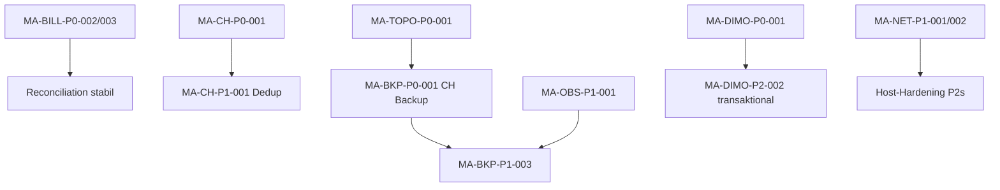

# SynqDrive Master-Admin VPS Audit — Findings & Remediation (2026-07)

| Feld | Wert |
|------|------|
| **Audit ID** | `master-admin-vps-readonly-audit-2026-07` |
| **Vollbericht** | `docs/audits/master-admin-vps-readonly-audit-2026-07.md` |
| **Abschlussurteil** | **Not Production Ready** |
| **Erstellt (UTC)** | `2026-07-26T08:00:00Z` |

---

## Zusammenfassung

| Severity | Anzahl |
|----------|--------|
| **P0** | **7** |
| **P1** | **12** |
| **P2** | **53** |
| **P3** | **38** |

---

## P0 Findings

### MA-CH-P0-001 — ClickHouse-Telemetrie ohne Tenant-Scope (`org_id`)

| Feld | Inhalt |
|------|--------|
| **Betroffene Komponente** | ClickHouse `telemetry_snapshots`, `telemetry_state_changes` |
| **Beleg** | Kap. 13.5: **0** `org_id`-Spalte auf Kern-Spiegeln; **100 %** Rows mit GPS (lat/lng); **602.569** Rows |
| **Auswirkung** | **Tenant-Datenleck** — CH-only Analytics-Queries können standortbezogene Fahrzeugdaten ohne PG-Pre-Filter kreuzen |
| **Eintrittswahrscheinlichkeit** | **Mittel** — erfordert fehlerhaften/neuen Read-Pfad; heute primär Backend-gated |
| **Empfohlene Remediation** | `org_id`-Spalte + Migration (ReplacingMergeTree-Pattern wie HF); Insert-Guard; erzwingender PG-Pre-Filter bis Migration live |
| **Benötigte Tests** | Cross-Tenant-CH-Query-Test (2 Orgs, gleiche `vehicle_id`-Prefix); API-Analytics-Smokes mit Org-A |
| **Rollback-Anforderung** | CH-Migration nur nach Backup; Rollback = vorheriges Schema-Release + Restore aus `clickhouse:backup:docker` |

---

### MA-BILL-P0-001 — TRIALING-Subscription ohne Stripe-Objekt

| Feld | Inhalt |
|------|--------|
| **Betroffene Komponente** | `billing_subscriptions`, Master-Billing-Activation |
| **Beleg** | Kap. 18.4: **1** Row `TRIALING`, `stripe_subscription_id` NULL, `stripe_sync_status=PENDING`; Stripe MCP: **0** Subscriptions |
| **Auswirkung** | **Falsche Subscription-Freischaltung** — lokaler TRIALING-Status ohne Stripe-Gegenstück; Reconciliation-Drift |
| **Eintrittswahrscheinlichkeit** | **Hoch** — bereits in Prod-Daten vorhanden |
| **Empfohlene Remediation** | Stripe-Subscription anlegen **oder** lokalen Status auf `CANCELLED`/`INACTIVE` setzen; Reconciliation-Job erneut laufen lassen |
| **Benötigte Tests** | Master `POST …/subscription/activate` auf Staging; Stripe MCP GET Subscriptions; PG-Abgleich |
| **Rollback-Anforderung** | DB-Snapshot vor Mutation; Stripe-Sub-ID in PG dokumentieren für Rollback |

---

### MA-BILL-P0-002 — Stripe TEST-Key auf Production bei DB-LIVE-Mode

| Feld | Inhalt |
|------|--------|
| **Betroffene Komponente** | `STRIPE_SECRET_KEY` (VPS Env), `billing_subscriptions.stripe_mode` |
| **Beleg** | Kap. 18.1: Env-Prefix `sk_test_…`; PG `stripe_mode=LIVE`; Reconciliation `TEST_LIVE_MODE_CONFLICT` (CRITICAL) |
| **Auswirkung** | **Zahlungs- und Rechnungsfehler** bei Live-Cutover; falsche Tax/Invoice-Zuordnung |
| **Eintrittswahrscheinlichkeit** | **Hoch** sobald Live-Charging aktiviert wird |
| **Empfohlene Remediation** | Live-Key nur auf Prod; Test-Key auf Staging isolieren; `stripe_mode` und Env harmonisieren |
| **Benötigte Tests** | Stripe MCP Account-Mode; Test-Checkout in Staging; Reconciliation ohne CRITICAL-Drift |
| **Rollback-Anforderung** | Env-Backup (`backend.env.bak-*`) vor Cutover; kein Live-Charge ohne Canary-Org |

---

### MA-BILL-P0-003 — Platform-Billing-Webhook nicht betriebsbereit

| Feld | Inhalt |
|------|--------|
| **Betroffene Komponente** | `STRIPE_WEBHOOK_SECRET`, `/webhooks/stripe`, `stripe_webhook_events` |
| **Beleg** | Kap. 18.3: Secret **fehlend**; **0** Rows in `stripe_webhook_events`; nur Connect-Webhook in Stripe |
| **Auswirkung** | **Subscription-/Invoice-Sync-Fehler** — Stripe-Events werden nicht verifiziert/verarbeitet |
| **Eintrittswahrscheinlichkeit** | **Sicher** bei jedem Stripe-Event |
| **Empfohlene Remediation** | Platform-Endpoint in Stripe registrieren; Secret in `backend.env`; Events `customer.subscription.*`, `invoice.*` |
| **Benötigte Tests** | Stripe CLI `trigger` auf Staging; PG-Row in `stripe_webhook_events`; Idempotenz-Replay |
| **Rollback-Anforderung** | Altes Secret behalten bis Dual-Run; Webhook-Endpoint in Stripe deaktivierbar |

---

### MA-BKP-P0-001 — Fehlende Wiederherstellbarkeit (ClickHouse + Offsite)

| Feld | Inhalt |
|------|--------|
| **Betroffene Komponente** | ClickHouse Volume (**~2,8 GiB**), `/opt/synqdrive/shared/backups` |
| **Beleg** | Kap. 24: kein `synqdrive_*.zip` CH-Backup; kein `rclone`/S3; Backups auf **demselben** VPS |
| **Auswirkung** | **Totalverlust** von Analytics/Telemetrie-Evidence bei VPS-Ausfall oder Volume-Löschung |
| **Eintrittswahrscheinlichkeit** | **Niedrig** pro Tag, **Sicher** über Lebensdauer ohne DR |
| **Empfohlene Remediation** | `clickhouse:backup:docker` cron + Offsite (S3); PG-Dumps offsite replizieren; Restore-Drill quartalsweise |
| **Benötigte Tests** | Staging Restore CH+PG; RTO/RPO messen; `gzip -t` + `pg_restore --list` |
| **Rollback-Anforderung** | Erst Backup verifizieren, dann Produktionsänderungen; kein `docker compose down -v` ohne Backup |

---

### MA-TOPO-P0-001 — ClickHouse Container Ghost-Mounts

| Feld | Inhalt |
|------|--------|
| **Betroffene Komponente** | `synqdrive-clickhouse` Docker-Bind-Mounts |
| **Beleg** | Kap. 6.2: Mounts auf gelöschtes Release `20260717111944_v4994` (`//deleted`) |
| **Auswirkung** | **Kritischer Production-Ausfall** bei Container-Recreate — CH startet nicht |
| **Eintrittswahrscheinlichkeit** | **Mittel** bei jedem manuellen Recreate/Upgrade |
| **Empfohlene Remediation** | Container mit Pfaden unter `/opt/synqdrive/current/…` oder `shared/` neu erstellen; Compose-Pfade stabilisieren |
| **Benötigte Tests** | `docker compose up -d clickhouse` auf Staging; Health + `SELECT 1`; Backup vor Recreate |
| **Rollback-Anforderung** | CH-Volume bleibt erhalten; nur Mount-Pfade ändern — Rollback = alter Container-Def |

---

### MA-DIMO-P0-001 — DIMO-Fahrzeug ohne DB-Unique-Constraint

| Feld | Inhalt |
|------|--------|
| **Betroffene Komponente** | `vehicles.dimo_vehicle_id`, `registerFromDimo` |
| **Beleg** | Kap. 17.2 + 11.7: **kein** Unique-Constraint; Code erlaubt Re-Registrierung in anderer Org theoretisch |
| **Auswirkung** | **Falsche Zuordnung von Fahrzeugen** — dasselbe DIMO-Fahrzeug in zwei Tenants |
| **Eintrittswahrscheinlichkeit** | **Niedrig-Mittel** — aktuell **0** Duplikate in PG |
| **Empfohlene Remediation** | Global Unique auf `dimo_vehicle_id` (oder Partial Unique); Pre-Import-Check in `registerFromDimo` |
| **Benötigte Tests** | Import-Smoke: gleiches DIMO-Vehicle in Org B → erwartet 409; PG-Constraint-Verletzung |
| **Rollback-Anforderung** | Migration rückgängig nur nach Duplikat-Scan; Datenbereinigung vor Unique |

---

## P1 Findings

### MA-NET-P1-001 — Swagger UI öffentlich

| Feld | Inhalt |
|------|--------|
| **Komponente** | Nginx → NestJS `/docs` |
| **Beleg** | Kap. 7.5: `https://app.synqdrive.eu/docs` ohne Auth |
| **Auswirkung** | API-Enumeration, erleichterte Angriffsplanung |
| **Remediation** | Swagger in Prod deaktivieren oder IP-Allowlist/Basic-Auth |
| **Tests** | `curl -sI /docs` → 401/404 von außen |
| **Rollback** | Env-Flag `SWAGGER_ENABLED` |

---

### MA-NET-P1-002 — OpenAPI Spec öffentlich

| Feld | Inhalt |
|------|--------|
| **Komponente** | `/docs-json` (~339 KiB, 255 Admin-Routen) |
| **Beleg** | Kap. 9, Schritt 6 |
| **Auswirkung** | Vollständige API-Oberfläche ohne Auth lesbar |
| **Remediation** | Wie P1-001 |
| **Tests** | `curl /docs-json` von extern → blockiert |
| **Rollback** | Env-Flag |

---

### MA-TOPO-P1-001 — ClickHouse Ghost-Mounts (P1-Historie)

> **Hinweis:** In Abschluss als **MA-TOPO-P0-001** klassifiziert. Beleg und Remediation identisch.

---

### MA-REDIS-P1-001 — 28 failed `battery.v2` Jobs

| Feld | Inhalt |
|------|--------|
| **Komponente** | BullMQ `battery.v2` |
| **Beleg** | Kap. 12.6: `REST target job missing restWindowId` |
| **Auswirkung** | Battery-Health-V2 nicht berechnet; Alert `QueueFailedJobsHigh` firing |
| **Remediation** | Handler fixen; Failed-Jobs reconcilen |
| **Tests** | Queue `failed` count = 0; Battery-V2-Smoke |
| **Rollback** | Job-Replay aus DLQ nach Code-Fix |

---

### MA-CH-P1-001 — 94,7 % ClickHouse-Snapshot-Duplikate

| Feld | Inhalt |
|------|--------|
| **Komponente** | `telemetry_snapshots` |
| **Beleg** | Kap. 13.3: 570.783 Duplikate / 602.569 Rows |
| **Auswirkung** | Falsche Analytics/Aggregate; Speicher- und Query-Overhead |
| **Remediation** | ReplacingMergeTree oder Insert-Dedup; historische Bereinigung |
| **Tests** | `COUNT(DISTINCT …)` = `COUNT(*)` nach Fix |
| **Rollback** | CH-Backup vor Dedup-Migration |

---

### MA-OBS-P1-001 — Kein Alertmanager

| Feld | Inhalt |
|------|--------|
| **Komponente** | Prometheus Alerting |
| **Beleg** | Kap. 15.3: 98 Rules, 4 firing, 0 Alertmanagers |
| **Auswirkung** | Incidents bleiben unbemerkt (Backup-Fail, Queue-Fail, IAM) |
| **Remediation** | Alertmanager deployen + Slack/PagerDuty/E-Mail |
| **Tests** | Test-Alert zugestellt; firing Alerts eskalieren |
| **Rollback** | Alertmanager-Config versionieren |

---

### MA-BILL-P1-001 — Stripe TEST-Key (P1-Historie)

> **Hinweis:** Abschluss **MA-BILL-P0-002**. Siehe P0-Abschnitt.

---

### MA-BILL-P1-002 — Webhook-Secret fehlt (P1-Historie)

> **Hinweis:** Abschluss **MA-BILL-P0-003**. Siehe P0-Abschnitt.

---

### MA-AUD-P1-001 — Audit-Logs löschbar (kein WORM)

| Feld | Inhalt |
|------|--------|
| **Komponente** | `activity_logs`, IAM-Retention |
| **Beleg** | Kap. 22: `pruneMasterData`, `deleteMany`; 853 Rows löschbar |
| **Auswirkung** | Kein manipulationssicherer Nachweis Master-Aktionen |
| **Remediation** | Append-only/SIEM-Export; WORM-Bucket für Audit |
| **Tests** | Löschversuch blockiert oder SIEM-Event sichtbar |
| **Rollback** | Retention-Flags auf dry-run |

---

### MA-BKP-P1-001 — Kein Offsite-Backup (P1-Historie)

> **Hinweis:** Teil von **MA-BKP-P0-001**.

---

### MA-BKP-P1-002 — ClickHouse ohne Backup (P1-Historie)

> **Hinweis:** Teil von **MA-BKP-P0-001**.

---

### MA-BKP-P1-003 — Keine Backup-Alarmierung

| Feld | Inhalt |
|------|--------|
| **Komponente** | Prometheus + Deploy-Backup |
| **Beleg** | Kap. 24: keine Backup-Rules; kein Alertmanager |
| **Auswirkung** | Fehlgeschlagene/fehlende Backups unbemerkt |
| **Remediation** | `BackupAgeHigh` Alert + Alertmanager; Deploy-Fail-Metric |
| **Tests** | Simulierter Backup-Fail → Alert empfangen |
| **Rollback** | Alert-Rule deaktivierbar |

---

## Abhängigkeiten



| Blocker | Blockiert |
|---------|-----------|
| Stripe Live-Cutover | MA-BILL-P0-002, P0-003, P0-001 |
| CH-Backup-Job | MA-TOPO-P0-001 (Mount-Pfade) |
| Alertmanager | MA-BKP-P1-003, MA-OBS-P2-003 |
| CH `org_id`-Migration | Analytics-Tenant-Gate PASS |

---

## Empfohlene Umsetzungsreihenfolge

1. Dokumentation/Runbooks (kein Prod-Touch)
2. **P0:** Stripe Env/Webhook/Trial-Sub
3. **P0:** CH Ghost-Mounts → CH Backup → Offsite
4. **P0:** CH `org_id` + DIMO Unique
5. **P1:** Alertmanager + Backup-Alerts
6. **P1:** Swagger absichern + Audit-WORM-Plan
7. **P1:** Battery-V2 + CH-Dedup
8. P2-Cluster (Netzwerk, Master-Admin MFA, DIMO transaktional)
9. Tests + Post-Remediation-Audit

---

## Benötigte Cursor-Remediation-Prompts

### Prompt 1 — Stripe Production Cutover
```
Behebe MA-BILL-P0-002 und MA-BILL-P0-003: Harmonisiere STRIPE_SECRET_KEY (Live nur Prod),
setze STRIPE_WEBHOOK_SECRET, registriere Platform-Webhook /webhooks/stripe, synchronisiere
die TRIALING-Subscription (MA-BILL-P0-001). Nur Staging testen bis Review; VPS-Deploy
über vps-deploy-release.sh. Keine Test-Charges ohne Freigabe.
```

### Prompt 2 — ClickHouse DR & Mounts
```
Behebe MA-TOPO-P0-001 und MA-BKP-P0-001: ClickHouse-Container mit current/shared-Pfaden
neu binden, clickhouse:backup:docker als Cron, Offsite-S3-Sync für PG+CH Backups,
Retention-Policy in vps-deploy-release.sh. Staging Restore-Drill dokumentieren.
```

### Prompt 3 — ClickHouse Tenant Isolation
```
Behebe MA-CH-P0-001: org_id auf telemetry_snapshots/state_changes (Migration + Backfill),
Insert-Guard, API erzwingt PG vehicle→org Pre-Filter. Tests für Cross-Tenant-Leak.
```

### Prompt 4 — DIMO Vehicle Unique
```
Behebe MA-DIMO-P0-001 und MA-DIMO-P2-002: Unique Constraint dimo_vehicle_id,
registerFromDimo in $transaction mit compensating rollback.
```

### Prompt 5 — Observability
```
Behebe MA-OBS-P1-001 und MA-BKP-P1-003: Alertmanager in VPS-Monitoring-Stack,
BackupAge/BackupFail Alerts, node_exporter, Route zu Slack. Remediate 4 firing Alerts.
```

### Prompt 6 — API Exposure & Audit
```
Behebe MA-NET-P1-001/002 und MA-AUD-P1-001: Swagger nur non-prod, Audit-Export zu
immutable store oder SIEM webhook, request_id in activity_logs.
```

### Prompt 7 — Battery V2 Queue
```
Behebe MA-REDIS-P1-001: BatteryV2Processor restWindowId-Pfad, Failed-Job-Reconcile,
Alert QueueFailedJobsHigh grün.
```

---

## Benötigte Post-Remediation-Prüfungen

| # | Prüfung | Erfolgskriterium |
|---|---------|------------------|
| 1 | **Read-only Re-Audit** | Wiederholung Kap. 2.2-Befehle; P0 geschlossen |
| 2 | **Authentifizierte Master-Smokes** | Cross-Tenant 403; Master-GETs mit MFA Step-up |
| 3 | **Stripe E2E** | Webhook-Event in PG; Reconciliation 0 CRITICAL |
| 4 | **CH Restore-Drill** | Staging RESTORE + SELECT count plausibel |
| 5 | **PG Restore-Drill** | `pg_restore` Staging; migrate status OK |
| 6 | **Backup-Alerts** | Simulierter Fail → Notification < 5 min |
| 7 | **DIMO Import Smoke** | Transaktionaler Rollback bei Teilfehler |
| 8 | **Frontend Bundle** | `grep` Master-Routen in `dist/`; keine Debug-Leaks |
| 9 | **Voice/Resend** | Webhook-Probe Staging; kein Prod-Side-Effect |
| 10 | **Production-Readiness-Gates** | Min. 10/12 PASS oder PASS WITH CONDITIONS |

---

## Read-only Bestätigung

Diese Findings-Datei wurde **ausschließlich aus Audit-Evidenz** abgeleitet. **Keine** Production-Mutation während der Erstellung.
