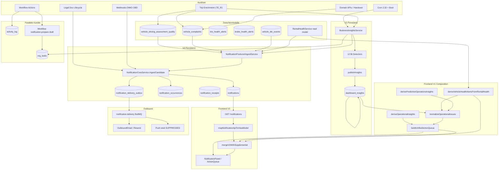
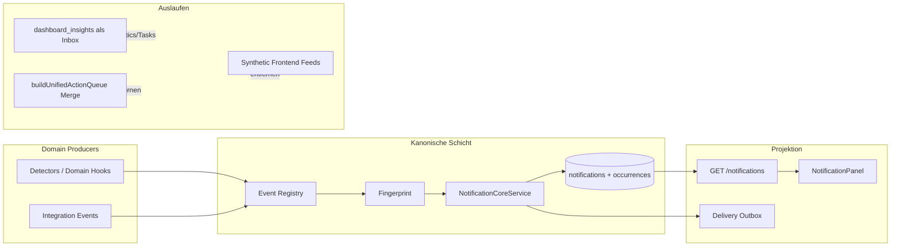
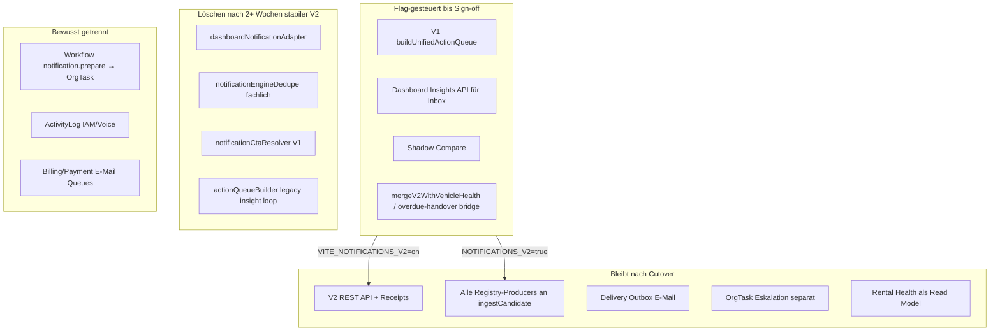

# Notification Engine — Data Flow Map (Prompt 2/36)

**Datum:** 2026-07-26  
**Repository:** `SYNQDRIVE-alpha`  
**Branch:** `remediation/notification-engine-production-readiness-2026-07`  
**Basis:** `docs/audits/notification-engine-remediation-baseline-2026-07.md`  
**Scope:** Vollständige Producer-/Consumer-Kartierung — keine produktive Logik geändert  
**Methode:** Code-Suche Backend, Frontend, Worker, Cron, Webhooks, Prisma-Modelle

---

## Executive Summary

| Metrik | Anzahl | Anmerkung |
|--------|--------|-----------|
| **Producer-Pfade** | **58** | Distincte Code-Einstiegspunkte, die Meldungen materialisieren oder synthetisieren |
| **Consumer-Pfade** | **31** | UI-Flächen, APIs, Kanäle und Monitoring |
| **Konkurrierende Wahrheiten** | **14** | Gleicher Sachverhalt, mehrere Persistenz-/Darstellungspfade |
| **Registry Event-Types** | **46** | `notification-event-registry.definitions.ts` (inkl. 20× LEGAL_*) |
| **V2 `ingestCandidate`-Hooks** | **12** | Live-Producer-Module (ohne Offline-Backfill) |
| **BI-Detektoren (V1)** | **12** | Alle schreiben `dashboard_insights` |

---

## 1. Architekturdiagramme

### 1.1 Ist-Zustand (alle aktiven Pfade)



### 1.2 Soll-Zustand (Zielarchitektur nach Cutover)



### 1.3 Legacy-Cutover-Grenzen



**Cutover-Grenze (heute):**

| Schicht | V1 aktiv wenn | V2 aktiv wenn |
|---------|---------------|---------------|
| Backend Writes | immer (BI publish) | `NOTIFICATIONS_V2=true` |
| Backend API | — | `NOTIFICATIONS_V2=true` (sonst 503) |
| Frontend Inbox | `VITE_NOTIFICATIONS_V2=off\|shadow` | `VITE_NOTIFICATIONS_V2=on` |
| E-Mail Delivery | — | `NOTIFICATIONS_DELIVERY_ENABLED=true` |
| Hybrid Bridge | V2 on | `mergeV2*` + `extractOverdueHandover*` |

---

## 2. Producer-Katalog

Legende **Status:** `V1` = DashboardInsight/Frontend-only · `V2` = notifications-Tabelle · `Hybrid` = beides · `Parallel` = separater Kanal (Task/ActivityLog)

### 2.1 Orchestrierung & Scheduling

| # | Datei | Funktion | Auslöser | Eventtyp | Entity | orgId | Persistenz | Dedup | Status | Consumer |
|---|-------|----------|----------|----------|--------|-------|------------|-------|--------|----------|
| P-01 | `business-insights/business-insights-scheduler.service.ts` | `scheduledRunCron` | Cron `2,32 * * * *`, Boot | — (enqueue) | ORG | ✓ route | BullMQ job | jobId per org | Hybrid | Evaluation Worker |
| P-02 | `notifications/runtime/notification-evaluation.service.ts` | `executeRun` | BullMQ `notification.evaluation` | — | ORG | ✓ | — | Redis org lock | Hybrid | BI + V2 sync |
| P-03 | `business-insights/business-insights-trigger.service.ts` | `requestDebouncedRerun` | Domain events (debounce 120s) | — | ORG | ✓ | Redis pending | jobId coalesce | Hybrid | P-02 |
| P-04 | `business-insights/internal-business-insights.controller.ts` | `runForOrg` / `runAll` | Master-admin API | — | ORG | ✓ | — | — | Hybrid | P-02 |

### 2.2 Business Insights — V1 Detektoren

Alle: `BusinessInsightsService.runForOrganization` → `DashboardInsightsRepository.publishInsights` → `dashboard_insights`.  
**Dedup V1:** `dedupeKey`; Publish deaktiviert vorherige aktive Zeile mit gleichem Key.  
**Lifecycle V1:** `isActive` swap pro Run; `expiresAt` optional.  
**Severity:** `CRITICAL` \| `WARNING` \| `INFO` \| `OPPORTUNITY`.  
**Freitext:** `title` + `message` hardcoded/teilweise DE — **keine** `titleKey` in V1.

| # | Datei | Funktion | InsightType | Entity-Typ | Entity-ID | stationId | V2-Bridge |
|---|-------|----------|-------------|------------|-----------|-----------|-----------|
| P-05 | `detectors/tight-handover.detector.ts` | `detect` | `TIGHT_HANDOVER` | VEHICLE+BOOKING | vehicleId, bookingIds | via vehicle | — |
| P-06 | `detectors/return-needs-inspection.detector.ts` | `detect` | `RETURN_NEEDS_INSPECTION` | BOOKING | bookingId | via booking | — |
| P-07 | `detectors/station-shortage.detector.ts` | `detect` | `STATION_SHORTAGE` | STATION | stationId | ✓ | **Hybrid** P-18 |
| P-08 | `detectors/low-utilization.detector.ts` | `detect` | `LOW_UTILIZATION` | VEHICLE | vehicleId | via vehicle | **Hybrid** P-19 |
| P-09 | `detectors/service-window.detector.ts` | `detect` | `SERVICE_WINDOW` | VEHICLE | vehicleId | — | — |
| P-10 | `detectors/service-before-booking.detector.ts` | `detect` | `SERVICE_BEFORE_BOOKING` | VEHICLE+BOOKING | vehicleId, bookingId | — | — |
| P-11 | `detectors/battery-critical.detector.ts` | `detect` | `BATTERY_CRITICAL` | VEHICLE | vehicleId | — | **Hybrid** P-20 |
| P-12 | `detectors/tire-critical.detector.ts` | `detect` | `TIRE_CRITICAL` | VEHICLE | vehicleId | — | **Hybrid** P-20 |
| P-13 | `detectors/brake-critical.detector.ts` | `detect` | `BRAKE_CRITICAL` | VEHICLE | vehicleId | — | **Hybrid** P-20 |
| P-14 | `detectors/compliance-operational.detector.ts` | `detect` | `SERVICE_OVERDUE`, `TUV_OVERDUE`, `BOKRAFT_OVERDUE`, `HM_SERVICE_NO_TRACKING` | VEHICLE | vehicleId | — | Resolve P-21 |
| P-15 | `detectors/pickup-overdue.detector.ts` | `detect` | `PICKUP_OVERDUE` | BOOKING | bookingId | via booking | — |
| P-16 | `detectors/driving-assessment-device-quality.detector.ts` | `detect` | `DRIVING_ASSESSMENT_DEVICE_QUALITY` | VEHICLE | vehicleId | — | **Hybrid** P-15 (Runtime) |

**Consumer V1:** `normalizeOperationalIssues`, `InsightsCockpit`, `useOperatorOperationalAlerts`, Finance-Tab-Filter.

### 2.3 V2 Producer-Ingest (Adapter-Router)

Zentral: `notifications/adapters/notification-producer.ingest.service.ts` → `NotificationProducerRouter` → `NotificationCoreService.ingestCandidate`.  
**Dedup V2:** Fingerprint `org|eventType|entityType|entityId|conditionCode|vN`; Partial UNIQUE auf aktive Zeilen.  
**Lifecycle V2:** `OPEN` → `ACKNOWLEDGED`/`SNOOZED` → `RESOLVED`/`ARCHIVED`; Receipts pro User.

| # | Datei | Funktion | Auslöser | EventType | Entity | Severity | Adapter shadow | Status |
|---|-------|----------|----------|-----------|--------|----------|----------------|--------|
| P-17 | `driving-assessment-device-quality.service.ts` | `syncV2DrivingAssessment` | Trip LTE_R1 enriched | `DRIVING_ASSESSMENT_DEVICE_QUALITY` | VEHICLE | WARNING→SUCCESS | **shadow** | Hybrid |
| P-18 | `notification-producer.ingest.service.ts` | `syncStationShortagesFromInsights` | Post-BI run | `STATION_SHORTAGE` | STATION | WARNING | **shadow** | Hybrid |
| P-19 | same | `syncLowUtilizationFromInsights` | Post-BI run | `LOW_UTILIZATION` | VEHICLE | WARNING | live | Hybrid |
| P-20 | same | `syncVehicleHealthWarnings` | Post-BI run | `ACTIVE_DTC`, `TIRE_CRITICAL`, `BRAKE_CRITICAL`, `BATTERY_CRITICAL` | VEHICLE | CRITICAL/WARNING | live | Hybrid |
| P-21 | same | `resolveInboxExcludedNotifications` | Post-BI run | `HM_SERVICE_NO_TRACKING` → resolve | VEHICLE | SUCCESS | — | Hybrid |
| P-22 | `technical-observations.service.ts` | `syncTechnicalObservationActive` | CRUD API / Handover | `TECHNICAL_OBSERVATION_ACTIVE` | VEHICLE | WARNING | **shadow** | Hybrid |
| P-23 | same | `syncTechnicalObservationResolved` | resolve/dismiss/convert | → RESOLVED | VEHICLE | SUCCESS | **shadow** | Hybrid |

**Hinweis:** `shadowModeOnly=true` Adapter schreiben nur wenn Registry `shadowModeEnabled=true` **und** `NOTIFICATIONS_V2=true`.

### 2.4 Vehicle Health — Realtime & Zwischenmodelle

| # | Datei | Funktion | Auslöser | EventType | Entity-ID | Persistenz | Dedup | Status | Consumer |
|---|-------|----------|----------|-----------|-----------|------------|-------|--------|----------|
| P-24 | `workers/processors/dimo-dtc.processor.ts` | `emitDtcHealthNotifications` | Cron DTC poll | `ACTIVE_DTC` | vehicleId + dtcCode | notifications | fingerprint per code | V2 | API, Panel |
| P-25 | `brakes/brake-dtc-evidence.producer.ts` | `emitBrakeSafetyNotification` | DTC upsert hook | `BRAKE_CRITICAL` | vehicleId + code | notifications | fingerprint | V2 | API |
| P-26 | `tires/tire-health-alert.service.ts` | `syncAlerts` | Tire recalc | — (alert row) | vehicleId | tire_health_alerts | dedupeKey | Intermediate | P-20 projector |
| P-27 | `brakes/brake-health-alert.service.ts` | `syncAlerts` | Brake recalc | — | vehicleId | brake_health_alerts | dedupeKey | Intermediate | P-20 |
| P-28 | `rental-health-notification.projector.ts` | `projectVehicleHealthWarnings` | BI batch | siehe P-20 | vehicleId | — (read) | conditionCode | Hybrid | P-20 |

**Clear Grace:** `VEHICLE_HEALTH_NOTIFICATION_CLEAR_GRACE_MS` (6h) vor V2-Resolve.

### 2.5 DIMO / Connectivity (direkt V2)

| # | Datei | Funktion | Auslöser | EventTypes (Auszug) | Entity | Status |
|---|-------|----------|----------|---------------------|--------|--------|
| P-29 | `connectivity-alert/connectivity-alert.service.ts` | `onDeviceUnplugged` | OBD webhook | `DEVICE_UNPLUGGED` | VEHICLE + episodeId | V2 |
| P-30 | same | `onEpisodeRecovered` | Plug-in / outbox | resolve + `DEVICE_RECONNECTED` | VEHICLE | V2 |
| P-31 | same | `syncRuntimeAlerts` | Connectivity runtime projection | `TELEMETRY_OFFLINE`, `TELEMETRY_SOFT_OFFLINE`, `AUTHORIZATION_REQUIRED`, `DATA_SOURCE_DISCONNECTED`, `DATA_COVERAGE_INSUFFICIENT`, `WEBHOOK_FAILURE`, `DEVICE_BINDING_CHANGED`, `CONNECTIVITY_STATE_UNKNOWN` | VEHICLE | V2 |

**Dedup:** Episode-scoped `conditionCode`; Registry fingerprint.  
**Consumer:** V2 API; Rental Health connectivity module (separater Read-Pfad).

### 2.6 Legal Documents (direkt V2)

| # | Datei | Funktion | Auslöser | EventTypes | Entity | bookingId | Status |
|---|-------|----------|----------|------------|--------|-----------|--------|
| P-32 | `legal-document-operational-notification.service.ts` | `syncOrgReadiness` | Legal CRUD | `LEGAL_REQUIRED_*`, `LEGAL_APPROVAL_PENDING`, `LEGAL_DOCUMENT_EXPIRING_SOON`, … | ORGANIZATION | — | V2 |
| P-33 | same | `syncBundleCompleteness` | Bundle eval | `LEGAL_BUNDLE_INCOMPLETE`, `LEGAL_DOCUMENT_DELIVERY_FAILED` | BOOKING | ✓ | V2 |
| P-34 | same | `syncPickupGateBlock` | *(definiert, kaum Caller)* | `LEGAL_PICKUP_BLOCKED_MISSING_PROOF` | BOOKING | ✓ | V2 dormant |
| P-35 | same | `syncIntegrityTechnicalAlert` | Integrity drift | `LEGAL_INTEGRITY_*`, `LEGAL_TECH_*` | ORG/DOC | — | V2 |

**Dedup:** `legalOperationalNotificationFingerprintKey`; Scope-Map auto-close.  
**Template Keys:** ✓ (`notification.title.*` / `notification.body.*`).  
**Consumer:** V2 API → NotificationPanel; Admin Legal Tab (lokale `configAlerts` nur UI).

### 2.7 Parallele Kanäle (kein V2-Inbox)

| # | Datei | Funktion | Auslöser | Output | Persistenz | Consumer |
|---|-------|----------|----------|--------|------------|----------|
| P-36 | `insight-task-bridge.service.ts` | `materialize` | Post-BI | OrgTask | org_tasks | Tasks UI |
| P-37 | `workflow-action-executor.service.ts` | `execNotificationPrepare` | Workflow | Task draft | org_tasks | Workflow + Tasks |
| P-38 | same | `execAlertCreate` | Workflow | Alert task | org_tasks | Tasks |
| P-39 | `battery-task.service.ts` | battery task sync | Battery policy | OrgTask | org_tasks | Tasks |
| P-40 | `voice-budget-warning.service.ts` | `notifyOrgAdmins` | Voice usage threshold | ActivityLog | activity_log | Admin activity |
| P-41 | `iam-membership-lifecycle-notification.service.ts` | `notifyAfterCommit` | IAM lifecycle | ActivityLog | activity_log | Audit trail |
| P-42 | `whatsapp-automation-hooks.service.ts` | — | — | **TODO** | — | — |

### 2.8 Offline / Migration

| # | Datei | Funktion | Auslöser | Quelle → Ziel | Status |
|---|-------|----------|----------|---------------|--------|
| P-43 | `migration/notification-migration-backfill.service.ts` | `applyBatch` | CLI `--apply` | dashboard_insights → notifications | Offline V2 |

### 2.9 Frontend — Synthetische Producer

| # | Datei | Funktion | Auslöser | Typ / ID | Entity | Persistenz | Status | Consumer |
|---|-------|----------|----------|----------|--------|------------|--------|----------|
| P-44 | `deriveOperationalInsights.ts` | `deriveOperationalInsights` | Dashboard VM memo | `derived-vehicles-without-tariff`, `derived-fleet-soft-offline-telemetry`, `derived-handover-backlog` | FLEET/ORG | **Keine** | V1 + V2 supplemental | ActionQueue |
| P-45 | `derivePredictiveOperationsInsights.ts` | `derivePredictiveOperationsInsights` | Dashboard VM memo | 8× `PredictiveRiskType` (z. B. `STATION_SHORTAGE_24H`) | VEHICLE/BOOKING/STATION | **Keine** | V1 | ActionQueue |
| P-46 | `dashboardNotificationAdapter.ts` | `buildDashboardNotificationsFromInsights` | Insights filter | `DRIVING_ASSESSMENT_DEVICE_QUALITY` | VEHICLE | **Keine** | **Orphan** | *kein UI* |
| P-47 | `DashboardInsightsContext.tsx` | `deriveVehicleHealthAlertsFromRentalHealth` | healthMap API | pro Modul `VehicleHealthAlert` | VEHICLE | **Keine** | Hybrid | V1 Queue + V2 bridge |
| P-48 | `actionQueueBuilder.ts` | pickup/return loops | today bookings API | `pickup-*` / `return-*` | BOOKING | **Keine** | V1 + V2 overdue bridge | ActionQueue |
| P-49 | `vehicleRuntimeStateBuilder.ts` | `addHealthReasons`, telemetry | Fleet runtime | RuntimeReason IDs | VEHICLE | **Keine** | V1 | ActionQueue + KPI slices |

**Probleme synthetischer Pfade:** `Date.now()` in einigen Sort-Keys; DE/EN-Mix; keine `organizationId`-Persistenz; keine User-Lifecycle.

---

## 3. Consumer-Katalog

### 3.1 Dashboard & Notification Center

| # | Datei | Komponente/Hook | Datenquelle | Modus | Fläche |
|---|-------|-----------------|-------------|-------|--------|
| C-01 | `useDashboardViewModel.ts` | Orchestrator | siehe unten | Hybrid | Dashboard VM |
| C-02 | `ActionQueue.tsx` | `ActionQueue` | `vm.actionQueue` | off→V1 UI; on→delegiert Panel | Meldungen-Box |
| C-03 | `notifications/NotificationPanel.tsx` | `NotificationPanel` | V2 items + mutations | V2 on | Meldungen-Box |
| C-04 | `hooks/useNotifications.ts` | `useNotifications` | `GET /notifications`, `/counts`, POST mutations | V2 | Panel-Badges |
| C-05 | `map-notification-api-to-view-model.ts` | Mapper | Notification DTO | V2 | Panel |
| C-06 | `merge-v2-with-vehicle-health.ts` | Bridge | V2 + health + derived + overdue | V2 hybrid | Panel |
| C-07 | `notification-shadow-compare.ts` | Diagnostics | V1 vs V2 diff | shadow | console.debug |

**V1 Builder-Inputs (C-01):** dashboard-insights API, rental-health, today bookings, runtime, derived, predictive.

### 3.2 Dashboard — Alert-adjacent (nicht NotificationPanel)

| # | Datei | Komponente | Datenquelle | Fläche |
|---|-------|------------|-------------|--------|
| C-08 | `DashboardDrilldownDrawer.tsx` | Critical alerts slice | `dashboardRuntime` | Drawer |
| C-09 | `ControlKpiStrip.tsx` | KPI `critical-alerts` | Runtime slices | KPI-Leiste |
| C-10 | `NowNextTimeline.tsx` | Timeline | operationsBuilder + healthAlerts | Operator-Focus |
| C-11 | `OperatorFocusPanels.tsx` | Handover / not-ready | Bookings + runtime | Operator-Focus |
| C-12 | `InsightsCockpit.tsx` | Finance/Evaluations insights | dashboard-insights API | Finanzen |
| C-13 | `StatInlineDetail.tsx` | Pickup/return tiles | today bookings + healthMap | Dashboard tiles |

### 3.3 Fleet

| # | Datei | Komponente | Datenquelle | Fläche |
|---|-------|------------|-------------|--------|
| C-14 | `FleetView.tsx` / `FleetCommandPanel` | Command panel | Runtime + fleet context | Fleet |
| C-15 | `fleet-operator-panel.ts` | Critical counts | `critical-alerts` slice | Fleet |
| C-16 | `fleet-health-service/*` | Health service VM | rental-health API | Fleet Zustand |

### 3.4 Vehicle Detail

| # | Datei | Komponente | Datenquelle | Fläche |
|---|-------|------------|-------------|--------|
| C-17 | `VehicleHealthBoxWired.tsx` | Health summary | `useEffectiveHealth` | Fahrzeugdetail |
| C-18 | `HealthVehicleDetailPanel.tsx` | Module panel | rental-health per vehicle | Health-Tab |
| C-19 | `HealthErrorsView.tsx` | DTC view | rental-health / DTC | Error Codes |
| C-20 | `VehicleDetailHeaderBadges.tsx` | Header badges | health API | Header |

**Hinweis:** Vehicle Detail konsumiert **nicht** `/notifications` — nur Rental Health V1.

### 3.5 Booking

| # | Datei | Komponente | Datenquelle | Fläche |
|---|-------|------------|-------------|--------|
| C-21 | `BookingVehicleHealthTab.tsx` | Health tab | rental-health | Buchungsdetail |
| C-22 | `NewBookingView.tsx` | Vehicle picker | fleet health map | Neubuchung |

### 3.6 Operator App

| # | Datei | Komponente | Datenquelle | Fläche |
|---|-------|------------|-------------|--------|
| C-23 | `useOperatorOperationalAlerts.ts` | Alerts hook | dashboard-insights (subset) | Operator Today |
| C-24 | `OperatorTodayView.tsx` | Hinweise section | P-23 hook | Operator |
| C-25 | `OperatorTaskCard.tsx` | Task display | tasks API (`alertId`) | Operator Tasks |

**Kein V2:** Operator nutzt weder `useNotifications` noch ActionQueue.

### 3.7 Workflow Automation

| # | Datei | Komponente | Datenquelle | Fläche |
|---|-------|------------|-------------|--------|
| C-26 | `workflow-action-preview.service.ts` | Dry-run preview | Workflow graph | Admin Simulate |
| C-27 | `WorkflowConfigDrawer.tsx` | Config UI | — | Workflow Admin |

### 3.8 Kanäle (Delivery)

| # | Kanal | Implementierung | Quelle | Status |
|---|-------|-----------------|--------|--------|
| C-28 | **In-App V2** | `NotificationsController` | notifications + receipts | Live (flag) |
| C-29 | **E-Mail** | `notification-delivery-processor` → OutboundEmail | outbox | Flag `NOTIFICATIONS_DELIVERY_ENABLED` |
| C-30 | **Push** | `NotificationPushChannelService` | outbox | **SUPPRESSED** (stub) |
| C-31 | **WhatsApp** | `whatsapp-automation-hooks` | — | **Nicht verdrahtet** |
| — | **Voice AI** | Voice assistant / budget | activity_log | Parallel, kein Inbox |
| — | **Payment/Billing E-Mail** | `payment-email.processor`, billing-email | separate queues | **Nicht** Notification Engine |

### 3.9 Tasks & Monitoring

| # | Consumer | Datenquelle |
|---|----------|-------------|
| — | Tasks UI (Rental) | org_tasks ← P-36..P-39 |
| — | Prometheus `synqdrive_notification_*` | Core + Delivery observability |
| — | Grafana `synqdrive-ops.json` | Metrics panels |
| — | Evaluations observability | BI + notification.evaluation runs |

### 3.10 Orphan / Dead UI

| Komponente | Status |
|------------|--------|
| `BusinessInsightsBox.tsx` | Nicht gerendert |
| `dashboardNotifications` auf VM | Berechnet, kein Consumer |

---

## 4. Konkurrierende Wahrheiten (14)

| ID | Sachverhalt | Parallel-Pfade | Risiko |
|----|-------------|----------------|--------|
| CT-01 | **Fahrbewertung / Datenqualität** | V1 Insight (P-16) + V2 (P-17) + Auto-Observation (P-22) + Rental Health complaints + Runtime reason | Duplikat-Karten, verschiedene Texte |
| CT-02 | **Technische Beobachtung** | vehicle_complaint + V2 TECHNICAL_OBSERVATION + health module + runtime `damage:suspicion` | 2–4 semanticKeys |
| CT-03 | **Batterie kritisch** | BI detector (P-11) + rental-health module + V2 BATTERY_CRITICAL (P-20) + frontend health alert | Triple Darstellung |
| CT-04 | **Reifen kritisch** | BI (P-12) + tire_health_alerts (P-26) + V2 TIRE_CRITICAL + frontend | Triple + TPMS-Pfad |
| CT-05 | **Bremsen kritisch** | BI (P-13) + brake alerts (P-27) + brake-DTC (P-25) + V2 | Triple |
| CT-06 | **Aktiver DTC** | vehicle_dtc_events + DTC poll (P-24) + rental-health error_codes + V2 ACTIVE_DTC | Resolve-Race (Test fail) |
| CT-07 | **Station Shortage** | BI (P-07) + V2 (P-18) + predictive `STATION_SHORTAGE_24H` (P-45) | 3 Zeithorizonte |
| CT-08 | **Low Utilization** | BI finance insight (P-08) + V2 (P-19) | Finance-Tab vs Inbox |
| CT-09 | **Handover überfällig** | BI PICKUP/RETURN (P-06,P-15) + booking tiles (P-48) + V2 supplemental bridge | ID- und Severity-Drift |
| CT-10 | **Telemetry offline** | Connectivity V2 (P-31) + derived fleet telemetry (P-44) + predictive SOFT_OFFLINE (P-45) + runtime | 4 Quellen |
| CT-11 | **Service überfällig** | BI compliance (P-14) + rental-health service_compliance + OrgTask (P-36) | Task vs Meldung |
| CT-12 | **Legal Compliance** | Legal V2 (P-32..P-35) + deprecated `booking-document-org-legal-notification` + lokale Admin alerts | Legacy-Reste |
| CT-13 | **Insight Publish vs V2 Fingerprint** | V1 swap (neue UUID) vs V2 stable fingerprint | Historische ID-Instabilität V1 |
| CT-14 | **Workflow notification vs Inbox** | OrgTask draft (P-37) vs Notification API | Operatoren sehen unterschiedliche Surfaces |

---

## 5. Identifizierte Probleme

### 5.1 Doppelte Producer

| Paar | Mechanismus |
|------|-------------|
| BI Detector + V2 Adapter | Gleicher BI-Run: erst `publishInsights`, dann `sync*FromInsights` |
| DTC Poll + BI Fleet Sweep | Realtime + batch können gleichen Code doppelt ingested (Dedup sollte mergen) |
| Driving Assessment Detector + Runtime | Trip hook + debounced BI rerun |
| Frontend derived + Backend STATE | z. B. Telemetry, Station Shortage |

### 5.2 Synthetische Frontend-Meldungen

| Producer | In ActionQueue? | Persistenz |
|----------|-----------------|------------|
| P-44 derived (3) | Ja (V1 + V2 supplemental) | Nein |
| P-45 predictive (8) | Ja (V1) | Nein |
| P-46 dashboardNotifications | **Nein** (orphan) | Nein |
| P-47 health alerts | Ja | Nein |
| P-48 booking tiles | Ja | Nein |

### 5.3 Identische Sachverhalte, verschiedene IDs

| Fall | ID-Typ V1 | ID-Typ V2 |
|------|-----------|-----------|
| Insight rerun | `insight-{uuid}` neu pro publish | `notification.id` stabil per fingerprint |
| Synthetic notif | `notif-{title}-{time}` | — |
| Normalized issue | `issue-{semanticKey}` | API `id` UUID |

### 5.4 Unklare Eventzeit

| Quelle | Zeitfeld | Problem |
|--------|----------|---------|
| V1 Insight | `createdAt` | ≠ fachliches `degradedSince` |
| Insight summary `generatedAt` | Response-level | früher für alle Notifications missbraucht |
| V2 | `firstSeenAt` / `lastSeenAt` | Kanonisch |
| Frontend normalized (historisch) | `Date.now()` als `timeSortMs` | Teilweise behoben via `issueTimeSortMs` |
| Predictive | client-derived | Keine Server-Zeit |

### 5.5 Fehlende Mandanten- / Entity-Verknüpfung

| Pfad | Lücke |
|------|-------|
| Derived fleet insights | org-implicit im Frontend, nicht in DB |
| `dashboardNotifications` orphan | Kein `vehicleId` im alten synthetic path |
| ActivityLog notifications | Kein Notification-Receipt |

### 5.6 Freitext vs Template Keys

| Schicht | Format |
|---------|--------|
| V1 DashboardInsight | `title` + `message` (oft DE hardcoded) |
| V2 Notification | `titleKey` + `bodyKey` + `templateParams` |
| Rental Health reasons | DE display strings |
| Frontend enricher | i18n keys für V1 items (`notification.title.*`) |
| Operator insights filter | Roher Insight-Titel |

### 5.7 Konkurrierende Lifecycle

| Modell | Lifecycle |
|--------|-----------|
| dashboard_insights | org-weit `isActive` swap |
| notifications | org-weit status + per-user receipts |
| vehicle_complaints | ACTIVE → resolved/dismissed |
| org_tasks | OPEN → DONE |
| ActivityLog | append-only |

---

## 6. Kritischste Duplikatpfade

### 6.1 WOB L 7503 / Driving Assessment Stack (CT-01)

```
TripBehaviorEnrichment → DrivingAssessmentDeviceQualityService
  ├─ V2: DRIVING_ASSESSMENT_DEVICE_QUALITY (P-17)
  ├─ V1: DashboardInsight via detector (P-16) → normalizeOperationalIssues
  ├─ Auto-Observation: VehicleComplaint (P-22) → rental-health complaints
  └─ (früher) synthetic dashboardNotifications (P-46) — orphan
```

### 6.2 Vehicle Health Triple Path (CT-03..CT-06)

```
RentalHealth module state → frontend VehicleHealthAlert (P-47)
BI *\_CRITICAL detector → dashboard_insight (P-11..P-13)
Alert tables (tire/brake) → projector (P-26..P-28) → V2 (P-20)
DTC poll realtime (P-24) → V2 ACTIVE_DTC
```

### 6.3 Handover Overdue (CT-09)

```
BI PICKUP_OVERDUE / RETURN_NEEDS_INSPECTION (P-15, P-06)
  → normalizeOperationalIssues
today bookings API → actionQueueBuilder loops (P-48)
V2 on: extractOverdueHandoverQueueItems (supplemental, weiterhin V1 builder)
```

### 6.4 Station Shortage Zeitachsen (CT-07)

```
BI STATION_SHORTAGE (aktuell) → V1 + V2 shadow (P-07, P-18)
derivePredictiveOperationsInsights STATION_SHORTAGE_24H (P-45) → V1 only
```

---

## 7. Datenbank- & Queue-Referenz

### 7.1 Tabellen

| Tabelle | Producer | Consumer |
|---------|----------|----------|
| `dashboard_insights` | P-05..P-16 | C-12, C-23, C-01 V1 |
| `notifications` | P-17..P-35, P-43 | C-04, C-28 |
| `notification_occurrences` | CORE | Audit |
| `notification_receipts` | CORE (read/ack) | C-04 |
| `notification_delivery_outbox` | CORE | C-29 |
| `vehicle_complaints` | P-22 | Rental health, damages UI |
| `vehicle_driving_assessment_quality` | P-17 | Trips, health |
| `tire_health_alerts` / `brake_health_alerts` | P-26, P-27 | P-20 |
| `vehicle_dtc_events` | DIMO poll | P-24, health |
| `org_tasks` | P-36..P-39 | C-25, Tasks |
| `activity_log` | P-40, P-41, Workflow | Audit |
| `user_notification_preferences` | Account API | Delivery filter C-29 |

### 7.2 Queues & Cron

| Name | Typ | Producer-Anbindung |
|------|-----|-------------------|
| `notification.evaluation` | BullMQ | P-01..P-04 |
| `notification.delivery` | BullMQ | Outbox → C-29 |
| `trip.behavior.enrichment` | BullMQ | P-17 trigger chain |
| `dtc.poll` | BullMQ | P-24 |
| Cron `2,32 * * * *` | Scheduler | P-01 |
| `notification-delivery` scheduler 30s | Cron | Outbox poll |

---

## 8. Zusammenfassung für Prompt 3+

| Priorität | Aktion |
|-----------|--------|
| P0 | Registry-EventTypes ohne Producer (≈34) mit Ist-Detektor abgleichen |
| P0 | CT-06 ACTIVE_DTC resolve fix + Grace-Interaktion |
| P1 | Hybrid-Bridges (`mergeV2*`) durch Producer-Vollständigkeit ersetzen |
| P1 | Operator App auf V2 oder dokumentiertes V1-Subset festlegen |
| P1 | Synthetische P-44/P-45 entweder produzieren oder aus Inbox entfernen |
| P2 | Orphan P-46 / BusinessInsightsBox entfernen |
| P2 | Workflow `notification.prepare` → V2 Entscheidung |
| P2 | Delivery + Push-Roadmap |

---

## 9. Änderungen in diesem Prompt

| Artefakt | Aktion |
|----------|--------|
| `docs/audits/notification-engine-data-flow-map-2026-07.md` | **Neu** |
| Produktiver Code | **Keine Änderung** |

**Changes / Architektur:** nicht aktualisiert (Audit-only Prompt).

---

*Fortsetzung: Prompt 3 — Registry-vs-Producer-Gap-Matrix und Remediation-Priorisierung.*
