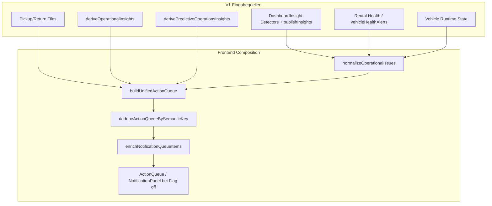
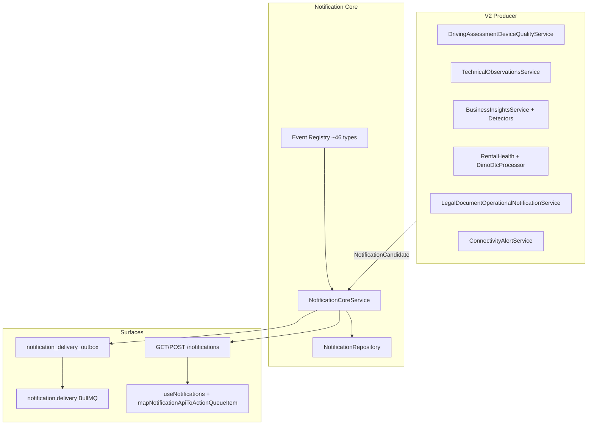
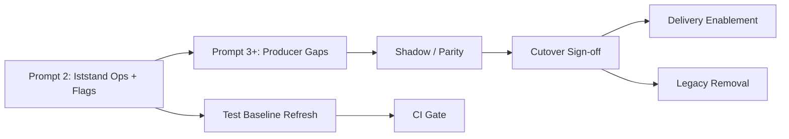

# Notification Engine — Remediation Baseline (Prompt 1/36)

**Datum:** 2026-07-26  
**Repository:** `SYNQDRIVE-alpha`  
**Branch:** `remediation/notification-engine-production-readiness-2026-07`  
**Commit (Analyse):** `3cdf772b3bdddd78d333a74496ed16929d1ab945`  
**Scope:** Read-only Ist-Analyse — keine fachliche Logik geändert  
**Methode:** Git-Status, vorhandene Notification-Dokumentation, Code-Verifikation, selektive Testausführung (lesend)

---

## Executive Summary

SynqDrive hat zwischen **Juli 2026** eine vollständige **Notification Engine V2** aufgebaut (Core, Registry, REST API, Runtime, Delivery-Outbox, Migration-Tooling, Frontend-Cutover), während **V1-Pfade bewusst parallel** erhalten bleiben. Produktions-Cutover für mindestens eine Pilot-Org (F.S Mobility) ist laut Architektur-Einträgen erfolgt (`NOTIFICATIONS_V2=true`, `VITE_NOTIFICATIONS_V2=on`, `NOTIFICATIONS_DELIVERY_ENABLED=false`).

**Kernbefund für die Remediation-Serie:**

| Bereich | Stand | Risiko |
|---------|-------|--------|
| Backend V2 Engine | Implementiert, getestet (179/181 notification suites) | Niedrig–mittel |
| Producer-Migration | Phase 1 + Health + Legal + Connectivity teilweise | Mittel (Lücken) |
| Frontend | V1/V2/Shadow per Flag; V1 synthetischer Feed deaktiviert in ActionQueue | Mittel |
| Daten-Migration | Tooling ready; kein automatisierter Prod-Lauf in CI | Hoch (operativ) |
| Delivery (E-Mail/Push) | Outbox + Worker vorhanden; Push stub; Delivery-Flag default off | Mittel |
| Legacy-Pfade | V1 ActionQueue, DashboardInsight, OrgTask-Bridge aktiv | Mittel bis Cutover |
| Dokumentation | `notification-engine-current-state.md` (2026-07-10) teils veraltet | Mittel |

**Empfehlung Prompt 2:** Produktions-Iststand je Org verifizieren (Flags, Backfill-Artefakte, Shadow-Deltas), dann priorisiert Producer-Lücken und Test-Drift schließen — nicht erneut Architektur neu erfinden.

---

## 1. Repository- und Branch-Status

| Feld | Wert |
|------|------|
| Ausgangsbranch | `main` @ `3cdf772b` |
| Arbeitsbranch | `remediation/notification-engine-production-readiness-2026-07` |
| Working tree vor Commit | clean |
| Änderungen Prompt 1 | nur dieses Dokument |

---

## 2. Analysierte Dokumente

### Primär (Notification Engine)

| Dokument | Version / Datum | Relevanz |
|----------|-----------------|----------|
| `docs/notification-engine-current-state.md` | 2026-07-10 | V1-Ist-Analyse; viele P0-Fixes inzwischen umgesetzt |
| `docs/notification-engine-core.md` | V4.9.352 | Core Service, Feature Flag |
| `docs/notification-engine-api.md` | V4.9.356 | REST API Vertrag |
| `docs/notification-engine-delivery-and-observability.md` | V4.9.358 | Outbox, BullMQ, Metrics |
| `docs/notification-engine-production-readiness.md` | V4.9.359 | CONDITIONAL GO Audit |
| `docs/notification-engine-migration-plan.md` | V4.9.351 | Schema; Outbox-Hinweis veraltet |
| `docs/notification-engine-migrated-producers-phase1.md` | V4.9.365+ | Shadow/Live Producer |
| `docs/notification-engine-frontend-cutover.md` | V4.9.358 | `VITE_NOTIFICATIONS_V2` |
| `docs/notification-engine-runtime.md` | V4.9.355 | Evaluation Queue + Redis Lock |
| `docs/notification-engine-event-registry.md` | V4.9.353 | ~46 Event-Type-Definitionen |
| `docs/notification-engine-test-baseline.md` | 2026-07-10 | Veraltete Fail-Zahlen |
| `docs/notification-engine-source-ownership.md` | P0 | Frontend semanticKey-Übergang |
| `docs/notification-engine-domain-contract.md` | (referenziert) | Domain-Enums |
| `docs/notification-engine-permissions-and-preferences.md` | V4.9.357 | Rollen, Station-Scope |

### Sekundär (angrenzend)

| Dokument | Bezug |
|----------|-------|
| `docs/audits/legal-documents-notifications-2026-07.md` | LEGAL_* V2 Producer |
| `docs/operational-issue-normalization.md` | V1 Normalizer |
| `docs/testing/workflow-automation-production-test-matrix-2026-07.md` | `notification.prepare` Workflow |
| `docs/audits/workflow-automation-post-remediation-production-readiness-2026-07.md` | Workflow ↔ Notifications |
| `frontend/src/master/components/ArchitekturView.tsx` | V4.9.361–V4.9.424 Notification-Einträge |
| `frontend/src/master/components/ChangesView.tsx` | Health-Producer, GDPR, Station-Scope Fixes |

---

## 3. Architektur — V1 vs V2

### 3.1 V1 (Legacy, weiterhin aktiv bei Flag off)



**Merkmale V1:**

- Persistenz: `dashboard_insights` (Publish-Swap, org-weit `isActive`)
- Identität: Frontend `semanticKey` / Backend `dedupeKey` (nicht identisch mit V2-Fingerprint)
- Kein User-Lifecycle (read/ack/snooze) auf Insight-Ebene
- `UserNotificationPreference` nicht an ActionQueue gebunden
- Synthetischer `dashboardNotifications`-Feed: Code existiert (`dashboardNotificationAdapter.ts`), wird in `useDashboardViewModel` **nicht mehr** an `buildUnifiedActionQueue` übergeben (`notifications: []`)

### 3.2 V2 (Kanonische Engine)



**Merkmale V2:**

- Persistenz: `notifications`, `notification_occurrences`, `notification_receipts`
- Identität: kanonischer Fingerprint `org|eventType|entityType|entityId|conditionCode|vN`
- Partial UNIQUE Index: max. eine aktive Zeile pro Fingerprint+Generation
- Org-weiter Lifecycle + per-User Receipts
- Delivery: transactional Outbox → E-Mail (Resend/Dev); Push `SUPPRESSED`

### 3.3 Parallele Logik (bewusst bis Sign-off)

| Aspekt | V1 | V2 |
|--------|----|----|
| Inbox UI | `buildUnifiedActionQueue` | `GET /notifications` |
| Driving Assessment | Insight + Normalizer | Runtime `syncDrivingAssessmentQuality` |
| Station Shortage | Legacy insight loop + Normalizer | `syncStationShortagesFromInsights` |
| Health Warnings | Rental Health → Frontend Alerts | `VehicleHealthNotificationAdapter` (live) |
| Tasks | `InsightTaskBridge` / OrgTask | unverändert, separater Pfad |
| Workflow `notification.prepare` | ActivityLog / Draft | **nicht** `ingestCandidate` |

---

## 4. Bekannte Producer (Code-verifiziert)

### 4.1 Live / Shadow über `NotificationProducerIngestService`

| Producer | Hook | V2 Event-Type(s) | Modus |
|----------|------|------------------|-------|
| `DrivingAssessmentDeviceQualityService` | `syncV2DrivingAssessment` nach State-Transition | `DRIVING_ASSESSMENT_DEVICE_QUALITY` | Shadow (Registry) |
| `TechnicalObservationsService` | create/resolve/dismiss/convert | `TECHNICAL_OBSERVATION_ACTIVE` | Shadow |
| `BusinessInsightsService` | nach `publishInsights` | `STATION_SHORTAGE`, `LOW_UTILIZATION` | Shadow |
| `BusinessInsightsService` | Fleet-Sweep nach BI-Run | `ACTIVE_DTC`, `TIRE_CRITICAL`, `BRAKE_CRITICAL`, `BATTERY_CRITICAL` | **Live** (`shadowModeOnly: false`) |
| `DimoDtcProcessor` | nach DTC-Poll | `ACTIVE_DTC` (realtime) | Live |
| `NotificationProducerIngestService` | `resolveInboxExcludedNotifications` | löst `HM_SERVICE_NO_TRACKING` auf | Live |

Zusatz: **6h Clear Grace** (`VEHICLE_HEALTH_NOTIFICATION_CLEAR_GRACE_MS`) vor Health-Resolve (VW-F-026).

### 4.2 Direkt `NotificationCoreService.ingestCandidate`

| Modul | Service | Event-Typen (Auszug) |
|-------|---------|----------------------|
| `documents` | `LegalDocumentOperationalNotificationService` | 20× `LEGAL_*` (Registry) |
| `dimo` | `ConnectivityAlertService` | Connectivity/Telemetry-Alerts |

### 4.3 V1-only / noch nicht an V2 angebunden

| Quelle | Pfad | Registry-Eintrag vorhanden? |
|--------|------|----------------------------|
| BI Detectors (Pickup/Return/Compliance/TÜV/…) | `DashboardInsight` publish | Ja, aber kein `ingestCandidate`-Hook |
| Booking/Handover Tiles | Frontend `pickupItems`/`returnItems` | Teilweise (`PICKUP_OVERDUE`, …) |
| Predictive / Derived Insights | Frontend-only | Teilweise |
| Workflow `notification.prepare` | `workflow-action-executor` → ActivityLog | Nein (separater Kanal) |
| IAM Membership Lifecycle | Audit Outbox + Activity | Nein |
| WhatsApp Automation Hooks | TODO-Kommentar | Nein |
| Trip Analysis / Misuse / Impact | Detektoren / Enrichment | Registry ja, Producer nein |

### 4.4 DashboardInsight → V2 Backfill (offline)

- `insight-candidate.mapper.ts` — alle 15 `InsightType` gemappt (laut Production-Readiness-Doc)
- CLI: `scripts/notification-migration-{dry-run,backfill,acceptance}.ts`
- **Nicht** automatisch bei Insight-Publish — separater Ops-Schritt

---

## 5. Bekannte Consumer

### 5.1 Frontend (Rental Dashboard)

| Consumer | Datenquelle | Flag |
|----------|---------------|------|
| `ActionQueue` / `NotificationPanel` | V1: `v1ActionQueue` | `VITE_NOTIFICATIONS_V2=off` |
| `ActionQueue` / `NotificationPanel` | V2: `useNotifications` | `on` |
| Shadow-Diagnostics | `compareNotificationQueuesShadow` | `shadow` |
| `BusinessInsightsBox` | eigene Tabs (Insights) | parallel zu ActionQueue |
| Badge Counts V2 | `GET /notifications/counts` | `on` |
| Supplemental V2 | `mergeV2WithVehicleHealth`, `extractOverdueHandoverQueueItems` | `on` (Bridge) |

### 5.2 Backend API

| Consumer | Endpoint / Service |
|----------|-------------------|
| Rental SPA | `/api/v1/organizations/:orgId/notifications*` |
| Delivery Worker | `notification_delivery_outbox` → OutboundEmail |
| Metrics/Grafana | `synqdrive_notification_*` |
| Preference Filter | `NotificationPreferenceService` |

### 5.3 Nicht-Consumer (Lücke)

- `UserNotificationPreference` → V1 ActionQueue: **kein Effekt**
- `DashboardInsight` API als Notification-UI nach V2-Cutover: soll entfallen (laut API-Doc)

---

## 6. Datenbanktabellen

| Tabelle | Rolle | Migration |
|---------|-------|-----------|
| `notifications` | Kanonische V2-Zeilen | `20260711120000_notification_engine_tables` |
| `notification_occurrences` | Audit / Occurrence-Historie | gleich |
| `notification_receipts` | Per-User read/ack/snooze/hidden | gleich |
| `notification_delivery_outbox` | Transactional Outbox | `20260711140000_notification_delivery_outbox` |
| `dashboard_insights` | V1 Producer + Backfill-Quelle | unverändert |
| `dashboard_insight_runs` | BI Run-Metadaten | unverändert |
| `user_notification_preferences` | Kanal-Präferenzen | unverändert |
| `vehicle_complaints` | Technical Observations | V1+V2 (über Producer) |
| `vehicle_driving_assessment_quality` | Device Quality State | V1+V2 |
| `org_tasks` | Task-Eskalation (parallel) | unverändert |
| `outbound_emails` | E-Mail-Audit für Delivery | bestehend |

**Constraints (kritisch):** Partial UNIQUE `(organization_id, fingerprint, lifecycle_generation)` WHERE status IN (`OPEN`,`ACKNOWLEDGED`,`SNOOZED`).

---

## 7. Queue- und Worker-Struktur

| Queue | Processor | Zweck |
|-------|-----------|-------|
| `notification.evaluation` | `NotificationEvaluationProcessor` | BI-Run + V2 Producer-Sync pro Org |
| `notification.delivery` | `NotificationDeliveryProcessor` | Outbox → E-Mail/Push |

**Orchestrierung:**

- `BusinessInsightsScheduler` (@Cron `2,32 * * * *`) → enqueue scheduled evaluation
- `BusinessInsightsTriggerService` → debounced delayed jobs (Redis pending list, kein `setTimeout`)
- `RedisDistributedLockService` — Key `notification:eval:lock:{orgId}`
- `NotificationDeliverySchedulerService` — 30s Outbox-Poller

**Weitere relevante Queues (indirekt):** `trip.behavior.enrichment` (Driving Assessment), `dtc.poll` (ACTIVE_DTC).

---

## 8. Frontend-Datenquellen (Detail)

| Datei | Rolle |
|-------|-------|
| `useDashboardViewModel.ts` | Cutover-Gate V1/V2/Shadow |
| `actionQueueBuilder.ts` | V1 Merge; `DRIVING_ASSESSMENT_DEVICE_QUALITY` in `NORMALIZED_INSIGHT_TYPES` |
| `normalizeOperationalIssues.ts` | Kanonische V1 semanticKeys |
| `notificationEngineDedupe.ts` | Fachliche Dedupe V1 |
| `dashboardNotificationAdapter.ts` | Synthetischer Insight-Feed (legacy, nicht in ActionQueue eingespeist) |
| `notifications-v2-flag.ts` | `off` / `shadow` / `on` |
| `useNotifications.ts` | V2 Query + Mutationen |
| `map-notification-api-to-view-model.ts` | DTO → ActionQueueItem |
| `merge-v2-with-vehicle-health.ts` | Übergangs-Dedupe |
| `enrich-notification-grouping.ts` | Panel-Gruppierung V4.9.366+ |

---

## 9. Workflow-Anbindungen

| Pfad | Status | Anmerkung |
|------|--------|-----------|
| `workflow-action-executor` → `execNotificationPrepare` | Aktiv | Erzeugt ActivityLog / Draft, **kein** V2 `ingestCandidate` |
| `workflow-dry-run` / `workflow-communication-contract` | Tests | Preview/Fallback für `notification.prepare` |
| `LegalDocumentOperationalNotificationService` | Aktiv | Zentraler LEGAL_* Producer → V2 Core |
| `whatsapp-automation-hooks` | TODO | Kein V2-Wiring |
| Task Automation Outbox | Separat | `task_automation` Queue, nicht Notification Engine |

Registry enthält `NotificationSourceType.WORKFLOW` für einige Event-Typen; generische Workflow-Benachrichtigungen sind **nicht** materialisiert.

---

## 10. Feature Flags

### Backend (`backend/.env.example`)

| Variable | Default | Wirkung |
|----------|---------|---------|
| `NOTIFICATIONS_V2` | `false` | Core Writes + API (503 wenn off) |
| `NOTIFICATIONS_DELIVERY_ENABLED` | `false` | Outbox-Verarbeitung |
| `WORKERS_ENABLED` | (worker config) | BullMQ Processor |
| `NOTIFICATION_EVALUATION_QUEUE_ENABLED` | `true` | Inline-Fallback wenn false |
| `NOTIFICATION_EVALUATION_DEBOUNCE_MS` | `120000` | Event-Debounce |
| `VEHICLE_HEALTH_NOTIFICATION_CLEAR_GRACE_MS` | `21600000` (6h) | Health-Resolve-Verzögerung |
| `VEHICLE_HEALTH_NOTIFICATION_SWEEP_LIMIT` | `2000` | Fleet-Sweep-Batch |

### Frontend

| Variable | Default | Wirkung |
|----------|---------|---------|
| `VITE_NOTIFICATIONS_V2` | `off` | `off` / `shadow` / `on` |

**Dokumentierter Pilot-Cutover (Architektur):** Org F.S Mobility — `NOTIFICATIONS_V2=true`, `VITE_NOTIFICATIONS_V2=on`, Delivery 48h aus.

---

## 11. Bereits umgesetzte Remediations (seit current-state 2026-07-10)

| Thema | Status | Nachweis |
|-------|--------|----------|
| `DRIVING_ASSESSMENT_DEVICE_QUALITY` in Normalized-Suppression | ✅ | `actionQueueBuilder.ts` Z.81–91, 478–479 |
| Synthetischer Feed aus ActionQueue entfernt | ✅ | `useDashboardViewModel.ts` `notifications: []` |
| V2 Core + API + Receipts | ✅ | `notifications.module.ts`, Controller |
| Event Registry (~46 Typen) | ✅ | `notification-event-registry.definitions.ts` |
| Evaluation Runtime (BullMQ + Redis Lock) | ✅ | `notification-evaluation.service.ts` |
| Delivery Outbox + Metrics + Grafana | ✅ | `delivery/*`, `synqdrive-ops.json` |
| Migration Backfill aller InsightTypes | ✅ | `insight-candidate.mapper.ts`, migration specs |
| Frontend Cutover + Panel UI | ✅ | `notification-engine-frontend-cutover.md`, Architektur V4.9.358+ |
| Health Producer Live + TPMS + Grace | ✅ | Changes V4.9.866, `notification-producers-phase1` |
| Legal Docs → V2 Notifications | ✅ | `legal-document-operational-notification.service.ts` |
| i18n Copy Fahrbewertung → Datenqualität | ✅ | `notificationQueueEnricher.ts` (V1-Anzeige) |
| Station-Scope via `StationAccessService` | ✅ | Changes VW-F-031 |

---

## 12. Widersprüche Dokumentation ↔ Code

| Dokument | Behauptung | Code-Ist (2026-07-26) |
|----------|------------|------------------------|
| `notification-engine-current-state.md` | Keine Notification Engine; 6 parallele Subsysteme | V2 Engine vollständig; V1 parallel |
| `notification-engine-current-state.md` | P0: DRIVING_ASSESSMENT nicht in NORMALIZED | **Behoben** |
| `notification-engine-current-state.md` | `dashboardNotifications` in ActionQueue | **Behoben** (leeres Array) |
| `notification-engine-core.md` | Workflow notifications nicht verdrahtet | Legal + Connectivity **sind** verdrahtet; Workflow `prepare` nicht |
| `notification-engine-migration-plan.md` | Outbox „NOT ADDED“ | `20260711140000_notification_delivery_outbox` existiert |
| `notification-engine-test-baseline.md` | 12 failing target tests | **4 failing** (anderer Grund, s. §15) |
| `notification-engine-production-readiness.md` | Frontend V2 „on feature branches“ | Architektur: merged + Pilot-Cutover V4.9.361 |
| `notification-engine-migrated-producers-phase1.md` | Vehicle Health shadow | **Live** seit V4.9.365/866 |

---

## 13. Legacy-Pfade (noch vorhanden — nicht löschen vor Sign-off)

| Pfad | Datei / Modul | Entfernung laut Docs |
|------|---------------|---------------------|
| V1 `buildUnifiedActionQueue` | `actionQueueBuilder.ts` | Nach 2+ Wochen stabiler V2 |
| `notificationEngineDedupe.ts` | Frontend | V1-only |
| `dashboardNotificationAdapter.ts` | Frontend | Synthetic feed |
| `notificationCtaResolver.ts` | Frontend | V1 CTA guessing |
| `dashboard-insights` als UI-Quelle | API + Context | Nach Cutover |
| `InsightTaskBridge` / OrgTask | tasks module | Separater Action-Layer |
| Shadow compare | `notification-shadow-compare.ts` | Optional post-cutover |
| BI `publishInsights` full swap | `business-insights` | Langfristig Upsert-by-fingerprint |

---

## 14. Unvollständige Migrationen

| Migration | Status | Blocker |
|-----------|--------|---------|
| Insight → V2 Backfill (prod) | Tooling ready, Ops manuell | Per-Org dry-run/apply/acceptance |
| Producer: Booking/Handover EVENTs | Registry only | Kein `ingestCandidate` in Booking-Hooks |
| Producer: Compliance/TÜV/BOKraft/Service Window | Insight-only | Kein V2-Hook |
| Producer: Trip/Misuse/Impact | Registry only | Kein Adapter |
| Workflow → V2 | ActivityLog only | Kein Registry-Ingest |
| Frontend global V2 | Flag-gated | Rollout / Shadow-Deltas |
| Delivery E-Mail fleet-wide | Flag off default | `NOTIFICATIONS_DELIVERY_ENABLED` |
| Push | Stub | `PUSH_NOT_IMPLEMENTED` |
| Per-User Quiet Hours / Digest DB | Env-only | Schema-Erweiterung deferred |
| Legacy code deletion | Not started | Bewusst deferred (Readiness §8) |

---

## 15. Teststatus (lesend ausgeführt, 2026-07-26)

### 15.1 Backend — `npm test -- --testPathPattern=notification`

| Metrik | Ergebnis |
|--------|----------|
| Suites | 26 passed, **1 failed**, 1 skipped (28 total) |
| Tests | **179 passed**, **1 failed**, 1 skipped (181 total) |

**Fehler (vorbestehend):**

```
FAIL notification-producers-phase1.spec.ts
  › vehicle health producers › ingests ACTIVE_DTC and TIRE_CRITICAL, resolves when cleared
  Expected: RESOLVED
  Received: OPEN
  (ACTIVE_DTC row bleibt nach Clear offen)
```

**Übrige Backend-Suites:** migration (6/6), characterization (13/13), API/Registry/Delivery specs — PASS.

**Nicht ausgeführt / übersprungen:**

- `notification-evaluation.live.integration` (benötigt `NOTIFICATION_EVALUATION_LIVE_INTEGRATION=1`)
- Volles `npm test` Backend (außerhalb Scope Prompt 1)

**Prisma validate:** Fehler `P1012` — `DATABASE_URL` nicht gesetzt (Umgebung, kein Schema-Fix versucht).

### 15.2 Frontend — Notification-relevante Suites

```bash
npm test -- --run notificationEngine*.test.ts dashboardNotificationAdapter.test.ts \
  src/rental/lib/notifications/*.test.ts src/rental/components/dashboard/notifications/*.test.ts
```

| Metrik | Ergebnis |
|--------|----------|
| Test Files | **2 failed**, 16 passed (18) |
| Tests | **4 failed**, 109 passed, 1 skipped (114) |

**Fehler (vorbestehend — Test-Drift, keine Reparatur in Prompt 1):**

| Test | Ursache (verifiziert) |
|------|------------------------|
| `notificationEngine.characterization.test.ts` — dedupe driving assessment | Assertion `title.includes('Fahrbewertung')` — Enricher liefert **„Datenqualität eingeschränkt“**; `semanticKey`-Dedupe funktioniert |
| `notificationEngine.characterization.test.ts` — merge parallel sources | `drivingAssessmentDuplicateCount` zählt nur Titel mit „Fahrbewertung“ → 0 |
| `notificationEngine.wob-l7503.test.ts` (2 Tests) | Gleicher Titel-Drift |

**Hinweis:** `docs/notification-engine-test-baseline.md` listet 12 failing „target architecture“ Tests — Stand Juli 2026 ist **4 failing** mit anderer Root Cause (i18n-Rename, nicht fehlende Dedupe).

---

## 16. Production-Risiken

### P0 — Blocker / sofort adressieren

| ID | Risiko | Impact |
|----|--------|--------|
| P0-1 | Prod-Backfill nicht in CI verifiziert | Duplikate/Leer-Inbox nach Flag-Flip |
| P0-2 | `ACTIVE_DTC` Resolve-Regression (Test) | Stale DTC-Notifications nach Clear |
| P0-3 | V1/V2 Parallelbetrieb bei partiellem Rollout | Doppelte oder widersprüchliche Meldungen |
| P0-4 | `NOTIFICATIONS_V2` ohne Frontend-Flag (oder umgekehrt) | 503 oder leeres Panel |

### P1 — Hoch

| ID | Risiko | Impact |
|----|--------|--------|
| P1-1 | Booking/Handover nur V1 supplemental | Lücken im V2-Inbox nach Cutover |
| P1-2 | BI `publishInsights` Swap | Transiente Duplikate beim Polling |
| P1-3 | Shadow-Deltas nicht überwacht | Cutover ohne Datenparität |
| P1-4 | Delivery-Flag-Erhöhung ohne Pilot | Unerwartete E-Mails |
| P1-5 | Test-Drift maskiert echte Regressionen | Falsches Vertrauen in CI |

### P2 — Mittel / akzeptiert mit Monitoring

| ID | Risiko | Impact |
|----|--------|--------|
| P2-1 | Push nicht implementiert | Outbox SUPPRESSED |
| P2-2 | Quiet Hours nur Env | Keine per-User-Konfiguration |
| P2-3 | Multi-Instance Cron enqueue | Durch jobId coalesced, aber Last |
| P2-4 | `fingerprintPartsFromInsightDedupeKey` ≠ Candidate-Fingerprint | Nur Backfill-Pfad relevant (dokumentiert) |
| P2-5 | Workflow notifications außerhalb Engine | Inkonsistente Ops-Kommunikation |

---

## 17. Priorisierte Findings (Remediation-Backlog)

| Prio | ID | Finding | Empfohlene Prompt-2-Richtung |
|------|-----|---------|------------------------------|
| P0 | F-01 | Vehicle Health DTC clear → RESOLVED schlägt fehl | Producer-Resolve-Logik + Grace-Interaktion prüfen |
| P0 | F-02 | Prod/Pilot Flag- und Migrations-Iststand unklar im Repo | Ops-Inventar: env, backfill JSON, acceptance SQL |
| P0 | F-03 | Characterization-Tests veraltet (Fahrbewertung-Titel) | Tests auf `semanticKey` / i18n-Keys umstellen |
| P1 | F-04 | ~30 Registry-Event-Types ohne Producer-Hook | Producer-Matrix vs Registry diffen |
| P1 | F-05 | Booking/Handover EVENT-Typen nicht ingestiert | Hooks in Booking-Lifecycle |
| P1 | F-06 | `notification-engine-current-state.md` irreführend | Archivieren oder „historical“ markieren |
| P1 | F-07 | Shadow-Mode-Deltas nicht automatisiert | CI oder Script für compareNotificationQueuesShadow |
| P2 | F-08 | Legacy-V1-Pfade noch importiert | Cutover-Checkliste + grep vor Löschung |
| P2 | F-09 | Workflow `notification.prepare` isoliert | Entscheidung: V2 ingest oder bewusst getrennt lassen |
| P2 | F-10 | Delivery Rollout | Gestaffelt `NOTIFICATIONS_DELIVERY_ENABLED` |

---

## 18. Abhängigkeiten für folgende Prompts (2–36)



| Abhängigkeit | Beschreibung |
|--------------|--------------|
| Ops-Zugang | VPS `backend.env` / `frontend.env`, `/opt/synqdrive/shared/notification-migration/` |
| Redis + Workers | Evaluation/Delivery nur mit `WORKERS_ENABLED` |
| Org-Scope | Alle Migrationsskripte `--org <UUID>` |
| Keine Logik in Prompt 1 | Folge-Prompts dürfen Producer/API/Frontend ändern |
| DIMO/Health | Health-Notifications hängen an Rental Health + DTC-Poll |
| Figma | Nur bei Panel-UI-Änderungen relevant |
| Changes/Architektur | Bei Implementierungs-Prompts aktualisieren |

---

## 19. Empfehlung für Prompt 2

1. **Operations-Baseline:** Flags und Migrations-Artefakte pro Org dokumentieren (Pilot vs Rest-Fleet).
2. **Producer-Registry-Diff:** Automatisiert alle `eventType` in Registry gegen `ingestCandidate`-Call-Sites diffen.
3. **F-01 beheben:** `notification-producers-phase1.spec.ts` Failure (ACTIVE_DTC resolve) — Root Cause in `syncVehicleHealthWarnings` / Grace.
4. **Test-Baseline aktualisieren:** `notification-engine-test-baseline.md` + Characterization-Fixtures auf „Datenqualität“ / `titleKey`.
5. **Shadow-Report:** Staging mit `VITE_NOTIFICATIONS_V2=shadow` — strukturierte Delta-Liste (missing/extra fingerprints).

---

## 20. Explizite Nicht-Ziele (Prompt 1)

- Keine Änderung an `NotificationCoreService`, Detectoren, ActionQueue-Logik
- Keine Test-Reparaturen
- Keine Flag-Flips in Umgebungen
- Keine Legacy-Löschungen

---

*Erstellt als Remediation-Baseline für die 36-Prompt Production-Readiness-Serie. Nächster Schritt: Prompt 2 — Ops-Iststand + Producer-Gap-Analyse.*
