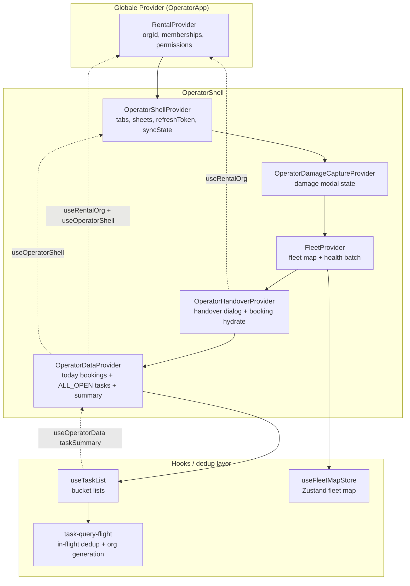
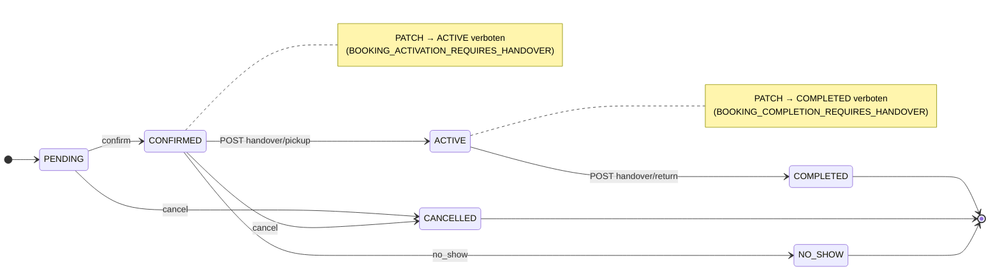
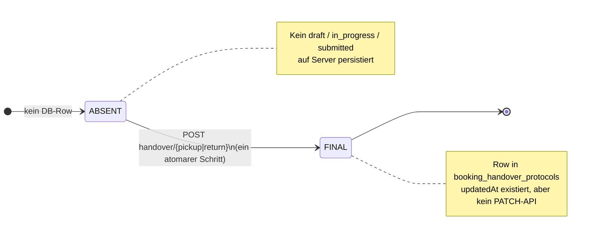
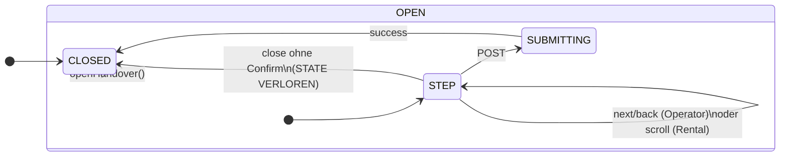
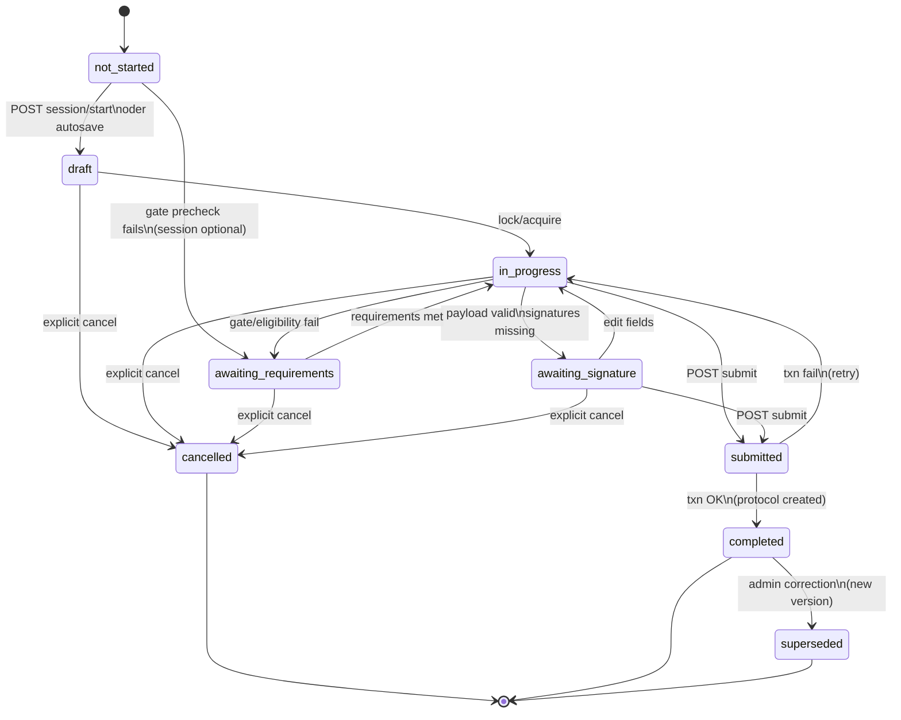

# Operator App — Production Readiness Audit (Baseline)

| Field | Value |
|-------|-------|
| **Audit ID** | `operator-app-production-readiness-2026-07` |
| **Prompt** | **1** (baseline) · **2** (Dateiinventur) · **3** (Dokumentationsabgleich) · **4** (Datenfluss) · **5** (Permissions) · **13** (Handover State-Machine) |
| **Repository** | `https://github.com/FATIHS-MGCKS/SYNQDRIVE-alpha` |
| **Audited commit** | `1d0f2caebe56aa1ecd23295aa33d20e953daa95d` (Prompt 1) · Branch-HEAD nach Prompt 2 |
| **Audit branch** | `audit/operator-app-production-readiness-2026-07` |
| **Baseline branch** | `main` |
| **Audit date** | 2026-07-25 UTC |
| **Method** | Direct repository inspection (structure, routes, API wiring, permissions, schema, tests). No runtime deployment verification in this prompt. |

---

## 1. Ziel und Scope

### 1.1 Ziel

Dieses Dokument erfasst den **nachweisbaren Ist-Zustand** der SynqDrive **Operator App** als Grundlage für eine vollständige Production-Readiness-Umsetzung (fachlich, technisch, sicherheitsseitig, DSGVO-nah, ISO-27001-nah).

### 1.2 Scope (dieser Prompt)

| In Scope | Out of Scope (spätere Prompts) |
|----------|--------------------------------|
| Projektstruktur, Build-/Test-/Lint-Befehle | Funktionale Änderungen |
| Operator-Frontend (`frontend/src/operator/`) | Remediation-Implementierung |
| Konsumierte Backend-APIs (bestehende Domänen) | Destruktive Migrationen |
| Rollen-/Permission-Wiring (nachweisbar im Code) | Pen-Test / Staging-Smokes |
| Datenmodelle (Prisma) für Operator-Flows | Formale Zertifizierungsnachweise |

### 1.3 Produktdefinition (Repository-Fakt)

Die Operator App ist **keine separate Anwendung**, sondern eine **mobile/tablet-orientierte Route-Oberfläche** innerhalb des bestehenden Vite/React-SPA unter `/operator`. Sie nutzt dieselben autoritativen Backend-Domänen wie die Rental-App (Bookings, Tasks, Vehicle Intelligence, Documents, Customers).

Quelle: `frontend/src/operator/README.md`, `frontend/src/App.tsx`, `frontend/src/operator/OperatorApp.tsx`.

---

## 2. Architekturübersicht

### 2.1 Repository-Layout

| Pfad | Rolle |
|------|-------|
| `backend/` | NestJS modular monolith, Prisma, Workers, API `/api/v1` |
| `frontend/` | Vite + React SPA (Rental, Master, **Operator**) |
| `architecture/` | In-Repo Architektur-Change-Records |
| `docs/audits/` | Audit-Artefakte |
| `shared/` | Geteilte Packages (z. B. evaluations-metrics) |
| `.cursor/` | Cloud-Agent Bootstrap, Regeln, Deploy-Skripte |

### 2.2 Package Manager

| Bereich | Manager | Lockfile |
|---------|---------|----------|
| Backend | **npm** | `backend/package-lock.json` |
| Frontend | **npm** | `frontend/package-lock.json` |

### 2.3 Build- und Deploy-Pfad

- Frontend-Build: `cd frontend && npm run build` → Output nach `backend/public/` (siehe `frontend/vite.config.ts`).
- Backend-Build: `cd backend && npm run build` → NestJS `dist/`.
- Produktions-Deploy: VPS-Skript klont `main`, baut beide, PM2-Restart (siehe `AGENTS.md`).

### 2.4 Operator-Integration in die SPA

```
App (BrowserRouter)
└── /operator/* → ProtectedRoute → OperatorApp
    └── RentalProvider
        └── OperatorAccessGuard
            └── Routes: index | vehicles/:vehicleId | bookings/:bookingId
                └── OperatorShell (Tabs + Sheets + Provider-Stack)
```

Einstieg zusätzlich über `OperatorEntryButton` in der Rental-Topbar (`frontend/src/rental/components/TopBar.tsx`).

### 2.5 Provider-Stack in `OperatorShell`

Reihenfolge (äußer → innen): `OperatorShellProvider` → `OperatorDamageCaptureProvider` → `FleetProvider` → `OperatorHandoverProvider` → `OperatorDataProvider` → UI.

> **V4.9.835:** `FleetProvider` umschließt jetzt `OperatorHandoverProvider`, damit Fleet-Invalidierungshandler vor Handover-Bridge registriert sind und kein Provider auf einen noch nicht gemounteten Child-Context zugreift.

---

## 3. Operator-App-Routen

### 3.1 React-Router (kanonisch)

| Pfad | Komponente | Zweck |
|------|------------|-------|
| `/operator` | `OperatorShell` | Haupt-Shell mit Bottom-Nav-Tabs |
| `/operator/vehicles/:vehicleId` | `OperatorShell` | Deep-Link Fahrzeug |
| `/operator/bookings/:bookingId` | `OperatorShell` | Deep-Link Buchung |
| `/operator/*` (sonst) | Redirect → `/operator` | Fallback |

Quelle: `frontend/src/operator/OperatorApp.tsx`, `frontend/src/App.tsx`.

### 3.2 Bottom-Navigation-Tabs

| Tab-ID | View-Komponente |
|--------|-----------------|
| `today` | `OperatorTodayView` |
| `scan` | `OperatorScanView` |
| `vehicles` | `OperatorVehiclesView` |
| `tasks` | `OperatorTasksView` |
| `more` | `OperatorMoreView` |

Quelle: `frontend/src/operator/lib/operatorTypes.ts`, `frontend/src/operator/OperatorShell.tsx`.

### 3.3 Deep-Link-Auflösung

`resolveOperatorDeepLink()` in `frontend/src/operator/lib/operatorRoutes.ts`:

| Intent | Auslöser |
|--------|----------|
| `vehicle` | Pfad `/vehicles/:vehicleId` oder Query `vehicleId` |
| `booking` | Pfad `/bookings/:bookingId` oder Query `bookingId` |
| `scan` | Query `q` |
| `tab` | Query `tab` ∈ `{today, scan, vehicles, tasks, more}` oder Pfad endet auf `/scan` |

Hilfs-URLs: `buildOperatorEntryUrl()`, `buildOperatorVehicleUrl()`, `buildOperatorBookingUrl()`, `buildOperatorScanQueryUrl()`.

### 3.4 Device Guard (UX, keine Security)

- `useIsOperatorDevice`: Viewport ≤1280px **oder** `(hover: none) and (pointer: coarse)`.
- Desktop ohne Touch: `OperatorDesktopOnlyNotice` (außer `VITE_ALLOW_OPERATOR_DESKTOP=true`).
- Quelle: `frontend/src/operator/hooks/useIsOperatorDevice.ts`, `frontend/src/operator/README.md`.

---

## 4. Frontend-Komponenten

### 4.1 Modul-Umfang

**117 Dateien** unter `frontend/src/operator/` (Stand Audit-Commit), davon **67 `.tsx`** Komponenten/Views.

### 4.2 Views (`frontend/src/operator/views/`)

| Datei | Funktion |
|-------|----------|
| `OperatorTodayView.tsx` | Tagesübersicht Pickups/Returns, Due-Now, Blocked Vehicles |
| `OperatorScanView.tsx` | Suche/Scan (Text; QR als späterer MVP-Hinweis) |
| `OperatorVehiclesView.tsx` | Fahrzeugliste mit Health/Quick-View |
| `OperatorTasksView.tsx` | Aufgabenliste mit Filtern |
| `OperatorMoreView.tsx` | Zusatzaktionen / Einstiegspunkte |

### 4.3 Feature-Bereiche

| Bereich | Pfad | Kernkomponenten |
|---------|------|-----------------|
| Handover | `handover/` | `OperatorHandoverFlow`, 6 Steps, `OperatorHandoverProvider` |
| Schäden | `damages/` | `OperatorDamageCaptureFlow` (Photo → Details → Review) |
| Buchungen | `bookings/` | Create/Edit/Cancel/No-Show Sheets |
| Aufgaben | `tasks/` | `OperatorTaskCard`, Detail, Create, Actions |
| Dokumente | `documents/` | `OperatorBookingDocumentsPanel` |
| AI Upload | `ai-upload/` | `OperatorAiUploadFlow`, `OperatorAiUploadReview` |
| Reifen | `tire-measure/` | `OperatorTireMeasureFlow` |
| Verifikation | `verification/` | `OperatorPickupCheckSheet` |
| Shell/Nav | `components/` | Header, BottomNav, ActionSheets, BookingDetail, QuickView, … |

### 4.4 Sheet-Aktionen (`OperatorSheetAction`)

Typen in `frontend/src/operator/lib/operatorTypes.ts`: `ai-upload`, `tire-measure`, `task-create`, `task-detail`, `booking-create`, `booking-edit`, `booking-cancel`, `booking-no-show`, `pickup-verification`.

Orchestriert über `OperatorActionSheets` / `OperatorShellContext.openSheet()`.

### 4.5 Wiederverwendung Rental-Domäne

Operator importiert bewusst Rental-Logik, u. a.:

- `bookingHandoverGates` (`frontend/src/rental/lib/bookingHandoverGates.ts`)
- `useDocumentExtractionFlow` (AI Upload)
- `FleetContext` / `FleetProvider`
- `RentalContext` / `RentalProvider`

Kein paralleles Operator-Backend im Frontend nachweisbar.

---

## 5. Provider und Contexts

| Context / Provider | Datei | Verantwortung |
|--------------------|-------|---------------|
| `RentalProvider` | `frontend/src/rental/RentalContext.tsx` | `orgId`, Org-Kontext |
| `OperatorAccessGuard` | `components/OperatorAccessGuard.tsx` | Auth, Rolle, Org-Profil, Rental businessType |
| `OperatorShellProvider` | `context/OperatorShellContext.tsx` | Tab, Deep-Link-State, Sheets, Sync-State, Refresh-Token |
| `OperatorDamageCaptureProvider` | `damages/OperatorDamageCaptureProvider.tsx` | Schaden-Erfassungs-Kontext |
| `OperatorHandoverProvider` | `handover/OperatorHandoverProvider.tsx` | Handover-Buchungsdaten, Stations, Schäden |
| `FleetProvider` | `frontend/src/rental/FleetContext.tsx` | Fahrzeugliste, Health-Map |
| `OperatorDataProvider` | `context/OperatorDataContext.tsx` | Today Pickups/Returns, Tasks, Summary |

### 5.1 Datenladung (`OperatorDataContext`)

Bei `orgId`-Wechsel / `refreshToken`:

- `api.bookings.todayPickups(orgId)`
- `api.bookings.todayReturns(orgId)`
- `fetchAllTasks(orgId, { bucket: 'ALL_OPEN' })`
- `api.tasks.summary(orgId)` (optional, Fehler geschluckt)

Task-Invalidierung über `subscribeTaskQueryInvalidation`.

---

## 6. Backend-Endpunkte

Die Operator App hat **keinen dedizierten Operator-Controller**. Sie konsumiert bestehende org-scoped APIs.

### 6.1 Bookings (`BookingsController` — Präfix `/organizations/:orgId/bookings`)

| Methode | Route (relativ) | Operator-Nutzung | Permission (Decorator) |
|---------|-----------------|------------------|------------------------|
| GET | `today/pickups` | Today-View | `bookings.read` |
| GET | `today/returns` | Today-View | `bookings.read` |
| GET | `/` (list) | Scan-Suche | `bookings.read` |
| GET | `:id` | Scan, Detail | `bookings.read` |
| GET | `:id/detail` | Handover-Vorbereitung | `bookings.read` |
| POST | `/` | Booking anlegen | `bookings.write` |
| PATCH | `:id` | Booking bearbeiten | `bookings.write` |
| DELETE | `:id` | Cancel | `bookings.manage` |
| POST | `:id/no-show` | No-Show | `bookings.write` |
| GET | `:id/handover` | Handover-Status | `bookings.read` |
| POST | `:id/handover/pickup` | Pickup-Handover | `bookings.write` |
| POST | `:id/handover/return` | Return-Handover | `bookings.write` |

Quelle: `backend/src/modules/bookings/bookings.controller.ts`.

### 6.2 Tasks (`TasksController`)

| Methode | Route | Operator-Nutzung | Permission |
|---------|-------|----------------|------------|
| GET | `organizations/:orgId/tasks` | Tasks-View, Listen | `tasks.read` → module `tasks`, level `read` |
| GET | `organizations/:orgId/tasks/summary` | Today-Badge / Feed | `tasks.read` |
| GET | `organizations/:orgId/tasks/:id` | Task-Detail | `tasks.read` |
| POST | `organizations/:orgId/tasks` | Task anlegen | `tasks.create` → `tasks.write` |
| PATCH | `…/start`, `…/waiting`, `…/complete` | Task-Aktionen | `tasks.update` / `tasks.complete` |
| POST | `…/comments` | Kommentar | `tasks.update` |
| PATCH | `…/checklist/:itemId` | Checkliste | `tasks.update` |

Quelle: `backend/src/modules/tasks/tasks.controller.ts`, `task-permission.constants.ts`.

Guards: `OrgScopingGuard`, `RolesGuard`, `PermissionsGuard`.

### 6.3 Documents (`DocumentsController` — Präfix `/organizations/:orgId`)

| Route | Operator-Nutzung | Permission |
|-------|------------------|------------|
| `bookings/:bookingId/documents` (list) | Handover-Dokumente | `bookings.read` |
| `documents/:id/open` | PDF öffnen | `bookings.read` |
| Rental-Contract-Routen | indirekt über Booking-Docs | `bookings.read` |

Quelle: `backend/src/modules/documents/documents.controller.ts`.

### 6.4 Vehicle Intelligence / Schäden / Reifen

Präfix: `vehicles/:vehicleId` — Guards: `RolesGuard`, `VehicleOwnershipGuard` (kein `PermissionsGuard` auf Controller-Ebene nachweisbar).

| Route (relativ) | Operator-Nutzung |
|-----------------|------------------|
| `damages`, `damages/active` | Handover-Schadenliste, Quick-View |
| POST `damages` | `OperatorDamageCaptureFlow` |
| `tires`, tire health, measurements | `OperatorTireMeasureFlow` |
| `document-extractions` | Quick-View |

Zusätzlich: `GET organizations/:orgId/damages/stats` — `DamagesOrgController` mit `OrgScopingGuard`, `RolesGuard` only.

Quelle: `backend/src/modules/vehicle-intelligence/vehicle-intelligence.controller.ts`, `damages-org.controller.ts`.

### 6.5 Weitere konsumierte APIs

| API-Bereich | Operator-Verwendung |
|-------------|---------------------|
| `api.organizations.getProfile` | Rental businessType Gate |
| `api.customers` / `customerDocuments` | Booking-Form, Dokumente |
| `api.stations` | Booking-Form, Handover |
| `api.users` | Handover Staff-Auswahl |
| `api.dashboardInsights` | Operational Alerts |
| `api.customerVerification.submitManualPickupCheck` | Pickup-Verifikation |

### 6.6 Document Extraction (AI Upload)

Operator setzt `uploadSource: 'operator_app'` (`operatorAiUpload.config.ts`). Backend erkennt `operator_app` u. a. für Upload-Rate-Limits (`document-upload-rate-limit.service.ts`).

Legal-Dokument-Scope enthält Kanal `OPERATOR_APP` (`legal-document-scope.constants.ts`).

---

## 7. Rollen und Berechtigungen

### 7.1 Frontend-Zugang (`operatorAccess.ts`)

| Rolle | Operator-Zugang |
|-------|-----------------|
| `MASTER_ADMIN` | erlaubt |
| `ORG_ADMIN` | erlaubt |
| `SUB_ADMIN` | erlaubt |
| `WORKER` | erlaubt |
| `DRIVER` | explizit verweigert |
| unbekannt / leer | verweigert |

Zusätzliche Gates: authentifiziert, `orgId` vorhanden, `businessType === 'RENTAL'`.

**Expliziter Hinweis im Code:** Frontend-Gate ist UX/Routing-Defense; Backend-Autorisierung bleibt maßgeblich (`operatorAccess.ts`, `README.md`).

### 7.2 Prisma `MembershipRole`

```
ORG_ADMIN | SUB_ADMIN | WORKER | DRIVER
```

Quelle: `backend/prisma/schema.prisma`.

### 7.3 Backend Permission-Module (Auszug)

Kanonical keys in `permission.constants.ts` — u. a. `bookings`, `tasks`, `document-upload`, `legal-documents`, `fleet`, `customers`.

Membership-spezifische JSON-Rechte `{ read, write, manage? }` pro Modul (siehe Kommentar in `permission.constants.ts`).

### 7.4 Task-Permission-Mapping

| Action | Modul | Level |
|--------|-------|-------|
| `tasks.read` | `tasks` | `read` |
| `tasks.create` | `tasks` | `write` |
| `tasks.update` / `assign` / `complete` / `cancel` | `tasks` | `write` |
| `tasks.manage_costs` | `tasks` | `manage` |

### 7.5 Handover Gate Override

`pickupGateOverrideReason` erfordert serverseitig Permission `legal_documents.override_handover` (`booking-pickup-gate.service.ts`).

---

## 8. Datenmodelle

Relevante Prisma-Modelle (autoritative Persistenz):

| Modell | Operator-Relevanz |
|--------|-------------------|
| `Booking` | Buchungen, Status, Stationen, Kunde/Fahrzeug |
| `BookingHandoverProtocol` | Pickup/Return-Protokolle inkl. Signaturen, Odometer, Fuel, `damageIds` JSON |
| `OrgTask` (+ `TaskChecklistItem`, `TaskComment`, `TaskEvent`, `TaskAttachment`) | Operative Aufgaben |
| `VehicleDamage` (+ `VehicleDamageImage`) | Schadenserfassung |
| `VehicleComplaint` | Technische Beobachtungen (Handover) |
| `VehicleDocumentExtraction` / Archive-Index | AI Upload Pipeline |
| `BookingDocumentBundle` / Generated Documents | Buchungsdokumente |

Handover-Payload-Vertrag: `backend/src/modules/bookings/handover.types.ts`  
Frontend-Mapping: `frontend/src/operator/handover/operatorHandoverPayload.ts`.

---

## 9. Übergabe- und Rückgabeprozesse

### 9.1 UI-Flow

6 Schritte (`OPERATOR_HANDOVER_STEPS`): `vehicle` → `condition` → `damages` → `documents` → `signatures` → `review`.

Komponenten: `OperatorHandoverStep*.tsx`, Submit via `OperatorHandoverFlow.tsx`.

### 9.2 API-Aufrufe

- Pickup: `api.bookings.createPickupHandover(orgId, bookingId, payload)`
- Return: `api.bookings.createReturnHandover(orgId, bookingId, payload)`

### 9.3 Gate-Logik (keine zweite Wahrheit im Frontend)

Pickup/Return-Gates werden über `deriveBookingPickupGate` / `deriveBookingReturnGate` aus `rental/lib/bookingHandoverGates.ts` abgeleitet; Operator mappt nur (`operatorData.ts`).

### 9.4 Payload-Inhalte (Server-Vertrag)

Odometer, Fuel, Checks (exterior/interior/tires/warning lights), Signaturen (Kunde/Mitarbeiter), `damageIds`, `technicalObservations`, optional `performedAt`, `actualStationId`, `pickupGateOverrideReason`, `eligibilityApprovalId`.

---

## 10. Dokumente und Uploads

### 10.1 Buchungsdokumente

- `useOperatorBookingDocuments` → `api.documents.listForBooking`
- `OperatorBookingDocumentsPanel` — Öffnen via `api.documents.open`
- Kundendokumente: `api.customers.customerDocuments.list`

### 10.2 AI Upload (Operator)

- `OperatorAiUploadFlow` nutzt `useDocumentExtractionFlow` mit `uploadSource: 'operator_app'`, `sourceSurface: 'operator_ai_upload'`
- Doc-Typen gemappt auf bestehende `DocumentExtractionType` Keys (`operatorAiUpload.config.ts`)
- Review/Confirm über `OperatorAiUploadReview` — **kein Auto-Apply** (shared AI-Upload-Architektur)

### 10.3 Backend-Kanal

`OPERATOR_APP` als `bookingChannel` in Legal-Document-Scope (`legal-document-scope.constants.ts`).

---

## 11. Schäden

### 11.1 Erfassungs-Flow

`OperatorDamageCaptureFlow`: Photo → Details → Review → Submit.

Submit: `api.vehicleIntelligence.createVehicleDamage(vehicleId, payload)` (`OperatorDamageCaptureFlow.tsx`).

### 11.2 Handover-Integration

Aktive Schäden: `api.vehicleIntelligence.damagesActive(vehicleId)` in `useOperatorHandoverForm.ts`. Ausgewählte IDs werden im Handover-Payload als `damageIds` übergeben.

### 11.3 Backend

`VehicleDamage` / `VehicleDamageImage` in Prisma; REST unter `vehicles/:vehicleId/damages*`. AI-Exterior-Analyse-Endpoint existiert, liefert derzeit „not available yet“-Antwort (`vehicle-intelligence.controller.ts`).

---

## 12. Aufgaben

### 12.1 Operator-Oberfläche

- Today-Feed: `OperatorTodayTaskFeed`, Aggregation via `operatorTodayFeed.utils`
- Tasks-Tab: `OperatorTasksView` mit `api.tasks.list` + Filtern
- Aktionen: `useOperatorTaskActions` (start, waiting, complete, comment, checklist)
- Erstellung: `OperatorTaskCreateForm` → `api.tasks.create`

### 12.2 Datenquelle

Tasks stammen aus `OrgTask` (Backend `TasksService`), org-scoped, mit `TaskEvent`-Audit-Timeline.

---

## 13. Offline/PWA

### 13.1 Nachweisbarer Stand

| Aspekt | Befund |
|--------|--------|
| Web App Manifest | **Nicht vorhanden** (`frontend/index.html` ohne manifest link) |
| Service Worker / Workbox | **Nicht vorhanden** (kein `vite-plugin-pwa`, kein `registerSW`) |
| Installierbarkeit | Nicht implementiert |
| Offline-Queue | **Nicht vorhanden** |
| Netzwerk-Hinweis | `OperatorConnectivityBanner` bei `navigator.onLine === false` |
| README | Bezeichnet Modul als „Web / PWA foundation“ |

### 13.2 Scan

`OperatorScanView` enthält Hinweis: QR-Scanner später — kein nativer Scanner im MVP.

---

## 14. Datenschutz

### 14.1 Personenbezogene Daten in Operator-Flows

- Kundennamen, Buchungsdaten, Signaturen (Handover), Dokumente, Verifikationsdaten (Pickup-Check).

### 14.2 Datenminimierung (Backend, Bookings)

`redactHandoverProtocolForList()` wird in `bookings.service.ts` für Today-Listen (`findTodaysPickups`, `findTodaysReturns`) und paginierte Listen verwendet — Signaturen in Listen redigiert.

Quelle: `booking-handover-privacy.util.ts`, `bookings.service.ts` (Zeilen mit `redactHandoverProtocolForList`).

### 14.3 Frontend

- Keine lokale Persistenz von Handover-Signaturen über Session hinaus dokumentiert in Access-Hardening-Changelog (Memory cleanup in `useOperatorHandoverForm`).
- Operator-UI enthält überwiegend **deutsch hardcodierte** Strings (kein durchgängiges i18n in Operator-Modul nachweisbar).

### 14.4 DSGVO / ISO

**Keine formale DSGVO- oder ISO-27001-Zertifizierung** aus diesem Repository ableitbar. Technische Bausteine (Tenant-Scoping, Permission-Guards, Audit-Events bei Tasks) sind vorhanden; organisatorische Nachweise liegen außerhalb des Repos.

---

## 15. Security

### 15.1 Authentifizierung

- SPA: `ProtectedRoute` erfordert `isAuthenticated()` für `/operator`.
- API: JWT via Backend `AuthGuard` (global Nest-Pipeline).

### 15.2 Autorisierung (Backend)

| Mechanismus | Anwendung |
|-------------|-----------|
| `OrgScopingGuard` | orgId-Pfad vs. JWT-Organisation |
| `RolesGuard` | Plattform-/Membership-Rollen |
| `PermissionsGuard` | Modul-Level `read`/`write`/`manage` |
| `VehicleOwnershipGuard` | Fahrzeug gehört zur Organisation |
| `@RequirePermission` / `@RequireTaskPermission` | Bookings, Tasks, Documents |

### 15.3 Bekannte Architektur-Hinweise (faktisch, ohne Bewertung)

- Vehicle-Intelligence-Schaden-Routen: `RolesGuard` + `VehicleOwnershipGuard`, **ohne** explizite `@RequirePermission` auf den Damage-Handleren im Controller.
- `DamagesOrgController`: nur `OrgScopingGuard`, `RolesGuard`.
- Frontend `canAccessOperatorApp()` ist **kein** Sicherheitsgrenze.

### 15.4 Schreiboperationen

Operator-Mutationen (Booking, Handover, Task, Damage, Document Apply) gehen über bestehende API-Endpunkte mit serverseitiger Validierung (DTOs/Service-Layer). Keine rein frontendseitige Autorisierung als alleiniger Schutz dokumentiert.

---

## 16. Observability

### 16.1 Operator-spezifisch

**Keine dedizierten Prometheus-Metriken oder strukturierten Log-Namespaces** für „operator_app“ im Backend nachweisbar.

### 16.2 Plattform-Observability (geteilt)

- Prometheus-Metriken u. a. für Vehicle Detail, Battery, Stations v2, Payments, DIMO Connectivity (`backend/src/modules/**/observability/`).
- Platform-Admin liefert Prometheus/Grafana-Hinweise (`platform-admin.service.ts`).

### 16.3 Frontend

- Sync-State in `OperatorShellContext` (`loading`, `lastSyncAt`, `error`).
- Kein Operator-spezifisches Client-Telemetry-Modul nachweisbar.

---

## 17. Tests

### 17.1 Package Manager & Befehle

#### Frontend (`frontend/package.json`)

| Befehl | Zweck |
|--------|-------|
| `npm ci` | Dependencies installieren |
| `npm run dev` | Vite Dev-Server (:5173) |
| `npm run build` | `tsc -b && vite build` |
| `npm run lint` | ESLint (scoped paths) |
| `npm run lint:all` | ESLint gesamtes `src/` + `test/` |
| `npm run test` | Vitest (`vitest run`) |
| `npm run test:e2e` | Playwright |
| Domänen-Suites | `test:bookings`, `test:document-intake:v2`, `test:vehicle-detail`, … |

#### Backend (`backend/package.json`)

| Befehl | Zweck |
|--------|-------|
| `npm ci` | Dependencies installieren |
| `npx prisma generate` | Prisma Client |
| `npm run build` | `nest build` |
| `npm run lint` / `lint:all` | ESLint |
| `npm run test` | Jest |
| `npm run test:e2e` | Jest E2E config |
| Domänen-Suites | `test:bookings`, `test:bookings:security`, `test:legal-documents`, `test:iam:security`, … |

### 17.2 Operator-Frontend-Tests (Vitest)

10 Testdateien unter `frontend/src/operator/`:

- `lib/operatorStatus.test.ts`
- `hooks/operatorTodayFeed.utils.test.ts`
- `views/operatorTodayView.utils.test.ts`
- `handover/operatorHandoverPayload.test.ts`
- `verification/operatorPickupCheckPayload.test.ts`
- `tasks/operatorTodayTasks.test.ts`, `operatorTaskDisplay.utils.test.ts`, `operatorTaskCard.utils.test.ts`, `OperatorTaskCard.test.tsx`
- `components/OperatorTodayTaskFeed.test.tsx`

### 17.3 Operator E2E

**Keine dedizierte Playwright-Suite** mit `operator` im Dateinamen gefunden. Operator wird indirekt in Document-Intake-/Fleet-Fixtures referenziert.

### 17.4 Backend-Tests (relevant, nicht operator-spezifisch)

- `test:bookings`, `test:bookings:security`
- `test:legal-documents`, `test:legal-documents:security`
- `test:iam:security`
- Document-extraction inkl. `operator_app` Rate-Limit-Spec

---

## 18. Findings

**Status: Inventur-basierte Vorfindings (Prompt 2) — noch keine vollständige P0/P1/P2-Bewertung.**

| ID | Schwere | Bereich | Finding | Evidenz |
|----|---------|---------|---------|---------|
| INV-001 | P1 | Security | `tasks.start` / `tasks.waiting` ohne `@RequireTaskPermission` | `tasks.controller.ts` L193–201 |
| INV-002 | P1 | Security | Vehicle-Damage-Routen ohne `@RequirePermission` (nur `VehicleOwnershipGuard`) | `vehicle-intelligence.controller.ts` damages-Handler |
| INV-003 | P1 | Security | Frontend-Zugang (`canAccessOperatorApp`, Device-Guard) ist explizit **kein** Security-Boundary | `operatorAccess.ts`, `README.md` |
| INV-004 | P2 | PWA/Offline | Kein Service Worker, kein Manifest, keine Offline-Queue; Banner suggeriert Sync | `index.html`, `OperatorConnectivityBanner.tsx` |
| INV-005 | P2 | Tests | Keine dedizierte Operator-E2E-/Security-Matrix | `frontend/e2e/` |
| INV-006 | P2 | Datenfluss | Parallele Task-Ladepfade (`OperatorDataContext`, `useOperatorTodayFeed`, `OperatorTasksView` remote) | Mehrfach `api.tasks.*` |
| INV-007 | P2 | UX/Fehler | `OperatorTasksView.fetchRemoteTasks` schluckt Fehler (`catch → []`) | `OperatorTasksView.tsx` L65–67 |
| INV-008 | P3 | Doku | `README.md` „Wire placeholders“ veraltet — Flows sind verdrahtet | `README.md` L21–23 |
| INV-009 | P3 | API | Deprecated Alias `vehicleIntelligence.damagesActive` noch in Handover-Form | `useOperatorHandoverForm.ts` |
| INV-010 | P3 | Feature | QR-Scanner / QR-Link-Generator nur Platzhalter-UI | `OperatorScanView`, `OperatorLinkCard` |

---

## 19. Remediation-Status

| Bereich | Status |
|---------|--------|
| Baseline-Audit (Prompt 1) | ✅ |
| Vollständige Dateiinventur (Prompt 2) | ✅ Kap. 21–24 |
| Traceability-Matrix | ✅ Kap. 22 |
| Dokumentationsabgleich (Prompt 3) | ✅ Kap. 25 |
| Vollständige Datenfluss-Traceability (Prompt 4) | ✅ Kap. 26 |
| Permission-Modell (Prompt 5) | ✅ Kap. 27 + `architecture/OPERATOR_PERMISSIONS_2026-07-25.md` |
| Security-Hardening | ⏳ Ausstehend |
| PWA/Offline | ⏳ Ausstehend |
| E2E Operator-Matrix | ⏳ Ausstehend |
| DSGVO/ISO-Evidence-Pack | ⏳ Ausstehend |

---

## 20. Production Gates

**Status: Noch nicht definiert für Operator App.**

Vorbild im Repository: `docs/audits/booking-post-remediation-production-readiness-2026-07.md` (Go/No-Go-Kriterien für Booking-Domäne). Operator-spezifische Gates werden in späteren Prompts ergänzt.

Vorläufige Kategorien (ohne Pass/Fail):

1. Keine offenen P0/P1 Security-Findings für Operator-konsumierte Endpunkte
2. Jede Schreiboperation serverseitig autorisiert, validiert, mandantengetrennt, auditierbar
3. Keine zweite fachliche Wahrheit (Bookings, Tasks, Damages, Documents, Handover)
4. Mobile Readiness (320–1280px) und Accessibility-Baseline
5. Operator E2E + Security-Negative-Tests grün
6. DSGVO-technische Controls (Datenminimierung in Listen, Signaturen, Retention) verifiziert
7. Observability/Runbooks für Feldbetrieb
8. PWA/Offline-Strategie bewusst entschieden (implementiert oder explizit out-of-scope)

---

## 21. Vollständige Dateiinventur (`frontend/src/operator/**`)

**Stand:** 117 Dateien (67× `.tsx`, 49× `.ts`, 1× `README.md`). Keine Service-Worker-/PWA-Dateien im Operator-Modul oder Frontend-Root.

**Legende Spalten:** API = direkte `api.*`-Aufrufe oder transitive Hooks; W = Schreiboperation; Rolle = Frontend-Rollenprüfung; Org = `orgId`-Bezug; St = Stationsbezug; State = Cache/State; L/E = Loading/Error; T = Testdatei vorhanden.

### 21.1 Root & Routing

| Datei | Verantwortung | API | W | Rolle | Org | St | State | L/E | T | TODO/Platzhalter |
|-------|---------------|-----|---|-------|-----|----|----|-----|---|------------------|
| `OperatorApp.tsx` | Router `/operator`, `RentalProvider`, Toaster | — | — | via Guard | via Rental | — | — | — | — | — |
| `OperatorShell.tsx` | Provider-Stack, Tab-Switch, Device-Guard | — | — | `useIsOperatorDevice` | — | — | Shell-Context | — | — | — |
| `index.ts` | Public exports für Rental/Master | — | — | — | — | — | — | — | — | — |
| `README.md` | Dev-Doku Entry/Device/Security | — | — | dokumentiert | — | — | — | — | — | **TODO veraltet** (L21–23) |

### 21.2 `lib/` — Typen, Routen, Access, Daten

| Datei | Verantwortung | API | W | Rolle | Org | St | State | L/E | T |
|-------|---------------|-----|---|-------|-----|----|----|-----|---|
| `operatorTypes.ts` | Tab-IDs, `OperatorSheetAction`, Sync-State-Typen | — | — | — | — | — | Typen | — | — |
| `operatorRoutes.ts` | Deep-Link-Auflösung, URL-Builder | — | — | — | — | — | Pure fn | — | — |
| `operatorAccess.ts` | Frontend-Zugang ORG_ADMIN/SUB_ADMIN/WORKER/MASTER | — | — | **Ja** (`evaluateOperatorAccess`) | — | — | `getStoredUser` | — | — |
| `operatorAccess.types.ts` | Allowed/Denied Roles, Denial-Reasons | — | — | Konstanten | — | — | — | — | — |
| `operatorData.ts` | Today-Snapshot, Gate-Ableitung, Scan→Detail-Mapping | — (nutzt Rental-Gates) | — | — | indirekt | St aus API-Rows | Pure/derive | — | — |
| `operatorStatus.ts` | Vehicle-Status-Badges für Listen | — | — | — | — | — | Pure | — | ✅ |
| `operatorVehicleQuickView.utils.ts` | Quick-View-Labels, Health-Module, Pickup/Return-Row-Finder | — | — | — | — | St aus Rows | Pure | — | — |

### 21.3 `context/`

| Datei | Verantwortung | API | W | Rolle | Org | St | State | L/E | T |
|-------|---------------|-----|---|-------|-----|----|----|-----|---|
| `OperatorShellContext.tsx` | Tab, Deep-Link-State, Sheets, `refreshToken`, `syncState` | — | — | — | — | — | React Context | — | — |
| `OperatorDataContext.tsx` | Today Pickups/Returns + Tasks + Summary | `bookings.todayPickups/Returns`, `tasks.summary`, `fetchAllTasks` | — | — | **orgId** | — | useState, invalidation subscribe | ✅ loading/error per domain | — |

### 21.4 `hooks/`

| Datei | Verantwortung | API | W | Rolle | Org | St | State | L/E | T |
|-------|---------------|-----|---|-------|-----|----|----|-----|---|
| `useIsOperatorDevice.ts` | Viewport/Touch UX-Guard | — | — | — | — | — | matchMedia | — | — |
| `useOperatorNetworkStatus.ts` | `navigator.onLine` | — | — | — | — | — | useSyncExternalStore | — | — |
| `useOperatorTabletLayout.ts` | Tablet Split-Layout (≥768px) | — | — | — | — | — | matchMedia | — | — |
| `useOperatorToday.ts` | Today-Aggregat Hook | transitiv DataContext + TodayFeed | — | — | orgId | — | useMemo snapshot | ✅ stale/offline/reload | — |
| `useOperatorTodayFeed.ts` | Task-Buckets NOW/TODAY/… via `useTaskList` | `tasks.list` (5× bucket), `tasks.summary` | — | **hasPermission** für UNASSIGNED | orgId | — | React Query hooks | ✅ per bucket | — |
| `operatorTodayFeed.utils.ts` | Bucket-Slice-Builder, UNASSIGNED-Gate | — | — | role+permission check | — | — | Pure | — | ✅ |
| `useOperatorVehiclesData.ts` | Fleet-Liste + Health (FleetContext) | transitiv `vehicles.fleetMap`, `rentalHealth.*` | — | — | orgId | St in VehicleData | FleetContext | ✅ health L/E | — |
| `useOperatorVehicleQuickViewData.ts` | Quick-View-Datenaggregation | damages, tires, docs, `tasks.forVehicle` | — | — | orgId | St aus vehicle/pickups | local useState + OperatorData | ✅ partial swallow `.catch` | — |
| `useOperatorScanSearch.ts` | Scan: Fleet-Filter + Booking-Suche | `bookings.get`, `bookings.list` | — | — | orgId | — | useState | ✅ bookingsError | — |
| `useOperatorBookingMutations.ts` | Booking CRUD/Cancel/NoShow | `bookings.create/update/cancel/markNoShow` | **Ja** | — | orgId | St in payload | mutating/error + toast | ✅ toast errors | — |
| `useOperatorOperationalAlerts.ts` | Dashboard-Insights (max 5) | `dashboardInsights.get` | — | — | orgId | — | useState | ✅ catch→[] | — |

### 21.5 `views/`

| Datei | Verantwortung | API | W | Rolle | Org | St | State | L/E | T |
|-------|---------------|-----|---|-------|-----|----|----|-----|---|
| `OperatorTodayView.tsx` | Tagesüberblick, Handover-CTAs, Alerts | transitiv Hooks | Sheet-W | — | orgId | St in Cards | local detail state | ✅ Skeleton/Error/Empty | — |
| `operatorTodayView.utils.ts` | Empty/stale/banner-Logik | — | — | — | — | — | Pure | — | ✅ |
| `OperatorVehiclesView.tsx` | Fahrzeugliste + Filter + Quick View | transitiv | Sheet-W | — | orgId | St in list | filter/search local | ✅ | — |
| `OperatorScanView.tsx` | Textsuche, Booking/Vehicle-Treffer | transitiv scan hook | Handover-W | — | orgId | — | shell deep-link state | ✅ | — |
| `OperatorTasksView.tsx` | Task-Liste, Filter, Detail | `tasks.list` (+ DataContext) | Sheet-W | scope mine/all | orgId | booking filter | remoteTasks local | ⚠️ remote catch→[] | — |
| `OperatorMoreView.tsx` | Shortcuts AI/Tire/Booking, Theme, Link Rental | — | Sheet open | — | — | — | picker local | — | — |

**Scan-Platzhalter:** `OperatorScanView.tsx` L114 — QR-Scanner „später/MVP“.

### 21.6 `components/` (Shell, Nav, Cards, Bridges)

| Datei | Verantwortung | API | W | Rolle | Org | St | State | L/E | T |
|-------|---------------|-----|---|-------|-----|----|----|-----|---|
| `OperatorAccessGuard.tsx` | Auth + Rolle + Rental businessType | `organizations.getProfile` | — | **Ja** | **orgId** | — | gate state machine | ✅ retry | — |
| `OperatorAccessDeniedScreen.tsx` | Denial UX | — | — | — | — | — | — | — | — |
| `OperatorAccessLoadingScreen.tsx` | Loading UX | — | — | — | — | — | — | — | — |
| `OperatorActionSheets.tsx` | Sheet-Router (AI, Task, Booking, Verify, Tire) | — | — | — | — | — | shell `sheetAction` | — | — |
| `OperatorDeepLinkBridge.tsx` | URL→Shell-State Sync | — | — | — | — | — | useEffect | — | — |
| `OperatorHandoverRefreshBridge.tsx` | Invalidation nach Handover/Damage/Task | — | — | — | orgId | — | window events + registry | — | — |
| `OperatorConnectivityBanner.tsx` | Offline-Hinweis | — | — | — | — | — | `navigator.onLine` | — | — |
| `OperatorHeader.tsx` | Titel, Sync-Indikator, Refresh | — | — | — | — | — | `syncState` | ✅ error dot | — |
| `OperatorBottomNav.tsx` | 5 Tabs | — | — | — | — | — | shell tab | — | — |
| `OperatorDesktopOnlyNotice.tsx` | Desktop-Blocker | — | — | Device | — | — | — | — | — |
| `OperatorEntryButton.tsx` | Rental-Topbar-Einstieg | — | — | `canAccessOperatorApp` | — | — | modal state | — | — |
| `OperatorEntryModal.tsx` | Desktop: URL kopieren | — | — | — | — | — | — | — | — |
| `OperatorLinkCard.tsx` | Deep-Link-Karte | — | — | — | — | — | — | — | **QR folgt später** |
| `OperatorBookingCard.tsx` | Today/Scan Booking-Karte | — | — | — | — | St | props | — | — |
| `OperatorBookingDetailSheet.tsx` | Booking-Detail + Gates | `bookings.detail` | Sheet actions | — | orgId | St | local load | ✅ | — |
| `OperatorScanBookingCard.tsx` | Scan Booking-Karte | — | — | — | — | — | props | — | — |
| `OperatorScanVehicleCard.tsx` | Scan Vehicle-Karte | — | — | — | — | St | props | — | — |
| `OperatorTodaySection.tsx` | Section-Wrapper | — | — | — | — | — | — | — | — |
| `OperatorTodayTaskFeed.tsx` | Task-Bucket-Rendering | — | — | — | — | — | props | — | ✅ |
| `OperatorListCard.tsx` | Generische Listenkarte | — | — | — | — | — | — | — | — |
| `OperatorGlassCard.tsx` | Glassmorphism Card | — | — | — | — | — | — | — | — |
| `OperatorStatusChip.tsx` | Status-Chip | — | — | — | — | — | — | — | — |
| `OperatorTabletFrame.tsx` | Split List/Detail Layout | — | — | — | — | — | — | — | — |
| `OperatorVehicleQuickView.tsx` | Fahrzeug-Hub (Handover, Damage, AI, Tasks) | transitiv quick-view hook | **Ja** (sheets) | — | orgId | St | hook state | ✅ Skeleton | — |
| `OperatorAiUploadSheet.tsx` | Sheet wrapper AI Upload | — | — | — | — | — | — | — | — |
| `OperatorTireMeasureSheet.tsx` | Sheet wrapper Tire | — | — | — | — | — | — | — | — |
| `OperatorTaskSheet.tsx` | Sheet wrapper Task create/detail | — | — | — | — | — | — | — | — |

### 21.7 `handover/` — Pickup & Return (gemeinsamer Flow, `kind` unterscheidet)

| Datei | Verantwortung | API | W | Rolle | Org | St | State | L/E | T |
|-------|---------------|-----|---|-------|-----|----|----|-----|---|
| `OperatorHandoverProvider.tsx` | Modal-State, Staff-Liste, Booking-Hydration | `users.listByOrg`, `bookings.detail/get` | — | — | orgId | **Ja** (stations in booking) | isOpen/booking state | ✅ fallback get | — |
| `OperatorHandoverFlow.tsx` | 6-Step Wizard, Submit | `createPickup/ReturnHandover` | **Ja** | — | orgId | actualStationId | step/form state | ✅ submit error | — |
| `useOperatorHandoverForm.ts` | Form-State, Damages, Docs, Telemetry | `stations.list`, `documents.listForBooking`, `damagesActive`, telemetry | — | — | orgId | **Ja** | useState + cleanup sigs | ✅ | — |
| `operatorHandoverPayload.ts` | Validierung, Payload-Build | — | — | — | — | St in payload | Pure | — | ✅ |
| `operatorHandoverUi.tsx` | Shared UI bits | — | — | — | — | — | — | — | — |
| `operatorHandoverTechnicalObservations.ts` | Observation drafts/chips | — | — | — | — | — | Pure | — | — |
| `OperatorHandoverStepVehicle.tsx` | Step 1 Fahrzeug/Station | — | — | — | — | **Ja** | form | — | — |
| `OperatorHandoverStepCondition.tsx` | Step 2 Odometer/Fuel/Checks | — | — | — | — | — | form | — | — |
| `OperatorHandoverStepDamages.tsx` | Step 3 Schaden-Auswahl/Erfassung | via DamageCapture | — | — | — | — | form | — | — |
| `OperatorHandoverStepDocuments.tsx` | Step 4 Dokument-Ack | via documents hook | — | — | orgId | — | form | — | — |
| `OperatorHandoverStepSignatures.tsx` | Step 5 Kunde/Mitarbeiter-Signaturen | — | — | — | — | — | canvas state | — | — |
| `OperatorHandoverStepReview.tsx` | Step 6 Review | — | — | — | — | — | — | — | — |
| `OperatorHandoverTechnicalObservationsSection.tsx` | Tech-Obs UI | — | — | — | — | — | drafts | — | — |
| `handover/index.ts` | Re-exports | — | — | — | — | — | — | — | — |

**Hinweis:** Separater Return-Flow existiert nicht — `HandoverDialogKind` = `PICKUP` | `RETURN` steuert API-Endpunkt und Validierung.

### 21.8 `damages/`

| Datei | Verantwortung | API | W | Rolle | Org | St | State | L/E | T |
|-------|---------------|-----|---|-------|-----|----|----|-----|---|
| `OperatorDamageCaptureProvider.tsx` | Modal-State, Context | — | — | — | — | — | isOpen/context | — | — |
| `OperatorDamageCaptureFlow.tsx` | 4-Step Capture + Submit | `createVehicleDamage` | **Ja** | — | via vehicle org | booking link | form/photos | ✅ submit error | — |
| `operatorDamagePayload.ts` | Form defaults, validation, payload | — | — | — | — | — | Pure | — | — |
| `operatorDamageImage.utils.ts` | Image resize/dataURL | — | — | — | — | — | Pure | — | — |
| `OperatorDamagePhotoStep.tsx` | Foto-Step | — | — | — | — | — | local photos | — | — |
| `OperatorDamageDetailsStep.tsx` | Klassifizierung-Step | — | — | — | — | — | form | — | — |
| `OperatorDamageReviewStep.tsx` | Review-Step | — | — | — | — | — | — | — | — |

### 21.9 `bookings/`

| Datei | Verantwortung | API | W | Rolle | Org | St | State | L/E | T |
|-------|---------------|-----|---|-------|-----|----|----|-----|---|
| `OperatorBookingFormSheet.tsx` | Create/Edit Booking | `stations.list`, `customers.list/get`, `bookings.detail`, mutations | **Ja** | — | orgId | **Ja** pick/return station | form state | ✅ | — |
| `OperatorBookingCancelSheet.tsx` | Cancel | `bookings.detail`, `cancel` | **Ja** | — | orgId | — | form | ✅ | — |
| `OperatorBookingNoShowSheet.tsx` | No-Show | `bookings.detail`, `markNoShow` | **Ja** | — | orgId | — | form | ✅ | — |
| `operatorBooking.utils.ts` | Error formatting, display helpers | — | — | — | — | — | Pure | — | — |
| `operatorBookingSheetShell.tsx` | Shared sheet chrome | — | — | — | — | — | — | — | — |

### 21.10 `tasks/`

| Datei | Verantwortung | API | W | Rolle | Org | St | State | L/E | T |
|-------|---------------|-----|---|-------|-----|----|----|-----|---|
| `OperatorTasksView.tsx` | (siehe views) | — | — | — | — | — | — | — | — |
| `OperatorTaskCard.tsx` | Task-Karten-UI | — | — | — | — | — | props | — | ✅ |
| `OperatorTaskCardConnected.tsx` | Card + Actions wiring | via `useOperatorTaskActions` | **Ja** | — | orgId | — | — | toast | — |
| `OperatorTaskDetail.tsx` | Task-Detail in Sheet | `tasks.get` | via actions | — | orgId | — | local | ✅ | — |
| `OperatorTaskCreateForm.tsx` | Manuelle Task-Erstellung | `tasks.create` | **Ja** | — | orgId | optional stationId metadata | form | ✅ | — |
| `useOperatorTaskActions.ts` | start/wait/complete/comment/checklist | `tasks.*` mutations | **Ja** | — | orgId | — | busy via parent | toast | — |
| `useOperatorTaskCardController.ts` | Card expand/collapse | — | — | — | — | — | local | — | — |
| `operatorTask.utils.ts` | Filter/sort/API filter build | — | — | — | — | — | Pure | — | — |
| `operatorTodayTasks.ts` | Canonical task filter | — | — | — | — | — | Pure | — | ✅ |
| `operatorTaskDisplay.utils.ts` | Labels, vehicle map | — | — | — | — | — | Pure | — | ✅ |
| `operatorTaskCard.utils.ts` | Card helper | — | — | — | — | — | Pure | — | ✅ |

### 21.11 `documents/`, `ai-upload/`, `tire-measure/`, `verification/`

| Datei | Verantwortung | API | W | Rolle | Org | St | State | L/E | T |
|-------|---------------|-----|---|-------|-----|----|----|-----|---|
| `useOperatorBookingDocuments.ts` | Booking-Dokument-Slots | `documents.listForBooking` | — | — | orgId | — | useState | ✅ | — |
| `operatorBookingDocuments.utils.ts` | Slot-Mapping | — | — | — | — | — | Pure | — | — |
| `OperatorBookingDocumentsPanel.tsx` | UI + Kundendokumente | `customerDocuments.list`, `documents.open` | — | — | orgId | — | local | ✅ | — |
| `OperatorAiUploadFlow.tsx` | AI Upload UI | `useDocumentExtractionFlow` → ~12 endpoints | **confirm** | — | orgId | — | flow state | ✅ flow errors | — |
| `OperatorAiUploadReview.tsx` | Review/Confirm panel | confirm via flow | **Ja** | — | orgId | — | — | — | — |
| `operatorAiUpload.config.ts` | Doc types, `operator_app` source | — | — | — | — | — | constants | — | — |
| `OperatorTireMeasureFlow.tsx` | Reifen-UI | via payload hook | **Ja** | — | — | — | multi-step | ✅ | — |
| `useOperatorTireMeasureData.ts` | Tire setups load | `tires`, `tireHealthSummary` | — | — | — | — | useState | ✅ catch | — |
| `operatorTireMeasurePayload.ts` | Measurement submit | `addTireMeasurement`, `addTireHealthMeasurement` | **Ja** | — | — | — | — | throw | — |
| `operatorTireMeasure.utils.ts` | Tread parsing | — | — | — | — | — | Pure | — | — |
| `operatorTireMeasure.types.ts` | Types | — | — | — | — | — | — | — | — |
| `OperatorTireMeasureTreadGrid.tsx` | Tread input grid | — | — | — | — | — | — | — | — |
| `OperatorPickupCheckSheet.tsx` | Manuelle Pickup-Verifikation | `customerVerification.submitManualPickupCheck` | **Ja** | — | service-resolved | — | form | ✅ | — |
| `operatorPickupCheckPayload.ts` | Payload build | — | — | — | — | — | Pure | — | ✅ |

### 21.12 Globale Provider (außerhalb `operator/`, von Operator genutzt)

| Provider | Datei | Operator-relevante APIs | Org | Rolle/Permission |
|----------|-------|-------------------------|-----|------------------|
| `RentalProvider` | `rental/RentalContext.tsx` | `auth.memberships`, `auth.switchOrganization`, `organizations.list` | **Ja** | membership role, `hasPermission` |
| `FleetProvider` | `rental/FleetContext.tsx` | `vehicles.fleetMap`, `rentalHealth.getFleetScoped` | **Ja** | `fleet.read` (health) |
| `AppThemeProvider` | `context/AppThemeContext.tsx` | — | — | — |
| `ProtectedRoute` | `App.tsx` | JWT session | — | `isAuthenticated` |

### 21.13 Service Worker / PWA

| Suche | Ergebnis |
|-------|----------|
| `serviceWorker`, `service-worker`, `manifest.webmanifest`, `vite-plugin-pwa` im `frontend/` | **0 Treffer** |
| `index.html` | Kein Manifest-Link, kein SW-Register |

### 21.14 Redundante / obsolete Implementierungen

| Befund | Details |
|--------|---------|
| Doppelte Task-Loads | `OperatorDataContext` lädt `ALL_OPEN`; `useOperatorTodayFeed` lädt 5 Buckets; `OperatorTasksView` lädt gefiltert remote — gleiche Domäne, verschiedene Caches |
| Deprecated API-Alias | `damagesActive` vs `getVehicleDamagesActive` |
| Veraltete README | Behauptet unwired placeholders — Handover/Damage/Task sind implementiert |
| `useHandover` Alias | `OperatorHandoverProvider` exportiert Drop-in für Rental `useHandover` — beabsichtigt, kein Duplicate-Flow |

---

## 22. Traceability-Matrix (Operator UI → Backend)

**Legende:** `GAP` = Verbindung nicht vollständig nachweisbar oder Permission/Audit unklar.

### 22.1 Schreiboperationen (kritische Pfade)

| UI-Aktion | React-Komponente | Hook/Provider | API-Client | Backend-Controller | Service | Prisma | Permission | Audit Event | Test |
|-----------|------------------|---------------|------------|-------------------|---------|--------|------------|-------------|------|
| Pickup-Handover abschließen | `OperatorHandoverFlow` | `useOperatorHandoverForm` | `bookings.createPickupHandover` | `BookingsController.createPickupHandover` | `BookingsHandoverService.createHandover` | `BookingHandoverProtocol`, `Booking`, `VehicleComplaint`, `VehicleDamage` | `bookings.write` | `BookingPickupGateAuditEvent` (bei Override); TaskAutomation | `operatorHandoverPayload.test.ts`; Backend handover specs |
| Return-Handover abschließen | `OperatorHandoverFlow` |同上 | `bookings.createReturnHandover` | `BookingsController.createReturnHandover` | `BookingsHandoverService.createHandover` |同上 | `bookings.write` | TaskAutomation on return |同上 |
| Buchung anlegen | `OperatorBookingFormSheet` | `useOperatorBookingMutations` | `bookings.create` | `BookingsController.create` | `BookingsService.create` | `Booking` | `bookings.write` | TaskAutomation | `test:bookings` (domain) |
| Buchung bearbeiten | `OperatorBookingFormSheet` | `useOperatorBookingMutations` | `bookings.update` | `BookingsController.update` | `BookingsService.update` | `Booking` | `bookings.write` | TaskAutomation | domain |
| Buchung stornieren | `OperatorBookingCancelSheet` | `useOperatorBookingMutations` | `bookings.cancel` | `BookingsController.cancel` | `BookingsService.cancel` | `Booking` | `bookings.manage` | TaskAutomation | domain |
| No-Show markieren | `OperatorBookingNoShowSheet` | `useOperatorBookingMutations` | `bookings.markNoShow` | `BookingsController.markNoShow` | `BookingsService.markNoShow` | `Booking` | `bookings.write` | TaskAutomation | domain |
| Schaden erfassen | `OperatorDamageCaptureFlow` | `OperatorDamageCaptureProvider` | `vehicleIntelligence.createVehicleDamage` | `VehicleIntelligenceController.createDamage` | `DamagesService.create` | `VehicleDamage`, `VehicleDamageImage` | **GAP** — nur `VehicleOwnershipGuard` | **GAP** — kein dediziertes Audit-Event nachgewiesen | — |
| Task erstellen | `OperatorTaskCreateForm` | — | `tasks.create` | `TasksController.create` | `TasksService.createManualTask` | `OrgTask`, `TaskChecklistItem` | `tasks.create` | `TaskEvent` CREATED | `operatorTodayTasks.test.ts` |
| Task starten | `OperatorTaskCardConnected` | `useOperatorTaskActions` | `tasks.start` | `TasksController.start` | `TasksService.startTask` | `OrgTask` | **GAP** — kein `@RequireTaskPermission` | `TaskEvent` STATUS_CHANGED | — |
| Task → Wartend | `OperatorTaskCardConnected` | `useOperatorTaskActions` | `tasks.waiting` | `TasksController.waiting` | `TasksService.moveTaskToWaiting` | `OrgTask` | **GAP** | `TaskEvent` | — |
| Task abschließen | `OperatorTaskCardConnected` | `useOperatorTaskActions` | `tasks.complete` | `TasksController.complete` | `TasksService.completeTask` | `OrgTask` | `tasks.complete` | `TaskEvent` | — |
| Task Kommentar | `OperatorTaskDetail` | `useOperatorTaskActions` | `tasks.addComment` | `TasksController.addComment` | `TasksService.addComment` | `TaskComment` | `tasks.update` (implizit) | `TaskEvent` COMMENT | — |
| Checklist-Item | `OperatorTaskDetail` | `useOperatorTaskActions` | `tasks.updateChecklistItem` | `TasksController.updateChecklistItem` | `TasksService.updateChecklistItem` | `TaskChecklistItem` | `tasks.update` | `TaskEvent` | — |
| Reifen messen | `OperatorTireMeasureFlow` | `operatorTireMeasurePayload` | `addTireMeasurement` / `addTireHealthMeasurement` | `VehicleIntelligenceController` | `TireLifecycleService.recordMeasurement` | `VehicleTireTreadMeasurement`, `TireEvent` | **GAP** — ownership only | `TireEvent` | — |
| AI Upload bestätigen | `OperatorAiUploadFlow` | `useDocumentExtractionFlow` | `confirmDocumentExtraction` / `confirmByOrg` | `DocumentExtractionController.confirm` | `DocumentExtractionService.confirm` | `VehicleDocumentExtraction` + apply targets | `document-upload.write` | extraction pipeline | document-intake tests |
| Pickup-Verifikation | `OperatorPickupCheckSheet` | — | `customerVerification.submitManualPickupCheck` | `CustomerVerificationController.createManualPickupCheck` | `CustomerVerificationService.createManualPickupCheck` | `CustomerVerificationCheck` | **GAP** — `RolesGuard` only | `CustomerTimelineEvent` | `operatorPickupCheckPayload.test.ts` |

### 22.2 Leseoperationen (Auswahl)

| UI-Aktion | Komponente | API-Client | Controller | Service | Permission | Test |
|-----------|------------|------------|------------|---------|------------|------|
| Today Pickups/Returns | `OperatorDataContext` | `todayPickups/Returns` | `BookingsController` | `BookingsService.findTodays*` | `bookings.read` | — |
| Task-Buckets Today | `useOperatorTodayFeed` | `tasks.list` (bucket) | `TasksController.findAll` | `TasksService.listTasks` | `tasks.read` | `operatorTodayFeed.utils.test.ts` |
| Fahrzeug-Flotte | `FleetProvider` | `vehicles.fleetMap` | `VehiclesController.getFleetMap` | `VehiclesService.getFleetMapData` | OrgScoping | fleet tests |
| Fleet Health | `FleetProvider` | `rentalHealth.getFleetScoped` | `RentalHealthController` | `RentalHealthFleetService` | `fleet.read` | — |
| Booking-Detail Gates | `OperatorBookingDetailSheet` | `bookings.detail` | `BookingsController.findDetail` | `BookingsService.findDetail` | `bookings.read` | — |
| Scan-Suche | `useOperatorScanSearch` | `bookings.list/get` | `BookingsController` | `BookingsService` | `bookings.read` | — |
| Booking-Dokumente | `useOperatorBookingDocuments` | `documents.listForBooking` | `DocumentsController` | `BookingDocumentBundleService` | `bookings.read` | — |
| Aktive Schäden | Quick View / Handover | `getVehicleDamagesActive` | `VehicleIntelligenceController` | `DamagesService.findActive` | **GAP** | — |
| Org-Gate Rental | `OperatorAccessGuard` | `organizations.getProfile` | `TenantOrganizationProfileController` | `OrganizationsService.getTenantProfile` | OrgScoping | — |
| Dashboard Alerts | `useOperatorOperationalAlerts` | `dashboardInsights.get` | `DashboardInsightsController` | `DashboardInsightsRepository` | OrgScoping | — |

### 22.3 API-Verbindungsstatistik (Prompt 2)

| Metrik | Anzahl |
|--------|--------|
| Geprüfte Operator-Dateien | **117** |
| Distinct `api.*`-Client-Methoden (direkt + transitive Provider/Flows) | **51** |
| Davon Schreiboperationen | **18** |
| Traceability-Zeilen mit explizitem `GAP` | **9** |

---

## 23. GAP-Register

| GAP-ID | Beschreibung | Betroffene Pfade |
|--------|--------------|------------------|
| GAP-001 | Kein `@RequirePermission` auf Vehicle-Damage-CRUD | `POST/PATCH /vehicles/:id/damages*` |
| GAP-002 | `tasks.start` / `tasks.waiting` ohne `@RequireTaskPermission` | `PATCH .../tasks/:id/start|waiting` |
| GAP-003 | `customerVerification.submitManualPickupCheck` — Permission-Modell unklar vs. `customers`/`bookings` | `POST /customer-verification/manual-pickup-check` |
| GAP-004 | `customers.list/get` — kein explizites `@RequirePermission` im Operator-Pfad nachgewiesen | `CustomersController` |
| GAP-005 | Kein Operator-E2E-Test → UI→API→DB End-to-End nicht abgesichert | `frontend/e2e/` |
| GAP-006 | Kein PWA/Offline-Persistenz → „Sync“-Copy irreführend bei Offline | Operator Connectivity/Today stale banner |
| GAP-007 | Damage-Create ohne nachgewiesenes dediziertes Audit-Event | `DamagesService.create` |
| GAP-008 | Tire-Measurement ohne explizite Permission-Deklaration | `VehicleIntelligenceController` tire routes |
| GAP-009 | `OperatorAiUploadReview` — Schema/Action-Plan-Hooks laut Code-Pfad optional/inaktiv | AI Upload confirm path |

---

## 24. TODO- und Platzhalter-Register

| ID | Datei | Zeile/Inhalt | Typ |
|----|-------|--------------|-----|
| PH-001 | `README.md` | „Wire placeholders in OperatorShell“ | **Veraltetes TODO** |
| PH-002 | `OperatorScanView.tsx` | QR-Scanner später / MVP | **Feature-Platzhalter** |
| PH-003 | `OperatorLinkCard.tsx` | QR-Code-Generator folgt später | **Feature-Platzhalter** |
| PH-004 | `OperatorAiUploadFlow.tsx` | „Typ kann später korrigiert werden“ | UX-Hinweis (kein Blocker) |

**Anzahl echte TODO/Platzhalter:** **4** (davon 1 veraltete Doku — in Prompt 3 bereinigt)

---

## 25. Dokumentationsabgleich (Prompt 3)

**Methode:** Volltextsuche im Repository nach `operator`, `PWA`, `placeholder`, `mock`, `TODO`, `not wired`, `stub`, `incomplete`, `demo`, `temporary`, `fallback`, `connect existing` — Abgleich jeder Operator-relevanten Aussage mit Code (`frontend/src/operator/**`, globale Provider, `architecture/DOCUMENT_INTAKE_*`).

**Geänderte Dokumentation (Code eindeutig belegt):**

| Datei | Änderung |
|-------|----------|
| `frontend/src/operator/README.md` | Titel „PWA foundation“ → „mobile/tablet web shell“; veraltetes TODO entfernt; Wired-Flows + Known-Gaps-Tabelle |
| `frontend/README.md` | `operator/` in Struktur; kein PWA-Claim |

**Nicht geändert (bewusst):** Historische `ChangesView`-Einträge (z. B. V4.8.73 „PWA-artige WebApp“ als **Ziel bei Einführung**) — Changelog bleibt zeitlicher Snapshot.

### 25.1 Fundliste mit Klassifikation

| ID | Quelle | Aussage / Fund | Code-Befund | Klassifikation |
|----|--------|----------------|-------------|----------------|
| DOC-001 | `operator/README.md` (alt) | „Web / PWA foundation“ | Kein `manifest`, kein `service-worker`, kein `vite-plugin-pwa` in `frontend/` | **1 — Dokumentation veraltet** → README bereinigt |
| DOC-002 | `operator/README.md` (alt) | „Wire placeholders in OperatorShell“ | `OperatorHandoverProvider`, `OperatorDamageCaptureProvider`, `OperatorActionSheets`, Task/Booking-Sheets in Shell-Stack verdrahtet | **1 — Dokumentation veraltet** → TODO entfernt |
| DOC-003 | `ChangesView` V4.8.73 | „PWA-artige WebApp“ (reason, 2026-06) | Shell existiert; PWA-Mechanismen fehlen weiterhin | **4 — historischer Changelog**, kein aktueller Reife-Claim |
| DOC-004 | `OperatorScanView.tsx` L114 | „QR-Scanner später verfügbar … MVP“ | Nur `<input type="search">`; kein Kamera/QR-Code | **2 — Implementierung unvollständig** |
| DOC-005 | `OperatorLinkCard.tsx` L35–36 | „QR-Code-Generator folgt später — im MVP nur kopieren“ | Copy-to-clipboard funktioniert; kein QR-Render | **3 — teilweise implementiert** (Link-Share ja, QR nein) |
| DOC-006 | `OperatorConnectivityBanner.tsx` Kommentar L5 | „no offline queue or sync illusion“ | Kein SW/Queue | **Code korrekt** |
| DOC-007 | `OperatorTodayView.tsx` L50–51 (offline) | „Aktionen werden nach Verbindungsaufbau synchronisiert“ | Keine Offline-Queue; Mutationen scheitern ohne Retry | **3 — teilweise / widersprüchliche UI-Copy** (Banner vs. Connectivity-Kommentar) |
| DOC-008 | `architecture/DOCUMENT_INTAKE_V2_ENTRY_POINTS` | Operator AI Upload → kanonischer Intake | `OperatorAiUploadFlow` → `useDocumentExtractionFlow` → `useDocumentIntakeFlow` | **Korrekt — keine Änderung** |
| DOC-009 | `architecture/DOCUMENT_INTAKE_UNIFIED_FLOW` | Operator embedded flow shared | `mode: 'embedded'`, `pollThroughApply: true` in Hook | **Korrekt — keine Änderung** |
| DOC-010 | `OperatorAiUploadReview.tsx` L42 | `showEntityResolution={false}` | Entity-Resolution-UI deaktiviert vs. volles Rental-Panel | **3 — teilweise implementiert** |
| DOC-011 | `useOperatorHandoverForm.ts` L178 | `damagesActive` (deprecated alias) | Funktional; `getVehicleDamagesActive` bevorzugt in Quick View | **4 — Code-Konsistenz, keine Doku-Behauptung** |
| DOC-012 | `OperatorTasksView.tsx` L65–67 | (keine Doku) | `catch { setRemoteTasks([]) }` — Fehler unsichtbar | **2 — Implementierung unvollständig** (Error-UX) |
| DOC-013 | `frontend/README.md` (alt) | Kein `operator/` erwähnt | Modul existiert mit 117 Dateien | **1 — Dokumentation veraltet** → ergänzt |
| DOC-014 | `AGENTS.md` | „operator surfaces“ | Route `/operator/*` in `App.tsx` | **Korrekt** |
| DOC-015 | `operatorPickupCheckPayload.test.ts` | `vi.mock` | Test-Mocks only | **Korrekt (Tests)** — kein Produktions-Mock |
| DOC-016 | `operatorTaskDisplay.utils.test.ts` | „fallbacks“ in Testname | Display-Fallback-Logik | **Korrekt (Tests)** |
| DOC-017 | `operatorTodayFeed.utils.ts` | `bucketCount(…, fallback)` | Numerischer Fallback für Summary | **Korrekt (Logik)** — kein Mock-Datenpfad |

### 25.2 Bereinigte Dokumentationswidersprüche

| Widerspruch | Resolution |
|-------------|------------|
| README behauptet PWA-Foundation | README: explizit „responsive web shell“, PWA als Gap |
| README TODO „wire placeholders“ | Entfernt; Wired-Flows-Tabelle dokumentiert |
| `frontend/README` ignoriert Operator-Modul | `operator/` + Verweis auf Operator-README und Audit |
| Audit Kap. 13 „README: PWA foundation“ | Bleibt als historischer Prompt-1-Fund; README ist bereinigt |

### 25.3 Weiterhin offene Implementierungslücken (mit Akzeptanzkriterien)

| ID | Lücke | Datei / fehlende Verdrahtung | Akzeptanzkriterium |
|----|-------|------------------------------|-------------------|
| IMP-001 | PWA / Offline | Kein `manifest.webmanifest`, kein SW-Register in `frontend/index.html` | Entscheidung dokumentiert; bei GO: installierbar + definiertes Offline-Verhalten |
| IMP-002 | QR-Scanner | `OperatorScanView.tsx` — nur Textsuche | Scan erkennt Kennzeichen/Buchungs-QR und öffnet Fahrzeug/Buchung oder füllt `scanQuery` |
| IMP-003 | QR-Link-Generator | `OperatorLinkCard.tsx` — nur Clipboard | Desktop-Modal zeigt QR für `/operator` Deep-Link |
| IMP-004 | Offline-Sync-Copy | `OperatorTodayView.tsx` OperatorTodayStaleBanner offline-Text | Text entspricht Realität (manueller Retry) **oder** echte Outbox-Sync |
| IMP-005 | Task-Listen-Fehler | `OperatorTasksView.tsx` `fetchRemoteTasks` catch→`[]` | `ErrorState` + Retry wie bei `tasksError` aus Context |
| IMP-006 | AI Upload Entity Resolution | `OperatorAiUploadReview.tsx` `showEntityResolution={false}` | Entity-Binding-UI wenn `entityCandidates` vom Server geliefert |
| IMP-007 | Operator E2E | Kein `e2e/operator*.spec.ts` | Playwright-Flows: Login → Today → Handover smoke (mocked API) |

### 25.4 TODO-Register (nach Bereinigung)

**Veraltete TODOs (entfernt aus Doku):**

| ID | ehem. Quelle | Status |
|----|--------------|--------|
| PH-001 | `operator/README.md` „Wire placeholders“ | **Entfernt** — Flows sind verdrahtet |

**Gültige TODOs / Platzhalter (unverändert im Code):**

| ID | Quelle | Status | Klassifikation |
|----|--------|--------|----------------|
| PH-002 | `OperatorScanView.tsx` QR-Scanner MVP | Offen | **2 — unvollständig** |
| PH-003 | `OperatorLinkCard.tsx` QR-Generator | Offen | **3 — teilweise** |
| PH-004 | `OperatorAiUploadFlow.tsx` Typ später korrigierbar | UX-Hinweis, kein Blocker | **4 — bewusste UX** |

### 25.5 Architektur-Dokumente

| Dokument | Operator-Bezug | Ergebnis |
|----------|----------------|----------|
| `architecture/DOCUMENT_INTAKE_V2_ENTRY_POINTS_2026-07-17.md` | Operator AI Upload migriert | ✅ **stimmt mit Code überein** — keine Änderung |
| `architecture/DOCUMENT_INTAKE_UNIFIED_FLOW_2026-07-17.md` | Embedded operator flow | ✅ **stimmt** — keine Änderung |
| `architecture/DOCUMENT_OPTIONAL_CONTEXT_CONTRACT_2026-07-17.md` | `operator_ai_upload` surface | ✅ **stimmt** |
| `frontend/src/master/components/ArchitekturView.tsx` | Operator in Document Intake / Handover Narrative | ✅ **kein Widerspruch** zu Inventur (keine „unwired“-Claims für aktuelle Flows) |

`ArchitekturView.tsx` wurde **nicht** editiert (historische Release-Narrative; keine falsche aktuelle Production-Reife für Operator PWA).

---

## 26. Vollständige Datenfluss-Traceability (Prompt 4)

**Methode:** Code-Inspektion aller lesenden und schreibenden Operator-Datenflüsse über `frontend/src/operator/**`, konsumierte `api.*`-Clients, NestJS-Controller/Services, Prisma-Modelle, Permission-Decorators, Invalidierungs-Registry und vorhandene Tests. Keine Refaktorierung — nur dokumentierte Ist-Analyse.

**Legende Matrix-Spalten:**

| Spalte | Bedeutung |
|--------|-----------|
| **Auth. Quelle** | Kanonische Backend-Domäne / Tabelle — keine zweite Operator-Wahrheit |
| **API** | HTTP-Pfad (Präfix `/api/v1` implizit) |
| **Tenant** | `OrgScopingGuard` / JWT `organizationId` / Service `organizationId`-Filter |
| **Station** | Stationsbezug in Query, Payload oder UI-Filter |
| **Permission** | `@RequirePermission` / `@RequireTaskPermission` / nur `RolesGuard` |
| **Validierung** | DTO / Service-Validierung / Frontend-Payload-Build |
| **Output-DTO** | Response-Shape (vereinfacht) |
| **Cache Key** | Frontend-Cache / State-Schlüssel |
| **Invalidierung** | Mechanismus nach Mutation |
| **Fehler** | UI- und API-Fehlerbehandlung |
| **Audit** | Persistiertes Audit / Timeline / Event |
| **Idempotenz** | Wiederholbarkeit bei Retry |
| **Tx** | Transaktionsgrenze (`$transaction`) |
| **Tests** | Nachweisbare Testabdeckung |

### 26.1 Heute-Ansicht

| Op | UI | Auth. Quelle | API | Tenant | Station | Permission | Validierung | Output-DTO | Cache Key | Invalidierung | Fehler | Audit | Idempotenz | Tx | Tests |
|----|-----|--------------|-----|--------|---------|------------|-------------|------------|-----------|---------------|--------|-------|------------|-----|-------|
| **R** Today Pickups | `OperatorDataContext` → `useOperatorToday` | `Booking` + `BookingHandoverProtocol` | `GET /organizations/:orgId/bookings/today/pickups` | `OrgScopingGuard` + `organizationId` in Service | `pickupStationId` / `pickupStationName` in Row | `bookings.read` | Org-TZ-Tagesfenster + 7d-Overdue-Branch serverseitig | `TodayBookingApiRow[]` inkl. `isOverdue`, `minutesOverdue`, redigierte Protokolle | React state `pickups`; Registry `vehicle-operational:operator-today:{orgId}` | `refreshToken`, `invalidateVehicleOperationalState`, `OperatorHandoverRefreshBridge` | `todayError` + Skeleton in `OperatorTodayView` | — | Read-only | Read-only | — |
| **R** Today Returns |同上 |同上 | `GET .../bookings/today/returns` |同上 | `returnStationId` / `returnStationName` | `bookings.read` | `buildTodayReturnSignals` serverseitig |同上 (Return-Felder) | React state `returns` |同上 |同上 | — | Read-only | Read-only | — |
| **R** Today Snapshot-Ableitung | `buildOperatorTodaySnapshot` | Frontend-Ableitung aus API-Rows + `rentalHealth` | — (kein eigener Endpoint) | — | Station aus API-Row | — | `mapPickupRow` / `mapReturnRow`; Gates via `deriveBookingPickupGate` / `deriveBookingReturnGate` | `OperatorTodaySnapshot` | `useMemo` in `useOperatorToday` | Reload Today bei Invalidierung | Stale-Banner offline in `operatorTodayView.utils` | — | — | — | `operatorTodayView.utils.test.ts` |
| **R** Blocked Vehicles | `buildOperatorTodaySnapshot` | `RentalHealthFleetService` → `rental_blocked` | transitiv `rentalHealth.getFleetScoped` | orgId | `vehicle.station` | `fleet.read` | `health.rental_blocked` serverseitig | `OperatorBlockedVehicleItem[]` | `FleetContext.healthMap` | `invalidateVehicleOperationalState` → `fleetHealth` | — | — | — | — | — |
| **R** Operational Alerts | `useOperatorOperationalAlerts` | `DashboardInsightsRepository` (Business-Insights-Pipeline) | `GET /organizations/:orgId/dashboard-insights` | `OrgScopingGuard` | optional in Insight-Metriken | **GAP** — nur `OrgScopingGuard` + `RolesGuard` | Client-Filter `OPERATOR_INSIGHT_TYPES` | `{ insights[], generatedAt }` gefiltert | `useState` lokal, kein Persist | nur `orgId`-Effect | `catch → []` | Insight-Run-Metadaten (Backend) | Read-only | Read-only | — |
| **R** Task-Feed Buckets | `useOperatorTodayFeed` | `OrgTask` | `GET /organizations/:orgId/tasks?bucket=NOW\|TODAY\|…` + `GET .../tasks/summary` | orgId in Service | optional `stationId` in Task-Metadaten | `tasks.read`; UNASSIGNED: `hasPermission` + Rolle | Bucket-Policy serverseitig | `ApiTask[]`, `ApiTaskSummary` | `taskQueryKeys.listBucket(orgId, bucket)` | `invalidateTaskQueries`, `subscribeTaskQueryInvalidation` | per-bucket `error` in Feed | `TaskEvent` bei Mutationen | Read-only | Read-only | `operatorTodayFeed.utils.test.ts` |

**Gate-Ableitung Pickup/Return (Today):** Operator nutzt **dieselben** Shared-Functions wie Rental (`rental/lib/bookingHandoverGates.ts`). `isOverdue` kommt **vom Backend** (`findTodaysPickups` / `findTodaysReturns`), nicht neu berechnet. `isDueNow` ist reine UI-Heuristik (±2h Fenster in `operatorData.ts`) — kein fachlicher Status.

### 26.2 Buchungen

| Op | UI | Auth. Quelle | API | Tenant | Station | Permission | Validierung | Output-DTO | Cache Key | Invalidierung | Fehler | Audit | Idempotenz | Tx | Tests |
|----|-----|--------------|-----|--------|---------|------------|-------------|------------|-----------|---------------|--------|-------|------------|-----|-------|
| **R** Booking-Detail | `OperatorBookingDetailSheet` | `Booking` + Protokolle + Eligibility | `GET /organizations/:orgId/bookings/:id` (`detail`) | orgId | pickup/return station fields | `bookings.read` | — | `BookingDetailDto` inkl. `eligibility`, `pickupProtocol`, `returnProtocol` | local `useState` | manuelles Reload bei Open | Error-State in Sheet | Eligibility-Evaluation serverseitig | Read-only | Read-only | `test:bookings` |
| **R** Booking-Liste (Scan/Form) | `useOperatorScanSearch`, `OperatorBookingFormSheet` | `Booking` | `GET .../bookings?search=` / `GET .../bookings/:id` | orgId | in Row / Form | `bookings.read` | list pagination | Booking list row / detail | scan: `useState`; form: local | `refreshToken`, booking mutations | scan: `bookingsError`; form: toast | — | Read-only | Read-only | — |
| **W** Create | `OperatorBookingFormSheet` | `Booking` | `POST .../bookings` | orgId | `pickupStationId`, `returnStationId` in Payload | `bookings.write` | DTO + Overlap-Gate (`VEHICLE_BOOKING_OVERLAP`) | Booking row | — | `invalidateVehicleOperationalAfterBookingChange` (`booking-created`) | toast via `useOperatorBookingMutations` | `TaskAutomation` | Nein (neue ID) | create + Invoice-Hook (nicht atomar mit Overlap-Check) | `test:bookings` |
| **W** Update |同上 | `Booking` | `PATCH .../bookings/:id` | orgId | Station-Felder | `bookings.write` | Service-Validierung | Updated booking | — | `invalidateVehicleOperationalAfterBookingChange` (`booking-updated`) | toast | `TaskAutomation` | Nein | Service-abhängig | domain |
| **W** Cancel | `OperatorBookingCancelSheet` | `Booking` | `POST .../bookings/:id/cancel` | orgId | — | `bookings.manage` | Status-Transition-Policy | Cancelled booking | — | `booking-cancelled` | toast | `TaskAutomation` | Nein | Service `$transaction` bei Status+Events | domain |
| **W** No-Show | `OperatorBookingNoShowSheet` | `Booking` | `POST .../bookings/:id/mark-no-show` | orgId | — | `bookings.write` | CONFIRMED→NO_SHOW Policy | Updated booking | — | `booking-no-show` | toast | `TaskAutomation` | Nein | Service-abhängig | domain |

**Booking-Status:** Kein Operator-lokaler Booking-State. UI zeigt `normalizeBookingStatus` auf API-`status`/`statusEnum`. Lifecycle-Übergänge (CONFIRMED→ACTIVE via Handover) ausschließlich serverseitig.

### 26.3 Fahrzeuge & Fahrzeugstatus

| Op | UI | Auth. Quelle | API | Tenant | Station | Permission | Validierung | Output-DTO | Cache Key | Invalidierung | Fehler | Audit | Idempotenz | Tx | Tests |
|----|-----|--------------|-----|--------|---------|------------|-------------|------------|-----------|---------------|--------|-------|------------|-----|-------|
| **R** Fleet-Liste | `useOperatorVehiclesData` → `FleetContext` | `Vehicle` + Fleet-Map-Derivation | `GET /organizations/:orgId/vehicles/fleet-map` | orgId | `currentStationId` / station label | `fleet.read` (implizit Org) | — | `VehicleData[]` | `vehicleOperationalQueryKeys.fleetMap(orgId)` + Zustand store | `invalidateVehicleOperationalState` | health error in context | — | Read-only | Read-only | fleet tests |
| **R** Fleet Health | `FleetContext` | `RentalHealthFleetService` | `GET /organizations/:orgId/rental-health/fleet` | orgId | — | `fleet.read` | — | `Map<vehicleId, VehicleHealthResponse>` | `vehicleOperationalQueryKeys.fleetHealth(orgId)` |同上 | `healthError` | — | Read-only | Read-only | — |
| **R** Vehicle Quick View | `useOperatorVehicleQuickViewData` | Vehicle + Damages + Tires + Docs + Tasks | `GET /vehicles/:id/damages/active`, tires, `documents`, `tasks.forVehicle` | `VehicleOwnershipGuard` | vehicle.station | **GAP** damages/tires: ownership only | — | aggregiert lokal | local `useState` | window events + refresh | partial `.catch` swallow | — | Read-only | Read-only | — |
| **R** Status-Badges | `deriveVehicleOperatorStatuses` | `selectOperationalStatus(vehicle)` + `rentalHealth` | — (Ableitung) | — | — | — | Shared `vehicle-operational-state` | `OperatorStatusBadge[]` | pure fn | fleet/health invalidation | — | — | — | — | `operatorStatus.test.ts` |

**Fahrzeugstatus:** Operator **klassifiziert nicht eigenständig**. `selectOperationalStatus` aus `rental/lib/vehicle-operational-state` ist kanonisch; `Vehicle.status` DB-Spalte wird bei Handover explizit gesetzt (PICKUP→RENTED, RETURN→AVAILABLE). Quick-View-Konsistenzprüfungen in `operatorVehicleQuickView.utils.ts` sind **Display-Warnungen**, keine zweite Wahrheit.

### 26.4 Aufgaben

| Op | UI | Auth. Quelle | API | Tenant | Station | Permission | Validierung | Output-DTO | Cache Key | Invalidierung | Fehler | Audit | Idempotenz | Tx | Tests |
|----|-----|--------------|-----|--------|---------|------------|-------------|------------|-----------|---------------|--------|-------|------------|-----|-------|
| **R** ALL_OPEN (Context) | `OperatorDataContext` | `OrgTask` | `GET .../tasks?bucket=ALL_OPEN` + summary | orgId | — | `tasks.read` | bucket policy | `ApiTask[]`, `ApiTaskSummary` | React state | `subscribeTaskQueryInvalidation` | `tasksError` | — | Read-only | Read-only | — |
| **R** Gefilterte Liste | `OperatorTasksView` | `OrgTask` | `GET .../tasks` + Filter | orgId | booking filter | `tasks.read` | `operatorTask.utils` filter build | `ApiTask[]` | local `remoteTasks` | manual + context | **GAP** `catch → []` | — | Read-only | Read-only | — |
| **R** Task-Detail | `OperatorTaskDetail` | `OrgTask` + Events | `GET .../tasks/:id` | orgId | metadata | `tasks.read` | — | Task detail + timeline | local state | `invalidateTaskQueries({ detail })` | error UI | `TaskEvent` | Read-only | Read-only | task detail utils tests |
| **W** Create | `OperatorTaskCreateForm` | `OrgTask` | `POST .../tasks` | orgId | optional `stationId` metadata | `tasks.create` | DTO | Created task | — | `invalidateTaskQueries` + `operator:task-updated` | toast | `TaskEvent` CREATED | Nein | `$transaction` create+checklist | `operatorTodayTasks.test.ts` |
| **W** Start | `OperatorTaskCardConnected` | `OrgTask` | `PATCH .../tasks/:id/start` | orgId | — | **GAP** kein `@RequireTaskPermission` | `assertTaskTransition` | Updated task | — | `invalidateTaskQueries` | toast | `TaskEvent` STATUS_CHANGED | Status==target → noop | `$transaction` update+event | — |
| **W** Waiting |同上 | `OrgTask` | `PATCH .../tasks/:id/waiting` | orgId | — | **GAP** | transition policy | Updated task | — |同上 | toast | `TaskEvent` | noop if same | `$transaction` | — |
| **W** Complete |同上 | `OrgTask` | `PATCH .../tasks/:id/complete` | orgId | — | `tasks.complete` | checklist gate, resolution note | Updated task | — |同上 | toast | `TaskEvent` + optional activity log | Nein | `$transaction` | task completion tests |
| **W** Comment / Checklist | `OperatorTaskDetail` | `TaskComment` / `TaskChecklistItem` | `POST comment`, `PATCH checklist` | orgId | — | `tasks.update` | Service validation | Updated entities | — | `invalidateTaskQueries` | toast | `TaskEvent` | Nein | `$transaction` | checklist tests |

**Task `isOverdue`:** kommt vom Backend (`ApiTask.isOverdue`), Operator filtert/sortiert nur (`operatorTodayTasks.ts`).

### 26.5 Pickup-Handover

| Op | UI | Auth. Quelle | API | Tenant | Station | Permission | Validierung | Output-DTO | Cache Key | Invalidierung | Fehler | Audit | Idempotenz | Tx | Tests |
|----|-----|--------------|-----|--------|---------|------------|-------------|------------|-----------|---------------|--------|-------|------------|-----|-------|
| **R** Form-Hydration | `useOperatorHandoverForm` | Booking, Stations, Damages, Docs | `bookings.detail`, `stations.list`, `damages/active`, `documents.listForBooking` | orgId + vehicle ownership | `actualStationId`, booking stations | `bookings.read`, damages **GAP** | — | mixed | form `useState` | on open | per-hook catch | — | — | — | — |
| **W** Submit Pickup | `OperatorHandoverFlow` | `BookingHandoverProtocol`, `Booking`, `Vehicle` | `POST .../bookings/:id/handover/pickup` | orgId | `actualStationId` in payload | `bookings.write` | `operatorHandoverPayload` + `BookingsHandoverService.validatePayload` + Pickup-Gate + Eligibility | `{ booking, protocol }` | — | `invalidateVehicleOperationalState(handover-pickup)`, `handover:completed` event | `submitError` in Flow | `BookingPickupGateAuditEvent` bei Override; `TaskAutomation` | **Ja** — existierendes ACTIVE+PICKUP-Protokoll → Replay | **Ja** — `$transaction` Protocol+Booking+Vehicle+Damages+Complaints | `operatorHandoverPayload.test.ts`; backend handover specs |

**Pickup-Gate / KYC:** Backend `BookingPickupGateService` + `BookingEligibilityEnforcementService` sind autoritativ. Frontend-Gates sind UX-Hinweise; Override via `pickupGateOverrideReason` + Audit.

### 26.6 Return-Handover

| Op | UI | Auth. Quelle | API | Tenant | Station | Permission | Validierung | Output-DTO | Cache Key | Invalidierung | Fehler | Audit | Idempotenz | Tx | Tests |
|----|-----|--------------|-----|--------|---------|------------|-------------|------------|-----------|---------------|--------|-------|------------|-----|-------|
| **W** Submit Return | `OperatorHandoverFlow` (kind=RETURN) |同上 | `POST .../bookings/:id/handover/return` | orgId | `actualStationId` | `bookings.write` | Return erfordert ACTIVE + Pickup-Protokoll |同上 | — | `invalidateVehicleOperationalState(handover-return)` |同上 | `TaskAutomation` on return | **Nein** — Duplicate → `HANDOVER_ALREADY_EXISTS` Conflict | **Ja** — `$transaction` |同上 |

Return idempotency: kein Replay — zweiter Submit wirft `ConflictException`.

### 26.7 Schäden

| Op | UI | Auth. Quelle | API | Tenant | Station | Permission | Validierung | Output-DTO | Cache Key | Invalidierung | Fehler | Audit | Idempotenz | Tx | Tests |
|----|-----|--------------|-----|--------|---------|------------|-------------|------------|-----------|---------------|--------|-------|------------|-----|-------|
| **R** Aktive Schäden | Handover / Quick View | `VehicleDamage` | `GET /vehicles/:vehicleId/damages/active` | `VehicleOwnershipGuard` | — | **GAP** — kein `@RequirePermission` | — | `DamageResponseDto[]` | form/quick-view state | handover reload | catch in quick view | — | Read-only | Read-only | — |
| **W** Schaden erfassen | `OperatorDamageCaptureFlow` | `VehicleDamage` + `VehicleDamageImage` | `POST /vehicles/:vehicleId/damages` | vehicle→org via guard | optional booking link | **GAP** | `operatorDamagePayload` + `CreateDamageDto` + image validation | `DamageResponseDto` | — | `operator:damage-created` event → Today/Tasks reload | `submitError` | **GAP** — kein dediziertes Damage-Audit-Event | Nein | Nested create (Bilder in einem `create`) — ein Prisma-Statement | — |

**Damage-Status:** Kein Operator-eigener Status. `DamageStatus`/`severity`/`rentalImpact` kommen aus `DamagesService.create` Defaults bzw. DTO.

### 26.8 Technische Beobachtungen

| Op | UI | Auth. Quelle | API | Tenant | Station | Permission | Validierung | Output-DTO | Cache Key | Invalidierung | Fehler | Audit | Idempotenz | Tx | Tests |
|----|-----|--------------|-----|--------|---------|------------|-------------|------------|-----------|---------------|--------|-------|------------|-----|-------|
| **W** (im Handover) | `OperatorHandoverTechnicalObservationsSection` | `VehicleComplaint` (technical observations) | embedded in Handover-Payload `technicalObservations[]` | orgId in Handover-Tx | `stationId` on complaint | `bookings.write` (Handover) | `operatorHandoverTechnicalObservations.ts` chips + drafts | `VehicleComplaint` rows | form drafts | Handover invalidation | in Handover submit | — | Nein | **Ja** — innerhalb Handover-`$transaction` | — |

Kein separater Operator-Endpoint — Beobachtungen werden atomar mit Handover persistiert (`source: OPERATOR_HANDOVER` / `OPERATOR_RETURN`).

### 26.9 Dokumente

| Op | UI | Auth. Quelle | API | Tenant | Station | Permission | Validierung | Output-DTO | Cache Key | Invalidierung | Fehler | Audit | Idempotenz | Tx | Tests |
|----|-----|--------------|-----|--------|---------|------------|-------------|------------|-----------|---------------|--------|-------|------------|-----|-------|
| **R** Booking-Dokument-Slots | `useOperatorBookingDocuments` | `BookingDocumentBundle` | `GET /organizations/:orgId/bookings/:bookingId/documents` | `OrgScopingGuard` | — | `bookings.read` | — | Bundle view DTO | `useState` | `form.reloadDocuments()` nach Handover/AI | error state | — | Read-only | Read-only | — |
| **R** Kundendokumente | `OperatorBookingDocumentsPanel` | `CustomerDocument` | `GET .../customers/:id/documents` | orgId | — | **GAP** — nur `OrgScopingGuard` | — | document list | local | — | error UI | — | Read-only | Read-only | — |
| **R** Dokument öffnen | Panel | Generated docs storage | `documents.open` / download routes | orgId | — | `bookings.read` | — | stream/url | — | — | toast | — | Read-only | Read-only | legal-doc tests |

Handover Step 4: `documentsAcknowledged` Flag im Protokoll — keine separate Schreib-API im Operator.

### 26.10 Signaturen

| Op | UI | Auth. Quelle | API | Tenant | Station | Permission | Validierung | Output-DTO | Cache Key | Invalidierung | Fehler | Audit | Idempotenz | Tx | Tests |
|----|-----|--------------|-----|--------|---------|------------|-------------|------------|-----------|---------------|--------|-------|------------|-----|-------|
| **W** Kunde + Mitarbeiter | `OperatorHandoverStepSignatures` | `BookingHandoverProtocol` Felder | embedded in Handover POST | orgId | — | `bookings.write` | `operatorHandoverPayload` — beide Signaturen Pflicht | `customerSignatureDataUrl`, `staffSignatureDataUrl` in Protocol | canvas `useState`, cleanup on unmount | — | step validation | in Protocol row | Handover idempotency | Handover `$transaction` | payload test |

Listen-Endpoints redigieren Signaturen (`redactHandoverProtocolForList`).

### 26.11 Reifenmessung

| Op | UI | Auth. Quelle | API | Tenant | Station | Permission | Validierung | Output-DTO | Cache Key | Invalidierung | Fehler | Audit | Idempotenz | Tx | Tests |
|----|-----|--------------|-----|--------|---------|------------|-------------|------------|-----------|---------------|--------|-------|------------|-----|-------|
| **R** Tire Setups | `useOperatorTireMeasureData` | `VehicleTireSetup` | `GET /vehicles/:id/tires`, `GET .../tires/summary` | ownership | — | **GAP** | — | setup list + summary | local state | — | catch | — | Read-only | Read-only | — |
| **W** Messung speichern | `OperatorTireMeasureFlow` | `VehicleTireTreadMeasurement`, `TireEvent` | `POST /vehicles/:id/tires/:setupId/measurements` oder `POST .../tires/measurement` | ownership | — | **GAP** | tread parsing `operatorTireMeasure.utils` + backend min-one-wheel | measurement + kFactors | — | `operator:tire-measurement-saved` | toast / throw | `TireEvent` MEASUREMENT | Nein | **GAP** — mehrere sequentielle Writes ohne `$transaction` | — |

### 26.12 Verifikationen (KYC / Führerschein)

| Op | UI | Auth. Quelle | API | Tenant | Station | Permission | Validierung | Output-DTO | Cache Key | Invalidierung | Fehler | Audit | Idempotenz | Tx | Tests |
|----|-----|--------------|-----|--------|---------|------------|-------------|------------|-----------|---------------|--------|-------|------------|-----|-------|
| **W** Manuelle Pickup-Prüfung | `OperatorPickupCheckSheet` | `CustomerVerificationCheck` | `POST /customer-verification/manual-pickup-check` | `resolveOrganizationId` + `assertCustomerInOrg` + `assertBookingInOrg` | — | **GAP** — nur `RolesGuard` | `ManualPickupCheckDto` + checklist resolution | `{ checks[] }` | — | kein expliziter Operator-Reload | toast | `CustomerTimelineEvent` NOTE_ADDED + `logVerificationTimeline` | **Nein** — Retry erzeugt Duplikat-Checks | **GAP** — 2× `create` in Schleife, nicht atomar | `operatorPickupCheckPayload.test.ts` |
| **R** Eligibility (indirekt) | Booking-Detail / Handover-Gate | `CustomerEligibilityService` | in `bookings.detail` Response `eligibility` | orgId | — | `bookings.read` | server evaluation | `eligibility` block in detail | — | nach Pickup-Check manuell via Reload | — | eligibility audit trail (domain) | Read-only | Read-only | eligibility tests |

Operator ruft **kein** `GET /customer-verification/eligibility` direkt auf — Eligibility kommt über Booking-Detail oder Pickup-Gate-Enforcement.

### 26.13 Scan

| Op | UI | Auth. Quelle | API | Tenant | Station | Permission | Validierung | Output-DTO | Cache Key | Invalidierung | Fehler | Audit | Idempotenz | Tx | Tests |
|----|-----|--------------|-----|--------|---------|------------|-------------|------------|-----------|---------------|--------|-------|------------|-----|-------|
| **R** Fahrzeug-Suche | `useOperatorScanSearch` | `Vehicle` fleet map | Client-Filter auf `FleetContext` | orgId | station in vehicle | transitiv fleet | min 0 chars for fleet filter | `VehicleData[]` gefiltert | fleet map cache | `refreshToken` | — | — | Read-only | Read-only | — |
| **R** Buchungs-Suche |同上 | `Booking` | `GET .../bookings/:id` + `GET .../bookings?search=` | orgId | — | `bookings.read` | min 2 chars search | `OperatorScanBookingHit[]` | local state | `refreshToken` | `bookingsError` | — | Read-only | Read-only | — |
| **R** Scan→Detail Mapping | `mapScanBookingToDetailItem` | Frontend-Heuristik | — | — | — | — | kind PICKUP/RETURN heuristic | `OperatorTodayBookingItem` mit **`isOverdue: false` hardcoded** | — | detail reload via `bookings.detail` | — | — | — | — | — |

QR-Scanner: **nicht implementiert** (Textsuche only).

### 26.14 Upload / OCR (AI Upload)

| Op | UI | Auth. Quelle | API | Tenant | Station | Permission | Validierung | Output-DTO | Cache Key | Invalidierung | Fehler | Audit | Idempotenz | Tx | Tests |
|----|-----|--------------|-----|--------|---------|------------|-------------|------------|-----------|---------------|--------|-------|------------|-----|-------|
| **R+W** Intake-Flow | `OperatorAiUploadFlow` → `useDocumentExtractionFlow` | `VehicleDocumentExtraction` | `POST` upload/extract/poll + `POST .../confirm` (vehicle or org path) | org + vehicle scope | optional booking context | `document-upload.write` / `read` | unified intake pipeline; `source: operator_app` | extraction record + apply result | flow state in hook | `form.reloadDocuments` on complete | flow errors | `appendExtractionActionAudit` on confirm | confirm: **Ja** wenn bereits APPLIED | confirm `updateMany` + apply orchestrator (mehrstufig) | document-intake tests |
| **W** Confirm | `OperatorAiUploadReview` | apply targets (tires, service, …) | `POST /vehicles/:vehicleId/document-extractions/:id/confirm` or org variant | ownership / org | — | `document-upload.write` | plausibility BLOCKER gate; `actionPlanFingerprint` | applied extraction | — | documents reload | — | confirm audit in plausibility JSON | status-guarded | apply may partial → `PARTIALLY_APPLIED` | rate-limit spec `operator_app` |

`showEntityResolution={false}` — Entity-Binding-UI deaktiviert (IMP-006).

### 26.15 Notifications

| Op | UI | Auth. Quelle | API | Tenant | Station | Permission | Validierung | Output-DTO | Cache Key | Invalidierung | Fehler | Audit | Idempotenz | Tx | Tests |
|----|-----|--------------|-----|--------|---------|------------|-------------|------------|-----------|---------------|--------|-------|------------|-----|-------|
| **R** Operational Alerts | `useOperatorOperationalAlerts` | Business Insights | `GET .../dashboard-insights` | orgId | — | **GAP** | client type filter | top-N alerts | local | orgId only | catch→[] | insight run logs | Read-only | Read-only | — |

**Kein** Push/In-App-Notification-Channel, **kein** WebSocket, **kein** Operator-Polling außer Insights-on-mount. UX-Feedback via `sonner` Toasts (nicht persistiert).

### 26.16 Fahrzeugstatus & Booking-Status (Querschnitt)

| Domäne | Autoritative Quelle | Operator-Verhalten | Doppelte Wahrheit? |
|--------|---------------------|-------------------|-------------------|
| Fahrzeugstatus (operational) | `vehicle-operational-state` + Fleet-Map-Derivation + `Vehicle.status` bei Handover | `deriveVehicleOperatorStatuses` nutzt `selectOperationalStatus` | **Nein** |
| Ready-to-Rent / rental_blocked | `RentalHealthFleetService` | Pickup-Gate + blocked vehicle list | **Nein** |
| Booking-Status | `Booking.status` (Prisma enum) | Anzeige + Gates; Mutationen nur via API | **Nein** |
| Overdue Pickup/Return | `BookingsService.findTodays*` + Insight-Detektoren | Today: Backend-Felder; Scan-Detail: **hardcoded false** | **Teilweise** (Scan-Pfad) |
| Task overdue | `TasksService` bucket queries | Anzeige only | **Nein** |

### 26.17 Identifizierte doppelte Wahrheiten

| ID | Bereich | Befund | Schwere | Operator betroffen? |
|----|---------|--------|---------|-------------------|
| DT-001 | Overdue | `mapScanBookingToDetailItem` setzt `isOverdue: false` statt API-Felder zu nutzen | P2 | **Ja** — Scan-Deep-Link |
| DT-002 | Overdue / Insights | `PICKUP_OVERDUE` Insight vs. `findTodaysPickups.isOverdue` — gleiche Domäne, potenziell unterschiedliche Schwellen/Detektoren | P2 | **Ja** — Today-Banner + Alerts |
| DT-003 | Tasks | Drei parallele Task-Caches (`OperatorDataContext` ALL_OPEN, `useOperatorTodayFeed` 5× bucket, `OperatorTasksView` remote) | P2 | **Ja** |
| DT-004 | Station KPIs (Plattform) | `StationDetailView` filtert Bookings clientseitig für today pickups/returns statt `today/pickups` API | P2 | Nein (Rental), aber gleiche Booking-Domäne |
| DT-005 | Due-Now | `isDueNow` ±2h rein UI-seitig in `operatorData.ts` — kein Backend-Feld | P3 | **Ja** — nur Sortierung/Badge, kein Gate |
| — | Booking-State | Kein separater Operator-Booking-State | — | ✅ sauber |
| — | Ready-to-Rent | Shared `deriveBookingPickupGate` + Backend Enforcement | — | ✅ sauber |
| — | Vehicle Health | Shared `selectOperationalStatus` + `rentalHealth` | — | ✅ sauber |
| — | Damage Status | `DamagesService` kanonisch | — | ✅ sauber |
| — | Customer-Freigabe | `CustomerEligibility` + `CustomerVerification` + Pickup-Gate | — | ✅ sauber (kein Operator-Shadow) |
| — | Telemetry Freshness | Operator konsumiert keine eigene Freshness-Regel | — | ✅ N/A im Operator-MVP |

### 26.18 Findings (Datenfluss-Prompt 4)

| ID | Severity | Bereich | Betroffene Dateien | Auswirkung | Empfohlene Remediation | Akzeptanzkriterium |
|----|----------|---------|-------------------|------------|------------------------|-------------------|
| DF-001 | **P1** | Permissions | `backend/src/modules/tasks/tasks.controller.ts` L193–201 | Jeder Org-Member mit JWT kann Tasks starten/warten ohne `tasks.update`-Prüfung | `@RequireTaskPermission('tasks.update')` auf `start` und `waiting` | Security-Negativtest: User ohne `tasks.update` → 403 |
| DF-002 | **P1** | Permissions | `backend/src/modules/vehicle-intelligence/vehicle-intelligence.controller.ts` damages/tires Handler | Schaden/Reifen-Mutation nur via VehicleOwnership, kein Modul-Permission | `@RequirePermission('fleet-condition', 'write')` (oder fleet.write) auf POST/PATCH damages + tire measurements | IAM-Matrix-Test für Operator-Rolle WORKER |
| DF-003 | **P1** | Permissions | `backend/src/modules/customer-verification/customer-verification.controller.ts` | Manuelle KYC/Führerschein-Prüfung ohne dediziertes Permission-Modul | `@RequirePermission('customers', 'write')` oder `bookings.write` + Dokumentation | Unauthorized-Rolle kann keinen Pickup-Check schreiben |
| DF-004 | **P1** | Permissions | `backend/src/modules/customers/customers.controller.ts` | Booking-Form lädt Kunden ohne `@RequirePermission` | `@RequirePermission('customers', 'read')` auf list/get | Operator ohne customers.read sieht keinen Daten-Leak |
| DF-005 | **P2** | Permissions | `backend/src/modules/business-insights/dashboard-insights.controller.ts` | Insights ohne Modul-Permission — org-scoped only | `@RequirePermission('dashboard', 'read')` oder bookings.read | Policy dokumentiert + Test |
| DF-006 | **P2** | Transaktion | `backend/src/modules/vehicle-intelligence/tires/tire-lifecycle.service.ts` `recordMeasurement` | Measurement + Setup-Update + TireEvent + Recalc nicht atomar — Partial Failure möglich | `$transaction` um create+update+event; recalc async | Integrationstest: simulierter Fehler mid-flow hinterlässt keine orphaned measurement |
| DF-007 | **P2** | Transaktion | `backend/src/modules/customer-verification/customer-verification.service.ts` `createManualPickupCheck` | ID + License Checks als 2 separate Creates — Retry erzeugt Duplikate | `$transaction` + idempotency key `(bookingId, provider=MANUAL, kind)` | Doppel-POST liefert gleiche Checks oder 409 |
| DF-008 | **P2** | Doppelte Wahrheit | `frontend/src/operator/lib/operatorData.ts` `mapScanBookingToDetailItem` | Scan-Buchungsdetail zeigt nie Overdue | `isOverdue`/`minutesOverdue` aus `bookings.detail` oder list row | Scan-Treffer für überfällige Pickups zeigen Badge |
| DF-009 | **P2** | Cache | `OperatorDataContext`, `useOperatorTodayFeed`, `OperatorTasksView` | Inkonsistente Task-Zähler / veraltete Listen nach Mutation | Einheitlicher Task-Query-Subscriber oder zentraler `useOperatorTasks` Hook | Nach Task-Complete aktualisieren Today-Feed + Tasks-Tab + Summary innerhalb 1s |
| DF-010 | **P2** | Fehler-UX | `frontend/src/operator/views/OperatorTasksView.tsx` L65–67 | Netzwerkfehler erscheinen als leere Liste | Error-State + Retry wie `tasksError` aus Context | Vitest: mock reject → Error UI |
| DF-011 | **P2** | Audit | `backend/src/modules/vehicle-intelligence/damages/damages.service.ts` `create` | Schadenserfassung ohne dediziertes Audit/Timeline-Event | `VehicleTimelineEvent` oder Damage-Audit analog Tasks | Audit-Log-Eintrag pro Damage-Create nachweisbar |
| DF-012 | **P3** | API-Hygiene | `frontend/src/operator/handover/useOperatorHandoverForm.ts` | Deprecated `damagesActive` Alias | Migration zu `getVehicleDamagesActive` | Kein deprecated call im Operator-Modul |
| DF-013 | **P3** | Idempotenz | `bookings-handover.service.ts` RETURN path | Return-Retry nach Erfolg → Conflict statt Replay | Optional idempotent return wie Pickup (wenn ACTIVE+protocol exists) | Doppel-Submit Return gibt bestehendes Protokoll zurück |

### 26.19 Kritische fehlende Permissions (Zusammenfassung)

| Endpoint / Aktion | Aktuell | Soll (empfohlen) | Finding |
|-------------------|---------|------------------|---------|
| `PATCH .../tasks/:id/start` | `RolesGuard` only | `@RequireTaskPermission('tasks.update')` | DF-001 |
| `PATCH .../tasks/:id/waiting` | `RolesGuard` only | `@RequireTaskPermission('tasks.update')` | DF-001 |
| `POST /vehicles/:id/damages` | `VehicleOwnershipGuard` | `fleet-condition.write` | DF-002 |
| `POST /vehicles/:id/tires/*/measurements` | `VehicleOwnershipGuard` | `fleet-condition.write` | DF-002 |
| `POST /customer-verification/manual-pickup-check` | `RolesGuard` | `customers.write` oder `bookings.write` | DF-003 |
| `GET .../customers`, `GET .../customers/:id` | `OrgScopingGuard` | `customers.read` | DF-004 |
| `GET .../dashboard-insights` | `OrgScopingGuard` | explizites read-Permission | DF-005 |

**Hinweis:** `canAccessOperatorApp()` und Device-Guard bleiben **keine** Security-Boundary (INV-003).

### 26.20 Fehlende Transaktionsgrenzen (Zusammenfassung)

| Flow | Ist | Risiko | Finding |
|------|-----|--------|---------|
| Pickup/Return Handover | ✅ `$transaction` (Protocol, Booking, Vehicle, Damages link, Complaints) | gering | — |
| Task Status-Wechsel | ✅ `$transaction` (Task + TaskEvent) | gering | — |
| Damage Create | ✅ ein `prisma.vehicleDamage.create` inkl. nested images | gering | — |
| Tire Measurement | ❌ 3+ sequentielle DB-Ops + async recalc | Partial state | DF-006 |
| Manual Pickup Check | ❌ 2× create + timeline in Schleife | Duplikate bei Retry | DF-007 |
| Document Extraction Confirm | ⚠️ `updateMany` dann Apply-Orchestrator | `PARTIALLY_APPLIED` möglich | dokumentiert in Intake-Architektur |
| Booking Create | ⚠️ Overlap-Check dann create (Race möglich) | seltenes Doppel-Booking | Plattform-Risiko, nicht Operator-spezifisch |

### 26.21 Cache- & Invalidierungs-Übersicht

| Cache Key / State | Besitzer | Invalidierung |
|-----------------|----------|---------------|
| `vehicleOperationalQueryKeys.operatorToday(orgId)` | Registry + `OperatorHandoverRefreshBridge` | `invalidateVehicleOperationalState`, `triggerRefresh`, `reloadToday` |
| `vehicleOperationalQueryKeys.operatorTasks(orgId)` | Registry + Bridge | Handover, booking mutations, task events |
| `vehicleOperationalQueryKeys.fleetMap/fleetHealth(orgId)` | `FleetContext` / Zustand store | `invalidateVehicleOperationalState` |
| `taskQueryKeys.listBucket(orgId, bucket)` | `useTaskList` / `useOperatorTodayFeed` | `invalidateTaskQueries` event bus |
| `OperatorDataContext` React state | pickups/returns/tasks | `refreshToken`, `reloadAll`, task invalidation subscriber |
| `OperatorTasksView.remoteTasks` | isoliert | **nicht** automatisch an Bus angebunden |

---

## 27. Permission-Modell (Prompt 5)

**Ziel:** Granulares Operator-Permission-Modell auf Basis der zentralen SynqDrive-IAM-Architektur — **kein paralleles Berechtigungssystem**.

**Vollständige Spezifikation:** `architecture/OPERATOR_PERMISSIONS_2026-07-25.md`

### 27.1 Wiederverwendete Komponenten

| Komponente | Pfad | Verwendung |
|------------|------|------------|
| `PERMISSION_MODULE_KEYS` | `backend/src/shared/auth/permission.constants.ts` | + `operator-app` |
| `PermissionsGuard` / `OrgScopingGuard` | `backend/src/shared/auth/` | Endpoint-Enforcement (Migration ausstehend) |
| `evaluateModulePermission` | `backend/src/shared/auth/permission.util.ts` | Level-Ableitung read⊃write⊃manage |
| `EffectiveAccessEngine` | `effective-access-engine.ts` | Station-Scope, Overrides |
| `StationAccessService` | `station-access.service.ts` | Stations-Filter (kontextuell) |
| Task/Eligibility registries | tasks/bookings modules | Muster für Action-Registry |
| `OrganizationRole` templates | `organization-role.defaults.ts` | Default-Rollen-Mapping |
| Frontend `hasPermission` | `RentalContext.tsx` | UI-Gates |

### 27.2 Neues (konsistente Erweiterung)

| Artefakt | Pfad |
|----------|------|
| Operator action registry (28 actions) | `backend/src/modules/operator-app/operator-permission.constants.ts` |
| `evaluateOperatorPermission()` | `operator-permission.util.ts` |
| `@RequireOperatorPermission` | `decorators/require-operator-permission.decorator.ts` |
| Default bundles | `operator-permission.defaults.ts` |
| Matrix tests | `operator.permissions.matrix.spec.ts` |
| Frontend facade | `frontend/src/operator/lib/operatorPermissions.ts` |

### 27.3 Rollen-Mapping (Default-Templates)

| systemKey | Operator-Shell | Operative Writes | Supervisor |
|-----------|----------------|------------------|------------|
| `field_agent` | `operator-app.write` | bookings/tasks/fleet-condition write | eligibility override |
| `station_manager` | `operator-app.manage` | + `fleet-condition.manage` | verify paths |
| `employee` | **`operator-app.read` only** | keine Handover-Writes | nein |
| `driver` | kein `operator-app` | — | — |

### 27.4 Endpoint-Migration

**Ausstehend (bewusst Prompt 5):** Controller behalten Domain-`@RequirePermission`; `@RequireOperatorPermission` bereit für schrittweise Migration. Kontextuelle Regeln (Station, Assignment, finalized) in Services.

### 27.5 Findings

| ID | Severity | Finding |
|----|----------|---------|
| PERM-001 | P1 | Endpunkte noch nicht auf Operator-Registry migriert |
| PERM-002 | P1 | Bestehende Memberships ohne `operator-app` Backfill |
| PERM-003 | P2 | `fieldAgentAccess` fehlt in Frontend `AuthUser` |
| PERM-004 | P2 | Operator-UI action gates noch nicht flächendeckend |

---

## Anhang A — Geänderte Dateien

| Prompt | Datei | Aktion |
|--------|-------|--------|
| 1 | `docs/audits/operator-app-production-readiness-2026-07.md` | Neu |
| 1 | `frontend/src/master/components/ChangesView.tsx` | Changelog V4.9.827 |
| 2 | `docs/audits/operator-app-production-readiness-2026-07.md` | Kap. 18–24 Inventur + Matrix |
| 3 | `frontend/src/operator/README.md` | PWA/TODO bereinigt, Gaps dokumentiert |
| 3 | `frontend/README.md` | `operator/` ergänzt |
| 3 | `docs/audits/operator-app-production-readiness-2026-07.md` | Kap. 25 Dokumentationsabgleich |
| 3 | `frontend/src/master/components/ChangesView.tsx` | Changelog V4.9.829 |
| 4 | `docs/audits/operator-app-production-readiness-2026-07.md` | Kap. 26 Datenfluss-Traceability + Findings DF-001–013 |
| 4 | `frontend/src/master/components/ChangesView.tsx` | Changelog V4.9.830 |
| 5 | `backend/src/modules/operator-app/*` | Permission registry + tests |
| 5 | `backend/src/shared/auth/permission.constants.ts` | `operator-app` module |
| 5 | `backend/src/modules/users/defaults/organization-role.defaults.ts` | Rollen-Mapping |
| 5 | `frontend/src/operator/lib/operatorPermissions.ts` | Frontend facade |
| 5 | `frontend/src/operator/lib/operatorAccess.ts` | `operator.app.access` gate |
| 5 | `frontend/src/rental/components/users-roles/constants.ts` | IAM UI |
| 5 | `architecture/OPERATOR_PERMISSIONS_2026-07-25.md` | Architektur-Spec |
| 5 | `docs/audits/operator-app-production-readiness-2026-07.md` | Kap. 27 |
| 5 | `frontend/src/master/components/ChangesView.tsx` | Changelog V4.9.831 |

---

## 30. Station- und Assignment-Autorisierung (Prompt 8)

**Branch:** `cursor/operator-station-scope-46a7`  
**Ziel:** Operatoren dürfen nicht organisationsweit alle Vorgänge bearbeiten — Scope aus Membership/DB, nie aus Request-Parametern.

### 30.1 Implementierte Scope-Regeln

| Regel | Verhalten |
|-------|-----------|
| Lesbare Stationen | `StationAccessService` + `EffectiveAccessEngine` → `allowedStationIds` |
| Bearbeitbare Stationen | Gleiche Allowlist; Handover zusätzlich `fieldAgentAccess` |
| Booking-Zugriff | Pickup/Return/Actual-Station **ODER** Fahrzeug `homeStationId`/`currentStationId` in Allowlist |
| Task-Zugriff | Zugewiesen an Actor **ODER** `metadata.stationId` **ODER** verknüpftes Booking/Fahrzeug in Scope |
| Task-Abschluss | Assignee **ODER** Station-Scope **ODER** Supervisor (`tasks.manage`) + `scopeOverrideReason` |
| Client-`stationId` | Nur Schnittmenge mit Membership-Allowlist — nie Scope-Erweiterung |
| `actualStationId` (Handover) | Muss geplante Booking-Station sein; Scope-Check serverseitig |
| Org Admin | `stationBypass` via Engine (ORG_ADMIN / Stations V2 off) |
| Supervisor-Override | `tasks.manage` + Pflicht-Begründung + Activity-Log `OPERATOR_STATION_SCOPE_OVERRIDE` |
| Final-State | Unverändert (DONE/CANCELLED Tasks, Handover-State-Machine deferred) |

### 30.2 Zentrale Policy-Komponenten

| Komponente | Pfad |
|------------|------|
| Types | `operator-resource-scope.types.ts` |
| Pure Policy | `operator-resource-scope.policy.ts` |
| Nest Service | `operator-resource-scope.service.ts` |
| Module | `operator-app.module.ts` |
| Station Resolution (reused) | `StationAccessService`, `effective-access-engine.ts` |

**Verdrahtung:** `BookingsService` (list/today/detail), `BookingsHandoverService` (pickup/return), `TasksService` (list/detail/complete).

### 30.3 Testabdeckung (16 Policy-Tests)

| Szenario | Status |
|----------|--------|
| Operator Station A → Station A | ✓ |
| Operator Station A → Station B nicht | ✓ |
| Org Admin organisationsweit | ✓ |
| Supervisor Override mit Begründung | ✓ |
| Override ohne Begründung → 400 | ✓ |
| Fehlende Station-Zuordnung → leer | ✓ |
| Booking Pickup/Return-Mismatch (OR) | ✓ |
| Fahrzeug in anderer Station (vehicle current) | ✓ |
| Zugewiesene Task cross-station lesbar | ✓ |
| Fremde Task ohne Override nicht completable | ✓ |
| `actualStationId` Validierung | ✓ |

### 30.4 Verbleibende Sonderfälle

| ID | Thema |
|----|-------|
| SCOPE-001 | Damages/Vehicle-Intelligence: nur `VehicleOwnershipGuard`, kein Station-Scope auf `POST /vehicles/:id/damages` |
| SCOPE-002 | Documents org-scoped ohne Station-Filter |
| SCOPE-003 | `dashboard-insights` / `fleet-map` ohne Station-Scope auf Listenebene |
| SCOPE-004 | Task-List-Scope via Booking/Vehicle-ID-Lookup (zusätzliche DB-Queries) — Performance-Tuning später |
| SCOPE-005 | Handover Final-State Guard (AUTHZ-OP-009) unverändert |

### 30.5 Geänderte Dateien

- `backend/src/modules/operator-app/operator-resource-scope.*`
- `backend/src/modules/operator-app/operator-app.module.ts`
- `backend/src/modules/bookings/bookings.service.ts`
- `backend/src/modules/bookings/bookings-handover.service.ts`
- `backend/src/modules/bookings/bookings.controller.ts`
- `backend/src/modules/bookings/handover.types.ts`
- `backend/src/modules/tasks/tasks.service.ts`
- `backend/src/modules/tasks/tasks.controller.ts`
- `backend/src/modules/tasks/dto/task.dto.ts`

---

## 31. Provider-/Cache-Konsolidierung (Prompt 9 — V4.9.835)

**Datum:** 2026-07-25  
**Ziel:** Keine parallelen Doppelrequests, keine inkonsistenten Task-/Fleet-Caches, kein Tenant-Leak nach Org-Wechsel, klare State-Ownership.

### 31.1 Provider-Abhängigkeitsgrafik



**Verschachtelungsreihenfolge (nach Refactor):** `OperatorShellProvider` → `OperatorDamageCaptureProvider` → **`FleetProvider`** → **`OperatorHandoverProvider`** → `OperatorDataProvider`.

**Context-Zugriff:** Kein Provider liest einen Context, der erst in seinen Children bereitgestellt wird. `OperatorDataProvider` sitzt innerhalb von Fleet/Handover und nutzt `useRentalOrg` (RentalProvider) + `useOperatorShell` (Parent). `useOperatorTodayFeed` liest `taskSummary` aus `OperatorDataProvider` — nur unterhalb von `OperatorDataProvider` erlaubt (Today-Tab).

### 31.2 Vorherige Überschneidungen (CACHE-OP-*)

| ID | Problem | Auswirkung |
|----|---------|------------|
| CACHE-OP-001 | `OperatorDataProvider` + `useOperatorTodayFeed` (`useTaskSummary`) | Doppelter `GET /tasks/summary` |
| CACHE-OP-002 | `OperatorDataProvider` ALL_OPEN + `OperatorTasksView` Remote-Liste bei Default-Filtern | Doppelter `GET /tasks` (ALL_OPEN) |
| CACHE-OP-003 | `OperatorHandoverRefreshBridge`: `triggerRefresh()` + `reloadToday/Tasks` | Dreifacher Reload-Zyklus |
| CACHE-OP-004 | `useOperatorTaskActions`: `invalidateTaskQueries` + `reloadTasks()` | Redundante Invalidierung |
| CACHE-OP-005 | `useTaskList` Bucket-Hooks ohne In-Flight-Dedup | Bis zu 5 parallele identische Bucket-Requests bei Remount |
| CACHE-OP-006 | `useFleetMapStore` global, kein `fleetMapOrgId`-Guard | Stale Fleet-Daten nach Org-Wechsel möglich |
| CACHE-OP-007 | `FleetProvider` unter `OperatorHandoverProvider` | Fleet-Invalidierung erst nach Handover-Mount |

### 31.3 Neue State Ownership

| Zustand | Owner | Hinweis |
|---------|-------|---------|
| `orgId`, Membership, Permissions | `RentalProvider` | Org-Wechsel → `window.location.reload()` |
| Tab, Sheets, `refreshToken`, Sync-Banner | `OperatorShellProvider` | rein UI |
| Damage-Capture-Modal | `OperatorDamageCaptureProvider` | lokal |
| Handover-Dialog, Booking-Hydration | `OperatorHandoverProvider` | keine Task-/Fleet-Kopie |
| Fleet vehicles + Health-Map | `FleetProvider` + `useFleetMapStore` | org-guarded fetch |
| Today pickups/returns | `OperatorDataProvider` | kanonisch |
| ALL_OPEN tasks + summary + `tasksByVehicleId` | `OperatorDataProvider` | kanonisch für Badges + Default Tasks-Tab |
| Today feed buckets NOW/TODAY/… | `useTaskList` (pro Bucket) | dedup via `task-query-flight` |
| Tasks-Tab gefiltert | `OperatorTasksView` remote state | nur wenn `canReuseOperatorAllOpenTasks` false |
| Task-Mutationen | `invalidateTaskQueries` Bus | kein manuelles `reloadTasks` in Actions |

### 31.4 Entfernte Doppelrequests

| Vorher | Nachher |
|--------|---------|
| Summary: OperatorData + TodayFeed | Summary nur `OperatorDataProvider`; TodayFeed liest Context |
| Tasks-Tab Default: OperatorData + Remote | Remote-Fetch übersprungen bei Default-Filtern |
| Handover-Bridge: refreshToken bump + reloads | Nur gezieltes `reloadToday` / `reloadTasks` |
| Task complete: invalidate + reloadTasks | Nur `invalidateTaskQueries` (Listener in OperatorData) |
| Parallele Bucket-Fetches | `runTaskQueryFlight` dedupliziert gleiche Query-Keys |

### 31.5 Cache-Key- und Invalidierungsregeln

**Task query keys** (`frontend/src/lib/tasks/query-keys.ts`):

- `['tasks', orgId, 'list', …filters]`
- `['tasks', orgId, 'list', 'bucket', bucket, …filters]`
- `['tasks', orgId, 'summary']`

**Org-Scope:**

- `resetTaskQueryScope(orgId)` bei Org-Wechsel → `bumpTaskQueryOrgGeneration` verwirft in-flight + stale responses
- `OperatorDataProvider` / `useTaskList`: Generation-Guards (`isStaleTaskQueryResponse`)
- `useFleetMapStore`: `fleetMapOrgId` — Response nur angewendet wenn `state.fleetMapOrgId === requestOrgId`
- `FleetProvider`: leert vehicles bei `orgId`-Wechsel vor Refetch

**Vehicle operational keys** (unverändert): `vehicleOperationalQueryKeys.*(orgId)` — Station optional in Fleet-Filter-State, nicht in globalem Key.

### 31.6 Tests

| Datei | Abdeckung |
|-------|-----------|
| `task-query-flight.test.ts` | In-flight dedup, org generation bump / Abort |
| `operatorTasksOwnership.test.ts` | Default Tasks-Tab reuse vs. gefiltert |
| `useFleetMapStore.test.ts` | Stale response nach Org-Wechsel, leeres orgId |

### 31.7 Geänderte Dateien

- `frontend/src/lib/tasks/task-query-flight.ts` (neu)
- `frontend/src/lib/tasks/task-query-client.ts` (neu)
- `frontend/src/lib/tasks/task-query-flight.test.ts` (neu)
- `frontend/src/lib/tasks/hooks/useTaskList.ts`
- `frontend/src/operator/lib/operatorTasksOwnership.ts` (neu)
- `frontend/src/operator/lib/operatorTasksOwnership.test.ts` (neu)
- `frontend/src/operator/context/OperatorDataContext.tsx`
- `frontend/src/operator/hooks/useOperatorTodayFeed.ts`
- `frontend/src/operator/views/OperatorTasksView.tsx`
- `frontend/src/operator/components/OperatorHandoverRefreshBridge.tsx`
- `frontend/src/operator/tasks/useOperatorTaskActions.ts`
- `frontend/src/operator/OperatorShell.tsx`
- `frontend/src/rental/FleetContext.tsx`
- `frontend/src/rental/stores/useFleetMapStore.ts`
- `frontend/src/rental/stores/useFleetMapStore.test.ts` (neu)
- `frontend/src/operator/README.md`

---

## 32. Booking-Contract-Konsolidierung (Prompt 10 — V4.9.836)

**Datum:** 2026-07-25  
**Ziel:** Eine autoritative Booking-Statusdefinition; Operator ohne parallele Typen/Mapper/Overdue-Heuristiken.

### 32.1 Zentrale Contracts

| Schicht | Modul | Rolle |
|---------|-------|-------|
| Backend Prisma | `BookingStatus` | `PENDING` … `NO_SHOW` |
| Backend Today API | `findTodaysPickups/Returns` | `status` (Display) + **`statusEnum`** (kanonisch) |
| Backend Detail | `BookingDetailDto` | Dossier-Wahrheit |
| Frontend Status | `bookingStatus.tsx` → `normalizeBookingStatus` | Einzige UI-Status-Normalisierung |
| Frontend Today Row | `dashboardTypes.TodayBookingApiRow` | Shared Operator + Dashboard |
| Frontend Contract | `today-booking-contract.ts` | Mapper, Terminal-Filter, Labels, Handover-Kind |
| Frontend Actions | `bookingActionRules.getBookingActionMatrix` | Pickup/Return/No-Show/Cancel Gates |

### 32.2 Entfernte Booking-Duplikate

| Entfernt / konsolidiert | Ersetzt durch |
|-------------------------|---------------|
| `normalizeTodayRows` (Operator-Kopie) | `normalizeBookingList` (dashboardUtils) |
| `OperatorActionGate` (eigenes Interface) | `BookingHandoverGate` type alias |
| Scan `mapBookingRow` mit `Record<string,unknown>` casts | `mapBookingListRowToTodayRow` |
| `mapScanBookingToDetailItem` hardcoded `isOverdue: false` | Backend/API-Feld + Status-basiertes Kind |
| `canOperatorMarkNoShow` eigene Logik | `getBookingActionMatrix(detail).no_show` |
| EndDate-only Kind-Heuristik (Scan) | `inferTodayHandoverKind` (Status/Protokoll-first) |

### 32.3 Statusabweichungen (behoben)

| ID | Vorher | Nachher |
|----|--------|---------|
| STATUS-OP-001 | No-Show: Frontend erlaubte `pending` | Nur `confirmed` + nach `startDate` (Backend `resolveNoShowTransition`) |
| STATUS-OP-002 | Today API ohne `statusEnum` | `statusEnum: b.status` in Pickups/Returns |
| STATUS-OP-003 | Scan zeigte stornierte/no-show in Listensuche | `filterOperatorOperationalTodayRows` in Suche |
| STATUS-OP-004 | UUID als `vehicleName` möglich | `resolveTodayVehicleDisplay` filtert UUIDs |

### 32.4 Tests

| Datei | Abdeckung |
|-------|-----------|
| `today-booking-contract.test.ts` | Terminal-Filter, UUID-Labels, Handover-Kind, List-Mapper |
| `operatorData.test.ts` | Pickup/Return/Scan-Mapper, Overdue aus API |
| `bookingActionRules.test.ts` | No-Show-Gate Lifecycle-Parität |

### 32.5 Geänderte Dateien

- `frontend/src/rental/lib/today-booking-contract.ts` (neu)
- `frontend/src/rental/lib/today-booking-contract.test.ts` (neu)
- `frontend/src/operator/lib/operatorData.ts`
- `frontend/src/operator/lib/operatorData.test.ts` (neu)
- `frontend/src/operator/hooks/useOperatorScanSearch.ts`
- `frontend/src/operator/bookings/operatorBooking.utils.ts`
- `frontend/src/rental/components/booking-detail/bookingActionRules.ts`
- `frontend/src/rental/components/booking-detail/bookingActionRules.test.ts` (neu)
- `backend/src/modules/bookings/bookings.service.ts` (Today `statusEnum`)

---

## 33. Vehicle-Runtime-Konsolidierung (Prompt 11 — V4.9.837)

**Datum:** 2026-07-25  
**Ziel:** Operator nutzt dieselbe Ready-to-Rent-/Telemetry-/Blocker-Wahrheit wie Dashboard, Fleet und Vehicle Detail.

### 33.1 Entfernte Schattenlogik

| Schattenlogik | Ersetzt durch |
|---------------|---------------|
| `deriveVehicleOperatorStatuses`: `AVAILABLE + Clean + !rental_blocked` → ready | `runtime.isReadyToRent` |
| Modul-Warning `complaints/error_codes` → damage badge ohne Runtime | `runtimeHealthAttentionReasons(runtime)` |
| `vehicleMatchesOperatorFilter('ready')`: lokale operational + cleaning checks | `runtime.isReadyToRent` |
| `deriveOperatorVehicleStatusSnapshot`: manuelle operationalStatus-Matrix | `mapRuntimeToPrimaryStatus(runtime)` |
| `detectOperatorStatusContradictions` (lokale Heuristiken) | `runtimeContradictionMessages(runtime)` |
| Today `blockedVehicles`: nur `health.rental_blocked` | `runtime.isBlocked` + `runtime.blockReasons` |
| Quick View Blocker: `health.blocking_reasons` only | `snapshot.runtime.blockReasons` |

### 33.2 Zentrale verwendete Funktionen

| Funktion | Modul |
|----------|-------|
| `buildVehicleRuntimeStates` | `vehicleRuntimeStateBuilder.ts` |
| `deriveIsReadyForRenting` | `rentalReadiness.ts` |
| `deriveTelemetryState` | `vehicleRuntimeStateBuilder.ts` |
| `resolveVehicleRuntimeOperationalBlock` | `vehicleRuntimeStateBuilder.ts` |
| `buildOperatorVehicleRuntimeState` | `operatorVehicleRuntime.ts` (thin wrapper) |

### 33.3 Abgedeckte Zustände

- Operational: `available`, `reserved`, `active_rented`, `maintenance`, `unavailable`, `unknown`
- Telemetry: `live`, `standby`, `soft_offline`, `offline`, `unknown`
- Rental readiness: `ready`, `not_ready`, `blocked`
- Block level: `none`, `soft_blocked`, `hard_blocked`
- Health/compliance severity via Runtime reasons (warning ≠ auto-blocked)

### 33.4 Tests (10)

`operatorVehicleRuntime.test.ts` + `operatorStatus.test.ts` — Parity mit `buildVehicleRuntimeStates` für ready/blocked/telemetry/offline.

### 33.5 Geänderte Dateien

- `frontend/src/operator/lib/operatorVehicleRuntime.ts` (neu)
- `frontend/src/operator/lib/operatorVehicleRuntime.test.ts` (neu)
- `frontend/src/operator/lib/operatorStatus.ts`
- `frontend/src/operator/lib/operatorVehicleQuickView.utils.ts`
- `frontend/src/operator/lib/operatorData.ts`
- `frontend/src/operator/components/OperatorVehicleQuickView.tsx`

---

## 34. Today-Work-Queue-Konsolidierung (Prompt 12 — V4.9.838)

**Datum:** 2026-07-25  
**Ziel:** Heute-Ansicht ohne zweite Wahrheit — nächster zulässiger Arbeitsschritt aus zentralen Booking-/Task-/Handover-/Vehicle-Daten.

### 34.1 Zentrale Datenlogik

| Schicht | Modul | Rolle |
|---------|-------|-------|
| Klassifikation | `classifyTodaysOperational` | overdue vs. heute, Dedupe pro Gruppe |
| Mapper | `mapPickupItems` / `mapReturnItems` | Dashboard-kanonische Tile-Items |
| Runtime | `buildVehicleRuntimeStates` | Blocker für Pickup |
| Gates | `deriveBookingPickupGate` / `deriveBookingReturnGate` | Server-aligned Blocker |
| Queue | `operatorTodayWorkQueue.ts` | Work-States + stabile Sortierung |
| TZ | `org-calendar.ts` + `taskFeed.timezone` | Org-Kalendertag, nicht Browser-local |

### 34.2 Entfernte Duplikate

- Client-2h-`dueNow`-Fenster (`isDueWithinWindow`)
- Doppel-Einträge in NOW (dueNow) + TODAY (pickupsToday/returnsToday)
- Parallele Overdue-Heuristik im Frontend

### 34.3 Work-States (UI-Fachzustand, nicht Handover-Protokoll-Lifecycle)

`bereit` | `in_bearbeitung` | `blockiert` | `verspaetet` | `abgeschlossen` — abgeleitet aus Booking-Gates, `isOverdue`, Runtime und (fehlerhaft) `protocol.status` DRAFT/IN_PROGRESS (siehe §35.4).

---

## 35. Handover-Lifecycle State-Machine (Prompt 13 — Analyse & Zielmodell)

**Datum:** 2026-07-25  
**Scope:** Pickup- und Return-Übergabe (Operator + Rental), read-only Analyse — **keine produktiven Zustandsübergänge geändert**.  
**Audited modules:** `BookingHandoverProtocol`, `BookingsHandoverService`, `booking-lifecycle-status.matrix`, Pickup-Gate, Eligibility, Document-Generation, Operator/Rental Handover-UI.

### 35.1 Datenmodelle (Ist)

| Modell / Feld | Persistenz | Lifecycle-Status? | Rolle |
|---------------|------------|-------------------|-------|
| `Booking.status` | DB | Ja — `PENDING`…`NO_SHOW` | Kanonische Buchungs-Lifecycle-Wahrheit |
| `BookingHandoverProtocol` | DB | **Nein** — nur `kind` (`PICKUP`/`RETURN`) | Existenz = abgeschlossenes Protokoll; `@@unique([bookingId, kind])` |
| `BookingHandoverProtocol.damageIds` | JSON | — | Verknüpfung zu `VehicleDamage` |
| `VehicleDamage` | DB | eigene Status | Kann **vor** Handover-Submit persistiert werden (`createDamage`) |
| `VehicleComplaint` (tech. Beobachtungen) | DB | `ComplaintLifecycleStatus` | Erst bei Submit transactional mit Protokoll |
| `GeneratedDocument` / `BookingDocumentGenerationJob` | DB | Job-Status-Strings | Async PDF nach Submit |
| `BookingPickupGateAuditEvent` | DB | Event-Typ-Strings | Pre-Submit Gate-Audit (nicht Handover-Session) |
| `BookingEligibilityDecision` | DB | Gate-Entscheidungen | Pre-Pickup Eligibility |
| `returnProtocolStatus` (API derived) | **Kein DB-Feld** | `PENDING`/`COMPLETED` | Abgeleitet in `bookings.service.ts` — **kein Protokoll-Lifecycle** |
| Wizard-State (Operator 6 Steps) | React only | — | Verloren bei Close |
| `HandoverProtocolDialog` State | React only | — | Single-page modal, kein Draft |
| `technicalObservationDrafts` | React only | — | Submit-Payload, kein Server-Draft |

**Quellen:** `backend/prisma/schema.prisma` (`BookingHandoverProtocol`), `handover.types.ts`, `bookings-handover.service.ts`, `bookings.service.ts` (return enrichment).

### 35.2 Backend-Endpunkte (Ist)

| Methode | Pfad | Wirkung |
|---------|------|---------|
| `GET` | `/organizations/:orgId/bookings/:id/handover` | Liste finaler Protokolle |
| `POST` | `.../handover/pickup` | Atomar: Protokoll + Booking→`ACTIVE` + Vehicle→`RENTED` + Side-Effects |
| `POST` | `.../handover/return` | Atomar: Protokoll + Booking→`COMPLETED` + Vehicle→`AVAILABLE` (bedingt) + Side-Effects |

**Keine Endpunkte für:** Draft speichern, Resume, PATCH Protokoll, Versionierung, explizites Cancel.

**Pickup Pre-Checks (nicht Handover-Status):** Eligibility `assertAllowedForPickup`, `BookingPickupGateService.assertPickupAllowed`, Operator-Scope `assertBookingWritable`.

### 35.3 Ist-State-Machine (verbindlich, mehrschichtig)

Das System hat **keine einzelne** Handover-Status-Spalte. Der Ist-Zustand ist das **Kreuzprodukt** aus Buchung, Protokoll-Existenz, Fahrzeug und ephemerem UI.

#### 35.3.1 Schicht A — Booking-Lifecycle (kanonisch)



**Quelle:** `booking-lifecycle-status.matrix.ts`, `BookingsHandoverService.createHandover`.

#### 35.3.2 Schicht B — Handover-Protokoll pro Seite (PICKUP / RETURN unabhängig)



**PICKUP Idempotenz:** Wenn PICKUP-Row existiert **und** Booking bereits `ACTIVE` → bestehendes Protokoll zurück (kein Fehler).  
**RETURN:** Existierende RETURN-Row → `HANDOVER_ALREADY_EXISTS` (kein Idempotenz-Replay).

#### 35.3.3 Schicht C — Wizard (rein Frontend, beide UIs)



| UI | Schritte | Payload-Builder |
|----|----------|-----------------|
| Operator | `vehicle`→`condition`→`damages`→`documents`→`signatures`→`review` | `operatorHandoverPayload.ts` |
| Rental | Single modal | inline `HandoverProtocolDialog.tsx` |

#### 35.3.4 Schicht D — Vehicle-Status bei Handover

| Event | Vehicle vorher | Vehicle nachher | Ausnahme |
|-------|----------------|-----------------|----------|
| PICKUP success | nicht `IN_SERVICE`/`OUT_OF_SERVICE` | `RENTED` | Blocked → Transaction rollback `HANDOVER_PICKUP_VEHICLE_BLOCKED` |
| RETURN success | — | `AVAILABLE` wenn kein anderes `ACTIVE` Booking und nicht blocked | Sonst nur `currentStationId` Update |

#### 35.3.5 Schicht E — Async Nach Submit (nicht rollback-fähig)

| Trigger | Jobs / Events |
|---------|----------------|
| PICKUP | `PICKUP_PROTOCOL` PDF; `taskAutomation.onPickupHandoverCompleted` |
| RETURN | `RETURN_PROTOCOL` + `FINAL_INVOICE`; `booking.returned` + `booking.completed` Workflows; `onReturnHandoverCompleted` |

Document-Job-Status: `PENDING` → `PROCESSING` → `SUCCEEDED` | `FAILED_*` (eigenes Modell, nicht Booking-Status).

#### 35.3.6 Schicht F — Audit & Notifications

| Typ | Wann | Persistenz |
|-----|------|------------|
| Pickup Gate `GATE_BLOCKED` | Pre-Submit Block | `BookingPickupGateAuditEvent` |
| Pickup Gate `GATE_OVERRIDE` | Soft-Block Override in Transaction | same |
| `GATE_PASSED` | — | **Definiert, nie geschrieben** |
| Operator Scope Override | `scopeOverrideReason` | `ActivityLog` |
| Eligibility | Pickup precheck | `BookingEligibilityDecision` + BusinessAudit |
| Task auto-resolve | Nach Submit | `TaskEvent` resolution codes |
| Insights Notifications | Scheduler | `PICKUP_OVERDUE`, `RETURN_OVERDUE`, `TIGHT_HANDOVER` etc. — **nicht** beim POST selbst |

**Kein dediziertes ActivityLog** für erfolgreichen Handover-Abschluss.

### 35.4 Erkannte Lücken und Mehrdeutigkeiten (Ist)

| ID | Kategorie | Befund |
|----|-----------|--------|
| HSM-001 | **Fehlende Zustände** | Kein serverseitiger `draft` / `in_progress` / `awaiting_signature` — nur ABSENT→FINAL |
| HSM-002 | **Mehrdeutiger Zustand** | `returnProtocolStatus: PENDING` bedeutet „Return noch offen“, nicht „Protokoll in Bearbeitung“ |
| HSM-003 | **Frontend-Irrtum** | `operatorTodayWorkQueue` prüft `protocol.status === DRAFT/IN_PROGRESS` — Feld existiert auf `BookingHandoverProtocol` **nicht** |
| HSM-004 | **Reine Frontend-Zustände** | Wizard-Steps, Signature-Bitmaps, `technicalObservationDrafts` — bei Close verloren |
| HSM-005 | **Abbruch-Lücke** | Close ohne Warnung; keine Resume-API |
| HSM-006 | **Side-Effect vor Abschluss** | `VehicleDamage` via Capture-Flow **sofort** persistiert, Handover noch offen |
| HSM-007 | **Doppelte Abschluss-Pfade** | Operator + Rental → gleiche POST-Endpunkte, unterschiedliche Validierung (Signaturen, Tech-Obs) |
| HSM-008 | **Asymmetrische Idempotenz** | PICKUP replay-tolerant, RETURN nicht |
| HSM-009 | **Fehlende Versionierung** | `@@unique([bookingId, kind])` verhindert Korrektur-Protokolle; kein `superseded` |
| HSM-010 | **Finale Records bearbeitbar?** | Protokoll: kein PATCH-Endpoint (de facto immutable). `VehicleDamage` / `VehicleComplaint` nach Link weiter editierbar |
| HSM-011 | **Ungültige Sprünge (verhindert)** | PATCH `ACTIVE`/`COMPLETED`; Pickup bei falschem Booking-Status; Vehicle blocked pickup |
| HSM-012 | **Ungültige Sprünge (möglich)** | Zwei Clients parallel POST (Race); Schäden ohne abgeschlossenes Protokoll; erneuter PICKUP wenn Protokoll existiert aber Booking nicht ACTIVE → Conflict statt Replay |
| HSM-013 | **Notifications-Lücke** | Kein unmittelbares In-App-Event bei Handover-Complete; Workflows nur Return |
| HSM-014 | **Audit-Lücke** | Erfolgreicher Handover ohne zentrale ActivityLog-Zeile |

### 35.5 Ungültige / verbotene Übergänge (Ist — verbindlich)

| Von | Nach | Ergebnis |
|-----|------|----------|
| Booking ohne `CONFIRMED` | PICKUP POST | `HANDOVER_PICKUP_WRONG_STATUS` |
| Booking ohne `ACTIVE` | RETURN POST | `HANDOVER_RETURN_WRONG_STATUS` |
| PATCH Booking | `ACTIVE` | `BOOKING_ACTIVATION_REQUIRES_HANDOVER` |
| PATCH Booking | `COMPLETED` | `BOOKING_COMPLETION_REQUIRES_HANDOVER` |
| RETURN POST | zweites RETURN | `HANDOVER_ALREADY_EXISTS` |
| PICKUP POST | Vehicle `IN_SERVICE`/`OUT_OF_SERVICE` | `HANDOVER_PICKUP_VEHICLE_BLOCKED` (Rollback) |
| Pickup Gate hard block | PICKUP ohne Override | `PickupGateBlockedException` |
| Terminal Booking | Feld-Updates (außer Notes) | `BOOKING_TERMINAL_IMMUTABLE` |
| Wizard | Server `draft` | **Nicht möglich** (kein Endpoint) |

### 35.6 Ziel-State-Machine (kompatibles Zielmodell)

**Prinzip:** Eine explizite **Handover-Session** pro `(bookingId, kind)` mit Lifecycle-Status; das bestehende `BookingHandoverProtocol` bleibt **immutable completion artifact** (oder wird bei Submit aus Session materialisiert).

#### 35.6.1 Ziel-Zustände (pro `HandoverKind`)

| Status | Bedeutung | Persistenz (Ziel) |
|--------|-----------|-------------------|
| `not_started` | Keine Session, Booking gate-eligible | implizit (kein Row) |
| `draft` | Server-persistierter Entwurf (Partial Payload) | `BookingHandoverSession` |
| `in_progress` | Session aktiv bearbeitet (Lock/Hold optional) | Session `lockedByUserId`, `lockedAt` |
| `awaiting_requirements` | Pickup-Gate / Eligibility / Dokumente offen | Session + `blockingRequirements[]` Snapshot |
| `awaiting_signature` | Pflichtfelder ok, Signaturen fehlen | Session |
| `submitted` | Transient während Server-Transaction | nicht langfristig halten |
| `completed` | Protokoll final, Booking/Vehicle transitioned | `BookingHandoverProtocol` + Session→completed |
| `cancelled` | Session verworfen (kein Protokoll) | Session terminal |
| `superseded` | Durch neuere Session/Protokoll-Version ersetzt | Session oder Protocol mit `supersededById` |

#### 35.6.2 Ziel-Übergänge (Mermaid)



**Booking-Kopplung (unverändert intent):**
- `completed` (PICKUP) → Booking `ACTIVE` (nur wenn Session→Submit erfolgreich)
- `completed` (RETURN) → Booking `COMPLETED`

#### 35.6.3 Kompatibilitäts-Mapping Ist → Ziel

| Ist | Ziel-Mapping |
|-----|----------------|
| Kein Protokoll, kein UI | `not_started` |
| Wizard offen (React) | `draft` / `in_progress` (**client-only bis Migration**) |
| Gate blockiert UI | `awaiting_requirements` |
| Signaturen fehlen im Wizard | `awaiting_signature` |
| `BookingHandoverProtocol` Row | `completed` (Session optional historisch nachziehen) |
| Booking `CANCELLED`/`NO_SHOW` | Session → `cancelled` (wenn Session existiert) |

**Migration bestehender Protokolle:** Alle vorhandenen `BookingHandoverProtocol`-Rows → `completed`; keine Session-Rows für Historie nötig (optional `legacy_imported=true`).

### 35.7 Notwendige Modelländerungen (Ziel — noch nicht implementiert)

| Änderung | Begründung | Kompatibilität |
|----------|------------|----------------|
| Neue Tabelle `BookingHandoverSession` | Server-Draft/Resume | Additiv; bestehende Protokolle unberührt |
| Partieller Unique-Index: max 1 `completed` pro `(bookingId, kind)`; max 1 aktive Session | Ersetzt starres `@@unique([bookingId, kind])` für Drafts | Migration: Index-Replace in Phasen |
| Felder: `status`, `payloadJson`, `version`, `supersededById`, `cancelledAt`, `submittedAt`, `completedProtocolId` | Versionierung + Audit | Nullable auf Alt-Rows |
| API: `POST/PATCH/GET/DELETE .../handover/sessions/:kind`, `POST .../submit` | Draft/Resume/Cancel | Alte POST-Endpunkte als Submit-Shortcut behalten |
| `HandoverProtocolDto` + Session-Status in API | Frontend-Einheitlichkeit | `returnProtocolStatus` deprecaten zugunsten Session-Status |
| Einheitlicher Payload-Validator (shared) | Operator vs Rental Drift | Refactor only |
| ActivityLog bei `completed` / `cancelled` | Audit §35.3.6 Lücke | Additiv |
| `GATE_PASSED` Audit bei erfolgreichem Pickup | Vollständigkeit | Additiv |
| Optimistic Lock (`version` / `If-Match`) | Parallel-Submit Race | Additiv |

### 35.8 Migrationsrisiken

| Risiko | Schwere | Mitigation |
|--------|---------|------------|
| Unique-Constraint `bookingId+kind` blockiert Draft-Rows | Hoch | Neue Session-Tabelle statt Protokoll-Draft; oder partieller Unique-Index |
| Zwei UIs submitten während Migration | Hoch | Feature-Flag; Session-Lock; Deprecation Rental inline submit |
| Bestehende Idempotenz PICKUP vs RETURN | Mittel | Submit-Idempotency-Key; RETURN Replay wie PICKUP optional |
| Schäden vor Protokoll-Abschluss | Mittel | `damageIds` erst bei Session-Submit verlinken oder `pendingHandoverSessionId` |
| Async PDF-Jobs an alter `protocolId` | Niedrig | Jobs an `completedProtocolId` binden |
| `returnProtocolStatus` Consumers | Mittel | Parallelfeld `handoverSessionStatus` einführen, deprecate |
| DSGVO Signaturen in Draft-Session | Hoch | Verschlüsselung at rest, TTL für abandoned drafts |
| Backdated `performedAt` (PICKUP) | Niedrig | Weiter nur bei `completed` Submit validieren |

### 35.9 Akzeptanzkriterien (für Implementierungsphase — Prompt 14+)

1. **Single source of truth:** Jeder `(bookingId, kind)` hat höchstens eine aktive Session in `draft`/`in_progress`/`awaiting_*`; höchstens ein `completed` Protokoll.
2. **Resume:** Operator schließt Wizard, öffnet erneut → Server-Draft wiederhergestellt (inkl. Schritt, Signaturen optional neu).
3. **Cancel:** Explizites Cancel setzt Session `cancelled`; keine Booking/Vehicle-Transition.
4. **Submit:** Atomar wie heute (Protokoll + Booking + Vehicle + Damages + Observations); Document-Jobs weiter fire-and-forget.
5. **Gate-Parität:** `awaiting_requirements` zeigt dieselben Codes wie `BookingPickupGateService` / Eligibility.
6. **UI-Parität:** Operator und Rental nutzen **einen** Payload-Validator und Session-API.
7. **Idempotenz:** Doppel-Submit liefert gleiches `completed` Ergebnis (PICKUP und RETURN).
8. **Audit:** Jeder Übergang zu `completed`/`cancelled`/`superseded` → ActivityLog + bestehende Gate/Task-Audits unverändert.
9. **Kein Regression:** Bestehende `BookingHandoverProtocol`-Rows und PDFs bleiben lesbar.
10. **Tests:** State-Matrix-Unit-Tests für erlaubte/verbotene Übergänge; Integration für Draft→Submit→Completed.

### 35.10 Geänderte Dateien (dieser Prompt — nur Dokumentation)

| Datei | Änderung |
|-------|----------|
| `docs/audits/operator-app-production-readiness-2026-07.md` | §34 (Nachzug Prompt 12) + **§35** |
| `architecture/OPERATOR_HANDOVER_STATE_MACHINE_2026-07-25.md` | **neu** — extrahierte Referenz |
| `frontend/src/master/components/ChangesView.tsx` | V4.9.839 |
| `frontend/src/master/components/ArchitekturView.tsx` | Architektur-Eintrag |

**Explizit nicht geändert:** `BookingsHandoverService`, Prisma-Schema, Wizard-Submit-Pfade, Zustandsübergänge in Produktion.

---

## 36. Handover-Session State-Machine (Prompt 14 — Implementierung)

**Ziel:** Serverseitige, zentral validierte Übergänge für `BookingHandoverSession` — keine frei editierbaren Statusstrings, keine Frontend-only Zustandsentscheidung.

### 36.1 Implementierte Komponenten

| Komponente | Pfad | Rolle |
|------------|------|-------|
| Prisma | `BookingHandoverSession`, `HandoverSessionStatus` | Persistenz + `version` optimistic lock |
| Matrix | `handover-session-transition.matrix.ts` | Erlaubte Status-Kanten |
| Base policy | `handover-transition.base.ts` | Booking/Vehicle/Scope/Version/Permission |
| Pickup policy | `handover-pickup-transition.policy.ts` | Gate, Eligibility, Dokumente, Signaturen |
| Return policy | `return-transition.policy.ts` | Pickup-Protokoll, ACTIVE, Signaturen |
| State machine | `handover-state-machine.ts` | Zentraler Evaluator |
| Service | `bookings-handover-session.service.ts` | Context laden, persistieren |
| API | `GET/POST …/handover/sessions/:kind[/transition]` | Operator/Rental Session-API |

### 36.2 Erlaubte Übergänge (Matrix)

| Von | Nach |
|-----|------|
| `NOT_STARTED` | `DRAFT`, `AWAITING_REQUIREMENTS` |
| `DRAFT` | `IN_PROGRESS`, `AWAITING_REQUIREMENTS`, `AWAITING_SIGNATURE`, `CANCELLED` |
| `IN_PROGRESS` | `AWAITING_REQUIREMENTS`, `AWAITING_SIGNATURE`, `SUBMITTED`, `CANCELLED`, `DRAFT` |
| `AWAITING_REQUIREMENTS` | `IN_PROGRESS`, `DRAFT`, `AWAITING_SIGNATURE`, `CANCELLED` |
| `AWAITING_SIGNATURE` | `IN_PROGRESS`, `SUBMITTED`, `CANCELLED` |
| `SUBMITTED` | `IN_PROGRESS`, `COMPLETED` |
| `COMPLETED` | `SUPERSEDED` |
| `CANCELLED` / `SUPERSEDED` | *(keine)* |

### 36.3 Verbotene Übergänge (Auswahl)

- Beliebige Matrix-Kante nicht in §36.2
- Terminal `CANCELLED` / `SUPERSEDED` → beliebig
- `COMPLETED` → außer `SUPERSEDED`
- `START` bei falschem Booking-Status (PICKUP ≠ CONFIRMED, RETURN ≠ ACTIVE)
- `SUBMIT` ohne Signaturen / Odometer / (Pickup) Dokument-Bestätigung
- `COMPLETE` in Prompt 14 (`HANDOVER_SESSION_COMPLETE_NOT_IMPLEMENTED`)
- Version-Mismatch (`expectedVersion` ≠ `currentVersion`)
- Lock-Konflikt (fremder User → `IN_PROGRESS`)
- Scope ohne Override-Reason / Permission
- Pickup-Gate hard blocks; soft blocks ohne Override

### 36.4 Override-Regeln

| Override | Permission | Pflichtfeld |
|----------|------------|-------------|
| Station scope | `bookings.manage` | `scopeOverrideReason` |
| Pickup gate (soft) | `legal_documents.override_handover` | `pickupGateOverrideReason` |
| Supersede | `bookings.manage` | `supersedeReason` |
| Cancel | `bookings.write` | `cancelReason` |

### 36.5 Tests

36 Unit-Tests unter `backend/src/modules/bookings/handover-session/*.spec.ts`.

### 36.6 Bewusst deferred

- `COMPLETE` Transaktion (Protokoll + Booking + Vehicle) — folgt separat
- Frontend-Wizard-Anbindung an Session-API
- ActivityLog bei Session-Übergängen

### 36.7 Geänderte Dateien (Prompt 14)

| Datei | Änderung |
|-------|----------|
| `backend/prisma/schema.prisma` | `BookingHandoverSession` |
| `backend/prisma/migrations/20260725140000_booking_handover_sessions/` | Migration |
| `backend/src/modules/bookings/handover-session/*` | Domain + Service + Tests |
| `backend/src/modules/bookings/bookings.controller.ts` | Session-Routes |
| `backend/src/modules/bookings/bookings.module.ts` | Wiring |
| `architecture/OPERATOR_HANDOVER_STATE_MACHINE_2026-07-25.md` | Prompt-14-Status |
| `frontend/src/master/components/ChangesView.tsx` | V4.9.840 |
| `frontend/src/master/components/ArchitekturView.tsx` | Architektur-Eintrag |

**Unverändert:** `BookingsHandoverService` Legacy-Submit, Wizard-UI.

---

## 37. Atomischer Pickup-Abschluss (Prompt 15)

### 37.1 Command

`CompletePickupHandoverService.completePickupHandover()` — einziger autoritativer Pfad für Operator-Pickup-Abschluss (Frontend).

**Endpoint:** `POST /organizations/:orgId/bookings/:id/handover/pickup/complete`

### 37.2 Transaktionsumfang (eine `$transaction`)

1. `SELECT … FOR UPDATE` auf Booking
2. `BookingHandoverProtocol.create` (PICKUP)
3. `Booking.update` → `ACTIVE` + `actualPickupStation`
4. `Vehicle.update` → `RENTED` (+ Station)
5. `VehicleDamage.updateMany` (damageIds)
6. `VehicleComplaint.create` (technicalObservations)
7. `BookingPickupGateAuditEvent` (bei Override)
8. `BookingHandoverSession.update` → `COMPLETED` (optional)
9. `BookingHandoverPickupCompletionIdempotency.create`

### 37.3 Idempotenzstrategie

| Layer | Verhalten |
|-------|-----------|
| HTTP `idempotencyKey` (required) | Unique `(organizationId, idempotencyKey)` → gespeicherte Response |
| Existing protocol + ACTIVE booking | Sofortige Replay-Antwort ohne Side-Effects |
| Workflow `booking.activated` | `idempotencyKey: booking.activated:{bookingId}` |
| Post-commit Side-Effects | Nur wenn Tx neu (nicht bei Cache/Protocol-Replay) |

### 37.4 Validierungen (Pre-Tx)

Auth, `operator.handover.complete`, Tenant/Station-Scope, Booking `CONFIRMED`, Vehicle-Zuordnung, Rental-Health-Blocker, Eligibility/Führerschein (`assertAllowedForPickup`), Pickup-Gate (`assertPickupAllowed`), Signaturen, Dokumente, Odometer/Tank, Session-Version.

### 37.5 Tests

10 Integrationstests in `complete-pickup-handover.integration.spec.ts`.

### 37.6 Geänderte Dateien

| Datei | Änderung |
|-------|----------|
| `complete-pickup-handover.service.ts` | Command |
| `handover-pickup-completion.executor.ts` | Atomic tx |
| `operator-handover-permission.constants.ts` | `operator.handover.complete` |
| Prisma + Migration | Idempotency table |
| `bookings.controller.ts` | Route |
| `OperatorHandoverFlow.tsx` | Neuer API-Call |
| `api.ts` | `completePickupHandover` |

---

## 38. Atomischer Return-Abschluss (Prompt 16)

### 38.1 Command

`CompleteReturnHandoverService.completeReturnHandover()` — einziger autoritativer Pfad für Operator-Return-Abschluss (Frontend).

**Endpoint:** `POST /organizations/:orgId/bookings/:id/handover/return/complete`

### 38.2 Transaktionsumfang (eine `$transaction`)

1. `SELECT … FOR UPDATE` auf Booking
2. Booking muss `ACTIVE` sein; Pickup-Protokoll vorhanden; kein Return-Protokoll
3. Odometer `>=` Pickup-Odometer
4. `BookingHandoverProtocol.create` (RETURN)
5. `Booking.update` → `COMPLETED` + `completedAt` + `kmDriven` + `actualReturnStation`
6. `Vehicle.update` via `resolveReturnVehicleUpdate` (zentrale Availability — kein Maintenance aus Observations)
7. `VehicleDamage.updateMany` (damageIds link-only, keine Neuerstellung)
8. `VehicleComplaint.create` (technicalObservations, `OPERATOR_RETURN`)
9. `BookingHandoverSession.update` → `COMPLETED` (optional)
10. `BookingHandoverReturnCompletionIdempotency.create`

### 38.3 Idempotenzstrategie

| Layer | Verhalten |
|-------|-----------|
| HTTP `idempotencyKey` (required) | Unique `(organizationId, idempotencyKey)` → gespeicherte Response |
| Existing RETURN protocol + COMPLETED booking | Sofortige Replay-Antwort ohne Side-Effects |
| Workflow `booking.returned` / `booking.completed` | `idempotencyKey: booking.returned:{bookingId}` / `booking.completed:{bookingId}` |
| Post-commit Side-Effects | Nur wenn Tx neu (nicht bei Cache/Protocol-Replay) |

### 38.4 Validierungen (Pre-Tx)

Auth, `operator.handover.complete`, Tenant/Station-Scope, Booking `ACTIVE`, Pickup-Protokoll, Vehicle-Zuordnung, Odometer `>=` Pickup, Tank/SOC, Signaturen, Dokumente, Session-Version. Kein Pickup-Gate / Rental-Health-Block auf Return.

### 38.5 Runtime-State-Integration

`resolveReturnVehicleUpdate()` setzt `AVAILABLE` nur wenn Fahrzeug nicht `IN_SERVICE`/`OUT_OF_SERVICE` und keine andere `ACTIVE`-Buchung existiert. Technische Beobachtungen erzeugen `VehicleComplaint` mit optional `blocksRental`, mutieren aber **nicht** `Vehicle.status` — Maintenance/Blocker nur über zentrale Runtime-Logik.

### 38.6 Tests

9 Integrationstests in `complete-return-handover.integration.spec.ts` + Unit-Tests für `resolveReturnVehicleUpdate` in `handover-return-completion.executor.spec.ts`.

### 38.7 Geänderte Dateien

| Datei | Änderung |
|-------|----------|
| `complete-return-handover.service.ts` | Command |
| `handover-return-completion.executor.ts` | Atomic tx + vehicle resolver |
| Prisma + Migration | `BookingHandoverReturnCompletionIdempotency` |
| `bookings.controller.ts` | Route |
| `OperatorHandoverFlow.tsx` | Neuer API-Call |
| `api.ts` | `completeReturnHandover` |

---

## 39. Manipulationssicherer Handover-Abschlussdatensatz (Prompt 17)

### 39.1 Completion-Record-Struktur

`BookingHandoverCompletionRecord` (append-only, keine Updates auf `payloadCanonical`):

| Feld | Bedeutung |
|------|-----------|
| `payloadCanonical` | Kanonisch serialisierter Abschlussinhalt (schemaVersion 1) |
| `payloadHash` | SHA-256 über vollständigen Canonical-Payload |
| `signedContentHash` | SHA-256 über signaturrelevante Felder |
| `documentVersion` | Dokument-/PDF-Version (inkrement bei Korrektur) |
| `version` | Versionsnummer in der Korrekturkette |
| `completedAt` / `completedByUserId` / `completedByName` | Abschlusszeitpunkt und Actor |
| `organizationId`, `stationId`, `bookingId`, `vehicleId`, `customerId` | Tenant- und Entitätsbezug |
| `protocolId` | Verknüpftes `BookingHandoverProtocol` |
| `previousVersionId` / `supersededById` | Versionskette |
| `correctionReason` / `overrideUserId` | Nur bei Korrekturen |

### 39.2 Hashing-/Versionierungsstrategie

- `buildHandoverCompletionCanonicalPayload()` normalisiert Felder (sortierte `damageIds`, gerundete Odometer/Tankwerte).
- `hashHandoverCompletionPayload()` — stabile JSON-Serialisierung + SHA-256.
- `hashHandoverSignedContent()` — Hash nur über signaturrelevante Felder.
- Bei Korrektur: `documentVersion++`, `version++`, altes Record `isCurrent=false`, `supersededAt` gesetzt.
- Protokoll: `BookingHandoverProtocol` erhält `version`, `isCurrent`, `supersededById`; partieller Unique-Index `(bookingId, kind) WHERE is_current`.

### 39.3 Korrekturprozess

`POST …/handover/completion-records/:kind/correct`:

1. Permission `operator.handover.override` (`bookings.manage`)
2. Pflicht `correctionReason`
3. Wenn `signedContentHash` sich ändert → neue Kunden-/Mitarbeiter-Signaturen erforderlich
4. Transaktion: altes Protokoll superseded, neues Protokoll + neuer Completion-Record, Audit `CORRECTED` + `SUPERSEDED`
5. Original-Record bleibt unverändert (nur `supersededById`/`isCurrent`)

### 39.4 Tests

- `handover-completion-payload.canonical.spec.ts` — Hash-Stabilität und Inhaltsänderung
- `correct-handover-completion.integration.spec.ts` — Versionierung, Permission, Begründung, Signaturen, Integrität

### 39.5 Geänderte Dateien

| Datei | Änderung |
|-------|----------|
| `handover-completion-payload.canonical.ts` | Canonical + Hash |
| `handover-completion-record.service.ts` | Record create + audit |
| `correct-handover-completion.service.ts` | Korrektur-Command |
| Pickup/Return executors + Legacy handover | Record bei Abschluss |
| Prisma + Migration | Completion record tables + protocol versioning |

---

## 40. Serverseitiger Handover-Draft-Lifecycle (Prompt 18)

### 40.1 Draft-Modell

Erweitert `BookingHandoverSession` (kein paralleles Draft-Table):

| Feld | Inhalt |
|------|--------|
| `organizationId`, `stationId`, `bookingId`, `vehicleId`, `kind` | Tenant-/Entitätsbezug (server-derived) |
| `status`, `currentStep`, `version` | Lifecycle + Optimistic Lock |
| `payloadJson` | Typed draft: `form`, `uploadRefs`, `signatureStatus` |
| `startedByUserId`, `assignedToUserId`, `updatedByUserId` | Ownership/Audit |
| `expiresAt` | Retention (7 Tage, verlängert bei Update) |
| `lockedByUserId` | Parallele Bearbeitung |

Signaturen: nur Status (`captured` + `name`), keine Rohbilder im Draft.

### 40.2 Endpunkte

`POST/GET/PATCH/DELETE …/handover/drafts/:kind` — Permissions `bookings.write` / `bookings.read`.

### 40.3 Versionierungsstrategie

`expectedVersion` auf PATCH; `LOCK_CONFLICT` bei fremdem Lock; abgelaufene Drafts → `CANCELLED`; terminal → `NOT_EDITABLE`.

### 40.4 Tests

8 Integrationstests in `bookings-handover-draft.integration.spec.ts`.

---

## 41. Operator Handover Wizard ↔ Draft Sync (Prompt 19)

### 41.1 Sync-Verhalten

| Aspekt | Verhalten |
|--------|-----------|
| Initial | `GET` Draft oder `POST` create beim Öffnen des Wizards |
| Autosave | Debounce 800ms auf Formularänderungen |
| Sofort-Save | Step-Wechsel, Schließen, Submit (`flushSave`) |
| Version | `expectedVersion` auf jedem PATCH |
| Abort | `AbortController` bricht veraltete Saves ab |
| Retry | Nur bei Netzwerk/5xx (max 3, Backoff) — nie bei `VERSION_CONFLICT` |
| Status | `saving` / `saved` / `offline` / `conflict` / `error` |

### 41.2 Konfliktstrategie

Bei `HANDOVER_DRAFT_VERSION_CONFLICT`: Autosave stoppt, Dialog mit **Server-Stand laden** (Server gewinnt) oder **Lokal fortfahren** (Version nachziehen, expliziter Re-Save). Kein stilles Überschreiben neuerer Serverdaten.

### 41.3 Lokaler Puffer

`sessionStorage` (`sq:operator-handover-draft-buffer`): nur `orgId`, `bookingId`, `kind`, `sessionId`, `version`, `step`, `updatedAt` — TTL 5min, kein Formular/keine Signaturen/Bilder. Nach Sync oder Abschluss gelöscht.

### 41.4 Resume-Hinweise

`useOperatorHandoverDraftHints` auf Today-/Booking-Karten und Detail-Sheet; Badge „Entwurf · Schritt X“, CTA „Fortsetzen“.

### 41.5 Tests

Frontend: `operatorHandoverDraftBuffer.test.ts`, `operatorHandoverDraftSync.test.ts`, `useOperatorHandoverDraft.test.ts`.

---

## Anhang B — Referenzen

- `frontend/src/operator/README.md`
- `AGENTS.md`
- `docs/audits/booking-post-remediation-production-readiness-2026-07.md`
- `architecture/DOCUMENT_INTAKE_V2_ENTRY_POINTS_2026-07-17.md`
- `architecture/OPERATOR_PERMISSIONS_2026-07-25.md`
- `architecture/OPERATOR_HANDOVER_STATE_MACHINE_2026-07-25.md`
