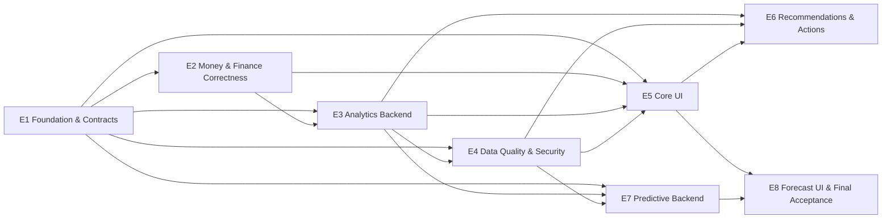

# Phase 2.5 — Evaluations Package Dependency Graph

All edges are hard ordering dependencies. The graph is acyclic. Packages are not developed as a PR stack; each successor starts only after its predecessors are merged to current main.
