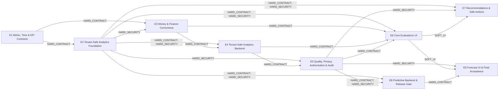

# Phase 2.6 — Evaluations Package DAG

Generated from 101 active normalized change-set edges; no package edge is handwritten.

- Topological order: E1 → E2 → E3 → E4 → E5 → E6 → E7 → E8 → E9
- Roots: E1
- Leaves: E7, E9
- Cycles: 0
- Platform prerequisites: none (`P0_REQUIRED=false`).

## Edge rationale

- `E1 → E2`: `cs-evaluations-timezone-period-model → cs-evaluations-filter-architecture` (HARD_CONTRACT).
- `E1 → E3`: `cs-evaluations-unified-kpi-contract → cs-evaluations-money-domain` (HARD_CONTRACT); `cs-evaluations-timezone-period-model → cs-evaluations-money-domain` (HARD_CONTRACT); `cs-evaluations-timezone-period-model → cs-evaluations-receivables` (HARD_CONTRACT).
- `E2 → E3`: `cs-evaluations-tenant-isolation → cs-evaluations-revenue-cashflow-result` (HARD_SECURITY).
- `E2 → E4`: `cs-evaluations-grouping-entity-references → cs-evaluations-analytics-summary` (HARD_CONTRACT); `cs-evaluations-analytics-contracts → cs-evaluations-cost-model` (HARD_CONTRACT); `cs-evaluations-analytics-contracts → cs-evaluations-analytics-summary` (HARD_CONTRACT); `cs-evaluations-summary-detail-separation → cs-evaluations-analytics-summary` (HARD_CONTRACT); `cs-evaluations-filter-architecture → cs-evaluations-analytics-summary` (HARD_CONTRACT); `cs-evaluations-tenant-isolation → cs-evaluations-analytics-summary` (HARD_SECURITY); `cs-evaluations-filter-architecture → cs-evaluations-cost-model` (HARD_CONTRACT); `cs-evaluations-tenant-isolation → cs-evaluations-cost-model` (HARD_SECURITY); `cs-evaluations-filter-architecture → cs-evaluations-utilization` (HARD_CONTRACT); `cs-evaluations-tenant-isolation → cs-evaluations-utilization` (HARD_SECURITY); `cs-evaluations-grouping-entity-references → cs-evaluations-driver-influence-analysis` (HARD_CONTRACT).
- `E2 → E5`: `cs-evaluations-tenant-isolation → cs-evaluations-gdpr` (HARD_SECURITY); `cs-evaluations-grouping-entity-references → cs-evaluations-gdpr` (HARD_SECURITY); `cs-evaluations-tenant-isolation → cs-evaluations-roles-permissions` (HARD_SECURITY); `cs-evaluations-tenant-isolation → cs-evaluations-audit-logging` (HARD_SECURITY).
- `E2 → E6`: `cs-evaluations-analytics-contracts → cs-evaluations-information-architecture` (HARD_CONTRACT); `cs-evaluations-tenant-isolation → cs-evaluations-information-architecture` (HARD_SECURITY).
- `E2 → E7`: `cs-evaluations-grouping-entity-references → cs-evaluations-recommendation-domain` (HARD_CONTRACT); `cs-evaluations-tenant-isolation → cs-evaluations-recommendation-domain` (HARD_SECURITY); `cs-evaluations-tenant-isolation → cs-evaluations-action-integrations` (HARD_SECURITY).
- `E2 → E8`: `cs-evaluations-analytics-contracts → cs-evaluations-predictive-analytics-architecture` (HARD_CONTRACT); `cs-evaluations-tenant-isolation → cs-evaluations-predictive-analytics-architecture` (HARD_SECURITY); `cs-evaluations-tenant-isolation → cs-evaluations-feature-store` (HARD_SECURITY).
- `E3 → E4`: `cs-evaluations-money-domain → cs-evaluations-cost-model` (HARD_CONTRACT).
- `E3 → E6`: `cs-evaluations-revenue-cashflow-result → cs-evaluations-executive-kpi-strip` (HARD_CONTRACT).
- `E4 → E5`: `cs-evaluations-cost-model → cs-evaluations-data-quality` (HARD_CONTRACT); `cs-evaluations-utilization → cs-evaluations-data-quality` (HARD_CONTRACT).
- `E4 → E6`: `cs-evaluations-analytics-summary → cs-evaluations-executive-kpi-strip` (HARD_CONTRACT); `cs-evaluations-strength-detection → cs-evaluations-strength-weakness-cockpit` (HARD_CONTRACT); `cs-evaluations-weakness-detection → cs-evaluations-strength-weakness-cockpit` (HARD_CONTRACT); `cs-evaluations-cost-model → cs-evaluations-risk-cost-failure-visuals` (HARD_CONTRACT); `cs-evaluations-analytics-summary → cs-evaluations-risk-cost-failure-visuals` (HARD_CONTRACT).
- `E5 → E6`: `cs-evaluations-metric-state-ux → cs-evaluations-data-quality-panel` (HARD_CONTRACT); `cs-evaluations-data-quality → cs-evaluations-data-quality-panel` (HARD_CONTRACT); `cs-evaluations-freshness-lineage → cs-evaluations-data-quality-panel` (HARD_CONTRACT); `cs-evaluations-metric-state-ux → cs-evaluations-executive-kpi-strip` (HARD_CONTRACT).
- `E5 → E7`: `cs-evaluations-roles-permissions → cs-evaluations-recommendation-domain` (HARD_SECURITY); `cs-evaluations-audit-logging → cs-evaluations-recommendation-domain` (HARD_SECURITY); `cs-evaluations-roles-permissions → cs-evaluations-action-integrations` (HARD_SECURITY); `cs-evaluations-audit-logging → cs-evaluations-action-integrations` (HARD_SECURITY).
- `E5 → E8`: `cs-evaluations-data-quality → cs-evaluations-predictive-analytics-architecture` (HARD_CONTRACT); `cs-evaluations-freshness-lineage → cs-evaluations-predictive-analytics-architecture` (HARD_CONTRACT); `cs-evaluations-audit-logging → cs-evaluations-predictive-analytics-architecture` (HARD_SECURITY).
- `E5 → E9`: `cs-evaluations-roles-permissions → cs-evaluations-forecast-ux` (HARD_SECURITY).
- `E6 → E7`: `cs-evaluations-information-architecture → cs-evaluations-action-center` (SOFT_UI).
- `E6 → E9`: `cs-evaluations-information-architecture → cs-evaluations-forecast-ux` (SOFT_UI).
- `E8 → E9`: `cs-evaluations-backtesting-drift → cs-evaluations-forecast-ux` (HARD_CONTRACT).
