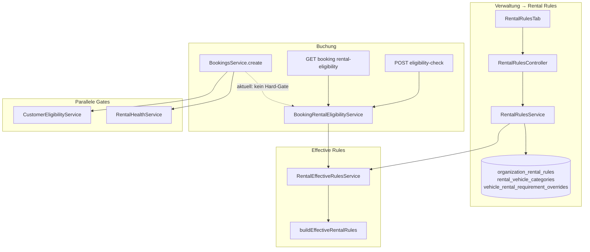

# Rental Rules / Mietregeln — Production-Readiness Remediation — July 2026

| Field | Value |
|-------|-------|
| **Remediation ID** | `rental-rules-production-readiness-remediation-2026-07` |
| **Repository** | [SYNQDRIVE-alpha](https://github.com/FATIHS-MGCKS/SYNQDRIVE-alpha) |
| **Product surface** | Verwaltung → Rental Rules / Mietregeln |
| **Phase** | **Prompt 2 of 34 — Build & test baseline** |
| **Baseline commit** | `410efa54cdf0361df94cb318848d5ba977638c2f` + Prompt 2 docs |
| **Baseline report** | `docs/audits/rental-rules-baseline-2026-07.md` |
| **Mode** | Documentation only — **no product code changes** |
| **Method** | Direct code/schema verification; no unverified assumptions |

---

## Referenzierte Vorarbeiten (keine parallelen Widersprüche)

Es existiert **kein** dediziertes Rental-Rules-Production-Audit mit Findings-Register (im Gegensatz zu Brake/Tire/Fleet-Health). Stattdessen werden folgende **bestehende, verifizierte** Quellen referenziert:

| Quelle | Pfad | Relevanz |
|--------|------|----------|
| IAM Endpoint Enforcement Triage | `docs/audits/iam-endpoint-enforcement-triage-2026-07.md` | P0-Befunde für Rental-Rules-Schreib-Endpunkte |
| IAM Endpoint Matrix (CSV) | `docs/audits/data/iam-endpoint-enforcement-matrix-2026-07.csv` | Zeilen 280–283, 414, 426 |
| Operational issue normalization | `docs/operational-issue-normalization.md` | `rental_requirements`, `rental_requirement_unmet` |
| Voice AI UI audit | `docs/audits/voice-ai-ui-ux-production-audit.md` | Knowledge-Step verlinkt Rental Rules |
| Architektur (in-repo) | `frontend/src/master/components/ArchitekturView.tsx` (Eintrag „Rental Rules & Vehicle Eligibility V4.9.60“) | Ist-Architektur-Beschreibung |
| Changes (in-repo) | `frontend/src/master/components/ChangesView.tsx` | Einträge `rental-rules-eligibility-backend-v4960`, `booking-rental-eligibility-v4963`, `rental-rules-admin-ui-v4961/v4979` |
| Voice onboarding architecture | `architecture/VOICE_AI_ORG_ONBOARDING_OPS_UI_2026-07-17.md` | Knowledge links zu rental rules |

**Nicht angelegt:** Kein separates `rental-rules-production-readiness-2026-07.md` Full-Audit (wie Brake/Tire) — diese Remediation-Datei ist die **einzige** Fortschritts- und Audit-Tracking-Quelle für den 34-Prompt-Plan.

---

## Dokumentationsstruktur (Prompt 1 — Verifikation)

| Pfad | Status | Anmerkung |
|------|--------|-----------|
| `docs/` | ✅ vorhanden | Audits, architecture, implementation, runbooks, testing |
| `docs/audits/` | ✅ vorhanden | Zielort dieser Datei |
| `docs/architecture/` | ✅ vorhanden | Domänen-spezifische Architektur-Records (kein Rental-Rules-Dedicated-Doc) |
| `docs/security/` | ❌ **nicht vorhanden** | IAM-Befunde liegen unter `docs/audits/iam-*` |
| `docs/compliance/` | ❌ **nicht vorhanden** | Rechtliche Dokumente separat unter `docs/audits/legal-documents-*` |

---

## 1. Fachlicher Zweck der Rental Rules

Rental Rules definieren **fahrzeugbezogene Mietanforderungen** auf Organisationsebene, die in Buchungs- und Fahrzeug-Workflows ausgewertet werden:

- Mindestalter und Mindest-Führerscheinbesitz
- Kaution (`depositAmountCents`) und Währung
- Kreditkartenpflicht
- Auslandsfahrt-, Zusatzfahrer- und Jungfahrer-Policies (Enums)
- Versicherungsanforderungen (Freitext)
- Manuelle Freigabe (`manualApprovalRequired`)
- Interne Notizen

**Abgrenzung (verifiziert im Code):**

| Domäne | Service / Modul | Zweck |
|--------|-----------------|-------|
| **Rental Rules** | `rental-rules/*`, `BookingRentalEligibilityService` | Fahrzeug-/Kategorie-Anforderungen, Effective Rules, Buchungs-Eligibility-Preview |
| **Customer Eligibility** | `customers/customer-eligibility.service.ts` | KYC/Risiko/Verifikation — **Hard-Gate** in `BookingsService.create/update` via `assertCustomerBookingEligibility` |
| **Rental Health** | `rental-health/*` | Fahrzeug-Gesundheit (Bremsen, Reifen, …) — **Hard-Gate** via `enforceRentalHealthGate` |
| **Pricing / Tariffs** | `pricing/*` | Tarif-Kaution und Preis-Simulation — **getrennt** von Rental-Rules-Kaution |

`BookingRentalEligibilityService` liefert Status `ELIGIBLE | NOT_ELIGIBLE | MANUAL_APPROVAL_REQUIRED | MISSING_INFORMATION` mit `decisionSource: RENTAL_RULES_EFFECTIVE`. **Create/Confirm/Pickup erzwingen diesen Status derzeit nicht** — nur Preview in `NewBookingView` (siehe Befunde).

---

## 2. Vererbungshierarchie (Ist-Zustand)

```
OrganizationRentalRules (1:1 pro Organization)
        ↓ null = geerbt
RentalVehicleCategory (n pro Organization; Vehicle.rentalCategoryId)
        ↓ null = geerbt
VehicleRentalRequirementOverride (0..1 pro Vehicle)
        ↓
buildEffectiveRentalRules() → pro Feld { value, source, sourceName }
```

**Merge-Reihenfolge** (`backend/src/modules/rental-rules/rental-effective-rules.util.ts`):

1. `VEHICLE_OVERRIDE` (höchste Priorität)
2. `CATEGORY` (nur wenn Kategorie `isActive`)
3. `ORGANIZATION_DEFAULT`

`null` auf einer Ebene bedeutet: Feld wird von der nächsttieferen Ebene geerbt. `rulesActive` auf Org-Defaults (`OrganizationRentalRules.isActive`) kann alle Regeln deaktivieren (Warnung in Eligibility).

**Quellen-Typen:** `RentalRuleSource = 'ORGANIZATION_DEFAULT' | 'CATEGORY' | 'VEHICLE_OVERRIDE'` (`rental-rules.types.ts`).

---

## 3. Backend — relevante Dateien

### 3.1 Modul `rental-rules`

| Pfad | Rolle |
|------|-------|
| `backend/src/modules/rental-rules/rental-rules.module.ts` | NestJS-Modul; exportiert Service + EffectiveRules |
| `backend/src/modules/rental-rules/rental-rules.controller.ts` | REST-Controller; `OrgScopingGuard` + `RolesGuard` |
| `backend/src/modules/rental-rules/rental-rules.service.ts` | CRUD Defaults, Kategorien, Fahrzeugzuordnung, Overrides, Overview |
| `backend/src/modules/rental-rules/rental-effective-rules.service.ts` | `computeForVehicle`, `formatEffectiveRules` |
| `backend/src/modules/rental-rules/rental-effective-rules.util.ts` | `buildEffectiveRentalRules`, `resolveEffectiveField` |
| `backend/src/modules/rental-rules/rental-rules.mapper.ts` | DTO-Formatierung, `pickRulePatch`, `extractRuleFields` |
| `backend/src/modules/rental-rules/rental-rules.types.ts` | Typen, `RENTAL_RULE_FIELD_KEYS` |
| `backend/src/modules/rental-rules/dto/index.ts` | `UpsertOrganizationRentalRulesDto`, Category DTOs, Overrides |

### 3.2 Booking Eligibility

| Pfad | Rolle |
|------|-------|
| `backend/src/modules/bookings/booking-rental-eligibility.service.ts` | Eligibility gegen Effective Rules + Kunde + Verifikation |
| `backend/src/modules/bookings/booking-rental-eligibility.util.ts` | `evaluateRentalEligibilityChecks`, Alters-/Lizenz-Logik |
| `backend/src/modules/bookings/booking-rental-eligibility.types.ts` | Input/Output-Typen, Status-Enum |
| `backend/src/modules/bookings/dto/booking-rental-eligibility-check.dto.ts` | Request/Query DTOs |
| `backend/src/modules/bookings/bookings.controller.ts` | `POST .../eligibility-check`, `GET .../:id/rental-eligibility` |
| `backend/src/modules/bookings/bookings.module.ts` | Import `RentalRulesModule` |

### 3.3 Abhängige Backend-Module

| Pfad | Rolle |
|------|-------|
| `backend/src/modules/customer-verification/customer-verification.service.ts` | `getEligibilityStatus` — Warnungen in Rental Eligibility |
| `backend/src/modules/customers/customer-eligibility.service.ts` | KYC-Gates (nicht Rental Rules) |
| `backend/src/modules/bookings/bookings.service.ts` | Create/Update/Status — Rental Health + Customer Eligibility Gates |
| `backend/src/modules/bookings/booking-wizard-draft.service.ts` | Checkout-Entwurf — **kein** Rental-Eligibility-Aufruf verifiziert |
| `backend/src/modules/bookings/bookings-handover.service.ts` | Pickup/Return — **kein** Rental-Eligibility-Aufruf verifiziert |
| `backend/src/app.module.ts` | `RentalRulesModule` registriert |

### 3.4 Guards (verifiziert)

| Guard | Rental-Rules-Controller |
|-------|-------------------------|
| `OrgScopingGuard` | ✅ `@UseGuards` auf Controller-Ebene |
| `RolesGuard` | ✅ |
| `PermissionsGuard` | ❌ **nicht** auf Schreib-Endpunkten (IAM P0) |

### 3.5 Tests (Backend)

| Pfad | `it(`-Anzahl (grep) |
|------|---------------------|
| `backend/src/modules/rental-rules/rental-effective-rules.util.spec.ts` | 4 |
| `backend/src/modules/rental-rules/rental-rules.service.spec.ts` | 7 |
| `backend/src/modules/bookings/booking-rental-eligibility.service.spec.ts` | 9 (geschätzt; Datei 331 Zeilen) |

**Fehlend (verifiziert):** Kein `rental-rules.controller.spec.ts`, kein `booking-rental-eligibility.util.spec.ts`, keine Integrationstests mit DB, keine E2E.

---

## 4. Frontend — relevante Dateien

### 4.1 Verwaltung → Rental Rules

| Pfad | Rolle |
|------|-------|
| `frontend/src/rental/components/settings/rental-rules/RentalRulesTab.tsx` | Haupt-Tab |
| `frontend/src/rental/components/settings/rental-rules/useRentalRulesCenter.ts` | Data fetching / mutations |
| `frontend/src/rental/components/settings/rental-rules/DefaultRulesDrawer.tsx` | Org-Defaults bearbeiten |
| `frontend/src/rental/components/settings/rental-rules/CategoryDetailDrawer.tsx` | Kategorie-CRUD |
| `frontend/src/rental/components/settings/rental-rules/VehicleAssignmentDrawer.tsx` | Fahrzeuge ↔ Kategorie |
| `frontend/src/rental/components/settings/rental-rules/EffectiveRulesPreviewDrawer.tsx` | Effective-Rules-Vorschau |
| `frontend/src/rental/components/settings/rental-rules/RentalRuleFieldsForm.tsx` | Gemeinsames Formular |
| `frontend/src/rental/components/settings/rental-rules/RentalRulesSummaryTile.tsx` | Overview-Kachel |
| `frontend/src/rental/components/settings/rental-rules/rental-rules.types.ts` | Frontend-DTOs |
| `frontend/src/rental/components/settings/rental-rules/rental-rules.utils.ts` | Formatierung, `labelRuleSource` |
| `frontend/src/rental/components/settings/rental-rules/rental-rules.constants.ts` | Kategorie-Typen, Farben |
| `frontend/src/rental/components/SettingsView.tsx` | Tab-Shell (`rental-rules`) |
| `frontend/src/rental/components/settings/AdministrationTabBar.tsx` | Tab-Navigation |
| `frontend/src/rental/components/settings/administration-a11y.ts` | a11y-IDs |
| `frontend/src/rental/components/settings/settingsTypes.ts` | Tab-Typ `rental-rules` |
| `frontend/src/rental/App.tsx` | Routing / Settings-Tab-State |
| `frontend/src/rental/components/Sidebar.tsx` | Sidebar-Einstieg |

### 4.2 Fahrzeug-Detail

| Pfad | Rolle |
|------|-------|
| `frontend/src/rental/components/vehicle-detail/VehicleRequirementsTab.tsx` | Tab „Requirements“ |
| `frontend/src/rental/components/vehicle-detail/VehicleOverrideEditorDrawer.tsx` | Override-Editor |
| `frontend/src/rental/components/vehicle-detail/VehicleCategoryAssignDrawer.tsx` | Kategorie zuweisen |
| `frontend/src/rental/hooks/useVehicleRentalRequirements.ts` | API-Hook |
| `frontend/src/rental/lib/vehicle-rental-requirements.utils.ts` | UI-Helfer |

### 4.3 Buchung

| Pfad | Rolle |
|------|-------|
| `frontend/src/rental/components/NewBookingView.tsx` | Ruft `checkRentalEligibility` (Preview) |
| `frontend/src/rental/components/bookings/BookingRentalEligibilityCard.tsx` | Sidebar-Card |
| `frontend/src/rental/components/new-booking/BookingSidebar.tsx` | Einbindung Card |
| `frontend/src/rental/components/new-booking/types.ts` | State-Typen |
| `frontend/src/rental/lib/booking-rental-eligibility.types.ts` | API-Response-Typen |
| `frontend/src/rental/components/shared/rental-requirements-ui.tsx` | Shared Badges / Quellen-Labels |

### 4.4 API-Client

| Pfad | Rolle |
|------|-------|
| `frontend/src/lib/api.ts` | `api.rentalRules.*`, `api.bookings.checkRentalEligibility`, `getBookingRentalEligibility` |

### 4.5 Voice Assistant

| Pfad | Rolle |
|------|-------|
| `frontend/src/rental/components/voice-assistant/useVoiceKnowledgeLinks.ts` | Overview-Link zu Rental Rules |
| `frontend/src/rental/components/voice-assistant/VoiceWizardKnowledgeStep.tsx` | Onboarding-Knowledge |

### 4.6 i18n

| Pfad | Rolle |
|------|-------|
| `frontend/src/rental/i18n/translations/de.ts` | DE-Strings (`adminTab.rentalRules`, …) |
| `frontend/src/rental/i18n/translations/en.ts` | EN-Strings |

**Fehlend (verifiziert):** Keine `*.test.ts(x)` unter `rental-rules/` oder `booking-rental-eligibility*`.

---

## 5. Prisma-Modelle und Datenbankbeziehungen

### 5.1 Modelle

| Modell | Tabelle | Beziehung |
|--------|---------|-----------|
| `OrganizationRentalRules` | `organization_rental_rules` | 1:1 `Organization` (`organizationId` unique, `onDelete: Cascade`) |
| `RentalVehicleCategory` | `rental_vehicle_categories` | n:1 `Organization`; 1:n `Vehicle` via `Vehicle.rentalCategoryId` |
| `VehicleRentalRequirementOverride` | `vehicle_rental_requirement_overrides` | 1:1 `Vehicle` (`vehicleId` unique); n:1 `Organization` |

### 5.2 Vehicle-Erweiterung

`Vehicle.rentalCategoryId` → optional FK `RentalVehicleCategory` (`onDelete: SetNull`).

### 5.3 Enums

| Enum | Werte |
|------|-------|
| `RentalForeignTravelPolicy` | `ALLOWED`, `APPROVAL_REQUIRED`, `NOT_ALLOWED` |
| `RentalAdditionalDriverPolicy` | `ALLOWED`, `APPROVAL_REQUIRED`, `NOT_ALLOWED` |
| `RentalYoungDriverPolicy` | `ALLOWED`, `FEE_REQUIRED`, `NOT_ALLOWED` |
| `RentalVehicleCategoryType` | `ECONOMY`, `COMPACT`, `TRANSPORTER`, `PREMIUM`, `PERFORMANCE`, `LUXURY`, `EV_PERFORMANCE`, `CUSTOM` |

### 5.4 Migration

| Migration | Inhalt |
|-----------|--------|
| `backend/prisma/migrations/20260620100000_rental_rules_eligibility/migration.sql` | Tabellen, Enums, `vehicles.rental_category_id` |

**Keine spätere Rental-Rules-Migration** im Repo verifiziert (Stand `main` @ `36ffe51b`).

---

## 6. Booking-Pfade (Create, Update, Confirm, Pickup, Status)

| Pfad | HTTP / Methode | Rental-Rules-Bezug |
|------|----------------|-------------------|
| Direktes Create | `POST /organizations/:orgId/bookings` → `BookingsService.create` | ❌ Kein `BookingRentalEligibilityService`; ✅ `CustomerEligibility` + `RentalHealth` |
| Update | `PATCH /organizations/:orgId/bookings/:id` → `BookingsService.update` | ❌ Kein Rental-Eligibility; ✅ Rental Health bei Fahrzeugwechsel |
| Wizard Draft | `POST/PATCH .../bookings/wizard-draft*` | ❌ Kein Rental-Eligibility im Service verifiziert |
| Confirm | `POST .../bookings/wizard-draft/:id/confirm` | ❌ Kein Rental-Eligibility im Service verifiziert |
| Eligibility Preview | `POST .../bookings/eligibility-check` | ✅ `BookingRentalEligibilityService.check` |
| Booking Eligibility | `GET .../bookings/:id/rental-eligibility` | ✅ `checkForBooking` |
| Cancel | `DELETE .../bookings/:id` | — |
| No-show | `POST .../bookings/:id/no-show` | — |
| Pickup Handover | `POST .../bookings/:id/handover/pickup` | ❌ Kein Rental-Eligibility; Customer Eligibility über Status-Transition in `assertCustomerBookingEligibility` nur bei explizitem Status `ACTIVE` |
| Return Handover | `POST .../bookings/:id/handover/return` | — |
| Booking Detail | `GET .../bookings/:id/detail` | ✅ `customerEligibility` im DTO; ❌ **kein** `bookingRentalEligibility` Feld verifiziert |

**Frontend Preview:** `NewBookingView.tsx` ruft `api.bookings.checkRentalEligibility` bei Kunden-/Fahrzeug-/Datumsänderung — **ohne Hard-Block** auf Submit.

---

## 7. Abhängigkeiten (Customer, Documents, Pricing, Checkout, Audit)

### 7.1 Customer

| Integration | Pfad | Verhalten |
|-------------|------|-----------|
| Kundendaten | `BookingRentalEligibilityService` | `dateOfBirth`, `licenseIssuedAt` aus `Customer` |
| Lizenz aus Dokumenten | `resolveLicenseIssuedAtFromDocuments` | OCR `extractedJson` aus `CustomerDocument` (LICENSE_FRONT/BACK) |
| Verifikation | `CustomerVerificationService.getEligibilityStatus` | Warnungen (Ausweis/FS/Adresse) — blockiert nicht allein bei `pickup_required` |
| KYC-Gate | `CustomerEligibilityService.evaluateForBooking` | Separater Hard-Gate in `BookingsService` |

### 7.2 Documents

- Rental Rules **erzwingen** keine Dokumenten-Bundle-Vollständigkeit.
- Legal-Documents-Pickup-Gate (`docs/audits/legal-documents-pickup-gate-2026-07.md`) ist **orthogonal** zu Rental Rules.

### 7.3 Pricing / Checkout

| Thema | Ist-Zustand |
|-------|-------------|
| Tarif-Kaution | `pricing/*` — `depositAmountCents` aus Tarif/Quote/Snapshot |
| Rental-Rules-Kaution | `OrganizationRentalRules` / Category / Override — Eligibility prüft `depositReceived` via `BookingDeposit` |
| Vereinheitlichung | **OFFEN** — zwei unabhängige Kaution-Quellen; keine Cross-Validierung im Code verifiziert |
| Wizard Checkout | `booking-wizard-draft.service.ts` + Pricing Quote — **kein** Rental-Rules-Merge verifiziert |

### 7.4 Audit

- **Kein** dediziertes Audit-Event für Rental-Rules-Mutationen verifiziert (`RentalRulesService` schreibt direkt via Prisma ohne Outbox/Audit-Trail).
- IAM-Audit-Infrastruktur existiert separat (`docs/audits/iam-*`).

---

## 8. Befunde aus bestehenden Audits (P0 / P1 / P2)

### 8.1 P0 — Production-relevant

| ID | Quelle | Befund | Status |
|----|--------|--------|--------|
| **P0-RR-IAM-01** | IAM Matrix | `POST .../rental-rules/categories` — `org_write_without_PermissionsGuard` | `REQUIRES_TEST` |
| **P0-RR-IAM-02** | IAM Matrix | `DELETE .../rental-rules/categories/:id` — ohne `PermissionsGuard` | `REQUIRES_TEST` |
| **P0-RR-IAM-03** | IAM Matrix | `PATCH .../rental-rules/categories/:id` — ohne `PermissionsGuard` | `REQUIRES_TEST` |
| **P0-RR-IAM-04** | IAM Matrix | `PATCH .../rental-rules/defaults` — ohne `PermissionsGuard` | `REQUIRES_TEST` |
| **P0-RR-IAM-05** | IAM Triage | `PATCH .../categories/:id/vehicles` — triage: `FALSE_POSITIVE` Kandidat | `REQUIRES_TEST` |
| **P0-RR-IAM-06** | IAM Triage | `PATCH .../vehicles/:id/rental-requirements/overrides` — triage: `FALSE_POSITIVE` Kandidat | `REQUIRES_TEST` |
| **P0-RR-07** | Code-Review | Booking Create/Confirm/Pickup **erzwingt** `BookingRentalEligibility` nicht — nur UI-Preview | `CONFIRMED` |
| **P0-RR-08** | Code-Review | Kein Audit-Trail / Lifecycle-Events für Regeländerungen | `CONFIRMED` |

### 8.2 P1 — Wichtige Lücken

| ID | Befund | Status |
|----|--------|--------|
| **P1-RR-01** | Keine Frontend-Unit-Tests für Rental-Rules-UI | `CONFIRMED` |
| **P1-RR-02** | Keine Playwright-E2E für Rental Rules / Booking Eligibility | `CONFIRMED` |
| **P1-RR-03** | Keine Controller-Security-Tests für `RentalRulesController` | `CONFIRMED` |
| **P1-RR-04** | Dual source of truth: Pricing-Tarif-Kaution vs. Rental-Rules-Kaution | `CONFIRMED` |
| **P1-RR-05** | Keine DB-Integrationstests für Effective-Rules-Roundtrip | `CONFIRMED` |
| **P1-RR-06** | `booking-rental-eligibility.util.ts` ohne dedizierte Spec-Datei | `CONFIRMED` |
| **P1-RR-07** | `GET .../bookings/:id/detail` enthält Customer Eligibility, aber kein Rental-Eligibility-Feld | `CONFIRMED` |
| **P1-RR-08** | Wizard-Confirm-Pfad ohne Rental-Eligibility-Check | `CONFIRMED` |

### 8.3 P2 — Verbesserungen / Tech Debt

| ID | Befund | Status |
|----|--------|--------|
| **P2-RR-01** | Keine Prometheus-Metriken für Eligibility-Entscheidungen / Regeländerungen | `CONFIRMED` |
| **P2-RR-02** | ESLint-Scope (`npm run lint`) deckt Rental-Rules-Pfade nicht ab | `CONFIRMED` |
| **P2-RR-03** | Voice-Knowledge-Link prüft nur Overview, nicht Effective Rules pro Fahrzeug | `CONFIRMED` |
| **P2-RR-04** | `insuranceRequirement` Freitext ohne strukturiertes Schema | `CONFIRMED` |
| **P2-RR-05** | Kein dediziertes Runbook unter `docs/runbooks/` | `CONFIRMED` |

---

## 9. Zielarchitektur (Remediation-Ziel — noch nicht implementiert)

Zielbild basiert auf **Ist-Code + Audit-Befunden**; keine Spekulation über neue Produktfeatures:

1. **Permissions:** Schreib-Endpunkte mit `PermissionsGuard` + dokumentierter Permission-Matrix (analog Legal Documents / Stations V2).
2. **Effective Rules:** Weiterhin zentral über `RentalEffectiveRulesService` / `buildEffectiveRentalRules` — Single Source of Truth für Felder.
3. **Eligibility Enforcement:** Produktentscheid pro Gate (Create / Confirm / Pickup) — dokumentiert und serverseitig konsistent mit UI.
4. **Trennung beibehalten:** `CustomerEligibility` (KYC) ≠ `BookingRentalEligibility` (Fahrzeugregeln) ≠ `RentalHealth` (Technik).
5. **Kaution:** Klare Regel welche Quelle gilt (Tarif vs. Rental Rules) oder explizite Prioritäts-/Konflikt-Policy.
6. **Auditierbarkeit:** Mutationen an Defaults/Kategorien/Overrides mit Org-scoped Audit-Events.
7. **Tests:** Backend-Regression + Frontend-Unit + E2E für Admin und Booking-Preview/Gates.
8. **Observability:** Metriken für Eligibility-Status-Verteilung und Regeländerungen (optional P2).



---

## 10. 34 Remediation-Schritte — Checkliste

| # | Prompt-Ziel | Status | Abhängigkeit | Migration | Tests |
|---|-------------|--------|--------------|-----------|-------|
| **1** | Audit- & Fortschrittsdokumentation (diese Datei) | **DONE** | — | — | — |
| **2** | Build-/Test-Baseline dokumentieren (`rental-rules-baseline-2026-07.md`) | **DONE** | 1 | — | — |
| **3** | Code-Map / Endpoint-Inventar (CSV) | NOT_STARTED | 1 | — | — |
| **4** | IAM: `PermissionsGuard` auf Rental-Rules-Schreib-Endpunkte | NOT_STARTED | 2, 3 | Nein | Ja |
| **5** | IAM: Leserechte-Matrix + `@Roles` verifizieren | NOT_STARTED | 4 | Nein | Ja |
| **6** | Service-Layer `assertMembershipPermission` (falls erforderlich) | NOT_STARTED | 4 | Nein | Ja |
| **7** | Controller-Security-Regressionstests | NOT_STARTED | 4–6 | Nein | Ja |
| **8** | Effective-Rules Merge-Matrix (Util-Tests erweitern) | NOT_STARTED | 2 | Nein | Ja |
| **9** | `RentalRulesService` Unit-Tests (Edge Cases) | NOT_STARTED | 2 | Nein | Ja |
| **10** | Kategorie-Fahrzeug-Zuordnung Transaktions-Tests | NOT_STARTED | 9 | Nein | Ja |
| **11** | Override `null`-Semantik + inactive category Tests | NOT_STARTED | 8 | Nein | Ja |
| **12** | DTO-Validierung (`depositAmount` Alias, License Years) | NOT_STARTED | 9 | Nein | Ja |
| **13** | `booking-rental-eligibility.util` dedizierte Spec | NOT_STARTED | 2 | Nein | Ja |
| **14** | Eligibility + `CustomerVerification` Integrationstests | NOT_STARTED | 13 | Nein | Ja |
| **15** | Eligibility + `BookingDeposit` Status-Tests | NOT_STARTED | 13 | Nein | Ja |
| **16** | Produktentscheid: Enforcement-Policy Create/Confirm/Pickup | NOT_STARTED | 13–15 | Nein | — |
| **17** | Booking Create Gate (serverseitig, falls Policy = enforce) | NOT_STARTED | 16 | Nein | Ja |
| **18** | Booking Update / Fahrzeugwechsel Re-Eligibility | NOT_STARTED | 16 | Nein | Ja |
| **19** | Wizard-Draft Confirm Gate | NOT_STARTED | 16 | Nein | Ja |
| **20** | Pickup/Handover Rental-Eligibility (falls Policy = enforce) | NOT_STARTED | 16 | Nein | Ja |
| **21** | `BookingDetailDto` Rental-Eligibility-Feld | NOT_STARTED | 13 | Nein | Ja |
| **22** | Kaution: Pricing vs. Rental Rules Konflikt-Policy | NOT_STARTED | 16 | **OFFEN** | Ja |
| **23** | Audit-Events für Regel-Mutationen | NOT_STARTED | 4 | **OFFEN** | Ja |
| **24** | Frontend `rental-rules.utils` Unit-Tests | NOT_STARTED | 2 | Nein | Ja |
| **25** | Frontend Component-Tests (Tab, Card, Requirements) | NOT_STARTED | 24 | Nein | Ja |
| **26** | i18n Vollständigkeit DE/EN | NOT_STARTED | 25 | Nein | Ja |
| **27** | a11y Administration-Tab Rental Rules | NOT_STARTED | 25 | Nein | Ja |
| **28** | Playwright E2E: Admin Rental Rules CRUD | NOT_STARTED | 4, 25 | Nein | Ja |
| **29** | Playwright E2E: New Booking Eligibility Preview | NOT_STARTED | 13, 25 | Nein | Ja |
| **30** | CI-Script `test:rental-rules` (Backend + Frontend) | NOT_STARTED | 7–15, 24–25 | Nein | Ja |
| **31** | Voice Knowledge Links Genauigkeit | NOT_STARTED | 9 | Nein | Ja |
| **32** | Operational-Issue-Normalization Alignment | NOT_STARTED | 17–20 | Nein | Ja |
| **33** | Architektur-Record + Runbook | NOT_STARTED | 1–32 | Nein | — |
| **34** | Post-Remediation Readiness Report + Nachweise | NOT_STARTED | 1–33 | — | Ja |

---

## 11. Technische Entscheidungen

| ID | Thema | Optionen | Entscheidung | Datum |
|----|-------|----------|--------------|-------|
| TD-RR-01 | Enforcement Create/Confirm/Pickup | Preview only / Hard block / Manual approval queue | **OFFEN** — Ist: Preview only | — |
| TD-RR-02 | Kaution bei Konflikt Tarif vs. Rental Rules | Tarif wins / Rules win / Max / Warn only | **OFFEN** | — |
| TD-RR-03 | Permission Keys für Rental Rules | `rental-rules.read` / `rental-rules.manage` vs. bestehende Org-Admin-Rolle | **OFFEN** | — |
| TD-RR-04 | Audit-Event-Schema | IAM Outbox vs. ActivityLog vs. neues Domain-Event | **OFFEN** | — |
| TD-RR-05 | IAM P0 FALSE_POSITIVE für Fleet-Vehicle-PATCH | PermissionsGuard trotzdem / nur RolesGuard | **OFFEN** — Runtime-Test nötig | — |

---

## 12. Bekannte Risiken

| Risiko | Schwere | Mitigation (geplant) |
|--------|---------|----------------------|
| Org-Member mit `RolesGuard` allein kann Regeln ändern (IAM P0) | **Hoch** | Prompt 4–7 |
| Buchung trotz `NOT_ELIGIBLE` möglich (nur UI-Warnung) | **Hoch** | Prompt 16–20 (Policy) |
| Zwei Kaution-Quellen verwirren Operator/Checkout | **Mittel** | Prompt 22 |
| Regeländerungen nicht auditierbar | **Mittel** | Prompt 23 |
| Keine Regression-Suite → stille Brüche bei IAM-Remediation | **Mittel** | Prompt 2, 30 |
| Kategorie `onDelete SetNull` auf required FK (Prisma-Warnung) | **Niedrig** | Bereits repo-weit; nicht Rental-Rules-spezifisch |

---

## 13. Migrationen

| Migration | Status | Beschreibung |
|-----------|--------|--------------|
| `20260620100000_rental_rules_eligibility` | ✅ **Angewendet** (Repo) | Initial-Schema Rental Rules |
| Zukünftige Audit-Events / Permission-Tabellen | **OFFEN** | Abhängig von TD-RR-03/04 |
| Kaution-Konflikt-Metadaten | **OFFEN** | Abhängig von TD-RR-02 |

**Prompt 1:** Keine neue Migration.

---

## 14. Offene Fragen

| # | Frage | Blockiert |
|---|-------|-----------|
| OQ-RR-01 | Soll `NOT_ELIGIBLE` Buchungserstellung serverseitig blockieren oder nur warnen? | Prompt 16–20 |
| OQ-RR-02 | Welche Permission soll Rental-Rules-Admin haben (neues Modulrecht vs. ORG_ADMIN)? | Prompt 4 |
| OQ-RR-03 | Gilt Rental-Rules-Kaution oder Tarif-Kaution für Eligibility `depositReceived`? | Prompt 22 |
| OQ-RR-04 | Soll `MANUAL_APPROVAL_REQUIRED` einen Workflow/Task auslösen? | **OFFEN** — kein Task-Trigger im Code |
| OQ-RR-05 | IAM Triage FALSE_POSITIVE für Vehicle-Override/Assign — Runtime-Verifikation nötig? | Prompt 5 |
| OQ-RR-06 | Soll Booking Detail Rental Eligibility neben Customer Eligibility anzeigen? | Prompt 21 |

---

## 15. Post-Remediation-Nachweise (noch leer)

| Nachweis | Prompt | Datei / Artefakt | Status |
|----------|--------|------------------|--------|
| Baseline Test Report | 2 | `docs/audits/rental-rules-baseline-2026-07.md` | **DONE** |
| IAM Permission Matrix | 4–5 | TBD | NOT_STARTED |
| Backend Test Coverage Report | 30 | TBD | NOT_STARTED |
| Frontend Test Coverage Report | 25, 30 | TBD | NOT_STARTED |
| E2E Recording / Playwright Report | 28–29 | TBD | NOT_STARTED |
| VPS Read-only Verification | 34 | TBD | NOT_STARTED |
| Production-Readiness Verdict | 34 | Abschnitt in dieser Datei | NOT_STARTED |

---

## 16. Baseline (Prompt 2) — 2026-07-23

Vollständiger Report: **`docs/audits/rental-rules-baseline-2026-07.md`**

### Toolchain

- **Monorepo:** getrennte npm-Pakete `backend/` + `frontend/` (kein Workspace-Root)
- **Node / npm:** v22.14.0 / 10.9.8
- **Install:** `npm ci` je Paket; Prisma: `npx prisma generate` (Backend)

### Ergebnisübersicht

| Prüfung | Ergebnis |
|---------|----------|
| `prisma validate` | ✅ PASS (1 SetNull-Warnung) |
| `prisma format --check` | ❌ FAIL (**vorbestehend**) |
| Backend `tsc --noEmit` | ❌ FAIL (**vorbestehend**, 24 Fehler in fremden Specs) |
| Backend `npm run build` | ✅ PASS |
| Backend Rental Rules Jest | ✅ **11/11** PASS |
| Backend Booking Eligibility Jest | ✅ **9/9** PASS |
| Frontend `tsc -b` | ✅ PASS |
| Frontend `npm run build` | ✅ PASS |
| Backend `npm run lint` (default) | ✅ PASS (1 Warning, document-extraction) |
| Backend ESLint Rental-Rules-Pfade | ✅ PASS |
| Frontend `npm run lint` (default) | ❌ FAIL (**vorbestehend**, document/legal) |
| Frontend ESLint Rental-Rules-Pfade | ❌ FAIL (**vorbestehend**, 4× set-state-in-effect) |
| `booking-pickup-gate.integration` | ✅ **12/12** PASS (Legal Pickup, nicht Rental Rules) |
| `prisma migrate status` | ❌ **P1001** — Postgres nicht erreichbar |
| Frontend Vitest Rental Rules | ❌ Keine Testdateien |

### Coverage (Backend, Domain-Dateien)

| Bereich | Lines |
|---------|-------|
| Gesamt `rental-rules` + `booking-rental-eligibility*` | **55.52%** |
| `rental-rules/` | **36.94%** |
| `booking-rental-eligibility.*` | **72.18%** |
| `rental-rules.controller.ts` | **0%** |

### Regression-Kommandos (für Prompt 3+)

```bash
cd backend && npm run prisma:validate
cd backend && npm run build
cd backend && npx jest --testPathPattern='rental-rules|rental-effective-rules|booking-rental-eligibility' --testPathIgnorePatterns=integration
cd frontend && npx tsc -b && npm run build
```

### Bekannte Testlücken (unverändert zur Baseline)

- Kein Controller-Spec, kein `booking-rental-eligibility.util.spec.ts`
- Keine Frontend-Unit-/E2E-Tests für Rental Rules
- Keine DB-Integration für Effective Rules
- `prisma migrate status` in dieser Umgebung nicht reproduzierbar ohne Postgres

**Prompt 2:** Keine Tests deaktiviert, gelockert oder übersprungen.

---

## Prompt 1 — Abschluss

| Kriterium | Erfüllt |
|-----------|---------|
| Audit-Datei existiert | ✅ |
| Codepfade mit konkreten Dateipfaden | ✅ |
| 34 Schritte als Checkliste | ✅ |
| Keine produktiven Implementierungen geändert | ✅ |
| Unklare Punkte als OFFEN markiert | ✅ |
| Prompt 1 Status | **DONE** |

---

## Prompt 2 — Abschluss

| Kriterium | Erfüllt |
|-----------|---------|
| Build-/Test-Zustand dokumentiert | ✅ |
| Baseline-Datei angelegt | ✅ |
| Vorbestehende vs. neue Fehler unterscheidbar | ✅ |
| Keine fachliche Logik geändert | ✅ |
| Keine Tests entfernt/abgeschwächt | ✅ |
| Prompt 2 Status | **DONE** |

---

*Letzte Aktualisierung: 2026-07-23 (Prompt 2).*
