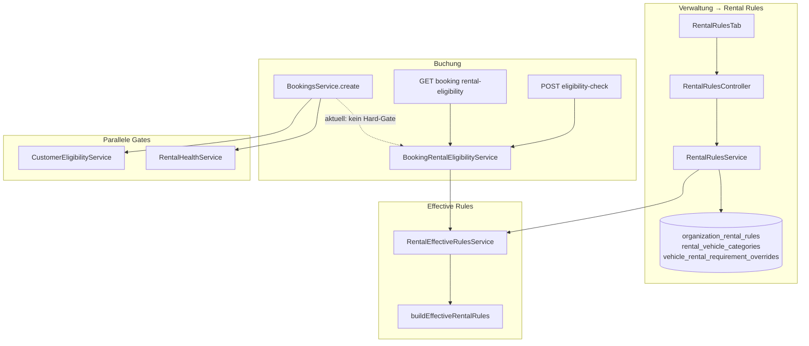
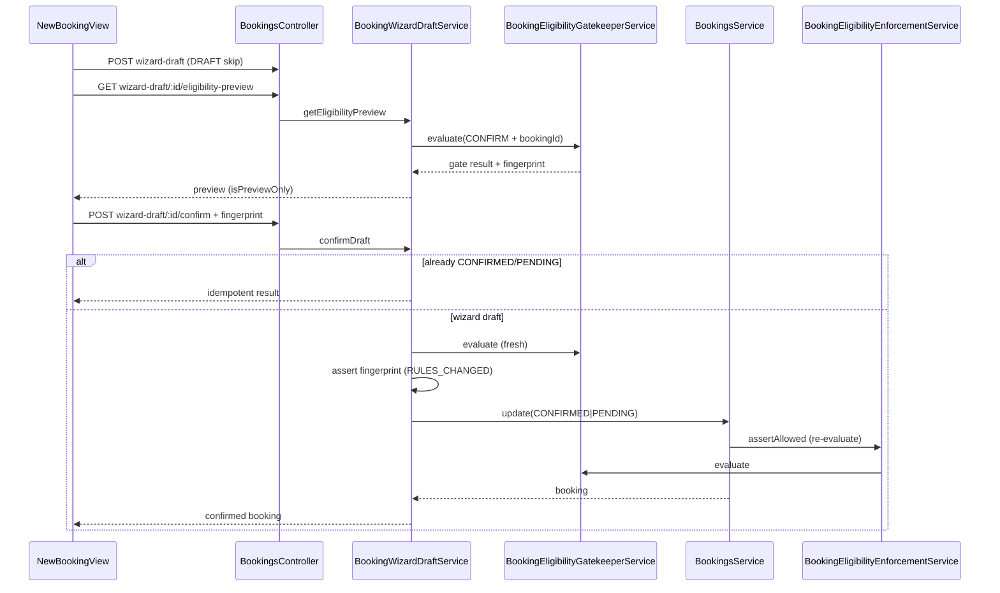

# Rental Rules / Mietregeln — Production-Readiness Remediation — July 2026

| Field | Value |
|-------|-------|
| **Remediation ID** | `rental-rules-production-readiness-remediation-2026-07` |
| **Repository** | [SYNQDRIVE-alpha](https://github.com/FATIHS-MGCKS/SYNQDRIVE-alpha) |
| **Product surface** | Verwaltung → Rental Rules / Mietregeln |
| **Phase** | **Prompt 10 of 34 — Status transition eligibility enforcement** |
| **Mode** | Central transition matrix + PICKUP-stage gatekeeper on handover |
| **Method** | Direct code/schema verification; no unverified assumptions |

---

## Referenzierte Vorarbeiten (keine parallelen Widersprüche)

Es existiert **kein** dediziertes Rental-Rules-Production-Audit mit Findings-Register (im Gegensatz zu Brake/Tire/Fleet-Health). Stattdessen werden folgende **bestehende, verifizierte** Quellen referenziert:

| Quelle | Pfad | Relevanz |
|--------|------|----------|
| IAM Endpoint Enforcement Triage | `docs/audits/iam-endpoint-enforcement-triage-2026-07.md` | P0-Befunde für Rental-Rules-Schreib-Endpunkte |
| IAM Endpoint Matrix (CSV) | `docs/audits/data/iam-endpoint-enforcement-matrix-2026-07.csv` | Zeilen 280–283, 414, 426 |
| Operational issue normalization | `docs/operational-issue-normalization.md` | `rental_requirements`, `rental_requirement_unmet` |
| Voice AI UI audit | `docs/audits/voice-ai-ui-ux-production-audit.md` | Knowledge-Step verlinkt Rental Rules |
| Architektur (in-repo) | `frontend/src/master/components/ArchitekturView.tsx` (Eintrag „Rental Rules & Vehicle Eligibility V4.9.60“) | Ist-Architektur-Beschreibung |
| Changes (in-repo) | `frontend/src/master/components/ChangesView.tsx` | Einträge `rental-rules-eligibility-backend-v4960`, `booking-rental-eligibility-v4963`, `rental-rules-admin-ui-v4961/v4979` |
| Voice onboarding architecture | `architecture/VOICE_AI_ORG_ONBOARDING_OPS_UI_2026-07-17.md` | Knowledge links zu rental rules |

**Nicht angelegt:** Kein separates `rental-rules-production-readiness-2026-07.md` Full-Audit (wie Brake/Tire) — diese Remediation-Datei ist die **einzige** Fortschritts- und Audit-Tracking-Quelle für den 34-Prompt-Plan.

---

## Dokumentationsstruktur (Prompt 1 — Verifikation)

| Pfad | Status | Anmerkung |
|------|--------|-----------|
| `docs/` | ✅ vorhanden | Audits, architecture, implementation, runbooks, testing |
| `docs/audits/` | ✅ vorhanden | Zielort dieser Datei |
| `docs/architecture/` | ✅ vorhanden | Domänen-spezifische Architektur-Records (kein Rental-Rules-Dedicated-Doc) |
| `docs/security/` | ❌ **nicht vorhanden** | IAM-Befunde liegen unter `docs/audits/iam-*` |
| `docs/compliance/` | ❌ **nicht vorhanden** | Rechtliche Dokumente separat unter `docs/audits/legal-documents-*` |

---

## 1. Fachlicher Zweck der Rental Rules

Rental Rules definieren **fahrzeugbezogene Mietanforderungen** auf Organisationsebene, die in Buchungs- und Fahrzeug-Workflows ausgewertet werden:

- Mindestalter und Mindest-Führerscheinbesitz
- Kaution (`depositAmountCents`) und Währung
- Kreditkartenpflicht
- Auslandsfahrt-, Zusatzfahrer- und Jungfahrer-Policies (Enums)
- Versicherungsanforderungen (Freitext)
- Manuelle Freigabe (`manualApprovalRequired`)
- Interne Notizen

**Abgrenzung (verifiziert im Code):**

| Domäne | Service / Modul | Zweck |
|--------|-----------------|-------|
| **Rental Rules** | `rental-rules/*`, `BookingRentalEligibilityService` | Fahrzeug-/Kategorie-Anforderungen, Effective Rules, Buchungs-Eligibility-Preview |
| **Customer Eligibility** | `customers/customer-eligibility.service.ts` | KYC/Risiko/Verifikation — **Hard-Gate** in `BookingsService.create/update` via `assertCustomerBookingEligibility` |
| **Rental Health** | `rental-health/*` | Fahrzeug-Gesundheit (Bremsen, Reifen, …) — **Hard-Gate** via `enforceRentalHealthGate` |
| **Pricing / Tariffs** | `pricing/*` | Tarif-Kaution und Preis-Simulation — **getrennt** von Rental-Rules-Kaution |

`BookingRentalEligibilityService` liefert Status `ELIGIBLE | NOT_ELIGIBLE | MANUAL_APPROVAL_REQUIRED | MISSING_INFORMATION` mit `decisionSource: RENTAL_RULES_EFFECTIVE`. **Create/Confirm/Pickup erzwingen diesen Status derzeit nicht** — nur Preview in `NewBookingView` (siehe Befunde).

---

## 2. Vererbungshierarchie (Ist-Zustand)

```
OrganizationRentalRules (1:1 pro Organization)
        ↓ null = geerbt
RentalVehicleCategory (n pro Organization; Vehicle.rentalCategoryId)
        ↓ null = geerbt
VehicleRentalRequirementOverride (0..1 pro Vehicle)
        ↓
buildEffectiveRentalRules() → pro Feld { value, source, sourceName }
```

**Merge-Reihenfolge** (`backend/src/modules/rental-rules/rental-effective-rules.util.ts`):

1. `VEHICLE_OVERRIDE` (höchste Priorität)
2. `CATEGORY` (nur wenn Kategorie `isActive`)
3. `ORGANIZATION_DEFAULT`

`null` auf einer Ebene bedeutet: Feld wird von der nächsttieferen Ebene geerbt. `rulesActive` auf Org-Defaults (`OrganizationRentalRules.isActive`) kann alle Regeln deaktivieren (Warnung in Eligibility).

**Quellen-Typen:** `RentalRuleSource = 'ORGANIZATION_DEFAULT' | 'CATEGORY' | 'VEHICLE_OVERRIDE'` (`rental-rules.types.ts`).

---

## 3. Backend — relevante Dateien

### 3.1 Modul `rental-rules`

| Pfad | Rolle |
|------|-------|
| `backend/src/modules/rental-rules/rental-rules.module.ts` | NestJS-Modul; exportiert Service + EffectiveRules |
| `backend/src/modules/rental-rules/rental-rules.controller.ts` | REST-Controller; `OrgScopingGuard` + `RolesGuard` |
| `backend/src/modules/rental-rules/rental-rules.service.ts` | CRUD Defaults, Kategorien, Fahrzeugzuordnung, Overrides, Overview |
| `backend/src/modules/rental-rules/rental-effective-rules.service.ts` | `computeForVehicle`, `formatEffectiveRules` |
| `backend/src/modules/rental-rules/rental-effective-rules.util.ts` | `buildEffectiveRentalRules`, `resolveEffectiveField` |
| `backend/src/modules/rental-rules/rental-rules.mapper.ts` | DTO-Formatierung, `pickRulePatch`, `extractRuleFields` |
| `backend/src/modules/rental-rules/rental-rules.types.ts` | Typen, `RENTAL_RULE_FIELD_KEYS` |
| `backend/src/modules/rental-rules/dto/index.ts` | `UpsertOrganizationRentalRulesDto`, Category DTOs, Overrides |

### 3.2 Booking Eligibility

| Pfad | Rolle |
|------|-------|
| `backend/src/modules/bookings/booking-rental-eligibility.service.ts` | Eligibility gegen Effective Rules + Kunde + Verifikation |
| `backend/src/modules/bookings/booking-rental-eligibility.util.ts` | `evaluateRentalEligibilityChecks`, Alters-/Lizenz-Logik |
| `backend/src/modules/bookings/booking-rental-eligibility.types.ts` | Input/Output-Typen, Status-Enum |
| `backend/src/modules/bookings/dto/booking-rental-eligibility-check.dto.ts` | Request/Query DTOs |
| `backend/src/modules/bookings/bookings.controller.ts` | `POST .../eligibility-check`, `GET .../:id/rental-eligibility` |
| `backend/src/modules/bookings/bookings.module.ts` | Import `RentalRulesModule` |

### 3.3 Abhängige Backend-Module

| Pfad | Rolle |
|------|-------|
| `backend/src/modules/customer-verification/customer-verification.service.ts` | `getEligibilityStatus` — Warnungen in Rental Eligibility |
| `backend/src/modules/customers/customer-eligibility.service.ts` | KYC-Gates (nicht Rental Rules) |
| `backend/src/modules/bookings/bookings.service.ts` | Create/Update/Status — Rental Health + Customer Eligibility Gates |
| `backend/src/modules/bookings/booking-wizard-draft.service.ts` | Checkout-Entwurf — **kein** Rental-Eligibility-Aufruf verifiziert |
| `backend/src/modules/bookings/bookings-handover.service.ts` | Pickup/Return — **kein** Rental-Eligibility-Aufruf verifiziert |
| `backend/src/app.module.ts` | `RentalRulesModule` registriert |

### 3.4 Guards (verifiziert)

| Guard | Rental-Rules-Controller |
|-------|-------------------------|
| `OrgScopingGuard` | ✅ `@UseGuards` auf Controller-Ebene |
| `RolesGuard` | ✅ |
| `PermissionsGuard` | ❌ **nicht** auf Schreib-Endpunkten (IAM P0) |

### 3.5 Tests (Backend)

| Pfad | `it(`-Anzahl (grep) |
|------|---------------------|
| `backend/src/modules/rental-rules/rental-effective-rules.util.spec.ts` | 4 |
| `backend/src/modules/rental-rules/rental-rules.service.spec.ts` | 7 |
| `backend/src/modules/bookings/booking-rental-eligibility.service.spec.ts` | 9 (geschätzt; Datei 331 Zeilen) |

**Fehlend (verifiziert):** Kein `rental-rules.controller.spec.ts`, kein `booking-rental-eligibility.util.spec.ts`, keine Integrationstests mit DB, keine E2E.

---

## 4. Frontend — relevante Dateien

### 4.1 Verwaltung → Rental Rules

| Pfad | Rolle |
|------|-------|
| `frontend/src/rental/components/settings/rental-rules/RentalRulesTab.tsx` | Haupt-Tab |
| `frontend/src/rental/components/settings/rental-rules/useRentalRulesCenter.ts` | Data fetching / mutations |
| `frontend/src/rental/components/settings/rental-rules/DefaultRulesDrawer.tsx` | Org-Defaults bearbeiten |
| `frontend/src/rental/components/settings/rental-rules/CategoryDetailDrawer.tsx` | Kategorie-CRUD |
| `frontend/src/rental/components/settings/rental-rules/VehicleAssignmentDrawer.tsx` | Fahrzeuge ↔ Kategorie |
| `frontend/src/rental/components/settings/rental-rules/EffectiveRulesPreviewDrawer.tsx` | Effective-Rules-Vorschau |
| `frontend/src/rental/components/settings/rental-rules/RentalRuleFieldsForm.tsx` | Gemeinsames Formular |
| `frontend/src/rental/components/settings/rental-rules/RentalRulesSummaryTile.tsx` | Overview-Kachel |
| `frontend/src/rental/components/settings/rental-rules/rental-rules.types.ts` | Frontend-DTOs |
| `frontend/src/rental/components/settings/rental-rules/rental-rules.utils.ts` | Formatierung, `labelRuleSource` |
| `frontend/src/rental/components/settings/rental-rules/rental-rules.constants.ts` | Kategorie-Typen, Farben |
| `frontend/src/rental/components/SettingsView.tsx` | Tab-Shell (`rental-rules`) |
| `frontend/src/rental/components/settings/AdministrationTabBar.tsx` | Tab-Navigation |
| `frontend/src/rental/components/settings/administration-a11y.ts` | a11y-IDs |
| `frontend/src/rental/components/settings/settingsTypes.ts` | Tab-Typ `rental-rules` |
| `frontend/src/rental/App.tsx` | Routing / Settings-Tab-State |
| `frontend/src/rental/components/Sidebar.tsx` | Sidebar-Einstieg |

### 4.2 Fahrzeug-Detail

| Pfad | Rolle |
|------|-------|
| `frontend/src/rental/components/vehicle-detail/VehicleRequirementsTab.tsx` | Tab „Requirements“ |
| `frontend/src/rental/components/vehicle-detail/VehicleOverrideEditorDrawer.tsx` | Override-Editor |
| `frontend/src/rental/components/vehicle-detail/VehicleCategoryAssignDrawer.tsx` | Kategorie zuweisen |
| `frontend/src/rental/hooks/useVehicleRentalRequirements.ts` | API-Hook |
| `frontend/src/rental/lib/vehicle-rental-requirements.utils.ts` | UI-Helfer |

### 4.3 Buchung

| Pfad | Rolle |
|------|-------|
| `frontend/src/rental/components/NewBookingView.tsx` | Ruft `checkRentalEligibility` (Preview) |
| `frontend/src/rental/components/bookings/BookingRentalEligibilityCard.tsx` | Sidebar-Card |
| `frontend/src/rental/components/new-booking/BookingSidebar.tsx` | Einbindung Card |
| `frontend/src/rental/components/new-booking/types.ts` | State-Typen |
| `frontend/src/rental/lib/booking-rental-eligibility.types.ts` | API-Response-Typen |
| `frontend/src/rental/components/shared/rental-requirements-ui.tsx` | Shared Badges / Quellen-Labels |

### 4.4 API-Client

| Pfad | Rolle |
|------|-------|
| `frontend/src/lib/api.ts` | `api.rentalRules.*`, `api.bookings.checkRentalEligibility`, `getBookingRentalEligibility` |

### 4.5 Voice Assistant

| Pfad | Rolle |
|------|-------|
| `frontend/src/rental/components/voice-assistant/useVoiceKnowledgeLinks.ts` | Overview-Link zu Rental Rules |
| `frontend/src/rental/components/voice-assistant/VoiceWizardKnowledgeStep.tsx` | Onboarding-Knowledge |

### 4.6 i18n

| Pfad | Rolle |
|------|-------|
| `frontend/src/rental/i18n/translations/de.ts` | DE-Strings (`adminTab.rentalRules`, …) |
| `frontend/src/rental/i18n/translations/en.ts` | EN-Strings |

**Fehlend (verifiziert):** Keine `*.test.ts(x)` unter `rental-rules/` oder `booking-rental-eligibility*`.

---

## 5. Prisma-Modelle und Datenbankbeziehungen

### 5.1 Modelle

| Modell | Tabelle | Beziehung |
|--------|---------|-----------|
| `OrganizationRentalRules` | `organization_rental_rules` | 1:1 `Organization` (`organizationId` unique, `onDelete: Cascade`) |
| `RentalVehicleCategory` | `rental_vehicle_categories` | n:1 `Organization`; 1:n `Vehicle` via `Vehicle.rentalCategoryId` |
| `VehicleRentalRequirementOverride` | `vehicle_rental_requirement_overrides` | 1:1 `Vehicle` (`vehicleId` unique); n:1 `Organization` |

### 5.2 Vehicle-Erweiterung

`Vehicle.rentalCategoryId` → optional FK `RentalVehicleCategory` (`onDelete: SetNull`).

### 5.3 Enums

| Enum | Werte |
|------|-------|
| `RentalForeignTravelPolicy` | `ALLOWED`, `APPROVAL_REQUIRED`, `NOT_ALLOWED` |
| `RentalAdditionalDriverPolicy` | `ALLOWED`, `APPROVAL_REQUIRED`, `NOT_ALLOWED` |
| `RentalYoungDriverPolicy` | `ALLOWED`, `FEE_REQUIRED`, `NOT_ALLOWED` |
| `RentalVehicleCategoryType` | `ECONOMY`, `COMPACT`, `TRANSPORTER`, `PREMIUM`, `PERFORMANCE`, `LUXURY`, `EV_PERFORMANCE`, `CUSTOM` |

### 5.4 Migration

| Migration | Inhalt |
|-----------|--------|
| `backend/prisma/migrations/20260620100000_rental_rules_eligibility/migration.sql` | Tabellen, Enums, `vehicles.rental_category_id` |

**Keine spätere Rental-Rules-Migration** im Repo verifiziert (Stand `main` @ `36ffe51b`).

---

## 6. Booking-Pfade (Create, Update, Confirm, Pickup, Status)

| Pfad | HTTP / Methode | Rental-Rules-Bezug |
|------|----------------|-------------------|
| Direktes Create | `POST /organizations/:orgId/bookings` → `BookingsService.create` | ❌ Kein `BookingRentalEligibilityService`; ✅ `CustomerEligibility` + `RentalHealth` |
| Update | `PATCH /organizations/:orgId/bookings/:id` → `BookingsService.update` | ❌ Kein Rental-Eligibility; ✅ Rental Health bei Fahrzeugwechsel |
| Wizard Draft | `POST/PATCH .../bookings/wizard-draft*` | ❌ Kein Rental-Eligibility im Service verifiziert |
| Confirm | `POST .../bookings/wizard-draft/:id/confirm` | ❌ Kein Rental-Eligibility im Service verifiziert |
| Eligibility Preview | `POST .../bookings/eligibility-check` | ✅ `BookingRentalEligibilityService.check` |
| Booking Eligibility | `GET .../bookings/:id/rental-eligibility` | ✅ `checkForBooking` |
| Cancel | `DELETE .../bookings/:id` | — |
| No-show | `POST .../bookings/:id/no-show` | — |
| Pickup Handover | `POST .../bookings/:id/handover/pickup` | ❌ Kein Rental-Eligibility; Customer Eligibility über Status-Transition in `assertCustomerBookingEligibility` nur bei explizitem Status `ACTIVE` |
| Return Handover | `POST .../bookings/:id/handover/return` | — |
| Booking Detail | `GET .../bookings/:id/detail` | ✅ `customerEligibility` im DTO; ❌ **kein** `bookingRentalEligibility` Feld verifiziert |

**Frontend Preview:** `NewBookingView.tsx` ruft `api.bookings.checkRentalEligibility` bei Kunden-/Fahrzeug-/Datumsänderung — **ohne Hard-Block** auf Submit.

---

## 7. Abhängigkeiten (Customer, Documents, Pricing, Checkout, Audit)

### 7.1 Customer

| Integration | Pfad | Verhalten |
|-------------|------|-----------|
| Kundendaten | `BookingRentalEligibilityService` | `dateOfBirth`, `licenseIssuedAt` aus `Customer` |
| Lizenz aus Dokumenten | `resolveLicenseIssuedAtFromDocuments` | OCR `extractedJson` aus `CustomerDocument` (LICENSE_FRONT/BACK) |
| Verifikation | `CustomerVerificationService.getEligibilityStatus` | Warnungen (Ausweis/FS/Adresse) — blockiert nicht allein bei `pickup_required` |
| KYC-Gate | `CustomerEligibilityService.evaluateForBooking` | Separater Hard-Gate in `BookingsService` |

### 7.2 Documents

- Rental Rules **erzwingen** keine Dokumenten-Bundle-Vollständigkeit.
- Legal-Documents-Pickup-Gate (`docs/audits/legal-documents-pickup-gate-2026-07.md`) ist **orthogonal** zu Rental Rules.

### 7.3 Pricing / Checkout

| Thema | Ist-Zustand |
|-------|-------------|
| Tarif-Kaution | `pricing/*` — `depositAmountCents` aus Tarif/Quote/Snapshot |
| Rental-Rules-Kaution | `OrganizationRentalRules` / Category / Override — Eligibility prüft `depositReceived` via `BookingDeposit` |
| Vereinheitlichung | **OFFEN** — zwei unabhängige Kaution-Quellen; keine Cross-Validierung im Code verifiziert |
| Wizard Checkout | `booking-wizard-draft.service.ts` + Pricing Quote — **kein** Rental-Rules-Merge verifiziert |

### 7.4 Audit

- **Kein** dediziertes Audit-Event für Rental-Rules-Mutationen verifiziert (`RentalRulesService` schreibt direkt via Prisma ohne Outbox/Audit-Trail).
- IAM-Audit-Infrastruktur existiert separat (`docs/audits/iam-*`).

---

## 8. Befunde aus bestehenden Audits (P0 / P1 / P2)

### 8.1 P0 — Production-relevant

| ID | Quelle | Befund | Status |
|----|--------|--------|--------|
| **P0-RR-IAM-01** | IAM Matrix | `POST .../rental-rules/categories` — `org_write_without_PermissionsGuard` | `REQUIRES_TEST` |
| **P0-RR-IAM-02** | IAM Matrix | `DELETE .../rental-rules/categories/:id` — ohne `PermissionsGuard` | `REQUIRES_TEST` |
| **P0-RR-IAM-03** | IAM Matrix | `PATCH .../rental-rules/categories/:id` — ohne `PermissionsGuard` | `REQUIRES_TEST` |
| **P0-RR-IAM-04** | IAM Matrix | `PATCH .../rental-rules/defaults` — ohne `PermissionsGuard` | `REQUIRES_TEST` |
| **P0-RR-IAM-05** | IAM Triage | `PATCH .../categories/:id/vehicles` — triage: `FALSE_POSITIVE` Kandidat | `REQUIRES_TEST` |
| **P0-RR-IAM-06** | IAM Triage | `PATCH .../vehicles/:id/rental-requirements/overrides` — triage: `FALSE_POSITIVE` Kandidat | `REQUIRES_TEST` |
| **P0-RR-07** | Code-Review | Booking Create/Confirm/Pickup **erzwingt** `BookingRentalEligibility` nicht — nur UI-Preview | `CONFIRMED` |
| **P0-RR-08** | Code-Review | Kein Audit-Trail / Lifecycle-Events für Regeländerungen | `CONFIRMED` |

### 8.2 P1 — Wichtige Lücken

| ID | Befund | Status |
|----|--------|--------|
| **P1-RR-01** | Keine Frontend-Unit-Tests für Rental-Rules-UI | `CONFIRMED` |
| **P1-RR-02** | Keine Playwright-E2E für Rental Rules / Booking Eligibility | `CONFIRMED` |
| **P1-RR-03** | Keine Controller-Security-Tests für `RentalRulesController` | `CONFIRMED` |
| **P1-RR-04** | Dual source of truth: Pricing-Tarif-Kaution vs. Rental-Rules-Kaution | `CONFIRMED` |
| **P1-RR-05** | Keine DB-Integrationstests für Effective-Rules-Roundtrip | `CONFIRMED` |
| **P1-RR-06** | `booking-rental-eligibility.util.ts` ohne dedizierte Spec-Datei | `CONFIRMED` |
| **P1-RR-07** | `GET .../bookings/:id/detail` enthält Customer Eligibility, aber kein Rental-Eligibility-Feld | `CONFIRMED` |
| **P1-RR-08** | Wizard-Confirm-Pfad ohne Rental-Eligibility-Check | `CONFIRMED` |

### 8.3 P2 — Verbesserungen / Tech Debt

| ID | Befund | Status |
|----|--------|--------|
| **P2-RR-01** | Keine Prometheus-Metriken für Eligibility-Entscheidungen / Regeländerungen | `CONFIRMED` |
| **P2-RR-02** | ESLint-Scope (`npm run lint`) deckt Rental-Rules-Pfade nicht ab | `CONFIRMED` |
| **P2-RR-03** | Voice-Knowledge-Link prüft nur Overview, nicht Effective Rules pro Fahrzeug | `CONFIRMED` |
| **P2-RR-04** | `insuranceRequirement` Freitext ohne strukturiertes Schema | `CONFIRMED` |
| **P2-RR-05** | Kein dediziertes Runbook unter `docs/runbooks/` | `CONFIRMED` |

---

## 9. Zielarchitektur (Remediation-Ziel — noch nicht implementiert)

Zielbild basiert auf **Ist-Code + Audit-Befunden**; keine Spekulation über neue Produktfeatures:

1. **Permissions:** Schreib-Endpunkte mit `PermissionsGuard` + dokumentierter Permission-Matrix (analog Legal Documents / Stations V2).
2. **Effective Rules:** Weiterhin zentral über `RentalEffectiveRulesService` / `buildEffectiveRentalRules` — Single Source of Truth für Felder.
3. **Eligibility Enforcement:** Produktentscheid pro Gate (Create / Confirm / Pickup) — dokumentiert und serverseitig konsistent mit UI.
4. **Trennung beibehalten:** `CustomerEligibility` (KYC) ≠ `BookingRentalEligibility` (Fahrzeugregeln) ≠ `RentalHealth` (Technik).
5. **Kaution:** Klare Regel welche Quelle gilt (Tarif vs. Rental Rules) oder explizite Prioritäts-/Konflikt-Policy.
6. **Auditierbarkeit:** Mutationen an Defaults/Kategorien/Overrides mit Org-scoped Audit-Events.
7. **Tests:** Backend-Regression + Frontend-Unit + E2E für Admin und Booking-Preview/Gates.
8. **Observability:** Metriken für Eligibility-Status-Verteilung und Regeländerungen (optional P2).



---

## 10. 34 Remediation-Schritte — Checkliste

| # | Prompt-Ziel | Status | Abhängigkeit | Migration | Tests |
|---|-------------|--------|--------------|-----------|-------|
| **1** | Audit- & Fortschrittsdokumentation (diese Datei) | **DONE** | — | — | — |
| **2** | Build-/Test-Baseline dokumentieren (`rental-rules-baseline-2026-07.md`) | **DONE** | 1 | — | — |
| **3** | Code-Map / Endpoint-Inventar + Pfad-Analyse (§17) | **DONE** | 1–2 | — | — |
| **4** | IAM: Permission-Modell (Katalog, Rollen-Matrix, Seeds, Tests) | **DONE** | 2, 3 | Nein | Ja |
| **5** | IAM: `PermissionsGuard` auf Rental-Rules-Endpunkte | **DONE** | 4 | Nein | Ja |
| **6** | IAM: Leserechte-Matrix + `@Roles` verifizieren | NOT_STARTED | 5 | Nein | Ja |
| **7** | Service-Layer `assertMembershipPermission` (falls erforderlich) | NOT_STARTED | 5 | Nein | Ja |
| **8** | Controller-Security-Regressionstests | NOT_STARTED | 5–7 | Nein | Ja |
| **9** | Effective-Rules Merge-Matrix (Util-Tests erweitern) | NOT_STARTED | 2 | Nein | Ja |
| **10** | `RentalRulesService` Unit-Tests (Edge Cases) | NOT_STARTED | 2 | Nein | Ja |
| **11** | Kategorie-Fahrzeug-Zuordnung Transaktions-Tests | NOT_STARTED | 10 | Nein | Ja |
| **12** | Override `null`-Semantik + inactive category Tests | NOT_STARTED | 9 | Nein | Ja |
| **13** | DTO-Validierung (`depositAmount` Alias, License Years) | NOT_STARTED | 10 | Nein | Ja |
| **13** | `booking-rental-eligibility.util` dedizierte Spec | NOT_STARTED | 2 | Nein | Ja |
| **14** | Eligibility + `CustomerVerification` Integrationstests | NOT_STARTED | 13 | Nein | Ja |
| **15** | Eligibility + `BookingDeposit` Status-Tests | NOT_STARTED | 13 | Nein | Ja |
| **16** | Produktentscheid: Enforcement-Policy Create/Confirm/Pickup | NOT_STARTED | 13–15 | Nein | — |
| **17** | Booking Create Gate (serverseitig, falls Policy = enforce) | NOT_STARTED | 16 | Nein | Ja |
| **18** | Booking Update / Fahrzeugwechsel Re-Eligibility | NOT_STARTED | 16 | Nein | Ja |
| **19** | Wizard-Draft Confirm Gate | NOT_STARTED | 16 | Nein | Ja |
| **20** | Pickup/Handover Rental-Eligibility (falls Policy = enforce) | NOT_STARTED | 16 | Nein | Ja |
| **21** | `BookingDetailDto` Rental-Eligibility-Feld | NOT_STARTED | 13 | Nein | Ja |
| **22** | Kaution: Pricing vs. Rental Rules Konflikt-Policy | NOT_STARTED | 16 | **OFFEN** | Ja |
| **23** | Audit-Events für Regel-Mutationen | NOT_STARTED | 4 | **OFFEN** | Ja |
| **24** | Frontend `rental-rules.utils` Unit-Tests | NOT_STARTED | 2 | Nein | Ja |
| **25** | Frontend Component-Tests (Tab, Card, Requirements) | NOT_STARTED | 24 | Nein | Ja |
| **26** | i18n Vollständigkeit DE/EN | NOT_STARTED | 25 | Nein | Ja |
| **27** | a11y Administration-Tab Rental Rules | NOT_STARTED | 25 | Nein | Ja |
| **28** | Playwright E2E: Admin Rental Rules CRUD | NOT_STARTED | 4, 25 | Nein | Ja |
| **29** | Playwright E2E: New Booking Eligibility Preview | NOT_STARTED | 13, 25 | Nein | Ja |
| **30** | CI-Script `test:rental-rules` (Backend + Frontend) | NOT_STARTED | 7–15, 24–25 | Nein | Ja |
| **31** | Voice Knowledge Links Genauigkeit | NOT_STARTED | 9 | Nein | Ja |
| **32** | Operational-Issue-Normalization Alignment | NOT_STARTED | 17–20 | Nein | Ja |
| **33** | Architektur-Record + Runbook | NOT_STARTED | 1–32 | Nein | — |
| **34** | Post-Remediation Readiness Report + Nachweise | NOT_STARTED | 1–33 | — | Ja |

---

## 11. Technische Entscheidungen

| ID | Thema | Optionen | Entscheidung | Datum |
|----|-------|----------|--------------|-------|
| TD-RR-01 | Enforcement Create/Confirm/Pickup | Preview only / Hard block / Manual approval queue | **OFFEN** — Ist: Preview only | — |
| TD-RR-02 | Kaution bei Konflikt Tarif vs. Rental Rules | Tarif wins / Rules win / Max / Warn only | **OFFEN** | — |
| TD-RR-03 | Permission Keys für Rental Rules | Einzelmodul vs. granulare Actions + separate Module | **ENTSCHIEDEN** — granulare Actions `rental_rules.*` / `booking_eligibility.*` mit separaten IAM-Modulen für Publish, Assign, Overrides, Override (siehe §18) | 2026-07-23 |
| TD-RR-04 | Audit-Event-Schema | IAM Outbox vs. ActivityLog vs. neues Domain-Event | **OFFEN** | — |
| TD-RR-05 | IAM P0 FALSE_POSITIVE für Fleet-Vehicle-PATCH | PermissionsGuard trotzdem / nur RolesGuard | **OFFEN** — Runtime-Test nötig | — |

---

## 12. Bekannte Risiken

| Risiko | Schwere | Mitigation (geplant) |
|--------|---------|----------------------|
| Org-Member mit `RolesGuard` allein kann Regeln ändern (IAM P0) | **Hoch** | **Mitigiert Prompt 5–6** (Backend + Frontend) |
| Buchung trotz `NOT_ELIGIBLE` möglich (nur UI-Warnung) | **Hoch** | Prompt 16–20 (Policy) |
| Zwei Kaution-Quellen verwirren Operator/Checkout | **Mittel** | Prompt 22 |
| Regeländerungen nicht auditierbar | **Mittel** | Prompt 23 |
| Keine Regression-Suite → stille Brüche bei IAM-Remediation | **Mittel** | Prompt 2, 30 |
| Kategorie `onDelete SetNull` auf required FK (Prisma-Warnung) | **Niedrig** | Bereits repo-weit; nicht Rental-Rules-spezifisch |

---

## 13. Migrationen

| Migration | Status | Beschreibung |
|-----------|--------|--------------|
| `20260620100000_rental_rules_eligibility` | ✅ **Angewendet** (Repo) | Initial-Schema Rental Rules |
| Zukünftige Audit-Events / Permission-Tabellen | **OFFEN** | Abhängig von TD-RR-03/04 |
| Kaution-Konflikt-Metadaten | **OFFEN** | Abhängig von TD-RR-02 |

**Prompt 1:** Keine neue Migration.

---

## 14. Offene Fragen

| # | Frage | Blockiert |
|---|-------|-----------|
| OQ-RR-01 | Soll `NOT_ELIGIBLE` Buchungserstellung serverseitig blockieren oder nur warnen? | Prompt 16–20 |
| OQ-RR-02 | Welche Permission soll Rental-Rules-Admin haben (neues Modulrecht vs. ORG_ADMIN)? | **ENTSCHIEDEN** — §18 (Prompt 4) |
| OQ-RR-03 | Gilt Rental-Rules-Kaution oder Tarif-Kaution für Eligibility `depositReceived`? | Prompt 22 |
| OQ-RR-04 | Soll `MANUAL_APPROVAL_REQUIRED` einen Workflow/Task auslösen? | **OFFEN** — kein Task-Trigger im Code |
| OQ-RR-05 | IAM Triage FALSE_POSITIVE für Vehicle-Override/Assign — Runtime-Verifikation nötig? | Prompt 5 |
| OQ-RR-06 | Soll Booking Detail Rental Eligibility neben Customer Eligibility anzeigen? | Prompt 21 |

---

## 15. Post-Remediation-Nachweise (noch leer)

| Nachweis | Prompt | Datei / Artefakt | Status |
|----------|--------|------------------|--------|
| Baseline Test Report | 2 | `docs/audits/rental-rules-baseline-2026-07.md` | **DONE** |
| IAM Permission Matrix | 4–5 | TBD | NOT_STARTED |
| Backend Test Coverage Report | 30 | TBD | NOT_STARTED |
| Frontend Test Coverage Report | 25, 30 | TBD | NOT_STARTED |
| E2E Recording / Playwright Report | 28–29 | TBD | NOT_STARTED |
| VPS Read-only Verification | 34 | TBD | NOT_STARTED |
| Production-Readiness Verdict | 34 | Abschnitt in dieser Datei | NOT_STARTED |

---

## 16. Baseline (Prompt 2) — 2026-07-23

Vollständiger Report: **`docs/audits/rental-rules-baseline-2026-07.md`**

### Toolchain

- **Monorepo:** getrennte npm-Pakete `backend/` + `frontend/` (kein Workspace-Root)
- **Node / npm:** v22.14.0 / 10.9.8
- **Install:** `npm ci` je Paket; Prisma: `npx prisma generate` (Backend)

### Ergebnisübersicht

| Prüfung | Ergebnis |
|---------|----------|
| `prisma validate` | ✅ PASS (1 SetNull-Warnung) |
| `prisma format --check` | ❌ FAIL (**vorbestehend**) |
| Backend `tsc --noEmit` | ❌ FAIL (**vorbestehend**, 24 Fehler in fremden Specs) |
| Backend `npm run build` | ✅ PASS |
| Backend Rental Rules Jest | ✅ **11/11** PASS |
| Backend Booking Eligibility Jest | ✅ **9/9** PASS |
| Frontend `tsc -b` | ✅ PASS |
| Frontend `npm run build` | ✅ PASS |
| Backend `npm run lint` (default) | ✅ PASS (1 Warning, document-extraction) |
| Backend ESLint Rental-Rules-Pfade | ✅ PASS |
| Frontend `npm run lint` (default) | ❌ FAIL (**vorbestehend**, document/legal) |
| Frontend ESLint Rental-Rules-Pfade | ❌ FAIL (**vorbestehend**, 4× set-state-in-effect) |
| `booking-pickup-gate.integration` | ✅ **12/12** PASS (Legal Pickup, nicht Rental Rules) |
| `prisma migrate status` | ❌ **P1001** — Postgres nicht erreichbar |
| Frontend Vitest Rental Rules | ❌ Keine Testdateien |

### Coverage (Backend, Domain-Dateien)

| Bereich | Lines |
|---------|-------|
| Gesamt `rental-rules` + `booking-rental-eligibility*` | **55.52%** |
| `rental-rules/` | **36.94%** |
| `booking-rental-eligibility.*` | **72.18%** |
| `rental-rules.controller.ts` | **0%** |

### Regression-Kommandos (für Prompt 3+)

```bash
cd backend && npm run prisma:validate
cd backend && npm run build
cd backend && npx jest --testPathPattern='rental-rules|rental-effective-rules|booking-rental-eligibility' --testPathIgnorePatterns=integration
cd frontend && npx tsc -b && npm run build
```

### Bekannte Testlücken (unverändert zur Baseline)

- Kein Controller-Spec, kein `booking-rental-eligibility.util.spec.ts`
- Keine Frontend-Unit-/E2E-Tests für Rental Rules
- Keine DB-Integration für Effective Rules
- `prisma migrate status` in dieser Umgebung nicht reproduzierbar ohne Postgres

**Prompt 2:** Keine Tests deaktiviert, gelockert oder übersprungen.

---

## 17. Tiefe Pfad-Analyse & Soll-Datenfluss (Prompt 3)

Vollständige Code-Inventur vor Sicherheits-/Fachlogik-Änderungen. **Kein Produktcode geändert.**

### 17.1 Soll-Datenflusskarte (Remediation-Zielbild)

```mermaid
flowchart LR
  subgraph Define["1. Rental Rule Definition"]
    ADM[RentalRulesTab / VehicleRequirementsTab]
    API_W[RentalRulesController PATCH/POST]
    SVC_W[RentalRulesService]
    DB[(organization_rental_rules\nrental_vehicle_categories\nvehicle_rental_requirement_overrides\nvehicles.rental_category_id)]
    ADM --> API_W --> SVC_W --> DB
  end

  subgraph Resolve["2. Effective Rule Resolution"]
    ERS[RentalEffectiveRulesService.computeForVehicle]
    UTIL[buildEffectiveRentalRules]
    DB --> ERS --> UTIL
  end

  subgraph Facts["3. Customer Facts"]
    CUST[(customers: DOB, licenseIssuedAt)]
    DOC[(customer_documents OCR extractedJson)]
    VER[CustomerVerificationService.getEligibilityStatus]
    DEP[(booking_deposits status)]
    CUST --> BRE
    DOC --> BRE
    VER --> BRE
    DEP --> BRE
  end

  subgraph Decide["4. Eligibility Decision"]
    BRE[BookingRentalEligibilityService.check]
    UTIL[evaluateRentalEligibilityChecks]
    ERS --> BRE
    UTIL --> BRE
    BRE --> DEC{Status:\nELIGIBLE / NOT_ELIGIBLE /\nMANUAL_APPROVAL / MISSING_INFO}
  end

  subgraph Gate["5. Booking Gate — IST: Lücke"]
    CREATE[BookingsService.create]
    CONF[BookingWizardDraftService.confirmDraft]
    PICK[BookingsHandoverService.createHandover PICKUP]
    DEC -.->|Soll: enforce| CREATE
    DEC -.->|Soll: enforce| CONF
    DEC -.->|Soll: enforce| PICK
    CE[CustomerEligibilityService] -->|Hard-Gate| CREATE
    CE -->|Hard-Gate| CONF via update
    CE -->|Hard-Gate| PickupGate
    RH[RentalHealthService] -->|Hard-Gate| CREATE
  end

  subgraph Price["6. Pricing / Deposit — parallel"]
    PQ[PricingQuoteService.consumeForBooking]
    SIM[simulateBookingPrice → depositAmountCents]
    SNAP[booking_price_snapshots]
    PQ --> SIM --> SNAP
  end

  subgraph Snapshot["7. Booking Snapshot"]
    BKG[(bookings + price snapshot)]
    CREATE --> BKG
    CONF --> BKG
  end

  subgraph Status["8. Status Transition"]
    PENDING --> CONFIRMED --> ACTIVE --> COMPLETED
    HAND[handover/pickup] --> ACTIVE
  end

  subgraph Audit["9. Audit Trail — IST: Lücke"]
    PGA[BookingPickupGateAuditService]
    IAM[IAM audit outbox — other domains]
    PGA -->|legal pickup only| HAND
    SVC_W -.->|Soll: rule mutation events| AUD[(audit events)]
  end
```

**Ist-Abweichung (verifiziert):** Schritte 5 (Rental-Rules-Gate) und 9 (Regel-Mutations-Audit) sind **nicht** an `BookingRentalEligibilityService` angebunden. Pricing-Kaution (Schritt 6) läuft **parallel** ohne Merge mit Rental-Rules-Kaution.

---

### 17.2 Codepfad-Inventar (lesen / schreiben / berechnen / indirekt)

#### A. Definition & Verwaltung (Schreiben)

| Pfad | Datei | Methode / Route | Rolle |
|------|-------|-----------------|-------|
| Org-Defaults lesen | `rental-rules.controller.ts` | `GET .../rental-rules/defaults` | `getDefaults` → `getOrganizationDefaults` |
| Org-Defaults schreiben | `rental-rules.controller.ts` | `PATCH .../rental-rules/defaults` | `patchDefaults` → `upsertOrganizationDefaults` |
| Kategorie CRUD | `rental-rules.controller.ts` | `GET/POST/PATCH/DELETE .../categories*` | `listCategories`, `createCategory`, `updateCategory`, `disableCategory` |
| Fahrzeug-Zuordnung | `rental-rules.controller.ts` | `PATCH .../categories/:id/vehicles` | `assignCategoryVehicles` → `Vehicle.rentalCategoryId` |
| Fahrzeug-Override | `rental-rules.controller.ts` | `PATCH .../vehicles/:id/rental-requirements/overrides` | `upsertVehicleOverrides` |
| Overview / Fleet | `rental-rules.controller.ts` | `GET overview`, `GET fleet-vehicles` | Aggregates |
| Effective Rules API | `rental-rules.controller.ts` | `GET .../vehicles/:id/rental-requirements/effective` | `getVehicleEffectiveRules` |
| Persistenz | `rental-rules.service.ts` | diverse | Prisma CRUD auf `OrganizationRentalRules`, `RentalVehicleCategory`, `VehicleRentalRequirementOverride` |
| DTO-Normalisierung | `rental-rules.mapper.ts` | `pickRulePatch`, `format*` | `depositAmount`→cents, years→months |
| Frontend Admin | `useRentalRulesCenter.ts`, `RentalRulesTab.tsx`, Drawer-Komponenten | `api.rentalRules.*` | Granulare Gates via `useRentalRulesPermissions()` (Prompt 6) |

**Guards (Schreiben):** `OrgScopingGuard` + `RolesGuard` + `PermissionsGuard` + `@RequireRentalRulePermission` (Prompt 5).

#### B. Effective Rule Resolution (Berechnen)

| Pfad | Datei | Methode |
|------|-------|---------|
| DB → Layers | `rental-effective-rules.service.ts` | `computeForVehicle` |
| Merge-Logik | `rental-effective-rules.util.ts` | `buildEffectiveRentalRules`, `resolveEffectiveField` |
| API-Format | `rental-effective-rules.service.ts` | `formatEffectiveRules` (deposit alias, license years) |
| Einziger Backend-Consumer | `booking-rental-eligibility.service.ts` | `check` → `computeForVehicle` |
| Frontend read-only | `useVehicleRentalRequirements.ts`, `VehicleRequirementsTab.tsx`, `EffectiveRulesPreviewDrawer.tsx` | `api.rentalRules.getEffectiveRules` |

#### C. Eligibility Decision (Berechnen)

| Pfad | Datei | Methode / Route |
|------|-------|-----------------|
| Preview API | `bookings.controller.ts` | `POST .../bookings/eligibility-check` → `checkRentalEligibility` |
| Booking-bound API | `bookings.controller.ts` | `GET .../bookings/:id/rental-eligibility` → `getBookingRentalEligibility` |
| Orchestrierung | `booking-rental-eligibility.service.ts` | `check`, `checkForBooking` |
| Regel-Auswertung | `booking-rental-eligibility.util.ts` | `evaluateRentalEligibilityChecks`, `resolveEligibilityStatus` |
| Kundendaten | `booking-rental-eligibility.service.ts` | `Customer` DOB / `licenseIssuedAt` |
| OCR-Fallback | `booking-rental-eligibility.service.ts` | `resolveLicenseIssuedAtFromDocuments` → `customer_documents.extractedJson` + `parseLicenseIssuedAtFromExtractedJson` |
| KYC-Warnungen | `booking-rental-eligibility.service.ts` | `CustomerVerificationService.getEligibilityStatus` (nur **warnings**, blockiert Status nicht) |
| Kaution erhalten | `booking-rental-eligibility.service.ts` | `isDepositReceived` → `booking_deposits.status` |
| Frontend Preview | `NewBookingView.tsx` | `api.bookings.checkRentalEligibility` (useEffect) |
| UI-Anzeige | `BookingRentalEligibilityCard.tsx`, `rental-requirements-ui.tsx` | Badge, keine Gate-Logik |

#### D. Parallele Eligibility-Systeme (nicht Rental Rules)

| System | Datei | Zweck | Booking-Gate? |
|--------|-------|-------|---------------|
| **Customer Eligibility** | `customer-eligibility.service.ts` | KYC, Risiko, Finanzen, Verifikation, Policy | **Ja** — `BookingsService.assertCustomerBookingEligibility` |
| **Rental Health** | `rental-health.service.ts` | Bremsen/Reifen/Technik | **Ja** — `enforceRentalHealthGate` |
| **Pickup Gate (Legal)** | `booking-pickup-gate.service.ts` | AGB, Privacy, Bundle, Signature | **Ja** — `assertPickupAllowed`; nutzt `CustomerEligibility` für `canStartRental`, **nicht** Rental Rules |
| **Rental Clearance UI** | `rental-clearance.util.ts` | Badge aus **Customer** Eligibility | Nein (Anzeige) |

#### E. Pricing / Deposit (indirekt — getrennte Domäne)

| Pfad | Datei | Bezug zu Rental Rules |
|------|-------|----------------------|
| Quote / Simulation | `pricing-quote.service.ts`, `pricing-calculation.util.ts` | `depositAmountCents` aus **Tarif** |
| Wizard Draft | `booking-wizard-draft.service.ts` | `consumeForBooking` → Price Snapshot |
| Checkout Context | `booking-wizard-checkout-context.service.ts` | `depositAmountCents` für UI/Zahlung |
| Eligibility Deposit-Check | `booking-rental-eligibility.util.ts` | Nutzt **Rental-Rules** `depositAmountCents` + `booking_deposits` — **nicht** Tarif-Snapshot |

**Konflikt (verifiziert):** Checkout zeigt Tarif-Kaution; Eligibility warnt bei Rental-Rules-Kaution — keine Cross-Validierung.

#### F. Indirekte / Wissens-Verknüpfungen (kein Enforcement)

| Pfad | Datei | Rolle |
|------|-------|-------|
| Voice Onboarding | `useVoiceKnowledgeLinks.ts` | `api.rentalRules.overview` — „connected“ wenn Defaults/Kategorien konfiguriert |
| Operational Issues (Spec) | `docs/operational-issue-normalization.md` | `rental_requirements` / `rental_requirement_unmet` — **kein** Producer im Backend verifiziert |
| Architektur/Changes | `ArchitekturView.tsx`, `ChangesView.tsx` | Dokumentation |
| Operator Booking | `useOperatorBookingMutations.ts` | `api.bookings.create` — keine Rental-Eligibility |

#### G. Audit Logging

| Domäne | Datei | Rental Rules? |
|--------|-------|---------------|
| Pickup Gate | `booking-pickup-gate-audit.service.ts` | Legal/Document blocks only |
| Rental Rules Mutationen | — | **Kein** Audit-Event verifiziert |
| IAM / andere | `iam-audit*` | Nicht an Rental Rules gebunden |

#### H. Rollen & Permissions

| Ebene | Ist-Zustand |
|-------|-------------|
| Backend Rental-Rules-API | `OrgScopingGuard` + `RolesGuard` + `PermissionsGuard` (Prompt 5) |
| Backend Booking-Eligibility-API | `OrgScopingGuard` + `RolesGuard` + `PermissionsGuard` (Prompt 5) |
| Frontend Rental Rules Tab | `useRentalRulesPermissions()` — `rental-rules` read/write + separate assign/publish/override modules (Prompt 6) |
| Pickup Override | `assertMembershipPermission` in `booking-pickup-gate.service.ts` — Legal, nicht Rental Rules |

#### I. Automationen / KI / Import

| Bereich | Verifiziert |
|---------|-------------|
| Task Automation (`task-automation.service.ts`) | **Kein** Rental-Rules-Trigger |
| Voice Assistant Builder | Knowledge-Link nur (Overview) |
| Vehicle Import / DIMO | **Kein** `rentalCategoryId`-Import verifiziert |
| Öffentliche Booking-API | **Keine** separate Public-Route — alle unter `organizations/:orgId/bookings` + Auth Guards |

---

### 17.3 Buchungspfade — Erstellen, Bestätigen, Aktivieren

| # | Pfad | Einstieg | Server-Methode | Rental-Rules-Check | Customer Eligibility | Rental Health | Legal Pickup Gate | Schutzstatus |
|---|------|----------|----------------|-------------------|---------------------|---------------|-------------------|--------------|
| B1 | Wizard Draft anlegen | `POST .../bookings/wizard-draft` | `BookingWizardDraftService.createOrRefreshDraft` → `BookingsService.create` (PENDING) | ❌ | ✅ `assertCustomerBookingEligibility(PENDING)` | ✅ | — | **teilweise geschützt** |
| B2 | Wizard Draft Quote Update | `PATCH .../bookings/wizard-draft/:id` | `updateDraftQuote` | ❌ | ❌ | ❌ | — | **ungeschützt** (nur Draft) |
| B3 | Wizard Confirm → CONFIRMED/PENDING | `POST .../wizard-draft/:id/confirm` | `confirmDraft` → `BookingsService.update(status)` | ❌ | ✅ bei Status CONFIRMED via `assertCustomerBookingEligibility` | ❌ (kein Fahrzeugwechsel) | — | **teilweise geschützt** |
| B4 | Direktes Booking Create | `POST .../bookings` | `BookingsService.create` | ❌ | ✅ | ✅ | — | **teilweise geschützt** |
| B5 | Operator Create | `useOperatorBookingMutations` → B4 | wie B4 | ❌ | ✅ | ✅ | — | **teilweise geschützt** |
| B6 | Booking Update (Fahrzeug/Kunde/Datum) | `PATCH .../bookings/:id` | `BookingsService.update` | ❌ | ✅ wenn Kunde/Datum/Status | ✅ bei Fahrzeugwechsel | — | **teilweise geschützt** |
| B7 | PATCH status ACTIVE (direkt) | `PATCH .../bookings/:id` | `BookingsService.update` | ❌ | ✅ `ACTIVE` | — | — | **blockiert** — `BOOKING_ACTIVATION_REQUIRES_HANDOVER` |
| B8 | Pickup Handover → ACTIVE | `POST .../bookings/:id/handover/pickup` | `BookingsHandoverService.createHandover` | ❌ | ✅ via Pickup Gate `canStartRental` | ❌ | ✅ Legal/Bundle | **teilweise geschützt** |
| B9 | Eligibility Preview (API) | `POST .../bookings/eligibility-check` | `BookingRentalEligibilityService.check` | ✅ (Zweck) | Warnungen only | ❌ | — | **N/A** (read-only) |
| B10 | Eligibility per Booking (API) | `GET .../bookings/:id/rental-eligibility` | `checkForBooking` | ✅ (read-only) | Warnungen only | ❌ | — | **N/A** |
| B11 | Booking Detail | `GET .../bookings/:id/detail` | `findDetail` | ❌ (nicht im DTO) | ✅ `eligibility` Feld (Customer only) | Anzeige `rentalHealth` | — | **unklar** — Rental Eligibility fehlt im Detail-DTO |
| B12 | Cancel / No-show | `DELETE`, `POST no-show` | `cancel`, `markNoShow` | — | — | — | — | N/A |

#### Umgehungsmöglichkeiten (verifiziert)

| Umgehung | Beschreibung | Schwere |
|----------|--------------|---------|
| **U1 — API-Bypass Frontend** | Jeder authentifizierte Org-User kann `POST/PATCH bookings` aufrufen ohne `eligibility-check` — Server prüft Rental Rules nicht | **P0** |
| **U2 — NOT_ELIGIBLE trotzdem buchen** | `NewBookingView.handleConfirm` prüft `customerEligibility.canConfirmBooking`, **nicht** `rentalEligibility.status` | **P0** |
| **U3 — Wizard Draft Step 5** | `canProceed` Step 5: nur AGB/Privacy/Preis — kein Rental-Eligibility-Block | **P0** |
| **U4 — MANUAL_APPROVAL ohne Workflow** | `MANUAL_APPROVAL_REQUIRED` hat keinen Server-Workflow/Task — Confirm möglich | **P1** |
| **U5 — Rental Rules Admin ohne PermissionsGuard** | Org-Member mit Rolle könnte Regeln ändern (IAM P0, Runtime unklar) | **P0** |
| **U6 — Direktes CONFIRMED Create** | `POST bookings` mit `status: CONFIRMED` umgeht Wizard — Customer Eligibility greift, Rental Rules nicht | **P0** |
| **U7 — Deposit-Quellen-Split** | Tarif-Kaution in Snapshot vs. Rental-Rules-Kaution in Eligibility — inkonsistente Operator-Wahrheit | **P1** |
| **U8 — Pickup ohne Rental Rules** | Pickup Gate prüft Legal + Customer Eligibility, nicht Mindestalter/Lizenz/Fahrzeugregeln | **P0** |

---

### 17.4 Konkurrierende / doppelte Eligibility-Logik

| Aspekt | Customer Eligibility | Booking Rental Eligibility | Überlappung |
|--------|---------------------|---------------------------|-------------|
| **Service** | `CustomerEligibilityService` | `BookingRentalEligibilityService` | Getrennte Services (bewusst) |
| **Verifikation** | `CustomerVerificationService` — **blocking** in Customer Eligibility | Gleicher Service — nur **warnings** in Rental Eligibility | **Doppelte Abfrage**, unterschiedliche Wirkung |
| **Mindestalter / Lizenz** | Indirekt über Verifikation/Policy | Explizit über Rental Rules + Customer DOB/OCR | **Potenzielle Doppelprüfung** ohne Single Gate |
| **Pickup** | `canStartRental` — **Hard block** in Pickup Gate | Nicht im Pickup Gate | **Lücke** — Fahrzeugregeln fehlen bei Pickup |
| **UI Rental Clearance** | `mapEligibilityToRentalClearance` — nur Customer | `BookingRentalEligibilityCard` — Rental Rules | Zwei Badges, leicht verwechselbar |
| **Deposit** | Financial blocks in Customer Eligibility | `depositAmountCents` aus Rental Rules + `booking_deposits` | **Getrennt** von Pricing-Tarif-Kaution |

**Fazit:** Keine redundante Implementierung der Merge-Logik, aber **drei konkurrierende Wahrheiten** am Booking-Gate: Customer KYC, Rental Health, Rental Rules (letztere fehlt serverseitig).

---

### 17.5 Frontend-Precheck vs. Sicherheitskontrolle

| UI-Check | Datei | Blockiert Submit? | Server-Gate? | Bewertung |
|----------|-------|-------------------|--------------|-----------|
| `rentalEligibility` Card | `BookingRentalEligibilityCard.tsx` | ❌ Nur Hinweis + optional „anderes Fahrzeug“ | ❌ | **Fälschlich als Kontrolle wirkend** — reine Preview |
| `customerEligibility.canCreatePendingBooking` | `NewBookingView` Step 4 `canProceed` | ✅ | ✅ (PENDING) | Echte UI+Server-Kontrolle |
| `customerEligibility.canConfirmBooking` | `NewBookingView.handleConfirm` | ✅ | ✅ (CONFIRMED) | Echte UI+Server-Kontrolle |
| `isBookingVehicleHardBlocked` (Rental Health) | `handleConfirm`, Fahrzeugpicker | ✅ | ✅ `enforceRentalHealthGate` | Echte Kontrolle (Health, nicht Rules) |
| `canWrite` Rental Rules Admin | `RentalRulesTab` | UI disable only | ❌ Backend ungeschützt | **UI-only** — kein Security-Gate |
| AGB/Privacy Checkboxen | Step 5 | ✅ Step 5 | Teilweise Legal Bundle | Legal, nicht Rental Rules |

**Kernbefund (Prompt 3):** `BookingRentalEligibilityCard` und `checkRentalEligibility` sind **explizit als Preview** implementiert (`ArchitekturView`, `ChangesView`). Sie dürfen **nicht** als Sicherheitskontrolle behandelt werden — aktuell besteht dieses Risiko für Operatoren.

---

### 17.6 Neue Befunde (Prompt 3)

| ID | Befund | Status |
|----|--------|--------|
| **P0-RR-09** | Pickup Gate (`BookingPickupGateService`) prüft Customer Eligibility, **nicht** `BookingRentalEligibilityService` | CONFIRMED |
| **P0-RR-10** | `NewBookingView` blockiert Confirm nur bei Customer Eligibility, nicht bei `NOT_ELIGIBLE` Rental Rules | CONFIRMED |
| **P0-RR-11** | `BookingDetailDto.eligibility` = Customer only; kein `rentalEligibility` Feld | CONFIRMED |
| **P1-RR-09** | Frontend `canWriteRentalRules` = `company-info` write — semantisch fragwürdig, Backend ungekoppelt | **MITIGIERT Prompt 6** — `useRentalRulesPermissions()` spiegelt Backend-Module |
| **P1-RR-10** | `operational-issue-normalization.md` definiert `rental_requirement_unmet` — kein Producer im Code | CONFIRMED |
| **P2-RR-06** | Voice Knowledge „booking prerequisites“ basiert auf Rules Overview, nicht Effective Rules pro Fahrzeug | CONFIRMED |

---

## Prompt 1 — Abschluss

| Kriterium | Erfüllt |
|-----------|---------|
| Audit-Datei existiert | ✅ |
| Codepfade mit konkreten Dateipfaden | ✅ |
| 34 Schritte als Checkliste | ✅ |
| Keine produktiven Implementierungen geändert | ✅ |
| Unklare Punkte als OFFEN markiert | ✅ |
| Prompt 1 Status | **DONE** |

---

## Prompt 2 — Abschluss

| Kriterium | Erfüllt |
|-----------|---------|
| Build-/Test-Zustand dokumentiert | ✅ |
| Baseline-Datei angelegt | ✅ |
| Vorbestehende vs. neue Fehler unterscheidbar | ✅ |
| Keine fachliche Logik geändert | ✅ |
| Keine Tests entfernt/abgeschwächt | ✅ |
| Prompt 2 Status | **DONE** |

---

## Prompt 3 — Abschluss

| Kriterium | Erfüllt |
|-----------|---------|
| Alle relevanten Pfade mit Dateien/Methoden dokumentiert | ✅ §17.2 |
| Umgehungsmöglichkeiten benannt | ✅ §17.3 U1–U8 |
| Soll-Datenflusskarte vorhanden | ✅ §17.1 |
| Doppelte Eligibility-Logik analysiert | ✅ §17.4 |
| Frontend-Precheck vs. Security bewertet | ✅ §17.5 |
| Keine fachliche Implementierung geändert | ✅ |
| Prompt 3 Status | **DONE** |

---

## 18. Permission-Modell (Prompt 4)

Explizites, serverseitiges Permission-Modell für Rental Rules und manuelle Eligibility-Ausnahmen. **Keine Controller-Umstellung** in diesem Prompt (→ Prompt 5).

### 18.1 Architektur-Entscheidung

Bestehendes IAM-Pattern beibehalten (keine zweite Autorisierungsarchitektur):

- **IAM-Module** in `PERMISSION_MODULE_KEYS` (`{ read, write, manage }` JSON pro Membership)
- **Granulare Actions** als stabile API-Oberfläche (`rental_rules.*`, `booking_eligibility.*`)
- **Action → Modul+Level-Mapping** in `*-permission.constants.ts` (wie Legal Documents / Payments)
- **Rollen-Templates** in `organization-role.defaults.ts`
- **Backfill** für bestehende Orgs: `scripts/ops/backfill-rental-rules-permissions.ts`

### 18.2 IAM-Modul-Katalog (neu)

| Modul-Key | Zweck | Typische Level |
|-----------|-------|----------------|
| `rental-rules` | Defaults/Kategorien lesen & bearbeiten (Entwurf) | read / write / manage |
| `rental-rules-publish` | Regeln/Kategorien aktivieren (`isActive`, Veröffentlichung) | write |
| `rental-rules-assign` | Fahrzeuge Kategorien zuordnen | write |
| `rental-rules-overrides` | Fahrzeug-Overrides pflegen | write |
| `booking-eligibility` | Rental-Eligibility prüfen/anzeigen | read |
| `booking-eligibility-override` | Manuelle Eligibility-Ausnahmen | manage |

### 18.3 Granulare Permission-Actions

| Action | IAM-Modul | Level | Audit-Code |
|--------|-----------|-------|------------|
| `rental_rules.read` | `rental-rules` | read | `RENTAL_RULES_READ` |
| `rental_rules.write` | `rental-rules` | write | `RENTAL_RULES_WRITE` |
| `rental_rules.publish` | `rental-rules-publish` | write | `RENTAL_RULES_PUBLISH` |
| `rental_rules.assign_vehicles` | `rental-rules-assign` | write | `RENTAL_RULES_ASSIGN_VEHICLES` |
| `rental_rules.manage_overrides` | `rental-rules-overrides` | write | `RENTAL_RULES_MANAGE_OVERRIDES` |
| `booking_eligibility.review` | `booking-eligibility` | read | `BOOKING_ELIGIBILITY_REVIEW` |
| `booking_eligibility.override` | `booking-eligibility-override` | manage | `BOOKING_ELIGIBILITY_OVERRIDE` |

**Trennung (Least Privilege):**

- `write` ≠ `publish` — Bearbeitung ohne Aktivierung möglich
- `assign_vehicles` / `manage_overrides` — eigene Module, nicht implizit durch `rental-rules.write`
- `review` ≠ `override` — Anzeige/Prüfung ohne manuelle Ausnahme

### 18.4 Rollen-Matrix (Default-Templates)

| Rolle | read | write | publish | assign | overrides | review | override |
|-------|:----:|:-----:|:-------:|:------:|:---------:|:------:|:--------:|
| **Master Admin** (Plattform) | ✓* | ✓* | ✓* | ✓* | ✓* | ✓* | ✓* |
| **Org Admin** | ✓ | ✓ | ✓ | ✓ | ✓ | ✓ | ✓ |
| **Sub Admin** | ✓ | ✗ | ✗ | ✗ | ✗ | ✓ | ✗ |
| **Disposition** | ✓ | ✗ | ✗ | ✗ | ✗ | ✓ | ✓ |
| **Accounting** | ✗ | ✗ | ✗ | ✗ | ✗ | ✓ | ✗ |
| **Station Manager** | ✓ | ✗ | ✗ | ✓ | ✓ | ✓ | ✓ |
| **Employee / Worker** | ✓ | ✗ | ✗ | ✗ | ✗ | ✓ | ✗ |
| **Driver** | ✗ | ✗ | ✗ | ✗ | ✗ | ✗ | ✗ |
| **Field Agent** | ✓ | ✗ | ✗ | ✗ | ✗ | ✓ | ✓ |
| **Service / Workshop** | ✓ | ✗ | ✗ | ✗ | ✗ | ✗ | ✗ |
| **Read-only** | ✓ | ✗ | ✗ | ✗ | ✗ | ✓ | ✗ |
| **Customer** | — | — | — | — | — | — | — |

\*Master Admin: Plattform-Bypass via `MASTER_ADMIN` — kein Org-Membership-Modul nötig.

**Worker/Driver-Schutz:** `employee` und `driver` erhalten **keine** Schreib-/Publish-/Assign-Rechte. Driver erhält **keine** Rental-Rules- oder Eligibility-Rechte.

### 18.5 Implementierte Dateien

| Datei | Rolle |
|-------|-------|
| `backend/src/shared/auth/permission.constants.ts` | 6 neue Modul-Keys |
| `backend/src/modules/rental-rules/rental-rules-permission.constants.ts` | Actions + Requirements + Audit-Codes |
| `backend/src/modules/rental-rules/rental-rules-permission.defaults.ts` | Template-Helper (full/read/editor/fleet/viewer) |
| `backend/src/modules/rental-rules/rental-rules-permission.util.ts` | `evaluateRentalRulePermission()` |
| `backend/src/modules/bookings/booking-eligibility-permission.constants.ts` | Eligibility Actions |
| `backend/src/modules/bookings/booking-eligibility-permission.defaults.ts` | Reviewer/Override-Helper |
| `backend/src/modules/users/defaults/organization-role.defaults.ts` | Alle 10 System-Rollen aktualisiert |
| `backend/scripts/ops/backfill-rental-rules-permissions.ts` | Backfill bestehender Org-Rollen |
| `frontend/src/rental/components/users-roles/constants.ts` | UI-Modul-Katalog (DE-Labels) |
| `backend/src/modules/rental-rules/rental-rules-permission.defaults.spec.ts` | Unit-Tests |
| `backend/src/modules/rental-rules/rental-rules.permissions.matrix.spec.ts` | Rollen-Matrix-Tests (23 Cases) |

### 18.6 Tests (2026-07-23)

```
npm test -- --testPathPattern="rental-rules-permission|rental-rules.permissions.matrix"
→ 23/23 PASS
```

### 18.7 Offen (Prompt 7+)

- Checkliste #6: Leserechte-Matrix + `@Roles` verifizieren
- Produktions-Backfill auf VPS ausführen (`backfill-rental-rules-permissions.ts`)
- Dedizierter `booking_eligibility.override` Endpunkt (Permission vorbereitet)
- UI für `rental_rules.publish` (Kategorie löschen/deaktivieren) — Backend erzwingt bereits, kein dedizierter Publish-Button in Admin-UI

---

## 19. Controller-Enforcement (Prompt 5)

Alle Rental-Rules- und Eligibility-Preview-Routen sind mit `PermissionsGuard` + `@RequireRentalRulePermission` / `@RequireBookingEligibilityPermission` abgesichert.

### 19.1 Abgesicherte Endpunkte

| Methode | Route | Permission | Guard |
|---------|-------|------------|-------|
| GET | `.../rental-rules/overview` | `rental_rules.read` | ✅ |
| GET | `.../rental-rules/fleet-vehicles` | `rental_rules.read` | ✅ |
| GET | `.../rental-rules/defaults` | `rental_rules.read` | ✅ |
| PATCH | `.../rental-rules/defaults` | `rental_rules.write` (+ publish wenn `isActive`) | ✅ |
| GET | `.../rental-rules/categories` | `rental_rules.read` | ✅ |
| POST | `.../rental-rules/categories` | `rental_rules.write` (+ publish wenn `isActive`) | ✅ |
| GET | `.../rental-rules/categories/:id` | `rental_rules.read` | ✅ |
| PATCH | `.../rental-rules/categories/:id` | `rental_rules.write` (+ publish wenn `isActive`) | ✅ |
| DELETE | `.../rental-rules/categories/:id` | `rental_rules.publish` | ✅ |
| GET | `.../rental-rules/categories/:id/vehicles` | `rental_rules.read` | ✅ |
| PATCH | `.../rental-rules/categories/:id/vehicles` | `rental_rules.assign_vehicles` | ✅ |
| GET | `.../vehicles/:id/rental-requirements` | `rental_rules.read` | ✅ |
| PATCH | `.../vehicles/:id/rental-requirements/overrides` | `rental_rules.manage_overrides` | ✅ |
| GET | `.../vehicles/:id/rental-requirements/effective` | `rental_rules.read` | ✅ |
| POST | `.../bookings/eligibility-check` | `booking_eligibility.review` | ✅ |
| GET | `.../bookings/:id/rental-eligibility` | `booking_eligibility.review` | ✅ |

**Service-Layer (Publish-Trennung):** `RentalRulePermissionService.assertPublishIfActiveChange` bei `isActive` in PATCH/POST Defaults/Kategorien.

**MASTER_ADMIN Cross-Tenant:** `RentalRulePermissionService` loggt Warnung bei organisationsübergreifenden Aktionen.

**Noch nicht implementiert:** Dedizierter manueller Override-Endpunkt (`booking_eligibility.override`) — Permission-Mapping dokumentiert in Characterization-Test.

### 19.2 Testabdeckung (2026-07-23)

| Suite | Tests | Ergebnis |
|-------|-------|----------|
| `rental-rules.permissions.enforcement.spec.ts` | 12 | ✅ PASS |
| `rental-rules.permissions.characterization.spec.ts` | 16 | ✅ PASS |
| `booking-eligibility.permissions.enforcement.spec.ts` | 6 | ✅ PASS |
| `booking-eligibility.permissions.characterization.spec.ts` | 4 | ✅ PASS |
| `rental-rule-permission.service.spec.ts` | 2 | ✅ PASS |
| Gesamt (rental-rules + eligibility permission) | **75** | ✅ PASS |

**Getestete Szenarien:** unauthenticated, ohne Membership, Cross-Tenant/IDOR, read-only, write, publish, assign, override, ORG_ADMIN-Bypass, MASTER_ADMIN-Bypass.

---

## Prompt 5 — Abschluss

| Kriterium | Erfüllt |
|-----------|---------|
| Keine schreibende Route ohne explizite Permission | ✅ §19.1 |
| Read-only kann keine Mutation ausführen | ✅ Enforcement-Tests |
| Cross-Tenant blockiert | ✅ OrgScopingGuard-Tests |
| 403/404 folgt Standard | ✅ `ForbiddenException` Messages |
| Tests bestehen | ✅ 75/75 |
| Prompt 5 Status | **DONE** |

---

## 20. Frontend Permission Alignment (Prompt 6)

Die Rental-Rules-Oberfläche nutzt dieselbe Permission-Semantik wie das Backend (§18, §19). Generisches `company-info.write` wurde entfernt.

### 20.1 Permission-Mapping (Frontend → Backend)

| Frontend Gate | IAM-Modul | Level | Backend Action |
|---------------|-----------|-------|----------------|
| `canRead` | `rental-rules` | read | `rental_rules.read` |
| `canWrite` | `rental-rules` | write | `rental_rules.write` |
| `canPublish` | `rental-rules-publish` | write | `rental_rules.publish` |
| `canAssignVehicles` | `rental-rules-assign` | write | `rental_rules.assign_vehicles` |
| `canManageOverrides` | `rental-rules-overrides` | write | `rental_rules.manage_overrides` |
| `canReviewEligibility` | `booking-eligibility` | read | `booking_eligibility.review` |
| `canOverrideEligibility` | `booking-eligibility-override` | manage | `booking_eligibility.override` |

Zentrale Implementierung: `frontend/src/rental/lib/rental-rules-permissions.ts`, Hook `useRentalRulesPermissions.ts`.

### 20.2 UI-Rechte pro Aktion

| UI-Oberfläche / Aktion | Permission | Verhalten ohne Recht |
|------------------------|------------|----------------------|
| Sidebar → Mietregeln | `rental_rules.read` | Nav-Eintrag ausgeblendet |
| Administration Tab „Rental Rules“ | `rental_rules.read` | Tab ausgeblendet |
| Direkt-URL `settings?tab=rental-rules` | `rental_rules.read` | `ErrorState` 403 (kein Tab-Inhalt) |
| Rental Rules Center laden | `rental_rules.read` | `ErrorState` + `mapRentalRulesLoadError` bei API-403 |
| Regeln/Herkunft ansehen (Read-only) | `rental_rules.read` | Voll nutzbar (Preview, KPIs, Kategorien-Liste) |
| Org-Defaults bearbeiten | `rental_rules.write` | Kein Edit-Button / Drawer read-only |
| Kategorie anlegen/bearbeiten | `rental_rules.write` | Kein Create/Edit |
| Fahrzeuge zu Kategorie zuweisen | `rental_rules.assign_vehicles` | Kein „Assign vehicles“ / Assignment-Drawer disabled |
| Fahrzeug-Kategorie zuweisen (Vehicle Detail) | `rental_rules.assign_vehicles` | `VehicleCategoryAssignDrawer` read-only |
| Fahrzeug-Overrides bearbeiten | `rental_rules.manage_overrides` | Override-Editor read-only / kein Edit-Button |
| Kategorie löschen/deaktivieren | `rental_rules.publish` | **Kein UI-Control** — Backend blockiert DELETE |
| Eligibility-Preview (New Booking) | `booking_eligibility.review` | API-Call übersprungen; Karte ausgeblendet |
| Manuelle Freigabe-Hinweis | `booking_eligibility.override` | Chip: „keine Override-Berechtigung“ |
| Vehicle Requirements Tab | `rental_rules.read` | `ErrorState` ohne Lese-Recht |

### 20.3 403-Behandlung

- `mapRentalRulesLoadError()` / `mapBookingEligibilityLoadError()` erkennen Permission-Fehler (403, „Missing permission“, „Forbidden“).
- `useRentalRulesCenter` setzt `accessDenied` — kein Retry-Button bei 403.
- `BookingRentalEligibilityCard` zeigt permission-spezifische Meldung statt generischem Fehler.

### 20.4 Geänderte Dateien

| Datei | Änderung |
|-------|----------|
| `frontend/src/rental/lib/rental-rules-permissions.ts` | Gate-Builder + Error-Mapper |
| `frontend/src/rental/hooks/useRentalRulesPermissions.ts` | React-Hook |
| `frontend/src/rental/components/settings/rental-rules/RentalRulesTab.tsx` | Granulare Gates, 403-UI |
| `frontend/src/rental/components/settings/rental-rules/useRentalRulesCenter.ts` | 403-State |
| `frontend/src/rental/components/SettingsView.tsx` | Tab-Gate statt `company-info` |
| `frontend/src/rental/components/settings/AdministrationTabBar.tsx` | Tab-Sichtbarkeit |
| `frontend/src/rental/components/Sidebar.tsx` | Nav-Sichtbarkeit |
| `frontend/src/rental/components/vehicle-detail/VehicleRequirementsTab.tsx` | assign/override/read Gates |
| `frontend/src/rental/hooks/useVehicleRentalRequirements.ts` | 403-Mapping |
| `frontend/src/rental/components/NewBookingView.tsx` | Eligibility review/override Gates |
| `frontend/src/rental/components/bookings/BookingRentalEligibilityCard.tsx` | Override-Chip + 403 |
| `frontend/src/rental/lib/rental-rules-permissions.test.ts` | 10 Unit-Tests |
| `frontend/src/rental/components/settings/rental-rules/rental-rules-permissions.ui.test.ts` | 3 UI-Sichtbarkeits-Tests |

### 20.5 Tests (2026-07-23)

```
cd frontend && npm test -- rental-rules-permissions
→ 13/13 PASS

cd frontend && npm run build
→ PASS
```

---

## Prompt 6 — Abschluss

| Kriterium | Erfüllt |
|-----------|---------|
| UI und Backend verwenden dieselbe Permission-Semantik | ✅ §20.1 |
| Keine nur visuell versteckte Sicherheitslogik (API bleibt autoritativ) | ✅ §19 + 403-Handling |
| Read-only-Modus vollständig nutzbar | ✅ Preview, KPIs, Herkunft |
| Direkte URL-Aufrufe backendseitig geschützt | ✅ Prompt 5 |
| Tests bestehen | ✅ 13/13 Frontend |
| Prompt 6 Status | **DONE** |

---

## 21. Booking Eligibility Gatekeeper (Prompt 7)

Zentraler serverseitiger Orchestrator für Buchungsentscheidungen. **Keine Einbindung in Create/Confirm/Pickup** in diesem Prompt — folgt Prompt 8+.

### 21.1 Service-Schnittstelle

**Klasse:** `BookingEligibilityGatekeeperService`  
**Pfad:** `backend/src/modules/bookings/booking-eligibility-gatekeeper/`

| Methode | Beschreibung |
|---------|--------------|
| `evaluate(input: BookingEligibilityGateInput)` | Vollständige Domain-Orchestrierung für einen Stage |
| `evaluateForBooking(orgId, bookingId, stage, overrides?)` | Lädt Booking-Kontext, delegiert an `evaluate` |
| `evaluateWithExtensions(input, extensions[])` | Erweiterbar für Pricing/Deposit-Evaluator (Prompt 22) |

**Stages:** `CREATE` | `CONFIRM` | `PICKUP` | `PREVIEW`

**Aggregate Status:** `ELIGIBLE` | `NOT_ELIGIBLE` | `MANUAL_APPROVAL_REQUIRED` | `MISSING_INFORMATION` | `TEMPORARILY_UNAVAILABLE` | `TECHNICAL_ERROR`

**Ergebnisvertrag (`BookingEligibilityGateResult`):**

| Feld | Typ | Beschreibung |
|------|-----|--------------|
| `status` | GateStatus | Schlechtester Domain-Status (Prioritäts-Auflösung) |
| `allowed` | boolean | `ELIGIBLE` oder `MANUAL_APPROVAL_REQUIRED` |
| `reasonCodes` | `BookingEligibilityReasonCode[]` | Maschinenlesbare Codes |
| `blockingReasons` | `GateReason[]` | Strukturiert mit `code`, `domain`, `message` |
| `warnings` | `GateReason[]` | Nicht-blockierende Hinweise |
| `missingFields` | `string[]` | z. B. `customer.dateOfBirth` |
| `sourceRuleIds` | `string[]` | `org:*`, `category:*`, `vehicle:*` |
| `evaluatedAt` | ISO-8601 | Zeitstempel |
| `recheckRequired` | boolean | Pending docs / unavailable health |
| `engineVersion` | semver | `1.0.0` |
| `domains` | Slices | Rohdaten pro Domain (customer, verification, rentalRules, vehicle, vehicleReadiness, pricingDeposit) |

### 21.2 Orchestrierte Domains (Delegation — keine Duplikation)

| Domain | Delegiert an | Konsolidierter Altpfad |
|--------|--------------|------------------------|
| Customer Eligibility | `CustomerEligibilityService.evaluateForBooking()` | `BookingsService.assertCustomerBookingEligibility()` |
| Document / Verification | `CustomerVerificationService.getEligibilityStatus()` | Inline in Customer + Rental Eligibility |
| Effective Rental Rules + Rental Eligibility | `BookingRentalEligibilityService.check()` | `POST /eligibility-check`, `GET /:id/rental-eligibility` |
| Vehicle Reference | `PrismaService.vehicle.findFirst()` | Implizit in Rental Eligibility (wirft NotFound) |
| Vehicle Readiness (optional) | `RentalHealthService.isRentalBlocked()` | `BookingsService.enforceRentalHealthGate()` |
| Pricing/Deposit (optional) | `BookingEligibilityDomainEvaluator` Extension | **Stub** — Prompt 22 |

### 21.3 Reason Codes (Auszug)

`CUSTOMER_BLOCKED`, `ID_DOCUMENT_MISSING`, `MINIMUM_AGE_NOT_MET`, `MISSING_CUSTOMER_DATE_OF_BIRTH`, `VEHICLE_NOT_FOUND`, `VEHICLE_RENTAL_BLOCKED`, `VEHICLE_READINESS_UNAVAILABLE`, `RENTAL_MANUAL_APPROVAL_REQUIRED`, `TECHNICAL_ERROR` — vollständige Liste in `booking-eligibility-gatekeeper.constants.ts`.

### 21.4 Implementierte Dateien

| Datei | Rolle |
|-------|-------|
| `booking-eligibility-gatekeeper.constants.ts` | Engine version, domains, reason codes |
| `booking-eligibility-gatekeeper.types.ts` | Input/result contract, extension interface |
| `booking-eligibility-gatekeeper.util.ts` | Status aggregation, domain→gate mappers |
| `booking-eligibility-gatekeeper.service.ts` | Orchestrator |
| `booking-eligibility-gatekeeper.util.spec.ts` | 9 Util-Tests |
| `booking-eligibility-gatekeeper.service.spec.ts` | 12 Service-Tests |
| `bookings.module.ts` | Provider + Export |

### 21.5 Tests (2026-07-23)

```
npm test -- --testPathPattern="booking-eligibility-gatekeeper"
→ 21/21 PASS
```

### 21.6 Noch nicht konsolidiert (Prompt 8+)

- `BookingsService.assertCustomerBookingEligibility()` — bleibt aktiv
- `BookingsService.enforceRentalHealthGate()` — bleibt aktiv
- `BookingPickupGateService` — bleibt für Legal/Handover
- Preview-Endpoints — rufen Gatekeeper noch nicht auf

---

## Prompt 7 — Abschluss

| Kriterium | Erfüllt |
|-----------|---------|
| Zentrale Orchestrierung existiert | ✅ `BookingEligibilityGatekeeperService` |
| Bestehende Logik wiederverwendet | ✅ Delegation an Leaf-Services |
| Keine parallele zweite Wahrheit | ✅ Mapper nur für Struktur, nicht für Regeln |
| Ergebnisvertrag typisiert und getestet | ✅ 21 Tests |
| Keine vollständige Pfad-Einbindung | ✅ bewusst offen für Prompt 8+ |
| Prompt 7 Status | **DONE** |

---

## 22. Booking Create/Update Gatekeeper Enforcement (Prompt 8)

Direkte Booking-Create- und Update-Pfade erzwingen Rental Eligibility über `BookingEligibilityEnforcementService` → `BookingEligibilityGatekeeperService`.

### 22.1 Transition-Policy

| Zielstatus / Modus | Regel |
|--------------------|-------|
| **DRAFT** (Wizard `PENDING` + `[synq:wizard-draft]`) | Keine Eligibility-Enforcement — unvollständig erlaubt |
| **PENDING** (nicht Draft) | `ELIGIBLE`, `MANUAL_APPROVAL_REQUIRED`, `MISSING_INFORMATION` erlaubt; `NOT_ELIGIBLE` / `TECHNICAL_ERROR` / `TEMPORARILY_UNAVAILABLE` blockieren |
| **CONFIRMED** | Nur `ELIGIBLE` oder `MANUAL_APPROVAL_REQUIRED` mit `eligibilityOverrideReason` + `booking_eligibility.override`; `MISSING_INFORMATION` / `NOT_ELIGIBLE` / `TECHNICAL_ERROR` blockieren |

CONFIRMED-Transitionen laufen Gate + Status-Update atomar in einer Prisma-Transaktion.

### 22.2 Geschlossene Umgehungspfade

| Pfad | Vorher | Nachher |
|------|--------|---------|
| `POST /organizations/:orgId/bookings` | Nur Customer Eligibility | Gatekeeper via `BookingsService.create` |
| `PATCH /organizations/:orgId/bookings/:id` | Nur Customer Eligibility (bedingt) | Gatekeeper bei relevanten Änderungen / CONFIRMED |
| `POST .../wizard-draft` (create) | Customer + Health | **DRAFT-Skip** — bewusst unvollständig |
| `POST .../wizard-draft/:id/confirm` | `BookingsService.update` ohne Rental Gate | CONFIRMED-Policy + optional Override |
| `BookingAllowedDriversService` add/remove | Kein Rental Gate | Re-Assert nach Fahreränderung (PENDING/CONFIRMED) |
| Interne `BookingsService.create/update` | Umgehbar | Dieselbe Enforcement-Schicht |

### 22.3 Noch offene Pfade (bewusst / spätere Prompts)

| Pfad | Grund |
|------|-------|
| `BookingWizardDraftService.updateDraftQuote` | Nur Pricing-Felder — kein Statuswechsel |
| `BookingsHandoverService.createHandover` | Pickup-Gate separat (Prompt 20) |
| `vehicle-booking-handover-repair.service` | Diagnostischer Repair-Pfad |
| Payment reconciliation `paymentStatus` | Nicht eligibility-relevant |
| Preview-Endpoints `eligibility-check` | Read-only |

### 22.4 Eligibility-relevante Felder (Re-Check)

`customerId`, `vehicleId`, `startDate`/`endDate`, `paymentIntent`, `extrasJson` (Auslandsfahrt), `BookingAllowedDriver` (Zusatzfahrer), `status` → CONFIRMED.

### 22.5 Neue Dateien

| Datei | Rolle |
|-------|-------|
| `booking-eligibility-transition.policy.ts` | DRAFT/PENDING/CONFIRMED Policy |
| `booking-eligibility-context.util.ts` | Payment intent + foreign travel parsing |
| `booking-eligibility-enforcement.service.ts` | Application-layer Assert API |
| `booking-eligibility-transition.policy.spec.ts` | 8 Policy-Tests |
| `booking-eligibility-enforcement.service.spec.ts` | 3 Enforcement-Tests |

Geändert: `bookings.service.ts`, `bookings.controller.ts`, `booking-wizard-draft.service.ts`, `booking-allowed-drivers.service.ts`, `booking-wizard-draft.dto.ts`.

### 22.6 Tests (2026-07-23)

```
npm test -- --testPathPattern="booking-eligibility-(transition|enforcement|gatekeeper)"
→ 32/32 PASS
```

---

## Prompt 8 — Abschluss

| Kriterium | Erfüllt |
|-----------|---------|
| Direkte APIs können Gatekeeper nicht umgehen | ✅ `BookingsService` zentral |
| CONFIRMED nur mit gültiger Entscheidung | ✅ Policy + Override |
| Feldänderungen invalidieren alte Entscheidung | ✅ Re-Assert bei relevanten Mutationen |
| Tests bestehen | ✅ 32/32 |
| Prompt 8 Status | **DONE** |

---

## 23. Booking Wizard Gatekeeper Alignment (Prompt 9)

### 23.1 Ziel

Der Booking Wizard verwendet dieselbe serverseitige Eligibility-Policy wie direkte APIs. Frontend-Vorschau ersetzt keine finale Freigabe.

### 23.2 Wizard-Entscheidungspfad (final)



### 23.3 Backend-Änderungen

| Datei | Änderung |
|-------|----------|
| `booking-wizard-eligibility.util.ts` | Fingerprint, Preview-Mapping, `RULES_CHANGED` assert |
| `booking-wizard-draft.service.ts` | `getEligibilityPreview`, confirm fingerprint + idempotency |
| `bookings.controller.ts` | `GET wizard-draft/:id/eligibility-preview` |
| `booking-wizard-draft.dto.ts` | `eligibilityPreviewFingerprint`, preview query DTO |
| `booking-eligibility-transition.policy.ts` | `BOOKING_ELIGIBILITY_RULES_CHANGED` |

### 23.4 Frontend-Änderungen

| Datei | Änderung |
|-------|----------|
| `booking-wizard-eligibility.ts` | Preview-Mapping, strukturierte Fehler, `wizardCheckoutCanProceed` |
| `NewBookingView.tsx` | Gatekeeper-Preview nach Draft, Confirm mit Fingerprint + Override |
| `CheckoutStep.tsx` | Override-Begründung bei `MANUAL_APPROVAL_REQUIRED` |
| `BookingRentalEligibilityCard.tsx` | Preview-Hinweis (nicht autoritativ) |

### 23.5 Strukturierte Wizard-Fehler

| Kategorie | API-Code |
|-----------|----------|
| Nicht berechtigt | `BOOKING_ELIGIBILITY_NOT_ELIGIBLE` |
| Informationen fehlen | `BOOKING_ELIGIBILITY_MISSING_INFORMATION` |
| Manuelle Freigabe erforderlich | `BOOKING_ELIGIBILITY_MANUAL_APPROVAL_REQUIRED` |
| Regeln geändert | `BOOKING_ELIGIBILITY_RULES_CHANGED` |
| Technischer Prüffehler | `BOOKING_ELIGIBILITY_TECHNICAL_ERROR` / `BOOKING_ELIGIBILITY_TEMPORARILY_UNAVAILABLE` |

### 23.6 Tests

```
npm test -- --testPathPattern="booking-wizard-eligibility|booking-wizard-draft.service"
→ 12/12 PASS

cd frontend && npm test -- src/rental/lib/booking-wizard-eligibility.test.ts
→ 2/2 PASS
```

E2E-Flow: `booking-wizard-eligibility-e2e-flow.spec.ts` (Preview → Confirm → Idempotenz → Race).

---

## Prompt 9 — Abschluss

| Kriterium | Erfüllt |
|-----------|---------|
| Wizard kann keine unzulässige Buchung bestätigen | ✅ Gatekeeper vor + in `BookingsService.update` |
| Preview und Final Decision konsistent | ✅ Gleiche Engine + Fingerprint |
| Race Conditions erkannt | ✅ `BOOKING_ELIGIBILITY_RULES_CHANGED` |
| Doppeltes Absenden idempotent | ✅ `confirmDraft` idempotent return |
| Prompt 9 Status | **DONE** |

---

## 24. Status Transition Eligibility Enforcement (Prompt 10)

### 24.1 Datenmodell (tatsächliche BookingStatus-Werte)

`PENDING` · `CONFIRMED` · `ACTIVE` · `COMPLETED` · `CANCELLED` · `NO_SHOW`

Kein `READY_FOR_PICKUP` / `PICKED_UP` — Pickup = `CONFIRMED → ACTIVE` via Handover.

### 24.2 Vollständige Transition-Matrix

| Von \\ Nach | PENDING | CONFIRMED | ACTIVE | COMPLETED | CANCELLED | NO_SHOW |
|-------------|---------|-----------|--------|-----------|-----------|---------|
| **DRAFT** (Wizard) | ⏭ skip | — | ✗ | — | — | — |
| **PENDING** | mutation✓ | **enforce CONFIRM** | ✗ | — | release | — |
| **CONFIRMED** | mutation✓ | mutation✓ | **enforce PICKUP** | — | release | release |
| **ACTIVE** | ✗ | ✗ | — | release | release | — |
| **COMPLETED** | — | — | — | — | — | — |
| **CANCELLED** | — | — | — | — | — | — |
| **NO_SHOW** | — | — | — | — | — | — |

Legende:
- **enforce CONFIRM** — Gatekeeper `CONFIRM` stage, Vehicle Readiness
- **enforce PICKUP** — Gatekeeper `PICKUP` stage, Vehicle Readiness, vor Dokument-Gate
- **mutation✓** — Re-Assert bei Änderung relevanter Fakten (ohne Statuswechsel)
- **release** — kein Eligibility-Enforcement
- **⏭ skip** — Wizard-Draft (`[synq:wizard-draft]`)
- **✗** — Transition nicht erlaubt / blockiert

### 24.3 Statusänderungspfade (alle Einstiegspunkte)

| Pfad | Transition | Enforcement |
|------|------------|-------------|
| Wizard `confirmDraft` | DRAFT→PENDING/CONFIRMED | Gatekeeper (Prompt 9) |
| `BookingsService.create` | → PENDING/CONFIRMED | Gatekeeper |
| `BookingsService.update` | PENDING↔CONFIRMED, Mutationen | Gatekeeper via Matrix |
| `BookingsService.update` | → ACTIVE | ✗ blockiert (`BOOKING_ACTIVATION_REQUIRES_HANDOVER`) |
| `BookingsHandoverService` pickup | CONFIRMED→ACTIVE | `assertAllowedForPickup` (PICKUP) + Dokument-Gate |
| `BookingsHandoverService` return | ACTIVE→COMPLETED | kein Eligibility |
| `BookingsService.cancel` | → CANCELLED | kein Eligibility |
| `BookingsService.markNoShow` | CONFIRMED→NO_SHOW | kein Eligibility |
| `BookingAllowedDriversService` | Zusatzfahrer | Re-Assert für PENDING/CONFIRMED |

### 24.4 Invalidierung früherer Freigaben

Re-Assert bei Mutation von: Kunde, Fahrzeug, Zeitraum, Zahlungsintent, Extras/Ausland, Zusatzfahrer.

Gatekeeper evaluiert bei jedem Assert frisch: Dokumentstatus, Führerscheingültigkeit, Rule Revision, Kaution.

### 24.5 Neue/Geänderte Dateien

| Datei | Rolle |
|-------|-------|
| `booking-eligibility-status-transition.matrix.ts` | Zentrale Transition Policy + Matrix |
| `booking-eligibility-transition.policy.ts` | `ACTIVE` mode + Pickup-Assertions |
| `booking-eligibility-enforcement.service.ts` | Matrix-basiertes `shouldEnforce`, `assertAllowedForPickup` |
| `bookings-handover.service.ts` | Pickup ruft Gatekeeper vor Dokument-Gate |
| `booking-pickup-gate.service.ts` | Customer-Eligibility-Duplikat entfernt |

### 24.6 Tests

```
npm test -- --testPathPattern="booking-eligibility|booking-pickup-gate|booking-wizard"
→ 93/93 PASS
```

---

## Prompt 10 — Abschluss

| Kriterium | Erfüllt |
|-----------|---------|
| Kein Statuspfad umgeht die zentrale Policy | ✅ Matrix + Handover + BookingsService |
| Pickup/ACTIVE bei ungültiger Eligibility blockiert | ✅ PICKUP-stage Gatekeeper |
| Alte Entscheidungen bei Faktenänderung invalidiert | ✅ Re-Assert + frische Evaluation |
| Tests bestehen | ✅ 93/93 |
| Prompt 10 Status | **DONE** |

---

## Prompt 11 — Fail-Closed Eligibility Error Policy

**Ziel:** Technische Fehler der Eligibility Engine dürfen nie versehentlich zu einer Freigabe führen.

### 11.1 Fehlerverhalten

| Kontext | Technischer Fehler | Fachliche Ablehnung |
|---------|-------------------|---------------------|
| **Preview** | Status `TECHNICAL_ERROR` / `TEMPORARILY_UNAVAILABLE` anzeigen, kein Throw | `NOT_ELIGIBLE` / `MISSING_INFORMATION` anzeigen |
| **DRAFT (Wizard)** | Speichern erlaubt (Enforcement übersprungen) | — |
| **PENDING** | Fail-closed (409/503) | 409 Conflict |
| **CONFIRMED** | Fail-closed **503** | 409 Conflict |
| **ACTIVE / Pickup** | Fail-closed **503** | 409 Conflict |

Technische Fehler werden **niemals** als `NOT_ELIGIBLE` maskiert.

### 11.2 Domain-Fehlercodes & HTTP-Mapping

| Code | Kategorie | HTTP | Retryable |
|------|-----------|------|-----------|
| `BOOKING_ELIGIBILITY_NOT_ELIGIBLE` | `not_eligible` | 409 | nein |
| `BOOKING_ELIGIBILITY_MISSING_INFORMATION` | `missing_information` | 409 | nein |
| `BOOKING_ELIGIBILITY_MANUAL_APPROVAL_REQUIRED` | `manual_approval_required` | 409 | nein |
| `BOOKING_ELIGIBILITY_TECHNICAL_ERROR` | `technical_error` | **503** | **ja** |
| `BOOKING_ELIGIBILITY_TEMPORARILY_UNAVAILABLE` | `temporarily_unavailable` | **503** | **ja** |
| `BOOKING_ELIGIBILITY_RULES_CHANGED` | `business_conflict` | 409 | ja |
| `BOOKING_ELIGIBILITY_OVERRIDE_DENIED` | `business_conflict` | 403 | nein |

### 11.3 Korrelations-IDs

Jede Evaluation erhält vier IDs (`booking-eligibility-correlation.util.ts`):

- `evaluationId` — Eligibility Evaluation
- `commandId` — Booking Command (preview/create/update/confirm/pickup)
- `transitionId` — Status Transition
- `auditEventId` — Audit Event

Wiederholte Confirm-/Pickup-Kommandos können dieselbe `commandId` via `parentCommandId` tragen (Idempotenz).

### 11.4 Strukturierte Logs

`BookingEligibilityAuditLogger` schreibt JSON ohne Kunden-PII:

`organizationId`, `bookingId`, `vehicleId`, Korrelations-IDs, `stage`, `command`, `policyMode`, `intent`, `outcome`, `status`, `reasonCodeCount`, `retryable`.

### 11.5 Fail-Closed Fixes

- Verification-/Vehicle-Readiness-Exceptions → `TECHNICAL_ERROR` + Blocking Reason (nicht still übersprungen)
- Transition-Policy `default`-Zweige → expliziter Fail-Closed via `throwBookingEligibilityViolation`
- `assertCustomerBookingEligibility`-Fallback nur noch für Wizard-DRAFT (nicht CONFIRMED/ACTIVE)
- Enforcement: `preview` vs `enforce` Intent; unerwartete Exceptions → `buildTechnicalFailureGateResult`

### 11.6 Neue/Geänderte Dateien

| Datei | Rolle |
|-------|-------|
| `booking-eligibility-error.policy.ts` | HTTP-Mapping, Violation Body, Technical Failure Builder |
| `booking-eligibility-correlation.util.ts` | Korrelations-ID-Generierung |
| `booking-eligibility-audit.logger.ts` | Strukturierte Audit-Logs |
| `booking-eligibility-enforcement.service.ts` | Preview/Enforce-Split, Audit, Correlation |
| `booking-eligibility-transition.policy.ts` | 503 für technische Fehler, fail-closed defaults |
| `booking-eligibility-gatekeeper.service.ts` | Domain-Fehler → TECHNICAL_ERROR blocking |
| `booking-eligibility-fail-closed.spec.ts` | Fail-closed + Retry + Idempotenz Tests |

### 11.7 Tests

```
npm test -- --testPathPattern="booking-eligibility|booking-pickup-gate|booking-wizard"
→ 104/104 PASS
```

---

## Prompt 11 — Abschluss

| Kriterium | Erfüllt |
|-----------|---------|
| Technische Fehler führen nie zu unbeabsichtigter Freigabe | ✅ Fail-closed CONFIRMED/ACTIVE/Pickup |
| Fachliche Ablehnung und Systemfehler getrennt | ✅ `category` + HTTP 409 vs 503 |
| Retry und Idempotenz funktionieren | ✅ `retryable` + `parentCommandId` |
| Logs datensparsam | ✅ Kein customerId in Audit-Logs |
| Prompt 11 Status | **DONE** |

---

*Letzte Aktualisierung: 2026-07-23 (Prompt 11).*

---

## Prompt 12 — Deaktivierte Regeln blockieren nicht

**Ziel:** „Deaktiviert“ darf nicht weiterhin blockierende Regeln anwenden.

### 12.1 Aktivierungs- und Fallback-Semantik

| Zustand | Semantik | Enforcement | Fallback |
|---------|----------|-------------|----------|
| **Org `isActive: false`** | `rulesActive=false`, `enforcementActive=false` | Keine Blockierung — `ELIGIBLE` + Warnung | — |
| **Org-Revision fehlt** | `organizationDefaultsConfigured=false` | Permissiver Systemstandard (alle Felder `null`) | Kategorie/Override können weiter gelten |
| **Kategorie `isActive: false`** (archiviert) | Kein `categoryLayer` in Effective Rules | Org/Override weiter aktiv | Organisationsstandard + aktives Override |
| **Vehicle Override leer** | `hasActiveRuleOverrides=false` | Kein `vehicleLayer` | Kategorie → Org |
| **Kategorie + Org + Override aktiv** | Normale Vererbung VEHICLE → CATEGORY → ORG | Volle Prüfung | — |

**Master-Switch:** Nur die Organisationsebene (`OrganizationRentalRules.isActive`) deaktiviert die gesamte Rental-Rule-Enforcement. Kategorie/Override-Deaktivierung betrifft nur die jeweilige Ebene.

### 12.2 Implementierung

| Datei | Rolle |
|-------|-------|
| `rental-rules-activation.policy.ts` | Zentrale Aktivierungs-Semantik + Warnungen |
| `rental-effective-rules.service.ts` | `activation`-Snapshot, inaktive Kategorie ausgeschlossen |
| `booking-rental-eligibility.util.ts` | Early-return `ELIGIBLE` wenn `!enforcementActive` |
| Frontend `rental-rules.types.ts` | `RentalRulesActivationDto` |
| Frontend `RentalRulesTab.tsx` | `defaultsActive` statt `defaultsConfigured` für Enforcement-Anzeige |
| Frontend `vehicle-rental-requirements.utils.ts` | Inaktive Kategorie/Org Semantik in Status + Summary |

### 12.3 Tests

```
npm test -- --testPathPattern="rental-rules|booking-rental-eligibility"
→ 92/92 PASS
```

Neue Suites: `rental-rules-activation.policy.spec.ts`, `booking-rental-eligibility.util.spec.ts`, `rental-effective-rules.service.spec.ts`

---

## Prompt 12 — Abschluss

| Kriterium | Erfüllt |
|-----------|---------|
| `rulesActive=false` führt nicht zu `NOT_ELIGIBLE` | ✅ Early-return ELIGIBLE |
| Vererbung fällt korrekt zurück | ✅ Inaktive Kategorie/Override |
| UI und Backend gleiche Semantik | ✅ `activation` DTO + `defaultsActive` |
| Tests bestehen | ✅ 92/92 |
| Prompt 12 Status | **DONE** |

---

*Letzte Aktualisierung: 2026-07-23 (Prompt 12).*

---

## Prompt 13 — Unverifizierte OCR darf keine verbindlichen Mietentscheidungen treffen

**Ziel:** OCR- oder Dokumentdaten im Status UPLOADED / PENDING_REVIEW / PROCESSING / OCR_COMPLETED dürfen weder positive noch negative Endentscheidungen erzeugen. Verifizierte Quellen haben Vorrang; Herkunft und Vertrauensstatus sind nachvollziehbar.

### 13.1 Source-of-Truth-Hierarchie (finale Reihenfolge)

| Rang | `sourceType` | Bedeutung |
|------|----------------|-----------|
| 1 | `CUSTOMER_CANONICAL_VERIFIED` | Kanonisches Kundenfeld (`dateOfBirth`, `licenseIssuedAt`, `licenseExpiry`) nur wenn `idVerified` / `licenseVerified` |
| 2 | `KYC_VERIFIED` | Verifiziertes Didit-/KYC-Ergebnis (`CustomerVerificationCheck.status === VERIFIED`) |
| 3 | `MANUAL_DOCUMENT_VERIFIED` | Durch Mitarbeiter bestätigtes Dokument (`CustomerDocument.status === VERIFIED`) |
| 4 | `OCR_UNVERIFIED` | Unverifizierte OCR-/Extraktionsdaten — nur Vorschlag, **nicht bindend** |

**Nicht bindende Lifecycle-Status:** `UPLOADED`, `PENDING_REVIEW`, `PROCESSING`, `OCR_COMPLETED` sowie in-flight KYC (`PENDING`, `IN_PROGRESS`, `REQUIRES_REVIEW`, …).

**Bindungsregel:** Nur Fakten mit `verificationStatus === VERIFIED` und `isBinding === true` dürfen `ELIGIBLE` oder `NOT_ELIGIBLE` auslösen. Unverifizierte Vorschläge → `MANUAL_APPROVAL_REQUIRED`; fehlende verifizierte Daten → `MISSING_INFORMATION`.

### 13.2 Pro-Fakt-Metadaten (`facts[]` in Rental-Eligibility-Response)

Jeder verwendete Fakt enthält:

- `field` — `dateOfBirth` \| `licenseIssuedAt` \| `licenseExpiry`
- `sourceType`, `sourceId`, `verificationStatus`, `verifiedAt`, `verifiedBy`
- `factualValue` — ISO-Wert (kein vollständiges `extractedJson`)
- `evaluatedAt`

### 13.3 Implementierung

| Datei | Rolle |
|-------|-------|
| `customer-fact-trust.policy.ts` | Zentrale Vertrauenshierarchie + Resolver |
| `booking-rental-eligibility.service.ts` | Trusted-Fact-Auflösung, `facts[]`, Verification-Impact auf Status |
| `booking-rental-eligibility.util.ts` | Unverifizierte Vorschläge → `MANUAL_APPROVAL_REQUIRED` statt Block/Missing |
| `customer-verification.service.ts` | `syncCustomerReadModel`: `extractedJson` nur bei `VERIFIED` (+ verifizierte Dokumente) |
| `customer-verification-read-model.service.ts` | `syncCustomerFromCheck`: Extraktion nur bei `VERIFIED` |

**Entfernt:** Direkter OCR-Fallback `resolveLicenseIssuedAtFromDocuments` mit `UPLOADED`/`PENDING_REVIEW`.

### 13.4 Tests

```
npm test -- --testPathPattern="customer-fact-trust|booking-rental-eligibility|booking-eligibility|rental-rules"
→ 192/192 PASS
```

Neue Suite: `customer-fact-trust.policy.spec.ts` (alle `CustomerDocumentStatus` + in-flight KYC + Extraktions-Lifecycle).

---

## Prompt 13 — Abschluss

| Kriterium | Erfüllt |
|-----------|---------|
| Pending OCR beeinflusst keine Endentscheidung | ✅ Kein bindendes `NOT_ELIGIBLE`/`ELIGIBLE` aus OCR |
| Verifizierte Quellen werden priorisiert | ✅ Hierarchie 1→4 |
| Datenquelle und Vertrauensstatus nachvollziehbar | ✅ `facts[]` mit Metadaten |
| Tests bestehen | ✅ 192/192 |
| Prompt 13 Status | **DONE** |

---

*Letzte Aktualisierung: 2026-07-23 (Prompt 13).*

---

## Prompt 14 — Eine finale Booking-Eligibility-Entscheidung

**Ziel:** Widersprüchliche Entscheidungen zwischen Customer Eligibility, Dokumentprüfung und Rental Rules verhindern.

### 14.1 Entscheidungspriorität (final)

| Rang | Status / Kategorie | Beispiele |
|------|-------------------|-----------|
| 1 | `TECHNICAL_ERROR` | Evaluator-/DB-Fehler |
| 2 | `TEMPORARILY_UNAVAILABLE` | Vehicle Health Gate nicht verfügbar |
| 3 | `NOT_ELIGIBLE` | Kundensperre, abgelehnte/abgelaufene Dokumente, Rental-Rule-Verstoß, Fahrzeug blockiert |
| 4 | `MISSING_INFORMATION` | Fehlende Identitäts-/Kundendaten (DOB, Führerschein, Dokument missing) |
| 5 | `MANUAL_APPROVAL_REQUIRED` | Pending/Review, Policy-Freigaben, unverifizierte OCR-Vorschläge |
| 6 | `ELIGIBLE` | Freigabe (Warnungen möglich, nicht blockierend) |

**Reason-Code-Priorität** (Präsentation/Audit): `CUSTOMER_BLOCKED` → Dokument hard-fail → `MISSING_*` → Rental-Rule-Block → Manual-Approval → Warnungen (`DEPOSIT_REQUIRED`, Pickup-deferred).

### 14.2 Architektur

| Komponente | Rolle |
|------------|-------|
| `BookingEligibilityGatekeeperService` | **Einzige** finale Entscheidungsinstanz (`decisionAuthority: GATEKEEPER`) |
| `booking-eligibility-decision.policy.ts` | `resolveFinalBookingEligibilityDecision`, Status-/Reason-Priorität |
| `CustomerEligibilityService` | Teilresultat (Lifecycle, Risk, Financial) — kein Final-Status |
| `CustomerVerificationService` | Teilresultat (Dokumentstatus) — **einziger Owner** für Dokument-Impact im Gatekeeper |
| `BookingRentalEligibilityService` | Teilresultat (Effective Rules + trusted facts) — `skipVerificationImpact: true` im Gatekeeper |
| `RentalHealthService` | Teilresultat (Vehicle Readiness) |

**Deduplizierung:** Verification wird einmal geladen → `verificationSnapshot` an Customer Eligibility; Rental Rules ohne erneuten Verification-Impact.

**Read-APIs:** `POST eligibility-check` und `GET rental-eligibility` laufen über Gatekeeper (`PREVIEW`) → `mapGatekeeperToAuthoritativeRentalPreview`.

### 14.3 Implementierung

| Datei | Änderung |
|-------|----------|
| `booking-eligibility-decision.policy.ts` | Zentrale Final-Decision-Policy + Reason-Sortierung |
| `booking-eligibility-gatekeeper.service.ts` | Domain-Contributions → eine Final-Entscheidung |
| `booking-eligibility-gatekeeper.util.ts` | Mapper liefern `BookingEligibilityDomainContribution` |
| `customer-eligibility.service.ts` | `verificationSnapshot` optional |
| `booking-rental-eligibility.service.ts` | `skipVerificationImpact` |
| `bookings.controller.ts` | Eligibility-Endpoints über Gatekeeper |

### 14.4 Tests

```
npm test -- --testPathPattern="booking-eligibility|booking-rental-eligibility|customer-eligibility|customer-fact-trust|rental-rules"
→ 212/212 PASS
```

Neue Suites: `booking-eligibility-decision.policy.spec.ts`, `booking-eligibility-consolidation.spec.ts`

---

## Prompt 14 — Abschluss

| Kriterium | Erfüllt |
|-----------|---------|
| Genau eine finale Booking Eligibility Decision | ✅ Gatekeeper + `decisionAuthority` |
| Subsysteme liefern Fakten, keine konkurrierende Wahrheit | ✅ Domain slices + deduped verification |
| Gründe priorisiert und reproduzierbar | ✅ Status- + Reason-Code-Priorität |
| Tests bestehen | ✅ 212/212 |
| Prompt 14 Status | **DONE** |

---

*Letzte Aktualisierung: 2026-07-23 (Prompt 14).*

---

## Prompt 15 — MANUAL_APPROVAL_REQUIRED als auditierbarer Workflow

**Ziel:** `MANUAL_APPROVAL_REQUIRED` wird zu einem persistenten, auditierbaren Freigabeprozess — keine direkten Statusänderungen mehr nur über Freitext-Override.

### 15.1 Datenmodell `BookingEligibilityApproval`

| Feld | Bedeutung |
|------|-----------|
| `bookingId`, `organizationId` | Mandanten- und Buchungsbezug |
| `eligibilityDecision` | Gatekeeper-Status zum Antragszeitpunkt (`MANUAL_APPROVAL_REQUIRED`) |
| `exceptionReason` | Beantragter Ausnahmegrund (Antragsteller) |
| `reasonCodes` | Betroffene Reason Codes aus Gatekeeper |
| `status` | `PENDING` / `APPROVED` / `REJECTED` / `REVOKED` / `EXPIRED` |
| `gateStage`, `targetBookingStatus` | `CONFIRM`→`CONFIRMED` oder `PICKUP`→`ACTIVE` |
| `requestedByUserId`, `decidedByUserId` | Vier-Augen: Antragsteller vs. Entscheider |
| `decisionReason` | Begründung der Entscheidung (approve/reject/revoke/expire) |
| `eligibilityFingerprint` | Hash aus Gatekeeper-Engine, Status, Rules, Reason Codes |
| `ruleRevision` | Hash aus `engineVersion` + `sourceRuleIds` |
| `bookingDataVersion` | Hash relevanter Buchungsdaten (Kunde, Fahrzeug, Zeitraum, Zahlung, Extras, Zusatzfahrer) |
| `gateResultSnapshot` | Audit-Snapshot der Gatekeeper-Auswertung |
| `createdAt`, `decidedAt`, `expiresAt` | Lebenszyklus (Default-TTL: 7 Tage) |

### 15.2 API-Endpunkte

| Methode | Pfad | Permission |
|---------|------|------------|
| `GET` | `/organizations/:orgId/bookings/:id/eligibility-approvals` | `booking_eligibility.review` |
| `POST` | `/organizations/:orgId/bookings/:id/eligibility-approvals` | `booking_eligibility.review` |
| `POST` | `/organizations/:orgId/bookings/:id/eligibility-approvals/:approvalId/decide` | `booking_eligibility.override` |

**Entscheiden:** `APPROVE` / `REJECT` mit Pflicht-Begründung. Selbstgenehmigung blockiert (Antragsteller ≠ Entscheider).

### 15.3 Enforcement-Ablauf

1. Gatekeeper liefert `MANUAL_APPROVAL_REQUIRED` bei CONFIRMED/ACTIVE.
2. Operator erstellt Approval-Request (`PENDING`) mit Ausnahmebegründung.
3. Berechtigter Disponent genehmigt (`APPROVED`) oder lehnt ab (`REJECTED`).
4. Transition (Wizard-Confirm, Booking-Update, Pickup) übergibt `eligibilityApprovalId`.
5. Enforcement validiert: Status `APPROVED`, nicht abgelaufen, Fingerprint/Rule/Data-Version stimmen mit aktuellem Gate + Booking überein.
6. **Kein** direkter Bypass mehr über `eligibilityOverrideReason` bei CONFIRMED/ACTIVE.

**Invalidierung:** Änderungen an Kunde, Fahrzeug, Zeitraum, Zahlung, Extras, Zusatzfahrern → aktive `PENDING`/`APPROVED`-Freigaben werden `REVOKED`.

### 15.4 Implementierte Dateien

| Datei | Rolle |
|-------|-------|
| `prisma/schema.prisma` + Migration `20260722260000_booking_eligibility_approval` | Persistenzmodell |
| `booking-eligibility-approval.service.ts` | Lifecycle, Vier-Augen, Validierung |
| `booking-eligibility-approval.util.ts` | Fingerprint, Rule Revision, Data Version |
| `booking-eligibility-transition.policy.ts` | Erfordert validiertes Approval-Objekt |
| `booking-eligibility-enforcement.service.ts` | Lädt/validiert Approval vor Transition |
| `bookings.service.ts` | Revoke bei invalidierenden Mutationen |
| `booking-wizard-draft.service.ts` | Confirm mit `eligibilityApprovalId` |
| `bookings-handover.service.ts` | Pickup mit `eligibilityApprovalId` |
| `frontend/src/lib/api.ts` | Minimale API-Anbindung |

### 15.5 Tests

```
npm test -- --testPathPattern="booking-eligibility|booking-rental-eligibility|booking-wizard-eligibility"
→ 122/122 PASS (Prompt-15-Suite)
```

Neue Suites: `booking-eligibility-approval.service.spec.ts`, `booking-eligibility-approval.util.spec.ts`

---

## Prompt 15 — Abschluss

| Kriterium | Erfüllt |
|-----------|---------|
| Manual Approval ist persistenter Workflow | ✅ `BookingEligibilityApproval` |
| Jede Entscheidung hat Actor, Zeitstempel, Begründung | ✅ `requestedBy` / `decidedBy` / `decisionReason` / `decidedAt` |
| Datenänderungen invalidieren Freigabe | ✅ `REVOKED` + Fingerprint/Data-Version-Check |
| Unberechtigte können nicht genehmigen | ✅ `booking_eligibility.override` + Vier-Augen |
| Kein direkter Override ohne Approval-Objekt | ✅ Transition Policy |
| Tests bestehen | ✅ |
| Prompt 15 Status | **DONE** |

---

*Letzte Aktualisierung: 2026-07-23 (Prompt 15).*

---

## Prompt 16 — PATCH-Semantik für Rental Rules

**Ziel:** API und Frontend unterscheiden eindeutig zwischen unverändert, setzen und löschen/erben.

### 16.1 Patch-Vertrag (alle Rule-Felder)

| Payload | Semantik |
|---------|----------|
| Feld **fehlt** | Bestehenden Wert **unverändert** lassen |
| **Konkreter Wert** (inkl. `false`, `0`) | Wert **setzen** |
| **`null`** | Wert **löschen** → Vererbung von höherer Ebene |

Gilt für: Mindestalter, Führerscheindauer, Kaution (+ Währung), Kreditkartenpflicht, Auslandsfahrt, Zusatzfahrer, Young Driver, manuelle Freigabe, Versicherungstext, Notizen.

**Boolean-Unterscheidung:** `true` / `false` / `null` (erben) / `undefined` (unverändert).

### 16.2 Backend

| Komponente | Änderung |
|------------|----------|
| `normalizeRuleDtoInput` | Leere Strings → `null` für Text-/Währungsfelder |
| `pickRulePatch` | `undefined` weglassen, `null` behalten |
| `toPrismaRuleColumns` | Layer-aware: `depositCurrency: null` nur bei Category/Override |
| `RentalRulesService` | Org/Category/Vehicle nutzen korrekte Layer |

Org-Defaults: `depositCurrency` bleibt non-null (Default EUR) — `null` wird auf Org-Ebene ignoriert.

### 16.3 Frontend

| Komponente | Änderung |
|------------|----------|
| `formValuesToPatchPayload(values, baseline, mode)` | Diff gegen Baseline; „Inherit / not set“ → `null` |
| `DefaultRulesDrawer` | Edit vs. Create-Modus |
| `CategoryDetailDrawer` | Edit sendet `null` beim Löschen |
| `VehicleOverrideEditorDrawer` | Shared Diff-Builder; Disable sendet inkl. `depositCurrency: null` |
| `rulesToFormValues` | `depositCurrency` leer wenn geerbt |

### 16.4 Tests

```
backend: npm test -- --testPathPattern="rental-rules" → 83/83 PASS
frontend: vitest rental-rules.utils.test.ts → 7/7 PASS
```

Neue Suites: `rental-rules.mapper.spec.ts`, `rental-rules.utils.test.ts`; erweitert `rental-rules.service.spec.ts`.

---

## Prompt 16 — Abschluss

| Kriterium | Erfüllt |
|-----------|---------|
| Bestehende Werte können gelöscht werden | ✅ `null` in PATCH |
| `false` ≠ `undefined` | ✅ Explizites Senden von `false` |
| Erben führt zur nächsthöheren Regelquelle | ✅ `null` + Effective-Rules-Merge |
| Unveränderte Felder bleiben unverändert | ✅ Diff-Payload / `pickRulePatch` |
| Leere Strings löschen nicht unbeabsichtigt | ✅ Normalisierung + Diff |
| Tests bestehen | ✅ |
| Prompt 16 Status | **DONE** |

---

*Letzte Aktualisierung: 2026-07-23 (Prompt 16).*

---

## Prompt 17 — Vehicle Override Reset

**Ziel:** Fahrzeugspezifische Overrides einzeln und vollständig entfernbar; nach Reset keine leeren Override-Hüllen; Effective-Rules-Preview vor Reset.

### 17.1 Reset-Pfade (API)

| Methode | Pfad | Permission | Semantik |
|---------|------|------------|----------|
| `POST` | `.../vehicles/:vehicleId/rental-requirements/overrides/reset-preview` | `rental_rules.manage_overrides` | Preview: aktueller effektiver Wert, Wert/Herkunft nach Reset |
| `POST` | `.../vehicles/:vehicleId/rental-requirements/overrides/reset` | `rental_rules.manage_overrides` | Partieller oder vollständiger Reset (`fields` optional; leer = alle aktiven Override-Felder) |
| `DELETE` | `.../vehicles/:vehicleId/rental-requirements/overrides` | `rental_rules.manage_overrides` | Gesamten Override-Datensatz löschen (idempotent) |
| `PATCH` | `.../vehicles/:vehicleId/rental-requirements/overrides` | `rental_rules.manage_overrides` | Bestehend; nach Upsert mit nur `null`-Feldern wird leere Hülle entfernt |

**Einzelnes Feld:** `POST .../reset` mit `{ "fields": ["minimumAgeYears"] }`.

**Mehrere Felder:** `{ "fields": ["minimumAgeYears", "depositAmountCents"] }`.

**Alle Overrides:** `POST .../reset` mit `{}` oder `DELETE .../overrides`.

### 17.2 Service-Logik

| Komponente | Verhalten |
|------------|-----------|
| `resolveOverrideResetFields` | Validiert Feldnamen; ohne `fields` → alle aktuell gesetzten Override-Felder |
| `resetVehicleOverrides` | Setzt Felder auf `null`, löscht Zeile wenn `!hasActiveRuleOverrides` |
| `deleteVehicleOverrides` | Hard-delete der Override-Zeile |
| `previewVehicleOverrideReset` | Simuliert Override-Layer via `computeWithSimulatedOverrideFields` |
| `upsertVehicleOverrides` | `pruneEmptyVehicleOverride` nach Upsert |
| `ActivityLogService` | Actor, vehicleId, removedFields, result (`deleted` / `updated` / `no_op`) |

### 17.3 Preview-Response (pro Feld)

- `current`: bisheriger effektiver Wert inkl. `source` / `sourceName`
- `afterReset`: zukünftiger vererbter Wert inkl. Herkunft nach Reset

### 17.4 Frontend

| Komponente | Änderung |
|------------|----------|
| `api.rentalRules` | `previewVehicleOverrideReset`, `resetVehicleOverrides`, `deleteVehicleOverrides` |
| `VehicleOverrideEditorDrawer` | Disable-Override nutzt `resetVehicleOverrides` statt Null-PATCH |

### 17.5 Tests

```
backend: npm test -- --testPathPattern="rental-rules|vehicle-rental-override-reset"
```

Neue Suite: `vehicle-rental-override-reset.spec.ts` — vollständiger Reset, partieller Reset, Cross-Tenant, idempotent, Preview, Upsert-Prune; Permission-Characterization + Enforcement erweitert.

---

## Prompt 17 — Abschluss

| Kriterium | Erfüllt |
|-----------|---------|
| Overrides vollständig entfernbar | ✅ DELETE + Reset ohne fields |
| Einzelne/mehrere Felder zurücksetzbar | ✅ `fields[]` |
| Vererbung nach Reset korrekt | ✅ Effective-Rules + Preview |
| Keine leeren Override-Hüllen | ✅ `pruneEmptyVehicleOverride` |
| Permission `rental_rules.manage_overrides` | ✅ |
| Audit-Logging | ✅ ActivityLog VEHICLE |
| Tests bestehen | ✅ |
| Prompt 17 Status | **DONE** |

---

*Letzte Aktualisierung: 2026-07-23 (Prompt 17).*

---

## Prompt 18 — Führerscheindauer verlustfrei (Monate kanonisch)

**Ziel:** Führerscheindauer beim Laden/Speichern nicht runden oder verfälschen.

### 18.1 Kanonische Einheit

| Ebene | Feld | Typ |
|-------|------|-----|
| Datenbank | `minimum_license_holding_months` | `Int?` |
| Backend/API | `minimumLicenseHoldingMonths` | Ganzzahl Monate |
| UI-Form | `licenseHoldingWholeYears` + `licenseHoldingExtraMonths` | Split 0–80 Jahre + 0–11 Monate |

`minimumLicenseHoldingYears` in API-Responses ist nur **Anzeige-Komponente** (`floor(months/12)`), nicht gerundeter Gesamtwert. Neu: `minimumLicenseHoldingRemainderMonths` (`months % 12`).

### 18.2 Entfernte Rundungslogik

- `Math.round(months / 12)` in Mapper, Effective-Rules und Frontend
- `years * 12` aus gerundeten UI-Jahreswerten
- Eligibility-Messages nutzen `formatLicenseHoldingDuration(months)`

### 18.3 UI (Variante A)

`RentalRuleFieldsForm`: getrennte Eingaben Jahre + Zusatzmonate, Live-Hinweis „X months total“.

### 18.4 Bestehende Daten

Audit-Hilfsfunktion `findNonWholeYearLicenseHoldingRecords` + SQL zur Prüfung nicht durch 12 teilbarer Werte:

```sql
SELECT 'organization' AS layer, id, minimum_license_holding_months
FROM organization_rental_rules
WHERE minimum_license_holding_months IS NOT NULL AND minimum_license_holding_months % 12 <> 0
UNION ALL
SELECT 'category', id, minimum_license_holding_months
FROM rental_vehicle_categories
WHERE minimum_license_holding_months IS NOT NULL AND minimum_license_holding_months % 12 <> 0
UNION ALL
SELECT 'vehicle_override', id, minimum_license_holding_months
FROM vehicle_rental_requirement_overrides
WHERE minimum_license_holding_months IS NOT NULL AND minimum_license_holding_months % 12 <> 0;
```

Werte wie 18 Monate bleiben unverändert — kein Migrationsbedarf.

### 18.5 Tests

```
backend: license-holding.util.spec.ts, rental-rules.mapper.spec.ts
frontend: rental-rules.utils.test.ts (18/6/24 roundtrip, unchanged save)
```

---

## Prompt 18 — Abschluss

| Kriterium | Erfüllt |
|-----------|---------|
| Roundtrip verlustfrei | ✅ 18/6/24 Monate |
| Keine Rundung verändert Regeln | ✅ |
| UI verständlich | ✅ Jahre + Zusatzmonate |
| Tests bestehen | ✅ |
| Prompt 18 Status | **DONE** |

---

*Letzte Aktualisierung: 2026-07-23 (Prompt 18).*

---

## Prompt 19 — Serverseitige Rental-Rules-Validierung

**Ziel:** Ungültige, gefährliche oder fachlich unsinnige Mietregeln serverseitig verhindern.

### 19.1 Feldgrenzen (authoritative)

| Feld | Grenzen |
|------|---------|
| `minimumAgeYears` | 18–99 |
| `minimumLicenseHoldingMonths` | 0–971 (80 Jahre + 11 Monate) |
| `minimumLicenseHoldingYears` (Alias) | 0–80 → ×12 Monate |
| `depositAmountCents` / `depositAmount` | 0–10.000.000 (100.000,00 Hauptwährung) |
| `depositCurrency` | ISO-4217 Allowlist, 3 Zeichen |
| `insuranceRequirement` | max. 500 Zeichen |
| `notes` | max. 2.000 Zeichen |
| `category.name` | getrimmt, 1–80 Zeichen |
| `category.description` | max. 500 Zeichen |
| `category.color` | max. 32 Zeichen |
| `category.icon` | max. 64 Zeichen |
| `vehicleIds` | max. 500, UUID v4, unique, nicht leer |
| `reset.fields` | max. 20, nur `RENTAL_RULE_FIELD_KEYS` |

`null` bleibt für PATCH-Inherit/Clear gültig (`ValidateIf`).

### 19.2 Implementierung

| Komponente | Rolle |
|------------|-------|
| `rental-rules-validation.constants.ts` | Grenzen + `messageKey`-Katalog |
| `dto/index.ts` | class-validator Decorators auf allen Rental-Rules-DTOs |
| `iso4217-currency-codes.ts` | Kanonische ISO-4217-Allowlist |
| `validation-error.util.ts` | Feldbezogene `fieldErrors[]` mit `messageKey` |
| `main.ts` ValidationPipe | `exceptionFactory` → `VALIDATION_FAILED` |
| `global-exception.filter.ts` | Gibt strukturierte Validation-Body durch |

### 19.3 Fehlerantwort

```json
{
  "statusCode": 400,
  "code": "VALIDATION_FAILED",
  "message": "Validation failed",
  "fieldErrors": [
    { "field": "depositCurrency", "messageKey": "rentalRules.validation.depositCurrency.iso4217" }
  ]
}
```

Frontend-i18n: `rentalRules.validation.*` in `en.ts` / `de.ts`; Client-`validateRuleForm` spiegelt Grenzen.

### 19.4 Tests

`dto/rental-rules-validation.spec.ts` — Grenzwerte, Missbrauch (FAKE currency, Duplikat-UUIDs, leere Kategorienamen, Oversize-Listen).

---

## Prompt 19 — Abschluss

| Kriterium | Erfüllt |
|-----------|---------|
| Ungültige Werte serverseitig abgelehnt | ✅ |
| Keine beliebigen Currency Strings | ✅ ISO-4217 Allowlist |
| Keine leeren/langen Kategorienamen | ✅ trim + Längen |
| Keine unbeschränkten Fahrzeuglisten | ✅ max 500, unique |
| Feldbezogene übersetzbare Fehler | ✅ messageKey + fieldErrors |
| Tests bestehen | ✅ |
| Prompt 19 Status | **DONE** |

---

*Letzte Aktualisierung: 2026-07-23 (Prompt 19).*
