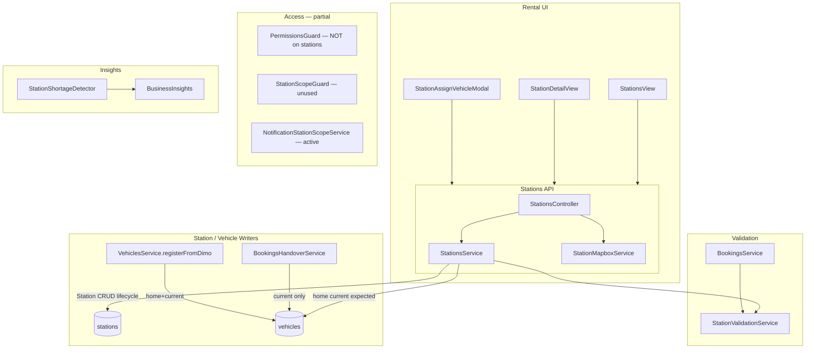

# Stations V2 — Read-only Implementierungsinventur (Prompt 2/78)

| Feld | Wert |
|------|------|
| **Dokumenttyp** | Repository-Inventur / Implementierungsgrundlage |
| **Erstellt (UTC)** | 2026-07-17T21:45:00Z |
| **Repository-Git-Commit** | `594835a6bedd07681f4a74adde5156d5569f69e5` |
| **Baseline vor Änderungen** | `594835a6` (`main`) |
| **Basis-Audits** | [`stations-production-reality.md`](./stations-production-reality.md) (`bc0d3efc`), [`stations-workflow-ux-test-matrix.md`](./stations-workflow-ux-test-matrix.md) (`c390ebda`) |
| **Ausführungsvertrag** | [`../architecture/stations-v2-execution-contract.md`](../architecture/stations-v2-execution-contract.md) (Prompt 1/78) |
| **Status** | Read-only — **keine** produktiven Codeänderungen in diesem Prompt |

---

## Inhaltsverzeichnis

| # | Abschnitt |
|---|-----------|
| 0 | Executive Summary |
| 1 | Station-Endpunkte und Call-Sites |
| 2 | Statuswriter (`Station.status`, Lifecycle) |
| 3 | Writer `homeStationId` / `currentStationId` / `expectedStationId` |
| 4 | Permission- und Scope-Pfade |
| 5 | Listen-, Detail- und KPI-Reader |
| 6 | Bulk- und Einzelzuweisungen |
| 7 | Archive / Restore / Delete / Primary |
| 8 | Booking- / Pickup- / Return-Verdrahtung |
| 9 | Öffnungszeiten, Feiertage, Kapazität, Zeitzonen |
| 10 | Geofence- und Standortverwendungen |
| 11 | Leere oder divergierende UI-Flows |
| 12 | Bestehende Tests |
| 13 | Seit den Audits geänderte Dateien |
| 14 | Exakte Änderungsmatrix Prompts 7–78 |
| 15 | Prisma-Schema und Migrationen |
| 16 | Architekturdiagramm |

---

## 0. Executive Summary

Das Stations-Modul ist **vollständig im Code vorhanden** (18 REST-Routen, Rental-UI, Booking-Integration, Handover-`currentStationId`, Business-Insights `STATION_SHORTAGE`, Notification-Station-Scope). **Produktionsdaten** (Audit 1): 1 Org, 2 Stationen, 6 Fahrzeuge — sauber, aber **keine** station-scoped User.

**Kritische Ist-Lücken (unverändert seit Audits):**

| ID | Thema | Ist |
|----|-------|-----|
| P0-1 | RBAC | `PermissionsGuard` **nicht** auf `StationsController` |
| P0-2 | Station Scope | `StationScopeGuard` existiert, **unwired**; JWT ohne `stationScope` |
| P0-3 | Bulk SET | UI lädt max. 500 Fahrzeuge → stiller Detach |
| P0-4 | Home/Current | `assignVehicle` / `setStationVehicles` koppeln home+current |
| P0-5 | Regeln | Opening hours / holidays / capacity **nicht** durchgesetzt |
| P0-6 | Hard Delete | `StationsService.delete` kann `prisma.station.delete` (ohne Links) |

**Codeänderungen seit Audit 1/2:** nur Dokumentation (Execution Contract, Audit-Matrix-Commit). **Keine** Stations-Runtime-Code-Änderungen auf `main` seit `bc0d3efc`.

**Gesamturteil:** **CONDITIONALLY_READY** (kleine Flotte, ORG_ADMIN) · **NOT_READY** (scoped Roles, große Flotte, strikte home/current-Trennung).

---

## 1. Station-Endpunkte und Call-Sites

### 1.1 REST-API (`StationsController`)

**Basis:** `GET|POST|PATCH|PUT|DELETE /api/v1/organizations/:orgId/stations/...`  
**Guards:** `OrgScopingGuard`, `RolesGuard` — **kein** `PermissionsGuard`, **kein** `StationScopeGuard`

| # | HTTP | Route | Controller | Service / Dependency |
|---|------|-------|------------|----------------------|
| 1 | GET | `/` | `findAll` | `StationsService.findAll` |
| 2 | GET | `/stats` | `getStats` | `StationsService.getStationStats` |
| 3 | GET | `/search/mapbox` | `searchMapbox` | `StationMapboxService.search` |
| 4 | GET | `/search/mapbox/:mapboxId` | `retrieveMapbox` | `StationMapboxService.retrieve` |
| 5 | POST | `/backfill-coordinates` | `backfillCoordinates` | `StationsService.backfillCoordinates` |
| 6 | PATCH | `/vehicles/current-station` | `updateVehicleCurrentStation` | `StationsService.updateVehicleCurrentStation` |
| 7 | GET | `/:id` | `findOne` | `StationsService.findOne` |
| 8 | GET | `/:id/overview-stats` | `getOverviewStats` | `StationsService.getStationOverviewStats` |
| 9 | GET | `/:id/fleet` | `getFleet` | `StationsService.getStationFleet` |
| 10 | GET | `/:id/bookings` | `getBookings` | `StationsService.getStationBookings` |
| 11 | POST | `/` | `create` | `StationsService.create` |
| 12 | PATCH | `/:id` | `update` | `StationsService.update` |
| 13 | POST | `/:id/archive` | `archive` | `StationsService.archive` |
| 14 | POST | `/:id/restore` | `restore` | `StationsService.restore` |
| 15 | POST | `/:id/set-primary` | `setPrimary` | `StationsService.setPrimaryStation` |
| 16 | PUT | `/:id/vehicles` | `setVehicles` | `StationsService.setStationVehicles` |
| 17 | POST | `/:id/assign-vehicle` | `assignVehicle` | `StationsService.assignVehicleToStation` |
| 18 | DELETE | `/:id` | `delete` | `StationsService.delete` |

**Quelle:** `backend/src/modules/stations/stations.controller.ts`

### 1.2 Frontend API-Client (`api.stations`)

**Datei:** `frontend/src/lib/api.ts` (~L3868–3939)

| Client-Methode | Endpoint | Frontend-Call-Sites |
|----------------|----------|---------------------|
| `list` | GET `/stations` | `StationsView`, `StationDetailView` (indirekt), `FleetView`, `NewBookingView`, `BookingsView`, `BookingEditDialog`, `HandoverProtocolDialog`, `TasksView`, `CreateVehicleTaskDialog`, `useInvoices`, `useDashboardViewModel`, `useCompanyCenter`, `useAccessControlCenter`, `useVoiceKnowledgeLinks`, `OperatorBookingFormSheet`, `useOperatorHandoverForm` |
| `get` | GET `/:id` | `StationDetailView` |
| `create` / `update` | POST/PATCH | `StationsView`, `StationDetailView`, `SettingsView.StationsTab` (legacy) |
| `delete` | DELETE | `SettingsView.StationsTab` only |
| `archive` / `restore` | POST | `archive`: `StationsView`; `restore`: **kein UI** |
| `setPrimary` | POST | `StationsView`, `StationDetailView` |
| `overviewStats` | GET | `StationsView` (N× pro Station), `StationDetailView` |
| `fleet` / `bookings` | GET | `StationDetailView` |
| `stats` | GET | `StationsView`, `SettingsView.StationsTab` |
| `searchMapbox` / `mapboxRetrieve` | GET | `StationFormModal`, `SettingsView.StationsTab` |
| `setVehicles` | PUT | `StationAssignVehicleModal`, `SettingsView.StationsTab` |
| `assignVehicle` | POST | **kein UI-Call** |
| `backfillCoordinates` | POST | `StationsView`, `SettingsView.StationsTab` |

### 1.3 Indirekte Backend-Consumer (kein eigener Controller)

| Modul | Datei | Stationsbezug |
|-------|-------|---------------|
| Bookings | `bookings.service.ts` | Defaults, Validierung, Prisma-Relations |
| Handover | `bookings-handover.service.ts` | `actualStationId` → `vehicle.currentStationId` |
| Vehicles | `vehicles.service.ts` | `registerFromDimo` home+current; Reads in Listen |
| Business Insights | `station-shortage.detector.ts` + weitere | `homeStationId`, `pickupStationId` |
| Notifications | `notification-station-scope.service.ts` | Scope-Filter SUB_ADMIN/WORKER |
| Tasks | `task-automation-*.ts` | optionales `stationScope` in Overrides |
| Rental Health | `rental-health.service.ts` | indirekt über Fahrzeug-/Buchungskontext |
| Vehicle Operational State V2 | `vehicle-operational-state-v2.*` | `homeStationId`, Booking-Station-Namen |
| Platform Admin | `platform-admin.service.ts` | `station.deleteMany` in `pruneMasterData` |

### 1.4 Exportiertes Modul

`backend/src/modules/stations/stations.module.ts` exportiert `StationsService`, `StationValidationService`.

---

## 2. Statuswriter (`Station.status` und Lifecycle-Felder)

Alle produktiven **`Station`-Row-Writes** laufen über **`StationsService`** (`stations.service.ts`).

| Methode | Zeilen (ca.) | Geschriebene Felder |
|---------|--------------|---------------------|
| `create` | L203–218 | Vollständiger Insert via `buildWriteData`; optional `isPrimary` → andere Primaries löschen |
| `update` | L267–278 | PATCH via `buildWriteData`; optional Re-Geocode |
| `archive` | L288–298 | `status=ARCHIVED`, `archivedAt`, `isPrimary=false`, `pickupEnabled=false`, `returnEnabled=false` |
| `restore` | L306–315 | `status=ACTIVE`, `archivedAt=null`, `pickupEnabled=true`, `returnEnabled=true` |
| `setPrimaryStation` | L327–335 | `isPrimary=true`, `status=ACTIVE`; Tx löscht andere Primaries |
| `buildWriteData` | L1070–1079 | `status` aus Body; `archivedAt` bei ARCHIVED/ACTIVE |
| `backfillCoordinates` | L937–940 | `latitude`, `longitude` |
| `delete` | L341–359 | Bei Links → `archive()`; sonst **`prisma.station.delete`** |

**Nicht-API-Writes (Admin/Ops only):**

| Datei | Operation |
|-------|-----------|
| `platform-admin.service.ts` | `prisma.station.deleteMany({})` |
| `backend/prisma/prune-master-data.ts` | `prisma.station.deleteMany({})` |

**Kein** Worker/Scheduler mutiert `Station`-Rows automatisch (Audit 1 bestätigt).

---

## 3. Writer `homeStationId` / `currentStationId` / `expectedStationId`

### 3.1 Produktions-Schreibpfade (exklusiv)

| # | Datei | Methode | `home` | `current` | `expected` | Semantik |
|---|-------|---------|--------|-----------|------------|----------|
| 1 | `stations.service.ts` | `assignVehicleToStation` | ✓ (target=home) | ✓ (bei home **mit** home) | ✓ (target=expected) | **Kopplung** home→current bei `home` |
| 2 | `stations.service.ts` | `updateVehicleCurrentStation` | — | ✓ | optional ✓ | Entkoppelter Patch |
| 3 | `stations.service.ts` | `setStationVehicles` | ✓ SET | ✓ SET (gleich home) | — | Detach: home+current null; **expected bleibt** |
| 4 | `bookings-handover.service.ts` | PICKUP/RETURN finalize | — | ✓ (`actualStationId`) | — | Nur physischer Standort |
| 5 | `vehicles.service.ts` | `registerFromDimo` | ✓ | ✓ (wenn `stationId`) | — | Neufahrzeug-Kopplung |

### 3.2 Reader-only (Auswahl)

| Bereich | Dateien | Felder |
|---------|---------|--------|
| Fleet Map / Filter | `fleet-map-vehicle-mapper.ts`, `fleet-station-filter.ts`, `useFleetMapStore.ts` | home, current, expected (Filter teilweise ohne expected) |
| Dashboard | `stationCommandBuilder.ts`, `controlSignalsBuilder.ts`, `vehicleRuntimeStateBuilder.ts` | home, current |
| Booking Preflight | `booking-vehicle-preflight.ts` | bevorzugt `homeStationId` |
| Business Insights | `station-shortage`, `tight-handover`, `pickup-overdue`, `low-utilization`, `*-critical` detectors | überwiegend `homeStationId` |
| Notifications | `notification-station-scope.service.ts` | home, current, expected für Vehicle-Scope |
| Operational State V2 | `vehicle-operational-state-v2.*`, `fleet-booking-context.util.ts` | home + Booking-Station-IDs |

### 3.3 Invarianten-Verstöße (V2-Ziel)

| Verstoß | Ist-Code |
|---------|----------|
| **S1** still gekoppelt | `assignVehicle` target `home` setzt auch `current` (L604–606) |
| **S1** SET-Kopplung | `setStationVehicles` attach setzt beide (L756) |
| **expected** nicht bereinigt | Detach in `setStationVehicles` (L748) |
| **expected** ungenutzt | 0 Prod-Fahrzeuge mit `expectedStationId` (Audit 1) |

---

## 4. Permission- und Scope-Pfade

### 4.1 API-Guards auf Stations-Controller

| Guard | Angewendet? | Wirkung |
|-------|-------------|---------|
| `OrgScopingGuard` | ✓ | `organizationId` aus Route |
| `RolesGuard` | ✓ | Kein `@Roles()` → **alle aktiven Mitglieder** erlaubt |
| `PermissionsGuard` | ✗ | Modul `stations` in Templates definiert, **nicht enforced** |
| `StationScopeGuard` | ✗ | Datei `backend/src/shared/guards/station-scope.guard.ts` — **nirgends registriert** |

### 4.2 Rollen-Templates (`organization-role.defaults.ts`)

| Template | `stations` Permission |
|----------|----------------------|
| `org_admin`, `sub_admin` | read / write / manage |
| `station_manager` | read + write |
| `disposition`, `accounting`, `employee`, `field_agent`, `service`, `read_only` | read only oder kein Zugriff |
| `driver` | kein `stations` read |

**Konstante:** `permission.constants.ts` → Modul-Key `'stations'`.

### 4.3 Membership Station Scope (User/Invite)

| Feld | Schema | JWT / API |
|------|--------|-----------|
| `stationScope` | `OrganizationMembership.stationScope` | In Membership-API; **nicht** in Stations-List-Filter |
| `stationIds` | JSON auf Membership | User-Verwaltung |
| `stationScopeDefault` | `OrganizationRole` | Invite/Create Defaults |

**Notification-Pfad (einziger produktiver Scope-Filter):**

`notification-station-scope.service.ts` — `SUB_ADMIN`/`WORKER` mit gesetztem `stationScope` ≠ `ALL` → filtert Notifications nach Vehicle-/Booking-Station-IDs.

### 4.4 Frontend Permission-Checks

Keine dedizierten `stations`-Permission-Guards in Rental-UI — Sichtbarkeit über Navigation/Rollen implizit, nicht server-aligned.

---

## 5. Listen-, Detail- und KPI-Reader

### 5.1 Listen

| Endpoint / UI | Query-Logik | KPI / Zähler |
|---------------|-------------|--------------|
| `GET /stations` | `organizationId`, optional `status`, `type`, `selectableOnly` | `vehicleCount` = **`vehiclesHome` only** (`_count.vehiclesHome`) |
| `GET /stations/stats` | Nicht-archivierte Stationen | `totalVehicles` = Summe home counts; `unassignedVehicles` = `homeStationId IS NULL` |
| `StationsView` | Client-Filter Search/Status/Type | Lädt `stats` + pro Station `overviewStats` (N+1) |

### 5.2 Detail

| Endpoint | Inhalt | Limits |
|----------|--------|--------|
| `GET /stations/:id` | `StationDto` + home vehicle count | — |
| `GET /stations/:id/fleet` | Fahrzeuge mit `homeStationId OR currentStationId` | unbegrenzt |
| `GET /stations/:id/bookings` | Pickup/Return-Station-Match | **take: 100** |
| `StationDetailView` | Tabs Overview/Fleet/Bookings/Rules/Handover; Staff leer | — |

### 5.3 KPI (`getStationOverviewStats`)

| Metrik | Berechnung | Abweichung |
|--------|------------|------------|
| `totalVehicles` | home ∪ current | ≠ Listen-`vehicleCount` (nur home) |
| `availableVehicles` / `bookedVehicles` | Vehicle.status auf union set | `bookedVehicles` = `RENTED`, nicht Buchungszahl |
| `todayPickups` / `todayReturns` | `startDate`/`endDate` vs. **Server-Mitternacht** | Ignoriert `station.timezone` |
| `openTasks` | Tasks zu Station-Fahrzeugen + max 500 Booking-IDs | Under-count-Risiko |
| `capacityUsagePercent` | `totalVehicles / capacity` | Nur Anzeige, keine Enforcement |
| `vehiclesWithHealthWarnings` | immer `null` | **NOT_IMPLEMENTED** |

---

## 6. Bulk- und Einzelzuweisungen

### 6.1 Bulk SET — `PUT /:id/vehicles`

| Aspekt | Ist |
|--------|-----|
| Semantik | Exakte Menge `vehicleIds` = neue Home-Flotte |
| Detach | `homeStationId=null`, `currentStationId=null` |
| Attach/Move | `homeStationId=stationId`, `currentStationId=stationId` |
| `expectedStationId` | **unverändert** bei Detach |
| Validierung | Alle IDs müssen zur Org gehören |
| Response | `newlyAttached`, `detached`, `movedFromOtherStations` |

**UI:** `StationAssignVehicleModal.tsx` lädt `api.vehicles.listByOrg({ limit: 500 })` → **P0 partial SET**.

### 6.2 Einzel — `POST /:id/assign-vehicle`

| `target` | Wirkung |
|----------|---------|
| `home` (default) | home + current |
| `current` | nur current |
| `expected` | nur expected |

**UI:** API existiert, **kein Frontend-Call**.

### 6.3 Patch — `PATCH /vehicles/current-station`

Body: `vehicleId`, `currentStationId`, optional `expectedStationId`.  
Validierung über `assertVehicleStationAssignment`. **Kein** dediziertes UI (außer indirekt Handover).

### 6.4 Vehicle Create — `registerFromDimo`

Optional `stationId` → setzt home **und** current beim Anlegen.

---

## 7. Archive / Restore / Delete / Primary

| Operation | API | Verhalten | UI |
|-----------|-----|-----------|-----|
| **Archive** | `POST /:id/archive` | Status ARCHIVED, Flags aus, primary weg | `StationsView` |
| **Restore** | `POST /:id/restore` | ACTIVE, pickup/return **immer** true | **Kein UI** |
| **Set Primary** | `POST /:id/set-primary` | Tx, archived blockiert | `StationsView`, `StationDetailView` |
| **Delete** | `DELETE /:id` | Links → archive; sonst hard delete | Nur legacy `SettingsView.StationsTab` |
| **PATCH status** | `update` | Kann direkt ARCHIVED setzen | Form |

**DB:** Kein Unique-Index „eine Primary pro Org“ (nur Tx-Logik). **V2-Vertrag:** kein Hard Delete ausbauen.

---

## 8. Booking- / Pickup- / Return-Verdrahtung

### 8.1 Booking-Felder (Prisma `Booking`)

| Feld | Rolle |
|------|-------|
| `pickupStationId` / `returnStationId` | Geplant |
| `actualPickupStationId` / `actualReturnStationId` | Tatsächlich (Handover) |
| `isOneWayRental` | Abgeleitet / validiert |
| `pickupAddressOverride` / `returnAddressOverride` | Alternative zu Station |
| `stationTransferFeeCents` | Gebühr (gespeichert, wenig UI) |

### 8.2 `BookingsService` + `StationValidationService`

| Flow | Datei | Validierung |
|------|-------|-------------|
| Create defaults | `applyBookingStationDefaults` | Primary oder `vehicle.homeStationId` |
| Resolve fields | `resolveBookingStationFields` | `validateBookingStations` — active, flags, one-way |
| Update | merge + re-validate | bei Station-Feld-Änderung |

**Nicht validiert:** opening hours, holidays, capacity, after-hours.

### 8.3 Handover

`HandoverProtocolDialog.tsx` / Operator-Handover → `actualStationId` → Backend setzt Booking `actual*StationId` und **`vehicle.currentStationId`** (PICKUP/RETURN). **`homeStationId` und `expectedStationId` unberührt.**

### 8.4 Frontend Booking-Station-UI

| Komponente | Rolle |
|------------|-------|
| `StationSelectFields.tsx` | Pickup/Return-Picker, One-Way-Warnungen |
| `BookingStationPanel.tsx` | Geplant vs. tatsächlich |
| `NewBookingView.tsx` | Default pickup von `homeStationId` |
| `stationBookingUtils.ts` | Filter/Warnungen (client-only) |

---

## 9. Öffnungszeiten, Feiertage, Kapazität, Zeitzonen

### 9.1 Persistenz (`Station` model)

| Feld | Typ | Default | Enforcement |
|------|-----|---------|-------------|
| `openingHours` | JSON | — | **Anzeige only** |
| `holidayRules` | JSON | — | **Unbenutzt** |
| `capacity` | Int? | — | KPI `%` only |
| `timezone` | String? | `Europe/Berlin` | KPI „heute“ nutzt **Server-TZ** |
| `afterHoursReturnEnabled` | Boolean | false | **Nicht** in Booking-Validation |
| `pickupEnabled` / `returnEnabled` | Boolean | true | ✓ in `assertStationSelectable` |

### 9.2 Frontend

| Datei | Nutzung |
|-------|---------|
| `stationUtils.ts` | `openingHoursIsMissing`, Formatierung, Warn-Badges |
| `StationFormModal.tsx` | Wochentags-Editor, Kapazität, TZ-Auswahl |
| `StationDetailView.tsx` | Rules-Tab Anzeige |

### 9.3 Backend-Helfer

`station.types.ts` → `openingHoursIsMissing()` für Overview-Flag `hasMissingOpeningHours`.

---

## 10. Geofence- und Standortverwendungen

### 10.1 Konfiguration

| Feld | Speicher | UI |
|------|----------|-----|
| `latitude` / `longitude` | Station row | Form, Map, Backfill |
| `radiusMeters` | 25–5000 m, default 100 | Slider in `StationFormModal` |
| DTO-Alias | `geofenceRadiusMeters` = `radiusMeters` | `StationDetailView` Map |

**Geocoding:** Mapbox forward in `StationsService.geocodeAddress`; `backfillCoordinates` Admin-Recovery.

### 10.2 Frontend Geofence (read-only Badge)

| Datei | Funktion |
|-------|----------|
| `frontend/src/lib/geospatial.ts` | `distanceMeters` (Haversine), `isVehicleAtHomeStation`, `circlePolygon` |
| `HomeAwayBadge.tsx` | HOME/AWAY/UNKNOWN Pill |
| `FleetView.tsx`, `StatInlineDetail.tsx` | Badge in Karten |
| `vehicleStationDeviation.ts` | Abweichungs-Text — **kein Consumer** |

### 10.3 Backend Auto-Update

**NOT_IMPLEMENTED** — kein Job/Webhook setzt `currentStationId` aus GPS/DIMO. **V2-Vertrag §5.3:** Geofence nicht auto-operativ bis dedizierter Rollout-Prompt.

---

## 11. Leere oder divergierende UI-Flows

| ID | Flow | Status |
|----|------|--------|
| UI-1 | `StationDetailView` Staff-Tab | Permanent `EmptyState` — keine API |
| UI-2 | `api.stations.restore` | API ohne UI |
| UI-3 | `api.stations.assignVehicle` | API ohne UI (`expected`/`current` targets) |
| UI-4 | `SettingsView.StationsTab` | ~1500 Zeilen Duplikat; **nicht** in Rental-`App.tsx` geroutet |
| UI-5 | Zwei Form-Modals | `StationFormModal` vs. inline Settings — Default-Radius 100 vs. 150 m |
| UI-6 | Zwei Assign-Modals | Settings hat Geofence-„vor Ort“; `StationAssignVehicleModal` nicht |
| UI-7 | `expectedStationId` | Typisiert, in Filtern **ignoriert** |
| UI-8 | `StationSelectFields` | Hardcoded DE, nicht i18n |
| UI-9 | Listen-Overview KPI | Silent `.catch` pro Station in `StationsView` |
| UI-10 | `vehicleStationDeviation.ts` | Tot — nie importiert |
| UI-11 | `HomeAwayBadge` | Nutzt nur `radiusMeters`, nicht `geofenceRadiusMeters`-Fallback |

---

## 12. Bestehende Tests

### 12.1 Backend (dediziert Stations)

| Datei | Tests | Abdeckung |
|-------|-------|-----------|
| `stations.service.spec.ts` | 10 (geschätzt) | Validation archived/pickup/one-way; list; archive-on-delete; overview stats partial |
| `station-geocode.util.spec.ts` | separat | Geocode-Util |

**Ausführung (Audit 2):** `npm test -- --testPathPattern='stations|station-geocode'` → 2 Suites, 10 passed.

### 12.2 Backend (station-referenzierend)

| Datei | Relevanz |
|-------|----------|
| `business-insights/business-insights.spec.ts` | `STATION_SHORTAGE` |
| `business-insights/detectors/*.spec.ts` | `homeStationId` in Gruppierung |
| `notifications/access/notification-access.policies.spec.ts` | `NotificationStationScopeService` |
| `notifications/adapters/notification-producers-phase1.spec.ts` | Station shortage sync |
| `vehicles/operational/vehicle-operational-state-v2.*.spec.ts` | Station-Fixtures |

**Fehlend:** `StationScopeGuard`, Permissions auf Controller, SET>500, home/current decouple, TZ-KPI, Archive/Restore UI, Geofence, Controller supertest.

### 12.3 Frontend

| Datei | Abdeckung |
|-------|-----------|
| `fleet-station-filter.test.ts` | home/current Filter |
| `stationCommandBuilder.test.ts` | Dashboard station summaries |
| `booking-vehicle-preflight.test.ts` | `vehicleStationId` |

**Fehlend:** alle `components/stations/*`, `stationUtils`, `stationBookingUtils`, `HomeAwayBadge`, E2E.

### 12.4 E2E

Keine Playwright/Cypress-Suite für Stations. `frontend/e2e/*-fixtures.ts` enthalten Station-IDs als Testdaten nur indirekt.

---

## 13. Seit den Audits geänderte Dateien

**Audit-Baseline:** `bc0d3efc` (Production Reality) / `c390ebda` (Workflow Matrix committed).

**Commits auf `main` seit `bc0d3efc` (nur Docs):**

| Commit | Dateien | Hinweis |
|--------|---------|---------|
| `c390ebda` | `docs/audits/stations-workflow-ux-test-matrix.md` | Audit 2 committed |
| `594835a6` | `docs/architecture/stations-v2-execution-contract.md` | Prompt 1 |

**Uncommitted (Working Tree, nicht Teil dieses Prompts):**

| Datei | Änderung |
|-------|----------|
| `docs/audits/stations-workflow-ux-test-matrix.md` | Zählkorrekturen Matrix (225 rows, PASS/FAIL counts) |
| `.cursor/tmp/stations-audit-readonly*.sql` | untracked Audit-SQL |

**Stations Runtime-Code (`backend/src/modules/stations/**`, Frontend `components/stations/**`, Prisma):** **keine Änderungen** seit Audit-Baseline.

---

## 14. Exakte Änderungsmatrix für Prompts 7–78

> **Prompt 1** = Execution Contract · **Prompt 2** = diese Inventur · **Prompts 3–6** = voraussichtlich Zielarchitektur, Prisma-Plan, Rollout-Flags, Migrationsplan (noch nicht im Repo, analog Battery V2). **Ab Prompt 7** beginnt die Umsetzung entlang Audit-Empfehlungen und [`stations-v2-execution-contract.md`](../architecture/stations-v2-execution-contract.md) §5.

### Block A — RBAC & API-Hardening (Prompts 7–12)

| Prompt | Ziel | Betroffene Dateien (voraussichtlich) |
|--------|------|--------------------------------------|
| **7** | `PermissionsGuard` + `@RequirePermission('stations','read')` auf alle GET-Routen | `stations.controller.ts`, `permissions.guard.ts`, Controller-Spec |
| **8** | `@RequirePermission('stations','write')` auf POST/PATCH/PUT/DELETE | `stations.controller.ts` |
| **9** | Permission-Matrix-Tests + Role-Template-Abgleich | `stations.controller.spec.ts` (neu), `organization-role.defaults.ts` |
| **10** | JWT/Membership: `stationScope` + `stationIds` im Auth-Payload dokumentieren/exponieren | Auth-Module, `users.service.ts`, `account.service.ts` |
| **11** | `StationScopeGuard` refactoren (`:id` statt `stationId`) + List-Query-Filter | `station-scope.guard.ts`, `stations.service.ts` `findAll` |
| **12** | Scope auf Writes + Detail/Fleet/Bookings/Stats | `stations.controller.ts`, `stations.service.ts`, Tests |

### Block B — Home / Current / Expected Entkopplung (Prompts 13–20)

| Prompt | Ziel | Dateien |
|--------|------|---------|
| **13** | `assignVehicle` target `home` schreibt **nur** `homeStationId` | `stations.service.ts`, DTO-Docs |
| **14** | `setStationVehicles` attach/detach: home und current getrennt steuerbar | `stations.service.ts`, `set-station-vehicles.dto.ts` |
| **15** | Detach bereinigt `expectedStationId` wenn Heimat/Current verlassen | `stations.service.ts` |
| **16** | `registerFromDimo`: home ohne automatisches current | `vehicles.service.ts` |
| **17** | API: explizite `setCurrentStation` / `setExpectedStation` (oder erweiterte PATCH) | `stations.controller.ts`, `api.ts` |
| **18** | Frontend: Assign-Flows auf getrennte Semantik | `StationAssignVehicleModal.tsx`, `FleetView` |
| **19** | Daten-Diagnose-Script: home≠current Verteilung | `backend/scripts/ops/` |
| **20** | Unit/Integration: S1-Invarianten | `stations.service.spec.ts` |

### Block C — Bulk Assignment & Flotten-Skalierung (Prompts 21–26)

| Prompt | Ziel | Dateien |
|--------|------|---------|
| **21** | Server-side paginierter Vehicle-Picker (kein 500-Cap) | Neuer Endpoint oder `vehicles` query, `StationAssignVehicleModal.tsx` |
| **22** | SET-Preview: `wouldDetach` / `wouldAttach` vor Commit | `stations.service.ts`, API |
| **23** | Warnung UI wenn `totalVehicles > loadedCount` | `StationAssignVehicleModal.tsx` |
| **24** | Alternative: incremental attach/detach statt full SET | `stations.controller.ts`, UI |
| **25** | `movedFromOtherStations` im UI anzeigen | `StationAssignVehicleModal.tsx` |
| **26** | Tests SET mit 501+ simulierten IDs | `stations.service.spec.ts` |

### Block D — Lifecycle Archive / Primary / Delete (Prompts 27–32)

| Prompt | Ziel | Dateien |
|--------|------|---------|
| **27** | `delete` → immer archive (Hard Delete entfernen/deprecaten) | `stations.service.ts`, Contract-Tests |
| **28** | Restore UI in `StationsView` / Detail | `StationsView.tsx`, `StationDetailView.tsx` |
| **29** | Restore respektiert vorherige pickup/return-Flags | `stations.service.ts` |
| **30** | DB partial unique index: max eine `is_primary` pro Org | Prisma migration |
| **31** | Primary race Integration-Test | `stations.service.spec.ts` |
| **32** | Archive: erwartete Bereinigung `expectedStationId` an Heimat-Flotte | `stations.service.ts` |

### Block E — Booking-Regeln (Prompts 33–40)

| Prompt | Ziel | Dateien |
|--------|------|---------|
| **33** | Opening-hours Validator (WARN vs BLOCK konfigurierbar) | `station-validation.service.ts` |
| **34** | Holiday rules Parser + Validator | `station-validation.service.ts`, `station.types.ts` |
| **35** | Capacity check on booking create/update | `bookings.service.ts`, `station-validation.service.ts` |
| **36** | After-hours return Regel | `station-validation.service.ts` |
| **37** | Frontend: Server-Fehler in `StationSelectFields` / Booking forms | `NewBookingView.tsx`, `BookingEditDialog.tsx` |
| **38** | One-way → optional `expectedStationId` auf Vehicle | `bookings.service.ts`, `vehicles` update |
| **39** | `stationTransferFeeCents` UI + Berechnung | Booking UI + service |
| **40** | Booking+Station Integration tests | `bookings.service.spec.ts` |

### Block F — Zeitzonen & KPI-Wahrheit (Prompts 41–46)

| Prompt | Ziel | Dateien |
|--------|------|---------|
| **41** | `todayPickups/Returns` in `station.timezone` | `stations.service.ts` |
| **42** | KPI-Definitionen dokumentieren + `vehicleCount` alignen | `stations.service.ts`, DTO |
| **43** | `bookedVehicles` aus Buchungen statt nur `RENTED` | `getStationOverviewStats` |
| **44** | `vehiclesWithHealthWarnings` aus Rental Health | `stations.service.ts`, `rental-health.service.ts` |
| **45** | Paginierte `getStationBookings` | `stations.service.ts`, `StationDetailView.tsx` |
| **46** | Open-tasks Booking-ID limit entfernen / subquery | `getStationOverviewStats` |

### Block G — Geofence (Config & Read-only, Prompts 47–50)

| Prompt | Ziel | Dateien |
|--------|------|---------|
| **47** | `HomeAwayBadge` radius fallback harmonisieren | `HomeAwayBadge.tsx`, `geospatial.ts` |
| **48** | `vehicleStationDeviation` in Fleet/Detail einbinden oder entfernen | UI cleanup |
| **49** | Map-Geofence konsistent in Fleet Map | `MapboxMap.tsx`, `FleetView.tsx` |
| **50** | **Kein** auto `currentStationId` — nur Feature-Flag-Scaffold | `stations-v2-rollout-flags` (Prompt 5), Config |

### Block H — Transfer / Expected Workflow (Prompts 51–54)

| Prompt | Ziel | Dateien |
|--------|------|---------|
| **51** | Expected-Station UI (Assign target `expected`) | `StationDetailView`, `api.stations.assignVehicle` |
| **52** | Transfer-Plan Domain (shadow) | Neues Modul oder `stations` Erweiterung |
| **53** | Booking one-way → set expected on vehicle | `bookings.service.ts` |
| **54** | Clear expected on Handover complete | `bookings-handover.service.ts` |

### Block I — UI-Konsolidierung & i18n (Prompts 55–60)

| Prompt | Ziel | Dateien |
|--------|------|---------|
| **55** | Legacy `SettingsView.StationsTab` entfernen oder redirect | `SettingsView.tsx` |
| **56** | Staff-Tab: implementieren oder aus Navigation entfernen | `StationDetailView.tsx` |
| **57** | `StationSelectFields` i18n | `StationSelectFields.tsx`, `translations/*` |
| **58** | Silent overview KPI failures → Toast/Badge | `StationsView.tsx` |
| **59** | Operator + Rental Handover Station-Picker Parität | Operator components |
| **60** | Figma-Alignment Stations surfaces | `StationsView`, `StationDetailView`, `StationFormModal` |

### Block J — Monitoring, Tasks, Insights (Prompts 61–66)

| Prompt | Ziel | Dateien |
|--------|------|---------|
| **61** | Prometheus: `synqdrive_station_*` Metriken | Observability module |
| **62** | Grafana Panel Stations Ops | `monitoring/grafana/` |
| **63** | Station shortage detector N+1 fix | `station-shortage.detector.ts` |
| **64** | Activity/Audit log für Station mutations | Audit middleware |
| **65** | Task automation `stationScope` ↔ echte Station-IDs | `task-automation-*.ts` |
| **66** | Notification scope + Stations API alignment | `notification-station-scope.service.ts` |

### Block K — Tests, Docs, Rollout (Prompts 67–78)

| Prompt | Ziel |
|--------|------|
| **67** | Controller supertest suite (alle 18 Routen) |
| **68** | Frontend RTL/Vitest: `StationFormModal`, `StationsView` |
| **69** | Vitest: `stationUtils`, `stationBookingUtils`, `geospatial` |
| **70** | E2E: Create station → assign → book → handover |
| **71** | `docs/architecture/stations-v2.md` (Prompt 3) mit Ist-Abgleich |
| **72** | Prisma-Plan + additive Migrationen (Prompt 4) |
| **73** | Rollout-Flags + org-canary (Prompt 5) |
| **74** | Migrations-/Dual-Read-Plan (Prompt 6) |
| **75** | ChangesView + ArchitekturView Einträge |
| **76** | Runbook: Station ops, backfill, scope rollout |
| **77** | Staging-Abnahme scoped user + 500+ fleet simulation |
| **78** | Final closure audit (read-only) + Production readiness verdict |

---

## 15. Prisma-Schema und Migrationen

### 15.1 `Station` model (`schema.prisma` L1749–1798)

Kernfelder: `status` (`ACTIVE|INACTIVE|ARCHIVED`), `type`, `isPrimary`, Adresse, `timezone`, `radiusMeters`, Flags (`pickupEnabled`, `returnEnabled`, `afterHoursReturnEnabled`, `keyBoxAvailable`), `capacity`, `openingHours`, `holidayRules`, `archivedAt`.

**Vehicle-FKs:** `homeStationId` (`station_id`), `currentStationId`, `expectedStationId` — alle `onDelete: SetNull`.

### 15.2 Stationsbezogene Migrationen

| Migration | Inhalt |
|-----------|--------|
| `20260311224040_init` | Basis `stations`, `vehicles.station_id` |
| `20260420080000_station_operational_fields` | Erweiterte Stationsfelder |
| `20260426220000_station_geofence_radius` | `radius_meters` |
| `20260616120000_station_operational_module` | V2-Semantik: current/expected, booking actual stations, ARCHIVED, primary seed |
| `20260617120000_membership_station_ids` | User `station_ids` JSON |
| `20260617140000_organization_access_control` | Role access control |
| `20260715160000_org_task_automation_rule_overrides` | Task rule `station_scope` |

**Destruktiv-Check:** Operational-Module-Migration ist additive `ADD COLUMN` / `CREATE INDEX` — kein `DROP` auf Stationsdaten.

---

## 16. Architekturdiagramm (Ist)

---

## Anhang — Datei-Inventar (Kern)

### Backend `modules/stations/`

| Datei | Rolle |
|-------|-------|
| `stations.controller.ts` | 18 REST endpoints |
| `stations.service.ts` | CRUD, stats, fleet, assignment, geocode backfill |
| `station-validation.service.ts` | Booking + vehicle assignment validation |
| `station-mapbox.service.ts` | Address search/retrieve |
| `station-geocode.util.ts` | Mapbox token + country filter |
| `station.types.ts` | Labels, selectable statuses, overview helpers |
| `dto/*` | create, update, list, assign, set-vehicles, mapbox |

### Frontend `components/stations/`

| Datei | Rolle |
|-------|-------|
| `StationsView.tsx` | List + KPI header |
| `StationDetailView.tsx` | Detail tabs |
| `StationFormModal.tsx` | Create/edit |
| `StationAssignVehicleModal.tsx` | Bulk SET assign |
| `StationSelectFields.tsx` | Booking pickers |
| `stations-ui.ts` | Layout tokens |

### Shared libs

| Datei | Rolle |
|-------|-------|
| `frontend/src/lib/geospatial.ts` | Haversine geofence |
| `frontend/src/rental/lib/stationUtils.ts` | Formatting + warnings |
| `frontend/src/rental/lib/stationBookingUtils.ts` | Booking station helpers |
| `frontend/src/rental/lib/vehicleStationDeviation.ts` | Unused deviation helper |

---

*Ende Prompt 2/78 — Stations V2 Implementation Inventory*
