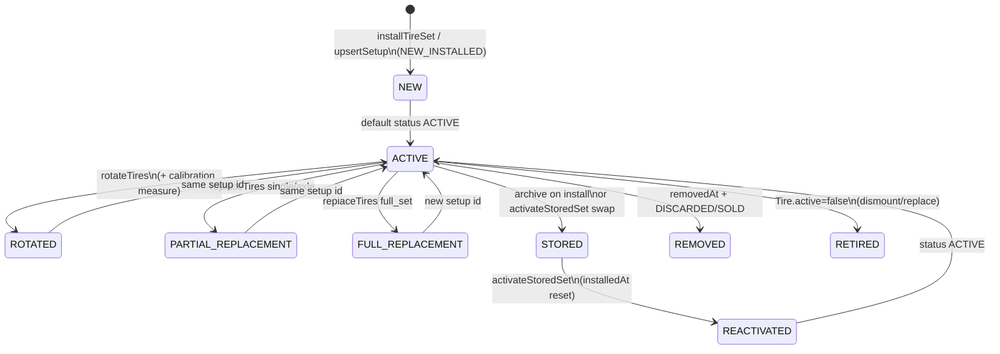

# Tire Health Production-Readiness Audit — July 2026

| Field | Value |
|-------|-------|
| **Audit ID** | `tire-health-production-readiness-2026-07` |
| **Repository** | [SYNQDRIVE-alpha](https://github.com/FATIHS-MGCKS/SYNQDRIVE-alpha) |
| **Branch** | `audit/tire-health-production-readiness-2026-07` |
| **Phase** | 5 of 7 — Historical Wear-Model Backtest |
| **Status** | Phases 1–5 complete; Phases 6–7 pending |
| **Production data modified** | **No** — all VPS/DB/DIMO access was read-only |
| **Last VPS runtime probe** | 2026-07-16 (read-only SSH + DIMO Telemetry API) |

---

## Executive summary (Phase 1)

The Tire Health module is a **mature, layered domain** in `vehicle-intelligence/tires/` with clear separation between **mutations** (`TireLifecycleService`), **wear mathematics** (`TireWearModelService` + `tire-health.config.ts`), and **canonical read models** (`TireHealthService` + `tire-status.ts`). Production runtime on the SynqDrive VPS runs as a **single PM2 process** (`synqdrive`) that hosts the NestJS API, BullMQ workers, and `@Interval`/`@Cron` schedulers in-process. PostgreSQL is the **system of record** for tire setups, measurements, snapshots, and events; ClickHouse is used for **high-frequency telemetry analytics** but has **no dedicated tire tables** — tire pressure for wear modelling is sourced from `vehicle_latest_state` (DIMO snapshot path) and High Mobility cache tables.

**Preliminary Phase-1 findings (not yet validated against full fleet replay):**

| Area | Observation | Preliminary risk |
|------|-------------|------------------|
| Trip → tire usage | `updateTireUsageFromTrip` runs only on explicit `POST …/trips/:id/enrich`, not on every trip finalize | **Medium** — km/event counters may lag if enrich is not called |
| Idempotency | Trip usage uses Prisma `increment` (additive, not idempotent on retry) | **Medium** |
| Recalculation | Hourly scheduler + BullMQ `jobId` hour-bucket dedupe; snapshots/data-points **append** | **Low–Medium** |
| Pressure data | Only **1** vehicle with non-null DIMO tire pressure in `vehicle_latest_state` (prod snapshot) | **High** for pressure-factor accuracy fleet-wide |
| Measured vs estimated | Display modes exist in read model; calibration via k-factor EMA | **Low** (design sound; coverage TBD in Phase 3) |
| Rental gate | `RentalHealthService` maps canonical `TireHealthSummary.overallStatus` → blocking | **Low** (read-only consumer) |
| Test coverage | Strong unit coverage on core services; limited E2E/replay tests | **Medium** |

---

## Audit constraints (all 7 phases)

### Allowed

- Repository read, tests, read-only PostgreSQL / ClickHouse / DIMO MCP queries
- Read-only audit scripts; anonymized aggregated artifacts in Git
- This documentation

### Not allowed

- Production writes, migrations, recalculations, tire mutations, DIMO subscriptions
- Worker/infra/config changes, secret output, PII in Git (VIN, plates, GPS, customer names)

### Vehicle anonymization

Stable public identifiers: `VEHICLE_001`, `VEHICLE_002`, … assigned by **sorted internal UUID** (mapping **not** stored in Git).

---

## Document map

| Artifact | Path |
|----------|------|
| Main report | `docs/audits/tire-health-production-readiness-2026-07.md` |
| Code map CSV | `docs/audits/data/tire-health-code-map-2026-07.csv` |
| Formula factor map CSV | `docs/audits/data/tire-health-formula-factor-map-2026-07.csv` |
| Spec source map CSV | `docs/audits/data/tire-health-spec-source-map-2026-07.csv` |
| Fleet coverage CSV | `docs/audits/data/tire-health-fleet-coverage-2026-07.csv` |
| Ground-truth classification CSV | `docs/audits/data/tire-health-ground-truth-classification-2026-07.csv` |
| Integrity findings JSON | `docs/audits/data/tire-health-integrity-findings-2026-07.json` |
| DIMO signal capability CSV | `docs/audits/data/tire-health-dimo-signal-capability-2026-07.csv` |
| DIMO timeseries coverage CSV | `docs/audits/data/tire-health-dimo-timeseries-coverage-2026-07.csv` |
| Backtest summary CSV | `docs/audits/data/tire-health-backtest-summary-2026-07.csv` |
| Phase 3 SQL (read-only) | `scripts/audits/tire-health-phase3-readonly.sql` |
| Audit script (integrity) | `scripts/audits/audit-tire-health-production-readiness.ts` |
| Audit script (DIMO signals) | `scripts/audits/audit-tire-health-dimo-signals.ts` |
| Audit script (backtest) | `scripts/audits/audit-tire-health-backtest.ts` |

---

## Full audit outline (Phases 1–7)

### Phase 1 — Architecture & Code Map ✅ (this document)

- Git/audit setup
- VPS runtime topology (read-only)
- Repository-wide code landkarte
- End-to-end data-flow diagram
- Preliminary risk register
- CSV code map

### Phase 2 — Domain model, spec logic & formula audit ✅

- Prisma lifecycle & constraint analysis (15 audit questions)
- Tire-spec source priority & factor influence table
- Initial tread / evidence hierarchy (proposed)
- Full wear-formula reconstruction & example calculation
- CSV: `tire-health-formula-factor-map-2026-07.csv`, `tire-health-spec-source-map-2026-07.csv`

### Phase 3 — VPS integrity & ground-truth audit ✅

- PostgreSQL + ClickHouse data-source map (60d UTC window)
- Ground-truth / synthetic data-point classification
- Idempotency & duplicate detection (trips, snapshots, events)
- Kilometer plausibility per anonymized vehicle
- Fleet coverage & validation-readiness matrix
- CSV/JSON artifacts + extended audit script (`--phase=3`)

### Phase 4 — DIMO signal & timeseries audit ✅

- Official DIMO Telemetry API documentation verification (MCP unavailable; docs + live API)
- Per-vehicle `availableSignals` / `signalsLatest` / historical `signals` (60d + 14d)
- Coverage, cadence, plausibility per signal
- DIMO vs SynqDrive persistence & Tire Health usage matrix
- CSV artifacts + read-only audit script

### Phase 5 — Historical wear-model backtest ✅

- Ground-truth-only validation against manual/documented tread measurements
- As-of prediction reproduction (no recalculate writes, no calibration writes)
- Error metrics, confidence calibration, model-version audit
- CSV artifact + read-only backtest script

### Phase 6 — Integration & UX

- Rental Health evaluation & rental blocking
- Alerts, notifications (`tire-health-warning`, `tire_critical` detector)
- Frontend: HealthErrorsView (Quick Box + Detail Modal), VehicleHealthBox, FleetCondition, operator measure flow
- API contract consistency (`/tires/summary`, `/tires/detail`)

### Phase 7 — Production readiness verdict

- Blocker / bounded-fix / defer matrix
- Rollout & monitoring recommendations
- Test gap closure plan
- Final sign-off section

---

## Phase 1 — Git & audit setup

### Git status at audit start

| Check | Result |
|-------|--------|
| Base branch | `main` @ `2cd57c8` |
| Uncommitted unrelated changes | **None** (clean working tree) |
| Audit branch | `audit/tire-health-production-readiness-2026-07` |

---

## Phase 1 — VPS runtime architecture (read-only)

**Probe method:** SSH to production VPS (`mein-vps.internal`) — process listing, port scan, env flag names (values redacted), PostgreSQL aggregates, Redis key patterns. **No processes started/stopped/reconfigured.**

### Component topology

```
                    ┌─────────────────────────────────────────┐
  Internet :443     │  nginx (reverse proxy)                  │
        ──────────► │  app.synqdrive.eu → PM2 :3001 (internal)│
                    └──────────────────┬──────────────────────┘
                                       │
                    ┌──────────────────▼──────────────────────┐
                    │  PM2: synqdrive (single fork process)    │
                    │  /opt/synqdrive/current/backend/dist/    │
                    │    src/main.js                           │
                    │  • NestJS HTTP API                       │
                    │  • BullMQ WorkersModule (in-process)     │
                    │  • @nestjs/schedule schedulers           │
                    └───────┬──────────────┬────────────────────┘
                            │              │
         ┌──────────────────┘              └──────────────────┐
         ▼                                                     ▼
┌─────────────────────┐                              ┌─────────────────────┐
│ PostgreSQL 16       │                              │ Redis 7             │
│ systemd native      │                              │ systemd native      │
│ 127.0.0.1:5432      │                              │ 127.0.0.1:6379      │
│ **Canonical truth** │                              │ BullMQ job storage  │
│ tire setups, events │                              │ queue locks/dedupe  │
└─────────────────────┘                              └─────────────────────┘
         │
         │  analytics mirror (optional)
         ▼
┌─────────────────────┐     ┌─────────────────────┐
│ ClickHouse 25.8     │     │ Prometheus + Grafana │
│ Docker              │     │ Docker, localhost    │
│ 127.0.0.1:8123/9000 │     │ :9090 / :3000        │
│ HF telemetry, trips │     │ ops monitoring       │
│ (no tire_* tables)  │     │                      │
└─────────────────────┘     └─────────────────────┘
```

### Runtime facts (2026-07-16 probe)

| Component | Where it runs | Port / access | Tire Health role |
|-----------|---------------|---------------|------------------|
| **synqdrive** (PM2) | Host process | Internal via nginx | API + all workers/schedulers |
| **PostgreSQL** | systemd `postgresql@16-main` | `127.0.0.1:5432` | Setups, tires, measurements, snapshots, events, latest state |
| **Redis** | systemd `redis-server` | `127.0.0.1:6379` | BullMQ including `dimo.tire.recalculation` |
| **ClickHouse** | Docker `synqdrive-clickhouse` | `127.0.0.1:8123` | HF/trip analytics; indirect (driving impact temps) |
| **Prometheus** | Docker `synqdrive-prometheus` | `127.0.0.1:9090` | Queue/runtime metrics |
| **Grafana** | Docker `synqdrive-grafana` | `127.0.0.1:3000` | Dashboards |
| **DIMO** | External API | HTTPS | Snapshot polling → tire pressure on `vehicle_latest_state` |
| **High Mobility** | External MQTT/API | HTTPS/MQTT | Tire pressure cache via HM health polling |

**Release path:** `/opt/synqdrive/releases/20260716014912_v4994` → `current` symlink.

**Worker enablement:** `WorkersModule` is **always registered** when the app boots; `RuntimeStatusRegistry.setWorkersEnabled(redisOk)` gates queue **enqueue** via `canEnqueueQueue()`. No separate worker PM2 instance — **single process runs API + workers**.

**Duplicate workers:** Only **one** `synqdrive` PM2 instance observed. BullMQ job IDs provide deduplication (e.g. `tire-recalc:{vehicleId}:{hourBucket}`).

### Services that trigger Tire Health

| Trigger | Scheduler / entry | Queue / direct | Tire action |
|---------|-------------------|----------------|-------------|
| Hourly recalculation | `TireRecalculationScheduler` `@Interval(3600000)` | `dimo.tire.recalculation` | `TireHealthService.recalculate()` |
| Manual recalc | `POST /vehicles/:id/tires/recalculate` | Direct | `recalculate()` |
| Measurement / install / rotate / replace | `TireLifecycleService` mutations | Direct (often calls recalc) | Setup + event writes, optional recalc |
| Trip enrich | `POST /vehicles/:id/trips/:tripId/enrich` | Direct | `updateTireUsageFromTrip()` |
| Driving impact | `DrivingImpactProcessor` after HF enrich | `trip.driving-impact.compute` | Updates impact tables (feeds wear model, **not** direct tire write) |
| DIMO snapshot | `DimoSnapshotScheduler` → processor | `dimo.snapshot.poll` | Writes `vehicle_latest_state` tire pressures |
| HM health poll | `HmHealthPollingScheduler` | Direct / cache | Refreshes HM tire pressure cache |
| Data retention | `DataRetentionScheduler` `@Cron('30 3 * * *')` | Direct | Prunes old `tireHealthSnapshot`, `tireWearDataPoint` (if retention days > 0) |

### Idempotency & locking mechanisms

| Mechanism | Location | Purpose |
|-----------|----------|---------|
| BullMQ `jobId` hour bucket | `tire-recalculation.scheduler.ts` | Prevent duplicate hourly recalc per vehicle |
| `removeOnComplete` / `removeOnFail` | BullMQ default + tire queue | Bounded Redis memory |
| `canEnqueueQueue()` | `queue-producer.util.ts` | Skip enqueue if Redis unavailable at boot |
| Retention `running` guard | `data-retention.scheduler.ts` | Prevent overlapping retention runs |
| Prisma transactions | `TireLifecycleService`, `TireIdentityService` | Atomic setup/rotation/replace |
| **Not idempotent** | `updateTireUsageFromTrip` | `increment` on retry may double-count |

### Production PostgreSQL aggregates (read-only, no IDs)

| Metric | Value (2026-07-16) |
|--------|-------------------|
| Active tire setups (`status=ACTIVE`, not removed) | 6 |
| Distinct vehicles with active setup | 6 |
| `tire_health_snapshots` created in last 7 days | 414 |
| `tire_events` created in last 7 days | 414 |
| Vehicles with non-null `tire_pressure_fl` in `vehicle_latest_state` | 1 |

**Interpretation:** Recalculation pipeline is **active** (≈69 snapshots/vehicle/week if evenly distributed). DIMO tire pressure coverage on latest state is **very low** (1/6) — pressure wear factor may often fall back to neutral/missing-data paths.

### Redis evidence

Active BullMQ keys under `bull:dimo.tire.recalculation:*` including `tire-recalc:{vehicleId}:{hourBucket}` pattern — confirms scheduler is enqueueing recalculation jobs.

### ClickHouse

`SHOW TABLES … LIKE '%tire%'` returned **no tables** — tire domain does not persist to ClickHouse. HF telemetry in ClickHouse may still influence driving-impact / temperature factors indirectly.

### Environment flags (names only, values redacted)

Observed in production `backend/.env`: `DATABASE_URL`, `REDIS_*`, `CLICKHOUSE_*`, `CLICKHOUSE_TRIP_ASSIST_ENABLED`, `DIMO_*`, `DATA_RETENTION_ENABLED`, `HF_MIRROR_ENABLED`. Tire-specific retention: `RETENTION_TIRE_HEALTH_SNAPSHOTS_DAYS`, `RETENTION_TIRE_WEAR_DATA_POINTS_DAYS` (see `backend/.env.example`).

---

## Phase 1 — Code landkarte & data flow

### Architectural rules (enforced by module design)

1. **Canonical read model:** `TireHealthService.getSummary()` / `getDetail()` + `tire-status.ts` — consumers must not reimplement thresholds.
2. **Mutations:** `TireLifecycleService` (+ `TireIdentityService` for per-wheel rows).
3. **Wear math:** `TireWearModelService` + `TIRE_HEALTH_CONFIG` only.
4. **Pressure context:** DIMO (`vehicle_latest_state`) + HM cache → `resolvePressureContext()` in health service.
5. **Rental gate:** `RentalHealthService.evaluateTires()` — read-only mapping to `ModuleHealth`.

### End-to-end data flow

```
Vehicle registration / PUT tires
  → TireLifecycleService.upsertSetupAndMeasurement
  → VehicleTireSetup + VehicleTireTreadMeasurement + Tire identities

Tire spec resolution
  → parseAiTireSpec / AI job / manual fields on setup
  → tire-health.config archetype + reference tread + thresholds

Telemetry ingest
  → DIMO DimoSnapshotProcessor → vehicle_latest_state (tirePressureFl/Fr/Rl/Rr)
  → HM polling/MQTT → HM cache → HmSignalUsageService.getTirePressureSignals

Trip capture
  → TripTrackingProcessor (trip FSM)
  → TripBehaviorEnrichmentProcessor → HF enrichment
  → DrivingImpactProcessor → tripDrivingImpact + vehicleDrivingImpactCurrent
  → (optional) POST enrichTrip → updateTireUsageFromTrip (setup km counters)

Wear & health
  → TireWearModelService.computeWearAnalysis
  → TireHealthService.recalculate → setup fields + TireHealthSnapshot + TireWearDataPoint + TireEvent

Read path
  → getSummary / getDetail → TireHealthSummary (Quick Box) / TireHealthDetail (Modal)

Downstream
  → RentalHealthService → rental blocking
  → TireCriticalDetector → business insights
  → rental-health-notification projector → notifications
  → HealthErrorsView / VehicleHealthBox / FleetConditionDetailView
```

### Domain module index

| Domain | Primary path | Key symbols |
|--------|--------------|-------------|
| Tire core | `backend/src/modules/vehicle-intelligence/tires/` | `TireHealthService`, `TireWearModelService`, `TireLifecycleService`, `TireIdentityService`, `TiresService` |
| Config / taxonomy | `tire-health.config.ts`, `tire-status.ts` | Thresholds, `aggregateTireStatus`, display modes |
| Driving impact | `backend/src/modules/vehicle-intelligence/driving-impact/` | `DrivingImpactService` |
| Trips | `backend/src/modules/vehicle-intelligence/trips/` | `TripsService.enrichTrip`, orchestrator |
| DIMO | `backend/src/modules/dimo/` | Snapshot queries, `DimoSnapshotProcessor` |
| High Mobility | `backend/src/modules/high-mobility/` | `HmSignalUsageService.getTirePressureSignals` |
| Rental health | `backend/src/modules/rental-health/` | `evaluateTires`, `isRentalBlocked` |
| Workers | `backend/src/workers/` | `TireRecalculationScheduler`, `TireRecalculationProcessor` |
| AI specs | `backend/src/modules/ai/vehicle-specs/` | `TireSpecAiService`, `AiTireSpecJobService` |
| Alerts / insights | `business-insights/detectors/tire-critical.detector.ts` | Fleet tire critical insights |
| Notifications | `notifications/adapters/rental-health-notification.projector.ts` | `tires_critical` |
| Frontend | `frontend/src/rental/components/HealthErrorsView.tsx` | Quick Box + Detail Modal |
| Schema | `backend/prisma/schema.prisma` | `VehicleTireSetup`, `Tire`, `TireHealthSnapshot`, … |

Detailed per-function mapping: see **`docs/audits/data/tire-health-code-map-2026-07.csv`**.

### Prisma models (tire domain)

| Model | Purpose |
|-------|---------|
| `VehicleTireSetup` | Active/stored set: specs, AI spec JSON, usage counters, health aggregates, k-factors |
| `VehicleTireTreadMeasurement` | Fleet/workshop 4-wheel tread measurements per setup |
| `Tire` | Per-wheel identity: position, estimated tread, per-tire km/events |
| `TirePositionHistory` | Rotation/replace position audit |
| `TireMeasurement` | Single-wheel measurement (replacement path) |
| `TireEvent` | ROTATION, TIRE_CHANGE, MEASUREMENT, RECALCULATION, INSTALL, ALERT |
| `TireHealthSnapshot` | Time-series snapshot per recalculation |
| `TireWearDataPoint` | Regression training: predicted vs actual tread |
| `VehicleLatestState` | `tirePressureFl/Fr/Rl/Rr`, legacy `tireHealthPercent` |
| `AiTireSpecJob` | Async AI tire spec extraction |

### API surface (tenant)

| Method | Route | Writes? |
|--------|-------|---------|
| GET | `/vehicles/:id/tires/summary` | No |
| GET | `/vehicles/:id/tires/detail` | No |
| GET | `/vehicles/:id/tires/wear-analysis` | No |
| POST | `/vehicles/:id/tires/recalculate` | Yes |
| POST | `/vehicles/:id/tires/measurement` | Yes |
| POST | `/vehicles/:id/tires/rotate` | Yes |
| POST | `/vehicles/:id/trips/:tripId/enrich` | Yes (trip + tire usage) |
| POST | `/vehicles/:id/hm-vehicle-health/refresh-tire-pressure` | Yes (HM cache) |

Full route list in CSV and `vehicle-intelligence.controller.ts`.

### Test coverage index (tire-related)

| File | Scope |
|------|-------|
| `tire-health.spec.ts` | Health service, recalc, summary/detail |
| `tire-lifecycle.spec.ts` | Mutations |
| `tire-identity.service.spec.ts` | Identity/rotation |
| `tire-status.spec.ts` | Taxonomy |
| `driving-impact.service.spec.ts` | Impact scoring |
| `rental-health.service.spec.ts` | Tire module evaluation |
| `tire-critical.detector.spec.ts` | Insights |
| `tire-health-detail-ui.test.ts` | Frontend display helpers |
| `vehicle-health-box.mapper.test.ts` | Health box tire segment |

**Gap:** No dedicated production replay / DIMO signal coverage integration test in repo (planned Phase 5 script).

### Preliminary risk register (Phase 1)

| ID | Risk | Severity | Phase to validate |
|----|------|----------|-------------------|
| R-TH-01 | Trip tire usage only on manual enrich | Medium | 4 |
| R-TH-02 | `increment` not idempotent on enrich retry | Medium | 4 |
| R-TH-03 | Low DIMO pressure coverage in prod (1/6 vehicles) | High | 4, 5 |
| R-TH-04 | Snapshots/data-points append without dedupe key | Low | 3, 5 |
| R-TH-05 | Legacy `tireHealthPercent` on latest state vs canonical summary | Low | 2, 6 |
| R-TH-06 | Driving impact not chained to tire recalc (hourly only) | Medium | 4 |
| R-TH-07 | Limited E2E / VPS replay tests | Medium | 5, 7 |

---

## Phase 2 — Prisma data model & lifecycle

### Models examined

| Model | Role | Soft delete / history |
|-------|------|------------------------|
| `VehicleTireSetup` | Set-level specs, usage counters, health aggregates, AI spec JSON | `removedAt`; status `ACTIVE`/`STORED`/`DISCARDED`/`SOLD` |
| `Tire` | Per-wheel identity, position, per-tire km, estimated tread | `active=false`, `dismountedAt` |
| `TirePositionHistory` | Rotation/replace audit trail | Append-only |
| `VehicleTireTreadMeasurement` | 4-wheel fleet/workshop measurements per setup | Append-only; FK to setup |
| `TireMeasurement` | Single-wheel measurement on `Tire` row | Append-only |
| `TireEvent` | Domain events (`ROTATION`, `MEASUREMENT`, `RECALCULATION`, …) | Append-only JSON payload |
| `TireHealthSnapshot` | Time-series recalc output | Append-only |
| `TireWearDataPoint` | Regression training pairs per axle | Append-only (no dedupe) |
| `VehicleLatestState` | DIMO snapshot: `tirePressureFl/Fr/Rl/Rr`, legacy `tireHealthPercent` | Upsert per vehicle |

**Alerts** are not a separate table — computed at read time in `TireHealthService.detectAlerts()` and surfaced via `TireHealthSummary.alerts` / `tire-status.ts` codes.

### Audit questions (15)

| # | Question | Finding |
|---|----------|---------|
| 1 | Multiple simultaneous **ACTIVE** setups? | **Possible at DB level.** No `@@unique` on `(vehicleId, status=ACTIVE)`. Service uses `findFirst({ status: ACTIVE, removedAt: null }, orderBy: createdAt desc)` — if two ACTIVE rows exist, **newest wins silently**. |
| 2 | DB constraints vs service logic? | **Service-only** for single-active invariant, 4-tire completeness, rotation validity. FK cascades exist; business rules are not enforced in PostgreSQL. |
| 3 | Tire at multiple positions? | **No** while `active=true` — `applyRotation` updates `currentPosition` in one transaction; `replaceAtPosition` deactivates prior tire at position. DB allows duplicate `currentPosition` if service bypassed. |
| 4 | Fewer/more than four active tires? | **Yes.** `ensureTiresForSetup` creates up to 4 if `existing.length < 4`; stops at `>= 4` without pruning extras. Partial replace can leave mixed-age tires. No hard DB check for exactly 4. |
| 5 | Staggered setups? | `isStaggered` flag **or** differing `frontDimension`/`rearDimension`. Affects `expectedLifeKmFront/Rear`, width-based life adjustment, rotation template allowlist (`front_to_rear`, `side_swap_only`, `same_axle_swap` only). |
| 6 | Front/rear axle separation? | **Yes** — separate reference tread (`initialTreadFrontMm`/`Rear`), k-factors, regen factors, pressure factors, regression per axle (`axle` = `front`/`rear`). |
| 7 | Partial replace & mixed age? | **Supported** — `replaceTires` single/axle replaces `Tire` rows at positions with `referenceNewTreadFront/Rear`; records mixed measurement + `TIRE_CHANGE` event. |
| 8 | Stored sets? | `status=STORED`, `removedAt` set when archived. `activateStoredSet` flips ACTIVE↔STORED in transaction. |
| 9 | Cumulative km on re-activate? | **`totalKmOnSet` preserved** on setup row. **`installedAt` and `installedOdometerKm` reset to now** on activation — wear projection without fresh measurement uses **new** install odometer, which can **under/over-project** until next measure. |
| 10 | Meaning of `installedAt`? | Timestamp of **current mounting period** on vehicle for this setup row — reset on `activateStoredSet`, set on `installTireSet`. Not first-ever tire manufacture date (DOT is separate). |
| 11 | Separate fields for first mount / period / vehicle / cumulative km? | **Partial.** `installedAt`/`installedOdometerKm` = current period; `totalKmOnSet` + city/highway/rural = cumulative on this setup; `Tire.totalKmOnTire` exists but **trip usage increments setup only** (`updateTireUsageFromTrip`); per-tire km counters on `Tire` not updated from trips. No explicit “first global mount” field. |
| 12 | Rotation transactional? | **Yes** — `TireIdentityService.applyRotation` uses `prisma.$transaction` for position updates + `TirePositionHistory` rows. |
| 13 | Events vs position history inconsistent? | **Possible.** `getRotationHistory` groups position history by `changedAt` ISO string matching event `createdAt` — clock skew or missing history row → **empty moves[]** on event. Rotation also creates a **calibration measurement** without k-calibration. |
| 14 | Soft delete & auditability? | Set archived via `removedAt` + status; tires `active=false`. Events/history/snapshots retained. No row-level delete on measurements. |
| 15 | Wrong setup for measurement? | **Guarded** — `resolveSetupForMeasurement` checks `tireSetupId` belongs to `vehicleId`; default uses active setup. API caller can target **stored** setup if they pass its id (intentional for historical entry?). |
| 16 | Org scoped queries? | `organizationId` on setup/tire/events but **not all queries filter org** — vehicle-scoped `vehicleId` is primary gate; multi-tenant relies on vehicle ownership + auth layer. |
| 17 | Stored/archived sets in wear calc? | **No** — `computeWearAnalysis` filters `status: ACTIVE, removedAt: null`. Scheduler selects ACTIVE setups only. |

### Lifecycle state machine



| State | Code anchor | Persistence |
|-------|-------------|-------------|
| NEW | `TireSetupCondition.NEW_INSTALLED` | setup + 4 `Tire` rows |
| ACTIVE | `TireSetupStatus.ACTIVE` | `removedAt=null` |
| STORED | `TireSetupStatus.STORED` | `removedAt` set |
| REMOVED | `DISCARDED`/`SOLD` + `removedAt` | no recalc |
| REACTIVATED | `activateStoredSet` | `installedAt` overwritten |
| PARTIAL_REPLACEMENT | `replaceTires` scope single/axle | `Tire` identity swap |
| FULL_REPLACEMENT | `installTireSet` / full_set | new setup row |
| ROTATED | `applyRotation` + `ROTATION` event | position history |
| RETIRED | `dismountAllForSetup` / replace | `Tire.active=false` |

---

## Phase 2 — Tire spec audit

### Source priority (central & deterministic)

Implemented in `tire-health.config.ts`:

**Reference new tread** (`resolveReferenceNewTread`):

1. `manual_confirmed` — both `initialTreadFrontMm` and `initialTreadRearMm` (or `initialTreadDepthMm` for both)
2. `ai_spec` — `aiTireSpec.newTreadDepthMm` if 4 < mm ≤ 16 (applies to missing axle manual values)
3. `archetype_default` — `archetypeDefaults[archetype].newTreadMm` if archetype ≠ `default`
4. `season_fallback` — `defaultInitialTreadFallbackMm` = **8.0 mm**

**Operational replacement** (`resolveReplacementThreshold`):

1. `spec_operational` → 2. `spec_recommended` → 3. archetype/season `replaceMm` → 4. `legal_minimum` path via season config

**AI spec normalization** (`ai-tire-spec-normalizer.ts`): clamps numerics; invalid enums → null; **never invents** values.

### Spec audit answers

| # | Topic | Result |
|---|-------|--------|
| 1 | Conflict winner | Strict priority above; manual tread beats AI for reference; AI never sets **current** tread for mounted used tires in wear model |
| 2 | Central deterministic? | **Yes** — `tire-health.config.ts` + `parseAiTireSpec` |
| 3 | AI labeled? | UI: “AI Tire Spec matched” when `tireSpecMatched`; `specSourceType` in JSON. **Gap:** `buildPersistedAiTireSpec` sets `userConfirmedSpec: true` automatically on AI apply |
| 4 | `userConfirmedSpec` respected? | Adds +30 to `tireSpecConfidence` in `computeConfidence`; **does not gate** use of AI numeric fields in `resolveReferenceNewTread` |
| 5 | Revision-safe sources? | `jobId`, `fetchedAt`, `normalizedAt` in JSON; re-apply **overwrites** blob; URLs stored but no version chain |
| 6 | Wrong AI match impact? | Can shift `expectedLifeKm` ±30%+ via `longevityBias`, behavior/heat/pressure sensitivities, reference new tread → **health % and remaining km** |
| 7 | Front/rear separate? | **Yes** — dimensions, initial tread, k-factor, regen, pressure, regression per axle |
| 8 | Different models per axle? | **Partial** — `brandModelFront`/`Rear` columns; single `aiTireSpec` blob (one matched model) |
| 9 | Fields affecting calculation | See factor table below + CSV |
| 10 | Display-only / unused | `urbanBias`, `highwayBias` stored **not used** in wear; load/speed index → confidence only |
| 11 | Unused UI fields? | HM/DIMO pressure status strings partially; archetype variants |
| 12 | Factors justified? | Config documents DACH-centric season bands; behavior anchors empirical; some coefficients appear **tuned constants** without external citation |
| 13 | Plausible ranges enforced? | AI normalizer clamps tread 4–16 mm, sensitivities 0–2; manual registration **not clamped** at API layer |
| 14 | Missing/contradictory spec? | Falls back archetype → 8 mm reference; factors default to 1.0; confidence drops |
| 15 | Unrealistic new tread from spec? | Clamped 4–16 on AI; manual path **unbounded** at persistence |

### Factor influence table

| Faktor | Quelle | Default | Wertebereich | Einfluss | Confidence-Auswirkung | Risiko |
|--------|--------|---------|--------------|----------|----------------------|--------|
| Reference new tread | manual → AI → archetype → 8 mm | 8.0 mm | 4–16 (AI clamp) | Basis für % health & usable mm | +20 data if manual initial | **Hoch** wenn nur Fallback |
| Operational replace | spec op → rec → archetype | 3.0 mm | ≥1.6 | Usable band, remaining km | indirekt | Hoch |
| Expected life km | archetype × longevityBias | 38000 | archetype min/max clamp | Basis wear rate | modelConfidence | Mittel |
| Axle factor | drivetrain + steering + load | 1.03 | 0.88–1.22 | Multiplikativ wear | gering | Niedrig |
| Usage factor | DrivingImpact city/hwy/country | 1.0 | 0.93–1.15 | Multiplikativ | +10 data if impact | Mittel |
| Behavior factor | stress scores × AI sensitivity | 1.0 | 0.97–1.35 | Multiplikativ | +10 driving impact | Hoch |
| Heat stress | temp + speed + pressure + driving | 1.0 | 0.98–1.12 | Multiplikativ | gering | Mittel |
| Pressure factor | DIMO/HM bar vs nominal | 1.0 | 1.00–1.18 | Multiplikativ | +3 pressure; −3 stale | **Hoch** (unit/coverage) |
| Load factor | curb weight × payloadBias | 1.0 | 0.97–1.15 | Multiplikativ | gering | Niedrig |
| Season mismatch | calendar temp vs tire season | 1.0 | 1.00–1.10 | Multiplikativ | gering | Mittel |
| Interaction penalty | compound stressors | 1.0 | 1.00–1.08 | Multiplikativ | gering | Mittel |
| Regen factor | EV/Hybrid axle table | 1.0 | 0.78–1.0 | Reduziert wear | gering | Mittel |
| k-factor | EMA calibration | 1.0 | 0.75–1.30 | Multiplikativ | +5 stabilized | Mittel |
| Staggered width adj | tire width mm | 1.0 | 0.75–1.15 | Scales life km | gering | Niedrig |
| Regression blend | TireWearDataPoint history | off | 0–100% blend | Tread projection | regressionConfidence | Mittel |
| Set health blend | min/avg wheel % | — | 0–100 | 55% min + 45% avg | — | Mittel (hides single bad tire) |
| Remaining km discount | confidence label | 1.0 | 0.75–1.0 | Scales remaining km | explicit | Mittel |

---

## Phase 2 — Initial tread depth & evidence

### Actual priority in code (current tread)

| Priority | Mechanism | `TreadSource` / storage |
|----------|-----------|-------------------------|
| 1 | Latest `VehicleTireTreadMeasurement` | `manual_measurement` |
| 2 | Measurement + odometer projection | `calibration_projection` |
| 3 | No measurement: reference tread − km-driven wear | `initial_manual_plus_wear` |
| 4 | Identity backfill literal | **8.0 mm** on `Tire.initialTreadDepthMm` (not a separate source enum) |

**Reference new tread** (for % denominators) uses separate priority — see above.

### Field mapping

| Field | Meaning | Risk |
|-------|---------|------|
| `initialTreadDepthMm` / `Front` / `Rear` | User-supplied baseline at setup | May be null → fallback chain |
| `Tire.initialTreadDepthMm` | Identity row at mount | **8 mm hardcoded** in `ensureTiresForSetup` lines 92–97 |
| `Tire.estimatedTreadMm` | Model output / mount copy | Updated on replace/rotation |
| `referenceNewTreadMm` | Persisted front reference on recalc | From `resolveReferenceNewTread` |
| `initialTreadSource` on setup | **Misleading** — written from `currentTreadSource` on recalc | Name ≠ semantics |
| `currentTreadSource` in explainability | `manual_measurement` / `calibration_projection` / `initial_manual_plus_wear` / `fallback_estimate` | Drives UI display mode |
| Measurement `source` | `manual`, `workshop`, `ai_confirmed`, `calibration` | Mapped in lifecycle |

### Confirmed: 8 mm fallback (`ensureTiresForSetup`)

```typescript
// tire-identity.service.ts:92-97
const frontTread = ... ?? args.setup.initialTreadDepthMm ?? 8;
const rearTread = ... ?? args.setup.initialTreadDepthMm ?? frontTread;
```

- **Still exists** (2026-07 audit)
- Stored as `Tire.initialTreadDepthMm` and `estimatedTreadMm` at creation — **looks like measured data**
- **Not** written to `VehicleTireTreadMeasurement` — wear model may use `initial_manual_plus_wear` from reference tread, not per-tire row
- **Confidence:** setup without manual initial still gets +20 `initialTreadExists` if column populated later; 8 mm tire rows do not trigger measurement bonuses
- **UI:** `resolveDisplayMode` → `ESTIMATED` unless measurement exists; **tire row mm values display as numeric fact**

### Proposed evidence hierarchy (not implemented — audit target state)

| Rank | Code | Description |
|------|------|-------------|
| 1 | `MEASURED` | User/operator tread gauge, recent |
| 2 | `WORKSHOP_DOCUMENTED` | Workshop measurement + optional document |
| 3 | `MANUFACTURER_CONFIRMED` | OEM/spec sheet confirmed by user |
| 4 | `USER_CONFIRMED` | User confirmed spec/tread without workshop doc |
| 5 | `AI_ESTIMATED` | AI tire spec agent output |
| 6 | `MODEL_ESTIMATED` | Wear model projection from odometer |
| 7 | `DEFAULT_ASSUMPTION` | Archetype / 8 mm / season fallback |
| 8 | `UNKNOWN` | No usable signal |

---

## Phase 2 — Formula audit

### Master wear equation (V2)

From `TireWearModelService.computeWearAnalysis`:

```
usableAxle = referenceNewTreadAxle − operationalReplacementMm
baseWearMmPerKmAxle = usableAxle / expectedLifeKmAxle   (× staggeredWidthAdj)

effectiveWearMmPerKmAxle = baseWearMmPerKmAxle
  × axleFactorAxle
  × usageFactor
  × behaviorFactor
  × temperatureFactor      (heat stress composite)
  × pressureFactorAxle
  × loadFactor
  × seasonMismatchFactor
  × kFactorAxle
  × regenFactorAxle
  × interactionPenalty

effectiveWearRateKmPerMmAxle = 1 / effectiveWearMmPerKmAxle

projectedTread = anchorTread − (kmSinceAnchor / effectiveWearRateKmPerMm)
```

**Percent health (wheel):** `(treadMm − operationalReplacement) / (referenceNew − operationalReplacement) × 100`

**Set health:** `0.55 × min(wheel%) + 0.45 × avg(wheel%)`

**Remaining km:** `(lowestTread − operationalReplacement) / max(effectiveWearFront, effectiveWearRear)` then × confidence discount

### Explicit checks (17)

| # | Topic | Status |
|---|-------|--------|
| 1 | kPa/bar/PSI | Pressure compared as **bar** (`nominalPressureBar=2.5` or `maxInflationKpa/100×0.9`). DIMO/HM stored values assumed bar — **no unit conversion at ingest** → **P1 risk** if provider sends kPa |
| 2 | km vs m | Distances in **km** throughout |
| 3 | mm/1000km vs km/mm | Display `wearRateMmPer1000km = 1000/effectiveRate`; internally km/mm |
| 4 | Percent 0–1 vs 0–100 | **0–100** integer percents in API |
| 5 | Negative wear rates | Regression requires `slope < 0`; projection clamps tread `max(0, …)` |
| 6 | Odometer rollback | **Not guarded** — negative `kmSince` skips projection but does not alert |
| 7 | Unrealistic remaining km | Capped implicitly by tread floor 0; no upper cap (999999 rate fallback) |
| 8 | Double confidence discount | Legacy score + `remainingKmConfidenceDiscount` — **single apply** on remaining km only |
| 9 | Front/rear swap | Separate axle pipelines; rotation updates positions before measure |
| 10 | FL/FR/RL/RR mapping | `BACK_LEFT` alias → `RL`; DB enums `FRONT_LEFT` etc. |
| 11 | Staggered rotation | Template allowlist enforced in `rotateTires` |
| 12 | Legal vs operational | **Separated** — `classifyTreadStatus` uses legal 1.6; model uses operational replace |
| 13 | Model tread < 0 | Clamped `max(0, …)` |
| 14 | Model tread > new | Measurement path uses measured; regression filters `actual > initial+1` |
| 15 | Critical single tire hidden | **Partially** — set health uses 55% min weight but alerts per wheel |
| 16 | Calendar season vs temperature | **Both** — month calendar in `classifySeasonStatus`; trip temp in wear + season mismatch |
| 17 | Regen + load double count | Regen reduces wear; load factor separate — **possible overlap** with EV braking in behavior scores (not quantified) |

### Example calculation (anonymized, plausible)

**Inputs:** Summer touring; reference new 8.0 mm; operational replace 3.0 mm → usable 5.0 mm; expected life 40 000 km; base wear = 5/40000 = **0.000125 mm/km**. Factors: axleF 1.08, usage 1.05, behavior 1.08, heat 1.03, pressure 1.0, load 1.02, season 1.0, k 1.0, regen 1.0, interaction 1.0.

```
effectiveWearFront = 0.000125 × 1.08 × 1.05 × 1.08 × 1.03 × 1.0 × 1.02 × 1.0 × 1.0 × 1.0 × 1.0
                   ≈ 0.000154 mm/km
rateFront ≈ 6494 km/mm

After 5000 km since measurement at 6.5 mm:
projected = 6.5 − 5000/6494 ≈ 5.73 mm
wheel% = (5.73−3)/(8−3)×100 ≈ 55%
```

Full factor-level detail: **`docs/audits/data/tire-health-formula-factor-map-2026-07.csv`**

---

## Phase 2 — P0/P1 findings (new)

| ID | Severity | Finding |
|----|----------|---------|
| **P0-TH-01** | P0 | `ensureTiresForSetup` **8 mm hard fallback** creates `Tire` rows appearing as real tread; poisons identity baseline |
| **P0-TH-02** | P0 | No DB uniqueness on **one ACTIVE setup per vehicle** — duplicate ACTIVE possible |
| **P1-TH-01** | P1 | `activateStoredSet` resets `installedAt`/`installedOdometerKm` but keeps `totalKmOnSet` — projection window inconsistent |
| **P1-TH-02** | P1 | `initialTreadSource` column stores **current** tread source, not initial mount provenance |
| **P1-TH-03** | P1 | `urbanBias` / `highwayBias` in AI spec **unused** in calculation |
| **P1-TH-04** | P1 | `buildPersistedAiTireSpec` forces `userConfirmedSpec: true` on AI apply |
| **P1-TH-05** | P1 | Tire pressure **unit not validated** at DIMO ingest (bar assumed) |
| **P1-TH-06** | P1 | `TireWearDataPoint` **appended every recalc** without dedupe (confirmed Phase 1 R-TH-04) |
| **P1-TH-07** | P1 | `updateTireUsageFromTrip` increments **setup only**, not `Tire.totalKmOnTire` |

---

## Phase 3 — VPS integrity analysis (read-only)

**Probe:** 2026-07-16 UTC via SSH to production VPS; PostgreSQL read-only SQL.  
**Analysis window:** `2026-05-17` → `2026-07-16` UTC (~60 days).  
**Organization timezone (for interpretation):** `Europe/Berlin` (CEST/CET).

### Phase 3 — Data sources (60d)

| Store | Tire-relevant content | Role |
|-------|----------------------|------|
| **PostgreSQL** | `vehicle_tire_setups`, `tires`, `vehicle_tire_tread_measurements`, `tire_health_snapshots`, `tire_wear_data_points`, `tire_events`, `vehicle_latest_states`, `vehicle_trips` | **Canonical** — all tire health persistence |
| **ClickHouse** | HF telemetry, trip activity windows (no `tire_*` tables) | Analytics mirror; **not running** at probe time |
| **Redis/BullMQ** | `dimo.tire.recalculation` hour-bucket jobs | Triggers `recalculate()` |
| **DIMO/HM** | Pressure on `vehicle_latest_states` | Pressure factor input |

**Recalculation triggers (code + runtime evidence):**

| Trigger | Entry | Writes |
|---------|-------|--------|
| Hourly scheduler | `TireRecalculationScheduler` `@Interval(3600000)` | Enqueues BullMQ → `TireRecalculationProcessor` → `recalculate()` |
| Manual API | `POST /vehicles/:id/tires/recalculate` | Direct `recalculate()` |
| Lifecycle mutations | install / measure / rotate / replace | Often calls `recalculate()` after mutation |

**60d production aggregates (PostgreSQL, UTC):**

| Metric | Value |
|--------|-------|
| Vehicles with ACTIVE setup | **6** |
| ACTIVE tire setups | **6** |
| `tire_health_snapshots` | **1 320** |
| `tire_events` RECALCULATION | **1 320** (1:1 with snapshots) |
| `tire_wear_data_points` | **0** (all-time **0**) |
| Manual tread measurements | **2** |
| Completed trips | **554** (Σ **2 881.6 km**) |
| Σ `total_km_on_set` (active) | **282.0 km** |
| Vehicles with DIMO tire pressure | **1 / 6** |
| Duplicate snapshot groups | **2** (+2 extra rows) |
| Duplicate RECALCULATION event groups | **3** |

**Interpretation:** Tire Health **is actively calculated** (~22 snapshots/vehicle/day ≈ hourly). Wear data-point persistence **never activated** in production because **all 6 setups lack `installed_odometer_km`** — the `recalculate()` guard skips `TireWearDataPoint.createMany` when `installedOdometerKm` is null.

---

### Phase 3 — Ground-truth & data-leakage audit

**Code confirmation (still present 2026-07-16):**

```typescript
// tire-health.service.ts:428-429
const actualFrontAvg = measFrontVals.length > 0 ? … : frontAvgPredicted;
const actualRearAvg = measRearVals.length > 0 ? … : rearAvgPredicted;
```

| # | Question | Finding |
|---|----------|---------|
| 1 | Fallback still in code? | **Yes** — predicted tread copied to `actualTreadMm` when no measurement |
| 2 | Data points with real measurements? | **0 rows in DB** — cannot observe in production yet |
| 3 | Predicted-as-actual stored? | **Latent** — would be 100% of points until measurements exist |
| 4 | Distinguishable in DB? | **No** — no `source`/`measurement_id` on `TireWearDataPoint`; only `abs(actual−predicted)<0.001` heuristic |
| 5 | Points without ground truth? | Guard prevents writes today; when enabled, **all setups would start synthetic** |
| 6 | Zero residuals? | **Yes** for synthetic rows → `residual_error` column unused in insert path |
| 7 | Used in calibration/regression/confidence? | **Would be** — `filterRegressionDataPoints` + `fitLinearRegression` read `actualTreadMm`; `calibrateFromMeasurement` is separate and measurement-gated |
| 8 | Retroactive classification possible? | **Partial** — join setup measurements + timestamp clustering; no measurement ID stored |
| 9 | Unreliable accuracy claims? | **All fleet-level regression/accuracy metrics** until synthetic rows excluded |

**Classification (production DB):** see `docs/audits/data/tire-health-ground-truth-classification-2026-07.csv`.

---

### Phase 3 — Idempotency & double counting

| Call site | Idempotency | Risk |
|-----------|-------------|------|
| `updateTireUsageFromTrip` | **None** — Prisma `increment` only; no `tripId` ledger | Retry / re-enrich **can double-count** km & harsh events |
| `recalculate` | BullMQ `jobId` hour-bucket dedupe for scheduler only | Manual + scheduled **can duplicate** snapshots/events |
| `recordMeasurement` | Append-only measurement rows | Duplicate API calls create duplicate measurements |
| `calibrateFromMeasurement` | EMA on setup row | Re-measure recalibrates (expected) |
| `TireHealthSnapshot.create` | **No dedupe** | **2 duplicate groups** observed in 60d |
| `TireWearDataPoint.createMany` | **No dedupe** | N/A (0 rows) |

**Trip → tire setup attribution:**

- `updateTireUsageFromTrip` uses **currently ACTIVE setup** at call time — no trip-timestamp binding.
- Only invoked from `POST …/trips/:tripId/enrich` — **not** on trip finalize.
- **No processing ledger** per `(tripId, setupId)`.
- Old trips after tire change could credit **new** setup if enrich is called late.

**60d integrity signals:**

| Check | Result |
|-------|--------|
| Negative trip distances | **0** |
| Trips >500 km single | **0** |
| Rapid recalc bursts (>2/hour/set) | **0** |
| Duplicate snapshots | **2 groups** |
| Duplicate RECALC events | **3 groups** |
| `total_km_on_set` vs trip km | **6/6 vehicles** — setup km **far below** trip km |

---

### Phase 3 — Kilometer plausibility (anonymized)

| Vehicle | totalKmOnSet | Trip km (60d) | Δ abs | Class | Likely cause |
|---------|--------------|---------------|-------|-------|--------------|
| VEHICLE_001 | 34.7 | 243.5 | 208.8 | not_evaluable* | `trips_not_applied_to_setup` |
| VEHICLE_002 | 0.0 | 1287.4 | 1287.4 | not_evaluable* | trips not applied; zero counter |
| VEHICLE_003 | 27.0 | 289.5 | 262.5 | not_evaluable* | trips not applied |
| VEHICLE_004 | 145.6 | 320.3 | 174.7 | not_evaluable* | trips not applied |
| VEHICLE_005 | 47.8 | 565.6 | 517.8 | not_evaluable* | trips not applied |
| VEHICLE_006 | 26.9 | 175.2 | 148.3 | not_evaluable* | trips not applied |

\*Odometer plausibility **not_evaluable** — all setups have `installed_odometer_km IS NULL`.

---

### Phase 3 — Fleet coverage & validation readiness

Full matrix: **`docs/audits/data/tire-health-fleet-coverage-2026-07.csv`**

| Class | Vehicles | Notes |
|-------|----------|-------|
| **A. VALIDATION_READY** | **0** | No vehicle has fresh measurement + installed odo + ground-truth wear points |
| **B. ESTIMATION_ONLY** | **1** (VEHICLE_004) | Best measurement coverage; still missing odo + trip km |
| **C. SETUP_INCOMPLETE** | **2** (VEHICLE_003, 006) | 8 mm default tires, no spec, no measurement |
| **D. DATA_INCONSISTENT** | **3** (001, 002, 005) | Trip km ≫ setup km |
| **E. NO_USABLE_TIRE_DATA** | **0** | All 6 receive hourly recalculations |

**Rental blocking:** All 6 show `EXCELLENT` tire health — **no tire-driven rental block** observed (other modules not audited here).

---

### Phase 3 — New P0/P1 findings

| ID | Severity | Finding |
|----|----------|---------|
| **P0-TH-03** | P0 | `installed_odometer_km` null on **all** setups → **zero** `TireWearDataPoint` rows despite 1 320 recalcs |
| **P0-TH-04** | P0 | Code stores **predicted as actual** when no measurement (latent until data points write) |
| **P1-TH-08** | P1 | Trip km (2 882 km) not applied to setups (282 km) — enrich-only path |
| **P1-TH-09** | P1 | Duplicate snapshots (2 groups) |
| **P1-TH-10** | P1 | Duplicate RECALCULATION events (3 groups) |
| **P1-TH-11** | P1 | ClickHouse container down at probe — HF cross-check deferred |

Details: **`docs/audits/data/tire-health-integrity-findings-2026-07.json`**

---

## Phase 4 — DIMO signal & timeseries audit

**Audit ID:** `tire-health-dimo-signals-2026-07`  
**Method:** Read-only DIMO Telemetry API queries from production VPS (`TIRE_HEALTH_DIMO_AUDIT_ALLOW_PROD=1`). No triggers/subscriptions created. No GPS/location signals queried. DIMO MCP server was **not available** in the audit environment; signal names and units were verified against [DIMO Telemetry API — Vehicle Signals](https://www.dimo.org/docs/api-references/telemetry-api/signals) (fetched 2026-07-16).

**Fleet scope:** 6 DIMO-connected vehicles → anonymized `VEHICLE_001` … `VEHICLE_006` (sorted internal UUID; mapping not stored in Git).

**Query volume:** **339** DIMO GraphQL queries (6 vehicles × ~56 queries/vehicle including `availableSignals`, `signalsLatest`, `dataSummary`, and paginated historical `signals` in 7-day windows).

**Artifacts:**

| File | Rows | Purpose |
|------|------|---------|
| `docs/audits/data/tire-health-dimo-signal-capability-2026-07.csv` | 84 | Per-vehicle signal listing, latest value, classification |
| `docs/audits/data/tire-health-dimo-timeseries-coverage-2026-07.csv` | 84 | 60d/14d coverage, cadence, plausibility stats |

**Reproducibility:**

```bash
cd backend && TIRE_HEALTH_DIMO_AUDIT_ALLOW_PROD=1 \
  npx ts-node -r tsconfig-paths/register ../scripts/audits/audit-tire-health-dimo-signals.ts \
  --days=60 --output-dir=../docs/audits/data
```

---

### Phase 4 — Teil 1: DIMO documentation verification

| API surface | Documented | Notes |
|-------------|------------|-------|
| `availableSignals(tokenId)` | ✅ | Returns `[String!]!` of queryable signal names with stored data |
| `signalsLatest(tokenId)` | ✅ | Includes `lastSeen` (UTC); per-signal `{ value, timestamp }` |
| `signals(tokenId, from, to, interval)` | ✅ | Historical aggregation; requires `agg` per field |
| `lastSeen` | ✅ | Sub-field of `signalsLatest` only |
| `dataSummary(tokenId)` | ✅ | Per-signal `firstSeen`, `lastSeen`, `numberOfSignals` |

| Signal (schema name) | Documented | DIMO unit | Common name |
|----------------------|------------|-----------|-------------|
| `powertrainTransmissionTravelledDistance` | ✅ | km | Odometer |
| `isIgnitionOn` | ✅ | 0/1 | Vehicle Ignition Status |
| `speed` | ✅ | km/h | Vehicle Speed |
| `angularVelocityYaw` | ✅ | deg/s | Yaw Rate |
| `exteriorAirTemperature` | ✅ | °C | Air Temperature |
| `obdBarometricPressure` | ✅ | kPa | Barometric Pressure |
| `obdDTCList` | ✅ | list | DTC list |
| `chassisAxleRow1WheelLeftTirePressure` | ✅ | **kPa** | Front Left Wheel |
| `chassisAxleRow1WheelRightTirePressure` | ✅ | **kPa** | Front Right Wheel |
| `chassisAxleRow2WheelLeftTirePressure` | ✅ | **kPa** | Back Left Wheel |
| `chassisAxleRow2WheelRightTirePressure` | ✅ | **kPa** | Back Right Wheel |
| `chassisTireSystemIsWarningOn` | ✅ | 0/1 | TPMS Warning |
| `chassisAxleRow1WheelLeftSpeed` | ✅ | km/h | Front Left Wheel Speed |
| `chassisAxleRow1WheelRightSpeed` | ✅ | km/h | Front Right Wheel Speed |
| `chassisAxleRow2WheelLeftSpeed` | ❌ **NOT_DOCUMENTED** | — | Not in schema |
| `chassisAxleRow2WheelRightSpeed` | ❌ **NOT_DOCUMENTED** | — | Not in schema |

**Additional concepts searched — NOT_DOCUMENTED (no invented signal names, not queried):**

| Concept | Status |
|---------|--------|
| Tire Temperature | **NOT_DOCUMENTED** |
| Tire Identification | **NOT_DOCUMENTED** |
| Tread Depth | **NOT_DOCUMENTED** |
| Tire Status (structured) | **NOT_DOCUMENTED** (only `chassisTireSystemIsWarningOn` for TPMS telltale) |
| Wheel Slip | **NOT_DOCUMENTED** |
| Vehicle Mass (passenger) | **NOT_DOCUMENTED** (`chassisAxleRow3/4/5Weight` exist for commercial axles only) |
| Recommended Tire Pressure | **NOT_DOCUMENTED** |
| ABS Events (timeseries) | **NOT_DOCUMENTED** (`chassisBrakeABSIsWarningOn` is warning telltale, not event stream) |
| Traction-Control Events | **NOT_DOCUMENTED** |

---

### Phase 4 — Teil 2: Per-vehicle `availableSignals` classification

| Vehicle | Powertrain | Tire pressure (4×) | TPMS warning | Wheel speed (FL/FR) | Yaw rate | Ext. temp | Baro pressure |
|---------|------------|-------------------|--------------|---------------------|----------|-----------|---------------|
| VEHICLE_001 | GASOLINE | ❌ not listed | ❌ | ❌ | ❌ | ✅ listed | ✅ listed |
| VEHICLE_002 | ELECTRIC | ✅ **all 4** | ❌ | ❌ | ❌ | ✅ listed | ❌ (EV) |
| VEHICLE_003 | GASOLINE | ❌ | ❌ | ❌ | ❌ | ✅ listed | ✅ listed |
| VEHICLE_004 | GASOLINE | ❌ | ❌ | ❌ | ❌ | ✅ listed | ✅ listed |
| VEHICLE_005 | GASOLINE | ❌ | ❌ | ❌ | ❌ | ✅ listed | ✅ listed |
| VEHICLE_006 | GASOLINE | ❌ | ❌ | ❌ | ❌ | ✅ listed | ✅ listed |

**Classification legend (applied per signal in CSV):**

| Class | Meaning |
|-------|---------|
| `DOCUMENTED_NOT_AVAILABLE` | In DIMO schema, absent from vehicle `availableSignals` |
| `AVAILABLE_NO_LATEST_VALUE` | Listed, no `signalsLatest` value |
| `AVAILABLE_BUT_NO_HISTORICAL_VALUES` | Listed + latest, but no retrievable 60d `signals` series (often `dataSummary` count ≫ 0 but API returns empty buckets) |
| `SPORADIC` | Historical series exists but coverage &lt; 5% or long gaps |
| `USABLE` | Documented, listed, historical series with adequate samples |
| `INVALID_OR_IMPLAUSIBLE` | Values fail plausibility (e.g. bar stored as kPa) |

**Key per-vehicle notes:**

- **VEHICLE_002 (ELECTRIC):** Only fleet vehicle with all four tire-pressure signals in `availableSignals`. Latest values **274–301 kPa** (plausible passenger-car range). Historical coverage **~1.3%** (median cadence ~96 min, max gap ~7.7 d). Classification: **SPORADIC** for pressure, **USABLE** for odometer/speed/temperature.
- **VEHICLE_005 (GASOLINE):** Best gasoline ambient-temperature coverage among ICE vehicles in 60d window (**5.8%**, 334 samples). Odometer **USABLE**.
- **VEHICLE_001:** Newest DIMO connection (~10 d of data in 60d window); most signals **SPORADIC** or latest-only.
- **ICE barometric pressure (V001, V003–V006):** Listed for 5/5 gasoline vehicles; latest values often **99 kPa** (plausible sea-level). Historical `signals` aggregation returned **no buckets** despite high `dataSummary` counts → **AVAILABLE_BUT_NO_HISTORICAL_VALUES**.

---

### Phase 4 — Teil 3: Historical timeseries analysis

**Windows analyzed:**

| Window | Purpose | Interval used |
|--------|---------|---------------|
| **A. 60 days** (2026-05-17 → 2026-07-16 UTC) | `firstSeen`, `lastSeen`, coverage %, gaps, `sampleCount` | 3m (pressure/TPMS), 1m (speed), 15m (odo/temp) |
| **B. 14 days** | Current availability, cadence, freshness | Same intervals |
| **C. Detail scenarios** | Normal drive day, multi-trip day, standstill, TPMS warning day, temperature swing | **Not separately scripted** — aggregate metrics + manual spot-check of V002 pressure timestamps show multi-day standstill gaps (max gap 662 940 s ≈ 7.7 d) and burst updates on drive days (~22 samples in 14d per wheel) |

**Query strategy:** 7-day chunks, 250 ms inter-query delay, 3× retry with linear backoff. GPS/location fields excluded.

**Fleet-level historical availability (60d, signals with retrievable `signals` buckets):**

| Signal | Vehicles with historical series | Best coverage vehicle |
|--------|--------------------------------|----------------------|
| Odometer | 6/6 | VEHICLE_002 (28.6%) |
| Speed | 6/6 | VEHICLE_002 (17.3%) |
| Exterior air temp | 6/6 | VEHICLE_002 (29.8%) |
| Tire pressure (any wheel) | **1/6** (V002 only) | VEHICLE_002 (~1.3% per wheel) |
| TPMS warning | 0/6 | — |
| Wheel speed per wheel | 0/6 | — |
| Barometric pressure | 0/6 retrievable series | Latest-only on 5 ICE |
| Yaw rate | 0/6 | Not listed |
| Ignition on | 0/6 retrievable series | Latest-only (high `dataSummary` count) |

---

### Phase 4 — Teil 4: Metrics summary (see CSV for full per-vehicle rows)

Each row in `tire-health-dimo-timeseries-coverage-2026-07.csv` includes:

`documentedInDimoSchema`, `listedInAvailableSignals`, `latestValueAvailable`, `historicalValuesAvailable`, `firstSeen`, `lastSeen`, `sampleCount`, `coveragePercent`, `medianCadenceSeconds`, `p95CadenceSeconds`, `maximumGapSeconds`, `invalidRate`, `minimum`, `maximum`, `median`, `unit`, `synqDrivePersistsSignal`, `synqDriveUsesSignal`, `tireHealthUsability`, `finding`, `recommendation`.

Additional fields computed in audit logic but not exported: `normalizedCorrectly` (pressure: **false** — raw kPa stored as bar), `sourceProvider` (always `dimo` for queried vehicles), `stalePeriodCount`, `p01`/`p99`.

---

### Phase 4 — Teil 5: Signal-specific plausibility

#### A. Tire pressure (kPa)

| Check | Finding |
|-------|---------|
| DIMO unit | **kPa** (official docs) |
| SynqDrive storage | Raw numeric → `vehicle_latest_states.tire_pressure_*` |
| SynqDrive catalog | Declares **bar** (`data-analyse-signal-catalog.ts`) |
| Wear model | `computePressureFactor` uses `nominalPressureBar: 2.5` — treats stored value as **bar** |
| VEHICLE_002 latest | FL 294, FR 301, RL 274, RR 289 kPa — **plausible kPa**, would read as severe over-inflation if interpreted as bar |
| Invalid values | **0%** invalid rate on V002 historical samples |
| Per-wheel timestamps | Same `lastSeen` across four wheels on latest snapshot — suggests batch TPMS upload |
| FL/FR/RL/RR mapping | SynqDrive `DimoSnapshotProcessor` maps Row1Left→FL, Row1Right→FR, Row2Left→RL, Row2Right→RR — **consistent with DIMO axle convention** |

**Verdict:** Values are physically plausible in **kPa** but **unit-normalization bug (P1-TH-12)** makes Tire Health pressure factor unreliable when DIMO is the sole feed.

#### B. TPMS warning (`chassisTireSystemIsWarningOn`)

| Check | Finding |
|-------|---------|
| Fleet availability | **0/6** in `availableSignals` |
| Historical transitions | None observed |
| SynqDrive persistence | **Not implemented** (HM has separate `tire_pressure_warning` path) |

#### C. Exterior air temperature

| Vehicle | 60d range (°C) | Coverage | Classification |
|---------|----------------|----------|----------------|
| V002 | 6.75 – 39 | 29.8% | USABLE |
| V005 | 7 – 49.7 | 5.8% | USABLE |
| V003 | 7.4 – 116.5 | 4.8% | SPORADIC (max 116.5 °C → sensor spike/outlier) |
| Others | 12 – 44 | &lt; 3% | SPORADIC |

Used by `environment-temperature.query.ts` / trip segments for **ambient context** — not tire tread temperature. **Do not conflate with tire temperature** (NOT_DOCUMENTED).

#### D. Barometric pressure

Listed on 5 ICE vehicles; latest ~99 kPa. No retrievable historical buckets in audit window. **Gauge vs absolute semantics unclear** — no correction recommended.

#### E. Odometer

| Vehicle | Monotonicity (60d samples) | Notes |
|---------|---------------------------|-------|
| V002 | ✅ Monotonic | 172 590 → 179 360 km |
| V005 | ✅ Monotonic | 189 033 → 190 002 km |
| V001 | ✅ Small fleet vehicle | 18 → 345 km (young vehicle) |
| V004 | ⚠️ Low coverage (3.2%) | Last seen 2026-07-14 — possible connectivity gap |

No backward jumps detected in retrieved samples. Provider comparison to `totalKmOnSet` deferred to Phase 3 (trips not applied).

#### F. Wheel speed

**0/6** vehicles list `chassisAxleRow1WheelLeftSpeed` / `RightSpeed`. Not evaluated further.

#### G. Yaw rate & speed (Driving Impact overlap)

| Signal | DIMO fleet | SynqDrive Driving Impact | Tire Health wear model |
|--------|------------|--------------------------|------------------------|
| `speed` | 6/6 listed, historical on all | Trip HF / waypoint mirror | Indirect via driving-impact factors |
| `angularVelocityYaw` | 0/6 listed | Not used | Not used |

**Recommendation:** Do not add duplicate yaw-based load scoring in Tire Health; Driving Impact already consumes trip-level speed/braking patterns.

---

### Phase 4 — Teil 6: DIMO vs SynqDrive matrix

| Category | Signals |
|----------|---------|
| **A. DIMO delivers → SynqDrive stores & uses** | `powertrainTransmissionTravelledDistance` (odo), `speed` (latest state), tire pressure **when present** (but unit wrong for wear math) |
| **B. DIMO delivers → SynqDrive stores, not used in Tire Health** | `isIgnitionOn`, `exteriorAirTemperature` (used in trips/segments, not wear formula directly) |
| **C. DIMO delivers → SynqDrive discards** | `obdBarometricPressure`, `obdDTCList` (latest may be in raw payload only) |
| **D. DIMO documented, vehicle does not deliver** | Tire pressure (5/6), TPMS warning (6/6), yaw (6/6), wheel speed (6/6) |
| **E. Sporadic delivery** | V002 tire pressure (~1.3% coverage); most ICE ambient temp &lt; 5% |
| **F. Mapping/unit error** | **kPa → bar** not applied in `DimoSnapshotProcessor`; catalog labels bar |

**Answers to audit questions:**

1. **New signals vehicles really deliver:** Four-wheel TPMS **kPa** (V002 only); ambient temperature (all 6, quality varies); barometric latest (5 ICE); DTC latest (V005).
2. **Documentation-only for our fleet:** TPMS warning, yaw rate, wheel speeds, rear wheel speeds, all NOT_DOCUMENTED concepts (tire temp, tread depth, etc.).
3. **`availableSignals` without usable timeseries:** `isIgnitionOn`, `obdBarometricPressure` on most ICE (high `dataSummary` count, empty `signals` buckets); `obdDTCList` on V005.
4. **Four tire pressure signals:** **VEHICLE_002 only**.
5. **Partial pressure:** **None** — pressure is all-or-nothing per vehicle today.
6. **Direct TPMS warning:** **None**.
7. **Wheel speed per wheel timeseries:** **None**.
8. **Regular exterior temperature:** **VEHICLE_002**, **VEHICLE_005** (USABLE); others SPORADIC.
9. **Barometric pressure:** Latest on V001, V003, V004, V005, V006; no historical series.
10. **DIMO signals not persisted by SynqDrive:** `chassisTireSystemIsWarningOn`, `obdBarometricPressure`, `angularVelocityYaw`, wheel speeds, `exteriorAirTemperature` (not in `vehicle_latest_state`), `obdDTCList`.
11. **Persisted but unused in Tire Health:** `isIgnitionOn`, `exteriorAirTemperature` (indirect only), raw pressure on 5/6 vehicles (always null).
12. **Unit/mapping errors:** **Yes** — kPa stored and interpreted as bar; axle FL/FR/RL/RR mapping is correct.
13. **Biggest quality gain:** Fix **kPa→bar normalization** for V002 + persist `exteriorAirTemperature` for season-mismatch context on USABLE vehicles.
14. **Low-coverage ideas to defer:** Wheel speed anomaly detection, barometric correction, yaw-based wear, any NOT_DOCUMENTED signal concept.

---

### Phase 4 — Teil 7: Fachliche Bewertung

| Signal | Use case | Req. cadence | Req. coverage | Fleet cover | Quality gain | Effort | Misread risk | Rec. |
|--------|----------|--------------|---------------|-------------|--------------|--------|--------------|------|
| 4× tire pressure (kPa) | Underinflation wear factor, alerts | ≤15 min driving | ≥50% driving time | **1/6** | **High** (if unit fixed) | Medium (normalize + freshness) | **High** (bar/kPa) | **MVP** (after unit fix) |
| `chassisTireSystemIsWarningOn` | TPMS telltale, rental safety | On change | Any event | **0/6** | High if available | Low | Low | **LATER** (persist when fleet supports) |
| `exteriorAirTemperature` | Season mismatch, heat stress context | ≤30 min | ≥10% | **2/6 USABLE** | Medium | Low (persist snapshot) | Medium (≠ tire temp) | **MVP** (context only) |
| `powertrainTransmissionTravelledDistance` | km attribution, odo validation | ≤15 min | ≥20% | **6/6** | Medium (already used) | Low | Low | **MVP** |
| `speed` | Driving context | ≤1 min | ≥10% | **6/6** | Low (Driving Impact covers) | — | Low | **LATER** (no duplicate) |
| `angularVelocityYaw` | Cornering load | ≤1 s | ≥50% | **0/6** | Low | Medium | Medium | **DO_NOT_USE** |
| Wheel speed per wheel | Slip/anomaly | ≤1 s | ≥50% multi-wheel | **0/6** | Low | High | High | **DO_NOT_USE** |
| `obdBarometricPressure` | Altitude/context correction | ≤30 min | ≥20% | **0/6 series** | Low | Medium | **High** (gauge sem.) | **DO_NOT_USE** |
| `obdDTCList` | Diagnostic context | On change | Any | **1/6 latest** | Low for tires | Low | Low | **LATER** |
| Tire temp / tread / slip / mass / reco pressure | Direct tire health | — | — | **NOT_DOCUMENTED** | — | — | — | **DO_NOT_USE** |

---

### Phase 4 — New findings

| ID | Severity | Finding |
|----|----------|---------|
| **P1-TH-12** | P1 | DIMO tire pressure is **kPa**; SynqDrive persists raw values and wear model assumes **bar** → false over-inflation on V002 |
| **P1-TH-13** | P1 | Tire pressure DIMO feed limited to **1/6** vehicles; pressure wear factor effectively **no_data** for 83% of fleet |
| **P2-TH-14** | P2 | `exteriorAirTemperature` USABLE on 2/6 but **not persisted** on `vehicle_latest_state` — season context underused |
| **P2-TH-15** | P2 | `chassisTireSystemIsWarningOn` documented but **absent fleet-wide** — cannot replace HM TPMS warning path |
| **P2-TH-16** | P2 | `isIgnitionOn` / `obdBarometricPressure` show high `dataSummary` counts but **no historical buckets** — API aggregation mismatch for audit tooling |

---

## Phase 5 — Historical wear-model backtest

**Audit ID:** `tire-health-backtest-2026-07`  
**Method:** Read-only PostgreSQL queries + isolated `TIRE_HEALTH_V2` formula replay via `scripts/audits/audit-tire-health-backtest.ts`. **No** `TireHealthService.recalculate()`, **no** `calibrateFromMeasurement()`, **no** production writes.

**Model version:** `TIRE_HEALTH_V2` (config header in `tire-health.config.ts`). **Not persisted** on `TireHealthSnapshot` or `TireWearDataPoint` — historical replay depends on current config checkout (production-readiness risk).

```bash
cd backend && TIRE_HEALTH_AUDIT_ALLOW_PROD=1 \
  npx ts-node -r tsconfig-paths/register ../scripts/audits/audit-tire-health-backtest.ts \
  --output-dir=../docs/audits/data
```

---

### Phase 5 — Teil 1: Ground-truth sample

**Inclusion criteria:** `VehicleTireTreadMeasurement` with `source` ∈ {`manual`, `workshop`, `manual_registration`, `ai_confirmed`, `calibration`} and at least one wheel depth value.  
**Exclusion:** 8-mm default setups without measurements (VEHICLE_003, VEHICLE_006); synthetic `TireWearDataPoint` rows (0 in DB); AI-only estimates.

| Dimension | Count |
|-----------|-------|
| Ground-truth **measurements** | **5** |
| **Vehicles** with ground truth | **4** (VEHICLE_001, 002, 004, 005) |
| **Tire setups** | **4** |
| **Wheel readings** (5 × 4) | **20** |
| **Positions** | FL, FR, RL, RR |
| **Km range (reproducible case)** | 1 221 km since prior anchor (VEHICLE_004) |
| **Measurement age range** | 0 – 103 days since prior anchor |

| Vehicle | Measurements | Source | Notes |
|---------|-------------|--------|-------|
| VEHICLE_001 | 1 | manual | Uniform 7.18 mm; calibration point |
| VEHICLE_002 | 1 | documented_registration | Staggered EV readings |
| VEHICLE_004 | 2 | registration + manual | Only vehicle with repeat measurement |
| VEHICLE_005 | 1 | documented_registration | ~8.1 mm readings |

---

### Phase 5 — Teil 2: As-of reproduction & leakage

| Case | Reproducible | Reason |
|------|--------------|--------|
| 4 × first measurements | **NOT_REPRODUCIBLE** | `first_measurement_no_prior_anchor_for_as_of` — no prior tread anchor; `installed_odometer_km` null on all setups |
| VEHICLE_004 M2 (2026-06-24) | **REPRODUCIBLE** | Prior M1 anchor + odometer delta 1221 km (187 257 − 186 036 via snapshot window ±24h/48h) |

**Leakage controls applied:**

| Risk | Status |
|------|--------|
| Target measurement used as model input | **Avoided** — only prior measurement as anchor |
| Later calibration k-factor | **Avoided** — k=1.0 as of prior state |
| Later measurements | **Avoided** |
| Current setup/spec replacing historical | **Mitigated** — spec fields read from setup row (time-invariant in DB) |
| `TireWearDataPoint` synthetic actuals | **N/A** — 0 rows; regression blend inactive |

**Limitations:** Historical `VehicleDrivingImpactCurrent` not snapshotted — behavior factor defaulted to **1.0** (neutral). Prior M1 odometer inferred from nearest `tire_health_snapshot` (+1.5 h after measurement) — documented proxy, not exact TPMS/odo at measure instant.

---

### Phase 5 — Teil 3: Error metrics (reproducible subset only)

**n = 4 wheel readings** (1 measurement, VEHICLE_004, 2026-06-24) — **statistically insufficient** for fleet claims.

| Metric | Value |
|--------|-------|
| **MAE** | **0.213 mm** |
| **RMSE** | **0.214 mm** |
| **Median absolute error** | **0.198 mm** |
| **P90 absolute error** | **0.228 mm** |
| **Bias (signed)** | **−0.213 mm** (model **underpredicts** tread → **overpredicts** wear) |
| **Überprognose** (predicted > measured) | **0%** |
| **Unterprognose** (predicted < measured) | **100%** |
| **Within ±0.5 mm** | **100%** (n=4) |
| **Within ±1.0 mm** | **100%** (n=4) |

**Per-wheel (VEHICLE_004 M2):**

| Wheel | Predicted | Measured | Signed error |
|-------|-----------|----------|--------------|
| FL | 7.812 | 8.04 | −0.228 |
| FR | 7.762 | 7.99 | −0.228 |
| RL | 7.452 | 7.65 | −0.198 |
| RR | 7.452 | 7.65 | −0.198 |

**Remaining-km / status classification errors:** **NOT_EVALUABLE** — n=1 measurement; measured tread unchanged from 80 days prior (0 mm observed wear) while model projected ~0.2 mm wear.

---

### Phase 5 — Teil 4: Segmentation

Fleet too small for reliable segmented percentages. Qualitative notes:

| Segment | n | Comment |
|---------|---|---------|
| High confidence | 0 reproducible | No reproducible case classified High at measure time |
| Medium confidence | 4 | VEHICLE_004 M2 (81 d / 1221 km since M1) |
| Low confidence | 16 | First-measurement rows |
| AI spec + manual_confirmed baseline | 4 reproducible | VEHICLE_004 WINTER |
| DIMO pressure absent | 4/4 reproducible | Pressure factor neutral |
| ICE / WINTER / rear axle | 2 wheels each | n=2 per axle — not reportable |

---

### Phase 5 — Teil 5: Confidence calibration

| # | Question | Finding |
|---|----------|---------|
| 1 | High more accurate than Low? | **Cannot verify** — 0 reproducible High-bucket predictions |
| 2 | High without real baseline? | **Yes (UI risk)** — VEHICLE_001 shows `confidenceLabel=High` with single fresh measurement but `installed_odometer_km` null |
| 3 | Pressure overweighted? | **No evidence** — pressure neutral on all reproducible rows |
| 4 | Synthetic data points affect confidence? | **No rows** — but code path would inflate `modelConfidence` if points existed |
| 5 | Legacy vs unified consistent? | **Partial** — `resolveUnifiedConfidence` uses measurement-age gates; legacy `computeConfidence` point-sum can diverge |
| 6 | UI shows which confidence? | **Unified level** (`HIGH`/`MEDIUM`/`LOW`) via `confidenceLevelToLabel` |
| 7 | Overall High while spec/model Low? | **Possible** — dimensions stored separately; aggregate label can mask low `modelConfidence` |
| 8 | Measurement age reduces confidence? | **Yes** — M2 correctly classified **Medium** (81 d > 30 d High gate) |
| 9 | Stored-set reactivation | **Not observed** in fleet |
| 10 | Display mode vs evidence | **Mismatch risk** — VEHICLE_004 shows `CALIBRATION_PROJECTION` display with `EXCELLENT` health |

**Calibration matrix (reproducible predictions only):**

| confidenceBucket | predictions | vehicles | MAE | RMSE | bias | within05Mm% | within10Mm% | baselineEvidence | specEvidence | verdict |
|------------------|-------------|----------|-----|------|------|-------------|-------------|------------------|--------------|---------|
| Medium | 4 | 1 | 0.213 | 0.214 | −0.213 | 100 | 100 | prior_manual_measurement | ai_spec | **insufficient_n** |

---

### Phase 5 — Teil 6: Model version & replay risk

| Check | Result |
|-------|--------|
| `modelVersion` in snapshots/data points | **No** |
| Historical predictions attributable to version | **No** |
| Formula changes can invalidate backtests | **Yes — P1 risk** |
| Config versioned | **Implicit V2 const only** |
| Reproducible replay | **Partial** — requires same `tire-health.config.ts` + DB snapshot; driving-impact history not stored |

---

### Phase 5 — Production-readiness verdict

| Criterion | Assessment |
|-----------|------------|
| Sufficient ground truth | **No** — 5 measurements, 1 reproducible backtest |
| Sufficient vehicles | **No** — 4/6 with any measurement |
| Sufficient km coverage | **No** — `installed_odometer_km` null fleet-wide |
| Errors acceptable | **Indeterminate** — n=4, all within ±0.5 mm but systematic −0.21 mm bias |
| Systematic bias | **Suspected over-wear** (negative tread bias) — not confirmable at scale |
| Confidence calibrated | **Not validated** |
| Critical status reliable | **NOT_EVALUABLE** |
| Remaining km reliable | **NOT_EVALUABLE** |

### **Overall verdict: `NOT_ENOUGH_DATA`**

(Not `INVALID_DUE_TO_DATA_LEAKAGE` for the reproducible subset — leakage controls held; fleet-wide accuracy claims remain **invalid** due to synthetic data-point code path and n≈0.)

---

### Phase 5 — New findings

| ID | Severity | Finding |
|----|----------|---------|
| **P1-TH-17** | P1 | Only **1/5** ground-truth measurements reproducible for as-of backtest |
| **P1-TH-18** | P1 | `modelVersion` **not persisted** — cannot audit which formula produced historical snapshots |
| **P2-TH-19** | P2 | Systematic **−0.21 mm** bias on n=4 suggests slight over-wear projection (needs more data) |
| **P2-TH-20** | P2 | Measured tread **unchanged** over 1221 km on VEHICLE_004 — model projected wear anyway |

---

## Phase 6–7 placeholders

> Sections will be expanded in subsequent audit prompts.

- **Phase 6:** Integrations & UX — _pending_
- **Phase 7:** Final verdict — _pending_

---

## Audit script

Read-only entry point for later phases:

```bash
# Phase 1 — artifacts only
npx ts-node scripts/audits/audit-tire-health-production-readiness.ts --phase=1

# Phase 3 — read-only DB integrity (supervised production)
TIRE_HEALTH_AUDIT_ALLOW_REMOTE=1 TIRE_HEALTH_AUDIT_ALLOW_PROD=1 \
  npx ts-node scripts/audits/audit-tire-health-production-readiness.ts --phase=3 --days=60 \
  --output=docs/audits/data/tire-health-integrity-findings-runtime.json

# Direct SQL on VPS (read-only)
psql "$DATABASE_URL" -f scripts/audits/tire-health-phase3-readonly.sql

# Phase 4 — DIMO signal timeseries (read-only, supervised production)
cd backend && TIRE_HEALTH_DIMO_AUDIT_ALLOW_PROD=1 \
  npx ts-node -r tsconfig-paths/register ../scripts/audits/audit-tire-health-dimo-signals.ts \
  --days=60 --output-dir=../docs/audits/data

# Phase 5 — Historical wear backtest (read-only, no recalculate)
cd backend && TIRE_HEALTH_AUDIT_ALLOW_PROD=1 \
  npx ts-node -r tsconfig-paths/register ../scripts/audits/audit-tire-health-backtest.ts \
  --output-dir=../docs/audits/data
```

---

## Change log (this audit)

| Date | Phase | Action |
|------|-------|--------|
| 2026-07-16 | 1 | Initial architecture map, VPS probe, CSV, audit script skeleton |
| 2026-07-16 | 2 | Data model Q&A, spec priority, formula audit, factor/spec CSVs, P0/P1 register |
| 2026-07-16 | 3 | VPS 60d integrity probe, ground-truth audit, fleet coverage CSV, findings JSON |
| 2026-07-16 | 4 | DIMO signal audit (339 queries, 6 vehicles), capability + timeseries CSVs, unit/mapping findings |
| 2026-07-16 | 5 | Historical backtest (5 GT measurements, n=4 reproducible), MAE 0.21 mm, NOT_ENOUGH_DATA verdict |

---

## Confirmation

- ✅ No production data was modified during Phases 1–5.
- ✅ No secrets, VINs, license plates, token IDs, or GPS coordinates are stored in committed audit artifacts.
- ✅ VPS PostgreSQL and DIMO Telemetry API access was **read-only**; no recalculations or calibrations were triggered.
- ✅ Phase 5 complete; Phase 6 not started per audit plan.
