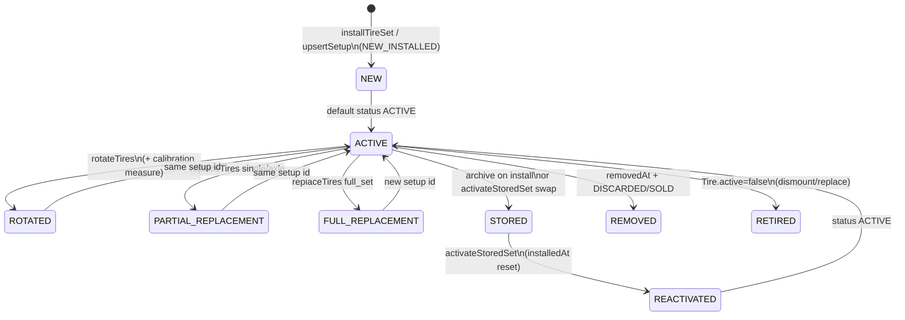

# Tire Health Production-Readiness Audit — July 2026

| Field | Value |
|-------|-------|
| **Audit ID** | `tire-health-production-readiness-2026-07` |
| **Repository** | [SYNQDRIVE-alpha](https://github.com/FATIHS-MGCKS/SYNQDRIVE-alpha) |
| **Branch** | `audit/tire-health-production-readiness-2026-07` |
| **Phase** | 2 of 7 — Data Model, Spec Logic & Formula Audit |
| **Status** | Phases 1–2 complete; Phases 3–7 pending |
| **Production data modified** | **No** — all VPS/DB/DIMO access was read-only |
| **Last VPS runtime probe** | 2026-07-16 (read-only SSH) |

---

## Executive summary (Phase 1)

The Tire Health module is a **mature, layered domain** in `vehicle-intelligence/tires/` with clear separation between **mutations** (`TireLifecycleService`), **wear mathematics** (`TireWearModelService` + `tire-health.config.ts`), and **canonical read models** (`TireHealthService` + `tire-status.ts`). Production runtime on the SynqDrive VPS runs as a **single PM2 process** (`synqdrive`) that hosts the NestJS API, BullMQ workers, and `@Interval`/`@Cron` schedulers in-process. PostgreSQL is the **system of record** for tire setups, measurements, snapshots, and events; ClickHouse is used for **high-frequency telemetry analytics** but has **no dedicated tire tables** — tire pressure for wear modelling is sourced from `vehicle_latest_state` (DIMO snapshot path) and High Mobility cache tables.

**Preliminary Phase-1 findings (not yet validated against full fleet replay):**

| Area | Observation | Preliminary risk |
|------|-------------|------------------|
| Trip → tire usage | `updateTireUsageFromTrip` runs only on explicit `POST …/trips/:id/enrich`, not on every trip finalize | **Medium** — km/event counters may lag if enrich is not called |
| Idempotency | Trip usage uses Prisma `increment` (additive, not idempotent on retry) | **Medium** |
| Recalculation | Hourly scheduler + BullMQ `jobId` hour-bucket dedupe; snapshots/data-points **append** | **Low–Medium** |
| Pressure data | Only **1** vehicle with non-null DIMO tire pressure in `vehicle_latest_state` (prod snapshot) | **High** for pressure-factor accuracy fleet-wide |
| Measured vs estimated | Display modes exist in read model; calibration via k-factor EMA | **Low** (design sound; coverage TBD in Phase 3) |
| Rental gate | `RentalHealthService` maps canonical `TireHealthSummary.overallStatus` → blocking | **Low** (read-only consumer) |
| Test coverage | Strong unit coverage on core services; limited E2E/replay tests | **Medium** |

---

## Audit constraints (all 7 phases)

### Allowed

- Repository read, tests, read-only PostgreSQL / ClickHouse / DIMO MCP queries
- Read-only audit scripts; anonymized aggregated artifacts in Git
- This documentation

### Not allowed

- Production writes, migrations, recalculations, tire mutations, DIMO subscriptions
- Worker/infra/config changes, secret output, PII in Git (VIN, plates, GPS, customer names)

### Vehicle anonymization

Stable public identifiers: `VEHICLE_001`, `VEHICLE_002`, … assigned by **sorted internal UUID** (mapping **not** stored in Git).

---

## Document map

| Artifact | Path |
|----------|------|
| Main report | `docs/audits/tire-health-production-readiness-2026-07.md` |
| Code map CSV | `docs/audits/data/tire-health-code-map-2026-07.csv` |
| Formula factor map CSV | `docs/audits/data/tire-health-formula-factor-map-2026-07.csv` |
| Spec source map CSV | `docs/audits/data/tire-health-spec-source-map-2026-07.csv` |
| Audit script (read-only skeleton) | `scripts/audits/audit-tire-health-production-readiness.ts` |

---

## Full audit outline (Phases 1–7)

### Phase 1 — Architecture & Code Map ✅ (this document)

- Git/audit setup
- VPS runtime topology (read-only)
- Repository-wide code landkarte
- End-to-end data-flow diagram
- Preliminary risk register
- CSV code map

### Phase 2 — Domain model, spec logic & formula audit ✅

- Prisma lifecycle & constraint analysis (15 audit questions)
- Tire-spec source priority & factor influence table
- Initial tread / evidence hierarchy (proposed)
- Full wear-formula reconstruction & example calculation
- CSV: `tire-health-formula-factor-map-2026-07.csv`, `tire-health-spec-source-map-2026-07.csv`

### Phase 3 — Wear model & mathematics

- `TireWearModelService` formula audit (axle, usage, behavior, pressure, heat, season, regression, k-factor)
- `tire-health.config.ts` threshold review
- Measured vs estimated tread display logic
- Calibration EMA stability
- Edge cases: staggered setups, missing spec, zero km

### Phase 4 — Telemetry, trips & idempotency

- DIMO signal availability (`availableSignals`, `signalsLatest`, historical `signals`)
- Trip enrichment → driving impact → tire usage chain
- Idempotency of trip processors, enrich retries, recalculation scheduler
- ClickHouse HF mirror relevance to tire factors
- HM tire pressure cache freshness

### Phase 5 — Production data replay (read-only)

- Anonymized fleet sample from VPS PostgreSQL
- Replay wear formula in isolated audit script (no `recalculate()` calls)
- Compare stored snapshots vs recomputed projections
- DIMO pressure coverage per anonymized vehicle
- Aggregated CSV/JSON in `docs/audits/data/`

### Phase 6 — Integration & UX

- Rental Health evaluation & rental blocking
- Alerts, notifications (`tire-health-warning`, `tire_critical` detector)
- Frontend: HealthErrorsView (Quick Box + Detail Modal), VehicleHealthBox, FleetCondition, operator measure flow
- API contract consistency (`/tires/summary`, `/tires/detail`)

### Phase 7 — Production readiness verdict

- Blocker / bounded-fix / defer matrix
- Rollout & monitoring recommendations
- Test gap closure plan
- Final sign-off section

---

## Phase 1 — Git & audit setup

### Git status at audit start

| Check | Result |
|-------|--------|
| Base branch | `main` @ `2cd57c8` |
| Uncommitted unrelated changes | **None** (clean working tree) |
| Audit branch | `audit/tire-health-production-readiness-2026-07` |

---

## Phase 1 — VPS runtime architecture (read-only)

**Probe method:** SSH to production VPS (`mein-vps.internal`) — process listing, port scan, env flag names (values redacted), PostgreSQL aggregates, Redis key patterns. **No processes started/stopped/reconfigured.**

### Component topology

```
                    ┌─────────────────────────────────────────┐
  Internet :443     │  nginx (reverse proxy)                  │
        ──────────► │  app.synqdrive.eu → PM2 :3001 (internal)│
                    └──────────────────┬──────────────────────┘
                                       │
                    ┌──────────────────▼──────────────────────┐
                    │  PM2: synqdrive (single fork process)    │
                    │  /opt/synqdrive/current/backend/dist/    │
                    │    src/main.js                           │
                    │  • NestJS HTTP API                       │
                    │  • BullMQ WorkersModule (in-process)     │
                    │  • @nestjs/schedule schedulers           │
                    └───────┬──────────────┬────────────────────┘
                            │              │
         ┌──────────────────┘              └──────────────────┐
         ▼                                                     ▼
┌─────────────────────┐                              ┌─────────────────────┐
│ PostgreSQL 16       │                              │ Redis 7             │
│ systemd native      │                              │ systemd native      │
│ 127.0.0.1:5432      │                              │ 127.0.0.1:6379      │
│ **Canonical truth** │                              │ BullMQ job storage  │
│ tire setups, events │                              │ queue locks/dedupe  │
└─────────────────────┘                              └─────────────────────┘
         │
         │  analytics mirror (optional)
         ▼
┌─────────────────────┐     ┌─────────────────────┐
│ ClickHouse 25.8     │     │ Prometheus + Grafana │
│ Docker              │     │ Docker, localhost    │
│ 127.0.0.1:8123/9000 │     │ :9090 / :3000        │
│ HF telemetry, trips │     │ ops monitoring       │
│ (no tire_* tables)  │     │                      │
└─────────────────────┘     └─────────────────────┘
```

### Runtime facts (2026-07-16 probe)

| Component | Where it runs | Port / access | Tire Health role |
|-----------|---------------|---------------|------------------|
| **synqdrive** (PM2) | Host process | Internal via nginx | API + all workers/schedulers |
| **PostgreSQL** | systemd `postgresql@16-main` | `127.0.0.1:5432` | Setups, tires, measurements, snapshots, events, latest state |
| **Redis** | systemd `redis-server` | `127.0.0.1:6379` | BullMQ including `dimo.tire.recalculation` |
| **ClickHouse** | Docker `synqdrive-clickhouse` | `127.0.0.1:8123` | HF/trip analytics; indirect (driving impact temps) |
| **Prometheus** | Docker `synqdrive-prometheus` | `127.0.0.1:9090` | Queue/runtime metrics |
| **Grafana** | Docker `synqdrive-grafana` | `127.0.0.1:3000` | Dashboards |
| **DIMO** | External API | HTTPS | Snapshot polling → tire pressure on `vehicle_latest_state` |
| **High Mobility** | External MQTT/API | HTTPS/MQTT | Tire pressure cache via HM health polling |

**Release path:** `/opt/synqdrive/releases/20260716014912_v4994` → `current` symlink.

**Worker enablement:** `WorkersModule` is **always registered** when the app boots; `RuntimeStatusRegistry.setWorkersEnabled(redisOk)` gates queue **enqueue** via `canEnqueueQueue()`. No separate worker PM2 instance — **single process runs API + workers**.

**Duplicate workers:** Only **one** `synqdrive` PM2 instance observed. BullMQ job IDs provide deduplication (e.g. `tire-recalc:{vehicleId}:{hourBucket}`).

### Services that trigger Tire Health

| Trigger | Scheduler / entry | Queue / direct | Tire action |
|---------|-------------------|----------------|-------------|
| Hourly recalculation | `TireRecalculationScheduler` `@Interval(3600000)` | `dimo.tire.recalculation` | `TireHealthService.recalculate()` |
| Manual recalc | `POST /vehicles/:id/tires/recalculate` | Direct | `recalculate()` |
| Measurement / install / rotate / replace | `TireLifecycleService` mutations | Direct (often calls recalc) | Setup + event writes, optional recalc |
| Trip enrich | `POST /vehicles/:id/trips/:tripId/enrich` | Direct | `updateTireUsageFromTrip()` |
| Driving impact | `DrivingImpactProcessor` after HF enrich | `trip.driving-impact.compute` | Updates impact tables (feeds wear model, **not** direct tire write) |
| DIMO snapshot | `DimoSnapshotScheduler` → processor | `dimo.snapshot.poll` | Writes `vehicle_latest_state` tire pressures |
| HM health poll | `HmHealthPollingScheduler` | Direct / cache | Refreshes HM tire pressure cache |
| Data retention | `DataRetentionScheduler` `@Cron('30 3 * * *')` | Direct | Prunes old `tireHealthSnapshot`, `tireWearDataPoint` (if retention days > 0) |

### Idempotency & locking mechanisms

| Mechanism | Location | Purpose |
|-----------|----------|---------|
| BullMQ `jobId` hour bucket | `tire-recalculation.scheduler.ts` | Prevent duplicate hourly recalc per vehicle |
| `removeOnComplete` / `removeOnFail` | BullMQ default + tire queue | Bounded Redis memory |
| `canEnqueueQueue()` | `queue-producer.util.ts` | Skip enqueue if Redis unavailable at boot |
| Retention `running` guard | `data-retention.scheduler.ts` | Prevent overlapping retention runs |
| Prisma transactions | `TireLifecycleService`, `TireIdentityService` | Atomic setup/rotation/replace |
| **Not idempotent** | `updateTireUsageFromTrip` | `increment` on retry may double-count |

### Production PostgreSQL aggregates (read-only, no IDs)

| Metric | Value (2026-07-16) |
|--------|-------------------|
| Active tire setups (`status=ACTIVE`, not removed) | 6 |
| Distinct vehicles with active setup | 6 |
| `tire_health_snapshots` created in last 7 days | 414 |
| `tire_events` created in last 7 days | 414 |
| Vehicles with non-null `tire_pressure_fl` in `vehicle_latest_state` | 1 |

**Interpretation:** Recalculation pipeline is **active** (≈69 snapshots/vehicle/week if evenly distributed). DIMO tire pressure coverage on latest state is **very low** (1/6) — pressure wear factor may often fall back to neutral/missing-data paths.

### Redis evidence

Active BullMQ keys under `bull:dimo.tire.recalculation:*` including `tire-recalc:{vehicleId}:{hourBucket}` pattern — confirms scheduler is enqueueing recalculation jobs.

### ClickHouse

`SHOW TABLES … LIKE '%tire%'` returned **no tables** — tire domain does not persist to ClickHouse. HF telemetry in ClickHouse may still influence driving-impact / temperature factors indirectly.

### Environment flags (names only, values redacted)

Observed in production `backend/.env`: `DATABASE_URL`, `REDIS_*`, `CLICKHOUSE_*`, `CLICKHOUSE_TRIP_ASSIST_ENABLED`, `DIMO_*`, `DATA_RETENTION_ENABLED`, `HF_MIRROR_ENABLED`. Tire-specific retention: `RETENTION_TIRE_HEALTH_SNAPSHOTS_DAYS`, `RETENTION_TIRE_WEAR_DATA_POINTS_DAYS` (see `backend/.env.example`).

---

## Phase 1 — Code landkarte & data flow

### Architectural rules (enforced by module design)

1. **Canonical read model:** `TireHealthService.getSummary()` / `getDetail()` + `tire-status.ts` — consumers must not reimplement thresholds.
2. **Mutations:** `TireLifecycleService` (+ `TireIdentityService` for per-wheel rows).
3. **Wear math:** `TireWearModelService` + `TIRE_HEALTH_CONFIG` only.
4. **Pressure context:** DIMO (`vehicle_latest_state`) + HM cache → `resolvePressureContext()` in health service.
5. **Rental gate:** `RentalHealthService.evaluateTires()` — read-only mapping to `ModuleHealth`.

### End-to-end data flow

```
Vehicle registration / PUT tires
  → TireLifecycleService.upsertSetupAndMeasurement
  → VehicleTireSetup + VehicleTireTreadMeasurement + Tire identities

Tire spec resolution
  → parseAiTireSpec / AI job / manual fields on setup
  → tire-health.config archetype + reference tread + thresholds

Telemetry ingest
  → DIMO DimoSnapshotProcessor → vehicle_latest_state (tirePressureFl/Fr/Rl/Rr)
  → HM polling/MQTT → HM cache → HmSignalUsageService.getTirePressureSignals

Trip capture
  → TripTrackingProcessor (trip FSM)
  → TripBehaviorEnrichmentProcessor → HF enrichment
  → DrivingImpactProcessor → tripDrivingImpact + vehicleDrivingImpactCurrent
  → (optional) POST enrichTrip → updateTireUsageFromTrip (setup km counters)

Wear & health
  → TireWearModelService.computeWearAnalysis
  → TireHealthService.recalculate → setup fields + TireHealthSnapshot + TireWearDataPoint + TireEvent

Read path
  → getSummary / getDetail → TireHealthSummary (Quick Box) / TireHealthDetail (Modal)

Downstream
  → RentalHealthService → rental blocking
  → TireCriticalDetector → business insights
  → rental-health-notification projector → notifications
  → HealthErrorsView / VehicleHealthBox / FleetConditionDetailView
```

### Domain module index

| Domain | Primary path | Key symbols |
|--------|--------------|-------------|
| Tire core | `backend/src/modules/vehicle-intelligence/tires/` | `TireHealthService`, `TireWearModelService`, `TireLifecycleService`, `TireIdentityService`, `TiresService` |
| Config / taxonomy | `tire-health.config.ts`, `tire-status.ts` | Thresholds, `aggregateTireStatus`, display modes |
| Driving impact | `backend/src/modules/vehicle-intelligence/driving-impact/` | `DrivingImpactService` |
| Trips | `backend/src/modules/vehicle-intelligence/trips/` | `TripsService.enrichTrip`, orchestrator |
| DIMO | `backend/src/modules/dimo/` | Snapshot queries, `DimoSnapshotProcessor` |
| High Mobility | `backend/src/modules/high-mobility/` | `HmSignalUsageService.getTirePressureSignals` |
| Rental health | `backend/src/modules/rental-health/` | `evaluateTires`, `isRentalBlocked` |
| Workers | `backend/src/workers/` | `TireRecalculationScheduler`, `TireRecalculationProcessor` |
| AI specs | `backend/src/modules/ai/vehicle-specs/` | `TireSpecAiService`, `AiTireSpecJobService` |
| Alerts / insights | `business-insights/detectors/tire-critical.detector.ts` | Fleet tire critical insights |
| Notifications | `notifications/adapters/rental-health-notification.projector.ts` | `tires_critical` |
| Frontend | `frontend/src/rental/components/HealthErrorsView.tsx` | Quick Box + Detail Modal |
| Schema | `backend/prisma/schema.prisma` | `VehicleTireSetup`, `Tire`, `TireHealthSnapshot`, … |

Detailed per-function mapping: see **`docs/audits/data/tire-health-code-map-2026-07.csv`**.

### Prisma models (tire domain)

| Model | Purpose |
|-------|---------|
| `VehicleTireSetup` | Active/stored set: specs, AI spec JSON, usage counters, health aggregates, k-factors |
| `VehicleTireTreadMeasurement` | Fleet/workshop 4-wheel tread measurements per setup |
| `Tire` | Per-wheel identity: position, estimated tread, per-tire km/events |
| `TirePositionHistory` | Rotation/replace position audit |
| `TireMeasurement` | Single-wheel measurement (replacement path) |
| `TireEvent` | ROTATION, TIRE_CHANGE, MEASUREMENT, RECALCULATION, INSTALL, ALERT |
| `TireHealthSnapshot` | Time-series snapshot per recalculation |
| `TireWearDataPoint` | Regression training: predicted vs actual tread |
| `VehicleLatestState` | `tirePressureFl/Fr/Rl/Rr`, legacy `tireHealthPercent` |
| `AiTireSpecJob` | Async AI tire spec extraction |

### API surface (tenant)

| Method | Route | Writes? |
|--------|-------|---------|
| GET | `/vehicles/:id/tires/summary` | No |
| GET | `/vehicles/:id/tires/detail` | No |
| GET | `/vehicles/:id/tires/wear-analysis` | No |
| POST | `/vehicles/:id/tires/recalculate` | Yes |
| POST | `/vehicles/:id/tires/measurement` | Yes |
| POST | `/vehicles/:id/tires/rotate` | Yes |
| POST | `/vehicles/:id/trips/:tripId/enrich` | Yes (trip + tire usage) |
| POST | `/vehicles/:id/hm-vehicle-health/refresh-tire-pressure` | Yes (HM cache) |

Full route list in CSV and `vehicle-intelligence.controller.ts`.

### Test coverage index (tire-related)

| File | Scope |
|------|-------|
| `tire-health.spec.ts` | Health service, recalc, summary/detail |
| `tire-lifecycle.spec.ts` | Mutations |
| `tire-identity.service.spec.ts` | Identity/rotation |
| `tire-status.spec.ts` | Taxonomy |
| `driving-impact.service.spec.ts` | Impact scoring |
| `rental-health.service.spec.ts` | Tire module evaluation |
| `tire-critical.detector.spec.ts` | Insights |
| `tire-health-detail-ui.test.ts` | Frontend display helpers |
| `vehicle-health-box.mapper.test.ts` | Health box tire segment |

**Gap:** No dedicated production replay / DIMO signal coverage integration test in repo (planned Phase 5 script).

### Preliminary risk register (Phase 1)

| ID | Risk | Severity | Phase to validate |
|----|------|----------|-------------------|
| R-TH-01 | Trip tire usage only on manual enrich | Medium | 4 |
| R-TH-02 | `increment` not idempotent on enrich retry | Medium | 4 |
| R-TH-03 | Low DIMO pressure coverage in prod (1/6 vehicles) | High | 4, 5 |
| R-TH-04 | Snapshots/data-points append without dedupe key | Low | 3, 5 |
| R-TH-05 | Legacy `tireHealthPercent` on latest state vs canonical summary | Low | 2, 6 |
| R-TH-06 | Driving impact not chained to tire recalc (hourly only) | Medium | 4 |
| R-TH-07 | Limited E2E / VPS replay tests | Medium | 5, 7 |

---

## Phase 2 — Prisma data model & lifecycle

### Models examined

| Model | Role | Soft delete / history |
|-------|------|------------------------|
| `VehicleTireSetup` | Set-level specs, usage counters, health aggregates, AI spec JSON | `removedAt`; status `ACTIVE`/`STORED`/`DISCARDED`/`SOLD` |
| `Tire` | Per-wheel identity, position, per-tire km, estimated tread | `active=false`, `dismountedAt` |
| `TirePositionHistory` | Rotation/replace audit trail | Append-only |
| `VehicleTireTreadMeasurement` | 4-wheel fleet/workshop measurements per setup | Append-only; FK to setup |
| `TireMeasurement` | Single-wheel measurement on `Tire` row | Append-only |
| `TireEvent` | Domain events (`ROTATION`, `MEASUREMENT`, `RECALCULATION`, …) | Append-only JSON payload |
| `TireHealthSnapshot` | Time-series recalc output | Append-only |
| `TireWearDataPoint` | Regression training pairs per axle | Append-only (no dedupe) |
| `VehicleLatestState` | DIMO snapshot: `tirePressureFl/Fr/Rl/Rr`, legacy `tireHealthPercent` | Upsert per vehicle |

**Alerts** are not a separate table — computed at read time in `TireHealthService.detectAlerts()` and surfaced via `TireHealthSummary.alerts` / `tire-status.ts` codes.

### Audit questions (15)

| # | Question | Finding |
|---|----------|---------|
| 1 | Multiple simultaneous **ACTIVE** setups? | **Possible at DB level.** No `@@unique` on `(vehicleId, status=ACTIVE)`. Service uses `findFirst({ status: ACTIVE, removedAt: null }, orderBy: createdAt desc)` — if two ACTIVE rows exist, **newest wins silently**. |
| 2 | DB constraints vs service logic? | **Service-only** for single-active invariant, 4-tire completeness, rotation validity. FK cascades exist; business rules are not enforced in PostgreSQL. |
| 3 | Tire at multiple positions? | **No** while `active=true` — `applyRotation` updates `currentPosition` in one transaction; `replaceAtPosition` deactivates prior tire at position. DB allows duplicate `currentPosition` if service bypassed. |
| 4 | Fewer/more than four active tires? | **Yes.** `ensureTiresForSetup` creates up to 4 if `existing.length < 4`; stops at `>= 4` without pruning extras. Partial replace can leave mixed-age tires. No hard DB check for exactly 4. |
| 5 | Staggered setups? | `isStaggered` flag **or** differing `frontDimension`/`rearDimension`. Affects `expectedLifeKmFront/Rear`, width-based life adjustment, rotation template allowlist (`front_to_rear`, `side_swap_only`, `same_axle_swap` only). |
| 6 | Front/rear axle separation? | **Yes** — separate reference tread (`initialTreadFrontMm`/`Rear`), k-factors, regen factors, pressure factors, regression per axle (`axle` = `front`/`rear`). |
| 7 | Partial replace & mixed age? | **Supported** — `replaceTires` single/axle replaces `Tire` rows at positions with `referenceNewTreadFront/Rear`; records mixed measurement + `TIRE_CHANGE` event. |
| 8 | Stored sets? | `status=STORED`, `removedAt` set when archived. `activateStoredSet` flips ACTIVE↔STORED in transaction. |
| 9 | Cumulative km on re-activate? | **`totalKmOnSet` preserved** on setup row. **`installedAt` and `installedOdometerKm` reset to now** on activation — wear projection without fresh measurement uses **new** install odometer, which can **under/over-project** until next measure. |
| 10 | Meaning of `installedAt`? | Timestamp of **current mounting period** on vehicle for this setup row — reset on `activateStoredSet`, set on `installTireSet`. Not first-ever tire manufacture date (DOT is separate). |
| 11 | Separate fields for first mount / period / vehicle / cumulative km? | **Partial.** `installedAt`/`installedOdometerKm` = current period; `totalKmOnSet` + city/highway/rural = cumulative on this setup; `Tire.totalKmOnTire` exists but **trip usage increments setup only** (`updateTireUsageFromTrip`); per-tire km counters on `Tire` not updated from trips. No explicit “first global mount” field. |
| 12 | Rotation transactional? | **Yes** — `TireIdentityService.applyRotation` uses `prisma.$transaction` for position updates + `TirePositionHistory` rows. |
| 13 | Events vs position history inconsistent? | **Possible.** `getRotationHistory` groups position history by `changedAt` ISO string matching event `createdAt` — clock skew or missing history row → **empty moves[]** on event. Rotation also creates a **calibration measurement** without k-calibration. |
| 14 | Soft delete & auditability? | Set archived via `removedAt` + status; tires `active=false`. Events/history/snapshots retained. No row-level delete on measurements. |
| 15 | Wrong setup for measurement? | **Guarded** — `resolveSetupForMeasurement` checks `tireSetupId` belongs to `vehicleId`; default uses active setup. API caller can target **stored** setup if they pass its id (intentional for historical entry?). |
| 16 | Org scoped queries? | `organizationId` on setup/tire/events but **not all queries filter org** — vehicle-scoped `vehicleId` is primary gate; multi-tenant relies on vehicle ownership + auth layer. |
| 17 | Stored/archived sets in wear calc? | **No** — `computeWearAnalysis` filters `status: ACTIVE, removedAt: null`. Scheduler selects ACTIVE setups only. |

### Lifecycle state machine



| State | Code anchor | Persistence |
|-------|-------------|-------------|
| NEW | `TireSetupCondition.NEW_INSTALLED` | setup + 4 `Tire` rows |
| ACTIVE | `TireSetupStatus.ACTIVE` | `removedAt=null` |
| STORED | `TireSetupStatus.STORED` | `removedAt` set |
| REMOVED | `DISCARDED`/`SOLD` + `removedAt` | no recalc |
| REACTIVATED | `activateStoredSet` | `installedAt` overwritten |
| PARTIAL_REPLACEMENT | `replaceTires` scope single/axle | `Tire` identity swap |
| FULL_REPLACEMENT | `installTireSet` / full_set | new setup row |
| ROTATED | `applyRotation` + `ROTATION` event | position history |
| RETIRED | `dismountAllForSetup` / replace | `Tire.active=false` |

---

## Phase 2 — Tire spec audit

### Source priority (central & deterministic)

Implemented in `tire-health.config.ts`:

**Reference new tread** (`resolveReferenceNewTread`):

1. `manual_confirmed` — both `initialTreadFrontMm` and `initialTreadRearMm` (or `initialTreadDepthMm` for both)
2. `ai_spec` — `aiTireSpec.newTreadDepthMm` if 4 < mm ≤ 16 (applies to missing axle manual values)
3. `archetype_default` — `archetypeDefaults[archetype].newTreadMm` if archetype ≠ `default`
4. `season_fallback` — `defaultInitialTreadFallbackMm` = **8.0 mm**

**Operational replacement** (`resolveReplacementThreshold`):

1. `spec_operational` → 2. `spec_recommended` → 3. archetype/season `replaceMm` → 4. `legal_minimum` path via season config

**AI spec normalization** (`ai-tire-spec-normalizer.ts`): clamps numerics; invalid enums → null; **never invents** values.

### Spec audit answers

| # | Topic | Result |
|---|-------|--------|
| 1 | Conflict winner | Strict priority above; manual tread beats AI for reference; AI never sets **current** tread for mounted used tires in wear model |
| 2 | Central deterministic? | **Yes** — `tire-health.config.ts` + `parseAiTireSpec` |
| 3 | AI labeled? | UI: “AI Tire Spec matched” when `tireSpecMatched`; `specSourceType` in JSON. **Gap:** `buildPersistedAiTireSpec` sets `userConfirmedSpec: true` automatically on AI apply |
| 4 | `userConfirmedSpec` respected? | Adds +30 to `tireSpecConfidence` in `computeConfidence`; **does not gate** use of AI numeric fields in `resolveReferenceNewTread` |
| 5 | Revision-safe sources? | `jobId`, `fetchedAt`, `normalizedAt` in JSON; re-apply **overwrites** blob; URLs stored but no version chain |
| 6 | Wrong AI match impact? | Can shift `expectedLifeKm` ±30%+ via `longevityBias`, behavior/heat/pressure sensitivities, reference new tread → **health % and remaining km** |
| 7 | Front/rear separate? | **Yes** — dimensions, initial tread, k-factor, regen, pressure, regression per axle |
| 8 | Different models per axle? | **Partial** — `brandModelFront`/`Rear` columns; single `aiTireSpec` blob (one matched model) |
| 9 | Fields affecting calculation | See factor table below + CSV |
| 10 | Display-only / unused | `urbanBias`, `highwayBias` stored **not used** in wear; load/speed index → confidence only |
| 11 | Unused UI fields? | HM/DIMO pressure status strings partially; archetype variants |
| 12 | Factors justified? | Config documents DACH-centric season bands; behavior anchors empirical; some coefficients appear **tuned constants** without external citation |
| 13 | Plausible ranges enforced? | AI normalizer clamps tread 4–16 mm, sensitivities 0–2; manual registration **not clamped** at API layer |
| 14 | Missing/contradictory spec? | Falls back archetype → 8 mm reference; factors default to 1.0; confidence drops |
| 15 | Unrealistic new tread from spec? | Clamped 4–16 on AI; manual path **unbounded** at persistence |

### Factor influence table

| Faktor | Quelle | Default | Wertebereich | Einfluss | Confidence-Auswirkung | Risiko |
|--------|--------|---------|--------------|----------|----------------------|--------|
| Reference new tread | manual → AI → archetype → 8 mm | 8.0 mm | 4–16 (AI clamp) | Basis für % health & usable mm | +20 data if manual initial | **Hoch** wenn nur Fallback |
| Operational replace | spec op → rec → archetype | 3.0 mm | ≥1.6 | Usable band, remaining km | indirekt | Hoch |
| Expected life km | archetype × longevityBias | 38000 | archetype min/max clamp | Basis wear rate | modelConfidence | Mittel |
| Axle factor | drivetrain + steering + load | 1.03 | 0.88–1.22 | Multiplikativ wear | gering | Niedrig |
| Usage factor | DrivingImpact city/hwy/country | 1.0 | 0.93–1.15 | Multiplikativ | +10 data if impact | Mittel |
| Behavior factor | stress scores × AI sensitivity | 1.0 | 0.97–1.35 | Multiplikativ | +10 driving impact | Hoch |
| Heat stress | temp + speed + pressure + driving | 1.0 | 0.98–1.12 | Multiplikativ | gering | Mittel |
| Pressure factor | DIMO/HM bar vs nominal | 1.0 | 1.00–1.18 | Multiplikativ | +3 pressure; −3 stale | **Hoch** (unit/coverage) |
| Load factor | curb weight × payloadBias | 1.0 | 0.97–1.15 | Multiplikativ | gering | Niedrig |
| Season mismatch | calendar temp vs tire season | 1.0 | 1.00–1.10 | Multiplikativ | gering | Mittel |
| Interaction penalty | compound stressors | 1.0 | 1.00–1.08 | Multiplikativ | gering | Mittel |
| Regen factor | EV/Hybrid axle table | 1.0 | 0.78–1.0 | Reduziert wear | gering | Mittel |
| k-factor | EMA calibration | 1.0 | 0.75–1.30 | Multiplikativ | +5 stabilized | Mittel |
| Staggered width adj | tire width mm | 1.0 | 0.75–1.15 | Scales life km | gering | Niedrig |
| Regression blend | TireWearDataPoint history | off | 0–100% blend | Tread projection | regressionConfidence | Mittel |
| Set health blend | min/avg wheel % | — | 0–100 | 55% min + 45% avg | — | Mittel (hides single bad tire) |
| Remaining km discount | confidence label | 1.0 | 0.75–1.0 | Scales remaining km | explicit | Mittel |

---

## Phase 2 — Initial tread depth & evidence

### Actual priority in code (current tread)

| Priority | Mechanism | `TreadSource` / storage |
|----------|-----------|-------------------------|
| 1 | Latest `VehicleTireTreadMeasurement` | `manual_measurement` |
| 2 | Measurement + odometer projection | `calibration_projection` |
| 3 | No measurement: reference tread − km-driven wear | `initial_manual_plus_wear` |
| 4 | Identity backfill literal | **8.0 mm** on `Tire.initialTreadDepthMm` (not a separate source enum) |

**Reference new tread** (for % denominators) uses separate priority — see above.

### Field mapping

| Field | Meaning | Risk |
|-------|---------|------|
| `initialTreadDepthMm` / `Front` / `Rear` | User-supplied baseline at setup | May be null → fallback chain |
| `Tire.initialTreadDepthMm` | Identity row at mount | **8 mm hardcoded** in `ensureTiresForSetup` lines 92–97 |
| `Tire.estimatedTreadMm` | Model output / mount copy | Updated on replace/rotation |
| `referenceNewTreadMm` | Persisted front reference on recalc | From `resolveReferenceNewTread` |
| `initialTreadSource` on setup | **Misleading** — written from `currentTreadSource` on recalc | Name ≠ semantics |
| `currentTreadSource` in explainability | `manual_measurement` / `calibration_projection` / `initial_manual_plus_wear` / `fallback_estimate` | Drives UI display mode |
| Measurement `source` | `manual`, `workshop`, `ai_confirmed`, `calibration` | Mapped in lifecycle |

### Confirmed: 8 mm fallback (`ensureTiresForSetup`)

```typescript
// tire-identity.service.ts:92-97
const frontTread = ... ?? args.setup.initialTreadDepthMm ?? 8;
const rearTread = ... ?? args.setup.initialTreadDepthMm ?? frontTread;
```

- **Still exists** (2026-07 audit)
- Stored as `Tire.initialTreadDepthMm` and `estimatedTreadMm` at creation — **looks like measured data**
- **Not** written to `VehicleTireTreadMeasurement` — wear model may use `initial_manual_plus_wear` from reference tread, not per-tire row
- **Confidence:** setup without manual initial still gets +20 `initialTreadExists` if column populated later; 8 mm tire rows do not trigger measurement bonuses
- **UI:** `resolveDisplayMode` → `ESTIMATED` unless measurement exists; **tire row mm values display as numeric fact**

### Proposed evidence hierarchy (not implemented — audit target state)

| Rank | Code | Description |
|------|------|-------------|
| 1 | `MEASURED` | User/operator tread gauge, recent |
| 2 | `WORKSHOP_DOCUMENTED` | Workshop measurement + optional document |
| 3 | `MANUFACTURER_CONFIRMED` | OEM/spec sheet confirmed by user |
| 4 | `USER_CONFIRMED` | User confirmed spec/tread without workshop doc |
| 5 | `AI_ESTIMATED` | AI tire spec agent output |
| 6 | `MODEL_ESTIMATED` | Wear model projection from odometer |
| 7 | `DEFAULT_ASSUMPTION` | Archetype / 8 mm / season fallback |
| 8 | `UNKNOWN` | No usable signal |

---

## Phase 2 — Formula audit

### Master wear equation (V2)

From `TireWearModelService.computeWearAnalysis`:

```
usableAxle = referenceNewTreadAxle − operationalReplacementMm
baseWearMmPerKmAxle = usableAxle / expectedLifeKmAxle   (× staggeredWidthAdj)

effectiveWearMmPerKmAxle = baseWearMmPerKmAxle
  × axleFactorAxle
  × usageFactor
  × behaviorFactor
  × temperatureFactor      (heat stress composite)
  × pressureFactorAxle
  × loadFactor
  × seasonMismatchFactor
  × kFactorAxle
  × regenFactorAxle
  × interactionPenalty

effectiveWearRateKmPerMmAxle = 1 / effectiveWearMmPerKmAxle

projectedTread = anchorTread − (kmSinceAnchor / effectiveWearRateKmPerMm)
```

**Percent health (wheel):** `(treadMm − operationalReplacement) / (referenceNew − operationalReplacement) × 100`

**Set health:** `0.55 × min(wheel%) + 0.45 × avg(wheel%)`

**Remaining km:** `(lowestTread − operationalReplacement) / max(effectiveWearFront, effectiveWearRear)` then × confidence discount

### Explicit checks (17)

| # | Topic | Status |
|---|-------|--------|
| 1 | kPa/bar/PSI | Pressure compared as **bar** (`nominalPressureBar=2.5` or `maxInflationKpa/100×0.9`). DIMO/HM stored values assumed bar — **no unit conversion at ingest** → **P1 risk** if provider sends kPa |
| 2 | km vs m | Distances in **km** throughout |
| 3 | mm/1000km vs km/mm | Display `wearRateMmPer1000km = 1000/effectiveRate`; internally km/mm |
| 4 | Percent 0–1 vs 0–100 | **0–100** integer percents in API |
| 5 | Negative wear rates | Regression requires `slope < 0`; projection clamps tread `max(0, …)` |
| 6 | Odometer rollback | **Not guarded** — negative `kmSince` skips projection but does not alert |
| 7 | Unrealistic remaining km | Capped implicitly by tread floor 0; no upper cap (999999 rate fallback) |
| 8 | Double confidence discount | Legacy score + `remainingKmConfidenceDiscount` — **single apply** on remaining km only |
| 9 | Front/rear swap | Separate axle pipelines; rotation updates positions before measure |
| 10 | FL/FR/RL/RR mapping | `BACK_LEFT` alias → `RL`; DB enums `FRONT_LEFT` etc. |
| 11 | Staggered rotation | Template allowlist enforced in `rotateTires` |
| 12 | Legal vs operational | **Separated** — `classifyTreadStatus` uses legal 1.6; model uses operational replace |
| 13 | Model tread < 0 | Clamped `max(0, …)` |
| 14 | Model tread > new | Measurement path uses measured; regression filters `actual > initial+1` |
| 15 | Critical single tire hidden | **Partially** — set health uses 55% min weight but alerts per wheel |
| 16 | Calendar season vs temperature | **Both** — month calendar in `classifySeasonStatus`; trip temp in wear + season mismatch |
| 17 | Regen + load double count | Regen reduces wear; load factor separate — **possible overlap** with EV braking in behavior scores (not quantified) |

### Example calculation (anonymized, plausible)

**Inputs:** Summer touring; reference new 8.0 mm; operational replace 3.0 mm → usable 5.0 mm; expected life 40 000 km; base wear = 5/40000 = **0.000125 mm/km**. Factors: axleF 1.08, usage 1.05, behavior 1.08, heat 1.03, pressure 1.0, load 1.02, season 1.0, k 1.0, regen 1.0, interaction 1.0.

```
effectiveWearFront = 0.000125 × 1.08 × 1.05 × 1.08 × 1.03 × 1.0 × 1.02 × 1.0 × 1.0 × 1.0 × 1.0
                   ≈ 0.000154 mm/km
rateFront ≈ 6494 km/mm

After 5000 km since measurement at 6.5 mm:
projected = 6.5 − 5000/6494 ≈ 5.73 mm
wheel% = (5.73−3)/(8−3)×100 ≈ 55%
```

Full factor-level detail: **`docs/audits/data/tire-health-formula-factor-map-2026-07.csv`**

---

## Phase 2 — P0/P1 findings (new)

| ID | Severity | Finding |
|----|----------|---------|
| **P0-TH-01** | P0 | `ensureTiresForSetup` **8 mm hard fallback** creates `Tire` rows appearing as real tread; poisons identity baseline |
| **P0-TH-02** | P0 | No DB uniqueness on **one ACTIVE setup per vehicle** — duplicate ACTIVE possible |
| **P1-TH-01** | P1 | `activateStoredSet` resets `installedAt`/`installedOdometerKm` but keeps `totalKmOnSet` — projection window inconsistent |
| **P1-TH-02** | P1 | `initialTreadSource` column stores **current** tread source, not initial mount provenance |
| **P1-TH-03** | P1 | `urbanBias` / `highwayBias` in AI spec **unused** in calculation |
| **P1-TH-04** | P1 | `buildPersistedAiTireSpec` forces `userConfirmedSpec: true` on AI apply |
| **P1-TH-05** | P1 | Tire pressure **unit not validated** at DIMO ingest (bar assumed) |
| **P1-TH-06** | P1 | `TireWearDataPoint` **appended every recalc** without dedupe (confirmed Phase 1 R-TH-04) |
| **P1-TH-07** | P1 | `updateTireUsageFromTrip` increments **setup only**, not `Tire.totalKmOnTire` |

---

## Phase 3–7 placeholders

> Sections will be expanded in subsequent audit prompts.

- **Phase 3:** Wear model deep-dive & edge-case replay — _pending_
- **Phase 4:** Telemetry & idempotency — _pending_
- **Phase 5:** Production data replay — _pending_
- **Phase 6:** Integrations & UX — _pending_
- **Phase 7:** Final verdict — _pending_

---

## Audit script

Read-only entry point for later phases:

```bash
# Dry-run (default) — no writes
npx ts-node -r tsconfig-paths/register scripts/audits/audit-tire-health-production-readiness.ts --phase=1

# Future phases (not implemented yet)
# --phase=5 --output=docs/audits/data/tire-health-replay-2026-07.json
```

---

## Change log (this audit)

| Date | Phase | Action |
|------|-------|--------|
| 2026-07-16 | 1 | Initial architecture map, VPS probe, CSV, audit script skeleton |
| 2026-07-16 | 2 | Data model Q&A, spec priority, formula audit, factor/spec CSVs, P0/P1 register |

---

## Confirmation

- ✅ No production data was modified during Phases 1–2.
- ✅ No secrets, VINs, license plates, or GPS coordinates are stored in committed audit artifacts.
- ✅ VPS PostgreSQL queries were aggregate counts only (Phase 1).
- ✅ Phase 2 complete; Phase 3 not started per audit plan.
