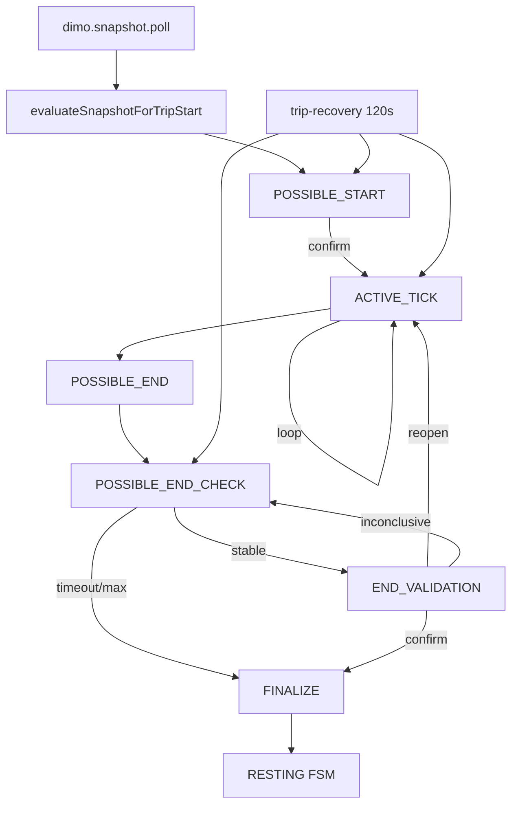

# P2 State Machine & Execution Phase Audit

> AUDIT ARTIFACT — NON-CANONICAL
>
> This document is a read-only reconstruction artifact.
> It records observed architecture/code/production evidence at the audited SHA.
> It is NOT the canonical Trip FSM architecture authority.
> Canonical architecture documentation will be produced only after the
> reconstruction workstream is complete.

**Audit date:** 2026-09-05  
**Repository:** FATIHS-MGCKS/SYNQDRIVE-alpha  
**Audited workspace SHA:** `3d5040b67abfdc7e95c1b507e13f45d1bc65af11` (`3d5040b67` — DI-EV-0035C / HF Recovery hardening)  
**Production SHA status:** Prior session matched workspace SHA `3d5040b67`; fresh production deploy verification not re-run this session  
**Audit phase:** P2  
**Mutation policy used during audit:** READ-ONLY  
**Production evidence freshness status:** Fresh production SSH/SQL unavailable this session; prior production SQL cited as STALE/SUPERSEDED where noted  
**Original report completeness:** FULL

---

## 1. Scope / verified SHA

**Repository:** `FATIHS-MGCKS/SYNQDRIVE-alpha` (workspace)  
**Verified code SHA:** `3d5040b67abfdc7e95c1b507e13f45d1bc65af11` (`3d5040b67` — DI-EV-0035C / HF Recovery hardening)  
**Mode:** Strictly read-only — no code, docs, commits, Redis/BullMQ/DB mutations in this session.

**Primary sources audited:**

- `backend/src/modules/vehicle-intelligence/trips/trip-detection-orchestration.service.ts` (~3305 lines)
- `backend/src/modules/vehicle-intelligence/trips/decision/trip-decision.engine.ts`
- `backend/src/modules/vehicle-intelligence/trips/trip-detection.types.ts`
- `backend/src/modules/vehicle-intelligence/trips/trip-cusum.ts`
- `backend/src/workers/processors/trip-tracking.processor.ts`
- `backend/src/workers/processors/dimo-snapshot.processor.ts`
- `backend/src/workers/schedulers/trip-tracking-recovery.scheduler.ts`
- `backend/src/workers/schedulers/dimo-snapshot.scheduler.ts`
- `backend/src/config/worker.config.ts`
- `backend/prisma/schema.prisma` (`TripDetectionState`, `VehicleTripDetectionState`, `VehicleTripTrackingRun`)

**Production re-check:** SSH to VPS failed (`Permission denied (publickey)`). Production SQL from prior session is cited as **STALE / SUPERSEDED** where noted; live re-verification was **not** completed this turn.

---

## 2. Executive conclusion

The live Trip FSM is implemented as **one persistent state row per vehicle** (`vehicle_trip_detection_states`) driven by **snapshot-triggered start evaluation** and a **self-scheduling BullMQ execution loop** on queue `dimo.trip-tracking`. Persistent FSM states and BullMQ execution phases are **related but not isomorphic**: only five of six Prisma enum values are reachable in production code; **`ENDED` is schema-only dead**. Successful trip completion always resets FSM to **`RESTING`**, never `ENDED`.

Execution phases (`POSSIBLE_START`, `ACTIVE_TICK`, `POSSIBLE_END_CHECK`, `END_VALIDATION`, `FINALIZE`) are **queue triggers only** — none are persisted as `state`. Trip lifecycle (`vehicle_trips.tripStatus`) is written only by **`TripDecisionEngine`** for status transitions; orchestration additionally updates **ONGOING trip metrics** (`endTime`, distance, waypoints) during `ACTIVE_TICK`.

An independent engineer can simulate **most** legal transitions from code, but **PARTIALLY** — ClickHouse assist shortcuts, mid-gap split, merge/reopen, and crash windows require careful ordering assumptions.

---

## 3. Persistent FSM states

| State | Classification | Production use | Reachable |
|-------|----------------|----------------|-----------|
| `RESTING` | **CANONICAL ACTIVE** (default terminal) | Yes — default `@default(RESTING)`; post-finalize reset | Yes |
| `POSSIBLE_START` | **CANONICAL TRANSIENT** | Yes — start candidate, no trip row yet | Yes |
| `ACTIVE_TRIP` | **CANONICAL ACTIVE** | Yes — confirmed movement trip | Yes |
| `IDLE_WITHIN_TRIP` | **CANONICAL TRANSIENT** | Yes — stopped but trip still open (traffic/charging/red light/EV activity) | Yes |
| `POSSIBLE_END` | **CANONICAL TRANSIENT** | Yes — end candidate, trip still ONGOING | Yes |
| `ENDED` | **DEAD / LEGACY (schema only)** | **No runtime writer** | **No** |

### `ENDED` verification (CONFIRMED)

Full-repo search for `TripDetectionState.ENDED` in backend TypeScript: **zero matches**. All `transitionState()` targets in orchestration are limited to: `RESTING`, `POSSIBLE_START`, `ACTIVE_TRIP`, `IDLE_WITHIN_TRIP`, `POSSIBLE_END`. Enum exists in migration/schema and audit JSON catalogs only.

**Finalize path:** `processFinalize` → `transitionState(..., RESTING, ...)` at `backend/src/modules/vehicle-intelligence/trips/trip-detection-orchestration.service.ts` lines 2479–2501 — not `ENDED`.

---

## 4. Execution phases

Defined in `backend/src/modules/vehicle-intelligence/trips/trip-detection.types.ts` lines 1–7:

| Phase constant | Schedule prefix | Persisted? |
|----------------|-----------------|------------|
| `POSSIBLE_START` | `ps` | **No** |
| `ACTIVE_TICK` | `at` | **No** |
| `POSSIBLE_END_CHECK` | `pec` | **No** |
| `END_VALIDATION` | `ev` | **No** |
| `FINALIZE` | `fin` | **No** |

Processor dispatch: `backend/src/workers/processors/trip-tracking.processor.ts` lines 54–69 — switch on `trigger` → orchestration `process*` methods.

**Relationship:** Persistent state selects which phase recovery re-enqueues; phases mutate persistent state inside orchestration. A vehicle in `IDLE_WITHIN_TRIP` is still processed by **`ACTIVE_TICK`**, not a separate queue phase.

---

## 5. Trip lifecycle statuses

Prisma `TripStatus`: `ONGOING | COMPLETED | CANCELLED` (`backend/prisma/schema.prisma` lines 9520–9524).

| Status | When set | Writer |
|--------|----------|--------|
| `ONGOING` | Trip created or reopened for merge | `TripDecisionEngine.createTrip()` / `reopenTripForMerge()` |
| `COMPLETED` | Successful finalize | `TripDecisionEngine.finalizeTrip()` |
| `CANCELLED` | Quality discard at finalize | `TripDecisionEngine.discardTrip()` |

**During FSM:** `POSSIBLE_START` → no trip row. `ACTIVE_TRIP` / `IDLE_WITHIN_TRIP` / `POSSIBLE_END` → same `activeTripId`, `tripStatus` remains **`ONGOING`** until `processFinalize`. Provisional `endTime: now` updated every `ACTIVE_TICK` via direct `prisma.vehicleTrip.update` (not DecisionEngine).

Repair path may finalize trips via `TripDecisionEngine.finalizeRepairedTrip()` without mutating FSM (reconciliation reads FSM, does not call `transitionState`).

---

## 6. Complete state-transition graph

### Reachable edges (CONFIRMED from orchestration)

```
RESTING ──(snapshot start evidence)──► POSSIBLE_START
POSSIBLE_START ──(confirm)──► ACTIVE_TRIP
POSSIBLE_START ──(timeout/expiry)──► RESTING
POSSIBLE_START ──(re-schedule, no confirm)──► POSSIBLE_START  [same state, new job]

ACTIVE_TRIP ──(continuity ACTIVE)──► ACTIVE_TRIP
ACTIVE_TRIP ──(continuity IDLE)──► IDLE_WITHIN_TRIP
ACTIVE_TRIP ──(continuity POSSIBLE_END / CH assist / no-core inactivity)──► POSSIBLE_END
ACTIVE_TRIP ──(mid-gap split)──► ACTIVE_TRIP  [new activeTripId]
ACTIVE_TRIP ──(missing activeTripId guard)──► RESTING

IDLE_WITHIN_TRIP ──(same as ACTIVE via ACTIVE_TICK)──► ACTIVE_TRIP | IDLE_WITHIN_TRIP | POSSIBLE_END

POSSIBLE_END ──(activity resumed)──► ACTIVE_TRIP
POSSIBLE_END ──(stability wait)──► POSSIBLE_END  [re-schedule PEC]
POSSIBLE_END ──(CUSUM gate)──► POSSIBLE_END  [increment endValidationAttempts, schedule EV]
POSSIBLE_END ──(CUSUM reopen)──► ACTIVE_TRIP  [via END_VALIDATION]
POSSIBLE_END ──(CUSUM confirm / CH skip / timeout / max attempts)──► schedule FINALIZE
  └──► processFinalize ──► RESTING  [FSM still POSSIBLE_END until finalize completes]

Any post-trip terminal ──► RESTING  [always via finalize or guards]
```

### Impossible / no direct edge (CONFIRMED)

| Jump | Why impossible |
|------|----------------|
| `RESTING → ACTIVE_TRIP` | `evaluateSnapshotForTripStart` only enters `POSSIBLE_START`; trip creation only in `processPossibleStart` |
| `RESTING → POSSIBLE_END` | No code path |
| `POSSIBLE_START → POSSIBLE_END` | No code path |
| `POSSIBLE_START → IDLE_WITHIN_TRIP` | No code path |
| Any → `ENDED` | No writer |
| `ACTIVE_TRIP → RESTING` (normal) | Only via finalize chain or orphan guard (`!activeTripId`) |

---

## 7. RESTING

### Row creation

- `getOrCreateDetectionState()` upserts on first access with defaults: `state=RESTING`, profile from vehicle fuel type (`backend/src/modules/vehicle-intelligence/trips/trip-detection-orchestration.service.ts` lines 205–230).
- **Not** created for every vehicle proactively — lazy on first orchestration touch (snapshot eval, tracking job, etc.).

### Entry path

```
DimoSnapshotScheduler @Interval(30s)
  → dimo.snapshot.poll job
  → DimoSnapshotProcessor (updates VehicleLatestState)
  → evaluateSnapshotForTripStart()  [only if state === RESTING]
  → transitionState(POSSIBLE_START)
  → schedulePossibleStart → jobId trip-ps-{vehicleId}
```

### RESTING behavior

- **No self-poll** — driven by snapshot ingestion (~30s tier-dependent for connected vehicles).
- **Cooldown** after last RESTING entry uses `lastEvidenceSummary.lastRestingReason`:
  - `discard` → 30s
  - `timeout` → 60s
  - default (`complete`) → 120s  
  (`backend/src/modules/vehicle-intelligence/trips/trip-detection-orchestration.service.ts` lines 506–525)
- **Stale snapshots:** freshness proxy uses `previousTelemetry.updatedAt`; no trip row created on eval (CONFIRMED).
- **Transition to POSSIBLE_START:** policy resolver + detector registry (`LIVE_START` phase) → `decisionEngine.evaluateStartCandidate()`; on success sets `possibleStartAt`, start odometer/fuel/SOC, detection mode/confidence, evidence summary.

**Trip row at POSSIBLE_START:** **None** (CONFIRMED — `createTrip` only after confirmation in `processPossibleStart`).

---

## 8. POSSIBLE_START

### Queue / lock

- Trigger: `TRIP_TRACKING_TRIGGERS.POSSIBLE_START`
- JobId: `trip-ps-{vehicleId}`
- Lock: `acquireWorkerLock` TTL **120s**; released in `finally`
- Retry cadence if unconfirmed: **re-schedule +30s** (lines 1000–1005)
- Max wait: **`CONFIRM_MAX_WAIT_MS = 180_000`** (hardcoded in service, not env-injected in constructor)

### Core algorithm (`processPossibleStart`)

1. Guard: `det.state === POSSIBLE_START` else return (stale job safe)
2. Expire if `elapsed > 180s` → RESTING
3. Fetch core window via `computePossibleStartCoreFetchFrom` + `tripStartBoundaryMaxLookbackMs`
4. Detectors: `StartConfirmationDetector`, optional CH (`ActivityWindow`, `IgnitionSegment`, `MotionSegment`)
5. `resolveAnalyticsAssistedStartDecision` → confirmed?

### Outcomes

| Outcome | FSM | Trip | Next queue |
|---------|-----|------|------------|
| Confirmed + new trip | `ACTIVE_TRIP` | `createTrip()` ONGOING | `ACTIVE_TICK` (+30s default) |
| Confirmed + merge | `ACTIVE_TRIP` | `reopenTripForMerge()` ONGOING | `ACTIVE_TICK` |
| Not confirmed, `<180s` | `POSSIBLE_START` | none | `POSSIBLE_START` +30s |
| Timeout | `RESTING` | none | none |
| Error | unchanged | none | BullMQ retry (throw from processor) |

### Crash window (CONFIRMED, not fixed)

**`createTrip()` then `transitionState(ACTIVE_TRIP)` is sequential** (lines 903–934). If process crashes between them: **ONGOING trip exists, FSM still POSSIBLE_START** → **POSSIBLE STUCK STATE** until reconciliation/recovery.

Start boundary priority at confirm: `resolveConfirmedStartBoundary` → DIMO segment → route/core refinement → snapshot candidate.

---

## 9. ACTIVE_TRIP / ACTIVE_TICK

### Separation

- **Persistent:** `ACTIVE_TRIP` or `IDLE_WITHIN_TRIP`
- **Execution:** always `ACTIVE_TICK` for both
- JobId: `trip-at-{vehicleId}-{activeTripId|pending}`

### One ACTIVE_TICK trace (CONFIRMED)

**Reads:** core (incremental + overlap), route enrichment, performance, VLS telemetry, vehicle tank/fuel type, optional ClickHouse (continuity guard, end assist)

**Writes:**

- `vehicleTripWaypoint.createMany` (new route points)
- `vehicleTrip.update` — provisional `endTime: now`, distance, duration, speeds, fuel/energy, `lastActivityAt`
- FSM watermarks: `lastCoreProcessedAt`, `lastRouteProcessedAt`, `lastDrivingProcessedAt`, optionally `lastMeaningfulMovementAt`

**Decisions (after continuity):**

- `ACTIVE` → stay/re-enter `ACTIVE_TRIP`, schedule next `ACTIVE_TICK` (~30s)
- `IDLE` → `IDLE_WITHIN_TRIP`, schedule `ACTIVE_TICK`
- `POSSIBLE_END` → set `possibleEndAt`, schedule `POSSIBLE_END_CHECK`
- Mid-gap split → `splitTripAtGap`, repoint `activeTripId`, stay `ACTIVE_TRIP`
- CH end assist → `POSSIBLE_END` (+ maybe direct `FINALIZE` if HIGH)
- No core + inactivity ≥120s → `POSSIBLE_END`

**Self-schedule:** Yes — `scheduleActiveTick(..., TRACKING_INTERVAL_MS)` default 30s (lines 427–440).

**Concurrent ticks:** Stable jobId + `getJob` dedup; if prior job `active`, defer via `setImmediate` (lines 353–367). Worker lock prevents parallel phase execution per vehicle.

**Error path:** Logs run, re-schedules `ACTIVE_TICK` after 30s (lines 1836–1841).

---

## 10. IDLE_WITHIN_TRIP

**Purpose (CONFIRMED):** Vehicle stopped but trip not ended — ContinuityAssessmentDetector returns `continuityVerdict: IDLE` (stopped + performance/EV/battery activity still suggests in-trip pause).

**Evidence → IDLE:** `evaluateContinuity` maps triggered finding with `rawVerdict === 'IDLE'` (`backend/src/modules/vehicle-intelligence/trips/decision/trip-decision.engine.ts` lines 124–128).

**Queue phase:** Still **`ACTIVE_TICK`** — no dedicated phase.

**tripStatus:** Remains **`ONGOING`** (CONFIRMED).

**Provisional endTime:** Still updated each tick (lines 1531–1534).

**Route tracking:** Continues — waypoints stored, watermarks advanced.

**Return to ACTIVE:** Continuity verdict `ACTIVE` on subsequent tick.

**Escalate to POSSIBLE_END:** Continuity `POSSIBLE_END`, CH assist, or no-core inactivity path.

**Telemetry disappearance while IDLE:** Same no-core branch as ACTIVE — may transition to `POSSIBLE_END` after 120s inactivity anchor.

---

## 11. POSSIBLE_END

### Entry fields captured

- `possibleEndAt` (from `lastMeaningfulMovementAt` / `lastActivityAt` / now / CH segment)
- `endDetectionMode`, `endConfidence`
- Reset: `endValidationAttempts: 0`, clear CUSUM fields

### POSSIBLE_END_CHECK (`processPossibleEndCheck`)

| Step | Condition | Action |
|------|-----------|--------|
| 1 Resume | `EndContinuityDetector` on 90s core window | → `ACTIVE_TRIP`, schedule `ACTIVE_TICK` |
| 2 Hard timeout | `elapsed ≥ TRIP_END_TIMEOUT_MS` (30m default) | schedule `FINALIZE` |
| 3 Stability | `elapsed < cusumGateMs` | re-schedule PEC (~30s) |
| 4 CUSUM trigger | attempts < 3 | increment attempts, schedule `END_VALIDATION` |
| 5 Max attempts | attempts ≥ 3 | schedule `FINALIZE` |

**cusumGateMs:** `max(90s, 120s)=120s` default; CH assist mode uses 30s stability (lines 1948–1954).

**No-core behavior:** Entered from ACTIVE_TICK before PEC runs.

**Stale ignition / frequency:** Handled inside detectors (EndContinuity, continuity assessment) — not separate FSM states.

---

## 12. END_VALIDATION

**Classification:** **BullMQ phase only** — FSM remains **`POSSIBLE_END`** throughout (CONFIRMED).

### CUSUM parameters (defaults from `trip-cusum.ts`)

- Lookback/lookahead: 15m / 5m (env: `TRIP_END_SEGMENT_*`)
- Stopped threshold: 2 km/h
- H=3.0, k=0.2, target mean=0.3
- Min 4 points else `insufficient_data`
- `still_active_at_window_end` → reopen path

### Outcomes

| Result | FSM | Queue |
|--------|-----|-------|
| CH assist + `cusumSegmentEnd` preset | `POSSIBLE_END` (metadata) | → `FINALIZE` (skip CUSUM) |
| CUSUM still ongoing | → `ACTIVE_TRIP` | `ACTIVE_TICK` |
| CUSUM change-point | `POSSIBLE_END` + segment fields | → `FINALIZE` |
| Inconclusive | `POSSIBLE_END` | PEC +60s retry |

**ClickHouse bypass:** HIGH-confidence CH assist can go `ACTIVE_TICK → POSSIBLE_END → FINALIZE` without CUSUM (lines 2860–2889). MEDIUM goes through PEC chain.

---

## 13. FINALIZE

**Classification:** **Queue phase only** — FSM may still be `POSSIBLE_END` when job starts; **`processFinalize` does not guard on FSM state** (only uses `activeTripId`).

### Sequence (CONFIRMED ordering)

1. Load trip by `activeTripId`
2. Compute canonical `endTime` priority chain (see §14)
3. `checkTripQuality` → `discardTrip` or `finalizeTrip` (DecisionEngine)
4. On complete: `postFinalizeAnalysisProducer` (awaited), behavior enrichment (async)
5. **`transitionState(RESTING)`** — clears trip fields, sets `lastEvidenceSummary.lastRestingReason`
6. Battery LV rest session enqueue (non-blocking failure)

**Trip finalized before RESTING:** **Yes** — `finalizeTrip` precedes RESTING transition (lines 2378–2479).

### Failure windows

| Boundary | Atomic? | Recovery class |
|----------|---------|----------------|
| finalize succeeds → RESTING fails | No | **POSSIBLE STUCK** (COMPLETED trip, FSM POSSIBLE_END) |
| RESTING succeeds → downstream enqueue fails | No | **RECOVERED AUTOMATICALLY** (reconciliation for battery; FSM OK) |
| finalize throws | No | **IDEMPOTENT RETRY** (job retry; FSM unchanged) |

Downstream failures **do not reopen FSM** (CONFIRMED — comments at lines 2503–2507).

---

## 14. Boundary timing through the FSM

| Boundary | Candidate | Provisional | Canonical finalized | Repair |
|----------|-----------|-------------|---------------------|--------|
| **Start** | `possibleStartAt` at PS entry | — | `effectiveStartAt` from `resolveConfirmedStartBoundary` at create | Reconciliation |
| **End (live)** | `possibleEndAt` at PE entry | `vehicleTrip.endTime=now` each tick | Finalize priority chain | Reconciliation |

**End finalize priority** (lines 2313–2338):

1. `cusumSegmentEnd` / CH segment end  
2. `lastMeaningfulMovementAt`  
3. Last waypoint `recordedAt`  
4. `possibleEndAt`  
5. `now`

---

## 15. Queue architecture

### FSM-related queues

| Queue | Job name | Role |
|-------|----------|------|
| `dimo.snapshot.poll` | snapshot jobs | Ingestion → start eval |
| `dimo.trip-tracking` | `trip-tracking` | All 5 execution phases |
| `dimo.trip-tracking` | `trip-recovery` | Recovery scheduler only |
| `trip.behavior.enrichment` | downstream | Post-finalize (non-FSM) |

### Trip-tracking job options (default enqueue)

- `removeOnComplete: true`
- `removeOnFail: 5`
- `delay` per phase
- No explicit BullMQ `attempts` in enqueue — processor **re-throws** on error → worker default retries apply

### Queue DAG (simplified)



---

## 16. Job idempotency

### JobId formats (CONFIRMED lines 285–295)

| Phase | Format |
|-------|--------|
| PS | `trip-ps-{vehicleId}` |
| AT | `trip-at-{vehicleId}-{activeTripId\|pending}` |
| PEC | `trip-pec-{vehicleId}-{activeTripId\|pending}` |
| EV | `trip-ev-{vehicleId}-{activeTripId\|pending}` |
| FIN | `trip-fin-{vehicleId}-{activeTripId\|pending}` |
| Recovery | `trip-recovery-{vehicleId}` |

**Two phases simultaneously queued:** **Possible** — different jobIds (e.g. `trip-at-*` and `trip-pec-*`), but **worker lock** serializes execution.

**Stale job handling:** Each `process*` checks expected FSM state first → **no-op return** if mismatch (lines 664, 1054–1058, 1864, 2061). **Cannot legally move FSM backwards** from stale job unless state still matches.

**Old ACTIVE_TICK after trip change:** JobId includes `tripId` — new trip gets new id; old completed job removed on complete.

---

## 17. Worker locks

| Field | Meaning |
|-------|---------|
| `workerLockedUntil` | Lock expiry |
| `workerRunToken` | UUID matched on release |

- **TTL:** 120s (`LOCK_TTL_MS`, hardcoded)
- **Acquire:** `updateMany` where lock null or expired (lines 248–268)
- **Release:** `finally` in every phase — token match required (lines 271–278)
- **Crash:** Lock expires after 120s → recovery scheduler re-enqueues
- **Exceed TTL mid-phase:** Another replica can acquire; **POSSIBLY** duplicate work if first worker still running (race — not remediated in P2 scope)
- **Lock not acquired:** Phase exits silently (debug log)

---

## 18. Recovery scheduler

**Cadence:** 120s (`@Interval(120_000)`) — `backend/src/workers/schedulers/trip-tracking-recovery.scheduler.ts` lines 59–116

**Scans:** `POSSIBLE_START`, `ACTIVE_TRIP`, `IDLE_WITHIN_TRIP`, `POSSIBLE_END` where `workerLockedUntil` null or expired.

| Persisted state | Re-enqueued phase | jobId |
|-----------------|-------------------|-------|
| `POSSIBLE_START` | `POSSIBLE_START` | `trip-recovery-{vehicleId}` |
| `ACTIVE_TRIP` | `ACTIVE_TICK` | same |
| `IDLE_WITHIN_TRIP` | `ACTIVE_TICK` | same |
| `POSSIBLE_END` | `POSSIBLE_END_CHECK` | same |

**Event reconciliation (non-FSM):**

- PE stuck >30m → `reconciliation.onStuckTrip`
- AT >4h → `onAnomalyDetected(SUSPICIOUS_LONG_OPEN)`

**Invalid activeTripId / missing trip:** Not explicitly repaired in recovery scheduler; `ACTIVE_TICK` guard resets to RESTING if `!activeTripId` (lines 1062–1067).

---

## 19. Tracking-run observability

Model: `vehicle_trip_tracking_runs` (`backend/prisma/schema.prisma` lines 13663–13692).

**Created:** `logTrackingRun()` after each phase execution (lines 3265–3298).

| runType | Phase | result_state usually set? |
|---------|-------|---------------------------|
| `POSSIBLE_START_VALIDATION` | PS | **Often NULL** when still waiting (no confirm, no timeout) |
| `ACTIVE_TRACKING` | AT | Usually set on transition |
| `POSSIBLE_END_CHECK` | PEC | **NULL** during stability wait |
| `END_VALIDATION` | EV | Set on terminal branches |
| `FINALIZATION_CHECK` | FIN | RESTING |

**NULL `result_state` root cause (CONFIRMED):** `resultState` optional in `logTrackingRun`; non-terminal paths log without it (e.g. PS retry lines 1009–1021, PEC stability lines 1958–1971).

**Observability gap:** Cannot distinguish "still validating" vs "logging omission" from NULL alone.

---

## 20. Timer/threshold inventory

| Constant | Default | Config key | Affects |
|----------|---------|------------|---------|
| Snapshot interval | 30s | `WORKER_SNAPSHOT_INTERVAL_MS` | Start eval cadence |
| Tracking interval | 30s | `WORKER_TRIP_TRACKING_INTERVAL_MS` | AT/PEC reschedule |
| Worker lock TTL | 120s | hardcoded `LOCK_TTL_MS` | All phases |
| PS max wait | 180s | hardcoded `CONFIRM_MAX_WAIT_MS` | PS timeout |
| PS retry cadence | 30s | hardcoded in reschedule | PS |
| Cooldown complete | 120s | hardcoded | RESTING→PS |
| Cooldown discard | 30s | hardcoded | RESTING→PS |
| Cooldown timeout | 60s | hardcoded | RESTING→PS |
| Continuity core window | 120s | `TRIP_CONTINUITY_CORE_WINDOW_MS` | AT |
| Continuity perf window | 90s | `TRIP_CONTINUITY_PERF_WINDOW_MS` | AT |
| PE stability | 90s | `TRIP_END_STABILITY_WINDOW_MS` | PEC |
| Min inactivity before CUSUM | 120s | `TRIP_END_MIN_INACTIVITY_BEFORE_CUSUM_MS` | AT no-core, PEC gate |
| CUSUM gate | max(90,120)=120s | derived | PEC |
| CH assist stability | 30s | `TRIP_END_CH_ASSIST_STABILITY_MS` | PEC when CH mode |
| Validation retry | 60s | `TRIP_END_VALIDATION_RETRY_MS` | EV inconclusive |
| Max CUSUM attempts | 3 | `TRIP_END_VALIDATION_MAX_ATTEMPTS` | PEC |
| Hard end timeout | 30m | `WORKER_TRIP_END_TIMEOUT_MS` | PEC |
| CUSUM lookback | 15m | `TRIP_END_SEGMENT_LOOKBACK_MS` | EV |
| CUSUM lookahead | 5m | `TRIP_END_SEGMENT_LOOKAHEAD_MS` | EV |
| Mid-gap split | 180s | `TRIP_MID_GAP_SPLIT_MS` | AT |
| Mid-gap min pre-duration | 60s | `TRIP_MID_GAP_MIN_PRE_DURATION_MS` | AT |
| Mid-gap max drift | 200m | `TRIP_MID_GAP_MAX_STATIONARY_DRIFT_M` | AT |
| Recovery scan | 120s | hardcoded | Recovery |
| Stuck PE reconciliation | 30m | hardcoded | Recovery |
| Suspicious long AT | 4h | hardcoded | Recovery |

---

## 21. State-data contract

### Field inventory (`vehicle_trip_detection_states`)

| Field | Meaning | Written | Cleared |
|-------|---------|---------|---------|
| `state` | Persistent FSM | every transition | — |
| `activeTripId` | ONGOING trip link | AT entry | RESTING |
| `possibleStartAt` | Start candidate / trip anchor | PS, AT | RESTING |
| `possibleEndAt` | End candidate | PE entry | RESTING, resume AT |
| `lastActivityAt` | Last processing activity | PS, AT, PE resume | RESTING (→ anchor) |
| `lastMeaningfulMovementAt` | Last motion | AT (ACTIVE), PE, CH | RESTING |
| `lastSnapshotEvidenceAt` | Snapshot at PS | PS | — |
| `lastCore/Route/DrivingProcessedAt` | Fetch watermarks | AT | RESTING |
| `workerLockedUntil` / `workerRunToken` | Concurrency | lock acquire | release |
| `startDetectionMode/Confidence` | Start metadata | PS, confirm | RESTING |
| `endDetectionMode/Confidence` | End metadata | PE, EV | RESTING |
| `endValidationAttempts` | CUSUM attempt counter | PE, PEC | RESTING, resume |
| `cusumValidatedAt/SegmentStart/End` | CUSUM/CH boundaries | EV, CH assist | RESTING |
| `startOdometerKm/Fuel/EvSoc` | Start deltas | PS | RESTING, mid-gap split |
| `lastEvidenceSummary` | Audit + cooldown reason | many | RESTING (replaced) |

### STATE DATA SHAPE (expected nullability)

| State | activeTripId | possibleStartAt | possibleEndAt | Lock |
|-------|--------------|-----------------|---------------|------|
| RESTING | **null** | null | null | usually null |
| POSSIBLE_START | **null** | set | null | during job |
| ACTIVE_TRIP | **ONGOING id** | set (start anchor) | null | during job |
| IDLE_WITHIN_TRIP | **same ONGOING** | set | null | during job |
| POSSIBLE_END | **same ONGOING** | set | set | during job |

---

## 22. Illegal state analysis

| Combination | Can code create? | Recovery | Production | Class |
|-------------|------------------|----------|------------|-------|
| RESTING + activeTripId | Finalize clears; bug if skip | Reconciliation may fix trip | Prior audit: rare | **GUARDED** |
| ACTIVE_TRIP + null activeTripId | Yes — AT guard → RESTING | AT self-heal | Possible transient | **RECOVERABLE** |
| POSSIBLE_START + ONGOING trip | Crash window after create | Reconciliation | **OBSERVED** pattern possible | **POSSIBLE** |
| POSSIBLE_END + COMPLETED activeTripId | finalize order usually prevents | onStuckTrip | Possible if RESTING fails | **POSSIBLE** |
| IDLE + no activeTripId | Same as AT guard | AT → RESTING | Transient | **RECOVERABLE** |
| ENDED rows | No writer | None | **0 expected** | **IMPOSSIBLE** (live) |
| Expired lock + active processing | TTL expiry | Recovery re-enqueue | Normal | **RECOVERABLE** |
| FSM vs queued phase disagree | Stale job | Early return | By design | **GUARDED** |

---

## 23. Production FSM evidence

**This session:** VPS SSH unavailable — no fresh SQL.

**Prior read-only snapshot (STALE / SUPERSEDED — SHA matched `3d5040b67`):**

- Fleet ~9 vehicles, ~6 FSM rows
- Distribution example: 3 RESTING, 3 POSSIBLE_END
- 0 ONGOING trips at one snapshot
- Tracking runs: many `POSSIBLE_START_VALIDATION` with NULL `result_state`
- 0 `TripDetectionState.ENDED` in live code; DB enum may still list ENDED

**Confidence:** Production distribution **INFERRED/STALE**; code behavior **CONFIRMED**.

---

## 24. State/phase invariants

| ID | Invariant | Enforcement | Confidence |
|----|-----------|-------------|------------|
| FSM-01 | RESTING ⇒ no activeTripId | Code (finalize clears) | CONFIRMED |
| FSM-02 | POSSIBLE_START ⇒ no VehicleTrip yet | Code | CONFIRMED |
| FSM-03 | ACTIVE_TRIP ⇒ ONGOING activeTripId | Code | CONFIRMED (crash exception) |
| FSM-04 | IDLE retains same ONGOING activeTripId | Code | CONFIRMED |
| FSM-05 | POSSIBLE_END retains ONGOING until finalize | Code | CONFIRMED |
| FSM-06 | FINALIZE is execution-only | Types + code | CONFIRMED |
| FSM-07 | END_VALIDATION is execution-only | Code | CONFIRMED |
| FSM-08 | Success ⇒ RESTING not ENDED | Code | CONFIRMED |
| FSM-09 | Stale jobs must not mutate wrong state | Code guards | **PARTIALLY** (lock race) |

Enforcement is **CODE + QUEUE IDEMPOTENCY**; **not DB-enforced** (no CHECK constraints on state/field combos).

---

## 25. Failure windows

See §8 crash window, §13 finalize ordering. Summary matrix in §29 table F.

| Boundary | Atomic? | Recovery | Severity | Evidence |
|----------|---------|----------|----------|----------|
| createTrip → FSM AT | No | reconciliation | High | orchestration lines 903–934 |
| splitTrip → repoint FSM | No | manual/reconcile | Medium | orchestration lines 1287–1333 |
| finalizeTrip → RESTING | No | retry/reconcile | High | orchestration lines 2378–2479 |
| RESTING → battery enqueue | No | reconciliation | Low | orchestration lines 2508–2522 |
| lock TTL mid-phase | No | recovery job | Medium | orchestration lines 248–268 |
| stale queue job | Partial | state guard no-op | Low | orchestration lines 664, 1054 |

---

## 26. Legacy/dead states and phases

| Item | Status |
|------|--------|
| `TripDetectionState.ENDED` | **DEAD** — enum only |
| All 5 execution phases | **ACTIVE** |
| `IGNITION_OFF_GAP` end mode | Legacy compat string in types, not separate FSM |

---

## 27. Unresolved questions

1. Exact BullMQ default retry/backoff for `dimo.trip-tracking` (not set in enqueue opts).
2. Production frequency of createTrip/FSM desync — needs fresh SQL.
3. Whether `processFinalize` should guard `state === POSSIBLE_END` (currently does not).
4. `CONFIRM_MAX_WAIT_MS` hardcoded vs env `WORKER_POSSIBLE_START_CONFIRM_MAX_WAIT_MS` — only latter used for lookback derivation.

---

## 28. Implications for canonical documentation

1. Document **three layers** explicitly: persistent FSM, execution phase, tripStatus.
2. Mark **`ENDED` as deprecated/dead** in schema docs.
3. Map **IDLE_WITHIN_TRIP → ACTIVE_TICK** clearly.
4. Document **endTime priority chain** and **start boundary resolution** as normative.
5. Document **NULL result_state** as expected for in-progress PS/PEC runs.
6. Document **failure windows** (especially post-create/pre-FSM and post-finalize/pre-RESTING).
7. Separate **orchestration metric writes** from **DecisionEngine lifecycle writes** in ownership docs.

---

## 29. Evidence ledger

| Finding | Label | Evidence |
|---------|-------|----------|
| Six enum values, five used | CONFIRMED | schema lines 1122–1128; grep no `TripDetectionState.ENDED` |
| Finalize → RESTING | CONFIRMED | orchestration lines 2479–2501 |
| PS no trip create | CONFIRMED | orchestration lines 903–917 |
| ENDED never written | CONFIRMED | all `transitionState` targets |
| JobId formats | CONFIRMED | orchestration lines 285–295 |
| Recovery mapping | CONFIRMED | recovery scheduler lines 94–99 |
| CUSUM defaults | CONFIRMED | `trip-cusum.ts` lines 61–68 |
| CH HIGH → skip to FINALIZE | CONFIRMED | orchestration lines 2860–2889 |
| Production SQL this session | UNKNOWN | SSH failed |
| Prior fleet snapshot | STALE | conversation prior audit @ SHA 3d5040b67 |

---

## Mandatory summary tables

### A. PERSISTENT STATE MATRIX

| State | Meaning | activeTripId | Entry | Exit | Queue Phase | Runtime Status |
|-------|---------|--------------|-------|------|-------------|----------------|
| RESTING | No live detection | null | finalize, PS timeout, guards | PS | — (snapshot only) | no trip |
| POSSIBLE_START | Start candidate | null | snapshot eval | AT, RESTING | PS | no trip |
| ACTIVE_TRIP | Moving trip | ONGOING | PS confirm | AT/PE/RESTING | AT | ONGOING |
| IDLE_WITHIN_TRIP | Paused in trip | ONGOING | AT idle verdict | AT/PE | AT | ONGOING |
| POSSIBLE_END | End candidate | ONGOING | AT/CH | AT/FIN/RESTING | PEC→EV→FIN | ONGOING |
| ENDED | — | — | — | — | — | **unused** |

### B. EXECUTION PHASE MATRIX

| Phase | Queue | Trigger | Expected FSM | Action | Next Phase | Idempotency |
|-------|-------|---------|--------------|--------|------------|-------------|
| PS | trip-tracking | confirm start | POSSIBLE_START | validate, create trip | AT or PS+30s | trip-ps-{vid} |
| AT | trip-tracking | tick | ACTIVE/IDLE | ingest, continuity | AT/PEC | trip-at-{vid}-{tid} |
| PEC | trip-tracking | end check | POSSIBLE_END | resume/stability/CUSUM gate | EV/FIN/PEC | trip-pec-{vid}-{tid} |
| EV | trip-tracking | CUSUM | POSSIBLE_END | change-point | FIN/AT/PEC | trip-ev-{vid}-{tid} |
| FIN | trip-tracking | finalize | POSSIBLE_END* | complete/discard | RESTING | trip-fin-{vid}-{tid} |

\*FIN does not verify FSM state.

### C. TRANSITION MATRIX (abbreviated)

| From | To | Evidence | Timer | Writer | Trip Effect | Queue |
|------|-----|----------|-------|--------|-------------|-------|
| RESTING | PS | start detectors | cooldown | orchestration | none | PS |
| PS | AT | confirm | ≤180s | orchestration | create/reopen ONGOING | AT |
| PS | RESTING | timeout | 180s | orchestration | none | — |
| AT | AT | continuity ACTIVE | 30s tick | orchestration | provisional metrics | AT |
| AT | IDLE | continuity IDLE | — | orchestration | provisional metrics | AT |
| AT | PE | inactivity/continuity/CH | ≥120s etc | orchestration | ONGOING | PEC |
| PE | AT | resume | — | orchestration | ONGOING | AT |
| PE | FIN | timeout/max CUSUM | 30m / 3 attempts | orchestration | finalize pending | FIN |
| PE→EV→FIN | RESTING | CUSUM/CH | — | DecisionEngine+orch | COMPLETED/CANCELLED | — |

### D. STATE DATA SHAPE

See §21.

### E. RECOVERY MATRIX

| Persisted State | Recovery Trigger | Re-enqueued Phase | Guard | Failure Case |
|-----------------|------------------|-------------------|-------|--------------|
| POSSIBLE_START | lock expired 120s | PS | leader + canEnqueue | no tokenId |
| ACTIVE_TRIP | lock expired | AT | same | missing trip id → AT self-fix |
| IDLE_WITHIN_TRIP | lock expired | AT | same | — |
| POSSIBLE_END | lock expired | PEC | same | stuck >30m → reconciliation |

### F. FAILURE WINDOW MATRIX

| Boundary | Atomic? | Recovery | Severity | Evidence |
|----------|---------|----------|----------|----------|
| createTrip → FSM AT | No | reconciliation | High | orchestration lines 903–934 |
| splitTrip → repoint FSM | No | manual/reconcile | Medium | orchestration lines 1287–1333 |
| finalizeTrip → RESTING | No | retry/reconcile | High | orchestration lines 2378–2479 |
| RESTING → battery enqueue | No | reconciliation | Low | orchestration lines 2508–2522 |
| lock TTL mid-phase | No | recovery job | Medium | orchestration lines 248–268 |
| stale queue job | Partial | state guard no-op | Low | orchestration lines 664, 1054 |

### G. INVARIANT MATRIX

See §24.

---

## Final questions

1. **Can an independent engineer simulate every legal FSM transition from the current code?**  
   **PARTIALLY** — core graph is deterministic; CH assist, merge, mid-gap split, and crash windows need extra rules.

2. **Is there exactly one persistent FSM state per vehicle?**  
   **YES** — `vehicleId @unique` on `VehicleTripDetectionState`.

3. **Are persistent FSM states and BullMQ phases cleanly separated?**  
   **PARTIALLY** — conceptually yes (5 phases vs 5 live states); operationally coupled via scheduling/recovery on same queue.

4. **Can a stale/replayed queue job legally mutate the wrong current state?**  
   **POSSIBLY** — state guards prevent most cases; lock TTL overlap and createTrip/FSM desync are edge paths.

5. **Does restart/recovery preserve enough information to resume every non-RESTING state deterministically?**  
   **PARTIALLY** — persisted fields + recovery re-enqueue suffice for PS/AT/IDLE/PE; exact in-flight sub-step (e.g. mid-EV) relies on counters/timestamps.

6. **Are there any active states/phases that appear legacy/dead?**  
   **`TripDetectionState.ENDED`** (dead enum). All five execution phases are live. No dead queue phases found.

---

**Changes / Architektur updated:** **No** — read-only audit per task constraints.
