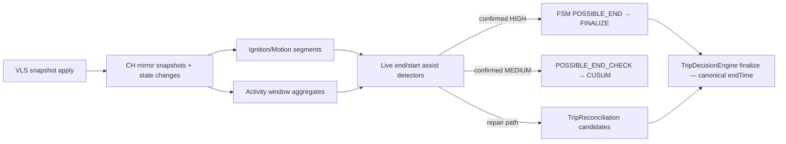

# P3 Signal Authority, Timestamp & Ordering Model Audit

> AUDIT ARTIFACT — NON-CANONICAL
>
> This document is a read-only reconstruction artifact.
> It records observed architecture/code/production evidence at the audited SHA.
> It is NOT the canonical Trip FSM architecture authority.
> Canonical architecture documentation will be produced only after the
> reconstruction workstream is complete.

**Audit date:** 2026-09-05  
**Repository:** https://github.com/FATIHS-MGCKS/SYNQDRIVE-alpha  
**Branch at audit:** `main`  
**Repository HEAD at audit:** `c52d0c7654a41043496311478888821268dcefae`  
**Audited application code SHA:** `3d5040b67abfdc7e95c1b507e13f45d1bc65af11` (last commit before audit-doc-only delta; application logic unchanged at HEAD)  
**HEAD delta vs audited code:** P2 audit artifact commit only (`docs/audits/trip-fsm/P2_STATE_MACHINE_EXECUTION_PHASE_AUDIT_2026-09-05.md`)  
**Audit phase:** P3  
**Mutation policy used during audit:** READ-ONLY (this artifact excepted)  
**Production SHA status:** UNKNOWN — VPS SSH failed (`Permission denied (publickey)`); deploy SHA not re-verified this session  
**Production evidence freshness:** UNKNOWN for fresh runtime; prior P2 production SQL cited as **STALE/SUPERSEDED**  
**Prior artifacts read:** `docs/audits/trip-fsm/P2_STATE_MACHINE_EXECUTION_PHASE_AUDIT_2026-09-05.md`; P1 conclusions cross-checked via `backend/src/modules/vehicle-intelligence/trips/TRIP_OWNERSHIP.ts` (no P1 markdown artifact found in `docs/audits/trip-fsm/`)

**Evidence labels used:** CONFIRMED | INFERRED | STALE | UNKNOWN

---

## P3.0 — Audit baseline

| Item | Value | Label |
|------|-------|-------|
| Branch | `main` | CONFIRMED |
| HEAD | `c52d0c765` | CONFIRMED |
| Application logic SHA | `3d5040b67` | CONFIRMED (git log) |
| HEAD-only change | P2 audit markdown | CONFIRMED |
| Production deploy SHA | Not verified | UNKNOWN |
| Fresh production SQL | Not run | UNKNOWN |

P1/P2 are not re-audited except where needed to anchor P3 (ownership, FSM phases, finalize priority chain — cross-checked against P2 artifact and live code at `3d5040b67`).

---

## P3.1 — Complete signal producer inventory

### Live FSM primary producers

| SIGNAL | PROVIDER | FETCH PATH | RAW SOURCE | SAMPLING | TIMESTAMP FIELD | FREQ | FSM USE | WEIGHT | FALLBACK | PERSISTED COPY | STALE GUARD | ORDERING |
|--------|----------|------------|------------|----------|-----------------|------|---------|--------|----------|----------------|-------------|----------|
| Snapshot scalars (ignition, speed, odometer, fuel, SOC, GPS, engine load, traction power) | DIMO | `DimoSnapshotProcessor` → `fetchLatestVehicleSnapshot` | `signalsLatest` | Point-in-time snapshot | `signals.lastSeen` → `lastSeenAt` / `sourceTimestamp` | Poll tier 30s–30min | RESTING→PS eval | Primary start trigger | None at eval | `vehicle_latest_state` | VLS monotonic `sourceTimestamp` (VW-F-008) | N/A (single point) |
| Core buckets | DIMO GraphQL | `DimoSegmentsService.fetchRawTripCoreData` | `trip-detection-core.query` interval **20s** | 20s buckets | `timestamp` on each point | ~3/min when streaming | PS confirm, AT continuity, PE resume, CUSUM | Primary live motion/ignition/odometer | Empty array on JWT miss | Waypoints indirect; FSM watermarks | No fetch-level stale filter | Asc sort post-fetch (`dimo-segments.service.ts` 598–601) |
| Route points | DIMO GraphQL | `fetchRouteEnrichment` | `route-enrichment.query` interval **7s** | 7s GPS/speed | `timestamp` | Higher than core | AT waypoints, start boundary refine | Route geometry + end coord proxy | Empty on fail | `vehicle_trip_waypoints.recordedAt` | None | Asc sort (781–784) |
| Performance | DIMO GraphQL | `fetchPerformance` | `performance.query` interval **15s** | 15s RPM/throttle/load | `timestamp` | ~4/min | AT continuity (ICE idle) | Secondary idle evidence | Empty on fail | Trip perf aggregates on `vehicle_trips` | None | Asc sort (861–864) |
| DIMO trip segments | DIMO GraphQL | `fetchTripSegments` | `trip-segments.query` mechanisms: changePoint → frequency → ignition | Segment bounds | `start.timestamp`, `end.timestamp` | On-demand window | Start boundary (confirm), repair | **Primary start boundary when matched** | Route/core refine | `dimoSegmentId`, repair | `startedBeforeRange` rejected at selection | Asc by startTime |
| VehicleLatestState | Postgres | Read in PS confirm / AT / CH assist | Prior snapshot apply | Latest row | `sourceTimestamp`, `lastSeenAt`, `updatedAt`, `providerFetchedAt` | Snapshot poll | PS confirm telemetry, CH inactive gate | Corroboration / veto (inactive check) | null telemetry | VLS table | Monotonic apply only | DB write order |
| Stored waypoints | Postgres | Read at finalize | Prior AT writes | Per fix | `recordedAt` ← route `timestamp` | Cumulative | Finalize end fallback #3 | Tertiary end boundary | `possibleEndAt` | `vehicle_trip_waypoints` | Dedup vs poll watermark | Insert order not guaranteed; last-by-`recordedAt` at finalize |
| FSM evidence fields | Postgres | Read/write in orchestration | Prior phase outputs | Derived | `possibleStartAt`, `possibleEndAt`, `lastMeaningfulMovementAt`, CUSUM fields | Per transition | All phases | Internal state | Worker `now` | `vehicle_trip_detection_states` | Phase guards | Convention only |

### ClickHouse analytics producers (evidence / assist — not lifecycle writer)

| SIGNAL | PROVIDER | FETCH PATH | TIMESTAMP | FSM USE | PERSISTED |
|--------|----------|------------|-----------|---------|-----------|
| CH snapshots | Mirror from VLS | `ClickHouseTelemetryService.insertSnapshot` | `recorded_at` = VLS `lastSeenAt` ms | Activity windows | CH tables |
| CH state changes (ignition, motion) | Derived on mirror | `detectAndInsertStateChanges` | `changed_at` = snapshot `recordedAt` | Ignition/motion segments | CH tables |
| Ignition segments | CH query | `ClickHouseAnalyticsService.findIgnitionSegments` | `on_time` / `off_time` from `changed_at` | End assist, repair missing trip/end | Not in FSM row |
| Motion segments | CH query | `findMotionSegments` | same | EV end assist, repair | Not in FSM row |
| Activity window summary | CH query | `summarizeActivityWindow` | `recorded_at` aggregates | Start assist, end assist guard, repair corroboration | Not in FSM row |

CH ingestion triggered from snapshot processor after successful VLS apply (`dimo-snapshot.processor.ts` ~254–286). If VLS stale-rejected, CH mirror skipped for that poll (**CONFIRMED**).

### Detector-wrapped evaluators (no direct I/O)

| SIGNAL | WRAPPER | UNDERLYING | FSM PHASE |
|--------|---------|------------|-----------|
| Snapshot start scoring | `SnapshotEvidenceEvaluator` | `evaluateSnapshotEvidence` | LIVE_START |
| Start confirmation | `StartConfirmationDetector` | `validateTripStart` | PS job |
| Continuity | `ContinuityAssessmentDetector` | `assessActiveContinuity` + perf | ACTIVE_TICK |
| Resume | `EndContinuityDetector` | `hasActivityResumed` (speed-only) | PEC / CH assist |
| CUSUM end | `ChangePointEndDetector` | `detectTripEndChangePoint` | END_VALIDATION |
| CH segments | `IgnitionSegmentDetector`, `MotionSegmentDetector`, `ActivityWindowDetector` | CH analytics service | Assist + repair |

### Reconciliation / repair producers

| SIGNAL | SOURCE | BOUNDARY USE |
|--------|--------|--------------|
| DIMO segments (fallback) | `fetchTripSegments` | Missing trip create; boundary extension classify |
| CH ignition/motion segments | Detectors | Missing trip/end candidates when DIMO segments empty |
| Existing live boundaries | `vehicle_trips.startTime/endTime` | Optimistic-lock baseline for repair |
| FSM hints | `possibleEndAt`, `lastActivityAt` | Stale ongoing / missing end estimates |

---

## P3.2 — Signal authority hierarchy

Normative hierarchy derived from **actual branching**, not names.

### A. Start candidate detection (RESTING → POSSIBLE_START)

| Role | Authority |
|------|-----------|
| PRIMARY | Current snapshot scalars via `evaluateSnapshotEvidence` (ignition weighted by profile, speed, GPS delta vs **previous** snapshot, odometer delta, EV power) |
| SECONDARY | Previous snapshot position/odometer/fuel/SOC (movement delta) |
| CORROBORATION | Policy data-quality (uses **`previousTelemetry.updatedAt` freshness proxy** — see P3.10) |
| FALLBACK | Weak signals accumulate to threshold |
| VETO | FSM not RESTING; cooldown; VLS stale reject (no eval) |
| NO-DATA | `shouldStartTracking: false` |

Ignition ON alone can contribute strong score but composite threshold required (**CONFIRMED** `trip-evidence.helpers.ts` 239–247).

### B. Start confirmation (POSSIBLE_START job)

| Role | Authority |
|------|-----------|
| PRIMARY | `StartConfirmationDetector` / `validateTripStart` on **DIMO core window** |
| SECONDARY | CH assist via `resolveAnalyticsAssistedStartDecision` (activity + ignition segment for ICE; motion for EV) |
| VETO | Unconfirmed → reschedule; expired → RESTING |
| NO-DATA | Empty core → confirmation fails |

CH cannot confirm without DIMO start confirmation path unless CH assist branch fires with strong activity + ignition/motion (**CONFIRMED** `trip-evidence.helpers.ts` 462–509).

### C. Start boundary selection

Priority (**CONFIRMED** `resolveConfirmedStartBoundary` 3066–3133):

1. **DIMO segment** `startTime` if `selectConfirmedStartSegment` matches (rejects `startedBeforeRange`)
2. **`refineTripStartBoundary`** — earliest route activity, else core, else candidate
3. Snapshot **`possibleStartAt`** (worker `now` at PS entry) — candidate only

### D. ACTIVE continuity

| Role | Authority |
|------|-----------|
| PRIMARY | `assessActiveContinuity` priority chain on **recent core** (20s buckets) |
| SECONDARY | Performance readings (ICE idle at traffic stop) |
| CORROBORATION | CH activity guard when continuity says POSSIBLE_END but confidence not HIGH |
| VETO | Motion/odometer progress → ACTIVE |
| NO-DATA | Empty recent core → POSSIBLE_END LOW |

Priority order documented in code comments (`trip-evidence.helpers.ts` 1180–1188).

### E. IDLE classification

Stopped + (perf active **OR** energy activity **OR** EV/HYBRID active frequency) → IDLE. Ignition stale alone does **not** block end if no perf/energy (**CONFIRMED** 1287–1319).

### F. POSSIBLE_END entry

Triggers: continuity POSSIBLE_END; no-core inactivity ≥120s; CH end assist. **`possibleEndAt`** anchored to `lastMeaningfulMovementAt` → `lastActivityAt` → `now` (mixed clocks — P3.4).

### G. Resume detection (POSSIBLE_END → ACTIVE)

| Role | Authority |
|------|-----------|
| PRIMARY | **`hasActivityResumed`** — speed > threshold only; **ignition ignored** (`trip-evidence.helpers.ts` 1349–1358) |
| VETO | CH HIGH end assist cancelled if resume true before finalize |

If ignition ON + speed 0 → **does not resume** (**CONFIRMED**).

### H. End confirmation

| Role | Authority |
|------|-----------|
| PRIMARY (live) | CUSUM change-point on core window |
| PRIMARY (CH HIGH) | CH segment end + stationary dwell vs worker `now` |
| SECONDARY | Continuity/inactivity composite |
| VETO | CUSUM still-active / resume |
| FALLBACK | Hard timeout 30m; max CUSUM attempts → FINALIZE |

### I. Canonical end boundary (COMPLETED)

Priority at finalize (**CONFIRMED** P2 re-verified `trip-detection-orchestration.service.ts` 2313–2338):

1. `cusumSegmentEnd` (includes CH preset on `cusumSegmentEnd` field)
2. `lastMeaningfulMovementAt`
3. Last waypoint `recordedAt`
4. `possibleEndAt`
5. Worker `now`

### J. Mid-gap split

| Role | Authority |
|------|-----------|
| Gap detection | Core bucket timestamps + `lastMeaningfulMovementAt` anchor |
| Split boundaries | Provider timestamps from gap (`firstEndAt`, `secondStartAt`) via `splitTripAtGap` |
| VETO | GPS drift > 200m; trip age < 60s pre-duration |

### K. Reconciliation / backfill

| Role | Authority |
|------|-----------|
| PRIMARY (when enabled) | DIMO segments over CH micro-segments |
| SECONDARY | CH ignition → motion |
| LIVE FSM | Repair suppressed when FSM owns trip (non-RESTING + matching `activeTripId`) within grace |
| BOUNDARY EXTENSION | Provider segment vs existing trip — `classifyPartialBoundaryRepair` with 60s tolerance, 2h max extension |

Repair **may** overwrite V2_LIVE `startTime`/`endTime` via `repairTripBoundariesWithAudit` with optimistic lock and `rawDetectionMeta.boundaryRepair` (**CONFIRMED** `trip-decision.engine.ts` 573–693).

### Worked conflict: ignition OFF + movement

| Condition | Winner | Path |
|-----------|--------|------|
| Ignition OFF + speed > threshold | **Speed / motion** | `isPointActive` requires speed; continuity ACTIVE (#1) |
| Ignition ON (stale) + speed 0 | **Not active** | Ignition alone excluded from active points (843–849) |
| Ignition OFF + no speed, freq dropped | **POSSIBLE_END** | Continuity #6–8 |

---

## P3.3 — Timestamp taxonomy

| TIMESTAMP | CLOCK OWNER | SEMANTICS | SOURCE | PERSISTED | USED FOR | LATE? | REORDER? | NULL? | WORKER TIME? | CANONICAL BOUNDARY? |
|-----------|-------------|-----------|--------|-----------|----------|-------|----------|-------|--------------|---------------------|
| `signals.lastSeen` / VLS `sourceTimestamp` | Provider | Provider observation time | DIMO snapshot | VLS | Monotonic guard, CH `recorded_at` | Yes | Rejected if older | Allowed first write | No | Indirect (CH segments) |
| VLS `providerFetchedAt` | Backend | Poll/ingestion time | `new Date()` at fetch | VLS | Metrics; updated even on stale reject | N/A | N/A | Never on create | Yes | No |
| VLS `updatedAt` | Database | Row mutation time | Prisma `@updatedAt` | VLS | **Misused** as snapshot freshness proxy in live_start policy | Yes | N/A | No | Indirect | No |
| VLS `lastSeenAt` | Provider | Same as lastSeen | Normalized snapshot | VLS | Telemetry fields | Yes | Monotonic guard | Possible | No | No |
| Worker `now` / `new Date()` | Backend worker | Execution instant | Orchestration phases | Many FSM fields | `possibleStartAt`, watermarks, provisional endTime, fallbacks | N/A | N/A | No | **Yes** | Fallback end only |
| Core `timestamp` | Provider (DIMO) | Bucket time | GraphQL 20s | Waypoints via route 7s | Continuity, CUSUM, boundaries | Yes (within fetch window) | Sorted asc | Filtered if missing | No | **Yes** (refined start, CUSUM end) |
| Route `timestamp` | Provider | GPS fix time | GraphQL 7s | `waypoint.recordedAt` | Route, end fallback | Yes | Sorted asc | Possible | No | **Yes** (waypoint end) |
| Perf `timestamp` | Provider | Perf sample | GraphQL 15s | Trip aggregates | ICE idle | Yes | Sorted asc | Possible | No | No |
| `possibleStartAt` | **Mixed** | Start candidate | Set to worker `now` at PS | FSM | Confirm window anchor | Poll delay | No | Cleared at RESTING | **Often worker** | Candidate only |
| Confirmed `effectiveStartAt` | Provider-preferred | Refined boundary | Segment/refine | `vehicle_trips.startTime` | Canonical start | Can be **earlier** than candidate | Via sort | No | Fallback candidate | **Yes** |
| `possibleEndAt` | Mixed | First inactivity candidate | Movement anchors or CH segment | FSM | CUSUM anchor, finalize #4 | Yes | No | Cleared on resume | Sometimes worker | Fallback end |
| `lastMeaningfulMovementAt` | **Mixed** | Last motion | Set to worker `now` when ACTIVE + motion | FSM | End anchor #2 | Poll skew | No | Cleared RESTING | **Often worker** | **Yes** (if no CUSUM) |
| `lastActivityAt` | Worker | Last processing tick | Phase `now` | FSM + trip | Inactivity fallback | Yes | No | Possible | Yes | Rarely canonical |
| `lastCore/Route/DrivingProcessedAt` | Worker | Fetch watermark | AT `now` | FSM | Incremental fetch | Advances each tick | **Not provider time** | Cleared RESTING | **Yes** | No |
| `cusumSegmentStart/End` | Provider-derived | CUSUM/CH window | Core/CH | FSM + rawDetectionMeta | Finalize #1 | Bucket quantization | CUSUM sorts | Possible | No | **Yes** |
| `vehicleTrip.endTime` ONGOING | Worker | Provisional rolling end | AT update `endTime: now` | `vehicle_trips` | UI/metrics while ONGOING | Always "now" of tick | Moves forward | No | **Yes** | **Not canonical** |
| `vehicleTrip.endTime` COMPLETED | Provider-preferred | Canonical end | Finalize chain | `vehicle_trips` | Downstream | Fixed at finalize | Immutable live | No | Fallback only | **Yes** |
| `trip.startTime` | Provider-preferred | Canonical start | createTrip | `vehicle_trips` | Downstream | Fixed at create | Repair may change | No | No | **Yes** |
| Tracking run `createdAt` | Database | Audit | Auto | tracking_runs | Forensics | N/A | N/A | No | No | No |

### Event vs ingestion vs worker (summary)

- **EVENT TIME:** DIMO `timestamp`, segment bounds, `lastSeen`, waypoint times, CUSUM bucket times.
- **INGESTION TIME:** `providerFetchedAt`, snapshot job completion.
- **DATABASE WRITE TIME:** `updatedAt`, tracking run `createdAt`.
- **WORKER EXECUTION TIME:** Phase `now`, watermarks, `possibleStartAt` at trigger, provisional `endTime`.
- **DERIVED BOUNDARY TIME:** Refined start, CUSUM change-point, finalize priority output.

---

## P3.4 — Clock authority / clock mixing

Systematic classification of worker vs provider mixing:

| CODE PATH | EVENT CLOCK | WORKER CLOCK | DIFFERENCE RISK | CLASSIFICATION |
|-----------|-------------|--------------|-----------------|----------------|
| PS entry `possibleStartAt = now` | Should be `lastSeen` | Poll instant | Poll interval (0–30s+ tier) | **ARCHITECTURAL AMBIGUITY** |
| Freshness policy `previousTelemetry.updatedAt` | Should be `sourceTimestamp` | DB write time | Unbounded if row touched without new obs | **POSSIBLE DEFECT** |
| AT fetch `[coreFrom, now]` | Provider buckets in window | Upper bound = poll | Late buckets excluded until next tick | **EXPECTED APPROXIMATION** |
| Watermarks `lastCoreProcessedAt = now` | Last bucket time available | Poll instant | Overlap 30s mitigates | **POTENTIAL DRIFT** |
| Waypoint dedup `lastRouteProcessedAt - 5s` vs `p.timestamp` | Provider | Poll watermark | Duplicate/skip if skew >5s | **POSSIBLE DEFECT** |
| `lastMeaningfulMovementAt = now` on ACTIVE | Last bucket motion time | Poll instant | Up to ~30s early vs true stop | **EXPECTED APPROXIMATION** (conservative for end) |
| Provisional `endTime = now` each AT | N/A | Poll instant | Overstates duration until finalize | **EXPECTED APPROXIMATION** |
| CH assist `stationaryMs = now - segmentEnd` | CH segment end | Poll instant | Requires min 45s stationary | **SAFE** (explicit gate) |
| Finalize fallback `new Date()` | N/A | Worker | Last resort only | **SAFE** (labeled in meta) |
| Cooldown `Date.now() - detState.updatedAt` | N/A | FSM state write time | Intended debounce | **SAFE** |

**Quantified example (CONFIRMED logic):** If vehicle stops at T0 but ACTIVE_TICK runs at T0+30s, provisional `endTime` shows +30s until finalize; canonical end uses movement/CUSUM/waypoint anchors, not provisional value.

**Late provider telemetry:** Buckets arrive in next fetch window if within `[from, now]`; watermarks use poll `now`, so delayed buckets can still be ingested via overlap windows (**INFERRED** from overlap constants BACKFILL 60s, OVERLAP_CORE 30s).

---

## P3.5 — Start time authority

### Trace

```
RESTING
  → evaluateSnapshotEvidence(current, previous snapshot fields)
  → transitionState POSSIBLE_START { possibleStartAt: now(worker) }
  → processPossibleStart
      → fetchRawTripCoreData(from, now)
      → validateTripStart / CH assist
      → resolveConfirmedStartBoundary
           1. DIMO segment startTime
           2. refineTripStartBoundary(route, core)
           3. candidate possibleStartAt
      → decisionEngine.createTrip({ startTime: effectiveStartAt })
      → FSM ACTIVE_TRIP
```

### Answers

| Question | Answer | Label |
|----------|--------|-------|
| Is `possibleStartAt` merely a candidate? | **Yes** — canonical `startTime` may be earlier after refinement | CONFIRMED |
| Can confirmation move startTime backwards? | **Yes** — segment/refine can predate PS entry `now` | CONFIRMED |
| Can core/route predate triggering snapshot? | **Yes** — lookback windows include history | CONFIRMED |
| Max lookback | `tripStartBoundaryMaxLookbackMs` default ~35min (tier max + 180s confirm + 2min buffer) | CONFIRMED `worker.config.ts` 159–174 |
| Reconciliation modify startTime? | **Yes** — boundary repair / missing trip create (REPAIRED or extend V2_LIVE) | CONFIRMED |
| Enrichment modify startTime? | TRIP_OWNERSHIP Rule 3 allows coord/distance enrichment updates — **not** primary startTime writer; no live FSM path sets startTime post-create except repair | INFERRED |
| Out-of-order telemetry move start? | Refinement scans sorted ascending — earlier bucket can win on later tick before create | POSSIBLE before trip row exists |
| Immutable after live create? | Live FSM does not rewrite `startTime`; repair may | CONFIRMED |

### Pseudocode — canonical start boundary (live)

```
function resolveLiveStartBoundary(candidateStartAt, confirmedAt, core, route, segments):
  windowFrom = max(candidateStartAt - MAX_LOOKBACK, confirmedAt - MAX_LOOKBACK)
  seg = selectConfirmedStartSegment(segments, candidateStartAt, confirmedAt)
  if seg and not seg.startedBeforeRange:
    return seg.startTime  // provider segment authority
  refined = refineTripStartBoundary(candidateStartAt, core, route, profile)
  return refined.startAt  // earliest provider activity in route/core else candidate
```

---

## P3.6 — End time authority

### Live finalize priority (re-verified CONFIRMED)

Same as P2 §14 — code at lines 2313–2338 unchanged at audited SHA.

### Upstream field origins

| Candidate | Origin clock | Staleness | Updated when | Delayed telemetry | Repair override |
|-----------|--------------|-----------|--------------|-------------------|-----------------|
| `cusumSegmentEnd` | CUSUM on core buckets or CH segment end preset | Bucket quantization ±20s | END_VALIDATION or CH assist | Can shift if new buckets in validation window | Repair may set new end |
| `lastMeaningfulMovementAt` | Often **worker `now`** on ACTIVE tick with motion | Up to tick interval | ACTIVE verdict ACTIVE + motion | Late buckets may delay movement detection | Repair |
| Last waypoint | Route provider `timestamp` | Last fetch window | Each AT | Late route points append | Repair refresh |
| `possibleEndAt` | Movement anchor or CH segment | Set at PE entry | PE transition | CH can set segment end in past | Repair uses as hint |
| Worker `now` | Worker | Always current | Finalize instant | N/A | Fallback only |

### Provisional vs canonical (critical)

| | ONGOING provisional `endTime` | COMPLETED canonical `endTime` |
|--|------------------------------|-------------------------------|
| Writer | Orchestration `prisma.vehicleTrip.update` in AT | `TripDecisionEngine.finalizeTrip` |
| Semantics | Rolling "as-of poll" | Event-priority chain |
| Authority | **Not** used in finalize priority | **Authoritative** for downstream |
| Consumer risk | UI/KPIs reading ONGOING trips may see inflated duration | ATE/DI/Battery post-finalize |

**CONFIRMED:** Finalize explicitly chooses among evidence fields, not provisional rolling value.

---

## P3.7 — Monotonicity / out-of-order handling

| SOURCE | ORDERING GUARANTEE | CODE GUARD | OLD DATA | LATE DATA | FUTURE DATA | FSM | BOUNDARY | REPAIR |
|--------|-------------------|------------|----------|-----------|-------------|-----|----------|--------|
| VLS snapshot | `sourceTimestamp` monotonic | `shouldApplyVlsTelemetryUpdate` | Reject apply; skip trip eval | Apply if ≥ existing | Not explicit | No eval on reject | No | N/A |
| DIMO core/route/perf | Service sorts asc | Sort after fetch | Included if in window | Next tick overlap | Not validated | Yes | Yes | Yes |
| CUSUM input | Explicit sort in detector | `ChangePointEndDetector` 45–47 | N/A | Re-sorted | Not validated | Yes | Yes | Yes |
| FSM watermarks | Worker time forward | Set to `now` each tick | Overlap re-fetch | Overlap | N/A | Yes | Indirect | N/A |
| Waypoints | Provider time dedup | `timestamp > watermark-5s` | Skip if before cutoff | May duplicate if watermark skew | Not checked | No | Yes | N/A |
| CH segments | Query ORDER BY | SQL | Window bounded | Delayed mirror | Not checked | Yes | Yes | Yes |
| Completed trip | Immutable live | No live rewrite | N/A | Route may still append? **No AT after RESTING** | N/A | N/A | N/A | Repair only |

**After finalize:** ACTIVE_TICK stops; late route/core does not alter COMPLETED boundary without reconciliation (**CONFIRMED** FSM RESTING).

### Scenario matrix (theoretical from code)

| Scenario | Effect | Label |
|----------|--------|-------|
| Duplicate core bucket | Same timestamp may double-count in CUSUM counts; waypoints use createMany without unique constraint on time | INFERRED ambiguity |
| 5–30s late bucket | Picked up via overlap on next tick | EXPECTED |
| 2min late bucket | May fall outside `[from,now]` if watermark advanced | May miss until repair |
| Older than VLS snapshot | Rejected at VLS layer | SAFE |
| Future-dated bucket | No explicit guard | **NO GUARD FOUND** |
| After finalize | No FSM processing | SAFE |

---

## P3.8 — Fetch windows / overlap windows

| PHASE | SOURCE | ANCHOR | LOOKBACK | LOOKAHEAD | OVERLAP | WATERMARK | DEDUP | LATE TOLERANCE |
|-------|--------|--------|----------|-----------|---------|-----------|-------|----------------|
| PS confirm | Core | `possibleStartAt`, `now` | `computePossibleStartCoreFetchFrom` + MAX_LOOKBACK | `now` | BACKFILL 60s | N/A | N/A | Window bounded |
| AT core | Core | `lastCoreProcessedAt` or `startAt` | OVERLAP_CORE 30s | `now` | 30s | `lastCoreProcessedAt=now` | Sort | ~30s |
| AT route | Route | `lastRouteProcessedAt` or start | OVERLAP_ROUTE 15s | `now` | 15s | `lastRouteProcessedAt=now` | timestamp > wm-5s | ~15s |
| AT perf | Perf | `lastDrivingProcessedAt` | OVERLAP_PERF 30s | `now` | 30s | same | N/A | ~30s |
| Continuity eval | Core subset | `now` | TRIP_CONTINUITY_CORE 120s | 0 | slice fallback | N/A | time filter | 120s |
| PE resume | Core | `now` | 90s | 0 | N/A | N/A | N/A | 90s |
| CUSUM EV | Core | `possibleEndAt` | 15m | 5m | N/A | N/A | CUSUM sort | 20m window |
| CH activity | CH snapshots | segment end / trip start | 5m rolling | `now` | N/A | N/A | segment min duration | UNKNOWN |
| Start boundary | Segments+route | candidate/confirmed | MAX_LOOKBACK ~35m | confirmedAt | BACKFILL | N/A | segment rules | MAX_LOOKBACK |
| Reconciliation | Segments/CH | repair window | configurable | configurable | coverage overlap | N/A | dedupeRepairCandidates | repair-specific |

**Why overlap:** Idempotent re-processing of tail of previous fetch when provider delayed (**CONFIRMED** comments in orchestration).

---

## P3.9 — Source frequency vs FSM cadence

| Layer | Cadence | Label |
|-------|---------|-------|
| DIMO core | 20s buckets (when streaming) | CONFIRMED query |
| DIMO route | 7s | CONFIRMED |
| DIMO perf | 15s | CONFIRMED |
| Snapshot poll | 30s default tier; up to 30min long idle | CONFIRMED scheduler |
| ACTIVE_TICK | 30s default | CONFIRMED |
| Recovery | 120s | CONFIRMED |
| PS retry | 30s | CONFIRMED |
| CUSUM gate | max(90s, 120s) after PE | CONFIRMED |

### Effective detection latency (theoretical)

| Event | Best | Typical | Worst (code-bound) |
|-------|------|---------|---------------------|
| Trip start candidate | 1 snapshot | 1–2 polls | Long-idle tier + cooldown |
| Confirmed start | +0s same PS job | +30s PS retry | 180s PS timeout |
| Idle vs end | 1 AT | 1–2 AT (30–60s) | Delayed if freq keeps IDLE |
| Possible end | 1 AT | 30s + continuity | No-core 120s inactivity |
| Final end | +120s stability + CUSUM | minutes | 30m hard timeout |

Provider SLA: **UNKNOWN**.

---

## P3.10 — Stale telemetry model

| Mechanism | Threshold | Behavior | Label |
|-----------|-----------|----------|-------|
| VLS monotonic | incoming `< existing sourceTimestamp` | Reject telemetry; bump `providerFetchedAt`; **no trip eval** | CONFIRMED |
| Stale snapshot metric | 5min `lastSeenAt` age | Metric increment only | CONFIRMED |
| Live_start freshness | 90s on **`previousTelemetry.updatedAt`** | Policy STALE/FRESH | **DEFECT/AMBIGUITY** |
| Stale ignition in continuity | Speed required for active points | Ignition cannot alone keep ACTIVE | CONFIRMED |
| Stale ignition end path | No perf + no energy → POSSIBLE_END | CONFIRMED 1287–1319 | CONFIRMED |
| CH inactive gate | Current VLS speed/ignition/engineLoad | Blocks CH assist if active | CONFIRMED |

### DB update freshness ≠ telemetry event freshness

**CONFIRMED:** `evaluateSnapshotForTripStart` uses `previousTelemetry.updatedAt` with explicit TODO to pass snapshot timestamp (`trip-detection-orchestration.service.ts` 538–544). Any DB touch without new provider observation can misclassify freshness.

**Severity:** P1 architecture risk for false start evidence classification (not necessarily false trip without threshold pass).

---

## P3.11 — Signal conflict matrix

| # | Conflict | Expected | Actual path | Winner | FSM | Boundary | Confidence |
|---|----------|----------|-------------|--------|-----|----------|------------|
| 1 | Ignition ON + speed 0 | Not active | `isPointActive` | Speed threshold | ACTIVE only if other motion | — | CONFIRMED |
| 2 | Ignition OFF + speed > threshold | Active | Continuity #1 | Motion | ACTIVE | — | CONFIRMED |
| 3 | Ignition stale + odometer movement | Active | Odometer progress | Motion/odo | ACTIVE | — | CONFIRMED |
| 4 | GPS movement + odometer static | Active if GPS strong | Snapshot/GPS delta | GPS strong signal | PS/ACTIVE | — | CONFIRMED |
| 5 | Odometer jump + no GPS | Ambiguous | Delta thresholds | Strong if delta > min | PS if threshold | — | INFERRED |
| 6 | Speed missing + odometer movement | Active | Core odometer fields | Odometer delta | ACTIVE | — | CONFIRMED |
| 7 | Speed 0 + strong EV battery power | IDLE/ACTIVE not end | Energy activity → IDLE (#3) | Energy | IDLE | — | CONFIRMED |
| 8 | Charging power + stationary | IDLE | `possibleCharging` weak | IDLE | IDLE | — | CONFIRMED |
| 9 | EV SOC delta + no speed | Weak start / energy | Snapshot eval | Weak signals | PS if composite | — | CONFIRMED |
| 10 | Provider silence + prior movement | PE after 120s no core | AT no-core branch | Inactivity timer | POSSIBLE_END | possibleEndAt anchor | CONFIRMED |
| 11 | CH ended + live snapshot active | CH assist blocked | `isCurrentTelemetryInactive` false | Live VLS | No PE from CH | — | CONFIRMED |
| 12 | Live inactive + CH moving | CH guard on ambiguous PE | `resolveClickHouseContinuityGuard` | May keep ACTIVE | ACTIVE | — | CONFIRMED |
| 13 | Core delayed, snapshot current | Snapshot may trigger PS; confirm uses core window | PS | Core confirmation decides | POSSIBLE_START/ACTIVE | — | INFERRED |
| 14 | Route delayed after finalize | No AT | — | Canonical frozen | RESTING | No change | CONFIRMED |
| 15 | Duplicate core buckets | CUSUM/continuity | Sorted arrays | May overweight | — | CUSUM boundary skew | INFERRED |
| 16 | Out-of-order route points | Sort asc | Dedup watermark | Provider order after sort | — | Waypoint time | CONFIRMED |
| 17 | Future timestamp | — | **NO GUARD FOUND** | UNKNOWN | UNKNOWN | UNKNOWN | UNKNOWN |
| 18 | Timestamp regression on VLS | Reject | Monotonic guard | Existing wins | No eval | — | CONFIRMED |

---

## P3.12 — ClickHouse time authority

| Question | Answer | Label |
|----------|--------|-------|
| Read-only evidence? | Yes for lifecycle — no `vehicle_trips` writes from CH | CONFIRMED P1 |
| Direct FSM transitions? | **Yes** — can set POSSIBLE_END and schedule FINALIZE (HIGH) or PEC (MEDIUM) | CONFIRMED |
| End-assist time semantics | Segment `endAt` from CH ignition/motion; stationary dwell vs worker `now` | CONFIRMED |
| HIGH vs MEDIUM | HIGH → skip CUSUM, schedule FINALIZE; MEDIUM → PEC chain | CONFIRMED |
| vs CUSUM | CH HIGH bypasses CUSUM; MEDIUM uses shorter stability (30s) | CONFIRMED |
| Delayed CH segment | Segment end in past; gated by min stationary 45s / 90s high | CONFIRMED |
| CH vs live disagreement | Live inactive required; CH guard may keep trip open on ambiguous PE | CONFIRMED |
| Shift endTime backwards? | **Yes** — segment end can be before poll `now` | CONFIRMED |
| Affect startTime? | CH assist start confirmation only — does not set trip row until confirm | CONFIRMED |
| Repair vs live | Repair uses CH when DIMO segments unavailable; live FSM uses assist path | CONFIRMED |

### ClickHouse authority diagram



---

## P3.13 — CUSUM time model

| Aspect | Behavior | Label |
|--------|----------|-------|
| Input | `TripCoreDataPoint[]` with provider `timestamp` | CONFIRMED |
| Sorting | Explicit asc in `ChangePointEndDetector` | CONFIRMED |
| Window anchor | `possibleEndAt` ± lookback/lookahead | CONFIRMED |
| Stopped threshold | 2 km/h default | CONFIRMED `trip-cusum.ts` 62 |
| H, k | 3.0 / 0.2 | CONFIRMED |
| Change-point time | First sustained stop bucket (back-track from CUSUM trigger) | CONFIRMED algorithm |
| Insufficient data | <4 points → inconclusive | CONFIRMED |
| Still active | Last 5 buckets mostly moving → reopen | CONFIRMED |
| Output | `cusumSegmentEnd` → finalize priority #1 | CONFIRMED |

**Physical stop vs sampled bucket:** CUSUM discovers transition on **20s bucket series** — stop time quantized to bucket cadence, not sub-bucket (**CONFIRMED**).

**Missing buckets:** Gaps reduce points; may yield `insufficient_data` or inconclusive → retry (**CONFIRMED**).

**Out-of-order buckets:** Mitigated by explicit sort before CUSUM (**CONFIRMED**); other helpers assume DIMO sort without re-sort (**INFERRED** gap).

---

## P3.14 — Mid-gap split timing

| Step | Timestamp authority | Label |
|------|---------------------|-------|
| Gap discovery | Core bucket timestamps vs `lastMeaningfulMovementAt` | CONFIRMED |
| `firstEndAt` / `secondStartAt` | Provider core timestamps at gap boundaries | CONFIRMED |
| Drift check | Waypoints GPS haversine pre/post gap | CONFIRMED |
| First trip end | `splitTripAtGap.firstEndAt` → COMPLETED first segment | CONFIRMED DecisionEngine |
| Second trip start | `secondStartAt` → new ONGOING | CONFIRMED |
| FSM repoint | Watermarks reset to `secondStartAt` (provider) | CONFIRMED |

### Conceptual cases

| Case | Outcome | Risk |
|------|---------|------|
| 3m silence, stationary | Split if drift OK | Irreversible if later data shows continuous drive | P1 |
| Delayed telemetry fills gap | Split already applied | **Early irreversible split** | P1 |
| GPS drift while parked | Drift >200m → no split | SAFE | CONFIRMED |
| Movement before delayed data | Split may have fired on partial evidence | P1 | INFERRED |
| Provider outage during drive | May appear as gap | False split if silence + stationary | P1 |

---

## P3.15 — Reconciliation time authority

| Action | Trust order | Mutates V2_LIVE boundaries? | Provenance |
|--------|-------------|----------------------------|------------|
| Missing trip create | DIMO segments > CH segments | Creates REPAIRED row | `tripSource: REPAIRED` |
| Missing end / stale ongoing | FSM hints, waypoints, CH | `finalizeRepairedTrip` on ONGOING | Repair audit row |
| Partial boundary extension | Provider segment vs trip (60s tolerance, 2h max) | **Yes** — start/end via optimistic lock | `rawDetectionMeta.boundaryRepair` |
| Intra-gap split (repair) | Same as live gap logic retroactive | Splits trips | REPAIRED metadata |
| Live-owned trip | Skip if FSM non-RESTING + grace 15m | No | CONFIRMED `trip-reconciliation.service.ts` 2431–2438 |

### LIVE vs REPAIR conflict rule

```
if FSM owns trip (activeTripId match, state != RESTING) and within grace:
  suppress missing-end repair
else:
  repair may finalize with estimated end from FSM hints / waypoints / CH
```

Boundary repair compares provider segment to canonical trip — not blindly trusting live rolling `endTime` (**CONFIRMED**).

---

## P3.16 — Future / clock-skew defense

| Guard | Present? | Label |
|-------|----------|-------|
| Provider ts > worker now | **NO GUARD FOUND** in core/route ingest | UNKNOWN risk |
| Future VLS snapshot vs wall | Not explicitly rejected (only older rejected) | **NO GUARD FOUND** for future |
| Negative duration at finalize | `durationMs = end - start` used; no explicit reject | **NO GUARD FOUND** |
| endTime < startTime | Not explicitly guarded in finalize | **NO GUARD FOUND** — repair classifier rejects zero/negative **provider segment** duration | partial |
| Watermark regression | Watermarks reset only at RESTING/split; forward-only by `now` | SAFE |
| Replica clock skew | Worker lock TTL 120s; no NTP assumption | AMBIGUITY |
| DIMO/CH/backend skew | CH segment compared to worker `now` for stationary ms | Explicit mixing |

---

## P3.17 — Production read-only evidence

**Fresh production access:** FAILED (SSH permission denied).

All sections below labeled **UNKNOWN** for current runtime; prior P2 fleet observations **STALE**:

- FSM distribution (example 3 RESTING / 3 POSSIBLE_END) — STALE
- NULL `result_state` on PS validation runs — STALE pattern, code cause CONFIRMED
- Zero ONGOING at snapshot — STALE

**No fresh SQL** for lag distributions, boundary offsets, or negative durations.

---

## P3.18 — Failure propagation into downstream

Trip FSM contract consumed by downstream (boundary + status + timing):

| Downstream | Receives from trip row | Propagation if start/end wrong |
|------------|------------------------|--------------------------------|
| ATE / behavior enrichment | `tripId`, time window, waypoints | Events mis-attributed to window |
| Driving Intelligence | Post-finalize analysis on COMPLETED trips | Scores for wrong segment |
| Driver score | Behavior events in trip window | Inflated/deflated per trip |
| Tire / brake load | Driving impact windows | Load metrics shifted |
| Battery V2 | `tripEndedAt` from finalized end + RESTING handoff | LV rest window mis-anchored |
| Energy Event Detection | Trip boundaries for refuel/charge context | Missed/extra events |
| Event association | Trip time overlap rules | Wrong trip linkage |
| Rental attribution | Trip overlap with bookings | Billing/usage errors |
| Route geometry | Waypoints bounded by trip times | Truncated/extended routes |
| Duration/distance KPIs | `durationMinutes`, `distanceKm`, provisional vs final | KPI drift until finalize; wrong if boundary wrong |

Downstream generally keyed off **`tripStatus: COMPLETED`** and canonical `startTime`/`endTime` — provisional ONGOING `endTime` should not drive post-finalize pipelines (**INFERRED** from enqueue after finalize).

---

## P3.19 — Timestamp invariants

| ID | Invariant | Enforcement | Violation possible? | Recovery | Confidence |
|----|-----------|-------------|---------------------|----------|------------|
| TIME-01 | `startTime <= endTime` | Not DB-enforced | **Yes** if fallback clocks wrong | Repair | PARTIAL |
| TIME-02 | Canonical start event-derived when evidence exists | Code refinement | **Yes** if only worker candidate used | Repair | CONFIRMED live path tries provider first |
| TIME-03 | Canonical end prefers motion/CUSUM over provisional rolling end | Finalize chain | **No** for COMPLETED | N/A | CONFIRMED |
| TIME-04 | Processed watermarks monotonic in poll time | Forward `now` | **Yes** reset at RESTING/split | N/A | CONFIRMED |
| TIME-05 | Stale snapshot must not regress VLS event time | Monotonic guard | **No** for older obs | N/A | CONFIRMED |
| TIME-06 | Repair alters boundaries with provenance | `rawDetectionMeta`, TripRepair | **Yes** by design | Audit trail | CONFIRMED |
| TIME-07 | COMPLETED boundaries canonical until repair | Convention + status | **Yes** if repair applies | Reconciliation | CONFIRMED |
| TIME-08 | Worker `now` is fallback end only | Finalize priority #5 | **Yes** if all anchors null | Observability in meta | CONFIRMED |

---

## P3.20 — Observability

Can a forensic reviewer answer “Why is endTime 14:32:17?”

**Answer: PARTIALLY**

| Evidence store | Fields | Gap |
|----------------|--------|-----|
| `rawDetectionMeta` | `endTimeSource`, CUSUM/CH timestamps, modes, confidences | **`lastMeaningfulMovementAt` may be poll-time** — reduces precision |
| FSM row | CUSUM fields cleared at RESTING after finalize | Post-hoc FSM state lost |
| Tracking runs | `resultSummary`, partial `resultState` | NULL on in-progress PS/PEC |
| TripRepair audit | Repair proposals/applied | Live path only |
| Waypoints | Provider timestamps | Does not explain priority choice alone |

Missing for full forensics: immutable per-transition event log; exact provider timestamp on PS entry; watermark vs bucket diagnostic fields (**documented only — not added**).

---

## P3.21 — Architectural findings

| ID | Severity | Status | Evidence | Impact | Reproduction | Mitigation | Remediation later? |
|----|----------|--------|----------|--------|--------------|------------|-------------------|
| P3-F01 | P1 | OPEN | `possibleStartAt`/movement fields use worker `now` (orchestration 589–603, 1755) | Start/end anchors skewed by poll latency | Normal 30s tick | Refinement/CUSUM partially correct | YES |
| P3-F02 | P1 | OPEN | Freshness uses `updatedAt` not `sourceTimestamp` (538–544) | Wrong stale/fresh policy input | DB touch without new obs | VLS monotonic still blocks old obs apply | YES |
| P3-F03 | P2 | OPEN | Watermark/dedup mixes poll time vs provider `timestamp` (1410–1415) | Duplicate/missed waypoints | Delayed route ingestion | 5s overlap partial | YES |
| P3-F04 | P2 | OPEN | Provisional ONGOING `endTime=now` each tick (1531–1534) | Downstream reading ONGOING overstates duration | Any active trip UI/KPI | Finalize uses separate chain | Document contract |
| P3-F05 | P2 | OPEN | NULL `result_state` on non-terminal runs | Cannot audit in-flight decisions | PS/PEC waiting paths | Tracking runs still created | YES |
| P3-F06 | P1 | OPEN | createTrip before FSM ACTIVE transition (903–934) | Desync trip vs FSM | Crash between calls | Recovery/reconciliation | YES |
| P3-F07 | P3 | OPEN | No future timestamp guard on DIMO buckets | Clock skew edge cases | Future-dated provider data | None found | MAYBE |
| P3-F08 | P3 | OPEN | No explicit endTime < startTime guard at finalize | Data corruption visible in KPIs | All anchors before start | Repair may fix | MAYBE |
| P3-F09 | P3 | DOCUMENTATION | `ENDED` enum unused | Schema confusion | N/A | P2 documented | Doc only |
| P3-F10 | P2 | OPEN | CH HIGH bypasses CUSUM | Faster end; CH clock mixing | Stationary + inactive VLS | Resume checks | Monitor |

---

## Mandatory summary tables

### A. SIGNAL AUTHORITY MATRIX

| Signal | Provider | Timestamp | Start | Continuity | End | Boundary | Repair |
|--------|----------|-----------|-------|------------|-----|----------|--------|
| Snapshot scalars | DIMO | lastSeen | Primary trigger | — | — | Candidate | — |
| Core 20s | DIMO | bucket ts | Confirm | Primary | Resume/CUSUM | Start refine / CUSUM end | Missing end |
| Route 7s | DIMO | point ts | Refine | — | Waypoint fallback | Start/end geo | Route refresh |
| Perf 15s | DIMO | sample ts | — | ICE idle | — | — | — |
| VLS | Postgres | sourceTimestamp | Policy proxy | Inactive gate | — | — | Hints |
| CH segments | CH | changed_at | Assist confirm | Guard | Assist end | Segment end | Candidates |
| Waypoints | Postgres | recordedAt | — | — | Fallback #3 | Geometry | — |
| FSM fields | Derived | mixed | Anchor | Anchor | Anchor | Meta | Hints |

### B. TIMESTAMP TAXONOMY

See §P3.3 (full table).

### C. START BOUNDARY PRIORITY

| Priority | Candidate | Source | Timestamp semantics | Fallback |
|----------|-----------|--------|---------------------|----------|
| 1 | DIMO segment start | Provider segment | Event segment start | — |
| 2 | Earliest route activity | Route 7s points | Provider GPS time | Core scan |
| 3 | Earliest core activity | Core 20s | Provider bucket | — |
| 4 | Snapshot candidate | FSM `possibleStartAt` | **Worker poll time** | `now` at PS |

### D. END BOUNDARY PRIORITY

| Priority | Candidate | Source | Timestamp semantics | Fallback |
|----------|-----------|--------|---------------------|----------|
| 1 | CUSUM / CH segment end | Core CUSUM or CH | Provider-derived bucket/segment | — |
| 2 | lastMeaningfulMovementAt | FSM (often worker) | Mixed | — |
| 3 | Last waypoint | Route | Provider | — |
| 4 | possibleEndAt | FSM | Mixed | — |
| 5 | Worker now | Backend | Execution | always available |

### E. ORDERING / MONOTONICITY MATRIX

See §P3.7.

### F. FETCH WINDOW MATRIX

See §P3.8.

### G. SIGNAL CONFLICT MATRIX

See §P3.11.

### H. CLOCK MIXING MATRIX

See §P3.4.

### I. TIME INVARIANT MATRIX

See §P3.19.

### J. FAILURE PROPAGATION MATRIX

| Trip time defect | ATE | DI | Battery | EED | Rental | Other |
|------------------|-----|----|---------| ----|--------|-------|
| Start too late | Missed early events | Wrong window | Delayed proxy | Missed energy at start | Underlap | Route truncated |
| Start too early | Extra noise | Wrong window | Early proxy | False events | Overlap | Longer route |
| End too late | Events after stop | Inflated scores | Late rest window | Post-stop energy | Overlap | Long duration |
| End too early | Truncated events | Deflated scores | Early rest | Missed tail events | Underlap | Short route |
| Provisional end misuse | If read ONGOING | If read ONGOING | N/A if COMPLETED-only | Risk | Risk | KPI inflation |

---

## Final questions

1. **Is there ONE canonical event-time model for Trip FSM today?**  
   **NO** — mixed provider event times, worker poll times, and DB proxies coexist without a single enforced model.

2. **Is provider event time consistently preferred over backend worker time?**  
   **PARTIALLY** — yes at finalize and start refinement; **no** at PS entry, movement tracking, watermarks, and provisional endTime.

3. **Can delayed telemetry move a trip boundary after live finalization without reconciliation?**  
   **NO** for COMPLETED live path (FSM RESTING, no AT). **YES** via reconciliation/repair paths.

4. **Can stale telemetry falsely trigger a trip start?**  
   **POSSIBLY** — VLS rejects older provider obs, but freshness policy uses `updatedAt`; composite start still requires signal thresholds.

5. **Can out-of-order telemetry move FSM state backwards?**  
   **NO** for state enum backwards via stale jobs (guards); **POSSIBLY** for boundary refinement before trip creation; CUSUM guarded by sort.

6. **Can an independent engineer reconstruct exactly why a specific startTime/endTime was chosen?**  
   **PARTIALLY** — `rawDetectionMeta.endTimeSource` and start meta help; movement anchors and lost FSM fields limit precision.

7. **Is provisional ONGOING `endTime` semantically safe for downstream consumers?**  
   **NO** for consumers treating it as canonical — it is rolling worker time, explicitly superseded at finalize.

8. **Are DIMO and ClickHouse clocks reconciled explicitly?**  
   **NO** — compared operationally (stationary ms, guards) but no unified clock sync layer.

9. **Can clock skew produce endTime < startTime?**  
   **POSSIBLY** — no hard guard at finalize (**NO GUARD FOUND**); repair classifier rejects negative **provider segment** duration only.

10. **Single highest-risk time/order ambiguity?**  
    **Worker poll time used as FSM movement/start anchors (`possibleStartAt`, `lastMeaningfulMovementAt`, watermarks) while canonical boundaries claim provider authority** — creates systematic offset up to poll interval and breaks forensic alignment (P3-F01 + P3-F03).

---

## Evidence ledger (P3 additions)

| Finding | Label | Evidence |
|---------|-------|----------|
| VLS monotonic on `sourceTimestamp` | CONFIRMED | `vls-monotonic-merge.util.ts`, `dimo-snapshot.processor.ts` 139–156 |
| Freshness uses `updatedAt` | CONFIRMED | orchestration 538–544 |
| Finalize end priority chain | CONFIRMED | orchestration 2313–2338 |
| CUSUM explicit sort | CONFIRMED | `change-point-end.detector.ts` 45–47 |
| Ignition not active without speed | CONFIRMED | `trip-evidence.helpers.ts` 843–849 |
| Resume speed-only | CONFIRMED | `hasActivityResumed` 1349–1358 |
| Provisional endTime each tick | CONFIRMED | orchestration 1531–1534 |
| P1 artifact in repo | UNKNOWN | Not found under `docs/audits/trip-fsm/` |
| Production SQL fresh | UNKNOWN | SSH failed |

---

**Changes / Architektur updated:** **No** — audit artifact only.
