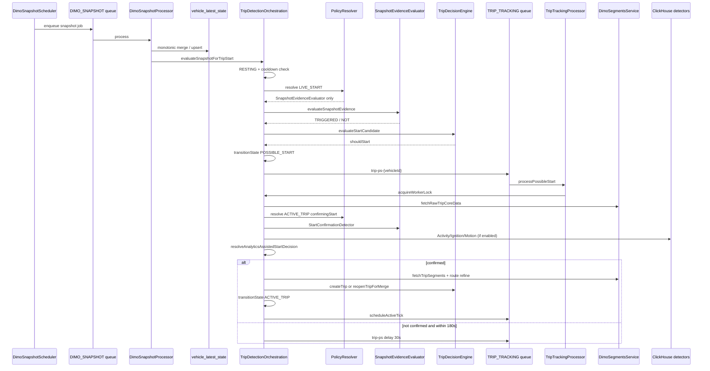
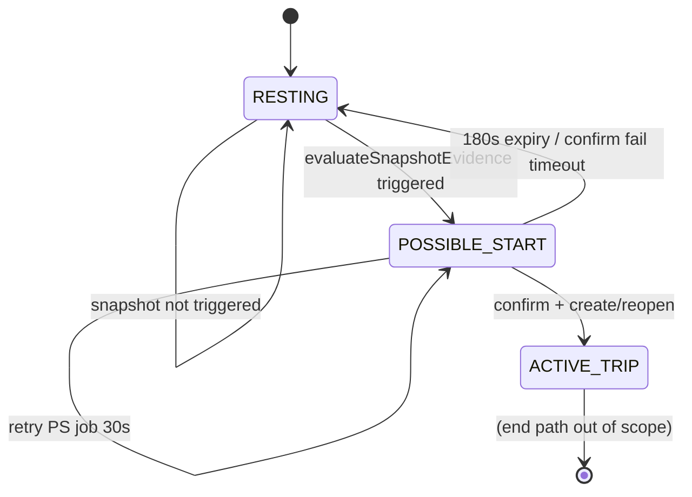

# P4 Trip Start Deep Dive — Detection Quality & Failure Windows

> **AUDIT ARTIFACT — NON-CANONICAL**
>
> This document is read-only reconstruction evidence for the Trip FSM audit workstream.
> It is **not** the canonical Trip FSM architecture authority.
> Canonical architecture documentation will be produced only after the reconstruction workstream is complete.

**Audit date:** 2026-09-05  
**Repository:** https://github.com/FATIHS-MGCKS/SYNQDRIVE-alpha  
**Branch at audit:** `main`  
**Repository HEAD at audit:** `b62c4c445e6f1294fe4e38b25904737d157465f6`  
**Audited application code SHA:** `3d5040b67abfdc7e95c1b507e13f45d1bc65af11`  
**HEAD delta vs audited code:** Audit-doc-only commits (`P2`, `P3` artifacts); **no application logic changes** after `3d5040b67` (**CONFIRMED** via `git log 3d5040b67..HEAD`)  
**Mutation policy used during audit:** READ-ONLY (this artifact excepted)  
**Production SHA status:** **UNKNOWN** — VPS SSH failed (`Permission denied (publickey)`) this session  
**Production evidence freshness:** **UNKNOWN** for fresh runtime; prior P2/P3 production SQL is **STALE/SUPERSEDED** and not reused as current evidence  
**Prior artifacts read:** `P2_STATE_MACHINE_EXECUTION_PHASE_AUDIT_2026-09-05.md`, `P3_SIGNAL_AUTHORITY_TIMESTAMP_ORDERING_AUDIT_2026-09-05.md`, `TRIP_OWNERSHIP.ts`

**Evidence labels:** CONFIRMED | INFERRED | UNKNOWN | STALE

---

## Executive summary

SynqDrive trip start is a **two-stage** pipeline: (1) snapshot candidate gate in `RESTING` → `POSSIBLE_START`, (2) asynchronous confirmation job → `ACTIVE_TRIP` + trip row. Physical evidence enters via DIMO snapshot poll → VLS merge → `evaluateSnapshotEvidence`; confirmation uses core backfill + `validateTripStart` with optional ClickHouse assist. **ClickHouse cannot enter `POSSIBLE_START` alone** — it only runs inside `processPossibleStart` after the FSM is already `POSSIBLE_START`.

Key architectural tensions (evidence-backed, not remediated here):

1. **Candidate scoring ≠ confirmation scoring** — candidate uses hard-coded strong/weak counts; confirmation uses `PROFILE_THRESHOLDS` weights.
2. **`possibleStartAt` = worker `now`** at candidate entry — anchors 180s timeout and core fetch window, not physical start.
3. **Freshness proxy `previousTelemetry.updatedAt`** is DB mutation time; LIVE_START policy computes it but **does not change detector set** today.
4. **Idle vehicles** can sit on **5–30 min** snapshot tiers before first movement is seen.
5. **`createTrip()` then `transitionState(ACTIVE_TRIP)`** — non-atomic; recovery exists but crash windows remain.
6. **`lastRestingReason: 'timeout'`** cooldown branch exists in code but **`timeout` is never written** (**CONFIRMED** grep); only `complete` and `discard` are set at finalize.
7. **`speedMotionKmh` is not consumed at the snapshot candidate gate** — low-speed weak band uses `speedActiveKmh`; `speedMotionKmh` is authoritative in confirmation `isPointActive` only.
8. **ICE/HYBRID ignition-only can enter `POSSIBLE_START`** (`strong >= 2` without movement); EV/UNKNOWN cannot on ignition alone.
9. **`processPossibleStart` catch swallows exceptions** — no BullMQ retry; recovery @120s consumes confirmation budget (**P4-F11**).
10. **Battery start-proxy `await` precedes `scheduleActiveTick`** — battery enqueue failure blocks primary active loop until recovery (**P4-F12**).

---

## P4.0 — Baseline / SHA / artifact chain

| Item | Value | Label |
|------|-------|-------|
| Branch | `main` | CONFIRMED |
| HEAD | `b62c4c445` | CONFIRMED |
| Application logic SHA | `3d5040b67` | CONFIRMED |
| Commits after logic SHA | `c52d0c765` (P2 doc), `b62c4c445` (P3 doc) | CONFIRMED |
| Application code delta | None | CONFIRMED |
| P2 artifact | Present | CONFIRMED |
| P3 artifact | Present | CONFIRMED |
| P1 markdown artifact | Not in `docs/audits/trip-fsm/` | CONFIRMED |
| TRIP_OWNERSHIP contract | `backend/.../TRIP_OWNERSHIP.ts` | CONFIRMED |
| Production deploy SHA | Not verified | UNKNOWN |
| Fresh production SQL | Not run (SSH failed) | UNKNOWN |

**Behavioral conclusions in this report apply to application SHA `3d5040b67`.** No post-audit application delta was found.

---

## P4.1 — Complete trip start working graph

### Call graph (RESTING → ACTIVE_TRIP)

| Step | Component | File / symbol |
|------|-----------|---------------|
| 1 | Scheduler tick | `DimoSnapshotScheduler` — `@Interval` enqueue `snapshot-{vehicleId}` |
| 2 | Tier selection | `deriveSnapshotPollingTier` + `isSnapshotPollDue` |
| 3 | Snapshot job | BullMQ `DIMO_SNAPSHOT` queue |
| 4 | Snapshot processor | `DimoSnapshotProcessor.processSnapshotJob` |
| 5 | Provider fetch | `DimoTelemetryService.fetchLatestVehicleSnapshot` |
| 6 | VLS monotonic merge | `shouldApplyVlsTelemetryUpdate(lastSeenAt, previousState.sourceTimestamp)` — stale snapshots skip merge but touch `providerFetchedAt` |
| 7 | VLS upsert | `prisma.vehicleLatestState.upsert` — sets `sourceTimestamp`, `providerFetchedAt`, scalars; Prisma `@updatedAt` on row |
| 8 | CH mirror (optional) | `ClickHouseTelemetryService.insertSnapshot` + `detectAndInsertStateChanges` — only after successful VLS apply |
| 9 | Trip start eval hook | `DimoSnapshotProcessor.evaluateTripStart` → `TripDetectionOrchestrationService.evaluateSnapshotForTripStart` |
| 10 | FSM gate | `detState.state === RESTING` |
| 11 | Smart cooldown | `detState.updatedAt` + `lastEvidenceSummary.lastRestingReason` |
| 12 | Policy | `TripDetectionPolicyResolver.resolve(LIVE_START)` → always `['SnapshotEvidenceEvaluator']` |
| 13 | Data quality (computed, unused for detector pick) | `assessDataQuality({ snapshotFreshMs: Date.now() - previousTelemetry.updatedAt, ... })` |
| 14 | Detector | `SnapshotEvidenceEvaluator` → `evaluateSnapshotEvidence` |
| 15 | Decision | `TripDecisionEngine.evaluateStartCandidate(findings)` — requires `SnapshotEvidenceEvaluator` TRIGGERED |
| 16 | FSM transition | `transitionState(POSSIBLE_START, { possibleStartAt: now, ... })` |
| 17 | Queue | `schedulePossibleStart` → jobId `trip-ps-{vehicleId}` |
| 18 | Worker | `TripTrackingProcessor` → `processPossibleStart` |
| 19 | Lock | `acquireWorkerLock` (TTL 120s, token in FSM row) |
| 20 | Expiry guard | `elapsed > CONFIRM_MAX_WAIT_MS (180s)` → RESTING |
| 21 | Core fetch | `computePossibleStartCoreFetchFrom(startAt, now, lookback, BACKFILL_MS=60s)` → `fetchRawTripCoreData` |
| 22 | Confirm policy | `resolve(ACTIVE_TRIP, confirmingStart)` → `StartConfirmationDetector` + optional CH detectors |
| 23 | Confirm eval | `StartConfirmationDetector` → `validateTripStart` |
| 24 | CH assist merge | `resolveAnalyticsAssistedStartDecision` |
| 25 | Boundary | `resolveConfirmedStartBoundary` → segment → `refineTripStartBoundary` (route/core/candidate) |
| 26 | Merge check | `checkTripQuality(0, null, 0, previousEnd, effectiveStartAt)` |
| 27a | Reopen | `TripDecisionEngine.reopenTripForMerge` + `transitionState(ACTIVE_TRIP)` |
| 27b | Create | `TripDecisionEngine.createTrip` then `transitionState(ACTIVE_TRIP)` |
| 28 | Ancillary | temp fetch, initial route, `BatteryV2TripStartProducer.enqueueStartProxy` |
| 29 | Active loop | `scheduleActiveTick` (30s default) |

### Sequence diagram



### State / decision graph



---

## P4.2 — Snapshot candidate gate (`evaluateSnapshotEvidence`)

**Owner:** `trip-evidence.helpers.ts` → `SnapshotEvidenceEvaluator`  
**Trigger formula (all profiles):**

```text
triggered = strong >= 2
         OR (strong >= 1 AND hasMovement)
         OR weak >= 3
```

### PROFILE_THRESHOLDS runtime consumption at candidate stage

| Field | ICE | EV | HYBRID | UNKNOWN | Consumed at candidate? |
|-------|-----|----|--------|---------|------------------------|
| speedActiveKmh | 5 | 3 | 4 | 5 | **YES** — speed strong signal |
| speedMotionKmh | 0.5 | 0.5 | 0.5 | 0.5 | **NO at candidate** — used in confirmation `isPointActive` only |
| odometerMinDeltaKm | 0.05 | 0.05 | 0.05 | 0.05 | **YES** — odometer delta |
| activeFrequencyPerMin | 2 | 2 | 2 | 2 | **NO** |
| restingFrequencyPerMin | 0.5 | 0.5 | 0.5 | 0.5 | **NO** |
| ignitionWeight | 3 | 1 | 2 | 2 | **NO** (hard-coded +2/+1 instead) |
| speedWeight | 2 | 3 | 3 | 3 | **NO** |
| odometerWeight | 2 | 2 | 2 | 2 | **NO** |
| energyWeight | 1 | 2 | 2 | 1 | **NO** |
| frequencyWeight | 1 | 2 | 1 | 2 | **NO** |

### Profile × signal × score matrix (candidate)

Legend: **S+** = strong increment, **S++** = +2 strong, **W+** = weak increment, **—** = not used

| Signal / condition | ICE | EV | HYBRID | UNKNOWN |
|--------------------|-----|----|--------|---------|
| ignition ON | S++ | S+ | S++ | S+ |
| speed > speedActiveKmh | S+ (+movement) | S+ (+movement) | S+ (+movement) | S+ (+movement) |
| engineLoad > 15 | S+ | W+ | S+ | S+ |
| tractionBatteryPower ≤ -25 kW | — | S++ | S++ | S++ |
| tractionBatteryPower ≤ -12 kW | — | S+ | S+ | S+ |
| tractionBatteryPower ≤ -4 kW | — | W+ | W+ | W+ |
| GPS delta > 50 m | S+ (+movement) | same | same | same |
| GPS delta 15–50 m | W+ (+movement) | same | same | same |
| odometer delta > min | S+ (+movement) | same | same | same |
| low speed: `0 < speed ≤ speedActiveKmh` (not speedMotionKmh) | W+ (+movement) | same | same | same |
| engineLoad 1–15 (non-EV) | W+ | — | W+ | W+ |
| fuel delta > 0.2 | W+ | W+ | W+ | W+ |
| SOC delta > 0.5 | W+ | S+ | S+ | W+ |
| regen ≥12 kW + speed >8 | W+ | W+ | W+ | W+ |
| charging power ≥5 + speed <2 | W+ (possibleCharging) | W+ | W+ | W+ |

**Mode selection:** post-trigger heuristic (`IGNITION_PRIMARY`, `MOTION_PRIMARY`, `RPM_VALIDATED`, `COMPOSITE_MULTI_SIGNAL`) — not weight-based.

**Confidence at candidate:** `strong >= 3 → HIGH`, `>= 2 → MEDIUM`, else LOW.

### P4 investigation answers

1. **Actually consumed at candidate:** `speedActiveKmh`, `odometerMinDeltaKm`, profile-specific hard-coded increments for ignition/EV power/SOC.
2. **Not consumed at candidate:** all five `*Weight` fields, frequency thresholds, **`speedMotionKmh`**.
3. **Minimum positive speed for weak + hasMovement:** any `speedKmh` where `0 < speedKmh ≤ speedActiveKmh` (e.g. 0.01 km/h qualifies if non-null).
4. **Where `speedMotionKmh` becomes authoritative:** confirmation phase only — `isPointActive()` treats a point as active if `speed > speedActiveKmh` OR (`ignition ON` AND `speed > speedMotionKmh`); also used in `hasActivityResumed` and inactivity/stop thresholds, not in `evaluateSnapshotEvidence`.
5. **Different model from `validateTripStart`?** **YES — CONFIRMED.**
6. **Intentional / documented?** Comment in `evaluateSnapshotEvidence` says "weighted by profile" but implementation uses fixed increments. **INFERRED:** historical simplification; not documented as intentional dual-model.
7. **Can profiles with different configured weights behave identically at candidate?** **YES** — e.g. ICE vs UNKNOWN differ mainly in `speedActiveKmh` (5 vs 5 same) and ignition strong increment (+2 vs +1); EV differs on speed threshold (3) and traction power paths.
8. **Runtime authority vs dead config:** At candidate stage, weight fields and `speedMotionKmh` are **config-only/dead**. `speedActiveKmh` and odometer delta are **runtime authority**.

### Ignition-only candidate semantics (verified)

Snapshot with **ignition ON, speed = 0, no GPS/odometer/other evidence**:

| Profile | strong | hasMovement | `triggered` | RESTING → POSSIBLE_START? |
|---------|--------|-------------|-------------|---------------------------|
| ICE | 2 | false | `strong >= 2` | **YES** |
| HYBRID | 2 | false | `strong >= 2` | **YES** |
| EV | 1 | false | none of OR arms | **NO** |
| UNKNOWN | 1 | false | none of OR arms | **NO** |

**Can ignition ON alone cause RESTING → POSSIBLE_START?** **YES for ICE and HYBRID; NO for EV and UNKNOWN** (under isolated ignition-only snapshot).

**Can ignition ON alone create an ONGOING trip?** **NO** — confirmation requires sustained core activity and/or CH assist with `currentTelemetryActive`; ignition-only stationary snapshots do not satisfy `validateTripStart` or typical CH assist paths.

---

## P4.3 — Start policy / data quality

### `policyResolver.resolve(LIVE_START)`

**CONFIRMED:** Always returns:

```typescript
detectors: ['SnapshotEvidenceEvaluator'],
requiredConfidence: 'LOW',
timeoutMs: 5_000,
fallbackBehavior: 'SKIP',
```

`dataQuality` and `profile` **do not change** detector selection for `LIVE_START`.

### Freshness: `previousTelemetry.updatedAt`

Computed in `evaluateSnapshotForTripStart`:

```typescript
snapshotFreshMs: previousTelemetry?.updatedAt
  ? Date.now() - previousTelemetry.updatedAt.getTime()
  : null,
```

`assessDataQuality` maps `< 90s → FRESH`, else `STALE`.

**Callers traced:** value is passed into `PolicyInput.dataQuality` but **LIVE_START switch ignores it** — **CONFIRMED**.

### Stale snapshot / updatedAt interaction

| Scenario | VLS behavior | updatedAt | Trip start eval |
|----------|--------------|-----------|-----------------|
| Stale provider snapshot (monotonic reject) | Skip scalar merge; update `providerFetchedAt` only | **Unchanged** (no upsert body) | **Not called** — processor returns before `evaluateTripStart` |
| Fresh snapshot applied | Full upsert | **Bumped** (Prisma `@updatedAt`) | Runs with new scalars |
| Stale physical observation applied as fresh VLS row | If passes monotonic guard | Bumped | Could candidate on stale `lastSeenAt` values |

**Can stale physical observation be classified FRESH?** **YES** — if DB row was recently written (e.g. unrelated field touch) while `sourceTimestamp` is old; freshness uses `updatedAt`, not `sourceTimestamp`. **Impact on candidate today:** **none** — policy doesn't branch on freshness at LIVE_START.

**Can freshness alter detector set / timeout / verdict?** **NO** at LIVE_START (**CONFIRMED**). **False positive/negative via freshness alone at candidate:** **NO direct path** today.

**TODO in code:** `evaluateSnapshotForTripStart` line 541 — pass snapshot timestamp from caller.

---

## P4.4 — RESTING cooldown

| Reason key | Cooldown | Code constant |
|------------|----------|---------------|
| `complete` (default) | **120 s** | `COOLDOWN_AFTER_COMPLETE_MS` |
| `timeout` | **60 s** | `COOLDOWN_AFTER_TIMEOUT_MS` |
| `discard` | **30 s** | `COOLDOWN_AFTER_DISCARD_MS |

**Clock:** `Date.now() - detState.updatedAt.getTime()` — wall clock.  
**What writes `updatedAt`:** Prisma `@updatedAt` on any `vehicleTripDetectionState` update, including `transitionState`.

**RESTING entry time:** **INFERRED** ≈ last transition to RESTING (finalize, PS expiry, etc.), not necessarily physical stop time.

**`lastRestingReason` writers:** `processFinalize` sets `complete` or `discard` in `lastEvidenceSummary`. **`timeout` is never assigned** despite cooldown branch — **CONFIRMED** (grep). PS expiry clears `lastEvidenceSummary` entirely → next cooldown uses default **120s complete**.

**Recovery / reconciliation:** Recovery scheduler does not reset cooldown. Reconciliation repair path is separate (missing trip), not cooldown-aware.

**Journey effects:**

| Stop type | Typical gap vs complete cooldown | Start blocked? |
|-----------|----------------------------------|----------------|
| Fuel / passenger / traffic (<2 min) after completed trip | <120s | **YES** — deliberate blind window |
| After discarded micro-trip | 30s | shorter |
| Key-off/on within 30–120s | depends on prior finalize reason | often **YES** |
| EV park/restart after normal complete | up to 120s | **YES** |

**Worst-case recognition latency from cooldown + polling + confirm:** candidate ~32 min + up to 180 s PS ≈ **35 min** to `ACTIVE_TRIP` under default tiers — **CONFIRMED** arithmetic. Live miss between polls is a separate **MISS** class (P4.5).

---

## P4.5 — Snapshot scheduling / start latency

### Default tier intervals (`snapshot-polling-tier.config.ts`)

| Tier | Default interval | Typical vehicle condition |
|------|------------------|---------------------------|
| ACTIVE_DRIVING | 30s | FSM `ACTIVE_TRIP`, `IDLE_WITHIN_TRIP`, `POSSIBLE_END` |
| RECENTLY_ACTIVE | 60s | movement >3 km/h, ignition ON, recent FSM activity, telemetry `live` |
| RESTING_STANDBY | **5 min** | telemetry `standby` or recent observation < standby threshold |
| LONG_IDLE | **30 min** | `signal_delayed`, `offline`, long idle |

**RESTING FSM + idle vehicle:** commonly **RESTING_STANDBY (5m)** or **LONG_IDLE (30m)** — **CONFIRMED** (`deriveSnapshotPollingTier`).

**Promotion:** movement/ignition → RECENTLY_ACTIVE; `requiresImmediateSnapshotPollOnPromotion` can bypass elapsed interval on tier promotion.

**DIMO signal cadence ≠ SynqDrive poll cadence** — core buckets are 20s when fetched, but snapshots may be 5–30 min apart on idle vehicles.

### Latency terminology (three distinct concepts)

| Concept | Definition | Typical upper bound (defaults, vehicle stays observable) |
|---------|------------|----------------------------------------------------------|
| **candidateLatency** | physical start → `POSSIBLE_START` | ≈ **32 min** = 30 min max idle poll + 120 s complete cooldown (+ processing) |
| **recognitionLatency** | physical start → `ACTIVE_TRIP` / ONGOING row | ≈ **35 min** = candidateLatency + up to 180 s PS confirmation window |
| **canonicalStartBoundaryError** | physical/best-provider start → stored `trip.startTime` | independent — may be small if DIMO segment backdates despite late recognition |

**Live FSM miss case:** a short trip that starts and finishes entirely between two `LONG_IDLE` polls **without any qualifying snapshot reaching `evaluateSnapshotEvidence`** is **not recognized live** — latency is **MISS / NEVER (live path)**, not a finite delay. Reconciliation/repair is a separate path and must not be folded into live recognition latency.

**Lookback coupling:** default `tripStartBoundaryMaxLookbackMs` ≈ 35 min (= 30 min + 180 s + 120 s buffer). Stage stack `30m poll + 120s cooldown + up to 180s confirm + provider observation lag` can **consume or exceed** the historical boundary window, leaving segment/route/core refinement unable to recover the true prefix (`startedBeforeRange` rejection amplifies this).

---

## P4.6 — POSSIBLE_START temporal model

| Field | Writer | Time basis | Confirmation use | Reset |
|-------|--------|------------|------------------|-------|
| `possibleStartAt` | `evaluateSnapshotForTripStart` | **Worker `now`** | 180s timeout; core fetch anchor; boundary candidate | null on RESTING |
| `lastSnapshotEvidenceAt` | same transition | worker `now` | forensic | cleared |
| `lastActivityAt` | same | worker `now` | polling tier promotion | updated later |
| `startOdometerKm` / fuel / SOC | snapshot at candidate | provider snapshot | forensic baseline | cleared |
| `startDetectionMode` / `startConfidence` | decision engine | derived | copied to trip on confirm | cleared |
| `lastEvidenceSummary` | candidate evidence | JSON | extended at confirm with boundary meta | cleared |

**Effects of worker-time anchor:**

- **180s timeout** measured from detection time, not physical start — delayed core can expire candidate while vehicle moving (**false expiry**).
- **Core fetch window:** `max(possibleStartAt - 60s, now - 35min)` — late confirmation shrinks backfill relative to physical start.
- **Boundary max lookback** tied to `candidateStartAt` and `confirmedAt` — historical confirm possible within lookback (`delayed-start-boundary.safety-gate.spec.ts`).

After confirm, `possibleStartAt` overwritten with `effectiveStartAt` (canonical boundary) — **CONFIRMED** in `processPossibleStart`.

---

## P4.7 — Core start confirmation (`validateTripStart`)

### maxScore by profile (sum of weights)

| Profile | ignition | speed | odo | energy | freq | **maxScore** |
|---------|----------|-------|-----|--------|------|--------------|
| ICE | 3 | 2 | 2 | 1 | 1 | **9** |
| EV | 1 | 3 | 2 | 2 | 2 | **10** |
| HYBRID | 2 | 3 | 2 | 2 | 1 | **10** |
| UNKNOWN | 2 | 3 | 2 | 1 | 2 | **10** |

Score adds full weight if: `hasIgnition`, `hasMotion`, `hasOdometerProgress`, `hasEnergyActivity`, `isActiveFrequency`.

### Four confirmation gates (OR)

| Gate | Expression |
|------|------------|
| `strongConsecutive` | `maxConsecutiveActive >= 3` |
| `stableDuration` | `activeDurationMs >= 60_000` |
| `compositeStrong` | `maxConsecutiveActive >= 2 && score >= maxScore * 0.5` |
| `combinedCurrent` | `maxConsecutiveActive >= 2 && ignition ON && speed > 0` |

`isPointActive`: speed > speedActiveKmh OR (ignition ON AND speed > speedMotionKmh).

**Motion-only snapshot candidate (speed > speedActiveKmh, no ignition):** all profiles → strong=1, hasMovement=true → **triggered** via `(strong >= 1 && hasMovement)`.

**Motion-only confirmation (sustained core motion, no ignition):** all profiles can confirm via `strongConsecutive`, `stableDuration`, or `compositeStrong` — ignition is **not** required. `combinedCurrent` is ignition-specific but is only one OR arm.

### Representative sequences (candidate vs confirm)

| ID | Scenario | Candidate | Confirm | Trip |
|----|----------|-----------|---------|------|
| A | ICE ignition ON, parked, engine load >15 | **YES** (ignition +2, load +1 → strong≥2) | Needs core consecutive/duration OR CH assist | Unlikely without motion/core |
| B | ICE ignition + 8 km/h | YES | YES (strongConsecutive likely) | YES |
| C | ICE/HYBRID ignition ON only, stationary | **YES** (strong=2) | NO (no active core points) | NO |
| C2 | EV/UNKNOWN ignition ON only, stationary | **NO** (strong=1) | NO | NO |
| D | Any profile: speed > speedActiveKmh, no ignition | YES | YES if core sustained | YES |
| E | EV SOC change charging, no motion | SOC strong on EV | NO motion | NO |
| F | EV traction sparse core | YES if snapshot strong | CH assist may help | Maybe |
| G | Hybrid engine toggle standstill | ignition may hit strong=2 alone | unlikely stableDuration | NO trip without motion/core |
| H | GPS drift 15m | weak only | NO | NO |
| H2 | GPS jump >50m | YES | needs core | Maybe |
| I | Odometer jump only | YES if delta | YES if core confirms | YES |
| J | One active bucket | NO unless weak≥3 | NO | NO |
| K | Two active buckets | maybe composite | maybe compositeStrong | Maybe |
| L | Three active buckets | YES | strongConsecutive | YES |
| M | Sparse provider cadence | YES possible | frequency gate may fail | Retry/timeout |
| N | Delayed core buckets | YES | confirm delayed; expiry risk | Maybe |

---

## P4.8 — Frequency as evidence

**Formula:** `pointsPerMinute = points.length / (windowMs / 60_000)` where `windowMs` = last − first core timestamp.

**Edge cases:**

- `< 2` points → 0 ppm, `isRestingFrequency=true`
- 2 points in 60s → 2 ppm → active for all profiles (threshold 2)

**At confirmation:** frequency contributes **one weight bucket** via `isActiveFrequency`; can satisfy `compositeStrong` with partial physical evidence.

**Classification:**

| Profile | Role of cadence |
|---------|-----------------|
| ICE | **SECONDARY corroboration** — can tip compositeStrong |
| EV | **SECONDARY** — more weight in profile (freq weight 2) |
| HYBRID | **SECONDARY** |
| UNKNOWN | **SECONDARY** |

**Can frequency alone confirm start?** Only via `compositeStrong` with `maxConsecutiveActive >= 2` — **INFERRED:** rare without some motion buckets; not primary physical proof.

Provider batching / duplicate buckets inflate ppm — **INFERRED** risk for false confirm on sparse true motion.

---

## P4.9 — ClickHouse start assist

**Entry point:** only `processPossibleStart` after FSM=`POSSIBLE_START` — **CH cannot create trip without snapshot candidate path**.

### Decision paths

| Path | Condition |
|------|-----------|
| `DIMO_ONLY` | `StartConfirmationDetector` TRIGGERED |
| `DIMO_PLUS_CLICKHOUSE` | DIMO confirm + any CH segment/window triggered |
| `CLICKHOUSE_ASSISTED` | DIMO confirm failed but assist rules pass |

### `currentTelemetryActive`

```typescript
speedKmh > 0.5
OR engineLoad > 15
OR (isIgnitionOn === true AND speedKmh > 0)
```

Uses **current VLS row** at confirm time (not historical).

### CH assist branches (verified order in `resolveAnalyticsAssistedStartDecision`)

After DIMO `StartConfirmationDetector` fails to TRIGGER, two independent assist arms are evaluated **in order**:

| Branch | Guard | Comment in code | Profiles affected |
|--------|-------|-----------------|-------------------|
| **A — ignition + activity** | `currentTelemetryActive && strongActivityWindow && ignitionTriggered` | Comment says "ICE / HYBRID" | **No profile guard in code** — any profile including ICE can match if CH ignition segment fires |
| **B — EV-family motion/activity** | `isEvProfile && currentTelemetryActive && (motionTriggered \|\| strongActivityWindow)` | `isEvProfile = EV \|\| HYBRID \|\| UNKNOWN` | EV, HYBRID, UNKNOWN |

**HYBRID dual path:** HYBRID is in `isEvProfile`, so it can confirm via **branch A** (ignition segment + strong activity) **or branch B** (motion segment or strong activity). Do not describe HYBRID as ignition-only.

**ICE:** no `MotionSegmentDetector` in confirm policy (`trip-detection-policy.resolver.ts`); ICE CH assist is effectively **branch A only** (ignition segment path).

**EV/UNKNOWN:** branch B primary; branch A available if ignition segment exists.

### No-core confirmation (`StartConfirmationDetector` INCONCLUSIVE)

When `corePoints.length === 0`, `StartConfirmationDetector` returns **INCONCLUSIVE** (not TRIGGERED). `resolveAnalyticsAssistedStartDecision` may still return `confirmed=true` if CH assist arms pass (requires `clickhouseAvailable` and detectors ran):

| Profile | CH-only confirm possible? | Required assist path |
|---------|---------------------------|----------------------|
| ICE | **YES** (if CH enabled) | Branch A: `ignitionTriggered` + `strongActivityWindow` + `currentTelemetryActive` |
| EV | **YES** | Branch B: `motionTriggered` OR `strongActivityWindow` + `currentTelemetryActive` |
| HYBRID | **YES** | Branch A **or** Branch B |
| UNKNOWN | **YES** | Branch B (motion/activity); Branch A if ignition segment present |

If CH unavailable or `currentTelemetryActive` false: **NO** confirm without core → PS self-reschedule every 30s until 180s expiry.

### Conflict cases

| Case | Typical outcome |
|------|-----------------|
| VLS speed active, CH no motion | DIMO confirm path or fail |
| VLS stationary, CH motion | Assist possible for EV if `currentTelemetryActive` false → **fail** |
| VLS ignition false, CH ignition segment | ICE assist needs `ignitionTriggered` |
| EV no ignition | motion segment path |
| Delayed CH segment | may miss window |
| CH mirror lagging VLS | assist weaker |

**Can CH independently create ACTIVE_TRIP?** **NO** — only confirms inside PS job (**CONFIRMED**).

---

## P4.10 — Start boundary resolution

**Priority (`resolveConfirmedStartBoundary`):**

1. **DIMO segment** — `selectConfirmedStartSegment` rejects `startedBeforeRange=true`
2. **`refineTripStartBoundary`:** route earliest activity → core earliest → snapshot candidate

**Windows:**

- Segment/route fetch: `computeStartBoundaryWindowFrom(candidateStartAt, confirmedAt, lookback)`
- Core already fetched with `computePossibleStartCoreFetchFrom`

**Can canonical startTime predate…**

| Reference | Possible? |
|-----------|-----------|
| Physical candidate snapshot | **YES** — segment/route/core backdate |
| `possibleStartAt` | **YES** — `adjustedMs` negative |
| First detected speed | **YES** |
| Previous trip end | **YES** if merge/reopen or segment overlap — selection rejects segment not overlapping candidate window |
| Provider fetch time | **YES** |

**Previous trip activity leak:** Segment must satisfy `startMs <= confirmedAt && endMs >= candidateMs` and not `startedBeforeRange` — **INFERRED** partial guard; route/core earliest-in-window could still pick pre-candidate motion from same window.

**Worst case:** LONG_IDLE detection + `startedBeforeRange` segment → live path falls back to worker-time candidate (`delayed-start-boundary.safety-gate.spec.ts` **CONFIRMED**).

---

## P4.11 — Merge / reopen behavior

**Merge check at start:**

```typescript
checkTripQuality(0, null, 0, previousTrip.endTime, effectiveStartAt)
```

Only **time gap < 5 min** matters; zero distance/duration args bypass discard rules.

**GPS / ignition:** not considered at merge.

**Intentional short-stop merge:** **YES** — fueling/passenger stops <5 min merge into one trip.

**`reopenTripForMerge`:** sets trip `ONGOING`, clears `endTime/endLat/endLng` — **does not change `startTime`** on trip row.

**Downstream staleness:** prior finalize enrichment on completed trip may be stale after reopen — **INFERRED**; new segment treated as continuation.

---

## P4.12 — New trip commit order / atomicity

### Exact post-confirmation order (new trip path)

| Step | Call | Awaited? | Error handling |
|------|------|----------|----------------|
| 1 | `decisionEngine.createTrip(...)` | **await** | propagates to outer catch if throws |
| 2 | `transitionState(ACTIVE_TRIP, ...)` | **await** | propagates |
| 3 | `fetchAndStoreStartTemperature(...)` | fire-and-forget | local `.catch` log |
| 4 | `fetchAndStoreInitialRoute(...)` | fire-and-forget | local `.catch` log |
| 5 | `batteryTripStartProducer.enqueueStartProxy(...)` | **await** (if orgId) | propagates — **blocks step 6** |
| 6 | `scheduleActiveTick(...)` | **await** | propagates |
| 7 | metrics / logs | sync | — |
| 8 | `logTrackingRun(...)` | **await** (end of try) | — |

**Merge/reopen path** skips steps 3–5; calls `scheduleActiveTick` immediately after FSM transition.

**P4-F12 verified:** battery start-proxy failure **prevents** `scheduleActiveTick` on the new-trip path until recovery re-enqueues.

### `createTrip` atomicity (Postgres / Prisma)

`prisma.vehicleTrip.create()` is a **single INSERT statement** — there is **no partial row mutation** inside one call. Outcomes:

- **Success:** full row committed atomically.
- **Failure before commit:** no row (or duplicate-key error on `dimoSegmentId` unique).
- **Caller uncertainty:** if the DB connection drops after the server committed but before the client receives the response, the caller may retry — duplicate risk mitigated only by `dimoSegmentId @unique`, not idempotent create logic.

Do **not** describe "maybe partial" VehicleTrip rows during create.

### Crash / failure scenarios

| Scenario | vehicle_trips | FSM | Battery proxy | ACTIVE_TICK queue | Recovery |
|----------|---------------|-----|---------------|-------------------|----------|
| A. Before createTrip | none | POSSIBLE_START | — | none | PS retry 30s or recovery @120s |
| B. createTrip throws | none | POSSIBLE_START | — | none | same; no orphan row |
| C. create committed, crash before FSM | **ONGOING orphan** | POSSIBLE_START | — | none | recovery PS; duplicate trip risk on retry |
| D. FSM ACTIVE_TRIP, crash before battery | ONGOING | ACTIVE_TRIP | not enqueued | **not scheduled** | recovery AT/PS @120s |
| E. Battery enqueue throws | ONGOING | ACTIVE_TRIP | failed | **not scheduled** | recovery @120s (**P4-F12**) |
| F. Battery ok, crash before scheduleActiveTick | ONGOING | ACTIVE_TRIP | queued | not scheduled | recovery @120s |
| G. scheduleActiveTick throws (caught by PS catch) | ONGOING | ACTIVE_TRIP | maybe queued | not scheduled | recovery @120s; **no BullMQ retry** |
| H. ACTIVE_TICK enqueued, later AT failure | ONGOING | ACTIVE_TRIP | ok | job exists | AT self-reschedule / recovery |

**Recovery:** `TripTrackingRecoveryScheduler` every 120s re-enqueues `trip-recovery-{vehicleId}` (not `trip-ps-{vehicleId}`) when lock expired.

**createTrip idempotency:** **NO** — each confirm uses new UUID; **`dimoSegmentId` @unique** may throw on duplicate synthetic id.

---

## P4.13 — Job idempotency / concurrency

- **Job ID:** `trip-ps-{vehicleId}` — dedupes concurrent PS schedules
- **Recovery job ID:** `trip-recovery-{vehicleId}` — separate from PS id
- **Worker lock:** 120s TTL, compare-and-set on `workerLockedUntil`
- **BullMQ retry on PS exception:** **NO** — `processPossibleStart` **catch swallows** errors (no rethrow); `TripTrackingProcessor` records SUCCESS. Ordinary BullMQ retry applies only if the processor itself throws (outside orchestration catch).
- **Unconfirmed (non-throwing) path:** PS self-reschedule every **30s** until 180s expiry
- **Duplicate workers:** lock prevents parallel PS for same vehicle — **INFERRED** single flyer
- **Duplicate ONGOING trips:** no DB unique on `(vehicleId, ONGOING)` — **two workers could create two trips if lock bypassed** — **INFERRED** low probability
- **`dimoSegmentId` unique:** prevents duplicate segment ids

---

## P4.14 — Recovery of POSSIBLE_START

### Exception propagation (**P4-F11**)

`processPossibleStart` structure:

```text
try { ... confirm logic ... }
catch (err) { log warn; logTrackingRun with errorMessage; NO rethrow }
finally { releaseWorkerLock }
```

**BullMQ sees:** job **SUCCESS** (orchestration returned normally). **No** automatic BullMQ retry for PS exceptions.

**After exception at T0:** no PS self-reschedule (that only runs in non-throwing `confirmed=false` branch); lock released; FSM stays **POSSIBLE_START**; `possibleStartAt` unchanged.

**Recovery scheduler (@120s):** enqueues `trip-recovery-{vehicleId}` when lock expired. **Worst case:** error at T0 → recovery ~T0+120s → only **~60s** confirmation budget remains before 180s expiry at next successful PS run.

| Condition | Self-healing? | Mechanism |
|-----------|---------------|-----------|
| Queue job missing | **Partial** | Recovery scheduler @120s |
| Job delayed | **YES** | eventual run |
| Worker crashed mid-job (uncaught in processor) | **Partial** | BullMQ retry + lock expiry + recovery |
| **PS exception swallowed** | **Partial** | recovery @120s only; consumes confirm budget (**P4-F11**) |
| Redis restarted | **Partial** | jobs may be lost; recovery rescans FSM |
| Lock leaked until TTL | blocks | 120s |
| No core, CH cannot assist | PS retry 30s until 180s | then RESTING |
| No core, CH **can** assist | **YES** | CH-only confirm same run |
| Candidate >180s | **YES** | expiry → RESTING |
| Trip exists from crash window | **NO** | manual/reconciliation |

---

## P4.15 — False positive analysis (summary)

| Condition | Candidate? | Confirmed? | Trip? | Protection |
|-----------|------------|------------|-------|------------|
| ICE/HYBRID ignition parked (no motion) | **YES** (strong=2) | NO without core/CH | NO | confirm gates |
| EV/UNKNOWN ignition parked | NO | NO | NO | strong=1 insufficient |
| Remote preconditioning | Maybe load+ignition (ICE strong≥2) | Unlikely | Unlikely | duration/consecutive |
| Charging SOC change | EV/HYBRID strong | Unlikely without motion | Unlikely | motion gates |
| GPS drift 15m | weak only | No | No | weak<3 alone |
| GPS jump >50m | Yes | Maybe | Maybe | core confirm |
| Towing/transporter | motion | possible | possible | weak business logic |
| Stale snapshot | blocked at VLS | — | — | monotonic guard |
| CH stale segment | — | assist may fail | — | currentTelemetryActive |

**Largest FP risk:** **INFERRED** GPS/odometer jump at candidate with thin confirm (`compositeStrong` + sparse core).

---

## P4.16 — False negative analysis (summary)

| Condition | Effect | Max delay |
|-----------|--------|-----------|
| Slow idle polling | late candidate | +30 min poll |
| RESTING cooldown | blind window | +120s |
| EV no ignition | mitigated by EV CH path | varies |
| Short trip <60s | may discard at end not start | N/A at start |
| CH unavailable | lose assist; core-only confirm | DIMO-only harder |
| Core fetch empty, CH assist passes | NO DIMO confirm | **YES** (CH-only) | profile-dependent |
| PS exception mid-run | FSM stays PS | recovery only | budget consumed (**P4-F11**) |

**Largest FN risk:** **idle tier polling + post-complete cooldown** — **CONFIRMED** architectural blind windows.

---

## P4.17 — Profile comparison matrix

| Column | ICE | EV | HYBRID | UNKNOWN |
|--------|-----|----|--------|---------|
| Candidate speed threshold (`speedActiveKmh`) | 5 | 3 | 4 | 5 |
| `speedMotionKmh` (confirm `isPointActive` only) | 0.5 | 0.5 | 0.5 | 0.5 |
| Odo threshold | 0.05 | 0.05 | 0.05 | 0.05 |
| Ignition-only → POSSIBLE_START? | **YES** | **NO** | **YES** | **NO** |
| Motion-only → POSSIBLE_START? | **YES** | **YES** | **YES** | **YES** |
| Candidate score model | strong/weak counts | same | same | same |
| Confirm weights (ign/speed/odo/en/freq) | 3/2/2/1/1 | 1/3/2/2/2 | 2/3/2/2/1 | 2/3/2/1/2 |
| CH assist paths | branch A only | branch B (+ A if ignition seg) | **A and B** | branch B (+ A if ignition seg) |
| Weakest signal | ignition-only PS noise | missing ignition | dual-path complexity | defaults |
| Likely FP mode | **ignition-only PS (ICE/HYB)** | SOC noise | ignition-only PS | GPS drift |
| Likely FN mode | slow poll+cooldown | slow poll | same | same |

**Asymmetry:** Candidate and confirm both profile-aware but **via different mechanisms** — thresholds vs weights.

---

## P4.18 — Start boundary accuracy model

Three **separate** latency/error concepts (do not conflate):

| Metric | Definition |
|--------|------------|
| **candidateLatency** | `possibleStartAt − physicalStartEstimate` |
| **recognitionLatency** | `ACTIVE_TRIP commit − physicalStartEstimate` |
| **canonicalStartBoundaryError** | `trip.startTime − bestProviderStartEstimate` |

**Upper bounds (defaults, vehicle remains observable, live path succeeds):**

- candidateLatency ≈ **32 min** (30 min max poll + 120 s cooldown)
- recognitionLatency ≈ **35 min** (+ up to 180 s PS window)

**Live miss:** trip completed between LONG_IDLE polls → **MISS / never recognized live** (not a finite latency).

**Decoupling:** recognition can be late while `canonicalStartBoundaryError` is small if DIMO segment backdates start.

**Lookback stress:** stage delays can exhaust `tripStartBoundaryMaxLookbackMs` (~35 min), forcing worker-time candidate fallback.

---

## P4.19 — Observability / forensics

| Evidence | Post-hoc "why started?" |
|----------|-------------------------|
| FSM `lastEvidenceSummary` | **PARTIAL** — candidate reasons; extended at confirm |
| `vehicle_trip_tracking_runs` | **PARTIAL** — PS validation runs |
| Trip row `startDetectionMode`, `startConfidence` | **PARTIAL** |
| `rawDetectionMeta` on trip | **PARTIAL** — confirm path if stored in summary merge |
| Metrics `tripStartCandidates`, `tripStartsConfirmed`, `tripEvidencePaths` | **PARTIAL** aggregate |
| Logs | **PARTIAL** — structured log lines exist |
| CH evidence | **PARTIAL** — not persisted on FSM |

**Lost on RESTING reset:** `possibleStartAt`, candidate summary fields cleared.

**Overall reconstructability:** **PARTIAL** — engineer can likely trace happy path; timeout/expiry paths harder.

---

## P4.20 — Test coverage

| Area | Primary tests | Gaps |
|------|---------------|------|
| Candidate scoring | `trip-detection.spec.ts` evaluateSnapshotEvidence | all profile combos incomplete |
| Profile weights at confirm | indirect via analytics tests | no direct validateTripStart matrix |
| Snapshot freshness | none for LIVE_START policy | **gap** |
| Confirmation | analytics + continuity tests | crash/idempotency |
| CH assist | resolveAnalyticsAssistedStartDecision tests | conflict matrix partial |
| Boundary | refineTripStartBoundary, delayed-start-boundary.safety-gate | live orchestration integration |
| Merge | checkTripQuality tests | reopen side effects |
| Recovery | reference in p12 gate spec | PS exception swallow (**P4-F11**); battery-before-AT (**P4-F12**) |
| Timeout cooldown reason | none | **`timeout` reason never set** |

---

## P4.21 — Production read-only evidence

**Status: UNKNOWN** — SSH to `srv1374778.hstgr.cloud` failed (`Permission denied (publickey)`).

No fresh FSM distribution, latency, merge rate, or boundary adjustment stats collected.

---

## P4.22 — Start quality verdict

| Dimension | Rating | Evidence |
|-----------|--------|----------|
| Candidate sensitivity | **ACCEPTABLE** | low bar trigger formula |
| Candidate specificity | **WEAK** | ICE/HYB ignition-only PS; GPS/odometer jumps |
| Confirmation sensitivity | **ACCEPTABLE** | multi-gate OR |
| Confirmation specificity | **ACCEPTABLE** | consecutive + duration |
| Boundary accuracy | **ACCEPTABLE** when segment matches | delayed-start tests |
| Recognition latency | **WEAK** | 5–30m idle tiers + cooldown |
| ICE robustness | **ACCEPTABLE** | ignition-weighted confirm |
| EV robustness | **ACCEPTABLE** with CH | motion assist |
| Hybrid robustness | **ACCEPTABLE** | mixed paths |
| Sparse telemetry | **WEAK** | core/CH assist dependency; CH-only path exists |
| Out-of-order data | **ACCEPTABLE** | VLS monotonic at snapshot |
| Crash safety | **CRITICAL** | create-before-FSM orphan + swallowed PS errors (**P4-F11**) |
| Idempotency | **WEAK** | jobId + lock; no ONGOING unique; swallowed errors mask failures |
| Recovery robustness | **WEAK** | 120s recovery cadence vs 180s confirm budget; battery blocks AT (**P4-F12**) |
| Observability | **WEAK** | partial forensics; PS errors logged but job marked SUCCESS |

---

## P4.23 — Architectural findings

| ID | Severity | Title | Status |
|----|----------|-------|--------|
| P4-F01 | P1 | Dual scoring models (candidate counts vs confirm weights) | Open |
| P4-F02 | P1 | `possibleStartAt` = worker time anchors timeout/backfill | Open |
| P4-F03 | P2 | LIVE_START freshness uses `updatedAt` but policy ignores it | Open |
| P4-F04 | P1 | Idle snapshot tiers (5–30m) delay first candidate | Open |
| P4-F05 | P2 | Post-complete 120s cooldown blind window | Open |
| P4-F06 | P2 | `createTrip` before FSM transition crash window | Open |
| P4-F07 | P3 | `lastRestingReason: timeout` never written — dead cooldown branch | Open |
| P4-F08 | P2 | CH assist cannot start trip without POSSIBLE_START | By design |
| P4-F09 | P2 | Merge by time-only gap ≤5m may merge distinct stops | Open |
| P4-F10 | P3 | No unique constraint preventing duplicate ONGOING trips | Open |
| P4-F11 | P1 | `processPossibleStart` swallows exceptions; recovery @120s consumes 180s confirm budget; BullMQ sees SUCCESS | Open |
| P4-F12 | P1 | Battery `enqueueStartProxy` awaited before `scheduleActiveTick` — failure blocks primary active loop | Open |

---

## Mandatory summary matrices

### A. Trip start end-to-end decision matrix

| Phase | Input | Decision | Output |
|-------|-------|----------|--------|
| Poll tier | FSM, telemetry freshness | interval 30s–30m | snapshot job |
| VLS merge | lastSeenAt vs sourceTimestamp | apply/skip | scalars |
| Cooldown | updatedAt, lastRestingReason | block/allow | — |
| Candidate | snapshot deltas | triggered? | POSSIBLE_START |
| Confirm | core window + VLS + CH | confirmed? | ACTIVE_TRIP |
| Boundary | segments/route/core | startTime | trip row |
| Merge | gap to prev end | reopen/create | ONGOING |

### B. Profile × signal authority matrix

| Signal | Candidate authority | Confirm authority |
|--------|--------------------|--------------------|
| Speed (`speedActiveKmh`) | strong/weak + movement | weight + consecutive via `isPointActive` |
| Speed (`speedMotionKmh`) | **none** | minimal-speed + ignition arm of `isPointActive` |
| Ignition | strong/weak increments (+2 ICE/HYB) | weight + combinedCurrent |
| Odometer | delta strong | weight + progress |
| Energy/SOC | profile-specific strong/weak | energy weight |
| Frequency | **none** | frequency weight |
| CH segments | **none** | assist only in PS |

### C. Candidate scoring matrix

See P4.2 table — trigger `strong>=2 OR (strong>=1 && movement) OR weak>=3`.

### D. Confirmation scoring matrix

See P4.7 — gates OR across consecutive, duration, composite, combinedCurrent.

### E. Start latency matrix

| Concept | Typical | Max (defaults, live path succeeds) |
|---------|---------|-------------------------------------|
| candidateLatency | seconds–minutes | **~32 min** (30m poll + 120s cooldown) |
| recognitionLatency | +0–180s after candidate | **~35 min** (+ PS window) |
| canonicalStartBoundaryError | independent | bounded by lookback ~35 min |
| Live miss (trip between polls) | — | **MISS / never live** |

### F. Start boundary priority matrix

1. DIMO segment (in window, not startedBeforeRange)  
2. Route earliest activity  
3. Core earliest activity  
4. Snapshot candidate time  

### G. False positive matrix

See P4.15.

### H. False negative matrix

See P4.16.

### I. Crash / recovery matrix

See P4.12, P4.14.

### J. Test coverage matrix

See P4.20.

### K. Observability matrix

See P4.19 — mostly PARTIAL.

### L. Open findings matrix

See P4.23.

---

## Final questions — explicit answers

1. **Earliest indication:** DIMO snapshot scalar change evaluated in `evaluateSnapshotEvidence` while FSM=`RESTING` (after cooldown), or VLS row update — **not** persisted as trip until confirm.
2. **POSSIBLE_START evidence:** `SnapshotEvidenceEvaluator` TRIGGERED per formula; FSM must be RESTING and cooldown elapsed.
3. **ONGOING trip evidence:** `resolveAnalyticsAssistedStartDecision.confirmed` OR `StartConfirmationDetector` TRIGGERED (with optional CH assist rules).
4. **Ignition ON alone → POSSIBLE_START?** **YES for ICE/HYBRID** (strong=2); **NO for EV/UNKNOWN** (strong=1). **Ignition ON alone → ONGOING trip?** **NO** — confirmation requires core and/or CH assist with motion/activity telemetry.
5. **Motion alone (speed > speedActiveKmh)?** **YES at candidate for all profiles**; **YES at confirm for all profiles** if sustained core satisfies `strongConsecutive` / `stableDuration` / `compositeStrong` (ignition not required).
6. **CH without POSSIBLE_START?** **NO**.
7. **Latest live recognition:** **~35 min** upper bound when vehicle stays observable (candidate ~32 min + up to 180 s confirm). **Separate case:** trip finished between LONG_IDLE polls → **live MISS** (reconciliation only).
8. **Canonical accuracy despite late recognition?** **YES** — DIMO segment/route/core can backdate `startTime` unless lookback exhausted.
9. **Largest FP risk:** **ICE/HYBRID ignition-only POSSIBLE_START** (strong≥2 without movement) plus permissive confirm/CH paths on noisy telemetry.
10. **Largest FN risk:** idle polling tier + post-trip cooldown + PS exception/recovery budget consumption (**P4-F11**).
11. **Profile-aware both stages?** **YES** but **different models** (thresholds/increments vs weights).
12. **Candidate/confirm internally consistent?** **NO** — dual models (P4-F01).
13. **Crash → ONGOING + POSSIBLE_START?** **YES** possible (create committed before FSM).
14. **Duplicate workers duplicate trips?** **Unlikely** with lock; **possible** if lock bypassed — no ONGOING unique constraint.
15. **Short stop merged incorrectly?** **YES** if gap <5m by design (P4-F09).
16. **Self-healing after queue/worker failure?** **Partial** — recovery @120s; PS exceptions **not** BullMQ-retried (**P4-F11**); battery failure blocks AT (**P4-F12**).
17. **Reconstruct why trip started?** **PARTIAL** forensics.
18. **Highest priority fix after audit:** **P4-F11 + P4-F02 + P4-F01** — fix swallowed PS errors / confirm budget, anchor `possibleStartAt` to provider time, unify or document dual scoring; secondary: idle polling (**P4-F04**) and battery-before-AT ordering (**P4-F12**).

---

## P4.24 — Audit closure / correction pass

| Item | Value |
|------|-------|
| Closure date | 2026-09-05 |
| Application SHA verified | `3d5040b67abfdc7e95c1b507e13f45d1bc65af11` |
| P4 original commit | `48aa425bd9922f42417d20d89a1f51bb9a158dae` |
| Production evidence | **UNKNOWN** (SSH failed; not re-run this pass) |
| Application code modified | **NO** |

### Statements corrected (verified against code)

| Topic | P4 original | Corrected behavior |
|-------|-------------|-------------------|
| P4A.1 `speedMotionKmh` at candidate | Indirectly used in low-speed weak band | **NOT used** in `evaluateSnapshotEvidence`; weak band is `0 < speed ≤ speedActiveKmh` |
| P4A.2 Ignition-only → PS | Understated for ICE/HYB | **ICE/HYBRID YES** (strong=2); EV/UNKNOWN **NO** |
| P4A.3 Motion-only start | Limited to EV/HYBRID | **All profiles** at candidate and confirm (via motion gates) |
| P4A.4 HYBRID CH assist | "Ignition path" only | **Dual path** — branch A and B (`isEvProfile` includes HYBRID) |
| P4A.5 No-core confirm | Implied always retry 30s | **CH-only confirm possible** when assist arms pass |
| P4A.6 PS exceptions | Implied BullMQ retry | **Swallowed** — no rethrow; recovery @120s vs 180s budget (**P4-F11**) |
| P4A.7 Post-create order | AT after FSM (battery unclear) | Battery **awaited before** `scheduleActiveTick` (**P4-F12**) |
| P4A.8 createTrip crash | "maybe partial" row | **Single INSERT** — no partial row; caller uncertainty only |
| P4A.9 Latency | Conflated stages | Separated candidate / recognition / boundary error + live MISS case |

### Proposed corrections rejected (actual behavior differs or already correct)

| Proposal | Outcome |
|----------|---------|
| Change branch A to ICE-only in code description | **Rejected** — code has **no profile guard** on branch A; doc corrected to match code, not suggested code shape |
| BullMQ retries all PS failures | **Rejected** — only uncaught processor throws retry; orchestration catch prevents this |

### New findings added

- **P4-F11** — swallowed `processPossibleStart` exceptions / confirm budget
- **P4-F12** — battery enqueue blocks `scheduleActiveTick`

---

## Changes / Architektur

This task modified **audit documentation only**. SynqDrive Code → Changes and Architektur were **not updated** (no application/architecture implementation change).

---

*End of P4 audit artifact (including P4A closure pass).*
