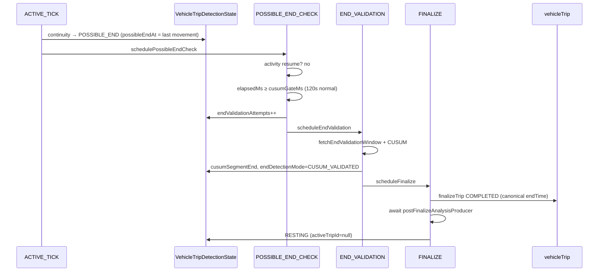
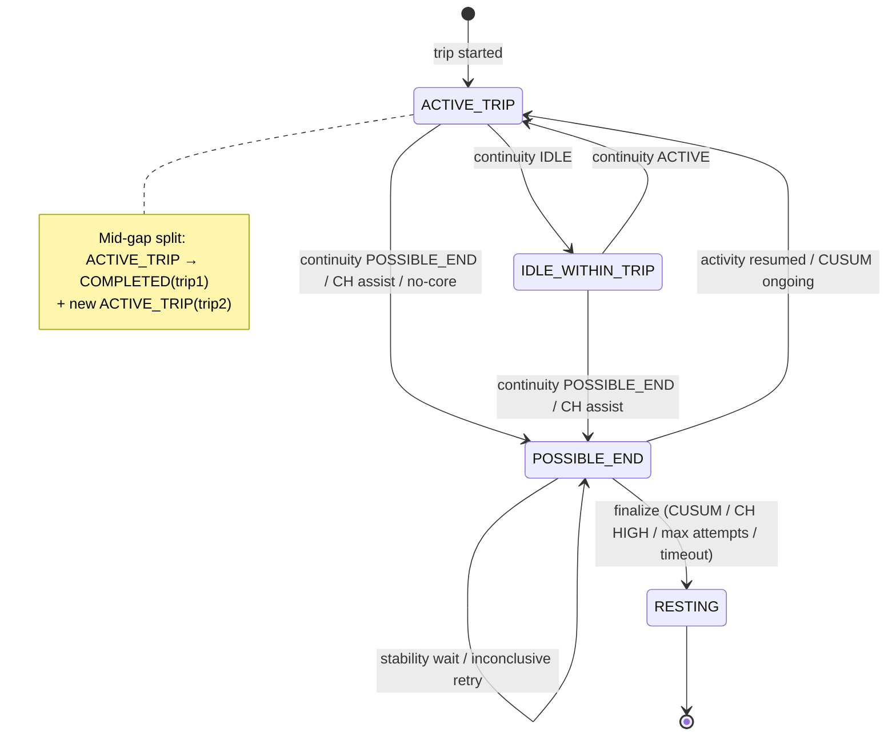

# P5 — Trip End Deep Dive Audit

**AUDIT ARTIFACT — NON-CANONICAL**

> Forensic, read-only reconstruction of SynqDrive Trip END behavior.  
> No application code, tests, schema, or deployment configuration was modified.  
> This artifact records reconstructed evidence only.  
> **Do not treat this document as canonical architecture.**

| Field | Value |
|-------|-------|
| Audit date | 2026-09-06 (P5A closure: 2026-09-06) |
| Original P5 commit | `a76d4fb2ea03143fb7f6aa2148be84483a7e7897` |
| Audited application SHA | `3d5040b67abfdc7e95c1b507e13f45d1bc65af11` |
| Audit artifact HEAD (docs chain) | `a4377f3a200ca45a97b7ce422caf8d92faddabbe` (P4A closure) |
| P4 closure commit | `a4377f3a200ca45a97b7ce422caf8d92faddabbe` |
| Prior audit chain | P2, P3, P4 (closed) |
| Production SHA status | **UNKNOWN** (SSH `Permission denied (publickey)` to `srv1374778.hstgr.cloud`) |

---

## P5.0 — Baseline / SHA Authority

### Git state at audit time

| Item | Value |
|------|-------|
| Branch | `main` |
| HEAD | `a4377f3a200ca45a97b7ce422caf8d92faddabbe` |
| Working tree | clean (pre-artifact) |

### Baseline drift vs `3d5040b67`

```bash
git diff 3d5040b67..HEAD -- backend/src/modules/vehicle-intelligence/trips/ \
  backend/src/workers/ backend/src/modules/dimo/ backend/src/modules/clickhouse/
# (no output — zero diff)
```

**Conclusion:** Commits after `3d5040b67` are audit documentation only (P2, P3, P4, P4A). **Trip FSM end application logic for this audit remains SHA `3d5040b67`.** Behavioral conclusions reference that SHA exclusively.

### Scope inspected

- `backend/src/modules/vehicle-intelligence/trips/` (orchestration, evidence, CUSUM, decision engine, detectors, policy, reconciliation hooks)
- `backend/src/workers/processors/trip-tracking.processor.ts`
- `backend/src/workers/schedulers/trip-tracking-recovery.scheduler.ts`
- `backend/src/modules/dimo/dimo-segments.service.ts` (`fetchEndValidationWindow`, core/route/perf fetch)
- `backend/src/modules/clickhouse/` (detector availability gates)
- Prisma models: `VehicleTrip`, `VehicleTripDetectionState`, `VehicleTripTrackingRun`, `VehicleTripWaypoint`
- Tests: `trip-detection.spec.ts`, reconciliation intra-gap specs, post-finalize producer spec

### Production evidence

Single SSH attempt (read-only): **failed** — `Permission denied (publickey)`.  
**PRODUCTION SHA STATUS: UNKNOWN.** No fresh production SQL aggregates collected. Prior P2/P3 production observations are **STALE** and not reused as live evidence.

---

## P5.1 — Complete Trip End Working Graph

### Primary runtime call graph (live FSM)

```
TripTrackingProcessor
  └─ processActiveTick          [ACTIVE_TRIP | IDLE_WITHIN_TRIP]
       ├─ segments.fetchRawTripCoreData / fetchRouteEnrichment / fetchPerformance
       ├─ [core.length === 0]
       │    ├─ tryApplyClickHouseAssistedEnd → POSSIBLE_END | scheduleFinalize (HIGH)
       │    └─ inactiveMs ≥ 120s → transitionState(POSSIBLE_END) → schedulePossibleEndCheck
       ├─ findMidTripGap → splitTripAtGap → FSM repoint → postFinalize (trip1) → scheduleActiveTick
       ├─ tryApplyClickHouseAssistedEnd (with core)
       ├─ vehicleTrip.update (provisional metrics, endTime=now)
       ├─ ContinuityAssessmentDetector → evaluateContinuity
       │    └─ [CH guard] ActivityWindowDetector → resolveClickHouseContinuityGuard
       └─ switch verdict → ACTIVE_TRIP | IDLE_WITHIN_TRIP | POSSIBLE_END → schedule*

  └─ processPossibleEndCheck     [POSSIBLE_END]
       ├─ checkDimoActivityResumed (90s window) → ACTIVE_TRIP (full metadata clear)
       ├─ elapsedMs ≥ 30min → scheduleFinalize (hard timeout)
       ├─ elapsedMs < cusumGateMs → reschedule PEC
       ├─ endValidationAttempts < 3 → increment attempts → scheduleEndValidation
       └─ else → scheduleFinalize (max attempts)

  └─ processEndValidation        [POSSIBLE_END]
       ├─ CH MEDIUM: cusumSegmentEnd set → skip CUSUM → scheduleFinalize
       ├─ fetchEndValidationWindow (15min back, 5min forward)
       ├─ ChangePointEndDetector → evaluateEndCandidate
       │    ├─ appears ongoing → ACTIVE_TRIP (partial metadata clear — see P5-F03)
       │    ├─ CUSUM confirmed → scheduleFinalize
       │    └─ inconclusive → schedulePossibleEndCheck (+60s)
       └─ catch → schedulePossibleEndCheck (+60s)

  └─ processFinalize             [POSSIBLE_END → RESTING]
       ├─ derive endTime priority chain
       ├─ checkTripQuality → discardTrip | finalizeTrip (COMPLETED)
       ├─ await postFinalizeAnalysisProducer (failure-contained)
       ├─ enrichment (fire-and-forget)
       ├─ transitionState(RESTING)  ← crash/throw window vs trip row
       └─ batteryLvRestSessionProducer (local try/catch)
```

**Important distinction:** `resultState` in `logTrackingRun` is a **tracking-log label** for the tick outcome. **Persisted FSM state** is `vehicleTripDetectionState.state` via `transitionState()`.

### Mermaid — sequence diagram (normal CUSUM path)



### Mermaid — state diagram (end lifecycle)



### Alternate branches (summary)

| Branch | Entry | Exit |
|--------|-------|------|
| CH HIGH end assist | `tryApplyClickHouseAssistedEnd` | `scheduleFinalize` (CUSUM skipped) |
| CH MEDIUM end assist | same | PEC (30s gate) → EV skip CUSUM → finalize |
| No-core inactivity | `corePoints.length === 0` | POSSIBLE_END after 120s anchor inactivity |
| Activity resumed | PEC or CH second check | ACTIVE_TRIP |
| CUSUM ongoing | EV | ACTIVE_TRIP (partial reset) |
| Max CUSUM attempts | PEC step 5 | finalize without CUSUM confirmation |
| Hard timeout | PEC `elapsedMs ≥ 30min` | finalize |
| Mid-gap split | `findMidTripGap` + driftOk | trip1 COMPLETED, FSM → trip2 ACTIVE_TRIP |
| Recovery | `TripTrackingRecoveryScheduler` @120s | re-enqueue PS/AT/PEC; stuck PE >30min → reconciliation |

---

## P5.2 — ACTIVE_TICK Data Acquisition

### Fetches per tick

| Stream | Window (`from`) | Overlap | Service |
|--------|-----------------|---------|---------|
| Core | `possibleStartAt - 60s` (first) or `lastCoreProcessedAt - 30s` | 30s | `fetchRawTripCoreData` |
| Route | same pattern | 15s | `fetchRouteEnrichment` |
| Performance | same pattern | 30s | `fetchPerformance` |
| VLS (telemetry) | `vehicleLatestState.findUnique` | n/a | Prisma |
| ClickHouse | via detector registry when enabled | policy windows | ActivityWindow, IgnitionSegment, MotionSegment |

**Time base:** worker `now`; points sorted by provider timestamp in segments service.

**Deduplication:** waypoints filtered with `lastRouteProcessedAt - 5000ms` cutoff before `createMany`.

**Empty core stream:** dedicated branch (CH assist, then 120s anchor inactivity, else keep open + reschedule AT).

**Provider failure:** ACTIVE_TICK outer catch logs, schedules AT (+30s), releases lock.

### Fields written

| Target | Fields | Notes |
|--------|--------|-------|
| `vehicleTrip` | `endTime=now`, coords from last route point, distance, duration, perf aggregates, `lastActivityAt=now` | **`tripStatus` unchanged — stays ONGOING** |
| `vehicleTripWaypoint` | route points after cutoff | deduped |
| `vehicleTripDetectionState` | continuity branch updates (see P5.3–P5.5) | via `transitionState` |

### Provisional `endTime = now` every ACTIVE_TICK — CONFIRMED

```typescript
// trip-detection-orchestration.service.ts ~1531
await this.prisma.vehicleTrip.update({
  where: { id: tripId },
  data: { endTime: now, /* tripStatus NOT set */ },
});
```

| Question | Answer |
|----------|--------|
| Why? | Rolling “latest observation” for live trip metrics/display while ONGOING |
| Provisional? | **Yes** — canonical boundary only at `finalizeTrip` |
| `tripStatus` | Remains **ONGOING** until finalize/discard/split |
| Consumers | **Evidence-backed:** rental/operator UI trip timeline and map overlays treat ONGOING `endTime` as rolling “latest observation” (`frontend/src/rental/components/trips/timeline.utils.ts`, `TripMapSummaryOverlay.tsx`). **Start-side merge does NOT read ONGOING rows** — merge uses `tripStatus: COMPLETED` only (`processPossibleStart` ~859–863). |
| Dual semantics? | **Yes** — ONGOING: latest tick time; COMPLETED: backdated boundary |
| Risk class | **P1 architectural** — UI/display boundary confusion; not start-merge coupling (**P5-F01**) |

---

## P5.3 — Continuity Assessment

**Pipeline:** `ContinuityAssessmentDetector` → `assessActiveContinuity(core, perfActive, profile)` + `evaluatePerformanceActivity(perf)` → `TripDecisionEngine.evaluateContinuity`.

**Evaluation windows:** core filtered to last **120s** (`TRIP_CONTINUITY_CORE_WINDOW_MS`); perf **90s**. Fallback: last 3 core points if time filter empty.

### Profile thresholds (speedActive / speedMotion km/h)

| Profile | speedActive | speedMotion | Ignition weight |
|---------|-------------|-------------|-----------------|
| ICE | 5 | 0.5 | 3 |
| EV | 3 | 0.5 | 1 |
| HYBRID | 4 | 0.5 | 2 |
| UNKNOWN | 5 | 0.5 | 2 |

### Signal matrix → verdict

| Signal condition | ICE | EV | HYBRID | Verdict |
|------------------|-----|-----|--------|---------|
| speed > threshold OR odo Δ ≥ 0.05 km | ✓ | ✓ | ✓ | **ACTIVE** |
| stopped + perf (RPM>600 / throttle>5 / load>10) | ✓ | rare | ✓ | **IDLE** |
| stopped + energy activity | ✓ | ✓ | ✓ | **IDLE** |
| stopped + (EV/HYB) + active frequency (≥2 ppm) | — | ✓ | ✓ | **IDLE** |
| stopped + all ignition off + no energy | ✓ | ✓ | ✓ | **POSSIBLE_END** (HIGH, `IGNITION_OFF_CONFIRMED`) |
| stopped + resting frequency (≤0.5 ppm) | ✓ | ✓ | ✓ | **POSSIBLE_END** (MEDIUM, `FREQUENCY_DROP`) |
| stopped + stale ignition ON + no perf + no energy | ✓ | ✓ | ✓ | **POSSIBLE_END** (MEDIUM, `COMPOSITE_INACTIVITY`) |
| ambiguous / empty core in assess* | ✓ | ✓ | ✓ | **POSSIBLE_END** (LOW) |

\*Empty core in **assessActiveContinuity** returns POSSIBLE_END; live path with empty fetch uses separate no-core branch first.

**CH continuity guard:** When DIMO says POSSIBLE_END (non-HIGH) and CH available, `ActivityWindowDetector` may force **ACTIVE** if `pointCount≥3 OR maxSpeed>5 OR odoΔ>0.05`.

### Mandatory questions

| # | Question | Answer |
|---|----------|--------|
| Can ignition ON prevent end? | **During IDLE/perf-active stops — yes (IDLE).** Stale ignition alone **cannot** block POSSIBLE_END (explicit guard step 7). |
| Stale ignition ON forever? | **No** — step 7 → POSSIBLE_END unless perf/energy/frequency says IDLE/ACTIVE. |
| Ignition OFF alone → POSSIBLE_END? | **No** — step 5 requires **allStopped AND allIgnitionOff AND noEnergyChange** together. Ignition OFF without full stop/no-energy is insufficient. |
| speed=0 alone → POSSIBLE_END? | **Not immediately** — needs frequency drop, stale ignition path, or ambiguous fallback; traffic stop with perf → IDLE. |
| EV without ignition? | **Yes** — motion/odo/frequency/energy paths; no ignition requirement for end. |

---

## P5.4 — IDLE_WITHIN_TRIP Semantics

| Aspect | Behavior |
|--------|----------|
| Entry | `evaluateContinuity` verdict **IDLE** (stopped + perf active, energy active, or EV/HYB active frequency) |
| Exit | Next tick: ACTIVE (motion) or POSSIBLE_END (inactivity escalation) |
| Cadence | `scheduleActiveTick` — same 30s default as ACTIVE_TRIP |
| `lastActivityAt` | **Set to worker `now`** on IDLE transition — CONFIRMED |
| `lastMeaningfulMovementAt` | **Not updated** on IDLE |
| Snapshot polling | Not directly tiered here; trip remains “open” |
| End candidate timing | IDLE suppresses POSSIBLE_END while perf/frequency indicates awake stop |

**CRITICAL — `lastActivityAt` semantics:** On IDLE, `lastActivityAt = now` is **worker evaluation time**, not physical motion time. Fallback chains (`possibleEndAt`, no-core anchor) may treat it as inactivity anchor → **boundary skew risk** (**P5-F02**).

---

## P5.5 — lastMeaningfulMovementAt Authority

### Writers — clock authority (VERIFIED P5A.4)

| Writer | Value written | Clock type |
|--------|---------------|------------|
| **A. ACTIVE continuity** | `lastMeaningfulMovementAt: now` when `hadMeaningfulMovement` | **Worker evaluation time** — `now` is tick clock, not provider point timestamp (~1755) |
| **B. PEC activity-resumed** | `lastMeaningfulMovementAt: now` | **Worker time** (~1904) |
| **C. CH end assist** | `lastMeaningfulMovementAt: detectedEndAt` | **CH segment event time** (~2851) |
| **D. CUSUM confirm/reopen** | optional `lastMeaningfulMovementAt: cusumLastMovementAt` | **Provider core timestamp** from CUSUM window (~2164, ~2215) |
| **E. Mid-gap split FSM repoint** | `lastMeaningfulMovementAt: midGap.secondStartAt` | **Gap-boundary event time** (~1323) |
| IDLE / POSSIBLE_END entry | no write | uses prior value |
| RESTING | cleared null | — |

**CONFIRMED — P5-F14:** One DB field mixes **worker clock** and **provider/CH event clock** depending on writer path, yet feeds canonical end priority (#2) and `tripEndLatencyFromMovement`.

### `hadMeaningfulMovement` vs odometer-only ACTIVE (P5A.5)

`assessActiveContinuity` returns **ACTIVE** when `act.hasOdometerProgress` even if `motionCount === 0`.
But `hadMeaningfulMovement` tests only:

```typescript
(summary.motionCount ?? 0) > 0
|| (summary.clickhouseGuard?.maxSpeedKmh ?? 0) > 5
|| (summary.clickhouseGuard?.odometerDeltaKm ?? 0) > 0.05
```

It does **not** read `summary.odometerDelta` from the continuity assessment.

**CONFIRMED — P5-F15:** DIMO odometer-only ACTIVE (speed unavailable/0, odometer progressing) does **not** advance `lastMeaningfulMovementAt`.

### Readers

`possibleEndAt` selection, no-core anchor, endTime priority #2, `tripEndLatencyFromMovement`, timeline logs.

### Timestamp authority matrix (Matrix D source)

| Field | Primary clock | Notes |
|-------|---------------|-------|
| `lastActivityAt` | Worker eval | IDLE/ACTIVE tick writes `now` |
| `lastMeaningfulMovementAt` | **Mixed** | Worker `now` (ACTIVE/resume) **or** provider/CH event time (CH/CUSUM/mid-gap) — **P5-F14** |
| `possibleEndAt` | Mixed boundary | Often movement anchor or CH `detectedEndAt` |
| `cusumValidatedAt` | Worker | validation recorded-at |
| `cusumSegmentStart/end` | Provider window / segment | CH end stored in `cusumSegmentEnd` |
| `trip.endTime` (ONGOING) | Worker `now` | provisional each tick |
| `trip.endTime` (COMPLETED) | Priority chain | canonical backdated boundary |
| worker `now` | Wall clock | gates, schedules, some anchor writes |

---

## P5.6 — No-Core-Data End Path

**Prerequisite:** `Promise.all` fetch **succeeds** with `corePoints.length === 0`. This is distinct from provider **exceptions** (see below).

When `corePoints.length === 0`:

1. **CH end assist** (`tryApplyClickHouseAssistedEnd`) — requires VLS inactive + CH segments.
2. Else compute `anchorAt = lastMeaningfulMovementAt ?? lastActivityAt ?? possibleStartAt ?? now`.
3. If `inactiveMs = now - anchorAt ≥ 120s` → **POSSIBLE_END** with `possibleEndAt = anchorAt`.
4. Else reschedule ACTIVE_TICK (trip stays open).

### Provider exception vs empty success (P5A.9)

| Case | Runtime behavior |
|------|------------------|
| **A — `fetchRawTripCoreData` throws** | Outer `ACTIVE_TICK` catch (~1825): log, `scheduleActiveTick(+30s)`, **no** no-core branch, **no** POSSIBLE_END |
| **B — fetch succeeds, `[]`** | Enters no-core branch above; may CH-assist or anchor-timeout → POSSIBLE_END |

An operational “outage” may present as either depending on DIMO client behavior; **code semantics differ**.

### Anchor staleness scenarios

| Scenario | Risk |
|----------|------|
| Normal park, DIMO sleeps (empty success) | Intended — fast finalize |
| Silent empty stream while moving | Anchors age → false POSSIBLE_END after 120s (**P5-F13**) |
| Fetch throw during outage | Trip stays open; AT retries — **no** immediate false-end |
| Repeated IDLE `lastActivityAt=now` | Extends anchor if `lastMeaningfulMovementAt` stale (**P5-F02**) |
| Odometer-only drive without movement anchor advance | Stale `lastMeaningfulMovementAt` (**P5-F15**) |

**Can empty-core path false-end while vehicle still moving?** **Yes (INFERRED)** when provider returns **successful empty array** and movement anchors are stale — not when fetch **throws**.

---

## P5.7 — ClickHouse End Assist

**Gate:** `hasClickHouseAnalyticsDetectors()` + `isCurrentTelemetryInactive(VLS)`.

### `isCurrentTelemetryInactive` — VERIFIED

```typescript
// trip-evidence.helpers.ts
if (speed > 0.5) return false;
if (engineLoad > 15) return false;
if (isIgnitionOn === true && speed > 0) return false;
return true;
```

**Semantics:** speed≤0.5, load≤15 → inactive. Ignition ON with speed=0 → **inactive** (allows end assist at idle).

**Protections:** post-stop CH activity window rejects resume; DIMO 90s resume check; ICE requires ignition segment; min stationary 45s; min trip 60s.

**Risk windows:** traffic idle (load≤15), remote HVAC (if load low), stale VLS ignition OFF while moving (assist blocked by inactive check failure — trip may stay open).

### Defaults — VERIFIED (constructor)

| Constant | Default |
|----------|---------|
| `TRIP_END_CH_ASSIST_MIN_STATIONARY_MS` | 45s |
| `TRIP_END_CH_ASSIST_MIN_TRIP_DURATION_MS` | 60s |
| `TRIP_END_CH_ASSIST_STABILITY_MS` | 30s |
| `TRIP_END_CH_ASSIST_HIGH_STATIONARY_MS` | 90s |

### Profile detectors

| Profile | Segment preference |
|---------|-------------------|
| ICE | IgnitionSegment required (`ice_requires_ignition_segment`) |
| EV / HYBRID / UNKNOWN | MotionSegment preferred (`preferMotion=true`) |

---

## P5.8 — CH HIGH vs MEDIUM Path

| Path | FSM writes | CUSUM | Finalize |
|------|------------|-------|----------|
| **HIGH** | POSSIBLE_END + `cusumSegmentEnd=detectedEndAt` | Skipped | Second resume check → `scheduleFinalize` direct (skips PEC 30s gate) |
| **MEDIUM** | same | Skipped at EV if `endDetectionMode=CLICKHOUSE_END_ASSIST && cusumSegmentEnd` | PEC → EV → finalize |

### Stationary gate math — VERIFIED (NOT additive)

From `resolveAnalyticsAssistedEndDecision`:

```typescript
stationaryMs = now - segmentEnd.endAt
if (stationaryMs < minStationaryAfterSegmentMs) reject   // 45s floor
HIGH if segment HIGH && stationaryMs >= highStationaryMs  // 90s total since segment end
MEDIUM if segment HIGH|MEDIUM && stationaryMs >= 45s
```

**45s and 90s are not summed.** HIGH requires **≥90s since CH segment end** (plus segment HIGH). MEDIUM requires **≥45s since segment end**.

### CH MEDIUM stability gate — often a no-op

MEDIUM path sets `possibleEndAt = detectedEndAt` (segment end). First PEC computes `elapsedMs = now - possibleEndAt`. Because MEDIUM already required `stationaryMs ≥ 45s`, **`elapsedMs` is typically already ≥45s**, always exceeding the 30s CH `cusumGateMs`. The 30s gate usually adds **no mandatory wall-clock delay** beyond queue/tick cadence.

### Recognition latency (wall-clock, conservative)

| Path | Minimum evidence elapsed before finalize scheduling | Typical extra delay |
|------|-----------------------------------------------------|---------------------|
| CH HIGH | ≥90s since segment end + VLS inactive gates | next FIN job + tick cadence |
| CH MEDIUM | ≥45s since segment end | PEC/EV queue delay only (30s gate usually already satisfied) |
| Normal PE + backdated anchor | anchor age ≥120s at first PEC | EV + queue |

**Do not treat “45s + 90s” as ~135s.** Unsupported “2–3 min” estimates removed.

**CH can finalize without CUSUM:** **Yes** — HIGH direct; MEDIUM skip at EV.

---

## P5.9 — POSSIBLE_END Temporal Model

**`possibleEndAt` meaning:** Candidate **physical end boundary**, not FSM state-entry timestamp.

Sources:
- Continuity path: `lastMeaningfulMovementAt ?? lastActivityAt ?? now` (anchors may be worker-time — **P5-F14**)
- No-core: anchor chain (same priority)
- CH assist: `detectedEndAt` (CH segment event time)

**`elapsedMs = now - possibleEndAt`** drives stability, CUSUM gate, hard timeout.

**Consequence:** If vehicle stopped 5 min ago but FSM just entered POSSIBLE_END, **first PEC can immediately pass** 120s gate (`elapsedMs` already ≥ 120s). This is **by design** (backdated candidate) but collapses “stability wait” wall-clock after late detection.

**State-entry vs boundary:** No separate persisted `possibleEndEnteredAt`; only `possibleEndAt` and logs (`TRIP_END_TIMELINE phase=possible_end_entered`).

---

## P5.10 — Activity-Resumed Cancellation

### Path A — `processPossibleEndCheck`

Clears: `possibleEndAt`, `endDetectionMode`, `endConfidence`, `endValidationAttempts`, all `cusum*`, sets movement anchors to `now`.

### Path B — CUSUM still ongoing (`processEndValidation`)

Clears: `possibleEndAt`, `cusum*`, `endValidationAttempts` — **does NOT clear `endDetectionMode` or `endConfidence`** (~2157–2166).

**CONFIRMED asymmetry — P5-F03:** Stale end metadata can survive CUSUM reopen and appear in a later end cycle / `rawDetectionMeta`.

**Resume evidence:** `hasActivityResumed` — speed > `speedMotionKmh` (0.5); **ignition alone insufficient** (tested in spec).

---

## P5.11 — Stability / Inactivity Gate

### Defaults — VERIFIED

| Constant | Value |
|----------|-------|
| `TRIP_END_STABILITY_WINDOW_MS` | 90s |
| `TRIP_END_MIN_INACTIVITY_BEFORE_CUSUM_MS` | 120s |

```typescript
cusumGateMs = endDetectionMode === CLICKHOUSE_END_ASSIST
  ? TRIP_END_CH_ASSIST_STABILITY_MS   // 30s
  : max(90s, 120s)                    // 120s
```

### Timing examples

| Case | possibleEndAt age at first PEC | First EV eligible |
|------|-------------------------------|-------------------|
| Stop 3 min ago, just entered PE | 180s | Immediate (180 ≥ 120) |
| Stop 60s ago | 60s | Wait 60s more |
| CH MEDIUM | `possibleEndAt` already ≥45s old at entry | Usually immediate (45 >> 30) |

---

## P5.12 — CUSUM / Change-Point Validation

**Fetch:** `fetchEndValidationWindow(centre=possibleEndAt, lookback=15min, lookahead=5min)` — VERIFIED defaults.

**Algorithm:** `detectTripEndChangePoint` — binary stopped (speed≤2 km/h), upper-CUSUM, threshold H=3, min 4 points.

**Physical meaning:** Detects sustained transition from moving to stopped in speed time-series (not ignition).

**Outcomes:**

| Result | Action |
|--------|--------|
| `appearsOngoing` (last 5 mostly moving) | Reopen ACTIVE_TRIP |
| `changePointDetected` | `detectedEndAt` = change point; finalize |
| inconclusive | Retry PEC (+60s) |
| insufficient_data (<4 pts) | inconclusive |

---

## P5.13 — CUSUM Attempts / Retry / Hard Timeout

### Defaults — VERIFIED

| Constant | Value |
|----------|-------|
| `TRIP_END_VALIDATION_RETRY_MS` | 60s |
| `TRIP_END_VALIDATION_MAX_ATTEMPTS` | 3 |
| `TRIP_END_TIMEOUT_MS` | 30 min |

### Attempt accounting

| Event | Increments `endValidationAttempts`? |
|-------|-------------------------------------|
| PEC schedules EV | **Yes — before EV runs** (step 4) |
| EV inconclusive | No (same attempt count) |
| EV error / catch | No |
| EV success | No further increment |

**Max-attempt finalize:** After 3 scheduled EV cycles, `scheduleFinalize` **without** CUSUM confirmation — **CONFIRMED**.

**Timeline from last movement (normal path, INFERRED):**  
120s gate + ~3×(EV duration + 60s retry) ≈ **4–8 min** typical vs **30 min** hard timeout → max-attempt usually fires **first**; hard timeout is secondary safety net.

**Provider/EV exceptions:** PEC fetch failure for resume → keep waiting (no finalize). EV catch → reschedule PEC — **does not consume extra attempt counter** but burns wall-clock.

---

## P5.14 — End Boundary Priority

### Canonical `endTime` — VERIFIED

```typescript
endTime =
  cusumSegmentEnd ??
  lastMeaningfulMovementAt ??
  lastWaypoint?.recordedAt ??
  possibleEndAt ??
  new Date();
```

**Note:** `cusumSegmentEnd` holds **real CUSUM** and **CH segment end** (same field). Priority #2 `lastMeaningfulMovementAt` may be worker `now`, CH event time, or CUSUM provider timestamp depending on path (**P5-F14**). Odometer-only ACTIVE may leave it stale (**P5-F15**).

**Coordinates:** `processFinalize` does **not** pass `endLatitude`/`endLongitude` to `finalizeTrip`. Provisional coords from last ACTIVE_TICK route point may remain while `endTime` is backdated — **P5-F12**.

---

## P5.15 — Mid-Trip Gap Split

**Detection:** `findMidTripGap` — gap ≥ **180s**, before stopped (speed≤5), after moving; synthetic anchor at `lastMeaningfulMovementAt ?? lastActivityAt` with speed=0.

**Drift gate:** `drift == null OR drift ≤ 200m` — **`null` allows split** — CONFIRMED (comment: “allow split”).

**Minimum pre-trip duration:** 60s.

**False-split risk:** Telemetry outage with no waypoints → drift null → split allowed while vehicle may still be moving (**P5-F09**).

---

## P5.16 — Mid-Gap Split Failure Window — CONFIRMED (reframed P5A.3)

Post-commit order inside `try` (~1262–1394):

1. Optional seg1 waypoint `createMany` (pre-split trip id)
2. **`splitTripAtGap` transaction** — trip1 **COMPLETED**, trip2 **ONGOING**, waypoint migration
3. **`transitionState`** — FSM `activeTripId = secondTripId`
4. **`await postFinalizeAnalysisProducer`** (trip1) — **failure-contained; does not throw on normal downstream errors** (P5A.1)
5. enrichment (fire-and-forget, caught)
6. **`await scheduleActiveTick`**
7. metrics / `logTrackingRun` / `return`

Catch (~1395): log “split failed” → **fall through**; local `tripId` variable **unchanged** (still pre-split id).

### Scenario matrix

| Scenario | trip1 | trip2 | FSM | Fallthrough `tripId` | Risk |
|----------|-------|-------|-----|----------------------|------|
| **A** split OK → `transitionState` throws | COMPLETED | ONGOING | may partial | stale trip1 | FSM/trip divergence |
| **B** FSM OK → producer returns `queueErrors` | COMPLETED | ONGOING | trip2 ACTIVE | stale trip1 | **No** — producer does not throw; continues to AT |
| **C** FSM OK → `scheduleActiveTick` throws | COMPLETED | ONGOING | trip2 ACTIVE | stale trip1 | Fallthrough writes to trip1 |
| **D** unexpected throw after FSM repoint | COMPLETED | ONGOING | trip2 ACTIVE | stale trip1 | Waypoints/metrics on completed trip1 |

**Normal postFinalize analysis/queue failures are NOT the typical trigger.** Real triggers: **DB/transition errors, schedule failures, unexpected exceptions** after split+FSM repoint (**P5-F04**).

---

## P5.17 — Finalize / Quality / Discard

**`checkTripQuality(durationMs, distanceKm, waypointCount, ...)`**

| Rule | Discard? |
|------|----------|
| duration < 60s AND (distance null OR < 0.1 km) | yes (`too_short_no_distance`) |
| distance < 0.1 km AND waypointCount < 2 | yes (`no_meaningful_movement`) |
| gap < 5 min from previous | merge hint (not used in shown finalize path) |

**waypointCount proxy:** Substitutes for `maxConsecutiveActive` because trip already passed start pipeline; 0–1 waypoints flagged as suspect.

### Representative cases

| Case | Outcome |
|------|---------|
| 30s / 50m / few waypoints | Likely **DISCARD** |
| 50s / 150m / ≥2 waypoints | **COMPLETED** |
| 5min / no odometer / no GPS / ≥2 waypoints | **COMPLETED** (if finalized) |
| 5min / 50m / 1 waypoint | **DISCARD** |
| Legitimate + route outage | May pass if waypoints≥2 from earlier ticks |
| EV short urban reposition | Risk discard if distance<100m and waypoints<2 |

---

## P5.18 — Finalization Mutation Order / Atomicity

| Step | Operation | Atomicity |
|------|-----------|-----------|
| 1 | Read trip + waypoints | read |
| 2 | `checkTripQuality` | pure |
| 3 | `finalizeTrip` / `discardTrip` | single UPDATE — **durable** |
| 4 | Prometheus metrics | side effect |
| 5 | `await postFinalizeAnalysisProducer` | **Failure-contained** — returns `null` / `TripAnalysisInitResult` with `queueErrors`; catch converts init exceptions to result object; **does not reject on normal downstream failures** |
| 6 | enrichment enqueue | fire-and-forget |
| 7 | `transitionState(RESTING)` | single UPDATE — **can throw** (DB) |
| 8 | Battery LV rest | awaited, local catch |

**No spanning transaction** across trip row + FSM + queue.

**Remaining non-atomic window:** after `finalizeTrip` commits **COMPLETED**, a **process crash**, **`transitionState` DB failure**, or other **unexpected uncaught exception** before RESTING can leave FSM **POSSIBLE_END** with `activeTripId` set (**P5-F05**). This is distinct from normal analysis/queue degradation.

---

## P5.19 — Post-Finalize Producer Coupling (corrected P5A.1 / P5A.2)

`await postFinalizeAnalysisProducer.produceAfterPersistedCompletion(...)` runs **before** `transitionState(RESTING)`.

### Failure containment — VERIFIED

| Failure mode | Propagates throw? | Evidence |
|--------------|-------------------|----------|
| Event association reconcile failure | **No** | `reconcileEventAssociations` try/catch (~94–104) |
| Missing `organizationId` | **No** | returns `null` (~36–40) |
| `initializeForCompletedTrip` exception | **No** | producer catch → `{ queueErrors: [message] }` (~74–85) |
| `queueErrors` from stage enqueue | **No** | logged, returned in result (~51–56) |
| Rental recompute enqueue failure | **No** | fire-and-forget `.catch` (~58–71) |
| Test contract | **No** | `"returns queue errors without throwing so finalize path is not poisoned"` |

**Normal downstream analysis failure does NOT block RESTING.**

### Idempotency — VERIFIED

`DrivingAnalysisInitService.initializeForCompletedTrip` documents idempotency via `DrivingAnalysisRunService.resolveOrBeginRun` fingerprint + job idempotency keys (`buildInitJobIdempotencyKey`). Repeated `produceAfterPersistedCompletion` for the same trip returns **deduplicated runs** (`runDeduplicated: true`) rather than duplicate durable work.

Repeated **FINALIZE** may re-invoke producer/finalizeTrip, but durable analysis init is **designed idempotent** — distinguish **duplicate invocation** from **duplicate durable jobs**.

### Real divergence case (P5-F05)

If **`transitionState(RESTING)` throws** or the worker **crashes** after `finalizeTrip` but before RESTING commit:
- `vehicleTrip.tripStatus = COMPLETED`
- FSM remains **POSSIBLE_END** + `activeTripId`

Recovery `@120s` can re-enqueue FINALIZE; `finalizeTrip` re-applies COMPLETED; producer re-runs idempotently.

---

## P5.20 — Battery LV Rest Session Order

Runs **after** RESTING transition, wrapped in try/catch. Battery failure **does not** block FSM liveness — contrasts with P4-F12 start-proxy ordering.

---

## P5.21 — Timeout RESTING Reason / P4-F07

Hard timeout and max-attempt paths call `processFinalize` with `restingReason = 'complete'` (default). **`lastRestingReason: 'timeout'` never written** on end path — cross-ref **P4-F07 / P5-F08**. Forced-timeout trips get **120s** complete cooldown, not 60s timeout cooldown.

---

## P5.22 — Recovery / Self-Healing

**TripTrackingRecoveryScheduler** (120s):
- Re-enqueues PS / AT / PEC for stale states with expired lock
- POSSIBLE_END > 30 min → `reconciliation.onStuckTrip`
- ACTIVE_TRIP > 4 h → `onAnomalyDetected`

| Failure | Queue recovery | FSM recovery | Trip row repair |
|---------|----------------|--------------|-----------------|
| Lost PEC job | ✓ re-enqueue | — | — |
| Lost FINALIZE | ✓ (via stale PE) | partial | — |
| Crash/throw before RESTING after COMPLETED | ✓ re-enqueue FINALIZE | stuck until RESTING commit | COMPLETED orphan (**P5-F05**) |
| Normal postFinalize queueErrors | — | RESTING reached normally | analysis reconciliation |
| FSM/trip mismatch after mid-gap | ✗ autonomous | ✗ | reconciliation only |

---

## P5.23 — Observability / Metric Semantics (corrected P5A.8)

| Metric / log | Formula (verified) | What it measures |
|--------------|-------------------|------------------|
| `synqdrive_trip_finalize_latency_seconds` | `(endTime - trip.startTime) / 1000` | **Trip duration** — help text: “Time from trip start to finalization” (**P5-F06**) |
| `synqdrive_trip_end_latency_from_movement_seconds` | `(endTime - movementAnchor) / 1000` where anchor = `lastMeaningfulMovementAt ?? possibleEndAt` | **Boundary delta**, not recognition latency. When `endTime` resolves to same anchor (priority #1–2 match), value is **≈0 structurally** — does not capture worker finalize wall-clock (**P5-F07**) |
| `TRIP_END_TIMELINE finalizedAt=` | passed `endTime` (canonical boundary) | **Not** worker completion timestamp |

**No persisted metric uses `Date.now() - canonicalEndTime` for recognition/finalization wall-clock latency.**

Partial signals: `endValidationStartedAt` in `lastEvidenceSummary` JSON; timeline `latencyFromMovementSec` (boundary-based when anchors align).

**SynqDrive currently has NO direct metric for actual Trip End recognition / finalization wall-clock latency.**

---

## P5.24 — False Premature End Matrix (excerpt)

See **Matrix K** for full table. Highlights:

- Traffic light with perf → **IDLE** (protected)
- Stale ignition, no perf → **POSSIBLE_END** (by design)
- CH idle at traffic (load≤15) → assist may arm (risk)
- No-core outage while moving → **POSSIBLE_END** after 120s anchor (risk)
- Mid-gap drift null → **split** (risk)

---

## P5.25 — False Delayed End Matrix (excerpt)

- EV frequency IDLE path delays POSSIBLE_END
- CH unavailable → DIMO-only slower
- CUSUM inconclusive retries (+60s × attempts)
- END_VALIDATION errors → retry loop
- Crash/`transitionState` throw before RESTING → FSM stuck (**P5-F05**) — **not** normal analysis queue failure
- Hard timeout 30 min last resort

---

## P5.26 — Profile Comparison

| Dimension | ICE | EV | HYBRID | UNKNOWN |
|-----------|-----|-----|--------|---------|
| End sensitivity | Ignition-off composite HIGH (stop+off+no energy) | Motion/frequency | Both | Conservative UNKNOWN thresholds |
| Largest FP risk | CH idle assist | Frequency IDLE delay → late end; mid-gap | Mixed | CH motion path |
| Largest FN risk | Stale ignition (mitigated) | Short stop frequency | Perf idle stops | Ambiguous fallback |
| CH segment | Ignition required | Motion preferred | Motion preferred | Motion preferred |

---

## P5.27 — Test Coverage

| Area | Coverage | Location |
|------|----------|----------|
| Continuity IDLE/PE | **Covered** | `trip-detection.spec.ts` |
| CH end assist | **Covered** | same |
| isCurrentTelemetryInactive | **Covered** | same |
| hasActivityResumed | **Covered** | same |
| CUSUM | **Covered** | same |
| checkTripQuality | **Covered** | same |
| CH continuity guard | **Covered** | same |
| postFinalize producer failure | **Partial** | producer.spec — queueErrors no throw |
| Analysis init idempotency | **Partial** | driving-analysis-run.repository.spec |
| Mid-gap split live FSM failure fallthrough | **Missing** | — |
| CUSUM reopen metadata leak | **Missing** | — |
| Mixed-clock / odometer anchor | **Missing** | — |
| Mid-gap reconciliation | **Partial** | `intra-trip-gap-split-repair.*.spec.ts` |
| postFinalize producer idempotency | **Partial** | `trip-post-finalize-analysis.producer.spec.ts` |

---

## P5.28 — Production Read-Only Evidence

**Status:** Not collected — SSH failed. All production claims in this document are **INFERRED** from code unless labeled CONFIRMED from unit tests.

---

## P5.29 — Quality Verdict

| Dimension | Rating | Evidence |
|-----------|--------|----------|
| ACTIVE continuity sensitivity | ACCEPTABLE | Profile thresholds + CH guard |
| ACTIVE continuity specificity | ACCEPTABLE | perf/energy IDLE paths |
| IDLE correctness | ACCEPTABLE | ICE traffic stops |
| POSSIBLE_END sensitivity | STRONG | Multiple paths including no-core |
| POSSIBLE_END specificity | WEAK | Ambiguous fallback, no-core outage |
| ICE robustness | ACCEPTABLE | Stale ignition fix present |
| EV robustness | ACCEPTABLE | Frequency IDLE; no ignition req |
| HYBRID robustness | ACCEPTABLE | Dual signals |
| Sparse telemetry | WEAK | Fallback to last 3 points |
| No-core robustness | WEAK | Empty success 120s anchor (**P5-F13**); throw path safe |
| CH assist robustness | ACCEPTABLE | Gated; ICE ignition segment |
| CUSUM robustness | ACCEPTABLE | Ongoing detection; sparse fails |
| End boundary accuracy | WEAK | Mixed-clock `lastMeaningfulMovementAt` (**P5-F14**); odometer gap (**P5-F15**); provisional coords |
| Recognition latency | CRITICAL | **No direct recognition metric**; existing histograms measure duration/boundary delta |
| Mid-gap split safety | WEAK | drift null (**P5-F09**) + post-commit fallthrough (**P5-F04**) |
| Crash safety | WEAK | COMPLETED→RESTING crash window (**P5-F05**); not normal analysis failure |
| Idempotency | ACCEPTABLE | Analysis init dedup by fingerprint + job keys |
| Recovery robustness | ACCEPTABLE | 120s scheduler + reconciliation |
| Observability | CRITICAL | Mislabeled metrics + missing recognition latency (**P5-F06/F07**) |
| Finalization atomicity | WEAK | Normal path reaches RESTING despite analysis queue errors; crash/DB throw window remains |

---

## P5.30 — Architectural Findings

| ID | Sev | Title | Evidence |
|----|-----|-------|----------|
| **P5-F01** | P1 | Provisional `endTime=now` on every ACTIVE_TICK while ONGOING | `processActiveTick` ~1531; UI timeline consumers |
| **P5-F02** | P1 | IDLE writes `lastActivityAt=now` — worker time used as physical fallback | ~1763–1767 |
| **P5-F03** | P1 | CUSUM reopen leaves stale `endDetectionMode`/`endConfidence` | EV ~2157 vs PEC ~1895 |
| **P5-F04** | P1 | Mid-gap post-commit fallthrough uses stale local `tripId` after split+FSM repoint | try/catch ~1395–1400; triggers: transition/schedule/unexpected throw — **not** normal producer queueErrors |
| **P5-F05** | P1 | COMPLETED→RESTING non-atomic crash/DB window (not analysis failure) | `finalizeTrip` then `transitionState(RESTING)` ~2378–2501; producer failure-contained |
| **P5-F06** | P2 | `tripFinalizeLatency` observes trip duration not recognition latency | ~2427–2429; metric help text |
| **P5-F07** | P2 | `tripEndLatencyFromMovement` measures boundary delta; ≈0 when endTime==anchor; no recognition metric exists | ~2432–2443 |
| **P5-F08** | P2 | Timeout finalize sets `restingReason=complete` — dead timeout cooldown | ~2344; P4-F07 |
| **P5-F09** | P2 | Mid-gap allows split when GPS drift unknown (`drift==null`) | ~1258–1259, ~3020–3022 |
| **P5-F10** | P2 | Max CUSUM attempts finalize without CUSUM confirmation | PEC step 5 ~2014–2023 |
| **P5-F11** | P2 | Attempt counter incremented before EV success | PEC step 4 ~1981–1982 |
| **P5-F12** | P3 | finalizeTrip omits end coords — backdated time vs provisional coords | finalize ~2378 |
| **P5-F13** | P3 | Successful empty-core stream (not fetch throw) can false-end via 120s anchor | ~1109–1206; distinct from exception path |
| **P5-F14** | P1 | Mixed-clock `lastMeaningfulMovementAt` used as canonical end-boundary authority | writers A–E (P5.5) |
| **P5-F15** | P2 | DIMO odometer-only ACTIVE does not advance `lastMeaningfulMovementAt` | `hadMeaningfulMovement` ~1740–1744 vs assessActiveContinuity odometer ACTIVE |

---

# Mandatory Matrices

## Matrix A — Trip End End-to-End Decision Matrix

| Phase | Input signals | Decision | Next job |
|-------|---------------|----------|----------|
| ACTIVE_TICK | core/route/perf/VLS/CH | continuity verdict | AT / PEC |
| ACTIVE_TICK | core=0, inactive≥120s | POSSIBLE_END | PEC |
| ACTIVE_TICK | CH assist confirmed | POSSIBLE_END or finalize | PEC / FIN |
| ACTIVE_TICK | mid-gap+driftOk | split | AT (trip2) |
| PEC | resume | ACTIVE_TRIP | AT |
| PEC | timeout 30m | finalize | FIN |
| PEC | gate pass, attempts<3 | EV | EV |
| PEC | attempts≥3 | finalize | FIN |
| EV | CUSUM ok | finalize | FIN |
| EV | ongoing | ACTIVE_TRIP | AT |
| EV | inconclusive | PEC +60s | PEC |
| FIN | quality ok | COMPLETED+RESTING | — |

## Matrix B — FSM State Transition / Trigger Matrix

| From | To | Trigger |
|------|-----|---------|
| ACTIVE_TRIP | IDLE_WITHIN_TRIP | continuity IDLE |
| IDLE_WITHIN_TRIP | ACTIVE_TRIP | continuity ACTIVE / resume |
| ACTIVE/IDLE | POSSIBLE_END | continuity PE / CH / no-core |
| POSSIBLE_END | ACTIVE_TRIP | resume / CUSUM ongoing |
| POSSIBLE_END | POSSIBLE_END | stability wait / retry |
| POSSIBLE_END | RESTING | finalize success |
| RESTING | POSSIBLE_START | snapshot cooldown elapsed |

## Matrix C — Profile × End-Signal Authority Matrix

| Signal | ICE | EV | HYBRID | UNKNOWN |
|--------|-----|-----|--------|---------|
| Ignition off + stopped + no energy | HIGH PE (step 5) | n/a alone | same | same |
| Speed motion | ACTIVE | ACTIVE | ACTIVE | ACTIVE |
| Odometer Δ | ACTIVE | ACTIVE | ACTIVE | ACTIVE |
| Perf RPM/load | IDLE | n/a typical | IDLE | IDLE |
| Energy Δ | IDLE | IDLE | IDLE | IDLE |
| Frequency | PE/MEDIUM | IDLE/PE | both | PE |
| CH ignition seg | end assist req | — | — | — |
| CH motion seg | fallback | primary | primary | primary |

## Matrix D — End Timestamp / Clock Authority Matrix

| Field | Clock authority | Mixed? |
|-------|-----------------|--------|
| `lastActivityAt` | Worker eval `now` | No |
| `lastMeaningfulMovementAt` | Worker `now` **or** provider/CH event time | **Yes — P5-F14** |
| `possibleEndAt` | Movement anchor / CH segment end / worker fallback | Partial |
| `cusumSegmentEnd` | CUSUM change-point or CH segment (provider/CH) | — |
| `trip.endTime` ONGOING | Worker `now` each tick | Provisional |
| `trip.endTime` COMPLETED | Priority chain (often event-time anchors) | — |
| Worker finalize wall-clock | **Not persisted as metric** | Observability gap |

## Matrix E — End Recognition Latency Matrix

| Path | Evidence elapsed before scheduling | Typical queue/tick delay | Boundary vs recognition |
|------|-----------------------------------|--------------------------|-------------------------|
| Normal PE (backdated anchor) | anchor age ≥120s at first PEC | EV + 60s retries ×3 | Boundary backdated; **recognition wall-clock unmeasured** |
| CH HIGH | ≥90s since segment end | FIN job | Same |
| CH MEDIUM | ≥45s since segment end | PEC/EV (30s gate usually already met) | Same |
| Empty-core anchor | anchor age ≥120s | +gate + EV | Anchor may be worker-time stale (**P5-F14/F15**) |
| Max attempts | same as PE | ~3–6 min retries (INFERRED) | Forced finalize |
| Hard timeout | up to 30 min from `possibleEndAt` | immediate FIN | High boundary error risk |

**No metric captures `Date.now() - physicalStop` at finalize commit.**

## Matrix F — ClickHouse End-Assist Matrix

| Gate | Threshold | Fail result |
|------|-----------|-------------|
| VLS inactive | speed≤0.5, load≤15 | skip assist |
| Trip duration | ≥60s | inconclusive |
| Segment end | ICE ignition / EV motion | inconclusive |
| Post-segment stationary | ≥45s (reject if less) | inconclusive |
| HIGH confidence | seg HIGH + stationary≥**90s total** since segment end | direct finalize |
| Post-stop activity | speed/odo/points | inconclusive |
| DIMO resume 90s | motion | cancel |

## Matrix G — CUSUM / Attempts / Timeout Matrix

| Parameter | Value | Effect |
|-----------|-------|--------|
| Lookback | 15 min | EV window |
| Lookahead | 5 min | EV window |
| Max attempts | 3 | then force finalize |
| Retry delay | 60s | inconclusive |
| Hard timeout | 30 min | force finalize |
| Attempt increment | at PEC schedule EV | pre-success |

## Matrix H — Canonical End-Boundary Priority Matrix

| Priority | Source | Used when |
|----------|--------|-----------|
| 1 | cusumSegmentEnd | CUSUM or CH |
| 2 | lastMeaningfulMovementAt | fallback |
| 3 | lastWaypoint.recordedAt | GPS |
| 4 | possibleEndAt | candidate |
| 5 | now | absolute fallback |

## Matrix I — Crash / Failure / Recovery Matrix

| Failure point | Trip row | FSM | Self-heal |
|---------------|----------|-----|-----------|
| Crash/DB throw after `finalizeTrip`, before RESTING | COMPLETED | POSSIBLE_END | recovery re-FIN (**P5-F05**) |
| Normal postFinalize queueErrors | COMPLETED | RESTING (normal path) | analysis reconciliation |
| Mid-gap throw after split+FSM repoint | trip1 COMPLETED, trip2 ONGOING | ACTIVE trip2 | partial — fallthrough risk (**P5-F04**) |
| Fetch throw in AT | ONGOING | unchanged | AT retry — no false no-core end |
| Empty-core false end | ONGOING→PE | POSSIBLE_END | resume/CUSUM |
| Redis restart | — | — | recovery @120s |

## Matrix J — Finalize Downstream Coupling Matrix

| Consumer | Awaited? | Normal failure blocks RESTING? |
|----------|----------|----------------------------------|
| finalizeTrip | yes | yes (if throws before COMPLETED) |
| postFinalizeAnalysisProducer | yes | **No** — failure-contained; returns queueErrors |
| behavior enrichment | no | no |
| transitionState(RESTING) | yes | **Yes if throws** — **P5-F05** crash window |
| Battery LV rest | yes (caught) | no |

## Matrix K — False Premature / False Delayed End Matrix

| Scenario | Premature end? | Delayed end? | Protection |
|----------|----------------|--------------|------------|
| Traffic light + perf | No (IDLE) | — | perf IDLE |
| Queue stop | Possible PE | — | resume |
| Remote HVAC low load | CH assist risk | — | activity window |
| Provider fetch throw | No | — | AT retry |
| Empty core success while moving | **Yes** | — | weak (**P5-F13**) |
| postFinalize queue outage | No | — | RESTING reached; analysis self-heals |
| Crash before RESTING | — | Yes (FSM stuck) | recovery re-FIN (**P5-F05**) |

## Matrix L — Test / Observability / Open Findings Matrix

| Topic | Tests | Metrics | Open finding |
|-------|-------|---------|--------------|
| Continuity | ✓ | tripEvidencePaths | — |
| CH end | ✓ | tripEvidencePaths | — |
| CUSUM | ✓ | tripEndLatencyFromMovement | P5-F11 |
| Finalize coupling | partial (producer spec) | no recognition metric | P5-F05 (crash only) |
| Mid-gap live | ✗ | mid_gap_split counter | P5-F04,F09 |
| Metadata leak | ✗ | — | P5-F03 |
| Mixed-clock anchor | ✗ | tripEndLatencyFromMovement ≈0 case | P5-F14,F15 |
| Cooldown timeout | ✗ | — | P5-F08 |

---

# Mandatory Final Questions (1–24)

1. **Earliest physical end signal:** Provider-timestamp motion stop in continuity/CH segment evidence. **Earliest persisted anchor** may still be worker `now` on ACTIVE tick (**P5-F14**) or stale if odometer-only (**P5-F15**).

2. **ACTIVE_TRIP → IDLE_WITHIN_TRIP:** `evaluateContinuity` verdict **IDLE** (stopped + perf active, energy active, or EV/HYB active frequency).

3. **→ POSSIBLE_END:** Continuity **POSSIBLE_END**; or CH assist; or no-core empty success with inactive≥120s; not fetch throw path.

4. **DIMO core disappears (empty success):** CH assist attempt → else anchor inactivity POSSIBLE_END after 120s → else keep open. **Fetch throw:** retry AT, no immediate end.

5. **Ignition OFF alone end?** **No.** Requires **allStopped + allIgnitionOff + noEnergyChange** (step 5). Not ignition OFF in isolation.

6. **speed=0 alone end?** **Not alone** — needs frequency drop, stale ignition path, ambiguous fallback, or timed no-core path.

7. **Stale ignition ON forever?** **No** — explicit POSSIBLE_END path (step 7).

8. **EV end without ignition?** **Yes** — motion/frequency/CH motion segments.

9. **CH initiate POSSIBLE_END without DIMO core?** **Yes** — no-core branch calls `tryApplyClickHouseAssistedEnd` first.

10. **CH finalize without CUSUM?** **Yes** — HIGH direct; MEDIUM skip at EV.

11. **CUSUM mandatory for normal completion?** **No** — CH paths and max-attempt/timeout bypass.

12. **Fastest valid recognition:** Backdated PE where `possibleEndAt` age already ≥120s at first PEC (immediate EV scheduling), or CH HIGH after ≥90s since segment end + gates + queue delay. **Not additive 45+90s.**

13. **Slowest normal live path:** CUSUM inconclusive ×3 with 60s retries (~minutes, INFERRED) before max-attempt finalize; hard timeout **30 min** from `possibleEndAt` as last resort.

14. **Max attempts before 30 min timeout?** **Yes** — max-attempt path typically fires well before 30 min.

15. **Unsuccessful EV consume attempt budget?** **Indirectly** — PEC increments before EV; inconclusive reuses same count until max.

16. **Accurate boundary with late finalization?** **Partially** — `endTime` backdated via priority chain, but anchors may be worker-time or stale (**P5-F14/F15**). Late finalize wall-clock does not change committed boundary.

17. **Wrong boundary from clock fields?** **Yes** — `lastActivityAt` and ACTIVE-path `lastMeaningfulMovementAt` use worker `now`; mixed with event-time writers (**P5-F02/F14**).

18. **Mid-gap split outage without GPS?** **Yes** — `drift==null` allows split (**P5-F09**).

19. **COMPLETED + FSM POSSIBLE_END?** **Yes** — if worker **crashes** or **`transitionState(RESTING)` throws** after `finalizeTrip` (**P5-F05**). **Not** from normal postFinalize queue/analysis degradation.

20. **Analysis failure prevent RESTING?** **No** — producer is failure-contained; RESTING still reached. **Crash/DB throw before RESTING** can leave divergence (**P5-F05**).

21. **Battery LV failure prevent completion?** **No** — after RESTING, caught.

22. **Stale endDetectionMode after CUSUM reopen?** **Yes** — **P5-F03**.

23. **End-latency metrics = recognition or duration?** `tripFinalizeLatency` = **trip duration**. `tripEndLatencyFromMovement` = **boundary delta** (often ≈0). **No direct recognition wall-clock metric.**

24. **Single highest-priority weakness:** **Mixed-clock `lastMeaningfulMovementAt` as canonical boundary authority (P5-F14)**, compounded by odometer-only gap (**P5-F15**) and mid-gap post-commit fallthrough (**P5-F04**).

---

## P5.31 — Audit Closure / Correction Pass

| Item | Value |
|------|-------|
| Closure date | 2026-09-06 |
| Audited application SHA | `3d5040b67abfdc7e95c1b507e13f45d1bc65af11` |
| Original P5 commit | `a76d4fb2ea03143fb7f6aa2148be84483a7e7897` |
| Production SHA status | **UNKNOWN** (SSH failed) |

### Corrections verified (11)

1. **P5-F05 reframed** — `TripPostFinalizeAnalysisProducer` failure-contained; normal analysis/queue errors do **not** block RESTING (producer.spec + implementation).
2. **P5-F05 real window** — COMPLETED→RESTING crash/`transitionState` throw remains.
3. **P5-F04 reframed** — fallthrough trigger is post-commit throw (transition/schedule/unexpected), not normal producer queueErrors.
4. **Post-finalize idempotency** — `resolveOrBeginRun` fingerprint dedup; duplicate invocation ≠ duplicate durable work.
5. **P5-F14 added** — mixed worker vs provider/CH clock in `lastMeaningfulMovementAt`.
6. **P5-F15 added** — odometer-only ACTIVE does not advance movement anchor.
7. **CH latency math** — 45s/90s not additive; removed unsupported 2–3 min estimates.
8. **Ignition OFF alone** — corrected to require stop + no energy composite.
9. **Observability** — no recognition wall-clock metric; `tripEndLatencyFromMovement` is boundary delta.
10. **P5-F13 reframed** — empty-core success vs fetch throw semantics separated.
11. **P5-F01 consumers** — merge logic uses COMPLETED trips only; UI timeline evidence retained.

### Proposed corrections rejected (0)

None — all independent review items confirmed or refined.

### Findings removed/reclassified

| ID | Change |
|----|--------|
| P5-F04 | P0 → **P1** (reframed trigger/impact) |
| P5-F05 | P0 → **P1** (analysis failure decoupled from RESTING) |
| P5-F13 | Rewritten (empty-core vs exception) |

### Findings added

| ID | Sev |
|----|-----|
| P5-F14 | P1 |
| P5-F15 | P2 |

### Final severity counts

| Severity | Count |
|----------|-------|
| P0 | **0** |
| P1 | **6** (F01, F02, F03, F04, F05, F14) |
| P2 | **7** (F06–F11, F15) |
| P3 | **2** (F12, F13) |

**No application code was modified.** This artifact remains **AUDIT ARTIFACT — NON-CANONICAL**.

---

## Changes / Architektur

**No application architecture implementation was modified.**  
SynqDrive Code → **Changes** and **Architektur** were **not** updated (audit-only artifact).

---

*End of P5 audit artifact.*
