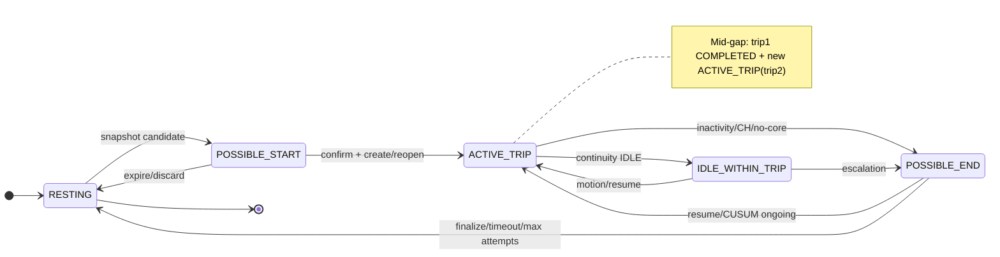
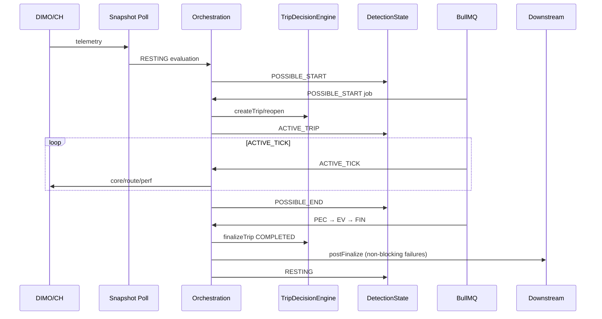

# P6 — Cross-Audit Synthesis / Target Architecture / Remediation Dependency Graph

**AUDIT / DESIGN ARTIFACT — NON-CANONICAL**

> Synthesis of closed P2–P5 forensic audits into a target architecture and ordered remediation program.  
> **No application code, tests, schema, deployment, or production data was modified.**  
> **Do not treat this document as canonical architecture** — canonical docs are deferred until post-remediation validation (P6.22).

| Field | Value |
|-------|-------|
| Synthesis date | 2026-09-06 |
| Audited application SHA | `3d5040b67abfdc7e95c1b507e13f45d1bc65af11` |
| P4 closure commit | `a4377f3a200ca45a97b7ce422caf8d92faddabbe` |
| P5 closure commit | `70249e1966a37cc127149f3792b07c3dd2a4c9b0` |
| Evidence chain | P2, P3, P4, P5 (closed) |
| Lifecycle authority | `TripDecisionEngine` + `TRIP_OWNERSHIP.ts` |
| Production SHA status | **UNKNOWN** (no fresh prod access in P4/P5) |

---

## P6.0 — Baseline Integrity

| Item | Value |
|------|-------|
| Branch | `main` |
| HEAD (pre-P6 artifact) | `70249e1966a37cc127149f3792b07c3dd2a4c9b0` |
| Working tree | clean |

```bash
git diff 3d5040b67..HEAD -- backend/src/modules/vehicle-intelligence/trips/ backend/src/workers/ --stat
# (no output — zero application diff since audited SHA)
```

**Conclusion:** Trip FSM application logic unchanged since `3d5040b67`. Target architecture and remediation plan reference that SHA exclusively.

---

## P6.1 — Current-State Canonical Working Graph

### Authority layers (current)

| Layer | Owner | Writes |
|-------|-------|--------|
| **Data authority** | DIMO provider streams, ClickHouse mirrors, VLS merge | Raw/scalar observations |
| **Decision authority** | Detectors + `TripDecisionEngine.evaluate*` | Findings → decisions only |
| **Lifecycle write authority** | `TripDecisionEngine` only | `tripStatus`, create/finalize/discard/split |
| **FSM state authority** | `TripDetectionOrchestrationService.transitionState` | `vehicleTripDetectionState.state` + FSM fields |
| **Recovery authority** | `TripTrackingRecoveryScheduler`, `TripReconciliationService` | Re-enqueue jobs; repair proposals via DecisionEngine |
| **Downstream consumers** | Driving Intelligence, enrichment, Battery V2, rental recompute, UI | Non-lifecycle fields; async after COMPLETED |

### End-to-end current graph (condensed)

```
DIMO/CH observation
  → snapshot poll (tiered 30s–30m) / VLS merge
  → RESTING (+ smart cooldown)
  → snapshot evidence → POSSIBLE_START
  → processPossibleStart (confirm + CH assist + merge/reopen)
  → TripDecisionEngine.createTrip | reopenTripForMerge
  → FSM ACTIVE_TRIP (+ battery start-proxy await)
  → ACTIVE_TICK loop (core/route/perf/VLS/CH)
       ├─ IDLE_WITHIN_TRIP
       ├─ mid-gap split (live)
       ├─ CH end assist
       ├─ no-core empty → POSSIBLE_END
       └─ continuity → POSSIBLE_END
  → POSSIBLE_END_CHECK (resume / gate / CUSUM schedule)
  → END_VALIDATION (CUSUM | CH skip)
  → FINALIZE → finalizeTrip COMPLETED | discard CANCELLED
  → postFinalize analysis (failure-contained)
  → FSM RESTING
  → downstream: enrichment, driving analysis, battery LV rest, reconciliation sweeps
```

### Mermaid — lifecycle state diagram (current)



### Mermaid — sequence diagram (simplified live trip)



---

## P6.2 — Clock / Timestamp Model Synthesis

### Global taxonomy (current)

| Field / concept | Label | Notes (current) |
|-----------------|-------|-------------------|
| Core/route point `timestamp` | **EVENT_TIME** | Provider observation |
| DIMO segment boundaries | **EVENT_TIME** | Start/end assist, boundary backfill |
| ClickHouse segment end | **EVENT_TIME** | End assist |
| Snapshot `sourceTimestamp` | **EVENT_TIME** | Intended freshness signal (underused — P4-F03) |
| `providerFetchedAt` / poll window | **INGESTION_TIME** | Fetch bookkeeping |
| VLS `updatedAt` | **DB_TIME** | Used for freshness policy input |
| Worker `now` | **WORKER_TIME** | Gates, schedules, many FSM writes |
| `possibleStartAt` (default) | **WORKER_TIME** | P4-F02 |
| `possibleEndAt` (often) | **DERIVED** | From movement anchor — may be worker or event |
| `lastActivityAt` | **WORKER_TIME** | Updated on ACTIVE/IDLE ticks |
| `lastMeaningfulMovementAt` | **MIXED** | Worker `now` OR CH/CUSUM event time — **P5-F14** |
| `cusumValidatedAt` | **WORKER_TIME** | Validation recorded-at |
| `trip.startTime` (finalize) | **DERIVED** | Priority chain — often event-time after backfill |
| `trip.endTime` (ONGOING) | **WORKER_TIME** | Rolling `now` each tick — P5-F01 |
| `trip.endTime` (COMPLETED) | **DERIVED** | Priority chain |
| FSM `updatedAt` | **DB_TIME** | Cooldown anchor |

### Target rule (design only)

> **INV-T-CLOCK:** Canonical physical trip boundaries **MUST** be **EVENT_TIME**-derived whenever qualifying provider evidence exists.  
> **Worker time** may drive scheduling, timeout, retry, and observability timestamps — but **MUST NOT** silently become physical boundary authority (explicit field separation required).

Proposed field split (evaluation, not schema commit):
- `lastObservedMovementAt` → event-time movement anchor
- `lastEvaluatedAt` → worker tick time
- `provisionalEndObservedAt` vs `canonicalEndTime` on trip row

---

## P6.3 — Finding Inventory Normalization

See **Table A** (27 findings: P4-F01…F12, P5-F01…F15).

**Preserved by-design:** **P4-F08** — CH start assist requires POSSIBLE_START entry; assist corroborates confirmation, does not bypass FSM.

---

## P6.4 — Root Cause Deduplication

See **Table B**. Verified groups:

| Group | Root cause | Primary symptoms |
|-------|------------|------------------|
| **A — Mixed clock / event-time authority** | Same DB fields store worker vs provider clocks | P4-F02, P5-F02/F14/F15, P3-F01, metric mislabel P5-F06/F07 |
| **B — Lifecycle commit / liveness ordering** | Trip row + FSM + queue not atomically/recoverably coupled | P4-F06/F11/F12, P5-F04/F05, P3-F06 |
| **C — Polling / recognition latency** | Tiered idle polling + cooldown + swallowed PS errors | P4-F04/F05/F11 |
| **D — Detection model consistency** | Candidate vs confirm scoring asymmetry; freshness policy gaps | P4-F01/F03; P4-F08 by design |
| **E — End fallback / split safety** | Permissive fallbacks without evidence | P5-F09/F10/F11/F13/F15 |
| **F — Dual field semantics / observability** | ONGOING fields reused as canonical; missing recognition metrics | P5-F01/F06/F07/F12, P3-F04 |

**Blast radius:** Groups A+B affect boundary correctness and FSM/trip divergence fleet-wide. Group C affects time-to-detect, not necessarily wrong boundary once detected. Group E affects false split / false end under sparse GPS.

---

## P6.5 — Target Architecture Invariants

| ID | Invariant | Current gap |
|----|-----------|-------------|
| **INV-01** | Sole lifecycle writer: `TripDecisionEngine` | **Met** (TRIP_OWNERSHIP) |
| **INV-02** | ≤1 canonical ONGOING trip per vehicle | **Gap** P4-F10 |
| **INV-03** | FSM.activeTripId ↔ ONGOING trip no silent divergence | **Gap** P4-F06, P5-F04/F05 |
| **INV-04** | Boundaries event-time when evidence exists | **Gap** A-group |
| **INV-05** | Worker time ≠ physical boundary | **Gap** A-group, P5-F01 |
| **INV-06** | Ancillary consumers never block FSM liveness | **Partial** — end postFinalize OK; start battery blocks AT (P4-F12) |
| **INV-07** | Processing exceptions → retry / recovery / observable failure | **Gap** P4-F11 swallow |
| **INV-08** | Lifecycle DB commit + recoverable FSM follow-up | **Gap** B-group |
| **INV-09** | Mid-gap split fail-safe without location evidence | **Gap** P5-F09/F04 |
| **INV-10** | Recognition latency measurable separately from boundary | **Gap** F-group |
| **INV-11** | Profile behavior explicit in candidate+confirm | **Gap** P4-F01 |
| **INV-12** | Retry counters = completed attempts (documented) | **Gap** P5-F11 |
| **INV-13** | ONGOING vs COMPLETED field semantics unambiguous | **Gap** P5-F01 |
| **INV-14** | Recovery idempotent | **Partial** — analysis init dedup OK; FSM recovery coarse |
| **INV-15** | Finalized trip forensic explainability | **Partial** — rawDetectionMeta exists; clocks/metrics incomplete |

---

## P6.6 — Target Start Architecture (design)

| Area | Target behavior |
|------|-----------------|
| Candidate scoring | **Architectural:** single documented scoring contract OR explicit dual-model with named phases |
| `possibleStartAt` | **Event-time** candidate from earliest qualifying observation in window |
| Idle latency | **Hybrid wake** (P6.9) — not fixed 30s fleet poll |
| PS retry | Durable retry or explicit failure surface — never silent SUCCESS (INV-07) |
| Confirm budget | Decoupled from recovery scheduler cadence |
| CH assist | Remains corroboration inside POSSIBLE_START (preserve P4-F08) |
| createTrip/FSM | **Recoverable two-step** with invariant repair (P6.8) |
| Battery start-proxy | **Async ancillary** — must not block `scheduleActiveTick` |
| Observability | Separate candidate vs recognition latency metrics |

**Calibration-dependent (later):** tier intervals, strong/weak thresholds, cooldown durations.

---

## P6.7 — Target End Architecture (design)

| Area | Target behavior |
|------|-----------------|
| Movement anchor | **Event-time** from last qualifying motion/odo point; odometer-only ACTIVE must advance anchor (fix P5-F15) |
| `lastActivityAt` | Worker evaluation clock only — never boundary fallback |
| `lastMeaningfulMovementAt` | Rename/split conceptually → event-time movement authority only |
| ONGOING `endTime` | Renamed semantic: `provisionalLastObservedAt` or documented non-canonical |
| CH assist | Retained; stationary gates **calibration-dependent** |
| CUSUM attempts | Increment on **completed** validation cycle (or document schedule-based) |
| Empty core | Distinguish throw (keep open) vs empty (evidence-gated end) — preserve |
| Mid-gap | **Fail closed** when drift unknown (P6.10) |
| Post-split flow | **Return or rebind** — never fall through with stale `tripId` |
| COMPLETED→RESTING | Deterministic recovery job if FSM transition fails |
| Metadata reset | Symmetric clear on all reopen paths (fix P5-F03) |
| End coordinates | Set at finalize from boundary-time waypoint |
| Metrics | Recognition wall-clock + boundary adjustment |

**`possibleEndAt` evaluation:** Keep as **physical boundary candidate** (event-time).  
**Add (design):** `possibleEndEnteredAt` (**WORKER_TIME**) for stability gates and recognition latency — avoids conflating boundary age with state-entry age.

---

## P6.8 — State Commit Model

| Transition | Recommended target | Rationale |
|------------|-------------------|-----------|
| **START:** ONGOING + ACTIVE_TRIP | **C — idempotent two-step + reconciliation invariant** (short term); **B — outbox** (medium term) | Prisma transaction can couple FSM+trip if same DB; BullMQ schedule is external — recovery must detect orphan ONGOING or orphan ACTIVE_TRIP |
| **END:** COMPLETED + RESTING | **C + mandatory recovery job** | postFinalize already non-blocking; critical gap is FSM after COMPLETED |
| **MID-GAP:** trip1 COMPLETED + trip2 + FSM repoint | **A — single transaction for trip rows + waypoints**; FSM repoint **after** with **abort-safe control flow** (no fallthrough) | Split already transactional in DecisionEngine; orchestration catch is the bug |

Comparison summary in **Table G**.

---

## P6.9 — Polling / Wake-Up Target Model

**Constraint:** 1000+ vehicles — not all at 30s fixed poll.

| Option | Pros | Cons | Fit |
|--------|------|------|-----|
| Current tier polling | Simple | Up to **~30 min** idle miss (P4-F04) | Baseline |
| Provider webhook/event wake | Low latency | Provider availability | **Target hybrid** |
| Adaptive fast probe after weak signal | Scalable | Needs wake rules | **Target hybrid** |
| Low-cost metadata poll + deep poll on wake | Cheap fleet scan | Two-tier complexity | **Recommended** |
| Fleet-sharded polling | Even load | Ops complexity | Complement |
| CH/event-driven wake | Strong for end | Not start-complete alone | End assist complement |

**Qualitative load (current):** RESTING vehicle at 30m tier ≈ 2 polls/hour/vehicle → 1000 vehicles ≈ 2000 snapshot jobs/hour idle worst-case; active trip AT ≈ 120 jobs/hour/vehicle at 30s. Target: **<5% vehicles in fast tier** unless recently active or suspicious.

**Architecture-first;** tier thresholds **calibration-dependent**.

---

## P6.10 — Mid-Gap Split Target Contract

### Required evidence (target)

| Evidence | Required? |
|----------|-----------|
| Telemetry gap ≥ threshold | Yes |
| Pre-gap stopped | Yes |
| Post-gap movement | Yes |
| GPS position consistency | **Yes when route data exists** |
| Drift UNKNOWN | **FAIL CLOSED for live split** |
| Minimum first-trip duration | Yes (retain) |
| Confidence score persisted | Yes |

**Recommendation:** When `drift == null` → **do not live split**; enqueue reconciliation `repairIntraTripGapSplits` for retroactive review. **False split cost > missed live split** given reconciliation safety net.

---

## P6.11 — Observability Target Contract

### Required metrics (pre-rollout)

| Metric | Purpose |
|--------|---------|
| `trip_start_candidate_latency_seconds` | Poll/signal → POSSIBLE_START |
| `trip_start_recognition_latency_seconds` | Physical start estimate → ACTIVE_TRIP commit |
| `trip_start_boundary_adjustment_seconds` | Candidate vs canonical startTime delta |
| `trip_end_candidate_latency_seconds` | Last motion → POSSIBLE_END |
| `trip_end_recognition_latency_seconds` | Last motion → COMPLETED commit (wall-clock) |
| `trip_end_boundary_adjustment_seconds` | Anchor vs canonical endTime |
| `fsm_transition_total` / `_failure_total` / `_recovery_total` | Liveness |
| `trip_*_evidence_path_total` | Path mix |
| `mid_gap_split_*_total` | Split safety |
| `ongoing_fsm_divergence_total` / `completed_fsm_divergence_total` | Invariant monitors |

### Durable per-trip forensic metadata (target)

`startBoundarySource`, `endBoundarySource`, `startRecognizedAt`, `endRecognizedAt`, `startCandidateAt`, `endCandidateAt`, `endTimeSource` (exists), recovery flags, evidence path — all with explicit clock type tags.

---

## P6.12 — Remediation Dependency Graph

See **Table H**. Verified DAG:

```
FOUNDATIONAL INVARIANTS (INV docs + guards)
  → R1 CLOCK MODEL & FIELD CONTRACT
    → R4 START SCORING/ANCHOR CONSISTENCY
    → R5 END ANCHOR & METADATA RESET
  → R2 LIFECYCLE COMMIT & FSM RECOVERY
    → R3 START LIVENESS ORDERING
    → R7 END COMPLETED→RESTING RECOVERY
    → R6 MID-GAP FAIL-CLOSED + CONTROL FLOW
  → R8 OBSERVABILITY CONTRACT
    → R9 POLLING/WAKE MODEL
      → R10 CALIBRATION PASS
        → R11 PRODUCTION CANARY
          → R12 CANONICAL DOCUMENTATION
```

---

## P6.13 — Remediation Packages

### R1 — Event-Time Authority & Boundary Field Contract
- **Objective:** Separate worker vs event clocks; fix mixed `lastMeaningfulMovementAt`; document ONGOING provisional fields
- **Findings:** P4-F02, P5-F02/F14/F15, P5-F01, P3-F01
- **Files:** `trip-detection-orchestration.service.ts`, `trip-evidence.helpers.ts`, FSM field writers, UI contract notes
- **Behavior:** Event-time anchors; odometer-only updates movement anchor; rename/document provisional end
- **Invariants:** INV-04, INV-05, INV-13
- **Tests:** unit anchor writers; integration sparse odometer-only; clock matrix
- **Schema:** Optional new FSM columns (`possibleEndEnteredAt`) — evaluate in design review
- **Risk:** Medium — touches boundary outputs
- **Validation:** Boundary adjustment metric near zero when evidence rich
- **Rollback:** Feature flag per vehicle profile
- **Deps:** None (foundation)

### R2 — Lifecycle Commit & Orphan Recovery Invariants
- **Objective:** Detect/repair ONGOING↔FSM orphans; harden createTrip→FSM ordering
- **Findings:** P4-F06/F10, P3-F06, P5-F05
- **Files:** orchestration, `TripReconciliationService`, optional DB constraint migration
- **Behavior:** Reconciliation invariant checks; unique partial index ONGOING per vehicle (evaluate)
- **Invariants:** INV-02, INV-03, INV-08, INV-14
- **Tests:** crash injection between createTrip and transitionState
- **Schema:** Possible unique index — migration required
- **Risk:** High if DB constraint deployed carelessly
- **Validation:** `ongoing_fsm_divergence_total` → 0 in canary
- **Deps:** R1 (clock fields in repair logic)

### R3 — Start Liveness Ordering
- **Objective:** PS exceptions durable retry; battery decoupled from AT schedule
- **Findings:** P4-F11/F12
- **Files:** `processPossibleStart`, battery producer call order
- **Behavior:** Rethrow or failure job; battery fire-and-forget after AT
- **Invariants:** INV-06, INV-07
- **Tests:** battery throw does not block AT; PS exception retry
- **Risk:** Low-medium
- **Deps:** R2 recovery patterns

### R4 — Start Detection Consistency
- **Objective:** Unify or document candidate vs confirm scoring; freshness policy alignment
- **Findings:** P4-F01/F03; preserve P4-F08
- **Files:** `trip-evidence.helpers.ts`, policy resolver, snapshot processor
- **Behavior:** Architectural scoring doc + code alignment OR explicit phase labels
- **Invariants:** INV-11
- **Tests:** profile matrix ICE/EV/HYB/UNKNOWN parity cases
- **Deps:** R1 anchors
- **Calibration:** threshold tuning in R10

### R5 — End Anchor, Metadata Reset & Attempt Accounting
- **Objective:** Symmetric reopen clears; CUSUM attempt semantics; empty-core clarity
- **Findings:** P5-F03/F11/F13; parts of F10
- **Files:** PEC/EV paths, continuity/no-core branches
- **Invariants:** INV-12, INV-15
- **Tests:** CUSUM reopen metadata; empty vs throw paths
- **Deps:** R1

### R6 — Mid-Gap Split Safety & Control Flow
- **Objective:** Fail closed on unknown drift; no post-split fallthrough
- **Findings:** P5-F04/F09
- **Files:** mid-gap block in orchestration, reconciliation path
- **Behavior:** `drift==null` → no live split; try/catch returns after split or explicit rebind
- **Invariants:** INV-09
- **Tests:** split throw after FSM repoint; null drift tunnel scenario
- **Risk:** Medium — may delay live split (reconciliation compensates)
- **Deps:** R2, R1

### R7 — COMPLETED→RESTING Recovery Hardening
- **Objective:** If COMPLETED persisted and RESTING transition fails, enqueue deterministic repair
- **Findings:** P5-F05
- **Files:** `processFinalize`, recovery scheduler
- **Invariants:** INV-08
- **Tests:** crash injection after finalizeTrip
- **Deps:** R2

### R8 — Observability & Forensic Metadata Contract
- **Objective:** Recognition latency metrics; fix mislabeled histograms; timeline fields
- **Findings:** P5-F06/F07/F12, P3-F04/F05
- **Files:** `trip-metrics.service.ts`, orchestration timeline logs, rawDetectionMeta extensions
- **Invariants:** INV-10, INV-15
- **Tests:** metric unit tests with fixed clocks
- **Deps:** R1 (field semantics)

### R9 — Adaptive Polling / Wake Model
- **Objective:** Replace blunt 30m idle tier as primary path
- **Findings:** P4-F04/F05
- **Files:** snapshot scheduler, polling tier policy, optional webhook integration
- **Invariants:** recognition latency SLO
- **Deps:** R8 metrics, R3 liveness
- **Calibration:** tier timings in R10

### R10 — Signal Calibration Pass
- **Objective:** Threshold tuning from empirical signal tests
- **Findings:** none new — depends on HF/signal workstreams
- **Deps:** R1,R4,R5,R9 deployed
- **Mark:** CALIBRATION-DEPENDENT

### R11 — Production Canary & Acceptance
- **Objective:** Fleet subset validation before full rollout
- **Deps:** R1–R9 on canary cohort
- **See:** P6.18, Table K

### R12 — Canonical Documentation
- **Objective:** Promote validated model to `docs/architecture/trip-fsm/`
- **Deps:** R11 pass
- **See:** P6.22

---

## P6.14 — Priority Order

| Package | Priority | Rationale |
|---------|----------|-----------|
| **R1** | **BLOCKER** | Wrong boundaries without clock model |
| **R2** | **BLOCKER** | Orphan/divergence data integrity |
| **R6** | **BLOCKER** | False split corruption |
| **R3** | P1 | FSM liveness start path |
| **R5** | P1 | End correctness metadata |
| **R7** | P1 | End FSM crash window |
| **R4** | P1 | Start detection consistency |
| **R8** | P2 | Required before trusting calibration |
| **R9** | P2 | Recognition latency at scale |
| **R10** | P3 | After architecture stable |
| **R11** | P2 | Gate for prod |
| **R12** | P3 | After canary |

---

## P6.15 — Start vs End Interaction

| Shared concern | Must coordinate |
|----------------|-----------------|
| RESTING cooldown / `lastRestingReason` | Start + End — fix P4-F07/P5-F08 together in R5/R9 |
| Merge/reopen | End boundary quality → start merge (P4-F09) — R1+R4 |
| Mid-gap split | End mechanism creates next start — R6 before tuning |
| Unique ONGOING | R2 atomic across both |
| FSM recovery | R2+R7 shared patterns |
| Polling tier selection | RESTING vs ACTIVE — R9 |
| Clock fields | R1 single contract for both |

**Atomic across Start+End:** R1, R2, R8 (field semantics + invariants + metrics).

---

## P6.16 — Downstream Contracts (preserve)

| Consumer | Contract from Trip FSM |
|----------|------------------------|
| **Driving Intelligence** | Init only after persisted **COMPLETED**; idempotent run fingerprint; queue errors non-blocking |
| **Trip enrichment** | Fire-and-forget; may update enrichment fields per TRIP_OWNERSHIP |
| **Energy events** | Trip windows from canonical boundaries + association reconcile |
| **Battery V2** | Start proxy / LV rest **must not** block FSM; reads finalized/resting state |
| **Rental driving analysis** | Recompute on COMPLETED; correlation id per trip |
| **UI timeline/map** | Must not treat ONGOING provisional end as canonical — document/API |
| **Trip reconciliation** | Safety net — not primary detector; uses DecisionEngine for mutations |
| **Event trip association** | Post-finalize reconcile; failures non-blocking |

**Rule:** Downstream systems **never** set `tripStatus` or FSM state.

---

## P6.17 — Test Strategy

Mandatory suites before rollout (see **Table J**):

- Unit: clock writers, scoring, quality gates
- Integration: PS→AT→PE→FIN happy paths per profile
- Crash-injection: createTrip/FSM, finalize/RESTING, mid-gap post-commit
- Idempotency: duplicate FINALIZE, duplicate postFinalize producer
- Concurrency: worker lock + dual job
- Sparse telemetry / empty vs throw provider
- Out-of-order timestamps
- Redis restart + recovery scheduler
- Merge/reopen + mid-gap + traffic-stop IDLE

Each package R1–R9 lists required gates in P6.13.

---

## P6.18 — Production Canary Strategy (design only)

| Criterion | Target |
|-----------|--------|
| Vehicle selection | ≥20 vehicles, balanced ICE+EV, mixed connectivity |
| Duration | ≥14 days |
| Trip count | ≥200 completed trips canary vs control |
| Measurements | recognition latency p50/p95; boundary adjustment; divergence counters |
| FSM checks | SQL: COMPLETED+POSSIBLE_END, ONGOING+RESTING, duplicate ONGOING |
| False split | mid_gap rejected/applied ratio; manual review sample |
| Queue | recovery job rate, PS/AT/PEC/FIN lag |
| Rollback | divergence >0 sustained 1h; false split confirmed; p95 recognition regression >2× baseline |

**Production access:** UNKNOWN — canary requires SSH/DB read access restored.

---

## P6.19 — Signal Calibration Dependency

| Change | Class |
|--------|-------|
| Clock/field separation, recovery, liveness | **ARCHITECTURE-FIRST** |
| Mid-gap fail-closed | **ARCHITECTURE-FIRST** |
| Scoring threshold numbers | **CALIBRATION-DEPENDENT** |
| Poll tier timings | **CALIBRATION-DEPENDENT** |
| CUSUM/CH stationary ms | **CALIBRATION-DEPENDENT** |
| Cooldown durations | **CALIBRATION-DEPENDENT** |
| Profile speedActiveKmh etc. | **CALIBRATION-DEPENDENT** |

Do **not** import experimental HF pipeline changes into production FSM without R10 gate.

---

## P6.20 — What NOT to Change

Preserve (evidence: sound architecture):

- `TripDecisionEngine` as **sole lifecycle writer** (TRIP_OWNERSHIP)
- Detectors **pure** — findings only
- ClickHouse assist as **corroboration**, not sole authority without gates
- `TripReconciliationService` as **safety net**
- Profile-aware detection framework
- Recovery scheduler **concept** (needs hardening, not removal)
- Provider-time boundary backfill **concept** (execution needs clock fix)
- Post-finalize analysis **after** COMPLETED with failure containment (P5A verified)
- DIMO segments as canonical trip boundary source where applicable (product architecture)
- BullMQ phased jobs PS/AT/PEC/EV/FIN structure

**Not a rewrite** — targeted hardening sufficient if R1–R9 executed in order.

---

## P6.21 — Final Target Architecture Graph

```
PHYSICAL VEHICLE
  → OBSERVATION (DIMO core/route/perf, CH, VLS)
  → EVIDENCE NORMALIZATION (detectors, event-time extraction)
  → EVENT-TIME AUTHORITY LAYER (movement/start/end candidates)
  → FSM CANDIDATE STATES (RESTING/PS/PE)
  → CONFIRMATION / VALIDATION (CUSUM, CH corroboration)
  → ATOMIC OR RECOVERABLE LIFECYCLE COMMIT (DecisionEngine)
  → ACTIVE CONTINUITY (event-time movement tracking)
  → END CANDIDATE + VALIDATION
  → CANONICAL BOUNDARY COMMIT (COMPLETED/CANCELLED)
  → ATOMIC OR RECOVERABLE RESTING TRANSITION
  → ASYNC DOWNSTREAM (analysis, enrichment, battery, rental)
  → RECONCILIATION / REPAIR (idempotent safety net)
```

| Path type | Examples |
|-----------|----------|
| **Synchronous critical** | createTrip+FSM, finalizeTrip+RESTING, live split commit |
| **Asynchronous ancillary** | enrichment, battery, rental recompute |
| **Recovery** | orphan invariant repair, stuck PE, reconciliation split |

---

## P6.22 — Canonical Documentation Plan (future)

After R11 canary pass, promote to:

```
docs/architecture/trip-fsm/
  README.md
  OWNERSHIP.md              ← from TRIP_OWNERSHIP.ts + INV set
  SIGNAL_AUTHORITY.md       ← clock taxonomy
  STATE_MACHINE.md          ← PS/AT/PEC/EV/FIN
  TRIP_START.md
  TRIP_END.md
  TIMESTAMP_MODEL.md
  RECOVERY_AND_IDEMPOTENCY.md
  OBSERVABILITY.md
  DOWNSTREAM_CONTRACTS.md
  DECISION_LOG.md
```

Aligns with existing `docs/architecture/*` pattern (domain folders, rollout flags elsewhere). P6 audit artifacts remain in `docs/audits/trip-fsm/` as forensic history.

---

# Mandatory Summary Tables

## Table A — All P4/P5 Findings Normalized

| ID | Sev | Status | Subsystem | Root group | Start/End | Data | Liveness | Latency | Obs | Test gap | Remediation |
|----|-----|--------|-----------|------------|-----------|------|----------|---------|-----|----------|-------------|
| P4-F01 | P1 | Open | Start scoring | D | Start | Y | — | — | — | Partial | R4 |
| P4-F02 | P1 | Open | Start anchor | A | Start | Y | — | Y | Y | Yes | R1 |
| P4-F03 | P2 | Open | Freshness policy | D | Start | Y | — | Y | — | Yes | R4 |
| P4-F04 | P1 | Open | Snapshot tiers | C | Start | — | — | Y | Y | Partial | R9 |
| P4-F05 | P2 | Open | Cooldown | C | Both | — | — | Y | — | Partial | R9,R5 |
| P4-F06 | P2 | Open | createTrip order | B | Start | Y | Y | — | — | Yes | R2 |
| P4-F07 | P3 | Open | Cooldown reason | F | Both | — | — | Y | — | Yes | R5 |
| P4-F08 | P2 | By design | CH start gate | D | Start | — | — | — | — | Covered | — |
| P4-F09 | P2 | Open | Merge heuristic | D | Start | Y | — | — | — | Partial | R4 |
| P4-F10 | P3 | Open | ONGOING uniqueness | B | Start | Y | Y | — | — | Yes | R2 |
| P4-F11 | P1 | Open | PS exception swallow | B/C | Start | — | Y | Y | Y | Yes | R3 |
| P4-F12 | P1 | Open | Battery blocks AT | B | Start | — | Y | Y | — | Yes | R3 |
| P5-F01 | P1 | Open | Provisional endTime | F | End | Y | — | — | Y | Partial | R1,R8 |
| P5-F02 | P1 | Open | IDLE lastActivityAt | A | End | Y | — | — | — | Yes | R1 |
| P5-F03 | P1 | Open | CUSUM reopen metadata | E | End | Y | — | — | Y | Yes | R5 |
| P5-F04 | P1 | Open | Mid-gap fallthrough | B | End | Y | Y | — | — | Yes | R6 |
| P5-F05 | P1 | Open | COMPLETED→RESTING gap | B | End | Y | Y | — | Y | Yes | R7,R2 |
| P5-F06 | P2 | Open | tripFinalizeLatency | F | End | — | — | — | Y | Yes | R8 |
| P5-F07 | P2 | Open | endLatencyFromMovement | F | End | — | — | — | Y | Yes | R8 |
| P5-F08 | P2 | Open | timeout restingReason | F | Both | — | — | Y | — | Yes | R5 |
| P5-F09 | P2 | Open | Mid-gap drift null | E | End | Y | — | — | — | Yes | R6 |
| P5-F10 | P2 | Open | Max attempts w/o CUSUM | E | End | Y | — | Y | — | Partial | R5,R10 |
| P5-F11 | P2 | Open | Attempt pre-increment | E | End | — | — | Y | Y | Partial | R5 |
| P5-F12 | P3 | Open | End coords mismatch | F | End | Y | — | — | — | Yes | R8 |
| P5-F13 | P3 | Open | Empty-core false end | E | End | Y | — | Y | — | Partial | R5,R10 |
| P5-F14 | P1 | Open | Mixed movement clock | A | End | Y | — | Y | Y | Yes | R1 |
| P5-F15 | P2 | Open | Odometer anchor gap | A | End | Y | — | Y | Y | Yes | R1 |

**Count:** 27 findings (12 P4 + 15 P5).

## Table B — Root-Cause Groups

| Group | Root cause | Symptoms (IDs) | Dependencies | Blast radius |
|-------|------------|----------------|--------------|--------------|
| A | Mixed worker/event clocks in boundary fields | F02,F14,F15,F06,F07 + P4-F02 | None | Fleet boundary accuracy |
| B | Non-atomic / non-recoverable lifecycle+FSM commits | F06,F04,F05,F11,F12,F10 | A for repair timestamps | Stuck FSM, orphan trips |
| C | Polling + cooldown + error swallow latency | F04,F05,F11 | B for recovery | Late detection |
| D | Candidate/confirm/freshness inconsistency | F01,F03,F09; F08 design | A | Profile surprises |
| E | Permissive end/split fallbacks | F09,F10,F11,F13,F15 | A,B | False end/split |
| F | Dual semantics + weak observability | F01,F06,F07,F12,F07,P4-F07 | A | Ops blindness |

## Table C — Current vs Target Invariants

| INV | Current | Target |
|-----|---------|--------|
| INV-01 | Met | Preserve |
| INV-02–05 | Gaps | R1+R2 close |
| INV-06 | Partial | R3 close |
| INV-07–09 | Gaps | R3,R6,R7 |
| INV-10–15 | Partial/gaps | R8+R5 |

## Table D — Clock Authority Current vs Target

| Field | Current | Target |
|-------|---------|--------|
| Movement anchor | MIXED | EVENT_TIME only |
| lastActivityAt | WORKER | WORKER (non-boundary) |
| possibleStartAt | WORKER | EVENT candidate |
| possibleEndAt | DERIVED/Mixed | EVENT boundary candidate |
| possibleEndEnteredAt | absent | WORKER (new) |
| ONGOING endTime | WORKER rolling | Provisional non-canonical |
| COMPLETED endTime | DERIVED chain | EVENT-first chain |

## Table E — Start Current vs Target

| Aspect | Current | Target |
|--------|---------|--------|
| Candidate time | Worker `possibleStartAt` | Event-time candidate |
| Scoring | Dual models | Unified or explicit phases |
| PS errors | Swallowed | Durable retry/fail |
| Battery | Blocks AT | Async |
| Polling | 30s–30m tiers | Adaptive wake |
| CH assist | Inside PS only | Preserve |

## Table F — End Current vs Target

| Aspect | Current | Target |
|--------|---------|--------|
| Movement anchor | Mixed + odometer gap | Event-time + odometer |
| Empty core | 120s anchor end | Same with event anchors |
| Mid-gap | drift null splits | Fail closed live |
| Post-split | Fallthrough risk | Abort-safe |
| COMPLETED→RESTING | Crash window | Recovery job |
| Metrics | Duration/boundary delta | + recognition latency |

## Table G — Lifecycle Commit Strategy Comparison

| Strategy | Correctness | Complexity | Prisma | BullMQ | Recovery | Migration |
|----------|-------------|------------|--------|--------|----------|-----------|
| A — DB txn coupling | High for DB-coupled steps | Low | Good | External jobs remain | Needs complement | Low |
| B — Outbox | Highest | High | Medium | Natural fit | Strong | Medium |
| C — Two-step + reconciliation | Medium-high | Medium | Good | Current fit | Requires invariant scans | Low |

**Recommendation:** C near-term; B for scale-up; A for mid-gap trip rows already in txn.

## Table H — Remediation Package DAG

```
R1 ──┬── R4
     ├── R5 ── R10
     └── R8 ── R9 ── R10
R2 ──┬── R3
     ├── R6
     └── R7
R10 ── R11 ── R12
```

## Table I — Priority / Risk Matrix

| Pkg | Priority | Data corruption | Rollout risk |
|-----|----------|-----------------|--------------|
| R1 | BLOCKER | High | Med |
| R2 | BLOCKER | High | Med-High |
| R6 | BLOCKER | High | Med |
| R3 | P1 | Low | Low |
| R4 | P1 | Med | Med |
| R5 | P1 | Med | Med |
| R7 | P1 | Med | Low |
| R8 | P2 | Low | Low |
| R9 | P2 | Low | Med |
| R10–12 | P2/P3 | — | — |

## Table J — Test Gate Matrix

| Package | Unit | Integration | Crash | Idempotency | Profile matrix |
|---------|------|-------------|-------|-------------|----------------|
| R1 | Required | Required | — | — | Required |
| R2 | Required | Required | Required | Required | — |
| R3 | Required | Required | — | Required | — |
| R4 | Required | Required | — | — | Required |
| R5 | Required | Required | — | — | Required |
| R6 | Required | Required | Required | — | Required |
| R7 | — | Required | Required | Required | — |
| R8 | Required | Required | — | — | — |
| R9 | Partial | Required | — | — | Required |

## Table K — Production Canary Acceptance Matrix

| Gate | Pass threshold |
|------|----------------|
| FSM divergence | 0 sustained anomalies |
| Boundary adjustment p95 | < configured SLO (TBD in R10) |
| Recognition latency p95 | ≤ 2× control or absolute cap |
| False split rate | 0 confirmed in sample review |
| Duplicate ONGOING | 0 |
| postFinalize queueErrors | Allowed; RESTING must still reach 100% |

## Table L — Canonical Documentation Plan

See P6.22 — create after R11 pass; audits remain non-canonical reference.

---

# Final Questions

1. **Is the FSM fundamentally salvageable?** **Yes** — core ownership model, phased queue, detectors, DecisionEngine, and reconciliation are sound. **Targeted hardening**, not redesign.

2. **Top 3 root causes:** **(A) Mixed clock/boundary authority**, **(B) Lifecycle+FSM commit/recovery gaps**, **(C) Polling/error-handling recognition latency**.

3. **Fix before threshold tuning:** **R1 clock model + R2 lifecycle invariants + R6 mid-gap safety** — calibration on wrong anchors amplifies error.

4. **Symptoms vs root causes:** P5-F06/F07/F12, P4-F05/F07, P5-F03, P5-F11 are **symptoms** of groups A/B/F. P5-F10 is **policy symptom** of E until architecture clarifies forced-finalize rules.

5. **Implement first:** **R1** (Event-Time Authority & Boundary Field Contract).

6. **Implement together:** **R1 + R2 + R8** (shared field semantics, invariants, observability); **R5 + P4-F07/P5-F08** cooldown fix; **R6 + R2** for split.

7. **Must remain unchanged:** DecisionEngine sole writer, pure detectors, CH as corroboration, reconciliation safety net, post-finalize failure containment, phased BullMQ structure (P6.20).

8. **Requires real-world calibration:** Poll tiers, speed/frequency thresholds, CH/CUSUM stationary windows, merge gap, cooldown durations (**R10**).

9. **Observable before rollout:** Recognition latency metrics, boundary adjustment, FSM divergence counters, evidence path totals (**R8**).

10. **Minimum safe canary gate:** Zero FSM/trip divergence + bounded boundary adjustment + no confirmed false splits over ≥200 trips (**Table K**).

11. **Production-grade when:** R1–R9 deployed, R11 canary pass, observability SLOs met for ≥14 days, production SHA verified matches remediated baseline.

12. **Canonical docs when:** After R11 acceptance — **not before** (P6.22).

---

## Changes / Architektur

**No application architecture implementation was modified.**  
SynqDrive Code → **Changes** and **Architektur** were **not** updated (design artifact only).

---

*End of P6 synthesis artifact.*
