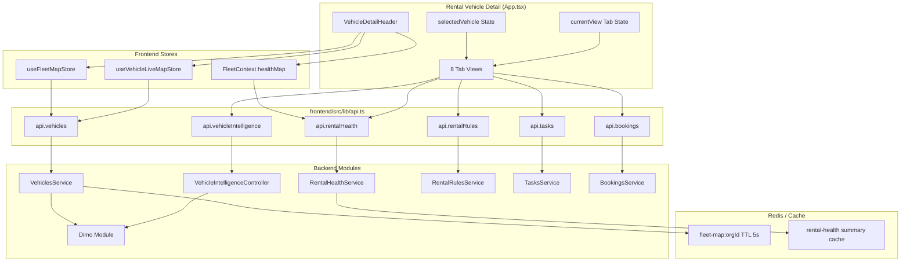
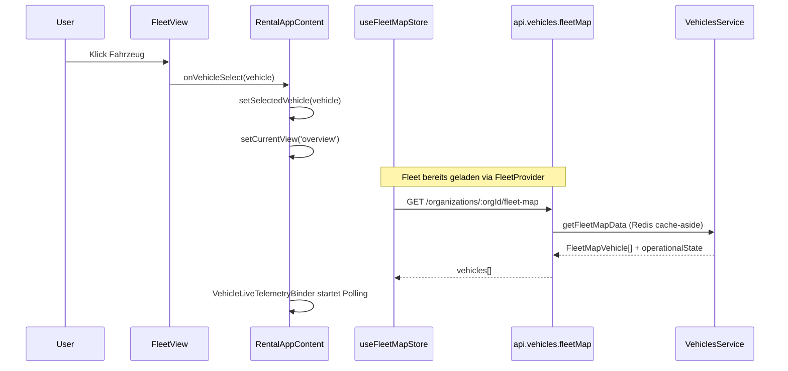
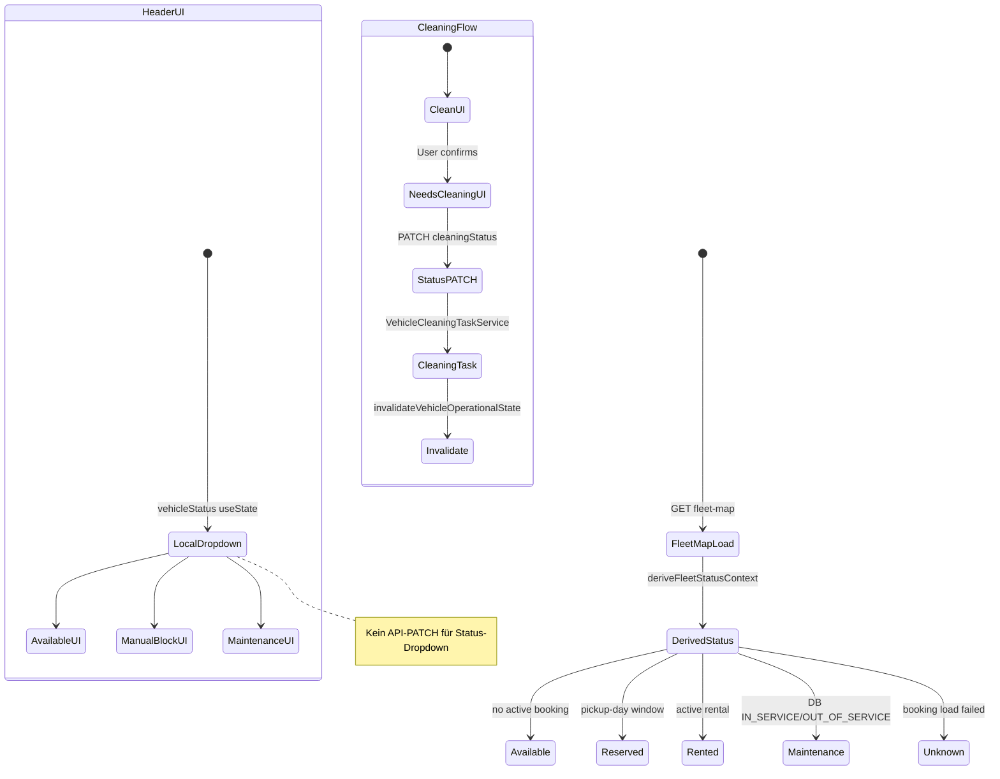
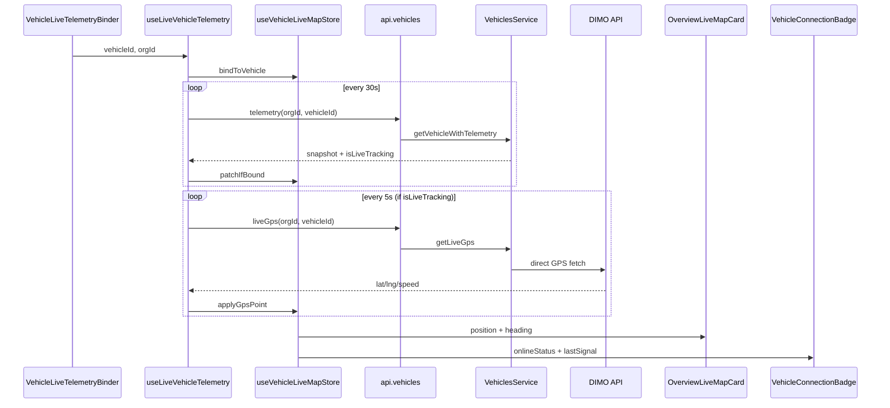
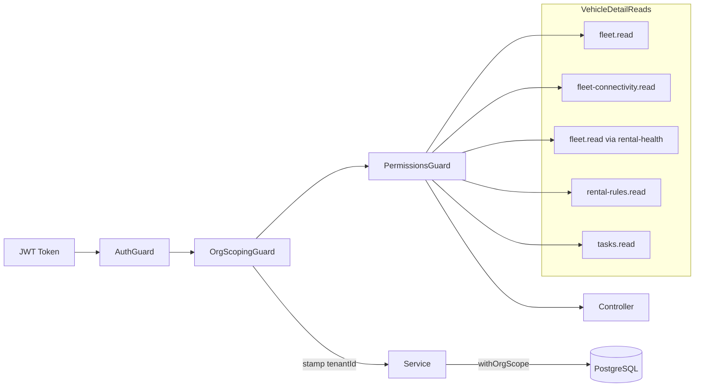

# Vehicle Detail Page — Vollständige Abhängigkeits- und Datenflusskarte

| Feld | Wert |
|------|------|
| **Audit-Datum** | 2026-07-24 |
| **Scope** | Production-Readiness-Remediation Prompt 1/36 — **nur Analyse, kein Produktivcode** |
| **Repository** | `SYNQDRIVE-alpha` |
| **Methode** | Code-Inspektion Frontend + Backend + Tests + indirekte Abhängigkeiten |
| **Verwandte Audits** | [`vehicle-operational-state-v2-final-audit.md`](./vehicle-operational-state-v2-final-audit.md), [`../architecture/TRIP_SYSTEM_AUDIT_2026-04-10.md`](../architecture/TRIP_SYSTEM_AUDIT_2026-04-10.md) |

---

## Scope

Diese Karte dokumentiert die **Rental Vehicle Detail Page** unter `/rental` — die 8-Tab-Oberfläche (Overview, Trips, Health, Damages, Documents, Bookings, Task List, Requirements), die **nicht** als eigene React-Router-Route existiert, sondern als **View-State-Shell** in `frontend/src/rental/App.tsx`.

**Eingeschlossen:**

- Öffnen/Schließen, Fahrzeugauswahl, Tab-Routing
- Alle 8 Tabs inkl. Header, Live Map, Telemetrie, GPS, Device Connection
- Statusänderungen, Reinigungsstatus, Rental Readiness
- Backend-APIs, DB-Modelle, Redis-Caches, Provider (DIMO, Mapbox)
- Berechtigungen, Tenant-Isolation, Data Authorization, Audit Logging
- Query-Invalidierung, Zustandsspeicher, Tests
- Parallele/veraltete Implementierungen außerhalb des `vehicle-detail/`-Ordners

**Ausgeschlossen (separate Oberflächen, nur Querverweise):**

- Operator-App (`/operator/vehicles/:vehicleId`)
- Fleet Health/Service Drill-down (`HealthVehicleDetailDrawer` in Fleet Hub)
- Master-Admin-Fahrzeugverwaltung

---

## Executive Summary

| Aspekt | Befund |
|--------|--------|
| **Architekturmodell** | Monolithischer View-State in `RentalAppContent` — kein Deep-Link pro Tab/Fahrzeug |
| **Fahrzeugauswahl SoT** | `selectedVehicle` (`useState` in `App.tsx`), gespeist aus `useFleetMapStore` via `FleetContext` |
| **Operativer Status SoT** | Backend `deriveFleetStatusContext` → `GET /organizations/:orgId/fleet-map` |
| **Rental Readiness SoT** | `RentalHealthService` → `GET .../rental-health` (nicht Legacy-`healthStatus`-Spalte) |
| **Telemetrie SoT** | `VehiclesService.getVehicleWithTelemetry` + `getLiveGps` (DIMO-backed) |
| **Trip-Grenzen SoT** | DIMO Segments via `DimoSegmentsService` / `TripsService` |
| **Invalidierung** | Custom Bus `vehicle-operational-query` (kein React Query) |
| **Hauptrisiko** | Header-Status-Dropdown (`Available`/`Manual Block`/`Maintenance`) ist **lokal** und persistiert **nicht** via API; Cleaning Status hingegen schon |

---

## Untersuchte Dateien (Kern)

### Frontend — Shell & Routing

| Datei | Rolle |
|-------|-------|
| `frontend/src/App.tsx` | Root-Router: `/rental` → `RentalApp` |
| `frontend/src/rental/App.tsx` | **Orchestrator**: `currentView`, `selectedVehicle`, Tabs, Header, Telemetry-Binder |
| `frontend/src/rental/context/RentalEntityNavigationContext.tsx` | `openVehicleById`, Cross-Feature-Navigation |
| `frontend/src/rental/lib/vehicle-overview.types.ts` | `VehicleDetailTab` Typ |
| `frontend/src/rental/lib/vehicle-overview-navigation.ts` | Tab-Navigation-Adapter |

### Frontend — Vehicle Detail Komponenten

| Datei | Rolle |
|-------|-------|
| `frontend/src/rental/components/vehicle-detail/VehicleDetailHeader.tsx` | Header: Back, Status/Cleaning-Dropdowns, Badges |
| `frontend/src/rental/components/vehicle-detail/VehicleDetailHeaderBadges.tsx` | Connection, Health, OBD, Driving-Quality Chips |
| `frontend/src/rental/components/vehicle-detail/VehicleOverviewTab.tsx` | Overview-Layout |
| `frontend/src/rental/components/vehicle-detail/OverviewLiveMapCard.tsx` | Live Map Card |
| `frontend/src/rental/components/vehicle-detail/VehicleHealthBoxWired.tsx` | Health Box + Telemetry Bridge |
| `frontend/src/rental/components/vehicle-detail/VehicleDeviceConnectionCard.tsx` | Device Connection Summary |
| `frontend/src/rental/components/vehicle-detail/VehicleRequirementsTab.tsx` | Requirements Tab |
| `frontend/src/rental/components/vehicle-detail/index.ts` | Barrel exports |

### Frontend — Tab-Views (außerhalb vehicle-detail/)

| Datei | Tab |
|-------|-----|
| `frontend/src/rental/components/trips/VehicleTripsTab.tsx` | Trips |
| `frontend/src/rental/components/HealthErrorsView.tsx` | Health |
| `frontend/src/rental/components/DamagesView.tsx` | Damages |
| `frontend/src/rental/components/DocumentsView.tsx` | Documents |
| `frontend/src/rental/components/VehicleBookingsView.tsx` | Bookings |
| `frontend/src/rental/components/VehicleTasksView.tsx` | Task List |

### Frontend — Stores, Hooks, Lib

| Datei | Rolle |
|-------|-------|
| `frontend/src/rental/stores/useFleetMapStore.ts` | Fleet-Map-Fahrzeuge, Filter, `selectedVehicleId` |
| `frontend/src/rental/stores/useVehicleLiveMapStore.ts` | Live-Telemetrie/GPS pro Detail-Fahrzeug |
| `frontend/src/rental/FleetContext.tsx` | `fleetVehicles`, `healthMap`, Invalidierungs-Handler |
| `frontend/src/rental/RentalContext.tsx` | `orgId`, `hasPermission` |
| `frontend/src/rental/hooks/useLiveVehicleTelemetry.ts` | GPS 5s + Dashboard 30s Polling |
| `frontend/src/rental/hooks/useVehicleOverviewSummary.ts` | Overview-Aggregation |
| `frontend/src/rental/hooks/useVehicleHealth.ts` | Rental Health V1 |
| `frontend/src/rental/hooks/useVehicleDamages.ts` | Damages-Liste |
| `frontend/src/rental/hooks/useVehicleFileSummary.ts` | Documents/File Summary |
| `frontend/src/rental/hooks/useVehicleRentalRequirements.ts` | Requirements |
| `frontend/src/rental/lib/vehicle-operational-query/*` | Invalidierungs-Bus |
| `frontend/src/rental/lib/vehicle-operational-state/*` | Operative Status-Selectors |
| `frontend/src/lib/api.ts` | Zentraler API-Client |

### Frontend — Map & Provider

| Datei | Rolle |
|-------|-------|
| `frontend/src/components/MapboxMap.tsx` | Mapbox GL Wrapper |
| `frontend/src/rental/components/LiveMapOverview.tsx` | Overview-Map |
| `frontend/src/rental/components/FleetView.tsx` | Fleet-Einstieg → Vehicle Select |

### Backend — Kernmodule

| Datei | Rolle |
|-------|-------|
| `backend/src/modules/vehicles/vehicles.controller.ts` | Fleet-Map, Telemetry, GPS, Status-PATCH |
| `backend/src/modules/vehicles/vehicles.service.ts` | CRUD, operative Ableitung, Cache |
| `backend/src/modules/vehicle-intelligence/vehicle-intelligence.controller.ts` | Health, Trips, Damages, File Summary |
| `backend/src/modules/rental-health/rental-health.controller.ts` | Rental Readiness |
| `backend/src/modules/rental-rules/rental-rules.controller.ts` | Requirements |
| `backend/src/modules/tasks/tasks.controller.ts` | Tasks |
| `backend/src/modules/bookings/bookings.controller.ts` | Bookings |
| `backend/src/modules/dimo/*` | DIMO Telemetrie, Segments, Device Connection |
| `backend/src/modules/data-authorizations/*` | Telemetry Consent |
| `backend/src/shared/auth/*` | Guards, Permissions |

---

## Komponentenbaum

```
frontend/src/App.tsx
└── Route "/rental" → RentalApp (rental/App.tsx)
    └── RentalProvider → FleetProvider → DashboardInsightsProvider
        └── RentalAppContent
            ├── AppShell (variant="rental")
            │   ├── Sidebar                    → currentView='fleet' | andere Views
            │   └── TopBar                     → Suche → setSelectedVehicle + overview
            │
            ├── VehicleLiveTelemetryBinder     → useLiveVehicleTelemetry (alle VEHICLE_DETAIL_VIEWS)
            │
            ├── [showVehicleDetailChrome]
            │   ├── VehicleDetailHeader        → Badges, Status/Cleaning Dropdowns, onBack
            │   └── Tab Bar (8 Buttons)        → setCurrentView(tab.key)
            │
            └── Tab Content (currentView):
                ├── overview           → VehicleOverviewTab
                │   ├── VehicleServiceContextPanel
                │   ├── OverviewLiveMapCard → LiveMapOverview → MapboxMap
                │   ├── VehicleHealthBoxTelemetryBridge
                │   ├── VehicleDeviceConnectionCard
                │   └── VehicleDrivingAssessmentQualityOverviewCard
                ├── trips              → TripsView (VehicleTripsTab)
                ├── health-errors      → HealthErrorsView
                ├── damages            → DamagesView
                ├── documents          → DocumentsView
                ├── vehicle-bookings → VehicleBookingsView
                ├── vehicle-tasks      → VehicleTasksView
                └── vehicle-requirements → VehicleRequirementsTab
```

**Fleet als Einstieg (nicht Parent-Shell):**

```
currentView === 'fleet'
└── FleetHubView
    └── tab: status → FleetView → onVehicleSelect → handleVehicleSelect → overview
```

---

## Bereichs-Karten (1–26)

### 1. Öffnen und Schließen der Vehicle Detail Page

| Kategorie | Details |
|-----------|---------|
| **Frontend-Einstieg** | `frontend/src/rental/App.tsx` → `handleVehicleSelect`, `handleBackToFleet` |
| **Komponenten** | `VehicleDetailHeader` (Back-Button), Tab-Bar |
| **Hooks** | — |
| **Stores** | — |
| **API** | Kein dedizierter Open/Close-Endpoint |
| **Backend** | — |
| **Öffnen** | `setSelectedVehicle(vehicle)` + `setCurrentView('overview')` |
| **Schließen** | `setCurrentView('fleet')` + `setFleetTab('status')` |
| **Erkennung** | `VEHICLE_DETAIL_VIEWS.has(currentView)` → `showVehicleDetailChrome` |
| **Tests** | Keine dedizierten E2E-Tests für Open/Close |
| **Redundanzen** | Operator-App hat separate URL-basierte Navigation |

### 2. Auswahl des Fahrzeugs

| Kategorie | Details |
|-----------|---------|
| **SoT** | `selectedVehicle: VehicleData \| null` in `App.tsx` `useState` |
| **Datenquelle** | `useFleetVehicles()` → `useFleetMapStore.vehicles` |
| **Auto-Select** | Erstes Fleet-Fahrzeug wenn `!selectedVehicle` nach Fleet-Load |
| **Sync** | `useEffect` merged `status`/`cleaningStatus` aus `fleetVehicles` zurück |
| **Map-Selection** | Separates `selectedVehicleId` in `useFleetMapStore` (Fleet-Highlight) |
| **Einstiegspunkte** | FleetView, Dashboard, TopBar-Suche, Bookings, Finance, `RentalEntityNavigationContext.openVehicleById` |
| **Limitation** | `openVehicleById` findet nur Fahrzeuge in geladener `fleetVehicles`-Liste |
| **Tests** | `fleet-map-vehicle-store.utils.test.ts`, `fleet-map-sync.test.ts` |

### 3. Routing und aktiver Tab

| Kategorie | Details |
|-----------|---------|
| **Mechanismus** | `currentView` State — **keine URL** für Vehicle Detail |
| **Tab-Keys** | `overview`, `trips`, `health-errors`, `damages`, `documents`, `vehicle-bookings`, `vehicle-tasks`, `vehicle-requirements` |
| **Typ** | `VehicleDetailTab` in `vehicle-overview.types.ts` |
| **Navigation** | Inline Tab-Buttons in `App.tsx`; `createVehicleOverviewNavigator` für programmatische Sprünge |
| **URL-Sync** | Nur Fleet Hub Health/Service (`?tab=&workSection=`) — nicht Vehicle Detail |
| **sessionStorage** | Fleet-Tab, Settings-Tab — nicht Vehicle-Detail-Tab |
| **Tests** | `vehicle-overview-regression.test.ts` |

### 4. Vehicle Detail Header

| Kategorie | Details |
|-----------|---------|
| **Komponente** | `VehicleDetailHeader.tsx` |
| **Props** | `vehicle`, `vehicleStatus`, `cleaningStatus`, Dropdown-States, Callbacks |
| **Badges** | `VehicleDetailHeaderBadges.tsx`: `VehicleConnectionBadge`, `VehicleHealthChip`, `ObdUnpluggedBadge` |
| **Display** | `resolveFleetVehicleDisplayState` + `useEffectiveHealth` für Readiness-Chip |
| **Permissions** | `hasPermission` aus `RentalContext` (für einige Aktionen) |
| **Callout** | `VehicleOperationalStatusCallout` bei unreliable operational state |
| **Backend** | Fleet-Map + Rental-Health für Badge-Daten |
| **Tests** | `fleetVehicleDisplay.test.ts`, `VehicleOperationalStatusCallout.test.tsx` |

### 5. Overview Tab

| Kategorie | Details |
|-----------|---------|
| **Komponente** | `VehicleOverviewTab.tsx` |
| **Hook** | `useVehicleOverviewSummary` (nur wenn `currentView === 'overview'`) |
| **Unterkomponenten** | `VehicleServiceContextPanel`, `OverviewLiveMapCard`, `VehicleHealthBoxWired`, `VehicleDeviceConnectionCard`, `VehicleDrivingAssessmentQualityOverviewCard`, `VehicleOverviewFreshnessHint` |
| **APIs** | Bookings list, tasks forVehicle, damage stats, file summary, trip stats, today trips |
| **Mapper** | `vehicle-overview-summary.utils.ts`, `vehicle-overview-cards.utils.ts`, `vehicle-overview-readiness.utils.ts` |
| **Tests** | `vehicle-overview-summary.utils.test.ts`, `vehicle-overview-regression.test.ts` |

### 6. Live Map

| Kategorie | Details |
|-----------|---------|
| **Komponenten** | `OverviewLiveMapCard` → `LiveMapOverview` → `MapboxMap` |
| **Store** | `useVehicleLiveMapStore` (Position, Heading, Speed) |
| **Hook** | `useLiveVehicleTelemetry` (via `VehicleLiveTelemetryBinder` in App) |
| **Position-Logik** | `deriveOverviewMapPosition` in `overview-map-position.ts` |
| **Provider** | **Mapbox** (`mapbox-gl` via `MapboxMap.tsx`) |
| **Backend** | `GET .../telemetry`, `GET .../live-gps` |
| **Tests** | `overview-map-position.test.ts` |

### 7. Trips

| Kategorie | Details |
|-----------|---------|
| **Komponente** | `TripsView` / `VehicleTripsTab.tsx` |
| **Hooks** | `useTripsTab` → `useVehicleTrips`, `useTripRoute`, `useTripDetail`, `useTripEnrichment`, `useTripBehaviorEvents` |
| **API** | `api.vehicleIntelligence.trips`, `tripsTimeline`, `tripRoute`, `reconcileTrips`, `enrichTrip`, `tripBehaviorEvents` |
| **Controller** | `vehicle-intelligence.controller.ts` |
| **Service** | `TripsService`, `DimoSegmentsService` (kanonische Grenzen) |
| **DB** | `VehicleTrip`, `VehicleTripWaypoint`, `TripBehaviorEvent`, `VehicleTripDetectionState` |
| **Filter** | `selectedDate`, `selectedDriver` in `App.tsx` (Trips-Filter-Bar) |
| **Cache** | `Cache-Control: no-store` auf Trip-Endpoints |
| **Tests** | Backend: `trips.service.tenant.spec.ts`, `trip-detection.spec.ts`; Frontend: Trips-Hooks indirekt |

### 8. Health / Zustand & Service

| Kategorie | Details |
|-----------|---------|
| **Komponente** | `HealthErrorsView.tsx` (~3700 LOC, monolithisch) |
| **Hooks** | `useEffectiveHealth`, diverse inline `useEffect`+`api.vehicleIntelligence.*` |
| **APIs** | Battery, Tires, Brakes, DTC, Service-Info, Oil-Change, HV-Battery, AI Health Care, Dashboard Warning Lights |
| **Rental Health** | `useFleetHealthMap` / `api.rentalHealth.getVehicle` |
| **Controller** | `vehicle-intelligence.controller.ts` @ `vehicles/:vehicleId` |
| **Services** | `BatteryHealthService`, `TiresService`, `BrakesService`, `DtcService`, `VehicleHealthTabSummaryService`, `ServiceComplianceService` |
| **Parallele UI** | `HealthVehicleDetailDrawer` + `HealthVehicleDetailPanel` in Fleet Condition (separater Drill-down) |
| **Tests** | `useVehicleHealth.test.ts`, `vehicle-health-tab-summary.service.spec.ts`, viele Battery/Tire/Brake Specs |

### 9. Damages

| Kategorie | Details |
|-----------|---------|
| **Komponente** | `DamagesView.tsx` |
| **Hooks** | `useVehicleDamages`, `useVehicleDamageActions`, `useDamageHandoverRefs` |
| **API** | `api.vehicleIntelligence.getVehicleDamages`, `getDamageStats`, CRUD, `analyzeExteriorPhotosForDamage` |
| **Exterior Images** | `api.vehicles.exteriorImages.listEffective` |
| **Service** | `DamagesService`, `VehicleExteriorImagesService` |
| **DB** | `VehicleDamage`, `VehicleDamageImage`, `VehicleExteriorImage` |
| **Permissions** | Implizit via Auth + VehicleOwnershipGuard |
| **Tests** | `damages.service.spec.ts` |

### 10. Documents

| Kategorie | Details |
|-----------|---------|
| **Komponente** | `DocumentsView.tsx` |
| **Hook** | `useVehicleFileSummary` |
| **API** | `api.vehicleIntelligence.vehicleFileSummary`, Document Extraction Upload/Confirm |
| **Drawer** | `VehicleDocumentUploadDrawer` (AI Upload Flow) |
| **Controller** | `vehicle-intelligence.controller.ts` (`file-summary`), `document-extraction.controller.ts` |
| **DB** | `VehicleDocumentExtraction`, Compliance-Kategorien |
| **Regel** | AI Upload: never auto-apply — Confirm vor Apply |
| **Tests** | `vehicle-file.hardening.test.ts`, `document-extraction-session.test.ts` |

### 11. Bookings

| Kategorie | Details |
|-----------|---------|
| **Komponente** | `VehicleBookingsView.tsx` |
| **Unterkomponenten** | `VehicleAvailabilityTimeline`, `VehicleBookingsAgenda`, `VehicleBookingReadinessStrip`, `VehicleBookingQuickDrawer` |
| **API** | `api.bookings.list` mit `vehicleId`, Readiness via Rental Health |
| **Controller** | `bookings.controller.ts` |
| **Operational Impact** | Handover Pickup/Return → `invalidateVehicleOperationalState` |
| **Lib** | `vehicle-booking-agenda.utils.ts`, `vehicle-booking-risk.utils.ts`, `vehicle-availability-timeline.utils.ts` |
| **Tests** | `vehicle-operational-booking-display.test.ts`, `booking-eligibility-*.spec.ts` |

### 12. Tasks

| Kategorie | Details |
|-----------|---------|
| **Komponente** | `VehicleTasksView.tsx` |
| **Dialoge/Drawer** | `CreateVehicleTaskDialog`, `VehicleTaskDetailDrawer`, `VehicleTaskActionCenter` |
| **API** | `api.tasks.forVehicle`, CRUD auf `organizations/:orgId/tasks` |
| **Refresh** | `vehicleTasksRefreshToken` in App.tsx (nach Cleaning-Status-Change) |
| **Highlight** | `highlightedVehicleTaskId` für Deep-Link aus anderen Tabs |
| **Service** | `TasksService`, `VehicleCleaningTaskService` |
| **DB** | `OrgTask` + Kind-Tabellen |
| **Tests** | `vehicle-cleaning-task.service.spec.ts`, `task-display.utils.test.ts` |

### 13. Requirements

| Kategorie | Details |
|-----------|---------|
| **Komponente** | `VehicleRequirementsTab.tsx` |
| **Hook** | `useVehicleRentalRequirements` |
| **Permissions** | `useRentalRulesPermissions` → `rental-rules.read`, `rental-rules.manage` |
| **API** | `api.rentalRules.getVehicleEffective`, `getVehicleRequirements`, `getDefaults`, Override CRUD |
| **Drawer** | `VehicleCategoryAssignDrawer`, `VehicleOverrideEditorDrawer` |
| **Controller** | `rental-rules.controller.ts` |
| **DB** | `VehicleRentalRequirementOverride`, `RentalVehicleCategory`, `RentalRuleRevision` |
| **Tests** | Rental-rules Frontend/Backend Specs (indirekt) |

### 14. Statusänderungen

| Kategorie | Details |
|-----------|---------|
| **UI** | Header-Dropdown: Available / Manual Block / Maintenance |
| **Frontend-State** | `vehicleStatus` in `App.tsx` — **lokaler useState** |
| **Persistenz** | ⚠️ `handleVehicleStatusChange` setzt **nur lokalen State** — **kein API-Call** für operativen Status |
| **Anzeige-SoT** | `resolveFleetVehicleDisplayState(vehicle)` aus Fleet-Map-Daten (abgeleitet) |
| **Backend-Writes** | `PATCH .../vehicles/:vehicleId/status` — erlaubt `AVAILABLE`, `IN_SERVICE`, `OUT_OF_SERVICE` + `cleaningStatus`, `healthStatus` |
| **Abgeleitete Status** | `RENTED`/`RESERVED` kommen aus Bookings/Handover — nicht per PATCH schreibbar |
| **Risiko** | UI-Dropdown und Backend-PATCH sind **nicht verdrahtet** für Manual Block/Maintenance |
| **Tests** | `vehicles.controller.status-patch.spec.ts`, `vehicle-operational-state-v2.*.spec.ts` |

### 15. Reinigungsstatus

| Kategorie | Details |
|-----------|---------|
| **UI** | Header Cleaning-Dropdown: Clean / Needs Cleaning |
| **Persistenz** | `persistCleaningStatus` → `api.vehicles.updateOperationalStatus` mit `cleaningStatus` |
| **Backend** | `NEEDS_CLEANING` → `VehicleCleaningTaskService.ensureCleaningTask`; `CLEAN` → Task abschließen |
| **Invalidierung** | `invalidateVehicleOperationalState` reason `vehicle-status-patch` |
| **Navigation** | Bei Task-Erstellung → `vehicle-tasks` Tab + `highlightedVehicleTaskId` |
| **DB** | `Vehicle.cleaningStatus`, `OrgTask` (Typ `VEHICLE_CLEANING`) |
| **Tests** | `vehicle-cleaning-task.service.spec.ts`, `vehicle-cleaning-task.integration.spec.ts` |

### 16. Rental Readiness

| Kategorie | Details |
|-----------|---------|
| **SoT** | `RentalHealthService` → 5-State Model mit `rental_blocked` Gate |
| **API** | `GET /organizations/:orgId/vehicles/:vehicleId/rental-health` |
| **Frontend** | `useFleetHealthMap` (Fleet-weit) + `useEffectiveHealth(vehicleId)` |
| **Anzeige** | Header Readiness-Chip, `VehicleBookingReadinessStrip`, Health-Tab Rental-State-Pills |
| **Nicht SoT** | Legacy `Vehicle.healthStatus` DB-Spalte |
| **Cache** | `RentalHealthSummaryCacheService` (Redis, Fleet-Batch; Detail immer live) |
| **Tests** | `rental-health.service.spec.ts`, `rental-health-summary-cache.service.spec.ts`, `useVehicleHealth.test.ts` |

### 17. Telemetrie

| Kategorie | Details |
|-----------|---------|
| **Hook** | `useLiveVehicleTelemetry` |
| **Polling** | GPS 5s (`/live-gps`) wenn `isLiveTracking`; Dashboard 30s (`/telemetry`) immer |
| **Store** | `useVehicleLiveMapStore` |
| **Backend** | `VehiclesService.getVehicleWithTelemetry`, `DimoTelemetryService` |
| **DB** | `VehicleLatestState`, `VehiclePositionUpdate`, `DimoPollLog` |
| **Freshness** | `telemetryFreshness.ts`, `telemetry-freshness.resolver.ts` (Backend) |
| **Tests** | `telemetryFreshness.test.ts` |

### 18. GPS-Position

| Kategorie | Details |
|-----------|---------|
| **Live** | `GET .../live-gps` — direkter DIMO-Proxy, kein DB-Roundtrip |
| **Fallback** | Koordinaten aus `/telemetry` wenn nicht live tracking |
| **Frontend** | `applyGpsPoint` mit Jitter-Filter (8m), Heading aus History |
| **Map** | `deriveOverviewMapPosition` — Modi: `livePosition`, `lastKnownPosition`, `staticPositionOnly`, `telemetryUnavailable`, `noPosition` |
| **Static Fallback** | `selectedVehicle.lat/lng` aus Fleet-Map |
| **Provider** | DIMO → Backend → Frontend Store → Mapbox |

### 19. Device Connection

| Kategorie | Details |
|-----------|---------|
| **Overview Card** | `VehicleDeviceConnectionCard` → `api.vehicles.deviceConnection` |
| **Header Badge** | `VehicleConnectionBadge` — Online/Offline aus Live-Store |
| **OBD** | `useFleetObdPlugIndex` + `ObdUnpluggedBadge` |
| **Backend** | `DeviceConnectionQueryService`, `DeviceConnectionEpisodeService` |
| **DB** | `DeviceConnectionEpisode`, `DimoDeviceConnectionEvent`, Webhook Inbox |
| **Fleet Tab** | Separater `FleetConnectivityTab` + `FleetConnectivityDetailDrawer` |
| **Tests** | `fleet-connectivity-*.spec.ts`, `device-connection-*.spec.ts` |

### 20. Query-Invalidierungen

| Kategorie | Details |
|-----------|---------|
| **Bus** | `invalidateVehicleOperationalState` in `vehicle-operational-query/invalidate.ts` |
| **Kein React Query** | Custom Handler-Registry (`registry.ts`) |
| **Keys** | `vehicleOperationalQueryKeys`: fleetMap, fleetHealth, vehicleDetail, dashboard*, operator* |
| **Event** | `VEHICLE_OPERATIONAL_INVALIDATED_EVENT` (window CustomEvent) |
| **Optimistic** | `useFleetMapStore.applyOptimisticOperationalPatches` für Handover/Booking |
| **Registrierte Handler** | `FleetContext` (fleetMap + fleetHealth), `useVehicleOverviewSummary` (vehicleDetail) |
| **Trigger** | Booking CRUD, Handover, Status-PATCH (cleaning), `bumpBookingsVersion` |
| **Tests** | `vehicle-operational-query.test.ts` |

### 21. Zustandsspeicher

| Store | Scope | Daten |
|-------|-------|-------|
| `App.tsx useState` | Session | `selectedVehicle`, `currentView`, `vehicleStatus`, `cleaningStatus`, Tab-Filter |
| `useFleetMapStore` | Org | Fleet-Fahrzeuge, Filter, `selectedVehicleId`, Optimistic Patches |
| `useVehicleLiveMapStore` | 1 Fahrzeug | GPS, Telemetrie-Snapshot, Online-Status |
| `FleetContext` | Org | `healthMap`, `fleetVehicles` (derived) |
| `RentalContext` | Session | `orgId`, Permissions |
| `sessionStorage` | Persistiert | Fleet-Tab, Settings-Tab (nicht Vehicle Detail) |

### 22. Berechtigungen

| Kategorie | Details |
|-----------|---------|
| **Frontend** | `useRentalOrg().hasPermission(module, level)` |
| **Module (relevant)** | `fleet`, `fleet-connectivity`, `fleet-condition`, `tasks`, `rental-rules*`, `document-upload`, `data-analyse` |
| **Backend Guards** | `AuthGuard`, `OrgScopingGuard`, `PermissionsGuard`, `VehicleOwnershipGuard` |
| **Requirements Tab** | `useRentalRulesPermissions` |
| **Tasks** | `RequireTaskPermission` |
| **ORG_ADMIN** | Bypass für Permissions |
| **Tests** | `iam-endpoint-enforcement-triage.security.spec.ts` |

### 23. Organisations- und Tenant-Isolation

| Kategorie | Details |
|-----------|---------|
| **Frontend** | `orgId` aus JWT via `RentalContext`; alle API-Calls mit `organizations/:orgId/` |
| **Backend** | `OrgScopingGuard` stampft `request.tenantId`; `withOrgScope(organizationId)` in Services |
| **Vehicle Routes** | `VehicleOwnershipGuard` für `vehicles/:vehicleId` ohne org im Pfad |
| **Fleet Map** | Org-scoped Redis key `fleet-map:{orgId}:v1` |
| **Risiko** | `openVehicleById` nutzt nur lokale Fleet-Liste — kein Cross-Tenant, aber auch kein Fetch-by-ID Fallback |
| **Tests** | `trips.service.tenant.spec.ts`, diverse Org-Scope Specs |

### 24. Data Authorization

| Kategorie | Details |
|-----------|---------|
| **Modul** | `backend/src/modules/data-authorizations/` |
| **Zweck** | Telemetry/Provider Consent Grants |
| **DB** | Data Authorization Tabellen + Audit Log |
| **Enforcement** | `data-authorization-enforcement.service.ts` |
| **Vehicle Link** | `VehicleProviderConsent` Prisma-Modell |
| **UI** | Settings → Data Authorization Tab (nicht Vehicle Detail direkt) |
| **Impact** | Telemetrie-Zugriff kann ohne Consent eingeschränkt sein |
| **Tests** | `data-authorization-enforcement.service.spec.ts` |

### 25. Audit Logging

| Kategorie | Details |
|-----------|---------|
| **Activity Log** | `ActivityLogService` → `ActivityLog` (entity: VEHICLE) |
| **API** | `GET organizations/:orgId/activity-log?entity=&action=` |
| **Interceptor** | `audit.interceptor.ts` (global) |
| **Business Audit** | `business-audit-outbox.processor.ts` |
| **Task Automation** | `task-automation-audit.util.ts` |
| **Vehicle Detail** | Kein dediziertes Audit-UI im Detail — Logs org-weit |
| **Data Auth Audit** | Separater Audit-Log in Data-Authorizations-Modul |

### 26. Provider-Zugriffe (DIMO, Mapbox)

| Provider | Verwendung | Backend-Pfad |
|----------|------------|--------------|
| **DIMO** | Telemetrie, Live GPS, Segments, Device Connection, Webhooks | `modules/dimo/*`, `DimoTelemetryService`, `DimoSegmentsService` |
| **Mapbox** | Fleet Map, Overview Live Map, Trips Route Map | `MapboxMap.tsx`, `LiveMapOverview.tsx`, `useTripsRouteMap.ts` |
| **High Mobility** | Optional Health/Telemetry (HM vehicles) | `HmVehicleActivationService`, HM Endpoints in vehicle-intelligence |
| **Consent** | `VehicleProviderConsentService` | Vor DIMO-Zugriff |

---

## Datenflussdiagramme (Mermaid)

### Gesamtarchitektur



### Request-Flow: Fahrzeug öffnen



### Status-Flow: Operativ vs. Cleaning vs. Abgeleitet



### GPS-/Telemetrie-Flow



### Berechtigungs- und Tenant-Flow



---

## Erkannte redundante / veraltete Pfade

| ID | Pfad A | Pfad B | Risiko |
|----|--------|--------|--------|
| R-01 | Rental Vehicle Detail (`App.tsx`) | Operator `/operator/vehicles/:vehicleId` | Zwei Shells, unterschiedliche Routing-Modelle |
| R-02 | `HealthErrorsView` (Vehicle Detail Tab) | `HealthVehicleDetailDrawer` (Fleet Condition) | Parallele Health-Drill-down UIs |
| R-03 | `vehicleStatus` local state (Header Dropdown) | `deriveFleetStatusContext` (Fleet Map API) | **Dropdown schreibt nicht** — Anzeige-Drift |
| R-04 | Legacy `Vehicle.healthStatus` DB-Spalte | `RentalHealthService` V1 | Legacy-Spalte nicht SoT für Readiness |
| R-05 | `api.rentalHealth.getFleet` (deprecated vehicleIds) | `getFleetScoped` paginated | Alte Batch-API noch vorhanden |
| R-06 | `api.vehicleIntelligence.brakeStatus` (deprecated) | `brakeHealthSummary/Detail` | Legacy Endpoint in api.ts markiert |
| R-07 | `api.vehicleIntelligence.syncTrips` (deprecated) | `reconcileTrips` | Alias auf gleichen Endpoint |
| R-08 | `figma-rental/App.tsx` | `rental/App.tsx` | Potenziell veraltete Figma-Mirror-Kopie |
| R-09 | `HealthErrorsView` monolithisch (~3700 LOC) | Modulare `vehicle-detail/*` Komponenten | Inkonsistente Architektur-Tiefe |
| R-10 | Fleet `selectedVehicleId` | Detail `selectedVehicle` | Zwei Selection-States, manuell synchronisiert |

---

## Bestehende Tests (Auswahl)

### Frontend

| Bereich | Dateien |
|---------|---------|
| Overview | `vehicle-overview-summary.utils.test.ts`, `vehicle-overview-regression.test.ts` |
| Operational State | `vehicle-operational-query.test.ts`, `vehicle-operational-state/*.test.ts` |
| Fleet Map | `fleet-map-vehicle-store.utils.test.ts`, `fleet-map-sync.test.ts`, `fleetVisualState.test.ts` |
| Rental Health | `useVehicleHealth.test.ts`, `rental-health-availability.test.ts` |
| Telemetry | `telemetryFreshness.test.ts`, `overview-map-position.test.ts` |
| Health Mappers | `vehicle-health-box.mapper.test.ts`, `vehicle-health-display.mapper.test.ts` |
| Fleet Health Service | `fleet-health-service-vehicle-overview.test.ts` |

### Backend

| Bereich | Dateien |
|---------|---------|
| Operational State V2 | `vehicle-operational-state-v2.*.spec.ts` (8+ Dateien) |
| Status PATCH | `vehicles.controller.status-patch.spec.ts` |
| Rental Health | `rental-health*.spec.ts` (13 Dateien) |
| Cleaning Tasks | `vehicle-cleaning-task.service.spec.ts`, `.integration.spec.ts` |
| Trips | `trip-detection.spec.ts`, `trips.service.tenant.spec.ts` |
| Damages | `damages.service.spec.ts` |
| Fleet Connectivity | `vehicles.controller.fleet-connectivity.spec.ts` |
| IAM | `iam-endpoint-enforcement-triage.security.spec.ts` |

### Fehlende / dünne Abdeckung

- Kein E2E für Vehicle Detail Open/Close/Tab-Wechsel
- Kein Test für Header Status-Dropdown (lokaler State ohne API)
- `HealthErrorsView` — begrenzte isolierte Unit-Tests wegen Monolith

---

## Source-of-Truth-Kandidaten

| Domäne | Kanonische Quelle | Nicht verwenden als SoT |
|--------|-------------------|------------------------|
| Fahrzeugliste + operativer Status | `GET /organizations/:orgId/fleet-map` → `deriveFleetStatusContext` | Raw `vehicle.status` in UI-State |
| Rental Readiness | `GET .../rental-health` → `RentalHealthService` | `Vehicle.healthStatus` Spalte |
| Trip-Grenzen | DIMO Segments → `TripsService` | Ad-hoc Signal-Segmentierung |
| Live GPS (tracking) | `GET .../live-gps` (DIMO direct) | Fleet-Map statische lat/lng |
| Telemetrie-Snapshot | `GET .../telemetry` → `VehicleLatestState` | Frontend-only Berechnungen |
| Cleaning | `PATCH .../status` cleaningStatus + `OrgTask` VEHICLE_CLEANING | Nur UI-State |
| Requirements | `GET .../rental-requirements/effective` | Org defaults allein |
| Device Connection | `DeviceConnectionEpisode` + Query Service | Nur Online-Badge ohne Episode-Kontext |
| Permissions | JWT `permissions` JSON + Backend Guards | Frontend-only Checks |

---

## Erkannte Risiken

| ID | Priorität | Beschreibung |
|----|-----------|--------------|
| RK-01 | **P0** | Header Status-Dropdown (Manual Block/Maintenance) persistiert nicht — UI täuscht Schreiboperation vor |
| RK-02 | **P1** | Kein URL Deep-Link — Refresh verliert Tab + Fahrzeugkontext |
| RK-03 | **P1** | `openVehicleById` scheitert wenn Fahrzeug nicht in geladener Fleet-Map (kein Fallback-Fetch) |
| RK-04 | **P1** | Zwei Health-UIs (Detail Tab vs. Fleet Drawer) — unterschiedliche Feature-Tiefe unklar |
| RK-05 | **P2** | `vehicleStatus` local state kollabiert Reserved/Rented (siehe vehicle-operational-state-v2 audit R-09) |
| RK-06 | **P2** | `HealthErrorsView` Monolith — Wartbarkeit, Testbarkeit, Remediation-Risiko |
| RK-07 | **P2** | Fleet Map Hard-Cap 500 Fahrzeuge — große Flotten: Fahrzeug evtl. nicht in `fleetVehicles` |
| RK-08 | **P2** | Custom Invalidierungs-Bus statt React Query — Handler-Registrierung leicht zu vergessen |
| RK-09 | **P3** | `figma-rental/App.tsx` mögliche Drift-Kopie |
| RK-10 | **P3** | Deprecated API-Aliase in `api.ts` noch exportiert |

---

## Offene Fragen (weiterer Code-Review)

1. Soll der Header Status-Dropdown an `PATCH .../status` angebunden werden, oder ist er bewusst nur UI-Vorschau?
2. Welche Health-Features existieren nur in `HealthErrorsView` vs. `HealthVehicleDetailPanel` — Soll-Abgleich für Remediation?
3. Gibt es einen geplanten URL-Schema-Migration (`/rental/vehicles/:id/:tab`)?
4. Wie verhält sich Vehicle Detail bei Org-Switch mid-session — wird `selectedVehicle` invalidiert?
5. Ist `VehicleOverviewQuickView` / Quick-Card-Navigation vollständig entfernt oder nur deprecated Props?
6. Welche Data-Authorization-Checks greifen konkret bei `getLiveGps` vs. `getVehicleWithTelemetry`?
7. Soll `useFleetObdPlugIndex` auf Vehicle-Detail-Ebene gecacht oder pro Request geladen werden?
8. Welche Activity-Log-Actions werden bei Vehicle-Detail-Mutationen (Damage, Task, Cleaning) garantiert geschrieben?
9. ClickHouse-Rolle für Trip-Route-Geometrie — wann Fallback auf Waypoints?
10. Operator-Parität: Welche Rental-Detail-Features fehlen in `/operator/vehicles/:vehicleId`?

---

## Änderungshistorie

| Datum | Autor | Änderung |
|-------|-------|----------|
| 2026-07-24 | Cloud Agent Prompt 1/36 | Initiale Abhängigkeitskarte erstellt (Analyse only) |
