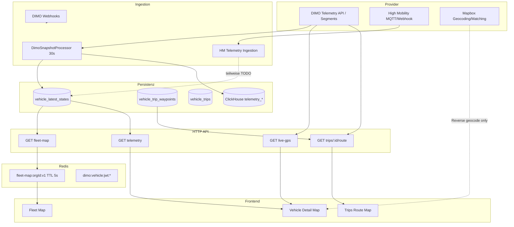

# Vehicle Detail Page — GPS- & Positions-Endpunkte Inventar

| Feld | Wert |
|------|------|
| **Audit-Datum** | 2026-07-24 |
| **Prompt** | 14/36 — Inventar; **15/36 — GPS-Autorisierung konsolidiert** |
| **Vorgänger** | [`vehicle-detail-page-telemetry-timestamps-2026-07.md`](./vehicle-detail-page-telemetry-timestamps-2026-07.md) (Prompts 11–13) |
| **Scope** | Inventar (Prompt 14) + zentrale GPS-Autorisierung (Prompt 15) |

---

## Ziel

Vollständige Bestandsaufnahme aller direkten und indirekten Wege, über die GPS- oder Positionsdaten abgerufen, gespeichert, gecacht oder ausgeliefert werden — mit Fokus auf Autorisierung, Org-Scoping, Cache-Keys und Audit-Pfade.

---

## Kanonische Architektur (Kurzüberblick)

**Kernregel:** Letzte bekannte Fahrzeugposition lebt in `vehicle_latest_states`. Seit Prompt 15/36 laufen positionsbezogene HTTP-Reads und DIMO-Snapshot-Ingest über **`GpsPositionAccessService`** (`backend/src/modules/data-authorizations/gps-position-access.service.ts`), der den bestehenden **`DataAuthorizationEnforcementService`** wiederverwendet — keine parallele Auth-Architektur.

---

## Matrix — Backend (Abruf, Speicherung, Jobs)

| Pfad | Controller / Job | Service | Provider / Cache | Org-Scoping | Permission | Data Authorization | Zweck | Audit Log | Retention |
|------|------------------|---------|------------------|-------------|------------|-------------------|-------|-----------|-----------|
| `GET /organizations/:orgId/vehicles/:vehicleId/live-gps` | `VehiclesController.getLiveGps` | `VehiclesService.getLiveGps` → `GpsPositionAccessService.assertVehicleGpsAccess(LIVE_MAP)` → `DimoTelemetryService.fetchLastSeenLocation` | DIMO GraphQL direkt; Fallback `latestState` (`source: cache`) — **kein Redis** | Ja (`id` + `organizationId`) | `fleet:read` + `OrgScopingGuard` | **Ja** — `GPS_LOCATION` / `LIVE_MAP` via zentraler Gate | Vehicle-Detail-Live-Karte (5s Poll) | `AuditService` SYNC + `accessCount` auf Consent-Row | Live: ephemeral; Fallback in `vehicle_latest_states` |
| `GET /organizations/:orgId/vehicles/:vehicleId/telemetry` | `VehiclesController.getVehicleTelemetry` | `VehiclesService.getVehicleWithTelemetry` → `GpsPositionAccessService.assertVehicleGpsAccess(TECHNICAL_OVERVIEW)` vor Read/DIMO | `latestState` + optional DIMO `fetchLastSeenLocation` wenn coords fehlen oder `isLiveTracking` | Ja | `fleet:read` | **Ja** — `TELEMETRY_DATA` / `TECHNICAL_OVERVIEW` | Vehicle-Detail-Dashboard-Snapshot (30s Poll) | `AuditService` SYNC | `vehicle_latest_states` |
| `GET /organizations/:orgId/fleet-map` | `VehiclesController.getFleetMap` | `VehiclesService.getFleetMapData` → `GpsPositionAccessService.assertOrgFleetGpsAccess(FLEET_ANALYTICS)` **vor** Redis-Read | PG `latestState` + **Redis** `fleet-map:{organizationId}:v1` TTL **5s** | Ja (`withOrgScope`, max 500) | `fleet:read` + `OrgScopingGuard` | **Ja** — org-weit `GPS_LOCATION` / `FLEET_ANALYTICS` | Fleet-Map, Dashboard-Fleet, statischer Vehicle-Detail-Fallback | `AuditService` SYNC (`accessKind: org_fleet`) | Redis 5s; PG persistent |
| `GET /organizations/:orgId/vehicles` | `VehiclesController.findAllByOrg` | `VehiclesService.findByOrganization` → `mapToVehicleData` | `latestState` lat/lng in List-DTO | Ja | `OrgScopingGuard` only | Nein | Fleet-Listen, Buchungs-Picker, Station-Zuweisung | Keiner | `vehicle_latest_states` |
| `GET /organizations/:orgId/vehicles/:vehicleId` | `VehiclesController.findOneByOrg` | `VehiclesService.findOne` | `latestState` | Ja | `OrgScopingGuard` only | Nein | Vehicle-Detail-Stammdaten | Keiner | `vehicle_latest_states` |
| `GET /organizations/:orgId/fleet-connectivity` | `VehiclesController.getFleetConnectivity` | `VehiclesService.getFleetConnectivity` | `latestState` lat/lng in Legacy-Feldern + Runtime-Projection | Ja | `fleet-connectivity:read` | Nein | Fleet Hub Connectivity-Tab (`signals.gps`, `hasLocation`) | Keiner | `vehicle_latest_states` |
| `GET /organizations/:orgId/fleet-connectivity/:vehicleId` | `VehiclesController.getFleetConnectivityDetail` | `VehiclesService.getFleetConnectivityDetail` | `latestState` + Device-Connection-Summary | Ja | `fleet-connectivity:read` | Nein | Connectivity-Detail-Drawer | Keiner | `vehicle_latest_states` |
| `GET /organizations/:orgId/vehicles/:vehicleId/device-connection` | `VehiclesController.getDeviceConnection` | `VehiclesService.getDeviceConnection` → `DeviceConnectionQueryService` | Webhook-Inbox / Episoden — **keine Live-Koordinaten** | Ja | **Nur** `OrgScopingGuard` — kein explizites Modul-Permission | Nein | OBD-Plug-Status, Episoden (Vehicle Detail Header) | Keiner | Device-Connection-Tabellen |
| `GET /vehicles/:vehicleId/trips` | `VehicleIntelligenceController` | `TripsService` | PG `vehicle_trips` (start/end lat/lng) | Ja (`VehicleOwnershipGuard` → `organizationId`) | **Kein** `@RequirePermission` auf Trip-Reads | Nein (TODO in Enforcement-Service) | Trips-Liste Vehicle Detail | Keiner | `vehicle_trips` — kein Default-Prune |
| `GET /vehicles/:vehicleId/trips/:tripId/route` | `VehicleIntelligenceController` | `TripsService.getRouteForTrip` → `GpsPositionAccessService.assertVehicleGpsAccess(TRIPS)` → `DimoSegmentsService.fetchRouteEnrichment` | DIMO Segments 7s-Buckets; Cache in PG `vehicle_trip_waypoints` | Ja | `VehicleOwnershipGuard` only | **Ja** — `TRIP_DATA` / `TRIPS` | Trips-Route-Map | `AuditService` SYNC | Waypoints: opt-in `RETENTION_TRIP_WAYPOINTS_DAYS` (default 0) |
| `GET /vehicles/:vehicleId/trips/:tripId` | `VehicleIntelligenceController` | `TripsService` | PG Trip + optional CH Evidence | Ja | `VehicleOwnershipGuard` only | Nein | Trip-Detail (Start/End-Koordinaten) | Keiner | `vehicle_trips` |
| `POST /vehicles/:vehicleId/trips/:tripId/enrich` | `VehicleIntelligenceController` | `TripEnrichmentOrchestratorService` → `MapboxService` | Mapbox Map-Matching (extern) | Ja | `VehicleOwnershipGuard` only | Nein | Route-Enrichment / Road-Type | Keiner | Enrichment-Ergebnis in Trip-Metadaten |
| `GET /vehicles/:vehicleId/trips/:tripId/behavior-events` | `VehicleIntelligenceController` | Unified behavior read model | PG `driving_events` lat/lng | Ja | `VehicleOwnershipGuard` only | Nein | Verhaltens-Events auf Trip-Map | Keiner | `driving_events` — kein Default-Prune |
| `POST /vehicles/:vehicleId/trips/reconcile` | `VehicleIntelligenceController` | `TripReconciliationService` | DIMO Segments (kanonische Trip-Grenzen) | Ja | `VehicleOwnershipGuard` only | Nein | Trip-Reparatur / Backfill | Keiner | `trip_repairs` default 365d |
| `GET /organizations/:orgId/data-analyse/vehicles/:vehicleId/*` | `DataAnalyseController` | `DataAnalyseService` | CH `telemetry_snapshots` / `telemetry_waypoints` / HF | Ja | `data-analyse:read` | Nein | Interne Signal-/Pipeline-Diagnostik | Keiner | CH TTL: Snapshots 180d, Waypoints 365d (Migration 002) |
| `GET /organizations/:orgId/stations/:id/fleet` | `StationsController` | `StationsService` — Geofence-Shadow | Vergleicht Station lat/lng vs `latestState` (read-only) | Ja | `stations:read` | Nein | HOME/AWAY-Geofence-Anzeige | Keiner | `stations` persistent |
| `POST /organizations/:orgId/stations/backfill-coordinates` | `StationsController` | `StationsService` + Mapbox | Mapbox Forward Geocode → **Station** coords | Ja | `stations:manage` | Nein | Station-Koordinaten nachziehen | Keiner | `stations` |
| `POST /webhooks/dimo` | `DimoWebhookController` | `DeviceConnectionWebhookService`, `DtcService`, `RpmWebhookCandidateService` | DIMO Vehicle Triggers (öffentlich, HMAC/Verification-Token) | Vehicle via `tokenId` → `organizationId` | **Public** (Signatur/Token) | Nein | OBD plug/unplug, DTC, RPM — **keine GPS-Persistenz** | Keiner | Webhook-Inbox / Episoden |
| `POST /integrations/high-mobility/webhook/telemetry` | `HighMobilityWebhookController` | `HighMobilityTelemetryAppIngestionService` | HM `vehicle_location.get.coordinates` | VIN → Vehicle lookup | **Public** (HMAC) | Nein | HM-Telemetrie-Ingest (Location-Parsing) | `hm_stream_sync_logs` | HM sync logs 14d default |
| HM MQTT Consumers | `HighMobility*MqttConsumerService` | `HighMobilityTelemetryRoutingService` | HM Stream | VIN-scoped | Worker (intern) | Nein | Telemetry-Routing — **VLS-Write teilweise TODO** | Stream logs | 14–30d logs |
| BullMQ `dimo.snapshot.poll` | `DimoSnapshotProcessor` | `GpsPositionAccessService.assertSystemGpsIngest` → `DimoTelemetryService.fetchLatestVehicleSnapshot` | DIMO → normalisiert lat/lng | Vehicle `organizationId` in Job-Kontext | Worker | **Ja** — `TELEMETRY_DATA` / `TECHNICAL_OVERVIEW`, `INTERNAL_SYSTEM` | **Primärer Ingest** für `vehicle_latest_states` + CH Mirror | `AuditService` SYNC (`systemJob: dimo.snapshot.poll`) | Poll logs 30d; CH snapshots 180d |
| BullMQ `dimo.trip-tracking` | `TripTrackingProcessor` | `TripDetectionOrchestrationService` | Snapshot/Trip-FSM → Trip start/end coords, Waypoints | Per `vehicleId` | Worker | Nein | Live-Trip-Erkennung | `dimo_poll_logs` (TRIP_TRACKING) | `vehicle_trips`, waypoints opt-in prune |
| BullMQ `trip.behavior.enrichment` | `TripBehaviorEnrichmentProcessor` | `HfMirrorService` | DIMO HF → CH `telemetry_hf_points` | Per vehicle/trip | Worker | Nein | Post-Trip-Verhaltensanalyse | Keiner | CH HF TTL 90–365d |
| `TripReconciliationScheduler` | Scheduler | `TripReconciliationService` | DIMO Segments | Org via vehicle | Worker | Nein | Warm/Cold Trip-Repair | Keiner | `trip_repairs` 365d |
| `DataRetentionScheduler` | Scheduler | Prisma batch delete | — | Global | Worker | N/A | Prune append-only Tabellen | Keiner | Siehe Retention-Tabelle |
| WhatsApp AI `getVehicleLocationSummary` | Intern (Tool) | `WhatsAppAiToolsService` → `VehiclesService.getLiveGps` | Wie live-gps | Ja (`orgId` aus Kontext) | WhatsApp-Policy-Layer | **Ja** (via `getLiveGps`) | Kunden-Ortungs-Zusammenfassung | Data-auth trackAccess | Ephemeral |
| `GET /admin/dimo/fleet-connectivity` | `DimoController` | Inline Prisma + `latestState` | Cross-org | **Nein** (plattformweit) | `MASTER_ADMIN` | N/A (Admin) | Master-Admin-Konnektivitäts-Konsole | Keiner | `dimo_poll_logs` 30d |
| `POST /admin/dimo/vehicles/:id/refresh-snapshot` | `DimoController` | DIMO Snapshot Refresh | DIMO direkt | Admin vehicle scope | `MASTER_ADMIN` | N/A | Admin Mirror-Refresh inkl. Location | Keiner | `dimo_vehicles` mirror |

---

## Matrix — Frontend (Abruf & Client-Cache)

| Pfad | Komponente / Hook | API | Client-Cache | Org/Vehicle-Scoping | Zweck |
|------|-------------------|-----|--------------|---------------------|-------|
| Vehicle Detail Live Map | `useLiveVehicleTelemetry` → `useVehicleLiveMapStore` | `live-gps` (5s) + `telemetry` (30s) | Zustand: `targetPosition`, `locationHistory` (10 Punkte), Session-only | `bindToVehicle` + `patchIfBound(vehicleId, orgId)` | Overview-Live-Karte |
| Vehicle Detail Map Resolver | `deriveOverviewMapPosition` | — (liest Store + `selectedVehicle.lat/lng`) | — | `isLiveMapStoreBoundTo` | Live vs. letzte bekannte vs. static |
| Vehicle Detail Header | `VehicleConnectionBadge` | — (liest Store) | — | `vehicleId` / `boundVehicleId` | Telemetrie-Frische-Badge |
| Fleet Map | `useFleetMapStore` → `FleetContext` | `fleet-map` (30s) | Zustand `vehicles[]`, `lastFetchedAt` | `fetchFleetMap(orgId)` | Fleet Command Map, Dashboard |
| Fleet Connectivity | `useFleetConnectivityList` | `fleet-connectivity` | Component state | `orgId` | Connectivity-Tab (GPS-Signal-Health, nicht Live-Coords) |
| OBD Index | `useFleetObdPlugIndex` | `fleet-connectivity` (limit 500) | Module `orgCache` 90s TTL | `orgId` | Header OBD-Badge |
| Trips Route | `useTripRoute` | `vehicleIntelligence.tripRoute` | `routePoints` state | `vehicleId` (JWT tenant) | Trip-Route-Map |
| Trips Enrichment | `useTripEnrichment` | `enrichTrip` | Per-trip state | `vehicleId` | Matched geometry overlay |
| Reverse Geocode | `useAddress` → `addressService` | Mapbox Geocoding API (client) | In-memory `CACHE` keyed `lat,lng` (5 decimals) | Keiner (nur Anzeige) | Adress-Label für Karten |
| Data Analyse | `DataAnalyseView` | `data-analyse/*` | — | `orgId` + `vehicleId` | Diagnostik (kein Live-GPS) |
| Master Admin | `FleetConnectionView` | `admin/dimo/fleet-connectivity` | — | Plattform-Admin | Admin-Konnektivität mit lat/lng |

---

## Redis- & Cache-Inventar (positionsrelevant)

| Key / Mechanismus | TTL | Org in Key? | Inhalt | Risiko |
|-------------------|-----|-------------|--------|--------|
| `fleet-map:{organizationId}:v1` | 5s | **Ja** | Vollständiges Fleet-Map-JSON inkl. lat/lng aller Fahrzeuge (max 500) | Kein org-fremder Key-Leak; kurze TTL |
| `dimo:vehicle:jwt:{tokenId}:{privileges}` | JWT `exp` | Nein (tokenId) | DIMO JWT — kein Positionsinhalt | Indirekt: JWT ermöglicht Provider-Abfrage |
| `dimo:developer:jwt` | JWT `exp` | Global | Developer JWT | Wie oben |
| Frontend `addressService.CACHE` | Session | Nein | Reverse-Geocode-Strings | Kein serverseitiger Positions-Cache |
| Frontend `useFleetObdPlugIndex.orgCache` | 90s | Ja (Map key) | OBD plug state only | Keine Koordinaten |

**`cachedAt` in Fleet-Map-Rehydration:** Bei Redis-Hit wird `cachedAt` gesetzt; Freshness wird aus `measuredAt`/`lastSeenAt` neu berechnet — **nicht** aus Cache-Serve-Zeit (Prompt 11/13).

---

## Persistenz & Retention

| Tabelle / Store | GPS-Felder | Writer aktiv? | Default-Retention |
|-----------------|------------|---------------|-------------------|
| `vehicle_latest_states` | `latitude`, `longitude`, `lastSeenAt` | Ja (`DimoSnapshotProcessor`) | Kein Scheduler-Prune |
| `vehicle_trip_waypoints` | `latitude`, `longitude` | Ja (Trips/Enrichment) | Opt-in `RETENTION_TRIP_WAYPOINTS_DAYS` (0 = aus) |
| `vehicle_trips` | `start/endLatitude/Longitude` | Ja (Trip-Tracking) | Kein Default-Prune |
| `driving_events` | `latitude`, `longitude` | Ja | Kein Default-Prune |
| `vehicle_position_updates` | `latitude`, `longitude` | **Kein aktiver Writer gefunden** | Legacy-Schema; Admin-Reset löscht |
| `stations` | `latitude`, `longitude` | Ja (CRUD/Mapbox) | Persistent (kein GPS-Fahrzeug) |
| `telemetry_snapshots` (CH) | lat/lng | Ja (Snapshot mirror) | 180 Tage (Migration 002) |
| `telemetry_waypoints` (CH) | lat/lng | Opt-in Mirror | 365 Tage |
| `telemetry_hf_points` (CH) | lat/lng-bearing | Opt-in HF mirror | 90–365 Tage |
| `dimo_poll_logs` | — (Provenance) | Ja | 30 Tage |
| `hm_stream_sync_logs` | — | Ja | 14 Tage |

---

## Prompt 15/36 — Zentrale GPS-Autorisierung (final verdrahtet)

| Komponente | Pfad |
|------------|------|
| Zentraler Gate-Service | `backend/src/modules/data-authorizations/gps-position-access.service.ts` |
| Purpose-/Category-Konstanten | `backend/src/modules/data-authorizations/gps-position-access.constants.ts` |
| Org-weite Consent-Prüfung | `backend/src/modules/data-authorizations/data-authorization-enforcement.service.ts` → `assertOrganizationDataAuthorization()` |
| Module-Export | `backend/src/modules/data-authorizations/data-authorizations.module.ts` |
| Vehicle Detail Live GPS | `backend/src/modules/vehicles/vehicles.service.ts` → `getLiveGps` |
| Vehicle Detail Telemetry | `backend/src/modules/vehicles/vehicles.service.ts` → `getVehicleWithTelemetry` |
| Fleet Map | `backend/src/modules/vehicles/vehicles.service.ts` → `getFleetMapData` (Auth **vor** Redis) |
| Fleet Map Permission | `backend/src/modules/vehicles/vehicles.controller.ts` → `@RequirePermission('fleet', 'read')` |
| Trips Route | `backend/src/modules/vehicle-intelligence/trips/trips.service.ts` → `getRouteForTrip` |
| DIMO Snapshot Ingest | `backend/src/workers/processors/dimo-snapshot.processor.ts` → `assertSystemGpsIngest` |
| Worker-Modul-Import | `backend/src/workers/workers.module.ts` → `DataAuthorizationsModule` |
| VI-Modul-Import | `backend/src/modules/vehicle-intelligence/vehicle-intelligence.module.ts` → `DataAuthorizationsModule` |
| Unit-Tests Gate | `backend/src/modules/data-authorizations/gps-position-access.service.spec.ts` |
| Unit-Tests Vehicles | `backend/src/modules/vehicles/vehicles.service.gps-authorization.spec.ts` |
| Unit-Tests Fleet-Cache | `backend/src/modules/vehicles/operational/vehicle-operational-state-v2.fleet-map-cache.spec.ts` |
| Unit-Tests Enforcement | `backend/src/modules/data-authorizations/data-authorization-enforcement.service.spec.ts` |

**Durchgesetzte Kontrollen pro User-Request:** Authentifizierung + Org-Scoping + Vehicle-Binding + Permission (HTTP-Guards) + Data Authorization + Zweck + serverseitige Durchsetzung + Audit (`AuditService`) + Datenminimierung (bestehende DTO-Grenzen unverändert).

**Cache-Regel:** `getFleetMapData` ruft `assertOrgFleetGpsAccess` auf, **bevor** Redis gelesen wird — Cache-Hit ersetzt keine Berechtigungsprüfung.

**Systemjobs:** `DimoSnapshotProcessor` nutzt `assertSystemGpsIngest` mit dokumentiertem `systemJob: dimo.snapshot.poll` und `documentedPurpose: TECHNICAL_OVERVIEW`.

---

## Gezielte Prüfpunkte (Befunde Prompt 14 — teilweise behoben in Prompt 15)

### 1. Direkte Provider-Abfragen ohne zentralen Data-Authorization-Service

| Pfad | Befund (nach Prompt 15) |
|------|-------------------------|
| `GET live-gps` | **Verdrahtet** via `GpsPositionAccessService.assertVehicleGpsAccess(LIVE_MAP)` |
| `GET telemetry` | **Behoben** — Auth vor Read und vor DIMO `fetchLastSeenLocation` (`TECHNICAL_OVERVIEW`) |
| `DimoSnapshotProcessor` | **Behoben** — `assertSystemGpsIngest` vor Provider-Fetch/Persist |
| `TripsService.getRouteForTrip` | **Behoben** — `assertVehicleGpsAccess(TRIPS)` vor Route-Enrichment |
| `WhatsApp getVehicleLocationSummary` | Erbt Enforcement von `getLiveGps` ✓ |

### 2. Endpunkte ohne explizite Permission (neben Org-Scoping)

| Endpunkt | Guard | Befund (nach Prompt 15) |
|----------|-------|-------------------------|
| `GET fleet-map` | `OrgScopingGuard` + `fleet:read` | **Behoben** |
| `GET vehicles` / `GET vehicles/:id` | `OrgScopingGuard` only | Offen — List-DTO enthält lat/lng aus `latestState` |
| `GET device-connection` | `OrgScopingGuard` only | Offen — keine Live-Koordinaten |
| `GET/POST vehicles/:vehicleId/trips/*` | `VehicleOwnershipGuard` only | Offen — Trip-Route hat Data-Auth, aber kein `fleet:read` |

### 6. Fehlende Audit-Einträge

| Aktion | ActivityLog | Data-Auth Audit | Befund (nach Prompt 15) |
|--------|-------------|---------------|-------------------------|
| live-gps Abruf | **Ja** (`AuditService` SYNC) | `accessCount` / `lastAccessAt` | Verdrahtet |
| fleet-map Abruf | **Ja** (`accessKind: org_fleet`) | `accessCount` | Verdrahtet |
| telemetry Abruf | **Ja** | `accessCount` | Verdrahtet |
| Trip route fetch | **Ja** | `accessCount` | Verdrahtet |
| DIMO Snapshot Ingest | **Ja** (`systemJob` meta) | `trackAccess: false` | Verdrahtet |

---

## Vehicle Detail Page — relevante Pfade (Querschnitt)

| UI-Surface | Backend-Pfad(e) | Autorisierungshinweis |
|------------|-----------------|----------------------|
| Overview Live Map | `live-gps` + `telemetry` | Beide via `GpsPositionAccessService` |
| Overview HUD / Header Badge | Store ← telemetry | Telemetry-Gate (`TECHNICAL_OVERVIEW`) |
| Trips Tab Map | `trips/:tripId/route` + enrich | Data-Auth `TRIPS` + VehicleOwnership |
| Device Connection | `device-connection` | Org-Scoping only (kein Positionsbezug) |
| Fleet-Fallback coords | `fleet-map` (via `FleetContext`) | `fleet:read` + org-weite Data-Auth |

---

## Offene Kandidaten (nach Prompt 15)

1. Permission-Angleichung für `GET vehicles` / Trip-Listen (`fleet:read`)
2. HM-Telemetry vollständige VLS-Integration + Authorization
3. Klärung Legacy-Tabelle `vehicle_position_updates`
4. Trip-Enrichment/Behavior-Jobs — Data-Auth für `TRIP_DATA` / `DRIVING_BEHAVIOR`

---

## DIMO-Provider-Adapter (Referenz)

| Query / Service | Datei | Positionsrelevanz |
|-----------------|-------|-------------------|
| `last-seen-location.query.ts` | `DimoTelemetryService.fetchLastSeenLocation` | Live GPS (gate: `LIVE_MAP` / `TECHNICAL_OVERVIEW`) |
| `latest-vehicle-snapshot.query.ts` | Snapshot Processor | Ingest (gate: `assertSystemGpsIngest`) |
| `route-enrichment.query.ts` | `DimoSegmentsService.fetchRouteEnrichment` | Trip-Route (gate: `TRIPS`) |
| `trip-segments.query.ts` | Trip boundaries | Kanonische Trip-Grenzen |
| `high-frequency.query.ts` | HF mirror | Verhaltensanalyse |
| `energy-event-segments.query.ts` | Tanken/Laden-Segmente | Start/End-Location |

---

## Notifications & Analytics

| Bereich | Positionsbezug | Befund |
|---------|----------------|--------|
| Notifications (`telemetry-offline`, `telemetry-soft-offline`) | Frische-/Konnektivitäts-State only | **Keine** lat/lng in Notification-Payload |
| Business Insights Detectors | Keine direkten GPS-Pfade gefunden | — |
| Rental Driving Analysis | Aggregierte Trip-Metriken / Route-Coverage | Keine Roh-GPS-Auslieferung |
| Data Analyse | CH/PG Signal-Counts, HF-Samples | Operator-Diagnostik; `data-analyse:read` geschützt |

---

**SynqDrive Code → Changes / Architektur:** nicht aktualisiert (externes Workspace).
