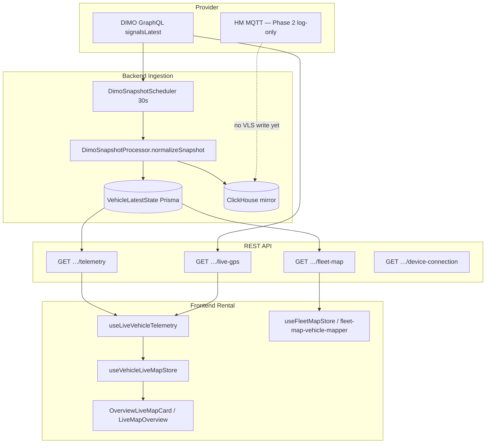

# Vehicle Detail Page — Telemetry Nullability Audit

| Feld | Wert |
|------|------|
| **Audit-Datum** | 2026-07-24 |
| **Prompt** | 9/36 — Nullable Telemetrie End-to-End |
| **Vorgänger** | [`vehicle-detail-page-status-remediation-2026-07.md`](./vehicle-detail-page-status-remediation-2026-07.md) |
| **Scope** | Provider → Backend → API → Frontend Store/Hook → Vehicle Detail UI → Live Map |

---

## Ziel

Vollständige Inventur des Telemetrie-Datenflusses mit Fokus auf **fehlende Werte vs. echte Nullwerte**. In diesem Prompt: dokumentieren, Semantik definieren, Tests ergänzen — **keine vollständige Migration aller Call-Sites**.

### Ziel-Semantik (kanonisch)

| Zustand | Bedeutung | UI |
|---------|-----------|-----|
| `null` / `undefined` / invalid | Signal nie empfangen oder nicht verfügbar | `—`, neutraler Ton, kein Warn-Badge |
| `0` | Gemessener Wert (leerer Tank, stehendes Fahrzeug, 0 km) | Literal `0`, `0 %`, `0 km/h` |
| Stale signal (`!isFresh`) | Letzter Wert nicht vertrauenswürdig | Display-Felder `null` (Interpreter), nicht Legacy-`0` |

**Regel:** An API→UI-Grenzen **kein** `?? 0` / `|| 0` für Skalare.

---

## Architektur-Übersicht

**Produktionspfad Live-UI:** DIMO → BullMQ Snapshot → `VehicleLatestState` → `/telemetry` + `/live-gps` → `useLiveVehicleTelemetry` → `useVehicleLiveMapStore` → Vehicle Detail Overview Map/HUD.

**Besserer Null-Pfad (bereits gehärtet):** `/fleet-map` → `deriveFleetStatusContext` → `odometerKm` / `fuelPercent` / `evSoc` nullable.

---

## Pipeline-Stufen

| Stufe | Datei(en) | Null-Verhalten |
|-------|-----------|----------------|
| Provider Adapter | `dimo-snapshot.processor.ts` `normalizeSnapshot` | `numVal()` → `number \| null` ✓ |
| DB | `schema.prisma` `VehicleLatestState` | Alle Skalare `Float?` ✓ |
| Fleet Derivation | `vehicles.service.ts` `deriveFleetStatusContext` | `odometerKm`, `fuelPercent`, `evSoc` nullable ✓ |
| State Interpreter | `vehicle-state-interpreter.ts` | `displaySpeed/Coolant/EngineLoad` null wenn stale ✓ |
| `/telemetry` Response | `vehicles.service.ts` `getVehicleWithTelemetry` | **Legacy-Felder `?? 0`** ✗ |
| `/live-gps` | `getLiveGps` | lat/lng/speed nullable ✓ |
| `/fleet-map` | `getFleetMapData` | Canonical nullable + legacy zeros |
| Frontend Hook | `useLiveVehicleTelemetry.ts` | **Coercion zu 0** ✗ |
| Live Store Type | `LiveTelemetrySnapshot` | **Non-nullable `number`** ✗ |
| Fleet Mapper | `fleet-map-vehicle-mapper.ts` | Canonical nullable; legacy `odometer ?? 0` |
| Overview HUD | `OverviewLiveMapCard.tsx` | **`?? 0` für Fuel/Battery** ✗ |

---

## Feld-Matrix

Legende: **Quelle** = primäres DIMO-Signal / DB-Spalte. **Einheit** = Anzeige-Einheit. **Rundung** = kanonisch. **Semantik** = Zielverhalten.

### Geschwindigkeit (`speedKmh`)

| Aspekt | Wert |
|--------|------|
| DB | `VehicleLatestState.speedKmh` `Float?` |
| DIMO | `signals.speed` |
| Einheit | km/h |
| Rundung | UI: ganzzahlig (`Math.round`) |
| Messzeitpunkt | `lastSeenAt` / Signal-Timestamp im `rawPayloadJson` |
| Semantik | `null` = unbekannt; `0` = stehend; stale → `displaySpeed: null` |

| Stufe | Konvertierung | Problem |
|-------|---------------|---------|
| Ingest | `numVal(signals.speed)` | ✓ |
| `/telemetry` | `state?.speedKmh ?? 0` | **T-01** fehlend → 0 |
| Interpreter (fresh) | `raw.speedKmh ?? 0` für Logik; `displaySpeed: speed` | **T-02** null speed → 0 für MOVING/IDLE |
| Hook | `typeof data.speed === 'number' ? data.speed : 0` | **T-03** |
| Store | `LiveTelemetrySnapshot.speed: number` | **T-04** Typ erzwingt 0 |
| Live Map | `speedKmh ?? 0` in Animation | **T-05** Map-Animation only |
| `/live-gps` | `speedKmh` nullable | ✓ |

---

### Kilometerstand (`odometerKm`)

| Aspekt | Wert |
|--------|------|
| DB | `VehicleLatestState.odometerKm` `Float?` |
| DIMO | `powertrainTransmissionTravelledDistance` |
| Einheit | km |
| Rundung | `Math.floor` (Fleet); UI ganzzahlig |
| Semantik | `null` = nie gemeldet; `0` = gültig; **kein** Fallback auf `vehicle.mileageKm` in Live-UI |

| Stufe | Konvertierung | Problem |
|-------|---------------|---------|
| Fleet | `deriveFleetStatusContext` floors, nullable | ✓ |
| `/telemetry` | `state?.odometerKm ?? vehicle.mileageKm ?? 0` | **T-06** statischer Fallback |
| `mapToVehicleData` | `odometerKm` nullable; legacy `odometer ?? 0` | **T-07** dual |
| Fleet mapper | `odometer: odometerKm ?? 0` | **T-08** |
| Hook/Store | `odometer: … ?? 0` | **T-09** |
| Overview HUD | `hudSnapshot?.odometer ?? selectedVehicle.odometer` | **T-10** legacy chain; zeigt 0 statt — |
| Fleet display | `formatOdometer(odometerKm)` → null → kein Label | ✓ |

---

### Tankstand (`fuelPercent` / `fuelLevelRelative` / `fuelLevelAbsolute`)

| Aspekt | Wert |
|--------|------|
| DB | `fuelLevelRelative`, `fuelLevelAbsolute` `Float?` |
| DIMO | `powertrainFuelSystemRelativeLevel`, `powertrainFuelSystemAbsoluteLevel` |
| Einheit | % (0–100) oder Liter → % via `resolveFuelPercent` |
| Rundung | `Math.ceil` in `resolveFuelPercentOrNull` |
| Semantik | `null` = kein Sensor / nie gemeldet; `0` = leerer Tank |

| Stufe | Konvertierung | Problem |
|-------|---------------|---------|
| Fleet | `resolveFuelPercentOrNull` | ✓ |
| `/telemetry` | `resolveFuelPercent` → `0` wenn kein State | **T-11** |
| Hook/Store/HUD | `fuel: … ?? 0`, HUD `?? selectedVehicle?.fuel ?? 0` | **T-12** |

---

### Ladezustand / SOC (`evSoc`)

| Aspekt | Wert |
|--------|------|
| DB | `VehicleLatestState.evSoc` `Float?` |
| DIMO | Battery mapper `mapDimoBatterySignals` |
| Einheit | % (0–100) |
| Rundung | `Math.ceil`, clamp [0, 100] |
| Semantik | `null` = unbekannt; `0` = leer |

| Stufe | Konvertierung | Problem |
|-------|---------------|---------|
| Fleet | nullable + clamp | ✓ |
| `/telemetry` | `state?.evSoc ?? 0` | **T-13** |
| Hook/HUD | `battery ?? 0` | **T-14** |
| Battery Health HV | separater API-Pfad, nullable | ✓ |

---

### Reichweite (`rangeKm`)

| Aspekt | Wert |
|--------|------|
| DB | `VehicleLatestState.rangeKm` `Float?` |
| DIMO | `powertrainTractionBatteryRange` |
| Live Vehicle API | **Nicht exponiert** auf `/telemetry` oder `/fleet-map` |
| UI | Battery Health Detail `hv.telemetry.rangeKm` nullable | ✓ |

**Gap G-01:** Live Vehicle Detail hat keinen Range-Kanal; nur Battery-Health-Modul.

---

### 12-V-Spannung (`lvBatteryVoltage`)

| Aspekt | Wert |
|--------|------|
| DB | `VehicleLatestState.lvBatteryVoltage` `Float?` |
| DIMO | Battery mapper |
| Einheit | V |
| Rundung | 1 Dezimalstelle in Health UI |
| Semantik | `null` = unbekannt; `0` = theoretisch möglich, selten |

| Stufe | Konvertierung | Problem |
|-------|---------------|---------|
| `/telemetry` | `?? 0` | **T-15** |
| Hook/Store | `?? 0` | **T-16** |
| `VehicleHealthBoxWired` | `snapshot?.lvBatteryVoltage ?? null` | ✓ wenn Store null hätte |

---

### Motorlast (`engineLoad`)

| Aspekt | Wert |
|--------|------|
| DB | `VehicleLatestState.engineLoad` `Float?` |
| DIMO | `obdEngineLoad` |
| Einheit | % |
| UI Vehicle Detail | nicht im Overview HUD; Trips/Interpreter |

| Stufe | Konvertierung | Problem |
|-------|---------------|---------|
| `/telemetry` | `?? 0` | **T-17** |
| Interpreter | `raw.engineLoad ?? 0` für IDLE-Logik; `displayEngineLoad: raw.engineLoad` | **T-18** null→0 nur für Zustandsmaschine |
| Hook | `?? 0` | **T-19** |

---

### Kühlmitteltemperatur (`coolantTempC`)

| Aspekt | Wert |
|--------|------|
| DB | `VehicleLatestState.coolantTempC` `Float?` |
| DIMO | `powertrainCombustionEngineECT` |
| Einheit | °C |
| Semantik | stale → `displayCoolant: null` |

| Stufe | Konvertierung | Problem |
|-------|---------------|---------|
| `/telemetry` | `coolant: state?.coolantTempC ?? 0` | **T-20** |
| Interpreter | `displayCoolant: raw.coolantTempC` when fresh | ✓ |
| Hook legacy field | `?? 0` | **T-21** |

---

### Außentemperatur

| Aspekt | Wert |
|--------|------|
| Live VLS | **Nicht vorhanden** |
| Trips | `outsideTemperatureStartC` auf Trip-Records |
| Battery LV | `ambientTemperatureC` aus Health-Modul |

**Gap G-02:** Kein Live-Außentemperatur-Signal im Vehicle-Detail-Telemetriepfad.

---

### Batterietemperatur HV (`tractionBatteryTemperatureC`)

| Aspekt | Wert |
|--------|------|
| DB | `VehicleLatestState.tractionBatteryTemperatureC` `Float?` |
| Live APIs | nicht auf `/telemetry` exponiert |
| Battery Health | `hv.telemetry.temperatureC` nullable | ✓ |

**Gap G-03:** Live Overview zeigt HV-Temperatur nicht; nur Battery-Health-Detail.

---

### GPS-Koordinaten (`latitude`, `longitude`)

| Aspekt | Wert |
|--------|------|
| DB | `Float?` |
| DIMO | `currentLocationCoordinates` |
| `/telemetry` | nullable; DIMO-Fetch wenn live-tracking | ✓ |
| `/live-gps` | nullable + cache fallback | ✓ |
| Hook | Bounds-Check vor Apply | ✓ |
| Overview | `deriveOverviewMapPosition` Modi | ✓ |

---

### Heading

| Aspekt | Wert |
|--------|------|
| DB Fleet Map | aus `rawPayloadJson` extrahiert, nullable |
| Live GPS | **Client-seitig** `stableHeadingDeg` aus Positionshistorie |
| Fleet Map GeoJSON | `heading ?? 0` | **T-22** null → Norden |
| Live Map | `heading ?? 0` in Marker-Update | **T-23** |

**Semantik:** `null` = unbekannte Ausrichtung; `0` = gültig nach Norden — nicht vermischen.

---

### GPS Accuracy

**Gap G-04:** Kein `horizontalAccuracy` / `gpsAccuracy` im gesamten Pipeline-Stack.

---

### Device Connection

| Aspekt | Wert |
|--------|------|
| Backend | OBD plug episodes, `device-connection` API |
| UI | `VehicleDeviceConnectionCard`, `ObdUnpluggedBadge` |
| Typ | Episoden-basiert, nicht Skalar-Telemetrie | ✓ |

---

### Letzte Aktualisierung

| Feld | Semantik |
|------|----------|
| `lastSeenAt` (DB) | Provider-Observation |
| `sourceTimestamp` / `providerFetchedAt` | Provenance |
| `lastSignal` (API) | ISO aus Interpreter |
| `signalAgeMs` | `now - lastSeenAt` |
| Store init | `signalAgeMs: 0`, `lastSignal: ''` | **T-24** pre-fetch wirkt „frisch“ |

---

## Konvertierungs-Register (alle `?? 0` / `|| 0` Hotspots)

| ID | Datei | Zeile(n) | Feld | Aktuell | Ziel |
|----|-------|---------|------|---------|------|
| T-01 | `vehicles.service.ts` | ~1708 | speed | `?? 0` | `null` |
| T-02 | `vehicle-state-interpreter.ts` | ~114–116 | speed/engineLoad | `?? 0` für Logik | dokumentiert; display null wenn raw null |
| T-03 | `useLiveVehicleTelemetry.ts` | ~150–181 | alle Legacy-Felder | `: 0` | nullable snapshot |
| T-04 | `useVehicleLiveMapStore.ts` | `LiveTelemetrySnapshot` | alle | `number` | `number \| null` |
| T-05 | `LiveMapOverview.tsx` | ~179–180 | speed/heading | `?? 0` | Animation-only; OK mit Vorsicht |
| T-06 | `vehicles.service.ts` | ~1709 | odometer | `?? mileageKm ?? 0` | `null` |
| T-07 | `vehicles.service.ts` | ~845–892 | legacy odometer/fuel | `?? 0` | deprecate legacy |
| T-08 | `fleet-map-vehicle-mapper.ts` | ~273–280 | odometer/fuel/battery/speed | `?? 0` | canonical only |
| T-09 | `useLiveVehicleTelemetry.ts` | ~180 | odometer | `?? 0` | `null` |
| T-10 | `OverviewLiveMapCard.tsx` | ~95–103 | fuel/battery/odometer | `?? 0` | `telemetry-field-semantics` formatters |
| T-11 | `vehicles.service.ts` | `resolveFuelPercent` | fuel | returns 0 | use `OrNull` on `/telemetry` |
| T-12–14 | Hook + HUD | fuel/battery | `?? 0` | nullable |
| T-15–21 | `/telemetry` + Hook | LV/coolant/engine | `?? 0` | `null` |
| T-22–23 | `fleetVisualState.ts`, `MapboxMap.tsx` | heading | `?? 0` | `null` + hide rotation |
| T-24 | `useVehicleLiveMapStore.ts` | init | signalAgeMs | `0` | `null` oder MAX_SAFE |

**Positiv (bereits korrekt):**

- `normalizeSnapshot` `numVal()` null-preserving
- `deriveFleetStatusContext` + Tests in `vehicles.service.spec.ts`
- `resolveFuelPercentOrNull`
- `interpretVehicleState` stale → display nulls
- `getLiveGps` nullable
- `formatOdometer` / `canonicalEnergyPercent` in `fleetVehicleDisplay.ts`
- `resolveVehicleOdometerKm` in `handoverVehicleTelemetry.ts` (treats 0 odometer as missing for handover — bewusst)

---

## Korrekte Semantik je Feld (Zielvertrag)

Implementiert in `frontend/src/rental/lib/telemetry-field-semantics.ts`:

| Feld | Parser | Formatter | Missing | Zero |
|------|--------|-----------|---------|------|
| speedKmh | `parseTelemetryNumber` | `formatTelemetrySpeedKmh` | — | 0 km/h |
| odometerKm | `parseTelemetryNumber` + `floorOdometerKm` | `formatTelemetryInteger` | — | 0 km |
| fuelPercent | `parseTelemetryNumber` + `clampPercent` | `formatTelemetryPercent` | — | 0 % |
| evSocPercent | `parseTelemetryNumber` + `clampPercent` | `formatTelemetryPercent` | — | 0 % |
| rangeKm | `parseTelemetryNumber` | `formatTelemetryRangeKm` | — | 0 km |
| lvBatteryVoltage | `parseTelemetryNumber` | `formatTelemetryVoltage` | — | 0.0 V |
| engineLoadPercent | `parseTelemetryNumber` | `formatTelemetryPercent` | — | 0 % |
| coolantTempC | `parseTelemetryNumber` | `formatTelemetryTemperatureC` | — | 0 °C |
| latitude/longitude | bounds check | map position modes | no marker | valid 0,0 |
| heading | nullable number | hide bearing if null | no rotation | 0° = north |
| lastSignal | ISO string / empty | freshness resolver | — / no_signal | N/A |

**Energy-Anzeige Overview:** `resolveEnergyPercentForDisplay({ isElectric, fuelPercent, evSocPercent })` — ein Kanal, nullable.

---

## Neue Tests (Prompt 9)

| Suite | Datei | Abdeckung |
|-------|-------|-----------|
| Feld-Semantik | `telemetry-field-semantics.test.ts` | missing vs 0, Formatter, legacy coercion detector |
| State Interpreter | `vehicle-state-interpreter.spec.ts` | stale nulls display; fresh zero speed |
| Fleet derivation | `vehicles.service.spec.ts` | bereits `null-preserving telemetry` |
| Ziel-Mapper | `mapTelemetryDashboardResponseToNullableSnapshot` | API `{}` → all null; explicit zeros preserved |
| Legacy-Vergleich | `mapTelemetryDashboardResponseLegacyCoerced` | dokumentiert Hook-Verhalten |

**Noch nicht migriert (bewusst):** `useLiveVehicleTelemetry`, `/telemetry` Response-Shape, `LiveTelemetrySnapshot` Typ, `OverviewLiveMapCard` HUD.

---

## Migrations-Reihenfolge (Follow-up Prompts)

1. `/telemetry` Response: nullable Felder + `display*` beibehalten; Legacy-Felder deprecaten
2. `LiveTelemetrySnapshot` → `NullableLiveTelemetrySnapshot`; Hook auf `mapTelemetryDashboardResponseToNullableSnapshot`
3. `OverviewLiveMapCard` Formatter aus `telemetry-field-semantics`
4. `fleet-map-vehicle-mapper` legacy `odometer/fuel/battery/speed` zeros entfernen
5. Heading: nullable in Mapbox/Fleet GeoJSON
6. `rangeKm`, `tractionBatteryTemperatureC` optional auf `/telemetry` exposen

---

## HM / ClickHouse Hinweise

| Pfad | Status |
|------|--------|
| HM MQTT → VLS | Phase 2 — log only, **kein** Live-UI-Feed |
| ClickHouse `telemetry_snapshots` | Analytics / HF; nicht Vehicle Detail Live |
| ClickHouse ingest | `(speedKmh ?? 0) > 2` für Bewegung — **nur Analytics** |

---

## Zusammenfassung

| Kategorie | Anzahl |
|-----------|--------|
| Dokumentierte Konvertierungs-Hotspots (T-01–T-24) | 24 |
| Coverage-Gaps (G-01–G-04) | 4 |
| Felder mit korrektem Fleet-null-Pfad | odometerKm, fuelPercent, evSoc |
| Haupt-Regressionsrisiko | `/telemetry` + Hook + Store erzwingen 0 für fehlende Signale |
| In diesem Prompt geändert | Audit-Doc + Semantik-Modul + Tests (keine Massen-Migration) |

**SynqDrive Code → Changes / Architektur:** nicht aktualisiert (externes Workspace; In-Repo-Audit-Dokumentation).
